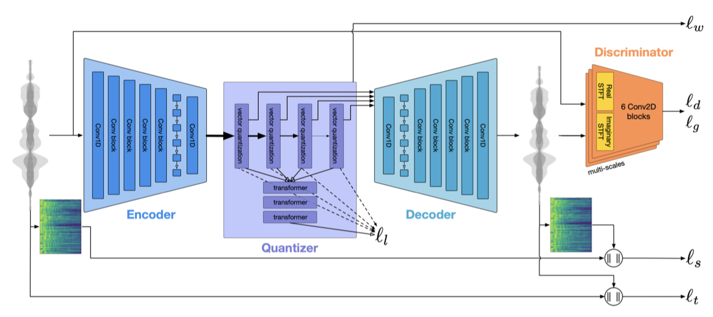
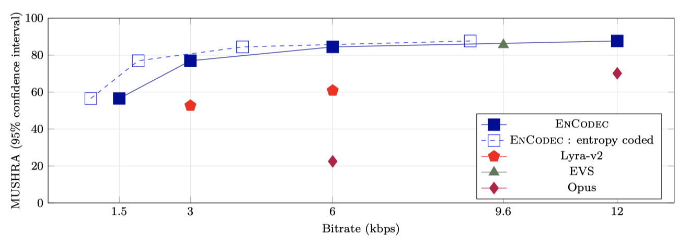
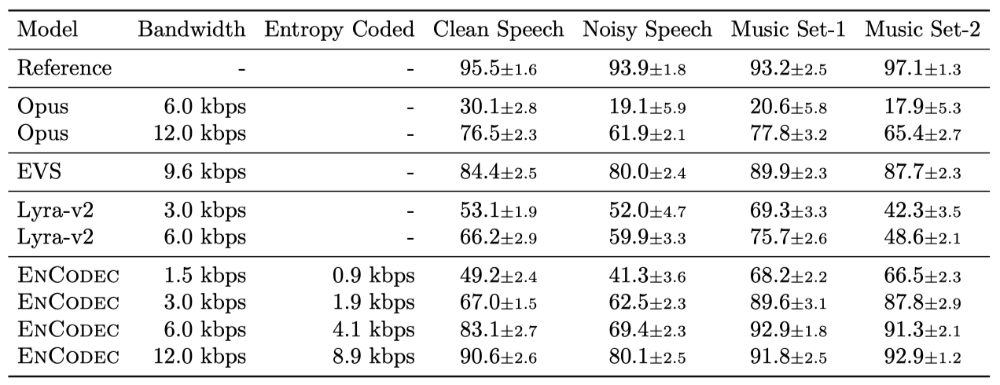
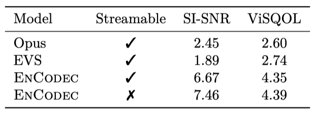
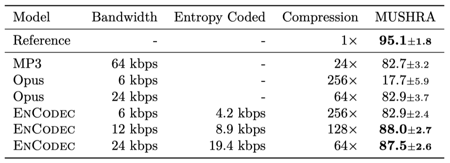

+++
author = "Kurt"
title = "EnCodec"
date = "2024-02-09"
description = "High Fidelity Neural Audio Compression"
categories = [
    "Paper Review"
]
tags = [
    "Audio",
    "Codec"
]
+++

## Abstract

neural network를 활용한 state-of-the-art real-time, high-fidelity, audio codec을 소개한다. 이는 아티팩트를 효율적으로 줄이고 고품질 샘플을 생성하는 스트리밍 encoder-decoder 구조이다. 학습을 안정화하기 위해 loss balancer mechanism을 도입하였으며, lightweight Transformer 모델을 사용하여 얻은 표현을 최대 40%까지 더 압축하는 방법을 연구하였다. 이 모델은 말하기, 소음이 많은 반향성 말하기, 음악 등 다양한 오디오 도메인에서 우수한 성능을 보여주었다.

---

## Introduction

2021년에 스트리밍 오디오와 비디오가 인터넷 트래픽의 82%를 차지했고, 이런 트렌드는 오디오 압축의 중요성을 강조한다. 손실 압축은 샘플의 비트레이트와 왜곡을 최소화하는 것을 목표로 한다. 오디오 codec은 중복성을 제거하고 컴팩트한 비트 스트림을 생성하기 위해 encoder와 decoder를 결합한다. neural network를 활용한 encoder-decoder 메커니즘은 오디오 신호에 중점을 둔 연구의 일환으로서 탐구되어 왔다.

lossy neural compression 모델에서는 두 가지 문제가 발생한다. 첫 번째는 학습 세트를 과적합하지 않고, 아티팩트가 많은 오디오를 생성하지 않도록 다양한 신호를 표현해야 하는 것이다. 이를 위해 다양한 학습 세트와 perceptual 손실로 작용하는 discriminator network를 사용하였다. 두 번째 문제는 계산 시간과 크기를 모두 고려하여 효율적으로 압축하는 것이다.

실시간으로 단일 CPU 코어에서 작동하는 모델에 제한을 두며, neural encoder의 출력에 대한 residual vector quantization를 사용하여 효율적으로 압축한다. 이에 대한 여러 방법이 이전의 연구에서 제안되었다.

end-to-end neural compression 모델 설계가 encoder-decoder 아키텍처, quantization 방법, perceptual 손실 등을 포함한 선택의 집합이라고 주장한다. 이 모델의 평가는 객관적인 방법과 인간의 인식에 의존하는 방법 두 가지를 사용하였고, 이를 통해 이 모델이 음성과 음악 압축에서 state-of-the-art를 달성하였음을 확인하였다.

---

## Related Work

**Speech and Audio Synthesis.** 최근의 neural audio generation 기술 발전은 컴퓨터가 효율적으로 자연스러운 오디오를 생성하도록 하였다. autoregressive 모델인 WaveNet이 초기 성공을 거뒀지만, 추론 속도가 느렸다. 여러 다른 방법이 탐색되었지만, 특히 Generative Adversarial Network (GAN) 기반의 방법이 주목 받았다. 이들은 다양한 adversarial network를 결합하여 더 빠른 속도로 autoregressive 모델의 품질을 달성하였다. 이 연구는 이러한 adversarial 손실을 활용하고 확장하여 오디오 생성 중의 아티팩트를 줄이는 데 초점을 맞추고 있다.

**Audio Codec.** 낮은 비트레이트의 음성과 오디오 codec에 대한 연구가 오랫동안 이루어졌지만, 품질은 제한적이었다. excitation signal을 모델링하는 것은 여전히 어려운 과제로 남아 있다. 현재 state-of-the-art인 전통적인 오디오 codec은 Opus와 Enhanced Voice Service (EVS)로, 다양한 비트레이트, 샘플링 레이트, 실시간 압축을 지원하며 높은 코딩 효율성을 보여준다.

최근에 제안된 neural based audio codec은 놀라운 결과를 보여주었다. 대부분의 방법들은 latent space를 quantizing한 후 decoder에 입력하는 방식을 사용하였다. 여러 연구들에서 다양한 접근법이 시도되었으며, 가장 관련성이 높은 연구로는 SoundStream 모델이 있다. 이 모델은 Residual Vector Quantization layer를 포함하는 fully convolutional encoder-decoder 아키텍처를 제안하였고, reconstruction 손실과 adversarial perceptual 손실 모두를 사용하여 최적화하였다.

**Audio Discretization.** 최근에는 discrete 값으로 오디오와 음성을 표현하는 방법이 다양한 작업에 적용되었다. raw 오디오의 discrete 표현을 학습하기 위한 계층적 VQ-VAE 기반 모델은 고품질 음악 생성을 가능하게 했고, 음성에 대한 self-supervised 학습 방법이 conditional 및 unconditional 음성 생성에 사용되었다. 이러한 방법은 음성 재합성, 음성 감정 변환, 대화 시스템, 음성-음성 번역 등의 분야에도 적용되었다.

---

## Model

오디오 신호의 기간이 $d$라면, 이 신호는 $x \in [−1, 1]^{C_a \times T}$ 시퀀스로 표현될 수 있다. 여기서 $C_a$는 오디오 채널의 수이고, $T = d \cdot f_{sr}$는 주어진 샘플 비율 $f_{sr}$에서의 오디오 샘플 수이다.

EnCodec 모델은 오디오 신호를 처리하는 세 가지 주요 요소로 구성된다. 첫째, encoder 네트워크 $E$는 오디오를 latent representation $z$로 변환한다. 둘째, quantization layer $Q$는 vector quantization 를 이용해 압축된 표현 $z_q$를 생성한다. 셋째, decoder 네트워크 $G$는 compressed latent representation $z_q$을 원래의 시간 도메인 신호 $x$로 재구성한다. 이 시스템은 시간과 주파수 도메인에서의 reconstruction 손실 최소화를 목표로 학습되며, 이 과정에는 다른 해상도에서 작동하는 판별자의 discriminator 손실이 포함된다.

### Encoder & Decoder Architecture

EnCodec 모델은 streaming과 convolutional-based encoder-decoder 구조로, latent representation에 순차적 모델링을 적용한다. 이 구조는 다양한 오디오 작업에서 뛰어난 성과를 보였으며, source separation, enhancement, neural vocoder, audio codec, artificial bandwidth extension 등에 활용되었다. 이 모델은 24 kHz와 48 kHz 오디오에 동일하게 적용된다.

**Encoder-Decoder.** EnCodec의 encoder 모델 $E$는 1D convolution과 여러 convolution block으로 구성된다. 각 block은 residual unit과 strided convolution으로 이루어진 down-sampling layer를 포함하며, down-sampling이 있을 때마다 채널 수가 두 배씩 증가한다. 이어서 시퀀스 모델링을 위한 LSTM 계층과 1D convolution layer가 뒤따른다. 이 모델은 low-latency streamable과 high fidelity non-streamable에 따라 두 가지 변형으로 사용된다. encoder는 24 kHz에서 초당 75개, 48 kHz에서는 초당 150개의 latent step을 출력하며, decoder는 이를 받아 최종 오디오를 생성한다.

**Non-streamable.** non-streamable 설정에서는 각 convolution에 대해 총 패딩 $K - S$를 사용하고, 입력을 1초 청크로 분할한다. 10ms의 오버랩을 통해 클릭을 방지하고, 각 청크를 모델에 공급하기 전에 normalization한다. decoder의 출력에 inverse operation을 적용하고, 스케일 전송에 대한 negligible bandwidth overhead를 최소화한다. layer normalization를 사용하여 상대적인 스케일 정보를 유지한다.

**Streamable.** streamable 설정에서는 모든 패딩을 첫 번째 시간 단계 전에 배치한다. 스트라이드가 있는 transposed convolution을 사용하여, 처음 $s$ 시간 단계를 출력하고, 다음 프레임이 준비되면 나머지를 완성하거나, 스트림 끝에서 버린다. 이 패딩 방식 덕분에 모델은 첫 320 샘플을 받자마자 320 샘플을 출력할 수 있다. 또한, streamable 설정에 부적합한 layer normalization 대신 weight normalization를 사용한다. 이렇게 normalization을 유지함으로써 목표 지표에서 약간의 향상을 얻었다.

### Residual Vector Quantization

encoder의 출력을 quantize 하기 위해 Residual Vector Quantization (RVQ)을 사용한다. Vector quantization는 입력 벡터를 코드북의 가장 가까운 항목에 투영하는 것이며, RVQ는 이를 개선하여 quantization 후의 residual을 계산하고 추가로 quantizing 한다.

Dhariwal et al. 과 Zeghidour et al. 이 설명한 학습 절차를 따르며, 각 입력에 대한 코드북 항목을 exponential moving average을 사용해 업데이트한다. 사용되지 않는 항목은 현재 batch에서 샘플링된 후보로 대체된다. encoder의 기울기를 계산하기 위해 straight-through-estimator를 사용하고, quantizer의 입력과 출력 사이의 MSE로 구성된 commitment 손실을 전체 학습 손실에 추가한다.

학습 시간에 residual step의 수를 조절하여, 단일 모델이 multiple bandwidth 목표를 지원할 수 있다. 모든 모델은 최대 32개(48 kHz 모델은 16개)의 코드북을 사용하며, 각 코드북은 1024개의 항목을 가진다. variable bandwidth 학습 시, 4의 배수로 코드북의 수를 무작위로 선택한다. 이렇게 하여, encoder에서 나오는 continuous latent represention을 discrete set of index로 변환하고, 이를 decoder로 들어가기 전에 다시 벡터로 변환한다.

### Language Modeling and Entropy Coding

실시간보다 빠른 compression/decompression을 목표로, small Transformer 기반 언어 모델을 학습시킨다. 모델은 5개 layer, 8개 head, 200개 channel, feed-forward block의 800 dimension을 가진다. 학습 시, bandwidth과 해당 코드북의 수를 선택하고, 시간 단계별로 discrete representation을 continuous representation으로 변환한다. Transformer의 출력은 linear layer에 공급되어 각 코드북에 대한 estimated distribution의 logit을 제공한다. 이 방법은 코드북간의 잠재적 정보를 무시하면서도 추론을 가속화합니다. 모델은 5초 시퀀스에서 훈련됩니다.

**Entropy Encoding.** 언어 모델로부터 얻은 추정 확률을 활용하기 위해, range based arithmetic coder를 사용한다. 다른 아키텍처나 floating point approximation으로 인해 동일한 모델의 평가가 다르게 나올 수 있어 디코딩 오류가 발생할 수 있다. 특히, batch 평가와 real-life streaming 평가 사이에는 큰 차이가 있을 수 있다. 따라서 추정 확률을 $10^{-6}$의 정밀도로 반올림하며, 총 범위 너비를 $2^{24}$로, 최소 범위 너비를 $2$로 설정한다. 처리 시간에 미치는 영향에 대해서는 추후 논의하고자 한다.

### Training objective

reconstruction 손실, perceptual 손실 (via discriminators), 그리고 RVQ commitment 손실을 결합한 학습 목표를 상세히 설명한다.

**Reconstruction Loss.** reconstruction loss term은 시간 도메인과 주파수 도메인의 손실 항으로 이루어진다. 시간 도메인에서는 목표 오디오와 압축 오디오 사이의 L1 거리를 최소화하고, 주파수 도메인에서는 mel-spectrogram에서의 L1과 L2 손실의 선형 조합을 사용한다.

$$ l_f(x, \hat{x}) = {{1}\over{|\alpha| \cdot |s|}} \sum_{\alpha_i \in \alpha} \sum_{i \in e} \parallel S_i(X) - S_i(\hat{x}) \parallel_1 + \alpha \parallel S_i(X) - S_i(\hat{x}) \parallel_2 $$

$S_i$는 window size가 $2^i$ 이고 hop length가 $2^i/4$인 normalized STFT를 사용한 64-bins mel-spectrogram이다. $e = 5, ..., 11$은 스케일의 집합을 나타내고, $\alpha$$는 L1과 L2 항 사이의 균형을 맞추는 스칼라 계수의 집합이다. 단, 이 논문에서는 $\alpha_i = 1$을 선택하였다.

**Discriminative Loss.** 생성된 샘플의 품질을 향상시키기 위해, multi-scale STFT-based (MS-STFT) discriminator에 기반한 perceptual 손실 항을 도입하였다. 이 discriminator는 audio signal의 다양한 구조를 포착하도록 설계되었으며, 복소수 값을 가진 multi-scale STFT에서 작동하는 동일 구조의 네트워크로 구성되어 있다. 각 하위 네트워크는 2D convolutional layer, 팽창율이 증가하는 2D convolution, 그리고 주파수 축에서 스트라이드를 가지고 있다. 이 discriminator는 STFT window length가 다양한 5개의 스케일을 사용하며, 오디오의 샘플링 레이트에 따라 window size를 조정한다. LeakyReLU 활성화 함수와 weight normalization을 사용한다.

generator에 대한 adversarial 손실은 discriminator의 수(K)에 따라 구성되며, 이는 $l_g(\hat{x}) = {{1}\over{K}} \sum_k max(0, 1 − D_k(\hat{x}))$ 공식으로 표현된다. 또한, 이전 neural vocoder 연구와 같이, generator에 대한 상대적 특징 매칭 손실을 추가적으로 포함한다.

$$ l_{feat}(x, \hat{x}) = {{1}\over{KL}} \sum_{k = 1}^K \sum_{l = 1}^L {{\parallel D_k^l(x) - D_k^l(\hat{x}) \parallel_1}\over{mean(\parallel D_k^l(x) \parallel_1)}} $$

평균은 모든 차원에서 계산되며, discriminator들은 hinge 손실 adversarial 손실 함수를 최소화하는 것을 목표로 한다. discriminator가 decoder를 쉽게 압도하는 경향이 있으므로, 24 kHz에서는 2/3의 확률로, 48 kHz에서는 0.5의 확률로 discriminator의 가중치를 업데이트한다.

**Multi-bandwidth training.** 24kHz와 48kHz에서 모델은 각각 다양한 bandwidth을 지원하도록 학습된다. 이 과정에서 RVQ step에서의 코드북 선택이 중요하며, 특정 bandwidth에 대해 전용 discriminator를 사용하면 오디오 품질이 향상된다. 이렇게 선택된 bandwidth은 entire batch에 적용되며, 해당 discriminator만 업데이트 된다.

**VQ commitment loss.** encoder 출력과 양자화된 값 사이에 commitment 손실 $l_w$를 추가한다. 각 residual step $c \in \lbrace 1, ..., C \rbrace$에서, 현재 residual과 코드북 $q_c(z_c)$ 의 가장 가까운 항목을 이용해 $l_w$를 정의한다. 이때, residual step의 수는 현재 batch의 bandwidth 목표에 따라 달라진다.

$$ l_w = \sum_{c = 1}^{C} \parallel z_c - q_c(z_c) \parallel_2^2 $$

전반적으로, generator는 batch를 합산한 다음 손실을 최적화하도록 학습된다.

$$ L_G = \lambda_t \cdot l_t(x, \hat{x}) + \lambda_f \cdot l_f(x, \hat{x}) + \lambda_g \cdot l_g(\hat{x}) + \lambda_{feat} \cdot l_{feat}(x, \hat{x}) + \lambda_w \cdot l_w(w) $$

여기서 $\lambda_t, \lambda_f, \lambda_g, \lambda_{feat}, \lambda_w$는 각 항목들 사이의 균형을 맞추기 위한 스칼라 계수들이다.

**Balancer.** discriminator로부터 나오는 gradient의 varying scale을 안정화시키기 위해 손실 balancer가 도입되었다. 이는 다른 손실 가중치를 더 쉽게 이해할 수 있게 돕는다. 모델의 출력에만 의존하는 손실들을 고려하고, 이들의 exponential moving average $g_i = {{\delta l_i}\over{\delta \hat{x}}},\langle \parallel g_i \parallel_2 \rangle\_{\beta}$를 정의한다. 주어진 weight 집합 $(\lambda_i)$와 reference norm $R$에 따라, 이를 정의한다.

$$ \tilde{g}_i = R {{\lambda_i}\over{\sum_j \lambda_j}} \cdot {{g_i}\over{\langle \parallel g_i \parallel_2 \rangle\_{\beta}}} $$

원래의 gradient 대신 수정된 gradient를 네트워크로 backpropaga한다. 이로 인해 최적화 문제는 변화하지만, 각 손실 스케일에 상관없이 가중치를 해석할 수 있게 한다. 만약 가중치의 합이 1이라면, 각 가중치는 해당 손실로부터 모델 gradient의 비율로 해석될 수 있다. 모든 discriminator 손실은 balancer를 통해 적용되지만, commitment 손실은 모델 출력에 대해 정의되지 않아 제외된다.

---

## Experiments and Results

### Dataset

EnCodec은 다양한 도메인의 24kHz 모노포닉 오디오에 대해 학습되며, fullband 스테레오 EnCodec는 48kHz 음악에 대해 학습된다. 음성에 대해서는 DNS 챌린지 4와 Common Voice 데이터셋을, 일반 오디오에 대해서는 AudioSet과 FSD50K를, 음악에 대해서는 Jamendo 데이터셋을 사용한다. 추가로 소유한 음악 데이터셋을 사용하여 모델을 평가한다. 

학습과 검증을 위해, 단일 소스 샘플링 또는 여러 소스 혼합을 포함하는 혼합 전략을 사용한다. 이는 네 가지 전략으로 나뉘는데, Jamendo에서 단일 소스를 샘플링하거나, 다른 데이터셋에서 단일 소스를 샘플링하거나, 모든 데이터셋에서 두 소스를 혼합하거나, 음악을 제외한 모든 데이터셋에서 세 소스를 혼합한다. 각 전략은 특정 확률로 실행된다.

오디오는 파일별로 정규화되며, 무작위 게인을 적용한다. 클리핑된 샘플은 제외하고, 일정 확률로 잔향을 추가한다. 테스트는 DNS에서의 깨끗한 음성, FSDK50K 샘플과 혼합된 음성, Jamendo 샘플, 소유한 음악 샘플 등 네 가지 카테고리를 사용한다.

### Baselines

Opus와 EVS라는 두 종류의 오디오 코덱을 기본 베이스라인으로 사용하며, 추가적으로 MP3 압축도 베이스라인으로 활용한다. 마지막으로, 업샘플링된 오디오에서 EnCodec와 비교하기 위해 SoundStream 모델을 사용한다. 또한 SoundStream 버전을 약간 개선하여 사용하였다. 이는 relative feature 손실과 layer normalization을 적용함으로써 오디오 품질을 향상시키는데 도움이 되었다. 

### Evaluation Methods

주관적 평가를 위해 MUSHRA 프로토콜을 따르며, 샘플의 지각 품질을 1부터 100까지 평가하는 주석 처리자를 모집하였다. 테스트 세트의 각 카테고리에서 무작위로 선택한 샘플에 대해 주석을 추가하였으며, 노이즈가 많은 주석과 이상치는 제거했다. 객관적 평가를 위해서는 ViSQOL과 SI-SNR를 사용하였다.

### Training

모든 모델은 Adam optimizer를 사용하여 300 epoch 동안 학습되고, 각 epoch는 1초당 64개의 예제로 구성된 batch로 2,000번의 업데이트를 포함한다. 모델은 8개의 A100 GPU를 사용하여 학습되며, 특정 가중치가 적용된 balancer를 사용한다. 가중치는 24kHz 모델의 경우 λt = 0.1, λf = 1, λg = 3, λfeat = 3 이고,  48kHz 모델은 서로 다른 가중치를 사용한다.

### Results

다양한 bandwidth을 가진 EnCodec의 결과를 베이스라인과 비교하였다. Gumbel-Softmax와 DiffQ와 같은 다른 양자화기를 탐색했지만, 이들이 비슷하거나 더 나쁜 결과를 보여주어 보고하지 않았다.

동일한 bandwidth을 고려하면, EnCodec는 모든 베이스라인보다 우수한 성능을 보여준다. 추가적인 언어 모델을 적용하면 bandwidth을 약 25-40% 줄일 수 있다. 하지만 높은 bandwidth에서는 압축 비율이 낮아지는 것을 관찰할 수 있는데, 이는 사용된 Transformer 모델의 크기가 작아서 모든 코드북을 함께 모델링하기 어렵기 때문일 수 있다.

#### Ablation study

다음으로, discriminator 설정, streaming, multitarget bandwidth, balancer의 효과를 더 잘 평가하기 위해 ablation 연구를 수행한다.

**The effect of discriminators setup.** 이전 연구에서는 생성된 오디오의 perceptual 품질을 향상시키기 위해 여러 discriminator를 제안하였다. Multi-Scale Discriminator(MSD) 모델은 다양한 해상도에서 raw waveform에 작용한다. Kong et al. 은 Multi-Period Discriminator(MPD) 모델을 추가로 제안했는데, 이는 waveform을 여러 주기를 가진 2D 입력으로 변환한다. 그리고 STFT Discriminator(Mono-STFTD) 모델은 complex-valued STFT에 작용하는 단일 네트워크이다.

MS-STFTD discriminator는 MSD+MonoSTFTD, MPD only, MS-STFTD only, MS-STFTD+MPD와 같은 세 가지 다른 설정과 비교되었다. 결과는 MS-STFTD와 같은 multi-scale STFT-based discriminator만을 사용하는 것이 오디오의 고품질을 생성하는 데 충분하며, 모델 학습을 단순화하고 학습 시간을 줄인다는 것을 보여준다. MPD 판별자를 추가하면 MUSHRA 점수가 약간 향상되었다.

**The effect of the streamable modeling.** streamable 설정과 non-streamable 설정을 비교한 결과, 예상대로 non-streamable 설정에서 streamable 설정으로 전환하면 성능이 약간 저하되지만, 스트리밍 추론이 가능해지면서도 성능이 강하게 유지된다.

**The effect of the balancer.** balancer의 영향을 평가하는 결과를 제시했다. balancer의 유무와 상관없이 다양한 값들을 고려하여 EnCodec 모델을 학습시켰고, 예상대로 balancer가 학습 과정을 크게 안정화시키는 것을 확인하였다.

#### Stereo Evaluation

이전의 모든 결과는 monophonic 설정만을 고려하였다. 그러나 음악 데이터의 경우 스테레오 compression이 중요하므로, discriminator 설정을 수정하여 현재 설정을 스테레오로 변경하였다.

6 kbps에서 작동하는 EnCodec은 Opus를 크게 능가하고, 64 kbps MP3와 비슷한 성능을 보여준다. 12 kbps에서의 EnCodec은 24 kbps에서의 EnCodec와 비교 가능한 성능을 보여준다. 언어 모델과 entropy coding을 사용하면 20%에서 30%의 가변 이득을 얻을 수 있다.

### Latency and computation time

실시간 요소는 오디오의 지속 시간과 처리 시간의 비율로, 방법이 실시간보다 빠를 때 1보다 크다. 이는 6 kbps에서 MacBook Pro 2019 CPU의 단일 스레드에서 모든 모델을 분석한 결과이다.

**Initial latency.** 24 kHz streaming EnCodec 모델은 initial latency 시간이 13.3ms이다. 반면, 48 kHz non-streaming 버전은 사용된 normalization으로 인해 initial latency 시간이 1초이다. entropy coding 사용시 오버헤드를 줄이기 위해 각 프레임마다 스트림을 플러시할 수 없어 initial latency 시간이 증가하며, 이로 인해 지연 시간이 13ms 증가한다.

**Real time factor.** EnCodec 모델은 처리 속도가 Lyra v2보다 느리지만, 실시간보다 10배 빠르게 오디오를 처리하여 실제 응용에 적합하다. entropy coding의 이점은 비용이 따르지만, 실시간보다 빠른 처리로 latency가 크게 중요하지 않은 응용에 사용 가능하다. 48 kHz에서는 처리 속도가 실시간보다 느리지만, 효율적인 구현이나 accelerated hardware를 사용하면 성능을 개선할 수 있다. 실시간 처리가 필요하지 않은 경우에도 활용 가능하다.

---

## Conclusion

다양한 sample rate와 bandwidth에서 고품질 오디오 샘플을 생성하는 실시간 신경 오디오 압축 모델인 EnCodec을 소개하였다. 간단하지만 효과적인 spectrogram-only adversarial 손실을 통해 샘플 품질을 향상시켰고, 새로운 gradient balancer를 통해 학습을 안정화하고 손실에 대한 가중치의 해석 가능성을 개선하였다. 또한, small Transformer 모델을 사용하여 품질 저하 없이 bandwidth을 최대 40%까지 줄일 수 있음을 입증하였다.

---

## Reference

* [Paper](https://arxiv.org/pdf/2210.13438.pdf)
* [Github](https://github.com/facebookresearch/encodec)