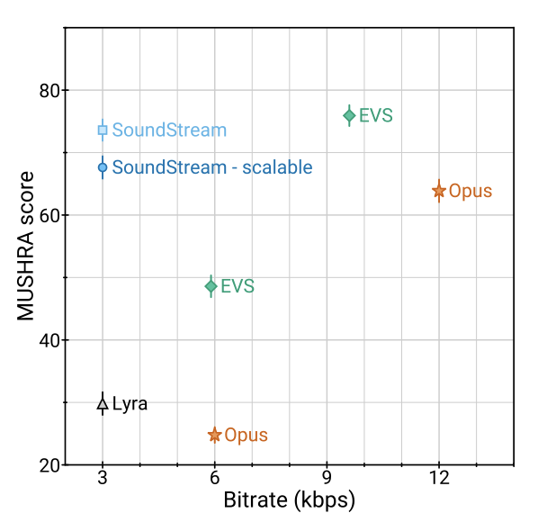
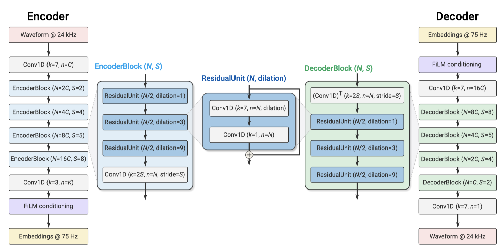
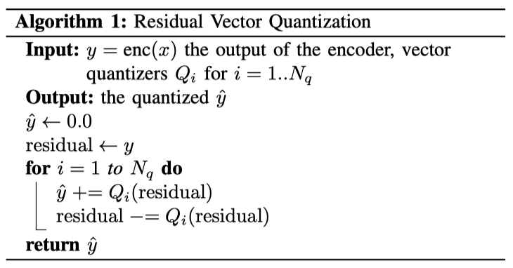
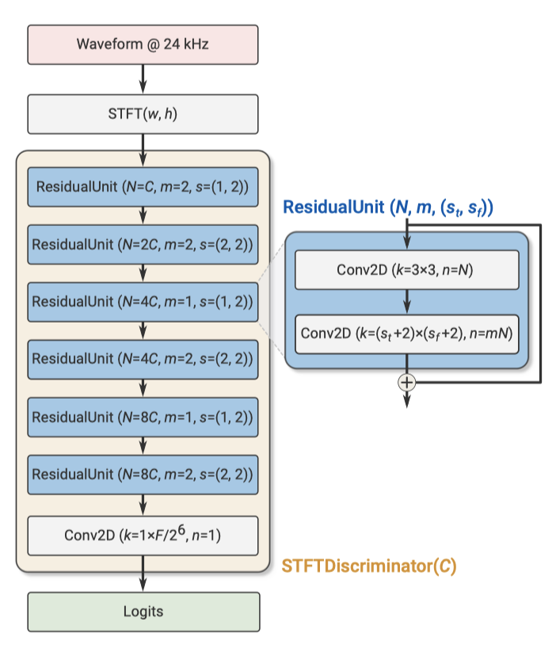
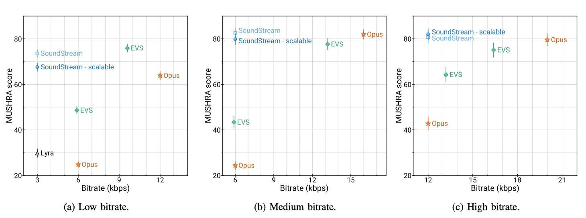
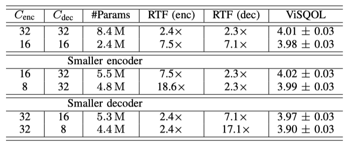
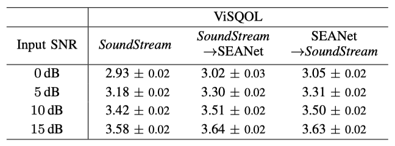

+++
author = "Kurt"
title = "SoundStream"
date = "2024-02-05"
description = "An End-to-End Neural Audio Codec"
categories = [
    "Paper Review"
]
tags = [
    "Audio",
    "Codec"
]
+++

## Abstract

SoundStream이라는 새로운 neural audio codec은 음성, 음악, 일반 오디오를 효율적으로 압축할 수 있다. 이 codec은 fully convolutional encoder/decoder network와 residual vector quantizer로 구성되어 있으며, 학습 과정은 최근의 text-to-speech와 speech enhancement 기술을 활용한다. 이 모델은 3 kbps에서 18 kbps까지 다양한 비트레이트에서 작동할 수 있으며, 실시간 스마트폰 CPU에서 스트림 가능한 추론을 지원한다. 3 kbps의 SoundStream은 12 kbps의 Opus를 뛰어넘고, 9.6 kbps의 EVS에 근접한다. 추가적으로, 이 codec은 추가적인 지연 없이 압축과 향상을 동시에 수행할 수 있어, 배경 소음 억제 등의 기능도 가능하다.

---

## Introduction

audio codec은 waveform codec과 parametric codec 두 가지로 나눌 수 있다. waveform codec은 입력 오디오 샘플을 충실히 재구성하는 것을 목표로 한다. 이는 transform coding technique을 사용하며, 오디오 콘텐츠의 유형에 대한 가정을 거의 하지 않는다. 따라서 일반 오디오에 대해 작동할 수 있지만, 비트레이트가 낮아질수록 코딩 아티팩트가 발생하는 경향이 있다. 반면 parametric codec은 특정 오디오에 대한 가정을 통해 이 문제를 해결하려고 한다. 이는 오디오 합성 과정을 설명하는 parametric 모델을 사용하며, 샘플마다 완벽하게 재구성하는 것이 아니라 원본과 지각적으로(perceptually) 유사한 오디오를 생성하는 것을 목표로 한다.

전통적인 waveform과 parametric codec은 신호 처리 기법과 심리음향학, 음성 합성 등의 도메인 지식을 활용해 설계된다. 최근에는 머신러닝 모델이 오디오 압축에 성공적으로 적용되어, 데이터 기반 솔루션의 가치를 입증하였다. 이러한 모델은 기존 코덱의 품질을 향상시키는 후처리 단계로 사용될 수 있으며, 이는 주파수 대역폭 확장, 오디오 denoising, 패킷 손실 은폐 등을 통해 이루어진다.

머신러닝 기반 모델은 audio codec 구조의 핵심 부분으로 사용되며, 최근의 text-to-speech(TTS) 기술 발전의 중요한 역할을 한다. 예를 들어, 텍스트에서 음성을 생성하는 WaveNet이라는 모델은 neural codec의 decoder로 사용되었다. 다른 neural audio codec들은 WaveRNN을 사용한 LPCNet이나 WaveGRU를 사용한 Lyra와 같은 다양한 모델 구조를 채택하였으며, 이들은 모두 낮은 비트레이트에서의 음성을 목표로 한다.

이 논문에서는 SoundStream이라는 새로운 audio codec을 제안한다. 이 코덱은 음성, 음악, 일반 오디오를 이전 codec보다 효율적으로 압축하며, state-of-the-art neural audio 합성 기술과 새로운 학습 가능한 양자화 모듈을 활용한다.

SoundStream의 구조는 fully convolutional encoder와 decoder로 구성되어 있다. encoder는 시간 영역 waveform을 입력으로 받아 낮은 샘플링 비율의 임베딩 시퀀스를 생성하고, 이를 residual vector quantizer로 양자화한다. decoder는 양자화된 임베딩을 받아 원본 waveform의 근사치를 재구성한다.

모델은 reconstruction과 adversarial 손실을 모두 사용하여 end-to-end로 학습되며, discriminator가 decoding된 오디오와 원본 오디오를 구별하는 역할을 한다. encoder와 decoder 모두 causal convolution만 사용하므로, 전체적인 아키텍처의 대기 시간은 원래 waveform과 임베딩 사이의 시간 resampling ratio에 의해 결정된다.

요약하자면, 이 논문은 다음과 같은 주요 기여를 한다:

* 모든 구성 요소(encoder, decoder, quantizer)가 reconstruction과 adversarial 손실의 혼합으로 end-to-end로 학습되어 뛰어난 오디오 품질을 달성하는 neural audio codec인 SoundStream을 제안한다.
* residual vector quantizer 를 도입하고, 그 설계로 인해 암시되는 rate-distortion-complexity 트레이드오프를 조사한다. 또한, "quantizer dropout"이라는 새로운 기법을 제안하여 단일 모델이 다양한 비트레이트를 처리할 수 있게 한다.
* encoder를 학습함으로써 mel-spectrogram 특성을 사용하는 방법보다 코딩 효율성이 크게 향상된다는 것을 입증한다.
* 주관적 품질 지표를 통해 SoundStream이 다양한 비트레이트에서 Opus와 EVS를 모두 능가한다는 것을 보여준다.
* 낮은 대기 시간에서 작동하는 스트리밍 추론을 지원하도록 설계되었으며, 스마트폰에서 실시간으로 단일 CPU 스레드에서 실행된다.
* 추가적인 대기 시간 없이 오디오 압축과 향상을 동시에 수행하는 SoundStream 코덱 변형을 제안한다.

--- 

## Related Work

**Traditional audio codecs** Opus와 EVS는 다양한 콘텐츠 유형, 비트레이트, 샘플링 레이트에 대해 높은 코딩 효율성을 제공하며 실시간 오디오 통신에 필요한 낮은 대기 시간을 보장하는 최첨단 오디오 코덱이다. 이 논문에서는 이들과 SoundStream을 주관적 평가를 통해 비교한다.

**Audio generative models** 텍스트나 코딩된 특성을 오디오 waveform으로 변환하는 여러 생성 모델이 개발되었다. WaveNet과 SampleRNN은 고품질의 오디오를 생성하지만 계산 복잡성이 높다. 그러나 Parallel WaveNet은 병렬 계산을 가능하게 하여 속도를 향상시킨다. 또한, 최근에는 계산 복잡성이 낮으면서 고품질의 오디오를 생성하는 adversarial 모델, MelGAN과 HiFiGAN이 등장하였다. 이들 모델의 설계 방식은 SoundStream의 decoder 설계와 손실 계산에 영향을 미쳤다.

**Audio enhancement** 딥 뉴럴 네트워크는 denoising부터 주파수 대역폭 확장 등 다양한 오디오 향상 작업에 활용되었다. 이 논문에서는 추가 대기 시간 없이 단일 모델로 오디오 향상과 압축을 동시에 수행할 수 있음을 보여준다.

**Vector quantization** optimal quantizer를 학습하는 것은 높은 코딩 효율성을 달성하는 핵심이다. 벡터 양자화는 전통적인 오디오 코덱의 구성 요소였으며, 최근에는 신경망 모델에서 입력 특성의 압축에 사용되었다. 하지만, 비율이 증가하면서 코드북의 크기가 급격히 커지는 문제가 있다. 이를 해결하기 위해, SoundStream에서는 나머지 모델과 함께 end-to-end로 학습되는 residual vector quantizer를 도입하였다. 이는 신경망에서 이런 형태의 벡터 양자화가 처음으로 사용되는 경우이다.

**Neural audio codecs** end-to-end neural audio codec은 데이터 기반 방법을 사용해 효율적인 오디오 표현을 학습한다. 이는 초기에 음성 코딩에 적용된 autoencoder 네트워크에 기반하며, 최근에는 더 복잡한 deep convolutional 네트워크로 발전하였다. VQVAE 음성 codec과 Lyra는 낮은 비트레이트에서 효율적인 오디오 압축을 보여주었으며, 일반 오디오를 대상으로 한 end-to-end audio codec은 높은 비트레이트에서 효과적이다. 이러한 모델은 여러 autoencodering 모듈과 psychoacoustic 모델을 사용하여 학습 중인 손실 함수를 주도한다.

SoundStream은 인코딩하는 신호의 성질에 대한 가정 없이 다양한 오디오 컨텐츠 유형에 적용할 수 있다. end-to-end 방식으로 학습되며, encoder를 학습하면 오디오 품질이 크게 향상된다. 추가 비용 없이 단일 모델이 다른 비트레이트에서 작동하는 능력을 가지며, 이는 residual vector quantizer와 quantizer dropout 학습 체계 덕분이다. SoundStream은 스마트폰 CPU에서 실시간으로 음성, 음악, 일반 오디오를 압축할 수 있으며, 이는 neural audio codec이 넓은 범위의 비트레이트에서 state-of-the-art codec을 능가하는 첫 번째 사례이다.

**Joint compression and enhancement** 최근 연구는 압축과 강화를 동시에 진행하는 방법을 탐구하였다. 하지만 SoundStream은 실시간으로 노이즈를 제어할 수 있는 시간 의존적 조절 계층을 사용해, 일반적으로 제거될 수 있는 자연소리와 음향 장면을 인코딩할 수 있도록 설계되었다. 이는 일반적인 목적의 오디오 코덱으로서의 SoundStream의 역할을 강화한다.

---

## Model

$f_s$ 에서 샘플링된 단일 채널 녹음 $x \in \mathbb{R}^T$ 를 고려한다. SoundStream 모델은 세 개의 구성 요소로 이루어진 시퀀스로 구성된다:

* encoder는 x를 임베딩 시퀀스로 매핑한다.
* residual vector quantizer는 각 임베딩을 유한한 코드북 집합의 벡터 합으로 대체함으로써 표현을 목표 비트 수로 압축한다.
* decoder는 양자화된 임베딩에서 손실이 있는 reconstruction $\hat{x} \in \mathbb{R}^T$를 생성한다.

이 모델은 discriminator와 함께 adversarial 손실과 reconstruction 손실을 사용하여 end-to-end로 학습된다. denoising을 적용할 시기를 결정하는 조절 신호를 선택적으로 추가할 수 있다.

### Encoder architecture

encoder 아키텍처는 스트리밍 SEANet encoder와 동일한 구조를 따르며, 1D convolution layer와 convolution block으로 구성된다. 각 block은 dilated convolution을 포함하는 residual unit으로 구성되며, 다운샘플링 시 채널 수가 두 배로 늘어난다. 마지막 1D convolution layer는 임베딩의 차원을 설정한다. 실시간 추론을 위해 모든 convolution은 causal 이며, ELU activation을 사용한다. 입력 waveform과 임베딩 사이의 temporal resampling ratio는 convolution block의 수와 스트라이딩 시퀀스에 의해 결정된다.

### Decoder architecture

decoder 아키텍처는 업샘플링을 위한 transposed convolution과 residual unit으로 구성된 convolution block을 포함하며, encoder와 반대 순서의 스트라이드를 사용하여 입력 waveform과 동일한 해상도의 waveform을 재구성한다. 업샘플링 시 채널 수는 절반으로 줄어들며, 마지막 decoder block은 임베딩을 waveform 도메인으로 투영한다. encoder와 decoder 양쪽에서 동일한 채널 수는 동일한 parameter에 의해 제어되며, encoder와 decoder 사이에서 채널 수가 다른 경우도 조사하였다.

### Residual Vector Quantizer

quantizer의 목표는 encoder $enc(x)$의 출력을 bit/second(bps)로 표현된 목표 비트율 $R$로 압축하는 것이다. SoundStream을 end-to-end로 학습시키기 위해, quantizer는 backpropagation에 의해 encoder와 decoder와 함께 학습되어야 한다. vector quantizer (VQ)는 $enc(x)$의 $D$차원 프레임 각각을 인코드하기 위해 $N$개의 벡터로 구성된 코드북을 학습한다. 그런 다음 인코드된 오디오 $enc(x) \in \mathbb{R}^{S \times D}$는 $S \times D$ 형태의 one-hot vector 시퀀스로 매핑되며, 이는 $S log_2 N$ 비트를 사용하여 표현할 수 있다.

**Limitations of Vector Quantization** 비트율 $R = 6000 bps$를 목표로 하는 코덱 예시에서, 스트라이딩 계수 $M = 320$을 사용하면, 샘플링 레이트가 $24000 Hz$인 1초 오디오는 encoder의 출력에서 75 프레임으로 표현된다. 이는 각 프레임에 80 비트가 할당되는 것을 의미한다. 그러나 plain vector quantizer를 사용하면, 실행 불가능한 수준인 $N = 2^{80}$ 벡터의 코드북을 저장해야 한다.

**Residual Vector Quantizer** 이 문제를 해결하기 위해, residual vector quantizer를 채택하여 $N_q$ layer의 $VQ$를 연속적으로 적용한다. 양자화되지 않은 입력 벡터는 첫 $VQ$를 거치고, quantization residual이 계산된 후 추가적인 vector quantizer에 반복적으로 양자화된다. 전체 비율 예산은 각 VQ에 균등하게 할당되며, 예를 들어 $N_q = 8$을 사용할 경우, 각 quantizer는 1024 크기의 코드북을 사용한다. $N_q$ parameter는 계산 복잡성과 코딩 효율성 사이의 균형을 제어한다.

각 quantizer의 코드북은 exponential moving average 업데이트로 학습되며, 코드북 사용을 개선하기 위해 두 가지 방법을 사용한다. 첫째, 코드북 벡터의 초기화를 위해 첫 번째 학습 배치에서 k-means 알고리즘을 실행한다. 둘째, 코드북 벡터가 여러 배치 동안 입력 프레임을 할당받지 못하면 현재 배치에서 무작위로 샘플링된 입력 프레임으로 대체한다. 이를 위해 각 벡터에 대한 할당의 exponential moving average을 추적하고, 이 값이 2 이하로 떨어지는 벡터를 대체한다.

**Enabling bitrate scalability with quantizer dropout** residual vector quantization는 각 코드북의 크기를 고정하고 $VQ$ layer의 수를 조절함으로써 비트레이트를 제어한다. vector quantizer는 encoder/decoder와 함께 학습되지만, 여러 목표 비트레이트에서 작동할 수 있는 단일 비트레이트 스케일러블 모델이 더 실용적이다. 이 방식은 encoder와 decoder 양쪽에서 모델 parameter를 저장하는 데 필요한 메모리를 줄일 수 있다.

각 입력 예제에 대해 무작위로 선택된 $n_q$ 범위 안에서 quantizer를 사용하여 모델을 학습시킨다. 이는 quantization layer에 적용된 구조화된 드롭아웃의 한 형태로 볼 수 있다. 이 방법을 통해 모델은 모든 목표 비트레이트에 대해 오디오를 인코드하고 디코드하도록 학습된다. 이전 neural compression 모델들과 달리, residual vector quantization의 주요 장점은 임베딩의 차원이 비트레이트와 함께 변경되지 않는다는 것이다. 이렇게 하면 encoder나 decoder의 아키텍처 변경이 필요 없으므로, 특정 비트레이트에 대해 학습된 모델의 성능을 일치시키는 단일 SoundStream 모델을 학습시킬 수 있다.

### Discriminator architecture

adversarial 손실을 계산하기 위해 단일 waveform을 입력으로 받는 wave-based discriminator와 복소수 STFT를 입력으로 받는 STFT-based discriminator, 총 두 가지 discriminator를 사용한다. 이 두 discriminator는 모두 fully convolutional 이므로, 출력 로짓의 수는 입력 오디오의 길이에 비례하게 된
다.

wave-based discriminator는 여러 해상도(original, 2-times down-sampled, 4-times down-sampled)에서 입력 오디오에 적용되는 세 개의 동일한 구조의 모델을 사용한다. 각 모델은 initial plain convolution과 네 개의 grouped convolution, 그리고 두 개의 plain convolution layer을 거쳐 logit을 생성힌다.

STFT-based discriminator는 단일 스케일에서 작동하며, STFT 계산에는 1024 샘플의 window length와 256 샘플의 hop length를 사용힌다. 이 판별자는 2D-convolution과 일련의 residual block을 거친다. 이 block들은 3×3 convolution을 시작으로 (1, 2) 또는 (2, 2)의 스트라이드를 가진 다른 convolution으로 이어진다. 여기서 $(s_t, s_f)$는 시간 축과 주파수 축을 따라 다운샘플링 요인을 나타낸다.총 6개의 residual block이 있으며, 네트워크의 깊이가 깊어질수록 채널 수가 증가힌다. 마지막 residual block 출력에서는 activation은 $T/(H \cdot 2^3) \times F/2^6$ 형태를 가지며, 여기서 $T$는 시간 도메인의 샘플 수이고 $F = W/2$는 주파수 통의 수이다. 마지막 layer에서는 주파수 통을 통해 logit을 집계하여 1-dimensional signal time domain을 얻는다.

### Training objective

SoundStream generator $G(x)$는 입력 waveform $x$를 처리하며, 이는 encoder, quantizer, decoder를 통과한다. 디코드된 파형은 $\hat{x} = G(x)$로 표시된다. SoundStream은 perception-distortion trade-off에 따라, signal reconstruction fidelity와 perceptual quality을 모두 달성하기 위해 다양한 손실을 사용하여 학습된다.

adversarial 손실은 perceptual quality을 향상시키는 데 사용되며, discriminator의 logit에 대한 hinge 손실로 정의되며, 여러 discriminator와 시간에 걸쳐 평균화된다. 보다 공식적으로, $k \in \lbrace 0, ..., K \rbrace$ 로 개별 discriminator를 인덱싱하게 하고, 여기서 $k = 0$은 STFT-based discriminator를 나타내고 $k \in \lbrace 1, ..., K \rbrace$ 는 waveform-based discriminator의 다른 해상도를 나타낸다. $T_k$는 시간 차원을 따라 $k$번째 discriminator의 출력에서의 logit 수를 나타낸다. discriminator는 원래의 오디오와 디코드된 오디오를 분류하기 위해 최소화함으로써 학습된다.

$$ L_D = E_x \big[ {{1}\over{K}} \sum_K {{1}\over{T_K}} \sum_t max(0.1 - D_{k, t}(x)) \big] + E_x \big[ {{1}\over{K}} \sum_K {{1}\over{T_K}} \sum_t max(0.1 - D_{k, t}(g(x))) \big] $$

generator에 대한 adversarial 손실은

$$ L_g^{adj} = E_x \big[ {{1}\over{K}} \sum_{K, t} {{1}\over{T_K}} max(0.1 - D_{k, t}(g(x))) \big] $$

원본 $x$에 대한 디코딩된 신호 $\hat{x}$의 fidelity를 촉진하기 위해, 두 가지 추가적인 손실을 채택한다:
1. discriminator가 정의하는 feature space에서 계산된 "feature" 손실 $L_G^{feat}$
2. multi-scale spectral reconstruction 손실 $L_G^{rec}$

더 구체적으로, feature 손실은 생성된 오디오에 대한 discriminator의 내부 layer 출력과 해당 타겟 오디오에 대한 출력 사이의 average absolute difference를 계산함으로써 구해진다.

$$ L_g^{feat} = E_x \big[ {{1}\over{KL}} \sum_{K, l} {{1}\over{T_{K, l}}} \sum_t | D_{k, t}^{(l)}(x) - D_{k, t}^l(g(x)) \big] $$

여기서 $L$은 내부 layer의 수이고, $D_{k,t}^{(l)} (l \in \lbrace 1, ..., L \rbrace )$는 판별자 $k$의 계층 $l$의 $t$번째 출력이며, $T_{k,l}$은 시간 차원에서 계층의 길이를 나타낸다.

multi-scale spectral reconstruction은 다음을 따른다:

$$ L_g^{rec} = \sum_{s \in 2^6, ... ,2^{11}} \sum_t \Vert S_t^s(x) - S_t^s(G(x))\Vert_1 + \alpha_s \sum_t \Vert log S_t^s(x) − log S_t^s(G(x)) \Vert_2 $$

여기서 $S_t^s(x)$는 window length가 $s$이고 hop length가 $s/4$인 64-bin melspectrogram의 t-th 프레임을 나타낸다. $\alpha_s = \sqrt{s/2}$로 설정한다.

overall generator 손실은 다른 손실 component의 weighted sum이다:

$$ L_G = \lambda_{adj} L_G^{adj} + \lambda_{feat} L_G^{feat}  + \lambda_{rec} L_G^{rec} $$

모든 실험에서 $\lambda_{adv} = 1, \lambda_{feat} = 100\lambda_{rec} = 1$로 설정하였다.

### Joint compression and enhancement

전통적인 오디오 처리에서는 compression과 enhancement가 별도의 모듈에서 이루어지지만, 각 처리 단계는 end-to-end latency에 영향을 미친다. 그러나 SoundStream은 compression과 enhancement을 동시에 수행하는 동일한 모델로 설계되어 전체 지연 시간을 증가시키지 않는다.

enhancement의 종류는 학습 데이터의 선택에 따라 결정된다. 이 논문에서는 오디오 compression과 배경 소음 제거를 결합하는 것이 가능하다는 것을 보여준다. 모델은 denoising을 유연하게 활성화하거나 비활성화할 수 있게 학습되며, 이는 두 가지 모드를 나타내는 조절 신호를 통해 가능하다. 이를 위해 학습 데이터는 (inputs, targets, denoise)의 형태로 구성된다. denoising이 활성화되면, 네트워크는 노이즈가 있는 입력의 청정한 버전을 생성하도록 학습되고, 비활성화되면 노이즈가 있는 음성을 재구성하도록 학습된다. 또한, denoising이 활성화되어도 SoundStream이 청정한 오디오에 부정적인 영향을 미치지 않도록 하였다.

conditioning signal을 처리하기 위해, residual unit 사이에 Feature-wise Linear Modulation (FiLM) layer를 사용하는데, 이것은 네트워크 특징을 입력으로 받아 다음과 같이 변형한다.

$$ \tilde{a}\_{n,c} = \gamma_{n,c} a_{n,c} + \beta_{n,c} $$

여기서 $a_{n,c}$ 는 $c$번째 채널의 $n$번째 activation이다. 계수 $\gamma_{n,c}$ 와 $\beta_{n,c}$는 denoising 모드를 결정하는 two-dimensional one-hot encoding을 입력으로 하는 linear layer에 의해 계산된다. 이를 통해 시간에 따른 denoising 수준을 조정할 수 있다.

원칙적으로 FiLM layer는 encoder와 decoder 아키텍처 어디에나 적용될 수 있지만, preliminary 실험에서는 encoder나 decoder의 병목 부분에서 조절을 적용하는 것이 효과적이었다. 다른 깊이에서 FiLM layer를 적용해도 추가적인 개선은 관찰되지 않았다.

---

## Evaluation Setup

### Datasets

SoundStream은 깨끗한 음성, 잡음이 있는 음성, 그리고 음악에 대해 학습되었다. 이를 위해 다양한 데이터셋을 사용하였고, 잡음이 있는 음성은 LibriTTS의 음성과 Freesound의 잡음을 혼합하여 만들었다. 또한, 실세계 데이터셋도 수집하여 테스트에 사용하였다. 이 모든 데이터를 바탕으로 객관적, 주관적 측정치를 계산하였다.

### Evaluation metrics

SoundStream의 평가는 인간 평가자들에 의한 주관적 평가로 이루어졌다. MUSHRA에서 착안한 방법론을 사용하였고, 각각의 샘플은 20번씩 평가되었다. 평가자들은 영어를 모국어로 사용하며 헤드폰을 착용하였다. 또한, 데이터의 품질을 보장하기 위해 특정 기준을 충족하지 못하는 평가는 제외하였다.

개발과 hyperparameter 선택에는 계산 가능한 객관적 지표를 사용하였다. 라이센스 제한으로 인해 일반적으로 사용되는 PESQ와 POLQA 대신, 오픈소스화된 ViSQOL 지표를 선택하였다. 이 지표는 POLQA와 비슷한 성능을 보였으며, 주관적 평가와 강한 상관관계를 보였기 때문에 모델 선택과 연구에 사용되었다.

### Baselines

Opus는 다목적 음성 및 오디오 코덱으로, 4 kHz에서 24 kHz까지의 신호 대역폭과 6 kbps에서 510 kbps까지의 비트레이트를 지원한다. 인터넷 음성 통신, Zoom, Microsoft Teams, Google Meet 등에서 널리 사용되며, YouTube 스트리밍에도 사용된다. 또한, 최신 3GPP에 의해 표준화된 Enhanced Voice Services (EVS) 코덱도 소개되었다. 이 논문에서는 이 두 코덱과 최근 제시된 Lyra 코덱을 SoundStream 코덱과 비교한다. 이러한 비교를 위해 다양한 비트레이트에서 SoundStream과 기준선에 의해 처리된 오디오를 공개 웹페이지에서 제공한다.

---

## Result

### Comparison with other codecs

본 논문의 주요 결과는 SoundStream이 다른 비트레이트에서 Opus와 EVS와 비교될 때 더 우수한 성능을 보여준다는 것이다. 특히, SoundStream은 절반의 비트레이트인 3 kbps에서 작동하면서도 Opus 6 kbps와 EVS 5.9 kbps를 크게 초과하였다. SoundStream의 품질을 맞추기 위해, EVS는 최소 9.6 kbps, Opus는 최소 12 kbps를 필요로 하며, 이는 SoundStream보다 3.2배에서 4배 더 많은 비트를 사용하는 것을 의미한다. 또한, SoundStream은 3 kbps에서 작동할 때 Lyra를 능가하였고, 6 kbps와 12 kbps에서도 비슷한 결과를 보여주었다. 중간 비트레이트에서는 EVS와 Opus는 각각 2.2배에서 2.6배, 높은 비트레이트에서는 1.3배에서 1.6배 더 많은 비트를 사용해야 동일한 품질을 얻을 수 있었다.

SoundStream이 깨끗한 음성과 잡음이 있는 음성을 인코딩할 때 일관된 품질을 보인다는 것을 확인할 수 있다. 또한, SoundStream은 최소 3 kbps에서 음악을 인코딩하며, 이는 12 kbps의 Opus와 5.9 kbps의 EVS보다 상당히 높은 품질을 보여준다. 이는 이렇게 낮은 비트레이트에서 다양한 콘텐츠 유형에 적용되는 첫 codec이다.

### Objective quality metrics

SoundStream의 rate-quality 곡선을 보여주며, 3 kbps에서 18 kbps까지의 비트레이트에서 품질이 비트레이트가 감소함에 따라 점차 감소하지만, 최저 비트레이트에서도 3.7 이상을 유지하는 것을 보여준다. SoundStream은 일정한 비트레이트에서 작동하며, 각 인코딩된 프레임에 동일한 수의 비트가 할당된다. 또한, 통계적 중복성을 활용하지 않는 가정 하에 비트레이트 하한을 측정하였으며, 이 결과 7%에서 20% 사이의 비율 절약이 가능함을 보여준다.

다양한 콘텐츠 유형을 인코딩할 때 달성되는 rate-quality tradeoff를 조사한 결과, 깨끗한 음성을 인코딩할 때 가장 높은 품질을 얻을 수 있었다. 반면, 내용의 다양성 때문에 음악을 인코딩하는 것은 더욱 도전적인 작업이었다.

### Bitrate scalability

다양한 비트레이트를 제공하는 단일 모델 학습을 통한 비트레이트 확장성을 조사하였다. 이를 평가하기 위해 세 가지 SoundStream 설정을 고려하였다. 놀랍게도, 18 kbps에서 학습된 모델은 더 낮은 비트레이트에서도 좋은 성능을 보여주었다. 비트레이트가 감소할수록 품질 감소는 증가했지만, quantizer dropout 전략을 사용하면 이 차이가 사라졌다. 또한, 비트레이트 확장 가능 모델은 일정한 비트레이트에서 비트레이트 특정 모델을 약간 능가하는 것으로 나타났다. 이러한 결과는 quantizer dropout이 비트레이트 확장성을 제공하는 것 외에도 regularizer 역할을 할 수 있음을 보여준다.

MUSHRA 주관적 평가를 통해, 비트레이트 확장 가능한 SoundStream 변형이 3 kbps에서는 비트레이트 특정 변형보다 약간만 나쁘며, 6 kbps와 12 kbps에서는 비트레이트 특정 변형과 동일한 품질을 보여줌을 확인하였다.

### Ablation studies

SoundStream에 적용된 몇 가지 설계 선택의 영향을 평가하기 위해 여러 가지 추가 실험을 수행하였다. 특별히 명시되지 않는 한, 모든 실험은 6 kbps에서 작동한다.

**Advantage of learning the encoder** SoundStream의 학습 가능한 encoder를 고정된 mel-filterbank로 대체하는 것이 품질에 미치는 영향을 조사하였다. 결과적으로, ViSQOL이 3.96에서 3.33으로 크게 떨어지는 것으로 보아, 품질이 크게 감소하는 것을 확인하였다. 이는 encoder를 학습하고 비트레이트를 절반으로 줄일 때보다도 나쁘다는 것을 의미한다. 이는 학습 가능한 encoder의 복잡성이 rate-quality trade-off에서 큰 개선을 가져다준다는 것을 보여준다.

**Encoder and decoder capacity** 학습 가능한 encoder의 사용은 계산 비용이 큰 단점이지만, SoundStream은 동일한 비트레이트에서 더 나은 지각 품질을 제공하고, 제한된 자원의 하드웨어에서 실시간으로 동작해야 한다. encoder와 decoer의 채널 수를 조절하여 계산 효율성과 오디오 품질이 어떻게 변하는지 측정하였다. 모델 용량을 줄이면 복원 품질에는 거의 영향을 미치지 않으면서 실시간 요소가 크게 증가하는 것을 확인하였다. 더 작은 encoder를 사용하면 품질을 희생하지 않고 큰 속도 향상을 달성할 수 있었다. 그러나 decoer의 용량을 줄이면 품질에 더 큰 영향을 미치는 것을 확인하였다. 이는 신경 이미지 압축 분야의 최근 연구 결과와 일치한다.

**Vector quantizer depth and codebook size** 단일 프레임을 인코드하는 데 필요한 비트 수는 quantizer의 수와 코드북 크기에 따라 다르며, 이를 통해 동일한 목표 비트레이트를 달성할 수 있다. 큰 코드북을 가진 적은 수의 벡터 quantizer를 사용하면 계산 복잡성이 증가하지만, 높은 코딩 효율성을 달성할 수 있다. 반면, 80개의 1비트 quantizer를 사용하면 품질 저하가 약간밖에 되지 않는 것으로 나타났다. 하지만 코드북 크기를 늘리면 메모리 요구사항이 빠르게 증가할 수 있다. 따라서 residual vector quantizer는 높은 비트레이트에서 작동하는 신경 codec을 학습하는데 실용적이고 효과적인 해결책을 제공한다.

**Latency** 모델의 아키텍처 latency는 스트라이드의 곱으로 결정되며, 이는 오디오의 한 프레임이 몇 개의 샘플로 이루어져 있는지를 나타낸다. residual vector quantizer에 할당된 비트 예산은 이 지연에 따라 조정되며, 지연 시간을 늘리면 프레임 당 예산이 증가해야 한다. 세 가지 다른 구성에서 예산을 조정하는 방법은 코드북 크기를 고정하고 양자화기의 수를 변경하는 것이다. 이 세 가지 구성은 오디오 품질 면에서 동등하나, 모델의 지연을 늘리면 실시간 처리 능력이 크게 증가한다. 이는 단일 프레임의 인코딩/디코딩이 더 긴 오디오 샘플에 해당하기 때문이다.

### Joint compression and enhancement 

compression과 background noise suppression을 동시에 수행하는 SoundStream 변형을 평가하였다. 이 모델은 임베딩에 conditioning signal을 적용하는 두 가지 구성을 고려하며, 각각 encoder와 decoder 측에 conditioning signal을 추가한다. 다른 비트레이트에서 모델을 학습하고, 노이즈가 있는 음성 샘플을 사용하여 denoising이 활성화되거나 비활성화될 때의 오디오 품질을 평가하였다. 결과적으로 denoising이 활성화될 때 오디오 품질이 크게 향상되며, encoder나 decoder에서 denoising하는 것 사이에 큰 차이는 없었다. 또한, denoising을 유연하게 활성화하거나 비활성화할 수 있는 추론 시간 모델은 denoising이 항상 활성화된 모델과 비교하여 성능에서 추가 비용이 발생하지 않았다.

denoising이 비트레이트 절약에 어떤 영향을 미치는지 조사하였다. 학습 데이터의 샘플에서 경험적 확률 분포를 측정하고, 테스트 샘플에서의 분포를 바탕으로 비트레이트 하한선을 추정하였다. 결과적으로, encoder 측 denoising과 고정 denoising이 decoder 측 denoising에 비해 상당한 비트레이트 절약을 제공함을 확인하였다. 이는 양자화 전에 denoising을 적용하면 더 적은 비트로 인코딩할 수 있다는 것을 의미한다.

### Joint vs. disjoint compression and enhancement

제안된 모델은 compression과 enhancement를 동시에 수행할 수 있다. 이를 SoundStream이 compression을 담당하고 전용 denoising 모델이 enhancement를 담당하는 구성과 비교하였다. 이때 두 가지 변형을 고려했는데, 하나는 compression 후 denoising이 이루어지는 경우(decoder 측에서 denoising 적용)이고, 다른 하나는 denoising 후 compression이 이루어지는 경우(encoder 측에서 denoising 적용)이다.

VCTK 데이터셋을 사용하여 다양한 모델을 평가하였다. 이때, 압축과 강화를 동시에 수행하는 단일 모델은 두 개의 별개 모델을 사용하는 것과 거의 동일한 품질을 달성하며, 계산 비용은 절반으로 줄이고 추가적인 아키텍처 지연을 일으키지 않았다. 또한, 입력 신호 대 잡음 비가 증가할수록 성능 간격이 줄어드는 것을 확인하였다.

---

## Conclusions

SoundStream이라는 새로운 neural audio codec을 제안한다. 이는 다양한 비트레이트와 콘텐츠 유형에서 state-of-the-art audio codec을 능가한다. SoundStream은 encoder, residual vector quantizer, decoder로 구성되어 우수한 오디오 품질을 제공하며, 실시간으로 스마트폰 CPU에서 작동 가능하다. quantizer dropout을 통해 비트레이트 확장성을 달성하고, 추가적인 대기 시간 없이 압축과 강화를 하나의 모델에서 수행할 수 있음을 보여준다.

---

## Reference

* [Paper](https://arxiv.org/pdf/2107.03312.pdf)
* [Github](https://github.com/wesbz/SoundStream)