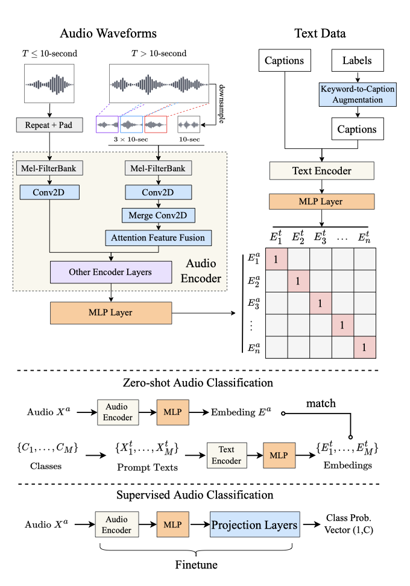
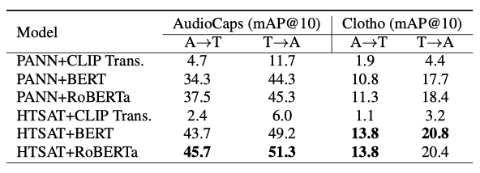
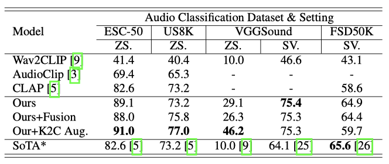

+++
author = "Kurt"
title = "CLAP"
date = "2024-01-16"
description = "Large-scale Contrastive Language-Audio Pretraining with Feature Fusion and Keyword-to-Caption Augmentation"
categories = [
    "Paper Review"
]
tags = [
    "Audio",
    "Music Generation",
]
+++

## Abstract

이 연구에서는 contrastive learning을 통해 자연어 설명과 오디오 데이터를 결합한 오디오 표현을 개발하는 방법을 제안한다. 이를 위해 633,526개의 오디오-텍스트 쌍을 모은 LAION-Audio-630K를 공개하고, 이를 활용해 오디오와 텍스트를 처리하는 모델을 구축하였다. 이 모델은 텍스트-오디오 검색에서 우수한 성능을 보였고, zero-shot 오디오 분류에서는 state-of-the-art를 달성하였다.

---

## Introduction

오디오는 텍스트, 이미지와 더불어 중요한 정보 유형이지만, 세부적인 주석이 필요한 오디오 작업은 데이터 수집이 노동 집약적이어서 사용 가능한 데이터가 제한적이다. 이 때문에 많은 감독 없이 다양한 오디오 작업에 적합한 효과적인 오디오 표현을 만드는 것은 어려운 과제이다.

Contrastive learning 방식은 인터넷에서 모아진 대규모 노이즈 데이터로 모델을 학습시키는데 효과적이다. 최근 제안된 Contrastive Language-Image Pretraining (CLIP) 방식은 텍스트와 이미지를 shared latent space에 투영하여 학습한다. 이 방식은 데이터 주석에 제약받지 않으며, ImageNet 데이터셋의 변형에 대해 zero-shot 설정에서 높은 정확도를 보여준다. 또한, 오디오와 자연어도 중복 정보를 포함하며, 이를 통해 crossmodal 정보의 오디오 표현을 형성할 수 있다. 이러한 모델 학습은 쌍으로 된 오디오와 텍스트 데이터만을 필요로 하므로 수집이 상대적으로 쉽다.

최근 연구들은 텍스트-오디오 검색 작업에 대한 대조적(contrastive) 언어-오디오 사전 학습 모델을 제안하였다. 일부 연구는 오디오 encoder로 Pretrained Audio Neural Network (PANN)을, 텍스트 encoder로 BERT를 사용하며, 다른 연구는 성능 향상을 위해 HTSAT와 RoBERTa를 추가로 앙상블하였다. 또한, AudioClip과 WaveCLIP과 같은 연구들은 이미지-오디오(또는 이미지-오디오-언어) 사전 학습 모델에 초점을 맞추었다. 이러한 모든 모델들은 오디오 도메인에서의 대조적 학습에 큰 잠재력을 보여주고 있다.

현재의 언어-오디오 대조적 학습 연구들은 전체적인 강점을 아직 다 보여주지 못하였다. 모델들은 대부분 작은 데이터셋에서 학습되었고, 오디오/텍스트 encoder의 선택과 hyperparameter 설정에 대한 충분한 조사가 없었다. 또한, 모델들은 다양한 길이의 오디오를 처리하는 데 어려움을 겪었으며, 텍스트-오디오 검색에만 초점을 맞추고 downstream task에서의 오디오 표현을 평가하지 않았다. 이러한 문제점들을 해결하고 더 많은 하downstream task에 대한 일반화 능력을 발견하는 것이 필요하다.

이 논문에서는 이전 연구를 바탕으로, 위의 문제점들을 개선하기 위해 데이터셋, 모델 설계, 실험 설정에 대한 기여를 한다:

* 이 논문에서는 633,526개의 오디오-텍스트 쌍을 포함하는 현재 가장 큰 공개 오디오 캡션 데이터셋인 LAION-Audio-630K를 공개하고, 학습 과정을 돕기 위해 키워드-캡션 모델을 활용해 AudioSet의 레이블을 캡션으로 확장하였다. 이 데이터셋은 다른 오디오 작업에도 활용될 수 있다.
* 이 논문에서는 대조적 언어-오디오 사전 학습 파이프라인을 구축하고, 이를 위해 두 개의 오디오 인코더와 세 개의 텍스트 인코더를 선택하였다. 또한, 성능 향상과 variable-length inputs 처리를 위해 feature fusion mechanism을 활용하였다.
* 이 논문에서는 텍스트-오디오 검색과 zero-shot 및 지도 오디오 분류와 같은 downstream task에 대한 모델의 포괄적인 실험을 수행하였다. 데이터셋의 확장, keyword-to-caption augmentation, feature fusion이 모델 성능을 향상시키는 데 도움이 된다는 것을 보여주었다. 이를 통해 텍스트-오디오 검색과 오디오 분류 작업에서 state-of-the-art를 달성하였다.

---

## LAION-Audio-630K And Training Dataset

### LAION-Audio-630K

LAION-Audio-630K는 총 4,325.39시간에 걸친 633,526쌍의 오디오-텍스트 데이터셋을 수집하였다. 이 데이터셋은 사람의 활동, 자연 소리, 오디오 효과 등을 포함하며, 공개적으로 사용 가능한 여러 웹사이트에서 수집하였다. 현재로서는 LAION-Audio-630K가 공개적으로 이용 가능한 가장 큰 오디오-텍스트 데이터셋이다.

### Training Dataset

이 논문에서는 모델 성능이 데이터셋의 크기와 유형에 따라 어떻게 변화하는지 테스트하기 위해, 세 가지 학습 세트 설정을 사용하였다. 이들 설정은 AudioCaps+Clotho (약 55K 샘플), LAION-Audio-630K (약 630K 샘플), Audioset (1.9 백만 오디오 샘플)을 포함하며, 모든 중복 데이터는 제외하였다. 

### Dataset Format and Preprocessing

이 작업에서 사용된 모든 오디오 파일은 48kHz sample rate의 mono channel로 전처리되었다. 레이블만 있는 데이터셋의 경우, 템플릿이나 키워드-캡션 모델을 사용해 레이블을 캡션으로 확장하였다. 이를 통해 대조적 언어-오디오 사전 학습 모델의 학습에 더 많은 데이터를 활용할 수 있게 되었고, 총 오디오 샘플 수는 2.5M개로 증가하였다.

---

## Model Architecture

### Contrastive Language-Audio Pretraining

오디오 데이터 $X_i^a$와 텍스트 데이터 $X_i^t$의 입력을 각각 처리하기 위해 두 개의 encoder를 사용한다. 여기서 $(X_i^a, X_i^t)$는 $i$로 색인된 오디오-텍스트 쌍 중 하나이다. 오디오 임베딩 $E_i^a$와 텍스트 임베딩 $E_i^t$는 각각 오디오 encoder $\mathbf{f}\_{audio}(\cdot)$와 텍스트 encoder $\mathbf{f}\_{text}(\cdot)$에 의해 얻어지며, projection layer를 사용한다:

$$ E_i^a = \text{MLP}_{audio}(\mathbf{f}\_{audio}(X_i^a)) $$

$$ E_i^t = \text{MLP}_{text}(\mathbf{f}\_{text}(X_i^t)) $$

오디오/텍스트 projection layer는 2-layer multilayer perceptron(MLP)이다. 이는 ReLU activation function을 사용하여 encoder ouptput을 동일한 차원 $D$로 매핑한다(i.e., $E_i^a, E_i^t \in  \mathbb{R}^D$). 이로 인해 오디오 데이터와 텍스트 데이터의 관계를 더 잘 파악할 수 있다.

이 모델은 오디오와 텍스트 임베딩 간의 contrastive learning을 통해 학습되며, 이 때 다음의 loss function를 사용한다:

$$ \mathbf{L} = {{1}\over{2N}} \sum_{i=1}^N (log {{exp(E_i^a \cdot E_i^t / \gamma)}\over{\sum_{j=1}^N exp(E_i^a \cdot E_j^t / \gamma)}} + log {{exp(E_i^t \cdot E_a^t / \gamma)}\over{\sum_{j=1}^N exp(E_i^t \cdot E_j^a / \gamma)}})$$

$\gamma$는 손실을 조정하는 학습 가능한 parameter이며, 로그항은 오디오-텍스트 또는 텍스트-오디오 변환을 고려한다. $N$은 일반적으로 데이터 수를 나타내지만, 효율적인 학습을 위해 학습 시 배치 크기로 사용된다.

학습된 모델의 임베딩$(E^a, E^b)$은 다양한 문맥에서 활용되어, 각 작업에 따른 성능을 향상시키는 데 도움을 준다.

### Downstream Tasks in Inference Stage

**Text-to-Audio Retrieval** target 오디오 임베딩 $E_p^a$는 cosine similarity 함수를 사용하여 $M$개의 텍스트 임베딩 $E^t = \lbrace E_1^t, ..., E_M^t \rbrace$중에서 가장 가까운 텍스트 임베딩 $E_q^t$를 찾아, 가장 잘 매치되는 텍스트를 결정할 수 있다. 이는 오디오와 텍스트 간의 가장 적합한 대응을 찾는데 사용된다.

**Zero-shot Audio Classification** $M$개의 오디오 클래스 $C = \lbrace C_1, ..., C_M \rbrace$에 대해, $M$개의 프롬프트 텍스트 $X^t = \lbrace X_1^t, ..., X_M^t \rbrace$를 구성하고, 주어진 오디오 $X_p^a$에 대해 코사인 유사도를 통해 $X^t$중에서 가장 최적의 매치 $X_q^t$를 찾는다. 이 방법의 장점은 오디오 카테고리가 제한되지 않고, 분류 작업을 텍스트-오디오 검색 작업으로 변환할 수 있다는 점이다.

**Supervised Audio Classification** 모델 학습 후, 주어진 오디오 $X_p^a$의 임베딩 $E_p^a$은 projection layer를 추가하고 미세조정하여 고정 카테고리 분류 작업으로 매핑될 수 있다.

### Audio Encoders and Text Encoders

PANN과 HTSAT 두 모델을 오디오 encoder로 선택하였다. PANN은 CNN 기반, HTSAT은 transformer 기반 모델이며, 둘 다 바로 앞(penultimate) layer의 output $L$을 MLP layer으로 보낸다다. 각각의 output 차원 $L_{PANN} = 2048$, $L_{HTSAT} = 768$이다.

텍스트 encoder로 CLIP transformer, BERT, RoBERTa를 선택하였다다. output 차원은 각각 $L_{CLIP} = 512$, $L_{BERT} = 768$, $L_{RoBERTa} = 768$이며, 오디오와 텍스트 output을 모두 512 차원으로 매핑하기 위해 2layer MLP를 적용하였다.

### Feature Fusion for Variable-Length Audio

오디오는 길이가 가변적인 특성을 가지기 때문에, 전체 오디오를 인코더에 입력하고 임베딩의 평균을 출력하는 전통적인 방식은 계산 효율이 떨어진다. 따라서 대략적인 전역 정보와 랜덤 샘플링된 지역 정보를 결합하여 다양한 길이의 오디오에 대해 일정한 계산 시간 내에서 학습하고 추론한다.

$T$초의 오디오와 fixed chunk duration $d = 10$초에 대해:

* $T \leq d$인 경우: 먼저 입력을 반복한 다음, 그것을 0값으로 채운다. 예를 들어, 3초의 입력은 $3 \times 3 = 9$초로 반복되고, 1초의 0 값으로 패딩된다. 이 방식은 짧은 오디오 입력에 대해 효과적으로 처리할 수 있게 해준다.
* $T > d$인 경우: 먼저 입력을 $T$에서 $d$초로 다운샘플링하여 전역 입력으로 사용한다. 그런 다음 입력의 앞 ${1}\over{3}$, 중간 ${1}\over{3}$, 뒤 ${1}\over{3}$에서 각각 무작위로 $d$초 클립을 슬라이스하여 지역 입력으로 사용한다. 우리는 이 $4 \times d$ 입력들을 오디오 encoder의 첫 번째 layer로 보내어 초기 특징을 얻고, 그런 다음 세 개의 지역 특징들이 시간 축에서 3-stride를 가진 다른 2D-Convolution 계층에 의해 하나의 특징으로 변환된다. 마지막으로, 지역 특징 $X_{local}^a$와 전역 특징 $X_{global}^a$는 다음과 같이 결합된다:

$$ X_{fusion}^a = \alpha X_{global}^a + (1 - \alpha)X_{local}^a $$

여기서 $\alpha = \mathbf{f}\_{AFF}(X_{global}^a, X_{local}^a)$는 두 입력의 결합 요소를 학습하기 위한 두 개의 분기를 가진 CNN 모델인 attention feature fusion (AFF)에 의해 얻어진 요소이다. "slice & vote" 방법과 비교하여, 특징 결합은 첫 몇 개의 layer에서만 오디오 슬라이스를 처리하기 때문에 학습 시간을 절약한다. 이 방식은 긴 오디오 입력에 대해 효과적으로 처리할 수 있게 해준다.

### Keyword-to-Caption Augmentation

일부 데이터셋에서는 오디오에 대응하는 키워드로 레이블이나 태그를 사용한다. 이러한 키워드를 바탕으로 사전 학습된 언어 모델 T5를 사용하여 캡션을 생성하며, output 문장에서 편향을 제거하는 후처리를 진행한다. 예를 들어, "여성"과 "남성"을 "사람"으로 교체하여 성별 편향을 제거한다.

---

## Experiments

제안한 모델에 대해 세 가지 실험을 수행한다. 다양한 encoder를 사용해 최적의 조합을 찾고, 다양한 데이터셋 크기에서 특징 결합과 keyword-to-caption augmentation을 적용해 효과를 검증하며, 오디오-텍스트 검색과 텍스트-오디오 검색에서의 성능을 평가한다. 마지막으로 최적의 모델로 zero-shot과 지도 오디오 분류 실험을 수행한다.

### Hyperparameters and Training Details

AudioCaps, Clotho, LAIONAudio-630K, AudioSet 데이터셋을 사용해 모델을 학습시킨다. 오디오 데이터는 10-second input length, 480 hop size, 1024 window size, 64 mel-bins으로 처리하며, 입력은 $(T = 1024, F = 64)$의 형태를 가진다. 텍스트 데이터는 최대 토큰 길이를 77로 토큰화한다.

10초보다 긴 오디오는 무작위로 10초 세그먼트로 분할한다. 학습 중에는 $\beta_1 = 0.99, \beta_2 = 0.9$의 Adam optimizer를 사용하고, warm-up과 learning rate $10^{−4}$의 cosine learning rate decay를 사용한다. AudioCaps+Clotho 데이터셋에서는 batch size를 768로, LAION-Audio-630K를 포함하는 학습 데이터셋에서는 2304로, AudioSet을 포함하는 학습 데이터셋에서는 4608로 설정하여 모델을 학습시킵니다. 모델은 총 45 에포크 동안 학습된다. 

### Text-to-Audio Retrieval

**Audio and Text Encoders** 텍스트-오디오 검색을 위해 가장 적합한 오디오와 텍스트 encoder를 찾기 위해 실험을 진행하였다. 이를 위해 두 오디오 encoder와 세 텍스트 encoder를 결합하고, AudioCaps와 Clotho 데이터셋에서 학습을 진행하였다. 이 실험의 목표는 최적의 encoder 조합을 찾는 것이다.

HTSAT 오디오 encoder는 PANN보다 더 좋은 성능을 보이고, 텍스트 encoder는 RoBERTa가 BERT보다 우수하며, CLIP transformer는 가장 성능이 낮다. 또한, RoBERTa는 overfit이 덜 발생하지만, CLIP transformer는 overfit이 많아 일반화 성능이 낮다.

**Dataset Scale** HTSAT-RoBERTa 모델을 사용하여 텍스트-오디오 검색 실험을 수행하였다. 데이터셋 크기를 점차 늘렸지만, "AudioCaps + Clotho"에서 "LA."로 확대해도 AudioCaps의 성능은 개선되지 않았다. 하지만 Clotho 세트에서의 성능은 향상되었다. 이는 AudioCaps가 사전 학습된 AudioSet와 유사한 오디오를 포함하고 있기 때문이며, 다른 출처의 데이터를 더 많이 받게 되면, 모델의 일반화는 증가하지만 AudioSet 데이터의 분포에서 벗어나게 된다. 따라서, AudioCaps의 성능은 떨어지지만, Clotho의 성능은 향상되었다. 이는 다양한 오디오 유형 간의 성능 유지에 대한 타협을 보여준다.

**Keyword-to-Caption and Feature Fusion** feature fusion mechanism과 keyword-to-caption augmentation를 모델에 추가하면 성능이 향상된다. Clotho 데이터셋에서는 특히 효과적이다. AudioSet을 학습 세트에 추가하면 AudioCaps의 성능은 증가하지만 Clotho에서는 감소하는 것을 확인할 수 있다. 이는 AudioCaps와 Clotho 간의 성능 타협을 재확인한다. 또한, keyword-to-caption augmentation는 대부분의 지표에서 단순 템플릿 텍스트 프롬프팅보다 더 나은 성능을 보인다.

최적 모델은 텍스트-오디오 검색에서 대부분의 지표에서 이전 방법보다 우수하며, 특히 AudioCaps에서 36.7%, Clotho에서 18.2%의 결과를 보여주었다. 대규모 데이터셋에서의 학습과 feature fusion은 모델 성능을 효과적으로 개선시킨다는 것을 입증하였다.

### Zero-shot and Supervised Audio Classification

**Zero-shot Audio Classification** 모델의 일반화와 견고성을 평가하기 위해, 세 가지 주요 모델에 대해 zero-shot 오디오 분류 실험을 수행하였다. 이 모델들은 ESC50, VGGSound, Urbansound8K 데이터셋에서 평가되었고, top-1 정확도를 지표로 사용했다. "This a sound of label." 형식의 텍스트 프롬프트를 사용하여 오디오를 분류하였다. 학습 데이터와 테스트 데이터셋간에 겹치는 부분은 제외하고 평가를 진행하였다.

**Supervised Audio Classification** FSD50K와 VGGSound 데이터셋에서 오디오 encoder를 미세 조정하여 지도 학습 오디오 분류를 수행하였다. ESC50와 Urbansound8K는 데이터 유출 문제로 인해 실험을 수행하지 않았다. FSD50K 평가에는 mAP를 지표로 사용하였다.

세 가지 데이터셋에서 zero-shot 오디오 분류의 state-of-the-art를 보여주며, 이는 보이지 않는 데이터에 대한 모델의 높은 일반화 능력을 입증한다. feature fusion mechanism과 keyword-to-caption augmentation은 모델 성능을 향상시키는 데 기여하며, 우리의 지도 학습 오디오 분류 결과는 VGGSound에서 최고 성능을, FSD50K에서는 가장 가까운 성능을 보여주었다. 이 결과는 제안된 모델이 효과적인 오디오 표현을 학습한다는 것을 확인한다.

### Conclusion And Futrue Work

이 논문에서는 대규모 오디오-텍스트 데이터셋을 제안하고 언어-오디오 contrastive learning 패러다임을 개선하였다. LAION-Audio-630, keyword-tocaption augmentation가 있는 AudioSet, 그리고 feature fusion이 오디오 이해와 작업 성능을 향상시키며 가변 길이 데이터에서의 효과적인 학습을 가능하게 함을 보여주었다. 미래 연구는 더 큰 학습 데이터 수집과 오디오 합성, 분리 등의 downstream task 적용을 고려하고 있다.

---

## Reference

* [Paper](https://arxiv.org/pdf/2211.06687.pdf)
* [Github](https://github.com/LAION-AI/CLAP)