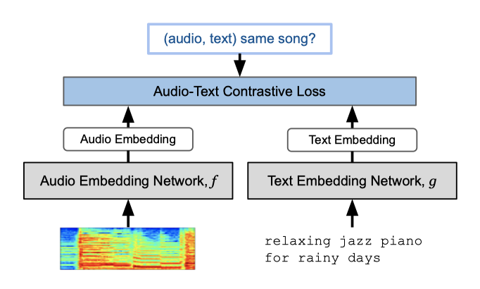
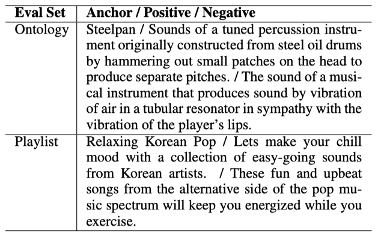
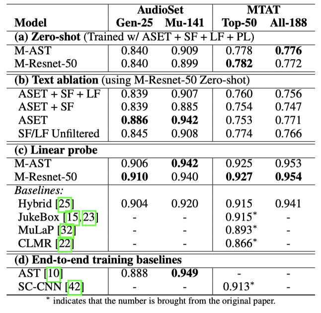
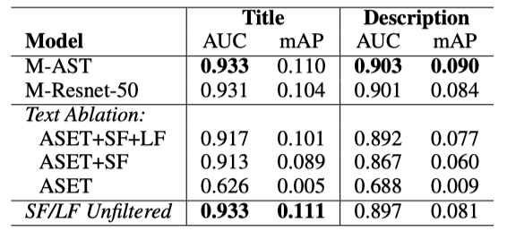
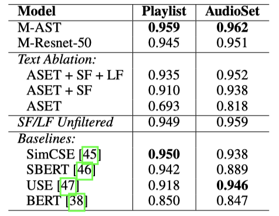

+++
author = "Kurt"
title = "MuLan"
date = "2024-03-04"
description = "A Joint Embedding of Music Audio and Natural Language"
categories = [
    "Paper Review"
]
tags = [
    "Audio",
    "Music Generation",
]
+++

## Abstract

이 논문은 "MuLan"이라는 새로운 음향 모델을 소개한다. MuLan은 44M 개의 음악 녹음과 자유 형식의 텍스트 주석을 학습하여 음악 오디오를 제한 없는 자연어 음악 설명과 직접 연결한다. 이 모델은 다양한 음악 장르와 텍스트 스타일과 호환되며, 오디오-텍스트 표현은 기존의 ontologie를 포함하면서 zero-shot 기능으로 발전하였다. 이 모델의 유연성은 전송 학습, zero-shot 음악 태깅, 음악 분야의 언어 이해 및 크로스-모달 검색 애플리케이션 등의 실험을 통해 입증되었다.

---

## Introduction

분류기는 보통 사전에 정의된 클래스 목록으로 예제들을 레이블링하도록 학습되며, 이는 클래스 간 관계를 나타내는 구조화된 체계로 지정된다. 최근 신경 언어 모델링의 발전으로, 연구자들은 원시 콘텐츠 정보에 접근하기 위한 자연어 인터페이스를 탐색하고 있다. 이는 주로 시각과 오디오 이벤트 분야에서 이루어지며, 미디어 콘텐츠와 자연어 캡션을 함께 임베딩하는 것이 전이 학습, 크로스-모달 검색, 자동 캡셔닝, zero-shot 분류 등에서 효과적임을 보여주었다.

이러한 연구의 성공은 대규모 학습 자료와 언어와 다른 모드 사이의 복잡한 관계를 모델링 할 수 있는 유연한 신경망 구조에 크게 의존한다. 특히, 시각 분야는 웹에서 대량의 캡션 이미지를 사용할 수 있어 이점을 얻었다. 그러나 환경 오디오 분야에서는 대규모 오디오-캡션 쌍이 덜 접근 가능하며, 이에 따라 작은 캡션 데이터셋에 의존하였다. 이러한 데이터셋들은 사운드를 묘사하는 언어의 다양성을 충분히 담지 못하며, zero-shot 설정에서의 성공은 여전히 부족하다.

이 논문은 오디오와 자연어를 함께 임베딩하는 작업에 대해 다루되, 특히 음악 분야에 초점을 맞춘다. 목표는 모든 음악 개념을 관련 음악 오디오와 연결할 수 있는 유연한 언어 인터페이스를 제작하는 것이다. 이를 위해, 메타데이터, 댓글, 플레이리스트 데이터에서 추출한 텍스트 주석을 44M 개 이상의 인터넷 음악 비디오 학습 세트에 매핑하는 전략을 사용한다. 하지만 텍스트 데이터가 음악 콘텐츠를 정확히 참조하는 경우는 일부에 불과하므로, 음악 설명을 식별하기 위해 별도로 학습된 텍스트 분류기를 사용한 텍스트 사전 필터링을 탐색한다.

이 논문에서는 대규모 데이터셋을 사용하여 자연어 인터페이스가 탑재된 새로운 세대의 음악 오디오 임베딩 모델인 "MuLan"을 학습시킨다. MuLan은 음악 오디오와 텍스트 간의 공유 임베딩 공간을 만들어내는 two-tower parallel encoder 구조를 사용한다. 이 모델은 다양한 음악 정보 검색 작업에서 최고 수준의 성능을 보이며, 텍스트에서 음악으로의 크로스-모달 검색, zero-shot 음악 태깅, 음악 도메인의 언어 이해 등의 기능을 가능하게 한다.

---

## Related Work

**Audio representation learning.** 대규모로 일반적인 콘텐츠 표현을 사전 학습하여 전이 학습하는 방법이 여러 분야에서 주요 접근법이 되었다. 이는 오디오 표현 학습에도 적용되었으며, 일반 환경 오디오와 음악 오디오 모두에서 다양한 사전 훈련 메커니즘이 탐색되었다. ImageNet과 AudioSet에서 사전 학습된 오디오 스펙트로그램 변환기는 다양한 태깅 작업에서 최고의 성과를 보였으며, Million Song Database를 사용한 연구에서는 음악 오디오 표현 학습의 초기 기준선을 제시하였다.

비지도 및 자기 지도 사전 학습에서는 구별적 모델과 생성적 모델 모두 성공적이었다. 구별적 학습은 같은 녹음에서 추출된 오디오 세그먼트에 더 높은 유사성을 부여하는 표현을 학습하는 방식을 사용하였다. 이와 비슷하게, SSAST는 생성적인 마스크된 스펙트로그램 패치 모델링을 탐색하였다. 생성 모델의 중간 임베딩이 downstream 분류를 위한 강력한 오디오 표현을 제공한다는 것이 확인되었으며, 사용자 상호작용 통계와 시각적 단서 같은 약한 감독도 검토되었다.

이 연구는 음악 오디오와 약하게 연결된 풍부한 텍스트 주석을 활용한 크로스-모달 감독 방법을 개발하는 것에 집중하고 있다. 이를 통해 학습된 표현의 전이 학습 능력을 평가하고, 다양한 오디오 encoder 구조를 비교 분석하고 있다.

**Cross-modal contrastive learning.** 대규모 데이터를 활용한 대조 학습의 성공에 기반하여, 이미지-텍스트 모델에 오디오 타워를 추가하고 크로스-모달 정렬을 강화하는 삼중 모드 구조를 제안하였다. 오디오 분야에서는 오디오의 잠재적 표현과 관련 태그를 정렬하기 위해 대조 학습이 사용되었다. 후속 연구에서는 사전 학습된 비문맥적 단어 임베딩 모델을 사용하여 태그를 넘어 새로운 용어로 일반화하는 능력을 지원하였다. 이 방법은 음악 도메인을 위한 오디오-텍스트 쌍의 대규모 컬렉션을 채굴하는데 초점을 맞추고 있으며, 이를 통해 처음으로 임의적인 zero-shot 음악 태깅과 검색이 가능해졌다.

**Music text joint embedding models.** 콘텐츠 기반 음악 정보 검색은 풍부한 의미를 가진 텍스트와 음악의 광범위하고 세밀한 특성을 연결하는 것을 필요로 한다. 일반적인 접근법은 다중 레이블 분류 작업을 통해 텍스트 레이블 클래스의 의미를 음악에 적용하는 것이다. 이를 위해, 음악 비디오와 연관된 자연어 텍스트에서 대량의 어휘를 추출하고, 이를 통해 오디오 인코더를 학습시키며, 텍스트 레이블을 오디오 특성과 정렬시키는 방법이 사용되었다. 또한, 분류, 회귀, 메트릭 학습 등의 다양한 학습 작업을 통해 자유 형식의 텍스트와 음악 오디오를 정렬하는 방법이 탐색되었다.

이 논문의 작업은 MuLaP와 가장 유사하며, 이 연구에서는 제작 음악 라이브러리에서 250K의 오디오-캡션 쌍을 채굴하여 multimodal Transformer를 학습시켰다. 그러나 그들의 초기 융합 방식은 전이 학습 응용에 임베딩의 활용성을 제한한다. 반면, 이 접근법은 임의의 음악 오디오에 대한 자연어 인터페이스를 제공하는 공동 임베딩 공간을 만들어, 크로스-모달 검색, zero-shot 태깅, 언어 이해 등의 가능성을 열어냈다.

---

## Proposed Approach

목표는 음악 오디오와 자유 형식의 자연어 텍스트에 대한 공유 임베딩 공간을 만드는 것으로, 이 공간에서는 근접성이 의미를 공유하는 지표로 작용한다. 이를 위해 크로스-모달 대조 학습과 두 타워 구조를 사용하며, 대규모의 (오디오, 텍스트) 쌍 훈련 데이터를 채굴하여 이 작업을 지원한다.

### Learning Framework

각 MuLan 모델은 오디오와 텍스트 입력 모달 각각에 대한 별도의 임베딩 네트워크로 구성된다. 이 두 네트워크는 가중치를 공유하지 않지만, 같은 차원의 $l_2$-normalized embedding space에서 종료한다. 오디오 임베딩 네트워크는 log mel spectrogram 컨텍스트 윈도우를, 텍스트 임베딩 네트워크는 널 패딩 텍스트 토큰 시퀀스를 입력으로 받는다.

음악 녹음과 관련 텍스트 요소를 가지고, (오디오, 텍스트) 쌍의 크로스-모달 학습 데이터셋을 구축한다. 각 녹음에서 log mel spectrogram을 계산하고, 텍스트 요소를 고정 길이로 조정한다. 그런 다음, 미니 배치는 무작위로 선택된 녹음과 그에 대응하는 텍스트 요소의 쌍으로 구성된다. 이 샘플링 방식은 학습 오디오와 모든 관련 텍스트를 전부 커버하기 위해 여러 에포크가 필요하다는 것을 의미한다. 각 예시에 대해 여러 텍스트 주석을 연결하는 실험도 진행했지만, 일반적으로는 잘 작동하지 않았다.

$$ \sum_{i=1}^{B} - log \big[ {{h[f(x^{(i)}), g(t^{(i)})]}\over{\sum_{j \neq i} h[f(x^{(i)}), g(t^{(j)})] + h[f(x^{(j)}), g(t^{(i)})] }} \big] $$

$h[a, b] = exp(a^T b/τ)$ 형태의 비평 함수 $h$는 $a, b ∈ \mathbb{R}^d$와 학습 가능한 온도 hyperparameter $τ ∈ (0, 1]$에 의존한다. 이 함수는 내적을 통해 코사인 유사도를 계산하며, 대상 오디오-텍스트 쌍에 대해 큰 값을, 비대상 쌍에 대해서는 0에 가까운 값을 생성하는 것이 목표이다. 또한, 1보다 작은 $τ$ 값은 $h$의 출력 범위를 확장한다. 이전 연구에 따르면, 대량의 배치 크기는 대조적 손실 최적화에 도움이 된다.

### Audio Embedding Network

오디오 임베딩에 검증된 Resnet-50 아키텍처를 적용하였다. 이를 위해 log mel spectrogram을 흑백 이미지로 처리하고, 학습 클립에서 무작위로 선택된 10초 윈도우를 입력으로 사용한다. 학습 중에는 SpecAugment를 적용하고, 마지막에는 시간과 mel 채널에 대한 평균 풀링과 L2 정규화된 linear fully connected layer를 적용한다. 이 모델은 AudioSet의 로지스틱 회귀를 사용하여 사전 학습되며, 최종 분류 계층은 미세 조정 전에 제거된다.

Audio Spectrogram Transformer (AST)는 log mel spectrogram에서 추출된 패치의 토큰 시퀀스에 12개의 Transformer 블록을 적용하는 아키텍처이다. 학습 중에는 SpecAugment를 적용하고, positional encoding과 [CLS] 토큰을 추가한다. [CLS] 토큰 위치에서의 최종 인코딩에 linear fully-connected layer과 L2 정규화를 적용하여 오디오 임베딩 네트워크의 출력을 형성한다. 이 모델은 공개된 AST 체크포인트를 사용하여 사전학습을 시작한다.

### Text Embedding Network

텍스트 임베딩 모델로는 일반적으로 사용되는 BERT 아키텍처를 사용한다. 이는 텍스트 입력을 토큰 시퀀스로 변환하고, [CLS] 토큰 임베딩을 오디오-텍스트 임베딩 공간으로 변환하는 역할을 한다. 이 모델은 공개 체크포인트를 사용하여 사전학습을 시작한다.

### Training Dataset Mining

5000만 개의 인터넷 음악 비디오에서 30초 클립을 추출하여 MuLan 임베딩 모델을 학습시키는 데 사용한다. 음악 오디오 감지기를 통해 음악 컨텐츠가 절반 미만인 클립을 제거한 후, 약 4400만 개의 클립, 즉 대략 370K 시간의 오디오가 남는다.

각 음악 비디오에 대해, 비디오 제목과 태그, 비디오 설명과 댓글, 그리고 데이터셋의 인터넷 음악 비디오에 연결된 재생목록 제목 등 노이즈가 많은 텍스트 데이터를 고려한다. 이러한 텍스트는 반드시 사운드트랙의 음악적 속성을 참조하고 있다는 것이 보장되지 않으며, 특히 댓글 데이터는 가장 많은 노이즈를 포함하고 있다.

노이즈가 많은 텍스트를 고려하여, 음악 서술적 주석으로 필터링된 SF 및 LF 텍스트 데이터를 사용하여 MuLan을 학습시켰다. 이를 위해, 사전 학습된 BERT 모델을 미세 조정하고, 이를 통해 LF 주석을 필터링하였다. 또한, SF 주석을 정리하기 위한 규칙 기반 필터링도 적용하였다. 하지만, 재생목록 제목과 필터링된 장형 주석은 데이터셋의 총 녹음 중 일부분만 사용할 수 있다.

AudioSet을 오디오-텍스트 쌍의 세트로 변환하여, 이를 ASET으로 표기한다. 모든 예시를 포함시키고, 각 예시에 첨부된 레이블 문자열을 텍스트 주석으로 사용하여 약 2M 개의 10초 클립 학습 세트를 생성한다. 이 네 가지 다른 데이터 소스의 규모 불균형을 고려하여, SF:LF:PL:ASET을 2:2:1:1의 비율로 미니 배치를 구성한다. 이 방식으로, 규모가 작더라도 필터링된 LF 주석이 미니 배치의 1/3를 차지하게 된다.

---

## Experiments

Resnet-50과 AST 오디오 encoder를 사용하여 MuLan을 평가하며, 두 경우 모두 텍스트 encoder로 BERT-base-uncased를 사용한다. AudioSet, 단형 태그, 장형 문장, 재생목록 정보 등, 44M 음악 녹음에서 추출한 오디오-텍스트 쌍과 처리된 텍스트 레이블에 대해 모든 모델을 14 epoch 동안 학습시킨다. M-Resnet-50과 M-AST는 비슷한 성능을 보이므로, 더 나은 학습 효율성을 위해 M-Resnet-50을 선택적으로 사용한다.

### Evaluation Tasks

#### Zero-shot Music Tagging

음악 클립의 오디오 임베딩과 태그 텍스트의 임베딩 간 코사인 유사도를 이용해 예측 점수를 정의한다. 컨텍스트 텍스트 encoder를 사용하여 유연한 예측 공간을 만들고, 크로스-모달 대조 학습을 통해 언어의 의미를 오디오 표현에 연결함으로써 보이지 않는 타겟 레이블에도 적용할 수 있다.

MagnaTagATune과 AudioSet의 음악 부분을 이용한 두 가지 음악 태깅 벤치마크로 평가를 진행한다. MagnaTagATune에서는 상위 50개 태그 세트와 전체 188개 태그 세트를 고려하며, 각 오디오 클립을 10초짜리 3개 세그먼트로 분할해 클립 레벨 임베딩을 얻는다. AudioSet에서는 25개 장르 태깅 작업과 전체 음악 하위 트리를 포함한 141개 태깅 작업을 고려한다. 테스트 세트에서의 수신기 운영 특성 곡선(AUC-ROC)의 클래스 균형을 보고한다.

AudioSet은 대조학습에 포함되고, 일부 MTAT 클래스는 AudioSet 온톨로지와 겹친다. 이로 인해 AudioSet과 MTAT 평가는 완전한 zero-shot이 아니다. 하지만, MuLan 학습 중에는 다양한 자유 형식의 언어 감독이 AudioSet 감독을 희석시킨다. 따라서 MuLan 모델과 기존 AudioSet 분류기를 비교함으로써, AudioSet 온톨로지를 넘어서는 클래스를 지원하는 유연한 자연 언어 인터페이스로 넘어가는 비용을 측정할 수 있다.

#### Transfer Learning with Linear Probes

zero-shot 실험 외에도, 오디오 encoder를 downstream 태깅 작업에 적용하는 일반적인 피처 추출기로 평가한다. MagnaTagATune과 AudioSet 벤치마크를 다시 사용하고, 학습 데이터셋을 이용해 고정된 128차원 오디오 임베딩 위에 독립적인 클래스별 로지스틱 회귀 계층을 학습시킨다. 이 방법은 이전 전이 학습 연구의 평가 프로토콜을 따르므로, 성능을 직접 비교할 수 있다.

#### Music Retrieval from Text Queries

MuLan은 임베딩 공간에서 쿼리에 가장 가까운 음악 클립을 찾는 능력을 제공한다. 이는 컨텐츠 특징이 메타데이터 기반 방법보다 더 세밀하고 완전한 유사성 정보를 제공할 수 있는 음악 검색 애플리케이션에 중요하다. 전문가가 큐레이션한 7,000개의 재생 목록을 사용하여 평가하며, 각 재생 목록은 제목, 설명, 그리고 10-100개의 음악 녹음으로 구성되어 있다. 재생 목록 평가는 약 100K의 고유 녹음을 포함한다.

전문가 큐레이션 재생 목록 데이터를 사용해 제목과 설명을 쿼리로 하는 두 개의 크로스-모달 검색 평가 세트를 만든다. 각 데이터셋에 대해 해당 재생 목록에 속하는 녹음을 검색 대상으로 사용하고, 100K 녹음 전체를 후보군으로 사용한다. AUC-ROC과 평균 정밀도(mAP)를 보고하며, zero-shot 태깅과 같은 임베딩 평균화 및 코사인 유사도 기반 점수 매기기 사용한다. 재생 목록 정보는 음악 태깅 벤치마크의 태그와는 다르게, 보다 세밀한 정보를 담고 있어 음악 검색 엔진에 제시되는 쿼리와 유사하다.

#### Text Triplet Classification

텍스트 encoder는 도메인 내 음악 데이터와 크로스-모달 대조 손실을 사용해 미세 조정되었다. 텍스트 encoder가 음악 관련 텍스트를 얼마나 잘 이해하는지 평가하기 위해, 트리플렛 분류 작업을 통해 텍스트 임베딩을 직접 평가한다. 각 트리플렛은 (앵커, 긍정, 부정) 형태의 텍스트로 이루어져 있습니다. AudioSet 온톨로지를 사용한 첫 번째 테스트 세트와 전문가 큐레이션 재생 목록 데이터를 사용한 두 번째 테스트 세트를 구성하였다.

### Results and Discussion

#### Music Tagging

zero-shot 태깅 메트릭에서 MResnet-50과 M-AST는 비슷한 성능을 보였다. 하지만 학습 텍스트의 레이블 의미와 태깅 평가의 레이블 의미 사이에는 큰 차이가 있을 수 있어, 성능이 저하될 수 있다. 특히, MTAT 간격은 AudioSet보다 크게 나타났으며, 이는 비특정적인 의미나 여러 가지 의미를 가진 태그와 간단한 부정을 포함하는 태그에서 매우 나쁜 성능 때문이다. 이는 BERT의 알려진 문제로, 부정된 개념의 의미를 적절하게 모델링하지 못한다("not rock"의 임베딩은 "rock"과 비슷하다).

AudioSet만을 사용한 학습은 AudioSet 평가에서 가장 높은 AUC를 얻지만, 일반적으로 더 많은 데이터 소스를 포함하면 다른 모든 작업에서 성능이 향상된다. 무필터 데이터로의 학습은 필터링된 버전과 비슷한 성능을 달성하는데, 이는 원시 텍스트 데이터의 노이즈에도 불구하고 모델이 유용한 연관성을 학습하는 것을 보여준다. 텍스트 필터링이 너무 공격적이었을 수 있으며, 대비 학습의 높은 노이즈 허용성 때문에, 강하게 연결된 오디오-텍스트 쌍으로 제한하는 것의 이점이 유용한 쌍의 큰 세트를 잃는 것으로 상쇄되었을 수 있다.

MuLan 오디오 임베딩에 선형 프로브를 적용하면 모든 태깅 작업에서 최고 수준의 전이 학습 성능을 달성한다. 이는 MuLan의 사전 학습된 오디오 encoder가 고품질 음악 오디오 임베딩을 계속 생성하면서 새로운 자연어 응용 프로그램을 지원한다는 것을 입증한다. 또한, 종단간 학습 기준선에 비해 선형 프로브 결과는 대부분이 더 우수하며, 최고 수준의 AST AudioSet 분류기를 약간만 뒤따른다.

#### Music Retrieval from Text Queries

MuLan 모델은 쿼리 검색 평가 작업에서 놀랍게도 강인한 성능을 보여준다. 대규모 언어 자원으로 사전 학습된 BERT를 기반으로 하지만, AudioSet 클립과 레이블 주석만으로 학습을 하면 음악에 대한 도메인 내 자연어를 연결하는 능력이 제한적이다. 그러나 인터넷에서 추출한 대규모 단형태 태그를 포함하면 모델이 더 세분화된 음악 개념을 배울 수 있게 되고, 댓글과 재생 목록 데이터를 추가하면 더 복잡한 쿼리를 연결하는 데 도움이 된다. 또한, 필터링되지 않은 학습 텍스트를 사용하여도 유사한 성능을 달성하는 것으로 보아, 주석 노이즈에 대한 훈련의 강인함이 확인된다.

### Text Triplet Classification

MuLan 텍스트 임베딩은 Sentence Transformer, SimCSE, Universal Sentence Embedding 등과 같은 기준선과 비교된다. 모든 기준선은 Transformer 기반 모델이며, MuLan 텍스트 encoder는 크로스-모달 손실로만 학습된다. 장형 텍스트 주석을 포함하면, 음악 도메인에 특화된 텍스트 임베딩 모델은 일반적인 문장 임베딩 모델을 능가한다. 놀랍게도, 텍스트 전용 미세 조정 손실을 사용하지 않아도 성공적인 특화가 이루어졌다.

---

## Conclusions

약하게 연결된 텍스트와 오디오 데이터를 이용해 학습된 음악 오디오와 자연어 공동 임베딩 모델을 제시하였다. 이 모델은 다양한 응용에서 자연어 인터페이스의 유연성을 보여주며, 음악 태깅 벤치마크에서 최고 수준의 전이 학습 성능을 보여준다. 이는 음악 오디오에 대한 자유형 자연어 인터페이스를 구축하는 첫 시도로, 약한 신호와 절대적인 노이즈를 더 잘 구분하는 개선된 텍스트 필터링 방법을 통해 더욱 발전될 수 있을 것이다.

---

## Reference

* [Paper](https://arxiv.org/pdf/2208.12415.pdf)
* [Github](https://github.com/lucidrains/musiclm-pytorch)