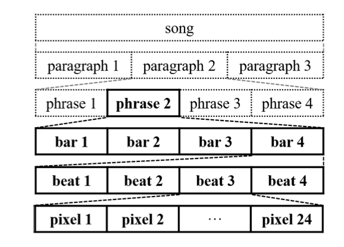
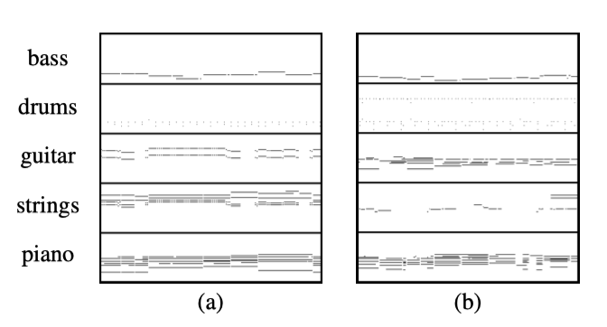
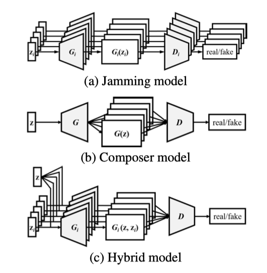
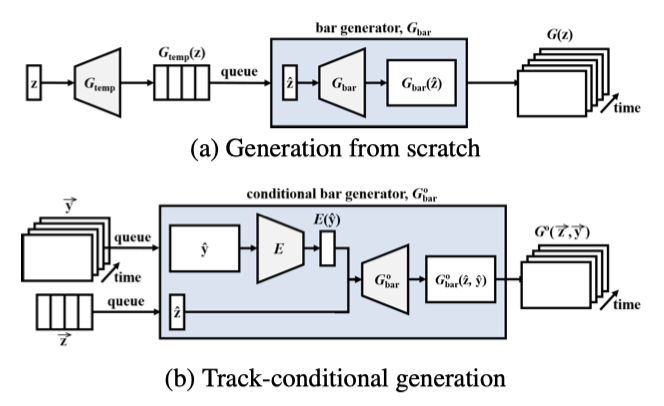
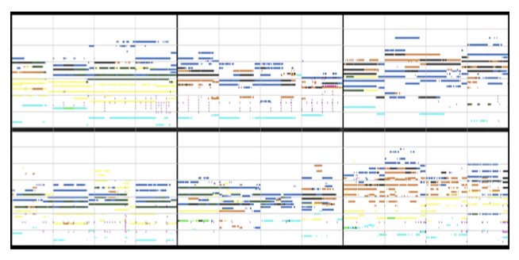
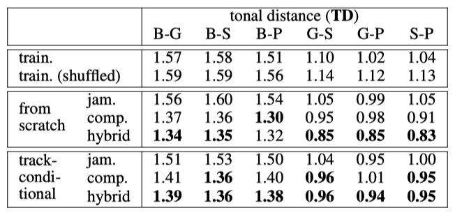
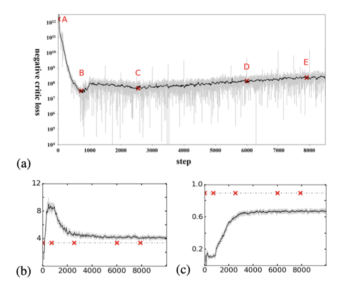
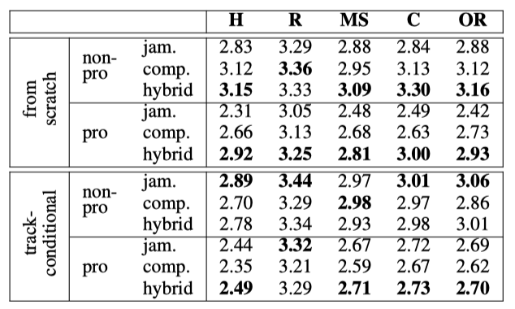

+++
author = "Kurt"
title = "MuseGAN"
date = "2024-07-15"
description = "Multi-track Sequential Generative Adversarial Networks for Symbolic Music Generation and Accompaniment"
categories = [
    "Paper Review"
]
tags = [
    "Audio",
    "Music Generation",
]
+++

## Abstract

음악 생성과 이미지, 비디오 생성 사이의 주요 차이점은 다음과 같다: 음악은 시간적 예술이므로 시간 모델이 필수적이다. 일반적으로 여러 악기/트랙이 상호작용하면서 발전하며, 음악적 음표들은 다양한 형태로 그룹화되어 시간적 순서는 자연스럽게 정렬되지 않는다. 이 논문에서는 생성적 적대 신경망(GANs)을 이용하여 심볼릭 다중 트랙 음악 생성을 위한 세 가지 모델을 제안하며, 록 음악 데이터셋을 사용하여 훈련하고 평가하였다. 이 모델들은 인간의 입력 없이도 일관된 음악을 생성할 수 있으며, 인간-AI 협력 음악 생성으로도 확장 가능함을 보여준다.

---

## Introduction

현실적이고 미적인 작품 생성은 인공지능 분야에서 흥미로운 과제 중 하나이다. 최근 몇 년간 생성적 적대 신경망(GANs)을 통해 이미지, 비디오, 텍스트 생성에서 큰 진전이 있었다. 그러나 상징적 음악 생성은 여전히 어려운 과제로 남아 있다.

첫째, 음악은 시간의 예술로, 계층적 구조를 지닌다. 사람들은 음악을 들을 때 일관성, 리듬, 긴장감, 감정 흐름에 주목한다. 따라서 시간적 구조를 고려하는 메커니즘이 중요하다.

둘째, 음악은 여러 악기/트랙으로 구성되며, 이 트랙들은 서로 밀접하게 상호작용하고 시간에 따라 함께 전개된다. 음악 이론에서는 화성이나 대위법 등 소리를 연관시키는 작곡 규율에 대한 논의가 많다.

마지막으로, 음악의 음표는 화음, 아르페지오, 멜로디로 그룹화된다. 폴리포닉 음악에서는 시간 순서 부여가 자연스럽지 않아, 자연어 생성과 모노포닉 음악 생성의 성공이 폴리포닉 음악에 바로 적용되기 어렵다.

대부분의 이전 연구에서는 상징적 음악 생성을 단순화하여 문제를 관리하였다. 단순화 방법에는 단일 트랙 모노포닉 음악 생성, 폴리포닉 음악에 시간 순서 도입, 여러 모노포닉 멜로디를 조합해 폴리포닉 음악 생성 등이 포함된다.

이 연구의 목표는 가능한 한 이러한 단순화를 피하는 것이다. 본질적으로, 다음을 목표로 하고 있습니다: 1) 화성과 리듬 구조가 있는 멀티트랙 폴리포닉 음악 생성, 2) 다트랙 간 의존성, 3) 시간적 구조.

두 가지 접근 방식을 제안한다: 하나는 인간 입력 없이 음악을 생성하는 것이며, 다른 하나는 인간이 제공한 트랙의 시간 구조를 따르도록 학습한다. 또한, 트랙 간 상호작용을 위해 세 가지 방법을 제안한다: 각 트랙에 대한 개별 생성기 사용, 하나의 생성기로 모든 트랙을 함께 생성, 각 트랙을 개별 생성기로 생성하되 트랙 간 공유 입력을 사용하여 조화롭고 조정된 결과를 얻는다. 음표 대신 막을 작곡 단위로 삼고, 트랜스포즈드 컨볼루션 신경망(CNNs)을 사용해 한 막씩 음악을 생성한다.

트랙 내 외 및 다양한 모델의 생성 결과를 목표적으로 평가하기 위해 몇 가지 측정 방법을 제안하며, 144명의 청취자를 대상으로 한 주관적 평가 결과도 보고한다.

"multi-track sequential generative adversarial network"을 MuseGAN이라고 부르며, 음악 생성에 초점을 맞추었지만 다른 영역에서도 멀티트랙 시퀀스 생성에 적용될 수 있는 설계라고 설명한다.

이 논문의 기여는 다음과 같다:

* 멀티트랙 시퀀스 생성을 위한 새로운 GAN 기반 모델을 제안한다.
* 이 제안된 모델을 적용하여 상징적 음악을 생성하였으며, 이는 처음으로 멀티트랙 폴리포닉 음악을 생성할 수 있는 모델이다.
* 제안된 모델을 트랙 조건부 생성으로 확장하였으며, 이는 인간-인공지능 협력 음악 생성이나 음악 반주에 적용될 수 있다.
* Lakh Midi Dataset (LMD)에서 유도된 173,997개의 고유한 멀티트랙 피아노 롤을 포함하는 Lakh Pianoroll Dataset (LPD)를 제시한다.
* 인공 상징적 음악을 평가하기 위해 몇 가지 트랙 내 및 트랙 간 목표적 메트릭을 제안한다.

모든 코드, 데이터셋 및 렌더링된 오디오 샘플은 프로젝트 웹사이트에서 확인할 수 있다.

---

## Generative Adversarial Networks

GANs의 핵심 개념은 생성자와 판별자라는 두 네트워크를 사용하여 적대적 학습을 이루는 것이다. 생성자는 임의의 노이즈 $z$를 데이터 공간으로 매핑하며, 판별자는 진짜 데이터와 생성된 데이터를 구별하는 데 학습된다. 이 과정은 생성자 $G$와 판별자 $D$ 간의 두 플레이어 minimax 게임으로 수학적으로 표현될 수 있다:

$$ \min_G \max_D \mathbb{E}_{x \sim p_{\text{data}}}[ \log D(x)] + \mathbb{E}_{z \sim p_z}[ \log(1 - D(G(z)))] $$

여기서 $p_{\text{data}}$는 실제 데이터의 분포를, $p_z$는 $z$의 사전 분포를 나타낸다.

Jensen-Shannon divergence 대신 Wasserstein 거리 또는 Earth Movers 거리를 사용하는 것이 GANs의 학습을 안정화하고 모드 붕괴를 방지하는 데 도움이 된다고 주장한다. 초기에는 Wasserstein GAN에서 Lipschitz 제약을 강제하기 위해 가중치 클리핑을 사용했으나, 이는 나중에 최적화에서 문제가 되었다. 이 문제를 해결하기 위해 판별자의 목적 함수에 기울기 페널티 항을 추가하는 방법을 제안하였다:

$$\mathbb{E}_{x \sim \hat{p}_d} [D(x)] - \mathbb{E}_{z \sim p_z} [D(G(z))] + \lambda \mathbb{E}_{x \sim p_x} [( \|\nabla_{\hat{x}} D(\hat{x})\|_2 - 1)^2 ],$$

여기서 $\hat{p}_x$는 실제 데이터 분포 $p_d$와 모델 분포 $p_g$에서 샘플링된 점 쌍 사이의 직선을 따라 균일하게 샘플링된 정의된 모델 분포를 나타낸다. 이 수정된 WGAN-GP 모델은 더 빠르게 수렴하고 매개변수 조정이 적게 필요하여 생성 모델링 작업에 적합하다.

---

## Proposed Model

화음 변화는 일반적으로 막의 경계에서 발생하며, 이는 노래 작곡 시 막이 기본 구성 요소로 사용된다는 것을 의미한다.

### Data Representation

다중 트랙 다성악 음악을 모델링하기 위해 다중 트랙 피아노 롤 표현을 제안한다. 이는 시간 단계별로 음표의 존재를 나타내는 이진 값의 악보 형식 행렬로서, 서로 다른 트랙의 피아노 롤로 구성된다.

한 막의 M-트랙 피아노 롤은 $x \in \lbrace 0, 1 \rbrace^{R \times S \times M}$으로 표현된다. 여기서 $R$은 막의 시간 단계 수, $S$는 음표 후보의 수, M은 트랙 수를 나타낸다. $T$ 막의 M-트랙 피아노 롤은 $\rightarrow{x} = \lbrace \rightarrow{x}(t) \rbrace_{t=1}^T$로 구성된다. $\rightarrow{x}(t) \in \lbrace 0, 1 \rbrace^{R \times S \times M}$은 막 $t$의 다중 트랙 피아노 롤을 나타낸다.

각 막의 각 트랙에 대한 피아노 롤은 실제 데이터와 생성된 데이터 모두에 대해 고정 크기의 행렬로 표현된다. 이는 CNN을 사용할 수 있게 만든다.

### Modeling the Multi-track Interdependency

음악 창작에는 두 가지 일반적인 방법이 있다. 첫째, 다양한 악기를 연주하는 음악가들이 미리 정해진 편곡 없이 즉흥적으로 연주하는 '잼 세션' 방식이다. 둘째, 조화 구조와 편곡에 대한 지식을 가진 작곡가가 악기들을 편성하고 음악가들이 이를 따라 연주하는 방식이다. 이 연구는 이러한 두 가지 접근 방식에 해당하는 세 가지 모델을 설계하였다.

**Jamming Model** 여러 생성기가 각각 랜덤 벡터 $z_i$로부터 독립적으로 음악 트랙을 생성한다. 각 생성기는 서로 다른 판별자로부터 비판을 받는다. $M$개의 트랙을 생성하기 위해 $M$개의 생성기와 판별자가 필요하다.

**Composer Model** 하나의 생성기가 여러 트랙을 포함한 피아노 롤을 생성하며, 하나의 랜덤 벡터 $z$와 판별자만 사용된다. 판별자는 $M$개의 트랙을 종합적으로 검토해 음악의 진위를 판단한다. 따라서 $M$의 값과 관계없이 생성기와 판별자는 각각 하나만 필요하다.

**Hybrid Model** 잼 세션과 작곡의 아이디어를 결합한 하이브리드 모델을 제안한다. 각 생성기는 트랙 간 랜덤 벡터 $z$와 트랙 내 랜덤 벡터 $z_i$를 입력으로 받는다. 트랙 간 랜덤 벡터가 여러 음악가의 생성 과정을 조율하며, 하나의 판별자가 $M$개의 트랙을 평가한다. 따라서 $M$개의 생성기와 하나의 판별자만 필요하다.

작곡가 모델과 하이브리드 모델의 주요 차이점은 유연성이다. 하이브리드 모델에서는 각 생성기에 대해 다른 네트워크 아키텍처와 입력을 사용할 수 있어, 특정 트랙을 다양하게 생성하면서도 트랙 간 상호 의존성을 유지할 수 있다.

### Modeling the Temporal Structure

기존 모델들은 다중 트랙 음악을 바 단위로 생성할 수 있지만, 각 바 사이에 일관성이 부족할 수 있다. 음악 구절과 같이 몇 개의 바로 이루어진 음악을 생성하기 위해 시간적 모델이 필요하다. 이를 위해 아래에서 두 가지 방법을 설계하였다.

**Generation from Scratch** 첫 번째 방법은 바 진행을 추가 차원으로 삼아 고정 길이의 음악 구절을 생성하는 것이다. 생성기는 시간 구조 생성기 $G_{temp}$와 바 생성기 $G_{bar}$로 구성되어, 잡음 벡터 $z$를 잠재 벡터 시퀀스 $\vec{z} = \lbrace \vec{z}(t) \rbrace_{t=1}^T$로 매핑한다. 이 시간 정보를 이용해 $G_{bar}$는 순차적으로 피아노 롤을 생성한다.

$$ G_{\text{piano-roll}}(\vec{z}) = G_{bar}(G_{temp}(z)(t)). $$

**Track-conditional Generation** 두 번째 방법은 특정 트랙의 바 시퀀스 $\vec{y}$가 주어지고, 이 트랙의 시간 구조를 학습하여 나머지 트랙을 생성한다. 트랙 조건 생성기 $G^\circ$는 조건부 바 생성기 $G_{bar}^\circ$를 사용해 각 바를 순차적으로 생성하며, 바 $t$의 나머지 트랙의 피아노 롤은 시간에 따라 달라지는 랜덤 잡음 $\vec{z}(t)$과 조건 $\vec{y}(t)$를 입력으로 받아 생성된다.

고차원 조건으로 조건부 생성을 위해 추가적으로 인코더 $E$가 학습되어 각 시간 단계의 $\vec{y}(t)$를 해당하는 $\vec{z}(t)$ 공간으로 매핑한다. 

$$ G^\circ(\vec{z}, \vec{y}) = \{ G_{bar}^\circ(\vec{z}(t), E[\vec{y}(t)]) \}_{t=1}^T. $$

인코더는 주어진 트랙에서 내부 트랙 특징이 아닌 트랙 간 특징을 추출할 것으로 기대되며, 내부 트랙 특징은 다른 트랙을 생성하는 데 유용하지 않을 것으로 예상된다.

---

## MuseGAN

다중 트랙 및 시간 모델을 통합한 MuseGAN의 입력 $\bar{z}$는 네 부분으로 구성된다: 트랙 간 시간 독립 랜덤 벡터 $z$, 트랙 내 시간 독립 랜덤 벡터 $z_i$, 트랙 간 시간 종속 랜덤 벡터 $z_t$, 트랙 내 시간 종속 랜덤 벡터 $z_i$, $t$.

트랙 $i (i = 1, 2, ... , M)$에서, $G_{temp}$와 $G_{temp}$, $i$는 시간 종속 랜덤 벡터 $z_t$와 $z_i$, $t$를 입력으로 받아 잠재 벡터를 출력한다. 이 벡터들과 시간 독립 랜덤 벡터 $z$ 및 $z_i$를 $G_{bar}$에 입력하여 피아노 롤을 생성한다. 생성 절차는 다음과 같다:

$$ G(\bar{z}) = { G_{bar, i} (z, G_{temp} (z_t)^{(t)}, z_i, G_{temp},i (z_i,t)^{(t)}) }_{i,t = 1}^{M, T} $$

트랙 조건부 시나리오에서는 사용자 제공 트랙에서 유용한 트랙 간 특징을 추출하는 추가 인코더 $E$가 있다. 이 과정은 유사하게 진행될 수 있으므로, 공간 제약으로 인해 세부 사항은 생략한다.

---

## Implementation

### Dataset

이 연구에서 사용된 피아노 롤 데이터셋은 Lakh MIDI 데이터셋(LMD)에서 파생된 176,581개의 고유한 MIDI 파일로 구성된다. 이를 다중 트랙 피아노 롤로 변환하고, 각 마디의 높이를 128, 시간 해상도를 96으로 설정한다. pretty midi 라이브러리를 사용해 MIDI 파일을 처리하여 Lakh Pianoroll Dataset(LPD)을 생성하였다. 또한, Million Song Dataset(MSD)과 일치하는 45,129개의 MIDI로 구성된 LPD-matched 하위 집합도 있다.

### Data Preprocessing

이 MIDI 파일들은 웹에서 수집된 사용자 생성 파일들로 노이즈가 많다. 따라서, LPD-matched를 사용하고 추가 정제를 위해 세 가지 단계를 수행한다.

일부 트랙은 적은 노트만 연주하여 데이터가 희소해지고 학습을 방해할 수 있다. 이를 해결하기 위해 유사한 악기의 트랙을 병합하여 다섯 개 트랙(베이스, 드럼, 기타, 피아노, 스트링)으로 압축한다. 이 과정에서 노이즈가 추가될 수 있지만, 비어 있는 부분을 채우는 것이 경험적으로 더 나은 결과를 보여주었다. 이 단계를 거쳐 LPD-5-matched가 생성되며, 다중 트랙 피아노 롤 30,887개를 포함한다.

Raffel and Ellis (2016)에 따르면, 트랙이 멜로디인지 반주인지 명확히 구분할 수 없어 Chu, Urtasun, and Fidler (2017)나 Yang, Chou, and Yang (2017)과 같이 트랙을 멜로디, 리듬, 드럼으로 분류할 수 없다.

둘째, 우리는 LMD와 MSD에서 제공하는 메타데이터를 활용하고, 일치하는 데 있어 더 높은 신뢰도 점수를 가진, 록 장르이면서 4/4 박자인 피아노 롤만 선택한다. 이 단계를 거쳐 LPD-5-cleansed가 생성된다.

마지막으로, 구조적 특징 알고리즘(Serrà et al. 2012)을 사용하여 피아노 롤을 세분화하여 음악적으로 의미 있는 구절을 획득한다. 구절을 네 마디로 고려하며, 총 50,266개의 구절을 적절한 크기로 적대시하여 학습 데이터로 사용한다. 특히, 고정 길이 세그먼트만 생성하는 것으로 보이지만, 트랙 조건부 모델은 입력에 따라 어떤 길이의 음악도 생성할 수 있다.

매우 낮거나 매우 높은 음표는 드물기 때문에, C1 아래 또는 C8 위의 음표를 제거한다. 따라서 목표 출력 텐서의 크기는 4 (bar) × 96 (time step) × 84 (note) × 5 (track) 이다.

### Model Settings

$G$와 $D$는 깊은 CNN으로 구현되었다. $G$는 시간 축을 먼저 확장하고, 그 다음 음 높이 축을 확장한다. $D$는 반대로 시간 축을 압축한다. Gulrajani et al. (2017)의 제안에 따라, $D$의 5번의 업데이트마다 $G$를 한 번 업데이트하며, 배치 정규화는 $G$에만 적용된다. 각 생성기의 입력 랜덤 벡터는 길이 128로 고정되며, 모델의 훈련 시간은 Tesla K40m GPU를 사용하여 24시간 미만이다. 테스트 단계에서는 $G$의 출력을 tanh 활성화 함수를 이용하여 이진화하며, 임계값은 0으로 설정한다.

---

## Objective Metrics for Evaluation

모델을 평가하기 위해 실제 데이터와 생성된 데이터 모두에 적용할 수 있는 여러 메트릭을 설계하였다. 이에는 네 가지의 트랙 내 메트릭과 한 가지의 트랙 간 메트릭(마지막 메트릭)이 포함된다.

* **EB**: 빈 마디 비율 (%).
* **UPC**: 매 마디 당 사용된 음계 클래스 수 (0에서 12까지).
* **QN**: "유효" 음표 비율 (%). 32분음표와 같이 최소 세 개의 타임 스텝 이상 지속되는 음표를 유효한 음표로 고려한다. QN은 음악이 지나치게 조각난지를 나타낸다.
* **DP** , or drum pattern: 8비트 또는 16비트 패턴에서의 음표 비율(%), 이는 4/4 시간의 록 곡에서 일반적으로 사용된다.
* **TD** or tonal distance: 두 트랙 사이의 조화적 거리를 측정한ㄴ다. 큰 TD는 트랙 간 조화 관계가 약한 것을 의미한다.

실제 데이터와 가짜 데이터의 값 비교를 통해 생성기 성능을 평가할 수 있다. 이는 GAN에서의 개념과 유사하며, 학습 과정이 진행됨에 따라 데이터 분포가 접근해야 할 이상적인 상태로 수렴하는 것을 목표로 한다.

### Analysis of Training Data

학습 데이터에 적용한 이 메트릭은 다음과 같은 결과를 보여준다: EB 값은 다섯 가지 트랙 패밀리 분류가 적절함을 시사한다. UPC에서는 베이스가 멜로디를 연주하는 경향이 있어 UPC가 2.0 이하이고, 기타, 피아노 및 스트링은 주로 코드를 연주하여 UPC가 3.0 이상이다. QN의 높은 값은 피아노 롤이 지나치게 조각난 것이 아님을 나타낸다. DP에서는 드럼 음표의 88%가 8비트 또는 16비트 패턴에 속한다는 것을 보여준다. TD는 멜로디와 코드와 같은 트랙 간의 거리를 측정할 때 약 1.50 정도이며, 두 코드와 같은 트랙 간의 경우 약 1.00이다.

---

## Experiment and Results

### Example Results

일부 관찰 결과는 다음과 같다:

* 대부분의 트랙들은 동일한 음악 음계에서 연주된다.
* 일부 샘플에서 코드 같은 간격들이 관찰된다.
* 베이스는 대부분 가장 낮은 음을 연주하며 대부분 단음성이다. (즉, 멜로디를 연주한다)
* 드럼은 일반적으로 8비트 또는 16비트 리듬 패턴을 가지고 있다.
* 기타, 피아노 및 스트링은 주로 코드를 연주하며, 음높이가 때때로 겹쳐지기도 한다 (검은 선을 생성), 이는 좋은 조화 관계를 나타낸다.

### Objective Evaluation

각 모델에서 20,000개의 마디를 생성하고 제안된 목표 메트릭을 기준으로 평가한다. 조건부 생성 시나리오에서는 피아노 트랙을 조건으로 하고 나머지 네 트랙을 생성한다. 배치 정규화 레이어가 없는 감소된 작곡가 모델의 결과도 비교 대상으로 포함된다.

인트라 트랙 메트릭에서는 잼밍 모델이 일반적으로 우수한 성능을 보인다. 모든 모델이 DP에서 잘 수행되지만, 작곡가 모델과 혼합 모델에서는 드럼의 EB가 높아 노이즈가 발생할 수 있음을 시사한다. UPC와 QN에서는 모든 모델이 학습 데이터보다 더 많은 음높이 클래스를 사용하고, 상대적으로 적은 "유효한" 음을 생성하는 경향을 보인다. 이는 이진값 피아노 롤로의 변환 과정에서 발생할 수 있는 노이즈로 해석될 수 있다.

TD 메트릭에서, 작곡가 모델과 혼합 모델이 잼밍 모델보다 TD 값이 낮다. 이는 작곡가 모델과 혼합 모델이 교차 트랙 하모닉 관계에서 더 좋은 성능을 보일 수 있음을 시사한다. 이 모델들은 다양한 트랙 조합에서 유사한 결과를 보이며, 혼합 모델은 유연성과 성능을 동시에 잘 유지하고 있음을 보여준다.

### Training Process

훈련 과정에서 작곡가 모델의 손실을 살펴보면, 초기에는 빠르게 감소하다가 포화되는 경향을 보이며, 그 이후에는 약간의 상승 추세가 나타낸다. 이는 G가 일정 시점 이후로 무엇인가를 배우기 시작한다는 신호를 준다.

학습 과정이 진행됨에 따라 각 트랙의 음 높이 범위를 빨리 파악하고, 포인트 B에서는 적절한 음 높이 범위 내에서 조각난 형태의 음을 생성하기 시작하는 것을 관찰할 수 있다. 베이스의 낮은 부분에서 점들이 모이기 시작하는 것을 확인할 수 있고, 포인트 C 이후에는 기타, 피아노 및 스트링이 긴 음표를 생성하도록 학습하는 과정을 볼 수 있다. 이 결과들은 G가 학습 과정 중에 실제로 개선되고 있다는 것을 보여준다.

(b)에서는 G가 적절한 음 높이 클래스 수를 최종적으로 학습하는 것을 확인할 수 있고, (c)에서는 QN이 훈련 데이터보다 낮은 수준을 유지하고 있어 G를 더 개선할 여지가 있다는 것을 시사한다. 이는 연구자가 주관적 테스트를 시작하기 전에 생성된 결과를 평가하는 데 이러한 메트릭을 활용할 수 있다는 점을 보여준다.

### User Study

마지막으로, 소셜 네트워크를 통해 인터넷에서 모집한 144명의 참가자를 대상으로 음악 청취 테스트를 진행하였다. 이 중 44명은 음악적 배경을 탐구하는 간단한 설문을 통해 '전문 사용자'로 분류되었다. 각 참가자는 무작위로 섞인 아홉 개의 음악 클립을 듣게 되며, 각 클립은 제안된 모델 중 하나로 생성된 세 개의 네 마디 구절로 구성되어 있다. 참가자는 5점 Likert 척도를 사용하여 각 클립을 쾌적한 조화 여부, 통일된 리듬 여부, 명확한 음악적 구조 여부, 일관성 여부, 전반적인 평가에 대해 평가한다.

하이브리드 모델은 전문가와 비전문가 모두가 처음부터 생성하는 경우와 전문가가 조건부 생성에서 선호하는 반면, 잼밍 모델은 비전문가가 조건부 생성에서 선호된다. 또한, 작곡가 모델과 혼합 모델은 처음부터 생성하는 경우 Harmonious 기준에서 잼밍 모델보다 높은 점수를 받았다. 이는 작곡가 모델과 혼합 모델이 트랙 간 상호 의존성을 처리하는 데 더 뛰어나다는 것을 시사한다.

---

## Related Work

### Video Generation using GANs

비디오 생성을 위해서는 시계열 모델이 필요하다. 이 연구의 모델 디자인은 GAN을 사용한 비디오 생성과 관련된 선행 연구들을 참고하여 개발되었다. VGAN은 비디오를 동적 전경과 정적 배경으로 분해하며, 3D와 2D CNN을 사용하여 이들을 생성하고 마스크를 통해 결합하였다. TGAN은 시간 생성기를 사용하여 고정 길이의 잠재 변수 시퀀스를 생성하고, 이를 이미지 생성기에 전달하여 비디오 프레임을 단계적으로 생성하였다. MoCoGAN은 비디오를 객체의 콘텐츠와 움직임으로 분해하고, 객체의 움직임을 캡처하기 위해 RNN을 사용하였다.

### Symbolic Music Generation

최근 연구에서는 RNN을 사용하여 다양한 형식의 음악을 생성하는 여러 심볼릭 음악 생성 모델들이 제안되었다. 예를 들어, Sturm et al. (2016)은 단음성 멜로디를 생성하고, Hadjeres, Pachet, and Nielsen(2017)은 4음성 합창곡을 생성하는 데 이 기술을 사용하였다. RNN-RBM(Boulanger-Lewandowski, Bengio, and Vincent 2012)은 단일 트랙의 다중 음악롤을 생성하는 데 성공했고, Chu, Urtasun, and Fidler(2017)은 리드 시트와 단음성 드럼 트랙을 생성하기 위해 계층적 RNN을 활용하였다.

최근 연구에서는 GAN을 이용한 음악 생성 방법들이 다양하게 탐구되고 있다. C-RNN-GAN은 음표 이벤트 시리즈를 통해 다중 음악을 생성하며, SeqGAN은 강화 학습을 활용하여 이산 토큰 시퀀스를 생성한다. MidiNet은 조건부 합성곱 GAN을 이용하여 코드 시퀀스를 따르는 멜로디를 생성하는 방법을 제안하였다.

---

## Conclusion

이 연구에서는 GANs 프레임워크를 활용하여 멀티트랙 시퀀스 생성을 위한 새로운 모델을 제안하였고, 이를 딥 CNN을 이용하여 멀티트랙 피아노 롤 생성에 구현하였다. 설계한 목표 메트릭과 주관적 사용자 연구 결과는 모델이 음악에 대해 어느 정도 학습할 수 있음을 보여준다. 아직은 인간 음악가 수준에는 미치지 못하지만, 제안된 모델은 몇 가지 우수한 특성을 가지고 있으며, 추가 연구를 통해 더 발전될 수 있기를 기대한다.

---

## Reference

* [Paper](https://arxiv.org/pdf/1709.06298)
* [GitHub](https://github.com/salu133445/musegan)
* [Demo](https://hermandong.com/musegan/)