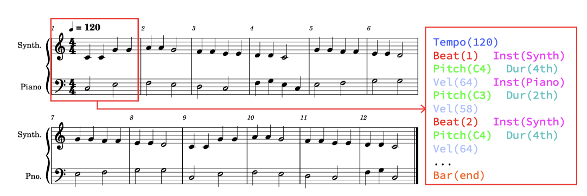
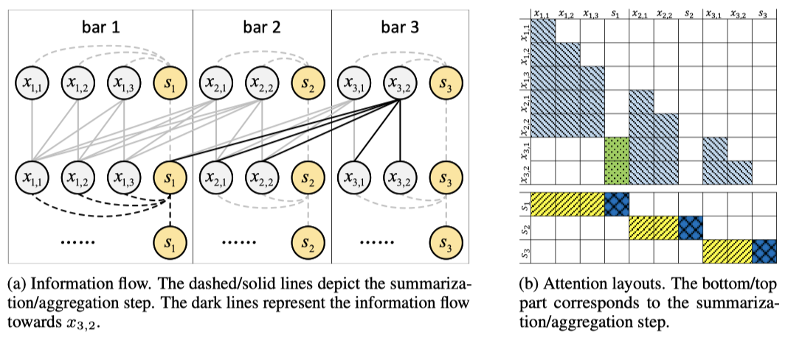
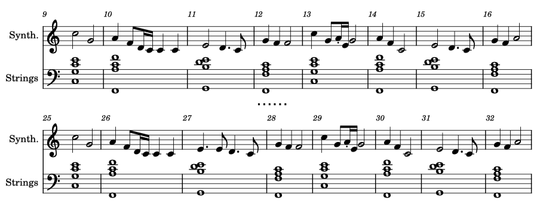

+++
author = "Kurt"
title = "Museformer"
date = "2024-08-10"
description = "Transformer with Fine- and Coarse-Grained Attention for Music Generation"
categories = [
    "Paper Review"
]
tags = [
    "Audio",
    "Music Generation",
]
+++

## Abstract

symbolic 음악 생성은 자동으로 악보를 만드는 것을 목표로 하며, 최근 Transformer 모델이 사용되지만 긴 음악 시퀀스 처리와 반복 구조 생성에 한계가 있다. 이 논문에서는 Museformer를 제안한다. Museformer는 fine-attention과 coarse-grained attention 메커니즘을 결합하여 음악 구조와 맥락 정보를 효과적으로 캡처한다. 이 방법은 full-attention 메커니즘보다 계산 효율성이 높아 3배 더 긴 음악 시퀀스를 모델링할 수 있으며, 높은 품질과 구조적 완성도를 제공한다.

---

## Introduction

기호적 음악 생성은 음악 악보를 자동으로 만드는 기술로 최근 많은 주목을 받고 있다. 음악은 텍스트와 유사하게 이산 토큰 시퀀스로 표현될 수 있어, 텍스트 생성에 성공적인 Transformer 기반 모델들이 음악 생성에 적용되고 있다. 그러나 이 기술에는 두 가지 문제가 있다: 1) 긴 시퀀스 모델링, 즉 긴 음악 시퀀스를 처리하는 데 어려움이 있으며, 2) 음악 구조 모델링, 즉 음악의 반복적 패턴과 변형을 잘 생성하는 것이 필요하다.

자연어 처리에서 긴 시퀀스를 처리하기 위해 다양한 Transformer 변형들이 개발되었지만, 음악 구조를 잘 다루지 못한다. 이 모델들은 기본 원리에 따라 두 가지 유형으로 분류할 수 있다. 첫째, **로컬 포커싱** 모델(예: Transformer-XL, Longformer)은 입력 시퀀스의 일부에만 집중하여 비용을 줄이지만 중요한 정보를 놓칠 수 있다. 둘째, **글로벌 근사** 모델(예: Linear Transformer)은 시퀀스를 선형화하여 복잡도를 줄이지만 상관관계를 정확히 포착하지 못한다. 따라서 긴 음악 시퀀스와 그 구조를 효과적으로 모델링할 수 있는 새로운 접근이 필요하다.

이 논문에서는 음악의 특성에 맞춰 두 가지 모델 유형을 통합한 접근 방식을 제안한다. 음악 시퀀스에서 중요도가 균등하지 않다는 점을 고려하여, 반복 구조를 생성할 때 가장 중요한 정보는 반복될 가능성이 있는 바들(structure-related bar)에서 가져온다. fine-grained attention는 structure-related bar에 직접 주의를 기울여 상관관계를 학습하고, coarse-grained attention는 다른 바를 요약하여 계산 및 공간 복잡도를 줄이면서 필요한 정보를 유지한다. structure-related bar는 음악 통계에 기반하여 선택되며, 최근의 바에 국한되지 않고 장기적인 구조를 반영한다.

* Museformer는 음악 생성에 새로운 세밀 및 대략적 주의 방식을 적용한 Transformer 모델로, structure-related bar의 상관관계를 세밀한 주의로 학습하고, 다른 바의 정보를 대략적 주의로 요약한다.
* structure-related bar를 인간 음악의 유사성 통계에 기반하여 선택하여 더 나은 구조의 음악을 생성한다.
* 계산 및 공간 복잡도가 거의 선형으로 줄어들어 긴 음악 시퀀스에 확장할 수 있다.
* 실험 결과, Museformer는 전체 노래 길이의 음악을 높은 품질과 뛰어난 구조로 생성한다.

---

## Related Work

### Symbolic Music Generation

기호적 음악 생성은 기계가 자동으로 음악을 작곡하도록 하는 기술이다. 이 분야는 규칙 기반 모델에서 확률론적 모델, 그리고 최근에는 딥러닝 모델로 발전해 왔다.

최근 Transformer 기반 모델은 텍스트 생성에서 성공을 거두며 음악 생성에도 활용되고 있다. Huang et al. 은 Transformer를 기호적 음악 생성에 처음 적용하여 좋은 성과를 보여주었으나, 긴 음악 시퀀스를 처리하는 데 제약이 있었다. 이 문제를 해결하기 위해 연구자들은 음악 정보를 축약하는 방법(예: compound word, OctupleMIDI)과 긴 시퀀스를 처리할 수 있는 Transformer 변형 모델(예: Transformer-XL, Linear Transformer)을 개발하였다. 그러나 이러한 변형 모델은 음악 구조를 효과적으로 모델링하는 데 한계가 있었다.

### Long-Sequence Transformers

긴 시퀀스 작업을 해결하기 위해 다양한 Transformer 변형 모델이 제안되었다. 주요 유형은 다음과 같다: 1) Recurrent Transformer, 시퀀스를 청크 단위로 처리한다. 2) Sparse attention, 사전 정의된 패턴이나 내용 기반 패턴으로 attention 레이아웃을 줄인다. 3) Linearized attention, 내적 지수를 특징 맵의 곱셈으로 대체한다. 4) Compression-based attention, 컨텍스트 표현을 압축하여 쿼리와 키-값 쌍의 수를 줄인다. 또한, Compressive Transformer는 recurrent과 compression 기반 방법을, Poolingformer와 Transformer-LS는 sparse attention과 compression 기반 방법을 결합한다.
 
기존의 긴 시퀀스 Transformer 모델은 음악의 독특한 구조를 충분히 반영하지 못한다. 음악은 반복적이거나 유사한 부분이 시간 단위(바, 비트 등)로 멀리 떨어져 있어, 기존 모델들은 이러한 구조를 효과적으로 처리하지 못한다. linearized attention이나 compression 기반 attention은 전체 시퀀스를 커버할 수 있지만, 토큰 간의 상관관계를 정확히 포착하지 못해 반복적이거나 유사한 음악 생성에 한계가 있다.

---

## Museformer

긴 음악 시퀀스와 구조를 효과적으로 모델링하기 위해, Museformer를 제안한다. Museformer는 전체 시퀀스를 동일하게 처리하는 대신, structure-related bar에는 fine-grained attention, 다른 바에는 coarse-grained attention을 적용한다. 원래의 Transformer 아키텍처를 기반으로 하며, 새로운 fine-grained 및 coarse-grained(FC-Attention)를 사용하여 긴 시퀀스 모델링의 문제를 해결한다.

Museformer는 음악 토큰 시퀀스 $X = X_1, \ldots, X_b$를 입력으로 받고, 각 바 $X_i$ 뒤에 요약 토큰 $s_i$를 삽입한다. 전체 시퀀스는 $X_1, s_1, \ldots, X_b, s_b$가 되며, 임베딩 레이어를 통해 벡터 공간으로 변환된다. Museformer 레이어는 문맥을 모델링하고, 마지막 레이어의 출력을 소프트맥스 분류기로 전달하여 다음 토큰을 예측한다.

### Preliminary: Attention

attention 메커니즘은 FC-Attention의 기초로, 소스 $X$와 타겟 $X'$를 입력으로 받아 타겟의 각 토큰 $x'$에 대한 문맥적 표현을 계산한다. 계산식은 다음과 같다:

$$ \text{Attn}(x'_i, X) = \text{softmax}\left(\frac{x'_i W_Q (X W_K)^\top}{\sqrt{d}}\right) (X W_V) $$

여기서 $W_Q$, $W_K$, $W_V$는 학습 가능한 파라미터이며, 실제로는 multi-head attention을 사용한다.

### Fine- and Coarse-Grained Attention

FC-Attention은 특정 바의 토큰이 구조적 음악 생성을 위해 중요한 바에만 세밀하게 주의를 기울이고, 나머지 바에는 요약 토큰을 통해 대략적으로 주의를 기울이는 방식이다. 먼저 각 바의 지역 정보를 요약하고, 이후 세밀한 정보와 대략적인 정보를 통합한다.

**Summarization** 요약 단계에서는 각 바의 정보를 요약 토큰으로 집계한다. $i$번째 바의 경우, 요약은 다음과 같이 계산된다:

$$ \tilde{s_i} = \text{Attn}(s_i, [X_i, s_i]) $$

여기서 각 요약 토큰은 자신의 바의 음악 토큰과 요약 토큰에 주의를 기울인다.

**Aggregation** 집계 단계에서는 structure-related bar의 토큰 정보, 현재 바 내의 이전 토큰, 그리고 다른 바의 요약 정보를 통해 음악 토큰의 문맥 표현을 업데이트한다. $i$번째 바의 $x_{i,j}$ 업데이트는 다음과 같이 계산된다:

$$ \tilde{x_{i,j}} = \text{Attn}(x_{i,j}, [X_{R(i)}, X_{i,k \leq j}, \tilde{S}_{\bar{R(i)}}]) $$

여기서 $x_{i,j}$는 structure-related bar의 토큰과 현재 바 내의 이전 토큰에 주의를 기울이며, 다른 바에는 요약 토큰에만 주의를 기울인다.

### Structure-Related Bar Selection

structure-related bar를 식별하기 위해, 유사성 통계를 사용하여 유사성이 높은 바를 선택한다. 학습 세트의 각 곡에 대해, 각 바 쌍의 유사성은 다음과 같이 계산된다:

$$ l_{i,j} = \frac{|N(i) \cap N(j)|}{|N(i) \cup N(j)|} $$

여기서 $N(i)$는 $i$번째 바의 노트 집합을 나타내며, 두 노트가 동일하려면 음높이, 길이, 시작 위치가 같아야 한다. $l_{i,j}$는 0.0에서 1.0 사이의 값을 가지며, 값이 1.0이면 두 바가 동일하다. 학습 세트 $D$에서 간격이 $t$인 바 쌍의 평균 유사성은 다음과 같이 계산된다:

$$ L_t = \text{Mean}\left(\sum_{i} \sum_{j=i+t} l_{i,j}\right) $$

이 논문에서는 바 간격에 대한 유사성 분포를 소개하며, 뚜렷한 주기적 패턴을 보여줍니다. 음악 바는 이전 2개의 바와, 그리고 대부분의 경우 이전 4번째 바와 유사한 경향이 있다. 다양한 장르와 스타일의 음악에서도 이 패턴이 보편적으로 적용된다고 나타나며, 일상 음악에 일반적인 규칙으로 간주될 수 있다고 믿는다.

통계 결과를 바탕으로, 기본적으로 1번째, 2번째, 4번째, 8번째, 12번째, 16번째, 24번째, 32번째 바를 구조와 관련된 바로 선택하였다. 이 바들은 대부분의 경우 가장 유사한 바를 포괄한다. 선택된 바의 수는 효율성과 정보 풍부성 간의 균형을 고려한 것이며, 데이터셋에 따라 조정할 수 있다. 이 선택은 모든 곡에 완벽하지는 않지만, Museformer가 더 나은 음악 구조를 생성하는 데 도움이 된다.

### Merits of Museformer

Museformer가 음악 생성 작업에 적합한 이유는 다음과 같다.

fine-grained attention은 음악의 특성에 맞추어 구조 관련 정보를 잘 포괄한다. 기존 모델들이 고정된 패턴이나 내용 기반 패턴을 사용하는 반면, Museformer는 사람의 음악에서 유도된 구조와 관련된 바를 사용하여 단기와 장기 음악 구조를 모두 생성할 수 있다.

coarse-grained attention은 필요한 정보를 보존하여 더 나은 음악 생성을 돕는다. 기존의 sparse attention이 많은 정보를 생략할 수 있는 반면, coarse-grained attention은 다른 바의 정보를 보존해 풍부한 단서를 제공한다.

Museformer는 fine-grained attention과 coarse-grained attention을 결합하여 긴 음악 시퀀스를 효율적으로 처리한다. 구조 관련 바와 요약 토큰의 수가 적어 메모리와 실행 시간이 줄어든다.

---

## Experiments

### Experiment Settings

**Dataset and Music Representation** Lakh MIDI (LMD) 데이터셋을 사용하여 실험을 수행하였다. 이 데이터셋에는 전처리 후 29,940곡(1,727시간)이 포함되어 있으며, 각 곡은 평균 95마디로 구성된다. 악기는 스퀘어 신디사이저, 피아노, 기타, 스트링, 베이스, 드럼의 6종으로 병합되며, REMI 유사 표현 방법으로 MIDI를 토큰 시퀀스로 변환한다. 각 곡은 평균 15,042개의 토큰으로, 각 마디는 평균 158개의 토큰으로 표현된다. 데이터는 8:1:1 비율로 학ㅂ, 검증, 테스트 세트로 나누어진다.

**Implementation** Museformer는 PyTorch와 fairseq으로 구현되었으며, FC-Attention의 계산을 위해 CUDA 커널로 attention 레이아웃을 구성한 뒤, blocksparse 형식으로 변환하여 SparTA로 처리합니다.

**Model and Training Configurations** Museformer의 주요 매개변수는 layer 수 4, hidden size 512, attention head 수 8, FFN hidden size 2,048 이다. 학습 시 배치 크기는 4 이며, Adam optimizer를 사용하여 learning rate를 선형적으로 증가시키고 이후 감소시킨다. L2 weight decay는 0.01로 설정한다. 추론 시에는 k = 8로 top-k 샘플링을 사용하고, 생성은 최대 길이 20,480 또는 종료 토큰 생성 시까지 계속한다.

**Compared Models** Museformer를 음악 생성에 주로 사용되는 4개의 대표적인 Transformer 기반 모델과 비교한다.

* **Music Transformer**: memory-efficient "skewing" 상대 위치 임베딩 구현을 가진 일반 Transformer 모델이다.
* **Transformer-XL**: 시퀀스를 청크 단위로 인코딩하고 이전 청크의 그래디언트가 멈춘 표현을 메모리로 사용하는 순환 Transformer이다.
* **Longformer**: 슬라이딩 윈도우 sparse attention을 사용하는 모델이다.
* **Linear Transformer**: 선형 복잡도의 kernel-based attention을 사용하는 모델이다.

비교된 모든 모델은 Museformer와 유사한 하이퍼파라미터로 설정되었으며, Music Transformer는 메모리 제한으로 인해 긴 시퀀스를 한 번에 처리할 수 없으므로 학습 시 곡을 여러 청크로 나누고, 검증 및 추론 시에는 긴 시퀀스를 생성하여 성능을 테스트한다.

**Objective Evaluation** 다음의 객관적인 지표를 사용하여 모델을 평가한다:

* **Perplexity (PPL)**: 생성 모델이 미래 토큰을 얼마나 잘 예측하는지 측정한다. 값이 작을수록 좋으며, 샘플의 처음 1,024, 5,120, 또는 10,240 토큰에서 계산된다.
* **Similarity Error (SE)**: 생성된 음악과 훈련 데이터 간의 구조적 유사성을 평가한다. 값이 작을수록 생성된 음악의 구조가 인간이 만든 음악과 유사하다.

$$ SE = \frac{1}{T} \sum_{t=1}^{T} | L_t - \hat{L}_t | $$

**Subjective Evaluation** 음악 생성 모델 평가를 위해, 100개의 음악 조각을 무작위로 생성하고 10명의 평가자(7명은 음악 관련 경험이 있음)를 초대하여 1에서 10까지 점수를 매기도록 한다. 평가자는 Museformer와 비교 모델이 생성한 5개의 음악 조각을 포함하는 5개의 그룹을 평가한다.

* **Musicality**: 음악의 즐거움과 현실성 평가.
* **Short-term structure**: 인접 콘텐츠의 구조적 적합성 평가.
* **Long-term structure**: 긴 거리의 구조적 적합성 평가.
* **Overall**: 전체 점수 및 선호 점수(그룹 내 최고 점수 횟수 비율).

### Comparison with Previous Models

Music Transformer는 짧은 시퀀스에서는 유사한 PPL을 보이지만 긴 시퀀스에서는 성능이 크게 저하된다. 긴 시퀀스를 모델링하려면 적합한 Transformer 모델이 필요하다. Linear Transformer는 전체 시퀀스를 커버할 수 있지만, 복잡한 음악의 상관관계를 잘 포착하지 못해 PPL에서 두각을 나타내지 않는다. Museformer는 다양한 시퀀스 길이에서 일관되게 최고의 PPL을 기록하며, 특히 긴 시퀀스에서 뛰어난 성능을 보여준다. Museformer가 생성한 음악은 인간이 만든 음악과 가장 유사한 구조를 가진다.

주관적 평가 결과에서 Museformer는 모든 지표에서 최고 점수를 기록하였으며, 특히 장기 구조에서 다른 모델들보다 월등한 성능을 보여주었다. 이는 FC-Attention이 먼 마디 간의 상관관계를 잘 포착함을 의미한다.

쌍별 비교 결과에서 Museformer는 다른 모델들보다 더 많은 승리를 기록하였으며, p-value는 Museformer의 통계적으로 유의미한 개선을 나타낸다(p < 0.05).

### Ablation Study

Museformer 구성 요소의 효과를 다음과 같이 검증한다. 1) w/o coarse-grained의 효과를 보기 위해, structure-related bar와 이전 마디만을 사용하는 설정과 비교한다. 2) w/o bar selection의 효과를 보기 위해, 가장 최근 8개의 마디를 사용하는 설정과 비교한다.

결과를 통해 다음을 확인할 수 있다. 1) Museformer는 두 가지 제거 설정에 비해 PPL과 SE 모두에서 우수한 성능을 보이며, coarse-grained attention와 structure-related bar selection의 효과를 입증한다. 2) coarse-grained attention는 필요 정보를 유지하고 PPL을 감소시키는 데 도움을 준다. 3) structure-related bar selection의 효과는 시퀀스 길이가 길어질수록 커지며, 이는 먼 마디 간 상관관계를 더 잘 포착하기 때문이다. 4) SE 결과는 마디 선택이 음악 구조에 기여함을 보여준다. 추가로, 이전 마디에 대한 fine-grained attention을 비활성화한 결과, 요약 정보만으로는 일관된 음악 생성이 부족하다는 것을 알 수 있었다.

### Complexity Analysis

시퀀스 길이를 $n$, 평균 마디 수를 $b$, 평균 마디 길이를 $m$, 선택된 구조 관련 마디 수를 $k$라고 할 때, FC-Attention의 시간 복잡도는 요약 단계가 $O(n)$, 집계 단계가 $O((km + b)n)$이다. 따라서 전체 복잡도는 $O((km + b)n) = O((km + n/m)n)$로, $n$의 제곱에 비례하지만 큰 $m$ 값으로 인해 실제 복잡도는 선형과 제곱 사이이다. 복잡도는 입력에 따라 달라지며, 실제 응용에서의 효율성이 중요하다.

FC-Attention의 효율성을 확인하기 위해, Museformer와 full attention 모델을 검증 세트에서 학습하고 메모리와 실행 시간을 측정하였다. Museformer는 메모리 소비가 시퀀스 길이에 대해 선형적으로 증가하며, full attention 모델보다 3배 더 긴 시퀀스를 처리할 수 있다. 또한, 시퀀스 길이가 약 5,000을 초과하면 더 빠른 학습 시간을 기록한다.

### Case Study

Museformer가 생성한 곡의 일부분을 보여준다. 문자열 트랙에서 13-16번째 마디는 9-12번째 마디를 4마디 간격으로 반복하며 단기 구조를, 25-32번째 마디는 9-16번째 마디를 16마디 간격으로 반복하면서 장기 구조를 보여준다. 이와 같은 방식으로 Museformer는 단순 반복뿐만 아니라 변형을 통해 음악을 생성할 수 있다. 다른 트랙들도 비슷한 구간에서 변형을 추가하여 음악의 발전을 더한다. 

---

## Conclusion

긴 시퀀스와 음악 구조 모델링 문제를 해결하기 위해 Museformer를 제안한다. Museformer는 fine-grained attention와 coarse-grained attention를 사용하여 구조적 상관관계를 학습하고 전체적인 스케치를 생성한다. structure-related bar는 유사도 통계를 통해 선택된다. 실험 결과, Museformer는 효율적이며 품질 높은 음악을 생성할 수 있음을 보여준다.

Museformer는 아직 완벽하지 않으며, 그 한계와 미래 방향에 대해 논의할 필요가 있다. 랜덤 샘플링과 수동 조정의 부재로 인해 생성된 음악이 항상 기대한 대로 잘 구조화되지 않을 수 있다. 신뢰성과 제어성을 향상시키기 위한 연구가 필요하다. 또한, 생성된 음악의 음악성과 창의성은 여전히 인간 음악에 미치지 못하며, 이는 모든 음악 생성 모델의 공통된 문제이다. 더 정교한 음악 표현과 대규모 데이터로 학습된 모델이 도움이 될 수 있다. Museformer는 음악 이해 작업에 적합하며, 자연어 처리에서는 의미적으로 관련된 문장이나 문서를 결정하는 새로운 도전 과제가 될 수 있다.

---

## Reference

* [Paper](https://arxiv.org/pdf/2210.10349)
* [GitHub](https://github.com/microsoft/muzic)