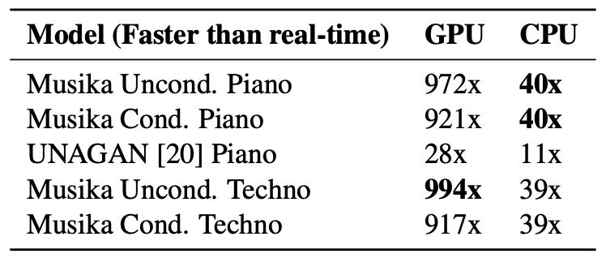
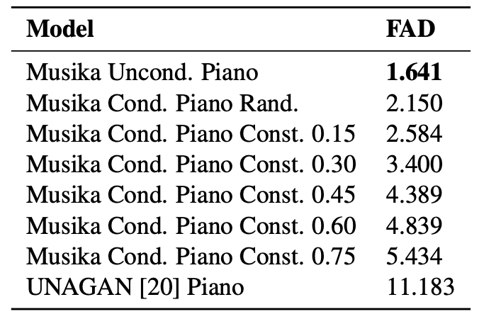

+++
author = "Kurt"
title = "Musika!"
date = "2024-09-20"
description = "Fast Infinite Waveform Music Generation"
categories = [
    "Paper Review"
]
tags = [
    "Audio",
    "Music Generation",
]
+++

## Abstract

Musika는 수백 시간의 음악을 단일 GPU에서 학습하고, 소비자 CPU에서 임의 길이의 음악을 실시간보다 빠르게 생성할 수 있는 시스템이다. adversarial  오토인코더로 스펙트로그램의 압축 표현을 학습한 후, 이 표현을 GAN으로 특정 음악 도메인에 맞게 학습한다. 잠재 좌표 시스템과 글로벌 컨텍스트 벡터를 사용하여 음악을 병렬로 생성하고 스타일을 유지한다. 정량적 평가와 사용자 제어 옵션을 제공하며, 코드와 사전 훈련된 가중치는 github.com/marcoppasini/musika에서 제공된다.

---

# Introduction

raw 오디오 생성은 높은 시간적 차원성으로 인해 어렵다. 최근 딥러닝 기반 기법들이 제안되었지만, 낮은 음악 품질, 시간 프레임 간 일관성 부족, 느린 생성 속도와 같은 한계를 가지고 있다. autoregressive 모델은 고품질 오디오를 생성할 수 있지만 샘플링 속도가 느려 실제 응용에 제한이 있다. 반면, non-autoregressive 모델은 실시간 생성이 가능하지만 음질이 떨어지고 고정된 길이의 샘플만 생성할 수 있다.

non-autoregressive 오디오 생성 시스템의 단점을 고려하여, 이 연구에서는 임의의 길이의 오디오를 빠르게 비조건부 및 조건부로 생성할 수 있는 GAN 기반 시스템 Musika를 제안한다. 이를 위해 다음의 기여를 결합한다:

- **원시 오디오 오토인코더 사용**: 저차원 가역 표현으로 샘플을 인코딩하고, 추론 속도 극대화 및 훈련 시간 최소화를 위해 효율적인 적대적 학습을 설계한다.  
- **잠재 좌표계 사용**: 무한 길이 오디오 생성을 위한 시스템 구축한다.  
- **글로벌 스타일 조건 추가**: 시간에 따라 스타일 일관성을 유지하며 무한 길이 샘플 생성한다.  
- **비조건부 및 조건부 생성 가능성**: 음표 밀도 및 템포 정보 등 다양한 조건 신호를 활용한다. 

autoregressive를 피함으로써, 생성이 완전히 병렬화될 수 있어 CPU에서도 실시간보다 훨씬 빠르게 작동한다.

---

## Related Work

오디오 생성을 위한 인기 있는 자기회귀 모델에는 WaveNet, SampleRNN, Jukebox가 있다. WaveNet은 원시 오디오의 자기회귀 생성을 최초로 보여주며, 팽창 합성을 통해 큰 수용 영역을 확보한다. SampleRNN은 계층적 순환 유닛 스택으로 다양한 해상도에서 파형을 모델링하여 더 큰 컨텍스트를 포착하고 계산 비용을 줄인다. Jukebox는 계층적 VQVAE를 사용해 원시 샘플을 이산 코드로 인코딩하고, 자기회귀 변환기로 샘플을 생성한다. 하지만 이들 시스템은 오디오 샘플이 순차적으로 생성되기 때문에 속도가 매우 느리며, Jukebox는 1분의 오디오 생성에 8시간 이상 걸린다. RAVE는 변분 오토인코더를 통해 실시간 합성을 달성하지만, 짧은 수용 영역으로 인해 멀리 떨어진 시간 창의 의존성을 모델링할 수 없다.

비자기회귀 모델은 느린 순차 생성을 피하지만 주로 조건부 오디오 합성에 사용되며, 저차원 오디오 표현을 원래 파형으로 되돌리는 작업에 집중한 연구가 많다. 장기 비자기회귀 비조건부 오디오 생성에 대한 연구는 부족하며, WaveGAN, SpecGAN, GANSynth, DrumGAN, MP3Net과 같은 시스템은 고정된 길이의 오디오를 생성하려고 시도한다. WaveGAN과 SpecGAN은 각각 파형과 스펙트로그램에 GAN을 성공적으로 적용한 초기 연구이다. GANSynth는 순간 주파수와 스펙트로그램 크기를 생성하여 조화로운 소리에 유리함을 보여주고, DrumGAN은 복소 STFT 스펙트로그램을 사용해 드럼 소리를 합성한다. MP3Net은 MDCT 스펙트로그램으로 일관된 피아노 음악을 생성하지만 음질이 낮다. UNAGAN은 임의의 길이의 오디오를 생성할 수 있는 유일한 비자기회귀 GAN 기반 시스템으로, 단기 일관성을 위해 계층 구조를 사용하지만 단일 채널 오디오만 생성하고 시간적 일관성이 부족하다.

자기회귀 모델과는 달리 대부분의 GAN 기반 비조건부 오디오 생성 모델은 고정된 길이의 오디오 샘플만 합성할 수 있다. 그러나 최근 컴퓨터 비전 연구에서는 이미지를 임의의 크기로 생성할 수 있는 모델들이 제안되었으며, 이는 개별 이미지 패치를 병렬로 합성한 후 조합하는 방식으로, 현대 하드웨어에서 빠르고 효율적인 생성이 가능하다. 대표적인 예로 InfinityGAN과 ALIS가 있으며, InfinityGAN은 일관된 패치를 병렬로 생성하고 ALIS는 잠재 벡터를 앵커 포인트로 사용하여 일관된 패치를 생성한다. 그러나 두 방법 모두 특정 이미지 도메인에 대한 사전 지식이 필요하며, 주로 풍경 이미지 데이터셋에서 실험이 이루어졌다.

인코딩된 표현의 시퀀스를 생성하는 과정은 이미지와 오디오 데이터에 대해 여러 연구에서 다루어졌다. 하지만 대부분의 연구는 벡터 양자화 변분 오토인코더를 사용해 샘플을 이산 코드로 인코딩하고, 이를 자기회귀 모델로 모델링하는 데 중점을 두었다. 이전 연구에서는 기본 오토인코더로 분자를 자동 인코딩한 후 GAN을 통해 연속 값 잠재 벡터 시퀀스를 생성하는 방법을 제안하여, 이산 데이터에 대한 GAN의 문제를 해결하였다. 이 연구는 오디오의 잠재 표현을 생성하여 빠른 생성 및 훈련과 긴 시간 창에서 일관된 샘플 생성을 목표로 한다.

---

## Method

$ x = \lbrace x_1, \ldots, x_T \rbrace $를 오디오 샘플의 파형으로 정의하고, 이를 시간 압축 비율 $ r_{\text{time}} $로 샘플링된 잠재 벡터 시퀀스 $ c = \lbrace c_1, \ldots, c_{T/r_{\text{time}}} \rbrace $로 인코딩하는 것을 목표로 한다. 이를 위해 오토인코더 모델을 사용하여 인코딩된 벡터로부터 원래 파형을 재구성한다.

생성적 적대 신경망(GAN)을 사용하여 분포 $ p(c) $를 모델링하고, 생성기 $ G $가 임의의 길이의 잠재 벡터 시퀀스를 생성할 수 있도록 잠재 좌표 시스템을 활용한다. 또한, 다양한 조건 신호로 생성기를 조건화하여 생성 과정이 인간의 입력에 의해 안내되도록 한다. 마지막으로, 생성된 잠재 벡터 시퀀스는 학습된 디코더를 통해 파형으로 변환된다.

### Audio Autoencoder

파형의 고차원성으로 인해 긴 원시 오디오 샘플 시퀀스를 생성하는 것은 비용이 많이 든다. 음성 처리 및 음악 정보 검색에서 자주 사용되는 오디오 표현은 단시간 푸리에 변환(STFT) 스펙트로그램이다. 일반적으로 위상 성분은 버려지지만, 오디오 합성에서는 원래 파형을 얻기 위해 진폭과 위상 성분 모두가 필요하다.

추론 및 학습 시간을 최소화하고 합리적인 정확도로 샘플을 재구성하기 위해 압축 비율을 극대화하는 오디오 오토인코더를 설계하였다. 이 오토인코더는 로그-진폭 STFT 스펙트로그램을 입력으로 받아 진폭과 위상 스펙트로그램을 출력하여 파형으로 변환할 수 있다. iSTFTNet은 STFT 스펙트로그램의 진폭과 위상을 생성하여 추론 속도를 개선하려 하지만, 매우 높은 시간 해상도와 낮은 주파수 해상도를 사용한 실험만 수행한다. 반면, 이 모델은 낮은 시간 해상도와 높은 주파수 해상도의 스펙트로그램을 재구성하여 더 높은 추론 속도를 기대한다. 두 개의 스택 오토인코더를 별도로 학습하여 더 높은 압축 비율과 만족스러운 재구성 품질을 달성하며, RAVE와 유사한 두 단계 학습 과정을 활용합니다.

#### First training phase

모델을 로그-진폭 스펙트로그램을 자동 인코딩하도록 학습하며, 현재 위상은 생성하지 않는다. 재구성 작업에는 L1 손실 함수를 사용한다:

$$
L(Enc, Dec)_{\text{rec}} = \mathbb{E}\_{s \sim p(s)} || Dec(Enc(s)) - s ||_1
$$

여기서 $Enc$와 $Dec$는 인코더와 디코더, $s$는 파형 $w$의 로그-진폭 스펙트로그램이다.

#### Second training phase

두 번째 단계에서는 인코더 가중치를 고정하고 디코더가 위상 스펙트로그램을 생성하여 역 단시간 푸리에 변환(iSTFT)을 통해 파형을 재구성한다. 진폭과 위상을 모두 모델링하기 위해 적대적 목표를 추가하여, 인지적으로 만족스러운 품질을 보장한다. 위상 스펙트로그램을 직접 모델링하는 대신, 진폭 스펙트로그램이 현실감 있게 보이도록 유도한다. 구체적으로, 재구성된 파형 $\tilde{w}$에서 로그-진폭 스펙트로그램 $\tilde{s}$를 계산한다:

$$
\tilde{w} = \text{iSTFT}(Dec(Enc(s))) \\\
\tilde{s} = \log(|\text{STFT}(\tilde{w})|^2 + \epsilon)
$$

재구성된 스펙트로그램 $\tilde{s}$는 판별기 $D$에 입력되어 원본 $s$와 구별하기 위해 힌지 손실을 사용한다:

$$
L_D = -\mathbb{E}_{s \sim p(s)}[\min(0, -1 + D(s))] - \mathbb{E}\_{s \sim p(s)}[\min(0, -1 - D(\tilde{s}))]
$$

디코더는 판별기를 속이도록 학습된다:

$$
L_{Dec,adv} = -\mathbb{E}_{s \sim p(s)} D(\tilde{s})
$$

재구성된 파형에서 스펙트로그램을 계산할 때, 오토인코더에 입력된 스펙트로그램과 다른 홉 크기 및 윈도우 길이를 사용할 수 있다. 디코더의 목표에 다중 스케일 스펙트럴 거리를 포함하여 이를 활용한다:

$$
L_{Dec,ms} = \mathbb{E}_{w \sim p(w)} \sum\_{hop}^N log \big( || |\text{STFT}\_{hop}(w)| - |\text{STFT}\_{hop}(\tilde{w})| ||_1 \big)
$$

결과적으로, 판별기를 $L_D$로 학습하고, 디코더는 세 가지 손실의 선형 조합으로 학습된다:

$$
L_{Dec} = L_{Dec,adv} + \lambda_{rec} L_{Dec,rec} + \lambda_{ms} L_{Dec,ms}
$$

### Latent Coordinate System

GAN을 사용하여 학습된 오디오 인코더의 잠재 벡터 시퀀스를 모델링한다. 서로 독립적인 오디오 샘플을 생성하고 매끄럽게 연결하기 위해, 잠재 좌표 시스템으로 생성기를 조건화한다. 학습 중, 세 개의 노이즈 벡터 $ w_l, w_c, w_r $를 샘플링하여 앵커 포인트로 사용하고, 이들을 선형 보간하여 길이가 $ 4 \cdot \text{seq\_len} + 1 $인 좌표 벡터 시퀀스를 생성한다:

$$
w = [w_l, \ldots, (1-k)w_l + k w_c, \ldots, w_c, \ldots, w_r] \in \mathbb{R}^{4\text{seq\_len}+1 \times d}
$$

시간적으로 일관된 시퀀스를 생성하기 위해, $ w $에서 $ 2 \cdot \text{seq\_len} $ 길이의 좌표 벡터 시퀀스 $ w_{12} $를 무작위로 자르고, 이를 길이 $ \text{seq\_len} $의 두 시퀀스 $ w_1, w_2 $로 나누어 패치를 생성한 후, 두 패치를 연결하여 판별기에 입력한다. 이는 생성기가 잠재 좌표 시퀀스를 생성된 잠재 벡터 시퀀스와 정렬하도록 하며, 인접한 시퀀스가 시간적으로 연결되어 일관된 최종 샘플을 생성할 수 있도록 학습한다.

InfinityGAN과 같이, 인접한 잠재 벡터 시퀀스를 생성할 때 단일 랜덤 벡터 $ z_{\text{sty}} $로 두 생성 과정을 조건화하여 전체 스타일을 통일한다. 잠재 좌표 벡터는 시간 축을 따라 매끄러운 연결을, 글로벌 스타일 벡터는 무한 길이 시퀀스의 스타일적 일관성을 보장한다. 이를 공식화하면:

$$
\hat{c} = \text{concat}[G(w_1, z_{\text{sty}}), G(w_2, z_{\text{sty}})]
$$

여기서 $ \hat{c} $는 길이가 2·seq\_len인 스타일적으로 일관된 잠재 벡터 시퀀스이다.

추론 시 원하는 길이의 잠재 좌표 시퀀스를 생성하고, 잠재 앵커 벡터를 선형 보간해 중간 벡터를 계산한다. 글로벌 스타일 벡터를 샘플링하여 각 생성 과정에서 사용하고, 생성된 잠재 벡터들을 연결한다. 이 과정은 병렬로 처리되어 빠른 생성이 가능하다.

---

## Implementation Details

### Audio Autoencoder Architecture

먼저 낮은 압축 비율로 오디오 오토인코더를 학습한 후, 첫 번째 단계에서 생성된 잠재 벡터를 인코딩하는 두 번째 오토인코더를 학습한다. 두 번째 단계에서는 첫 번째 단계의 디코더 가중치를 고정하고, 두 디코더가 재구성한 샘플을 적대적으로 구별하는 전략을 사용한다. 두 인코더와 디코더는 1D 컨볼루션을 사용하여 경계 아티팩트를 방지하며, 판별기에는 2D 컨볼루션을 사용한다. 각 인코더의 병목층에는 Tanh 활성 함수를 사용하고, 다중 스케일 스펙트럴 손실과 스펙트럴 정규화를 적용하였다. 첫 번째 오토인코더는 100만 번, 두 번째 오토인코더는 40만 번의 반복을 통해 학습된다.

### Latent GAN Architecture

FastGAN 아키텍처를 수정하여 1D 컨볼루션을 사용하고, 판별기의 재구성 목표를 단순화해 경량 디코더로 전체 입력을 재구성하였다. 생성기에서는 SLE 모듈을 적용해 경사를 더 잘 전파하고, SA-AdaIN을 사용해 스타일을 조정하였다. 스테레오 샘플 생성을 위해 두 개의 잠재 벡터를 생성하고, CCM 기법을 사용해 채널을 섞어 붕괴 현상을 줄였다. R1 경사 페널티와 Adam 옵티마이저를 사용해 RTX 2080 Ti에서 23시간 동안 150만 번의 반복 훈련을 수행하였다.

---

## Experiments

첫 번째 오토인코더의 낮은 압축 비율로 저수준 오디오 특징만 인코딩하여 다양한 음악 도메인에서 사용할 범용 모델을 학습할 수 있음을 확인하였다. 학습 데이터로는 SXSW에서 공개한 17,000개의 곡과 LibriTTS 코퍼스를 사용해 노래 목소리 재구성을 개선하였다. 오디오는 22.05kHz로 샘플링했고, 단일 채널로 오토인코더를 학습했다. 잠재 GAN은 두 개의 모노 샘플을 쌓아 스테레오 샘플을 생성하며, 시간 압축 비율을 256으로 설정해 샘플링 속도는 190.22Hz, 잠재 벡터의 차원은 128이다.

### Piano Music

200시간의 피아노 공연으로 구성된 MAESTRO 데이터셋을 사용하여 두 번째 단계의 오토인코더와 잠재 GAN을 학습한다. 최종 시간 압축 비율은 $ r_{\text{time}} = 4096 $이며, 이는 샘플링 속도를 11.89Hz로 설정한다. 각 잠재 벡터의 차원은 32이다. 무조건적 및 조건부 모델을 모두 학습하며, 생성기는 시퀀스 길이 $ \text{seq\_len} = 64 $의 잠재 벡터를 출력하여 약 12초의 오디오를 생성한다. 조건부 모델에서는 madmom 라이브러리의 CNN 기반 시작 감지기를 사용하여 감지된 시작 지점에 대해 가우시안 커널 밀도 추정을 적용하여 연속 음표 밀도 신호를 생성하고, 이를 조건 신호로 사용한다.

### Techno Music

jamendo.com에서 "테크노" 장르로 분류된 10,190곡을 학습 데이터로 사용하여 두 번째 단계의 오토인코더를 학습한다. 이 오토인코더는 SXSW 데이터로 학습된 첫 번째 단계의 범용 오토인코더를 기반으로 하며, 단일 도메인에서 학습할 때보다 낮은 압축 비율로 만족스러운 재구성을 달성할 수 있다. 최종 시간 압축 비율은 $ r_{\text{time}} = 2048 $로, 두 번째 단계의 잠재 표현 샘플링 속도는 23.78 Hz이다. 각 잠재 벡터는 64 차원이며, 무조건적 및 조건부 잠재 GAN 모델을 학습하여 시퀀스 길이 $ \text{seq\_len} = 128 $의 스테레오 잠재 벡터를 생성하고 약 12초의 디코딩된 오디오를 만든다. Tempo-CNN 프레임워크를 사용하여 각 곡의 전체 템포를 추정하고, 이 정보는 조건부 모델의 조건으로 활용된다.

---

## Results

생성된 오디오 샘플은 marcoppasini.github.io/musika에서 확인할 수 있으며, 정량적 평가 지표로는 음악의 작곡 및 품질을 평가할 수 없으므로 샘플 청취를 권장한다.

MAESTRO 및 테크노 데이터셋에서 훈련된 시스템의 생성 속도를 GPU와 CPU에서 비교하고, 생성된 피아노 샘플의 품질을 Frechét Audio Distance (FAD) 지표로 평가하였다. 이 시스템은 스테레오 오디오를 생성할 수 있는 반면, UNAGAN은 단일 채널 오디오만 생성한다. 무조건적 모델이 가장 낮은 FAD를 얻었고, 조건부 모델은 높은 음표 밀도 값을 사용할 때 더 높은 FAD를 보여주었다. 낮은 음표 밀도의 샘플이 더 일반적이기 때문이다. FAD는 샘플의 전반적인 음악적 품질을 평가하기 위한 지표가 아니며, 시스템이 생성한 피아노 및 테크노 샘플은 장기적인 일관성을 보이고 고정된 음악 스타일을 유지한다. 두 조건부 모델은 조건 신호와 일관된 샘플을 성공적으로 생성하였다.

---

## Conclusion

이 논문은 Musika를 제안하며, 이는 소비자 CPU에서 실시간보다 훨씬 빠르게 임의의 길이의 원시 오디오 샘플을 생성하는 비자기 회귀 음악 생성 시스템이다. 계층 오토인코더를 통해 오디오를 저차원 잠재 벡터로 인코딩하고, GAN을 사용하여 무한한 길이의 샘플을 생성한다. 스타일 일관성을 위해 스타일 조건 벡터를 도입하였고, 피아노 및 테크노 음악을 생성하며 음표 밀도와 템포 정보를 조건으로 설정할 수 있음을 보여준다. 이 시스템은 비교 가능한 시스템보다 낮은 FAD를 달성하며, 소스 코드와 사전 학습된 모델을 공개하여 사용자가 쉽게 샘플을 생성하고 테스트할 수 있도록 한다. Musika는 사용자 입력에 기반한 실시간 음악 생성을 가능하게 하여, 향후 인터랙티브한 애플리케이션 및 인간-AI 공동 창작 연구의 기반이 되기를 희망한다.

---

## Reference

* [Paper](https://arxiv.org/pdf/2208.08706)
* [GitHub](https://github.com/marcoppasini/musika)