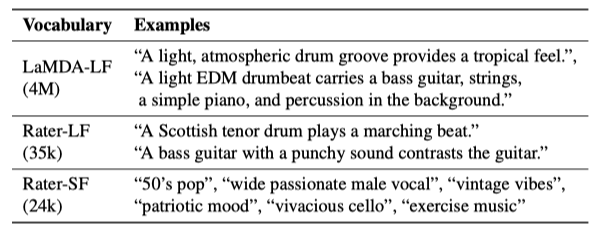
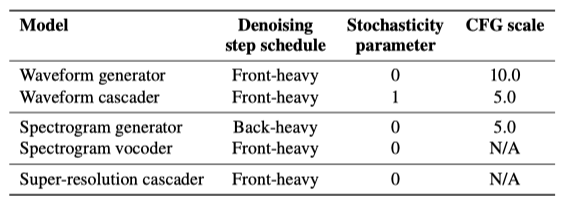
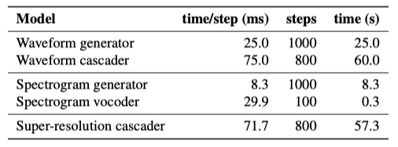
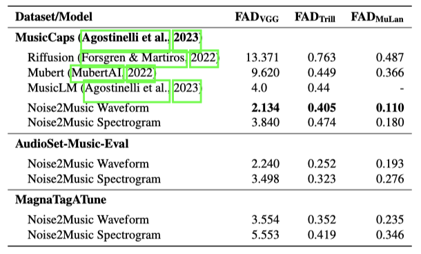
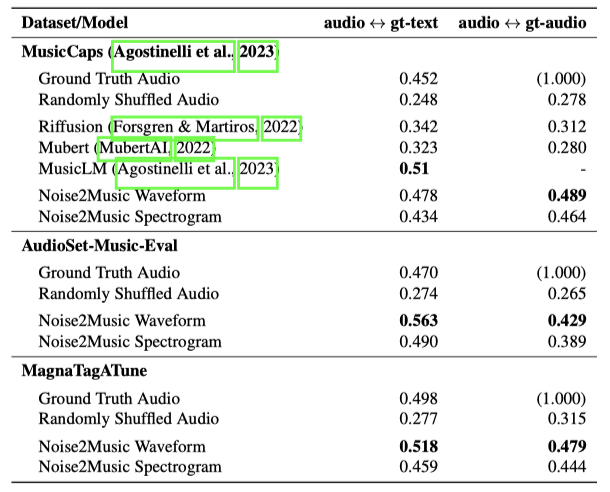
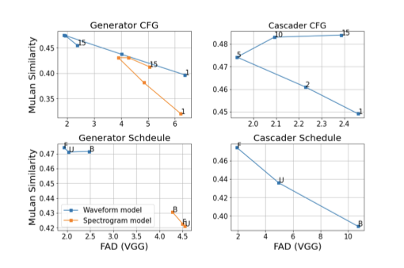
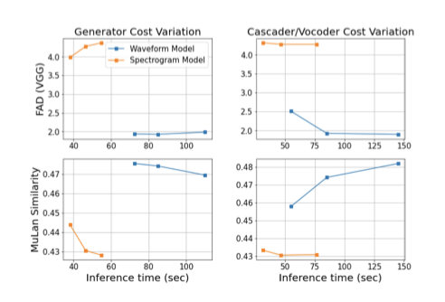

+++
author = "Kurt"
title = "Noise2Music"
date = "2024-05-29"
description = "Text-conditioned Music Generation with Diffusion Models"
categories = [
    "Paper Review"
]
tags = [
    "Audio",
    "Music Generation",
]
+++

## Abstract

Noise2Music은 텍스트 프롬프트로부터 30초짜리 고품질 음악 클립을 생성하는 diffusion 모델 시리즈이다. 텍스트에 기반한 중간 표현을 생성하는 생성 모델과 고해상도 오디오를 생성하는 캐스케이더 모델을 이용해, 장르, 템포, 악기 등의 텍스트 프롬프트 요소를 반영하는 음악을 만든다. 중간 표현으로는 spectrogram과 낮은 해상도 오디오가 사용된다. 이 과정에서 사전 학습된 대규모 언어 모델이 학습 세트 오디오의 텍스트를 생성하고 텍스트 프롬프트의 임베딩을 추출하는 데 중요한 역할을 한다.

---

## Introduction

Noise2Music은 텍스트 프롬프트로부터 30초 길이, 24kHz 음악 클립을 생성하는 diffusion 기반 방법이다.

**Modeling:** 텍스트 프롬프트로부터 30초 웨이브폼의 압축 표현을 생성하는 연쇄 diffusion 모델을 학습시키고, 이를 기반으로 16kHz 웨이브폼을 생성 후, 최종적으로 24kHz 오디오로 슈퍼 해상도 증가시킨다. 중간 표현으로는 log-mel spectrogram 또는 3.2kHz 웨이브폼을 사용하며, 1D U-Nets와 사전 학습된 언어 모델(LM)을 통해 학습한다.

**Data mining:** deep generative 모델을 위한 고품질 샘플 생성에 필수적인 대량의 학습 데이터를 구축하기 위해, 다양한 음악 오디오 클립과 설명적 텍스트 라벨을 짝지어진 대규모 데이터셋을 만들기 위해 데이터 마이닝 파이프라인을 사용하였다. 이 과정에서 대형 언어 모델과 사전 학습된 음악-텍스트 공동 임베딩 모델을 활용하여 오디오 클립에 대한 텍스트 라벨을 생성하고, 약 150K시간의 오디오 소스에 가짜 라벨을 붙여 학습 데이터를 구성하였다.

**MuLaMCap:** 이 작업을 통해 생성된 MuLan-LaMDA Music Caption 데이터셋(MuLaMCap)은 AudioSet의 음악 콘텐츠에 주석을 달아 얻은 약 400K의 음악-텍스트 쌍으로 구성되어 있다. 원본 AudioSet의 632개 라벨 중 141개만 음악 관련이었던 것에 비해, MuLaMCap은 400만 개의 다양하고 세밀한 음악 설명 어휘를 바탕으로 한다. 이 데이터셋은 사운드 분류를 넘어 음악 캡셔닝, 검색, 생성 등의 다양한 응용 분야에서 활용될 것으로 기대된다.

**Evaluation:** 텍스트 조건부 음악 생성 모델의 품질을 Fréchet Audio Distance (FAD)와 MuLan 유사도 점수 두 가지 지표를 사용하여 측정한다. FAD는 생성된 오디오 클립의 품질을 AudioSet과 MagnaTagATune 같은 벤치마크 데이터셋과 비교하고, MuLan 유사도 점수는 텍스트 프롬프트와 생성된 오디오 클립 간의 의미적 일치를 평가한다.

**Generative ability:** 이 연구의 모델은 장르, 악기, 시대 등의 기본 음악 속성을 넘어 분위기나 느낌 같은 세밀한 속성을 반영하는 복잡한 의미론을 처리할 수 있음을 입증한다. 이는 메타데이터 태그뿐만 아니라 사전 학습된 음악-텍스트 임베딩 모델을 활용하여 오디오 특성에 의미론을 연결하는 학습 데이터셋 구축을 통해 달성되었다.

---

## Related Work

**Generative models:** deep generative 모델은 다양한 도메인에서 성공을 거두어왔으며, 최근에는 고품질 샘플 생성을 위해 데이터셋 크기를 확장하는 데 집중하고 있다. 여기에는 텍스트, 음성, 이미지, 오디오에서의 최근 발전이 포함된다.

**Diffusion models:** diffusion 모델은 고품질의 이미지, 오디오, 비디오 생성에 효과적임을 입증하였다. 특히, 저품질 이미지에서 시작해 연속적으로 정제하여 고품질 이미지를 만드는 캐스케이드 확산 모델은 오디오 생성에도 적용되었다.

**Audio generation:** 외부 입력에 조건을 둔 오디오 생성 방법으로, 텍스트 조건의 spectrogram 및 오디오 생성이 연구되었다. 설명적 텍스트 기반 오디오 생성에서는 AudioGen이 auto-regressive 방법을, DiffSound가 diffusion 기반 방법을 사용하였다. 음악 생성에서는 Jukebox, Mubert, MusicLM이 auto-regressive 방식을, Riffusion이 diffusion 방식을 사용하였다.

**Conditional signals in audio generation:** 모델이 특정 스타일의 음악을 생성하도록 유도하는 조건 신호를 parameterized 하고 전달하는 두 가지 접근 방식이 있다. 하나는 신호를 사전 정의된 임베딩 공간에 투영하는 것으로, Jukebox는 아티스트와 장르의 고정된 어휘를, Mubert는 태그 집합을 사용한다. 다른 하나는 AudioGen과 MusicLM처럼 사전 학습된 텍스트 인코더로 사용자 프롬프트를 인코딩하는 방식이다.

---

## Methods

### Diffusion models

diffusion 모델은 random noise에서 반복적으로 denoising 하여 샘플을 생성하는 생성 모델이다. 이 논문에서는 작업 이해에 필수적인 기본 정보만을 다룬다.

diffusion 모델의 입력은 조건 신호 $c$, 무작위로 샘플링된 시간 단계 $t$, 그리고 시간 $t$에서의 잡음의 표준 편차 $σ_t$로 parameterized 된 noise 일정을 통해 손상된 원본 샘플 $x$로부터 얻은 샘플 $x_t$이다. 시간의 범위는 [0, 1]이며, diffusion은 시간이 증가함에 따라 진행된다. gaussian diffusion process은 표준 정규 분포에 속하는 단일 noise 벡터로 완전히 설명될 수 있으며, $x_t$는 원본 샘플, noise 일정, noise 벡터의 함수로 표현된다. 모델은 이 입력을 바탕으로 잡음 벡터를 식별하도록 학습되며, diffusion loss는 이러한 과정을 기반으로 계산된다.

$$ \mathbb{E}_{x,c, \epsilon,t} = \big[ w_t \parallel \epsilon_{\theta} ( x_t, c, t ) - \epsilon \parallel^2 \big] $$

여기서 $w_t$는 선택한 고정 가중치 함수이다.

추론은 시간 $t = 1$에서 무작위 잡음을 취하고 모델의 잡음 예측을 이용해 제거함으로써 이루어진다. 이 과정에서 ancestral (또는 DDPM) 샘플링을 사용하여, 생성된 샘플의 품질에 영향을 줄 수 있는 여러 parameter를 조절할 수 있는 유연한 추론 방법을 제공한다. 샘플러의 확률성 수준을 조절할 수 있고, 임의의 제거 일정을 설정하여 제거 단계를 조절할 수 있다.

diffusion 모델 학습 시 다양한 선택지가 있으며, 이와 관련된 여러 옵션들의 자세한 내용은 부가 자료에서 확인할 수 있다.

* Loss weight($w_t$): simplified weight $w_t = 1$ 및 sigma weight $w_t = σ_t^2$
* Variance schedule: linear and cosine schedules
* Stochasticity parameter: $ γ = 0 or 1$
* Denoising step schedule

**Classifier-free guidance (CFG):** CFG(Ho & Salimans, 2022)는 생성된 샘플과 조건부 입력의 일치성을 높이기 위해 학습 중 일부 조건부 입력을 숨김으로써 네트워크가 노이즈 벡터를 조건부 및 비조건부로 예측하도록 한다. 추론 시, 조건부 입력 유무에 따라 계산된 노이즈 벡터를 사용하며, CFG로 인한 과포화를 막기 위해 dynamic clipping이 적용된다.

### Architecture

diffusion 모델을 위한 1D Efficient U-Net을 배포한다. 이 모델은 다운샘플링 및 업샘플링 블록, self/cross-attention layer, combine layer으로 구성되며, two-dimensional convolution을 일차원으로 대체한 구조를 가진다. 

모델로의 진입 가능한 네 가지 경로는 다음과 같다: 1) 일정 길이 $T$의 시퀀스로 구성된 쌓인 입력과 출력, 2) 잡음이 섞인 샘플 $x_t$를 포함한 입력과 잡음 예측으로 해석되는 출력, 3) 업샘플링된 저품질 오디오, 4) cross-attention을 통한 임의 길이 벡터 시퀀스의 상호작용. 또한, U-Net의 "U" 바닥에 추가함으로써 시퀀스의 압축된 표현에 대해 모델을 조건화할 수 있다.

### Cascaded diffusion

텍스트 프롬프트로부터 고품질의 30초 오디오를 생성하기 위해 두 가지 diffusion 모델을 학습한다. generator 모델은 텍스트 프롬프트에 기반한 intermediate representation을, cascader 모델은 이 intermediate representation을 바탕으로 최종 오디오를 생성한다. intermediate representation으로는 저품질 오디오와 spectrogram을 사용한다.

#### WAVEFORM MODEL

**Generator Model:** generator 모델은 텍스트 입력에 따라 3.2kHz 오디오를 생성하고, 텍스트에서 파생된 벡터 시퀀스를 cross-attention 시퀀스로 네트워크에 입력한다.

**Cascader Model:** cascader 모델은 텍스트 프롬프트와 generator 모델이 생성한 저품질 오디오를 기반으로 16kHz 오디오를 생성한다. 텍스트 conditioning은 cross-attention를 통해 이루어지며, 저품질 오디오는 FFT와 inverse FFT 변환을 통해 업샘플링되어 모델에 입력된다.

#### SPECTROGRAM MODEL

**Generator Model:** 이 모델은 텍스트에 따라 log-mel spectrogram을 생성하며, spectrogram은 80채널과 초당 100특징을 가진다. 입력과 출력에 채널 차원이 추가되고, spectrogram 픽셀 값은 [-1, 1]로 정규화된다. 텍스트 conditioning은 cross-attention로 달성된다.

**Vocoder Model:** vocoder 모델은 spectrogram에 conditioning된 16kHz 오디오를 생성하며, spectrogram은 정렬된 입력으로 사용된다. U-Net 모델의 샘플링 비율은 spectrogram의 압축 비율을 맞추기 위해 조정된다.

#### SUPER-RESOLUTION CASCADER

경량 cascader는 16kHz 파형을 업샘플링하여 24kHz 오디오를 생성하며, 텍스트 conditioning은 사용되지 않는다.

### Text understanding

강력한 텍스트 인코더가 음악 기술 텍스트의 복잡성을 잘 포착할 수 있음을 입증한 연구를 바탕으로, T5 인코더를 사용하여 비풀링 토큰 임베딩 시퀀스로 diffusion 모델을 conditioning 한다. 다른 대규모 언어 모델이나 음악-텍스트 쌍에 대해 훈련된 CLIP 기반 임베딩과의 비교는 이 작업의 범위를 벗어난다.

### Pseudo labeling for music audio

대규모 학습 데이터는 generative deep neural network의 품질을 보장하는 데 필수적이다. 예를 들어, Imagen은 O(1B) 이미지-텍스트 쌍으로 학습되었다. 음악 콘텐츠는 널리 존재하지만, 고품질의 음악-텍스트 쌍 데이터는 제목, 아티스트 이름 등 기본 메타데이터를 넘어서는 경우 드물다.

MuLan과 LaMDA 모델을 활용하여 미분류 음악 오디오 클립에 세밀한 의미의 가짜 라벨을 할당하는 방식으로 음악-텍스트 쌍을 생성한다.

다양한 음악 설명 텍스트로 구성된 여러 음악 캡션 어휘 집합을 만들었다. 이 텍스트들은 MagnaTagATune, FMA, AudioSet과 같은 표준 음악 분류 벤치마크의 캡션과는 규모와 세밀한 의미에서 차이가 있다.

**LaMDA-LF:** LaMDA 언어 모델을 사용해 노래 제목과 아티스트 이름을 바탕으로 15만 개의 인기 곡을 설명한다. 이를 통해 음악 설명 가능성이 높은 400만 개의 문장을 생성하였다. 대화형 애플리케이션 학습을 받은 LaMDA는 음악 생성용 사용자 프롬프트와 더 잘 어울리는 텍스트 생성을 목표로 한다.

**Rater-LF:** MusicCaps에서 얻은 10,028개의 캡션을 분리하여, 35,333개의 음악 설명 문장을 생성하였다.

**Rater-SF:** 위 평가 세트에서 평가자가 작성한 모든 단문 형식의 음악 측면 태그를 수집했으며, 이는 23,906개의 어휘로 구성된다.

MuLan 모델은 레이블 없는 오디오 클립에 캡션을 할당하기 위한 zero-shot 음악 분류기로, 대규모 노이즈가 있는 텍스트-음악 쌍 데이터에 대해 대조적 학습을 통해 학습된 텍스트와 오디오 인코더를 사용한다. 이 모델은 10초 길이 음악 클립과 해당 설명 문장을 의미 임베딩 공간에서 가깝게 배치한다. 각 클립에 대해서는 오디오 임베딩을 계산하고, 임베딩 공간에서 오디오에 가장 가까운 상위 K개 캡션을 선정한다. 라벨 분포의 균형과 캡션 다양성 증가를 위해 빈도수에 반비례하는 확률로 추가 캡션을 샘플링한다. 여기서 $K=10$, $K'=3$이다.

대규모 학습 세트의 사전 라벨링 준비로, AudioSet에서 유래한 MuLaMCap이라는 음악 캡셔닝 데이터셋을 생성하였다. 이 데이터셋은 AudioSet의 음악 분야 라벨을 가진 388,262개 학습 세트 및 4,497개 테스트 세트 예시에 사전 라벨링 방법을 적용해 만들어졌으며, 각 10초 음악 오디오는 LaMDA-LF와 평가자-LF에서 각각 3개, 평가자-SF에서 6개의 캡션과 연결된다.

### Training data mining

약 680만 개의 음악 오디오 파일을 수집하고 각각에서 30초 길이의 6개 클립을 추출해 대규모 오디오-텍스트 쌍 컬렉션을 만들었다. 총 34만 시간의 음악이며, super-resoluton 모델은 24kHz, 기타 모델은 16kHz로 샘플링하여 학습된다.

각 사운드트랙에 대해 노래 제목, 관련 엔티티 태그, 그리고 LaMDA-LF와 Rater-SF 어휘에서 유래한 사전 레이블을 포함한 세 가지 유형의 텍스트 레이블을 사용한다. 사전 레이블은 활동과 기분, 구성 요소의 미세한 의미를 포함한 주관적 설명을 제공하여 엔티티 태그를 보완한다. 그러나 Rater-LF 어휘의 사전 레이블은 MusicCaps 평가에서 유래된 문장 때문에 학습 데이터에서 제외된다.

대규모 사전 라벨링된 학습 세트에 저작권이 필요 없는 음악 라이브러리에서 가져온 고품질 오디오를 추가하였다. 음악 트랙은 30초 클립으로 나누고, 메타데이터는 텍스트 프롬프트로 사용합니다. 이는 약 300시간의 주석이 달린 오디오를 훈련 데이터에 추가하는 것이다.

---

## Experiments and Results

### Model training details

이 작업을 위해 1D U-Net 모델 4개, waveform generator, cascader, spectrogram generator 및 vocoder를 학습시켰다. spectrogram generator의 수렴을 위해 sigma-weighted loss가 중요했음을 발견하였다. 이는 노이즈 제거 일정의 후반부에서 손실을 더 많이 가중하는 방식이다.

vocoder를 제외한 모든 모델은 오디오-텍스트 쌍으로 학습되며, vocoder는 오디오만으로 학습된다. 각 오디오 샘플에 대해 텍스트 배치가 형성된다. 세 개의 긴 프롬프트는 텍스트 배치의 세 개의 독립적인 요소를 구성하고, 짧은 프롬프트는 연결된 후 설정된 토큰 길이로 분할되어 텍스트 배치에 추가된다. 각 오디오 클립에 대해 해당 텍스트 배치의 랜덤 요소가 학습 시 선택되어 오디오에 대응하는 텍스트로 모델에 제공된다.

모델들은 $β_1 = 0.9$와 $β_2 = 0.999$로 설정된 Adam 최적화 알고리즘과 cosine learning rate 스케줄(peak 1e-4, 10k warm-up step, 2.5M step)을 사용하여 학습된다. EMA는 decay rate 0.9999로 계산되어 추론 시 사용된다. superresolution cascader는 배치 크기 4096, 다른 모델들은 배치 크기 2048으로 학습된다. 추론 시 CFG를 적용하기 위해 각 배치의 10% 샘플에 대해 텍스트 프롬프트를 차단하고 cross attention layer 출력을 0으로 설정한다.

generator 모델은 self-attention을 사용하여 30초 전체 오디오로 학습되지만, cascader와 vocoder는 self-attention을 사용하지 않고 3~4초의 짧은 구간으로 학습된다.

cascader/vocoder 모델 학습 시, 저품질 오디오나 spectrogram에 diffusion 노이즈를 적용하는 증강과 블러 증강이 사용된다. diffusion 노이즈는 $[0, t_{max}]$ 내 무작위 시간에 적용되며, cascader는 $t_{max} = 0.5$, vocoder와 super-resolution cascader는 $t_{max} = 1.0$이다. 블러 증강은 cascader에는 1D 크기 10, vocoder에는 2D 5x5 커널이 적용된다.

### Model inference and serving

#### MODEL INFERENCE

세 가지 추론 hyperparameter인 denoising 스케줄, stochasticity parameter, 그리고 CFG 스케일을 조정한다.

denoising step 스케줄은 시간 단계 크기 $[δ_1, ..., δ_n]$로 매개변수화되며, 이는 누적을 통해 denoising step으로 변환된다. 추론 비용은 시간 단계 수에 비례하므로, 고정된 추론 비용으로 시간 단계를 총 시간 1에 맞게 분배한다. 세 가지 스케줄인 "front-heavy" "uniform" "back-heavy"을 실험한다. front-heavy는 $t = 0$ 근처에, back-heavy는 $t = 1$ 근처에 많은 step을 할당한다. uniform은 균등하게 간격을 둔 시간 단계를 사용한다. 정확한 스케줄은 보충 자료에 제공된다.

#### MODEL SERVING

Google Cloud TPU V4에서 모델을 제공하고, 각 요청으로 30초 길이 음악 클립 4개를 생성한다. GSPMD를 사용해 모델을 네 TPU V4 장치에 분할하여 응답 시간을 50% 이상 단축하였다.

### Evaluation

#### PARAMETER SELECTION FOR THE MODELS

모델 parameter는 저자들의 판단과 컴퓨팅 자원 및 시간의 가용성을 고려하여 경험적으로 선택된다. 저자들이 만든 독립적인 개발 프롬프트를 통해 학습된 모델로 오디오를 생성하며, 평가는 16kHz 파형으로 진행되나, super-resolution cascader는 사용되지 않는다.

#### EVALUATION METRICS

텍스트 조건 음악 생성 모델의 품질을 FAD와 MuLan 유사도 점수로 측정한다.

FAD는 생성된 오디오 예제의 품질을 참조 오디오 클립과 비교하여 측정한다. 오디오 인코더를 사용해 두 세트의 오디오 임베딩을 계산하고, 이 임베딩 분포가 가우시안 분포라고 가정하여 평균 벡터와 상관 행렬을 통해 Frechet 거리를 계산한다.

FAD 지표 계산을 위해 세 가지 오디오 인코더가 사용된다: VGG, Trill, MuLan. VGG와 Trill은 프레임별 임베딩을, MuLan은 클립별 임베딩을 생성한다. 이 인코더들은 서로 다른 데이터셋과 작업에서 학습되어, 각기 다른 오디오 측면에 초점을 맞춘다. FAD VGG가 일반 오디오 품질, FAD Trill이 음성 품질, FAD MuLan이 음악적 의미를 평가한다고 가정한다.

contrastive 모델 MuLan은 오디오-텍스트 및 오디오-오디오 쌍의 유사성을 코사인 유사도로 정량화한다. 음악-텍스트 쌍 평가 세트에서, 텍스트 프롬프트로 생성된 오디오와 해당 텍스트 또는 실제 오디오 간의 평균 유사성을 계산한다. 또한, 평가 세트의 평균 MuLan 유사도를 실제 오디오와 비교하고, 셔플된 랜덤 오디오 쌍과도 비교한다.

#### EVALUATION DATASETS

평가 데이터셋에 대한 모델의 FAD를 Riffusion 3과 Mubert 4의 기준 모델과 비교하였고, 생성된 오디오와 평가 데이터셋 간의 오디오-텍스트 및 오디오-오디오 MuLan 유사도 점수를 보고하며, 실제 오디오와 섞인 오디오에 대한 메트릭도 포함하였다.

평가 지표는 결과가 기준 모델들보다 유리할 수 있어 신중하게 해석해야 한다. 이는 학습 데이터 분포가 평가 데이터셋과 더 유사할 가능성과 MuLan 기반 지표가 이 연구의 모델에 편향될 수 있기 때문이다. 이러한 지표는 AudioSet 도메인에서 모델 성능을 나타내며, MuLan 모델이 편향되지 않은 표현을 학습했다면 지표는 유효하다.

mantic alignment을 평가하기 위해 인간 청취 테스트를 진행하였다. 테스트는 (Agostinelli et al., 2023)과 동일한 설정으로, 다섯 가지 출처를 사용하였다. 참가자들은 두 개의 10초 클립을 듣고 텍스트 캡션에 더 잘 맞는 클립을 5점 척도로 평가하였다. 총 3k 평가가 수집되었으며, 각 출처는 1.2k 쌍별 비교에 참여하였다. 각 모델이 1.2k 비교 중에서 얻은 "승리" 수를 보고한다. 파형 모델은 MusicLM과 유사한 성능을 보였지만, 실제 오디오에는 뒤처졌다.

### Inference parameter ablations

모델의 추론 parameter를 조정하며 그 효과를 관찰하였다. 평가 수치를 생성한 체크포인트보다 덜 학습된 체크포인트로 소거 실험을 진행하였다.

추론 중 노이즈 제거 일정과 CFG 스케일 변화에 따른 VGG 측정 FAD와 MuLan 유사도 점수의 변화를 보여준다. parameter는 한 번에 하나씩만 변경되고, 나머지는 기준값에서 고정된다.

FAD 지표와 유사도 점수는 대체로 상관관계가 있으나, cascader에서는 FAD가 나빠질 때 유사도 점수가 올라갈 수 있다. 최적의 CFG 스케일이 존재하며, 너무 큰 CFG 스케일은 생성 품질을 해친다. 생성기의 CFG 스케일이 노이즈 제거 일정보다 중요하며, cascader의 노이즈 제거 일정의 영향은 크다.

### Inference cost and performance

추론 시간으로 측정한 추론 비용과 품질 지표의 관계를 보여준다. 생성기 혹은 cascader/vocoder의 추론 단계 수를 조절하고 단계 크기를 반비례로 조정한다. 생성기의 추론 비용 증가는 복합적인 효과를 보이나, cascader/vocoder의 추론 단계가 많을수록 생성 품질이 보통 향상된다.

---

## Qualitative analysis

**Content representation:** google-research.github.io/noise2music#table-2에서는 모델이 텍스트 프롬프트의 음악적 요소를 반영하여 음악을 생성하는 예시를 제시한다. 텍스트에 나타난 장르, 악기, 분위기, 보컬 특성, 음악 시대 등이 생성 음악에 구현된다.

**Creative prompts:** 모델은 분포 밖 프롬프트로 고품질 오디오 생성에 어려움을 겪지만, 흥미로운 예시를 생성할 수 있다. Google-research.github.io/noise2music#table-3에서는 모델이 품질 높은 음악을 생성한 창의적인 프롬프트 예시를 보여준다.

---

## Discussion

**Spectrogram vs. waveform approach:** 스펙트로그램 모델은 웨이브폼 모델보다 학습 및 서비스 비용이 저렴하고 시간 길이 측면에서 더 확장 가능하다. 스펙트로그램은 고주파 정보를 포함하는 반면, 웨이브폼 모델은 생성 과정에서 해석 가능한 표현을 제공하여 디버깅과 튜닝이 용이하게 하다. 이러한 차이는 웨이브폼 모델을 더 쉽게 학습할 수 있는 이유 중 하나이다.

**Future directions:** 텍스트 프롬프트 기반 음악 생성의 가능성을 보여주었지만, 모델 해석 가능성 증가, 텍스트-오디오 정렬 개선, 비용 감소, 오디오 생성 길이 확장 등 여러 방면에서 개선이 필요하다. 또한, 이미지에 적용된 것과 같이 다양한 오디오 작업에 모델을 미세 조정하는 것도 흥미로운 방향이 될 수 있다.

---

## Broader Impact

이 연구는 예술가와 콘텐츠 제작자들에게 유용한 도구로 성장할 잠재력이 있다. 이를 실현하기 위해 뮤지션들과 협력하여 모델을 공동 창작 도구로 개발하는 추가 작업이 필요하다.

제안된 모델은 학습 데이터에 내재된 패턴과 편향을 모방하며, 이로 인해 텍스트와 음악 코퍼스의 잠재적 편향이 모델 출력에 반영될 수 있다. 이러한 편향은 감지하기 어렵고 평가 벤치마크로 완전히 포착되지 않으며, 결과적으로 모델은 비하적이거나 해로운 언어를 생성할 수 있다.

음악 장르의 복잡성과 시간 및 맥락에 따른 변화를 인식하며, 학습 데이터는 전 세계 음악 문화의 불균등한 대표성을 반영한다. 음악 분류와 라벨링은 커뮤니티 참여 없이 이루어질 수 있다. 또한, 음악 샘플이 특정 지역이나 문화의 전체를 대표한다고 보거나, 특정 장르의 다양성을 하나의 라벨로 간주하지 않도록 주의가 필요하다. 보컬 생성 시, 문화적 또는 종교적 장르 요청에서 비하적 언어나 과장된 표현이 나타날 수 있으며, 이는 특히 정치적 투쟁과 관련된 음악 장르에서 중요하다.

다른 기술과 마찬가지로, 이 연구 결과도 오용되거나 악용될 수 있다. 생성된 콘텐츠가 학습 데이터의 예시와 정확히 일치할 경우 발생할 수 있는 잠재적 오용의 위험을 인정한다. 책임 있는 모델 개발 관행에 따라, 중복 검사는 현재 예시를 생성하고 공개하는 파이프라인에 내장되어 있으며, 향후 작업에서도 계속 유지될 것이다.

생성 모델 개선을 위해 안전 문제 식별 및 해결이 중요하며, 한계와 위험을 명확히 이해할 때까지 모델 공개를 보류한다.

---

## Reference

* [Paper](https://arxiv.org/pdf/2307.04686)
* [Demo](https://github.com/hugofloresgarcia/vampnet)