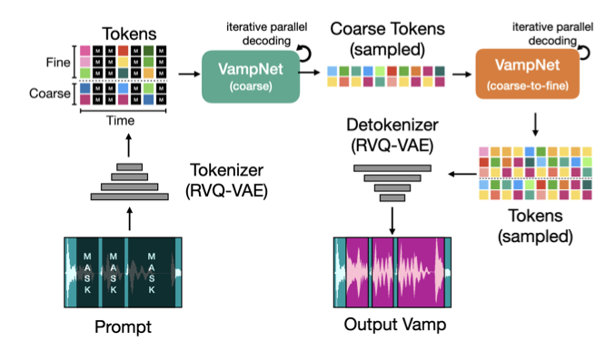
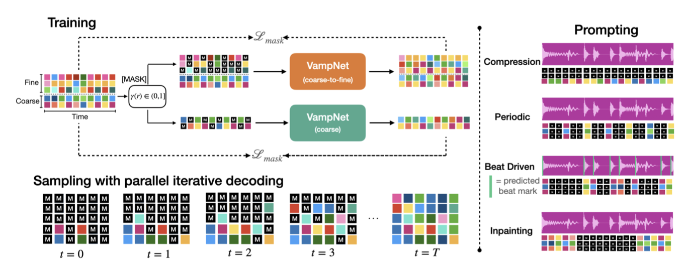
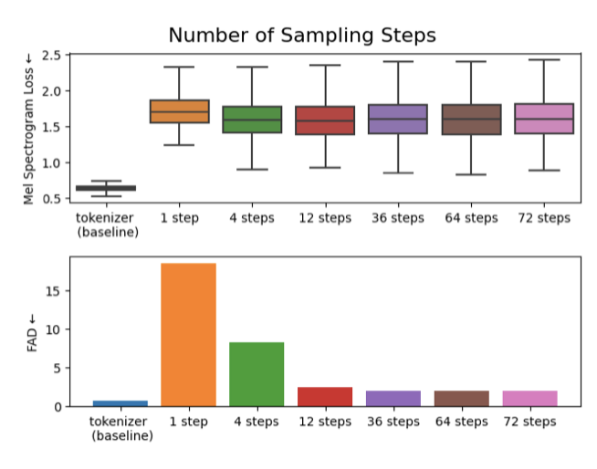
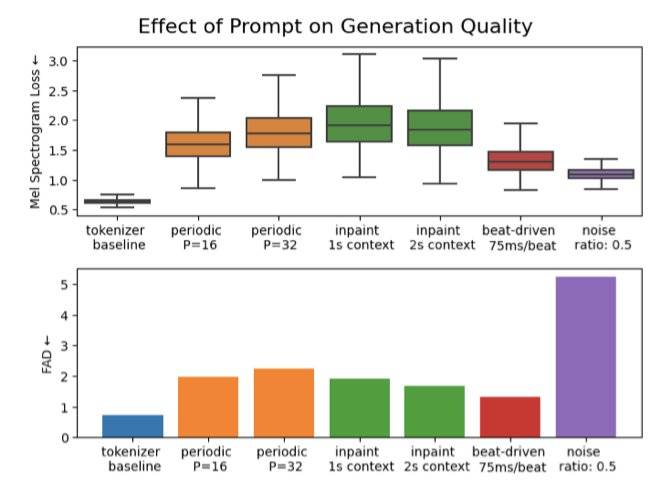
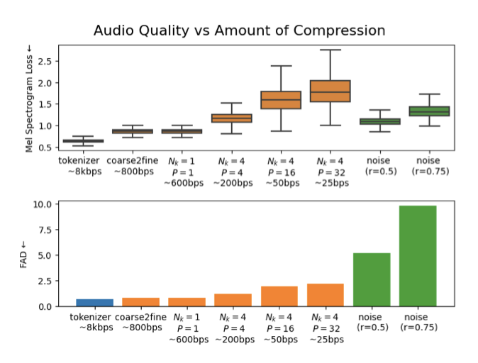

+++
author = "Kurt"
title = "VampNet"
date = "2024-07-10"
description = "Music Generation via Masked Acoustic Token Modeling"
categories = [
    "Paper Review"
]
tags = [
    "Audio",
    "Music Generation",
]
+++

## Abstract

VampNet은 음악 합성, 압축, 인페인팅, 변주를 위한 masked acoustic token 모델링 기법이다. 다양한 마스킹 방법을 사용하여 일관된 고해상도 음악을 생성하며, bidirectional transformer 아키텍처를 통해 non-autoregressive 방식으로 작동한다. VampNet은 음악의 스타일, 장르, 악기 사용 등을 유지하면서 음악 생성, 압축, 인페인팅 등 다양한 작업에 적용 가능하다. 이는 VampNet을 음악 공동 창작의 강력한 도구로 만든다. 관련 코드와 오디오 샘플은 온라인에서 제공된다.

---

## INTRODUCTION

discrete acoustic token 모델링의 최근 발전은 음성 및 음악 생성에 중요한 진전을 가져왔다. 또한, non-autoregressive parallel iterative decoding 방법이 이미지 합성을 위해 개발되어, 과거와 미래 정보를 모두 고려하는 작업에 더 효율적이고 빠른 추론을 제공한다.

이 작업에서는 parallel iterative decoding과 acoustic token 모델링을 결합하여 음악 오디오 합성에 적용한 VampNet을 소개한다. 이는 parallel iterative decoding을 신경망 기반 음악 생성에 처음으로 확장한 사례이다. VampNet은 선택적으로 마스킹된 음악 토큰 시퀀스를 사용해 공백을 채우도록 유도할 수 있으며, 고품질 오디오 압축부터 원본 음악의 스타일과 장르를 유지하면서도 음색과 리듬이 변형된 변주까지 다양한 출력을 제공한다.

auto-regressive 음악 모델은 접두사 기반 음악 생성만 가능하지만, 이 연구의 접근 방식은 프롬프트를 어디에나 둘 수 있다. 주기적, 압축, 비트 기반 마스킹 등 다양한 프롬프트 디자인을 탐구하였다. 모델이 루프와 변주 생성에 잘 반응하여 VampNet이라 명명하였다. 코드를 오픈 소스로 공개하며 오디오 샘플 청취를 권장한다.

---

## BACKGROUND

생성 모델링의 두 단계 접근 방식은 이미지와 오디오 합성에서 계산 효율성 덕분에 주목받고 있다. 첫 번째 단계에서는 인코더를 통해 입력을 토큰으로 변환하고, 디코더를 통해 다시 변환한다. 두 번째 단계에서는 조건을 제공받아 토큰을 생성하는 모델을 학습한다.

### Stage 1: Tokenization

이미지에서 시각적 토큰화는 분류와 합성에 사용되며, 주로 latent space에서 벡터 양자화를 활용한다. 오디오에서도 유사한 접근 방식이 탐구되었지만, 낮은 샘플링 속도나 음성 오디오에 제한되었다. latent space의 샘플링 속도가 낮을수록 생성이 쉬워지며, 최근에는 높은 압축률과 고샘플링 속도 오디오의 우수한 재구성 품질을 제공하는 잔여 벡터 양자화 기반 방법이 제안되고있다.

Descript Audio Codec (DAC)을 사용하면 오디오를 효율적으로 토큰화할 수 있다. DAC는 fully convolutional 인코더를 통해 오디오를 토큰 시퀀스로 변환하고, hierarchical sequence of vector-quantizer를 사용해 압축한다. 이 방법은 residual vector 양자화를 통해 뛰어난 오디오 재구성 품질과 높은 압축 비율을 제공한다. DAC와 같은 기술은 다양한 오디오 언어 모델 구현에 중요한 역할을 한다.

### Stage 2: Generation

오디오를 토큰으로 인코딩한 후 일반적인 접근 방식은 autoregressive 모델을 사용해 시퀀스에서 각 음향 토큰을 생성하는 것이다. 최신 오디오 생성 방법은 transformer 기반의 decoder-only 모델을 활용하여 이 과정을 수행한다. 하지만 autoregressive 샘플링은 추론 속도가 느리고 각 생성 토큰이 이전 토큰에만 의존하기 때문에 하향식 응용 프로그램에 제한이 있다.

언어 처리에서는 마스크 모델링이 사전 학습 절차로 널리 사용된다. 이 접근 방식은 이미지와 오디오에도 확장되어 표현 학습에 적용된다. 토큰 마스킹 확률을 변화시키면 마스크 생성 모델링을 확장할 수 있으며, 이는 이미지와 언어 생성에 모두 적용된다.

MaskGIT의 효율성은 parallel iterative decoding 절차에 있다. 모델이 한 번에 모든 토큰을 예측하지만 초기 출력의 품질이 낮을 수 있다. 이후 출력은 더 낮은 마스킹 확률로 다시 마스킹되어 모델에 입력되고, 이 과정을 통해 출력 품질이 개선된다.

무조건적 생성 작업에서는 모델이 지침 없이 목표 데이터 분포에서 샘플을 생성해야 하므로, 고차원적 분포 때문에 어려움이 따른다. 또한 이러한 모델은 모드 붕괴, 흐릿한 샘플 등의 문제에 취약하다. 따라서 조건을 제공하면 모델이 다중 모드 문제를 해결하고 원하는 콘텐츠를 생성하는 데 도움이 된다.

조건부 생성은 클래스 레이블, 장르 태그, 가사 또는 텍스트 설명의 형태로 이루어질 수 있다. 또한, AudioLM의 의미적 토큰이나 텍스트-음성 변환을 위한 정렬된 텍스트 또는 음소처럼 매 시간 단계마다 적용될 수 있다.

이 연구에서는 MaskGIT와 Paella와 같은 비전 분야의 연구에서 영감을 받아 parallel iterative decoding 절차를 활용한 마스크 생성 모델링 접근 방식을 채택하였다. 인코딩된 오디오에서는 마스크되지 않은 토큰 이외의 추가 조건을 적용하지 않았으며, 추론 과정에서 다양한 마스킹 접근 방식이 유용하고 예술적인 생성을 유도하는 데 활용될 수 있음을 설명한다.

학습 과정에서는 전체 시퀀스에서 무작위로 토큰들이 마스킹된다. 모델은 한 번의 전방향 패스에서 각 마스킹된 토큰의 값을 예측하며, 이는 과거와 미래의 모든 마스킹되지 않은 토큰에 의존한다. 학습 중에는 마스킹되는 토큰의 수를 다양하게 조절하여 추론 시 샘플링 절차를 통해 오디오를 생성할 수 있다.

## METHOD

MaskGIT의 Masked Visual Token Modeling 절차를 오디오에 맞게 적용하여, 시각과 오디오 도메인의 차이를 고려한 Masked Acoustic Token Modeling 접근 방식을 개발하였다.

### Masked Acoustic Token Modeling

DAC의 기술을 바탕으로 오디오 토크나이저를 학습한다. MaskGIT의 비주얼 토큰과 달리, 음향 토큰은 residual vector 양자화를 통해 계층적 구조를 가진다. 오디오 신호 $x$는 각 시간 단계 $t$에서 $D$차원의 latent vector $Z$로 인코딩되고, $N$개의 벡터 양자화기를 통해 양자화된다. 첫 번째 양자화기는 $Z$의 근사치 $\hat{Z}_1$과 잔여 오류 $R_1 = Z − \hat{Z}_1$을 생성한다. 이후 각 양자화기는 이전 잔여 오류를 처리하여 $R_i ≈ \hat{Z}_i + 1$을 생성한다. 마지막으로 벡터 $Z$는 $N$개의 양자화기 출력을 합산하여 재구성된다: $Z = ∑_{i=1}^N \hat{Z}_i$.

인코딩된 신호는 각 시간 단계에서 $N$개의 이산 토큰으로 표현된다. 모든 토큰을 한 번에 생성하는 대신, AudioLM처럼 $N$개의 토큰을 $N_c$개의 "coarse" 토큰과 $N_f$개의 "fine" 토큰으로 나눈다. 그런 다음, coarse 토큰을 기반으로 fine 토큰을 생성하는 모델과 coarse 토큰 시퀀스를 생성하는 모델을 학습한다. 샘플을 생성할 때는 먼저 coarse 모델로 coarse 토큰 시퀀스를 생성한 후, coarse-to-fine 모델로 fine 토큰을 생성한다. 마지막으로, 오디오 토크나이저의 디코더를 사용하여 토큰을 44.1kHz 파형으로 디코딩한다.

### Training procedure

$Y ∈ R^T × N$이 오디오 구간에 대한 인코더 출력을 나타내는 행렬일때, $Y$의 각 요소 $y_t$,$n$은 시간 단계 $t$에서 $n$번째 레벨 코드북의 토큰이다. $Y_M$은 마스킹된 토큰들의 집합이고, $Y_U$는 마스킹되지 않은 토큰들의 집합이다. 모델은 $Y_U$와 parameter $θ$를 바탕으로 $Y_M$의 각 토큰에 대한 코드북 값들의 확률 분포를 생성한다. 학습 목표는 실제 토큰의 확률을 최대화하는 것이며, 이는 음의 로그 우도를 최소화하는 것과 같다.

$$ \[ L = - \sum_{y \in Y_M} \log p(y \mid Y_U, \theta) \] $$

마스킹된 토큰을 예측하기 위해 multi-layer bidirectional transformer를 사용한다. 각 양자화기가 $C$개의 값을 가지는 코드북을 가지고 있고, $N$개의 양자화기가 있다면, 네트워크의 마지막 층은 $(E, CN)$ 형태의 fully connected layer가 된다. 이 출력을 $(EN, C)$로 재구조화한 후, 실제 원핫(one-hot) 토큰과 예측된 토큰 간의 교차 엔트로피 손실을 계산한다. bidirectional transformer는 입력 시퀀스의 모든 토큰을 참고하여 각 토큰의 손실을 최적화할 수 있다.

coarse-to-fine 생성 모델에서 입력 시퀀스는 항상 $N_c$개의 coarse 토큰을 포함하고, 마스킹은 $N_f$개의 fine 토큰에만 적용된다. 마지막 층은 마스킹된 fine 토큰만 예측하며, 학습 절차는 두 모델 모두 동일하다.

### Sampling

MaskGIT에서 사용된 것과 같은 반복적인 신뢰 기반 샘플링 접근 방식을 따른다. 마스크된 토큰의 집합을 $Y_M$, 마스크되지 않은 토큰의 집합을 $Y_U$라고 할 때, 다음을 수행한다:

1. **Estimate.** 마스크된 각 토큰 $y$에 대해, 코드북 값 $V$의 어휘에 대한 조건부 확률 분포를 추정한다.

2. **Sample.** 각 마스크된 토큰에 대해, 분포로부터 샘플링하여 관련된 토큰 추정값 $\hat{y} ∈ V$를 생성한다. 이 단계에서는 샘플링 트릭을 사용하지 않으며, 각 토큰에 대해 범주형 확률 분포에서 그대로 샘플링한다.

3. **Rank by Confidence.** 샘플링된 각 토큰의 예측 로그 확률에 온도 조절된 Gumbel 노이즈를 더하여 신뢰도를 계산한다:

$$ \text{confidence}(\hat{y}) = \log(p(\hat{y})) + \text{temp} \cdot g_t $$

여기서 $\hat{y}$는 시간 $t$에서의 토큰 추정값이고, $g_t$는 Gumbel(0,1)에서 독립적으로 추출된 샘플이며, temp는 샘플링 반복 횟수에 따라 선형적으로 0으로 감소하는 hyperparameter이다. 그런 다음, 계산된 신뢰도를 기준으로 샘플링된 토큰 추정값 집합을 정렬한다. 높은 온도 값(e.g., > 6.0)은 더 높은 품질의 샘플을 생성하는 것을 발견하였다.

4. **Select.** 다음 샘플링 반복에서 마스크할 토큰 수 $k$를 마스킹 스케줄에 따라 선택한다. 신뢰도가 가장 낮은 $k$개의 추정값을 선택하여 제거하고, 해당 토큰을 다시 마스킹한다. 나머지 높은 신뢰도의 토큰 추정값은 $Y_U$에 넣고, 해당 토큰을 $Y_M$에서 제거한다.

5. **Repeat.** 반복 횟수가 도달할 때까지 1단계로 돌아간다.

### Prompting

인터랙티브 음악 편집은 마스크되지 않은 토큰의 조건부 프롬프트를 통해 인간의 지도를 포함하여 가능하다. 이 연구의 접근 방식은 입력 오디오 자체에만 의존하여, 다양한 프롬프트가 일관성 있는 샘플을 얻는 데 유용하다. AudioLM과 달리, 우리는 프리픽스 오디오뿐만 아니라 접미사 오디오도 모델에 제공할 수 있으며, 이를 통해 지정된 프리픽스와 접미사에 맞는 오디오를 생성할 수 있다.

모든 $P$번째 시점을 제외한 나머지 시점들을 마스킹하는 "주기적" 프롬프트를 적용할 수 있습니다. $P$ 값이 낮을수록 생성된 오디오가 원본처럼 들리며, $P$가 증가하면 모델은 원본 스타일과 일치하는 변형을 생성한다. 예를 들어, $P = 2$인 경우 모델은 업샘플러처럼 작동한다.

"compression" 프롬프트는 가장 거친 단위를 제외한 모든 코드북을 마스킹하여, 모델이 원본과 유사한 오디오를 생성하도록 한다. 이를 낮은 $P$ 값을 가진 주기적 프롬프트와 결합하면 더 높은 압축 비율을 얻을 수 있다. 코덱의 비트레이트 $B$, 코드북 수 $N$, 다운샘플링 비율 $P$, 유지된 코드북 수 $N_k$를 고려할 때, 비트레이트는 $B/P(N − N_k)$로 달성된다.

마지막으로, 음악의 구조를 고려한 비트 주도적 프롬프팅을 통해 모델은 비트에 해당하는 시간대를 중심으로 음악을 생성한다. 이는 원본 음악의 흥미로운 변형을 만들어내며, 이러한 프롬프트들을 결합하면 매우 유용한 음악 창작 도구를 제작할 수 있다. VampNet은 잘 설계된 사용자 인터페이스와 함께 다음 세대 음악 편집 및 창작 스위트의 기반으로 사용될 수 있다.

## EXPERIMENTS

이 연구는 VampNet이 음악을 압축하고 생성하는 능력을 평가하는 것이 목표이다. 오디오 품질을 평가하기 위해 다중 스케일 멜 재구성 오차와 Fréchet Audio Distance (FAD)를 사용한다.

$$ D_{F,M} = \| S_{F,M} - \hat{S}_{F,M} \|_1 $$

FFT 크기 $F$와 멜 주파수 바인의 수 $M$을 사용한다. FFT 크기 $F$는 2048에서 512 사이이고, $M$은 150에서 80 사이이다. 멜 재구성은 압축 품질을 평가하는 데 유용하지만, 생성 품질 평가에는 적합하지 않는다. 대신 생성 품질을 평가할 때는 FAD를 사용한다. FAD는 실제 오디오와 생성된 오디오의 분포 중첩을 측정하여 생성된 샘플이 실제 데이터 분포 내에 있는지를 평가한다.

### Dataset

JukeBox와 비슷하게, 32 kHz 샘플링 속도로 797,000개의 트랙으로 구성된 대규모 음악 데이터셋을 수집하였다. 이 트랙들은 토크나이저와 호환되도록 44.1 kHz로 재샘플링되었고, Echo Nest의 Every Noise at Once에 설명된 수천 명의 아티스트들의 음악을 포함하고 있다.

2000개의 트랙으로 구성된 검증 및 테스트 하위 집합을 사용한다. 이들은 학습 데이터와 아티스트가 중복되지 않도록 구성된다. DAC 데이터셋을 활용하여 음악 및 비음악 데이터를 수집하고, 이를 이용해 토크나이저를 학습시켰다. 모든 오디오는 -24dBFS로 정규화되며, 학습 과정에서는 이 파일들의 메타데이터를 사용하지 않는다.

### Network Architecture and Hyperparameters

오디오 토크나이저는 44.1kHz 오디오를 8kbps 비트레이트로 압축하며, 14개 코드북을 사용한다. 다운샘플링 비율은 768배이며, 잠재 공간 주파수는 57Hz이다. 각 타임스텝마다 14개의 토큰을 예측하며, 이 중 4개는 coarse 토큰이고 나머지 10개는 fine 토큰으로 구성된다. 토크나이저는 25만 스텝 동안 학습된다.

VampNet 아키텍처는 bidirectional transformer로, coarse 모델은 20개 attention layer와 1280 임베딩 차원, 20개 attention head를 가지며, coarse-to-fine 모델은 16개 layer를 사용한다. coarse 모델은 100만 스텝, coarse-to-fine 모델은 50만 스텝 동안 학습되며, AdamW 옵티마이저를 사용하고, learning rate 스케줄러는 Vaswani 등이 도입한 방식을 따른다. 드롭아웃은 0.1, 배치 크기는 25이며, GPU 메모리 예산은 72GB이다.

### Efficiency of VampNet

VampNet을 사용하여 테스트 세트의 10초 예시에서 샘플링 스텝을 [1, 4, 8, 12, 36, 64, 72]로 변화시켜 현실적인 음악을 생성할 수 있는지 검증한다. 각 스텝별로 메트릭을 보고한다.

### Effect of prompts

다양한 프롬프트에 따른 VampNet의 반응을 이해하려 한다. 압축 프롬프트에서부터 창의적인 생성 프롬프트까지 다양한 스펙트럼을 형성하는지, 낮은 비트레이트에서의 복원이 생성적 행동을 유발하는지를 조사한다.

평가 데이터셋에서 2000개의 10초 예시를 추출하여 이를 오디오 토크나이저를 사용해 토큰 스트림으로 인코딩한다. 그리고 이 토큰 스트림을 네 가지 방법으로 조작한다:

1. Compression prompt: $C$ 코드북은 가장 coarse한 코드북부터 unmasked 상태로 남겨둔다. 다른 모든 토큰은 마스킹 처리된다. $N_k$는 1로 설정한다.
2. Periodic prompt: 매 P번째 타임스텝은 unmasked 상태로 남긴다. unmasked된 타임스텝에서는 모든 코드북의 토큰이 unmasked 된다. 다른 모든 토큰들 (예: 주기 $P$에 해당하지 않는 타임스텝의 토큰들)은 마스킹 처리된다. $P$를 [8, 16, 32]에서 설정한다.
3. Prefix and suffix (inpaint) prompts: 시퀀스의 시작과 끝에서 일부 세그먼트는 unmasked 상태로 남겨진다. 다른 모든 토큰들은 마스킹 처리된다. 이 프롬프트는 초 단위의 컨텍스트 길이에 의해 매개변수화된다. 컨텍스트를 1초 또는 2초로 설정하며, 이는 각각 57 또는 114 타임스텝에 해당한다.
4. Beat-driven prompt: 먼저 오디오 웨이브폼을 비트 트래커로 처리한다. 그런 다음 각 감지된 비트 주변에서 비트 오른쪽의 타임스텝을 unmask한다. 각 비트 주변에 약 75ms의 unmasked 섹션을 검토하며, 이는 비트 당 약 4개의 타임스텝에 해당한다.

프롬프트를 사용하여 입력 토큰 스트림을 조작한 후, VampNet을 사용하여 이러한 마스킹된 토큰 스트림에서 새로운 음악을 생성하고, 생성된 신호와 원본 신호 간의 FAD와 멜 재구성 오차를 계산한다. 추가적으로 입력 토큰 스트림의 일부 토큰을 무작위로 대체하여 노이즈가 추가된 베이스라인도 평가하며, 코덱 자체와 코어스 투 파인 모델을 기준으로 설정한다.

마지막으로, 압축과 주기적 프롬프트의 하이퍼파라미터 ($C$와 $P$)를 조정하여 모델이 압축에서 생성으로 전환되는 방법을 살펴본다. 더 많은 타임스텝이 마스크될수록, 모델은 입력 음악과 일치하지 않을 수 있는 신뢰할 수 있는 음악 단편을 생성해야 한다.

## RESULTS AND DISCUSSION

VampNet은 36 스텝에서 가장 낮은 FAD를 달성했지만, 12 스텝도 비슷한 성능을 보여주었다. 실제로, 24 스텝 샘플링이 생성 품질과 계산 속도 사이에서 적절한 균형을 제공하는 것으로 나타났다. NVIDIA RTX3090에서 10초 샘플을 생성하는 데는 약 6초가 걸리며, autoregressive 모델로 동일한 시간의 오디오를 생성하는 데는 약 574단계가 필요하여 약 1분이 소요된다.

노이즈가 추가된 토큰 베이스라인은 모든 프롬프트와 멜 재구성 면에서 유사하지만, FAD에서는 성능이 매우 부진하다. 이는 프롬프팅 전략이 입력 오디오와 완벽하게 일치하지 않을 수 있지만, 여전히 신뢰할 수 있는 음악 분포 내에 있다는 것을 시사한다.

비트 주도 프롬프트가 다른 모든 프롬프트보다 낮은 FAD를 달성하여 최고의 성능을 보여주었다. $P = 16$인 주기적 프롬프트는 1초 컨텍스트를 가진 인페인팅과 유사한 성능을 보였습니다 (57 조건화 타임스텝). 따라서 조건화 토큰을 균등하게 분포시키는 주기적 프롬프트 기술은 샘플링 기술과 비교하여 적은 조건화 타임스텝으로도 품질이 높은 샘플을 생성할 수 있다는 점에서 주목받았다.

비트 주도 프롬프트는 다른 프롬프트보다 더 안정된 템포를 유지하며, 주기적 프롬프트보다 원본 음악에 더 가까운 결과를 낸다고 질적으로 발견하였다. 비트 주도, 주기적, 그리고 인페인팅 프롬프트를 혼합하여 VampNet을 창의적으로 조정할 수 있다. 

주기적과 압축 프롬프트를 결합하여 VampNet이 토큰을 더 많이 마스킹할 때 재구성과 생성 작업 사이의 변화를 보여주었다. 높은 비트레이트에서 VampNet은 원본 음악 신호를 정확하게 재구성하여 낮은 멜 스펙트로그램 오차와 FAD 값을 달성했으며, 낮은 비트레이트에서도 일관된 음악적 구조를 갖춘 오디오 신호를 생성할 수 있었다.

## CONCLUSION

VampNet는 음악 생성을 위한 마스크된 음향 토큰 모델링 접근법이며, 양방향으로 작동하며 입력 오디오 파일을 다양한 방식으로 프롬프팅할 수 있다. 다양한 프롬프팅 기법을 통해 VampNet은 음악 압축과 생성 사이에서 작동하며, 음악 조각에 변화를 주는 데 유용한 도구이다. 추후 연구로는 VampNet과 그의 프롬프팅 기술이 음악 공동창작에 어떻게 기여할 수 있는지, 그리고 마스크된 음향 토큰 모델링의 표현 학습 능력을 탐구할 계획이다.

---

## Reference

* [Paper](https://arxiv.org/pdf/2302.03917)
* [Demo](https://google-research.github.io/noise2music/)