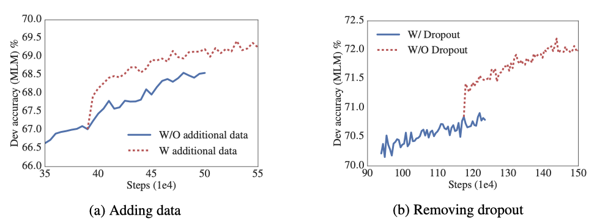
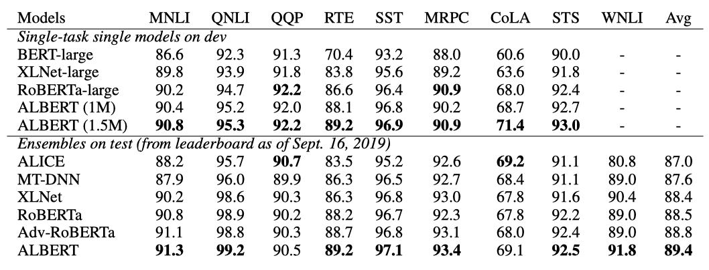
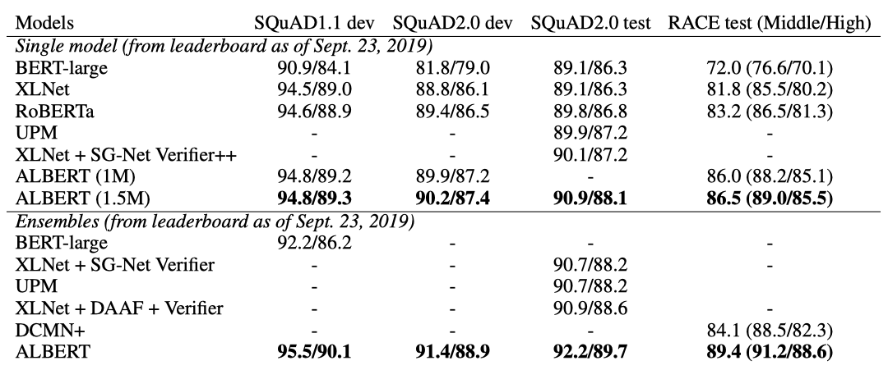

+++
author = "Kurt"
title = "ALBERT"
date = "2023-12-14"
description = "A Lite BERT for Self-supervised Learning of Language Representations"
categories = [
    "Paper Review"
]
tags = [
    "LLM",
]
+++

## Abstract

자연어 표현을 사전 학습할 때 모델 크기를 늘리면 종종 성능이 향상되지만, GPU/TPU 메모리 한계와 학습 시간이 길어지는 문제가 있다. 이를 해결하기 위해, BERT의 메모리 소비를 줄이고 훈련 속도를 높이는 두 가지 기법을 제시하였다. 이 기법은 원래의 BERT보다 훨씬 더 잘 확장되는 모델을 만들며, 문장 간 일관성을 모델링하는 self-supervised loss를 사용하여 다문장 입력 작업에 도움이 된다. 결과적으로, BERT-large보다 parameter가 적은 ALBERT 모델은 GLUE, RACE, SQuAD benchmark에서 state-of-the-art를 달성하였다.

---

## Introduction

Full network pre-training는 언어 학습에서 중요한 돌파구를 이끌어내었다. 이를 통해 학습 데이터가 제한된 NLP 작업들이 큰 도움을 받았다. 중국의 영어 시험을 위한 RACE 테스트에서 기계 성능은 초기 44.1%에서 최근에는 83.2%로 상승하였다. 이 연구를 통해 성능은 더욱 향상되어 89.4%에 이르렀다. 이는 주로 고성능 사전 학습 언어 표현 능력의 발전 덕분이다.

이러한 개선사항들은 큰 네트워크가 state-of-the-art를 달성하는 데 중요함을 보여준다. 이제는 큰 모델을 사전 학습하고 작은 모델로 축소하는 것이 일반적인 방법이다. 그래서 이 연구에서는 "더 나은 NLP 모델을 가지는 것이 큰 모델을 가지는 것만큼 쉬운 것인지"라는 질문을 던지게 된다.

이 질문에 대한 장애물은 사용 가능한 하드웨어의 메모리 제한이다. 현재의 state-of-the-art 모델들은 종종 수백만 개 또는 심지어 수십억 개의 parameter를 가지고 있어, 모델을 확장하려고 할 때 이러한 제한에 쉽게 부딪히게 된다. 또한, parameter 수에 비례하는 통신 오버헤드로 인해 분산 훈련시 훈련 속도가 크게 저하될 수 있다.

이 논문에서는 매개변수가 더 적은 ALBERT 구조를 설계하여 이 문제들을 모두 해결하였다.

ALBERT는 사전 학습된 모델 확장의 주요 장애물을 제거하는 두 가지 parameter 축소 기법을 사용한다. 첫 번째는 큰 어휘 임베딩 행렬을 작은 행렬로 분해하는 것, 두 번째는 네트워크 깊이에 따른 parameter 증가를 방지하는 것이다. 이 두 기법은 BERT의 매개변수 수를 크게 줄이고, BERT-large와 유사한 ALBERT 구성은 매개변수가 18배 더 적고, 약 1.7배 더 빠르게 훈련될 수 있게 한다. 이 기법들은 훈련을 안정화시키고 일반화에 도움을 주는 정규화 역할도 한다.

ALBERT의 성능을 더욱 향상시키기 위해, sentence-order prediction(SOP)을 위한 self-supervised loss도 도입하였다. SOP는 주로 문장 간의 일관성에 초점을 맞추고 있으며, 원래 BERT에서 제안된 다음 next sentence prediction(NSP) loss의 비효율성을 해결하도록 설계되었다.

그 결과, BERT-large보다 parameter는 더 적지만 성능은 훨씬 뛰어난 더 큰 ALBERT 구성으로 확장할 수 있었다. 그리고 자연 언어 이해를 위한 잘 알려진 GLUE, SQuAD, RACE 벤치마크에서 state-of-the-art를 달성하였다.

---

## Related Work

### Scaling up Representation Learning for Natural Language

자연 언어의 표현 학습은 다양한 NLP 작업에 유용하며 널리 채택되어왔다. 최근 가장 큰 변화는 단어 임베딩의 사전 학습에서, 전체 네트워크의 사전 학습 후 작업 특정 미세 조정으로 전환되었다는 것이다. 이러한 연구에서는 더 큰 모델 크기가 성능을 향상시키는 것이 종종 보여졌다. 하지만, 모델 크기와 계산 비용 문제로 인해 hidden size 는 1024에서 멈추게 되었다.

큰 모델로 실험하는 것은 계산적 제약, 특히 GPU/TPU 메모리 제한 때문에 어렵다. 이 문제를 해결하기 위한 여러 방법이 제안되었는데, 그 중에는 gradient checkpointing과 각 layer의 activation 재구성 방법이 있다. 이런 방법들은 속도비용으로 메모리 사용량을 줄인다. 반면에, parameter reduction techniques는 메모리 사용을 줄이면서 훈련 속도를 높인다.

### Cross-Layer Parameter Sharing

cross-layer parameter sharing의 아이디어는 이전에 Transformer 아키텍처에서 제안되었다. 하지만 이전 연구는 표준 인코더-디코더 작업에 초점을 맞추어져있었다. Dehghani et al. (2018)은 cross-layer parameter sharing를 가진 네트워크가 언어 모델링에서 더 나은 성능을 낸다고 보여주었다. 최근에는, Bai et al. (2019)이 Transformer 네트워크를 위한 Deep Equilibrium Model을 제안하였다. Hao et al. (2019)은 parameter-sharing transformer와 standard transformer를 결합하여 parameter 수를 늘렸다.

### Sentence Ordering Objectives

ALBERT는 두 연속된 텍스트 세그먼트의 순서를 예측하는 사전 학습 loss를 사용한다. 이는 담화의 일관성에 관련된 다른 사전 학습 목표와 유사하다. 대부분의 효과적인 목표는 매우 단순하며, 이웃하는 문장의 단어를 예측하는 것에 기반한다. loss는 두 연속된 문장의 순서를 결정하기 위해 학습된 문장 임베딩과 가장 관련이 있다. 하지만, loss는 문장이 아닌 텍스트 세그먼트에 적용된다. BERT는 한 쌍에서 두 번째 세그먼트가 다른 문서의 세그먼트와 바뀌었는지 예측하는 loss을 사용하고, 이는 NSP가 더 도전적인 사전 학습 작업이며 특정 downstream task에 더 유용하다는 것을 보여준다. 

---

## The Elements of ALBERT

ALBERT의 설계 결정사항을 제시하고, BERT 아키텍처와 비교한다.

### Model Architecture Choices

ALBERT 아키텍처는 Transformer 인코더를 GELU 비선형성과 함께 사용하는 BERT와 유사하다. vocabulary embedding size는 $E$, encoder layer의 수는 $L$, hidden size는 $H$로 표기하며, feed-forward/filter size는 $4H$, attention head의 수는 $H/64$로 설정한다. 

ALBERT는 이러한 BERT의 설계에 대해 세 가지 주요한 개선점을 제시한다.

#### Factorized embedding parameterization.

BERT, XLNet, RoBERTa 등의 모델에서는 WordPiece 임베딩 크기($E$)와 히든 레이어 크기($H$)가 같게 설정이 되었다. 이러한 결정은 모델링과 실용적인 측면에서 최적이 아닌 것으로 판단된다.

모델링 측면에서 보면, WordPiece 임베딩은 문맥에 독립적인 표현을, 히든 레이어 임베딩은 문맥에 의존적인 표현을 학습한다. BERT와 같은 표현의 힘은 문맥을 이용한 학습에서 나온다는 것이 확인되었다. 따라서 WordPiece 임베딩 크기 $E$와 히든 레이어 크기 $H$를 분리하면, 모델링 요구사항에 따라 총 모델 parameter를 더 효율적으로 사용할 수 있다. 이는 실질적으로 $H$가 $E$보다 훨씬 커야 한다는 것을 의미한다.

실용적으로 보면, 자연어 처리에서는 대체로 어휘 크기($V$)가 큰 편이다. 만약 $E$와 $H$가 같다면, $H$를 증가시키는 것은 임베딩 행렬의 크기를 증가시키게 되고, 이로 인해 parameter가 수십억 개가 되어버릴 수 있다. 더욱이, 이런 parameter들은 훈련 도중에는 대부분 희소하게만 업데이트된다.

ALBERT에서는 임베딩 파라미터를 두 개의 작은 행렬로 분해한다. one-hot vector를 $H$ 크기의 hidden space로 투영하는 대신, 먼저 $E$ 크기의  lower dimensional embedding space로 투영한 후 hidden space으로 투영한다. 이 방식을 통해 임베딩 파라미터를 $O(V \times H)$에서 $O(V \times E \times E \times H)$로 줄일 수 있다. 이 parameter 축소는 $H$가 $E$보다 훨씬 클 때 중요하며, 모든 워드피스에 대해 같은 $E$를 사용하게 된다. 

#### Cross-layer parameter sharing

ALBERT에서는 parameter 효율성을 향상시키는 방법으로 cross-layer parameter sharing를 제안한다. 여기에는 레이어 간에 feed-forward network (FFN) parameter만 공유하거나, attention parameter만 공유하는 등 여러 가지 방법이 있다. 그러나 ALBERT의 기본 설정은 모든 레이어 간에 모든 parameter를 공유하는 것이다. 이 설정은 특별히 명시되지 않는 한 모든 실험에서 사용된다.

Universal Transformer와 Deep Equilibrium Models에서도 Transformer 네트워크에 대해 유사한 전략들이 연구되었다. Universal Transformer가 일반 Transformer를 능가한다고 보여주었고, Deep Equilibrium Models가 특정 레이어의 입력과 출력 임베딩이 동일하게 유지되는 균형점에 도달함을 보여주었다. 반면 이 논문의 측정 결과에서는 임베딩들이 수렴하기보다는 진동하고 있다는 것을 보여준다.

ALBERT에서 레이어 간의 전환이 BERT보다 훨씬 부드럽다는 것을 관찰할 수 있다. 이는 parameter sharing이 network의 parameter를 안정화하는데 영향을 미친다는 것을 보여주며, 24개의 레이어 후에도 두 메트릭 모두 0으로 수렴하지 않는다. 

#### Inter-sentence coherence loss

BERT는 masked language modeling(MLM) loss 외에도 next-sentence prediction(NSP) 이라는 추가적인 loss을 사용한다. NSP는 두 세그먼트가 원문에서 연속으로 나타나는지 예측하는 binary classification loss이다. 이 목표는 문장 쌍 간의 관계에 대한 추론을 요구하는 자연어 추론과 같은 downstream task의 성능을 향상시키기 위해 설계되었다. 그러나 이후 연구에서는 NSP의 영향이 불안정하다고 판단하여 제거하기로 하였고, 이 결정은 여러 작업에서 downstream task 성능의 향상으로 지지받았다.

NSP의 비효율성 뒤에 있는 주요 이유는 MLM과 비교했을 때 작업의 난이도가 부족하다는 것으로, NSP는 주제 예측과 일관성 예측을 하나의 작업에서 혼동시킨다. 그러나 주제 예측은 일관성 예측보다 학습하기 쉽고, MLM 손실을 사용하여 학습하는 것과 더 많이 겹친다.

이 연구에서는 문장 간 모델링이 중요하다고 주장고 있으며, ALBERT에서는 주로 일관성에 기반한 sentence-order prediction(SOP) loss을 사용한다. SOP 손실은 모델이 담화 수준의 일관성에 대한 더 세밀한 구분을 학습하도록 만든다. NSP는 SOP 작업을 전혀 해결할 수 없지만, SOP는 NSP 작업을 어느 정도 해결할 수 있다. 결과적으로, ALBERT 모델은 다문장 인코딩 작업에 대한 성능을 일관되게 향상시킬 수 있었다.

### Model setup

ALBERT 모델은 설계 선택 때문에 BERT 모델보다 parameter 크기가 훨씬 작다. 예를 들어, ALBERT-large는 BERT-large보다 parameter가 약 18배 작다. 이런 parameter 효율성 향상은 ALBERT의 설계 선택에서 가장 중요한 장점이다.

---

## Experimental Results

### Experimental Setup

의미 있는 비교를 위해, BERT 설정을 따라서 사전 훈련 기본 모델에 대해 Book Corpus와 영문 Wikipedia를 사용한다. 이 두 말뭉치는 압축되지 않은 텍스트로 약 16GB를 구성한다. 입력은 $[CLS] x_1 [SEP] x_2 [SEP]$ 와 같은 포멧이며, 최대 512 길이로 제한한다. 그리고 10%의 확률로 512보다 짧은 입력 시퀀스를 무작위로 생성한다. BERT와 같이, 30,000의 어휘 크기를 가지며, XLNet처럼 SentencePiece를 사용하여 토큰화한다.

각 n-gram 마스크의 길이를 무작위로 선택하여 n-gram 마스킹을 사용해 MLM 목표를 위한 마스크된 입력을 생성한다. 길이 n에 대한 확률은 다음과 같이 주어진다:

$$p(n) = {{1/n}\over{\sum_{k=1}^{N}1/k}} $$

n-gram의 최대 길이는 3으로 설정하며, 이는 MLM 목표가 최대 3-gram 단어로 구성될 수 있음을 의미한다. 모든 모델 업데이트는 배치 크기 4096과 학습률 0.00176의 $L_{AMB}$ optimizer를 사용하며, 모든 모델은 125,000 step 동안 학습된다. 훈련은 Cloud TPU V3에서 이루어졌으며, 사용된 TPU의 수는 모델 크기에 따라 64에서 512까지 다양했다. 이 실험 설정은 우리가 만든 모든 BERT 버전과 ALBERT 모델에 사용되었다.

---

## Evaluation Benchmarks

### Intrinsic Evalutation

학습 상황을 확인하기 위해, SQuAD와 RACE의 개발 세트를 기반으로 개발 세트를 만들었다. MLM과 문장 분류 작업의 정확도를 보고한다. 이 세트는 모델의 수렴 상태를 확인하는데만 사용되며, 모델 선택과 같은 방식으로 downstream evaluation의 성능에 영향을 주지 않는다.

### Downstream Evaluation

GLUE benchmark, SQuAD의 두 버전, 그리고 RACE dataset이라는 세 가지 benchmark에서 평가한다. 작업 리더보드를 기반으로 한 최종 비교를 위해 테스트 세트 결과도 측정하며, 개발 세트에서 큰 분산을 가진 GLUE 데이터셋에 대해서는 5회 실행의 중앙값을 측정한다.

### Overall Comparison between BERT and ALBERT

ALBERT의 디자인 선택사항 중 parameter 효율성 향상이 가장 중요한 장점으로, BERT-large의 parameter의 70%만으로도 ALBERT-xxlarge는 여러 downstream task에서 상당한 개선을 보이고 있다.

동일한 훈련 구성 하에서, ALBERT 모델들은 BERT 모델들에 비해 더 높은 데이터 처리량을 보인다. BERT-large를 기준으로 할 때, ALBERT-large는 데이터를 처리하는 데 약 1.7배 더 빠르고, 큰 구조 때문에 ALBERT-xxlarge는 약 3배 더 느리다.

마지막으로, ALBERT의 각 디자인 선택사항이 얼마나 기여하는지 파악하기 위한 ablation experiments을 수행한다.

### Factorized Embedding Parameterization

BERT 스타일의 비공유 상태에서는 더 큰 임베딩 크기가 약간 더 나은 성능을 보이지만, ALBERT 스타일의 모든 공유 상태에서는 크기 128의 임베딩이 최적으로 보인다. 이 결과를 바탕으로, 모든 추후 설정에서 임베딩 크기 128을 사용하게 된다.

### Cross-layer parameter sharing

all-shared strategy인 ALBERT 스타일은 성능을 떨어뜨리지만, 임베딩 크기가 128일 때는 768일 때보다 저하가 덜 하다다. 성능 저하는 주로 FFN layer parameter sharing으로 인해 발생하며, attention parameter sharing은 성능 저하를 일으키지 않는다.

다른 레이어 간의 parameter sharing 전략도 가능하지만, 그룹 크기를 줄이면 전체 parameter 수가 크게 증가한다. 따라서 all-shared strategy을 기본으로 선택하였다.

### Sentence order prediction (SOP)

세 가지 실험 조건인 'none' (XLNet 및 RoBERTa 스타일), NSP (BERT 스타일), SOP (ALBERT 스타일)에 대한 추가 문장 간 손실을 ALBERTbase 설정을 사용하여 비교하였다.

NSP loss가 SOP 작업에 판별력을 제공하지 못하며, 주제 전환만 모델링하는 것으로 나타났다. 반면에, SOP loss는 NSP 작업을 상대적으로 잘 처리하며, SOP 작업에 대해서는 더욱 더 잘 처리했다. 더욱이, SOP loss는 여러 문장 인코딩 작업에 대한 downstream task 성능을 일관되게 향상시키는 것으로 나타났으며, 이는 평균 점수 향상이 약 1%라는 것을 의미한다.

### What if we train for the same amount of time?

BERT-large의 데이터 처리량은 ALBERT-xxlarge에 비해 약 3.17배 높다. 따라서 같은 학습 시간 동안 모델을 학습시키는 비교를 수행하였다. 400k 학습 단계 후의 BERT-large 모델 (학습 34시간 후)과 ALBERT-xxlarge 모델을 125k 학습 단계 동안 학습하는 데 필요한 시간 (학습 32시간)을 비교한다.

ALBERT-xxlarge는 BERT-large보다 훨씬 더 우수하며, 평균적으로 +1.5% 더 좋고, RACE에서는 최대 +5.2%까지 차이가 난다.

### Additional training data and dropout effects

XLNet과 RoBERTa가 모두 사용한 추가 데이터의 영향을 비교한다. 추가 데이터 없을 때와 있을 때의 개발 세트 MLM 정확도를 비교하며, 추가 데이터를 사용할 때 중요한 향상을 보여준다. 

또한, SQuAD benchmark를 제외한 downstream task에서 성능 개선을 관찰했다.

1M step까지 학습한 후에도, 가장 큰 모델들은 훈련 데이터에 과적합되지 않았다. 그래서 드롭아웃을 제거하여 모델의 용량을 늘려서 실험을 계속 하였으며, 드롭아웃을 제거하면 MLM 정확도가 크게 향상된다는 것이 확인되었다. 

ALBERT-xxlarge의 중간 평가에서도 드롭아웃 제거가 downstream task에 도움이 된다는 것이 확인되었다. 이는, 드롭아웃이 큰 Transformer 기반 모델의 성능을 해칠 수 있다는 것을 보여준다. 그러나, ALBERT의 기본 네트워크 구조는 Transformer의 특수한 경우로, 이 현상이 다른 Transformer 기반 아키텍처에서도 나타나는지 여부를 확인하기 위해 추가 실험이 필요하다.

### Current State-of-the-art on NLU Tasks

단일 모델과 앙상블에 대해 미세조정을 수행하고 state-of-the-art 결과를 비교한다. 모든 설정에서 단일 작업 미세조정만 수행하며, 개발 세트에서는 5번의 실행 결과 중 중앙값을 비교한다.

최종 앙상블 모델에 기여하는 체크포인트는 개발 세트 성능에 따라 선택되며, 체크포인트의 수는 작업에 따라 6에서 17까지 다르다. GLUE와 RACE benchmark의 경우, 다른 학습 단계에서 미세조정된 후보 모델들의 예측을 평균화한다. SQuAD의 경우, 여러 확률을 가진 범위의 예측 점수와 "응답할 수 없는" 결정의 점수를 평균화한다.

단일 모델과 앙상블 모델 모두 ALBERT가 모든 벤치마크에서 상당히 향상된 성능을 보여준다. GLUE 점수는 89.4, SQuAD 2.0 테스트 F1 점수는 92.2, RACE 테스트 정확도는 89.4에 달하며, 이는 BERT, XLNet, RoBERTa, 그리고 DCMI+ 등에 비해 큰 향상을 보여준다. 또한, 단일 모델은 86.5%의 정확도를 달성하여, state-of-the-art 앙상블 모델보다 2.4% 더 높다.

---

## Discussion

ALBERT-xxlarge는 BERT-large보다 parameter가 적지만 더 좋은 성능을 보인다. 하지만, 큰 구조 때문에 계산 비용이 더 많이 들어간다. 따라서, 다음 단계는 sparse attention와 block attention 등의 방법을 통해 ALBERT의 학습과 추론 속도를 높이는 것이다. 어려운 예제 채굴과 더 효율적인 언어 모델링 훈련 등 별개의 연구 방향이 추가적인 표현력을 제공할 수 있다. 또한, 문장 순서 예측이 더 나은 언어 표현을 이끌어내는 좋은 학습 작업이지만, 추가적인 표현력을 만들어낼 수 있는 현재 자기 self-supervised loss에 포착되지 않은 다른 차원이 있을 수 있다는 가설이 있다.

---

## Reference

* [Paper](https://arxiv.org/pdf/1909.11942.pdf)
* [Github](https://github.com/google-research/ALBERT)