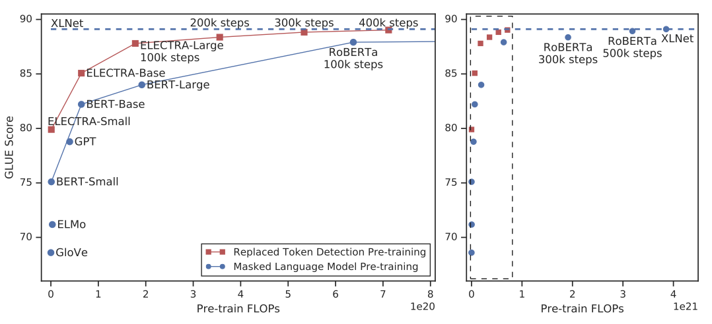
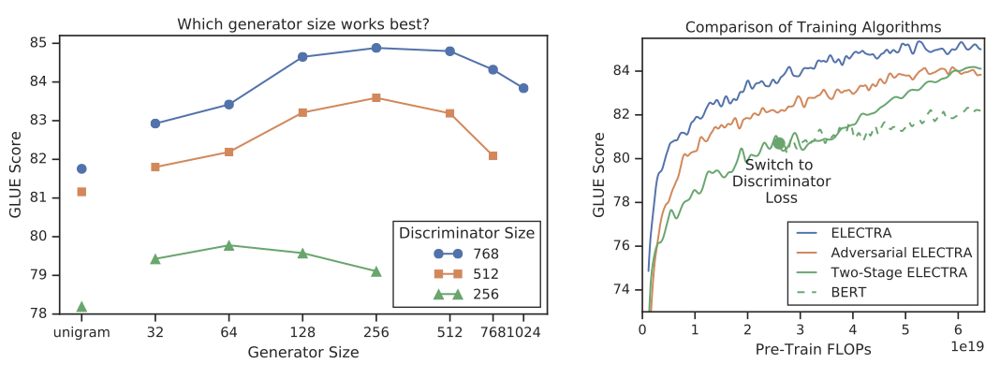
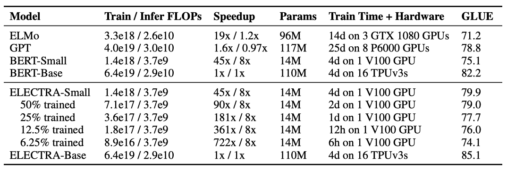
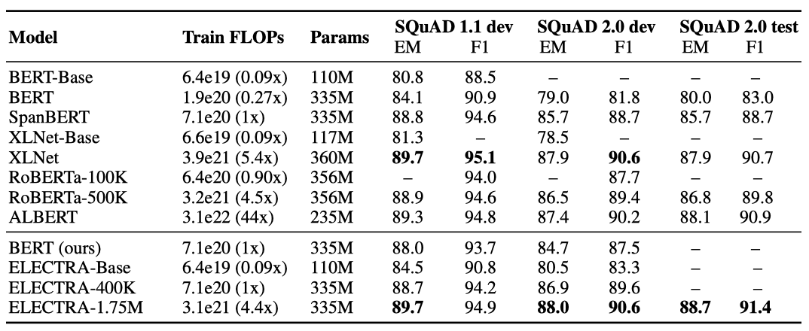

+++
author = "Kurt"
title = "ELECTRA"
date = "2023-12-24"
description = "Pre-training Text Encoders as Discriminators Rather Than Generators"
categories = [
    "Paper Review"
]
tags = [
    "LLM",
]
+++

## Abstract

BERT와 같은 masked language modeling(MLM) 방법은 일부 토큰을 [MASK]로 바꿔 원래 토큰을 재구성하는 모델을 훈련하지만, 이를 효과적으로 하려면 많은 계산이 필요하다. 대신에, replaced token detection 라는 더 효율적인 사전 학습 작업을 제안한다. 이 방법은 일부 토큰을 가능성 있는 다른 토큰으로 바꾸는 방식으로 입력을 변형하고, 변형된 토큰의 원래 값을 예측하는 대신 각 토큰이 생성자 샘플로 대체되었는지 여부를 예측하는 모델을 학습시킨다. 이 방법은 모든 입력 토큰에 대해 작업을 정의하므로 MLM보다 효율적이다. 결과적으로, 이 방식으로 학습한 컨텍스트 표현은 동일한 모델 크기, 데이터, 계산량을 가진 BERT보다 월등히 높은 성능을 보여준다. 특히, 작은 모델에서는 GLUE 자연어 이해 벤치마크에서 GPT를 능가하는 모델을 한 GPU에서 4일 동안 훈련할 수 있다. 대규모에서도 이 방법은 RoBERTa와 XLNet의 성능에 비교할 수 있으며, 더 적은 계산량을 사용하면서도 동일한 계산량을 사용할 때 그 모델들을 능가한다.

---

## Introduction

현재 state-of-the-art의 언어 표현 학습 방법은 denoising autoencoder이다. 이 방법은 일부 토큰을 마스킹하거나 어텐션을 적용하여 네트워크가 원래 입력을 복원하도록 학습한다. 하지만 이러한 masked language modeling (MLM)은 효과적이지만 상당한 계산 비용을 요구한다.

"replaced token detection"는 BERT와 XLNet의 불일치 문제를 해결하기 위한 사전 학습 작업이다. 이 방법은 일부 토큰을 대체하여 입력을 손상시키는데, 이를 구분하는 네트워크를 판별자로 사전 학습시킨다. 이 방식은 MLM과 달리 모든 입력 토큰에서 학습하므로 계산적으로 효율적이다. 또한 GAN과 유사하지만 텍스트에 GAN을 적용하기 어려워 maximum likelihood로 손상된 토큰을 생성하는 생성자를 학습시킨다.

ELECTRA는 효율적으로 토큰 대체를 정확하게 분류하는 encoder를 학습하는 접근 방식이다. BERT와 비교하여 ELECTRA는 모든 입력 위치에서 학습하며, 학습 속도와 downstream task에서의 정확도에서 우수한 성능을 보여준다.

ELECTRA는 다른 사전 학습 방법에 비해 계산 및 parameter를 더 효율적으로 사용하여 더 나은 성능을 보여준다. GLUE 벤치마크에서, ELECTRA-Small 모델은 BERT보다 5점 더 높은 성능을 보여주었고, ELECTRA-Large 모델은 RoBERTa와 XLNet과 비슷한 성능을 보이지만 훨씬 적은 계산량을 사용한다. ELECTRA-Large는 GLUE에서 ALBERT보다 우수한 결과를 얻었고, SQuAD 2.0에서 새로운 state-of-the-art를 달성하였다. ELECTRA는 언어 표현 학습에 있어서 계산 및 parameter 효율성이 뛰어난 판별적인 방법이다.

---

## Method

생성자 $G$와 판별자 $D$라는 두 개의 신경망을 사용한다. 이들은 입력 토큰 시퀀스 $x = [x_1, ..., x_n]$$를 문맥화된 벡터 표현의 시퀀스 $h(x) = [h_1, ..., h_n]$로 매핑한다. 주어진 위치 $t$에 대해, 생성자는 특정 토큰 $x_t$를 생성할 확률을 출력한다.

$$ p_G(x_t|x) = exp(e(x_t)^\intercal h_G(x)_t) \ / \sum\_{x'} exp(e(x')^\intercal h_G(x)_t) $$

$e$는 토큰 임베딩을 나타낸다. 주어진 위치 $t$에 대해, 판별자는 토큰 $x_t$가 실제 데이터에서 나온 것인지를 예측한다.

$$ D(x, t) = sigmoid(w^\intercal h_D (x)_t) $$

생성자는 masked language modeling(MLM)을 수행하기 위해 학습된다. 입력 $x = [x_1, x_2, ..., x_n]$이 주어지면, MLM은 우선 1부터 n 사이의 임의의 위치를 선택하여 $m = [m_1, ..., m_k]$를 마스크한다. 선택된 위치의 토큰은 [MASK] 토큰으로 대체된다. 이를 $x^{masked} = REPLACE(x, m, [MASK])$로 표기한다. 그런 다음 생성자는 마스크된 토큰의 원래 식별자를 예측하는 방법을 학습한다. 판별자는 데이터의 토큰과 생성자 샘플에 의해 대체된 토큰을 구별하는 방법을 학습한다. 구체적으로는, 마스크된 토큰을 생성자 샘플로 대체하여 손상된 예제 $x^{corrupt}를 생성하고, 판별자는 $x^{corrupt}에서 원래 입력 $x$와 일치하는 토큰을 예측하도록 학습된ㄴ다. 형식적으로, 모델의 입력은 다음과 같이 구성된다:

$$ m_i \sim unif\\{1, n \\} \ \text{for} i = 1 \ \text{to} \ k \quad \quad x^{masked} = REPLACE(x, m, [MASK]) $$
$$ \hat{x}_i \sim p_G(x_i | x^{masked}) \ \text{for} i \in m \quad \quad x^{corrupt} = REPLACE(x, m, \hat{x}) $$

손실 함수는 다음과 같다.

$$ \mathbf{L}_{MLM}(x, \theta_G) = \mathbb{E} \big( \sum\_{i \in m} - log \ p_G(x_i | x^{masked}) \big) $$

$$ \mathbf{L}_{Disc}(x, \theta_D) = \mathbb{E} \big( \sum\_{t=1}^n - \mathbb{1} (x^{corrupt}_t = x_t) log \ D(x^{corrupt}, t) - \mathbb{1} (x^{corrupt}_t \neq x_t) log(1 - D(x^{corrupt}, t)) $$

GAN과 유사하지만 몇 가지 주요한 차이점이 있다. 생성자가 올바른 토큰을 생성하면 "진짜"로 간주되며, 적대적으로 훈련되는 대신 maximum likelihood로 학습된다. 일반적인 GAN과 달리 생성자에게 입력으로 노이즈 벡터를 제공하지 않는다.

결합된 손실을 최소화한다.

$$ \underset{\theta_G, \theta_D}{min} \sum\_{x \in \mathbf{X}} \mathbf{L}_{MLM}(x, \theta_G) + \lambda \mathbf{L}\_{Disc}(x, \theta_D) $$

대규모의 원시 텍스트 데이터에 대해 결합 손실을 최소화한다. 손실의 기대값을 단일 샘플로 근사화하고, 생성자의 손실은 판별자로 역전파하지 않는다. 사전 학습 후에는 생성자를 버리고 판별자를 downstream task에서 세밀하게 조정한다.

---

## Experiments

### Experimental Setup

GLUE 벤치마크와 SQuAD 데이터셋을 사용하여 다양한 언어 이해 작업을 평가한다. GLUE 작업은 텍스트 간 연역, 질문-답변 연역, 문장 재구성, 질문 재구성, 텍스트 유사도, 감성 분석, 문장 수용성 등을 다루며, SQuAD는 질문에 대한 정확한 답변을 선택하는 작업이다. 사전 학습은 BERT 데이터를 사용하고, 일부 모델은 XLNet 데이터를 사용한다. 사전 학습과 평가는 주로 영어 데이터를 기반으로 하지만, 향후 다국어 데이터에도 적용할 수 있다.

ELECTRA는 BERT와 비슷한 구조와 hyperparameter를 가지고 있다. GLUE에 대한 미세조정에서는 ELECTRA 위에 단순한 선형 분류기를 추가하고, SQuAD에 대해서는 ELECTRA 위에 XLNet의 질문-답변 모듈을 추가하였다. 결과는 동일한 사전 훈련 체크포인트에서 10번의 파인튜닝 실행의 중앙값을 사용한다. 

### Model Extensions

모델에 여러 확장 기법을 제안하고 평가한다. 다른 명시가 없는 한, 이 실험들은 BERT-Base와 동일한 모델 크기와 훈련 데이터를 사용한다.

**Weight Sharing** 생성자와 판별자 사이의 가중치를 공유하여 사전 학습의 효율성을 높이는 것을 제안한다. 작은 생성자를 사용하고, 생성자와 판별자의 임베딩을 공유한다. 생성자의 입력과 출력 토큰 임베딩은 항상 연결된다.

500k step 동안 생성자와 판별자의 가중치 공유 전략을 비교한 결과, 토큰 임베딩을 공유하는 것이 가장 효과적이었다. 이는 masked language modeling이 토큰 임베딩을 학습하는 데 도움이 되기 때문이다. encoder 가중치를 공유하는 것은 큰 향상을 가져오지 않았으며, 생성자와 판별자의 크기가 동일해야 한다는 단점이 있다.

**Smaller Generators** ELECTRA 학습 시, 생성자와 판별자가 동일한 크기라면 계산량이 두 배로 증가한다. 따라서 생성자 크기를 줄여야 한다. 실험 결과, 생성자는 판별자의 1/4에서 1/2 크기가 가장 좋은 성능을 보여주었다. 이는 생성자가 너무 강력하면 판별자의 학습을 방해할 수 있기 때문이다.

**Training Algorithms** ELECTRA를 위해 다른 학습 알고리즘을 탐색했지만 성능을 향상시키지 못하였다. 대신 다음의 2 step 학습 절차를 사용하여 실험해 보았다.

* $n$ step 동안 $\mathbf{L}_{MLM}$을 사용하여 생성자만 학습한다.
* 판별자의 가중치를 생성자의 가중치로 초기화한 다음, 생성자의 가중치를 고정한 상태에서 $n$ step 동안 $\mathbf{L}\_{Disc}$로 판별자를 학습한다.

생성자와 판별자의 크기가 동일해야 초기화가 가능합니다. 초기화 없이 판별자를 학습하면 판별자가 주요 클래스 이외의 것을 학습하지 못할 수 있다. 반면, 생성자와 판별자를 함께 학습하면 판별자에게 생성자를 점차 개선시킬 수 있는 커리큘럼을 제공한다. 또한, 생성자를 GAN과 같이 적대적으로 훈련하고, 생성자에서 샘플링하는 이산 연산을 위해 강화학습을 사용하는 방법도 탐색하였다. 

2 step 학습에서 생성적 목적에서 판별적 목적으로 전환한 후에 downstream task 성능이 향상되었지만, 종합 훈련을 뛰어넘지는 못하였다. 적대적 훈련은 maximum-likelihood 학습보다 성능이 떨어지는데, 이는 적대적 생성자의 masked language modeling 성능이 낮고 다양성이 부족하기 때문이다.

### Small Models

이 연구에서는 사전 학습의 효율성을 개선하기 위해 BERT-Base를 기반으로 작은 모델을 개발하였다. 이를 위해 시퀀스 길이, 배치 크기, 은닉 차원 크기, 토큰 임베딩을 줄였다. BERT-Small 모델과 동일한 hyperparameter로 학습하여 공정한 비교를 수행하였다. 또한, ELMo와 GPT와 같이 리소스를 적게 사용하는 사전 학습 방법과 BERT-Base와 비교 가능한 ELECTRA 모델의 결과도 확인하였다.

ELECTRA-Small은 크기에 비해 높은 GLUE 점수를 기록하여 다른 모델들보다 우수한 성능을 보여준다. 작은 모델이지만 BERT-Small보다 5점 높은 점수를 기록하며, 큰 GPT 모델보다도 우수한 결과를 보여준다. ELECTRA-Small은 수렴에 가깝게 학습되며, 6시간만 학습해도 합리적인 성능을 얻을 수 있다. 또한, ELECTRA의 중간 크기인 base-sized 모델은 BERT-Base보다 우수한 성능을 보이며, BERT-Large보다도 뛰어난 결과를 얻었다. ELECTRA의 강력한 성능은 상대적으로 적은 계산 비용으로 사전 학습 모델을 개발하고 적용하는 데 도움이 된다.

### Large Models

큰 ELECTRA 모델은 BERT-Large와 같은 크기이지만 더 오랜 시간 동안 학습된다. ELECTRA-400K는 RoBERTa의 1/4의 계산 비용으로 학습되었으며, ELECTRA-1.75M은 RoBERTa와 유사한 계산 비용으로 학습되었다. 배치 크기는 2048이고, XLNet 사전 학습 데이터를 사용하였다. ELECTRA-400K와 동일한 hyperparameter와 학습 시간으로 BERT-Large 모델도 학습되었다.

ELECTRA-400K는 RoBERTa와 XLNet와 비슷한 성능을 보이지만, 학습에 필요한 계산량은 1/4로 줄어들었다. ELECTRA-1.75M은 더 오랜 시간을 투자하여 학습되었으며 대부분의 GLUE 작업에서 다른 모델들보다 우수한 성능을 보여준다. BERT 모델은 예상보다 성능이 낮게 나왔는데, 이는 hyperparameter 튜닝이나 RoBERTa 학습 데이터 사용에 더 많은 고려가 필요할 것으로 보인다.

ELECTRA의 이점은 GLUE 테스트 세트에서도 확인되었으나, 모델들이 사용한 추가적인 기법들로 인해 완전히 동일한 비교는 어렵다.

ELECTRA는 GLUE 결과와 일관성을 보여준다. 같은 계산 자원을 사용하는 경우, ELECTRA가 masked-language-modeling 방법보다 우수한 성과를 보여준다. ELECTRA-400K는 RoBERTa-100K와 BERT 기준 모델보다 더 좋은 성능을 가지며, ELECTRA-1.75M은 SQuAD 2.0에서 이전 모델들보다 높은 점수를 받았다. ELECTRA-Base는 BERT-Base와 XLNet-Base보다 우수한 결과를 보여주며, 대부분의 지표에서 BERT-Large를 뛰어넘는다. ELECTRA는 SQuAD 2.0에서 SQuAD 1.1보다 성능이 좋다. 이는 모델이 실제 토큰과 가짜 토큰을 구별하는 대체된 토큰 감지 기능이 응답 가능성 분류에 특히 적합하기 때문이다.

### Efficiency Analysis 

ELECTRA의 이점이 어디에서 나오는지 이해하기 위해, BERT와 ELECTRA 사이에 다른 사전 학습 목표를 비교하였다.

**ELECTRA 15%** ELECTRA와 동일하지만, 판별자 손실은 입력에서 마스크 처리된 15%의 토큰에 대해서만 계산된다. 다시 말해서, 판별자 손실의 합인 $\mathbf{L}\_{Disc}$은 1부터 $n$까지가 아닌 $i \in m$에 대해 계산된다. 이렇게 함으로써 ELECTRA 15% 모델은 일부 토큰에만 집중하여 손실을 계산하게 된다.

**Replace MLM** ELECTRA 모델이 [MASK] 토큰에 노출되는 사전 학습 단계와 노출되지 않는 미세 조정 단계 사이의 불일치를 해결하는 데서 어느 정도 이득을 얻는지를 테스트한다. 마스크 처리된 토큰을 [MASK]로 대체하는 대신 생성 모델의 토큰으로 대체하는 것이 특징이다.

**All-Tokens MLM** 이 모델은 Replace MLM과 비슷한데, 마스크 처리된 토큰을 생성 모델의 샘플로 대체하고, 입력의 모든 토큰의 신원을 예측한다. 복사 확률 $D$를 출력하기 위해 sigmoid layer를 사용하며, 모델 출력은 입력 토큰에 $D$ 가중치와 $1-D$를 곱한 MLM softmax의 출력으로 구성된다. 이 모델은 BERT와 ELECTRA를 조합한 것으로, [MASK] 토큰에 대한 예측과 다른 토큰에 대해서는 입력을 복사하는 방식으로 학습된다.

ELECTRA는 모든 입력 토큰에 대한 손실을 가지는 것이 성능 향상에 큰 영향을 미치며, BERT는 [MASK] 토큰으로 인한 사전 학습 및 세부 학습 불일치로 인한 약간의 성능 저하가 있다. 또한, BERT는 이 문제를 완전히 해결하기에는 부족한 것으로 나타났고, All-Tokens MLM은 BERT와 ELECTRA 사이의 차이를 크게 줄이는 역할을 한다.

ELECTRA는 빠른 학습뿐만 아니라 다른 이점들로 인해 All-Tokens MLM에 비해 개선되었다. 작은 모델일수록 ELECTRA의 이득이 커지며, 완전히 학습된 경우 BERT보다 더 높은 정확도를 보여준다. ELECTRA는 parameter를 더 효율적으로 사용하여 BERT보다 성능을 높일 수 있다. 그러나 ELECTRA의 parameter 효율성을 완전히 이해하기 위해서는 추가적인 분석이 필요하다.

---

## Related Work

**Self-Supervised Pre-training for NLP** Self-supervised learning은 단어 및 문맥 표현을 학습하는 데 사용된다. BERT는 masked-language modeling 작업을 통해 Transformer를 사전 학습한다. BERT를 확장한 모델들이 있으며, ELECTRA는 BERT와 비교하여 효율적인 사전 학습을 제공한다. 최근에는 BERT를 작은 모델로 축소하는 연구도 진행되고 있다. ELECTRA-Small은 사전 학습 속도에 초점을 맞춰 처음부터 학습되었다.

**Generative Adversarial Networks** GAN은 고품질 가짜 데이터 생성에 효과적이며, 이 논문의 방법과 유사한 방식으로 GAN의 판별자를 후속 작업에 활용할 수 있다. 텍스트 데이터에도 GAN을 적용할 수 있지만, 최신 기법은 standard maximum-likelihood 학습에 비해 아직 성능이 낮다. 생성자는 MaskGAN과 유사하게 삭제된 토큰을 채우는 방식으로 학습된다.

**Contrastive Learning** contrastive learning은 관찰된 데이터와 가짜 음성 샘플을 구분하는 방법이다. 이 방법은 텍스트, 이미지, 비디오 데이터 등 다양한 모달리티에 적용될 수 있다. ELECTRA는 Noise-Contrastive Estimation (NCE)와 관련이 있는데, 이 방법은 실제와 가짜 데이터를 구별하기 위해 이진 분류기를 학습시킨다.

Word2Vec은 NLP의 초기 사전 학습 방법 중 하나로 contrastive learning을 사용한ㄴ다. ELECTRA는 CBOW와 Negative Sampling의 대규모 버전으로 볼 수 있다. CBOW는 주변 문맥을 통해 입력 토큰을 예측하고, Negative Sampling은 이진 분류 작업으로 재구성한다. CBOW는 bag-of-vectors 인코더와 단순한 제안 분포를 사용한다.

---

## Conclusion

대체 토큰 감지라는 새로운 자기 지도 학습 작업을 제안하였다. 이 작업은 텍스트 인코더를 학습시켜 입력 토큰과 고품질 부정 샘플을 구별하게 한다. 계산 효율성이 우수하며 하위 작업에서 더 좋은 성능을 보인다. 

---

## Reference

* [Paper](https://arxiv.org/pdf/2003.10555.pdf)
* [Github](https://github.com/google-research/electra)