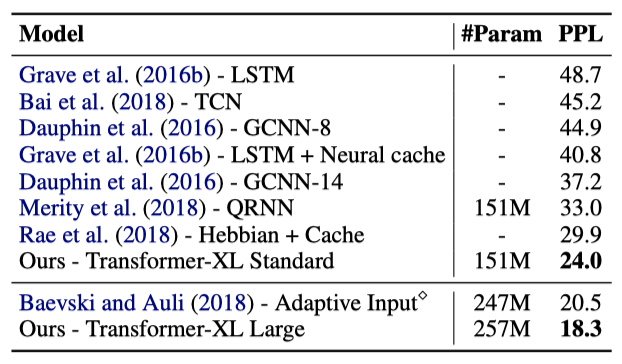
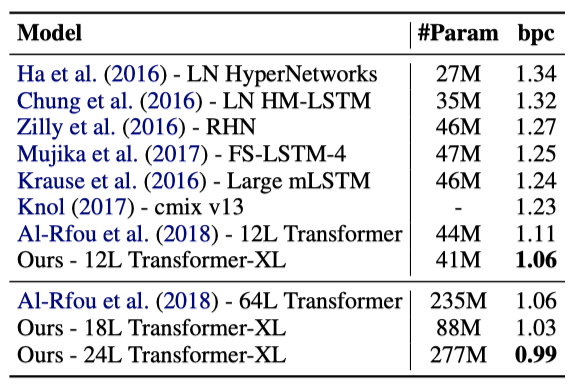
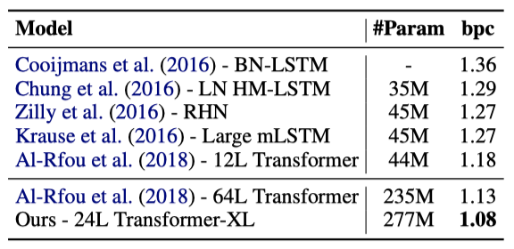
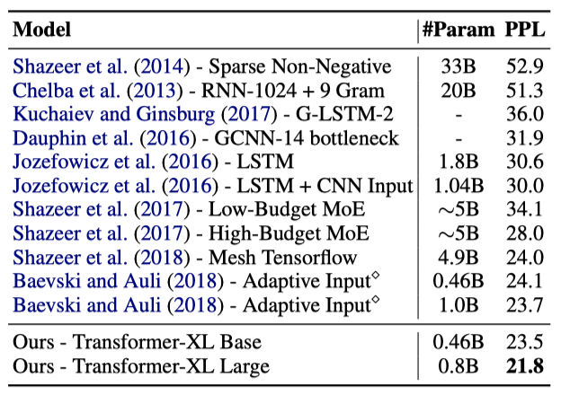
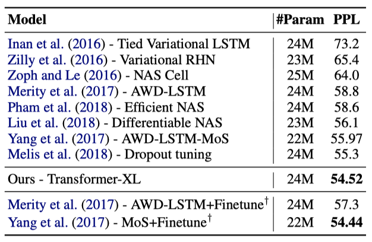
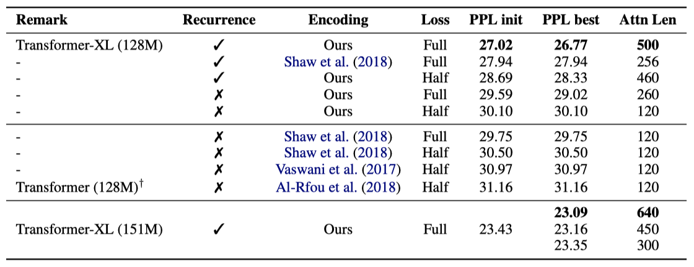
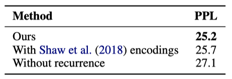
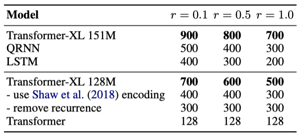

+++
author = "Kurt"
title = "Transformer-XL"
date = "2023-12-06"
description = "Attentive Language Models Beyond a Fixed-Length Context"
categories = [
    "Paper Review"
]
tags = [
    "LLM",
]
+++

## Abstract

transformer는 long-term dependency를 학습할 수 있지만, 언어 모델링에서는 고정된 길이의 컨텍스트에 제한된다. 이를 해결하기 위해, 시간적 일관성을 해치지 않고 고정 길이를 넘어선 의존성을 학습할 수 있는 새로운 아키텍처인 Transformer-XL을 제안한다. 이는 세그먼트 수준의 재발 메커니즘과 새로운 위치 인코딩 체계를 포함하며, long-term dependency를 포착하고 컨텍스트 조각화 문제를 해결한다. 결과적으로 Transformer-XL은 RNN보다 80% 더 긴, 기본 transformer보다 450% 더 긴 의존성을 학습하고, 평가 시간에서 기본 transformer보다 최대 1,800+ 배 더 빠르며, 여러 텍스트 dataset에서 state-of-the-art를 달성하였다.

---

## Introduction

언어 모델링은 long-term dependency을 처리해야하는 중요한 과제로, 이는 RNN과 LSTM을 통해 다루어지곤 했다. 그러나 RNN 기반 모델들은 gradient vanishing과 explosion 등의 문제로 인해 최적화에 어려움이 있었다. LSTM은 평균적으로 200개의 문맥 단어를 사용하는데, 이는 아직 개선의 여지가 있다는 것을 보여준다.

attention mechanism은 장거리 단어 쌍 간의 직접적인 연결을 통해 최적화를 쉽게하고 long-term dependency를 학습하는 데 도움이 된다. 그러나 이 기법은 fixed-length context를 가진 세그먼트에서만 작동하며, 이로 인해 long-term dependency를 충분히 포착하지 못하고, 문맥 파편화(context fragmentation)라는 문제를 야기한다. 이는 모델이 처음 몇 개의 기호를 잘 예측하는 데 필요한 문맥 정보가 부족하게 되어 최적화가 비효율적이고 성능이 떨어지게 된다.

fixed-length context의 제한을 해결하기 위해, Transformer-XL이라는 새로운 아키텍처가 제안되었다. 이는 이전 세그먼트의 은닉 상태를 재사용하고, 이를 통해 세그먼트 간에 순환 연결을 만들어 long-term dependency를 모델링하게 된다. 또한, relative positional encodings을 사용하여 temporal confusion를 일으키지 않고 상태 재사용을 가능하게 한다. 이러한 접근법은 문맥 파편화 문제를 해결하고, 더 긴 주의 길이로 일반화할 수 있는 새로운 relative positional encodings 공식을 도입하였다.

Transformer-XL은 단어와 문자 수준 언어 모델링에서 뛰어난 결과를 보였다. 이 모델은 오직 100M 토큰만을 학습하여 상대적으로 일관된 긴 텍스트를 생성할 수 있다. 이 모델의 주요 기여는 reuse의 개념을 도입하고 새로운 positional encodings 방식을 개발한 것이다. 이 두 기술은 고정 길이 문맥 문제를 해결하기 위한 완벽한 솔루션을 제공하며, 이들 중 하나만으로는 충분하지 않다. Transformer-XL은 문자와 단어 수준 언어 모델링에서 RNN보다 더 나은 성능을 보여주는 첫 번째 self-attention 모델이다.

순수하게 self-attention 모델에서 recurrence 개념을 도입하고 새로운 positional encoding 방식을 개발하는 기술적 기여를 하였다. 이 두 가지 기법은 고정 길이 컨텍스트의 문제를 해결하는 완전한 방법을 제공하며, Transformer-XL은 문자와 단어 수준 언어 모델링에서 RNN을 뛰어넘는 첫 self-attention 모델이다.

---

## Related Work

언어 모델링 분야는 최근 몇 년 동안 컨텍스트 인코딩을 위한 새로운 구조 개발, 정규화와 최적화 알고리즘의 개선, Softmax 계산의 가속화, 그리고 출력 분포 패밀리의 확장 등 다양한 중요한 발전을 이루어냈다.

언어 모델링에서 long-range context를 캡처하기 위한 연구들은 네트워크에 추가 입력으로 넓은 컨텍스트의 표현을 제공한다. 이는 수동으로 정의된 컨텍스트 표현부터 데이터에서 학습된 문서 수준의 주제를 사용하는 방식에 이르기까지 다양하다.

일반적인 시퀀스 모델링에서 long-term dependency를 어떻게 포착할 것인지는 오랫동안 연구되어 온 문제이다. LSTM이 널리 적용된 이후, 기울기 소실 문제를 완화하는 데 많은 노력이 집중되었다. 이런 노력에는 더 나은 초기화, 추가적인 손실 신호, 확장된 메모리 구조, RNN 내부 아키텍처의 수정 등이 포함된다. 하지만, 이 연구는 이들과 달리 Transformer 아키텍처를 기반으로 하며, 언어 모델링이 장기 의존성을 학습하는 능력에서 이익을 얻는다는 것을 보여준다.

---

## Model

언어 모델링의 목표는 토큰의 말뭉치 $x = (x_1, ..., x_T)$의 결합 확률 $P(x)$를 추정하는 것이다. 이는 auto-regressive로 인수분해되어 문제를 각 조건부 인수를 추정하는 것으로 간소화한다. 신경망은 문맥 $x$를 은닉 상태로 인코딩하고, 이를 단어 임베딩과 곱하여 logit을 얻는다. logit은 softmax 함수를 거쳐 다음 토큰의 확률 분포를 생성한다.

### Vanilla Transformer Language Models

transformer나 self-attention 메커니즘을 언어 모델링에 적용하는 핵심 문제는, 임의의 긴 문맥을 고정된 크기의 표현으로 효과적으로 인코딩하는 방법입니다. 이론적으로는 전체 문맥을 transformer decoder로 처리하는 것이 가능하지만, 실제로는 제한된 자원 때문에 이는 불가능할 수 있다.

전체 말뭉치를 관리 가능한 크기의 짧은 세그먼트로 분할하고, 각 세그먼트 내에서만 모델을 학습시키는 것이 한가지 근사치 방법이다. 이는 이전 세그먼트의 문맥 정보를 무시함을 의미한다. 이 방식의 한계는, 가장 큰 의존성 길이가 세그먼트 길이에 의해 제한되고, 이는 문자 수준 언어 모델링에서 몇 백에 불과하다. 또한, 효율성을 높이기 위해 긴 텍스트를 고정 길이 세그먼트로 분할하는 것이 일반적이지만, 이는 문맥 파편화 문제를 초래할 수 있다.

평가 시, 바닐라 모델은 각 단계에서 학습과 같은 길이의 세그먼트를 사용하지만, 마지막 위치에서만 예측을 한다. 그 다음 단계에서 세그먼트는 오른쪽으로 한 칸 이동하고, 새 세그먼트는 처음부터 다시 처리해야 합니다. 이 방식은 각 예측이 학습 중에 제공된 가장 긴 문맥을 활용하도록 하며, 문맥 파편화 문제를 완화하지만, 매우 비용이 많이 든다. 이 논문이 제안하는 아키텍처는 평가 속도를 크게 향상시킬 수 있다.

### Segment-Level Recurrence with State Reuse

고정 길이 문맥의 한계를 극복하기 위해, transformer 아키텍처에 recurrence 메커니즘을 도입하는 것을 제안한다. 학습 중에는 이전 세그먼트의 은닉 상태 시퀀스가 고정되어 캐시되고, 이는 모델이 다음 새로운 세그먼트를 처리할 때 확장된 문맥으로 재사용된다. 이 추가 입력은 네트워크가 히스토리 내의 정보를 활용하게 하여 장기 의존성을 모델링하고 문맥 파편화를 피하게 한다. 공식적으로, 두 연속 세그먼트는 각각 $s_\gamma$와 $s_{\gamma+1}로 표시되며, 각 세그먼트에 대한 n 번째 layer 은닉 상태는 $h_n^\gamma$로 표시된다.

$$ \tilde{h}_{\gamma+1}^{n-1} = [SG(h\_{\gamma}^{n−1}) \circ h\_{\gamma+1}^{n-1}] $$

$$ q_{\gamma}^{n+1}, k_{\gamma}^{n+1}, v_{\gamma}^{n+1} = h\_{\gamma+1}^{n-1}W_q^\intercal, \tilde{h}\_{\gamma+1}^{n-1}W_k^\intercal, \tilde{h}_{\gamma+1}^{n-1}W_v^\intercal $$

$$ h_{\gamma}^{n+1} = \text{Transformer-Layer}(q_{\gamma}^{n+1}, k_{\gamma}^{n+1}, v_{\gamma}^{n+1}) $$

여기서 함수 $SG(·)$는 stop-gradient를 나타내고, 표기법 $[h_u \circ h_v]$는 길이 차원을 따라 두 은닉 시퀀스의 연결을 나타내며, $W$는 모델 parameter를 나타낸다. standard Transformer와 비교해 볼 때, 핵심 차이점은 키 $k_{\gamma}^{n+1}$과 값 $v_{\gamma}^{n+1}$이 확장된 문맥 $h$와 따라서 이전 세그먼트에서 캐시된 $h_{\gamma}^{n+1}$에 의존한다는 점이다.

이 recurrence 메커니즘을 적용하면, 은닉 상태에서 세그먼트 수준의 recurrence를 생성하게 되어, 효과적으로 활용되는 문맥이 두 세그먼트를 넘어서 확장될 수 있다. 하지만, recurrence 의존성이 세그먼트 당 한 layer씩 아래로 이동한다는 점이 전통적인 RNN-LM과는 다르다. 이로 인해, 가능한 가장 큰 의존성 길이는 layer 수와 세그먼트 길이에 대해 선형적으로 증가한다. 이는 RNN-LM을 학습하기 위해 개발된 truncated BPTT와 유사하지만, 마지막 상태 대신 은닉 상태의 시퀀스를 캐시하는 점에서 다르다. 이 방법은 relative positional encoding 기법과 함께 적용해야 한다.

recurrence scheme를 도입하면, 더 긴 문맥을 활용할 수 있고 파편화 문제를 해결할 뿐만 아니라, 평가 시간이 크게 단축되는 이점도 얻을 수 있다. 평가 시에 이전 세그먼트의 표현을 재사용함으로써, Transformer-XL은 바닐라 모델에 비해 최대 1,800배 이상 빠르게 평가할 수 있다.

recurrence scheme는 이전 세그먼트에만 제한될 필요가 없다. 이론적으로, GPU 메모리가 허용하는 한큼 많은 이전 세그먼트를 캐시하고, 그것들을 추가적인 문맥으로 재사용할 수 있다. 따라서, 사전 정의된 길이 $M$의 오래된 은닉 상태를 캐시하고, 이를 메모리라고 부른다. 실험에서는 학습 중에 $M$을 세그먼트 길이와 동일하게 설정하고, 평가 중에는 $M$을 여러 배 늘렸다.

### Relative Positional Encodings

이전 섹션에서 제시한 아이디어는 매력적이지만, 은닉 상태 재사용에 대한 중요한 기술적 도전이 있다. 특히, 상태를 재사용할 때 위치 정보의 일관성을 어떻게 유지할 것인지가 문제이다. standard transformer에서 시퀀스 순서 정보는 positional encoding을 통해 제공되며, transformer의 실제 입력은 word embedding과 positional encoding의 요소별 덧셈이다. 이 positional encoding을 recurrence 메커니즘에 적용하면, 은닉 상태 시퀀스는 특정 방식으로 계산된다.

$$ h_{\gamma+1} = f(h_\gamma, E_{s_{\gamma+1}} + U_{1:L}) $$

$$ h_{\gamma} = f(h_{\gamma-1}, E_{s_{\gamma}} + U_{1:L}) $$

여기서 $E_{s_{\gamma}} \in \mathbb{R}^{L×d}$는 $s_\gamma$의 단어 임베딩 시퀀스이고, $f$는 변환 함수를 나타낸다. $E_{s_{\gamma}}$와 $E_{s_{\gamma+1}}$ 모두 같은 positional encoding $U_{1:L}$와 연관되어 있음을 알 수 있다. 결과적으로, 모델에는 어떤 $j = 1, ..., L$에 대해 $x_{\gamma, j}$와 $x_{\gamma+1,j}$ 사이의 위치 차이를 구별하는 정보가 없어, 성능 손실이 발생한다.

state reuse 메커니즘을 가능하게 하기 위해, 은닉 상태에 relative position 정보만을 인코딩하는 것이 필요하다. 이를 위해, 각 layer의 attention score에 relative position 정보를 주입한다. 이는 relative position을 동적으로 attention score에 주입함으로써, 쿼리 벡터가 $x_{\gamma, j}$와 $x_{\gamma+1, j}$의 표현을 그들의 다른 거리에 따라 쉽게 구분할 수 있게 해준다. 이를 통해, state reuse 메커니즘이 가능해지고, absolute position은 relative position에서 재귀적으로 복구될 수 있으므로, 시간 정보를 잃지 않게 된다.

relative positional encoding의 개념은 이전에 기계 번역과 음악 생성에서 탐구되었다. 이 논문은 이를 다르게 유도하여, absolute positional encoding과 일대일로 대응하면서도 실증적으로 더 나은 일반화를 보여주는 새로운 형태의 relative positional encoding을 제시한다. standard transformer에서는 같은 세그먼트 내의 query와 key 벡터 사이의 attention score를 분해할 수 있다.

$$ A_{i,j}^{abs} = E_{x_i}^\intercal W_q^\intercal W_k E_{x_j} + E_{x_i}^\intercal W_q^\intercal W_k U_j + U_i^\intercal W_q^\intercal W_k E_{x_j}+ U_i^\intercal W_q^\intercal W_k U_j $$

relative position 정보에만 의존하는 아이디어를 따라, 다음과 같이 네 가지 항을 reparameterize하려고 제안한다.

$$ A_{i,j}^{abs} = E_{x_i}^\intercal W_q^\intercal W_k E_{x_j} + E_{x_i}^\intercal W_q^\intercal W_k \color{#6580DD}{R_{i-j}}+ \color{#DD6565}{u^\intercal} W_q^\intercal W_k E_{x_j}+ \color{#DD6565}{v^\intercal} W_q^\intercal W_k \color{#6580DD}{R_{i-j}} $$

* 가장 먼저 변경하는 것은 key 벡터를 계산하기 위해 절대 위치 임베딩 $U_j$의 모든 출현을 그 상대적 대응체 $\color{#6580DD}{R_{i-j}}$로 대체하는 것이다. 이는 주목할 위치에 대해서는 상대 거리만이 중요하다는 사전 정보를 반영하는 것이다. $\color{#6580DD}{R}$은 학습 가능한 parameter 없는 sinusoid encoding matrix이다.
* 쿼리 위치에 관계없이 다른 단어에 대한 주목 편향성이 동일하게 유지되도록 학습 가능한 parameter를 도입한다. 이를 위해, 학습 가능한 parameter $\color{#DD6565}{u}$ 와 $\color{#DD6565}{v}$를 각각 도입하여 쿼리와 관련된 항을 대체한다.
* 마지막으로, 내용 기반의 키 벡터와 위치 기반의 키 벡터를 생성하기 위해 두 가지 가중치 행렬 $W_{k, E}$ 와 $W_{k, R}$를 의도적으로 분리한다.

새로운 parameter화를 통해 각 항은 다음과 같은 의미를 갖게 된다: 첫번째 항은 내용 기반 주소 지정, 두번째 항은 내용에 따른 위치 편향, 세번째 항은 전역 내용 편향, 그리고 마지막 항은 전역 위치 편향을 나타낸다.

Shaw et al. (2018)의 접근법은 첫번째 항과 두번째 항 만을 가지고 있으며, 두 편향 항을 생략한다. 또한, original sinusoid positional encoding에 내장된 inductive bias를 포기하고 있다. 반면에, 이 논문의 방법은 sinusoid 공식을 적용한 relative positional embedding을 사용한다. 이로 인해, 특정 길이의 메모리에서 학습된 모델은 평가 시에 메모리를 몇 배 더 길게 자동으로 일반화할 수 있다.

relative positional embedding을 이용한 recurrence 메커니즘을 적용하여, Transformer-XL 아키텍처를 도출하였다. 이 아키텍처는 single attention head를 가진 N-layer로 구성되며, 그 계산 절차를 요약하면 다음과 같다. $n = 1, ..., N$에 대해:

$$ \tilde{h}_{\gamma}^{n-1} = [SG(h\_{\gamma}^{n−1}) \circ h\_{\gamma}^{n-1}] $$

$$ q_{\gamma}^{n}, k_{\gamma}^{n}, v_{\gamma}^{n} = h\_{\gamma}^{n-1}W_q^\intercal, \tilde{h}\_{\gamma}^{n-1}W_k^\intercal, \tilde{h}_{\gamma}^{n-1}W_v^\intercal $$

$$ A_{\gamma, i, j}^n = {q_{\gamma, i}^n}^\intercal k_{\gamma, j}^n + {q_{\gamma, i}^n}^\intercal W_{k, R}^n R_{i - j} + u^\intercal k_{\gamma, j} + v^\intercal W_{k, R}^n R_{i - j} $$

$$ a_\gamma^n = Masked-Softmax(A_\gamma^n)v_\gamma^n $$

$$ o_\gamma^n = LayerNorm(Linear(a_\gamma^n) + h_\gamma^{n-1}) $$

$$ h_\gamma^{n} = Positionwise-Feed-Forward(o_\gamma^n) $$

$h_\gamma^0 := E_{s_\gamma}$는 단어 임베딩 시퀀스로 정의된다. $A$를 계산하는 간단한 방법은 모든 쌍 $(i, j)$에 대해 계산을 수행하며, 이는 시퀀스 길이에 대해 이차적인 비용을 요구한다. 하지만, 이 연구에서는 $i − j$의 값 범위를 인지하고 시퀀스 길이에 대해 선형적인 비용으로 줄이는 계산 절차를 제시한다.

---

## Experiments

### Main Results

Transformer-XL을 다양한 데이터셋에 적용하여, 단어 수준과 문자 수준의 언어 모델링에서 state-of-the-art 시스템들과 비교하였다. 이 데이터셋들은 WikiText-103, enwik8, text8, One Billion Word, 그리고 Penn Treebank를 포함한다.

WikiText-103은 장기 의존성을 가진 가장 큰 단어 수준 언어 모델링 벤치마크이다. 이를 활용해, 우리는 Transformer-XL의 학습과 평가를 진행했고, 그 결과 Transformer-XL은 이전의 state-of-the-art를 대폭 뛰어넘는 결과를 보여주었다.

데이터셋 enwik8에서도 Transformer-XL 아키텍처는 이전의 state-of-the-art를 뛰어넘는 새로운 결과를 달성하였다다. 12-layer의 Transformer-XL은 모델 크기 제약하에도 불구하고, 기존의 RNN 기반 모델과 큰 차이를 보였다. 더 큰 모델 크기로 18-layer와 24-layer의 Transformer-XL을 학습시켰을 때, 문자 수준 벤치마크에서 1.0을 돌파하는 첫 번째 방법으로서 state-of-the-art를 달성하였다. 

text8은 enwik8과 비슷하지만, 텍스트를 소문자로 변환하고 특정 문자를 제거하여 처리된 100M개의 Wikipedia 문자를 포함한다. 이러한 유사성 때문에, enwik8에서의 최적의 모델과 hyperparameter를 그대로 text8에 적용하였고, Transformer-XL은 명확한 차이로 state-of-the-art를 달성하였다.

One Billion Word 데이터셋은 문장이 섞여 있어 long-term dependency를 보존하지 않으며, 주로 short-term dependency 모델링 능력을 테스트한다. Transformer-XL은 주로 long-term dependency를 더 잘 포착하기 위해 설계되었지만, 이 데이터셋에서도 단일 모델 state-of-the-art를 크게 향상시켰다. 이는 Transformer-XL의 장점이 짧은 시퀀스 모델링에도 적용될 수 있음을 보여준다.

단어 수준 데이터셋인 Penn Treebank를 테스트하기 위해, variational dropout과 weight average을 적용하여 Transformer-XL을 수정하였다. 적절한 regularization을 통해, Transformer-XL은 두 단계의 미세 조정 없이 state-of-the-art를 달성하였다. 이는 Transformer-XL이 작은 데이터셋에서도 잘 일반화될 수 있음을 보여준다.

### Ablation Study

Transformer-XL에서 사용한 recurrence 메커니즘과 새로운 positional encoding scheme의 효과를 검증하기 위해 두 가지 ablation study를 수행하였다.

첫 번째 연구는 long-term dependency를 요구한는 데이터셋인 WikiText-103에서 수행되었다. absolute encoding은 half loss와 함께 잘 작동하는 것으로 나타났다. 또한, recurrence 메커니즘과 인코딩 체계 모두가 최고의 성능을 달성하고, 평가 시간 동안 더 긴 attention 시퀀스로 일반화하는데 필요하다는 것이 확인되었다. 학습 중에 backpropagation 길이는 128이지만, 이 두 기술을 사용하면 테스트 시간에 attention 길이를 640까지 늘릴 수 있다.

recurrence 메커니즘이 추가 메모리를 요구함에도 불구하고, 같은 GPU 메모리 제약 하에서 Transformer-XL은 기준 모델들에 비해 더 우수한 성능을 보여주었다.

두 번째 연구는 long-term dependency를 요구하지 않는 데이터셋인 One Billion Word에서 실험을 수행하였다. 결과적으로, 세그먼트 수준의 recurrence를 사용하면 long-term dependency이 필요하지 않은 경우에도 성능이 크게 향상된다는 것을 확인하였다. 또한, relative positional encoding은 짧은 시퀀스에서도 우수한 성능을 보여주었다.

### Relative Effective Context Length

Khandelwal et al. 이 제안한 Effective Context Length(ECL) 대신, Relative Effective Context Length(RECL)라는 새로운 지표를 제안하였다. 이 지표는 모델 그룹에 대해 정의되며, 긴 문맥의 이득은 최고의 짧은 문맥 모델에 대한 상대적 개선으로 측정된다. Transformer-XL은 평균적으로 900단어의 의존성을 모델링할 수 있으며, RECL은 RNN과 transformer보다 각각 80%, 450% 더 길다는 결과를 보여주었다. 이는 Transformer-XL이 long-term dependency을 모델링할 수 있다는 것을 뒷받침한다.

### Generated Text

중간 크기의 WikiText-103에서만 학습된 Transformer-XL은 소소한 결점에도 불구하고 수천 개의 토큰으로 구성된 일관성 있는 기사를 생성할 수 있다. 

### Evaluation Speed

Transformer-XL와 바닐라 transformer 모델의 평가 속도를 비교한 결과, state reuse scheme 덕분에 Transformer-XL은 평가 중에 최대 1,874배의 속도 향상을 보여주었다.

---

## Conclusions

Transformer-XL은 강력한 perplexity 결과를 보이고, longer-term dependency를 더 잘 모델링하며, 평가 속도를 크게 향상시키고, 일관성 있는 텍스트를 생성할 수 있다. 이것은 텍스트 생성, 비지도 학습, 이미지와 음성 모델링 등의 분야에서 흥미로운 응용을 가능하게 한다.

---

## Reference

* [Paper](https://arxiv.org/pdf/1901.02860.pdf)
* [Github](https://github.com/kimiyoung/transformer-xl)