+++
author = "Kurt"
title = "BIG-bench"
date = "2024-02-06"
description = "Beyond the Imitation Game: Quantifying and extrapolating the capabilities of language models"
categories = [
    "Paper Review"
]
tags = [
    "LLM",
    "Milestone",
]
+++

## Abstract

언어 모델의 규모 증가는 양적 개선과 새로운 질적 능력을 동시에 가져온다. 이 새로운 능력들은 아직 잘 이해되지 않았지만, 그들의 잠재적인 영향력 때문에 중요하다. 미래 연구를 위해, 새로운 파괴적인 능력에 대비하고, 사회적으로 불이익한 효과를 완화하기 위해서는 현재와 가까운 미래의 언어 모델의 능력과 한계를 이해하는 것이 필수적이다.

the Beyond the Imitation Game benchmark(BIG-bench)는 현재 언어 모델의 능력을 넘어서는 다양한 작업으로 구성되어 있다. 이 벤치마크는 여러 기관의 저자들이 기여한 204개의 작업을 포함하며, 이 작업들은 언어학, 아동 발달, 수학, 상식 추론, 생물학, 물리학, 사회적 편향, 소프트웨어 개발 등 다양한 주제를 다룬다. 이 벤치마크를 사용하여 다양한 크기의 언어 모델을 평가하였고, 인간 전문 평가자 팀이 모든 작업을 수행하여 기준선을 제공하였다. 결과적으로, 모델 성능과 보정은 규모가 증가함에 따라 개선되었지만 절대적인 수치에서는 불만족스럽다. 또한, 모델 간 성능은 놀랍게도 유사하며, 희소성에서 이점을 얻었다. 그러나 사회적 편향은 모호한 맥락에서 규모와 함께 증가하는 경향이 있지만, 이는 프롬프팅으로 개선될 수 있다.

---

## Introduction

> *An important feature of a learning machine is that its teacher will often be very largely ignorant of quite what is going on inside.* (A.M. Turing, Computing Machinery and Intelligence, 1950)

생성적 언어 모델은 텍스트 시퀀스의 가장 적절한 연속 부분을 만드는 능력을 가지고 있다. 이 능력은 텍스트를 통해 설명하고 수행될 수 있는 모든 작업을 포함하므로, 이메일, 채팅, 웹 포럼 등에서의 문제 해결에도 사용될 수 있다.

최근 연구에서는 생성적 언어 모델이 더 크고 많은 데이터로 학습될수록 예측 가능한 방법으로 성능이 향상됨을 보여주고 있다. 이러한 발전에 따라, 언어 모델은 1 trillion 개 이상의 parameter로 확장되었고, 앞으로도 더욱 커질 것으로 예상되며, 아키텍처와 학습 방법의 개선을 통해 성능 향상도 계속될 것으로 보인다.

### Quantity has a quality all its own

양의 큰 증가는 종종 시스템에 새로운 행동을 부여한다. 과학에서, 규모의 증가는 새로운 표현을 필요로 하거나 신규 분야를 만들게 한다. 예를 들어, 양자장 이론에서 생태학까지 이어지는 계층은 각각 새로운 행동을 보이며, 각각이 풍부한 학문 분야의 주제가 되고 있다.

언어 모델은 크기가 증가함에 따라 새로운 행동을 보인다. 이들은 컴퓨터 코드 작성, 체스 두기, 의료 진단, 언어 간 번역 등에 대한 초기 능력을 보이지만, 아직은 해당 영역에 대한 지식이 적은 인간보다 능력이 떨어진다. 이런 breakthrough capabilities는 경험적으로 관찰되었으나, 새로운 breakthrough가 어느 규모에서 일어날지를 신뢰성 있게 예측하는 것은 어렵다. 아직 실험적으로 발견되지 않은 추가적인 breakthrough들이 이미 발생했을 수도 있다.

언어 모델이 커짐에 따라 양적 및 질적 변화가 일어나며, 이는 잠재적으로 변혁적일 수 있다. 큰 언어 모델들은 텍스트 기반의 다양한 작업에서 인간을 보완하거나 대체할 수 있으며, 새로운 애플리케이션을 가능하게 한다. 그러나 적절한 관리 없이는 social bias를 기술과 의사결정 과정에 깊게 뿌리내릴 수 있다. 반면, 적절한 관리가 이루어진다면, 인간의 bias를 줄이면서 의사결정을 자동화할 수 있게 된다.

언어 모델의 변혁적 효과로 인해, 그들의 능력과 한계를 이해하고, 이들이 어떻게 발전할지 예측하는 것이 중요하다. 이러한 이해는 새로운 기술 개발을 촉진하고, 일자리 손실부터 social bias의 자동화에 이르는 사회적 부작용을 완화하며, 모델 행동이 인간의 의도와 어긋날 수 있는 다른 방법을 예측하고, 가장 유망한 연구 방향을 정하며, 단순히 규모에 의해 해결될 것으로 예상되는 문제에 대한 연구 자원을 절약하는 데 도움이 된다.

### Limitations of current benchmarks

현재의 언어 모델링 벤치마크는 언어 모델의 행동과 미래 예측을 이해하는데 한계가 있다. 이 벤치마크들은 여러 가지 제한 사항을 가지고 있다.

많은 언어 모델링 벤치마크들은 범위가 제한적으로, 이미 언어 모델이 능숙하다고 입증한 특정 능력에 초점을 맞추고 있다. 예를 들어, 언어 이해, 요약, trivia 질문 답변 등 좁은 분야의 작업을 제안한다. 이런 벤치마크들은 목표가 좁고, 이미 알려진 언어 모델의 능력에 초점을 맞추기 때문에, 규모가 커짐에 따라 언어 모델이 개발할 수 있는 새로운 능력을 식별하거나 현재 능력의 폭을 특성화하는데 부적합하다.

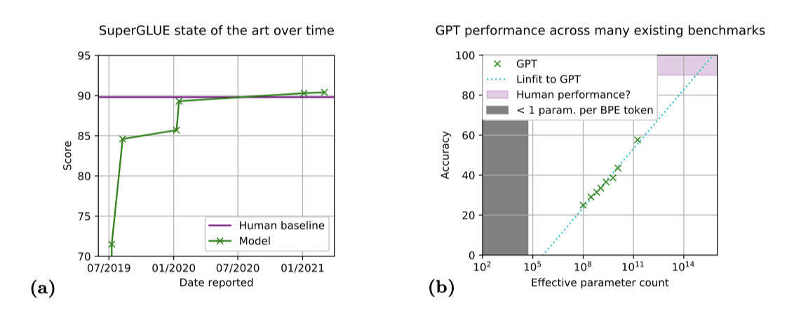

최근의 언어 모델링 벤치마크는 종종 유용한 수명이 짧다. 이 벤치마크들은 인간 수준의 성능이 달성되면 대체되거나 더 도전적인 벤치마크를 포함하여 확장되는 경우가 많다. 예를 들어, SuperGLUE 벤치마크에서는 제작 후 18개월 미만의 시간 동안에 인간을 뛰어넘는 성능이 달성되었다. 이러한 짧은 수명은 벤치마크의 제한된 범위 때문으로, 이로 인해 현재 언어 모델의 능력을 크게 초과하는 작업을 포함하지 못하게 된다.

많은 현재의 벤치마크들은 전문가나 작업 작성자가 아닌 사람들이 수행한 라벨링을 통해 데이터를 수집한다. 이 라벨링 과정의 비용과 어려움은 작업의 난이도에 큰 영향을 미치며, 이로 인해 종종 노이즈, 정확성, 분포 문제 등이 발생하여 결과의 해석 가능성을 줄일 수 있다.

### Beyond the imitation game

대규모 언어 모델의 잠재적 변혁적 효과를 예측하는 것의 중요성과 현재 벤치마크의 한계로 인해, 대규모 스케일, 높은 난이도의 다양한 벤치마크를 도입하고 이를 통해 모델의 성능을 측정한다. 인간 평가자의 기준선을 제공하며, 모델 성능이 인간 평가자의 성능과 구별될 수 있는지 평가한다. 이 벤치마크는 "Beyond the Imitation Game" 벤치마크 또는 BIG-bench라고 부르며, 더 가벼운 평가를 위한 BIG-bench Lite도 도입하였다.

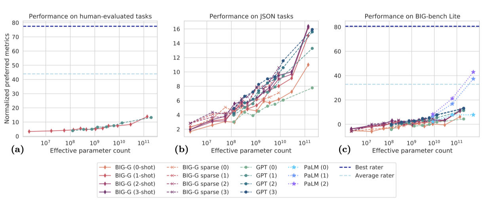

Google과 OpenAI의 dense 및 sparse transformer 모델을 벤치마크를 통해 분석하며, 모델 규모에 따른 성능 변화에 주목한다. 특히 언어 모델의 미래 능력에 대한 예측에 관심이 있다. 선택된 작업들에서는 규모에 따른 특정 모델 능력의 발전을 조사하였다.

---

## What is in BIG-bench?

The Beyond the Imitation Game benchmark (BIG-bench) GitHub repository에는 다음이 포함되어 있다:

* 204개 이상의 언어 작업 집합. BIG-bench의 검토 기준에 따라, 벤치마크 작업은 새롭고 다양한 주제와 언어를 다루며, 현재의 모델로는 완전히 해결할 수 없다.
* BIG-bench Lite: 전체 벤치마크보다 더 빠른 평가를 가능하게 하는 작은, 대표적이며 정식의 작업 하위 집합이다. 
* 벤치마크 API를 구현하고, 공개적으로 사용 가능한 모델에서의 작업 평가를 지원하며, 새로운 작업의 가벼운 생성을 가능하게 하는 코드이다.
* 여섯 단계의 크기를 가진 dense 및 sparse 언어 모델에 대한 자세한 평가 결과, 그리고 인간 평가자에 의해 설정된 기본선 결과가 포함되어 있다.

BIG-bench는 계속해서 작업과 평가 결과를 롤링 기준으로 수락하고 있다.

벤치마크 작업은 주로 작업 특화적인 미세 조정 없이 사전 학습된 모델을 평가한다. zero-shot과 few-shot 평가 설정에서 이러한 작업에 초점을 맞추면, 적은 수의 예제를 가진 작업에 대해서도 의미 있는 점수를 제공할 수 있다. 작은 작업들을 포함함으로써 주제의 다양성을 향상시키고, 도메인 전문가들이 라벨링의 어려움 없이 작업을 기여할 수 있게 한다.

### The BIG-bench API

BIG-bench API는 벤치마크 작업이 어떻게 모델과 상호작용하고 성능을 측정하는지를 정의하며, 언어 모델의 고수준 표현을 제공한다. 이 API는 JSON과 프로그래밍 방식의 두 가지 작업 유형을 지원한다.

벤치마크 작업의 대부분인 JSON 작업은 입력과 목표로 이루어진 예제들을 JSON 파일에 정의한다. 성능은 표준 메트릭을 사용하거나 모델이 할당한 확률에 따라 평가되며, 이는 few-shot 평가를 쉽게 가능하게 한다.

나머지 20%의 벤치마크 작업은 파이썬으로 작성되며, 모델과 직접적으로 multiple query round를 통해 소통하고 사용자 지정 지표로 성능을 측정한다. 이러한 작업은 모델 객체를 이용해 진행된다.

* **generate_text :** 주어진 입력에 대한 텍스트 연속을 생성한다.
* **cond_log_prob :** 입력값을 기준으로 대상의 conditional log probability를 계산한다.

작업 코드는 모델을 반복적으로 쿼리하여 여러 라운드의 "dialog"에서 모델을 평가한다. 그리고 성능은 작업에서 정의된 지표를 이용해 측정된다.

작업 작성자는 JSON과 프로그래밍 작업에 대해 여러 지표를 제공하지만, 각 작업에 대한 주요 지표와 해당 지표의 높고 낮은 점수를 지정해야 한다. 이 지표는 총 점수 계산에 사용되며, JSON 작업에 대한 가능한 전체 지표 목록은 BIG-bench 저장소에서 확인할 수 있다. 이 논문의 그림들은 개별 지표의 성능을 보여주며, 보통 0-100 범위의 점수를 보고한다.

* **exact_string_match :** 정확도에 대한 정확한 값.
* **multiple_choice_grade :** 0-100 사이의 가중치가 부여된 객관식 정확도는 각 잠재적 대상에 대한 점수가 지정된다. 단일 대상에 점수 1이 할당되고 나머지는 0일 때, 이는 표준 객관식 정확도가 된다.
* **expected_calibration_error :** calibration값은 모델의 정확도가 응답에 할당한 확률과 얼마나 잘 일치하는지를 보여준다. "expected_calibration_error"는 할당 확률에 따라 분류된 예시의 확률과 평균 정확도 사이의 절대 편차이다.
* **multiple_choice_brier_score :** 클래스 간의 모델이 할당한 확률과 0, 1 대상 사이의 제곱 오차로 주어진 보정 측정값.

JSON과 프로그래밍 작업은 대형 언어 모델의 능력을 충분히 측정하는 작업을 커버한다. 하지만, BIG-bench는 순수 언어 모델 평가에 초점을 맞추었기 때문에, 멀티 모달 능력을 평가하는 데는 한계가 있다. 이는 미래의 연구 방향이 될 수 있다.

### BIG-bench Lite

BIG-bench는 크고 다양한 작업 세트를 포함하며, 임의의 프로그래밍 작업을 지원하는데 이는 그 장점 중 하나이다. 그러나 이로 인해 평가에는 많은 계산 비용이 필요하며, 특히 프로그래밍 작업은 많은 모델 호출을 필요로 하고 일부 평가 파이프라인에 적용하기 어려울 수 있다.

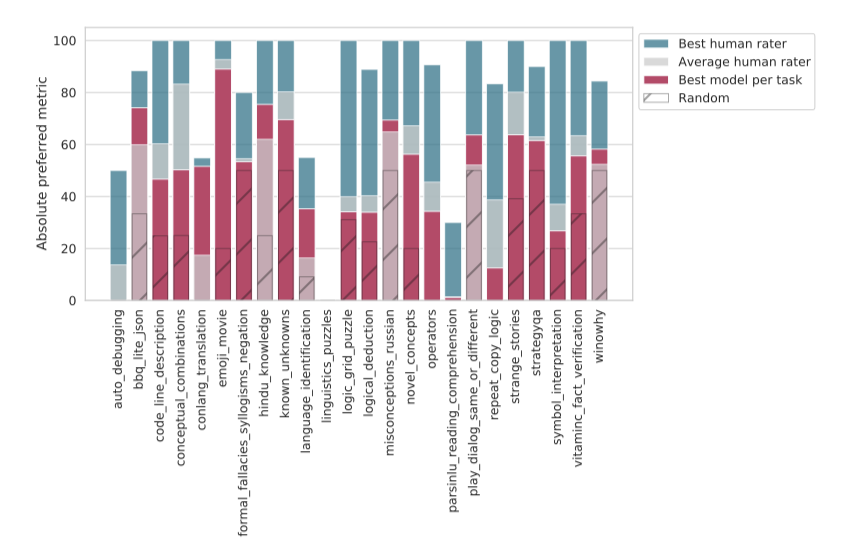

이 문제를 해결하기 위해, BIG-bench Lite(BBL)라는 24개의 작업 하위 집합을 선택하였다. BBL은 오직 JSON 작업만을 포함하며, 핵심 기여자들은 작업 키워드 커버리지와 코드, 비영어 능력, 편향 측정과 같은 특정 작업 유형을 고려하여 작업을 선택하였다.

### Evaluation targets

#### Language models evaluated on BIG-bench

모든 모델 출력은 특별히 언급되지 않는 한, greedily하게 샘플링되었다. temperature를 1로 설정하고 top-k를 40으로 설정한 샘플링은 점수를 낮추는 경향이 있었다. 예시당 여러 샘플을 추출하는 경우, 다른 샘플링 방법이 유익할 것으로 예상된다.

이 논문에서는 BIG-bench에서 평가한 모델의 결과를 분석하였다. 또한 BIG-bench는 Gopher, Chinchilla, T0 등 다른 모델에서도 부분적으로 평가되었다.

모든 모델(PaLM 제외)의 학습 데이터는 BIG-bench 저장소가 만들어지기 전에 수집되었으므로, 이 논문의 모델로의 BIG-bench 작업의 직접 유출은 불가능하다. 하지만 인터넷에서 사용 가능한 텍스트를 사용하는 많은 작업 때문에 간접 유출은 가능하다. 미래의 모델들은 데이터 유출 탐색에 "training_on_test_set" 작업을 사용할 수 있다.

**BIG-G.** Google에서 훈련된 BIG-G 모델은 gated activation layer과 GELU activation을 기반으로 하는 13개의 밀집 decoder-only Transformer 모델을 사용한다. 이 모델들은 웹 문서, 코드, 대화, 위키백과 데이터의 혼합으로 구성된 데이터 세트에서 학습되었으며, 대부분이 영어로, 약 6%의 비영어 텍스트를 포함하고 있다.

**BIG-G sparse.** Mixture-of-Experts와 Switch Transformers 등 sparsely activate 모델이 인기를 끌고 있다. 이 모델들은 상대적으로 적은 계산 비용으로 큰 모델 규모를 제공한다. decoder layers만 있는 sparsely activated 모델을 사전 학습하며, 이는 각 토큰을 32개의 expert 중 독립적으로 라우팅한다. 모든 sparse 모델은 BIG-G 모델과 동일한 혼합에서 학습된다.

**GPT.** GPT-3 모델 시리즈에 해당하는 OpenAI GPT 모델을 사용한다. 이 모델들은 125M에서 175B 개의 parameter를 가진 8개의 dense decoder-only transformer이다. 50k-token byte-pair 인코딩 방식으로 토큰화하였으며, 이 모델들은 300B 토큰에 대해 동일한 OpenAI 데이터 세트에서 학습되었다.

#### Human rater baseline performance

언어 모델 평가와 함께 전문 평가자 팀을 사용하여 BIG-bench의 작업을 완료하였다. 평가자들은 가능한 모든 자원을 활용하도록 권장되었고, 이에 따라 평가자들 간의 작업 평균 점수와 최고 점수를 보고하였다(평가자가 작업을 여러 번 수행한 경우, 평균 성적을 고려하였다).

BIG-bench의 내용이 다양한 언어, 특정 도메인 지식, 그리고 가정된 수학적 및 과학적 배경을 포괄하고 있기 때문에, 이러한 모든 요소를 "human performance"를 나타내는 하나의 숫자로 집계하는 것은 복잡한 문제이다. 특히, 작업이 프로그래밍 지식을 요구하는 경우, 프로그래밍을 모르는 평가자의 점수를 어떻게 고려해야 할지가 문제이다.

모든 작업에 대한 평가자들의 평균과 최대 점수를 보고하지만, 이 점수들이 인간이나 특정 평가자들이 달성할 수 있는 최고의 점수를 나타내는 것은 아니다. 평가자들은 주어진 시간 동안 작업을 완료하도록 작업을 샘플링하며, 작업의 형식과 내용은 벤치마크 개발 중에 변경되었다. 이 점들을 고려하여 이러한 지표를 해석해야 한다.

특히, social bias을 포함하는 작업에 대한 이러한 점수를 해석할 때는 주의해야 한다. 전문 평가자들의 인구통계학적 및 배경적 특성은 반드시 일반 인구를 대표하는 것은 아니며, 이 자체가 bias의 원인이 될 수 있다.

### Include a canary string in all documents about BIG-bench

모든 BIG-bench 작업 정의 파일에는 웹 스크랩된 학습 코퍼스에서 BIG-bench 데이터를 필터링하기 위한 canary GUID 문자열이 포함되어 있다. 이는 모델이 테스트 세트에서 학습하지 않도록 하기 위한 것이다. 또한, BIG-bench 데이터가 모델 학습에 사용되었는지를 사후 진단하기 위해 이 canary 문자열이 사용된다.

---

## Behavior of language models and human raters on BIG-bench

### Aggregate performance improves with model size but is worse than human performance

BIG-bench에서 평가된 평균 성능은 컴퓨팅 규모와 shot 수가 증가함에 따라 향상되지만, 가장 강력한 모델들조차도 인간 평가자의 성능에 비해 전반적으로 부족하다. 각 BIG-bench 작업은 작업 작성자가 지정한 고유한 선호 지표와 그에 대한 높고 낮은 값이 있으며, 이를 사용하여 원시 선호 점수를 낮은 점수를 빼고 0-100 범위로 정규화하여 종합 성능을 계산한다.

$$ \text{[normalized preferred metric]} = 100 \times {{\text{[raw preferred metric] − [low score]}}\over{\text{[high score] − [low score]}}} $$

정규화된 선호 지표 하에서, 작업의 점수는 0이면 성능이 떨어지고, 100이면 매우 좋은 성능을 나타낸다. 일부 작업에서 모델의 점수는 0 미만이거나 100 초과일 수 있다. 인간 전문가는 대체로 100에 가까운 점수를 얻을 것으로 예상되며, 이 지표는 모든 작업에 대해 평균되어 종합 성능을 나타낸다. 가장 좋은 성능을 보인 언어 모델은 20 미만의 점수를 얻었다.

### Model predictions grow better calibrated with increased scale

모델이 정확하며 잘못된 답변에 대해 높은 확신을 부여하지 않는 것이 중요한 많은 사용 사례가 있다. 이 부분에서는 BIG-bench에서 모델의 불확실성 추정치가 얼마나 잘 조정되는지와 모델 규모에 따라 이 조정이 어떻게 변하는지를 측정한다.

현대의 신경망은 과신하는 경향이 있고, 모델의 깊이나 너비가 증가해도 이 문제가 개선되지 않는다. 사전 학습은 시각 작업에 대한 모델의 조정을 향상시킬 수 있지만, 대규모 언어 모델인 GPT-3의 예측은 인간 평가자에 비해 잘 조정되지 않았다. 사전 학습된 언어 모델은 일반적으로 도메인 내에서는 잘 조정되지만, 도메인 외부에서는 큰 조정 오류를 보인다. generative 언어 모델(T5, BART, GPT-2)의 질문-답변 작업에 대한 예측 확률 역시 잘 조정되지 않았다.

모델의 조정을 검증하기 위해, 모델 규모에 따른 다중 선택 작업에서 모델의 조정을 측정하였다. 모델의 신뢰도는 대상 선택의 conditional log likelihood score에 기반하며, 이를 사용해 각 모델 크기에 대한 Brier 점수와 예상 조정 오류를 계산하였다. Brier 점수는 예측 확률의 정확성을 측정하는데 사용되며, 예상 조정 오류는 조정을 측정하는 데 널리 사용되었다. 다양한 조정 지표에 대한 논의는 Ovadia 등의 작업을 참조할 수 있다.

Brier 점수와 예상 조정 오류 점수는 모두 상당히 높은 편(0.2-0.3 Brier 점수, 0.25-0.45 예상 조정 오류), 이는 모든 모델의 예측이 잘 조정되지 않았음을 나타낸다. 이 결과는 이전 연구들과 일치하며, 반면에 모델 규모가 커질수록 조정이 개선되는 경향을 보여주었다.

### Model classes behave similarly, with benefits from sparsity

전반적으로, dense 모델과 sparse 모델, 그리고 GPT와 BIG-G 모델 간에 학습과 테스트 cross entropy의 측정치는 유사하다.

BIG-G sparse 모델은 BIG-G dense 모델보다 BIG-bench 작업에서 더 뛰어난 성능을 보여주며, 동일한 모델 성능에 대해 추론 비용에서 대략 2배의 향상을 보여준다. sparse 모델은 parameter는 많지만, 활성화되는 네트워크 부분이 적어 총 계산량은 더 적다. 또한, BIG-G sparse 모델은 예측의 조정에서 크게 향상되며, 주어진 조정 점수에 도달하기 위해 필요한 parameter 수에서 약 10배의 향상을 보여주었다.

BIG-G와 GPT 모델의 성능은 비슷하나, 작은 모델 크기에서는 GPT 모델이, 큰 모델 크기에서는 BIG-G 모델이 더 좋다. 하지만, 모든 규모에서 BIG-G sparse 모델이 가장 높은 성능을 보여준다.

모델 클래스들 사이에는 전반적으로 유사성이 있지만, 개별 BIG-bench 작업과 키워드에서는 성능 차이가 있었다. 이 차이에 대한 명확한 해석은 아직 없으며, 특히 sparse 모델과 dense 모델 사이의 행동 차이를 조사하는 것은 향후 연구 주제로 흥미롭다.

### Linearity and breakthroughness: categorizing scaling behaviors

모델의 성능은 일부 작업에서는 규모에 따라 안정적으로 향상되지만, 다른 일부 작업에서는 규모에 따른 개선을 보이지 않는다. 특정 규모에서 성능이 급증하는 경우도 있다. 이런 다양한 성능 변화를 정량화하기 위해 우리는 두 가지 새로운 지표를 도입하였다.

* **Linearity L:** 작업에 대한 성능이 규모에 따라 안정적으로 개선되는 정도를 측정하기 위한 것이다.
* **Breakthroughness B:** 모델이 일정 규모 이상으로 커지면서만 작업을 배울 수 있는 정도를 측정하려는 것이다.

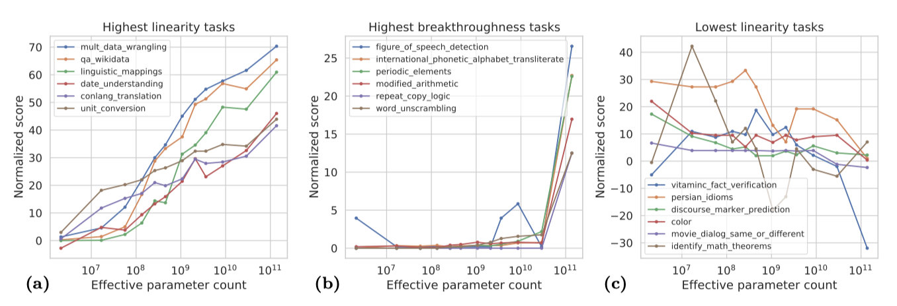

지표에서 가장 극단적인 점수를 가진 작업들의 정규화된 성능 점수를 보여준다.

#### Properties of tasks with high linearity or breakthroughness

가장 높은 linearity를 가진 작업들은 주로 학습 데이터 내의 정보를 기억하는 데 의존하는 지식 기반의 작업들이다. 이는 퀴즈 형식의 질문에 대답하거나 간단한 텍스트 매핑을 수행하는 것과 같은 작업을 포함한다.

강한 breakthroughness를 보이는 작업들은 여러 단계나 다양한 기술을 요구하는 복합적인 작업들이다. 이에는 특정 입력에 대해 맥락에 따라 정의된 수학적 연산자를 적용하는 'modified_arithmetic' 작업과 같은 예가 포함되며, 'repeat_copy_logic', 'figure_of_speech_detection', 'codenames'도 이와 같은 복합적인 작업으로 볼 수 있다.

'codenames'와 같은 작업은 언어적 유사성과 유추를 다루지만, 순차적인 지시사항을 따라야 하므로 복합적인 작업으로 분류된다.

high linearity나 breakthroughness과 연관된 작업 유형에 대한 이러한 관찰은 일화적이며, 이것이 일반적으로 유지되는지 연구하는 것은 흥미로울 것이다.

#### Breakthrough behavior is sensitive to details of task specification

Breakthrough 현상은 모델이 갑자기 새로운 기능을 급격히 획득하는 것을 나타낸다. 하지만 세밀한 분석을 통해 모델의 기능 변화가 더 부드럽게 이루어진다는 것을 알 수 있다. 이러한 점진적인 개선은 작업을 분해하여 부분적인 진전을 더 잘 포착하게 함으로써 드러날 수 있다.

Breakthrough 현상은 인간이 갑자기 이해하는 "aha! moments"을 떠올리게 한다. 인간의 "aha! moments"가 이해력의 부드러운 개선과 연관되어 있는지는 흥미로운 주제이다.

**Using smoother metrics.** "exact_str_match" 지표는 모델 출력이 목표 문자열과 완전히 일치할 때만 점수를 주므로 돌파현상을 보이는데, BLEU, BLEURT, ROUGE와 같은 다른 지표를 살펴보면 더 점진적인 진전을 확인할 수 있다.

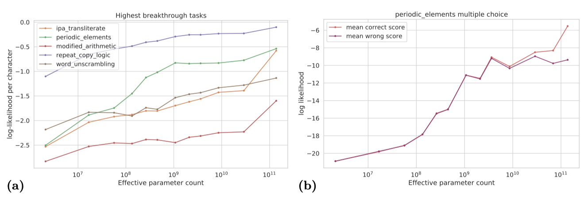

객관식 문제를 점수화하는 "multiple_choice_grade"는 올바른 선택지가 모든 잘못된 선택지보다 높은 log probability를 가질 때만 점수를 주므로, 전부 혹은 전혀 없음의 효과를 초래한다. 이를 부드럽게 만드는 대안 지표로는 올바른 선택지의 mean probability나 mean log probability가 있다.

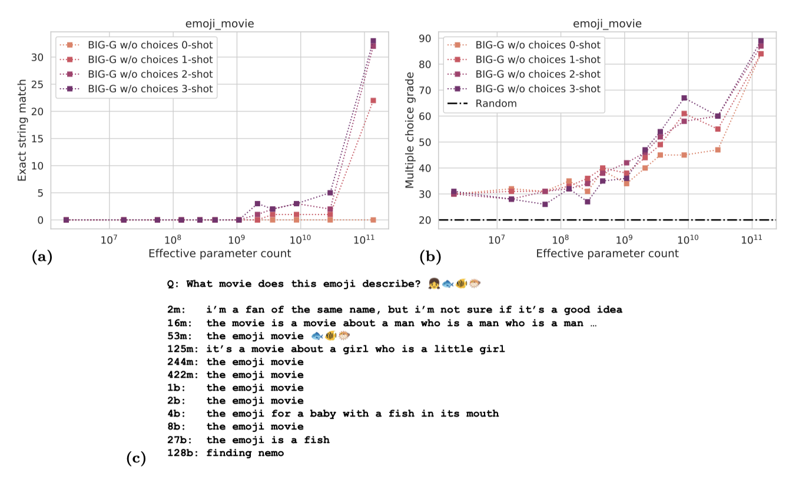

**Manual decomposition into subtasks.** 일부 작업은 목표 능력에 필요한 기본 기술을 식별하고 이를 측정하는 부분 작업을 설계함으로써 점진적인 진전을 관찰할 수 있다. "checkmate_in_one"에서는 모델이 체스의 메이트 이동을 배우기 전에 유효한 체스 이동을 생성하는 것을 배운다. "emoji_movie" 작업에서는 모델이 이모티콘 시퀀스로 영화를 추측하는데, 이때 "exact_str_match" 지표는 breakthrough 현상을 보이지만, 객관식 지표를 사용하면 성능 향상이 더 점진적으로 나타났다. 이러한 점은 모델 출력을 수동으로 검토할 때 확인할 수 있다.

모델의 부드러운 개선이 항상 전체 작업 성능을 설명하지는 않는다. 부분 작업이나 지표가 점진적으로 개선되더라도 실제 작업 성능에 대해 어떤 정보를 제공하는지는 항상 명확하지 않다. 예를 들어, 체스의 합법적인 이동을 완벽하게 인식하는 것이 "checkmate_in_one" 작업에서 높은 성능을 보장하지 않을 수 있다. "periodic_elements" 작업에서는 모델이 올바른 원소와 다른 원소를 구별하지 못하다가, 일정 규모 이상에서 log likelihood 곡선이 갑자기 이탈하면서 정확도가 급격히 향상된다.

#### Even programmatic measures of model capability can be highly subjective

언어 모델의 능력과 변화 경로가 특정 작업을 통해 정량화되더라도 상당히 주관적일 수 있다는 결론을 도출한다. 작업 설계에 따라 동일한 능력이 정체되는 것처럼 보이거나 점진적으로 또는 갑작스럽게 개선되는 것처럼 보일 수 있다. 일반적으로 하나의 지표만으로 작업 해결 능력을 정량화하기는 어렵고, 지표가 적절하게 측정되고 있는지 확인하기 위해 모델 출력을 항상 확인해야 한다. 이는 학습 중에 평가 지표가 명시적으로 지향되지 않는 경우, 특히 중요하다.

### Even large language models are brittle

큰 언어 모델이 자연어 질문의 정확한 표현에 민감하게 반응하며, 때때로 직관적이지 않게 동작하는 것, 즉 "brittle" 현상에 대한 두 가지 예를 살펴본다. 특히 객관식 질문의 표현 방식을 중점적으로 다룬다. 일반적으로 이러한 작업의 입력 질의는 질문의 답변 선택지를 포함하게 된다.

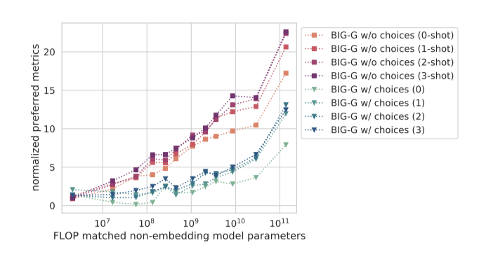

객관식 JSON 작업에서 질의에 선택지를 추가했을 때와 그렇지 않았을 때의 BIG-G 모델 성능을 비교한다. 기본적으로 모델은 각 선택지를 점수 매기기 전에 비교할 수 있지만, 이것이 성능을 향상시킬 것으로 생각되지만, 실제로는 선택지를 포함시키는 것이 성능을 저하시킨다. 이는 few-shot 상황에서도 마찬가지이다.

"cause_and_effect" 작업에서는 모델에게 원인과 결과가 연결된 두 사건을 제시하고, 어떤 사건이 다른 사건을 발생시켰는지 판단하도록 요구한다. 이 작업은 세 가지 다른 형식으로 제시된다.

1. 사건들은 "A because B"와 "B because A"의 형태로 문장을 구성한다. 모델은 각 문장에 확률을 할당하고, 이 확률을 통해 원인을 추론한다. 예를 들어, "A because B"에 더 높은 확률이 할당되면, B가 원인으로 예측된다.
2. 모델은 작업 설명과 두 가지 선택지를 제공하는 프롬프트에 따라 동일한 두 문장에 점수를 매기도록 요청된다. 모델은 두 가지 선택지에 확률을 할당하도록 요청되고, 점수가 더 높은 선택지가 모델의 예측으로 간주된다.
3. 모델은 두 개의 사건 A와 B를 서로 다른 문장으로 받아, 어떤 문장이 다른 문장의 원인인지 식별하게 된다. 이때, 사건들은 자연어 문장으로 합쳐지지 않는다. 이전의 경우처럼, 모델은 두 선택지에 확률을 할당하고, 점수가 더 높은 선택지가 예측된 원인으로 간주된다.

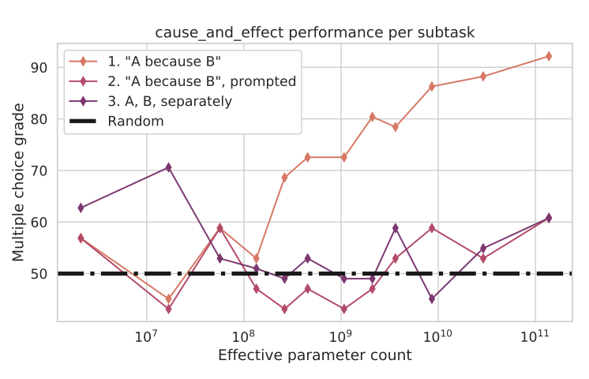

첫 번째 형식 "A because B"에서는 모델 규모가 커짐에 따라 점진적인 개선이 보인다. 그러나 다른 두 형식에서는 무작위 추측 이상의 성능 향상이 없다. 이는 프롬프팅에 따른 의존성이 높다는 것을 보여준ㄴ다. 첫 번째 버전 작업은 원래 학습 목표에 가장 가깝고, 모델은 더 가능성이 높은 자연어 문장을 예측하게 된다. 다른 버전에서 성능이 낮은 이유는 이 작업들이 학습 분포와 다르기 때문으로 추측된다. 최근에는 대형 언어 모델의 규모를 늘리면 질문 표현에 대한 빠져있는 현상이 개선될 수 있음이 제안되었습니다.

모델의 객관식 제시와 원인과 결과 형식에 대한 민감성은 한 버전의 작업을 해결하는 능력이 다른 버전에 자동적으로 적용되지 않음을 보여준다. 충분한 예제와 함께 미세 조정된 충분히 큰 모델은 이러한 작업 형식의 변화에 견고할 것으로 예상된다. 더 큰 모델에 대한 최근의 연구결과는 표현 민감성의 일부가 더 큰 규모에서 해결될 수 있음을 보여줍니다. 그러나 거대 언어 모델의 성공과 실패를 해석할 때 작업 제시의 세부 사항을 고려해야 한다.

### Social bias in large language models

머신러닝 시스템, 특히 언어 모델에서의 social bias 이해는 중요한 도전 과제이다. 이에 대한 깊이 있는 논의와 정량화는 이 개요 논문의 범위를 넘어선다. 그러나 social bias을 측정하려는 BIG-bench 작업의 평가를 통해 몇 가지 중요한 핵심 포인트를 얻을 수 있다.

* 광범위하거나 모호한 컨텍스트에서 bias는 종종 규모와 함께 증가한다.
* 좁고 명확한 컨텍스트에서는 bias가 규모와 함께 감소할 수 있다.
* 적절하게 선택된 프롬프트를 통해 bias를 조절할 수 있다.

**What is meant by social bias?** social bias는 맥락에 따라 다른 의미를 가질 수 있다. 대부분의 BIG-bench 작업은 bias를 좁고 명확한 개념으로 취급한다: 사람들과 관련된 고정된 맥락이 주어졌을 때, 모델은 한 카테고리를 다른 카테고리보다 체계적으로 선호하거나, 특정 속성을 특정 카테고리와 연결시키는 경향이 있나?

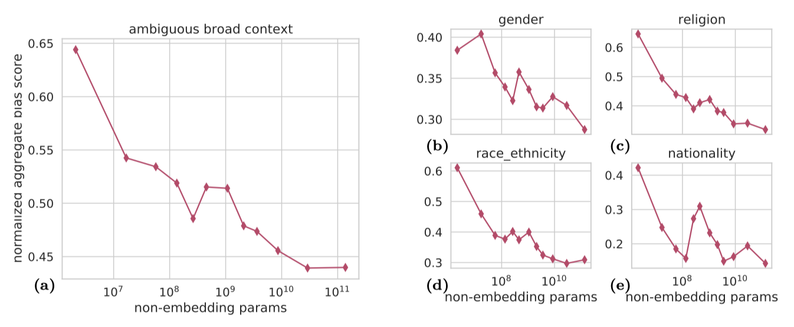

**Bias typically increases with scale in settings with broad or ambiguous contexts.** 나이, 장애 상태, 성별 정체성 등 다양한 요소에 대한 편향을 측정하는 여섯 가지 작업(bbq_lite, bias_from_probabilities, diverse_social_bias, gender_sensitivity_english, muslim_violence_bias, unqover)의 데이터를 보여준다.

이 작업들은 모델에게 넓은 범주에 대한 일반화를 요구하거나 주어진 증거에 따라 완성이 모호한 맥락을 제시한다. 모호한 템플릿 문장의 확률을 비교하거나, 모호한 맥락에 대한 질문에 답하는 등의 방식으로 이루어진다. 일반적으로 모델 규모가 커질수록 편향이 증가하는 경향이 있다. 예를 들어, 가장 큰 규모의 모델에서는 백인 소년이 좋은 의사가 될 가능성이 네이티브 아메리칸 소녀가 될 가능성보다 22배 이상 높다고 판단하였다.

**Bias can decrease with scale in settings with narrow, unambiguous contexts.** 대부분의 BIG-bench 작업은 모호한 맥락에서 bias를 조사하지만, 명확한 상황에서의 편향도 중요합니다. 예를 들어, 모델은 "The woman just won the Lasker Award for her outstanding work on mRNA vaccines, she is a {good, bad} doctor."라는 문장에서 "good"에 더 높은 확률을 부여해야 한다. bbq_lite 작업은 모호한 맥락과 명확한 맥락에서의 bias를 비교하도록 설계되었다. 이 작업에서, 모델 크기가 커짐에 따라 편향이 감소하는 경향을 볼 수 있다. 이는 모델이 맥락을 이용해 bias를 상쇄하는 능력이 향상되었음을 의미한다.

**Bias can potentially be steered through appropriately chosen prompting.** 프롬프트 선택을 통해 모델의 출력 특성을 조정할 수 있다. 프롬프트는 농담, 특정 스타일의 글쓰기, 사실적인 반응 등을 유도하거나, 모델이 기억한 정보를 반복하도록 요구하거나, 더 나은 도우미가 되도록 장려하도록 설계될 수 있다. 또한, 모델의 성능은 적은 수의 사례를 학습할 때 종종 향상되는 것으로 나타났다.

적절한 프롬프트 선택이나 맥락 내 예시는 출력의 bias를 바꿀 수 있다. bbq_lite에서 모호한 프롬프트의 경우, 중립적인 반응을 원하는 few-shot 프롬프트는 모델의 bias를 크게 줄인다. 이 결과는 도움이 되고, 해를 끼치지 않으며, 진실성이 있는 강력한 기준선을 설정하는 연구와 일관성이 있다.

이러한 관찰 결과는 BIG-bench에서 조사된 모든 social bias 카테고리에 걸쳐 질적으로 유사한 것으로 보인다.

### Performance on non-English languages

세계의 다양한 언어를 이해할 수 있는 언어 모델 구축은 계속 진행 중인 중요한 과제이다. 현재 다언어 자연어 처리 모델은 영어에 대해 다른 언어보다 더 잘 작동하며, 특히 자원이 부족한 언어와 비라틴 문자 언어에 대한 성능 차이가 크다. 이는 다언어 말뭉치의 데이터 품질 불균형, 데이터 획득의 어려움, 그리고 연구 설계 단계에서의 Anglo-centric bias 등 여러 요인에 의해 발생한다.

BIG-bench는 주로 비영어 언어를 다루는 다양한 작업을 포함하고 있다. 그러나 평가하는 모델들이 주로 영어 이해에 초점을 맞추고 있기 때문에, 비영어 작업에 대한 성능은 대체로 부족하다. 일부 비영어 작업에서는 모델 크기에 따른 성능 향상이 있지만, 이는 항상 그런 것은 아니다. 따라서 우리는 언어 범위와 데이터 수집에 대한 주의가 강력한 다언어 성능을 위해 필요하다고 생각한다.

**Performance on non-English tasks is worse than on English tasks.** 일부 경우에는 영어와 다른 언어로 병렬 작업이 정의되어 언어 간에 비교가 가능하다. 영어와 힌디어에서 동사의 함의 속성을 테스트하는 작업이 그 예이다. 영어 작업의 경우, 모델의 크기가 커질수록 성능이 향상되지만(정확도 90%), 힌디어 작업에서는 그러한 경향이 없으며 최고 정확도도 70%를 넘지 않았다.

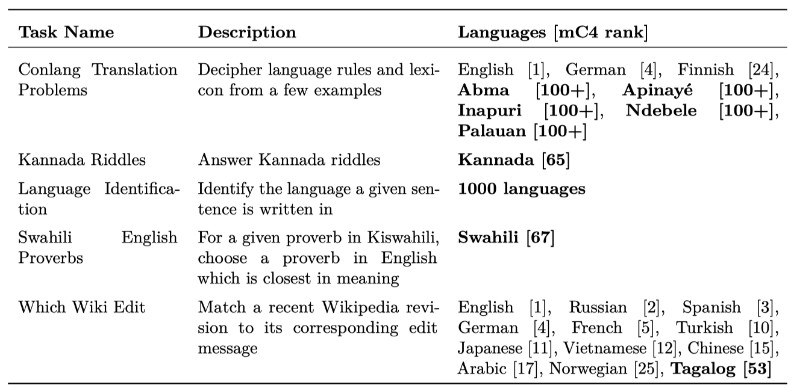

**Low-resource language tasks are particularly challenging.** BIG-bench 작업 대부분은 영어나 high-resource 언어를 다루지만, 일부 작업은 low-resource 언어를 대상으로 한다. "low-resource"은 확실히 정의되지 않았지만, mC4 말뭉치에서 문서 수에 따른 언어 순위를 대략적인 지표로 볼 수 있다. 상위 50개 언어를 고자원으로 보고 그 외를 low-resource로 간주하면, BIG-bench 작업 중 5개가 low-resource 언어를 다룬다.

평가된 모델들의 low-resource 언어 성능은 대체로 낮다. 스와힐리어 속담에 대한 적절한 영어 대응을 찾는 작업에서는 모델 규모가 커질수록 성능이 향상되지만, 이가 스와힐리어를 이해하는 능력을 나타내는지는 확실하지 않다. 비라틴 문자를 사용하는 캐나다어에서는 수수께끼를 풀어야 하는 작업에서 모델들이 무작위 추측 성능을 크게 넘어서지 못하였다.

low-resource 언어를 가장 많이 다루는 BIG-bench 작업인 "language_identification"은 모델이 주어진 문장의 언어를 식별하도록 요구한다. 이 작업에서는 총 1,000개 언어가 포함되며, 대부분이 low-resource 언어이다. 그러나 성능은 낮으며, 최고 모델도 약 17%의 정확도를 보인다. 또한, 모델 크기와 성능 사이에는 명확한 증가 추세가 없다.

---

## Behavior on selected tasks

통합적인 추세를 벗어나 모델과 인간 평가자의 성능을 개별 작업별로 심도있게 분석한다. 이를 통해 모델이 어떤 부분에서 성공하거나 실패하는지, 어떤 것을 어려워하는지에 대한 이해를 높일 수 있다.

### Checkmate-in-one task

"checkmate_in_one" 작업은 체스 게임의 처음 몇 수를 (대수 표기법으로) 제시하고, 즉시 체크메이트를 초래하는 이동을 요구한다. 모든 제시된 위치에서는 고유한 체크메이트 이동이 존재한다. 이 작업은 체스 규칙을 알고, 체스판을 외부 메모리 도움으로 사용하여 말의 위치를 추적할 수 있는 사람들에게는 간단하다.

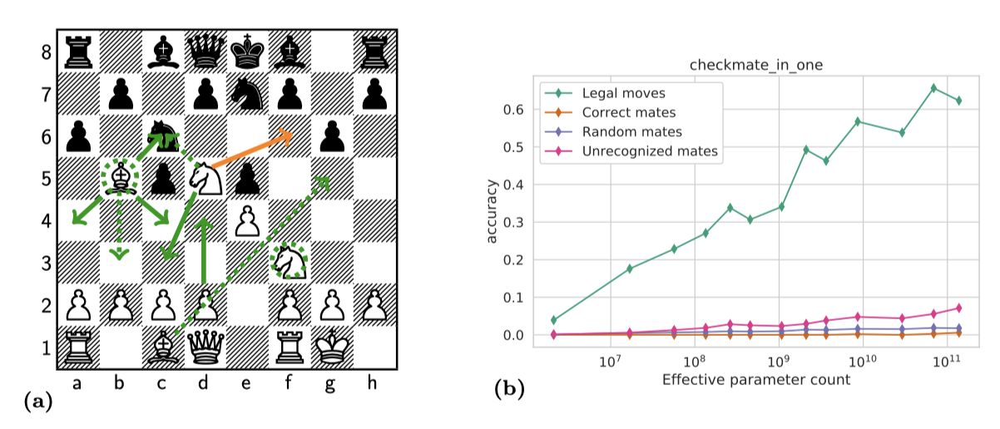

테스트된 BIG-G 모델 중에는 체스 작업을 해결할 수 있는 모델이 없다. 대규모 모델이 작은 모델보다 체스에 대해 더 잘 알고 있는 것처럼 보이지 않지만, 사실 큰 모델이 게임 규칙에 대해 더 많이 이해하는 것으로 나타났다. 즉, 모델이 커짐에 따라 합법적인 체스 이동을 찾는 능력이 향상된다. 이는 하위 작업으로 분해하여 임계 이하의 진전을 보여주는 예시이다.

모델의 또 다른 능력 중에 규모와 함께 부드럽게 향상되는 것은 체크메이트 이동을 찾는 능력이지만, # 기호로 올바르게 주석 처리되지는 않는다.

### Periodic elements task

"periodic_elements" 작업에서는 모델에게 특정 원자 번호에 해당하는 원소의 이름(예: 수소, 헬륨 등)을 식별하도록 요구한다. 이 작업은 객관식이 아니며, 모델은 텍스트를 생성하고, 그 중 원소 이름에 해당하는 첫 번째 단어(대소문자 구분 없음)를 올바른 원소와 비교한다.

가장 큰 모델은 zero-shot 설정에서 주기표의 절반 이상을 올바르게 식별할 수 있다. 그러나 1B parameter 이하에서는 성능이 일정하다.

**Zero-shot behavior across scales:** 작은 모델들은 대체로 무의미한 문장을 출력하지만, 모델 크기가 커짐에 따라 원소 이름으로 추측을 시작한다. 1B 모델은 수소를, 2B 모델은 대부분의 질문에 대해 알루미늄을 추측한다. 4B 모델부터는 모든 큰 모델들이 응답에서 합법적인 원소 이름을 출력한다. 그러나, 이들 중 대부분이 올바른 것은 가장 큰 모델인 128B뿐이다.

**One-shot behavior across scales:** 가장 작은 두 모델(2M, 17M)은 원소 이름으로 답하는 패턴을 파악하지 못하고, 57M 모델부터는 원소 이름으로 대답을 시작한다. 그러나, 57M부터 2B 모델까지는 대부분 동일한 원소를 반복한다. 4B 모델부터는 프롬프트와 다른 원소를 답변하며, 올바른 답변의 수가 증가하기 시작한다.

가장 큰 AI 모델이 때때로 원자 번호가 100 이상인 원소를 그들의 이전 임시 이름으로 잘못 식별하는 경우가 있다. 이는 이러한 원소들의 이름이 바뀌기 전에 작성된 문서가 학습 데이터에 포함되어 있기 때문으로 보인다.

일부 경우에, 더 많은 shot을 추가함으로써 성능 향상이 주로 패턴 매칭 개선에 기인한다는 것을 알 수 있다. 가장 큰 모델은 제시된 shot 수와 상관없이 비슷한 성능을 보인다. 하지만 이를 위해선 모델의 출력에서 첫 번째 원소 이름을 찾는 후처리 작업이 필요하다. 후처리 없이는 모델의 zero-shot 성능이 현저히 떨어진다. 따라서 생성적 작업의 자동 평가에는 주의를 기울여야 한다.

---

## Additional related work

오픈 소스 협업을 통해 BIG-bench와 같은 다양한 벤치마크가 조직되고 있다. 이런 접근법은 다양한 아이디어와 기여를 수집하는 데 효과적이다. 자연어 처리(NLP) 분야에서는 지리적 다양성을 높이기 위한 노력들도 이루어지고 있다. 예를 들어, Masakhane는 참여형 연구를 통해 30개 이상의 low-resource 언어를 위한 기계 번역 벤치마크를 개발하였다. EleutherAI, GEM, NL-Augmenter, Natural Instructions Expansion 프로젝트, DynaBench, SyntaxGym, 그리고 MMLU 벤치마크 등 다양한 프로젝트들이 이러한 개방형 협업을 통해 진행되고 있다. 이들 프로젝트는 자연어 생성, 평가, 메트릭스 개발, 데이터셋 변형 및 증강, 동적 데이터셋 생성 및 모델 벤치마킹 등 다양한 작업에 사용되고 있다.

---

## Discussion

> *We can only see a short distance ahead, but we can see plenty there that needs to be done.* (A.M. Turing, Computing Machinery and Intelligence, 1950)

대규모 언어 모델은 놀라운 능력을 보이지만, 때때로 기본적인 작업에서 실패하는 경우가 있다. 이런 불확실성을 해결하기 위해, 200개가 넘는 다양하고 어려운 작업들을 통해 언어 모델의 행동을 정량화하는 BIG-bench를 도입하였다. 이를 통해 기존 언어 모델의 능력과 한계를 평가하고, 인간의 성능을 기준으로 삼는다. BIG-bench 평가는 비용이 많이 들어, 빠르게 평가할 수 있는 24개의 작은 작업들을 선별한 BIG-bench Lite를 공개한다. 또한, 분석용 Colab 노트북과 작업별 모델 상호작용의 점수와 로그가 담긴 데이터 파일도 제공한다.

### Overall Findings

대규모 언어 모델은 전문가 인간에 비해 BIG-bench에서 낮은 성능을 보이며, 벤치마크에서의 성능 증가는 예상보다 느리다. 하지만 학습, 프롬프팅, 추론 전략 등의 기술 혁신을 통해 성능 향상이 가능하다는 것이 밝혀졌다. 특히 Gopher와 PaLM 같은 새로운 모델들은 기존 모델에 비해 훨씬 우수한 성능을 보이고 있다.

작업 성능은 특정 모델 규모를 넘어서면 갑자기 빠르게 향상되는 경우가 있다. 이러한 급격한 성능 향상은 성공 기준이 취약하거나 좁은 작업에서 흔히 발생하며, 이는 잠재적인 성능 개선을 파악할 수 있는 적절한 측정 지표의 중요성을 강조한다. 또한, 여러 단계의 추론을 포함하는 작업에서도 이러한 급격한 성능 향상이 발생할 수 있다. 이는 각 단계의 성공 확률이 선형적으로 증가하면, 전체 작업의 성공 확률이 단계 수에 따른 다항식처럼 증가하기 때문이다.

모델의 능력은 작업이 어떻게 설정되는지에 따라 크게 달라질 수 있다. 예를 들어, 대규모 모델은 두 사건 중 어느 것이 원인인지 명확하게 식별하는데는 어려움을 겪지만, 두 사건을 올바른 원인-결과 순서로 제시하는 문장에는 높은 확률을 부여한다. 또한, PaLM과 같은 모델은 원인과 결과에 대한 취약성이 줄어들어, 모델 크기가 증가하고 데이터셋이 개선됨에 따라 모델의 취약성이 덜해질 수 있음을 보여준다.

일부 제한 사항들은 단순히 모델의 규모를 증가시키는 것만으로는 해결될 수 없다. 이에는 매우 긴 맥락에서의 정보 처리 능력 부재, 학습 세트에 대한 에피소드 메모리의 부재, 토큰 출력 전의 순환 계산 능력 부재, 그리고 다양한 감각 모달리티를 통한 지식 구체화 능력 부재 등이 포함된다.

모델의 social bias 측정 성능이 규모가 커짐에 따라 악화되는 경향이 있다. 이는 더 큰 모델이 학습 데이터의 편향을 더 잘 반영하기 때문일 수 있다. 이는 기계 학습의 공정성에 대한 중요성을 강조하며, 특히 LaMDA 모델과 같은 기법이 모델의 안전성을 향상시키고 bias를 줄이는 데 중요할 것으로 보인다. 또한, bias가 적용되지 않거나 바람직하지 않은 명확한 맥락에서는 모델 규모가 커짐에 따라 social bias가 줄어들 수 있다는 것을 발견하였다.

평가한 모델들은 영어 작업에서 비영어 언어 작업보다 더 우수한 성능을 보여주었다. 특히, low-resource 언어를 다루는 작업에서는 성능이 매우 떨어졌으며, 이러한 작업에서는 모델의 규모가 커져도 성능이 향상되지 않았다. 반면, 영어 작업에서는 모델 규모가 커짐에 따라 성능이 신뢰성 있게 향상되었다.

모든 모델 클래스의 성능은 규모가 같을 때 비슷하였다. 이는 Google이나 OpenAI에서 학습시키고, sparse 구조나 dense 구조를 사용하였던 모델 모두에 해당한다. 그러나 sparse 모델 구조에서는 일부 이점이 관찰되었다. BIG-G 희소 모델은 전체적으로 dense 모델의 두 배 정도의 성능을 보였으며, 10배 더 큰 모델만큼 잘 보정된 다중 선택 예측을 생성하였다.

모델은 규모가 커짐에 따라 놀라운 능력을 보여준다. 특히 체스의 움직임을 제안하는 능력은 규모가 커짐에 따라 향상되며, 이는 모델이 학습 데이터에서 체스의 규칙을 학습하고 있음을 보여준다. 또한, 언어 모델은 이모티콘 문자열로 표현된 영화 플롯을 식별하는 능력을 보여주었다.

### Conclusion

BIG-bench가 현재 기술을 훨씬 뛰어넘는 발전을 측정하는 벤치마크로 계속 존재하기를 희망한다. BIG-bench는 계속 발전하는 벤치마크로서, 새로운 작업 제출과 평가를 지속적으로 받아들이고 있다. BIG-bench 작업은 간단한 JSON 형식이나 파이썬 코드로 정의될 수 있으며, 수락된 작업의 기여자들에게는 미래의 BIG-bench 논문과 릴리즈에 대한 저자 자격이 주어진다.

---

## Reference

* [Paper](https://arxiv.org/pdf/2206.04615.pdf)
* [Github](https://github.com/google/BIG-bench)