+++
author = "Kurt"
title = "BLOOM"
date = "2024-02-28"
description = "A 176B-Parameter Open-Access Multilingual Language Model"
categories = [
    "Paper Review"
]
tags = [
    "LLM",
    "Milestone",
]
+++

## Abstract

거대 언어 모델(LLM)은 새로운 작업을 수행할 수 있는 능력을 보여주었다. 그러나 대부분은 자원이 풍부한 조직에 의해 개발되고 비공개 상태였다. 이를 민주화하기 위해, 176B-parameter의 공개 접근 언어 모델 BLOOM을 소개한다. 이는 다양한 언어를 포함하는 ROOTS 말뭉치에서 학습되었으며, 다양한 벤치마크에서 경쟁력 있는 성능을 보였다. 이 모델과 코드를 공개함으로써 LLM을 사용한 미래의 연구와 응용을 촉진한다.

---

## Introduction

사전 학습된 언어 모델은 적은 양의 라벨 데이터로도 높은 성능을 내는 특성 때문에 현대 자연어 처리(NLP)의 핵심 요소가 되었다. 이런 모델들은 추가적인 학습 없이도 유용한 작업을 수행할 수 있다. 하지만, 이러한 모델의 학습 비용과 환경적 부담은 커서 대부분의 연구 커뮤니티가 이들의 개발에서 배제되었고, 대부분의 언어 모델은 주로 영어 텍스트에 대해 학습되었다.

수백 명의 연구자들이 협력하여 개발하고 공개한 BigScience Large Open-science Open-access Multilingual Language Model (BLOOM)을 제시한다. 이 모델은 46개의 자연 언어와 13개의 프로그래밍 언어에 대해 학습되었다. BLOOM을 구축하기 위해, 학습 데이터셋, 모델 아키텍처와 학습 목표, 그리고 분산 학습을 위한 엔지니어링 전략에 대한 철저한 설계 과정을 거쳤다. 이 논문의 목적은 BLOOM의 설계 단계에 대한 고수준 개요를 제공하는 것이다.

---

## Background

BLOOM 모델 자체를 설명하기 전에, 이 섹션에서는 LLMs에 대한 필요한 배경 지식과 BigScience 노력의 조직적 개요를 제공한다.

### Language Modeling

언어 모델링은 텍스트 내 토큰(단어, 서브워드, 문자 등의 텍스트 단위)의 연속적인 확률을 예측하는 작업이다. 이 연구는 텍스트 내 토큰의 결합 확률을 모델링하는 방법을 다룬다.

$$ p(x) = p(x_1, ..., x_T) = \Pi_{t=1}^T p(x_t|x_{<t}) $$

$x$는 토큰의 시퀀스, $x_t$는 $t$번째 토큰, $x_{<t}$는 $x_t$ 이전의 토큰 시퀀스를 의미한다. 이렇게 다음 토큰의 확률을 반복적으로 예측하는 방식을 autoregressive 언어 모델링이라고 한다.

**Early Language Models** 언어 모델은 NLP의 중요한 부분으로, 초기 모델들은 학습 데이터에서 토큰 시퀀스의 출현 빈도를 기반으로 확률을 추정하는 n-gram 모델이었다. 하지만 이 모델은 토큰 시퀀스 길이 증가에 따른 크기 증가와 학습 데이터에 없는 토큰 시퀀스에 대한 확률 예측의 어려움이 있었다. 이 문제들을 해결한 n-gram 모델은 NLP의 대부분 영역에서 널리 사용되었다.

**Neural Language Models** n-gram 모델의 대안으로, 이전 토큰을 바탕으로 다음 토큰의 확률을 추정하기 위해 신경망을 사용하는 방법이 제안되었다. 초기에는 feed-forward network를 사용했지만, 이후 순환 신경망의 사용이 성능 향상에 도움이 되었다. 최근에는 Transformer 아키텍처를 기반으로 한 언어 모델이 순환 신경망보다 더 효과적임이 입증되어, 언어 모델링에 Transformer가 주로 사용되게 되었다.

**Transfer Learning** 신경망을 이용한 언어 모델링 발전과 함께, NLP 파이프라인은 전이 학습을 점차 채택하고 있다. 전이 학습에서는 먼저 풍부한 데이터 작업에서 모델을 사전 학습하고, 이후 downstream 작업에 적용한다. 초기에는 단어 벡터를 이용했지만, 최근의 연구에서는 모델 전체를 사전 학습하는 접근법이 더 효과적임을 보여주었다. 특히 사전 학습된 Transformer 언어 모델의 강력한 성능이 입증되었고, 이에 따라 더 발전된 모델에 대한 연구가 진행되고 있다.

**Few- and Zero-Shot Learning** 사전 학습된 모델을 미세 조정하는 것이 효과적이지만, 사전 학습된 언어 모델이 후속 학습 없이도 작업을 수행할 수 있다는 연구도 있다. 특히, 웹에서 스크랩된 텍스트로 학습된 Transformer 기반 언어 모델이 다양한 작업을 수행할 수 있음이 보여졌고, 모델의 규모가 클수록 성능이 향상된다는 결과가 나왔다. 이 결과로 인해, 작업의 자연어 설명을 제공하고 입력-출력 동작의 예시를 입력하는 "프롬프트" 설계 아이디어가 대중화되었다.

**Social Limitations of LLM Development** 대규모 언어 모델의 크기 증가는 다양한 작업의 성능 향상을 가져왔지만, 동시에 그 개발과 사용에 관한 문제도 커졌다. 이러한 모델의 계산 비용은 대다수 연구자들이 개발과 평가, 그리고 일상적인 사용에 참여하는 것을 어렵게 한다. 또한, 이는 탄소 발자국 증가와 기후 변화 문제를 악화시키며, 이로 인해 이미 소외된 공동체가 크게 피해를 입는다. 기술 자원이 소수의 기관에 집중되는 현상은 기술의 포괄적이고 협력적인 거버넌스를 방해하며, 이는 공공 서사와 연구/정책 우선순위의 불일치, 그리고 개발자 중심의 가치 설정 등의 문제를 야기한다. 이런 문제에도 불구하고, 기업 외에서 대규모 언어 모델을 개발하고 있는 기관은 소수에 불과하다.

### BigScience

**Participants** BLOOM의 개발은 대규모 언어 모델의 공개를 목표로 하는 BigScience라는 연구 협력체에 의해 이루어졌다. 이 프로젝트는 Hugging Face와 프랑스 NLP 커뮤니티의 협력을 통해 시작되었고, 다양한 언어, 지역, 과학 분야를 지원하기 위해 국제적인 협력으로 확장되었다. BigScience에는 1200명 이상이 참여하였으며, 이들은 여러 학문 분야에서 배경을 가진 사람들로 이루어져 있었다. 가장 많은 참여자들이 미국에서 왔지만, 총 38개 국가가 대표되었다.

**Organization** BigScience 프로젝트는 작업 그룹의 형태로 구성되어, 각 그룹은 전체 프로젝트의 특정 부분에 대해 자체적으로 조직하였다. 참여자들은 여러 그룹에 가입하여 경험과 정보를 공유하도록 격려받았고, 이로 인해 총 30개의 작업 그룹이 형성되었다. 대부분의 그룹은 BLOOM의 개발에 직접 연결된 작업에 초점을 맞추었으며, 몇몇 그룹은 생물의학 텍스트와 역사적 텍스트 같은 특정 도메인에서의 데이터셋 개발과 LLMs의 평가에 초점을 맞추었다. 이 프로젝트의 동기와 역사, 그리고 얻어진 교훈에 대한 더 많은 정보는 Akiki et al. (2022)의 연구에서 확인할 수 있다.

**Ethical Considerations within BigScience** BigScience 워크숍은 협력적으로 설계된 윤리 헌장과 미국 외의 국가에서 적용 가능한 규정에 대한 연구를 통해, LLM 개발의 사회적 한계를 인식하고 대응하였다. 이 헌장은 포괄성, 다양성, 개방성, 재현성, 그리고 책임성을 강조하고 있다. 이 가치들은 프로젝트 전반에 걸친 데이터셋 구성, 모델링, 엔지니어링, 평가, 그리고 그 외 사회적 영향 등에서 다양한 방식으로 드러났다.

---

## BLOOM

### Training Dataset

BLOOM은 46개의 자연 언어와 13개의 프로그래밍 언어를 포함하는 1.61테라바이트의 텍스트로 구성된 ROOTS 코퍼스에서 학습되었다. 이 코퍼스는 498개의 Hugging Face 데이터셋을 통합한 것이다. 또한, 이 과정은 여러 조직적, 기술적 도구의 개발과 배포를 수반하였다. 이러한 노력은 코퍼스를 컴파일하는 단계를 간략히 요약하여 제시된다.

**Motivation** 기술의 개발자와 사용자 간의 불일치는 데이터셋 구성, 특히 대규모 머신러닝 프로젝트에서 두드러진다. 이러한 맥락에서 "데이터 작업"은 과소평가되며, LLMs에 대한 접근법은 가능한 한 적은 비용으로 고품질 데이터를 얻는 것에 초점을 맞춘다. 이는 데이터 주체의 필요성과 권리보다 우선시되며, 품질은 주로 downstream 작업의 성능 최적화와 개발자가 불쾌하다고 생각하는 콘텐츠 제거를 포함한다.

데이터셋 구성에서 인간의 노력을 최소화하려는 접근법은 대량의 데이터를 생성하지만, 원본 자료와 필터링 방법의 편향이 겹쳐져 소수 집단에게 부정적인 결과를 초래할 수 있다. 이러한 접근법은 음란한 텍스트를 제거하려는 노력으로 LGBTQ+ 및 아프리카계 미국인 영어 텍스트가 억제되거나, 미국 중심의 견해를 암묵적으로 우선시하는 모델을 학습시키는 등의 문제를 야기한다. 또한, 이런 접근법은 데이터의 출처와 저작권을 잃어버리게 하여, 코퍼스를 후속적으로 문서화하고 관리하기 어렵게 만든다.

BigScience 워크숍의 맥락과 윤리 헌장에 따라, 데이터 구성과 문서화에서 인간의 참여와 현지 및 언어 전문지식을 중요시하였다.

#### Data Governance

대규모 텍스트 코퍼스는 사람들에 대한 텍스트와 사람들이 만든 텍스트를 포함하며, 이들은 데이터 주체이다. 머신러닝 개발자들이 이 데이터를 수집하고 대규모 데이터셋으로 정리함에 따라, 개발자들, 데이터 주체들, 그리고 데이터 권리 보유자들의 이해를 고려하는 새로운 방식의 필요성이 증가하고 있다.

BigScience 프로젝트는 기술, 법률, 사회학 전문지식을 활용하여 데이터 주체의 존중을 중심으로 한 데이터 관리 구조 설계와 프로젝트에 직접 사용되는 데이터 처리 방안을 주요 목표로 하였다. 이를 위해 데이터 보호자, 권리 보유자 등의 네트워크 구조를 개발하고, 데이터와 알고리즘 주체의 개인정보, 지적재산, 사용자 권리를 고려하는 상호작용을 설계하였다. 특히, 이는 데이터 공급자와 호스트 사이의 구조화된 합의에 의존하였다.

BigScience 프로젝트는 특정 공급자로부터의 데이터 사용 허락을 얻고, 데이터 추적성을 유지하며, 다양한 데이터 소스에 대한 복합적인 릴리즈 접근법을 채택하는 등의 방법을 통해 데이터 관리에 대한 교훈을 통합하였다. Hugging Face Hub 조직에서는 ROOTS 코퍼스를 시각화하고 접근하며, 라이선스, 개인정보 보호, 원래 보호자와의 합의를 고려하여 일부 구성 요소에 대한 접근을 제공한다. 또한, BLOOM 모델에 대한 미래의 연구가 전체 코퍼스에 대한 완전한 접근을 필요로 할 것을 고려하여, 관련 연구를 계획하는 연구자들이 데이터 분석 작업에 참여하도록 초대하고 있다.

#### Data Sources

데이터 거버넌스 전략을 설정한 후 훈련 코퍼스의 구성을 결정하였다. 이 과정에서는 세계적으로 가능한 많은 사람들이 언어 모델에 접근하면서, 동시에 충분한 언어 전문성을 가진 데이터셋만을 포함하는 등의 목표를 가지고 있었다. 이러한 과정은 문서화 표준의 개선과 데이터 및 알고리즘 주체의 권리 존중을 목표로 하면서도, 때로는 내재적인 긴장감을 안고 진행되었다.

**Language Choices** 

코퍼스에 포함될 언어를 결정하는 과정은 다양한 고려사항에 따라 점진적으로 진행되었다. 초기에는 말하기 능력이 뛰어난 사용자가 많은 여덟 가지 언어를 중점으로 하였고, 언어 커뮤니티의 추천에 따라 스와힐리어를 니제르-콩고어 계열로, 힌디어와 우르두어를 인도어 계열로 확장하였다. 마지막으로, 추가 언어에 능통한 참가자 그룹이 해당 언어의 소스 선택과 처리를 담당하면서 특정 언어 전문 지식 없이 선택된 코퍼스의 문제를 해결하겠다는 약속을 하면, 해당 언어를 지원 목록에 추가하는 방법을 제안하였다.

**Source Selection** 워크샵 참가자들과 연구 집단들이 "BigScience Catalogue"를 통해 다양한 언어의 소스를 컴파일하여 코퍼스를 정리하였다. 이 과정은 여러 커뮤니티가 공동으로 주최한 해커톤의 일환으로 진행되었고, 특정 언어 리소스를 컴파일하는 등 바텀업 방식으로 총 252개의 소스를 식별하였다. 또한, 스페인어, 중국어, 프랑스어, 영어 등의 소스 범위를 확장하기 위해 지역적으로 관련 있는 웹사이트를 코퍼스에 추가하였다.

**GitHub Code** 카탈로그는 Google의 BigQuery에서 수집한 GitHub의 프로그래밍 언어 데이터셋으로 보완하였고, 중복된 항목을 제거하였다. 포함된 언어의 선택은 AlphaCode 모델 학습을 위해 Li et al. (2022)이 도입한 설계 방식을 따랐다.

**OSCAR** 표준 연구 관행을 따라 웹을 사전 학습 데이터의 소스로 사용하고, BLOOM의 크기에 따른 데이터 볼륨 요구를 충족하기 위해 OSCAR 버전 21.09에서 추가 데이터를 구하였다. 이는 2021년 2월의 Common Crawl 스냅샷에 해당하며, 코퍼스의 38%를 차지하게 되었다.

#### Data Preprocessing

소스 식별 후, 데이터 큐레이션을 위해 여러 단계의 데이터 처리가 이루어졌다.

**Obtaining the Source Data** 첫 번째 단계는 다양한 텍스트 데이터 소스를 수집하는 것이다. 이는 여러 NLP 데이터셋에서 텍스트를 추출하고, 아카이브에서 PDF 파일을 스크랩하며, 192개의 카탈로그 웹사이트와 456개의 다양한 지역 웹사이트에서 텍스트를 추출하여 전처리하는 과정을 포함한다. 이 과정에서는 Common Crawl WARC 파일에서 HTML로부터 텍스트를 추출하기 위한 새로운 도구를 개발해야 했고, 이 도구는 주 데이터 준비 저장소에서 사용할 수 있게 하였다. 이를 통해 총 539개 웹사이트에서 사용 가능한 모든 텍스트 데이터를 찾아내고 추출할 수 있었다.

**“Quality” filtering: Text Produced by Humans for Humans** 텍스트를 수집한 후, 대부분의 자료가 전처리 오류, SEO 페이지, 스팸 등 자연어가 아닌 텍스트를 일부 포함하고 있음을 발견하였다. 이를 필터링하기 위해, "사람들이 사람들을 위해 작성한" 텍스트를 고품질 텍스트로 정의하는 품질 지표를 설정하였다. 이 지표들은 각 언어의 유창한 사용자들에 의해 개별적으로 선택되었고, 수동으로 각 소스를 검토하여 자연어가 아닌 텍스트를 가장 잘 식별하는 지표를 찾아냈다. 이 두 과정은 모두 그들의 영향을 시각화하는 도구로 지원되었다.

**Deduplication and Privacy Redaction** 마지막으로, 두 단계의 중복 제거 과정을 통해 유사한 문서를 제거하고, 코퍼스의 OSCAR 버전에서 식별한 개인 식별 정보(예: 사회 보장 번호)를 삭제하였다. 이는 프라이버시 위험이 높은 원천으로 판단되어, 거짓 긍정이 있는 경우에도 정규 표현식을 이용해 정보를 삭제하였다.

#### Prompted Datasets

multitask 프롬프트 미세 조정은 사전 학습된 언어 모델을 다양한 작업의 집합에 세부 조정하는 방법이다. T0는 이 방식을 통해 훈련된 언어 모델이 강력한 zero-shot 작업 일반화 능력을 가지고 있음을 보여주었다. 또한, T0는 이러한 미세 조정을 거치지 않은 큰 언어 모델을 능가하였다. 이 결과에 기반하여, 기존 자연어 데이터셋을 활용한 multitask 프롬프트 미세 조정을 탐색하였다.

T0는 다양한 오픈소스 영어 자연어 데이터셋을 위한 프롬프트 모음인 Public Pool of Prompts (P3)의 일부분에 대해 학습되었다. 이 프롬프트 모음은 BigScience 협력자들이 참여한 해커톤에서 생성되었고, 참가자들은 170개 이상의 데이터셋에 대해 2000개 이상의 프롬프트를 작성하였다. P3 데이터셋은 다양한 자연어 작업을 포함하며, 유해한 콘텐츠나 비자연어는 제외하였다. 그리고 이 프롬프트들의 생성, 공유, 사용을 쉽게 하기 위해 PromptSource라는 오픈소스 툴킷이 사용되었다.

BLOOM을 사전 학습한 후, BLOOM에 다양한 언어의 zero-shot 작업 일반화 능력을 부여하기 위해 대규모 multitask 미세 조정을 적용하였다. 이를 통해 BLOOMZ 모델이 생성되었다. BLOOMZ를 학습시키기 위해, 영어 외의 다른 언어와 새로운 작업을 포함하는 새로운 데이터셋으로 P3를 확장하여 xP3를 생성하였다. xP3는 83개의 데이터셋, 46개의 언어, 16개의 작업을 포함하고 있다. 이 프롬프트들은 PromptSource를 사용하여 수집되었고, 다중 언어 프롬프트의 중요성을 연구하기 위해 영어 프롬프트를 다른 언어로 번역하여 xP3mt를 생성하였다.

### Model Architecture

BLOOM 모델의 설계 방법론과 구조에 대해 설명한다. 더 깊은 연구와 실험은 Le Scao et al. (2022)과 Wang et al. (2022a)에서 확인할 수 있다. 먼저 설계 방법론을 검토하고, 원인-효과 관계를 가지는 decoder-only 모델을 학습하는 이유를 설명하며, 마지막으로 모델 구조가 표준에서 어떻게 벗어나는지를 설명한다.

#### Design Methodology

가능한 아키텍처의 설계 공간은 방대하여 모두 탐색하는 것은 불가능하다. 기존 큰 언어 모델의 구조를 그대로 복제하는 방법도 있지만, 기존 아키텍처를 개선한 노력들은 상대적으로 적게 적용되었다. 따라서 확장성이 좋고, 공개 도구와 코드베이스에서 지원이 가능한 모델 패밀리에 초점을 맞추었다. 그리고 최종 컴퓨팅 예산을 최대한 활용하기 위해 모델의 구성 요소와 hyperparameter를 조정하였다.

**Experimental Design for Ablations** LLM의 주요 장점은 "zero/few-sshot" 방식으로 작업을 수행하는 능력이다. 따라서, zero-shot 일반화에 중점을 두고 아키텍처를 결정했다. 이를 위해 EleutherAI 언어 모델 평가 하네스에서 29개 작업, 그리고 T0의 평가 세트에서 9개 작업의 zero-shot 성능을 측정하였다. 이 작업들은 GPT-3의 평가 작업 중 17개와 공유하고 있다.

작은 모델을 사용해 ablation 실험을 수행했습니다. 사전 학습 목표의 제거에는 6.7B parameter 규모를, 그 외 포지션 임베딩, 활성화, 레이어 정규화 등에는 1.3B 규모를 사용하였다. 하지만 최근 연구에 따르면, 6.7B보다 큰 모델에서는 "outliers features"이 관찰되는 단계 전환이 발생하므로, 1.3B 규모에서 얻은 결과가 최종 모델 크기로 외삽될 것인지는 불확실하다.

**Out-of-scope Architectures** 대규모 학습에 적합한 GPU 기반 코드베이스 부재로 mixture-of-experts(MoE)과 상태 공간 모델을 고려하지 않았다. 하지만 이 두 접근법은 현재 대규모의 MoE와 작은 규모의 상태 공간 모델에서 경쟁력 있는 결과를 보여주며 유망함을 보여주었다.

#### Architecture and Pretraining Objective

대부분의 현대 언어 모델은 Transformer 기반이지만, 구현 방식은 다양하다. 원래의 Transformer는 encoder-decoder 구조를 사용했지만, 많은 모델들이 encoder-only(BERT) 또는 decoder-only(GPT) 방식을 선택하였다. 하지만, 현재 100B 이상의 parameter를 가진 state-of-the-art 언어 모델들은 모두 원인-효과 decoder-only 모델이다. 이는 encoder-decoder 모델이 전이 학습에서 decoder-only 모델을 능가하는 이전의 연구 결과와는 반대이다.

이전에는 다양한 아키텍처와 사전 학습 목표의 zero-shot 일반화 능력에 대한 체계적인 평가가 부족했다. 이 연구에서는 encoder-decoder와 decoder-only 아키텍처, 그리고 여러 사전 학습 목표를 평가했다. 결과적으로, 사전 학습 직후에 원인 decoder와-only 모델이 가장 잘 수행됨이 확인되었으며, 이는 최첨단 언어 모델의 선택을 검증한다. 또한, 이 모델들은 비원인 아키텍처와 목표로 더 효율적으로 적응될 수 있음이 확인되었다.

#### Modeling Details

아키텍처와 사전 학습 목표 선택 외에도, 원래의 Transformer 아키텍처에 대한 다양한 변경 사항들이 제안되었다. 이에 대해 causal decoder-only 모델에서 각 수정의 이점을 평가하기 위한 실험을 수행하였다. 그 결과, BLOOM에서는 두 가지 아키텍처 변형을 채택하게 되었다.

**ALiBi Positional Embeddings** 임베딩 레이어에 위치 정보를 추가하는 대신, ALiBi는 키와 쿼리의 거리에 따라 attention 점수를 직접 줄인다. ALiBi는 더 긴 시퀀스로의 외삽 능력 때문에 처음에 도입되었지만, 실제로는 원래 시퀀스 길이에서도 학습이 더 부드럽고 downstream 성능이 더 좋아짐을 확인했다. 이는 학습된 임베딩과 회전 임베딩을 능가하는 결과였다.

**Embedding LayerNorm** 104B 개의 parameter 모델을 학습하는 초기 실험에서, 임베딩 레이어 바로 다음에 추가 레이어 정규화를 적용해 보았고, 이로 인해 학습 안정성이 크게 향상되었다. 이 방법은 zero-shot 일반화에 약간의 제약을 가하지만, 학습 불안정성을 방지하기 위해 BLOOM에서는 첫 번째 임베딩 레이어 이후에 추가 레이어 정규화를 사용하였다. 초기 실험은 float16에서 이루어졌고, 최종 학습은 bfloat16에서 이루어졌다. 이후 연구에서는 float16이 LLMs 학습에서 많은 불안정성을 일으키는 주요 원인이라고 지적되었다. 이에 따라, bfloat16 사용이 임베딩 LayerNorm의 필요성을 줄일 수도 있다.

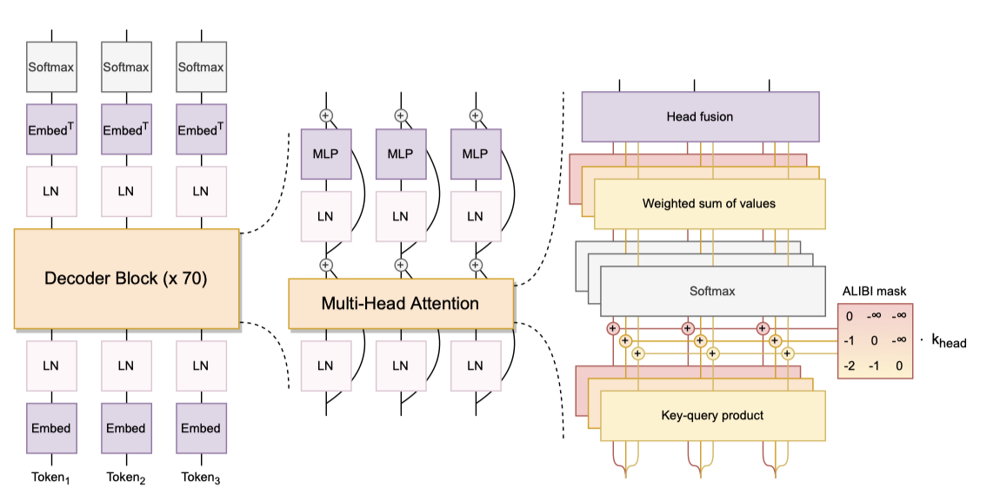

## Tokenization

토크나이저 학습에 있어 디자인 결정은 대체로 기본 설정을 선호하며, 이는 학습 비용 때문에 특정 선택의 영향을 평가하기 어렵기 때문이다. 그러나, 다양한 학습 데이터를 가진 BLOOM은 문장을 손실 없이 인코딩하기 위해 토크나이저의 신중한 디자인 선택이 필요하다.

**Validation** 토크나이저의 생산성을 기준으로 정상성을 점검하였다. 이는 토크나이저가 생성하는 부분 단어의 수를 의미한다. 단일 언어 토크나이저에 비해 생산성이 높으면 모델의 다양한 언어 성능이 저하될 수 있다. 따라서 목표는 다양한 언어 토크나이저를 사용할 때 각 언어의 생산성을 10% 이상 저하시키지 않는 것이었다. 이를 위해 Hugging Face Tokenizers 라이브러리를 사용하여 토크나이저를 설계하고 학습시켰다.

**Tokenizer Training Data** 초기에는 중복되지 않은 ROOTS 데이터를 사용했으나, 토크나이저의 어휘 연구에서 학습 데이터에 문제가 있음을 발견하였다. 이는 중복 문서로 인해 전체 URL이 토큰으로 저장되는 등의 문제였다. 이 문제를 해결하기 위해 토크나이저 학습 데이터에서 중복 라인을 제거하고, 학습 데이터와 동일한 언어별 샘플링 비율을 적용하였다.

**Vocabulary Size** 저자원 언어에서 문장을 과도하게 세분화하는 위험을 줄이기 위해 큰 어휘 크기를 선택하였다. 150k와 250k 어휘 크기의 검증 실험을 통해, 단일 언어 토크나이저에 비해 생산성 목표를 달성하는 250k 토큰의 어휘를 확정했다. GPU 효율성과 텐서 병렬성을 고려해 어휘 크기는 128과 4로 나누어 떨어지도록 했고, 개인 정보 제거 등 미래 응용을 위해 200개 토큰을 예약하고 총 250,680개의 어휘 항목을 사용하였다.

**Byte-level BPE** 토크나이저는 정보를 잃지 않기 위해 가장 작은 단위인 바이트에서 병합을 생성하는 Byte Pair Encoding 알고리즘을 사용한다. 이로 인해 모든 256 바이트가 토크나이저의 어휘에 포함되어 알 수 없는 토큰이 발생하지 않는다. 또한 이 방식은 언어 간 어휘 공유를 최대화하게 된다.

**Normalization** 가장 일반적인 모델을 유지하기 위해 BPE 토크나이징 알고리즘에서 텍스트 정규화를 수행하지 않았다. 유니코드 정규화를 추가해도 모든 언어의 생산성을 0.8% 이상 줄이지 않았지만, 모델을 덜 일반적으로 만든다는 단점이 있었다. 예를 들어, '2 2'와 '22'가 같은 방식으로 인코딩되었다.

**Pre-tokenizer** 사전 토크나이징은 텍스트를 첫 번째로 분할하고, BPE 알고리즘에 의해 생성된 토큰의 시퀀스 길이를 제한하는 것을 목표로 한다. 사용한 정규 표현식은 모든 문자를 보존하며, 프로그래밍 언어에 중요한 공백과 줄바꿈을 유지하도록 단어를 분리한다. 이는 영어 중심의 분할을 사용하지 않고, 숫자와 자릿수에 대한 분할도 사용하지 않음으로써, 아랍어와 코드에서 발생하는 문제를 피하고자 했다.

### Engineering

#### Hardware

이 모델은 프랑스의 슈퍼컴퓨터인 Jean Zay에서 3.5개월 동안 학습되었으며, 이 과정에서 1,082,990 시간의 컴퓨팅 시간을 사용하였다. 학습은 총 384개의 GPU를 갖춘 48개 노드에서 진행되었고, 하드웨어 장애 대비를 위해 4개의 예비 노드를 유지하였다. 노드는 AMD EPYC CPU와 512GB의 RAM을 갖추고 있었으며, 저장소는 병렬 파일 시스템을 사용한 플래시와 하드 디스크의 조합으로 처리되었다. 노드 내 통신은 NVLink GPU-toGPU 연결을, 노드 간 통신은 Omni-Path 링크를 통해 이루어졌다.

#### Framework

BLOOM은 대규모 분산 학습 프레임워크인 Megatron-DeepSpeed를 사용하여 학습되었다. 이 프레임워크는 Transformer 구현, 텐서 병렬성, 데이터 로딩 등을 제공하는 Megatron-LM과 ZeRO optimizer, 모델 파이프라이닝, 일반 분산 학습 컴포넌트를 제공하는 DeepSpeed로 구성되어 있다. 이를 통해 3D 병렬성을 활용한 효율적인 학습이 가능하며, 이는 세 가지 보완적인 분산 학습 접근법의 결합이다.

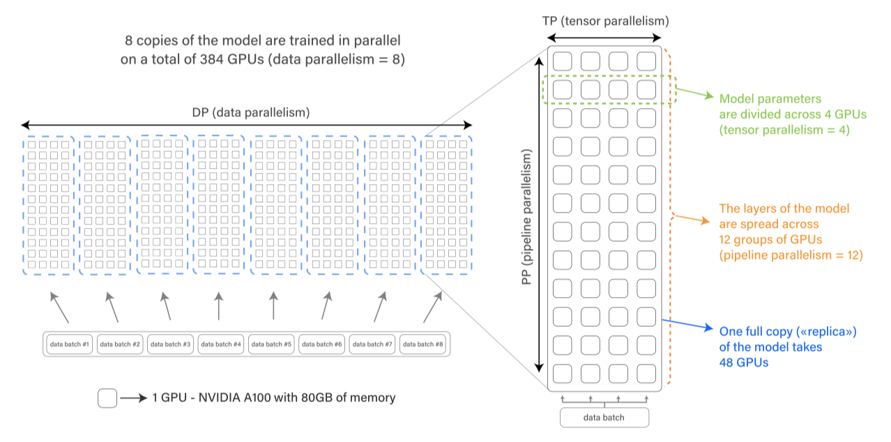

**Data parallelism (DP)** 모델을 여러 번 복제하고, 각 복제본을 다른 장치에 배치하고 데이터의 일부를 공급한다. 처리는 병렬로 수행되며, 각 학습 단계의 끝에서 모든 모델 복제본이 동기화된다.

**Tensor parallelism (TP)** 모델의 개별 레이어를 여러 장치에 분할하는 방식을 사용한다. 이는 전체 활성화 또는 그래디언트 텐서를 단일 GPU에 두는 대신, 이 텐서의 일부를 다른 GPU에 배치하는 것을 의미한다. 이 방법은 수평 병렬성 또는 내부 레이어 모델 병렬성이라고도 한다.

**Pipeline parallelism (PP)** 모델의 레이어를 여러 GPU에 분할하여, 모델의 레이어 일부만 각 GPU에 배치한다. 이를 수직 병렬성이라고도 한다.

ZeRO(Zero Redundancy Optimizer)는 학습 단계에서 필요한 데이터(parameter, gradient, optimizer 상태)의 일부만 다른 프로세스에서 가지도록 허용한다. 이 중 ZeRO 단계 1을 사용하여 optimizer 상태만을 이런 방식으로 분할하였다.

설명한 네 가지 구성요소를 결합하여, 높은 GPU 사용률로 수백 개의 GPU로 확장할 수 있었다. A100 GPU를 사용한 최적 설정에서 156 TFLOPs를 달성하여, 이론적 최대 성능의 절반인 312 TFLOPs 목표를 달성하였다.

#### Floating Point Format

초기에 NVIDIA V100 GPU를 사용한 실험에서는 불안정성 문제가 발생했는데, 이는 16비트 부동 소수점 형식인 IEEE float16을 사용했기 때문으로 보인다. 이 문제를 해결하기 위해, float32와 동일한 동적 범위를 가진 bfloat16 형식을 지원하는 NVIDIA A100 GPU를 사용하였다. 또한, mixed-precision 학습 기법을 사용하여 특정 정밀도 민감 작업은 float32로, 나머지 작업은 더 낮은 정밀도로 수행하여 성능과 안정성을 균형있게 유지하였다. 최종적으로 bfloat16 mixed-precision에서 학습을 수행하였고, 이 방법이 불안정성 문제를 해결하는 데 효과적이었다.

#### Fused CUDA Kernels

GPU는 데이터를 검색하고 연산을 동시에 수행할 수 없다. 또한, 현대 GPU의 계산 성능은 연산에 필요한 메모리 전송 속도보다 높다. 이를 해결하기 위해, 커널 퓨전이라는 방법이 사용되며, 이는 연속된 여러 연산을 한 번의 커널 호출에서 수행하여 최적화한다. 이 방법은 중간 결과가 GPU 레지스터에 머무르게 하여, 데이터 전송을 최소화하고 오버헤드를 절약한다.

Megatron-LM에서 제공하는 맞춤형 퓨즈드 CUDA 커널을 사용하여 LayerNorm과 스케일링, 마스킹, 소프트맥스 연산을 최적화하였다. 또한 PyTorch의 JIT 기능을 이용해 바이어스 항을 GeLU 활성화와 결합하였다. 이렇게 퓨즈드 커널을 사용함으로써, 바이어스 항을 추가하는 과정이 추가 시간을 필요로 하지 않게 되어, 실행 시간을 절반으로 줄일 수 있었다.

#### Additional Challenges

384개의 GPU로 확장하기 위해, 비동기 CUDA 커널 실행을 중지하여 디버깅을 용이하게 하고 교착 상태를 방지하였다. 또한, 과도한 CPU 메모리 할당을 피하기 위해 parameter 그룹을 더 작은 하위 그룹으로 분할하였다.

학습 중에 매주 평균 1-2회의 GPU 실패가 발생했지만, 백업 노드의 사용과 주기적인 체크포인트 저장으로 큰 문제는 없었다. PyTorch 데이터 로더의 버그와 디스크 공간 문제로 인해 일시적인 다운타임이 발생했지만, 모델은 빠르게 회복되었고, 인간의 개입이 크게 필요하지 않았다. 학습 경험과 마주한 문제들에 대한 자세한 보고서는 공개적으로 이용 가능하다.

### Training

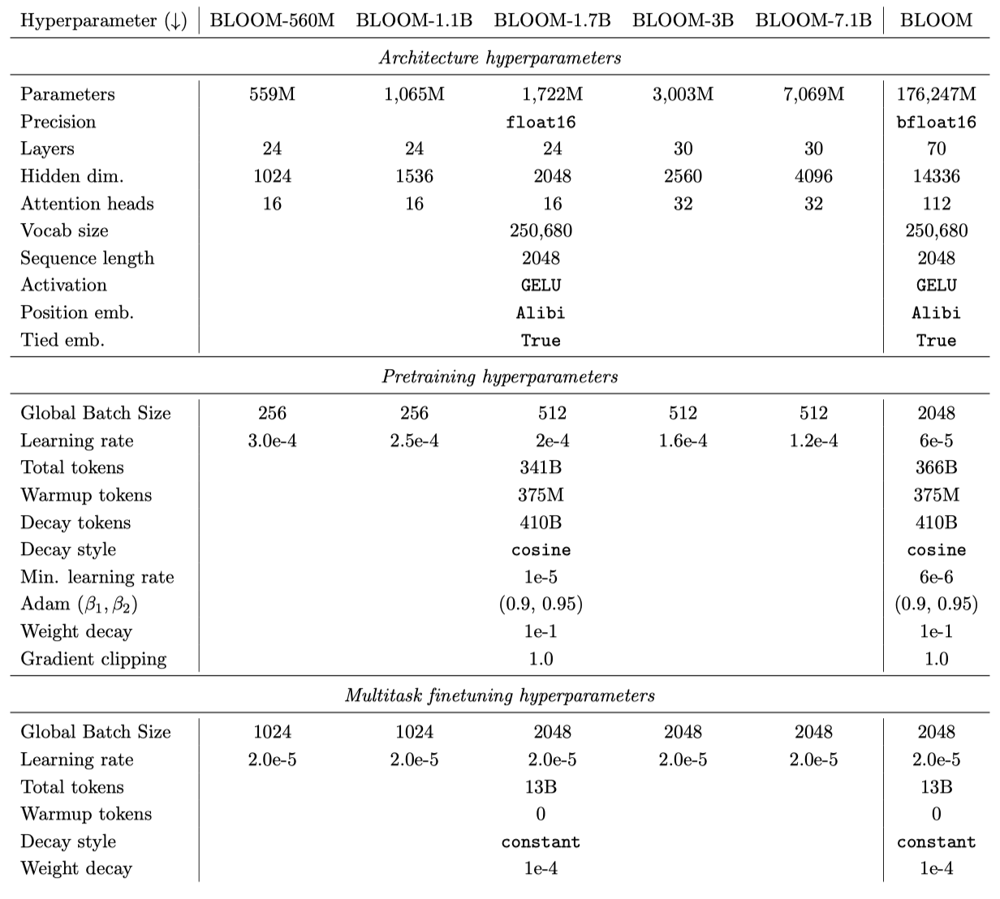

**Pretrained Models** BLOOM의 여섯 가지 크기 변형은 이전 연구와 실험 결과를 기반으로 한다. 3B와 7.1B 모델은 학습 설정에 더 잘 맞도록 조정되었으며, BLOOM의 임베딩 parameter 크기는 더 큰 다국어 어휘 때문에 더 크다.

모든 모델은 410B 토큰에 대한 코사인 learning rate 감소 스케줄을 사용하며, 375M 토큰에 대한 워밍업을 진행한다. ROOTS 데이터셋은 약 3410억 토큰을 포함하고 있으며, 모든 모델은 이 토큰 양에 대해 학습되었다. 그러나, 수정된 스케일링 법칙에 따라, 큰 모델들은 추가로 250억 토큰에 대해 학습되었다. 워밍업 토큰과 감소 토큰의 합계가 총 토큰 수보다 크므로, learning rate 감소의 끝은 결코 도달하지 않았다.

**Multitask Finetuning** 미세조정된 BLOOMZ 모델은 BLOOM 모델과 동일한 아키텍처를 유지하며, 이는 T0와 FLAN을 기반으로 한 미세조정 hyperparameter를 사용한다. learning rate는 사전 학습된 모델의 최소 learning rate를 두 배로 늘리고, 글로벌 배치 크기는 처리량을 늘리기 위해 작은 변형에 대해 네 배로 늘린다. 모델은 130억 토큰에 대해 미세조정되며, 최적의 체크포인트는 별도의 검증 세트를 기준으로 선택된다. 1 ~ 6B 토큰의 미세조정 후에 성능이 일정해지는 것을 확인하였다.

**Contrastive Finetuning** 1.3B 및 7.1B parameter BLOOM 모델에 대해 SGPT Bi-Encoder 레시피를 사용한 대조적인 미세조정을 수행하여 고품질 텍스트 임베딩을 생성하는 모델을 학습시켰다. 이를 통해 다국어 정보 검색과 다국어 semantic textual similarity(STS)을 위한 모델을 개발하였다. 최근 벤치마킹 결과, 이 모델들은 비텍스트 마이닝, 재랭킹, 하류 분류를 위한 피처 추출 등 다른 임베딩 작업에도 사용할 수 있음이 확인되었다.

#### Carbon Footprint

언어 모델 BLOOM의 탄소 배출량을 추정하기 위해, 우리는 장비 제조, 중간 모델 학습, 배포 등을 고려한 생명 주기 평가(LCA) 접근법을 사용하였다. BLOOM 학습에서 발생하는 탄소 배출량은 대략 81톤의 CO2eq로, 이 중 14%는 장비 제조, 30%는 학습 동안의 에너지 소비, 그리고 55%는 학습에 사용된 장비와 컴퓨팅 클러스터의 유휴 소비로 발생하였다.

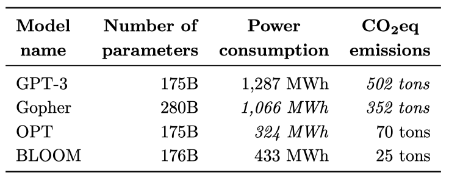

BLOOM 학습의 탄소 배출량은 에너지 소비량이 OPT보다 약간 높지만 배출량은 약 2/3 정도 적다. 이는 BLOOM 학습에 사용된 에너지 그리드의 탄소 강도가 낮기 때문이다. 프랑스의 국가 에너지 그리드는 주로 핵 에너지에 의해 구동되며, 이는 다른 에너지 원본에 비해 저탄소이다. BLOOM과 OPT는 더 효율적인 하드웨어와 더 낮은 탄소 강도의 에너지 원본 등으로 인해 GPT-3보다 훨씬 적은 탄소 배출량을 발생시켰다.

BLOOM의 전체 계산 탄소 발자국 중 최종 학습이 약 37%를 차지하며, 나머지 63%는 중간 학습 실행과 모델 평가 등의 과정에서 발생한다. 이는 OPT 모델의 총 탄소 발자국 추정치보다 약간 낮다. BLOOM API의 탄소 배출에 대한 지속적인 탐색 결과, 모델의 실시간 배포는 하루 배포 당 약 20kg의 CO2eq를 배출한다고 추정된다. 이 수치는 모든 배포 사례를 대표하는 것이 아니며, 사용된 하드웨어, 모델 구현의 특징, 그리고 모델이 받는 요청의 수에 따라 달라질 것이다.

### Release

BLOOM 개발의 핵심은 개방성이었고, 이를 커뮤니티가 쉽게 사용할 수 있도록 하기 위해 모델 카드로 문서화하고 프로젝트의 특정 목표를 위한 새로운 라이선스를 작성하였다.

**Model Card** 기계 학습 모델 출시의 모범 사례를 따라, BLOOM 모델은 기술 사양, 학습 상세, 예정 사용, 범위 벗어난 사용, 모델의 한계를 설명하는 상세한 모델 카드와 함께 공개되었다. 여러 작업 그룹의 참가자들이 협력하여 최종 모델 카드와 각 체크포인트에 대한 카드를 만들었으며, 이 과정은 각 섹션을 생각하고 논의하는 실시간 작업을 통해 이루어졌다.

**Licensing** BLOOM의 잠재적으로 해로운 사용 사례를 고려하여, 무제한 개방 접근과 책임 있는 사용 사이의 균형을 맞추기 위해 행동 사용 조항을 포함하였다. 이는 "Responsible AI Licenses (RAIL)"에 일반적으로 포함되는 것이다. BLOOM용 RAIL 라이선스는 "소스 코드"와 "모델"의 라이선스를 분리하고, 모델의 "사용"과 "유도된 작품"에 대한 상세한 정의를 포함한다. 라이선스는 13개의 행동 사용 제한을 포함하며, 사용자들은 무료로 모델을 사용할 수 있다. BLOOM의 소스 코드는 Apache 2.0 오픈 소스 라이선스에 따라 사용 가능하다.

---

## Evaluation

평가는 zero-shot과 few-shot 설정에 초점을 맞추며, BLOOM이 실제로 어떻게 사용될 가능성이 있는 환경에서 기존의 LLMs와 어떻게 비교되는지를 보여주는 것이 목표이다. 모델의 크기 때문에, 프롬프트 기반 적응과 few-shot "in-context learning"이 미세 조정보다 더 일반적이다. 이에 따라, 다양한 작업과 언어에 대한 zero-shot과 one-shot 프롬프트 기반 설정의 결과를 보고하며, 다중 작업 미세 조정 후에도 그렇다. 또한, 코드 생성을 수행하고, BLOOM에서 파생된 텍스트 임베딩을 사용하며, BLOOM의 일반화 능력을 다국어 프로빙 관점에서 해석한다.

### Experimental Design

#### Prompts

언어 모델 성능에 대한 최근 연구를 참고하여, 작업 데이터와 프롬프트를 모두 다르게 할 수 있는 평가 스위트를 구축하였다. 프롬프트는 BLOOM 출시 전에 개발되었으며, 평가에서 사용하는 프롬프트는 사람들이 언어 모델로부터 원하는 반응을 얻는 합리적인 방법인 것으로 생각된다. 이것은 새로운 사용자가 BLOOM에서 기대할 수 있는 실제 zero-shot 또는 one-shot 결과를 시뮬레이션하는 것이 목표이다. 이는 프롬프트 디자인의 여러 차례 시행착오를 통한 최고의 성능보다는 더 실질적이며, 레이블이 없는 진정한 zero-shot 학습을 더 잘 대표한다고 생각해서이다.

promptsource를 사용해 각 작업에 대해 여러 프롬프트를 생성하며, 이는 크라우드소싱되어 프롬프트 간에 길이와 스타일의 다양성을 보인다. 각 프롬프트의 품질과 명확성을 높이기 위해 여러 차례 동료 검토가 이루어졌다.

자원 제약으로 이 논문에는 포함되지 않은 다른 많은 작업에 대한 프롬프트도 생성하였으며, 이 모든 프롬프트는 공개적으로 이용 가능하다.

#### Infrastructure

프레임워크는 promptsource 라이브러리와 통합하여 EleutherAI의 Language Model Evaluation Harness를 확장하였고, 이를 오픈 소스 라이브러리로 공개하였다. 이를 통해 실험을 진행하고 결과를 집계하였다.

#### Datasets

**SuperGLUE** SuperGLUE의 분류 작업 중 일부를 사용하며, 이들은 영어 전용 작업으로, 주로 영어 모델에 초점을 맞춘 이전 연구와의 비교를 용이하게 한다. 아직 zero-shot과 one-shot 프롬프트 설정을 사용한 보고가 많지 않다. 각 작업에 대해 promptsource에서 무작위로 선택한 5개의 프롬프트로 모든 모델을 평가하며, 모델의 예측은 최대 로그 가능도를 사용하여 측정한다.

**Machine Translation (MT)** BLOOM은 WMT14 en↔fr, en↔hi, Flores-101, DiaBLa 세 가지 데이터셋에서 평가되었다. sacrebleu의 BLEU 구현을 사용하여 평가하였으며, 각각의 데이터셋에 대해 적절한 토큰화를 적용하였다. greedy decoding을 사용하며, 생성 길이는 데이터셋에 따라 WMT14는 64 토큰, Flores-101과 DiaBLa는 512 토큰으로 설정되었다.

**Summarization** WikiLingua 데이터셋에서 BLOOM의 요약 능력을 평가하였다. 이 데이터셋은 WikiHow 기사와 요약 쌍을 포함한 다국어 요약 데이터셋이다. BLOOM과 같은 크기의 모델에서 일반적으로 보고되지 않은 조건부 자연어 생성을 평가하였으며, 원본 언어에서의 추상적 요약 능력을 테스트하였다. BigScience 프로젝트의 일환으로 대상으로 삼은 9개 언어에 중점을 두고 평가하였다.

자연어 생성의 평가는 어렵고, 다국어 생성은 이를 더욱 어렵게 만든다. ROUGE-2, ROUGE-L, 레벤슈타인 거리를 보고하며, SentencePiece 토크나이저를 사용하여 다국어 생성의 충실도를 측정한다. 모델의 추론 시간을 줄이기 위해, GEM 벤치마크에서 균등하게 샘플링된 3000개의 테스트 예제를 사용하였다. 디코딩과 생성 절차는 이전에 설명한 MT와 동일하게 진행하였다.

#### Baseline Models

다음과 같은 기준 모델을 사용한다.

* mGPT, 위키피디아와 Common Crawl에서 60개 언어로 학습된 GPT 스타일 모델
* GPT-Neo, GPT-J-6B, 그리고 GPT-NeoX, The Pile 에서 학습된 GPT 스타일 모델의 계열
* T0, P3의 데이터셋에서 다중 작업 프롬프트를 활용해 미세 조정된 T5의 변형
* OPT, RoBERTa과 The Pile의 데이터셋을 포함한 다양한 데이터셋에서 학습된 GPT 스타일 모델의 계열
* XGLM, CC100의 변형에서 학습된 GPT 스타일의 다국어 모델
* M2M, 100개 언어 간의 번역을 학습한 대규모 다국어 모델
* AlexaTM, 위키피디아와 mC4의 데이터에서 마스크된 언어 모델링과 원인 언어 모델링의 혼합에 학습된 encoder-decoder 모델
* mTk-Instruct, Super-NaturalInstructions의 데이터셋에서 다중 작업 프롬프트를 활용해 미세 조정된 T5의 변형
* Codex, GitHub의 코드에 미세 조정된 GPT 모델의 계열
* GPT-fr, 프랑스어 텍스트로 학습된 GPT 스타일 모델

### SuperGLUE

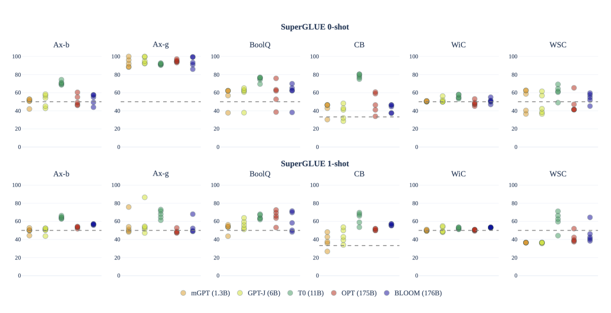

BLOOM, T0, OPT, GPT-J는 추론 작업에서 무작위 선택보다 높은 성능을 보였다. 다른 작업에서는 최고의 프롬프트가 더 잘 수행되었지만, 프롬프트 간의 평균 성능은 대체로 확률적이다. BLOOM은 진단 데이터셋에서 일부 신호를 보였으며, T0 모델은 강한 성능을 보였지만, zero-shot 프롬프트 성능을 개선하기 위해 다중 작업 설정에서 세부 조정되었기 때문에 다른 모델과 직접 비교하기는 어렵다.

모델이 zero-shot에서 one-shot으로 전환됨에 따라 모든 프롬프트와 모델의 변동성이 줄어들고 성능이 약간 불규칙적으로 증가한다. 특히, BLOOM은 zero-shot에서 one-shot으로 전환할 때 다른 모델에 비해 성능이 더 향상되며, 이는 다국어 모델이 더 긴 맥락을 통해 입력과 출력 언어에 대한 확신을 얻기 때문일 수 있다.

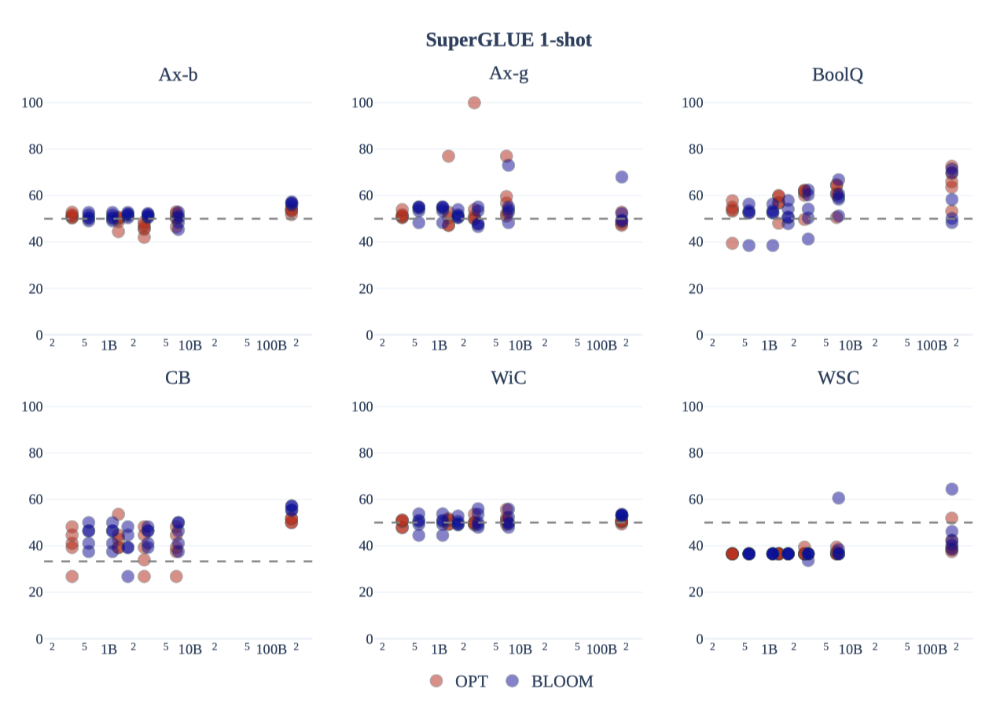

모델 크기에 따라 BLOOM 모델을 비교하는 추가 분석을 수행하였다. OPT와 BLOOM 모델 모두 크기가 커짐에 따라 약간의 성능 향상이 있었으며, 2조 이상의 parameter를 가진 모델에서만 신호가 나타났다. one-shot 설정에서, BLOOM176B는 일부 작업에서 OPT-175B를 앞서거나 맞추며, 이는 다국어성이 zero-shot 설정에서 BLOOM의 영어 작업 성능을 제한하지 않음을 보여준다.

### Machine Translation

#### WMT

zero-shot과 one-shot 설정에서 BLOOM-176B의 WMT 결과는 상세한 프롬프트가 더 좋은 성능을 보였다. one-shot 설정에서 BLOOM은 적절한 프롬프트를 사용하면 능숙한 번역을 수행할 수 있지만, 전문 번역 모델인 M2M-100에 비해 성능이 떨어진다. 주요 문제점은 과도한 생성과 올바른 언어를 생성하지 못하는 것인데, 이는 few-shot 예제의 수를 늘림으로써 크게 개선된다.

#### DiaBLa

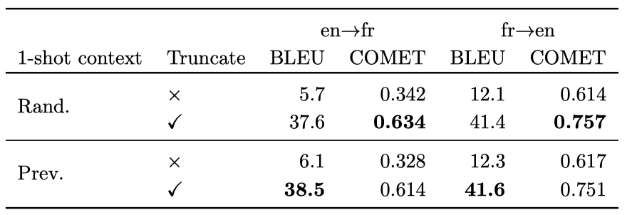

one-shot 맥락에서 "xglm-source+target" 프롬프트를 사용하였고, 무작위 테스트 세트 예제와 이전 대화 발언을 one-shot 예제로 사용한 결과를 비교하였다. 과도한 생성 문제를 고려하여 원래의 출력과 사용자 정의 절단 함수를 적용한 결과를 보고하였다. 자동 결과는 명확하지 않으나, 모델이 one-shot 예제의락을 사용하여 번역 선택을 할 수 있음이 예측에서 확인되었다.

#### Flores

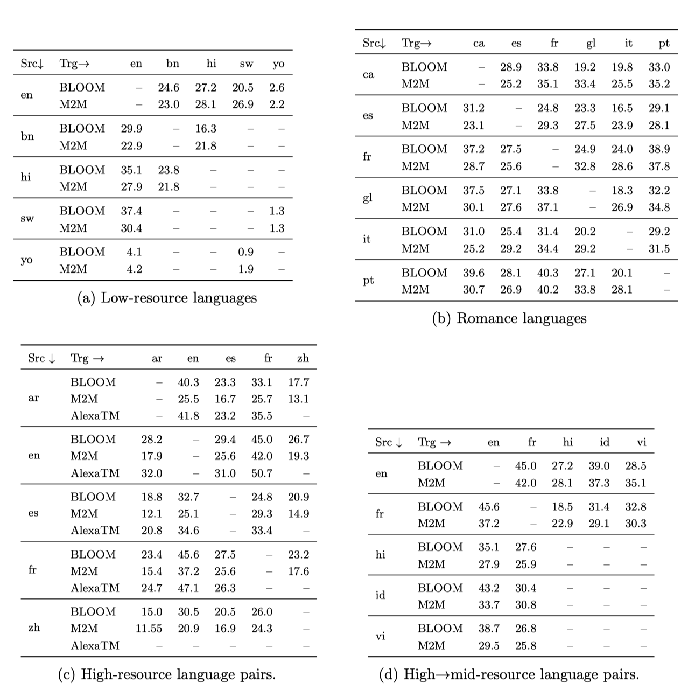

one-shot 설정에서, "xglm-source+target" 프롬프트를 사용하여 Flores-101 개발 테스트 세트에서 여러 언어 방향을 테스트하였다. one-shot 예제는 개발 세트에서 무작위로 선택하였고, 저자원 언어 쌍, 로망스 언어 가족의 관련 언어, 고자원 언어 쌍, 그리고 고-중간 자원 언어 쌍의 결과를 각각 분리하여 보고하였다.

언어는 ROOTS에서의 표현에 따라 저자원, 중간자원, 고자원으로 분류됩니다. M2M-100 모델의 감독 결과와 AlexaTM의 32샷 결과와 비교하였다. 고자원 언어 간의 번역과 고자원에서 중간자원 언어로의 번역 모두에서 BLOOM이 좋은 성과를 보여주었으며, 이는 BLOOM의 다국어 능력을 나타낸다. 이 one-shot 설정에서 M2M-100 모델과 비교했을 때, BLOOM의 결과는 대체로 비슷하거나 때때로 더 좋았으며, AlexaTM의 결과와도 많은 경우에 비슷하였다.

BLOOM은 잠재적으로 해로운 사용 사례를 방지하기 위해 "Responsible AI Licenses (RAIL)"을 채택하였다. 이 라이선스는 "소스 코드"와 "모델"을 분리하며, 모델의 사용과 "유도된 작품"에 대한 명확한 정의를 포함한다. 이는 프롬프팅, 미세 조정, 증류, 로직과 확률 분포의 사용 등의 예상되는 하류 사용을 명확히 식별할 수 있도록 한다. 라이선스에는 BLOOM 모델 카드와 BigScience 윤리 헌장에 따른 13개의 행동 사용 제한이 포함되어 있다. 라이선스를 준수하는 사용자는 BLOOM 모델을 무료로 사용할 수 있다. 그리고 BLOOM의 소스 코드는 Apache 2.0 오픈 소스 라이선스에 따라 사용 가능하다.

### Summarization

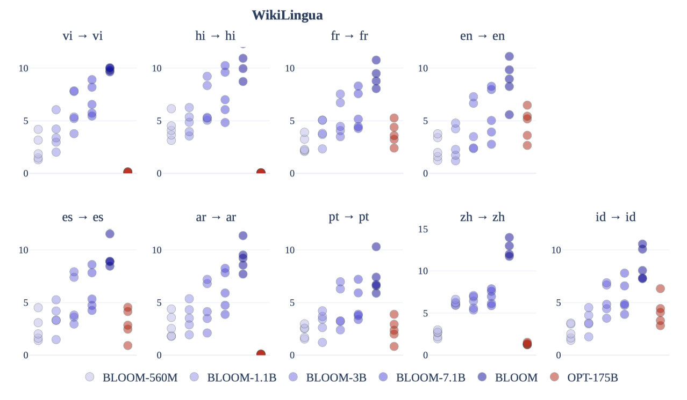

BLOOM 모델이 OPT-175B보다 다국어 요약에서 더 높은 성능을 보이며, 모델의 parameter 수가 증가할수록 성능이 향상된다는 것을 보여준다. 이 결과는 BLOOM의 다국어 중심 학습의 효과를 보여준다.

이전 작업과 비교하고, 생성 평가 대안이 부족하기 때문에 ROUGE-2 점수를 보고한다. 그러나 많은 경우에 시스템이 생성한 요약의 품질이 ROUGE-2 점수로는 과소평가된다는 것을 확인하였다.

### Code Generation

BLOOM의 사전 학습 말뭉치 ROOTS는 약 11%의 코드를 포함하며, 그 성능은 비슷한 크기의 GPT 모델과 유사하다. 코드만을 미세 조정한 Codex 모델이 다른 모델보다 뛰어나다. 다중 작업 미세 조정된 BLOOMZ 모델은 BLOOM 모델보다 크게 향상되지 않았으며, 이는 미세 조정 데이터셋인 xP3이 순수한 코드 완성을 크게 포함하지 않기 때문으로 추정된다. xP3은 주로 코드 관련 작업을 포함하고 있다.

### HELM benchmark

HELM 벤치마크에서의 평가 결과, 다국어 학습을 한 BLOOM은 이전 세대의 영어 전용 모델들과 비슷한 정확도를 보여주지만, 최근의 단일 언어 모델들에 비해 성능이 떨어진다. BLOOM은 크기가 큰 다른 언어 모델들처럼 잘 보정되지 않았으나, 강건한 성능을 보여준다. 또한, 이 벤치마크에서 BLOOM은 공정성 면에서 가장 우수한 모델 중 하나로, 영어에서는 평균보다 약간 더 독성이 있고, 편향에 대해서는 평균이다.

### Multitask Finetuning

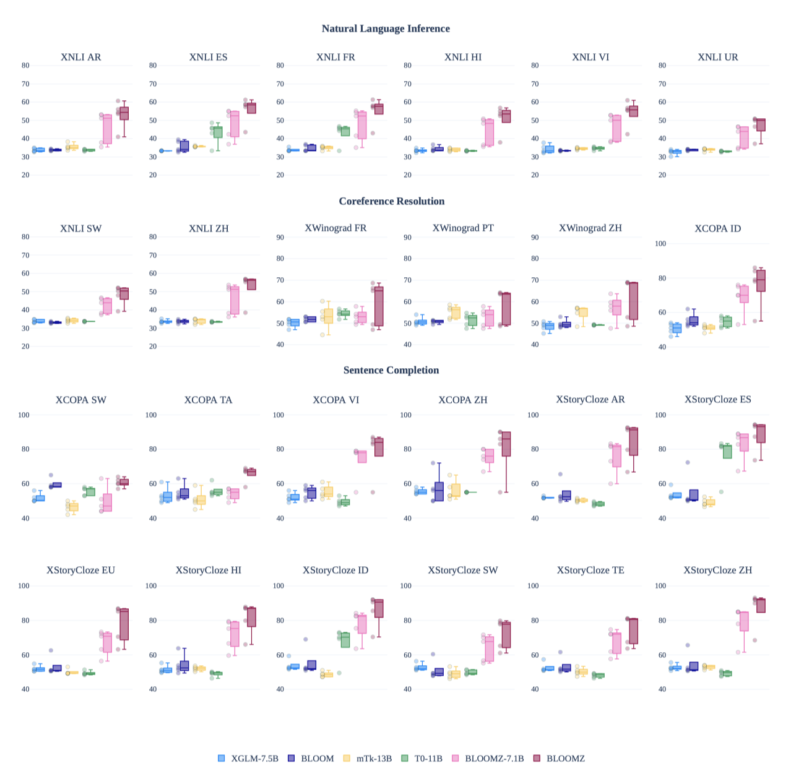

최근의 다중 작업 미세 조정 연구를 바탕으로, BLOOM 모델의 zero-shot 성능 향상을 위해 다국어 다중 작업 미세 조정을 탐구하였다. xP3 말뭉치를 사용해 BLOOM 모델의 다국어 다중 작업 미세 조정을 수행한 결과, zero-shot 성능이 크게 향상되었다. BLOOM과 XGLM의 성능은 기준선에 가까웠지만, 다중 작업 미세 조정을 거친 후에는 성능이 크게 개선되었다. 반면, 영어 단일 언어 모델인 T0는 다국어 데이터셋에서 성능이 나쁘지만, 크기와 구조를 고려할 때 xP3에서 미세 조정된 모델들은 T0를 능가한다. 이는 T0의 미세 조정 데이터셋이 xP3보다 다양성이 떨어지기 때문으로, 다중 작업 미세 조정 성능이 데이터셋과 프롬프트의 양과 관련이 있다는 것이 입증되었다.

### Embeddings

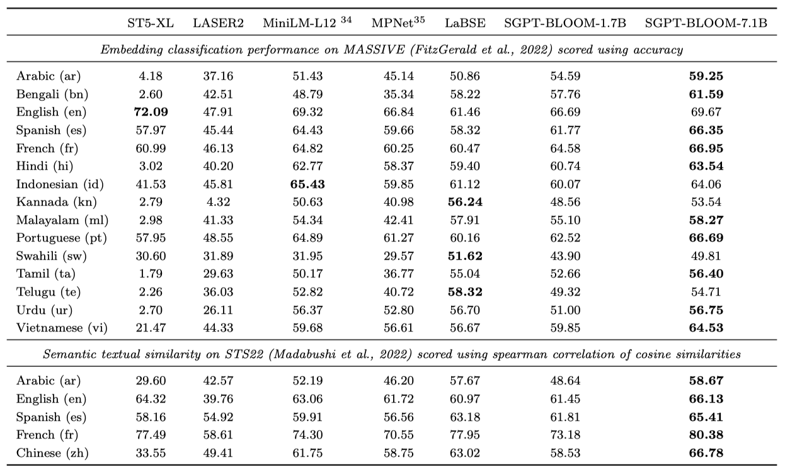

SGPT-BLOOM-7.1B-msmarco 36 모델은 분류와 의미적 텍스트 유사도 분할에서 최고 수준의 성능을 보여주었다. 하지만, 이 모델은 71억 개의 parameter를 가지고 있어 다른 모델들보다 큰 규모이다. 반면 SGPT-BLOOM-1.7B-nli 39는 parameter가 적고 미세 조정 기간이 짧아 성능이 떨어졌다. ST5-XL 40은 12억 개의 parameter를 가진 가장 큰 모델이지만, 영어 전용 모델이라 비영어 언어 성능은 떨어진다. 더 많은 언어와 데이터셋에 대한 성능은 MTEB 리더보드에서 확인할 수 있다.

### Multilingual Probing

Probing은 LLMs의 내부 작동을 분석하고 해석하는 중요한 평가 방법론이지만, 일정한 단점이 있다. LLM 임베딩을 검사하면 학습 목표 손실이나 downstream 작업 평가를 제외한 모델의 일반화 능력을 파악하는 데 도움이 된다. 이는 주석이 달린 데이터셋이나 벤치마크가 부족한 언어를 검토하는데 특히 유익하다.

#### Method

BLOOM의 다국어 일반화 능력을 분석하기 위해 "Universal Probing" 프레임워크를 사용하여 104개의 언어와 80개의 형태-구문적 특징에 대해 체계적인 분석을 수행하였다. 이 프레임워크는 각 언어에 대한 probing 설정과 데이터셋을 제공한다. BLOOM의 사전 학습 말뭉치와 UD 트리뱅크에서 7개의 언어 가족 중 17개의 언어를 고려하였다. 설정은 총 38개의 형태-구문적 특징을 포함한다.

probing 절차는 입력 문장의 <s>-pooled 표현을 BLOOM 모델에서 계산하고, 이를 이용해 이진 로지스틱 회귀 분류기를 학습시켜 문장에서 형태-구문적 특징의 존재를 예측한다. 원본 UD의 학습, 검증, 테스트 분할을 사용하며, probing 성능은 대부분의 작업에서 타겟 클래스 불균형 때문에 F1 가중치 점수로 평가된다. 결과는 다른 랜덤 시드를 가진 세 번의 실행에서 평균된다.

**Baselines** probing 성능을 랜덤 추측과 TF-IDF 특징(단어 유니그램, 문자 N-gram, BPE 토큰 N-gram, SentencePiece 토큰 N-gram)에 대해 훈련된 로지스틱 회귀 분류기와 비교하였다. 이 때 N-gram 범위는 [1; 4]이며, TF-IDF 어휘는 상위 250k 특징으로 제한되었다.

**Correlation** probing 성능과 언어학적, 데이터셋, 모델 구성 기준 사이의 상관관계를 분석하기 위해 통계 테스트를 실행한다:

* Language script: 결과는 언어 스크립트인 라틴어와 기타(데바나가리, 타밀어, 아랍어)로 두 그룹으로 나누어진다. 여기서 비모수 검정인 Mann-Whitney U 검정을 사용한다.
* Language family: 결과는 언어 가족에 따라 7개 그룹으로 나누어진다. 그룹 간의 분산을 분석하기 위해 ANOVA를 적용한다.
* Probing and pretraining dataset size: 피어슨 상관계수 검정을 실행하여 probing 성능과 이러한 데이터 구성 기준 간의 상관관계를 계산한다.
* Effect of the model size: 결과는 BLOOM 버전에 따라 두 그룹으로 나누어진다. 여기서 parameter 수와 probing 결과 간의 상관관계가 있는지 확인하기 위해 Mann-Whitney U 검정을 사용한다.

#### Results

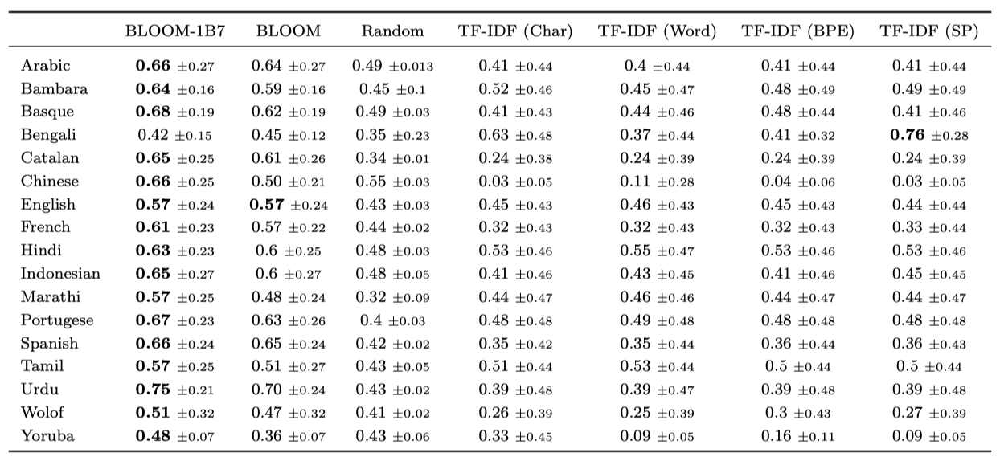

**Probing** 

BLOOM1B7은 BLOOM과 비슷하거나 더 좋은 성능을 보이며, 둘 다 카운트 기반 기준보다 더 우수하다. 아랍어, 바스크어, 인도-유럽 언어들에서는 특히 더 강한 성능을 보였지만, 벵골어, 울로프어, 요루바어에서는 가장 낮았다. 이러한 결과는 BLOOM이 밀접한 관련성을 가진 언어의 특성을 더 잘 이해하고 추론하기 때문이다. 그 결과, 로맨스어에서는 영어보다 더 높은 성능을 보이고, 인도어에서는 고자원 언어들과 비슷한 결과를 보였다.

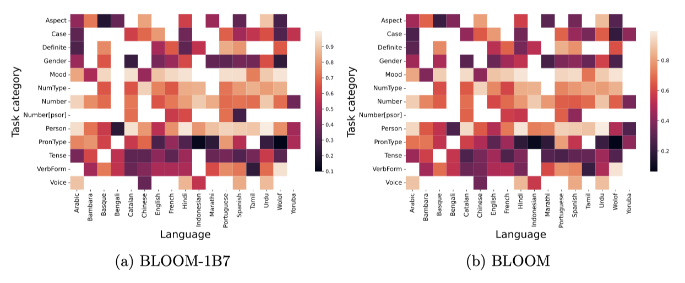

두 LLM 모델은 크기에 상관없이 비슷한 성능을 보여주며, 언어를 불문하고 양태와 인칭을 잘 추론한다. 수, 숫자 유형, 태는 대부분의 언어에서 적당히 추론되지만, 다른 카테고리에서는 더 나쁜 성능을 보인다. 이는 모델이 이러한 형태적 정보를 인코딩하지 않는다는 것을 나타낸다. 이러한 성능 차이는 각 카테고리의 가능한 값의 다양성 때문일 수 있다. 예를 들어, 양태와 인칭은 여러 언어에서 비슷한 값을 공유하지만, 격의 경우 언어에 크게 의존한다.

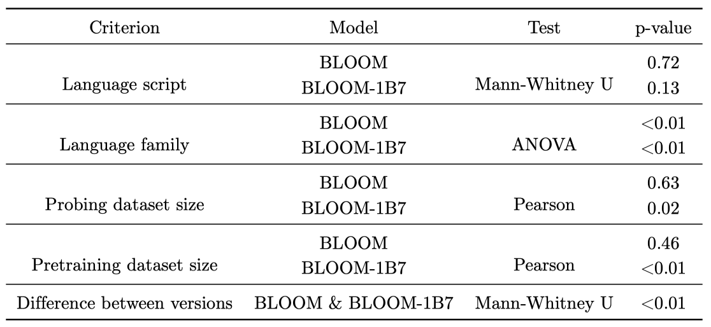

**Correlation** 상관 분석 결과는 probing 성능에 대한 결론을 지지하며, 언어 가족, 데이터셋 크기 등이 주요 요인임을 보여준다. BLOOM-1B7 모델은 BLOOM보다 더 우수한 성능을 보이지만, BLOOM은 사전 학습 데이터의 양에 상관없이 다양한 언어에 대해 더 안정적인 성능을 나타낸다. 이는 parameter가 많을수록 모델의 일반화 능력이 더 좋을 수 있음을 시사한다.

**Discussion** 

1. **Generalizing abilities.** 언어들에 대해 BLOOM-1B7이 형태-구문적 특징 분류의 평균 성능에서 우수하며, BLOOM은 문법적 일반화가 더 부족하다. 그러나, BLOOM-1B7은 사전 학습 데이터셋 크기와 같은 요인들과 더욱 강한 상관성을 보여, 자원이 부족한 언어들에 대해 더 큰 버전보다 일반화가 덜 할 수 있음을 보여준다.
2. **Multilingual abilities.** 모델의 사전 학습 말뭉치에 명시적으로 포함되지 않은 언어들을 고려하는 것은 별도의 연구 관심사이다. 이를 통해 언어 세트를 확장하면, 더 넓은 범위에서 언어적 특징의 학습 가능성과 난이도에 대한 깊이 있는 분석과 언어유형학적 해석이 가능해진다.
3. **Under-resourced language evaluation.** 사전 학습 말뭉치에서 비중이 작은 인도 및 니제르-콩고어 계열의 자원 부족 언어들은 미래 연구의 주제이다. 또한, 자원이 풍부한 언어와 부족한 언어의 결과를 비교 분석하여 언어학적 통찰을 도출할 계획이다.
4. **Different layers and training dynamics.** 이 분석은 모든 층의 평균 표현과 학습 종료 시점에 집중하였. 다른 층을 분석하면 형태-구문적 표현이 어떻게 구성되는지 밝혀낼 수 있으며, 사전 학습 과정에서 속성 획득 방식을 조사하는 것은 연구에서 유망한 방향이다.

### Bias

BLOOM이 학습한 편향에 대한 초기 연구로, 다언어 CrowS-Pairs 데이터셋을 사용한 평가를 수행하였다. 이 데이터셋은 고정관념적인 명제와 비-고정관념적인 명제를 비교하며, 모델이 고정관념적인 명제를 체계적으로 선호하는지를 평가한다. 이 평가에서의 도전은 원래 마스크된 언어 모델을 위해 설계된 데이터셋을 BLOOM과 같은 autoregressive 언어 모델에 적용하는 것이었다.

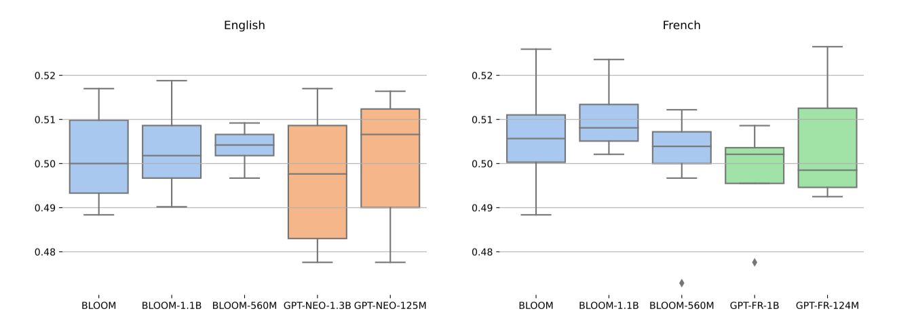

BLOOM의 전체 프롬프트 정확도가 .50에 가깝다는 것을 보여주어, 전반적인 편향이 없음을 나타낸다. 영어와 프랑스어의 점수가 유사해, 모델이 두 언어에 대해 비슷한 방식으로 작동함을 보여준다. 또한, 영어와 프랑스어에 대한 단일 언어 autoregressive 모델인 GPT-Neo와 GPT-FR의 결과도 제시하였다.

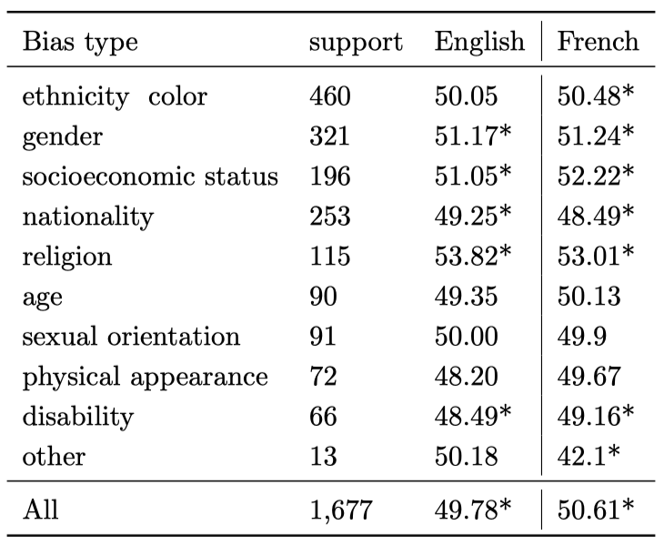

CrowS-Pairs 데이터셋의 편향 유형별 결과를 보여준다. 결과는 모든 범주에서 균일한데, 이는 이전 연구와 대조적이다. 이전 연구에서는 특정 범주에서 모델이 편향되는 경향이 있었다. 그러나 두 언어 모두 전체적으로, 그리고 여러 편향 범주에서 정확도는 50에서 유의하게 차이가 나는 것으로 나타났다.

**Limitations** 원래의 CrowS-Pairs 말뭉치의 타당성에 대한 문제를 해결하고, 프랑스어 사용자로부터 수집한 고정관념을 바탕으로 200개의 추가 문장 쌍을 만들어 사용한 CrowS-Pairs 버전에 대해 논의하였다. 최근의 영어와 프랑스어에서의 마스크된 언어 모델의 편향 평가에서, 수정된 데이터셋에서 얻은 결과는 원래 데이터셋에서 얻은 결과와 크게 차이가 없었다.

원래의 CrowS-Pairs 유효성 검증은 이 경우에 적용하기 어렵고, 다른 결과와의 비교도 어렵다. 강력한 편향 평가를 위해 다른 편향 측정과 비교하고 모든 언어에 대해 평가해야 한다. 그러나, 다언어 편향 평가를 위한 자료는 매우 부족하다는 점이 지적되었다.

모델에서의 편향이 제한적이라는 것을 보여주지만, 이것은 가능한 모든 사용 시나리오를 다루지는 못한다. 언어의 다양성과 변이에 대한 문제가 하나의 시나리오가 될 수 있다. 신중하게 선별된 BLOOM의 학습 자원은 다른 모델보다 언어 변이를 더 잘 포착할 수 있다. 이는 모델이 다양한 언어 변이를 공정하게 대표하는 능력에도 영향을 미친다. 그러나, 편향 평가는 다언어 CrowS-Pairs의 범위 내에서 제한되며, 따라서 CrowS-Pairs를 사용한 결과와 더 넓은 모델 사용 사이에는 차이가 있을 것으로 예상된다.

---

## Conclusion

이 연구에서는 176B 개의 parameter를 가진 공개 다언어 언어 모델인 BLOOM을 소개한다. BLOOM은 수백 명의 연구자들이 참여한 BigScience 프로젝트에서 만들어졌고, 프랑스 정부가 지원한 Jean Zay 슈퍼컴퓨터에서 3.5개월 동안 학습되었다. BLOOM의 개발 과정을 상세히 기록하였고, 다중 작업 미세조정 후 성능이 향상된 것을 확인하였다.

강력한 다언어 언어 모델인 BLOOM의 출시를 통해 대형 언어 모델에 대한 새로운 응용과 연구 방향이 개방될 것으로 기대한다. 또한, 경험을 문서화함으로써, 기계 학습 연구 커뮤니티가 BigScience와 같은 대규모 협업 프로젝트를 조직하는 데 도움이 될 것이다. 이는 개별 연구 그룹에서 달성할 수 없는 결과를 가능하게 하며, 다양한 배경을 가진 사람들이 아이디어를 공유하고 주요 발전에 참여하는 데 도움이 될 것이다.

---

## Reference

* [Paper](https://arxiv.org/pdf/2211.05100.pdf)