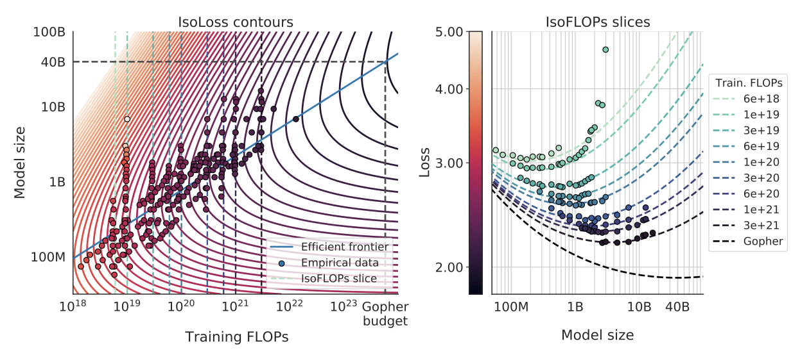
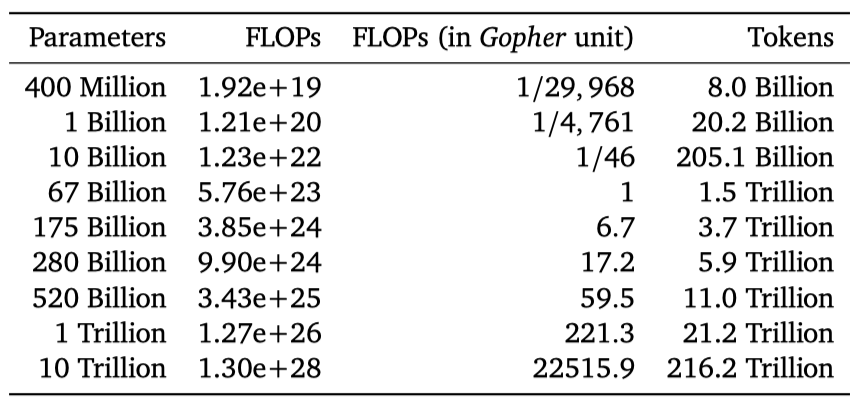
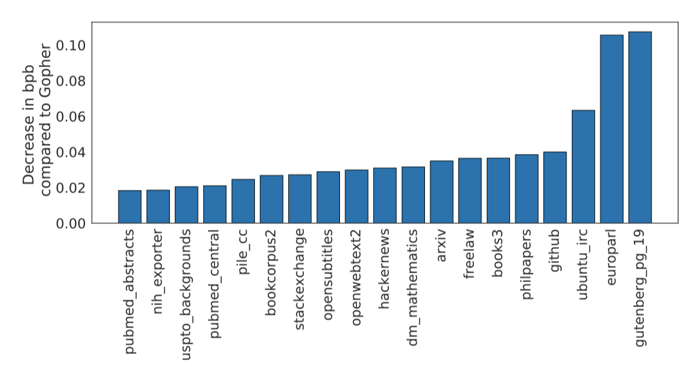
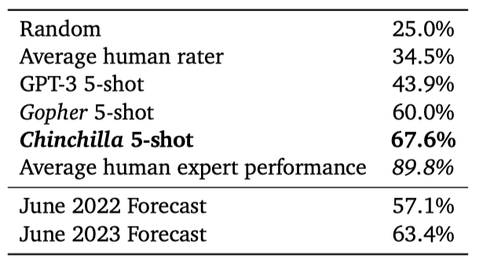
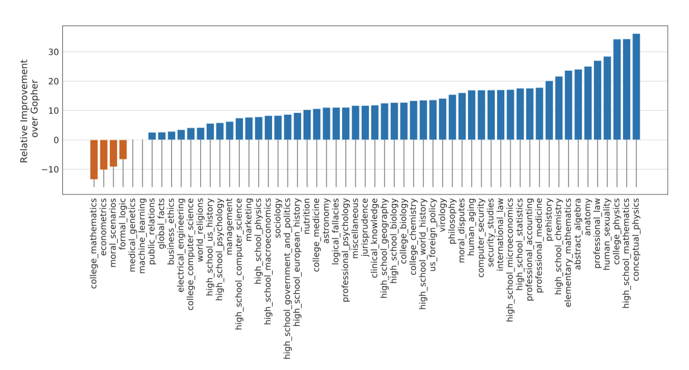
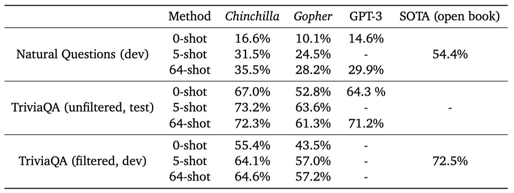

+++
author = "Kurt"
title = "Chinchilla"
date = "2024-01-27"
description = "Training Compute-Optimal Large Language Models"
categories = [
    "Paper Review"
]
tags = [
    "LLM",
    "Milestone",
]
+++

## Abstract

주어진 컴퓨팅 예산 하에서 transformer 언어 모델을 학습시키기 위한 최적의 모델 크기와 토큰 수를 조사했다. 현재 대형 언어 모델들은 학습이 부족하며, 이는 학습 데이터의 양을 일정하게 유지하면서 모델을 확장하는 최근의 추세 때문이다. 모델 크기와 학습 토큰 수는 동일하게 확장되어야 하며, 이를 검증하기 위해 Gopher와 동일한 컴퓨팅 예산을 사용하는 Chinchilla 모델을 학습시켰다. Chinchilla는 다양한 평가 작업에서 뛰어난 성능을 보였으며, MMLU 벤치마크에서는 평균 정확도 67.5%를 달성하여 Gopher에 비해 7% 이상 향상되었다.

---

## Introduction

최근에는 500B 개 이상의 parameter를 가진 대형 언어 모델들이 소개되었다. 이런 대형 autoregressive transformer들은 zero-shot, few-shot, 미세 조정 등 다양한 평가 방법을 통해 많은 작업에서 뛰어난 성능을 보여주었다.

대형 언어 모델 학습의 컴퓨팅 및 에너지 비용은 상당히 크며, 모델 크기 증가에 따라 더욱 증가한다. 학습에 할당된 컴퓨팅 예산은 대개 사전에 알려져 있고, 이런 대형 모델은 일반적으로 한 번만 학습시킬 수 있으므로, 주어진 예산에 대해 최적의 모델 hyperparameter를 정확하게 추정하는 것이 중요하다.

Kaplan et al. (2020)의 연구에 따르면, 언어 모델의 parameter 수와 성능 사이에는 지수법칙 관계가 있다. 이에 따라 모델이 커질수록 성능 향상을 기대한다. 그러나 대형 모델은 가장 낮은 손실로 학습시키지 않아야 한다는 결론에 도달하였다. 특히, 컴퓨팅 예산을 10배 늘릴 경우, 모델 크기와 학습 토큰 수는 동등한 비율로 증가해야 한다고 발견했다.

최근에 학습된 많은 대형 모델들은 Kaplan et al. (2020)과 GPT-3의 학습 방법을 따라, 컴퓨팅을 증가할 때 주로 모델 크기를 증가시키는 방식으로 약 3000억 개의 토큰에 대해 학습되었다.

이 연구에서는 주어진 FLOPs 예산 하에서 모델 크기와 학습 토큰 수 간의 균형을 어떻게 맞춰야 할지를 다시 살펴본다. 이를 위해 모델 parameter 수와 학습 토큰 수에 따른 최종 사전 학습 손실을 모델링하고, 이를 최소화하는 방향으로 연구를 진행하였다.

$$ N_{opt}(C), D_{opt}(C) =  \underset{𝑁,𝐷 s.t. FLOPs(N, D) = C}{argmin} L(N, D) $$

컴퓨팅 예산의 최적 분배를 설명하는 함수를 400개 이상의 다양한 크기의 모델을 기반으로 추정하였다. 이 접근법은 Kaplan et al. (2020)의 결과와 크게 다르다.

추정에 따르면, Gopher를 학습시키는 데 사용된 컴퓨팅 예산으로는 크기가 4배 작고 토큰이 4배 더 많이 학습된 모델이 최적이라고 예측한다. 이를 확인하기 위해 1.4T 개의 토큰에 대해 더 최적화된 70B 모델인 Chinchilla를 학습시켰고, 이 모델은 크기가 더 큰 Gopher보다 더 뛰어난 성능을 보여주었다. 더 작은 모델의 이점은 개선된 성능 외에도 추론 비용 감소와 하드웨어 호환성 향상에 있다.

---

## Related Work

**Large language models.** 최근 몇 년 동안 다양한 대형 언어 모델이 등장했고, 이는 dense transformer 모델과 mixture-of-expert (MoE) 모델을 포함한다. 가장 큰 dense transformer 모델은 500B 개의 parameter를 가지고 있다. 모델을 더욱 키우는 추세는 많은 언어 모델링 작업에서 state-of-the-art를 개선하는 데 기여했다. 그러나 대형 언어 모델은 계산 요구 사항과 고품질 학습 데이터 획득의 필요성 등의 도전과제에 직면하고 있다. 사실, 더 크고 고품질의 데이터셋이 언어 모델의 추가 확장에서 중요한 역할을 할 것이라는 것이 발견되었다.

**Modelling the scaling behavior.** 언어 모델의 스케일링 행동과 전송 특성 이해는 최근 대형 모델 개발에 중요한 역할을 했다. Kaplan et al. 은 모델 크기와 손실 간의 예측 가능한 관계를 보여주었고, 이를 바탕으로 주어진 계산 예산에 대해 학습시킬 최적의 모델 크기를 선택하는 문제를 조사하였다. 그러나 이 연구는 여기서 몇 가지 중요한 차이점을 가지고 있다. 첫째, 모든 모델에 대해 고정된 학습 토큰과 learning rate 일정을 사용하는 대신, learning rate 일정을 학습 토큰 수와 대략 맞추는 것이 모델 크기에 관계없이 최선의 최종 손실을 가져다준다는 것을 발견하였다. 둘째, 최대 16B parameter를 가진 모델을 포함하였으며, 이는 분석에 사용된 모델의 대부분이 500M 개 이상의 parameter를 가지고 있음을 반영하는 것이다. 이는 Kaplan et al. 의 연구와 대조적으로, 그들의 대부분의 실행이 100M parameter 미만이었다.

최근 Clark et al. (2022)은 MoE 언어 모델의 스케일링 특성을 조사하였고, 이 결과 모델 크기가 증가함에 따라 expert 수의 스케일링이 줄어든다는 것을 발견하였다. 그러나 이 분석은 고정된 학습 토큰 수를 사용하여 수행되었기 때문에, 분기의 향상을 과소평가할 수 있다.

**Estimating hyperparameters for large models.** 언어 모델을 선택하고 학습하는 데는 모델 크기와 학습 토큰 수 외에도 learning rate, learning rate 일정, batch size, optimiser, width-to-depth ratio 등이 중요하다. 이 연구에서는, 모델 크기와 학습 단계 수에 집중하며, 기타 필요한 hyperparameter는 기존 연구와 실험적 휴리스틱을 바탕으로 결정하였다. 일부 연구에서는 batch size와 모델 크기 사이에 약한 관계를 찾았으며, 더 큰 batch size 사용 가능성을 제안하였다. 또한, 하드웨어에서 더 나은 성능을 위해 제안된 것보다 약간 덜 깊은 모델을 사용하였다.

**Improved model architectures.** 최근에는 전통적인 변환기에 대한 다양한 대안이 제안되었다. 이 중 큰 MoE 모델들은 상대적으로 적은 계산력을 사용하면서도 큰 모델 크기를 제공한다. 그러나 매우 큰 모델에서는 이러한 모델의 계산적 이점이 줄어드는 것으로 보인다. 언어 모델을 개선하는 또 다른 방법은 transformer에 명시적 검색 메커니즘을 추가하는 것이며, 이는 학습 중에 볼 수 있는 데이터 토큰의 수를 효과적으로 증가시킨다. 이로 인해 언어 모델의 성능이 학습 데이터 크기에 더 크게 의존할 수 있음을 암시한다.

---

## Estimating the optimal parameter/training tokens allocation

이 연구는 고정된 FLOP 예산이 주어졌을 때, 모델 크기와 학습 토큰 수 사이에서 어떻게 균형을 맞출 것인지에 대한 질문에 대해 세 가지 다른 접근법을 제시한다. 모든 접근법은 모델 크기와 학습 토큰 수를 다양하게 하여 모델을 학습시키고, 그 결과를 바탕으로 스케일링 방법을 추정한다. 결과적으로, 더 많은 계산을 통해 parameter 수와 학습 토큰 수를 동등하게 증가시켜야 한다는 결론을 도출하였으며, 이는 이전 연구와는 대조적이다.

### Approach 1: Fix model sizes and vary number of training tokens

첫 번째 접근법에서는 70M에서 10B 이상의 parameter 범위를 가진 고정된 모델 패밀리에 대해 학습 단계 수를 변경하며, 각 모델을 4 가지 다른 학습 시퀀스 수에 대해 학습시킨다. 이를 통해 학습 FLOP 수에 따른 최소 손실을 직접 추정한다. 

각 parameter 수 $N$에 대해 4가지 다른 모델을 학습하면서 learning rate와 학습 토큰 수를 변화시켰다. 각 실행에 대한 학습 손실 곡선을 부드럽게 만들고 보간하여, FLOP 수에 따른 학습 손실을 매핑하였다. 이를 통해, 주어진 FLOP 수 $C$에서 가장 효율적인 모델 크기 $N$과 학습 토큰 수 $D$를 찾아냈다. 이를 통해 주어진 계산량에 대한 최적의 모델 크기와 학습 토큰 수를 추정하였으며, $a = 0.50$, $b = 0.50$이라는 결과를 얻었다. 이 결과는 이전 연구와 비교했을 때 이 연구에서 예측한 모델 크기가 더 우수하다는 것을 보여준다.

### Approach 2: IsoFLOP profiles

두 번째 접근법에서는 특정 학습 FLOP 수 범위에 대해 모델 크기를 변화시키고, 각 경우에 대한 최종 학습 손실을 고려한다. 이 접근법은 전체 학습 과정에서의 점들을 고려하는 첫 번째 접근법과는 대비된다. 이를 통해 주어진 FLOP 예산에 대해 최적의 parameter 수는 무엇인지 직접적으로 파악할 수 있다.

각 FLOP 예산에 대해, 최종 손실을 parameter 수에 대해 그래프로 그려, 손실에서 명확한 최소값을 찾아내었다. 이를 통해 최소 손실이 달성되는 모델 크기를 직접적으로 추정하였다. 이전 접근법과 마찬가지로, FLOPs와 최적 모델 크기 및 학습 토큰 수 사이에 제곱 법칙을 적합시켰으며, $a = 0.49$, $b = 0.51$이라는 결과를 얻었다.

### Approach 3: Fitting a parametric loss function

접근법 1 & 2의 모든 실험에서 얻은 최종 손실을 모델 parameter 수와 본 토큰 수에 대한 함수로 모델링하고, 이를 위해 고전적인 위험 분해 방식을 사용하였다.

$$ \hat{L} (N, D) \triangleq E + {{A}\over{N^{\alpha}}} + {{B}\over{D^{\beta}}}  $$

첫 번째 항은 이상적인 생성 과정의 손실을, 두 번째 항은 완벽하게 학습된 transformer의 한계를, 마지막 항은 transformer가 완전히 수렴하지 않았음을 각각 나타낸다. 이는 데이터셋의 일부에 대해 한정된 최적화 단계만 수행하기 때문이다.

**Model fitting.** $(A, B, E, \alpha, \beta)$ 추정을 위해, L-BFGS 알고리즘을 사용하여 예측된 log 손실과 실제 log 손실 사이의 Huber 손실을 최소화한다.

$$  \underset{A, B, E, \alpha, \beta}{min} \sum_{\text{Runs} i} \text{Huber}_{\delta} (log \hat{L} (N_i, D_i) - log \ L_i) $$

가능한 지역 최소값을 고려하여 최적의 적합을 찾기 위해, 다양한 초기값에서 시작한다. 이상치에 강한 Huber 손실 $(\delta = 10^{-3})$을 사용하며, 이는 보류된 데이터 포인트에 대한 예측 성능 향상에 중요하다.

**Efficient frontier.** 특정 제약 하에서 parameter 손실을 최소화함으로써, 함수 $N_{opt}$와 $D_{opt}$를 근사화할 수 있다. 이 결과값들은 모델 크기와 데이터에 의존하는 두 항을 균형있게 만들며, 구조적으로 제곱 법칙 형태를 갖는다.

$$ N_{opt}(C) = G {{C}\over{6}}^a, $D_{opt}(C) = G^{-1} {{C}\over{6}}^b, \ \text{where} \ G = {{\alpha A}\over{\beta B}}^{{1}\over{\alpha + \beta}}, \ a = {{\beta}\over{\alpha + \beta}}, \text{and} \ b = {{\alpha}\over{\alpha + \beta}} $$

이 접근법을 통해 $a = 0.46$, $b = 0.54$ 값을 얻었다.

### Optimal model scaling

세 가지 접근법은 모두 계산 예산이 증가함에 따라, 모델 크기와 학습 데이터 양이 대략 비례하여 증가해야 한다고 제안한다. 첫 번째와 두 번째 접근법은 최적 모델 크기에 대해 유사한 예측을 제공하며, 세 번째 접근법은 더 큰 계산 예산에서 더 작은 모델이 최적이라고 예측한다. 이는 더 낮은 계산 예산을 가진 점들이 더 큰 계산 예산을 가진 점들보다 큰 오차를 가지고 있기 때문이다. 이 결과는 적합된 모델이 더 많은 계산량을 가진 점에 더 큰 가중치를 주며, 더 낮은 계산 예산을 가진 점들을 이상치로 간주하는 경향이 있음을 보여준다.

현재의 대형 언어 모델들은 각자의 계산 예산을 고려하면 과대평가된 것으로 보인다. 예를 들어, 175B 개의 parameter 모델은 $4.41 × 10^{24}$ FLOPs의 계산 예산과 4.2T 개의 토큰으로 학습되어야 하며, 280B 개의 모델은 대략 $10^{25}$ FLOPs의 계산 예산과 6.8T 개의 토큰으로 학습되어야 한다. 현재 대형 모델을 학습하는데 필요한 데이터 양은 현재 사용되는 것보다 훨씬 많다. 이는 모델 규모를 허용하는 엔지니어링 개선과 데이터셋 수집의 중요성을 강조하고 있다. 결론적으로, 현재 대부분의 언어 모델은 더 작은 모델을 더 많은 토큰으로 학습하여 더 효율적인 모델을 얻어야 한다는 것을 이 연구의 분석이 제안하고 있다.

추가로 분석한 C4와 GitHub 코드 데이터셋에서도 모델 크기와 학습 토큰 수는 동등한 비율로 확대되어야 한다는 결론을 확인하였다.

---

## Chinchilla

Gopher 계산 예산에 가장 적합한 모델 크기는 약 40B 에서 70B parameter이다. 이를 검증하기 위해 데이터셋과 계산 효율성을 고려하여 70B parameter 모델을 1.4T 토큰으로 학습시켜 보았고, 이를 Chinchilla라고 부른다. Chinchilla와 Gopher는 같은 수의 FLOPs를 사용하였지만 모델 크기와 학습 토큰 수에 차이가 있다.

대형 언어 모델의 사전 학습은 큰 계산 비용을 발생시키지만, 미세 조정과 추론도 상당한 계산량을 차지한다. Gopher보다 4배 작은 Chinchilla는 메모리 사용량과 추론 비용이 더 적다.

### Model and training details

몇 가지 차이를 제외하고, Chinchilla는 Gopher와 동일한 모델 구조와 학습 구성을 사용한다.

* Chinchilla는 Gopher와 동일한 데이터셋인 MassiveText에서 학습되었으며, 학습 토큰 수의 증가를 고려하여 약간 다른 부분집합 분포를 사용하였다.
* Chinchilla는 언어 모델링 손실과 미세 조정 후의 성능 향상을 위해 Adam 대신 AdamW를 사용한다.
* NFKC 정규화를 적용하지 않는 수정된 SentencePiece 토크나이저로 Chinchilla를 학습시켰다. 사용된 단어장은 Gopher 학습에 사용된 것과 94.15%가 동일하며, 이는 특히 수학과 화학 표현에 도움이 되었다.
* forward 및 backward pass는 bfloat16에서 처리되며, 분산형 최적화 상태에서는 가중치의 float32 복사본을 보관한다.

### Results

다양한 대형 언어 모델과 비교하여 Chinchilla를 광범위하게 평가히얐다. Rae et al. (2021)에서 제시된 작업의 큰 부분집합에 대해 평가하였고, 이를 통해 최적의 모델 스케일링에 초점을 맞추었다. 더 나은 비교를 위해 몇 가지 새로운 평가를 도입하였다. 모든 작업의 평가 방법은 Rae et al. (2021)에서 설명한 것과 같다.

#### Language modelling

Chinchilla는 The Pile의 모든 평가 부분집합에서 Gopher를 크게 앞선다. Jurassic-1에 비해 Chinchilla는 대부분의 부분집합에서 더 높은 성능을 보이며, Wikitext103에서는 Gopher보다 낮은 perplexity를 달성한다. 하지만, Chinchilla가 Gopher보다 4배 더 많은 데이터로 학습되었으므로, 학습/테스트 세트 유출로 인한 결과 왜곡에 주의해야 한다. 따라서, MMLU, BIG-bench 등 유출 문제가 덜 걱정되는 다른 작업들에 더 많은 중점을 두고 있다.

#### MMLU

Massive Multitask Language Understanding (MMLU) 벤치마크에서 킨칠라 모델이 뛰어난 성능을 보여주었다. 이 모델은 작지만 Gopher를 7.6%나 앞서는 67.6%의 평균 정확도를 가지며, 2023년 6월 전문가 예측치인 63.4%를 능가한다. 또한, 4가지 개별 작업에서 90% 이상의 정확도를 달성하였으며, 이는 다른 모델에서 볼 수 없는 결과이다.

Chinchilla는 대부분의 과제에서 성능이 향상되었다. 그러나 'college_mathematics', 'econometrics', 'moral_scenarios', 'formal_logic' 4가지 과제에서는 Gopher보다 성능이 낮았고, 두 가지 과제에서는 성능 변화가 없었다.

#### Reading comprehension

최종 단어 예측 데이터셋 LAMBADA에서 Chinchilla는 77.4%의 정확도로 Gopher의 74.5%와 MT-NLG 530B의 76.6%를 능가하였다. 또한, RACE-h와 RACE-m에서는 Chinchilla가 Gopher보다 10% 이상 높은 정확도를 보였다.

#### BIG-bench

BIG-bench 작업들에 대한 분석에서 Chinchilla는 대부분의 작업에서 Gopher를 능가하며 평균 성능을 10.7% 향상시켰다. 특히, Chinchilla의 정확도는 65.1%로 Gopher의 54.4%보다 더 높았다. 하지만 'crash_blossom', 'dark_humor_detection', 'mathematical_induction', 'logical_args' 등 4가지 작업에서는 Gopher보다 성능이 떨어졌다.

#### Common sense

다양한 상식 벤치마크에서 Chinchilla의 평가 결과, 모든 작업에서 Gopher와 GPT-3를 능가하며, 하나의 작업을 제외하고는 MT-NLG 530B를 능가하는 성과를 보여주었다.

TruthfulQA에서 Chinchilla는 0-shot으로 43.6%, 5-shot으로 58.5%, 10-shot으로 66.7%의 정확도를 보여주었다. 반면 Gopher는 0-shot에서 29.5%, 10-shot에서 43.7%의 정확도를 기록했다. Chinchilla의 큰 성능 향상은 사전 학습 데이터의 더 나은 모델링만으로도 벤치마크에서 상당한 향상을 이룰 수 있음을 보여준다.

#### Closed-book question answering

closed-book 질문 답변 벤치마크에서 Chinchilla는 Natural Questions 데이터셋에서 새로운 최고 기록을 달성했다. 5-shot에서 31.5%, 64-shot에서 35.5%의 정확도를 보여주었다. 이는 Gopher의 21%와 28%에 비해 높은 수치이다. 또한, TriviaQA에서는 Chinchilla가 필터링된 세트와 필터되지 않은 세트 모두에서 Gopher를 크게 앞섰다. 필터링된 세트에서는 최고 기록에 7.9% 차이로 뒤따르며, 필터되지 않은 세트에서는 GPT-3를 능가하였다.

#### Gender bias and toxicity

대형 언어 모델은 공격적인 언어 사용이나 사회적 편향 전파, 개인 정보 유출 등의 위험을 가진다. Chinchilla도 비슷한 데이터와 아키텍처로 학습되었으므로 Gopher와 유사한 위험을 갖는다. 특히 성과 직업에 대한 편향, 독성 언어 생성 등 문제를 살펴봤지만, 대형 언어 모델의 위험을 완전히 이해하고 평가하고 완화하기 위해서는 아직 많은 연구가 필요하다는 점을 강조한다.

**Gender bias.** 대형 언어 모델은 훈련 데이터셋의 현대적이고 역사적인 담론을 반영하며, Chinchilla도 마찬가지일 것으로 예상된다. 여기서 Winogender 데이터셋을 사용하여 성별 및 직업 편향이 공익결정에 불공정한 결과를 초래하는지 zero-shot 설정에서 테스트한다. Winogender는 모델이 대명사가 참조하는 직업 단어를 정확히 판별하는지를 테스트하며, 편향이 없는 모델은 성별에 관계없이 대명사가 참조하는 단어를 정확히 예측할 것이다.

Chinchilla는 모든 그룹에서 Gopher보다 대명사를 더 자주 올바르게 해석한다. 특히, 남성 대명사보다 여성 또는 중립 대명사에서 성능 향상이 더 크다. 성별 스테레오타입에 반하는 gotcha 예제에서도 Chinchilla는 Gopher보다 대명사를 더 정확하게 해석한다. 가장 큰 개선은 여성 gotcha 예제에서 보였으며, 이는 더 계산 최적화된 모델을 사용하면 불균등한 개선을 가져올 수 있음을 보여준다.

**Sample toxicity.** 언어 모델은 독성 언어를 생성할 수 있지만, 자동 분류기 점수는 언어 모델이 생성하는 해로운 텍스트의 수준을 나타낼 수 있다. Rae et al. (2021)의 연구에 따르면, 모델 parameter의 수를 늘려 언어 모델링 손실을 개선하는 것은 독성 텍스트 생성에 거의 영향을 미치지 않는다. 이와 유사하게, Chinchilla에서 생성한 텍스트와 Gopher에서 생성한 텍스트의 독성 점수 분포를 비교한 결과, 두 모델 간의 차이는 무시할 수 있을 정도였다. 이는 무조건적인 텍스트 생성에서의 독성 수준이 모델 품질과 크게 독립적임을 보여주며, 학습 데이터셋의 더 나은 모델이 반드시 더 독성이 높지 않음을 시사한다.

---

## Discussion & Conclusion

대형 언어 모델 학습의 추세는 모델 크기를 증가시키는 것이지만, 이는 종종 학습 토큰의 수를 증가시키지 않는다. 가장 큰 모델인 MT-NLG 530B는 GPT-3보다 3배 이상 크지만, 대부분의 대형 모델들은 비슷한 수의 토큰을 학습하였다. 이런 메가 모델을 학습하기 위한 열망은 엔지니어링 혁신을 이끌어냈지만, 점점 더 큰 모델을 학습하려는 경쟁이 같은 컴퓨팅 예산으로 달성할 수 있는 것에 비해 미달하고 있다는 가설을 세웠다.

400번 이상의 학습을 바탕으로 모델 크기와 학습 기간을 최적으로 설정하는 세 가지 예측 방법을 제안하였다. 이 방법들은 모두 Gopher가 과대화되어 있으며, 같은 컴퓨팅 예산으로 더 많은 데이터를 학습한 작은 모델이 더 나은 성능을 보일 것으로 예측한다. 이 가설을 검증하기 위해 70B parameter의 모델인 Chinchilla를 학습시켜보았고, 이 모델이 거의 모든 평가 작업에서 Gopher와 더 큰 모델들을 능가함을 확인하였다.

이 연구의 방법론은 추가 컴퓨팅을 통해 대형 모델을 어떻게 확장할지 예측하는 데 도움이 되지만, 몇 가지 한계가 있다. 대형 모델 학습 비용과 데이터의 부족으로 인해 대규모 학습 실행은 두 번만 가능했다. 컴퓨팅 예산, 모델 크기, 학습 토큰 수 사이의 관계가 멱함수 관계를 따른다고 가정했지만, 일부 볼록성을 관찰하여 대형 모델의 최적 크기를 과대평가하고 있을 수 있다. 또한, 분석에 사용된 모든 학습은 데이터의 1 epoch 미만으로 학습되었다. 이런 한계에도 불구하고, 같은 컴퓨팅 예산으로 더 나은 모델을 학습시키는 성능 예측이 Chinchilla와 Gopher의 비교를 통해 확인되었다.

더 큰 모델을 학습하는 최근의 연구에도 불구하고, 이 연구의 분석은 데이터셋 확장에 더욱 집중해야 한다는 것을 보여준다. 가설적으로, 데이터가 고품질일 때만 더 큰 데이터셋으로 확장하는 것이 유익하다고 생각한다. 이는 고품질의 데이터셋을 책임감 있게 수집해야 함을 의미한다. 또한, 수조 개의 토큰을 학습하는 것은 윤리적, 개인정보 보호 문제를 일으킨다. 웹에서 스크랩된 큰 데이터셋은 독성 언어, 편향, 개인 정보를 포함하게 되므로, 데이터셋 검사의 중요성이 증가한다. Chinchilla는 편향과 독성에 영향을 받지만, Gopher보다는 덜한 것으로 보인다. 대형 언어 모델의 성능과 독성 간의 상호작용을 더 이해하는 것이 중요한 미래 연구 주제이다.

이 연구의 방법론은 auto-regressive 언어 모델 학습에 적용되었지만, 다른 방식에서도 모델 크기와 데이터 양 사이의 트레이드오프가 존재할 것으로 예상한다. 대형 모델 학습의 비용이 크기 때문에, 사전에 최적의 모델 크기와 학습 단계를 결정하는 것이 필요하며, 제안하는 방법들은 새로운 환경에서도 쉽게 재현할 수 있다.

---

## Reference

* [Paper](https://arxiv.org/pdf/2203.15556.pdf)