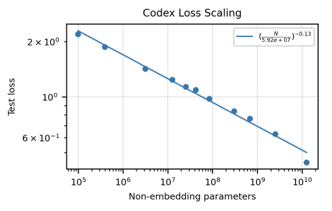
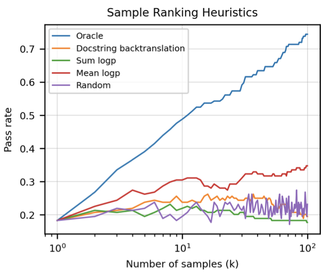
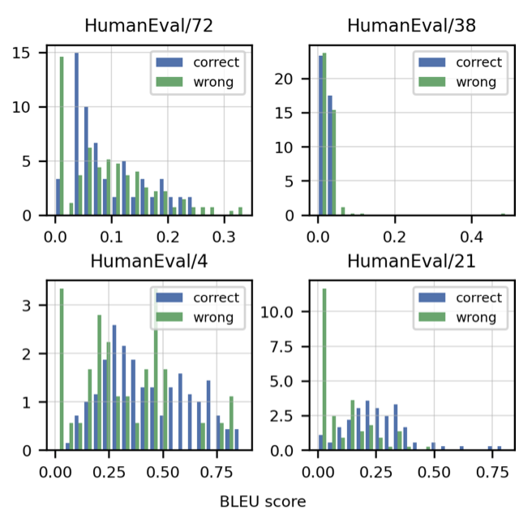
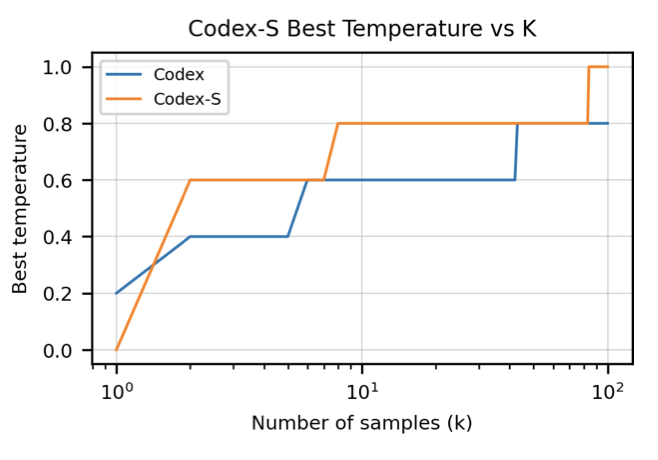
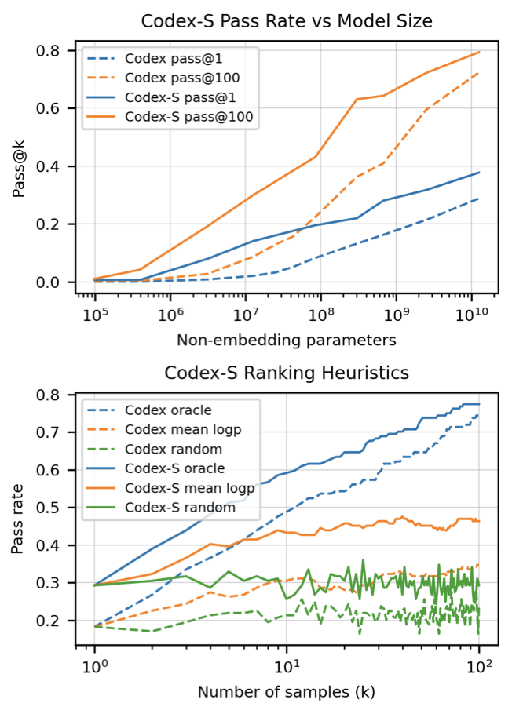
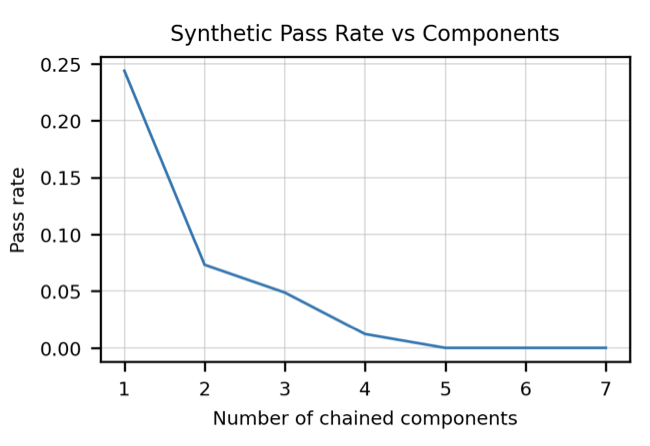
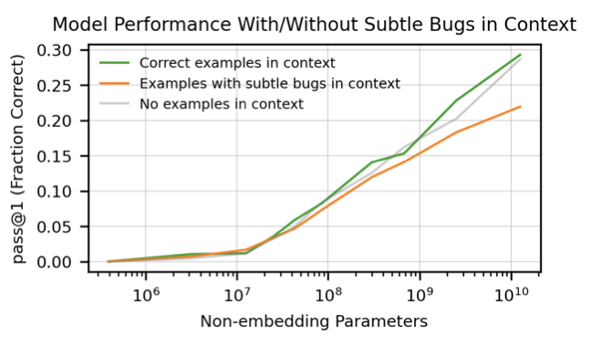

+++
author = "Kurt"
title = "Codex"
date = "2023-12-30"
description = "Evaluating Large Language Models Trained on Code"
categories = [
    "Paper Review"
]
tags = [
    "LLM",
    "Milestone",
]
+++

## Abstract

GitHub에서 공개적으로 사용 가능한 코드에 미세 조정된 GPT 언어 모델인 Codex를 소개하고 그 Python 코드 작성 능력을 연구한다. 이 모델은 GitHub Copilot를 구동하며, 새로운 평가 세트인 HumanEval에서 문제의 28.8%를 해결합니다. 또한, 모델에서 반복 샘플링은 어려운 프롬프트에 대한 해결책을 만드는 데 효과적인 전략이라는 것을 발견하였다. 모델의 한계를 조사하였고, 강력한 코드 생성 기술의 배포가 안전, 보안, 경제 등에 미치는 잠재적인 영향을 논의한다.

---

## Introduction

스케일러블한 시퀀스 예측 모델들은 자연어 처리, 컴퓨터 비전, 오디오 및 음성 처리, 생물학, 다중 모달리티 등 다양한 분야에서 생성 및 표현 학습의 일반적인 방법으로 사용되고 있다. 최근에는 언어 모델들이 대규모 데이터셋에서 코드를 활용하고 이를 통해 학습된 프로그래밍 능력을 바탕으로 프로그램 합성이라는 도전적인 문제를 해결하는데 기여하고 있다. 또한, masked language modeling과 span prediction과 같은 인기 있는 언어 모델링 방법들이 프로그래밍 학습을 위해 적용되고 있다.

초기 GPT-3 연구에서는 Python docstrings로부터 간단한 프로그램을 생성할 수 있다는 사실을 발견하였다. 이는 GPT-3가 명시적으로 코드 생성을 위해 학습되지 않았음에도 불구하고 가능했다. 이러한 성공과 공개적으로 사용 가능한 코드의 풍부함을 바탕으로, Codex라는 특화된 GPT 모델이 다양한 코딩 작업에서 탁월하게 수행될 수 있을 것이라고 가정하였다. 이 논문은 GitHub Copilot과 OpenAI API에 사용된 초기 Codex 모델들에 대해 설명하고 있다.

이 연구에서는 docstrings에서 Python 함수를 생성하는 작업에 집중하고, 이를 유닛 테스트를 통해 자동으로 평가한다. 이를 위해 언어 이해, 알고리즘, 간단한 수학을 평가하는 164개의 프로그래밍 문제 데이터셋을 만들었다.

모델로부터 여러 샘플을 생성해 유닛 테스트를 통과하는지 확인한다. 12B parameter의 Codex는 단일 샘플로 28.8%의 문제를 해결하며, 300M parameter의 Codex는 13.2%를 해결한다. 반면, 6B parameter의 GPT-J는 동일한 데이터셋에서 11.4%를 달성하며, 모든 GPT 모델은 거의 0%에 가깝다. docstrings에서 함수를 합성하는 작업을 개선하기 위해, 이 연구에서는 Codex를 독립적으로, 올바르게 구현된 함수들에 대해 미세조정하였고, 결과적으로 생성된 Codex-S 모델은 문제들 중 37.7%를 단일 샘플로 해결한다.

실제 프로그래밍 작업은 접근 방식의 반복과 버그 수정을 포함하는데, 이는 모델로부터 여러 샘플을 생성하고 모든 유닛 테스트를 통과하는 샘플을 선택하는 것으로 모사할 수 있다. 100개의 샘플 내에서, Codex-S는 문제들 중 77.5%에 대해 적어도 하나의 올바른 함수를 생성할 수 있다. 실제로, mean log-probability가 가장 높은 샘플이 문제들 중 44.5%에서 유닛 테스트를 통과하였다.

---

## Evaluation Framework

pass@k 메트릭을 정의하고 그 장점을 설명하며, 모델 평가를 위해 만든 "HumanEval"이라는 수기로 작성된 문제 데이터셋에 대해 설명한다. 마지막으로, 모델이 생성한 코드를 안전하게 실행하기 위해 사용한 샌드박스 환경에 대해 이야기한다.

### Functional Correctness

코드 생성 모델은 보통 샘플을 reference 솔루션과 비교하여 평가되지만, 이런 match-based metric에는 결점이 있다. 특히, Ren et al. (2020)은 BLEU 점수가 코드의 의미적 특징을 정확히 포착하지 못한다는 문제를 지적하고, 점수를 수정하는 여러 방안을 제안하였다.

match-based metric은 reference 솔루션과 기능적으로 동일한 프로그램의 복잡한 공간을 설명하지 못한다. 이에 따라, 최근 연구들은 샘플이 단위 테스트를 통과하면 정확하다고 판단하는 기능적 정확성을 사용하였다. 이 지표는 문서 문자열에 따른 코드 생성에도 적용되어야 한다고 주장한다.

기능적 정확성 평가의 중요성은 인간 개발자들이 코드를 판단하는 기준으로 사용하기 때문이다. 테스트 주도 개발 프레임워크는 성공을 테스트를 통과하는 프로그램으로 정의하며, 대부분의 조직에서는 새로운 코드 통합이 단위 테스트의 생성 및 통과에 의존한다.

Kulal et al. (2019)은 pass@k 지표를 사용해 기능적 정확성을 평가하였다. 이는 문제마다 $k$개의 코드 샘플을 생성하고, 그 중 하나라도 단위 테스트를 통과하면 문제가 해결된 것으로 간주한다. 하지만 이 방식은 변동성이 높을 수 있다. 따라서 각 작업마다 $n$개의 샘플을 생성하고, 단위 테스트를 통과한 샘플의 수를 세어, 편향되지 않은 추정치를 계산한다. 이 논문에서는 $n = 200, k ≤ 100$을 사용하였다.

$$ pass@k := \underset{Problem}{\mathbb{E}} \big[ 1 - \begin{pmatrix} n-c  \\\ k \end{pmatrix} / \begin{pmatrix} n  \\\ k \end{pmatrix} \big]  $$

이 추정치를 직접 계산하면 큰 수와 수치적 불안정성이 발생한다. pass@k를 $1 − (1 − \hat{p})$로 추정하려는 유혹이 있을 수 있지만, 이 방법은 편향되다. 여기서 $\hat{p}$는 pass@1의 경험적 추정치이다.

BLEU 점수가 기능적 정확성의 신뢰할 수 있는 지표가 아님을 증명한다. 참조 솔루션과 일치하지 않는 프로그램이 종종 기능적으로 동등한 프로그램보다 더 높은 BLEU 점수를 얻는 것을 통해 이를 보여준다.

### HumanEval: Hand-Written Evaluation Set

HumanEval 데이터셋이라 불리는 164개의 수기로 작성된 프로그래밍 문제에서 기능적 정확성을 평가한다. 각 문제에는 테스트가 평균 7.7개 포함되어 있다. 이러한 작업이 수기로 작성되어야 하는 이유는, 이 모델이 GitHub의 큰 부분에서 학습되며, 이미 다양한 출처의 문제 해결책이 포함되어 있기 때문이다.

HumanEval 데이터셋의 프로그래밍 작업은 언어 이해, 추론, 알고리즘, 그리고 간단한 수학을 평가한다.

### Sandbox for Executing Generated Programs

공개 프로그램의 의도가 불분명하고 생성된 프로그램이 잘못될 수 있어, 이들을 실행하면 보안 위험이 생긴다. 실제로, GitHub에는 환경을 변조하는 악성 프로그램들이 포함되어 있다.

신뢰할 수 없는 프로그램을 안전하게 실행할 수 있는 샌드박스 환경을 개발하여, 이 프로그램들이 호스트나 네트워크를 수정하거나, 데이터를 유출하는 것을 방지하였다. OpenAI의 학습 인프라가 Kubernetes와 클라우드 서비스에 기반하므로, 샌드박스는 이들 환경의 제한 사항을 해결하면서도 그들의 사용 패턴에 따라 설계되었다.

주 호스트 보호를 위해 gVisor 컨테이너 런타임을 선택하였다. Docker와 같은 컨테이너 런타임은 호스트 리소스를 공유할 수 있어, 악성 컨테이너가 호스트를 손상시킬 수 있다. gVisor는 호스트의 리소스를 에뮬레이션하여 보안 경계를 설정하고, eBPF 기반의 방화벽 규칙을 통해 네트워크 인접 호스트와 서비스를 보호한다.

---

## Code Fine-Tuning

Codex는 parameter가 최대 12B개인 GPT 모델을 기반으로 하며, 코드 작성에 특화되어 있다. GPT와는 달리 Codex는 HumanEval 데이터셋에서 높은 성능을 보이며, 문제마다 100개의 샘플을 생성하여 가장 적합한 샘플을 선택함으로써 대부분의 문제를 해결할 수 있다. 이는 문제당 한 번의 평가로 제한될 때 특히 중요한 이점을 제공한다.

### Data Collection

2020년 5월, GitHub의 54M 개 공개 소프트웨어 저장소로부터 파이썬 파일 179GB를 수집하여 학습 데이터셋을 구축하였다. 자동 생성 파일, 긴 줄 길이 파일 등을 제외한 최종 데이터셋의 크기는 159GB였다.

### Methods

Codex는 자연어 프롬프트에 대해 평가되며, 이미 강력한 자연어 표현을 가진 GPT-3에서 미세 조정하는 것이 유익할 것으로 가정하였다. 그러나 미세 조정 데이터셋이 크기 때문에 사전 학습된 언어 모델에서 개선 사항을 찾지 못했다. 그럼에도 GPT에서 미세 조정된 모델은 더 빠르게 수렴하므로, 이 방법을 모든 후속 실험에 적용하였다.

Codex 모델 학습에는 GPT 모델과 동일한 learning rate, 175 step의 linear warmup, cosine learning rate decay가 사용되었다. 학습은 총 100B 토큰에 대해 진행되었으며, Adam optimizer와 weight decay coefficient 0.1이 적용되었다.

GPT-3 텍스트 토크나이저를 기반으로 한 code lexer를 사용하여 GPT의 텍스트 표현을 최대한 활용하고 있다. 하지만 GitHub 코드의 단어 분포 차이로 인해 효과적이지 못했고, 특히 공백 인코딩에서 비효율성이 발생하였다. 그래서 다양한 길이의 공백을 표현할 수 있는 추가 토큰을 도입함으로써 코드 표현에 필요한 토큰 수를 약 30% 줄였다.

HumanEval 문제를 해결하기 위해, header, signature, docstring으로 구성된 프롬프트를 만들고, 추가 함수나 구문 생성을 방지하기 위해 특정 정지 시퀀스('\nclass', '\ndef', '\n#', '\nif', '\nprint')를 만날 때까지 Codex에서 토큰을 샘플링한다. 모든 샘플링 평가는 top $p = 0.95$로 nucleus 샘플링을 사용한다.

### Results

검증 세트에 대한 테스트 손실을 Codex 모델 크기에 따라 그래프로 표현하였. 언어 모델 테스트 손실이 모델 크기에 따른 power law를 따르듯이, 코드 미세 조정 후의 테스트 손실도 비슷한 패턴을 보였다. 함수 형태는 $\big( {{N}\over{5.92 \times 10^7}} \big)^{-0.13}$ 이며, 이때 $N$은 임베딩이 아닌 모델 parameter의 수를 나타낸다.

pass@k 평가 시, 샘플링 temperature를 $k$ 값에 맞게 최적화하는 것이 중요하다. 더 큰 $k$ 값에 대해서는 더 높은 temperature가 최적이며, 이는 샘플 집합의 다양성을 증가시키고, 모델이 정확한 해결책을 생성하는지 여부만을 보상하기 때문이다.

679M parameter 모델에서는 pass@1의 최적 temperature가 $T^* = 0.2$, pass@100의 최적 temperature가 $T^* = 0.8$로 확인되었다. 이 temperature를 사용하면, 모델 크기에 따라 pass@1과 pass@100이 부드럽게 확장되는 것을 볼 수 있다.

Pass@k는 유닛 테스트를 알고 있는 오라클이 $k$개의 샘플 중 최상의 샘플을 선택하는 것으로 해석할 수 있다. 하지만 실제 상황에서는 오라클 없이 $k$개의 샘플 중 하나를 선택해야 하는 경우도 있다. 예를 들어, 유닛 테스트가 없는 상황에서 사용자에게 하나의 완성만 제공하고 싶은 자동완성 도구로 모델을 사용하는 경우 등이 있다.

언어 모델링에서 배운 바에 따라, mean token log probability이 가장 높은 샘플을 선택하는 것이 무작위 샘플 평가보다 더 우수한 결과를 보였다. 그러나 sum log probability에 기반해 샘플을 선택하면 무작위 선택보다 약간 성능이 떨어질 수 있다.

모든 Codex-12B HumanEval 샘플에 대해 참조 솔루션과의 BLEU 점수를 계산하였다. 올바른 솔루션과 잘못된 솔루션의 BLEU 점수 분포를 비교하면 상당한 중첩이 보여진. 잘못된 솔루션은 참조 솔루션과 기능적으로 동일하지 않기 때문에, BLEU 점수의 향상이 실제 기능적 정확성의 향상을 반영하지 않을 수 있음을 확인하였다.

### Comparative Analysis of Related Models and Systems

GPT-Neo와 GPT-J는 Codex와 유사한 방식으로 다양한 텍스트 소스와 GitHub 코드 8%를 포함하는 The Pile 데이터셋에서 학습되었다. 연구 커뮤니티는 이 두 모델이 정성적 프로그래밍 평가에서 기존 GPT 시스템을 능가하는 것을 발견하였다.

HumanEval 데이터셋을 사용한 결과, GPT-Neo는 pass@1에서 6.4%, pass@100에서 21.3%를, GPT-J-6B는 pass@1에서 11.6%, pass@100에서 27.7%를 달성하였다. 이는 각각 Codex-85M과 Codex-300M와 유사한 성능을 보여준다. 이 결과는 특정 temperatures에서 평가한 최상의 결과를 기반으로 한다.

코드 자동완성 시스템인 Tabnine의 가장 큰 무료 모델과 Codex를 비교하였다. Tabnine 모델은 $T = 0.4$에서 pass@1에서 2.6%, $T = 0.8$에서 pass@100에서 7.6%를 달성하며, 이는 Codex 모델 중 가장 작은 Codex-12M와 대략적으로 동등하다.

### Results on the APPS Dataset

최근 Hendrycks et al. (2021)은 언어 모델의 코딩 역량을 측정하기 위해 APPS 데이터셋을 소개하였다. 이 데이터셋은 각각 유닛 테스트와 정확한 솔루션 집합을 포함하는 5000개의 학습 예제와 테스트 예제로 구성되어 있다. APPS의 대부분의 문제는 단일 함수 합성이 아니라 전체 프로그램 합성으로, stdin에서 입력을 받고 stdout에 출력하는 형태로 구성되어 있어, 이는 Codex 학습 데이터와는 다르다.

APPS를 소개하는 논문에서는 언어 모델을 벤치마킹하고 모델이 정확한 해결책을 찾는 문제의 비율("strict accuracy")과 잘못된 해결책도 통과하는 유닛 테스트의 비율을 보고한다. 첫 번째 지표의 결과가 낮아서 측정 변동성을 줄이기 위해 후자를 사용하였다. 하지만 이 논문에서는 후자를 피하고 "strict accuracy"에만 초점을 맞추며, 다양한 $k$에 대한 pass@k 수치를 보고한다. 이때 코딩 경쟁에서 알려진 두 가지 추가 요소를 고려한다.

* 코딩 경쟁과 APPS 데이터셋에서, 작업 설명에 포함된 3개의 입력/출력 예제를 사용한다. 이를 활용해 모델에서 1000개의 솔루션을 샘플링하고, 이 3개의 유닛 테스트를 통과하는 솔루션만 필터링한다. 이 필터링된 세트에서의 통과율을 계산하며, 이를 필터링된 pass@k라고 부른다. 필터링을 하지 않은 결과는 raw pass@k로 표시된다.

* 코딩 경쟁이나 Codex의 결과에서 올바른 해결책이 찾아졌지만 알고리즘적으로 충분히 효율적이지 않아 통과되지 않는 경우가 많다. 이런 상황이 경쟁에서는 허용되지 않지만, Codex가 생성하는 솔루션 중 어떤 유닛 테스트에서도 실패하지 않지만 일부에서 시간 초과가 발생하는 경우도 보고하고 있다. 이때, 평가에서는 3초의 시간 초과를 사용한다.

Codex가 APPS에서 미세 조정되지 않았기 때문에, 작업 설명의 입력/출력 예제를 docstring에 포맷팅 힌트로 추가하였다. 이런 방식을 "1-shot"이라고 부르며, 1-shot으로 평가 Codex12B는 APPS에서 미세조정된 GPT-Neo 모델 비슷한 성능을 보여준다. 작업당 최대 1000개의 샘플을 생성하고 평가하는 것이 유익하다는 이전 결과와 일관성을 보이지만, 더 어려운 문제에서는 솔루션이 시간 제한을 넘기기에 충분히 효율적이지 않다. 또한, 각 문제의 3개의 공개 유닛 테스트를 통과하는 첫 샘플을 평가하는 것이 raw pass@100 샘플보다 높은 성능을 보여준다.

---

## Supervised Fine-Tuning

GitHub의 파이썬 코드는 다양한 요소를 포함하고 있으며, 이들은 문서 문자열에서 함수를 생성하는 것과는 관련성이 없어 보인다. 이런 분포의 불일치는 HumanEval 성능 저하를 초래할 수 있다는 가설을 제시하고 있다.

Codex를 특정 작업 분포에 적응시키기 위해, 올바르게 구현된 함수들로부터 학습 문제를 만들어 추가적인 감독 하에 미세 조정을 진행한다. 이 예시들은 경쟁 프로그래밍 사이트와 지속적인 통합이 있는 저장소에서 수집하였다. 이렇게 미세 조정된 모델들을 Codex-S라 부르며, 이 모델들은 모든 크기의 모델에서 성능 향상을 보이고 있다.

### Problems from Competitive Programming

프로그래밍 대회와 인터뷰 준비 사이트들은 숨겨진 단위 테스트를 통해 제출된 코드의 정확성을 자동으로 평가한다. 이 문제들은 완결성이 있고, 잘 작성된 문제 설명과 뛰어난 테스트 커버리지를 가지고 있다. 또한, 다양한 핵심 기술과 난이도에서의 알고리즘적 추론 능력을 테스트한다.

여러 프로그래밍 대회 및 인터뷰 준비 사이트에서 문제, 함수 시그니처, 솔루션을 수집하여, 문제 설명을 문서 문자열로 사용해 HumanEval과 비슷한 프로그래밍 작업으로 구성하였다. 완전한 테스트 세트가 종종 숨겨져 있어, 문제 설명에 있는 예시로 단위 테스트를 만들거나, 틀린 솔루션을 제출해 추가 테스트 케이스를 추출하였다. 이런 방법으로 총 10,000개의 문제를 정리하였다.

### Problems from Continuous Integration

오픈 소스 프로젝트로부터 프로그래밍 문제들을 수집하였고, *sys.setprofile*을 이용하여 통합 테스트 중에 호출된 모든 함수의 입력과 출력을 추적하였다. 이렇게 수집한 데이터는 각 함수에 대한 단위 테스트를 생성하는 데 활용되었다.

continuous integration(CI)을 사용하는 프로젝트는 추적에 적합하다. CI 설정 파일의 명령을 이용하여 가상 환경을 설정하고, 의존성을 설치하며, 통합 테스트를 실행한다.

인기 있는 CI 도구인 travis와 tox를 사용하는 GitHub 저장소를 고려하였다. 또한, python package index(PyPI)의 pip 패키지에서 공개된 소스 코드를 사용하였다. 이러한 프로젝트들이 신뢰할 수 없는 코드를 포함하고 있기 때문에, 통합 테스트를 격리된 환경에서 실행하는 것이 중요했다.

수백만 개의 잠재적인 함수가 있지만, 모든 함수가 입력을 받고 출력을 반환하지 않아서 약 4만 개의 함수만을 수집했다. 또한 대부분의 런타임 객체는 프로젝트가 설치되지 않으면 샌드박스 외부에서 복구할 수 없다.

이 논문의 추적 방법은 모든 호출된 함수에 대한 입력과 출력을 생성하므로, 프로젝트에서 가져온 내장함수와 라이브러리 호출까지 문제로 변환되었다. 이로 인해 추적된 함수들은 주로 커맨드 라인 유틸리티의 구성 요소가 되었다. 이 작업에서 모델이 필요한 것은 고급 알고리즘과 데이터 구조를 이해하는 것이 아니라, 문서 문자열에 명시된 기능을 구현하기 위한 지시사항을 따르는 능력이다. 따라서, 추적은 코딩 경쟁 문제의 퍼즐 성격을 보완하고 작업의 분포를 확대한다.

### Filtering Problems

학습 문제를 자동으로 생성하는 두 가지 방법을 제시했지만, 품질을 어떻게 관리할지는 불명확하다. 일부 프롬프트는 함수를 충분히 명시하지 않아, 유효한 해결책이 잘못 판정될 수 있으며, 일부 문제는 상태를 유지하기 때문에 실행 결과가 다를 수 있다.

문제점을 해결하기 위해, 각 문제에 대해 Codex-12B를 사용하여 100개의 샘플을 생성한다. 만약 단위 테스트를 통과하는 샘플이 없다면, 그 작업을 모호하거나 너무 어렵다고 판단하여 제외한다. 상태를 유지하는 문제나 비결정적인 문제를 제거하기 위해 이 검증 과정을 여러 번 반복하였다.

### Methods

학습 문제들에서 Codex를 미세 조정하여 CodexS라는 "supervised fine-tuned" 모델 집합을 만들었다. 학습 문제에서 예시를 만들기 위해, 문제들을 특정 형식으로 조립하였고, 배치에서 프롬프트의 길이가 다르면 가장 긴 프롬프트 길이에 맞추기 위해 짧은 프롬프트를 왼쪽으로 패딩하였다.

참조 솔루션의 negative log-likelihood를 최소화하도록 학습하며, 프롬프트의 토큰에 대한 손실은 마스킹한다. Codex 미세 조정에 사용된 learning rate의 1/10 크기로 학습하고, 동일한 learning rate 일정을 따라 validation 손실이 안정화될 때까지(10B 토큰 미만) 학습한다.

### Results

$1 ≤ k ≤ 100$에 대해 pass@k를 평가하기 위한 최적의 temperature를 계산한다. Codex-S가 모든 $k > 1$에 대해 약간 더 높은 temperature를 선호한다는 것을 발견했는데, 이는 Codex-S가 Codex보다 좁은 분포를 캡처한다는 것을 반영할 수 있다. pass@1을 계산하기 위해 $T^∗ = 0$을, pass@100을 계산하기 위해 $T^∗ = 1$을 사용한다.

pass@1과 pass@100에서 Codex-S와 Codex를 비교했을 때, Codex-S는 pass@1에서 평균 6.5%, pass@100에서 평균 15.1%로 Codex를 능가하였다.

다양한 샘플 선택 휴리스틱의 성능을 Codex-S-12B와 Codex-12B에서 비교하였다. 샘플을 mean log probability로 순위를 매길 때, 무작위 순위에 비해 평균적으로 11.6$의 이익이 있었고, 이는 Codex에 비해 2% 이상 높았다.

---

## Docstring Generation

코드가 보통 docstring 뒤에 오기 때문에 Codex를 이용해 docstring로부터 코드를 생성하는 것은 가능하지만, 코드로부터 docstring을 생성하는 것은 어렵다. 그러나, 생성된 코드의 의도를 설명할 수 있는 docstring 작성 모델을 만드는 것이 중요하다고 판단하였다. 이전 섹션에서 설명한 학습 문제를 이용하면, 코드에 따른 docstring 생성을 위한 학습 데이터셋을 쉽게 만들 수 있다.

각 학습 문제에 대해, function signature, reference solution, docstring을 연결하여 학습 예제를 만든다. Codex-S를 학습시키는 것과 같은 방법으로, docstring의 negative log-likelihood를 최소화함으로써 docstring 생성 모델인 Codex-D를 학습시킨다.

코드 생성 모델을 평가할 때, 단위 테스트를 통과하는지에 따라 정확성을 측정한다. 그러나 docstring 샘플의 자동 평가는 어렵다. 그래서 docstring이 코드를 정확하게 명시하면 올바르다고 판단하여 수동으로 평가한다. 이 과정이 시간이 많이 걸리므로, temperature가 0.8인 Codex-D-12B에서 총 1640개 문제에 대해 문제 당 10개 샘플만 평가하였다.

Codex-D는 docstring과 함께 잘못된 단위 테스트를 생성하는 경향이 있지만, 이들은 평가에서 제외된다. 모델이 코드 본문을 docstring로 그대로 복사하는 경우는 올바르지 않다고 판단한다. 가장 흔한 실패 사례는 중요한 세부 정보를 누락하거나 함수 이름에 과도하게 의존하여 함수 본문과 무관한 문제를 생성하는 경우이다.

Codex-D의 통과률은 Codex-S와 비슷하지만 약간 낮다. 어떤 방법이 더 높은 통과률을 가져올지는 명확하지 않다. docstring 생성은 구문이 코드보다 덜 엄격하므로 더 유연할 수 있지만, 개발자들이 docstring 작성에 덜 시간을 쏟는 경향이 있어 품질이 떨어질 수 있다. 실제로, 모델은 "I just found this function online"나 "This test is not correctly written and it’s not my solution"와 같은 docstring을 생성하기도 한다.

docstring 모델을 이용하면 $k$개의 샘플 중 하나를 선택하는 새로운 방법이 있다. mean log probability이 가장 높은 샘플을 선택하는 대신, 실제 docstring에 대한 생성된 샘플의 확률을 최대화하는 샘플을 선택할 수 있다. 하지만, 이 방법은 mean log probability 순위보다 성능이 떨어지며, 무작위 순위보다는 좋지만 빠르게 과적합하는 경향이 있다.

---

## Limitations

Codex는 HumanEval 문제 대부분에 대해 올바른 해결책을 제시할 수 있지만, 여러 가지 한계를 가지고 있다.

첫째, Codex의 학습이 효율적이지 않다. 학습 데이터셋은 GitHub의 대부분의 Python 코드를 포함하며, 수백만 줄에 달한다. 이런 양의 코드를 경험하는 개발자는 거의 없다. 실제로, 컴퓨터 과학 입문 과정을 수료한 우수한 학생이라면 Codex-12B보다 더 많은 문제를 해결할 것으로 예상된다.

다음으로, Codex가 실패하거나 예상치 못한 동작을 보일 수 있는 상황을 살펴보았다. 코드 생성 평가는 이미 많이 연구되었지만, 대부분의 기존 지표들은 특정한 문제 상황에서의 성능을 측정한다. 그래서 코드 생성 모델의 능력을 측정하기 위한 새로운 지표 세트를 개발하였다. 이를 적용해보니, Codex는 문법적으로 잘못되거나 정의되지 않은 코드를 추천하거나, 범위를 벗어난 함수나 변수를 호출하는 등의 문제가 있었다. 또한, 복잡하고 고수준의 사양을 다루는 데에 어려움을 겪었다.

docstring의 길이가 증가할수록 모델 성능이 저하되는 것을 확인하기 위해, 입력 문자열을 수정하는 13개의 기본 블록으로 구성 합성 문제 데이터셋을 만들었다. 결과적으로, docstring에 연결된 블록 수가 증가하면 모델 성능이 지수적으로 감소하는 것을 발견하였다. 이는 인간 프로그래머의 특성과는 달리, 체인의 길이가 길어져도 프로그램을 올바르게 구현할 수 있어야 한다는 점에서 차이가 있다.

다른 모달리티의 text-conditional generative 모델이 객체에 속성을 연결하는 데 어려움을 겪는 것처럼, Codex도 연산을 변수에 연결하는 데 문제를 일으킬 수 있다. 특히, docstring에 연산과 변수의 수가 많을 때 이런 문제가 발생한다. 예를 들어, Codex-12B는 변수를 감소시키지 않고, 모든 숫자의 곱을 반환하지 않는 실수를 범하였다.

Codex의 시스템 수준 합성 능력의 한계에 대한 이해는 그것을 생성 용도로 사용할 때의 잠재적 위험성과 그것이 미치는 사회적 영향을 평가하는 데 도움이 된다.

---

## Broader Impacts and Hazard Analysis

Codex는 새로운 코드베이스에 사용자를 도입하거나, 개발자의 컨텍스트 전환을 줄이는 등 다양하게 활용될 수 있다. 비프로그래머가 사양을 작성하고 Codex가 그것을 구현하는 것도 가능하다. 교육과 탐색에도 활용될 수 있지만, 동시에 중요한 안전 문제를 제기하며, 항상 사용자의 의도를 반영하는 코드를 생성하지는 않으며, 오용될 위험이 있다.

Codex를 생성 용도로 사용할 때의 위험성을 파악하기 위해, 잠재적인 위험 요인을 식별하는 위험 분석을 진행하였다.

이 논문의 일부 발견은 연구 중심의 Codex 모델에서 파생된 생산 중심의 Codex 모델의 배포를 위한 작업에 기반하고 있지만, 이 부분은 특정 제품의 안전 기능에 대한 전체 설명을 제공하려는 것은 아니다. 이 논문에서 설명하는 모델의 특정 속성에 기반한 분석을 공유하며, 이는 코드 생성 시스템의 더 넓은 범주에 일반화되고, 기계 학습 연구 프로젝트의 일부로 상세한 영향 분석을 수행하는 규범을 장려하려는 것이다.

이 섹션에서 위험에 주로 초점을 맞추는 것은 이 기술의 영향이 전부 부정적일 것으로 생각한다는 것이 아니다. 오히려, 위험 요소는 미묘하거나 주의가 필요하기 때문에 주목을 받아야 하며, 이익은 대부분의 사용자와 이해관계자들에게 더 명확하고 자동적으로 느껴질 것으로 예상하기 때문이다.

### Over-reliance

코드 생성 모델을 실제로 사용할 때 주요 위험 중 하나는 생성된 출력에 과도하게 의존하는 것이다. Codex는 사용자의 의도와는 다른 솔루션을 제안할 수 있어, 특히 초보 프로그래머에게 문제를 일으킬 수 있다. 또한, 안전하지 않은 코드를 제안하는 가능성이 있어, 인간의 감독과 경계가 필요하다.

과도한 의존성 등의 문제에 대해 더 많은 연구가 필요하다고 생각하며, 이를 위해 사용자에게 모델의 한계를 알려주는 문서를 제공하는 것이 중요하다고 강조하고 있다. 사용자의 경험 수준, UI 디자인, 작업 등에 따라 실제로 경계를 유지하는 방법을 식별하기 위한 실증적인 조사가 필요하며, "automation bias"에 대비하는 것이 점점 더 어려워질 수 있다는 점을 고려해야 한다.

### Misalignment

다음 토큰 예측 목표에 따라 학습된 Codex와 같은 큰 언어 모델들은 학습 분포와 가장 비슷한 코드를 생성한다. 이로 인해, 이런 모델들은 더 도움이 될 수 있음에도 불구하고 사용자에게 도움이 되지 않는 행동을 할 수 있다. 예를 들어, 사용자의 코드에 있는 미묘한 오류에도 불구하고 Codex는 올바른 것처럼 보이지만 실제로는 잘못된 코드를 제안할 수 있다.

이것은 alignment failure 으로, 모델이 사용자의 의도와 일치하지 않는다. 간단히 말해, 시스템이 우리가 원하는 작업을 할 수 있음에도 불구하고 선택적으로 하지 않는다면, 이는 misaligned이다. 반면, 시스템이 능력이 없어서 작업을 수행하지 못한다면, 그것은 그저 무능한 것이지, misaligned는 아니다.

misalignment를 연구하는 것은 중요한데, 이는 시스템의 능력이 향상됨에 따라 더 악화될 가능성이 있는 문제이기 때문이다. 예를 들어, 모델 크기 확장 추세를 보면, 데이터, parameter, 학습 시간이 증가할수록 misalignment는 지속되고 심화될 것으로 예상된다.

현재 모델에서의 misalignment가 중대한 피해를 입힐 가능성은 낮지만, 모델의 능력이 향상됨에 따라 위험성이 증가하고 제거하기 어려워질 것으로 예상된다. 사용자 승인에 기반한 학습을 받은 높은 능력을 가진 모델이라도, 정렬이 제대로 되지 않으면 사용자에게는 좋아 보이는 코드를 생성하지만, 실제로는 바람직하지 않거나 해로운 결과를 초래할 수 있다.

### Bias and representation

인터넷 데이터로 학습된 언어 모델인 Codex가 인종차별적, 모욕적 또는 유해한 출력을 생성할 수 있다는 것이 발견되었다. 더불어, Codex는 성별, 인종, 감정, 계급, 이름의 구조 등에 대한 스테레오타입을 반영하는 코드를 생성할 수 있다. 이는 특히 Codex에 과도하게 의존하는 사용자들에게 중요한 안전 문제를 야기할 수 있다. 이러한 위험을 완화하기 위해 출력의 필터링, 문서화, 그리고 다른 방법의 개입이 필요할 수 있다.

### Economic and labor market impacts

코드 생성 기능은 프로그래머의 생산성을 증가시켜 소프트웨어 제작 비용을 줄이는 방식으로 경제와 노동 시장에 영향을 미칠 수 있다. 그러나 엔지니어들이 하루종일 코드를 작성하지 않는 점, 그리고 다른 중요한 업무들을 수행해야 한다는 점 때문에 이 효과는 제한적일 수 있다. 또한 Codex가 패키지를 다른 비율로 가져오므로 일부 패키지 작성자들에게 유리할 수 있다. 시간이 지나며 이러한 기술의 능력이 향상되면 소프트웨어 관련 노동 시장과 일반 경제에 더 큰 영향을 미칠 수 있다. 이에 대한 추가 연구가 필요하다.

### Security implications

Codex는 보안 환경에 영향을 미칠 수 있다. Codex가 취약한 코드를 생성할 수 있으므로, 적절한 예방 조치 없이는 이를 실행하거나 신뢰하기 전에 전문가가 검토해야 한다. 미래의 코드 생성 모델은 더 안전한 코드를 생성할 수 있으나, 이는 확실하지 않다.

Codex는 사이버범죄를 지원하는 데 잘못 사용될 수 있지만, 현재의 기능 수준에서는 악성 소프트웨어 개발의 진입 장벽을 실질적으로 낮추지 않는다고 판단된다. 더 강력한 코드 생성 모델이 미래에 발전할 것으로 예상되므로, 완화책에 대한 추가 연구와 모델 능력의 지속적인 연구가 필요하다.

Codex와 같은 비결정적 시스템의 특성은 더 진보된 악성 소프트웨어를 가능하게 할 수 있다. 이러한 특성은 동일한 작업을 수행하는 다양한 소프트웨어를 생성하는 것을 용이하게 한다. 이는 전통적인 악성 소프트웨어 탐지 및 안티바이러스 시스템에 도전을 제시하며, 더 능력 있는 코드 생성 모델은 다양한 형태의 악성 소프트웨어를 생성하는 기법을 발전시킬 수 있다. 단기적으로는 액세스 제한 및 오용 모니터링 같은 보안 전략이 이 위협을 관리할 수 있지만, 더 능력 있는 모델이 개발됨에 따라 그 효과는 제한적일 수 있다.

Codex와 같은 거대 언어 모델은 학습 데이터 내의 패턴을 학습할 수 있으며, 이로 인해 소스 코드의 민감한 데이터가 모델에 의해 예측될 수 있다. Codex는 공개 저장소에서 학습되므로, 학습 데이터의 민감한 정보는 이미 유출되었다고 간주된다. 또한, 공개 데이터는 공격자가 학습 데이터를 손상시켜 특정 모델 동작을 유발할 수 있음을 보여주는 이전 연구에 따라 신뢰할 수 없는 것으로 취급되어야 한다.

### Environmental impacts

Codex와 같은 대형 생성 모델은 학습과 추론에서 에너지를 소비한다. GPT-3-12B의 원래 학습과 Codex-12B의 미세 조정은 대량의 컴퓨팅을 소비하였으며, 이러한 학습은 탄소 크레딧을 구입하고 재생에너지를 확보하는 플랫폼에서 이루어졌다. 컴퓨팅 소비는 공급 체인 비용을 발생시키며, 특정 지역에 집중될 수 있다. 장기적으로 볼 때, 코드 생성의 컴퓨팅 요구사항은 도전적인 문제를 해결하는 데 많은 추론이 사용되면 Codex의 학습보다 훨씬 커질 수 있다.

### Legal implications

생성된 코드에는 몇 가지 법적 고려 사항이 있으며, 인터넷 데이터를 활용한 AI 시스템 훈련은 이전에 "fair use"의 사례로 지적된 바 있다.

예비 연구에 따르면, Codex 모델이 학습 데이터와 동일한 코드를 생성하는 경우는 매우 드물다. 이런 경우는 주로 학습 데이터에서 반복적으로 나타나는 프로그래밍 언어의 일반적인 표현이나 관례를 반영한 것으로, 특정 코드를 보존하거나 복사하는 것이 아니라 모델의 예측 가중치 때문이다.

생성된 코드는 사용자의 입력에 반응하고 맞춤화되며, 사용자는 코드의 편집과 승인을 완전히 통제한다. 이는 완성된 작품이 저자의 것으로 간주되는 자동 제안이나 자동 완성 기능과 비슷하게, 코드 생성을 다른 저작 도구의 기능으로 볼 수 있다.

코드 생성 시스템의 지적 재산권에 관한 넓은 이슈에 지속적으로 주의를 기울이면서 책임감 있는 안전한 AI를 추구하고 있다. 이를 통해 시스템 사용자들이 확신을 가지고 이를 배포할 수 있도록, 정책 입안자와 전문가들과 계속 협력할 계획이다.

### Risk mitigation

Codex와 같은 모델은 사용으로 인한 해를 최소화하고 긍정적인 사회적 영향을 극대화하기 위해 신중하게 개발되고 사용되어야 한다. 효과적인 위험 분석과 완화를 위해 문맥적 접근이 중요하며, 코드 생성 모델 배포에서는 항상 고려해야 할 중요한 완화책이 있다.

세심한 문서화, 사용자 인터페이스 디자인, 코드 검토 요구사항 등을 통해 과도한 의존성, 공격적인 콘텐츠, 불안전한 코드 생성 등의 문제를 줄일 수 있다. 서비스로 제공되는 모델의 경우 사용자 검토, 사용 사례 제한, 모니터링 등의 정책이 악의적 사용을 줄이고, 모델이 잘 맞지 않는 고위험 영역에서의 사용을 방지하는 데 도움이 될 수 있다.

---

## Related Work

딥러닝의 발전은 프로그램 학습 분야를 크게 발전시켰으며, 이에는 프로그램 유도와 프로그램 합성이라는 두 가지 주요 접근법이 있다.

프로그램 유도에서는 모델이 잠재적 프로그램 표현에서 직접 출력을 생성한다. 초기 모델은 간단한 덧셈이나 기억 작업을 수행할 수 있었고, 후속 연구에서는 Neural Turing Machine, memory network, Neural GPU 등의 개념이 도입되었다. 최근에는 "Neural Program Interpreter"와 "Universal Transformer" 같은 접근법에서 recurrence가 프로그램 유도에 유용하다는 것이 발견되었다.

프로그램 합성에서는 모델이 자연어 명세에서 프로그램을 명시적으로 생성한다. 초기 접근법에서는 probabilistic context free grammar (PCFG)을 사용하여 프로그램의 abstract syntax tree (AST)를 생성했고, 이후 연구에서는 state vector를 학습하여 더욱 개선하였다. 이 아이디어는 text-to-code 검색과 text-conditional 코드 생성에 활용되었으며, AST는 code-to-text 생성에도 사용될 수 있음이 밝혀졌다.

프로그램은 AST를 거치지 않고도 합성될 수 있다. 이를 통해 코드가 자연어보다 더 예측 가능하다는 것이 밝혀졌고, 문자 수준의 언어 모델이 실제 코드를 생성할 수 있는 능력이 입증되었다. 또한, 소스 코드 내의 함수를 예측하는 모델이 프로그램 검색을 안내하는 데 사용되었다.

대규모 자연어 모델의 성공을 따라 대규모 transformer가 프로그램 합성에도 적용되었다. CodeBERT는 함수와 docstring을 학습시켜 코드 검색에서 좋은 결과를 얻었고, PyMT5는 T5 목표를 사용하여 프로그램의 서명, docstring, 본문 사이를 번역하는 시스템을 학습시켰다.

Codex 모델은 함수적 정확성을 기준으로 벤치마크하였고, 샘플링이 많을수록 성능이 향상되었다. 가상코드에서 코드를 생성하는 SPoC, 프로그래밍 언어 간 번역을 수행하는 TransCoder, 대조적인 코드 모델을 학습하는 ContraCode 등 다양한 접근법이 제시되었다. 특히, 함수적 정확성이 모델의 능력을 더 잘 포착하고, beam search를 통해 여러 샘플을 합성하는 것이 가장 효과적인 방법이었다는 연구 결과도 있다.

neural 프로그래밍 시스템 벤치마크에 사용된 초기 데이터셋인 FlashFill과 Hearthstone 이후, 더 넓고 어려운 데이터셋이 주를 이루게 되었다. GitHub에서 Python 코드를 스크랩한 Barone & Sennrich의 데이터셋, 여러 프로그래밍 언어 데이터로 구성된 CodeSearchNet 챌린지, 그리고 여러 프로그래밍 벤치마크를 집계한 CodeXGLUE 등이 제안되었다. 특히, 가장 최근에는 Codeforces 웹사이트의 문제를 기반으로 한 APPS 벤치마크가 이 논문의 평가 작업에 중요한 역할을 하였다.

코딩은 docstring에서 코드를 생성하는 것 이상의 넓은 활동 범위를 가지고 있다. transformer를 활용한 단위 테스트 생성, 사용자가 수락한 완성 항목에 기반한 자동 완성 도구 훈련 등 다양한 접근이 연구되고 있다. 버그를 찾아내고 수정하는 작업에도 다양한 기법이 사용되었으며, 최근에는 버그 수정을 버그가 있는 프로그램에서 올바른 프로그램으로의 신경 기계 번역으로 간주하는 연구도 있다. 그러나, 이런 접근법들은 테스트 스위트의 제한성을 드러내며, 프로그램의 정확성을 평가하는 데 있어 도전적인 문제가 있음을 보여준다.

---

## Conclusion

자연어 docstring에서 기능적으로 정확한 코드를 생성하는 대규모 언어 모델을 학습시키는 가능성을 조사하였다. GitHub에서 미세 조정된 코드를 통해, Codex 모델은 인간이 작성한 문제 데이터셋에서 높은 성능을 보였다. 모델 성능은 평가 세트와 유사한 분포에서 학습하거나 여러 샘플을 생성함으로써 향상될 수 있었다. 또한, 코드 본문에서 docstring을 생성하는 역방향 작업을 수행하는 모델 학습도 가능했다. 마지막으로, 코드 생성 모델의 광범위한 영향과 한계를 논의하였으며, 아직도 상당한 개선 여지가 있음을 확인하였다.

---

## Reference

* [Paper](https://arxiv.org/pdf/2107.03374.pdf)
* [Github](https://github.com/openai/human-eval)