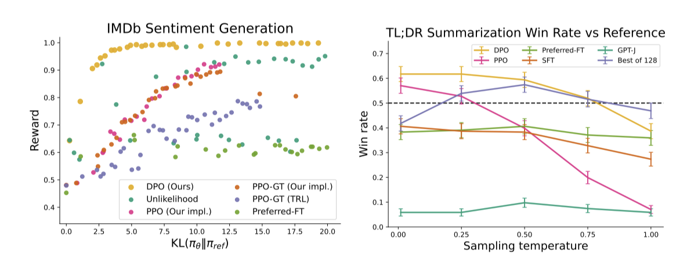
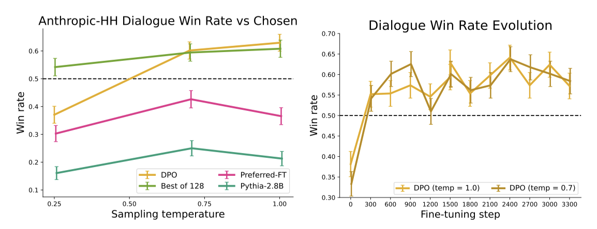
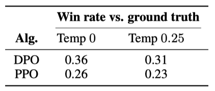

+++
author = "Kurt"
title = "Direct Preference Optimization"
date = "2024-03-31"
description = "Your Language Model is Secretly a Reward Model"
categories = [
    "Paper Review"
]
tags = [
    "LLM",
    "Milestone",
]
+++

## Abstract

이 논문에서는 대규모 unsupervised 언어 모델(LM)의 행동을 인간의 선호도에 맞추어 정밀하게 제어하는 새로운 방법, Direct Preference Optimization(DPO)를 소개한다. 기존의 복잡하고 불안정한 reinforcement learning from human feedback(RLHF) 대신, DPO는 보상 모델의 새로운 parameterization를 통해 단순한 분류 손실만으로 LM을 미세 조정할 수 있게 하여, 안정적이고 계산적으로 가벼운 방법을 제공한다. 실험 결과, DPO는 기존 방법들을 뛰어넘거나 일치하는 수준으로 인간의 선호도에 부합하게 LM을 미세 조정하며, 특히 생성물의 감정 제어와 요약, 단일 턴 대화의 응답 품질에서 우수한 성능을 보여준다.

---

## Introduction

대규모 비지도 언어 모델들은 다양한 인간 데이터에 기반하여 학습되며, 모든 학습 내용이 바람직하지 않을 수 있다. 예를 들어, AI 코딩 어시스턴트에게는 고품질 코딩 능력을, 언어 모델에게는 특정 오해를 사실로 주장하지 않는 능력을 부여하고 싶을 수 있다. 이러한 모델의 원하는 반응과 행동을 선택하는 것은 AI 시스템을 안전하고 효과적으로 제어하는 데 중요하다. 기존에는 강화 학습을 사용했지만, 단순한 binary cross-entropy 목표를 통해 선호도 학습 파이프라인을 단순화할 수 있음을 보여준다.

기존 방법은 인간의 선호를 반영한 선별된 데이터를 사용해 언어 모델에 원하는 행동을 주입한다. 이 과정은 대규모 비지도 사전 학습 후에 이루어지며, 가장 성공적인 방법은 reinforcement learning from human (or AI) feedback (RLHF/RLAIF)이다. RLHF는 인간 선호에 기반한 보상 모델을 사용해 언어 모델이 고품질 응답을 생성하도록 최적화하지만, 이 방법은 감독 학습보다 복잡하고 상당한 계산 비용이 든다.

이 논문은 명시적인 보상 모델링이나 강화 학습 없이도 언어 모델을 인간의 선호에 맞게 최적화할 수 있는 Direct Preference Optimization (DPO) 알고리즘을 제안한다. DPO는 기존 RLHF 알고리즘과 유사한 목표를 달성하지만, 구현과 학습이 더 간단하고 직관적이다. 이 방법은 선호하는 응답을 강화하고 모델 퇴화를 방지하기 위해 동적 중요도 가중치를 사용한다. 또한, DPO는 이론적 선호 모델을 바탕으로 정책 직접에 대한 선호 손실을 정의하며, 인간 선호 데이터를 기반으로 간단한 이진 교차 엔트로피 목적을 사용하여 최적의 정책을 도출할 수 있다.

선호도 기반 언어 모델 훈련을 위한 간단한 Direct Preference Optimization (DPO) 알고리즘을 제안하였다. 실험 결과, DPO는 감정 조절, 요약, 대화 등의 작업에서 최대 6B parameter 언어 모델을 사용하여 기존의 PPO 기반 RLHF 방법만큼 효과적임을 입증하였다.

---

## Related Work

self-supervised 언어 모델은 instruction-tuning을 통해 downstream 작업 성능과 사용자 의도 일치를 크게 향상시킬 수 있다. relative human judgment을 사용하여 LLM을 미세 조정하는 것이 전문가 시연보다 수월하며, 이는 번역, 요약, 스토리텔링, 지시사항 따르기 등의 숙련도를 향상시킨다. 이 과정에서는 먼저 선호도 데이터셋과 호환되는 보상 함수를 최적화한 후, REINFORCE, PPO 같은 강화 학습 알고리즘으로 언어 모델을 미세 조정한다. 또한, 인간 피드백을 활용한 LLM은 추가적인 합성 선호도 데이터 생성에 사용된다. 이는 강화 학습과 인간 선호도 학습을 융합한 연구 분야를 대표하며, RL 없이 상대적 선호도를 최적화하는 이론적 접근을 제공한다.

언어 맥락을 벗어난 선호도 기반 학습은 bandit과 강화 학습 환경에서 모두 연구되었다. contextual dueling bandit(CDB)은 보상 대신 행동의 선호도를 사용하며, 폰 노이만 승자 개념으로 최적 정책을 대체한다. preference-based RL(PbRL)은 알려지지 않은 점수 함수에서 생성된 이진 선호도로부터 학습하며, 대부분 잠재적인 점수 함수를 추정하고 최적화하는 과정을 거친다. 이 연구에서는 선호도를 만족시키는 정책을 직접 최적화하는 새로운 단일 단계 학습 접근 방식을 제안한다.

---

## Preliminaries

Ziegler et al.이 검토한 RLHF 파이프라인은 1) supervised fine-tuning(SFT) 2) 선호도 샘플링 및 보상 학습 3) RL 최적화의 세 단계로 구성된다.

**SFT:** RLHF는 관심 있는 작업을 위한 고품질 데이터로 사전 학습된 LM을 미세 조정하여 시작한다.

**Reward Modelling Phase:** 두 번째 단계에서, SFT 모델은 프롬프트 $x$를 사용해 답변 쌍 $(y1, y2)$을 생성하고, 이는 인간 라벨러에 의해 선호도가 표현된다. 이 선호도는 잠재적인 보상 모델 $r^∗(y, x)$에 의해 가정되며, 여러 모델링 방법 중 Bradley-Terry (BT) 모델이 인기 있다. BT 모델은 인간의 선호도 분포 $p^∗$를 정의한다.

$$ p^*(y 1 > y 2| x) = {{exp(r^∗ (x, y_1))}\over{exp(r^∗ (x, y_1)) + exp(r^∗ (x, y_2))}} $$

$p^∗$에서 샘플링된 데이터셋 D를 사용해 보상 모델 $r_ϕ(x, y)$를 parametrize 하고 최대 likelihood로 parameter를 추정할 수 있으며, 이는 이진 분류 문제로서 negative log-likelihood 손실을 사용한다.

$$ L_R(r_ϕ, D) = - \mathbb{E}_{(x, y_w, y_l)∼D} [ log \ σ(r_ϕ(x, y_w) − r_ϕ(x, y_l)) ] $$

LM에서, rϕ(x, y) 네트워크는 SFT 모델로부터 초기화되고 최종 transformer layer 위에 linear layer가 추가되어 보상 값을 예측한다. 변동성을 줄이기 위해, 보상은 모든 $x$에 대해 평균이 0이 되도록 정규화된다.

**RL Fine-Tuning Phase:** RL 단계에서, 학습된 보상 함수를 사용하여 언어 모델에 피드백을 제공한다. 특히, 다음과 같은 최적화 문제를 설정한다.

$$  \underset{\pi_{\theta}}{max} \mathbb{E}\_{x ∼ D, y ~ \pi_{\theta} (y|x)} [ r_ϕ(x, y) ] - \beta \mathbb{D}\_{KL} [ \pi_{\theta}(y|x) || \pi_{ref}(y|x)] $$

여기서 $\beta$는 초기 SFT 모델 $\pi^{SFT}$로부터의 편차를 제어하는 parameter이다. 언어 모델 정책 $\pi_{\theta}$는 $\pi^{SFT}$로 초기화되며, 추가된 제약은 모델이 정확한 분포에서 벗어나지 않고 다양성을 유지하도록 한다. 이 목표는 강화 학습으로 최적화되며, 표준 방식은 보상 함수 $r(x, y) = r_ϕ(x, y) − \beta(log \pi_{\theta}(y|x) − log \pi_{ref}(y|x))$를 PPO로 최대화하는 것이다.

---

## Direct Preference Optimization

언어 모델의 미세 조정과 같은 대규모 문제에 강화 학습을 적용하는 도전을 극복하기 위해, 선호도를 직접 활용하여 간단한 정책 최적화 방법을 제안한다. 이 방법은 보상 학습 후 RL로 최적화하는 기존 방식과 달리, 특정 보상 모델 parameterization를 통해 RL 없이 최적 정책을 직접 추출한다. 이 연구의 접근법은 보상 함수에서 최적 정책으로의 분석적 매핑을 활용하여, 보상 함수에 대한 손실을 정책에 대한 손실로 변환한다. 이는 명시적인 보상 모델 적합 없이도 인간 선호 모델을 최적화할 수 있게 하며, 정책 네트워크가 언어 모델과 보상을 동시에 나타낸다.

**Deriving the DPO objective.** 이전 연구를 바탕으로, 일반 보상 함수 $r$의 RL 목표에서 시작해, KL-constrained 보상 최대화의 최적 해가 단순한 형태를 가짐을 보여준다.

$$ \pi_r (y|x) = {{1}\over{Z(x)}} \pi_{ref} (y|x) exp \big( {{1}\over{\beta}} r(x, y) \big) $$

분할 함수 $Z(x) = \sum y \pi_{ref}(y|x) exp \beta_r(x, y)$를 추정하는 것은 비용이 많이 들지만, 위 식을 재배열하여 보상 함수를 최적 정책 $\pi_r$, 참조 정책 $\pi_{ref}$, 그리고 알려지지 않은 분할 함수 $Z(·)$의 관점에서 나타낼 수 있다. 이 과정은 먼저 위 식에 로그를 적용하고 대수학적 계산을 통해 이루어진다.

$$ r(x, y) = \beta log {{\pi_r(y|x)}\over{\pi_{ref}(y|x)}} + \beta log Z(x) $$

Bradley-Terry 모델을 사용하면, 두 완성 사이의 보상 차이에만 의존하여, 실제 보상 $r$과 최적 모델 $\pi$에 대한 reparameterization를 적용할 수 있다. 이를 통해 분할 함수가 제거되고, 인간의 선호도 확률을 최적 정책 $\pi$와 참조 정책 $\pi_{ref}$만으로 표현할 수 있게 되며, 최적 RLHF 정책 $\pi$는 선호도 모델을 충족한다.

$$ p^∗ (y_1 > y_2 | x) = {{1}\over{1 + exp \big( \beta log {{\pi^{\ast}(y_2|x)}\over{\pi_{ref}(y_2|x)}} - \beta log {{\pi^{\ast}(y_1|x)}\over{\pi_{ref}(y_1|x)}} \big)}} $$

보상 모델 대신 최적 정책을 기반으로 인간의 선호도 확률을 얻었기 때문에, parametrized된 정책 $\pi_{\theta}$를 위한 maximum likelihood 목표를 설정할 수 있다.

$$ L_{DPO}(\pi_{\theta}; \pi_{ref}) = - \mathbb{E}_{(x, y_w, y_l) ~ D} \big[ log \sigma \big( \beta log {{\pi^{\ast}(y_2|x)}\over{\pi\_{ref}(y_2|x)}} - \beta log {{\pi^{\ast}(y_1|x)}\over{\pi\_{ref}(y_1|x)}} \big) \big] $$

최적 정책 $\pi_{\theta}$를 사용하여 암시적 보상을 적합시키며, 이는 reparametrized된 Bradley-Terry 모델과 동등하다. 이로 인해 선호 데이터 분포 가정 하에 일관성 등의 이론적 속성을 갖게 된다.

**What does the DPO update do?** DPO를 이해하기 위해, 손실 함수 $L_{DPO}$의 기울기 분석이 도움이 된다.

$$ ∇_{\theta} L_{DPO} (\pi_{\theta}; \pi_{ref} ) = $$ 

$$ - \beta \mathbb{E}_{(x, y_w, y_l) ~ D} \big[ \sigma(\hat{r} \theta(x, y_l) − \hat{r}\_{\theta} (x, y_w)) \big[ ∇\_{\theta} log \pi(y_w|x) - ∇\_{\theta} log \pi (y_l|x) \big] \big] $$

$\hat{r}\_{\theta} (x, y) = \beta log {{\pi^*(y_1|x)}\over{\pi_{ref}(y_1|x)}}$는 언어 모델 $\pi_{\theta}$에 의해 암시적으로 정의된 보상이다. 손실 함수 $L_{DPO}$의 기울기는 선호하는 완성의 가능성을 증가시키고, 선호하지 않는 완성의 가능성을 감소시킨다. 예시들은 암시적 보상 모델이 얼마나 잘못된 순서로 완성을 평가하는지에 따라 가중치를 받으며, 가중치 없는 방법은 언어 모델의 퇴화를 초래할 수 있다.

**DPO outline.** DPO 파이프라인은 프롬프트 $x$에 대해 $\pi_{ref}$로 완성을 샘플링하고 인간 선호도로 라벨링하여 데이터셋 $D$를 만든 후, 이를 바탕으로 언어 모델 $\pi_{\theta}$를 최적화해 $L_{DPO}$를 최소화하는 과정이다. 가능한 경우 $\pi^{SFT}$를 $\pi_{ref}$로 사용하며, 없을 때는 선호 완성의 가능성을 최대화하여 $\pi_{ref}$를 설정한다. 이 과정은 참조 분포와의 차이를 줄인다.

---

## Theoretical Analysis of DPO

이 섹션에서는 DPO 방법의 해석, 이론적 기반과 RLHF에서 actor critic 알고리즘 문제점에 대한 DPO의 장점을 설명한다.

### Your Language Model Is Secretly a Reward Model

DPO는 명시적 보상 설정과 RL 학습 없이 단일 maximum likelihood 목표를 사용해 정책을 학습한다. 최적화는 Bradley-Terry 모델과 동등하며, reparameterization를 통해 보상 모델의 제한 없이 최적 정책을 정확히 복구할 수 있음을 보여준다. 이는 보상 함수의 동등 관계 정의로 시작된다.

**Definition 1.** 두 보상 함수 $r(x, y)$와 $r'(x, y)$는 $r(x, y) - r'(x, y) = f(x)$를 만족하는 함수 $f$가 있을 때 동등하다.

이는 보상 함수를 클래스로 분할하는 동등 관계이며, 이에 대한 두 lemma가 있다.

**Lemma 1.** Plackett-Luce와 Bradley-Terry 프레임워크에서 같은 클래스의 보상 함수는 동일한 선호 분포를 만든다.
**Lemma 2.** 제약 있는 RL에서 같은 클래스의 보상 함수는 동일한 최적 정책을 유도한다.

첫 번째 lemma는 Plackett-Luce 모델의 잘 알려진 미지정 문제를 다루고, 이로 인해 MLE 추정을 보장하기 위한 추가 식별 제약이 필요하다. 두 번째 lemma는 동일 클래스의 보상 함수가 같은 최적 정책을 낳으므로, 최적 클래스에서 임의의 보상 함수를 찾는 것이 목표이다.

**Theorem 1.** Plackett-Luce와 Bradley-Terry 모델에 부합하는 보상 클래스는 모델 $\pi(y | x)$와 참조 모델 $\pi_{\text{ref}}(y | x)$를 사용하여 $r(x, y) = \beta \log \frac{\pi_{\text{ref}}}{\pi(y | x)}$로 reparameterization 할 수 있다.

어떤 보상 함수 $r(x, y)$와 이에 따른 최적 모델 $\pi_r(y | x)$를 고려하면, $r$의 동등 클래스에 속하는 보상 함수를 주어진 reparameterization 으로 표현할 수 있음을 보여준다.

$$ f(r; \pi_{ref}, \beta)(x, y) = r(x, y) − \beta log \sum_y \pi_{ref} (y | x) exp \big( {{1}\over{\beta}} r(x, y) \big) $$

연산자 $f$는 보상 함수를 $\pi_r$의 분할 함수 로그로 정규화해, $f(r; \pi_{\text{ref}}, \beta)(x, y)$를 $r(x, y)$의 동등 클래스에 속하게 한다.

각 동등 클래스 내에서 DPO reparameterization이 선택하는 정확한 보상 함수를 지정하는 것으로 볼 수 있습니다. 즉, 다음을 만족하는 보상 함수이다:

$$ \sum_y \pi_{ref} (y | x) exp \big( {{1}\over{\beta}} r(x, y) \big) = 1  $$

즉, $\pi(y | x)$는 유효한 분포임을 의미한다. DPO 알고리즘의 주요 인사이트는 Plackett-Luce (특히 Bradley-Terry) 모델에 제약을 적용하여 보상 모델 클래스를 유지하면서도 모든 $x$에 대한 최적 정책을 분석적으로 쉽게 다룰 수 있게 하는 것이다.

### Instability of Actor-Critic Algorithms

RLHF에서 사용되는 actor-critic 알고리즘의 불안정성을 진단하기 위해 프레임워크를 사용할 수 있다. 특히, RL 미세 조정 단계에 초점을 맞추고, 제약이 있는 RL 문제에 대해 추론 프레임워크와 연결 지을 수 있다. parameterize 된 모델 $\pi_\theta(y | x)$를 사용하여 $D_{KL}[\pi_\theta(y | x) || \pi^(y | x)]$를 최소화하는 것이 목표이며, 여기서 $\pi^*$는 보상 함수 $r_\phi(y, x)$에 의해 유도된 최적 정책이다. 이 과정은 최적화 목표로 이어진다.

$$ \underset{\pi_{\theta}}{max} \mathbb{E}\_{\pi_{\theta} (y|x)} \big[ r_{ϕ}(x, y) − \beta log \sum_y \pi_{ref} | x) exp \big( {{1}\over{\beta}} r_{ϕ} (x, y) \big) - \beta log {{\pi_{\theta}(y|x)}\over{\pi_{ref}(y|x)}} \big]  $$

이는 이전 연구에서 DPO와 동등한 보상을 사용한 최적화 목표와 같으며, DPO reparameterization는 참조 정책의 가치 함수로 해석되는 정규화 항을 포함한다. 이 정규화 항은 학습의 안정성을 위해 필요하지만, 학습된 가치 함수나 인간 기준선을 사용한 정규화 대신, DPO는 어떠한 기준선 없이도 보상 함수를 제공한다.

---

## Experiments

이 섹션에서는 선호도 기반으로 DPO를 통한 정책 학습 능력을 평가한다. 텍스트 생성과 같은 통제된 환경에서 DPO는 PPO 같은 알고리즘과 비교해 보상 최대화와 참조 정책과의 KL-divergence 최소화 사이의 효율적인 균형을 찾는다. 또한, 요약과 대화를 포함한 더 복잡한 작업에서 DPO는 거의 조정 없이도 강력한 기준선과 비교하여 우수하거나 더 나은 성능을 보여준다.

**Tasks.** 이 실험은 세 가지 개방형 텍스트 생성 작업에 초점을 맞춘다: 통제된 감정 생성, 요약, 그리고 단일 턴 대화. 각각의 경우, 알고리즘들은 선호도 데이터셋 D에서 정책을 학습하며, 이 데이터셋은 특정 입력 $x$에 대해 선호되는 출력 $y$를 포함한다. 통제된 감정 생성에서는 IMDb 영화 리뷰의 접두사를 긍정적인 감정을 가진 텍스트로 변환해야 한다. 요약 작업에서는 Reddit 포스트를 주요 포인트로 요약해야 하며, 단일 턴 대화에서는 다양한 질의에 대해 매력적이고 유용한 응답을 생성해야 한다. 이러한 작업을 위해 GPT-2-large, Reddit TL;DR 요약 데이터셋, 그리고 Anthropic Helpful and Harmless 대화 데이터셋을 활용하여 각각의 모델을 학습시키고 미세 조정한다.

**Evaluation.** 이 실험은 알고리즘의 효과를 평가하기 위해 두 가지 접근 방식을 사용한다. 첫 번째 방법은 통제된 감정 생성에서 참조 정책으로부터의 보상과 KL-divergence을 기반으로 하며, 두 번째 방법은 실제 세계 상황에서 GPT-4를 사용하여 요약 품질과 대화 응답의 유용성을 평가하는 것이다. 요약과 대화에서는 각각 테스트 세트의 참조 요약과 선호되는 응답을 기준으로 삼는다. GPT-4를 평가 도구로 사용하는 것은 인간 연구를 통해 정당화되었으며, GPT-4의 판단이 인간의 판단과 강하게 상관하고, 때로는 인간 간 합의보다 더 높은 일치를 보인다는 것을 발견하였다.

**Methods.** DPO 외에도, 여러 기존 방법들을 평가하여 언어 모델이 인간의 선호를 따르게 한다. 이에는 GPT-J와 Pythia-2.8B를 사용한 zero-shot 및 2-shot 프롬프팅, SFT 모델과 Preferred-FT 모델의 미세 조정, Unlikelihood 방법, 그리고 선호 데이터로부터 학습된 보상 함수를 사용하는 PPO 및 기본 진실 보상 함수로부터 학습하는 PPO-GT가 포함된다. 또한, Best of N 방법을 고려하지만, 이 방법은 계산상 비현실적이다. 이러한 접근법들은 언어 모델을 인간의 선호에 맞춰 최적화하는 다양한 방식을 제공한다.

### How well can DPO optimize the RLHF objective?

일반적인 RLHF 알고리즘에서는 보상을 활용하면서도 참조 정책에서 크게 벗어나지 않도록 KL 제약을 사용한다. 알고리즘 비교 시 보상과 KL 차이를 모두 고려해야 한다. 다양한 알고리즘의 reward-KL 프론티어를 분석한 결과, DPO가 가장 효율적인 프론티어를 생성하며, 낮은 KL로 가장 높은 보상을 달성하였다. 이는 DPO가 PPO보다 더 효율적이며, 심지어 PPO가 기본 진실 보상에 접근할 수 있을 때조차도 더 나은 성능을 보여준다는 것을 의미한다.

### Can DPO scale to real preference datasets?

DPO를 요약 및 단일 턴 대화 세부 조정 성능에 대해 평가한 결과, DPO는 TL;DR 요약 데이터셋에서 temperature 0.0에서 약 61%의 승률로 PPO의 57%를 초과하는 성능을 보여주었다. 이는 DPO가 PPO보다 더 높은 최대 승률을 달성했음을 의미하며, DPO의 $\beta$ hyperparameter를 크게 조정하지 않았음에도 불구하고 나타난 결과이다. 또한, DPO는 PPO에 비해 샘플링 temperature에 더 강건하며, Preferred-FT는 기본 SFT 모델에 비해 큰 개선을 보이지 않는다. 인간 평가에서도 temperature 0.25에서 DPO 샘플이 temperature 0에서 PPO 샘플보다 58% 더 선호되었다.

단일 턴 대화에 대한 평가에서, Anthropic HH 데이터셋을 사용하여 사전 학습된 Pythia-2.8B 모델을 기반으로 Preferred-FT와 DPO 방법을 통해 성능 개선을 시도하였다. DPO는 특히 선호하는 완성본을 개선하는 유일한 계산적으로 효율적인 방법으로 나타났으며, 계산적으로 요구되는 Best of 128 기준선과 비교하여 유사하거나 더 나은 성능을 보여주었다. 또한, DPO는 최고 성능에 빠르게 수렴하는 것으로 나타났다. PPO로 학습된 RLHF 모델은 기본 Pythia-2.8B 모델보다 더 나은 성능을 제공하는 프롬프트나 샘플링 temperature를 찾지 못하였다.

### Generalization to a new input distribution

분포 변화에서의 성능 비교를 위해, Reddit TL;DR 요약 실험에서 얻은 PPO와 DPO 정책을 CNN/DailyMail 데이터셋의 뉴스 기사에 적용해 평가하였다. 결과적으로, DPO는 PPO를 상당한 차이로 능가했으며, 이는 DPO가 PPO가 사용하는 추가 라벨 없는 프롬프트 없이도 잘 일반화할 수 있음을 보여준다.

### Validating GPT-4 judgments with human judgments

GPT-4의 판단 신뢰성을 검증하기 위해 TL;DR 요약 실험 결과와 두 가지 프롬프트(GPT-4 (S), GPT-4 (C))를 사용한 인간 연구를 진행하였다. 이 연구에서는 다양한 성능을 보이는 세 가지 방법(DPO, PPO, SFT)을 비교했으며, GPT-4가 인간과 거의 같은 빈도로 일치함을 발견하였다. 특히 GPT-4 (C) 프롬프트가 인간 평가를 더 잘 대표한다고 판단하여 이를 주요 결과에 사용했다.

---

## Discussion

DPO는 강화 학습 없이 인간의 선호도를 기반으로 언어 모델을 학습시키는 새로운 학습 패러다임이다. 기존의 RL 알고리즘 대신, DPO는 간단한 교차 엔트로피 손실을 사용하여 언어 모델이 인간의 선호도를 직접 만족시키도록 하다. 이 방법은 hyperparameter 조정 거의 없이 기존 RLHF 알고리즘, 예를 들어 PPO,와 비슷하거나 더 나은 성능을 보여주며, 인간의 선호도에 따른 언어 모델 학습의 장벽을 낮춘다.

**Limitations & Future Work.** 이 연구 결과는 DPO 정책이 어떻게 분포 밖에서 일반화되는지, 자가 라벨링을 통한 효과, 보상 과잉 최적화의 영향 등에 대한 질문을 제기하다. 초기 결과는 DPO가 PPO 기반 모델과 유사하게 일반화될 수 있음을 시사하나, 추가 연구가 필요하다. 또한, DPO를 더 큰 모델로 확장하고, GPT-4의 승률 평가 방식, 그리고 DPO의 다양한 응용 가능성에 대한 탐구도 중요한 미래 연구 방향이다.

---

## Reference

* [Paper](https://arxiv.org/pdf/2305.13048.pdf)
* [GitHub](https://github.com/BlinkDL/RWKV-LM)