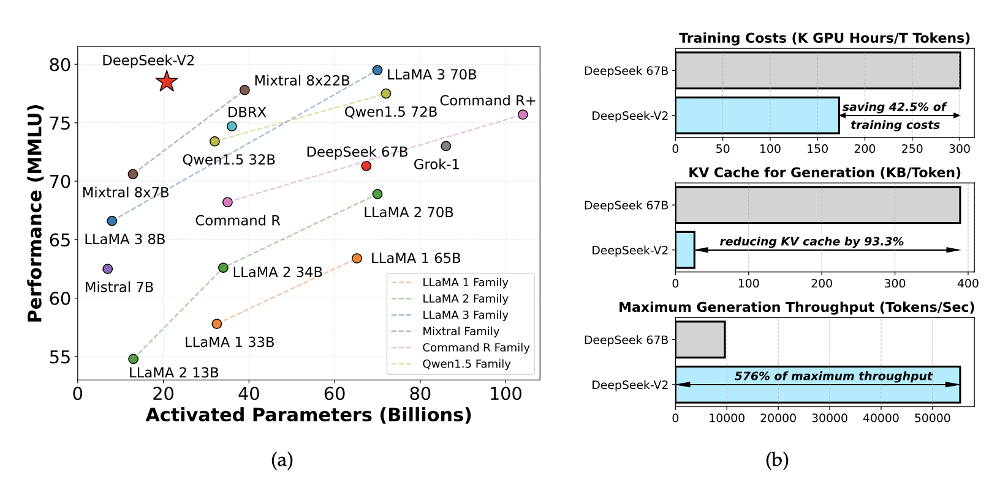
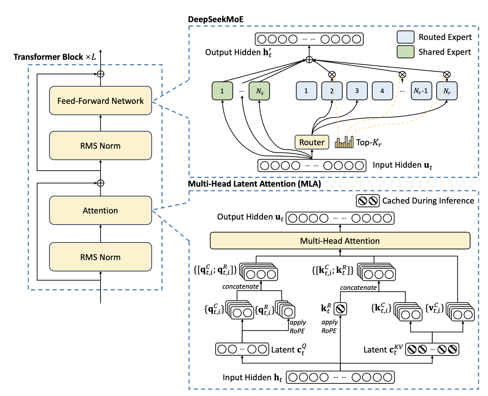
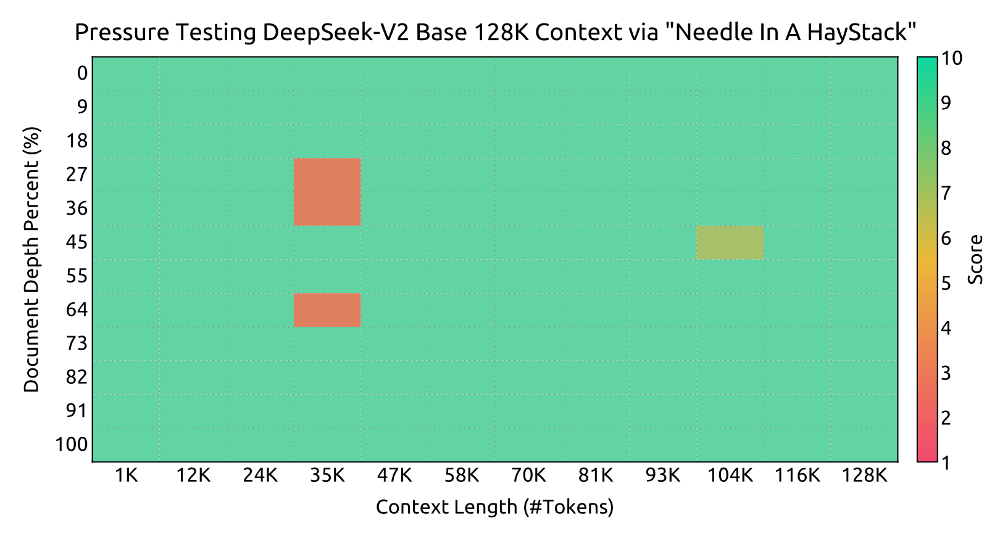
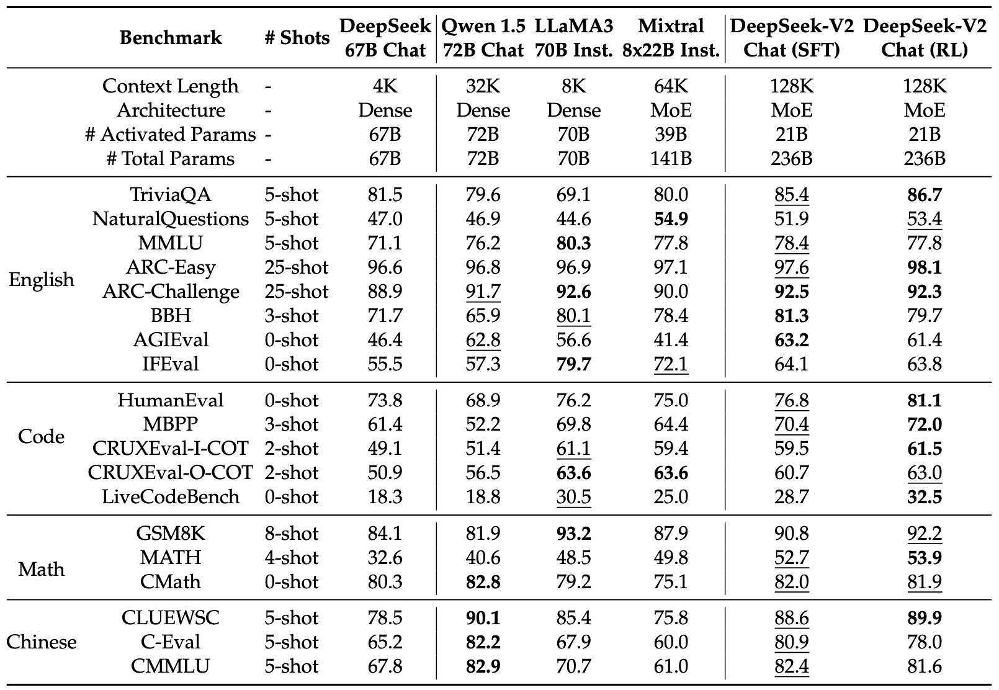
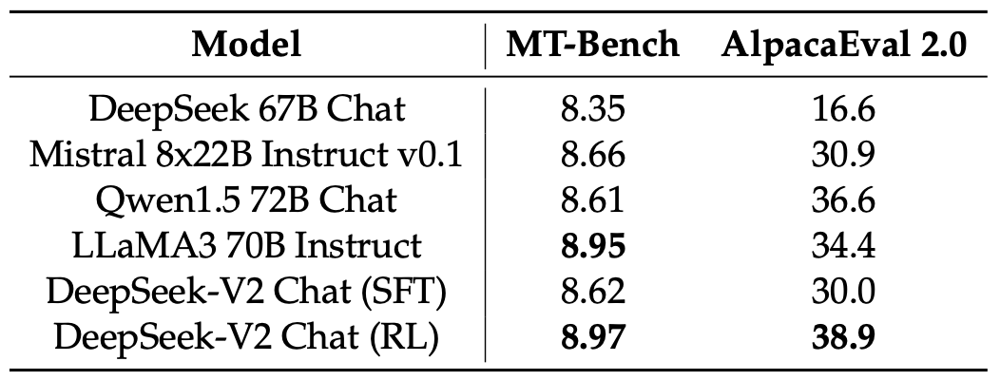
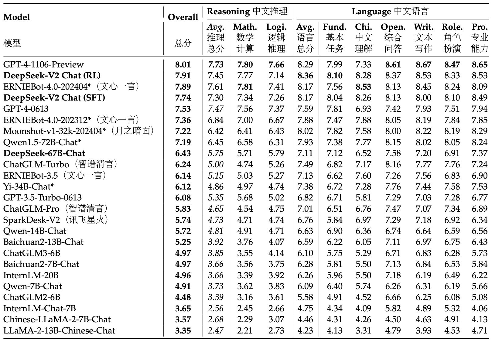

+++
author = "Kurt"
title = "DeepSeek-V2"
date = "2024-09-10"
description = "A Strong, Economical, and Efficient Mixture-of-Experts Language Model"
categories = [
    "Paper Review"
]
tags = [
    "LLM",
    "Milestone",
]
+++

## Abstract

경제적인 학습과 효율적인 추론을 제공하는 Mixture-of-Experts (MoE) 언어 모델 DeepSeek-V2를 소개한다. 이 모델은 236B 파라미터를 가지며, 128K 토큰의 컨텍스트를 지원한다. 혁신적인 Multi-head Latent Attention (MLA)와 DeepSeekMoE 아키텍처를 채택하여 성능을 개선하고, 학습 비용을 42.5% 절감하며, KV 캐시를 93.3% 줄이고, 최대 생성 처리량을 5.76배 증가시킨다. 8.1T 토큰으로 사전 학습 후 Supervised Fine-Tuning (SFT)과 Reinforcement Learning (RL)을 진행하여 높은 성능을 보여준다.

---

## Introduction

대형 언어 모델(LLM)은 최근 급격히 발전하며 인공지능 일반화(AGI)의 가능성을 보여주고 있다. 하지만 매개변수 증가로 성능은 향상되나, 더 많은 컴퓨팅 자원과 낮아진 추론 속도는 한계로 작용한다. 이를 해결하기 위해, DeepSeek-V2를 소개한다. DeepSeek-V2는 혁신적인 Transformer 아키텍처를 기반으로, 경제적 학습과 효율적 추론을 제공하는 2360억 개의 매개변수를 가진 Mixture-of-Experts(MoE) 모델이다.

Transformer 프레임워크 내에서 Multi-head Latent Attention(MLA)와 DeepSeekMoE를 도입해 주의 모듈과 FFNs를 최적화하였다. MLA는 낮은 차원의 key-value 압축을 통해 Multi-Head Attention(MHA)의 KV 캐시 문제를 해결하며, 추론 효율성을 높인다. DeepSeekMoE는 전문가 세분화와 격리를 통해 기존 MoE 아키텍처보다 더 경제적이고 강력한 성능을 발휘한다. 두 기술을 결합한 DeepSeek-V2는 뛰어난 성능, 경제적 학습 비용, 효율적인 추론 처리량을 동시에 제공한다.

8.1조 개의 토큰으로 구성된 고품질의 사전 학습 코퍼스를 구축해 DeepSeek-V2를 사전 학습하였다. 이후, 수학, 코드, 글쓰기 등 다양한 도메인의 150만 개 대화 세션을 수집하여 DeepSeek-V2 Chat의 지도 학습(SFT)을 수행하였다. 마지막으로, Group Relative Policy Optimization(GRPO)을 통해 모델을 인간 선호도에 맞춰 조정하여 DeepSeek-V2 Chat(RL)을 생성하였다.

DeepSeek-V2는 영어와 중국어 벤치마크에서 평가된 결과, 활성화된 210억 개의 매개변수로도 오픈소스 모델 중 최고 성능을 기록하며 강력한 MoE 언어 모델로 자리잡았다. MMLU에서 상위 성능을 달성했고, DeepSeek 67B 대비 학습 비용을 42.5% 절감하며, KV 캐시를 93.3% 줄이고, 생성 처리량을 5.76배 증가시켰다. DeepSeek-V2 Chat(RL)은 AlpacaEval 2.0에서 38.9% 승률, MT-Bench에서 8.97점, AlignBench에서 7.91점을 기록하며 영어와 중국어 대화 평가에서 최고 수준의 성능을 발휘하였다.

MLA와 DeepSeekMoE에 대한 연구를 촉진하기 위해, 오픈소스 커뮤니티를 위해 157억 개의 매개변수와 각 토큰당 24억 개의 활성화된 매개변수를 가진 소형 모델 DeepSeek-V2-Lite를 공개하였다.

이 논문의 나머지 부분에서는 먼저 DeepSeek-V2의 모델 아키텍처를 설명한 후, 사전 학습 과정과 관련된 데이터 구성, 하이퍼파라미터 설정, 효율성 평가 등을 다룬다. 이후 지도 학습(SFT)과 강화 학습(RL)을 포함한 정렬 작업을 설명하고, 마지막으로 결론과 DeepSeek-V2의 한계 및 향후 과제를 논의한다.

---

## Architecture

DeepSeek-V2는 Transformer 아키텍처를 기반으로 하며, attention 모듈과 FFN에 혁신적인 설계를 도입하였다. attention 모듈인 MLA는 키-값 캐시 병목을 해결해 효율적인 추론을 지원하고, FFN에서는 고성능 DeepSeekMoE 아키텍처를 사용해 경제적으로 강력한 모델을 학습한다. 기타 세부 사항은 DeepSeek 67B의 설정을 따른다.

### Multi-Head Latent Attention: Boosting Inference Efficiency

Transformer 모델은 MHA를 사용하지만, 무거운 KV 캐시가 추론 속도를 저하시킨다. 이를 해결하기 위해 MQA와 GQA가 제안되었으나, 성능은 MHA보다 떨어진다. DeepSeek-V2는 MLA를 도입해 저차원 키-값 압축을 통해 더 적은 KV 캐시로 MHA보다 나은 성능을 제공한다.

#### Preliminaries: Standard Multi-Head Attention

표준 MHA에서는 임베딩 차원 $d$, 헤드 수 $n_h$, 헤드당 차원 $d_h$로 주어진 토큰 입력 $h_t \in \mathbb{R}^d$에 대해, 세 개의 행렬 $W_Q$, $W_K$, $W_V \in \mathbb{R}^{d_h n_h \times d}$를 사용하여 $q_t$, $k_t$, $v_t \in \mathbb{R}^{d_h n_h}$를 다음과 같이 생성한다:

$$
q_t = W^Q h_t, \\\
k_t = W^K h_t, \\\
v_t = W^V h_t.
$$

다중 헤드 주의 계산을 위해 $q_t$, $k_t$, $v_t$는 $n_h$개의 헤드로 나뉘며, 각 헤드에서 쿼리 $q_{t,i}$, 키 $k_{t,i}$, 값 $v_{t,i}$로 계산된다. 계산된 값들은 아래 식에 따라 주의를 통해 결합되고,

$$ o_{t,i} = \sum_{j=1}^{l} \text{Softmax}_j ( \frac{q\_{t,i}^T k\_{j,i}}{\sqrt{d_h}} ) v\_{j,i} $$

출력은 투사 행렬 $W^O$로 결합된다. 추론 시 모든 키와 값을 캐시해야 하므로, MHA는 각 토큰에 대해 대규모 KV 캐시를 필요로 하여 배치 크기와 시퀀스 길이에 제약을 준다.

#### Low-Rank Key-Value Joint Compression

MLA의 핵심은 키와 값을 저차원으로 공동 압축하여 KV 캐시를 줄이는 것이다. 압축된 잠재 벡터 $c_{KV,t} \in \mathbb{R}^{d_c}$는 다음과 같이 계산된다:

$$ 
c^{KV}_{t} = W^{DKV} h_t, \\\
k^C_t = W^{UK} c^{KV}_t, \\\
v^C_t = W^{UV} c^{KV}_t
$$

여기서 $d_c ( \ll d_h n_h)$는 KV 압축 차원이다. 추론 시 MLA는 $c^{KV}_t$만 캐시하여 KV 캐시는 $d_c l$ 요소만 필요하다. $W^{UK}$와 $W^{UV}$는 각각 $W^Q$와 $W^O$에 흡수되어, 키와 값을 별도로 계산할 필요가 없다.

학습 중 활성화 메모리를 줄이기 위해 쿼리에 대해 저차원 압축을 수행한다. 이는 다음과 같이 계산된다:

$$ 
c^Q_t = W^{DQ} h_t, \\\
q^C_t = W^{UQ} c^Q_t
$$

여기서 $c^Q \in \mathbb{R}^{d'_c}$는 쿼리를 위한 압축된 잠재 벡터이며, $d'_c ( \ll d_h n_h)$는 쿼리 압축 차원을 나타낸다. $W^{DQ}$는 다운 프로젝션 행렬이고, $W^{UQ}$는 쿼리에 대한 업 프로젝션 행렬이다.

#### Decoupled Rotary Position Embedding

DeepSeek 67B(DeepSeek-AI, 2024)를 기반으로, DeepSeek-V2는 로터리 위치 임베딩(RoPE)을 사용할 예정이다. 하지만 RoPE는 저차원 KV 압축과 호환되지 않으며, 키와 쿼리에 대해 위치에 민감하다. 만약 키 $k_C$에 RoPE를 적용하면, $W_U^K$는 RoPE 행렬과 결합되어 $W_Q$에 흡수될 수 없다. 이로 인해, 추론 중 모든 접두사 토큰의 키를 재계산해야 하므로 추론 효율성이 크게 저하된다.

해결책으로, 분리된 RoPE 전략을 제안한다. 이 전략은 추가적인 다중 헤드 쿼리 $q^R_{t,i} \in \mathbb{R}^{d^R_h}$와 공유 키 $k^R_t \in \mathbb{R}^{d^R_h}$를 사용하여 RoPE를 적용한다. 여기서 $d^R_h$는 분리된 쿼리와 키의 헤드당 차원을 나타낸다.

분리된 RoPE 전략에서 MLA는 다음과 같이 계산한다:

$$
q^R_t = \text{RoPE}(W^{QR} c^Q_t), \\\
k^R_t = \text{RoPE}(W^{KR} h_t), \\\
q_{t,i} = [q^C_{t,i}; q^R_{t,i}], \\\
k_{t,i} = [k^C_{t,i}; k^R_t], \\\
o_{t,i} = \sum_{j=1}^{l} \text{Softmax}\_j ( \frac{q\_{t,i}^T k\_{j,i}}{\sqrt{d_h + d^R_h}} ) v^C\_{j,i}, \\\
u_t = W^O [o_{t,1}; o_{t,2}; \dots; o_{t,n_h}],
$$

여기서 $W^{QR}$와 $W^{KR}$는 각각 분리된 쿼리와 키를 생성하는 행렬이다. 추론 중에는 분리된 키를 캐시해야 하므로, DeepSeek-V2는 총 $ (d_c + d^R_h) l $ 요소를 포함하는 KV 캐시가 필요하다.

#### Comparison of Key-Value Cache

다양한 attention 메커니즘 간의 토큰당 KV 캐시 비교를 제시한다. MLA는 GQA와 동일한 소량의 KV 캐시만 필요하면서도 MHA보다 더 우수한 성능을 발휘한다.

### DeepSeekMoE: Training Strong Models at Economical Costs

#### Basic Architecture

FFN에서는 DeepSeekMoE 아키텍처를 사용한다. 이 아키텍처는 전문가를 세분화하여 전문화를 높이고, 일부 공유 전문가를 분리하여 지식 중복을 줄이는 두 가지 주요 아이디어를 가지고 있다. 동일한 활성화된 전문가 수와 전체 매개변수로도 DeepSeekMoE는 기존 MoE 아키텍처인 GShard보다 월등한 성능을 보여준다.

FFN의 입력 $u_t$에 대해 $t$-번째 토큰의 FFN 출력 $h'_t$는 다음과 같이 계산된다:

$$
h'_t = u_t + \sum\_{i=1}^{N_s} FFN(u_t)^{(s)}_i + \sum\_{i=1}^{N_r} g\_{i,t} FFN(u_t)^{(r)}_i
$$

여기서 $g_{i,t}$는 다음과 같이 정의된다:

$$
g_{i,t} = \begin{cases} 
s_{i,t} & s_{i,t} \in \text{Topk}(\{s_{j,t} | 1 \leq j \leq N_r\}, K_r) \\\
0 & \text{otherwise} 
\end{cases}
$$

$$
s_{i,t} = \text{Softmax}_i(u_t^T e_i)
$$

여기서 $N_s$는 공유 전문가의 수, $N_r$는 라우팅된 전문가의 수를 나타내며, $K_r$는 활성화된 라우팅된 전문가의 수이다. $FFN(\cdot)^{(s)}_i$와 $FFN(\cdot)^{(r)}_i$는 각각 $i$-번째 공유 전문가와 라우팅된 전문가를 나타낸다.

#### Device-Limited Routing

MoE 관련 통신 비용을 제한하기 위해 장치 제한 라우팅 메커니즘을 설계하였다. 전문가 병렬성이 사용되면, 라우팅된 전문가는 여러 장치에 분산되고, 각 토큰의 MoE 통신 빈도는 목표 전문가가 포함된 장치 수에 비례한다. DeepSeekMoE의 세밀한 전문가 세분화로 활성화된 전문가 수가 많아져, 전문가 병렬성을 적용할 경우 MoE 통신 비용이 증가할 수 있다.

DeepSeek-V2에서는 각 토큰의 목표 전문가가 최대 $M$개의 장치에 분산되도록 추가 조치를 취한다. 각 토큰에 대해 먼저 친화도 점수가 가장 높은 전문가가 포함된 $M$개 장치를 선택한 후, 이 장치에서 top-K 선택을 수행한다. $M \geq 3$일 때 장치 제한 라우팅이 무제한 top-K 라우팅과 유사한 성능을 보이는 것으로 나타났다.

#### Auxiliary Loss for Load Balance

로드 밸런스는 자동 라우팅 전략에서 중요하다. 불균형한 로드는 라우팅 붕괴를 초래하고, 전문가 활용과 계산 효율성을 저해할 수 있다. DeepSeek-V2에서는 전문가, 장치, 통신 수준의 로드 밸런스를 제어하기 위해 세 가지 보조 손실(LExpBal, LDevBal, LCommBal)을 설계하였다.

**Expert-Level Balance Loss.** 라우팅 붕괴를 방지하기 위해 전문가 수준의 밸런스 손실을 사용한다.

$$ 
L_{ExpBal} =  \alpha_1 \sum_{i=1}^{N_r} f_i P_i \\\ 
f_i = \frac{N_r}{K_r T} \sum_{t=1}^{T} 1(\text{Token } t \text{ selects Expert } i) \\\ 
P_i = \frac{1}{T} \sum_{t=1}^T s_{i,t}
$$

여기서 𝛼₁는 전문가 밸런스 팩터이며, 𝑇는 시퀀스의 토큰 수를 나타낸다.

**Device-Level Balance Loss.** 전문가 수준의 손실 외에도, DeepSeek-V2는 장치 간 계산 균형을 위해 장치 수준의 밸런스 손실을 설계하였다. 모든 전문가를 𝐷개의 그룹으로 나누고, 각 그룹을 하나의 장치에 배치하며, 손실은 장치별로 계산된다.

$$ 
L_{DevBal} = \alpha_2 \sum_{i=1}^{D} \frac{1}{|E_i|} \sum_{j \in E_i} f'_i P'_i \\\ 
f'_i = \frac{1}{|E_i|} \sum\_{j \in E_i} f_j \\\
P'_i = \sum\_{j \in E_i} P_j
$$

$𝛼_2$는 장치 수준의 밸런스 팩터이다.

**Communication Balance Loss.** 각 기기의 통신이 균형을 이루도록 하기 위해 통신 균형 손실(communication balance loss)을 도입하였다. 기기 제한 라우팅 메커니즘(device-limited routing mechanism)은 각 기기의 송신 통신을 제한하지만, 특정 기기가 다른 기기보다 더 많은 토큰을 받으면 통신 효율이 저하될 수 있다. 이를 완화하기 위해 통신 균형 손실을 다음과 같이 설계하였다:

$$
L_{CommBal} = 𝛼_3 \sum\_{i=1}^{D} f''_i P''_i, \\\
f''_i = \frac{1}{MT} \sum\_{t=1}^{T} 1(\text{Token} \ t \ \text{is sent to Device} \ i), \\\
P''_i = \sum\_{j \in E_i} P_j,
$$

여기서 $𝛼_3$는 통신 균형 계수(communication balance factor)로, 통신 균형 손실은 각 기기가 다른 기기로부터 고르게 𝑀𝑇개의 은닉 상태를 받도록 유도하여 기기 간 정보 교환의 균형을 보장하고, 통신 효율을 높이는 역할을 한다.

#### Token-Dropping Strategy

균형 손실은 부하를 맞추려 하지만 엄격한 균형을 보장하지 못하므로, 계산 낭비를 줄이기 위해 기기 수준의 토큰 드롭 전략을 도입하였다. 각 기기의 평균 계산 예산을 설정하고, 친화도 점수가 낮은 토큰을 제거하며, 일부 시퀀스는 제거되지 않도록 보장한다. 이로 인해 훈련과 추론 간의 일관성을 유지하면서, 효율성에 따라 유연하게 토큰을 드롭할 수 있다.

---

## Pre-Training

### Experimental Setups

#### Data Construction

DeepSeek 67B의 데이터 처리 단계를 유지하면서, 데이터 양을 확장하고 품질을 개선하였다. 인터넷 데이터를 탐색하고 정제 과정을 최적화해 삭제된 데이터를 복구하고, 중국어 데이터를 추가하였다. 또한, 고품질 데이터를 포함하고 필터링 알고리즘을 개선하여 유익하지 않은 데이터를 제거하고, 편향을 줄이기 위해 논란의 소지가 있는 콘텐츠를 필터링하였다.

DeepSeek 67B와 동일한 BBPE 기반 토크나이저를 사용했으며, 어휘 크기는 10만개 이다. 사전 학습 코퍼스는 8.1조 개의 토큰을 포함하며, 중국어 토큰이 영어보다 약 12% 더 많다.

#### Hyper-Parameters

**Model Hyper-Parameters.** Transformer 레이어 수를 60, 은닉 차원을 5120으로 설정하고, 모든 학습 가능한 파라미터를 표준편차 0.006으로 무작위 초기화하였다. MLA에서는 attention 헤드 수 128, 헤드당 차원 128, KV 압축 차원 512, 쿼리 압축 차원 1536, 분리된 쿼리와 키의 헤드당 차원을 64로 설정하였다. 모든 FFN을 MoE 레이어로 대체했으며, 각 MoE 레이어는 2개의 공유 전문가와 160개의 라우팅된 전문가로 구성되어 있다. 6개의 라우팅된 전문가가 각 토큰에 대해 활성화된다. 또한, 압축된 잠재 벡터 뒤에 RMS Norm 레이어를 추가하여 안정적인 학습을 보장한다. 이 설정에 따라, DeepSeek-V2는 총 2360억 개의 파라미터를 가지며, 각 토큰에 대해 210억 개의 파라미터가 활성화된다.

**Training Hyper-Parameters.** AdamW 옵티마이저를 사용하며, 하이퍼파라미터는 𝛽1 = 0.9, 𝛽2 = 0.95, weight_decay = 0.1로 설정하였다. 학습률은 웜업 및 단계적 감소 전략으로 조정되며, 최대 학습률은 2.4 × 10⁻⁴이다. 초기 2000 단계 동안 학습률이 선형 증가한 후, 60%와 90%에서 각각 0.316배 감소한다. 배치 크기는 처음 225B 토큰 동안 2304에서 9216으로 증가하고, 이후 9216을 유지한다. 최대 시퀀스 길이는 4000으로, DeepSeek-V2는 8.1조 개의 토큰에서 학습된다. 모델의 레이어는 8개의 장치에 배포되며, 각 토큰은 최대 3개의 장치로 전송된다. 균형 손실의 𝛼1, 𝛼2, 𝛼3 값은 각각 0.003, 0.05, 0.02로 설정하며, 학습 중에는 토큰 드롭 전략을 사용하지만 평가 시에는 드롭하지 않는다.

#### Infrastructures 

DeepSeek-V2는 HAI-LLM 프레임워크(High-flyer, 2023)를 기반으로 학습되며, 16-way 제로-버블 파이프라인 병렬성, 8-way 전문가 병렬성, 그리고 ZeRO-1 데이터 병렬성을 사용한다. 상대적으로 적은 활성화된 파라미터와 재계산을 통해 텐서 병렬성 없이 학습할 수 있어 통신 오버헤드를 줄인다. 학습 효율성을 높이기 위해 공유 전문가의 계산과 전문가 병렬 통신을 겹치게 하며, 빠른 CUDA 커널과 개선된 FlashAttention-2(Dao, 2023)로 최적화되었다.

NVIDIA H800 GPU 클러스터에서 모든 실험을 수행하며, 각 노드는 NVLink 및 NVSwitch로 연결된 8개의 GPU를 포함하고, 노드 간 통신은 InfiniBand를 사용한다.

#### Long Context Extension

DeepSeek-V2의 초기 사전 학습 후, YaRN을 사용하여 기본 컨텍스트 창 길이를 4K에서 128K로 확장하였다. YaRN 설정에서 스케일 $s$를 40, $\alpha$를 1, $\beta$를 32로 설정하고, 목표 최대 컨텍스트 길이를 160K로 설정하였다. attention 메커니즘에 따라 주의 엔트로피를 조절하기 위해 길이 스케일링 팩터를 $\sqrt{t} = 0.0707 \ln s + 1$로 계산하여 perplexity를 최소화하도록 조정하였다.

모델을 1000 스텝 동안 시퀀스 길이 32K, 배치 크기 576으로 학습하였다. 비록 학습이 32K에서만 진행되었지만, 모델은 128K의 컨텍스트 길이에서도 강력한 성능을 보여주었다. "Needle In A Haystack" (NIAH) 테스트 결과는 DeepSeek-V2가 128K까지 모든 컨텍스트 창 길이에서 잘 수행됨을 보여준다.

### Evaluations

#### Evaluation Benchmarks

DeepSeek-V2는 이중 언어 코퍼스에서 사전 학습되어 영어와 중국어 벤치마크에서 평가된다. 평가는 HAI-LLM 프레임워크의 내부 평가 시스템을 기반으로 하며, 아래에 분류된 벤치마크가 나열되어 있다.

**Multi-subject multiple-choice**: MMLU, C-Eval, CMMLU.  
**Language understanding and reasoning**: HellaSwag, PIQA, ARC, BigBench Hard (BBH).  
**Closed-book question answering**: TriviaQA, NaturalQuestions.  
**Reading comprehension**: RACE, DROP, C3, CMRC.  
**Reference disambiguation**: WinoGrande, CLUEWSC.  
**Language modeling**: Pile.  
**Chinese understanding and culture**: CHID, CCPM.  
**Math**: GSM8K, MATH, CMath.  
**Code**: HumanEval, MBPP, CRUXEval.  
**Standardized exams**: AGIEval.

이전 연구(DeepSeek-AI, 2024)를 바탕으로, HellaSwag, PIQA, WinoGrande, RACE-Middle, RACE-High, MMLU, ARC-Easy, ARC-Challenge, CHID, C-Eval, CMMLU, C3, CCPM 데이터셋에 대해 당혹감 기반 평가를 사용하고, TriviaQA, NaturalQuestions, DROP, MATH, GSM8K, HumanEval, MBPP, CRUXEval, BBH, AGIEval, CLUEWSC, CMRC, CMath 데이터셋에는 생성 기반 평가를 적용한다. Pile-test에 대해서는 언어 모델링 기반 평가를 수행하고, 공정한 비교를 위해 Bits-Per-Byte (BPB)를 메트릭으로 사용한다.

#### Evaluation Results

DeepSeek-V2를 DeepSeek 67B, Qwen1.5 72B, LLaMA3 70B, Mixtral 8x22B와 비교한다. 모든 모델은 동일한 내부 평가 프레임워크를 사용하여 평가되며, DeepSeek-V2는 21B의 활성화된 파라미터로 거의 모든 벤치마크에서 DeepSeek 67B를 능가하며, 오픈 소스 모델 중 최상위 성능을 기록한다.

DeepSeek-V2와 오픈 소스 모델을 다음과 같이 비교한다. (1) Qwen1.5 72B와 비교할 때, DeepSeek-V2는 영어, 코드, 수학 벤치마크에서 우수한 성능을 보이며, 중국어 벤치마크에서는 Qwen1.5가 다중 주제 다지선다 문제에서 더 나은 성과를 보인다. CHID 벤치마크의 경우, Qwen1.5의 점수는 오류로 인해 공란이다. (2) Mixtral 8x22B와 비교 시, DeepSeek-V2는 영어 성능에서 동등하거나 더 나은 결과를 보이고, 특히 MMLU에서 우수한 성능을 나타낸다. Mixtral은 중국어 데이터에 대한 학습이 부족해 성능이 떨어진다. (3) LLaMA3 70B와 비교했을 때, DeepSeek-V2는 학습 토큰이 적어 기본 영어 능력에서 차이를 보이지만, 코드 및 수학 능력은 동등하며, 중국어 벤치마크에서는 LLaMA3를 크게 초월한다.

일부 이전 연구는 사전 학습 단계에서 SFT 데이터를 사용한 반면, DeepSeek-V2는 SFT 데이터에 노출되지 않았다.

#### Training and Inference Efficiency

**Training Costs.** DeepSeek-V2는 각 토큰에 대해 더 적은 파라미터를 활성화하고 FLOPs가 적어 이론적으로 DeepSeek 67B보다 학습 비용이 더 경제적이다. MoE 모델의 추가 통신 오버헤드에도 불구하고, 최적화를 통해 DeepSeek-V2는 높은 모델 FLOPs 활용률(MFU)을 달성한다. H800 클러스터에서의 학습 결과, 1조 토큰 학습에 DeepSeek 67B는 300.6K GPU 시간이 필요하지만, DeepSeek-V2는 172.8K GPU 시간만 소요되어, 학습 비용을 42.5% 절감할 수 있다.

**Inference Efficiency.** DeepSeek-V2를 효율적으로 서비스에 배포하기 위해, 파라미터를 FP8 정밀도로 변환하고 KV 캐시를 평균 6비트로 압축하는 양자화를 수행한다. 이러한 최적화 덕분에 DeepSeek-V2는 DeepSeek 67B보다 KV 캐시를 적게 사용하며, 더 큰 배치 크기를 처리할 수 있다. 8개의 H800 GPU를 사용하는 단일 노드에서 DeepSeek-V2는 초당 50K 토큰 이상의 생성 처리량을 달성하여 DeepSeek 67B의 최대 처리량보다 5.76배 높다. 프롬프트 입력 처리량은 초당 100K 토큰을 초과한다.

---

## Alignment

### Supervised Fine-Tuning

이전 연구(DeepSeek-AI, 2024)를 바탕으로, 1.5M 인스턴스를 포함하는 instruction tuning 데이터셋을 구성하였다(1.2M 유용성, 0.3M 안전성). 데이터 품질을 개선하여 환각 응답을 줄이고 글쓰기 능력을 향상시켰다. DeepSeek-V2는 2 에폭으로 미세 조정하며, 학습률은 $5 \times 10^{-6}$으로 설정한다. 평가에서는 주로 생성 기반 벤치마크와 다지선다형 과제(MMLU, ARC)를 포함하고, 지침 준수 평가(IFEval)와 LiveCodeBench 질문도 활용한다. 또한 MT-Bench, AlpacaEval 2.0, AlignBench 등의 개방형 대화 벤치마크로 추가 평가를 수행하며, Qwen1.5 72B Chat, LLaMA-3-70B Instruct, Mistral-8x22B Instruct와 비교합니다. DeepSeek 67B Chat의 결과는 이전 보고서를 참조한다.

### Reinforcement Learning

DeepSeek-V2의 잠재력을 극대화하고 인간의 선호에 맞추기 위해 강화 학습(RL)을 사용하여 조정한다.

**Reinforcement Learning Algorithm.** 학습 비용 절감을 위해, Group Relative Policy Optimization (GRPO)를 사용한다. GRPO는 비평가 모델을 생략하고 그룹 점수로부터 기준선을 추정한다. 각 질문 $q$에 대해, GRPO는 이전 정책 $\pi_{\theta_{old}}$로부터 샘플링한 출력 집합 $ \lbrace o_1, o_2, \ldots, o_G \rbrace $를 사용하여 정책 모델 $ \pi_{\theta} $를 최적화하는 목표를 설정한다:

$$
J_{GRPO}(\theta) = E[q \sim P(Q), \lbrace o_i \rbrace_{i=1}^G \sim \pi\_{\theta\_{old}}(O|q)] \\\
\sum_{i=1}^G \big( \min \big( \frac{\pi_{\theta}(o_i|q)}{\pi_{\theta_{old}}(o_i|q)} A_i, \text{clip} \big( \frac{\pi_{\theta}(o_i|q)}{\pi_{\theta_{old}}(o_i|q)}, 1-\epsilon, 1+\epsilon \big) A_i \big) - \beta D_{KL}(\pi_{\theta} || \pi_{ref}) \big) \\\
D_{KL}(\pi_{\theta} || \pi_{ref}) = \frac{\pi_{ref}(o_i|q)}{\pi_{\theta}(o_i|q)} - log \frac{\pi_{ref}(o_i|q)}{\pi_{\theta}(o_i|q)} - 1
$$

여기서 $A_i$는 각 그룹의 보상으로 계산된 이점이다:

$$
A_i = \frac{r_i - \text{mean}(\lbrace r_1, r_2, \ldots, r_G \rbrace)}{\text{std}(\lbrace r_1, r_2, \ldots, r_G \rbrace)}.
$$ 

**Training Strategy.** 예비 실험에서 코드 및 수학 프롬프트에 대한 RL 학습이 일반 데이터와는 다르게 작용한다는 것을 발견하였다. 모델의 수학적 및 코딩 능력은 더 긴 학습 기간 동안 향상될 수 있다. 따라서 두 단계의 RL 학습 전략을 채택하였다. 첫 번째 단계에서는 코드 및 수학 추론을 위한 보상 모델 $ RM_{reasoning} $을 학습하고, 이를 통해 정책 모델을 최적화한다:

$$
r_i = RM_{reasoning}(o_i).
$$

두 번째 단계에서는 유용한 보상 모델 $ RM_{helpful} $, 안전 보상 모델 $ RM_{safety} $, 규칙 기반 보상 모델 $ RM_{rule} $로부터 보상을 받아 응답 $ o_i $의 최종 보상을 다음과 같이 정의한다:

$$
r_i = c_1 \cdot RM_{helpful}(o_i) + c_2 \cdot RM_{safety}(o_i) + c_3 \cdot RM_{rule}(o_i),
$$

여기서 $ c_1, c_2, c_3 $는 각각의 계수이다.

신뢰할 수 있는 보상 모델을 위해, 선호 데이터를 신중하게 수집하고 품질 필터링 및 비율 조정을 실시한다. 코드 선호 데이터는 컴파일러 피드백에 기반하고, 수학 선호 데이터는 정답 레이블에 기반한다. 보상 모델은 DeepSeek-V2 Chat (SFT)로 초기화하고, 포인트-와이즈 또는 페어-와이즈 손실로 학습한다. 실험에서 RL 학습이 모델의 잠재력을 활성화하여 가능한 응답 중에서 올바르고 만족스러운 답변을 선택하도록 한다는 것을 확인하였다.

**Optimizations for Training Efficiency.** 매우 큰 모델에 대한 RL 학습은 GPU 메모리와 RAM 관리를 요구하며, 빠른 학습 속도를 유지하기 위해 다음과 같은 최적화를 구현한다. (1) 학습과 추론에 각각 다른 병렬 전략을 사용하는 하이브리드 엔진을 도입하여 GPU 활용도를 높인다. (2) 대규모 배치 크기를 사용하는 vLLM(Kwon et al., 2023) 추론 백엔드를 활용하여 추론 속도를 가속화한다. (3) CPU와 GPU 간의 모델 오프로드 및 로드를 위한 일정 전략을 설계하여 학습 속도와 메모리 소비의 균형을 맞춘다. 

### Evaluation Results

**Evaluations on Standard Benchmarks.** 초기 평가에서 DeepSeek-V2 Chat (SFT)와 DeepSeek-V2 Chat (RL)은 표준 벤치마크에서 비교되었으며, SFT는 GSM8K, MATH, HumanEval에서 기본 버전보다 개선된 성능을 보여주었다. 이는 수학 및 코드 관련 SFT 데이터 덕분이다. RL 모델은 수학 및 코드 벤치마크에서 성능을 추가로 향상시켰다.

DeepSeek-V2 Chat (SFT)와 Qwen1.5 72B Chat을 비교한 결과, DeepSeek-V2 Chat (SFT)가 영어, 수학, 코드 벤치마크에서 우수한 성능을 보여주었다. 중국어 벤치마크에서는 Qwen1.5 72B Chat에 비해 약간 낮은 점수를 기록하였다. Mixtral 8x22B Instruct와 비교할 때, DeepSeek-V2 Chat (SFT)는 대부분의 벤치마크에서 더 나은 성능을 나타냈다. LLaMA3 70B Chat과는 코드 및 수학 벤치마크에서 유사한 성능을 보였고, MMLU와 IFEval에서는 LLaMA3 70B Chat이 더 나은 성능을 발휘하였다. 그러나 DeepSeek-V2 Chat (SFT)는 중국어 작업에서 더 뛰어난 성능을 보여주었으며, DeepSeek-V2 Chat (RL)은 수학 및 코딩 작업에서 SFT 버전보다 더 향상된 성능을 보여주었다. 이 비교는 다양한 도메인과 언어에서 DeepSeek-V2 Chat의 강점을 강조한다.

**Evaluations on Open-Ended Generation.** 개방형 대화 벤치마크에서 모델에 대한 추가 평가를 수행하였다. MT-Bench와 AlpacaEval 2.0을 사용한 결과, DeepSeek-V2 Chat (RL)은 DeepSeek-V2 Chat (SFT)에 비해 성능이 크게 향상되었으며, 이는 RL 학습의 효과를 입증한다. 또한, DeepSeek-V2 Chat (RL)은 Mistral 8x22B Instruct 및 Qwen1.5 72B Chat보다 우수한 성능을 보였고, LLaMA3 70B Instruct와 비교하여 MT-Bench에서 경쟁력을 가지며 AlpacaEval 2.0에서는 더욱 뛰어난 성능을 발휘하였다. 이 결과는 DeepSeek-V2 Chat (RL)이 고품질의 응답을 생성하는 데 강력한 능력을 가지고 있음을 보여준다.

AlignBench를 기반으로 중국어 개방형 생성 능력을 평가한 결과, DeepSeek-V2 Chat (RL)이 DeepSeek-V2 Chat (SFT)에 비해 약간의 이점을 보여주었다. DeepSeek-V2 Chat (SFT)는 모든 오픈 소스 중국어 모델을 크게 초월하며, Qwen1.5 72B Chat을 능가한다. 두 모델 모두 GPT-4-0613과 ERNIEBot 4.0을 초월하여 중국어 지원 상위 LLM으로 자리매김하고 있다. 특히, DeepSeek-V2 Chat (RL)은 중국어 이해에서 뛰어난 성능을 보이며, GPT-4-Turbo-1106-Preview를 초월하지만, 추론 능력은 Erniebot-4.0 및 GPT-4s와 같은 대형 모델에 비해 뒤처져 있다.

### Discussion

**Amount of SFT Data.** 대규모 SFT 코퍼스의 필요성에 대한 논의는 논란이 많다. 일부 연구는 10K 미만의 SFT 데이터로도 만족스러운 결과를 얻을 수 있다고 주장하지만, 이 실험에서는 10K 미만의 인스턴스를 사용할 경우 IFEval 벤치마크에서 성능이 크게 감소하는 것을 발견하였다. 이는 언어 모델이 특정 기술을 개발하는 데 일정량의 데이터가 필요하다는 것을 시사한다. 따라서 LLM에 원하는 기능을 부여하려면 충분한 양의 데이터와 그 품질이 중요하다.

**Alignment Tax of Reinforcement Learning.** 인간 선호 정렬 과정에서 개방형 생성 벤치마크에서 AI와 인간 평가자의 점수 모두 크게 향상되었다. 그러나 "alignment tax" 현상도 관찰되어 BBH와 같은 일부 표준 벤치마크에서 성능이 저하될 수 있었다. 이를 완화하기 위해 RL 단계에서 데이터 처리와 학습 전략 개선에 노력하여 표준 벤치마크와 개방형 벤치마크 간의 성능 균형을 이루었다. 향후 연구에서는 일반 성능을 저하시키지 않으면서 모델을 인간의 선호와 정렬하는 방법을 탐구하는 것이 중요하다.

**Online Reinforcement Learning.** 선호 정렬 실험에서 온라인 접근 방식이 오프라인 접근 방식을 크게 초월함을 발견하였다. 따라서 DeepSeek-V2를 위한 온라인 RL 프레임워크를 구현하는 데 많은 노력을 기울였으며, 온라인과 오프라인 선호 정렬에 대한 비교는 향후 연구에서 다룰 예정이다.

---

## Conclusion, Limitation, and Future Work

이 논문에서는 128K 컨텍스트 길이를 지원하는 대규모 MoE 언어 모델 DeepSeek-V2를 소개한다. 이 모델은 MLA와 DeepSeekMoE 아키텍처 덕분에 경제적인 학습과 효율적인 추론을 자랑한다. DeepSeek 67B와 비교해 성능이 크게 향상되었고, 학습 비용은 42.5% 절감되었으며, KV 캐시는 93.3% 줄어들고 최대 생성 처리량은 5.76배 증가하였다. 활성화된 파라미터가 21B인 DeepSeek-V2는 오픈 소스 모델 중에서 최상급 성능을 달성하며 가장 강력한 MoE 모델로 자리잡았다.

DeepSeek-V2와 그 채팅 버전은 다른 LLM과 마찬가지로 사전 학습 이후 지속적인 지식 업데이트 부족, 비사실 정보 생성 가능성, 환각 발생 가능성과 같은 한계를 가지고 있다. 또한, 주로 중국어와 영어로 구성된 데이터로 인해 다른 언어에 대한 숙련도가 제한적일 수 있으므로, 그 외의 언어 사용 시 주의가 필요하다.

DeepSeek는 장기적인 관점에서 오픈 소스 대규모 모델에 지속적으로 투자하여 인공지능 일반 지능(AGI) 목표에 점진적으로 접근할 계획이다.

* MoE 모델의 규모를 확장하면서 경제적인 학습 및 추론 비용을 유지하는 방법을 모색하고 있으며, 다음 릴리스에서 GPT-4와 동등한 성능을 목표로 하고 있다.
* 정렬 팀은 전 세계 사용자에게 유용하고 신뢰할 수 있는 안전한 모델을 개발하는 데 노력하고 있으며, 모델의 가치를 인간의 가치와 일치시키고 인간의 감독 필요성을 최소화하려고 한다. 윤리적 고려사항을 우선시하여 사회에 긍정적인 영향을 미치고자 한다.
* 현재 DeepSeek-V2는 텍스트 모드만 지원하지만, 미래 계획으로 여러 모드를 지원하여 다양한 시나리오에서의 활용성을 높일 예정이다.

---

## Reference

* [Paper](https://arxiv.org/pdf/2405.04434)
* [Github](https://github.com/deepseek-ai/DeepSeek-V2)