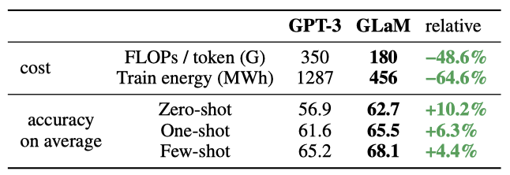
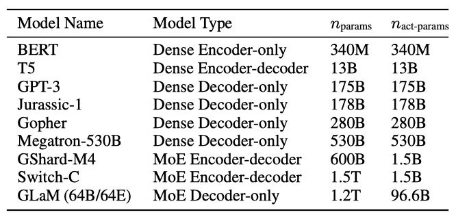
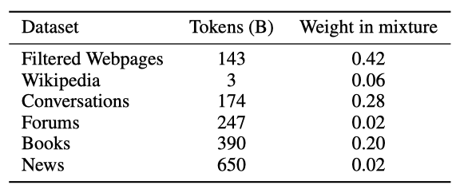
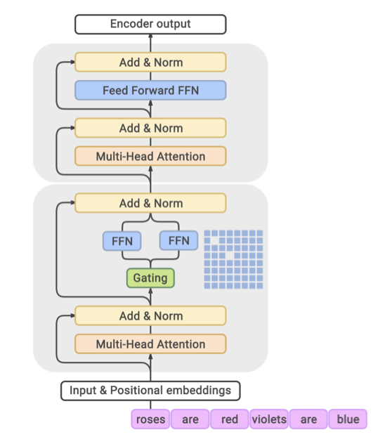
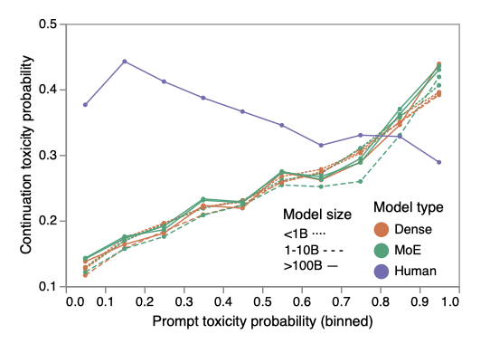

+++
author = "Kurt"
title = "GLaM"
date = "2024-01-07"
description = "Efficient Scaling of Language Models with Mixture-of-Experts"
categories = [
    "Paper Review"
]
tags = [
    "LLM",
    "Milestone",
]
+++

## Abstract

이 논문에서는 GLaM이라는 범용 언어 모델을 제안한다. 이 모델은 sparsely activated mixture-of-experts 아키텍처를 사용하여 모델 용량을 확장하면서도 학습 비용을 크게 줄인다. 가장 큰 GLaM은 GPT-3보다 약 7배 큰 1.2T 개의 parameter를 가지고 있다. 그러나 GPT-3를 학습시키는 데 필요한 에너지의 1/3만 소비하고, 추론을 위한 연산은 절반만 필요하면서도 29개의 NLP 작업에서 전반적으로 더 나은 성능을 보인다.

---

## Introduction

지난 10년간 언어 모델은 자연 언어 처리(NLP)의 발전에 크게 기여했다. 이는 사전 학습된 단어 벡터와 문맥화된 단어 벡터의 생성을 통해 이루어졌다. 더 많은 데이터와 큰 모델로의 확장은 레이블이 적게 붙은 데이터로도 복잡한 언어 작업을 수행할 수 있게 했다. GPT-3와 FLAN은 적은 수의 레이블이 붙은 예시로도 좋은 성능을 내는 것이 가능하다는 것을 보여주었다. 그러나, 모델을 더 확장하는 것은 점점 비싸지고 많은 에너지를 소비하게 되었다.

이 연구에서는 대규모 sparsely activated 네트워크인 GLaM이 계산 효율성을 높이면서도 few-shot 작업에서 state-of-the-art dense 모델과 경쟁력 있는 결과를 달성할 수 있다는 것을 보여준다. 가장 큰 GLaM 모델은 총 1.2T의 parameter를 가지고 있으며, 입력 배치의 각 토큰은 이 중 8%만 활성화한다. 이 모델은 다양한 NLP 벤치마크에서 GPT-3보다 학습 효율성이 크게 향상되었으며, 학습 중의 총 에너지 소비는 GPT-3의 삼분의 일에 불과하다.

GLaM을 사용하여 데이터의 중요성을 연구한다. 이 논문의 분석은 이러한 대규모 모델에 대해서도, 고품질의 auto-regressive 언어 모델을 생성하는 것이 목표라면 데이터의 양을 위해 품질을 희생해서는 안 된다는 것을 보여준다. 더욱 중요한 것은, 사회적 차원에서, 이 논문의 결과는 우리가 알기로는 WinoGender 벤치마크에서 stereotypical 예제와 anti-stereotypical 예제 사이의 성능 격차를 닫는 첫 번째 결과이며, 이는 대규모 sparsely activated 모델이 표면적인 통계적 상관관계에 덜 의존할 수 있다는 것을 제안한다.

이 연구는 MoE-based sparse decoder-only 언어 모델이 비슷한 컴퓨팅 FLOPs의 밀집 아키텍처보다 성능이 뛰어날 수 있다는 것을 처음으로 보여주었다. 이는 에너지 비용을 절약하면서 고품질 NLP 모델을 달성하기 위한 가장 유망한 방향 중 하나를 제시하며, 따라서 MoE는 향후 확장에 대한 강력한 후보로 고려되어야 한다.

---

## Related Work

**Language models.** 신경 언어 모델은 다양한 자연어 처리 작업에 유용하며, word2vec, GloVe, paragraph vectors와 같은 단어 임베딩 모델은 임베딩을 전달함으로써 여러 작업에 대해 훌륭한 일반화 능력을 보여준다.

**Pre-training and Fine-tuning.** 계산력과 데이터의 풍부함으로 더 큰 모델들을 비지도 학습으로 학습하는 것이 가능해졌다. RNN과 LSTM 같은 순환 모델을 이용한 연구는 언어 모델을 미세조정해 다양한 언어 이해 작업을 개선할 수 있음을 보여주었다. 또한, Transformer를 사용한 모델은 레이블이 없는 데이터에 대한 자기 감독을 통해 NLP 작업에서 큰 개선을 이루었다. 사전 학습과 미세 조정을 기반으로 한 전이 학습은 downstream task에서 좋은 성능을 보여주었으나, 작업 특정 미세 조정이 필요한 것이 주요 제한사항이다.

**In-Context Few-shot Learning.** 언어 모델의 확장, 예를 들어 GPT-3 등은 작업에 구애받지 않는 few-shot 성능을 크게 향상시킨다는 것을 보여주었다. 이러한 모델은 gradient 업데이트 없이 적용되며, 모델과의 텍스트만을 이용한 few-shot 시연만 필요합니다.

**Sparsely Gated Networks.** Mixture-of-Experts 기반 모델은 효과적으로 많은 수의 가중치를 사용하면서 추론 시간에는 계산 그래프의 작은 부분만 계산함으로써 언어 모델링과 기계 번역에서 중요한 이점을 보여주었다. 최근에는 1T 개의 parameter를 가진 sparsely activated 모델(Switch-C)이 상당한 성과를 보여주었다. GLaM과 Switch-C 모두 1T 개의 학습 가능한 parameter를 가지지만, GLaM은 decoder-only 언어 모델이며, Switch-C는 encoderdecoder 기반 sequence to sequence 모델이다. 또한, GLaM은 미세 조정 없이도 few-shot 설정에서 잘 수행된다.

---

## Training Dataset

다양한 자연어 사용 사례를 대표하는 1.6T 개의 토큰으로 구성된 고품질 데이터셋을 구축하여 모델을 학습시켰다. 레이블이 없는 데이터셋의 대부분은 웹 페이지로, 품질이 다양하다. 고품질 웹 말뭉치를 생성하기 위해 자체 텍스트 품질 분류기를 개발하였고, 이를 통해 웹페이지의 콘텐츠 품질을 추정하였다. 분류기의 체계적인 편향을 방지하기 위해 점수에 따라 웹페이지를 샘플링하는 방식을 적용하였다.

고품질 웹페이지의 필터링된 부분 집합을 생성하고, 이를 다른 데이터 소스와 결합하여 최종 GLaM 데이터셋을 만들었다. 각 데이터 구성 요소의 성능과 작은 데이터 소스가 과도하게 샘플링되는 것을 방지하기 위해 mixture 가중치를 설정하였다. 데이터 오염을 확인하기 위해 학습 데이터와 평가 데이터 사이의 중복성을 분석했고, 이는 이전 연구와 일치하는 것을 확인하였다.

---

## Model Architecture

GLaM 모델은 sparsely activated Mixture-of-Experts(MoE) 방식을 사용한다. 이는 Transformer layer의 일부를 MoE 계층으로 대체하여, 독립적인 feed-forward network 집합이 각각 "expert" 역할을 하는 방식이다. gating 함수를 통해 이 expert들에 대한 확률 분포를 모델링하며, 이는 각 expert가 입력을 얼마나 잘 처리하는지를 나타낸다.

MoE layer는 많은 parameter를 가지지만, expert들은 sparsely activated 되므로 모델의 용량을 늘리면서 계산을 제한한다. 이 layer의 gating network는 입력 시퀀스의 각 토큰에 대해 최적의 두 개의 expert를 활성화하도록 학습되며, 추론 시에는 동적으로 두 expert를 선택합니다. 이로 인해 훨씬 더 많은 계산 유연성을 가진 다양한 feed-forward network 조합이 제공된다. 토큰의 최종 표현은 선택된 expert들의 출력의 가중 조합으로 구성된다.

원래의 Transformer 아키텍처에 다양한 수정을 가했다. standard positional embedding을 per-layer relative positional bias으로 대체하고, non-MoE Transformer feed-forward sub-layer에서는 첫 번째 linear projection과 activation 함수를 Gated Linear Unit으로 변경하였다. 또한, 큰 GLaM 모델의 가중치와 계산을 분할하기 위해 2D sharding 알고리즘을 사용하였다.

---

## Experiment Setup

GLaM은 dense 및 sparse decoder-only 언어 모델 집합이며, 훈련 설정, hyperparameter, 평가 방법에 대해 상세히 설명한다.

### Training Setting

GLaM의 여러 변형을 학습시켜 MoE와 dense 모델의 동작을 연구하였다. 이는 130M 개의 parameter에서 1.2T 개의 parameter에 이르는 다양한 규모의 GLaM 모델의 hyperparameter 설정을 포함한다. 또한, 각 모델의 학습 가능한 parameter의 총 수, 입력 토큰당 활성화된 parameter의 수 등을 고려하였고, 이는 추론 중에 토큰당 활성화된 parameter의 수가 비슷한 dense 모델과 비교되었다.

$$ GLaM (Base Dense Size/E) \\ \\ e.g., GLaM (8B/64E) $$

GLaM 모델의 다양한 변형을 표현하기 위해, 특정 표기법을 사용한다. 예컨대, $GLaM (8B/64E)$는 대략 8B 개의 parameter를 가진 dense 모델로, 각 layer가 64개의 expert MoE layer로 대체된 구조를 나타낸다. 만약 각 MoE layer가 하나의 expert만 가진다면, GLaM은 dense Transformer-based 언어 모델로 간주된다.

$$ GLaM (Dense Size) \\ \\ e.g., GLaM (137B) $$

이는 동일한 데이터셋으로 학습된 dense 137B 개의 parameter 모델을 가리킨다.

### Hyperparameters and Training Procedure

모든 GLaM 모델은 동일한 학습 hyperparameter를 사용한다. 최대 시퀀스 길이는 1024 토큰, batch 당 최대 100만 토큰으로 설정하였고, dropout rate는 0이다. optimizer로는 Adafactor를 사용하며, initial learning rate는 처음 10K 학습 step 동안 0.01을 유지하고, 이후에는 inverse square root schedule로 감소시킨다. standard cross√ entropy 손실 외에도, expert load balancing을 촉진하기 위해 MoE auxiliary 손실을 추가한다. 토큰화에는 256K 크기의 어휘를 가진 SentencePiece를 사용하였고, 모델 가중치는 float32, 활성화는 bfloat16을 사용한다. 가장 큰 GLaM 모델은 1,024개의 Cloud TPU-V4 칩에서 학습되었다.

trillion parameter 규모의 모델 학습은 비용이 많이 들며, hyperparameter 튜닝에는 여유가 거의 없다. 이에 대한 해결책으로, GLaM 모델을 위한 학습 레시피와 구현 방법을 제공한다.

* 데이터셋과 인프라의 잠재적 문제를 빠르게 찾기 위해, 먼저 작은 규모의 모델을 학습시킨다.
* 그래디언트에 $NaNs$ 또는 $Infs$가 있으면 batch의 가중치 업데이트를 생략한다. gradient 적용 단계에서도 $NaN/Inf$가 발생할 수 있으며, 이럴 경우 이전 체크포인트에서 다시 시작한다. 이는 업데이트된 변수가 $Inf$를 초래할 수 있기 때문이다.
* 학습 중 큰 변동이나 $NaN/Inf$를 만나면 초기의 안정적인 체크포인트에서 다시 시작한다. 재시작 후, 순차적으로 로드된 batch의 무작위성이 이전 실패 상태를 벗어나는데 도움이 된다.

### Evaluation Setting

**Protocol.** GLaM 모델의 효과를 보여주기 위해, zero-shot, one-shot, few-shot 학습 프로토콜을 평가합니다. zero-shot 학습에서는 개발 세트의 각 예제를 직접 평가하며, one-shot/few-shot 학습에서는 해당 작업의 학습 세트에서 무작위 예제를 데모와 컨텍스트로 사용한다. 이 데모는 평가 예제와 함께 모델에 공급된다.

**Benchmarks.** GPT-3와 GLaM을 비교하기 위해, 동일한 평가 작업 세트를 선택하였다. 단순성을 위해 7개의 합성 작업과 6개의 기계 번역 데이터셋을 제외하였고, 결과적으로 8개의 자연어 생성 작업과 21개의 자연어 이해 작업을 포함한 29개의 데이터셋을 사용한다. 이들은 추가로 7개의 카테고리로 분류된다.

**Natural Language Generative tasks.** 생성 작업에서는 모델이 디코딩한 언어 시퀀스와 실제 값을 비교한다. 이들 작업은 TriviaQA, NQS, WebQS, SQuADv2, LAMBADA, DROP, QuAC, CoQA 등이며, 성능은 정확한 일치(EM)와 F1 점수로 측정된다. beam search의 width 4를 사용하여 시퀀스를 생성한다.

**Natural Language Understanding tasks.** 대부분의 언어 이해 작업은 모델이 여러 옵션 중에서 하나를 선택하도록 하며, 이는 이진 분류 작업에도 적용된다. 예측은 각 옵션의 maximum log-likelihood에 따라 이루어지며, 몇몇 작업에서는 정규화되지 않은 손실이 더 좋은 결과를 가져온다. 모든 작업에서 예측 정확도 메트릭이 사용되며, 모든 데이터셋에서 보고된 점수의 평균을 이용해 모델의 전체 few-shot 성능을 보고한다. 정확도와 F1 점수는 0에서 100 사이로 정규화되며, TriviaQA에서는 one-shot 제출의 테스트 서버 점수도 제공한다.

---

## Results

GLaM 모델군에 대한 평가를 통해 언어 모델링에서 sparsely activated 모델의 장점과 스케일링 추세를 확인하였고, 데이터 품질이 언어 모델 학습에 얼마나 효과적인지 정량적으로 조사하였다.

### Comparison between MoE and Dense Models

GLaM (64B/64E)은 zero-shot, one-shot, few-shot 학습에서 GPT-3 (175B)에 비해 경쟁력 있는 성능을 보여주며, 7개 카테고리 중 6개에서 평균적으로 우수하다. 더 큰 Megatron-NLG와 Gopher의 결과도 포함하였으며, GLaM은 추론 중에 토큰 당 약 96.6B의 parameter를 활성화하며, 이는 GPT-3가 필요로 하는 컴퓨팅 FLOPs의 절반만 필요로 한다.

오픈 도메인 질문 답변 작업인 TriviaQA에서 GLaM (64B/64E)은 추가적인 컨텍스트 없이 질문에 직접 답하며, dense 모델과 이전의 미세 조정된 state-of-the-art를 능가한다. one-shot 결과는 이전의 미세 조정된 state-of-the-art를 8.6%, 테스팅 서버에서의 few-shot GPT-3를 5.3% 능가하며, 이는 GLaM의 추가 용량이 성능 향상에서 중요한 역할을 한다는 것을 보여준다. 비슷한 총 parameter를 가진 Switch-C와 비교하면, GLaM은 더 큰 expert를 사용하여 one-shot 성능이 더 좋다. 

### Effect of Data Quality

downstream task의 few-shot 성능에 대한 데이터 품질의 영향을 연구하였다. 중간 크기의 GLaM 모델 (1.7B/64E)을 이용해 텍스트 필터링이 모델 품질에 어떤 효과를 미치는지 보여준다. 원래 데이터셋과 필터링된 웹페이지를 필터링되지 않은 웹페이지로 교체한 데이터셋 두 가지에서 모델을 학습시켰다. 필터링된 웹페이지는 143B의 토큰, 필터링되지 않은 웹페이지는 약 7T의 토큰으로 구성되어 있다.

필터링된 데이터에서 학습된 모델은 NLG와 NLU 작업 모두에서 더 나은 성능을 보이며, 특히 NLG에서 필터링의 효과가 더 크다. 이는 고품질의 언어 생성이 요구되는 NLG에서 필터링된 사전 학습 말뭉치가 중요한 역할을 하기 때문일 수 있다. 이 연구는 사전 학습된 데이터의 품질이 downstream task의 성능에 결정적인 역할을 한다는 것을 강조하였다.

### Scaling Studies

dense 언어 모델을 확장하는 과정은 모델을 깊게 만들고, 토큰 임베딩 차원을 증가시키는 것을 포함하며, 이는 모델의 전체 parameter 수를 증가시킨다. 이러한 모델은 주어진 입력에 대한 모든 예측에서 모든 parameter가 활성화되므로, 예측 당 효과적인 FLOPs는 모델 크기와 선형적으로 증가한다. 이는 예측 성능을 향상시키지만, 예측 당 전체 비용을 높이게 된다.

GLaM MoE 모델은 각 예측에 대해 전체 parameter 중 일부만 활성화되므로, MoE layer의 expert 크기나 수를 증가시킴으로써 모델을 확장할 수 있다.

생성 작업에 대한 평균 zero, one, few-shot 성능은 예측 당 효과적인 FLOPs와 잘 맞고, 이는 n act-params에 의해 결정된다. GLaM MoE 모델은 토큰 당 비슷한 FLOPs에서 dense 모델보다 더 나은 성능을 보여준다. 언어 이해 작업에서도 GLaM MoE 모델은 생성 작업과 비슷한 성능 향상을 보이며, 작은 스케일에서는 MoE와 dense 모델이 비슷하지만 큰 스케일에서는 MoE 모델이 우수하다. 예측 당 고정된 계산 예산에서 더 많은 expert를 추가하면 일반적으로 예측 성능이 향상된다.

### Efficiency of GLaM

기존의 large dense 언어 모델들은 학습과 서비스 제공에 많은 계산 자원을 필요로 하며, 대량의 사전 학습 데이터를 소비한다. 이에 대한 GLaM 모델의 데이터와 계산 효율성을 조사한다.

**Data Efficiency.** GLaM MoE 모델은 비슷한 FLOPs의 dense 모델보다 훨씬 적은 데이터로 같은 성능을 달성하며, 학습에 사용되는 데이터가 같을 때 MoE 모델의 성능이 더 뛰어나며, 학습이 630B까지 이루어질 때 성능 차이는 더 커진다. 또한, 280B 토큰으로 학습된 GLaM (64B/64E) 모델은 6개 학습 설정 중 4개에서 300B 토큰으로 학습된 GPT-3를 크게 능가하고, 나머지 설정에서는 GPT-3와 동일한 성능을 보여준다.

**Computation Efficiency & Energy Consumption.** sparsely activated 모델을 학습하는 것이 dense 모델을 학습하는 것보다 훨씬 적은 계산 자원을 필요로 하며, 비슷한 성능을 달성함을 확인하였다.

GLaM (64B/64E) 학습은 GPT-3에 비해 약 1/3인 456 MWh의 에너지를 소비한다. GPT-3와 비슷하거나 약간 더 높은 성능을 얻기 위해, 1,024개의 TPU-v4 칩을 사용하여 280B 토큰으로 574시간 동안 학습하며, 이는 GPT-3의 에너지 비용의 1/6인 213 MWh를 소비한다. 이런 에너지 소비 감소는 MoE 아키텍처와 TPU-v4 하드웨어, GSPMD 소프트웨어의 계산 효율성 최적화 덕분이다.

---

## Ethics and Unintended Biases

거대 언어 모델의 zero-shot과 few-shot 추론 기능은 자연어와 소규모 데이터셋을 이용해 직관적으로 모델을 제어하고, AI 사용을 민주화하는 잠재력을 가지고 있다. 그러나 이러한 기회는 대표성 편향, 학습 데이터의 적절한 선택과 처리, 개인정보 보호, 환경 문제 등 많은 윤리적 도전의 중요성을 강조하기도 한다. 언어 모델이 배우는 의도하지 않은 편향에 대한 연구는 활발하게 진행되고 있지만, 해로운 스테레오타입을 어느 정도 인코딩하는지 평가하는 더 엄격한 방법이 여전히 필요하다는 인식이 있다.

대형 언어 모델에 대한 측정 방법이나 기준에 대한 합의는 아직 없지만, 이런 모델들의 다양성과 능력 때문에 다양한 지표로 평가하는 것이 중요하다. GPT-3에서 영감을 받아 생성된 텍스트에서 정체성 용어의 동시 발생을 검토하고, WinoGender 벤치마크를 보고하며, Gopher와 비슷하게 독성의 저하를 분석하고, 인간 행동의 기준을 고려하는 분석을 확장한다.

### Co-occurrence prompts

프롬프트로 "{ term } was very..." 형태의 문장을 주어졌을 때, 자주 동시에 나타나는 단어를 분석한다. 이때 대체되는 용어는 성별, 종교, 인종 및 민족 신원을 참조한다. 각 프롬프트에 대해 상위 $k$ 샘플링을 사용하여 800개의 결과를 생성하며, 불용어를 제거하고 형용사와 부사만 선택한다. 이 분석은 수동적인 인간 라벨링을 생략하여 투명하고 쉽게 재현 가능하게 한다.

모든 차원에서 연관 편향이 분명하다는 것을 확인하였다. 예를 들어, "pretty"는 "She"에 가장 많이 연관된 단어지만 "He"의 상위 10개 단어에는 포함되지 않는다. 

### WinoGender

Coreference resolution은 기계 번역과 질문 응답 등 많은 응용 프로그램에서 중요하다. GLaM에서 성별 상관성이 coreference error를 일으키는지 평가하기 위해 WinoGender를 측정하였다. GLaM은 전체 데이터셋에서 새로운 state-of-the-ar인 71.7%를 달성하였다. 또한, "he"와 "she" 예시, 그리고 stereotypical 예시와 anti-stereotypical 예시 사이에서의 정확도가 비슷하였다.

### Toxicity Degeneration

Toxicity degeneration는 언어 모델이 무의식적으로 독성 있는 텍스트를 생성하는 것을 의미한다. 이를 평가하기 위해, RealToxicityPrompts 데이터셋을 사용하며, 이 데이터셋은 프롬프트 접두사와 연속하는 접미사로 분할된 문장을 포함한다. 텍스트가 무례하거나 불쾌하거나 대화를 떠나게 만들 가능성에 대한 확률을 할당하는 Perspective API를 사용한다. 그리고 프롬프트가 독성 있는 가능성을 고려하여 연속적인 부분이 독성 있는 가능성을 평가한다.

무작위로 선택한 10K개의 프롬프트마다 최대 100개의 토큰으로 이루어진 연속적인 내용을 25개 생성한다. 이는 top-k 샘플링을 사용하며, temperature는 1이다. 만약 연속적인 내용이 빈 문자열일 경우, Perspective API가 비어있지 않은 문자열을 필요로 하므로, 독성 점수를 0.0으로 할당한다. 이는 챗봇이 응답을 거부하는 경우를 나타낼 수 있다.

낮은 TPP에 대해 상대적으로 높은 인간 TPC는 독성 스펙트럼 전체에서 선택된 문장 때문이다. 독성은 종종 문장 내에서 식별되며, 이 데이터셋에서는 문장의 뒷부분에서 발생한다. 이로 인해 인간 TPC는 TPP가 증가함에 따라 약간 떨어진다. 반면, 모델의 TPC는 TPP를 밀접하게 따르며, 이는 대형 언어 모델이 프롬프트에 과도하게 영향을 받는다는 것을 보여준다.

25개의 연속적인 내용에 대한 독성 확률 분포를 분석하였다. 이 분석은 낮은 독성 프롬프트에 대해서도 일부 생성된 연속적인 내용이 독성으로 판단될 가능성이 높다는 것을 보여준다. 이 데이터셋의 샘플링 전략과 출처인 Reddit가 다른 도메인을 반영하지 않을 가능성이 있다. 또한, 아주 낮은 TPP에 대해, 응용 프로그램들은 훨씬 더 낮은 TPC를 원할 것으로, 100개의 독성 제안 중 1개를 생성하는 것조차도 문제가 될 수 있다.

---

## Discussion

sparsely-activated 모델에 대한 이전 연구에 따르면, MoE 모델은 지식 지향적인 과제에서 더 우수한 성능을 보인다. 개방형 QA 벤치마크에서의 MoE 모델의 성능은 이러한 모델이 dense 모델에 비해 정보 용량이 크게 증가한 것을 보여준다. 그러나 sparsely-activated 모델은 더 많은 parameter를 가지므로 더 많은 장치가 필요하며, 이로 인해 리소스 접근성이 제한되고 서비스 비용이 증가한다.

---

## Conclusions

GLaM이라는 sparsely activated mixture-of-expert 아키텍처를 사용한 언어 모델을 개발하였다. 이 모델은 유사한 효율적인 FLOPs의 dense 모델과 GPT-3 모델보다 더 나은 평균 점수를 달성하였다. 특히, 가장 큰 모델인 GLaM (64B/64E)은 GPT-3 학습에 비해 에너지 소비량의 3분의 1만으로 더 나은 성능을 보여주었다. 이 작업이 고품질 데이터 획득과 거대한 언어 모델의 효율적인 확장에 대한 연구를 촉진하길 바란다.

---

## Reference

* [Paper](https://arxiv.org/pdf/2112.06905.pdf)