+++
author = "Kurt"
title = "Galactica"
date = "2024-03-02"
description = "A Large Language Model for Science"
categories = [
    "Paper Review"
]
tags = [
    "LLM",
    "Milestone",
]
+++

## Abstract

정보 과부하는 과학의 진전을 방해하는 주요 장애물이다. 이 논문에서는 과학 지식을 저장하고, 결합하며 추론할 수 있는 대형 언어 모델인 Galactica를 소개한다. 이 모델은 대규모 과학 코퍼스를 학습에 활용하였으며, 다양한 과학적 과제에서 기존 모델들을 능가하는 성능을 보여주었다. Galactica는 일반 코퍼스에 대해 학습되지 않았음에도 불구하고, BIG-bench에서 다른 모델들을 능가하였다. 이 모델은 과학에 대한 새로운 인터페이스로서 언어 모델의 잠재력을 보여준다. 이 모델은 과학 커뮤니티의 이익을 위해 오픈 소스로 공개되었다.

---

## Introduction

1945년에 반네바 부시는 과학에서 정보 과부하를 해결하는 것이 컴퓨팅의 원래 목표라고 주장하였다. 그는 출판의 확장이 우리의 기록 활용 능력을 넘어섰다고 지적하며, 이를 관리하는 해결책으로 컴퓨터를 제안했다. 이후 리클라이더는 인간과 기계 사이의 공생관계를 통해 이 아이디어를 확장, 컴퓨터가 저장, 검색 등 일상적인 작업을 처리하며 과학적 사고에서의 통찰력과 결정을 준비하게 될 것이라고 주장했다.

컴퓨팅은 연구 방식을 혁신했지만, 정보 과부하 문제는 여전히 큰 도전적이다. 2022년 5월에는 하루에 평균 516편의 논문이 arXiv에 제출되었고, 과학적 데이터의 증가 속도는 우리의 처리능력을 훨씬 초과하고 있다. 2022년 8월, NCBI GenBank에는 1.49 × 10 12개의 핵산 염기가 포함되어 있어, 한 사람이 특정 분야의 모든 논문을 읽거나, 과학적 현상에 대한 데이터를 정리하는 것은 거의 불가능하다.

현재 과학적 지식에 접근하는 주요 인터페이스는 검색 엔진이지만, 이들은 지식을 직접 정리하지 않고 위키백과, UniProt, PubChem Compound 등의 보조 계층을 통해 정보를 제공한다. 이런 자원들은 문헌 리뷰 작성, 백과사전 글 작성, 단백질 주석처리 등 비용이 많이 드는 인간의 기여를 필요로 하며, 이로 인해 연구자들은 강력한 검색 도구에도 불구하고 정보 과부하에 압도적으로 느낄 수 있다.

이 논문에서는 대형 언어 모델이 과학적 지식을 저장, 결합, 추론하는 능력을 통해 정보 접근 방식을 개선할 수 있음을 주장한다. 문헌에 대해 훈련된 모델은 숨겨진 연구 간 연결을 찾아내고, 문헌 리뷰나 백과사전 글 등의 보조 콘텐츠를 자동으로 생성할 수 있다. 또한, 논문과 코드, 단백질 시퀀스와 화합물, 이론과 LaTeX 등을 연결하는 등 다양한 형식을 조직화할 수 있다. 궁극적인 목표는 과학적 작업을 지원하는 신경망을 개발하는 것이며, 이것이 과학적 지식에 접근하는 새로운 인터페이스가 될 것이라고 믿는다.

### Our Contribution

과학을 자동으로 정리하는 새로운 대형 언어 모델인 Galactica(GAL)를 소개한다. Galactica는 4800만 편 이상의 논문, 교과서, 강의 노트, 수백만 개의 화합물과 단백질, 과학 웹사이트, 백과사전 등을 포함한 인류의 과학적 지식의 크고 정제된 말뭉치로 학습되었다. 이 말뭉치는 고품질이며 정교하게 정리되어 있어, 과적합 없이 여러 번의 학습을 거치며 성능이 개선된다.

이 접근법은 고품질 데이터셋을 정리하고 지식과 상호작용하는 인터페이스를 설계하는 것에 중점을 두고 있다. 모든 데이터는 공통 마크다운 형식으로 처리되며, 작업 특화형 데이터셋이 사전 학습에 포함되어 새로운 작업 문맥으로 지식을 구성하는데 도움을 준다. 인터페이스는 다양한 지식 유형을 지원하며, 인용문, 단계별 추론, SMILES와 단백질 시퀀스 등을 특별한 토큰으로 처리하여 연구자가 자연어를 사용해 상호작용할 수 있게 한다. 이러한 방법을 통해 다양한 과학적 작업에서 최고 수준의 결과를 달성하였다.

추론 작업에서 Galactica는 MMLU와 MATH 같은 벤치마크에서 기존 언어 모델들을 능가하였다. 추론 토큰 방식을 통해, 수학 MMLU에서 평균 41.3%의 점수로 Chinchilla를 능가하였고, MATH에서는 20.4%의 점수로 PaLM 540B를 능가하였다. 또한, parameter가 PaLM 540B의 1/18인 30B 모델도 이 작업에서 PaLM 540B를 능가하였다. 이를 통해, 우리는 딥러닝 툴킷에 새로운 추론 방법을 추가하였다고 믿는다.

Galactica는 지식 집약적인 과학 작업에서 뛰어난 성능을 보여준다. 방정식, 화학 반응 등의 과학적 지식에 대한 세부적인 탐사에서, Galactica는 최신 GPT-3와 같은 일반 언어 모델을 크게 능가한다. 특히, LaTeX 방정식에서는 68.2%의 점수로 GPT-3의 49.0%를 능가하였다. 또한, Galactica는 downstream 과학 작업에서도 높은 성능을 보여, PubMedQA와 MedMCQA dev에서 새로운 최고 기록을 세웠다.

Galactica의 인터페이스를 통해 새로운 기능을 보여준다. 인용문 예측 능력은 규모와 함께 점차 향상되며, 모델은 인용문의 기본 분포를 더 잘 모델링하게 된다. 더욱이, 이 방법은 인용문 예측을 위한 튜닝된 희소 및 밀집 검색 방법들을 능가한다는 것을 발견하였다. 이 결과들은 언어 모델이 그들의 컨텍스트 연관 메모리 능력을 통해 문서 저장과 검색의 기존 패러다임을 대체할 가능성을 보여준다.

Galactica는 SMILES 화학 공식과 단백질 시퀀스와 같은 다중 모달 작업을 수행할 수 있다. 약물 발견 작업을 텍스트 프롬프트로 구성하였으며, 약하게 감독된 설정에서 성능이 향상되는 것을 확인하였다. 또한, Galactica는 기능 그룹과 같은 해석 가능한 속성에 주목하여 IUPAC 이름 예측과 같은 작업을 자가 감독 방식으로 학습하였다. 마지막으로, Galactica는 단백질 시퀀스를 자연어로 주석 처리하며 기능 키워드를 예측할 수 있다.

이 논문 작성에 Galactica가 활용되었으며, 인용문 추천, 논의할 주제 추천, 추가 연구 제안, 그리고 초록 및 결론 작성을 도와주었다.

---

## Related Work

**Large Language Models (LLMs)** 최근 대규모 언어 모델은 NLP 작업에서 뛰어난 성능을 보여주고 있다. 이 모델들은 크고 다양한 말뭉치로 self-supervision 학습을 받아 수백 가지 작업을 잘 수행하며, 이에는 과학적 지식 작업도 포함된다. 소수의 학습 예를 통해 문맥에 따라 학습하는 능력을 가지고 있으며, 이 능력은 모델의 규모가 커짐에 따라 증가한다. 최근의 연구에서는 적절한 프롬프트 전략을 통해 더 큰 규모에서의 추론 능력을 강조하였다.

self-supervision 학습의 한 가지 단점은 검열되지 않은 데이터를 사용한다는 것이다. 이로 인해 모델은 말뭉치의 오류나 편견을 반영할 수 있다. 이는 진실을 중요시하는 과학적 작업에는 바람직하지 않다. 또한, 검열되지 않은 데이터는 목표 사용 사례에 대한 전송 가치가 제한된 토큰을 많이 포함하므로 계산 예산이 낭비될 수 있다. 예를 들어, PaLM 말뭉치의 절반은 과학적 작업에 제한적인 소셜 미디어 대화를 포함하고 있다. 일반 말뭉치와 토크나이저는 과학적 텍스트의 특징을 반영하지 못해 비효율적일 수 있다. 이 작업에서는 데이터셋 선택에 대한 규범적 접근법이 대규모 모델 패러다임과 어떻게 작동하는지를 탐구한다.

**Scientific Language Models** SciBERT, BioLM 등의 연구는 정제된 과학적 말뭉치의 이점을 보여주었다. 그러나 이들 데이터셋과 모델들은 일반적으로 규모와 범위가 작았다. 단백질 시퀀스와 SMILES에 대한 transformer는 자연적인 표현을 학습하는 잠재력을 보여주었지만, SMILES와 같은 시퀀스는 화학 구조를 표현하는데 있어서 제한이 있다. 이 연구에서는 대형 다중 모달 과학 말뭉치가 표현 학습에 도움이 될 수 있는지를 탐구한다.

**Scaling Laws** "scaling laws"이라는 개념은 모델 크기, 데이터셋 크기, 그리고 학습 계산량에 따라 손실이 지수법칙으로 스케일링된다는 것을 보여주었다. 그러나 이것이 항상 downstream 성능과 상관관계가 있는 것은 아니었다. 최적의 데이터 양을 고려하는 새로운 분석은 기존의 언어 모델들이 학습이 덜 된 상태라는 것을 제안하였다. 이 연구에서는 반복 토큰에 대해 학습함으로써 성능을 향상시킬 수 있다는 것을 보여준다.

**Language Models as Knowledge Bases** 정보를 가중치에 저장하는 것은 모델이 정보를 혼합하거나 환상을 만들어낼 수 있지만, 표현 공간을 통해 정보를 연결하는 데는 유연성을 가진다. 대형 언어 모델은 암묵적인 지식 기반으로 작용하며, 외부 검색 메커니즘이 없어도 일반 지식이나 전문 지식과 같은 지식 중심적인 작업에서 잘 수행될 수 있다는 증거가 있다.

네트워크 지식 업데이트와 생성의 신뢰성 향상은 여전히 활발한 연구 주제이다. 이러한 제한 사항에도 불구하고, 경험을 통해 대형 모델의 비용이 저렴해져, 과학적 지식의 큰 부분이 학습과 재학습 비용 감소에 따라 가중치 메모리에 포함될 것이다. 이 연구에서는 Galactica의 지식 깊이를 조사하고, 과학적 지식 흡수 능력이 규모에 따라 부드럽게 향상된다는 것을 보여준다.

**Retrieval-Augmented Models** 검색 기능이 강화된 모델들은 가중치 메모리의 단점을 완화하려 한다. 이런 모델들은 덜한 용량을 요구하는 장점이 있지만, 검색 지원 인프라가 필요하다는 단점이 있다. 지식은 종종 세분화되므로, 큰 모델들에서도 미래에는 검색이 필요할 것으로 보인다. 이 연구는 모델 가중치만을 사용하여 어디까지 갈 수 있는지에 초점을 맞추며, 미래 연구를 위해 검색 기능 강화 사용의 중요성을 언급한다.

---

## Dataset

> *“Nature is written in that great book which ever is before our eyes – I mean the universe but we cannot understand it if we do not first learn the language and grasp the symbols in which it is written."* (Galileo Galilei, The Assayer)

자연을 이해하는 데 언어를 사용하는 아이디어는 오래된 전통을 가지고 있다. 딥러닝은 최근에 단백질과 분자와 같은 자연 현상을 표현하는 데 사용되었다. 아미노산, 원자, 결합 등은 각각 단백질 구조와 분자의 언어를 이룬다. 더 높은 수준에서는, 과학적 텍스트에 대해 학습된 많은 연구를 통해 자연 언어로 지식을 구조화한다. Galactica를 통해, 대규모 과학 말뭉치에 신경망을 학습시켜 과학의 다양한 언어를 학습한다.

말뭉치는 과학적 자료, 논문, 참고 자료 등에서 추출한 106B 개의 토큰으로 이루어져 있으며, 이는 자연어와 자연 시퀀스를 결합한 것이다. LaTeX 및 학술적 코드도 포함하여 컴퓨터 과학을 캡처한다.

이 연구는 작고 정제된 데이터셋을 이용해 LLM을 만들 수 있는지를 살펴본다. 만약 가능하다면, 말뭉치의 구성을 명확히 이해함으로써, 규범적인 표준을 가진 전문가 시스템과 유사하게 더욱 목적에 맞게 설계된 LLM을 만들 수 있을 것이다.

### Tokenization

토큰화는 데이터셋 설계의 핵심 부분으로, 예를 들어 단백질 시퀀스와 같은 경우 문자 기반 토큰화가 필요하다. 이를 위해 다양한 모달리티에 대해 특화된 토큰을 사용한다.

1. **Citations:** 인용구를 특별한 참조 토큰인 [START_REF]와 [END_REF]로 감싼다.
2. **Step-by-Step Reasoning:** 단계별 추론을 작업 메모리 토큰인 $<$work$>$로 감싸, 내부 작업 메모리 컨텍스트를 모방한다.
3. **Mathematics:** 수학적 내용에 대해, ASCII 연산을 개별 문자로 분리한다. 괄호는 숫자처럼 처리된다. 나머지 연산은 분할되지 않은 반복을 허용한다. 연산 문자는 !"#$%&’*+,-./:;<=>?^_‘|이고 괄호는 ()[]{}이다.
4. **Numbers:** 숫자를 개별 토큰으로 분리한다.
5. **SMILES formula:** 시퀀스를 [START_SMILES]와 [END_SMILES]로 감싸고 문자 기반 토큰화를 적용한다. 유사하게, 이성질체 SMILES가 표시된 경우에는 [START_I_SMILES]와 [END_I_SMILES]를 사용한다. 
6. **Amino acid sequences:** 시퀀스를 [START_AMINO]와 [END_AMINO]로 감싸고 문자 기반 토큰화를 적용하며, 각 아미노산 문자를 하나의 토큰으로 취급한다.
7. **DNA sequences:** 각 뉴클레오티드 기본을 토큰으로 취급하는 문자 기반 토큰화를 적용하며, 시작 토큰은 [STARTNA]와 [END_DNA]이다.

특히 작업 메모리와 인용 토큰과 같이, 문헌에서 명확한 대응점이 없는 몇 가지 특수화된 토큰 접근법을 아래에서 다룬다.

#### Working Memory Token, $<$work$>$

transformer 기반 아키텍처는 작업 메모리 기능이 없어 계산의 여러 단계를 처리하는 데 제한적이다. 이 문제를 해결하기 위해 transformer의 출력 컨텍스트를 외부 작업 메모리로 사용하는 방법이 제안되었다. 그러나 모델이 인간처럼 내부적으로 정보를 재정비하는 방식을 원한다.

chain-of-thought 방식은, 강력한 단계별 추론을 유도하는 적절한 프롬프트를 찾는 것에 의존하며, 이는 종종 컨텍스트 공간을 차지하는 몇 가지 예제에 의존한다. 또한, 인터넷의 단계별 추론에서는 인간이 내부 메모리를 사용하여 수행한 중간 단계를 종종 놓치는 문제가 있다. 이로 인해 쓰여진 텍스트 사이에 "missing data", 즉 명시적으로 언급되지 않은 내부 메모리 단계가 존재한다.

chain-of-thought 방식은 신경망이 잘 수행하지 못하는 작업, 예를 들어 산수를 수행하는 데 사용된다. 이 문제를 해결하기 위한 한 가지 전략은 산수와 같은 작업을 신경망에서 외부 모듈로 옮기는 것이다. 그러나, 이는 신경망이 어디에서 작업을 옮겨야 하는지 식별하는 전략을 필요로 하며, 이는 특히 하위 계산 단계가 명시적으로 기술되지 않은 경우 복잡할 수 있다.

해결책은 $<$work$>$라는 작업 메모리 토큰을 사용하는 것으로, 단계별 추론을 $<$work$>$ $<$/work$>$로 감싸는 프롬프트 데이터셋을 만들었다. 이는 프로그래밍으로 생성하거나 온라인에서 찾거나 기존 데이터셋을 변환하여 수행했다. 인간이 내부적으로 수행할 수 없는 계산은 파이썬 스크립트로 오프로드하며, 이는 선택적으로 사용할 수 있다. 실험에서는 이 기능을 켜지 않아도 모델이 프로그램 실행 결과를 예측할 수 있었다.

장기적으로는 적응형 계산을 지원하기 위해 아키텍처가 변경될 필요가 있을 수 있다. 이 논문에서는 $<$work$>$라는 외부 작업 메모리 접근법을 탐구하였으며, 이는 다음 단계로의 중요한 다리 역할을 한다. $<$work$>$ 프롬프트 데이터셋은 크기나 다양성이 크지 않아, 이 접근법을 통해 더 큰 발전을 이룰 수 있을 것으로 보인다.

#### Citation Token

학술 텍스트의 특징 중 하나인 인용을 표현하기 위해, 글로벌 식별자와 [START_REF], [END_REF] 토큰을 사용하여 인용이 일어나는 시점을 표시한ㄴ다. 이는 논문에서 인용이 처리된 텍스트의 예를 통해 확인할 수 있다.

논문 제목과 알파벳과 숫자로 이루어진 ID 두 가지 유형의 인용 식별자를 고려하였다. 실험 결과, 제목 기반 식별자가 ID보다 더 높은 인용 예측 정확도를 보였지만, 제목이 텍스트 기반 특성 때문에 오류에 더 취약하다는 것을 발견했다. 이 논문에서는 제목 처리를 선택했지만, 두 접근법 간의 타협점도 고려하였다.

### Prompt Pre-Training

일반 코퍼스와 함께 프롬프트를 사전 학습에 포함시키는 결정을 통해 기존의 언어 모델 연구와 중요한 차이를 두고 있다. 이 결정은 여러 관찰 결과에 기반을 두었다.

기존 연구에서는 학습 토큰 수의 중요성이 성능에 큰 영향을 미친다는 것을 보여주었다. Chinchilla 논문에서는 70bn 모델을 1.4T 토큰에 대해 학습하여 MMLU에서 최첨단 성능을 달성하였고, 이는 Gopher와 같은 큰 모델들을 능가하였다.

FLAN과 T0와 같은 연구들은 프롬프트 튜닝이 downstream 성능을 향상시킬 수 있음을 보여주었다. 그들의 전략은 작업을 텍스트 프롬프트로 변환하고, 프롬프트의 다양성을 활용하여 이 데이터셋에서 미세 조정하는 것이다. 이 접근법은 FLAN과 T0에서 성능을 향상시켜, 많은 작업에서 GPT-3를 능가하였다.

UnifiedQA 접근법은 T5 모델을 질문 응답 데이터셋에 미세 조정함으로써 도메인 외 질문 응답 데이터셋에서의 성능을 향상시킨다. 이 모델은 크기가 16배 더 큰 GPT-3를 MMLU에서 능가한다.

첫 번째 연구는 전체 학습 토큰에 초점을 맞춰 성능을 향상시키는 반면, 두 번째 연구는 작업-문맥 토큰을 중심으로 성능을 향상시킨다. 작은 모델이 몇 번의 시도로 큰 모델을 이긴 것으로 보아, 작은 모델에는 세계 지식이 있지만, 작업-문맥 지식은 일반 코퍼스에서 본 작업-문맥 토큰의 수가 적어 부족할 수 있다.

이 논문에서는 작은 규모에서의 성능 향상을 위해 사전 학습 데이터에 더 많은 작업 프롬프트를 추가하는 것을 선택하였다. 이는 대규모 데이터나 모델이 필요 없게 하며, 가장 큰 120B 모델은 단일 NVIDIA A100 노드에서 작동한다. 또한, 미세 조정이 전문 지식을 필요로 하므로, 질문 응답 및 요약 등의 일반적인 작업에 대해 즉시 사용할 수 있는 모델을 만드는 것이 더 유용하다. 프롬프트를 일반 데이터와 함께 포함함으로써, 모델의 범용성을 최대화하면서 특정 작업의 성능을 향상시킨다.

이 접근법은 대형 언어 모델인 ExT5와 유사하다. 기계 학습 학습 데이터셋을 텍스트 형식으로 변환하고, 프롬프트의 다양성을 갖추어, 일반 코퍼스와 함께 사전 학습 세트에 포함시켰다.

프롬프트가 포함되어 있으므로, 사전 학습에 학습 데이터셋이 포함된 도메인 내 성능과 포함되지 않은 도메인 외 성능을 구분하는 것이 중요하다. 이 논문에서는 결과 부분에서 이를 명확히 표시하였다. 그리고 프롬프트 사전 학습을 instruction tuning의 대체품으로 보는 것이 아니며, Galactica에서의 instruction tuning은 관심 있는 여러 작업의 성능을 향상시킬 수 있어 유용한 후속 작업으로 보인다.

---

## Method

### Architecture

Galactica는 몇 가지 수정 사항이 적용된 Transformer 아키텍처를 decoder-only 설정으로 사용한다.

* **GeLU Activation -** 모든 모델 크기에 대해 GeLU 활성화를 사용한다.
* **Context Window -** 모든 모델 크기에 대해 길이 2048의 컨텍스트 윈도우를 사용한다.
* **Learned Positional Embeddings -** 밀집된 커널이나 레이어 정규화에서 편향을 사용하지 않았다.
* **Vocabulary -** BPE를 사용하여 50k 토큰의 어휘를 구축한다. 어휘는 학습 데이터의 무작위로 선택된 2% 하위 집합에서 생성되었다.

### Models

AdamW를 사용하여 $\beta_1 = 0.9$, $\beta_2 = 0.95$, 가중치 감소율 0.1로 학습하며, 기울기의 전역 norm을 1.0에서 잘라낸다. learning rate은 선형적으로 감소하며, dropout과 attention dropout은 $p = 0.1$을 사용한다. embedding dropout은 사용하지 않는다. 학습 초기에 가장 큰 모델에 대해 더 긴 워밍업이 중요하다는 것을 발견했으며, 이는 나쁜 초기화의 영향을 방지하고 학습을 늦추는데 도움이 된다.

### Libraries and Infrastructure

가장 큰 120B 모델을 학습시키기 위해, 128개의 NVIDIA A100 80GB 노드를 사용하며, Galactica 120B의 추론에는 단일 A100 노드가 필요하다. 이 제약사항을 준수하면서도 모델의 크기를 최대로 설정하였고, 앞으로 몇 개월 동안 연구 커뮤니티의 접근성을 개선할 계획이다.

---

## Results

### Repeated Tokens Considered Not Harmful

이 모델을 약 4.25 epoch에 해당하는 450B 토큰 동안 학습시키며, 코퍼스를 여러 번 반복할 때마다 성능 향상을 확인하였다.

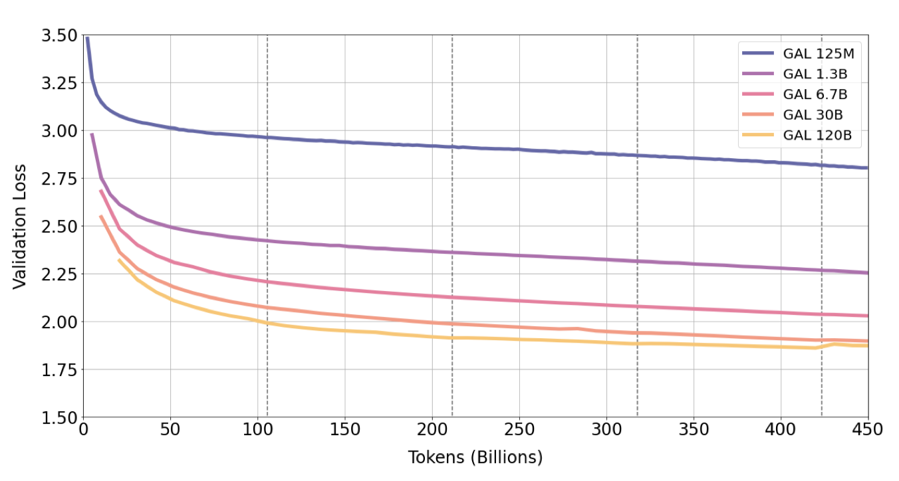

학습 과정 중 4 epoch까지 검증 손실이 지속적으로 감소하며, 가장 큰 120B 모델은 5번째 epoch에서 과적합이 시작되었다. 기존 연구와는 달리 반복 토큰이 성능을 해치지 않았다. 또한, 30B와 120B 모델에서는 검증 손실이 일시적으로 유지되거나 상승한 후에 감소하는 이중하강 현상을 보였고, 이 현상은 각 epoch이 진행됨에 따라 더욱 강해졌다.

검증 손실의 소스별 분석을 통해, 모든 소스에서 손실이 감소하는 것을 확인하였다. 이는 30B 모델에서도 동일하게 나타나고, 120B 모델에서도 모든 소스에서 검증 손실이 감소하는 추세를 보이지만, 5번째 epoch에서 모든 소스가 급증하는 것을 확인하였다.

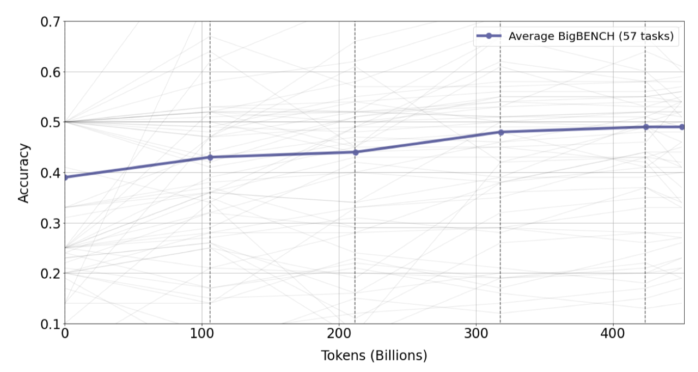

이 트렌드가 downstream 성능과 도메인 외 일반화에도 적용되는지를 검증하기 위해, 주로 비과학적인 작업을 포함한 BIG-bench의 57개 작업 하위 집합을 사용하였다. 결과를 통해 반복 토큰의 사용이 upstream 성능 뿐만 아니라 downstream 성능도 향상시키며, 과적합의 징후는 보이지 않았다.

토큰 당 더 많은 가치를 추출하는 데는 코퍼스의 선별된 특성(품질 요인)과 과학 데이터의 특성(모달리티 요인)이 중요할 수 있다고 생각한다. 하지만 이 두 요인이 과적합 감소로 어떻게 이어지는지는 아직 알 수 없으며, 이에 대한 연구가 필요하다. 현재 대형 언어 모델 프로젝트가 "tokens → ∞"에 초점을 맞추는 것은 코퍼스의 품질 필터링의 중요성에 비해 과대평가되었을 수 있다.

다음 섹션에서는 Galactica의 과학적 능력을 평가하며, 특히 과학적 지식을 저장하고, 결합하며, 이에 대해 추론하는 대형 언어 모델을 구축하는 데 필요한 고수준 설계 목표에 초점을 맞춘다. 이는 새로운 과학 인터페이스를 만드는데 필요하다.

### Knowledge Probes

먼저 Galactica가 얼마나 잘 과학적 지식을 흡수하는지를 평가한다. 이를 위해, Petroni et al. (2019)의 LAMA 접근법을 기반으로 한 지식 탐사 벤치마크를 설정하였고, 이는 코퍼스 내 지식 공백을 식별하고 코퍼스를 반복하는 방법을 결정하는 중요한 지표였다. 이 벤치마크는 Galactica와 일반 언어 모델의 지식 강점을 비교하는데 도움이 되며, 이 결과를 다운스트림 작업에 대해 논의하기 전에 소개한다.

#### LaTeX Equations

여러 과학 분야에서 자주 사용되는 LaTeX 방정식 데이터셋을 만들었다. 방정식 암기는 문제 해결 등의 다양한 작업에 필요하기 때문에 중요하며, 이를 테스트하기 위해 총 434개의 방정식을 사용하였다. Galactica의 결과는 특별히 언급되지 않는 한 zero-shot으로 보고된다.

방정식 이름으로 프롬프트를 제공하고 LaTeX를 생성하였다.

방정식 지식은 규모와 함께 부드럽게 증가한다. Galactica는 일반 코퍼스에서 학습된 더 큰 언어 모델들을 능가하며, 이는 선별된 데이터셋의 가치를 보여준다.

#### Domain Probes

특정 분야에 대한 전문 지식을 추적하기 위해 도메인 프로브를 설정하였다.

* **AminoProbe:** 20가지 일반 아미노산의 이름, 구조, 성질에 대한 데이터셋
* **BioLAMA:** 생물의학적 사실 지식 삼중 체에 대한 데이터셋
* **Chemical Reactions:** 화학 반응에 대한 데이터셋
* **Galaxy Clusters:** 은하단과 성단 분류에 대한 데이터셋
* **Mineral Groups:** 광물과 광물 그룹 분류에 대한 데이터셋

각 분야에 대해 지식을 테스트하는 프롬프트를 만들었다. 예를 들어, 화학 반응에 대해서는 Galactica에게 반응물을 바탕으로 생성물을 예측하도록 요청하였고, 생성물 정보는 마스킹 처리하였다.

지식 탐사에서 대체로 안정적인 스케일링 행동을 보였으나, BioLAMA는 zero-shot 프롬프트의 난이도 때문에 예외적인 결과를 보였다. 특히, "ConstellationOf(GalaxyCluster)"와 같은 세부적인 사실 지식은 모델 크기에 따라 부드럽게 스케일링되는 것으로 나타났다.

#### Reasoning

$<$work$>$ 토큰을 사용한 추론 능력을 평가하기 위해 MMLU 수학 벤치마크를 사용하였다. Galactica는 더 큰 기본 모델에 비해 뛰어난 성능을 보였고, $<$work$>$ 토큰의 사용은 작은 30B Galactica 모델에서도 Chinchilla에 비해 성능을 향상시켰다.

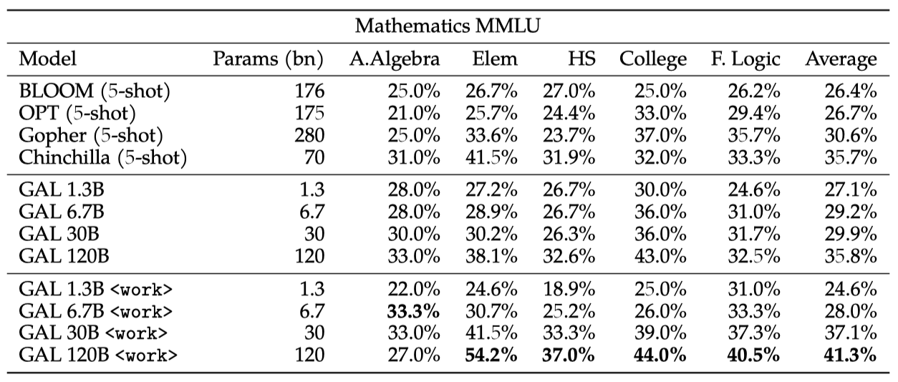

Galactica의 추론 능력을 더욱 탐색하기 위해 MATH 데이터셋을 사용하였다. $<$work$>$ 토큰 프롬프트를 Minerva의 5-shot chain-of-thought 프롬프트인 mCoT와 비교하였다.

Galactica는 chain-of-thought와 $<$work$>$ 프롬프트에서 기본 PaLM 모델을 크게 능가한다. 특히, 크기가 18배 작은 Galactica 30B 모델이 PaLM 540B를 능가함을 보여, 수학적 작업에 대한 미세 조정에 Galactica가 더 적합한 기본 모델일 수 있음을 보여준다.

완전성을 위해 LaTeX에 특화하여 미세 조정된 540B PaLM인 Minerva의 결과를 제시한다. Minerva는 기본 Galactica를 능가하지만, 성능 차이는 일정하지 않아, 이는 다른 수학 데이터 편향을 나타낸다. Minerva와의 직접 비교를 위해, Galactica를 LaTeX에 특화하여 미세 조정하려는 이들이 모델을 자유롭게 사용할 수 있다.

### Downstream Scientific NLP

Galactica가 다른 작업 맥락에서 지식을 얼마나 잘 구성하는지 평가하기 위해 downstream 과학적 작업을 수행하였다. 이를 위해 MMLU 벤치마크와 다른 과학적 QA 벤치마크를 사용하였다. 특히, 지식 연관성을 테스트하기 위해 $<$work$>$ 없이 이전의 MMLU 결과를 포함하였다.

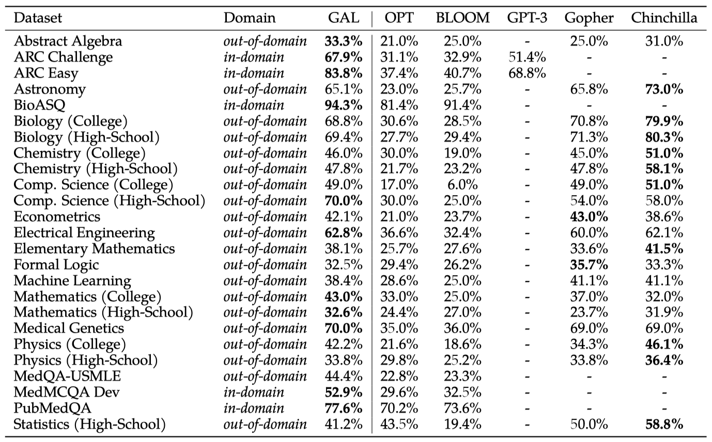

Galactica가 질문-답변 작업에 지식을 효과적으로 통합하며, 다른 오픈 언어 모델들을 크게 능가하고, 대부분의 작업에서 더 큰 모델인 Gopher 280B를 능가하는 것을 확인할 수 있다. Chinchilla와의 성능은 일부 변동성이 있지만, 특히 고등학교 과목과 암기 중심의 작업에서는 Chinchilla가 더 강력해 보인다. 반면, Galactica는 수학적이고 대학원 수준의 작업에서 더 우수한 성능을 보인다.

결과에 대한 가설은 대부분 논문으로 이루어진 Galactica 코퍼스가 대학원 수준의 과학 지식에 편향되어 있어 고등학교 과목에서의 성능이 떨어진다는 것이다. 고등학교 수준의 내용은 백과사전, 교과서, 필터링된 CommonCrawl을 통해 어느 정도 수집하였지만, 이는 전체 토큰의 소수 부분에 불과하다. 이런 기본 과학 지식을 어떻게 더 많이 포착하고 선별하는 방법은 향후 연구 주제로 남겨두었다.

나머지 작업에서는 state-of-the-art를 달성하였다. PubMedQA에서는 77.6%의 점수를 얻어 기존 state-of-the-art인 72.2%를 능가했고, MedMCQA dev에서는 52.9%의 점수를 얻어 기존 state-of-the-art인 41.0%를 능가하였다. 또한, BioASQ와 MedQA-USMLE에서는 미세 조정된 모델의 state-of-the-art에 가까운 성능을 보여주었다.

### Citation Prediction

이 섹션에서는 Galactica의 인용 예측 능력을 평가하였다. 이는 과학 문헌을 조직화하는 능력을 테스트하는 중요한 단계이다. 결과적으로, 정확도와 분포 근사의 품질이 모델 규모와 함께 향상되는 것을 확인하였다.

#### Citation Accuracy

모델의 인용 능력을 평가하기 위해 세 가지 데이터셋을 구성하였다:

* **PWC Citations:** Papers with Code 4에서의 방법론(예: ResNet)과 데이터셋(예: ImageNet)으로 이루어진 머신러닝 개념과 그것들을 소개한 논문의 644쌍의 데이터셋
* **Extended Citations:** Kozac sequence와 Breit-Wigner distribution과 같은 머신러닝이 아닌 개념과 그것들을 소개한 논문의 110쌍의 데이터셋
* **Contextual Citations:** arXiv 검증 세트에서 참조와 맥락의 1,869쌍으로 이루어진 데이터셋. 데이터셋은 무작위로 1,000개의 참조를 샘플링하고 그들의 맥락을 수집함으로써 구성되었다.

PWC 인용과 확장 인용 데이터셋에서는 텍스트 생성 작업으로 인용 예측 작업이 설정되며, 모델에 특정 프롬프트가 주어져 해당 개념에 대한 예측을 생성한다. 반면 맥락적 인용에서는 입력 맥락 후에 프롬프트를 제공하여 인용을 예측한다.

이 작업에서 Galactica를 sparse 및 dense retrieval-based 접근법과 비교한다.

sparse 기준선에 대해, 모든 참조의 제목, 초록, 그리고 그들이 포함된 맥락의 짧은 텍스트에 대한 ElasticSearch 인덱스를 만들고, 텍스트 쿼리가 주어질 때, 선택된 모든 필드에 대한 일치 점수의 합으로 상위 참조를 검색한다.

dense retriever 기준선에 대해, 두 가지 Contriever 모델을 평가하였다. 첫 번째는 사전 학습된 모델이고, 두 번째는 코퍼스에서 무작위로 선택된 1000만 개의 맥락/논문 쌍에 대해 미세 조정된 모델이다. dense retrieval은 각 참조를 모델로 인코딩하고, 텍스트 쿼리를 인코딩하여 쿼리와 일치하는 참조를 반환하는 방식으로 진행되며, 이 과정은 FAISS 인덱스를 사용한다.

모든 평가 세트에서 성능은 규모와 함께 증가하며, 큰 규모에서 Galactica는 맥락-연관성 능력 향상으로 인해 검색 기반 접근법을 능가한다. 이는 언어 모델의 능력이 발전함에 따라 문헌 탐색에 있어 새로운 도구로 활용될 가능성을 보여준다.

#### Citation Distributional Analysis

Galactica가 경험적 인용 분포를 얼마나 잘 모델링할 수 있는지 살펴본다. 이 분석에서는 맥락적 인용 데이터셋을 사용하며, 프롬프트는 인용 이전의 맥락을 가져와 프롬프트로 사용하여 논문에서 추출된다.

맥락 내 인용 데이터를 사용하여 예측된 논문 수와 실제 논문 수의 분포 차이를 분석하였다. 이를 통해 인기 있는 논문을 예측하는 모델의 경향을 평가했다. 각 맥락의 실제 참조와 예측된 참조의 횟수를 계산하고, 이를 Kolmogorov-Smirnov 거리를 사용하여 비교하였다.

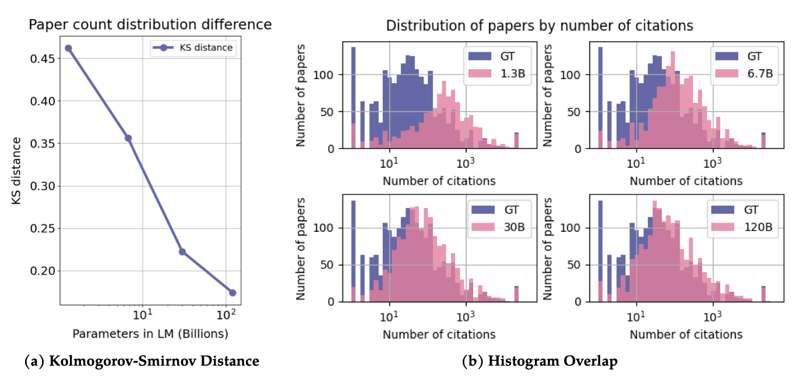

실제 논문 인용 분포와 예측된 논문 인용 분포 간의 차이가 줄어드는 것을 보여주며, 모델 크기가 커짐에 따라 예측된 논문의 인용 횟수 분포가 실제 값에 접근한다. 모델의 크기가 작을 때는 인기 있는 논문을 예측하는 경향이 더 크지만, 이는 모델 크기가 커짐에 따라 감소한다.

### General Capabilities

Galactica의 과학적 능력을 분석하였고, 이는 과학적 작업에서 일반 모델들을 능가하는 전문 과학 모델이다. 더 놀라운 점은, 이 모델이 일반 NLP 작업에서도 일반 모델을 능가한다는 것이다.

57개의 BIG-bench 작업을 통해 Galactica를 평가하였고, 이 작업들은 대체로 과학적이지 않은 일반적인 언어 능력을 테스트한다. 평가는 항상 5-shot으로 진행되며, BIG-Bench의 기본 프롬프트 스타일을 사용한다. 이 평가는 사전 학습에 프롬프트 스타일이 포함되지 않으므로, Galactica와 다른 모델들 간의 비교 가능한 5-shot 평가이다.

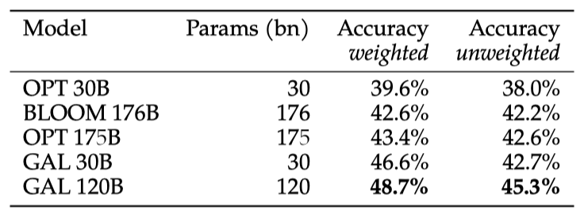

30B와 120B 크기의 Galactica 모델은 더 큰 OPT와 BLOOM 일반 모델보다 더 우수한 성능을 보여주었는데, 이는 과학적 작업에 특화되도록 설계된 Galactica가 일반적인 작업에서도 뛰어난 성능을 보인 것이 놀라운 결과이다.

이 결과는 Galactica 코퍼스의 높은 품질이 반영된 것으로, 이는 큐레이션되고 주로 학문적 텍스트로 구성되었기 때문이다. 이전의 오픈 LLM 노력은 규모에 과도하게 집중하고 데이터 필터링에는 충분히 주목하지 않았을 수 있다. 이 논문에서는 높은 품질의 토큰과 반복적인 학습에 초점을 맞추었지만, Chinchilla의 통찰력이 유효하며, 아직 활용하지 못한 많은 과학적 텍스트가 있다는 사실을 인지하고 있다.

#### IUPAC Name Prediction

SMILES는 화학 구조를 문자로 표현하는 방법이다. Galactica 코퍼스에서는 이 SMILES 공식이 문서 정보와 함께 제공되며, 이를 통해 언어 모델은 암시적으로 다중 작업 학습을 수행한다. 즉, 모델은 다음 SMILES 토큰을 예측하는 동시에, SMILES를 사용하여 문서의 다른 정보를 예측할 수 있다.

초기 테스트로, SMILES 공식 입력을 바탕으로 화합물을 IUPAC 명명법에 따라 명명하는 작업을 설정했다. IUPAC 명명법은 복잡한 알고리즘에 따라 유기 화합물을 명명하는 방법이며, 이는 표준 화학정보학 툴킷에서 누락되어 있어 자동화하기 어렵다.

이전 연구들(STOUT, Struct2IUPAC 등)에서는 이 작업에 RNN과 Transformer를 사용한 경우를 탐색하였다. 이번 섹션에서는 self-supervised 학습 환경에서 Galactica가 SMILES 명세를 IUPAC 이름으로 번역할 수 있는지를 검토한다. 이를 위해 PubChem 구조를 기반으로 한 프롬프트를 설계하였고, SMILES를 입력으로 하여 IUPAC 이름을 예측하는 것을 목표로 한다.

17,052개의 화합물 검증 세트를 사용하여 SMILES 공식을 프롬프트로 하고 IUPAC 이름을 예측하였다. 정확도는 생성된 IUPAC 이름을 SMILES로 변환하고 정규화한 후, 이를 목표 SMILES와 비교하여 계산하였다.

모델의 정확도는 규모가 커질수록 부드럽게 증가하며, 코퍼스를 200만 분자로 제한했지만 더 많은 분자에 대해 학습하거나 미세 조정하면 더욱 뛰어난 성능을 얻을 수 있을 것이다. 이 모델은 후속 작업을 원하는 사람들이 자유롭게 사용할 수 있다.

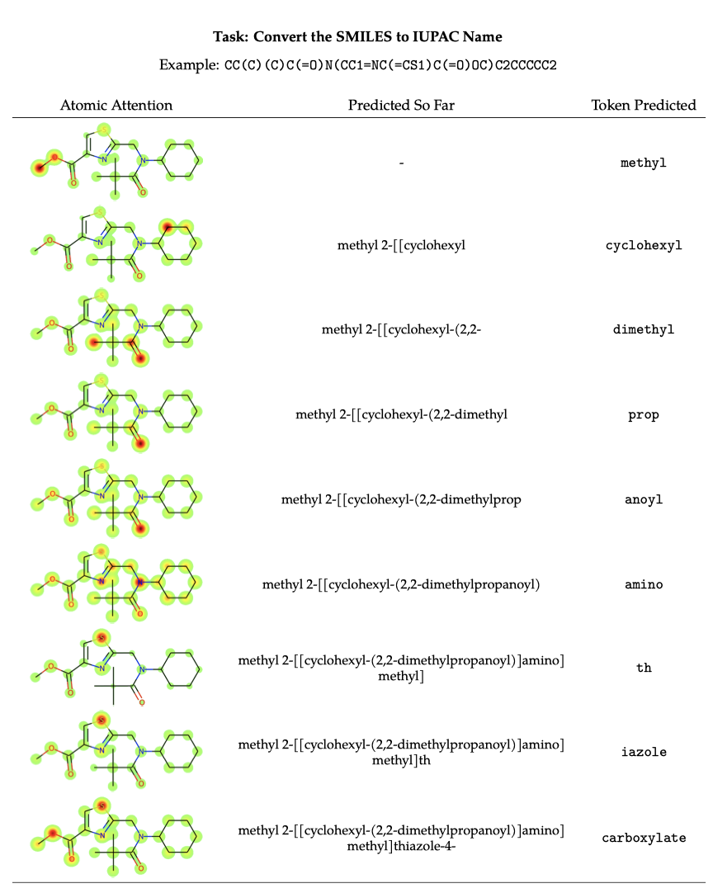

실제로 Galactica가 어떤 것을 배우는지 분석하기 위해, 예측의 각 단계에서 평균 원자 주의를 시각화하였다. 결과적으로 Galactica는 이름을 예측할 때 올바른 화학 그룹에 주목하는 것으로 나타났다. 예를 들어 "아미노"에 대해 주로 $-NH_2$ 치환체에 주목하였다.

#### MoleculeNet

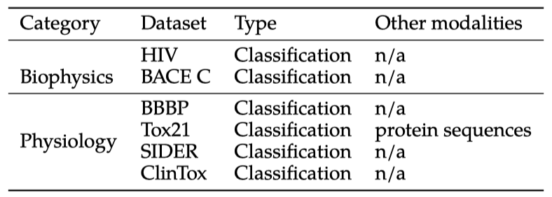

전통적인 약물 발견 작업을 자연어 형식으로 변환하고, 이에 여러 방식을 결합할 수 있는지를 탐색하고 있다. 자연어와 과학적 모델인 SMILES 사이의 인터페이스를 학습하는 것은 화학 공간 탐색의 새로운 도구가 될 수 있다. 이에 대한 답변을 위해, MoleculeNet 분류 벤치마크를 사용하였다.

평가를 위해 학습 세트를 텍스트 형식으로 변환하여 사전 학습에 포함시키고, 질문이 제기되는 방식을 다양화하는 프롬프트 무작위화를 사용한다. 이러한 예시들은 학습 과정에서 다른 말뭉치들과 함께 사용되며, 각 예시는 대략 4회 이상 보여진다. 이 방법은 사전 학습 데이터의 다양성 때문에 직접적인 미세 조정이나 감독과는 다르며, 약한 감독의 형태로 볼 수 있다.

일부 MoleculeNet 데이터셋에서는 다른 방식이 암시적으로 포함되어 있다. 예를 들어, Tox21 데이터셋의 생물학적 분석은 특정 수용체, 예를 들어 안드로겐 수용체(AR)와 관련이 있다.

SMILES를 Kekulize하여 PubChem 표현과 일치시키며, 평가를 위해 DeepChem 라이브러리의 권장 분할을 사용한다.

모델의 성능은 모델 크기와 비례하여 증가한다. 하지만 이 증가 속도는 QA와 같은 작업보다 느리고, 기본 모델은 3D 정보와 10배 이상의 분자를 포함한 전문 모델에 비해 성능이 떨어진다. 이 작업에는 미세 조정과 더 많은 분자 데이터가 필요하며, 이를 위한 모델이 준비되어 있다.

이 연구는 자연어 프롬프트를 통해 약물 발견 작업을 배울 수 있음을 시사한다. 이 관계를 신호 밀도가 높은 문서(예: 온라인 화학 데이터베이스)에서 자동으로 학습할 수 있다면, 감독된 데이터셋에 대한 의존성을 줄일 수 있을 것이다.

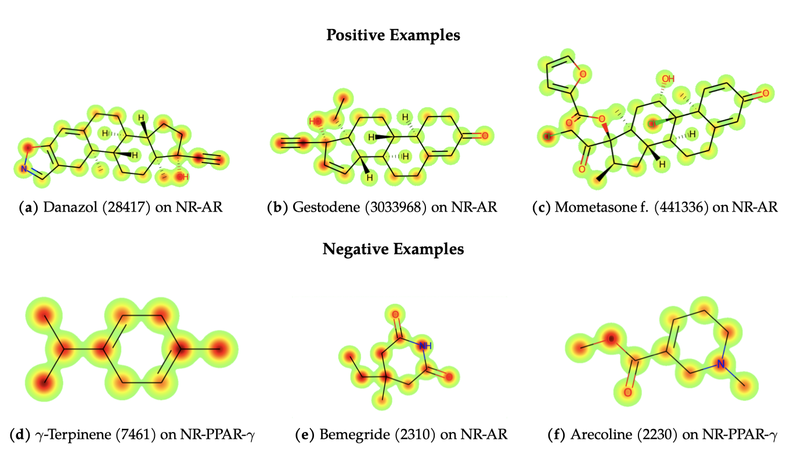

최종적으로, Galactica의 주의 헤드를 계층별로 평균화하여, 모델이 SMILES 시퀀스에서 어디를 주시하는지(원자 주의) 시각화하였다.

### Biological Understanding

Galactica의 생물학적 방식과의 인터페이스 능력을 검토한다. 언어 모델은 새로 시퀀스된 단백질에 기능 정보를 주석 처리하는 등의 데이터 자동화에 활용될 수 있다. 여기서는 이러한 인터페이스의 가능성을 탐색한다.

UniProt의 단백질 시퀀스 중 일부를 사전 학습에 포함시키며, 이는 모델이 자연어보다 자연 시퀀스를 과도하게 학습하는 것을 방지하기 위함이다. 이 제약은 미래의 연구에서 완화될 수 있으며, 이를 통해 말뭉치를 크게 확장할 수 있다. 현재는 단일 모델이 다중 모달 설정에서 효과적으로 학습할 수 있는지에 초점을 맞추고 있다.

언어 모델이 시퀀스 유사성의 암시적인 측정치를 학습하여 기능 주석과 설명과 같은 작업에 사용할 수 있음을 발견하였다.

#### Sequence Validation Perplexity

Galactica는 단백질의 3D 구조를 직접 모델링하지 않지만, 선형 아미노산 시퀀스에는 특정 구조를 결정하는 정보가 포함되어 있다. 단백질 시퀀스의 perplexity를 평가하여 성능을 테스트하며, 데이터 유출을 방지하기 위해 검증 세트를 구성하는 것이 중요하다. 이를 위해 네 개의 보류 세트를 구성하여 학습과 일반화에 대한 확신을 더하였다.

학습 세트의 시퀀스에 BLAST를 수행하여 51개 CASP14 타겟 시퀀스와 50% 이상 동일한 시퀀스를 제거한다. 이는 ESMFold에서 사용된 테스트 시퀀스와 동일하다. 이 방법으로 총 167개 시퀀스를 제거하였고, 이를 CASPSimilarSeq라 부른다. 51개의 CASP14 타겟 시퀀스는 CASPSeq라고 명명했다.

생물 종 수준에서 보류를 진행하고, 코끼리, 코끼리쥐, 해우, 어덕 등의 Paenungulata 계통의 모든 시퀀스를 제거한다. 이는 Galactica가 이전에 접하지 않은 생물체의 시퀀스를 주석 처리할 수 있는지 테스트하기 위함이다. 이 방법으로 109개 시퀀스를 제거하였고, 이를 PaenSeq라 부른다. 이는 시퀀스 유사성 제약을 적용하지 않는 것으로, 학습 세트에는 매우 유사한 시퀀스가 있을 수 있다.

마지막으로, 5456개의 시퀀스로 이루어진 무작위 테스트 분할을 진행한다. 시퀀스 동일성 제약이 없어 기억력이 중요할 수 있지만, 모델이 얼마나 많은 시퀀스 지식을 흡수했는지에 대한 정보를 제공한다. 이 보류 세트를 UniProtSeq라고 부른다.

세 검증 세트에서는 부드러운 스케일링을 보여주며, 이는 학습 세트의 시퀀스와 높은 유사성을 가질 가능성을 보여준다. 반면, 시퀀스 유사성 제약이 있는 CASP 세트는 수준이 떨어지는 것을 보여준다. 이는 550k 단백질 학습에서 얻은 이익이 빠르게 포화되는 것을 나타낸다.

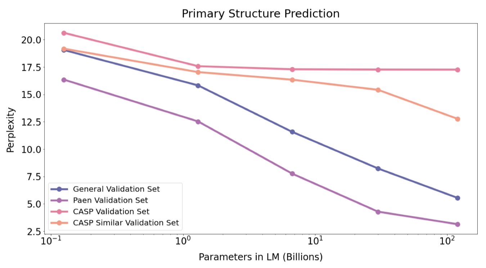

더 자세히 조사하기 위해, 우리는 120B 모델의 학습 중에 CASPSeq 세트에서의 검증 혼돈도를 살펴보았다.

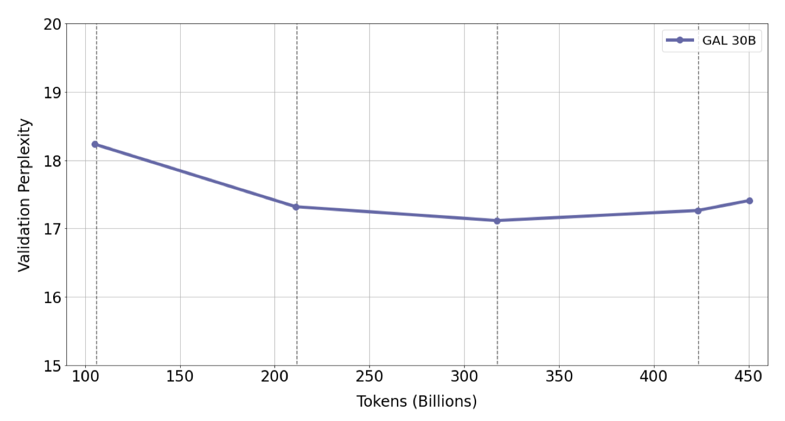

네 번째 epoch 시작까지 검증 혼돈도가 떨어지다가, 이 시점에서 이 특정 데이터셋에 대해 모델이 과적합하는 것을 관찰했다. 이는 Galactica가 테스트 세트와 크게 다른 도메인 외부의 단백질에서 성능이 떨어짐을 나타낼 수 있다. 미래의 작업에서는 반복을 줄이고 학습 데이터셋의 단백질 다양성을 증가시키는 것이 유익할 것으로 보인다.

#### Functional Keyword Prediction

단백질 시퀀스에서 자연어로의 번역 능력을 테스트하며, 이는 단백질 주석 작업에 유용할 수 있다. 첫 번째 테스트로서, Galactica가 시퀀스에서 추론할 수 있는 UniProt 키워드를 살펴보았다.

F1 점수는 보류 세트에 따라 증가하며, 이는 Galactica가 시퀀스를 통해 키워드를 학습할 수 있음을 보여준다. 그러나 CASPSimSeq에서는 포화 상태를 보여주어, 이 기능이 학습 세트의 시퀀스와 얼마나 유사한지에 따라 달라질 수 있음을 나타낸다.

단백질 시퀀스에서의 주의를 시각화하려 했으나, 생물학적 해석(예: 도메인에 대한 주의)을 찾지 못했다. Galactica는 예측된 키워드를 연결하기 위해 시퀀스 유사성의 암묵적 척도를 학습했지만, 이는 주의를 기울이는 위치에서 직접적으로 해석할 수 없다는 가설을 세웠다. 이는 기본 원자 구조에 대한 주의를 통해 결과를 해석할 수 있었던 화학 분석과 다르다.

#### Protein Function Description

다음 테스트에서는 시퀀스를 기반으로 단백질 기능에 대한 자유 형식의 설명을 생성하고, 이를 UniProt의 기능 설명과 비교한다.

ROUGE-L 점수는 모든 보류 세트에서 부드럽게 증가한다. 학습 세트에서 가장 유사한 시퀀스는 83%의 시퀀스 유사성을 가진 pygmy hippopotamus(O03363)의 Cytochrome b 단백질입니다. 이 경우, 설명에서 완벽한 예측을 얻었다.

Galactica는 학습 과정에서 본 유사한 시퀀스와 일치시키는 방식으로 학습하고, 이를 바탕으로 설명을 형성하는 것으로 보인다. 이는 BLAST와 MMseqs2와 같은 기존 검색 방법 대신 단백질 시퀀스에 대한 언어 모델을 유용하게 사용할 수 있음을 보여준다.

---

## Toxicity and Bias

이 섹션에서는 Galactica 모델의 독성과 편향성을 연구하며, 스테레오타입, 독성, 오정보와 관련된 벤치마크를 통해 평가한다. 결과적으로, Galactica는 기존 언어 모델들보다 훨씬 덜 편향되고 독성이 낮다는 것을 확인하였다.

### Bias and Stereotypes

다음 평가에서는 널리 사용되는 네 가지 벤치마크를 사용하여 Galactica의 유해한 스테레오타입과 혐오 발언을 감지하고 생성하는 능력을 조사한다.

#### CrowS-Pairs

CrowS-Pairs는 "더" 스테레오타입화된 문장과 "덜" 스테레오타입화된 문장의 1,508 쌍을 모아놓은 것으로, 다양한 특징들(인종, 종교, 사회경제적 지위, 나이, 장애, 국적, 성적 지향, 외모, 성별)을 포함하고 있다. 언어 모델의 스테레오타입 콘텐츠 선호도는 "더" 스테레오타입화된 문장이 선호되는 비율로 측정되며, 높은 점수는 더 큰 편향을 나타낸다. 편향이 없는 이상적인 모델은 50%를 점수로 받을 것이다.

Galactica는 최신 GPT-3와 OPT 175B와 비교했을 때 대부분의 카테고리에서 훨씬 낮은 스테레오타입 편향을 보여주며, 다른 모델들에 비해 더 나은 전체 점수인 60.5%를 얻었다. OPT와 같은 언어 모델은 주로 Reddit 말뭉치를 데이터 소스로 사용하여 더 많은 차별적 연관성을 학습하는 반면, Galactica는 스테레오타입과 차별적 텍스트의 발생률이 더 낮을 것으로 예상되는 과학 말뭉치에서 학습한다.

#### StereoSet

StereoSet은 직업, 종교, 성별, 인종 등에 대한 스테레오타입 편향을 측정하는 것을 목표로 한다. 이 벤치마크에는 문장 내 작업과 문장 간 작업, 그리고 개발 세트에 각각 약 2,100개의 예제가 포함되어 있다.

* **Intrasentence Task:** 스테레오타입과 관련 컨텍스트가 같은 문장에 있다.
* **Intersentence Task:** 컨텍스트와 스테레오타입이 다른(연속적인) 문장에 있다.

StereoSet의 각 예제에는 스테레오타입과 반-스테레오타입 문장 변형과 함께 관련 없는 문장이 포함되어 있다. 이는 언어 모델링 점수(LMS)와 스테레오타입 점수(SS)를 측정하기 위한 것이며, 이 두 지표는 편향 탐지와 언어 모델링을 균형있게 측정하는 이상적 컨텍스트 연관 테스트 점수(ICAT)를 형성한다. 이상적인 편향 없는 언어 모델은 LMS 100, SS 50, ICAT 100의 점수를 받는다.

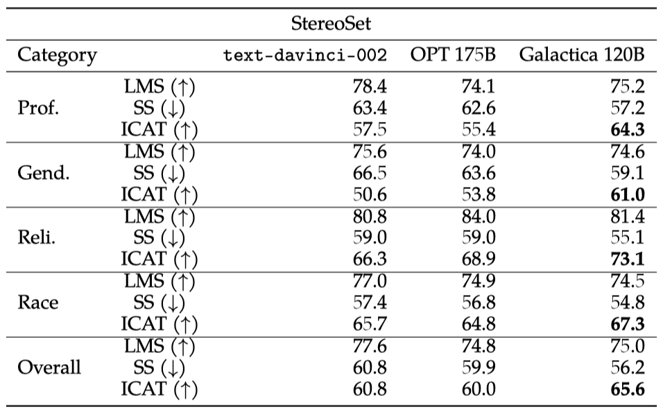

Galactica는 전체 ICAT 점수에서 모든 카테고리에서 다른 모델들을 능가한다.

#### Toxicity

독성 측정을 위해, Gehman et al. (2020)에서 제안한 RealToxicityPrompts (RTP) 벤치마크를 사용한다. RTP에서 무작위로 추출한 5000개의 프롬프트 각각에 대해 핵심 샘플링을 사용하여 20개 토큰의 25세대를 샘플링하고, 이를 바탕으로 시퀀스를 생성한다. 생성된 시퀀스는 Perspective API가 제공하는 독성 분류기에 의해 점수가 매겨진다.

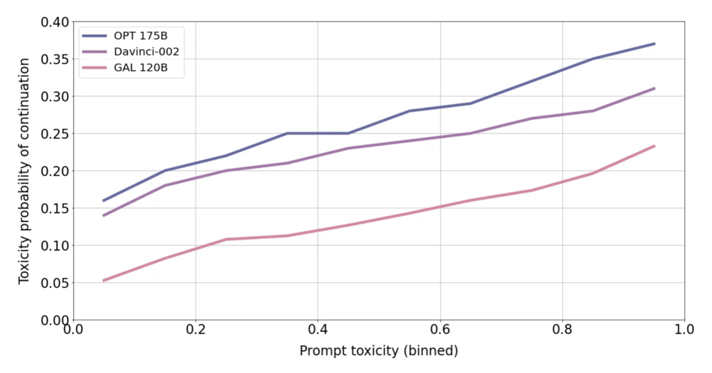

원래 프롬프트의 독성 분포(x축)에 따른 연속적인 반응의 평균 독성 확률(y축)을 보여준다. 여기서 Galactica는 다른 모델들에 비해 훨씬 낮은 독성을 보여준다.

### TruthfulQA

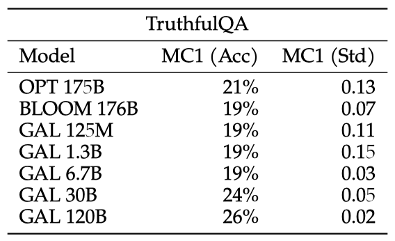

TruthfulQA는 언어 모델의 답변의 진실성을 측정하는 벤치마크로, 건강, 법, 재무 등 다양한 카테고리의 817개의 질문으로 구성되어 있다. 결과에 따르면, Galactica는 이 벤치마크에서 다른 언어 모델들보다 더 뛰어난 성능을 보여주지만, 절대적인 성능은 여전히 낮다. 이는 데이터만으로는 언어 모델이 이 작업에서 어려움을 겪는 것을 야기하지 않는다는 것을 시사한다.

---

## Limitations and Future Work

### Limitations

**Corpus Limitations** 말뭉치는 오픈 액세스 자원에 대한 제한과 같은 외부적인 제약과, 분자와 단백질의 수를 제한하는 내부적인 제약이 있다. 많은 과학적 지식이 오픈 액세스가 아니므로, 이러한 폐쇄적인 지식 소스에 접근하면 성능이 상당히 향상될 것으로 예상된다. 또한, 내부적인 제약 없이는 더 큰 말뭉치로 인해 성능이 크게 향상될 것으로 예상된다.

**Corpus Effects vs Prompt Effects** 여러 벤치마크에서 기존 언어 모델에 비해 성능 향상을 보여주지만, 사전 학습에 포함된 프롬프트와 핵심 과학 말뭉치의 효과를 구분하지 않았다. 향후에는 프롬프트 부스팅 없이 과학 말뭉치만으로도 일반적인 언어 능력이 가능한지 확인하기 위해 이들을 분리해야 할 것으로 보인다.

**Citation Bias** 모델이 크기에 따라 실제 인용 분포에 접근한다는 것을 보여주지만, 120B 규모의 모델에서는 인기 있는 논문에 대한 편향이 여전히 존재하므로, 제품 환경에서 사용하기 전에 모델을 증강하는 것이 필요할 것으로 보인다.

**Prompt Pre-Training vs Instruction Tuning** 이 논문에서는 특정 접근법을 선택했지만, 이상적으로는 최근의 연구와 같은 방식으로 다른 접근법이 달성할 수 있는 것을 탐색해야 한다. 이 연구의 한계는 접근법 간의 타협점을 명확하게 하지 않는 직접적인 비교를 수행하지 않는다는 것이다.

**General Knowledge** Galactica는 위키피디아 등을 통해 사회적 지식을 흡수하지만, 예를 들어 코타키나발루가 말레이시아의 사바 주의 수도라는 것을 알아도, 이러한 지식이 필요한 작업에는 사용하지 않는 것이 좋습니다. 이는 그것이 의도된 사용 사례가 아니기 때문입니다.

**Text as a Modality** 텍스트 기반의 transformer가 과학적 표현에 강력하다는 것을 보여주었지만, 텍스트만이 충분하다는 해석은 조심해야 한다. 예를 들어, 화학에서는 기하학이 중요한 역할을 하지만, Galactica는 기하학적 개념, 예를 들어 원자의 3D 좌표 등을 이해하지 못한다.

### Future Work

**New Objective Function** U-PaLM의 최근 연구에 따르면, 노이즈 제거 학습의 혼합을 통해 더욱 향상된 결과를 얻을 수 있을 것으로 보인다. 이는 왼쪽에서 오른쪽으로의 LM 목표가 제한적인 단백질 시퀀스와 같은 과학적 분야에서 특히 도움이 될 것으로 예상된다.

**Larger Context Window** 이 작업에서는 최대 2048 토큰의 컨텍스트 window size를 사용한다. 이를 확장하면 교과서와 같은 장문의 과학 문서나 긴 시퀀스를 가진 문서(예: 긴 단백질 시퀀스)의 이해에 도움이 될 것으로 예상된다.

**Extending to Images** 이미지를 캡처하지 않고는 과학적 지식을 적절하게 포착할 수 없다. 이는 자연스럽게 이어지는 프로젝트이지만, 이를 잘 작동시키기 위해서는 아마도 일부 구조적 수정이 필요할 것이다. Alayrac et al. (2022)의 기존 연구가 이 방식으로 LLMs를 확장하는 방법을 보여주었다.

**More $<$work$>$ examples** $<$work$>$가 일반적인 목적의 추론 토큰이 될 수 있다고 생각하며, 프롬프트의 다양성을 늘리고 더 많은 벤치마크에서의 성능을 탐색하는 등 이 방향으로 더 많은 투자를 하고 싶다.

**Verification** 언어 모델이 규모와 함께 더욱 정확해짐에도 불구하고, 그들의 생성물이 정확하고 사실적인지에 대한 확신이 필요하다. 이 계층을 개발하는 것은 과학적 응용 분야를 넘어 일반적인 언어 모델의 생산적인 응용에 있어 중요하다.

**Continual Learning** 새로운 과학적 지식을 통합하기 위해 처음부터 다시 학습을 해야 할지, 아니면 이전 체크포인트에서 학습을 시작해야 할지는 여전히 미해결된 질문이다. 이 모델에 새로운 지식을 통합하는 가장 좋은 절차를 찾기 위해서는 추가적인 연구가 필요하다.

**Retrieval Augmentation** 어떻게 큰 언어 모델이 큰 과학적 지식을 흡수하는지 보여주었지만, 세분화된 유형의 지식을 위한 검색은 여전히 중요하며, 이는 transformer의 유연한 가중치 메모리를 보완하기 위해 추구할 가치가 있는 방향이라고 생각한다.

---

## Discussion and Conclusion

과학적 지식에 접근하는 주요 방법은 오랫동안 저장하고 검색하는 방식이었다. 하지만 이 방법은 정보의 추론이나 조직화가 인간의 노력에 의존하므로 지식 처리량이 제한된다. 이 작업에서는 언어 모델이 이러한 패러다임을 어떻게 변화시키고 새로운 지식과의 인터페이스를 제공하는지를 탐구하였다.

언어 모델은 기술적 지식을 탁월하게 흡수하며, 이 능력은 모델 크기가 커질수록 더욱 강화된다. 이는 장기적으로 검색 엔진보다 더 큰 이점을 제공하며, 인용 예측 등의 작업에서 뛰어난 성능을 보인다. 언어 모델은 앞으로 문헌과 과학적 지식 탐색의 중요한 도구가 될 것으로 예상된다.

언어 모델은 지식 집중적인 질문 응답 작업에서 잘 수행하도록 지식을 단계별로 구성할 수 있다. 이를 통해 MMLU와 MATH 벤치마크에서 뛰어난 성능을 보여주었다. MATH와 같은 작업은 원칙적으로 언어 모델로 해결 가능하지만, 현재는 고품질의 단계별 데이터셋의 부족이 제한 요인이다. 그러나 언어 모델이 적응형 계산을 지원하는 구조적 변화를 가질 때까지는 인간처럼 작업을 수행하지는 않을 것이다.

LLM이 과학적 방식과 자연어를 연결하는 잠재력에 대한 초기 조사를 수행하였다. Galactica가 IUPAC 명명 등의 작업을 자체적으로 학습하고, 약물 발견 작업인 MoleculeNet을 자연어로 표현하여 뛰어난 결과를 얻을 수 있음을 보여주었다. 마지막으로, 자동 단백질 주석과 같은 작업의 가능성을 제시하였다. 결국, 자연어와 자연 순서를 연결하는 데이터셋을 늘리면 성능이 더욱 향상될 것으로 보인다.

언어 모델이 현재 인간의 전문 영역인 지식 작업을 수행할 강력한 잠재력이 있다고 느낀다. 모델을 공개하여 다른 사람들이 이 연구의 작업을 기반으로 발전시킬 수 있도록 하고, 이를 어떻게 발전시킬지에 대한 오픈 머신 러닝 커뮤니티의 참여를 기대하고 있다.

---

## Reference

* [Paper](https://arxiv.org/pdf/2211.09085.pdf)