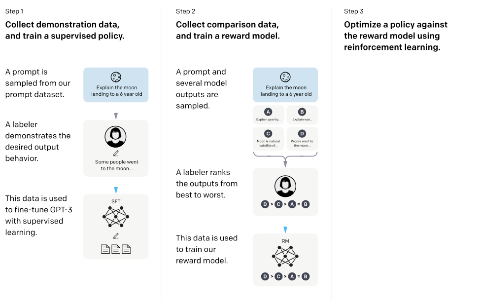
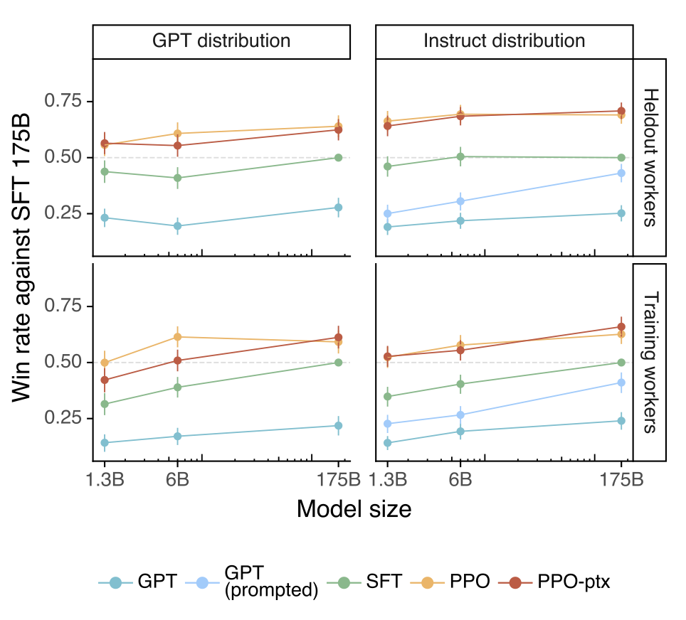
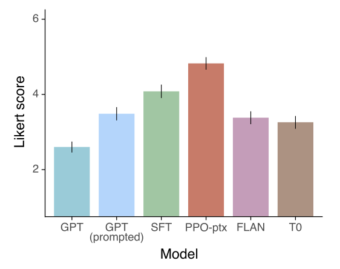
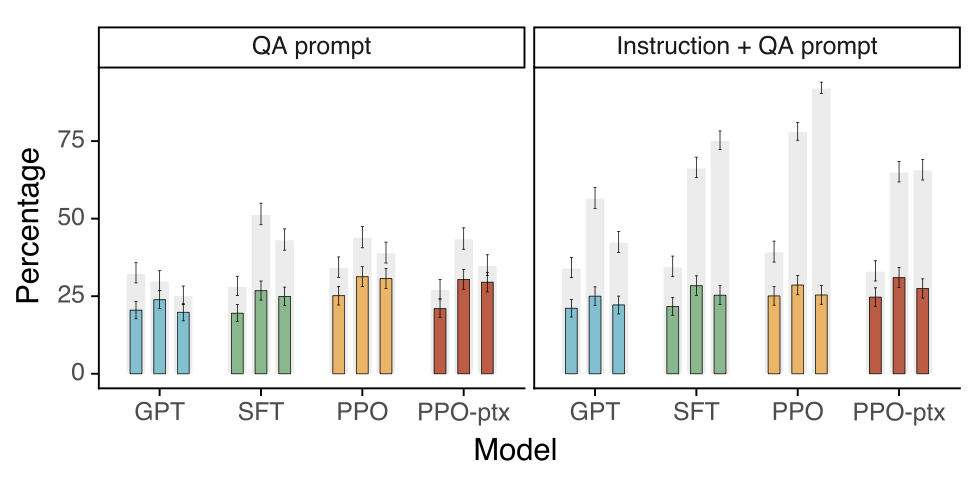
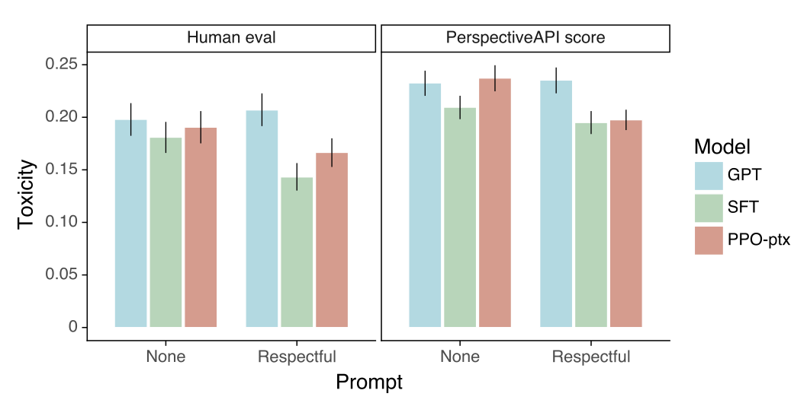

+++
author = "Kurt"
title = "InstructGPT"
date = "2024-01-23"
description = "Training language models to follow instructions with human feedback"
categories = [
    "Paper Review",
]
tags = [
    "LLM",
    "Milestone",
]
+++

## Abstract

이 논문은 인간의 피드백을 통해 언어 모델을 미세 조정함으로써 사용자의 의도에 더 잘 부합하도록 만드는 방법을 제시한다. 라벨러가 작성한 프롬프트와 OpenAI API를 통해 제출된 프롬프트를 이용해서 데이터셋을 수집하고, 이를 GPT-3를 지도 학습으로 미세 조정하는데 사용하였다. 그 다음, 모델 출력의 순위를 나타내는 데이터셋을 수집하고, 이를 인간의 피드백에서 강화 학습을 통해 이 감독 모델을 더 미세 조정하였다. 이 결과로 나온 모델을 InstructGPT라고 부른다. 인간의 평가에서는 parameter 수가 훨씬 적은 1.3B parameter를 가진 InstructGPT 모델의 출력이 175B GPT-3의 출력보다 선호되었다.

---

## Introduction

대규모 언어 모델은 다양한 자연어 처리 작업을 수행할 수 있지만, 종종 사실을 만들어내거나 편향된 텍스트를 생성하거나 사용자의 지시를 따르지 않는 등의 문제가 있다. 이는 언어 모델링의 목표와 "사용자의 지시를 도움이 되고 안전하게 따르라"는 목표가 서로 다르기 때문인데, 이를 "목표의 불일치(misaligned)"라고 한다. 이러한 문제를 피하는 것은 수많은 애플리케이션에서 사용되는 언어 모델에게 매우 중요하다.

사용자의 의도에 따라 언어 모델을 학습시키는 방법을 통해 언어 모델의 alignment를 개선하고 있다. 이는 지시 사항을 따르는 것과 같은 명시적인 의도 뿐만 아니라, 사실적이고 편향되지 않으며 독성이 없거나 해로운 행동을 하지 않는 것과 같은 암시적인 의도를 포함한다. 언어 모델이 사용자의 작업을 해결하는 데 도움이 되고, 정보를 조작하거나 사용자를 오도하지 않으며, 사람이나 환경에 해를 끼치지 않는 모델을 목표로 한다.

언어 모델을 사용자의 의도와 맞추기 위해, 강화 학습을 통해 GPT-3을 미세 조정하는 방법에 초점을 맞추었다. 인간의 피드백을 보상 신호로 사용하여 모델을 미세 조정하였다. 

OpenAI API에 제출된 프롬프트에 대한 원하는 출력 행동의 인간이 작성한 시연 데이터셋을 수집하였고, 이를 사용하여 지도 학습 기본선을 훈련시켰다. 또한, 더 큰 세트의 API 프롬프트에서 모델의 출력 사이의 인간이 라벨링한 비교 데이터셋을 수집하였다. 이 데이터를 통해 보상 모델을 학습시키고, 이를 보상 함수로 사용하여 지도 학습 기준을 미세 조정하였습니다. 이 결과로 만들어진 모델을 InstructGPT라고 부른다.

주로 학습 데이터에 포함되지 않은 고객의 프롬프트로 구성된 테스트 세트에서 모델 출력의 품질을 평가한다. 또한, 다양한 공공 NLP 데이터셋에서 자동 평가를 실시한다. 세 가지 모델 크기(1.3B, 6B, 175B parameter)를 학습시키며, 모든 모델은 GPT-3 아키텍처를 사용한다.

**Labelers significantly prefer InstructGPT outputs over outputs from GPT-3.** 테스트 세트에서, 1.3B parameter를 가진 InstructGPT 모델의 출력은 100배 이상의 적은 parameter에도 불구하고 175B GPT-3의 출력보다 선호되었다. 175B InstructGPT의 출력은 85 $\pm$ 3%의 시간 동안 175B GPT-3의 출력보다, 그리고 71 $\pm$ 4%의 시간 동안 few-shot 175B GPT-3에 대해 선호되었다. InstructGPT 모델은 또한 더 적절한 출력을 생성하고, 지시사항의 명시적 제약을 더 신뢰성 있게 따랐다.

**InstructGPT models show improvements in truthfulness over GPT-3.** TruthfulQA 벤치마크에서, InstructGPT는 GPT-3보다 두 배 이상 사실적이고 유익한 답변을 생성한다. "closed-domain" 작업에서, InstructGPT 모델은 GPT-3에 비해 입력에 없는 정보를 만들어내는 빈도가 절반 정도로 줄었다(각각 21% vs. 41%의 hallucination).

**InstructGPT shows small improvements in toxicity over GPT-3, but not bias.** toxicity를 측정하기 위해, RealToxicityPrompts 데이터셋을 사용하여 자동 및 인간 평가를 실시하였다. 존중스럽게 행동하도록 요청했을 때, InstructGPT 모델은 GPT-3보다 약 25% 적은 toxicity 출력을 생성했다. 하지만, InstructGPT는 Winogender와 CrowSPairs 데이터셋에서 GPT-3보다 크게 개선되지 않았다.

**We can minimize performance regressions on public NLP datasets by modifying our RLHF fine-tuning procedure.** RLHF 미세 조정 중에, 특정 공공 NLP 데이터셋에서 GPT-3에 비해 성능이 떨어지는 것을 관찰하였다. 이는 "정렬 세금"의 예시로, 특정 작업에서의 성능 하락 비용을 수반합니다. 그러나, 라벨러 선호 점수를 손상시키지 않으면서 이러한 데이터셋에서의 성능 하락을 크게 줄일 수 있습니다. 이는 사전 훈련 분포의 로그 가능도를 증가시키는 업데이트와 PPO 업데이트를 혼합함으로써 가능합니다.

**Our models generalize to the preferences of “held-out” labelers that did not produce any training data.** 초기 실험에서, 보류된 라벨러들은 학습 라벨러들과 비슷한 비율로 InstructGPT의 출력을 GPT-3의 출력보다 선호하는 것으로 나타났다. 그러나, 이 모델들이 더 넓은 사용자 그룹에서 어떻게 작동하고, 사람들이 원하는 행동에 대해 의견이 분분한 경우 어떻게 작동하는지에 대한 추가 연구가 필요하다.

**Public NLP datasets are not reflective of how our language models are used.** 인간 선호 데이터에 따라 조정된 GPT-3 (InstructGPT)는 다양한 공개 NLP 작업에 따라 조정된 GPT-3인 FLAN과 T0 모델과 비교하였다. 결과적으로, InstructGPT는 FLAN과 T0 모델보다 더 선호되었으며, API 프롬프트 분포에서 이들 모델보다 더 좋은 성능을 보였주였다.

**InstructGPT models show promising generalization to instructions outside of the RLHF finetuning distribution.** InstructGPT는 코드를 요약하고 코드에 대한 질문에 답하는 등의 지시사항을 따르며, 미세 조정된 분포에서 드물게 나타나는 다른 언어의 지시사항도 따르는 능력이 있다. 반면에, GPT-3는 이런 작업을 수행하기 위해 더 신중한 프롬프팅이 필요하며, 일반적으로 이런 영역에서의 지시사항을 따르지 않는다. 이 결과는 우리의 모델이 "지시사항을 따르는 (following instructions)" 개념을 일반화하는 능력을 가지고 있음을 보여준다.

**InstructGPT still makes simple mistakes.** InstructGPT는 여전히 지시사항을 따르지 못하거나, 사실을 만들어내거나, 간단한 질문에 대해 긴 답변을 제공하거나, 거짓 전제를 가진 지시사항을 인식하지 못하는 문제가 있다.

인간의 선호도를 사용하여 대규모 언어 모델을 세밀하게 조정하면 다양한 작업에서 그들의 행동이 크게 개선되지만, 안전성과 신뢰성을 향상시키기 위해 더 많은 작업이 필요하다.

---

## Related work

**Research on alignment and learning from human feedback.** 이 연구는 인간의 의도에 따라 모델을 조정하는 기존 기술, 특히 인간의 피드백으로부터의 강화학습에 기반을 두고 있다. 이 방법은 원래 간단한 로봇 훈련에 사용되었으며, 최근에는 텍스트 요약을 위한 언어 모델 조정에 적용되었다. 이 방법은 다양한 영역에서 인간의 피드백을 보상으로 사용하는 유사한 작업에 영향을 받았다. 광범위한 언어 작업에 대한 언어 모델의 정렬을 위한 강화학습의 직접적인 적용으로 볼 수 있다.

언어 모델이 alignment되는 것이 무슨 의미인지에 대한 질문이 최근 주목 받았다. 일부 연구에서는 alignment의 부재로 인한 언어 모델의 행동적 문제를 분석하였고, 다른 연구에서는 alignment 연구를 위한 언어 보조 도구를 제안하고, 간단한 기준과 스케일링 속성을 연구하였다.

**Training language models to follow instructions.** 이 연구는 언어 모델에서 다양한 공공 NLP 데이터셋에 대해 세밀하게 조정하고, 다른 NLP 작업 세트에서 평가하는 크로스태스크 일반화 연구와 관련이 있다. 여러 연구에서 일관적으로 나타난 결과는, 지시사항과 함께 NLP 작업의 범위에서 언어 모델을 세밀하게 조정하는 것이 보류된 작업에 대한 성능을 향상시킨다는 것이다. 이는 zero-shot과 few-shot 설정 모두에 적용된다.

또한, 시뮬레이션된 환경에서 모델이 자연어 지시사항을 따라 탐색하도록 학습하는 탐색을 위한 지시사항 따르기에 관한 연구도 있다.

**Evaluating the harms of language models.** 언어 모델의 행동을 수정하는 목표는 이들이 실세계에 배포될 때 발생할 수 있는 위험을 줄이는 것이다. 언어 모델은 편향된 출력을 생성하거나, 개인 데이터를 유출하거나, 잘못된 정보를 생성하거나, 악의적으로 사용될 수 있다. 이러한 위험을 구체적으로 평가하기 위한 벤치마크를 구축하는 연구가 진행되고 있다. 하지만, 이러한 문제를 해결하는 것은 어렵다. 왜냐하면 언어 모델의 행동을 개선하려는 노력이 부작용을 가져올 수 있기 때문이다. 예를 들어, 모델의 toxicity를 줄이려는 노력은 대표성이 부족한 그룹의 텍스트를 모델링하는 능력을 줄일 수 있다.

**Modifying the behavior of language models to mitigate harms.** 언어 모델의 생성 행동을 변경하는 방법은 다양하다. 이에는 소규모 가치 중심 데이터셋에 대해 언어 모델을 미세 조정하거나, 트리거 구문을 생성할 확률이 높은 문서를 사전 학습 데이터셋에서 제거하는 방법, 데이터 필터링이나 특정 단어 차단, 안전성 특정 제어 토큰 사용 등이 포함된다. 또한, 단어 임베딩 규제화, 데이터 증가, 민감한 토큰에 대한 분포를 균일하게 만드는 방법 등을 사용하여 언어 모델이 생성하는 편향을 완화하는 다양한 접근법이 있다. 이 밖에도, 두 번째 언어 모델을 사용하여 생성을 조정하거나, 언어 모델의 toxicity를 줄이는 등의 방법이 있다.

---

## Methods and experimental details

### High-level methodology

이 연구의 방법론은 스타일 연속성과 요약 분야에 적용된 이전의 연구를 따른다. 사전 학습된 언어 모델, alignment된 출력을 생성하고자 하는 프롬프트 분포, 그리고 학습된 인간 라벨러 팀을 기반으로 하는 세 가지 단계를 적용한다.

**Step 1: Collect demonstration data, and train a supervised policy.** 라벨러들은 입력 프롬프트 분포에 대한 원하는 행동의 예시를 제공하고, 이 데이터를 바탕으로 사전 학습된 GPT-3 모델을 미세 조정한다.

**Step 2: Collect comparison data, and train a reward model.** 모델 출력 간의 비교 데이터셋을 수집하고, 이를 바탕으로 인간이 선호하는 출력을 예측하는 보상 모델을 학습시킨다.

**Step 3: Optimize a policy against the reward model using PPO.** RM의 출력을 스칼라 보상으로 사용한다. 이 보상을 최적화하기 위해 PPO 알고리즘을 사용하여 supervised policy를 미세 조정한다.

Steps 2와 3은 계속 반복될 수 있다. 가장 좋은 정책에 대한 추가적인 비교 데이터가 수집되어 새로운 보상 모델과 정책을 학습시키는 데 사용된다. 대부분의 비교 데이터는 supervised policy에서, 일부는 PPO policy에서 나온다.

### Dataset

프롬프트 데이터셋은 주로 OpenAI API에 제출된 텍스트 프롬프트로 구성되어 있다. Playground 인터페이스에서 사용된 InstructGPT 모델의 이전 버전을 사용한 것들이다. 프롬프트는 중복 제거되며, 사용자 ID당 200개로 제한된다. 학습, 검증, 테스트 분할은 사용자 ID를 기반으로 생성되며, 검증 및 테스트 세트는 학습 세트에 있는 사용자의 데이터를 포함하지 않는다. 또한, 모델이 민감한 고객 정보를 학습하는 것을 피하기 위해, 학습 분할의 모든 프롬프트는 개인 식별 정보에 대해 필터링된다.

최초의 InstructGPT 모델을 학습시키기 위해, 라벨러들이 스스로 프롬프트를 작성하도록 요청했다. 이는 초기 지시사항과 같은 프롬프트가 필요했기 때문이며, 라벨러들은 세 가지 종류의 프롬프트를 작성하도록 요청받았다.

* **Plain:** 단순히 라벨러들에게 임의의 작업을 생각해내도록 요청하면서, 작업이 충분한 다양성을 가지도록 하였다.
* **Few-shot:** 라벨러들에게 지시사항을 생각해내고, 그 지시사항에 대한 여러 질문/응답 쌍을 생각해내도록 요청하였다.
* **User-based:** OpenAI API의 대기 목록 신청서에는 여러 사용 사례가 명시되어 있었다. 라벨러들에게 이러한 사용 사례에 해당하는 프롬프트를 생각해내도록 요청하였다.

이 프롬프트로부터, 세 가지 데이터셋을 생성하여 튜닝에 사용한다: (1) 라벨러의 시연을 사용한 SFT 데이터셋, (2) 모델 출력의 라벨러 순위를 사용한 RM 데이터셋, 그리고 (3) 인간 라벨이 없는 PPO 데이터셋이다. SFT 데이터셋에는 약 13k의 학습 프롬프트가 있고, RM 데이터셋에는 33k의 학습 프롬프트가 있으며, PPO 데이터셋에는 31k의 학습 프롬프트가 있다.

### Tasks

학습 작업은 라벨러가 작성한 프롬프트와 API에서 초기 InstructGPT 모델에 제출된 프롬프트 두 가지로부터 나온다. 이 프롬프트들은 다양하며, 생성, 질문 응답, 대화, 요약, 추출 등 다양한 자연어 작업을 포함한다. 데이터셋은 96% 이상이 영어이지만, 다른 언어로의 지시에 대한 응답과 코딩 작업 완료 능력도 조사한다.

각 프롬프트에 대한 작업은 대부분 자연어 지시를 통해 직접 지정되며, 간접적으로는 예시를 통하거나 암시적 연속성을 통해 할 수도 있다. 라벨러들은 프롬프트를 작성한 사용자의 의도를 추론하도록 요청받으며, 불분명한 작업은 건너뛰게 된다. 또한, 라벨러들은 응답의 진실성과 같은 암시적 의도, 그리고 편견이나 유해한 언어와 같은 potentially harmful outputs를 고려한다.

### Human data collection

시연과 비교 데이터를 생성하고 주요 평가를 수행하기 위해 Upwork와 ScaleAI를 통해 계약자 팀을 고용하였다. 다양한 작업 범위를 다루며, 때때로 논란이 될 수 있는 민감한 주제도 포함된다. 다양한 인구집단의 선호도에 민감하고, 잠재적으로 해롭다고 판단되는 출력을 잘 식별하는 라벨러를 선택하려 하였다. 이를 위해, 라벨러의 성능을 측정하는 스크리닝 테스트를 실시하고, 이 테스트에서 잘 수행한 라벨러를 선택하였다.

학습과 평가 중에, 사용자를 돕는 것과 진실성 및 무해함 사이에 충돌이 발생할 수 있다. 학습 중에는 사용자 도움을 우선시하지만, 최종 평가에서는 진실성과 무해함을 우선시한다.

라벨러들과 밀접하게 협력하여 프로젝트를 진행하며, 라벨러 학습을 위한 온보딩 프로세스를 진행하고, 각 작업에 대한 상세한 지침을 제공하며, 공유 채팅방에서 라벨러의 질문에 답한다.

모델이 다른 라벨러들의 선호도에 얼마나 잘 적응하는지 확인하기 위한 초기 연구로, 학습 데이터를 만들지 않은 별도의 라벨러 그룹을 고용하였다. 이들은 같은 공급업체에서 온 라벨러지만, 별도의 스크리닝 테스트는 거치지 않았다.

작업의 복잡성에도 불구하고 라벨러 간 동의율이 높았다. 온보딩 프로세스를 진행한 라벨러들은 72.6% $\pm$ 1.5%의 경우에 동의하였고, 보류된 라벨러들은 77.3 $\pm$ 1.3%의 경우에 동의하였다. 이는 이전의 요약 작업에서 연구자들 간의 동의율인 73 $\pm$ 4%와 비슷한 수준이다.

### Models

인터넷 데이터에 대해 학습된 GPT-3 사전 학습 언어 모델을 사용하여 시작하였고, 이를 바탕으로 세 가지 다른 기법을 사용하여 모델을 학습시켰다.

**Supervised fine-tuning (SFT).** GPT-3를 라벨러의 시연에 대해 지도학습으로 미세 조정하였다. 16 epoch 동안 학습하였고, 검증 세트에서의 RM 점수를 기반으로 최종 모델을 선택하였다. 1 epoch 후에 overfit이 발생했지만, 더 많은 epoch 동안 학습하면 RM 점수와 인간 선호도 평가가 개선되었다.

**Reward modeling (RM).** 최종 unembedding 레이어를 제거한 SFT 모델을 시작으로, 프롬프트와 응답을 입력으로 받아 스칼라 보상을 출력하는 모델을 학습시켰다. 계산량 절약과 학습의 안정성을 위해, 6B RM만 사용하였다.

Stiennon et al. (2020)의 연구에서, 보상 모델은 같은 입력에 대한 두 모델 출력의 비교를 통해 학습되었다. cross-entropy loss를 사용하며, 보상의 차이는 한 응답이 다른 응답보다 사람에게 선호될 가능성을 나타낸다.

비교 수집을 가속화하기 위해, 라벨러에게 4에서 9개의 응답을 랭킹하도록 요청하였다. 이는 각 프롬프트에 대해 여러 비교를 생성한다. 단일 데이터셋으로 비교를 섞으면 보상 모델이 overfit되는 것을 발견했기 때문에, 각 프롬프트에서의 모든 비교를 단일 배치 요소로 학습시켰다. 이 방법은 계산 효율이 높고, overfit이 발생하지 않아 검증 정확도와 log loss이 향상되었다.

구체적으로, 보상 모델에 대한 손실 함수는 다음과 같다:

$$ loss(\theta) = - {{1}\over{\begin{pmatrix} K \\\ 2 \end{pmatrix}}} E_{(x, y_w, y_t) \sim D} [log \ (\sigma (r_{\theta} (x, y_w) - r_{\theta}(x, y_t)))] $$

$\theta(x, y)$는 보상 모델의 출력이고, $y_w$는 선호하는 완성이다. $D$는 비교 데이터셋이다.

RM loss는 보상 변화에 불변하므로, RL 전에 라벨러 시연의 평균 점수가 0이 되도록 보상 모델을 정규화한다.

**Reinforcement learning (RL).** PPO를 사용해서 SFT 모델을 미세 조정하였다. 랜덤한 고객 프롬프트를 제시하고 응답을 기대하며, 보상 모델로부터 보상을 생성한다. SFT 모델로부터의 KL penalty를 추가해 보상 모델의 과도한 최적화를 완화하였다. 가치 함수는 RM에서 초기화되며, 이 모델들을 "PPO"라고 부른다.

공개 NLP 데이터셋의 성능 감소를 해결하기 위해, 사전 학습 gradient를 PPO gradient와 혼합하는 것을 시도하였다. 이 모델들을 "PPO-ptx"라고 부른다. RL 학습에서 다음의 결합된 목표 함수를 최대화한다:

$$ objective(\Phi) = E_{(x,y) \sim D_{\pi \underset{\Phi}{RL}}} [r_{\theta}(x,y) - \beta log \ (\pi_{\Phi}^{RL}(x|y) / \pi^{SFT}(x|y))] + \gamma E_{x \sim D_{pretrain}} [log \ (\pi_{\Phi}^{RL}(x))]  $$

$\pi_{\Phi}^{RL}$는 학습된 RL 정책, $\pi^{SFT}$는 지도 학습 모델, $D_{pretrain}$은 사전 학습 분포이다. KL reward coefficient $\beta$와 사전 학습 손실 계수 $\gamma$는 각각 KL penalty와 사전 학습 gradient의 강도를 제어한다. "PPO" 모델에서 $\gamma$는 0으로 설정되며, 이 논문에서 InstructGPT는 주로 PPO-ptx 모델을 의미한다.

**Baselines.** PPO 모델의 성능을 SFT 모델과 GPT-3, 그리고 명령을 따르는 모드로 프롬프트된 GPT-3와 비교한다. 이 프롬프트는 사용자가 지정한 명령 앞에 추가된다.

InstructGPT를 FLAN과 T0 데이터셋에서 미세 조정된 175B GPT-3와 비교한다. 이 두 데이터셋은 다양한 NLP 작업과 각 작업에 대한 자연어 지시를 포함하고 있다. 각각 약 100만 예제에 대해 미세 조정하고, 검증 세트에서 가장 높은 보상 모델 점수를 얻는 체크포인트를 선택한다.

### Evaluation

"alignment"은 이 맥락에서 사용자의 의도에 맞게 모델이 행동하는 것을 의미한다. 이는 모델이 도움이 되고, 정직하며, 무해해야 한다는 Askell et al. (2021)의 정의를 따른다.

모델이 도움이 되려면 명령을 따르고, 작은 양의 프롬프트나 특정 패턴에서 의도를 추론해야 한다. 그러나 프롬프트의 의도는 불분명할 수 있으므로, 라벨러의 판단에 의존한다. 그러나 라벨러와 프롬프트를 생성한 사용자 사이에 의도의 차이가 있을 수 있다.

생성적인 AI 모델에서의 진실성을 측정하는 것은 어렵다. 이는 모델의 output과 그것이 "올바른(belief)" output에 대한 생각을 비교해야 하는데, 모델 자체가 복잡해서 그 생각을 추론하기 어렵기 때문이다. 대신, 모델이 세상에 대해 말하는 것이 사실인지를 측정하는 두 가지 방법을 사용한다: (1) 폐쇄 도메인 작업에서 모델이 정보를 창조하는 경향을 평가하고, (2) TruthfulQA 데이터셋을 사용한다. 하지만 이것은 진실성의 일부분만을 포착할 수 있다.

언어 모델의 해로움을 측정하는 것은 매우 어렵다. 이는 모델의 output이 실제 세계에서 어떻게 사용되는지에 따라 달라지기 때문이다. 예를 들어, toxic을 가진 output을 생성하는 모델은 챗봇에서는 해로울 수 있지만, toxic 감지 모델을 학습시키는데는 도움이 될 수 있다. 초기에는 "potentially harmful" output을 평가했으나, output이 결국 어떻게 사용될지에 대한 추측이 필요하다는 이유로 중단했다.

모델의 해로운 행동을 평가하기 위해 특정 기준을 사용한다. 이는 고객 서비스 상황에서 부적절한 내용, 보호 계급에 대한 비하, 성적 또는 폭력적인 내용 등을 포함한다. 또한, bias와 toxic을 측정하는 여러 데이터셋에서도 모델을 테스트한다.

요약하자면, 양적 평가를 두 가지 별도의 부분으로 나눌 수 있다:

**Evaluations on API distribution.** 주요 평가 지표는 학습 데이터와 같은 출처의 프롬프트 세트에 대한 사람들의 선호도이다. 학습에 사용되지 않은 고객들의 API 프롬프트와, GPT-3 모델을 위해 특별히 설계된 프롬프트에 대해 이를 측정한다. 각 모델의 출력이 기준 모델에 비해 얼마나 선호되는지 계산하며, 응답의 전반적인 품질을 1-7 Likert 척도로 평가한다. 또한 각 모델 output에 대해 다양한 메타데이터를 수집한다.

**Evaluations on public NLP datasets.** 언어 모델의 진실성, 독성, 편향 등의 안전성과 질문 응답, 독해, 요약 등의 NLP 작업 성능을 평가한다. 이를 위해 공개 데이터 세트를 사용하며, RealToxicityPrompts 데이터 세트에 대한 독성 평가도 수행한다. 또한, 모든 샘플링 기반 NLP 작업에서 모델의 샘플을 공개하고 있다.

---

## Results

주장의 근거를 명확히 보여주기 위해 API 프롬프트 분포 결과, 공개 NLP 데이터셋 결과, 그리고 질적 결과를 제공한다. 

### Results on the API distribution

**Labelers significantly prefer InstructGPT outputs over outputs from GPT-3.** 프롬프트 테스트 세트에서, 라벨러들은 모든 모델 크기에서 InstructGPT output을 선호한다. GPT-3 출력이 가장 성능이 떨어지며, 잘 구성된 few-shot 프롬프트를 사용하거나, 지도 학습을 통해 학습하거나, PPO를 이용해 비교 데이터에서 학습함으로써 성능을 크게 향상시킬 수 있다. 직접 비교해보면, InstructGPT 출력은 GPT-3 출력에 비해 85%의 시간을, few-shot GPT-3에 대해서는 71%의 시간을 선호한다.

API에서 GPT-3 모델에 제출된 프롬프트로 평가했을 때도 결과는 크게 변하지 않는다. 하지만, 모델 크기가 클수록 PPO-ptx 모델의 성능은 약간 떨어잔다.

라벨러들은 InstructGPT output을 여러 구체적인 측면에서도 긍정적으로 평가하였다. GPT-3에 비해 InstructGPT output은 고객 서비스원의 맥락에서 더 적절하고, 지시사항을 더 잘 따르며, 잘못된 지시를 따르는 경우가 적고, 특정 도메인 작업에서 사실을 만들어내는 경우가 더 적다. 이것은 InstructGPT 모델이 GPT-3보다 더 신뢰할 수 있고 제어하기 쉽다는 것을 보여준다.

**Our models generalize to the preferences of "held-out" labelers that did not produce any training data.** 보류된 라벨러들도 학습 데이터를 만드는 데 사용한 작업자와 비슷한 순위 선호도를 가지고 있다. 특히, 모든 InstructGPT 모델들은 GPT-3 기준선을 크게 능가한다. 이는 모델이 학습 라벨러의 선호도에 overfit되지 않았음을 보여준다.

**Public NLP datasets are not reflective of how our language models are used.** 175B GPT-3 기준선을 FLAN과 T0 데이터셋에서 미세 조정하여 InstructGPT와 비교하였다. 이 모델들은 GPT-3보다 더 나은 성능을 보이지만, 잘 선택된 프롬프트를 가진 GPT-3와 동등하고, SFT 기준선보다는 성능이 떨어진다. 직접 비교해보면, 175B InstructGPT 모델 출력은 FLAN 모델에 대해 78 $\pm$ 4%의 시간을, T0 모델에 대해 79 $\pm$ 4%의 시간을 선호하였다.

InstructGPT 모델이 FLAN과 T0를 능가하는 이유는 두 가지이다. 첫째, 공개 NLP 데이터셋은 자동 메트릭으로 쉽게 평가할 수 있는 작업을 포착하기 위해 설계되었지만, 이러한 작업은 실제 사용자가 언어 모델을 사용하는 부분의 작은 비율을 차지한다. 둘째, 공개 NLP 데이터셋에서 실제 사용자가 관심을 가질 수 있는 다양한 입력을 얻는 것이 어렵다. 따라서, 가장 효과적인 instruction-following 모델은 두 유형의 데이터셋을 모두 결합할 것이다.

### Results on public NLP datasets

**InstructGPT models show improvements in truthfulness over GPT-3.** TruthfulQA 데이터셋에 대한 인간 평가에 따르면, PPO 모델은 GPT-3에 비해 사실적이고 유익한 output을 생성하는 데 있어 약간의 개선을 보인다. 이는 모델의 기본 행동이며, 특별한 지시 없이도 진실성이 향상된다. 그러나, 1.3B PPO-ptx 모델은 같은 크기의 GPT-3 모델에 비해 약간 성능이 떨어진다. GPT-3에 적대적으로 선택되지 않은 프롬프트만 평가해도, PPO 모델은 GPT-3보다 더 진실적이고 유익하다.

모델에게 정확한 답변을 확신하지 못할 때 "I have no comment"으로 응답하도록 지시하는 유용한 프롬프트를 제공한다. 이 경우, PPO 모델들은 거짓말을 자신 있게 하는 것보다는 사실적이고 무의미한 쪽으로 편향된다. 반면, 기존의 GPT-3 모델은 이런 면에서 그리 좋지 않다.

PPO 모델들이 API 분포에서의 closed-domain 작업에서 더 적게 hallucinate하는 것은 우리의 진실성 개선을 입증한다. 

**InstructGPT shows small improvements in toxicity over GPT-3, but not bias.** 먼저 RealToxicityPrompts 데이터셋에서 모델들을 평가한다. 이를 위해 모델 샘플을 Perspective API를 통해 실행하여 automatic toxicity 점수를 얻고, 라벨러에게 absolute toxicity, 프롬프트에 대한 relative toxicity 등을 평가받는다. 또한, 높은 input toxicity에서 모델의 성능을 더 잘 평가하기 위해 toxicity에 따라 프롬프트 샘플을 균일하게 추출한다. 이는 표준 프롬프트 샘플링과 다르므로 absolute toxicity 수치가 과대 평가된다.

안전하고 존중받는 출력을 생성하도록 지시받았을 때, InstructGPT 모델은 GPT-3보다 덜 toxicity 있는 출력을 생성한다. 하지만, 이 장점은 존중받는 프롬프트가 제거될 때 사라진다. 명시적으로 toxicity 있는 출력을 생성하도록 지시받았을 때, InstructGPT output은 GPT-3보다 훨씬 더 toxicity이 있다.

"respectful prompt" 설정에서 InstructGPT는 GPT-3보다 덜 toxicity이 있지만, "no prompt" 설정에서는 비슷한 성능을 보인다. 모든 모델은 프롬프트를 고려할 때 예상보다 덜 toxicity이 있다. SFT 기준선 모델은 가장 덜 toxicity이 있지만, 연속성이 가장 낮고 가장 선호되지 않는 것으로 나타났다.

모델이 편향된 언어를 생성하는 경향을 평가하기 위해, Winogender와 CrowS-Pairs 데이터셋에서 InstructGPT를 평가하였다. 이 데이터셋들은 잠재적인 편향을 강조할 수 있는 문장 쌍으로 구성되어 있다. 완벽하게 편향되지 않은 모델들은 각 쌍의 문장 사이에 선호도가 없을 것이다. 하지만, 모델들은 GPT-3보다 덜 편향되어 있지 않다. PPO-ptx 모델은 GPT-3와 비슷한 편향을 보이며, 존중받는 행동을 지시받았을 때는 더 높은 편향을 보인다.

**We can minimize performance regressions on public NLP datasets by modifying our RLHF fine-tuning procedure.** API 분포에서 PPO 모델을 학습시키면, 여러 공개 NLP 데이터셋에서의 성능이 감소하는 "alignment tax" 문제가 발생한다. 이는 더 능력 있는 모델을 사용하도록 유인하지만, 이 모델들은 alignment되지 않았다. 따라서 alignment tax를 피하는 절차가 필요하다.

사전 학습 업데이트를 섞는 것은 KL coefficient를 증가시키는 것보다 더 나은 성능을 보여준다. 사전 학습 mix coefficient의 적절한 값이 SQuADv2와 DROP에서의 성능 저하를 뒤집고, 검증 보상에서의 감소를 최소화한다. 반면, KL coefficient를 증가시키는 것은 검증 보상에서 큰 감소를 초래하고, DROP과 SQuAD에서 완전히 회복하지 못한다.

### Qualitative results

**InstructGPT models show promising generalization to instructions outside of the RLHF finetuning distribution.** InstructGPT는 비영어 언어로 된 지시사항을 따르고, 코드에 대한 요약과 질문 답변을 수행하는 능력을 보여준다. 이는 비영어 언어와 코드가 미세 조정 데이터의 극히 일부를 차지함에도 불구하고, 이러한 일부 경우에서 모델이 사람들이 직접 감독하지 않은 입력에 대해 원하는 행동을 생성하는 것으로 일반화될 수 있음을 보여준다.

175B PPO-ptx 모델은 코드에 대한 질문에 신뢰성 있게 답하며, 다른 언어로 된 지시사항도 따를 수 있다. 하지만, 지시사항이 다른 언어인 경우에도 종종 영어로 출력을 생성한다. 반면, GPT-3는 더 신중한 프롬프팅이 필요하며, 이러한 영역에서 지시사항을 따르는 경우는 드물다.

**InstructGPT still makes simple mistakes.** 175B PPO-ptx 모델은 강력한 성능에도 불구하고 간단한 실수를 할 수 있다. 예를 들어, 거짓 전제로 된 지시를 받았을 때 모델은 잘못된 전제가 참이라고 가정할 수 있다. 또한, 간단한 질문에 대해 모델은 과도하게 회피할 수 있다. 또한, 지시사항에 여러 명확한 제약조건이 포함되어 있거나, 제약조건이 언어 모델에게 도전적일 수 있을 때 모델의 성능이 저하된다. 이는 모델의 한계를 보여준다.

특정 행동이 지식적 겸손성을 보상하도록 지시하기 때문에, 그리고 거짓 전제를 가정하는 프롬프트가 학습 세트에 거의 없기 때문에 일부 문제가 발생한다고 생각한다. 이 두 가지 행동 모두가 적대적 데이터 수집을 통해 크게 줄어들 수 있을 것이라고 믿는다. 이러한 발견은 모델 학습과 데이터 수집 전략의 중요성을 보여준다.

---

## Discussion

### Implications for alignment research

이 연구는 AI 시스템을 인간의 의도와 일치시키는 보다 광범위한 연구 프로그램의 일부이다. 이 작업은 현재의 언어 모델 시스템에 초점을 맞추고 있지만, 미래의 AI 시스템에 대해 작동하는 확장 가능한 방법을 찾고 있다. 시스템들은 아직 제한적이지만, 다양한 언어 작업에 적용되며, AI의 발전과 인간의 의도와의 일치를 추구하는 노력의 일환이다.

이 연구에서는 현재의 AI 시스템의 alignment를 개선하는데 초점을 맞추는 반복적인 접근법을 사용하고 있다. 이 접근법의 단점은 초인적 시스템을 alignment할 때만 발생하는 alignment 문제를 직접적으로 마주치지 않는다는 것이다. 그러나, 이 접근법은 무엇이 작동하고 무엇이 작동하지 않는지에 대한 명확한 피드백 루프를 제공하며, 이는 alignment 기법을 개선하는 데 필수적이다. 또한, 여기서 사용하는 alignment 기법인 RLHF는 초인적 시스템을 alignment하는 여러 제안의 중요한 구성 요소이다. 이러한 접근법은 AI와 사람의 의도와의 일치를 추구하는 노력의 일환이다.

이 작업에서, 좀 더 일반적으로 alignment 연구에 대한 교훈을 얻을 수 있다:

1. **모델 alignment를 늘리는 비용은 사전 학습에 비해 상대적으로 적다.** 데이터 수집 비용과 학습 비용은 GPT-3 학습 비용의 일부에 불과하며, 동시에 RLHF는 언어 모델을 사용자에게 더 도움이 되도록 만드는데 매우 효과적이다. 이는 현재 기존 언어 모델의 alignment에 투자를 늘리는 것이 더 큰 모델을 학습시키는 것보다 더 비용 효율적이라는 것을 시사한다. 이러한 결과는 비용 효율적인 AI 연구와 개발에 대한 중요성을 보여줍니다.

2. **InstructGPT가 감독하지 않는 설정에서도 "following instructions" 것을 일반화하는 몇 가지 증거를 보았다.** InstructGPT는 비영어 언어 작업과 코드 관련 작업 등, 직접 감독하지 않는 환경에서도 지시사항을 따르는 것을 일반화하는 경향이 있다. 이는 모든 작업에 대해 인간 감독이 과도한 비용이 들기 때문에 중요한 특성이다. 이러한 일반화가 능력 향상과 얼마나 잘 확장되는지에 대한 추가 연구가 필요하다. 이러한 발견은 AI의 범용성을 보여준다.

3. **미세 조정에 의해 도입된 대부분의 성능 저하를 완화할 수 있었다.** 미세 조정으로 인한 성능 저하를 대부분 완화할 수 있었다. 이것이 사실이 아니었다면, 이는 모델을 alignment하는 데 추가 비용인 "alignment tax"을 의미할 수 있다. 인간의 의도와 일치하지 않는 AI 시스템을 피하기 위해, alignment tax이 낮은 alignment 기술이 필요하다. 이 관점에서, 우리의 결과는 RLHF가 낮은 세금의 alignment 기술로서 좋은 소식이다. 이는 AI 모델을 인간의 의도와 일치시키는 데 추가 비용을 최소화하는 데 중요하다.

4. **실제 세계에서 연구로부터 얻은 alignment 기법을 검증하였다.** alignment 연구는 전통적으로 추상적이었지만, 이 연구는 실제 세계에서 고객과 함께 사용되는 AI 시스템에서 alignment 연구에 기반을 제공한다. 이를 통해 기술의 효과와 한계에 대한 중요한 피드백 루프를 구축할 수 있다. 이러한 발견은 실제 환경에서의 AI alignment 연구의 중요성을 보여준다.

### Who are we aligning to?

언어 모델을 인간의 의도와 일치시킬 때, 그들의 최종 행동은 기본 모델, 미세 조정 데이터, 그리고 사용된 정렬 방법에 의해 결정된다. 이를 통해 우리는 무엇과 누구에게 alignment할지 결정하며, 개선할 영역을 고려한 후 우리의 작업의 한계에 대해 더 깊이 있게 논의한다.

문헌에서는 "human preferences" 또는 "human values"라는 용어로 alignment을 설명한다. 하지만, 이 연구에서는 라벨러들의 선호도를 지시사항, 작업 맥락, 지시를 받은 사람 등에 따라 alignment 하였다. 이에는 몇 가지 중요한 주의사항이 있다:

첫째, 학습 라벨러들이 제공하는 시연과 선호도에 맞추고 있다. 이들 라벨러들은 대부분 Upwork 또는 Scale AI를 통해 고용된 미국이나 동남아에 거주하는 영어를 사용하는 사람들이다. 그들은 많은 예제에서 서로에게 동의하지 않는다; 라벨러 간의 동의도는 약 73%이다. 이러한 점들은 AI 모델의 alignment와 정확도에 중요한 영향을 미찬다.

둘째, 라벨러들이 시연을 작성하고 선호하는 output을 선택할 때 가이드로 사용하는 지시사항을 작성하고, 가장자리 사례에 대한 질문에 답한다. 다른 지시 세트와 인터페이스 디자인이 데이터 수집과 최종 모델 행동에 미치는 영향에 대한 추가 연구가 필요하다. 이는 AI 모델이 인간의 의도와 얼마나 잘 일치하는지를 결정하는 데 중요한 요소이다.

셋째, 학습 데이터는 OpenAI 고객들이 보낸 프롬프트에 기반하므로, 고객들이 가치 있다고 생각하는 것과, 경우에 따라서는 그들의 최종 사용자가 가치 있다고 생각하는 것에 암시적으로 일치하고 있다. 그러나 고객과 그들의 최종 사용자는 의견이 다를 수 있다. 실제로, 라벨러들은 주어진 프롬프트나 완성이 어떤 맥락에서 사용될지 알 수 없다. 이러한 점들은 AI 모델의 정확도와 효과성에 영향을 미친다.

넷째, OpenAI의 고객들은 모든 언어 모델의 잠재적이거나 현재의 사용자들을 대표하지 않는다. 이 프로젝트의 대부분 기간 동안, OpenAI API의 사용자들은 대기 목록에서 선택되었다. 이 대기 목록의 초기 사용자들은 OpenAI의 직원들이었으므로, 최종 사용자 그룹이 우리 자신의 네트워크로 편향되어있다. 이러한 점들은 AI 모델의 대표성과 공정성에 영향을 미친다.

공정하고 투명하며 적절한 책임 메커니즘이 있는 alignment 프로세스를 설계하는 것은 많은 어려움이 있다. 이 논문의 목표는 alignment 기법이 특정 애플리케이션에 대한 특정 인간 참조 그룹에 맞출 수 있다는 것을 보여주는 것이다. 그러나 모델을 학습시키는 조직, 모델을 사용하여 제품을 개발하는 고객, 이러한 제품의 최종 사용자, 그리고 직접적이거나 간접적으로 영향을 받을 수 있는 더 넓은 인구 등 많은 이해당사자들을 고려해야 한다. 모든 사람의 선호도에 맞춰진 시스템을 학습시키는 것은 불가능하며, 모든 사람이 타협을 승인할 수 없다. 이러한 점들은 AI 모델의 공정성과 책임성에 중요한 영향을 미친다.

한 가지 방법은 특정 그룹의 선호도에 따라 조건화될 수 있는 모델을 학습시키거나, 다른 그룹을 대표하도록 쉽게 미세 조정할 수 있는 모델을 학습시키는 것이다. 그러나 이러한 모델들은 여전히 사회에 영향을 미칠 수 있으며, 어떤 선호도에 조건을 부여할 것인지, 모든 그룹이 대표될 수 있도록 하는 등 많은 어려운 결정을 내려야 한다. 이는 AI 모델의 공정성과 표현성에 중요한 영향을 미친다.

### Limitations

**Methodology.** InstructGPT 모델의 행동은 계약자들로부터 얻은 인간의 피드백에 부분적으로 결정된다. 약 40명의 계약자를 고용하였고, 그들은 민감한 프롬프트를 식별하고 대응하는 능력에 따라 선발되었다. 그러나 이 그룹은 모델을 사용하고 영향을 받을 전체 사람들을 대표하지 않는다. 간단한 예로, 라벨러들은 주로 영어를 사용하며, 데이터는 거의 완전히 영어 지시사항으로 구성되어 있다. 이는 AI 모델의 다양성과 대표성에 중요한 영향을 미친다.

데이터 수집 구성을 개선할 수 있는 여러 방법이 있다. 대부분의 비교는 비용 문제로 1명의 계약자만에 의해 라벨링된다. 예제를 여러 번 라벨링하면 계약자들 간의 이견을 식별하고, 이견이 있는 경우, 평균 라벨러 선호도에 맞추는 것이 바람직하지 않을 수 있다. 특히, 소수 그룹에 불균형하게 영향을 미치는 텍스트를 생성할 때, 해당 그룹에 속하는 라벨러들의 선호도를 더 무겁게 가중할 수 있다. 이는 AI 모델의 공정성과 정확성에 중요한 영향을 미친다.

**Models.** 모델들은 완전히 일치하거나 완전히 안전하지 않는다. 그들은 toxic이 있거나 편향된 결과를 생성하고, 사실을 만들어내며, 명확한 프롬프트 없이 성적이거나 폭력적인 내용을 생성할 수 있다. 또한 일부 입력에 대해 합리적인 output을 생성하지 못할 수 있다. 이러한 점들은 AI 모델의 안전성과 신뢰성에 중요한 영향을 미친다.

모델의 가장 큰 제한은 대부분의 경우 사용자의 지시를 따르는 것이며, 이것이 실제 세계에서 해를 끼칠 수 있음에도 불구하고 그렇다. 예를 들어, 편향성을 최대화하라는 지시가 주어질 경우, InstructGPT는 toxic이 있는 output을 더 많이 생성한다. 이러한 문제에 대한 해결방안은 이후 섹션에서 논의된다. 이러한 점들은 AI 모델의 안전성과 윤리성에 중요한 영향을 미친다.

### Open questions

이 작업은 다양한 지시를 따르도록 언어 모델을 미세 조정하는 첫 단계이다. 사람들이 실제로 원하는 것과 언어 모델의 행동을 더욱 일치시키기 위한 미해결된 질문들이 많이 있다. 이는 AI 모델의 사용성과 효과성을 향상시키는 데 중요한 단계이다.

모델이 toxic을 가지거나 편향된 또는 다른 방식으로 해롭게 출력하는 경향을 줄이기 위한 다양한 방법들이 있다. 예를 들어, 모델의 최악의 행동을 찾는 적대적인 설정이나, 사전 학습 데이터를 필터링하는 방법, 또는 모델의 진실성을 향상시키는 방법들을 사용할 수 있다. 이러한 접근법들은 AI 모델의 안전성과 신뢰성을 향상시키는 데 중요하다.

이 연구에서, 사용자가 잠재적으로 해롭거나 부정직한 응답을 요청하면, 모델이 이러한 output을 생성하도록 허용한다. 하지만 모델을 무해하게 학습시키는 것은 중요하며, 출력이 해로운지 여부는 배포 맥락에 따라 달라지므로 어렵다. 이 연구의 기법은 특정 사용자 지시를 거부하도록 모델을 만드는 데도 적용될 수 있으며, 이는 후속 연구에서 탐구할 계획이다. 이는 AI 모델의 안전성과 윤리성에 중요한 영향을 미친다.

모델들이 원하는 것을 수행하게 하는 것은 steerability 및 controllability과 직접적으로 관련이 있다. 유망한 미래의 방향은 RLHF를 steerability의 다른 방법들과 결합하는 것입니다, 예를 들어 control 코드를 사용하거나 추론 시간에 샘플링 절차를 수정하는 것 등이 있다. 이는 AI 모델의 controllability과 유연성을 향상시키는 데 중요하다.

주로 RLHF에 초점을 맞추지만, 더 나은 결과를 얻기 위해 다른 알고리즘도 사용될 수 있다. 예를 들어, 전문가 반복을 연구하거나, 비교 데이터의 일부를 사용하는 단순한 행동 복제 방법을 시도해 볼 수 있다. 또한, 소수의 해로운 행동을 생성하는 것에 조건을 부여한 보상 모델에서 점수를 최대화하는 constrained optimization 접근법을 시도해 볼 수도 있다. 이는 AI 모델의 효율성과 성능에 중요하다.

비교는 반드시 alignment 신호를 제공하는 가장 효율적인 방법은 아니다. 모델의 응답을 수정하거나, 자연어로 모델의 응답에 대한 비평을 생성하는 등 다른 방법을 사용할 수 있다. 또한, 라벨러들이 언어 모델에 피드백을 제공하는 인터페이스를 설계하는 것은 흥미로운 인간-컴퓨터 상호작용 문제이다. 이는 AI 모델의 효율성과 사용성을 향상시키는 데 중요하다.

사전 학습 데이터를 RLHF 미세 조정에 통합함으로써 alignment tax를 완화하는 제안은 성능 회귀를 완전히 완화하지 않으며, 특정 태스크에서 원치 않는 행동을 더욱 가능하게 할 수 있다. 이는 더욱 연구할 만한 흥미로운 영역이다. 또한, 사전 학습 혼합 데이터에서 toxic 내용을 필터링하거나, 이 데이터를 합성 지시사항으로 보강하는 것이 우리의 방법을 개선할 수 있다. 이는 AI 모델의 성능과 안전성을 향상시키는 데 중요하다.

지시, 의도, 드러난 선호도, 이상적인 선호도, 이해관계, 그리고 가치에 맞추는 것 사이에는 미묘한 차이가 있다. 원칙 기반의 정렬 방식을 주장하며, "사람들의 도덕적 신념에서 널리 변동이 있음에도 불구하고 반사적인 승인을 받는 공정한 정렬 원칙"을 식별하는 것이 중요하다. 이 분야에서는 더 많은 연구가 필요하며, 특히 투명하고, 사람들의 가치를 의미있게 대표하고 통합하는 정렬 과정을 어떻게 설계할 것인지가 주요한 미해결 질문이다. 이는 AI 모델의 공정성과 윤리성에 중요하다.

### Broader impacts

이 연구는 대규모 언어 모델의 긍정적인 영향을 증가시키기 위해 특정 인간 그룹이 원하는 행동을 모델에 학습시키는 것을 목표로 한다. 언어 모델을 더 도움되고, 진실되고, 무해하게 만드는 데 이 연구의 기법이 유망함을 나타낸다. 장기적으로, 모델 alignment 실패는 더 심각한 결과를 초래할 수 있다. 모델 확장이 계속됨에 따라, 인간의 의도와 일치하도록 하는 데 더 큰 주의가 필요하다. 이는 AI 모델의 유용성과 안전성을 향상시키는 데 중요하다.

언어 모델을 사용자의 의도를 더 잘 따르도록 만드는 것은 그것들을 더 쉽게 오용하는 것을 가능하게 한다. 이로 인해 잘못된 정보를 생성하거나, 혐오스럽거나 폭력적인 내용을 생성하는 것이 더 쉬울 수 있다. 이는 AI 모델의 안전성과 윤리성에 중요하다.

alignment 기법은 대규모 언어 모델의 안전 문제를 해결하는 만병통치약이 아니며, 더 넓은 안전 생태계의 일부로 사용되어야 한다. 많은 분야에서는 대규모 언어 모델이 신중하게, 또는 전혀 배포되지 않아야 한다. 모델이 오픈 소스화되면, 해로운 사용을 제한하는 것이 어려워진다. 반면, 대규모 언어 모델 접근이 몇몇 조직에 제한되면, 대부분의 사람들이 최첨단 ML 기술에 접근할 수 없게 된다. 또 다른 옵션은 조직이 모델 배포의 인프라를 소유하고, API를 통해 접근 가능하게 하는 것이다. 이는 안전 프로토콜의 구현을 가능하게 하지만, 감소된 투명성과 증가된 권력 집중의 비용이 발생할 수 있다. 이는 AI 모델의 안전성과 공정성에 중요하다.

모델이 누구에게 alignment되는지는 매우 중요하며, 이것은 모델의 순수한 영향이 긍정적인지 부정적인지를 크게 영향을 미친다. 이는 AI 모델의 공정성과 윤리성에 중요하다.

---

## Reference

* [Paper](https://arxiv.org/pdf/2203.02155.pdf)
* [Github](https://github.com/openai/following-instructions-human-feedback)