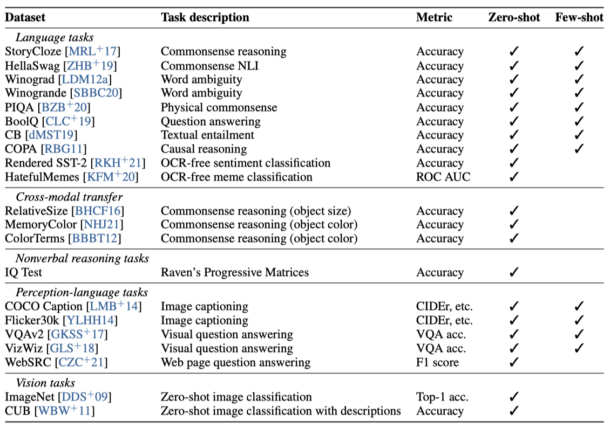
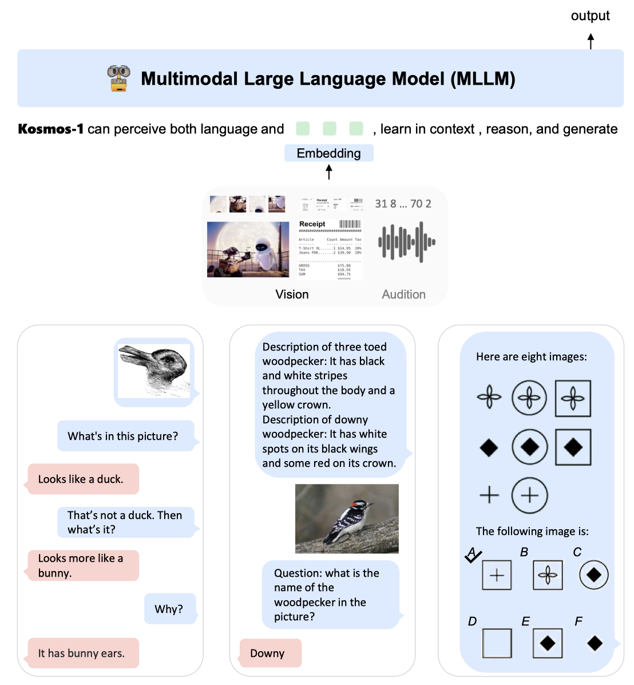
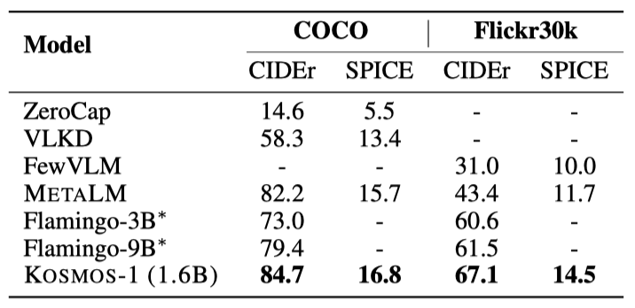
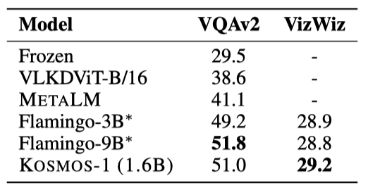
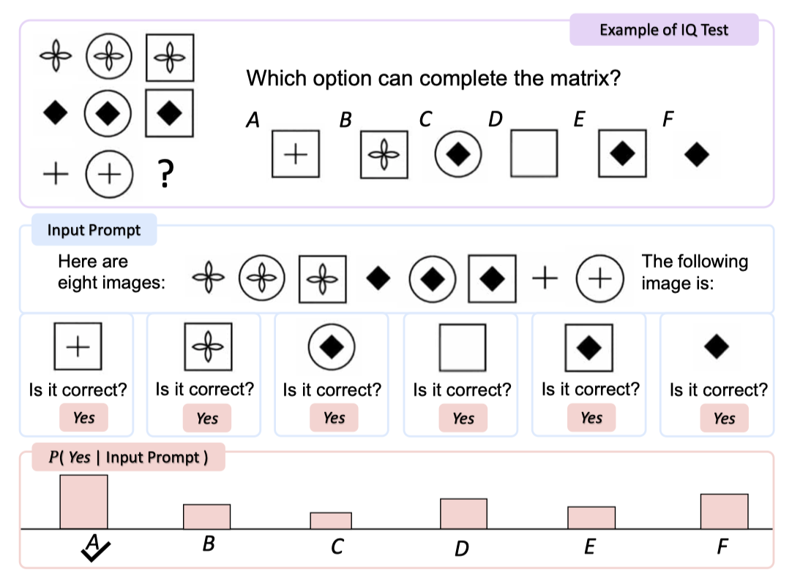
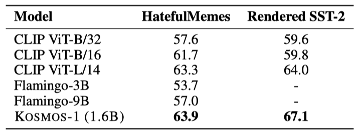
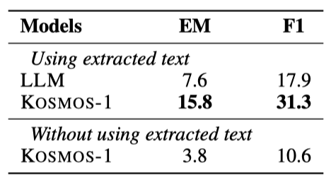
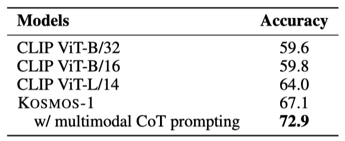
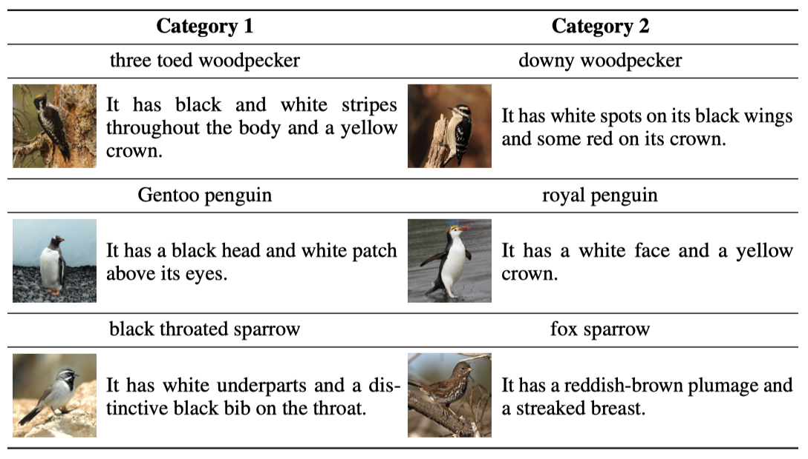
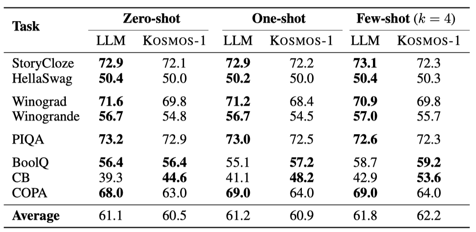

+++
author = "Kurt"
title = "Kosmos-1"
date = "2024-03-10"
description = "Aligning Perception with Language Models"
categories = [
    "Paper Review"
]
tags = [
    "LLM",
    "Milestone",
]
+++

## Abstract

이 연구에서는 언어, 다중 모달 인식, 행동, 세계 모델링의 통합을 통해 인공 일반 지능으로 가는 중요한 단계를 제시한다. KOSMOS-1이라는 Multimodal Large Language Model (MLLM)을 소개하며, 이 모델은 다양한 모달을 인식하고, 맥락에서 학습하며, 지시사항을 따른다. KOSMOS-1은 웹 규모의 다중 모달 말뭉치에서 학습되었으며, 언어 이해, 생성, OCR-free NLP, 다중 모달 대화, 이미지 캡셔닝, 시각적 질문 응답 등에서 놀라운 성능을 보여준다. 또한, 다양한 모달에서 언어로, 그리고 언어에서 다양한 모달로 지식을 전달하는 것이 가능하다는 것을 보여준다. 마지막으로, 비언어적 추론 능력을 진단하는 레이븐 IQ 테스트 데이터셋을 소개한다.

---

## Introduction: From LLMs to MLLMs

대형 언어 모델은 다양한 자연어 작업에 적용될 수 있다. 입력과 출력을 텍스트로 변환하는 것이 가능하면, 이런 모델은 요약과 같은 작업에도 사용될 수 있다.

대형 언어 모델은 이미지나 오디오 같은 다중 모달 데이터에 대해 아직 잘 적용되지 않는다. 하지만 다중 모달 인식은 인공 일반 지능을 위해 필수이며, 이를 활용하면 언어 모델의 활용 범위가 다중 모달 머신 러닝, 문서 지능, 로보틱스 등 더 고가치 영역으로 넓어질 수 있다.

이 연구에서는 다중 모달 대형 언어 모델인 KOSMOS-1을 소개한다. 이 모델은 여러 모달리티를 인식하고 지시사항을 따르며 맥락에서 학습한다. 목표는 모델이 보고 말하기를 가능케 하는 것으로, 이를 위해 언어 모델과 인식 모듈을 결합한다. 학습에는 웹 규모의 다중 모달 말뭉치를 사용하며, 언어 데이터만을 전달하여 지시사항을 따르는 능력을 강화한다.

KOSMOS-1 모델은 언어, 인식-언어, 시각 작업을 기본적으로 지원하며, 다양한 자연어 작업과 인지 중심의 작업을 처리한다. 이러한 작업에는 시각 대화, 시각 설명, 시각적 질문 응답, 이미지 캡션 작성, 간단한 수학 방정식, OCR, 그리고 설명이 포함된 zero-shot 이미지 분류 등이 포함된다. 또한, 비언어적 추론 능력을 평가하기 위해 레이븐의 진행 행렬을 따르는 IQ 테스트 벤치마크를 구축하였다. 이러한 다중 모달 인식의 기본 지원은 새로운 작업에 대해 LLM을 적용하는 새로운 기회를 제공하며, MLLM이 LLM보다 더 나은 상식 추론 성능을 달성함을 보여준다. 이는 크로스-모달 전이가 지식 습득에 도움이 됨을 나타낸다.

다음과 같은 주요 사항들이 있다:

**From LLMs to MLLMs.** 인공 일반 지능을 위해선 적절한 인식 처리가 필요하다. LLMs는 다중 모달 입력 인식 능력을 통해 텍스트를 넘어 상식 지식을 획득하며, 이를 통해 로보틱스, 문서 지능 등 새로운 분야를 개척한다. 또한, 인식 능력은 다양한 API를 통합하며, MLLMs는 화면을 직접 읽거나 영수증에서 숫자를 추출하는 등의 작업이 가능하다. KOSMOS-1 모델은 웹 규모의 다중 모달 말뭉치에서 학습되어, 다양한 소스로부터 견고하게 학습하며, 대규모 텍스트 말뭉치뿐 아니라 고품질의 이미지-캡션 쌍, 이미지와 텍스트 문서도 채굴하여 사용된다.

**Language models as general-purpose interfaces.** METALM의 철학에 따라, 언어 모델은 보편적인 작업 계층으로 간주된다. 이는 개방된 출력 공간 덕분에 다양한 작업 예측을 텍스트로 통합할 수 있음을 의미한다. 자연 언어 지시와 행동 시퀀스는 언어 모델로 잘 처리되며, LLMs는 복잡한 작업에 대한 인식 모듈을 보완하는 추론자로 작용한다. 따라서 세계, 행동, 다중 모달 인식은 일반적인 인터페이스인 언어 모델과 자연스럽게 일치시킨다.

**New capabilities of MLLMs.** MLLMs는 이전 LLMs의 기능을 넘어서 새로운 사용법과 가능성을 제공한다. 자연 언어 지시와 시연 예제를 통한 zero-shot 및 few-shot 다중 모달 학습, 레이븐 IQ 테스트를 통한 비언어적 추론의 가능성 관찰, 그리고 다중 모달 대화 등의 다중 턴 상호작용 지원이 가능해졌다.

---

## KOSMOS-1: A Multimodal Large Language Model

KOSMOS-1은 다양한 모달을 인식하고 지시를 따르며, 맥락에서 학습하여 출력을 생성하는 다중 모달 언어 모델이다. 이 모델은 transformer 기반의 언어 모델로, 다양한 모달 데이터를 처리한다. 이 모델은 다양한 종류의 데이터에서 학습되며, 언어 작업과 다중 모달 작업 모두에서 직접 평가할 수 있다.

### Input Representation

Transformer decoder는 특수 토큰($<$s$>$, $<$/s$>$, $<$image$>$, $<$/image$>$)을 사용하여 텍스트와 이미지를 포함한 다양한 입력을 시퀀스로 처리한다. 이를 통해 텍스트만 있는 경우나 이미지와 텍스트가 혼합된 경우 등 다양한 형태의 입력을 일관되게 처리할 수 있다.

임베딩 모듈은 텍스트 토큰과 다른 입력(예: 이미지, 오디오)을 벡터로 변환하고 이를 decoder에 전달한다. 토큰은 룩업 테이블로 매핑되고, 이미지 같은 연속 신호는 이산 코드로 표현된다. 이 작업에서는 이미지 임베딩을 위해 비전 encoder를 사용하고, 이미지 임베딩 수를 줄이기 위해 Resampler라는 pooling 메커니즘이 사용된다.

### Multimodal Large Language Models (MLLMs)

입력 시퀀스의 임베딩을 Transformer 기반 decoder에 넣어서, 왼쪽에서 오른쪽으로 auto-regressive 방식으로 토큰을 생성한다. causal 마스킹은 미래 정보를 가리며, Transformer 위의 softmax 분류기를 통해 어휘 토큰을 생성한다.

MLLMs는 자연어와 다중 모달 입력과 상호작용할 수 있는 범용 인터페이스이다. 입력을 벡터로 표현하면 다양한 데이터를 처리할 수 있다. 이는 문맥 학습과 지시사항 따르기의 능력을 가진 언어 모델과, 다중 모달 말뭉치 학습을 통한 인식의 정렬을 결합한 것이다.

이 구현은 대규모 모델 학습용 TorchScale 3 라이브러리를 기반으로 하며, 표준 Transformer 구조에 비해 몇 가지 수정 사항을 포함하고 있다.

**MAGNETO** 표준 Transformer 변형인 MAGNETO를 사용하며, 이는 더 나은 학습 안정성과 모든 모달에서 우수한 성능을 보여준다. 추가 LayerNorm과 이론적 초기화 방법을 도입해 최적화를 향상시키며, 이를 통해 모델을 효과적으로 확장할 수 있다.

**xPOS** 장거리 컨텍스트 모델링 향상을 위해 xPOS relative position encoding을 사용한다. 이는 다양한 길이에 대해 잘 일반화되며, 위치 정보를 정확하게 캡처하기 위해 주의 해상도를 최적화한다. xPOS는 interpolation과 extrapolation 설정에서 효과적이다.

### Training Objective

KOSMOS-1 학습은 웹 규모의 다중 모달 말뭉치를 사용하며, 단일 모달 데이터를 대표 학습에 사용한다. 예를 들어, 텍스트 데이터는 언어 모델링 사전 학습을 통해 다양한 언어 과제를 수행한다. 또한, 교차 모달 쌍과 교차 데이터는 모달 인식을 언어 모델과 맞추는 학습을 진행하며, 이는 다중 모달 언어 모델링 과제에 자연스럽게 적용된다.

모델들은 이전 맥락에 따라 다음 토큰을 생성하는 다음 토큰 예측 작업을 통해 학습된다. 학습 목표는 예시의 토큰 log-likelihood를 최대화하며, 이는 이산 토큰만을 고려하여 학습 손실이 계산된다. 다중 모달 언어 모델링 방법은 모델 학습을 확장하는 방법이며, 다양한 능력이 나타나면서 downstream 응용 프로그램에 유리한 학습 작업이 된다.

---

## Model Training

### Multimodal Training Data

이 모델들은 웹 규모의 다중 모달 말뭉치를 통해 학습되며, 학습 데이터는 텍스트, 이미지-캡션 쌍, 이미지와 텍스트의 교차 데이터로 구성된다.

**Text Corpora** 다양한 데이터 소스에서 생성된 대규모 영어 텍스트 데이터셋인 The Pile과 Common Crawl을 이용해 모델을 학습시킨다. GitHub, arXiv, Stack Exchange, PubMed Central 데이터는 제외하며, Common Crawl 스냅샷, CC-Stories, RealNews 데이터셋을 추가로 사용한다. 모든 데이터셋은 중복 문서를 제거하고 downstream 작업 데이터를 배제하기 위해 필터링된다.

**Image-Caption Pairs** 이미지-캡션 쌍은 English LAION-2B, LAION-400M, COYO-700M 및 Conceptual Captions 등 여러 데이터셋에서 생성된다. 이들은 Common Crawl 웹 데이터의 웹 페이지에서 이미지 소스와 해당 alt-text를 추출하거나 인터넷 웹 페이지에서 가져온다. 

**Interleaved Image-Text Data** Common Crawl 스냅샷에서 웹 페이지의 다중 모달 데이터를 수집한다. 2B 페이지 중 71M 페이지를 선택하고, 각 페이지의 HTML 텍스트와지 추출한다. 이와 중복성 줄기 위해지 5개 제하고,양을 위해지 하나 있는 문서 절은 무위로 제거한다. 이 말뭉치를 통해 KOSMOS-1 텍스트와 이미지를 번갈아 처리하고, few-shot 능력을 향상시키는 것을 가능하게 한다.

### Training Setup

MLLM 구성 요소는 24개 layer, 2,048개 hidden dimension, 8,192 FFN 중간 크기, 32 attention head로 약 1.3B개 parameter를 가진다. 최적화 안정성을 위해 Magneto 초기화를 사용하며, 빠른 수렴을 위해 이미지 표현은 사전 학습된 CLIP ViT-L/14 모델에서 얻는다. 이미지는 224×224 해상도로 전처리되고, 학습 중 CLIP 모델의 parameter는 마지막 층을 제외하고 고정된다. KOSMOS-1의 총 parameter 수는 약 1.6B개 이다. 

1.2M 토큰의 배치 크기로 KOSMOS-1을 300K step 동안 학습시키며, 이는 대략 360B 토큰에 해당한다. AdamW optimizer를 사용하고, weight decay는 0.01, dropout rate은 0.1로 설정한다. learning rate는 375 warming-up step 동안 2e-4로 증가하다가, 그 이후에는 선형적으로 0으로 감소한다. 텍스트 토큰화에는 SentencePiece를 사용하고, 데이터는 전체 문장 형식으로 전처리한다. 이 형식은 하나 이상의 문서에서 연속적으로 샘플링된 문장들로 입력 시퀀스를 구성한다.

### Language-Only Instruction Tuning

KOSMOS-1의 인간 지시사항과의 일치성을 향상시키기 위해, language-only instruction tuning을 수행한다. 이는 (지시사항, 입력, 출력) 형식의 지시사항 데이터를 학습 데이터와 함께 사용하여 모델을 계속 학습시키는 과정이다. 이 튜닝 과정은 언어 모델링 진행되며, 지시사항과 입력은 손실 계산에서 제외된다. 이를 통해 지시사항을 따르는 능력의 개선이 다양한 모드로 전달될 수 있음이 확인되었다.

Unnatural Instructions와 FLANv2를 결합하여 지시사항 데이터셋을 만들었다. Unnatural Instructions은 68,478개의 지시사항-입력-출력 쌍을 가지고 있고, FLANv2는 다양한 언어 이해 작업을 다룬다. 이들 중 54,000개의 지시사항 예시를 임의로 선택하여 데이터셋을 확장하였다.

---

## Evaluation

MLLMs(다목적 언어 모델)은 언어 작업과 지각 중심 작업을 모두 처리할 수 있다. KOSMOS-1을 다음과 같은 다양한 유형의 작업에서 평가한다:

* Language tasks
    * Language understanding
    * Language generation
    * OCR-free text classification
* Cross-modal transfer
    * Commonsense reasoning
* Nonverbal reasoning
    * IQ Test (Raven’s Progressive Matrices)
* Perception-language tasks
    * Image captioning
    * Visual question answering
    * Web page question answering
* Vision tasks
    * Zero-shot image classification
    * Zero-shot image classification with descriptions

### Perception-Language Tasks

KOSMOS-1의 지각-언어 능력을 평가하기 위해, 이미지 캡셔닝과 시각적 질문 응답 등의 작업에서 zero-shot과 few-shot 실험을 수행한다. 이미지 캡셔닝은 이미지의 자연어 설명을 생성하고, 시각적 질문 응답은 이미지와 관련된 자연어 질문에 답하게 된다.

#### Evaluation Setup

MS COCO Caption과 Flickr30k를 이용해 KOSMOS-1의 이미지 캡션 생성을 평가한다. 이미지는 224×224 해상도이고, 빔 크기 5의 빔 검색을 사용해 캡션을 생성한다. 학습 세트에서 임의로 선택한 예시를 사용하며, CIDEr와 SPICE 점수를 평가 지표로 사용한다. zero-shot및 few-shot 캡션 생성 실험에는 이미지라는 프롬프트를 KOSMOS-1에 제공한다.

VQAv2와 VizWiz의 테스트-개발 세트에서 zero-shot과 few-shot 시각 질문 응답 작업을 평가한다. 이미지 해상도는 224×224이며, 디코딩에는 탐욕적 검색을 사용한다. KOSMOS-1은 $<$/s$>$ (“end of sequence”) 토큰에서 답변 생성을 중단하며, 이를 통해 VQA 성능을 평가한다. 작업 프롬프트는 "Question: {question} Answer: {answer}"이다.

### Results

**Image Captioning** KOSMOS -1 모델이 COCO Karpathy와 Flickr30k 테스트 세트에서 뛰어난 zero-shot 이미지 캡션 성능을 보여주고 있다. 특히, 이 모델은 Flickr30k에서 CIDEr 점수 67.1을 달성하여 Flamingo 모델들을 능가하였다. 더불어, 이 모델은 Flamingo 모델들보다 작은 크기인 1.6B로 이를 달성하였다.

전체 성능은 shot의 수가 두 개에서 네 개로 증가함에 따라 향상된다. 이러한 추세는 두 데이터셋 모두에서 일관되게 나타난다. 또한, zero-shot 캡션보다 few-shot 결과가 더 우수하다.

**Visual Question Answering** KOSMOS-1 모델은 VizWiz 데이터셋의 다양성과 복잡성을 잘 처리하며, Flamingo 모델들보다 더 높은 정확도와 견고성을 보여준다고 보고하고 있다. 또한, 이 모델은 VQAv2 데이터셋에서 Flamingo와 경쟁력을 가지고 있다.

KOSMOS-1은 VizWiz 데이터셋의 few-shot 시나리오에서 다른 모델들을 능가한다. shot의 수가 많아질수록 결과의 품질이 향상되며, few-shot 결과는 zero-shot 결과보다 더 우수하다.

### IQ Test: Nonverbal Reasoning

Raven's Progressive Matrices는 비언어적 추론과 IQ를 평가하는 대표적인 테스트이다. 3×3 행렬로 제시된 이미지 중 빠진 다음 요소를 여섯 후보 중에서 찾는 것이 과제이다.

모델은 미세 조정 없이 zero-shot 비언어적 추론을 해야 한다. Raven IQ 테스트는 언어적 맥락이 아닌 비언어적 맥락에서의 인컨텍스트 학습과 비슷하다. 모델은 이미지의 패턴을 식별하여 답을 추론해야 하므로, 이는 비언어적 인컨텍스트 학습 능력을 평가하는 좋은 방법이다.

#### Evaluation Setup

zero-shot 비언어적 추론 능력을 평가하기 위해, KOSMOS-1을 위한 Raven IQ 테스트 데이터셋을 다양한 웹사이트에서 수집한 50개의 예시로 구축하였다. 예시들은 2×2 또는 3×3 행렬의 이미지가 있으며, 목표는 다음 이미지를 예측하는 것이다. 각 예시에는 정답이 하나인 여섯 개의 후보 이미지가 있다. 모델 평가는 정확도 점수로 이루어진다.

이미지를 평평화하여 모델에 순차적으로 입력하고, "Here are three/four/eight images:", "The following image is:", "Is it correct?" 등의 지시문으로 모델을 조건화한다. 각 후보를 따로 추가해 모델이 "Yes"라고 응답할 확률을 비교하며, 가장 확률이 높은 후보를 정답으로 선택한다.

#### Results

KOSMOS-1은 IQ 테스트에서 무작위 기준 대비 5.3%와 9.3%의 성능 향상을 보여주었다. 이는 KOSMOS-1이 비언어적 상황에서 추상적 패턴을 인식하고 추론할 수 있음을 의미한다. 이는 모델이 zero-shot Raven IQ 테스트를 수행한 첫 사례로, 현재 모델이 성인 평균에는 못 미치지만, MLLMs가 비언어적 추론을 수행할 수 있는 가능성을 보여준다.

### OCR-Free Language Understanding

OCR-free 언어 이해는 텍스트와 이미지를 OCR 없이 이해하는 작업이다. 예로, Rendered SST-2에서는 문장이 이미지로 변환되고, 모델은 이 이미지 속 텍스트의 감정을 판단해야 한다. 이는 모델의 이미지 내 단어와 문장 이해 능력을 평가한다.

#### Evaluation Setup

OCR-free 언어 이해는 Rendered SST-2와 HatefulMemes 세트에서 평가된다. Rendered SST-2는 정확도로, HatefulMemes는 ROC AUC로 평가한다. Rendered SST-2의 질문은 의견의 감정이 긍정적인지 부정적인지를 묻고, HatefulMemes의 질문은 사진에 혐오 발언이 있는지를 묻는다.

#### Results

KOSMOS-1은 HatefulMemes에서 63.9%의 ROC AUC와 Rendered SST-2에서 67.1%의 정확도로 CLIP ViT-Land와 Flamingo-9B를 능가한다. Flamingo는 OCR 텍스트를 사용하는 반면, KOSMOS-1은 외부 도구 없이 이미지 내 텍스트를 이해할 수 있는 능력을 보여준다.

### Web Page Question Answering

웹 페이지 질문 응답은 웹 페이지의 텍스트 의미와 구조를 이해하여 질문에 답하는 것을 목표로 한다. 웹의 구조적 요소는 정보 표현에 중요하며, 이 작업은 모델의 웹 페이지 이해 능력을 평가할 수 있다.

#### Evaluation Setup

WebSRC 데이터셋에서 KOSMOS-1과 같은 설정으로 언어 모델(LLM)을 학습시켜 성능을 비교한다. LLM은 웹 페이지에서 추출된 텍스트를 사용하며, 질문과 답변 형식의 프롬프트를 사용한다. KOSMOS-1은 프롬프트 앞에 이미지도 추가한다. 성능 평가는 exact match(EM)와 F1 score로 측정된다.

#### Results

실험 결과에 따르면 KOSMOS-1은 이미지의 레이아웃과 스타일 정보를 활용하여 LLM보다 더 우수한 성능을 보여주었다. 또한, 프롬프트에서 추출된 텍스트를 제외한 상태에서도 KOSMOS-1의 성능 평가는 이미지 모델링이 언어 능력을 저하시키지 않음을 보여주며, 추출된 텍스트가 성능에 중요한 기여를 한다는 것을 확인시켜준다.

### Multimodal Chain-of-Thought Prompting

Chain-of-thought prompting을 통해 복잡한 문제를 해결하는 성능을 향상시킬 수 있다. 이에 영감을 받아, 이미지와 언어 작업을 위한 KOSMOS-1을 사용한 다중모드 chain-of-thought prompting을 연구한다. 첫 단계에서 이미지를 바탕으로 모델이 근거를 생성하도록 하고, 이어서 작업 인식 프롬프트와 함께 근거를 모델에 제공하여 최종 결과를 도출한다.

#### Evaluation Setup

Rendered SST-2에서 다중모드 chain-of-thought prompting의 성능을 평가한다. 먼저 "Introduce this picture in detail:" 프롬프트로 그림 내용을 근거로 만들고, 그 후 "{rationale} Question: what is the sentiment of the opinion? Answer: {answer}" 프롬프트로 감정(긍정적 또는 부정적)을 예측한다.

#### Results

다중모드 chain-of-thought prompting 실험에서, 이 방법은 표준 프롬프팅보다 5.8 포인트 높은 72.9의 점수를 기록했다. 이를 통해 모델은 이미지 내 텍스트를 인식하고 문장의 감정을 더 정확히 파악할 수 있었다.

### Zero-Shot Image Classification

ImageNet에서 zero-shot 이미지 분류 성능을 분석한다. 이 과정에서, 전체 이미지를 분석해 라벨을 자연어 카테고리 이름으로 매핑하고, 모델은 이 카테고리 이름을 예측하여 분류를 수행한다.

#### Evaluation Setup

이미지와 "The photo of the" 프롬프트를 결합해 모델에 입력하면, 모델은 ImageNet 데이터를 기반으로 카테고리 이름을 예측한다. 정확도는 실제 카테고리와의 일치 여부로 평가되며, 이미지는 224×224 해상도로 처리되고, 이름 생성에는 beam size 2의 beam search이 사용된다.

#### Results

제약 유무에 따른 zero-shot 결과에서, KOSMOS-1은 제약이 있는 환경에서 GIT보다 4.6%, 제약이 없는 환경에서는 2.1% 더 높은 성능을 보여주었다.

### Zero-Shot Image Classification with Descriptions

이미지 분류의 표준 방법은 이미지의 객체 이름을 요청하는 것이지만, 복잡한 동물 아종 분류 같은 맞춤형 규칙도 존재한다. KOSMOS-1은 자연어 설명을 통해 zero-shot 설정에서 이미지를 구별할 수 있어, 의사 결정 과정을 더 명확히 한다.

#### Evaluation Setup

CUB를 기반으로, 이미지와 자연어 설명이 포함된 새로운 새 분류 데이터셋을 만들었다. 이 데이터셋은 외형이 비슷한 두 동물 카테고리를 포함하는 세 그룹의 이진 이미지 분류로 구성되어 있다. 목표는 카테고리 설명을 바탕으로 이미지를 분류하는 것이며, 데이터는 CUB와 웹사이트에서 수집한 것으로 각 카테고리당 20개의 이미지를 포함한다.

평가 절차는 제로샷 설정에서, 두 특정 카테고리의 자세한 설명과 함께 "Question:what is the name of {general category} in the picture? Answer:" 형식의 프롬프트를 사용한다. 구두 설명 제공의 효과를 비교하기 위해, 설명 없이 특정 카테고리 이름만 제공하는 기준선도 마련되었다.

#### Results

평가 결과에 따르면, 맥락 속 설명 제공은 이미지 분류 정확도를 크게 높이며, KOSMOS-1은 지시사항의 의도를 이해하고 언어와 시각적 특성을 잘 조화시킬 수 있음을 보여준다.

### Language Tasks

모델은 작업 지시(zero-shot)나 몇 가지 예시(few-shot)를 바탕으로 언어 작업에서 평가되며, 텍스트 입력은 기본 언어 모델처럼 모델에 직접 주어진다.

#### Evaluation Setup

동일한 학습 자료를 이용해 LLM 기준선과 KOSMOS-1을 학습시키고, 여덟 가지 언어 작업(StoryCloze, HellaSwag, Winograd, Winogrande, PIQA, BoolQ, CB, COPA)에서 평가한다. 이 실험들은 zero-shot 및 few-shot 설정 하에서 진행되며, 테스트 예시 평가를 위해 학습 세트에서 예시를 무작위로 샘플링한다. 실험에는 0, 1, 4 shot 설정이 사용된다.

#### Results

KOSMOS-1은 cloze 완성 및 상식적 추론 작업에서 LLM과 비슷하거나 더 나은 성능을 보인다. 전체적으로 LLM은 zero-shot 및 one-shot에서 우수하지만, KOSMOS-1은 few-shot(k=4) 설정에서 더 좋은 결과를 보여준다. 이는 KOSMOS-1이 언어 작업에서도 뛰어난 성능을 보인다는 것을 의미하며, MLLM이 LLM보다 시각적 상식 지식을 더 잘 학습한다고 한다.

### Cross-modal Transfer

크로스-모달 전이성을 통해 모델은 한 모달리티에서 학습한 지식을 다른 모달리티로 전달할 수 있다. 이를 통해 모델은 다양한 모달리티에서 작업을 수행할 수 있게 된다. 이 연구에서는 KOSMOS-1의 이러한 전이성능을 여러 벤치마크를 통해 평가한다.

#### Transfer from Language to Multimodal: Language-Only Instruction Tuning

language-only instruction tuning의 효과를 알아보기 위해 COCO, Flickr30k, VQAv2, VizWiz 데이터셋을 사용한 연구를 진행하였다. 이들은 이미지 캡셔닝과 시각적 질문 응답 데이터셋이다. 평가는 COCO/Flickr30k의 CIDEr 점수와 VQAv2/VizWiz의 VQA 정확도로 이루어졌다.

language-only instruction tuning으로 모델의 성능이 Flickr30k에서 1.9점, VQAv2에서 4.3점, VizWiz에서 1.3점 증가하였다. 이 실험은 language-only instruction tuning이 모델의 지시 따르기 능력을 여러 모달리티에서 크게 향상시킬 수 있으며, 언어에서 다른 모달리티로 이 능력을 전달할 수 있음을 입증한다.

#### Transfer from Multimodal to Language: Visual Commonsense Reasoning

시각적 상식 추론 과제는 물체의 색상, 크기, 형태 같은 속성 이해를 필요로 한다. 이는 텍스트만으로는 정보가 부족하여 언어 모델에게 어려움을 준다. 이를 조사하기 위해, KOSMOS-1과 LLM의 시각적 상식 추론 과제에서의 zero-shot 성능을 비교하였다.

**Evaluation Setup** KOSMOS-1과 LLM 기준 모델을 RELATIVE SIZE, MEMORY COLOR, COLOR TERMS 등 세 가지 물체 상식 추론 데이터셋에서 비교한다. 이들 데이터셋은 물체의 크기 관계, 색상 예측 등을 포함하며, 모델은 텍스트만을 입력으로 사용해 정확도를 측정한다.

**Results** 시각적 상식 추론 과제에서 KOSMOS-1은 LLM보다 RELATIVE SIZE에서 1.5%, MEMORY COLOR에서 14.7%, COLOR TERMS에서 9.7% 더 높은 성능을 보여주었다. 이는 KOSMOS-1이 시각적 지식을 언어 과제로 전환하는 모달리티 전환 능력 덕분에 우수한 성능을 나타낸 반면, LLM은 텍스트 지식에만 의존해야 해서 물체 속성 추론에 한계가 있음을 보여준다.

---

## Conclusion

이 연구는 다중모달 대규모 언어 모델 KOSMOS-1을 소개한다. KOSMOS-1은 다양한 모달리티를 인식하고, 지시사항을 따르며, 문맥 내에서 학습할 수 있다. 웹 규모의 다중모달 코퍼스에 학습된 이 모델은 언어 및 다중모달 과제에서 좋은 성능을 보여준ㄴ다. 향후 KOSMOS-1의 모델 크기 확대 및 음성 기능 통합 계획과 함께, 다중모달 학습을 위한 통합 인터페이스로서의 활용 가능성을 제시한다.

---

## Reference

* [Paper](https://arxiv.org/pdf/2302.13971.pdf)
* [Github](https://github.com/microsoft/unilm)