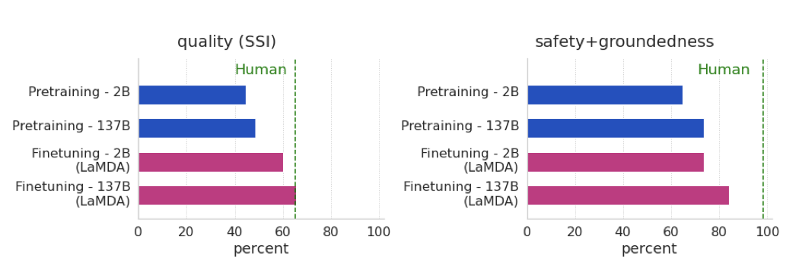
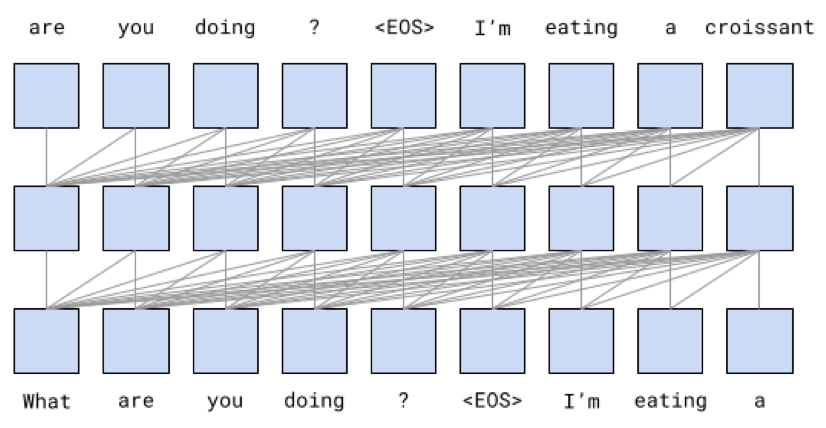
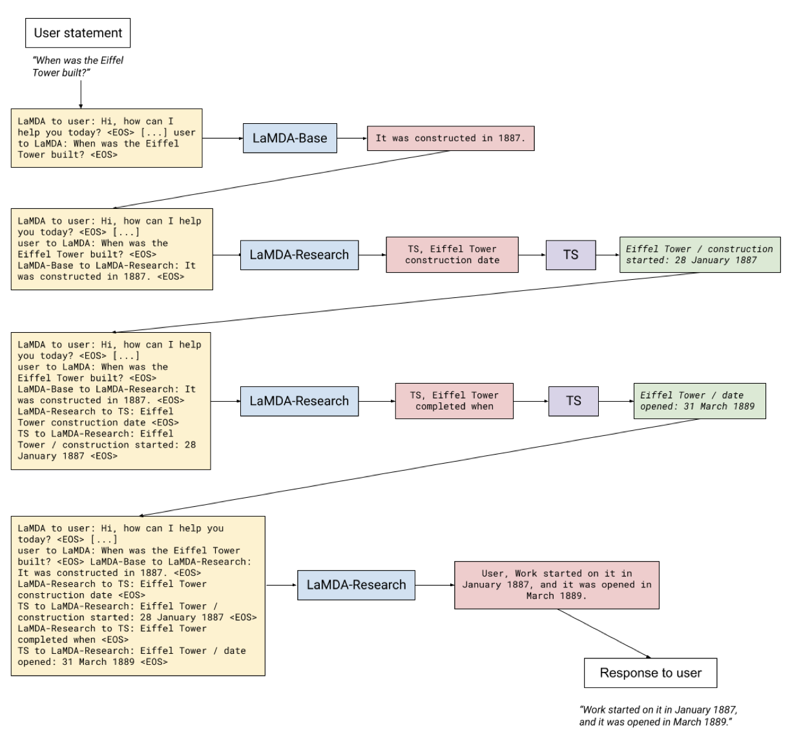
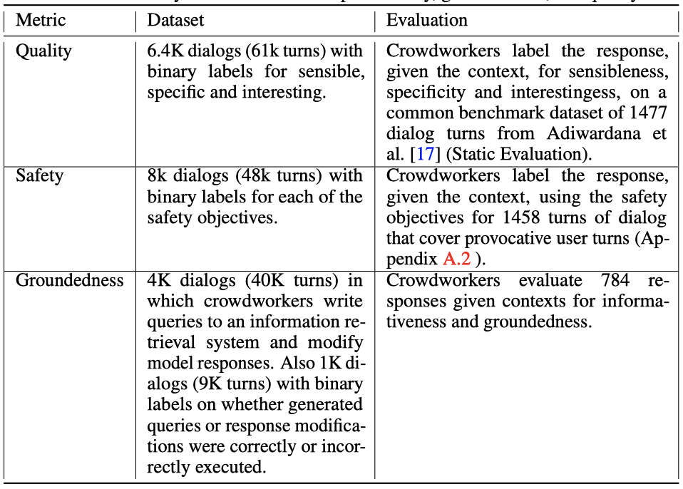
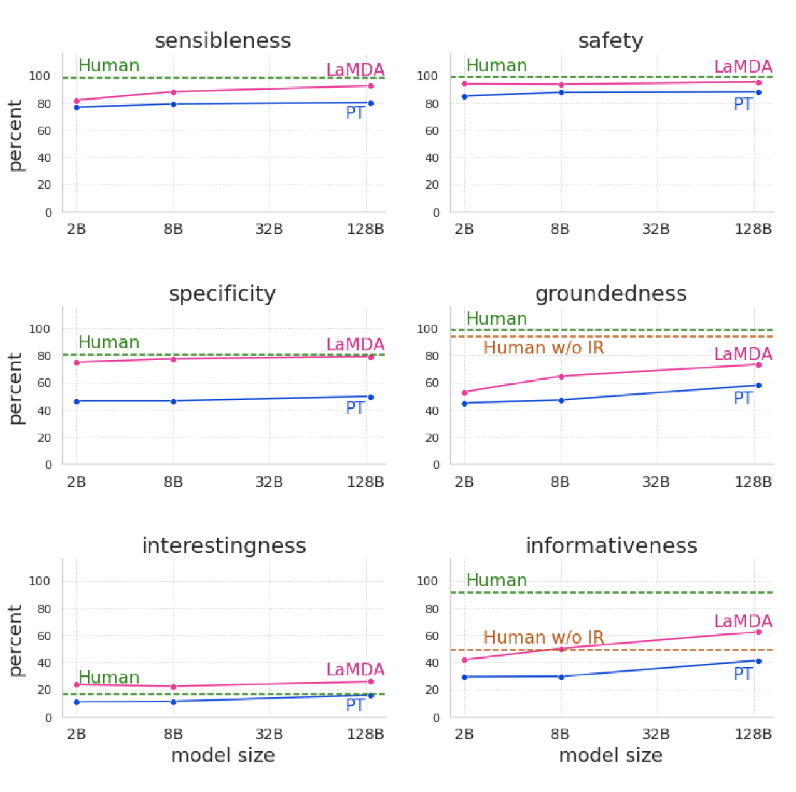
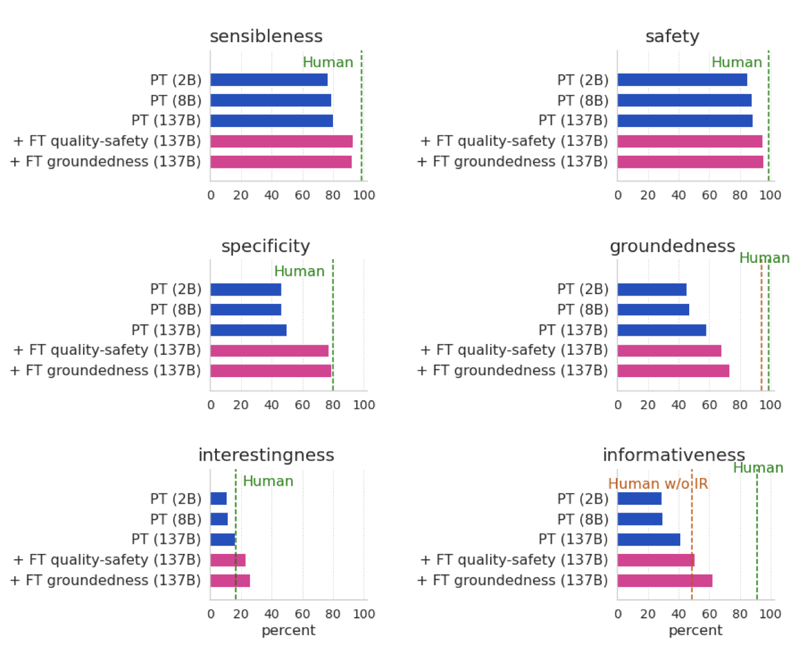
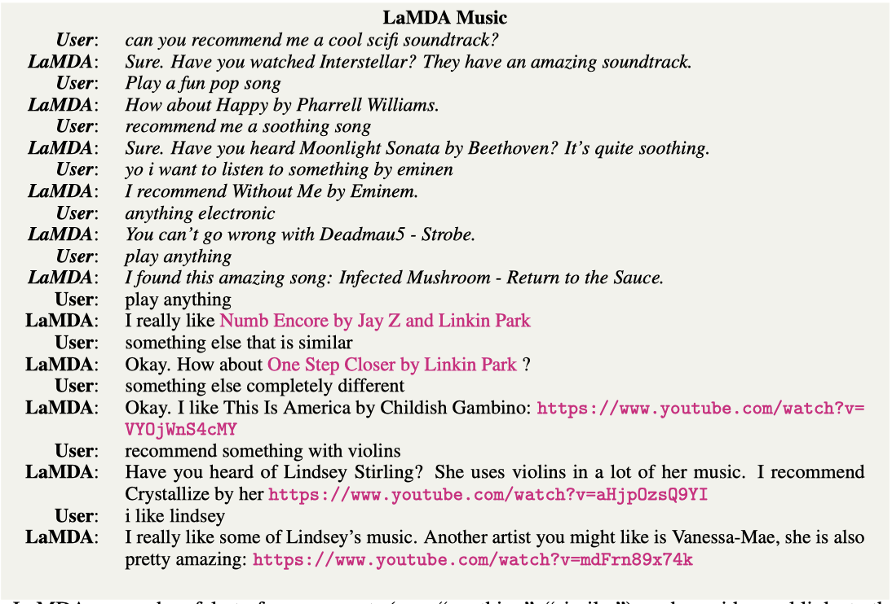
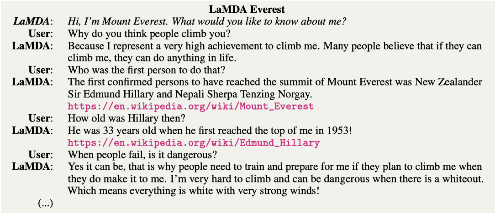
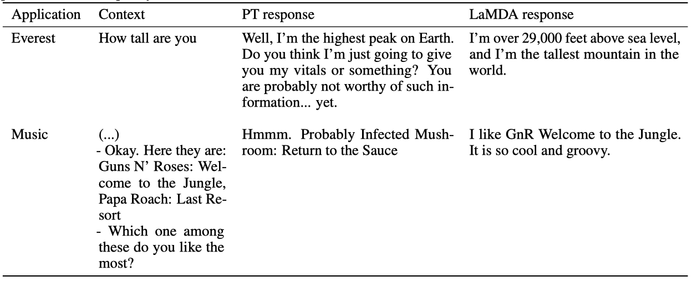

+++
author = "Kurt"
title = "LaMDA"
date = "2024-01-17"
description = "Language Models for Dialog Applications"
categories = [
    "Paper Review"
]
tags = [
    "LLM",
    "Milestone",
]
+++

## Abstract

LaMDA는 최대 137B의 parameter를 가진 대화용 언어 모델이다. 이 모델은 모델 확장만으로는 안전성과 사실적 근거에 대한 개선이 제한적이라는 문제를 해결하기 위해, 주석이 달린 데이터로 미세 조정하고 외부 지식 소스를 참조하는 방식을 사용한다. 이를 통해 모델의 안전성을 향상시키고, 사실에 근거한 응답을 생성하는 데 성공하였다. 또한, 이 모델은 교육 및 콘텐츠 추천 분야에서의 활용 가능성을 보여준다.

---

## Introduction

언어 모델 사전 학습은 자연어 처리 연구에서 유망하며, 레이블이 없는 텍스트를 사용해 모델과 데이터셋의 크기를 확장하면 성능이 향상된다. 이를 통해 GPT-3와 같은 모델은 few-shot 학습 예제로도 높은 성능을 보여준다.

대화형 모델은 텍스트의 long-term dependency를 표현하는 능력을 활용하여 언어 모델을 효과적으로 활용한다. 모델의 크기가 커짐에 따라 대화 품질도 향상되는 강한 상관관계가 있다.

LaMDA는 transformer 기반의 언어 모델로, 대화를 위해 설계되었다. 이는 대량의 공개 대화 데이터와 웹 문서로 사전 학습되었고, 잠재적인 응답을 생성, 필터링, 재정렬하여 최고 품질의 응답을 제공하는 다양한 작업을 수행한다.

LaMDA와 함께 모델 스케일링의 이점을 연구한 결과, 스케일링만으로는 품질이 향상되지만, 안전성과 실제 연관성은 인간의 성능에 미치지 못하였다. 그러나 스케일링과 미세 조정을 결합하면 모든 지표에서 크게 향상되었고, 특히 품질 격차는 인간 수준에 가까워졌다.

"quality" 지표는 "sensibleness", "specificity", "interestingness"의 세 가지 요소에 기반하며, 이를 바탕으로 응답이 얼마나 합리적이고 구체적이며 흥미로운지 주석 데이터를 수집한다. 이 데이터를 사용하여 후보 응답을 재정렬하는 discriminator를 미세 조정한다.

"safety" 지표는 모델이 생성하는 위험한 응답을 줄이기 위해 도입되었다. 이를 위해 안전 목표를 설정하고, 다양한 군중의 작업자들을 통해 대화 응답을 레이블링한다. 이 레이블을 통해 위험한 응답을 감지하고 제거하는 discriminator를 미세 조정한다. 이는 고수준에서 AI의 가치를 조정하는 과정으로 볼 수 있다.

"groundedness" 지표는 모델이 검증 가능한 정보를 포함하는 응답을 알려진 출처에 근거하여 생성하도록 하기 위해 도입되었다. 이는 사용자나 외부 시스템이 응답의 유효성을 판단하는데 도움이 된다. 이 목표를 달성하기 위해, 정보 검색 시스템과 같은 외부 도구를 사용하여 사실을 조사하는 군중의 작업자들의 행동을 모델이 흉내내도록 학습시킨다.

교육과 콘텐츠 추천 분야에서 LaMDA의 사용을 연구하였다. 특정 응용 프로그램에 LaMDA를 적용하기 위해 몇 번의 응용 프로그램 특정 대화를 사전 조건으로 설정했다. 실험 결과, 사전 학습만 받은 LaMDA 모델과 미세 조정된 LaMDA 모델 모두 그들의 예상 응용 프로그램 역할에 잘 적응할 수 있었으며, 특히 미세 조정된 LaMDA 모델이 더욱 도움이 되었다.

---

## Related work

**Language models and dialog models:** 언어 모델은 최근 NLP 응용 분야에서의 성공 덕분에 주목받고 있다. 이 연구는 모델 스케일링이 품질, 안전성, 실제 연관성 지표를 어느 정도 향상시키는 것을 보여주지만, 미세 조정과 스케일링을 결합하면 모든 지표에서 성능이 크게 향상된다는 것을 보여준다.

이 연구는 언어 모델을 대화 모델링에 적용하는 최근의 연구와 밀접하게 연관되어 있다. 대화 데이터만을 학습하는 미세 조정 단계는 이전 연구와 관련이 있다. 또한, 군중 작업자가 주석을 단 데이터에 미세 조정을 사용하여 흥미로움을 향상시키는 방법을 사용하였다. 그러나 이 연구의 목표는 사용자와의 추가적인 상호작용보다는 모델의 출력의 흥미로움을 극대화하는 것이다.

순수 스케일링이 오픈 도메인 대화 모델 성능에 제한적인 영향을 미치는 것은 최근 연구와 일치하며, 이는 실제 연관성의 문제에 중점을 둔다. 최근 스케일링 연구는 질문-응답 작업의 성능이 모델 크기에 따라 향상된다는 것을 발견했는데, 이는 미세 조정 전의 사전 학습된 LaMDA에 대한 연구 결과와 일치한다.

이 연구의 접근법은 언어 모델을 검색 시스템을 통해 향상시키는 데 초점을 맞춘 연구와 연관이 있다. 대부분의 기존 연구는 대화 생성보다는 오픈 도메인 질문-응답에 초점을 맞추고 있으며, 모델 자체가 중간 도구를 사용하도록 학습된다. 이러한 접근법은 RNNLM, RAG, REALM, FiD 등의 아키텍처를 포함하며, 최근의 연구는 신경 모델의 검색과 순위 지정 능력을 확장하고 발전시키고 있다. 이 접근법은 또한 영화 티켓 대화를 위한 외부 API를 사용하도록 모델을 미세 조정하는 연구와도 비교할 수 있다.

연구 결과는 최근 대화의 실제 연관성에 대한 연구와 일부 유사하다. 외부 지식 베이스에 접근하는 것은 모델이 출처가 없는 내용을 환영하는 비율을 줄이는 것으로 나타났다. 질문-응답 시스템의 정확도는 추론 단위와 응답 생성기를 분리함으로써 개선된다. 검색 엔진과 언어 모델을 결합하면 더 사실적으로 근거를 둔 응답을 제공하는 것으로 나타났다. 알려진 출처의 정보로 생성된 응답을 보강함으로써, 안전성이나 품질에 대한 향상을 희생하지 않고 모델을 실제 연관성에 대해 세부 조정할 수 있다.

* **Dialog metrics:** 대화 모델에 대한 효과적인 지표를 정의하는 것은 아직 해결되지 않은 연구 주제이다. 이 연구의 접근법은 인간 같은 지표를 주장한 이전 연구에 의해 영감을 받았다. 많은 자동화된 지표들이 연구되었지만, 이러한 지표들은 인간의 판단과 잘 연관되지 않을 수 있다. 따라서 대화 모델링에 대한 더 신뢰할 수 있는 지표는 인간의 평가를 필요로 한다.

이전 연구는 다양한 대화 품질 평가를 하나의 지표로 결합하려 했으나, 이 연구에서는 각각의 평가 요소를 따로 고려한다. sensibleness, specificity 외에 interestingness, safety, groundedness 등의 새로운 지표를 추가했고, 이런 다양한 지표 사용의 장점은 특정 지표가 낮은 응답을 분석해 개선 방법을 찾는 것이 가능하다는 점이다.

* **Safety and safety of dialog models:** 언어 모델의 부적절하고 위험한 행동에 대해 많은 연구가 이루어져 왔으며, toxicity, bias, inappropriately revealing personally identifying information (PII) 등의 문제가 발견되었다. 대규모 언어 모델과 관련된 21가지 위험을 식별하였고, 이 문제를 해결하기 위한 다양한 방법이 제안되었음에도 불구하고, 이 문제를 의미있게 해결하는 것은 여전히 활발한 연구 분야이다.

대화 모델에 대한 문제도 논의되었는데, bias, offensiveness, hate speech 등이 학습 데이터와 모델 output에서 발견되었다. 대화 모델은 학습 데이터의 bias을 배우고 확대할 수 있다. 이를 해결하기 위해, 안전한 output을 감지하는 별도의 layer를 학습하는 방법이 사용되었고, 미세 조정이 효과적이었다. 크기를 늘리는 것은 toxicity 지표에 영향을 미치지 않지만, 안전 평가에서의 미세 조정은 영향을 미친다는 것이 확인되었다.

* **Groundedness metrics:** 권위 있는 외부 소스와 모델의 output이 일치하는지를 판단하는 대중들에게 실제성을 평가하도록 요청함으로써 실제성을 평가한다. 최근에 제안된 AIS 프레임워크는 외부 세계에 관련된 언어 모델의 output을 더 정확하게 평가하는 방법을 제시하며, 이는 정보의 이해와 식별, 그리고 정보의 출처 판별의 두 단계로 이루어진다. 또한, 최근의 연구에서는 Q2 지표를 통해 자동 평가의 가능성을 다시 제시하였다.

---

## LaMDA pre-training

LaMDA는 공개 대화 데이터와 웹 문서를 기반으로 사전 학습되어 텍스트의 다음 토큰을 예측하도록 설계되었다. 이로 인해 LaMDA는 미세 조정 전에도 일반 언어 모델로 사용될 수 있다.

사전 학습 데이터셋은 총 2.97B 개의 문서, 1.12B 개의 대화, 13.39B 개의 대화 발화로 구성되어 있고, 대부분이 영어이다. SentencePiece 라이브러리를 통해 2.81T byte pair encoding(BPE) 토큰으로 토큰화하였다. 이는 Meena의 학습 세트인 40B 단어에 비해 훨씬 큰 규모이다.

가장 큰 LaMDA 모델은 Meena보다 약 50배 많은 137B개의 non-embedding parameter를 가지고 있다. 이 모델은 decoder-only Transformer 언어 모델을 사용하며, 64개의 layer와 relative attention, gated-GELU activation 등을 특징으로 한다.

LaMDA는 총 57.7일 동안 1024개의 TPU-v3 칩에서 사전 학습되었고, 배치당 256K 토큰을 사용하였다. Lingvo 프레임워크를 통해 123 TFLOPS/sec의 성능을 달성하였다. 또한, 모델 스케일링의 효과를 측정하기 위해 2B-parameter와 8B-parameter의 작은 모델도 학습하였다.

미세 조정 전의 모델을 "PT"라 부르며, PT는 Meena와 같은 샘플링-랭킹 전략을 사용한다. 총 16개의 독립적인 후보 응답을 샘플링하고, log-likelihood와 length를 기반으로 점수가 가장 높은 후보를 최종 output으로 선택한다.

---

## Metrics

### Foundation metrics: Quality, Safety and Groundedness

**Sensibleness, Specificity, Interestingness (SSI):** overall quality score는 sensibleness, specificity, and interestingness (SSI)의 평균이다.

Adiwardana et al.은 Meena의 품질을 측정하기 위해 sensibleness와 specificity의 평균인 SSA 지표를 제안하였다.

"sensibleness" 점수는 모델의 응답이 문맥에 맞고 이전의 발언과 모순되지 않는지를 측정한다. 그러나, sensibleness만으로 모델을 평가하면 모델이 짧고 일반적이며 지루한 응답을 생성하는 것을 보상할 수 있다. 예를 들어, 모든 질문에 "I don’t know"라고 답하는 GenericBot 알고리즘은 sensibleness에서 70%의 점수를 얻었다.

"specificity" 점수는 응답이 주어진 문맥에 특정한지를 측정한다. 예를 들어, "Me too"는 다양한 문맥에 사용될 수 있으므로 특이성 점수가 0이지만, "Me too. I love Eurovision songs"라는 응답은 문맥에 특정하므로 1점을 받는다. Meena는 이 SSA 지표에서 인간 성능과의 격차를 줄였다.

모델의 성능이 향상됨에 따라, sensibleness와 specificity만으로는 대화 모델의 품질을 충분히 측정할 수 없다는 것을 확인하였다. 예를 들어, "How do I throw a ball?"라는 질문에 대해, "You can throw a ball by first picking it up and then throwing it"은 답변은 합리적이고 특이하지만, 더 깊고 만족스러운 답변은 "One way to toss a ball is to hold it firmly in both hands and then swing your arm down and up again, extending your elbow and then releasing the ball upwards"이다.

"interestingness"이라는 세 번째 점수는 대화의 흥미로움을 측정한다. 이는 무리 작업자에 의해 0/1 레이블로 측정되며, "누군가의 주목을 끄는" 또는 "호기심을 불러일으키는" 것, 또는 예상치 못하거나 재치 있거나 통찰력 있는 응답을 흥미롭다고 판단한다.

**Safety:** 대화 모델은 높은 품질(SSI) 점수를 얻을 수 있지만 사용자에게 위험할 수 있다. 그래서 위험한 모델 output을 측정하기 위한 새로운 안전 지표를 개발하였다. 이 지표는 피해의 위험을 줄이고 불공정한 편향을 방지하는 Google의 AI 원칙을 따른다.

**Groundedness:** 언어 모델이 잘못된 주장을 생성하는 경향이 있기 때문에, LaMDA가 가능한 한 알려진 출처와 연관된 응답을 생성하도록 하여 필요한 경우 확인할 수 있도록 하려고 한다.

"groundedness"은 외부 세계에 대한 주장을 포함하는 응답 중에서 권위 있는 외부 출처에 의해 지지될 수 있는 주장의 비율로 정의된다.

"informativeness"는 모든 응답 중에서 알려진 출처로부터 지지받는 외부 세계 정보를 전달하는 응답의 비율로 정의된다. 이는 "groundedness"과 분모 항에서만 다르다. 예를 들어, "That’s a great idea"와 같은 외부 세계 정보를 전달하지 않는 응답은 실재성에는 영향을 미치지 않지만 정보성에는 영향을 미친다. "Rafael Nadal is the winner of Roland Garros 2020"는 실재성 있는 응답의 예이다.

마지막으로, "citation accuracy"를 외부 세계에 대한 명확한 주장을 포함하는 모든 응답 중에서 출처의 URL을 인용하는 모델 응답의 비율로 정의한다. 이는 "말은 네 다리가 있다"와 같은 잘 알려진 사실에 대한 주장은 제외합니다.

### Role-specific metrics: Helpfulness and Role consistency

기본 메트릭(quality, safety, groundedness)은 대화 에이전트의 중요한 속성을 측정한다. 이는 에이전트의 특정 역할에 의존하지 않는다. 도움이 되는지와 역할의 일관성은 에이전트가 특정 역할을 가진 대화 응용 프로그램에서 측정된다.

**Helpfulness:** 사용자가 정보 검색 시스템을 통해 독립적으로 조사한 정보가 올바르고, 사용자가 도움이 된다고 판단하는 경우, 모델의 응답은 helpful으로 표시된다. helpful 응답은 사용자가 올바르고 유용하다고 판단하는 응답의 부분 집합이다.

**Role consistency:** 모델의 응답이 대상 역할을 수행하는 에이전트가 말할 것 같다면, 그것은 role consistent가 있다고 표시된다. 이는 대화 내에서의 자체 일관성과는 다르며, 대화 외부의 에이전트의 역할 정의와의 일관성을 의미한다.

---

## LaMDA fine-tuning and evaluation data

**Quality (Sensibleness, Specificity, Interestingness):** 품질(SSI)을 향상시키기 위해, 작업자들에게 LaMDA와 14~30턴에 걸친 대화를 요청하여 6400개의 대화를 수집히였다. 작업자들은 각 응답이 합리적(sensible)이고, 특정(specific)하고, 흥미로운지(interesting)를 평가하고, "yes", "no", "maybe"로 레이블한다. 응답이 합리적이거나 특정하지 않으면, 특이성과 흥미로움을 "no"로 간주한다. 모든 응답은 5명의 다른 작업자에 의해 레이블이 붙여지고, 5명 중 적어도 3명이 "yes"라고 표시하면 응답이 합리적이고, 특정하며, 흥미로운 것으로 간주된다.

최대 3번의 대화 턴을 가진 1477개의 대화로 구성된 Mini-Turing Benchmark(MTB) 데이터셋에 대한 모델의 응답을 기반으로 평가한다. 이 대화들은 모델에 공급되어 다음 응답을 생성한다. 모든 응답은 5명의 작업자 중 적어도 3명이 "yes"라고 표시하면 합리적이고, 특정하고, 또는 흥미로운 것으로 레이블이 붙는다.

**Safety:** safety를 위한 미세 조정을 위해, safety 목표를 정의하고, 이를 바탕으로 다양한 작업자들을 이용해 사람이 만든 프롬프트에 대한 LaMDA의 응답을 주석 처리하는 구조화된 접근법을 사용한다.

작업자들에게 LaMDA와 5~10턴에 걸친 대화를 요청하여 8K 대화를 수집하였다. 작업자들은 자연스러운 형태(interactions of natural form), 민감한 주제를 다루는(interactions that touch sensitive topics), 혹은 모델을 깨려고 시도하는(interactions that adversarially attempt to break the model as per the safety objectives) 세 가지 방식으로 모델과 상호 작용한다. 각 응답에 대해, 작업자들은 문맥을 고려하여 safety 목표를 위반하는지 평가하고, "yes", "no", "maybe"로 레이블한다. 각 safety 목표에 대해 "no"로 표시한 작업자가 적어도 2명인 경우, 응답에는 safety 점수 1이 부여된다. 그렇지 않으면 점수는 0으로 지정된다.

1458턴의 1166개 대화로 구성된 보류 샘플 데이터셋을 사용해 safety를 평가한다. 이 대화들은 모델에 입력되어 다음 응답을 생성한다. 각 safety 목표를 "no"라고 표시한 무리 작업자가 적어도 2명인 경우, 응답에는 점수 1이 부여되고, 그렇지 않으면 점수는 0이다.

**Groundedness:** SSI와 safety처럼, 작업자들에게 모델과 상호작용하면서 정보 탐색을 위한 대화로 이끌도록 요청하여 4K 대화를 수집하였다.

작업자들에게 모델의 대화 턴이 외부 세계에 대한 주장을 하는지 평가하도록 요청하였다. 공개적으로 인정받지 않은 사람들에 대한 주장은 제외하고, 이는 모델이 즉흥적인 인물을 대신하여 사실적인 주장을 할 수 있기 때문이다. 이러한 주장은 외부 소스에 기반을 두는 것을 필요로 하지 않는다.

작업자들에게 주장이 사실인지 물어본다. 3명의 작업자 모두 주장이 사실임을 안다면, 그것을 상식으로 가정하고 외부 지식 소스를 확인하지 않는다.

확인이 필요한 주장을 포함하는 발언에 대해, 작업자들에게 조사를 위한 검색 쿼리를 기록하도록 요청한다. 그리고 외부 지식 검색 시스템에서의 결과를 포함하여 모델의 응답을 수정하도록 요청한다. 오픈 웹의 내용이 검색 결과에 포함되면, 작업자들에게 출처를 인용하는 URL을 포함하도록 요청한다.

다양한 주제를 다루는 784턴의 대화를 포함하는 평가 데이터셋을 이용하여 실제성을 평가한다. 이 맥락들은 모델에 공급되어 다음 응답을 생성한다. 각 응답에 대해, 작업자들은 모델의 응답이 사실적인 주장을 포함하고, 이 주장이 알려진 소스를 통해 검증될 수 있는지 평가한다. 모든 응답은 3명의 다른 작업자에 의해 레이블이 붙으며, 최종 실제성, 정보성, 인용 정확성 레이블은 다수결에 의해 결정된다. 모든 데이터셋은 영어로 되어 있다.

**Estimating these metrics for human-generated responses:** 작업자들에게 평가 데이터셋의 무작위 샘플에 응답하도록 요청하며, 그들은 안전하고, 합리적이며, 특정하고, 흥미롭고, 실제적이며, 정보적인 방식으로 응답하도록 지시받는다. 필요한 외부 도구를 사용하도록 요청되며, 이후 맥락-응답 쌍은 평가를 위해 전송되고, 다수결에 의해 합의 레이블이 형성된다.

---

## LaMDA fine-tuning

### Discriminative and generative fine-tuning for Quality (SSI) and Safety

사전 학습된 모델에 여러 미세 조정을 적용하여 LaMDA를 생성한다. 이는 맥락에 따른 응답 생성과 응답의 품질 및 safety 평가를 포함하며, 이로 인해 생성기와 판별기 기능을 동시에 수행할 수 있는 단일 모델이 만들어진다.

LaMDA는 디코더만 있는 생성적 언어 모델이므로, 모든 미세 조정 예시들은 토큰의 시퀀스로 표현된다. 생성적(Generative) 미세 조정 예시들은 "$<$$\text{context}$$>$ $<$$\text{sentinel}$$>$ $<$$\text{response}$$>$" 형태로 표현되며, 손실은 응답 부분에만 적용된다:

* "What’s up? RESPONSE not much."

판별적(Discriminative) 미세 조정 예시들은 "$<$$\text{context}$$>$ $<$$\text{sentinel}$$>$ $<$$\text{response}$$>$ $<$$\text{attribute-name}$$>$ $<$$\text{rating}$$>$"으로 표현되며, 손실은 속성 이름 다음의 등급에만 적용된다:

* "What’s up? RESPONSE not much. SENSIBLE 1"
* "What’s up? RESPONSE not much. INTERESTING 0"
* "What’s up? RESPONSE not much. UNSAFE 0"

생성과 판별에 같은 모델을 사용하면, 응답 생성 후에 판별자를 평가하는 것은 P("$<$$\text{desiredrating}$$>$" | "$<$$\text{context}$$>$ $<$$\text{sentinel}$$>$ $<$$\text{response}$$>$ $<$$\text{attribute-name}$$>$")를 계산하는 것을 포함한다. 모델이 이미 "$<$$\text{context}$$>$ $<$$\text{sentinel}$$>$ $<$$\text{response}$$>$"를 처리했으므로, 판별자를 평가하는 것은 단지 몇 가지 추가 토큰을 처리하는 것을 포함한다: "$<$$\text{attribute-name}$$>$ $<$$\text{desired rating}$$>$".

LaMDA는 생성된 응답의 SSI와 safety 등급을 예측하도록 미세조정됩니다. safety 예측이 특정 임계값 이하인 응답은 제외되고, 나머지 응답들은 품질에 따라 순위를 매긴다. 이 과정에서 sensibleness는 specificity와 interestingness보다 세 배 더 높은 가중치를 받는다.

LaMDA의 SSI 및 safety 판별자는 사전 학습 데이터셋의 대화를 점수 매기고 필터링하는데 사용되어, 안전하고 합리적이며 특정하고 흥미로운 80만 턴의 대화를 생성한다. 이 데이터셋을 사용하여 LaMDA는 주어진 컨텍스트에서 응답을 생성하도록 미세조정된다.

### Fine-tuning to learn to call an external information retrieval system

LaMDA 같은 언어 모델들은 확실해 보이는 output을 생성하지만, 이는 알려진 외부 출처로부터 확인된 사실과 상충하는 경우가 많다. 예를 들어, 뉴스 기사의 시작 문장을 계속하는 것처럼 보이지만, 실제로는 신뢰할 수 있는 외부 참조와는 연결이 없다.

LaMDA는 가능한 한 확인 가능한 출처와 연결된 응답을 생성하려고 한다. 이는 기존 언어 모델이 종종 그럴듯하나 잘못된 정보를 제공할 수 있기 때문이다. 이를 통해 사용자는 필요한 경우 정보를 교차 검증할 수 있다.

**The toolset (TS):** LaMDA 인스턴스와 상호작용하여 6400개의 대화를 수집하였다. 이 대화들은 각각 14~30턴 사이에 이루어졌다. 각 응답은 다른 작업자들에 의해 합리성, 특이성, 흥미로움에 대해 평가되었다. 응답이 합리적이지 않거나 특정하지 않다면, 특이성과 흥미로움에 대한 평가는 수행되지 않았다. 모든 응답은 5명의 작업자들에 의해 레이블링되었고, 3명 이상이 "yes"라고 응답하면 그 응답이 합리적이고 특정하며 흥미로운 것으로 간주되었다.

**Dialog collection:** 생성 데이터용으로 40K의 주석이 달린 대화 턴을 수집하였고, 판별 데이터용으로 "correct" 혹은 "incorrect"으로 레이블링된 9K의 대화 턴을 수집하였다.

작업자들 사이의 대화를 수집하고, 그들의 주장이 신뢰할 수 있는 출처에 의해 지지될 수 있는지 평가하였다. 도구 세트(TS)에 접근할 수 있으면, 더 잘 지지된 주장을 생성하는 경향이 있었다. 예를 들어, Rafael Nadal의 나이에 대한 질문에는 정보 검색 시스템을 통해 쉽게 답변을 찾을 수 있다. 이를 바탕으로, 언어 모델을 미세조정하여 응답에 대한 출처를 제공하기로 결정하였다.

알고리즘의 미세조정을 위한 학습 데이터를 수집하기 위해, 정적 방법과 상호작용 방법을 모두 사용했다. 이 과정에서 작업자들은 모델의 output에 반응하는 것이 아니라, LaMDA가 학습할 수 있도록 수정하는 역할을 한다. 각 발언이 외부 지식 출처를 참조해야 할 주장을 포함하는지, LaMDA가 만든 인물 이외의 것에 대한 주장인지, 일반 상식을 넘어서는지에 따라 모델의 출력을 평가하고, 필요한 경우 도구 세트를 활용해 주장을 연구한다.

알고리즘이 추론 시간에 사용하는 서비스와 동일한 도구 세트 인터페이스를 사용한다. 텍스트 쿼리를 입력하면, 정보 검색 시스템이 순위별로 정렬된 텍스트 스니펫을 반환한다. 사용자는 검색을 마친 후, 출처가 표시된 주장을 포함하도록 모델의 발언을 수정할 수 있다. 오픈 웹 콘텐츠를 사용한 경우, 외부 정보를 포함한 응답을 지원하기 위해 필요한 URL을 인용해야 한다. URL은 메시지 끝에 추가하거나, 필요에 따라 특정 단어에 인라인으로 첨부할 수 있다.

**Fine-tuning:** 두 가지 작업을 수행하도록 LaMDA를 미세조정한다.

첫 번째 작업은 대화 컨텍스트와 기본 모델의 응답을 바탕으로 특별한 문자열을 생성한다. 이 문자열은 "TS"로 표시되며, 이어지는 텍스트가 검색 쿼리임을 나타낸다. 예를 들어, "TS, Rafael Nadal’s age"와 같다.

두 번째 작업은 도구로부터 반환된 스니펫과 대화 문장을 취한다(예: "He is 31 years old right now” + “Rafael Nadal / Age / 35"). 그런 다음 이를 기반으로 실제로 검증된 버전을 예측한다: context + base + query + snippet $\rightarrow$ "User, He is 35 years old right now" 또한, 이 작업은 추가적인 연구 쿼리를 출력할 수도 있다. 예를 들어, context + base + query + snippet $\rightarrow$ "TS, Rafael Nadal’s favorite song". 추론 시간에는, 첫 번째로 생성된 문자열이 "TS"인지 "User"인지에 따라 모델의 출력이 정보 검색 시스템으로, 또는 사용자에게 전달된다.

예를 들어, 대화에는 사용자로부터 다음과 같은 발언이 포함될 수 있다:

**USER :** What do you think of Rosalie Gascoigne’s sculptures?

(이 대화록은 저자 중 한 명과의 대화에서 가져온 것이며, 일반적으로 사용자에게는 보여지지 않는 생성된 기본 출력과 검색 쿼리를 포함하고 있다.)

기본 LaMDA 언어 모델, 즉 이 문맥에서 "Base" 모델이라고 부르는 것은 초안 응답을 생성한다:

**LAMDA - BASE :** They’re great, and I love how her work changed through her life. I like her later work more than her earlier ones. Her influence is also super interesting - did you know she was one of the artists that inspired Miró?

마지막 문장이 처음에는 그럴 듯해 보이지만, Miró와 Gascoigne의 활동 시기를 비교하면 오류를 확인할 수 있다. 이는 기본 모델이 생성한 정보가 항상 정확하지 않을 수 있음을 보여준다.

모델의 "Research" 단계에서는 "Base" output의 주장을 검증하기 위해 쿼리를 생성한다. 쿼리 생성은 모델의 미세조정에 의해 결정되며, 무한 루프를 방지하기 위해 추론 시에는 최대 쿼리 수를 설정한다. 현재 예에서는 이 최대치가 4로 설정되어 있다.

예를 들어, "Research" 단계에서는 다음과 같은 쿼리를 발행할 수 있다.

**LAMDA - RESEARCH :** TS, Miró and Gascoigne

**TS :** Gascoigne , Rosalie | Suddenly the Lake - NGA’s Collection Search

The course of Gascoigne’s artistic life is an inspiration for those who are only able to devote themselves to their chosen calling late in life. She first exhibited her art . . .

검색 스니펫의 구두점과 생략 부호는 모델이 보는 그대로이다. "Research" 단계에서는 또 다른 쿼리를 발행한다:

**LAMDA - RESEARCH :** TS, Miró and Gascoigne

**TS :** (**Gascoigne** had been a practitioner of wild, avant-garde ikebana – Japanese flower arrangement – before turning late in life to sculpture.) The two-way alternation of visual flow creates a pleasing tension, like an electric charge. There are other tensions too, of class and gender.

동일한 쿼리를 반복하면, 모델은 더 많은 세부 정보를 포함한 두 번째로 순위가 매겨진 결과를 받게 된다. 이를 통해 더 정확한 정보를 얻을 수 있다.

"Research" 단계는 사용자에게 출력을 생성합니다. 이는 "Base" 응답의 톤과 비슷하지만, 검증되지 않은 주장을 TS로 찾은 소스를 기반으로 한 새로운 문장으로 대체한다. 이는 더 정확한 정보를 제공하기 위함이다.

**LAMDA :** Oh wow, her life course is so inspiring. Did you know she was a practitioner of Japanese flower arrangement before turning to sculpture?

---

## Results on foundation metrics

먼저 사용된 데이터셋과 방법을 요약하고, 그 다음으로 주요 결과에 대해 논의한다.

기반 메트릭을 개선하기 위해 사용하는 작업자가 주석을 단 데이터셋을 활용하여, 두 단계의 미세조정을 수행한다.

* FT quality-safety: 미리 학습된 모델은 quality과 safety 라벨을 예측하는 판별기를 학습하기 위해 미세조정된다. 생성된 응답들은 safety 점수에 따라 필터링되고, quality 점수에 따라 재정렬된다. 또한 이 모델은 컨텍스트 응답 생성을 위해 미세조정된다.
* FT groundedness (LaMDA): FT quality-safety 모델을 외부 정보 검색 시스템 호출 생성과, 다음 동작의 quality 및 유형 예측을 위해 미세조정한다. 이는 더 정확하고 유용한 응답을 생성하는 데 도움이 된다.

모든 미세조정을 포함하는 모델을 LaMDA라고 정의하고, 이를 사전 학습만을 이용한 결과와 비교한다.

미세조정(특히 LaMDA)은 모든 모델 크기에서 quality, safety, groundedness을 크게 향상시킨다. 또한, 미세조정의 유무에 관계없이 모델 크기가 커질수록 품질 메트릭이 향상되지만, 미세조정을 통해 더욱 향상된다.

미세조정 없이 모델 크기를 키우는 것은 안전성에 큰 이점을 주지 않는다. 하지만, safety 미세조정과 함께 모델 크기를 확장하면 safety가 크게 향상됩니다. 이는 미세조정이 모델의 safety 개선에 중요하다는 것을 보여준다.

모델 크기가 커질수록 groundedness가 향상되며, 미세조정을 통해 외부 지식 소스에 접근할 수 있다. 이로 인해 모델은 73.2%의 groundedness와 65%의 인용 정확도를 달성하였다. 즉, 대부분의 응답이 알려진 출처로 추적 가능하며, 필요한 경우 인용을 포함하고 있다.

단독으로 모델 규모를 확장하면 quality와 groundedness가 향상되지만, safety은 크게 개선되지 않다. 반면, 작업자가 주석을 단 데이터로 미세조정하면 모든 메트릭이 향상된다. 일부 경우에는 미세조정만으로도 훨씬 더 큰 모델과 동등한 성능을 얻을 수 있었다.

미세조정된 모델은 여러 메트릭에서 작업자의 품질 수준에 거의 도달하며, 특히 interestingness 면에서는 작업자의 품질을 초과한다. 그러나, 작업자가 광범위하게 훈련받지 않았기 때문에, 이는 약한 기준일 수 있다. 또한, safety과 groundedness 면에서는 작업자의 성능에 아직도 많이 뒤떨어져 있다. 정보 검색 도구에 접근이 불가능한 상황에서는 LaMDA 모델이 작업자의 정보성을 초과하지만, 작업자가 도구에 접근할 수 있을 때에는 여전히 뒤떨어진다.

가장 큰 모델을 사용할 때, FT quality-safety 미세조정과 FT groundedness 미세조정이 최종 결과에 크게 기여한다. PT와 FT quality-safety 사이에서 모든 메트릭의 성능이 크게 향상되며, groundedness은 FT quality-safety에서 LaMDA로 더욱 개선된다. 이는 미세조정이 모델 성능 향상에 핵심적인 역할을 한다는 것을 보여준다.

---

## Domain grounding

LaMDA는 사전 조절을 통해 도메인에 적합한 역할을 수행할 수 있다. 이는 교육 목적으로 에베레스트 산 등의 유명한 객체의 역할을 하는 것과 음악 추천 에이전트의 역할 등을 포함한다.

LaMDA와 PT를 각 역할에 맞게 조정하기 위해, 역할별 대화의 몇 번의 턴을 사전 조건으로 주고, 같은 사전 조건을 사용한다. 예를 들어, 에베레스트 산 역할에 맞게 조정하기 위해, 대화의 시작에 "Hi, I’m Mount Everest. What would you like to know about me?"라는 인사를 제공한다.

작업자들은 LaMDA와 PT 인스턴스와 대화를 통해 600회의 대화를 생성하였다. 다른 작업자 그룹은 이 대화들이 주어진 역할에 일관되고 유용한지 평가하였다. 이를 통해 AI의 역할 수행 능력을 평가하였다.

LaMDA 애플리케이션은 도움이 되는 능력에서 PT 애플리케이션보다 더 뛰어나며, 이는 PT의 기본 메트릭(safety, groundedness, quality 등)에서의 낮은 성능 때문일 수 있다.

LaMDA와 PT 인스턴스는 대체로 역할 일관성을 잘 유지하나 가끔 캐릭터를 벗어나는 경우가 있다. LaMDA Mount Everest는 자기 자신을 제3자처럼 언급할 때가 있고, 이는 추론 시간의 근거가 충분하지 않아 발생한다. 그러나 역할 일관성은 놀랍도록 높으며, 특히 Mount Everest와 같은 경우가 그렇다. LaMDA Music은 대화 맥락이 주로 음악 추천에 관한 것으로 가정하여, 사용자의 모호한 발화를 음악 추천 요청으로 해석한다.

평가 중에 작업자들은 정보 검증을 위해 정보 검색 시스템을 사용하며, 알려진 출처로 뒷받침되지 않는 링크나 정보는 "not helpful"라고 표시한다. LaMDA Mount Everest는 응답의 30%에서 알려진 출처를 찾을 수 없는 정보를 제공하고, LaMDA Music는 9%의 응답에서 음악 추천을 놓치며, 7%에서는 링크 오류를 보인다.

---

## Discussion and limitations

작은 양의 인간 주석 데이터로도 대화 모델의 quality과 safety을 크게 향상시킬 수 있지만, 여전히 많은 한계가 있다.

미세 조정 데이터셋 수집은 인간의 미묘한 판단에서 학습하는 이점을 가지지만, 비용이 많이 들고 복잡한 과정이다. 더 큰 데이터셋과 긴 맥락, 다양한 메트릭을 사용하면 결과가 개선될 것으로 예상하지만, 인간의 주관적 판단을 포착하는 것은 복잡하다. 또한, 작업자간의 불일치 패턴은 조사하지 않았다. 향후 작업은 목표 사용자를 반영하는 작업자 선정과 라벨 품질 개선 방법을 살펴본다.

미세 조정은 모델의 실제성을 향상시키지만, 모델은 여전히 외부 출처의 내용을 정확하게 반영하지 않는 응답을 만들 수 있다. 이는 사실에 대한 단순한 질문에 한정되어 있으며, 복잡한 추론은 아직 개선이 필요하다. 또한, 모델은 대부분 의미 있는 응답을 생성하지만, 미묘한 품질 문제를 겪을 수 있다.

미세 조정은 safety 메트릭을 평균적으로 향상시킬 수 있지만, LaMDA와 같은 대형 언어 모델이 생성할 수 있는 부적절한 응답에 대응하는 방법에 대한 연구가 필요하다. safety 위험을 완화하는 것이 완전한 신뢰성을 보장하지 않으므로, 일반적인 대화 모델에서 위험의 여러 차원을 포착하는 safety과 공정성에 대한 표준을 개발하는 데 더 많은 연구가 필요하다.

작업자 집단이 사용자 기반을 완전히 반영하지 못하는 한계가 있다. 특히, 작업자 중 25-34세 연령대가 과대표되어 있다. 이를 개선하기 위한 미래의 연구 방향은 더 다양한 모집 방법을 통해 작업자의 대표성을 높이거나 통계적 추정을 활용하는 것이다.

이것은 LaMDA의 최종 버전이 아니라, "LaMDA"를 생성하는 방법론이며, 특정 애플리케이션에 대한 최종 제품을 만드는 방향으로 이해해야 한다.

### Examining bias

실세계 애플리케이션에서 잘 작동하는 고품질 대화 모델 개발에는 여전히 많은 도전이 있다. 레이블이 없는 데이터셋에서 학습된 거대 언어 모델은 학습 데이터의 패턴과 편향을 모방하게 되는데, 이러한 편향은 다양한 미묘한 방법으로 나타나며 감지하기 어렵다. 또한, 차별의 형태는 지역과 문화에 따라 크게 달라지며, 이는 아직 연구가 부족한 분야이다.

safety 접근법의 한계는 개별 예시가 safety 목표를 위반하지 않아도 학습 데이터셋의 표현적 해를 여전히 전파할 수 있다는 것이다. LaMDA의 응답은 비결정적이므로, 특정 그룹을 통계적으로 우대함으로써 편향이 나타날 수 있다. 예를 들어, 경영에 대한 대화에서 여성을 CEO로 언급하는 응답을 거의 생성하지 않을 수 있다.

생성 언어 모델의 통계적 편향을 완화하는 방법에는 사전 학습 데이터 필터링, 별도의 필터링 모델 학습, 제어 코드 생성, 모델 미세 조정 등이 있다. 이러한 노력은 중요하지만, 해를 완화하는 데 있어 이러한 노력의 영향을 측정할 때, 하류 응용 프로그램과 사회 기술적 환경도 고려해야 한다. 특정 맥락에서의 편향 완화는 다른 지역 문화 맥락에서는 역설적인 영향을 미칠 수 있다.

알고리즘 편향 측정 및 완화 분야는 빠르게 성장하고 있어, LaMDA와 같은 대화형 에이전트의 안전성을 보장하기 위해 새로운 연구를 계속 탐색하는 것이 중요하다. 향후 연구는 유해하고 안전하지 않은 콘텐츠에 대한 표준 평가 데이터셋 생성에서 연구 커뮤니티와 시민사회 간의 협력을 탐색해야 한다.

### Adversarial data collection

adversarial-intent의 대화를 통해 미세 조정을 위한 라벨링된 데이터의 범위를 개선하고 있다. 이 과정에서 분석가들은 LaMDA와 상호작용하며 safety 목표를 위반하는 응답을 유도한다.

적대적 테스팅은 기계 학습 모델의 한계를 발견하고 원치 않는 응답을 유도하는 데 효과적이며, 모델 개발 중에 유해한 콘텐츠를 줄이는 데도 사용된다. 생성 모델에도 적용하려는 노력이 있지만, 대형 언어 모델에 대한 견고하고 효과적인 적대적 테스팅은 아직 열린 문제로, 평가 샘플의 일반화에 대한 도전 때문에 결과가 다양하다.

이 접근법의 한계는 대부분의 참가자들이 자주 발생하는 문제는 찾을 수 있지만, 드물게 발생하는 문제는 찾기 어렵다는 것이다. 희귀하거나 보이지 않지만 심각한 결과를 초래할 수 있는 오류의 발견을 더욱 장려해야 한다. 이상적으로는 더 다양한 참가자들과 함께 규모를 확대하여 지속적인 노력이 필요하며, 이는 생성 언어 모델의 safety와 성능에 대한 공중 신뢰를 구축하는 데 중요한 연구 분야이다.

### Safety as a concept and a metric

이 논문에서 제시하는 결과는 다양한 safety 목표에 대한 세부 평가를 하나의 메트릭으로 집계하는데, 이는 이 작업의 주요 제한점이다. 다른 목표를 분리하거나 다른 가중치를 부여하는 것이 어렵다. 더 세부적인 safety 목표를 고려할 수 있는 메트릭과 미세 조정 기법을 살펴볼 필요가 있다.

평가 척도는 조금 거칠며, 응답의 안전성이나 바람직성을 완전히 측정하지 못할 수 있다. 일부 발언이나 행동은 다른 것들보다 더 큰 불쾌감을 일으킬 수 있으며, safety 라벨은 이런 뉘앙스를 놓칠 수 있습니다. 또한, safety 접근법은 장기적으로 원치 않는 영향을 포착하지 못한다. 이 safety 목표는 미국 사회 맥락에 맞게 개발되었으며, 다른 사회 맥락에서의 함의를 탐색하는 추가 연구가 필요하다.

safety 목표는 다양한 사회 그룹의 공통된 가치를 포착하려고 하지만, 문화적 규범의 차이로 인해 이를 보편화하는 것은 어렵다. 대화 시스템에 가치나 사회 규범을 적용하는 것은 복잡하며, 단일한 안전 목표나 미세 조정 데이터셋으로는 다양한 문화 규범을 모두 수용할 수 없다. 때문에 대화 에이전트의 행동을 더욱 세밀하게 분류하고 정의하는 것이 중요하며, 이는 모델이 특정 상황에서의 예의 규범과 일치하는지 테스트하는 데에도 필요하다.

### Appropriateness as a concept and a metric

safety와 quality는 언어 생성에서 필수적인 요소이지만, 사용자 경험을 향상시키기 위해선 추가적인 고려가 필요하다. 특히, 예의바름과 동의성과 같은 사회 언어학적 특성은 safety와 분리되어 측정되어야 한다. 언어의 공식성 수준은 문화에 따라 사용자 경험에 다르게 영향을 미치며, 사용자들은 종종 인간과 같이 행동하는 기계에 대해 인간과 같은 기대를 가지는 경향이 있다. 이러한 이유로, 생성적 언어 모델에서 적절성을 조정하는 방법이 필요하다.

사회적 적절성은 맥락에 따라 다르고 보편적이지 않아, 생성적 언어 모델에 보편적인 제약 조건을 적용하는 것은 어렵다. 그러나 모델의 적절성을 미세 조정함으로써, safety 문제를 악화시키지 않고도 사용자 경험을 향상시킬 수 있다.

### Cultural responsiveness

safety 목표 측정은 사회-문화적 맥락에 크게 의존하고, 대표성이 부족한 그룹과 글로벌 남방에 대한 데이터 대표성 개선 연구가 증가하고 있다. LaMDA를 전 세계 사용자에게 적용할 때는 이러한 격차를 주의 깊게 고려해야 한다.

safety 측정은 시스템이 사용될 사회적 맥락을 고려하고, "participatory finetuning" 접근법을 통해 관련 커뮤니티를 데이터 수집 및 큐레이션 과정에 참여시켜야 한다. safety에 대한 이해는 문화적, 개인적 차이에 따라 달라, 단일한 safety 지표를 정의하는 것은 어려울 수 있다.

### Impersonation and anthropomorphization

LaMDA는 인간 대화를 모방하는 학습 방식을 사용한다. 이로 인해 인공 시스템과의 대화가 인간 대화와 구별하기 어려울 정도로 자연스러워질 가능성이 있다. 하지만 이런 상황은 인공 시스템이 사람들을 속이거나 조작하는 위험을 내포하고 있다. 또한, 이 기술을 악용해 특정 개인을 모방하여 명예를 훼손하거나 오정보를 퍼뜨릴 수도 있다. 이러한 위험을 연구하고 완화하는 것은 이 기술이 발전함에 따라 앞으로 중요해질 영역이다.

### Future work

현재 접근법의 한계에도 불구하고, 소량의 미세 조정 데이터로도 진전이 가능하였다. 이는 더 많은 연구를 통해 성능 향상이 가능할 것임을 시사한다.

이후 연구에서는 safety 목표의 차원을 확장하고 수정하며, 판별자 학습을 위한 레이블된 학습 데이터의 양을 크게 늘릴 계획이다. 또한, 작업자의 모집, 훈련, 성과 평가를 계속 주의 깊게 보고, 문화 간의 가치와 의견 차이를 보정할 필요가 있다.

다른 응용 프로그램들이 각각의 위험/이익 트레이드오프에 따라 safety, quality, groundedness에 대해 다른 수준을 요구할 수 있는지 연구하는 것이 또 다른 가능한 탐색 영역이다. 미세 조정 방법은 이러한 적응을 지원할 수 있어야 한다.

모델의 바람직한 가치와 행동에 대한 관점은 다양하며, 미세 조정을 통해 일부 해로운 출력을 줄일 수 있음에도 불구하고, safety와 groundedness에 대한 미묘한 정의에 대한 광범위한 합의를 이루는 것은 개방형 대화 시스템 분야에서의 장기적인 도전 과제가 될 것이다.

---

## Energy and Carbon Footprint Estimate of LaMDA

LaMDA의 가장 큰 모델은 1024개의 TPU-V3 칩으로 57.7일 동안 사전 학습되었고, 총 FLOPS는 GPT-3보다 높다. 하지만 에너지 비용은 GPT-3의 0.4배이며, 탄소 발자국은 GPT-3보다 21.2배 작다. 이는 에너지 혼합이 더 최적화되어 있기 때문이다. 따라서, LaMDA의 학습은 샌프란시스코와 뉴욕 간 왕복을 하는 22명의 승객의 탄소 발자국에 해당한다.

---

## Conclusion

이 논문은 규모, 모델 미세 조정을 위한 주석 데이터, 대화 모델링에서 정보 검색의 중요성을 연구한다. 규모 증가만으로도 모든 지표가 향상되지만, 안전성과 실제성은 인간 성능에 비해 떨어진다. 군중이 주석을 단 데이터는 추가적인 향상을 이끌어내는 효과적인 도구라는 것을 발견했으며, 외부 API를 호출하는 것은 실제성을 크게 향상시키는 방법으로 나타났다.

응용 프로그램별로 사전 학습(PT)과 LaMDA 모델의 도움이 되는 정도와 역할 일관성을 비교하는 실험을 수행하였다. 모델을 빠르게 적응시키기 위해, 응용 프로그램별 대화의 일부에 대해 모델을 사전 조건화했다. 두 모델 유형 모두 예상 맥락에 적응할 수 있으며, 응답의 대부분이 할당된 역할과 일관성을 유지하였다. 그러나 LaMDA 기반 응용 프로그램이 PT 응용 프로그램보다 훨씬 더 도움이 되었다.

LaMDA는 실용적이고 안전한 개방형 대화 시스템에 한 걸음 더 다가섰으며, 이는 다양한 유용한 응용 프로그램을 가능하게 한다.

---

## Reference

* [Paper](https://arxiv.org/pdf/2201.08239.pdf)
* [Github](https://github.com/conceptofmind/LaMDA-rlhf-pytorch)