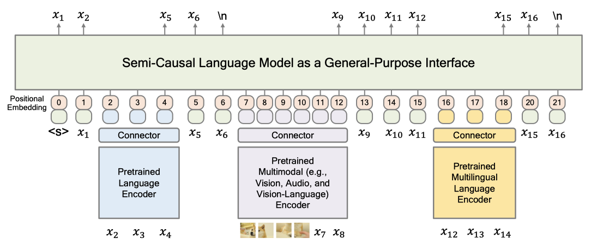
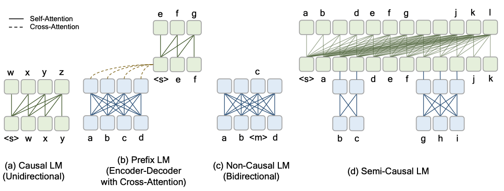
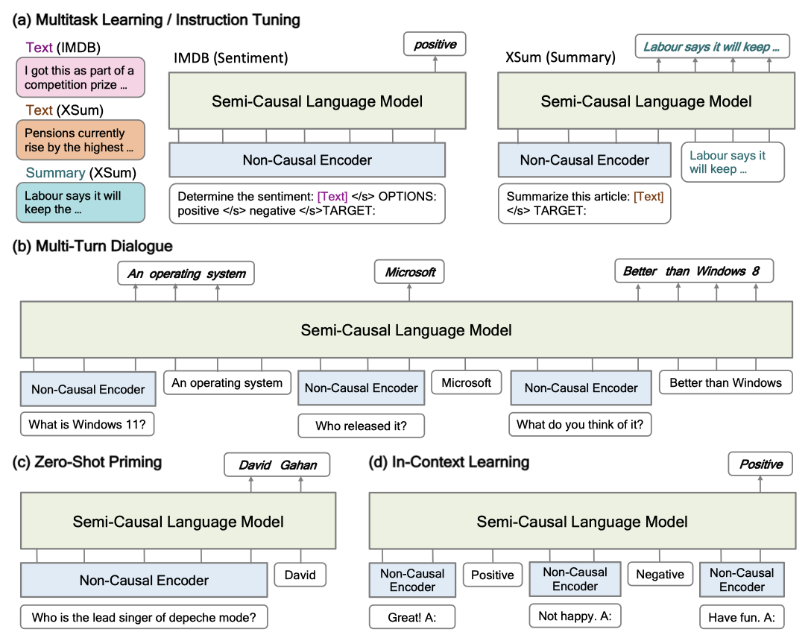
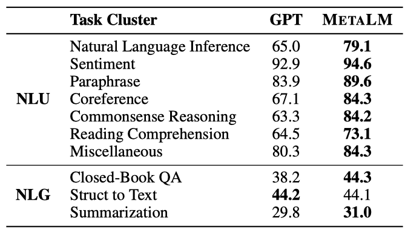
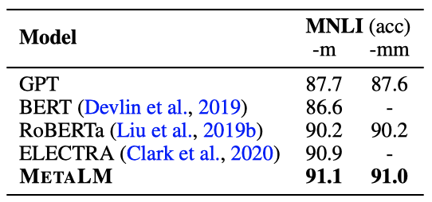
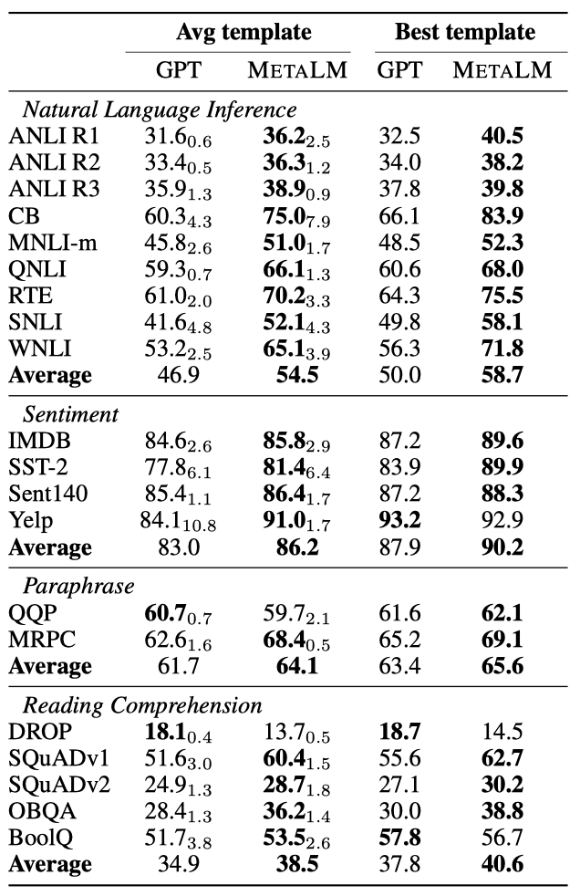
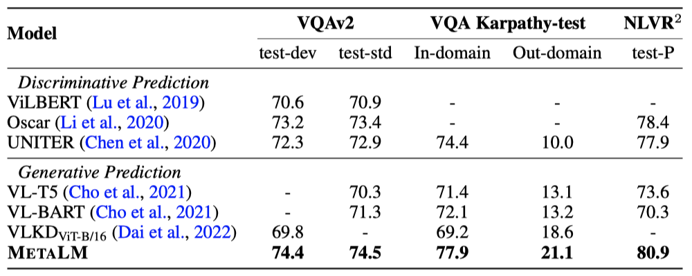
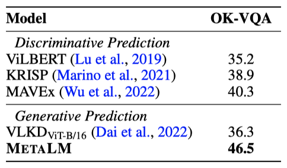
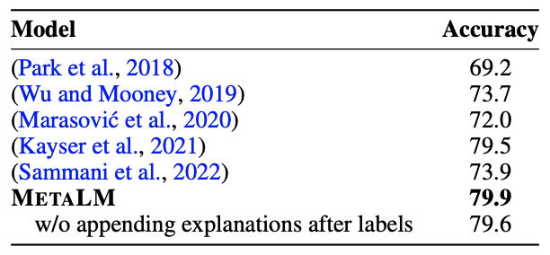

+++
author = "Kurt"
title = "METALM"
date = "2024-02-08"
description = "Language Models are General-Purpose Interfaces"
categories = [
    "Paper Review"
]
tags = [
    "LLM",
    "Milestone",
]
+++

## Abstract

파운데이션 모델은 다양한 응용 분야에서 효과적이기 때문에 주목받고 있다. 이 연구에서는 언어 모델을 다양한 파운데이션 모델에 대한 일반적인 인터페이스로 사용하는 것을 제안한다. 이는 causal 모델링과 non-causal 모델링의 장점을 동시에 가져와,  bidirectional encoder의 사용으로 미세조정이 쉽고, 문맥 내 학습이나 지시 수행 등을 가능하게 한다. 실험 결과, METALM 모델은 미세조정, zero-shot 일반화, few-shot 학습 등에서 전문 모델들과 경쟁력을 가지거나 능가하는 성능을 보여주었다.

---

## Introduction: Design Principles

**Language models as a universal task layer.** 대규모 언어 모델은 언어, 비전, 다중 모달 작업 등의 일반적인 인터페이스로 사용된다. 언어 모델의 출력 공간은 개방적이어서 다양한 작업에 적용될 수 있다. 예측을 자연어로 설명하는 것이 가능하다면, 그 작업은 언어 모델 기반의 작업 layer에 맞출 수 있다. 예측을 자유 텍스트 시퀀스로 변환하는 것은 자연스럽고, 이를 통해 분류나 질문 응답 등의 목표 레이블과 답변을 텍스트로 변환할 수 있다. 또한, 이러한 작업 layer를 통해 예측 과정이 단일 턴을 넘어서 다중 턴 대화 인터페이스를 구축할 수 있다. 이런 방식의 다양한 작업 통합은 general-purposed AI에 중요하며, 표현, 변환, 표현을 공유 모듈로 통합한다.

**Causal language modeling (i.e., unidirectional decoder) is conducive to zero-shot generalization and in-context learning.** GPT-3는 causal 언어 모델 사전 학습에서 나타나는 흥미로운 속성을 보여주었다. causal 언어 모델링의 효율성과 inductive bias로 인해 모델에 원하는 속성을 부여하는 것이 효과적이다. zero-shot과 few-shot 학습 능력은 모델이 일반적인 작업 layer가 되는데 중요하며, 이는 언어 모델이 대규모 텍스트를 통해 세계 지식과 패턴을 배웠음을 보여준다. 이러한 정보는 다양한 작업에 대한 배경 지식과 기본 기술로 활용될 수 있다. 또한, 컨텍스트 내 학습을 통해 사전 학습 된 모델을 새로운 시나리오에 쉽게 적용할 수 있다.

**Non-causal modeling (i.e., bidirectional encoder) is conducive to transfer across tasks, languages, and modalities.** causal 언어 모델은 zero-shot과 few-shot 일반화에 뛰어나지만, BERT와 T5는 masked language modeling으로 사전 학습된 bidirectional encoder를 사용하면 미세 조정 성능이 매우 향상된다는 것을 보여준다. non-causal 모델링은 데이터 인코딩에 에 적합하며, 주석이 달린 데이터가 많이 있는 상황에서 미세 조정의 장점이 도움이 된다. 또한, masked language modeling 목표에 의해 사전 학습된 non-causal encoder는 다국어 설정에 효과적으로 적용된다.

**Semi-causal language modeling as a meta-pretraining task.** semi-causal 언어 모델링은 non-causal encoder와 causal 언어 모델을 연결하는 역할을 하며, 이는 사전 학습된 encoder의 보편적 인터페이스 사전 학습의 일부이다. non-causal encoder는 다양한 입력 데이터를 표현하는 것을 배우고, causal 언어 모델은 보편적인 작업 layer로 작동한다. 이러한 방식은 두 모델링 방법의 이점을 동시에 얻을 수 있게 한다. 또한, bidirectional encoder의 출력을 causal decoder에 직접 공급하여 구조를 단순화하며, 이는 여러 bidirectional encoder를 causal 언어 모델에 탑재할 수 있게 한다.

**Non-causal encoders as System 1, and causal language models as System 2.** cognition은 일반적으로 직관적이고 무의식적인 시스템 1과 순차적이고 의식적인 계획 및 추론을 하는 시스템 2로 분류된다. 제안된 프레임워크에서는 이 두 가지 시스템이 각각 모듈로 구현되며, BERT와 BEiT와 같은 non-causal encoder는 다양한 입력을 인코딩하는 인식 계층으로서 시스템 1의 역할을 한다. 그 후, 입력 표현은 상식 추론과 계획에 뛰어난 성능을 보이는 causal 언어 모델에 공급되며, 이는 시스템 2의 역할을 하는 보편적인 작업 layer로 설계되었다.

**Natural language interface between users and pretrained models.** causal 언어 모델링 기반의 보편적 작업 layer는 사용자가 자연어로 non-causal encoder와 상호작용하게 해준다. 언어는 프로그래밍 언어처럼 모델에 지시를 내릴 수 있고, 모델은 자유롭게 텍스트를 사용해 결과를 제시할 수 있다. 또한, 이 프레임워크는 여러 턴의 대화 상호작용을 지원하며, 각 턴에서 입력을 인터페이스 layer에 제공하고, 반원인 방식으로 응답 결과를 생성할 수 있다.

---

## METALM: Meta Language Model

다양한 기반 모델과의 상호작용을 지원하는 general-purpose의 인터페이스 역할을 하는 non-causal 언어 모델인 Meta Language Model(METALM)을 제시한다. 구체적으로, 다양한 모달리티를 인식하는 사전 학습된 encoder들이 언어 모델에 도킹한다. 언어 모델은 보편적인 작업 layer(즉, general-purpose의 인터페이스)로 간주되며, 이는 다양한 작업을 자유 텍스트 생성으로 통합한다.

METALM의 사전 학습을 위해, semi-causal 언어 모델링 작업을 제안하여 모듈을 함께 학습한다. METALM은 언어 모델의 in-context 학습, multi-turn interaction, open-ended generation의 능력을 상속받으며, 기본 모델들은 bidirectional 모델링 덕분에 미세 조정에 유리하다.

### Input Representation

METALM의 입력 표현은 underlying encoder로부터 얻은 컨텍스트화된 표현과 텍스트의 토큰 임베딩 두 가지 유형으로 분류된다. 이런 표현들은 위치 임베딩과 합산된 후, 일반적인 목적의 인터페이스로 공급된다.

### Model Architecture

세 가지 언어 모델 변형과 제안된 semi-causal 언어 모델의 구조를 요약하면 다음과 같다. causal 언어 모델(GPT 등)은 왼쪽에서 오른쪽으로 변환하는 decoder, 접두사 언어 모델은 encoder-decoder 구조를 사용하며, non-causal 언어 모델은 bidirectional encoder로 구성된다. semi-causal 언어 모델은 unidirectional Transformer decoder와 여러 bidirectional encoder를 가지며, 전체 세션을 왼쪽에서 오른쪽으로 처리하고 일부 범위는 non-causal encoder로 사전 인코딩한다.

**Backbone Network** transformer를 사용하여 모델을 구축한다. 입력 시퀀스의 벡터 표현을 패킹한 후, multilayer Transformer를 통해 컨텍스트화된 표현으로 인코딩한다. 각 transformer block은 multi-head self-attention layer와 feed-forward network layer를 포함하며, attention mask는 컨텍스트 접근을 제어한다. 보편적인 작업 layer는 삼각행렬 attention mask를 사용하여 입력을 왼쪽에서 오른쪽으로 처리하고, bidirectional encoder는 모든 토큰이 서로 접근할 수 있게 한다. 마지막으로, 출력 벡터를 softmax classifier로 어휘를 예측하며, 이 가중치 행렬은 입력 토큰 임베딩과 공유된다.

**Connector** 보편적인 작업 layer와 다양한 bidirectional encoder 사이의 커넥터 layer는 encoder의 벡터 표현을 투영하고, 기반 모델의 출력 차원을 보편적인 작업 레이어와 맞추는 역할을 한다. 실험에서는 linear projection과 feed-forward network가 잘 작동하는 것으로 나타났다.

### Proposed Objective: Semi-Causal Language Modeling

METALM을 사전 학습하기 위해, semi-causal 언어 모델링을 이용해 시퀀스의 토큰을 autoregressively하게 생성하며, 특정 부분은 bidirectional encoder를 통해 표현되었다.

입력 시퀀스 $x =  x_1, x_2, ..., x_n$가 주어졌을 때, $k$개의 non-causal span $\lbrace x_{s_1}^{e_1}, ..., x_{s_k}^{e_k} \rbrace$를 가정하며, 각 범위에 대해 bidirectional encoder를 사용해 벡터 표현 $h(x_{s_i}^{e_i})$을 얻는다. 이 encoder의 선택은 non-causal span의 모달성에 따라 달라진다.

non-causal 언어 모델링 목표는 다음과 같이 정의된다:

$$ max \sum_{i=0}^k \sum_{t=e_i}^{s(i+1)} log \ P(x_t | x_{< t}, \lbrace h(x_{s_i}^{e_i}) \rbrace_{j<i}) $$

여기서 $e_0 = 1$, $s_{(k+1)}$ = n, 그리고 $\lbrace h(x_{s_i}^{e_i}) \rbrace_{j<i} = \lbrace h(x_{s_1}^{e_1}), ..., h(x_{s_{(i-1)}}^{e_{(i-1)}}) \rbrace$ 이다. non-causal 언어 모델링 목표는 각 non-causal 범위의 다음 토큰이 해당 범위의 마지막 위치에서 생성되며, non-causal 범위의 수와 위치는 무작위로 샘플링되고, 이 범위들은 서로 겹치지 않는다.

제안된 목표를 이용해 일반적인 인터페이스와 기반 모델을 함께 사전 학습하며, 이를 통해 이들을 매끄럽게 연결한다. 이는 언어 전용 설정과 시각-언어 설정 모두에 대해 METALM을 사전 학습하는 데 사용된다.

### Capabilities on Downstream Tasks

**In-Context Learning** METALM은 parameter 업데이트 없이 자연어 지시나 입력-출력 쌍에 의해 새로운 작업에 적응한다. 이는 k-shot 학습을 통해 이루어지며, 각 입력은 bidirectional encoding 후 일반적인 인터페이스에 입력된다. 이렇게 하면 METALM은 보이지 않는 예의 목표 출력을 예측할 수 있다. zero-shot 일반화의 경우, 작업 지시와 함께 예제가 bidirectional encoder에 입력되며, 목표 출력은 보편적인 작업 계층에 의해 생성된다.

**Finetuning** downstream task에 대한 많은 주석 예제가 있을 때, 미세 조정은 매우 유용하다. 모든 작업을 자유형 텍스트로 변환하는 개방형 생성 형식으로 통합한다. 이 과정에서 METALM은 bidirectionally encoding 된 입력을 기반으로 목표 출력을 생성하도록 학습하고, 이를 통해 bidirectionally encoder의 뛰어난 미세 조정 능력을 이어받는다.

**In-Context Customization** 먼저 모델을 대량의 데이터에 대해 미세 조정하고, in-context 학습을 사용하여 모델을 맞춤화한다. 이렇게 하면 레이블이 있는 데이터의 지식을 새 작업에 쉽게 전달할 수 있다. METALM은 causal 및 non-causal 모델링의 장점을 결합하여 non-causal 모델링의 우수한 미세 조정 성능과 causal 모델링의 in-context 학습을 가능하게 한다.

**Multimodal Multi-Turn Interaction** METALM은 사용자와의 multi-turn interaction을 지원하며, 다양한 형태의 입력을 인코딩하여 응답을 생성한다. 이는 이전 대화를 기반으로 자연스럽게 대화형 인터페이스로 작동하며, 텍스트 이외의 여러 형태의 정보를 포함할 수 있다.

---

## Experiments on Language-Only Tasks

먼저 언어만을 기반으로 한 데이터셋에서 실험을 진행하여 METALM의 다양성과 효과를 보여준다. 여기서 non-causal encoder는 보편적인 작업 계층에 도킹하는 사전 학습된 언어 기반 모델이다. 이러한 매력적인 능력은 사전 학습을 통해 나타나며, 이를 통해 일반적인 인터페이스가 작업과 시나리오를 가로질러 전환할 수 있다.

### Evaluation Settings

METALM의 다양한 능력, 즉 multitask 미세 조정, single-task 미세 조정, instruction tuning, 그리고 in-context 학습을 보여준다. 이러한 능력은 작업에 구애받지 않고 널리 적용되어 스킬 적용과 사용자와의 커뮤니케이션을 용이하게 한다. 또한, 이 능력은 미세 조정과 in-context 학습의 결합에 기반한 평가 설정을 가능하게 한다. 작업이 자유형 텍스트 형식으로 통합되어, 같은 인터페이스를 통해 다양한 downstream task를 처리할 수 있다.

입력 예시와 지시문은 non-causal 언어 encoder로 전달되며, 그 결과는 범용 작업 계층에서 생성된다. 예측은 개방된 방식으로 만들어져 다양한 결과를 가져온다.

### Pretraining Setup

METALM은 sinusoidal position embedding을 사용하며, 24개의 layer와 각 layer 당 32개의 attention head, hidden dimension은 2048이다. non-causal 부분에는 encoder-only Transformer를 사용하며, learnable position embedding과 relative position bias을 활용한다. 또한, Transformer에 대해 DeepNorm을 사용하며, 커넥터 모듈은 linear projection layer이다.

non-causal 모델과 semi-causal 모델의 최대 입력 길이는 각각 512와 2048이다. 64~128 길이의 무작위 범위를 샘플링하여 non-causal 부분에 제공하며, 이 범위는 원래 시퀀스 길이의 25%를 차지한다. semi-causal 언어 모델은 처음부터 사전 학습하며, non-causal 모듈은 사전 학습된 bidirectional encoder로부터 초기화된다. 사전 학습 동안 non-causal encoder의 대부분 parameter를 고정한다. METALM은 1024의 batch size로 300k step 동안 사전 학습되며, Adam을 optimizer로 사용한다. semi-causal 모델의 드롭아웃은 비활성화하고, non-causal 모델의 드롭아웃 비율은 0.1로 설정한다. learning rate는 warm-up과 함께 6e-4를 사용한다.

다양한 데이터 소스로 구성된 대규모 영어 텍스트 데이터셋인 Pile에서 모델을 사전 학습한다. GitHub, arXiv, PubMed Central은 제외하였다. 이 데이터는 SentencePiece로 토큰화되며, "full-sentence" 형식으로 입력을 구성한다. 즉, 각 입력 시퀀스는 연속적으로 샘플링된 전체 문장으로 이루어진다. 그리고 추가적으로 세 가지 특수 토큰($<$s$>$, $<$/s$>$, $<$/d$>$)을 사용하여 시퀀스 시작, 문단 끝, 문서 끝을 표시한다.

### Multitask Finetuning

METALM을 multitask 미세 조정 환경에서 평가한다. 다양한 작업들을 open-ended generation 방식으로 통합하였고, 이를 통해 어떠한 작업 특정 아키텍처 없이도 보편적 작업 layer에서 처리할 수 있다. 미세 조정 동안에는 무작위로 학습 예제를 샘플링하고, 이를 bidirectional language encoder에 입력한다. 미세 조정의 목표는 인터페이스에서 생성된 정확한 레이블의 가능성을 최대화하는 것이다.

언어 이해 작업과 생성 작업을 포함한 10개의 작업 군집으로 그룹화된 34개의 NLP 데이터셋의 혼합에 대한 실험을 실시한다.

* **Natural Language Inference:** ANLI (R1-R3), CB, MNLI, QNLI, RTE, SNLI, WNLI
* **Sentiment Classification:** IMDB, SST-2, Sentiment140, Yelp
* **Paraphrase Detection:** QQP, MRPC, Paws Wiki
* **Coreference Resolution:** DPR, Winogrande, WSC
* **Commonsense Reasoning:** HellaSwag, PiQA, COPA
* **Reading Comprehension:** DROP, SQuADv1, SQuADv2, OBQA, BoolQ
* **Miscellaneous:** CoLA, WiC, TREC
* **Closed-Book QA:** ARC-easy, NQ
* **Struct to Text:** CommonGen, E2ENLG
* **Summarization:** AESLC, SamSum, XSum

#### Evaluation Setup

METALM은 30k의 최대 학습 예제 수를 가진 다양한 데이터셋에 대해 미세 조정된다. 다중 선택 작업인 경우 모든 가능한 옵션들이 템플릿에 포함된다. 예를 들어, 감성 분류 데이터셋에서는 모델이 "Positive" 또는 "Negative"을 생성함으로써 텍스트의 감성을 판단한다. 이 과정은 Wei et al. (2021)에서 사용된 프롬프트를 따른다.

METALM은 256의 batch size로 20k step 동안 미세 조정되며, 입력과 답변 토큰의 총 길이는 2048로 제한된다. batch 친화적인 계산을 위해 여러 학습 예제를 하나의 시퀀스로 패킹하며, learning rate은 1e-4로 설정한다.

multi-choice 작업에서는 디코딩 제약 없이 정확도 점수를, SQuAD, DROP, closed-book QA 데이터셋에서는 greedy 디코딩을 사용한 F1 점수를 보고한다. struct2text와 요약 군집에서는 beam size 4, length penalty $\alpha = 0.6$의 beam size을 사용하며, 이 두 군집에 대해 ROUGE 점수를 보고한다.

#### Results

METALM과 GPT의 다중 작업 미세 조정 결과를 비교하며, 동일한 설정을 사용한다. 각 결과는 작업 군집의 평균 점수를 나타낸다.

METALM은 거의 모든 작업 군집에서 GPT를 크게 앞선다는 것을 확인하였다. 이는 non-causal encoder로부터 미세 조정 능력을 상속받았기 때문이다. 특히, METALM은 자연어 이해 작업에서 뛰어난 성과를 보이며, 이는 non-causal 모델링이 미세 조정에 유리하다는 것을 부분적으로 확인한다. METALM의 성능 향상은 자연어 추론과 독해 등의 도전적인 작업에서 두드러지며, 언어 생성, 닫힌 책 질문 응답, 텍스트 요약 등에서도 GPT를 능가한다.

### Single-Task Finetuning

데이터가 많은 상황에서 METALM의 미세 조정 능력을 탐색하고, 새로운 미세 조정 방법을 설계한다. 이 방법은 언어 모델을 고정하고 비인과적 non-causal parameter만을 업데이트한다. 이 전략은 탁월한 성능을 보이며, 문맥 학습과 개방성을 유지함을 보여준다.

#### Finetuning Setup

자연어 추론 데이터셋 MNLI에서 single-task 미세 조정을 수행한다. 작업은 주어진 전제에 대해 가설이 참인지, 거짓인지, 아니면 결정되지 않았는지를 판단하는 것이다. 미세 조정 동안, 일반 인터페이스는 고정되고 non-causal encoder와 커넥터만 업데이트된다. 반면 GPT 기준선에 대해선 모든 parameter가 업데이트된다. METALM과 GPT는 learning rate 5e-5와 batch size 32로 3 epoch 동안 미세 조정된다.

#### Results

METALM은 훨씬 적은 parameter를 업데이트하면서도 MNLI의 정확도를 3.4포인트 향상시킨다. 결과는 bidirectional encoder가 미세 조정 성능에 이점을 준다는 것을 보여준다. 또한, BERT, RoBERTa, ELECTRA 같은 bidirectional 언어 encoder의 미세 조정에서 파생된 세 가지 강력한 기준선과 비교하여 METALM은 비슷하거나 더 나은 성능을 보여준다.

### Instruction-Tuned Zero-Shot Generalization

METALM에 대한 instruction tuning을 통해 모델을 다양한 작업에 미세 조정하고, instruction following과 zero-shot 일반화 성능을 평가한다. 특정 데이터셋에서 평가할 때, 동일한 작업 군집의 모든 데이터셋은 학습 단계에서 제외된다. 예를 들어, 분류 데이터셋 SST-2에서 평가할 경우, 감성 분석 전체 군집은 instruction tuning 동안 제외된다.

#### Instruction-Tuning Setup

METALM과 GPT를 사용하여 요약 군집을 제외한 데이터셋 혼합에 대해 instruction tuning을 수행하며, FLAN에서 제안한 평가 파이프라인을 따른다. 각 데이터셋에 대해, FLAN에 의해 수동으로 작성된 10가지 템플릿 중 하나를 무작위로 적용한다. 이 중 일부 템플릿은 작업을 "turned the task around" 방식으로 학습 다양성을 높인다. 예를 들어, 감성 분류 작업에서는 모델이 주어진 "Positive" 감성 라벨에 기반한 영화 리뷰를 생성하도록 한다.

자연어 추론, 감성 분류, 패러프레이즈 탐지, 읽기 이해를 포함한 네 가지 작업 군집에서 METALM과 GPT를 사용하여 실험을 진행한다. 패러프레이즈 군집은 추론 군집에서, 그 반대도 마찬가지로 평가 시 제외된다. METALM과 GPT는 batch size 512로 30k step 동안 미세 조정되며, learning rate는 1e-4로 설정된다. 각 예제의 시퀀스 길이는 1024로 제한되며, 데이터 패킹 전략을 사용하여 효율성을 향상시킨다. 

#### Results

METALM은 다양한 템플릿을 사용하여 평균과 최고 점수 모두에서 GPT 기준선을 크게 능가하는 것으로 나타났다. 이는 semi-causal 언어 모델링의 효과를 보여준다. 특히, 자연어 추론, 감성 분석, 패러프레이즈 탐지, 읽기 이해 등의 작업에서 METALM은 일관되게 높은 성능을 보여주었다.

instruction tuning은 미세 조정과 zero-shot 일반화 능력을 모두 필요로 한다. 실험 결과, METALM은 bidirectional encoder를 통해 우수한 미세 조정 성능을 달성하면서도, causal 언어 모델의 zero-shot 일반화 능력을 유지함으로써, causal과 non-causal 언어 모델의 장점을 모두 활용하였다.

### In-Context Learning

METALM과 GPT의 in-context 학습 성능을 비교한다. 작업 지시와 input-label 쌍에 따라 언어 모델은 parameter를 업데이트하지 않고 원하는 downstream task로 재조정된다. 예제 입력은 non-causal encoder를 통과하고, 레이블 토큰은 원래의 임베딩을 사용한다. 그 다음, 테스트 입력의 대상 레이블은 범용 작업 계층에서 생성된다.

#### Evaluation Setup

zero-shot, one-shot, few-shot 설정에서 실험을 진행하고, GPT-3의 평가 프로토콜을 따른다. 학습 세트에서 무작위로 샘플링한 예제를 사용하여 테스트 예제를 평가하며, Winograd의 경우 테스트 세트에서 직접 샘플링한다. few-shot 설정에서는 모든 예제가 구분자 토큰 $<$/s$>$로 구분된다.

METALM과 GPT 기준선은 cloze과 completion task, Winograd-style task, commonsense reasoning, 그리고 SuperGLUE 벤치마크의 BoolQ와 Copa 등 총 아홉 가지 작업에서 평가된다.

#### Results

METALM은 GPT에 비해 더 좋거나 비슷한 성능을 보인다. 특히 Winograd와 완성 작업에서는 GPT보다 더욱 향상된 성능을 보였으며, zero-shot과 few-shot 설정에서도 더 나은 평균 결과를 보인다. 이는 METALM이 탁월한 컨텍스트 내 학습 능력을 가지며, non-causal encoder의 문맥화된 표현이 모델의 일반화를 돕는다는 것을 보여준다.

---

## Experiments on Vision-Language Tasks

이미지와 텍스트를 결합한 vision-language 설정에서 실험을 진행한다. underlying non-causal encoder는 이미지-텍스트 쌍을 분석하고, 이미지 토큰을 텍스트 토큰 앞에 추가해 bidirectional fused representation을 생성한다. bidirectional fused representation을 기반으로 causal decoder는 남은 토큰을 순차적으로 예측한다. text-only 데이터도 활용되며, 이미지-텍스트 데이터와 텍스트만의 데이터를 함께 사전 학습하고 있다.

### Evaluation Settings

다양한 실험을 통해 zero-shot 일반화, 문맥 학습, 파인튜닝을 진행하며, 이 과제들은 시각적 질문 응답, 시각적 추론, 이미지 캡셔닝, 설명 생성 등의 카테고리로 나뉜다. 9개의 데이터셋을 활용한 평가는 이해력과 생성력 모두를 측정한다.

입력 이미지와 프롬프트는 vision-language encoder에 공급되며, 목표 출력은 언어 모델에 의해 생성된다. 모든 작업들은 개방형 생성 방식으로 구성된다.

### Pretraining Setup

12-layer non-causal vision-language encoder와 24-layer 언어 모델을 사용하며, 이는 GPT-2의 아키텍처를 따른다. hidden size는 1024, attention head는 16개이며, sinusoidal position embedding을 사용한다. parameter의 수는 총 353M이다. non-causal encoder에는 192M의 parameter를 갖는 VLMo 방식의 사전 학습된 vision-language 모델을 사용하며, 이미지는 224x224 해상도로 사전 학습된다. 커넥터는 three-layer feed-forward network이다.

METALM은 batch size 256으로 350k step에 걸쳐 사전 학습되며, 이 과정에서 $\beta_1 = 0.9$, $\beta_2 = 0.98$의 AdamW optimizer를 사용한다. learning rate는 1e-4, weight decay는 0.01이며, 처음 2,500step에서 warm-up을 적용하고 linear decay를 사용한다. dropout rate는 0.1이다.

METALM은 이미지-텍스트 쌍과 텍스트 문서를 이용해 사전 학습된다. 이미지-텍스트 쌍은 Conceptual Captions, Visual Genome, COCO Caption, SBU Caption 데이터셋을 활용하며, 총 400만 개의 이미지와 1000만 개의 이미지-텍스트 쌍이 있다. 텍스트 문서는 Reddit 웹 텍스트의 오픈소스 재현인 OpenWebText 말뭉치를 사용한다.

### Zero-Shot Generalization

METALM의 zero-shot 일반화 능력을 평가하기 위해, 이미지 캡셔닝과 시각적 질문 응답 두 가지 작업을 수행한다. 이미지 캡셔닝에서는 주어진 이미지의 설명을 생성하며, 시각적 질문 응답에서는 이미지에 대한 질문에 올바른 답변을 예측한다.

#### Evaluation Setup

추론 시에는 greedy decoding을 사용하며, 입력 이미지는 224x224로 크기를 조정한다. 두 가지 작업에 대한 데이터셋과 설정은 다음과 같다:

**Image Captioning** MS COCO Caption, NoCaps, Flickr30k에서 zero-shot 캡션 생성을 평가한다. COCO Karpathy 분할의 테스트 세트, NoCaps와 Flickr30k의 검증 및 테스트 세트에서 평가를 진행하며, BLEU, CIDEr, METEOR, SPICE를 캡션 생성 지표로 사용한다. 점수는 COCOEvalCap2를 통해 계산되며, 모든 zero-shot 캡션 생성 실험에서는 METALM에 "Summarize this image:" 라는 프롬프트를 제공한다.

**Visual Question Answering** VQAv2 검증 세트와 OK-VQA 테스트 세트에서 zero-shot 성능을 평가하며, VQA 점수는 VQAv2 평가 코드의 정규화 규칙을 사용해 계산한다. METALM은 사전에 정의된 답변 세트가 아닌, 개방형 생성 방식으로 답변을 예측한다. 시각적 질문 응답 실험에서는 "question: question text answer:" 템플릿으로 METALM을 프롬프트한다.

#### Results

METALM은 세 이미지 캡션 데이터셋에서 다른 최신 모델들을 능가한다. 비교 대상인 FewVLM 모델은 이미지 캡셔닝에 다양한 프롬프트를 사용하지만, 이 모델은 모든 실험에서 "Summarize this image:" 라는 동일한 프롬프트를 사용하여 견고하게 캡션을 생성한다.

두 데이터셋 모두에서 METALM은 더 많은 parameter를 갖는 Frozen과 VLKD보다 우수한 결과를 보여준다. 특히, 외부 지식이 요구되는 OK-VQA에서도 좋은 성능을 보여, METALM의 언어 모델이 지식 소스로 활용될 수 있음을 보여준다. 객체 정보가 vision encoder에 의해 인식되면, universal task layer는 이를 언어 모델링하여 답변을 생성한다.

다섯 개의 데이터셋에서의 실험 결과, METALM은 zero-shot 일반화와 개방형 생성 능력을 가지며, 프롬프트를 통해 이미지 캡셔닝과 시각적 질문 응답에 대해 사전 학습된 모델을 재활용할 수 있다.

### In-Context Learning

시각적 질문 응답에서 in-context 학습 능력을 평가하며, parameter를 미세조정하지 않고 k개의 데모를 이용한 k-shot 학습을 진행한다.

#### Evaluation Setup

VQAv2 검증 세트와 OK-VQA 테스트 세트에서 few-shot 실험을 진행하며, 각 테스트 인스턴스에 대해 학습 세트에서 최대 네 개의 예시를 무작위로 샘플링한다. 예측된 답변은 VQAv2 평가 코드의 정규화 규칙에 따라 평가되며, 추론 시에는 224x224의 이미지 해상도를 사용한다.

테스트 입력 전에 몇 가지 예시를 두고 universal task layer에서 예측을 얻는다. 전체 예시는 이미지, 질문, 답변을 나타내는 $[i, q, a]$로 표시하며, 테스트 입력은 $[i, q]$로 표시한다. k-shot in-context 학습에서는 전체 입력 시퀀스가 $e_1, ..., e_k, t$가 된다. "Question: [question text] Answer:" 프롬프트를 통해 METALM을 지시하고, greedy 디코딩을 사용하여 답변을 생성한다.

#### Results

in-context 시연을 추가하면 zero-shot 일반화보다 성능이 향상되며, 더 많은 예시를 추가할수록 성능 개선이 더욱 커진다. 작은 모델 크기를 사용한 METALM은 Frozen에 비해 더 나은 성능을 보여준다. METALM은 기본 vision-language 모델을 수정하지 않고도 시각적 질문 응답에서 in-context 학습을 수행할 수 있으며, universal task layer의 도움으로 기존 모델에 in-context 학습 능력을 추가할 수 있다.

### Finetuning on Downstream Tasks

사전 학습된 METALM을 다양한 vision-language 작업에 미세 조정하고, 이를 강력한 판별 모델과 최근의 생성 모델과 비교한다. 이 작업들에는 이미지 캡셔닝, 시각적 질문 응답, 시각적 추론, 설명 가능한 시각적 추론이 포함된다.

#### Finetuning Setup

모든 작업에서는 384x384 해상도를 사용하고 이미지 증강에는 RandAugment를 적용한다. 모든 데이터셋의 learning rate는 1e-5로 고정되어 있다.

**Visual Question Answering** VQAv2, VQA Karpathy 분할, OK-VQA에서 평가를 진행한다. 모델은 각 데이터셋의 학습 세트와 검증 세트에서 미세 조정되며, 해당 테스트 세트에서의 VQA 점수를 보고한다. METALM은 VQAv2와 VQA Karpathy 분할에서 140k step, OK-VQA에서 10k step 동안 미세 조정된다. "Question: [question text] Answer: [answer text]" 프롬프트를 generative 미세 조정에 사용한다.

**Visual Reasoning** NLVR 2 데이터셋에서 평가를 진행한다. 이 데이터셋의 예시는 두 이미지와 한 문장으로 구성되며, 이들을 개별 이미지-텍스트 쌍으로 재분할하여 각각의 표현을 얻는다. 이 표현들의 연결을 활용하여 예 또는 아니오 예측을 생성하며, generative 미세 조정을 위해 "it is [label]"을 적용한다. METALM은 5 epoch 동안 미세 조정된다.

**Image Captioning** COCO 캡션 데이터셋의 Karpathy 분할에서 평가를 진행한다. BLEU-4, CIDEr, METEOR, SPICE를 평가 지표로 사용하며, 이 결과들은 강화된 CIDEr 최적화 없이 cross-entropy 미세 조정에서 얻는다. 미세 조정 중에는 객체 태그를 사용하지 않으며, "caption: [caption text]" 프롬프트를 사용하여 METALM을 학습 분할에서 100k step 동안 미세 조정한다.

**Explainable Visual Reasoning** E-SNLI-VE 데이터셋에서 평가를 진행한다. 이 데이터셋은 이미지-텍스트 쌍 사이의 포함 레이블 예측과 동시에 그 예측에 대한 설명을 생성하는 것을 모델에 요구한다. METALM은 7 epoch 동안 미세 조정되며, "it [entailment label] because [explanation]." 프롬프트를 generative 미세 조정에 사용한다.

#### Results: Visual Question Answering and Visual Reasoning

METALM은 모든 데이터셋에서 강력한 성능을 보여주며, generative 예측을 가진 이전 모델들을 능가하고 discriminative vision-language 모델과 경쟁하거나 더 나은 결과를 보인다. 특히, 시각적 질문 응답과 같이 개방형 예측이 필요한 작업에서 이 모델의 장점이 드러난다. 이는 VQA Karpathy-test의 out-domain 세트에서 확인할 수 있다.

out-domain 예시로 일반화하는 것은 어렵다. 그러나 모든 모델 중 METALM이 out-domain 결과에서 가장 좋은 성능을 보여주며, 다른 데이터셋에서도 일관되게 경쟁력 있는 결과를 나타낸다. 이와 대조적으로 이전의 generative 모델들은 out-domain 세트에서는 더 나은 결과를 보이지만 다른 데이터셋에서는 성능이 떨어진다.

OK-VQA 데이터셋은 모델이 질문에 답하기 위해 외부 지식을 활용하도록 요구하는데, 이전 방법들은 주로 지식 베이스를 활용해 후보 답변을 필터링한다. 하지만, METALM은 사전 학습 과정에서 획득한 풍부한 세계 지식을 활용할 수 있는 유연성을 제공하며, 이를 통해 추가적인 지식 베이스에 의존하지 않고 이 작업에서 큰 개선을 이룬다.

METALM은 포함 레이블과 설명을 함께 생성하도록 학습되며, 이전 방법들과 비교해 가장 높은 정확도를 보여준다. 또한, METALM은 설명을 활용하여 포함 레이블 예측의 성능을 향상시키는 장점을 가지고 있다. 이는 METALM이 사용자와 기반 모델 간의 상호작용을 촉진하는데 사용될 수 있음을 보여준다.

다양한 데이터셋에서 보여진 경쟁력 있는 결과는 METALM의 미세 조정에 bidirectional 모델링이 유리하다는 것을 보여준다. 이로 인해 미세 조정과 open-ended 예측에서 동시에 좋은 성능을 얻을 수 있다.

#### Results: Visually Grounded Language Generation

CIDEr 최적화 없이 직접 비교한 결과, METALM이 다른 모델들보다 훨씬 개선된 성능을 보여준다.

E-SNLI-VE에서 METALM은 포함 레이블과 설명을 함께 생성하며, 대부분의 지표에서 이전 모델들을 능가한다. 또한, 이해와 설명 생성 모두에서 좋은 성능을 보여준다. 반면, Sammani et al. (2022)의 방법은 설명 생성에서는 경쟁력 있는 성능을 보이지만, 포함 분류에서는 더 낮은 정확도를 보여준다.

시각적 기반 언어 생성의 결과는 다양한 sequence-to-sequence 학습 문제에 적용 가능한 METALM의 일반성을 보여준다. METALM은 vision-language 셍성 작업에 대한 미세 조정을 통해 좋은 성능을 보여준다.

---

## Related Work

### Language Model Pretraining

대규모 언어 모델 사전 학습은 다양한 작업에서 뛰어난 성능을 보여주고 많은 연구 관심을 끌었다. 모델들의 차이는 주로 사전 학습 목표와 아키텍처에 있다. GPT는 few-shot과 in-context 학습을 가능하게 하는 인과적 언어 모델을 사전 학습하며, 최근의 연구들은 데이터와 모델 크기를 확장하는 데 초점을 맞추고 있다. T5와 BART 등의 연구는 모든 작업을 text-to-text 형식으로 변환하거나 오염된 문서에서 원문을 재구성하는 등 자연어 이해와 생성 작업 모두를 처리할 수 있는 프레임워크를 조사하였다. 이 논문의 작업에서는 semi-causal 언어 모델링을 도입하여 미세 조정 성능을 향상시키고 in-context 학습 능력을 활용하였으며, 이를 통해 다양한 기반 모델에 대한 일반적인 목적의 인터페이스를 구축할 수 있게 되었다.

### General-Purpose Modeling

다양한 작업, 변환, 모달리티를 지원하는 공유 모듈에서의 일반 목적 모델에 대한 연구가 있다. MT-DNN은 다중 작업 학습을 통해 학습하며, UniLM과 T5는 이해와 생성 능력을 하나의 모델에서 통합한다. 또한, 언어 모델은 사용자의 의도에 맞춰 일반 목적 능력을 구현하기 위해 지시사항을 따르도록 미세 조정된다. 일부 연구는 다중 작업뿐만 아니라 다중 모달리티를 지원하며, 이를 통해 언어/시각 이해, 다중 모달, 게임을 위한 상징적 표현 등 다양한 도메인에서의 일반적인 아키텍처를 구현하였다.

---

## Conclusion

METALM은 작업과 모달리티에 걸친 기반 모델에 대한 일반적인 인터페이스로, causal decoder와 여러 사전 학습된 non-causal encoder로 구성된다. 이 모델은 semi-causal 언어 모델링이라는 새로운 목표로 사전 학습되며, 언어 전용 및 vision-language 작업에서 뛰어난 미세 조정 및 in-context 학습 성능을 보여준다.

미래에는 METALM의 크기를 확장하고, 다국어 설정과 더 많은 모달리티(언어, 시각, 오디오, 다중 모달 등)를 동시에 처리할 수 있도록 확장하는 것을 계획하고 있다. 또한, 객체 탐지와 의미론적 분할과 같은 시각 작업으로 보편적 작업 계층을 확장하고, METALM을 이용한 parameter-efficient 미세 조정에 대해 조사할 예정이다.

---

## Reference

* [Paper](https://arxiv.org/pdf/2206.06336.pdf)
* [Github](https://github.com/microsoft/unilm)