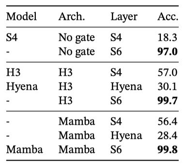
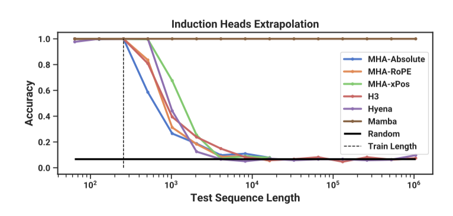
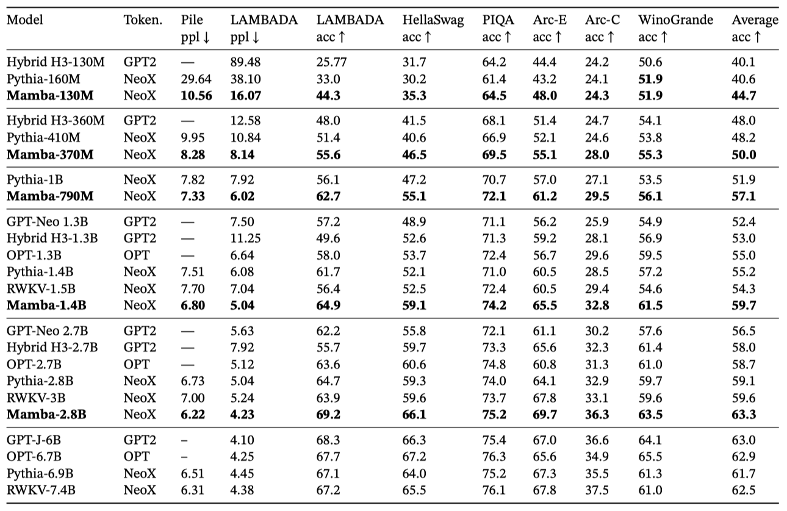
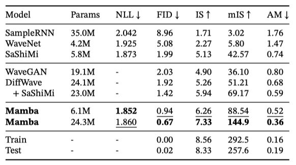
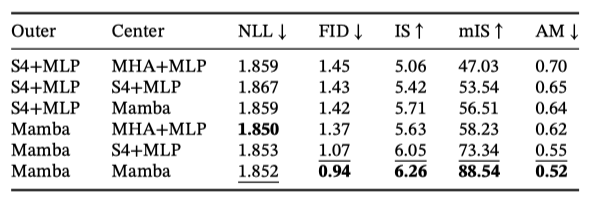
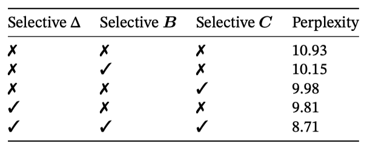
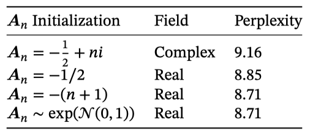
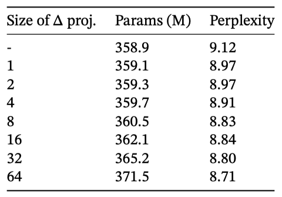
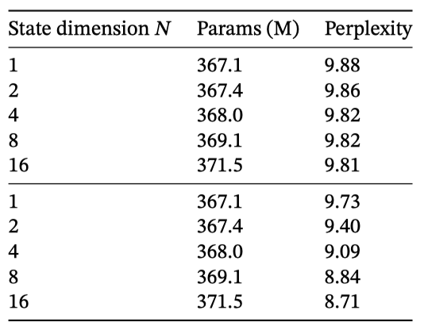

+++
author = "Kurt"
title = "Mamba"
date = "2024-04-29"
description = "Linear-Time Sequence Modeling with Selective State Spaces"
categories = [
    "Paper Review"
]
tags = [
    "LLM",
    "Milestone",
]
+++

## Abstract

기초 모델, 주로 transformer 구조에 기반한 현재 딥러닝 응용 프로그램은 긴 시퀀스 처리의 계산 비효율성과 언어 같은 핵심 모달리티에서의 성능 문제를 해결하기 위해 여러 하위 2차 시간 구조를 개발하였다. 이러한 모델의 내용 기반 추론 능력 부족을 개선하기 위해, SSM parameter를 입력에 따라 조정하고 선택적 SSM을 주의나 MLP 블록 없는 Mamba라는 단순화된 신경망 구조에 통합하였다. Mamba는 빠른 추론 속도와 시퀀스 길이에 대한 선형 스케일링을 제공하며, 여러 모달리티에서 최고 수준의 성능을 달성하고, 언어 모델링에서는 비슷한 크기의 transformer를 능가한다.

---

## Introduction

대규모 데이터에 사전 학습된 파운데이션 모델(FMs)은 언어, 이미지, 음성 등 다양한 도메인의 데이터를 처리하는 시퀀스 모델, 특히 transformer 기반으로 발전하였다. 이 모델들은 self-attention 메커니즘을 통해 복잡한 데이터를 효과적으로 모델링할 수 있으나, 정보를 유한한 창 안에서만 처리할 수 있는 한계와 계산 비용이 제곱으로 증가한다는 문제가 있다. 이를 극복하기 위한 연구가 활발히 진행되고 있으나, 아직 이러한 변형들이 다양한 도메인에서 대규모로 효과적임을 입증한 사례는 없다.

최근 구조화된 상태 공간 시퀀스 모델(SSMs)이 시퀀스 모델링을 위한 유망한 아키텍처로 부상하였다. 이 모델들은 RNNs와 CNNs의 결합으로, 고전적 상태 공간 모델에서 영감을 받았으며, 시퀀스 길이에 선형적으로 확장되며 장기 의존성을 효율적으로 모델링할 수 있다. SSMs는 오디오와 비전 같은 연속 신호 데이터에서 우수한 성능을 보였으나, 텍스트와 같은 정보 밀집 데이터 모델링에는 덜 효과적이다.

시퀀스 길이에 선형적으로 확장되고, transformer의 모델링 능력을 가진 새로운 선택적 상태 공간 모델을 제안한다.

**Selection Mechanism.** 이전 모델의 한계인 입력에 따른 데이터 선택 능력을 개선하기 위해, 선택적 복사와 induction head를 기반으로 한 간단한 선택 메커니즘을 도입하였다. 이를 통해 모델은 불필요한 정보를 제거하고 필요한 정보를 무기한 보존할 수 있다.

**Hardware-aware Algorithm.** 이 간단한 변화는 기존 SSM 모델들의 한계를 극복하기 위해 하드웨어 인식 알고리즘을 도입하여, 컨볼루션 대신 스캔을 사용하고 GPU 메모리 계층 간의 IO 접근을 피함으로써 모델을 더 효율적으로 계산한다. 결과적으로, 이 방법은 이론적으로 및 A100 GPU에서 최대 3배 더 빠른 성능을 보여준다.

**Architecture.** 이전 SSM 아키텍처의 설계와 transformer의 MLP 블록을 결합하여, 선택적 상태 공간을 포함하는 단순하고 통합된 아키텍처 디자인(Mamba)을 생성하였다.

선택적 SSM과 Mamba 아키텍처는 언어와 유전학 같은 분야에서 뛰어난 성능을 보이는 높은 품질, 학습과 추론의 빠른 속도, 그리고 시퀀스 길이 1M까지 지원하는 긴 컨텍스트 능력으로 시퀀스 처리의 핵심 모델로 적합하다.

다양한 모달리티와 설정에서 사전 학습 품질과 도메인별 성능을 통해 Mamba가 일반 시퀀스 기반 FM의 중심으로서의 가능성을 경험적으로 입증한다.

* Mamba는 중요한 합성 작업을 해결할 뿐만 아니라, 100만 토큰 이상에서도 해결책을 무한히 확장할 수 있어 대규모 언어 모델의 핵심으로 손꼽힌다.
* Mamba는 오디오 파형 및 DNA 시퀀스 모델링에서 기존 최신 모델을 능가하며, 특히 긴 컨텍스트에서 백만 길이 시퀀스까지 성능이 향상된다.
* Mamba는 transformer와 동등한 품질의 성능을 사전 훈련 혼란도와 하류 평가에서 모두 달성하는 최초의 선형 시간 시퀀스 모델로, 1B parameter까지 확장 가능하며, 비슷한 크기의 transformer보다 5배 높은 생성 처리량을 보여준다. 또한, Mamba-3B는 그 크기의 두 배인 transformer의 품질을 맞추며, Pythia 모델보다 상식 추론에서 더 높은 성능을 보여준다.

---

## State Space Models

구조화된 상태 공간 순서 모델(S4)은 RNN, CNN, 고전적 상태 공간 모델과 연관된 새로운 딥러닝 순서 모델이다. 특정 연속 시스템에서 영감을 받아 1차원 함수나 순서를 잠재 상태를 통해 매핑한다.

구체적으로, S4 모델은 두 단계의 순서대순서 변환을 정의하는 네 개의 매개변수(∆, A, B, C)로 정의된다.

**Discretization.** 첫 번째 단계에서는 "continuous parameter" (∆, A, B)를 고정된 수식을 통해 "discrete parameter" (A, B)로 변환한다. 이 과정에서 이산화 규칙 (fA, fB)을 사용하며, 여러 규칙 중 하나로 zero-order hold (ZOH) 같은 방법이 있다.

$$ \bar{A} = exp(∆A) \ \ \ \bar{B} = (∆A)^{−1} (exp(∆A) − I) ⋅ ∆B $$

이산화는 연속 시간 시스템과 깊게 연결되어 있으며, 해상도 불변성과 모델의 자동 정규화 같은 추가 속성을 제공한다. 이는 또한 RNN의 게이팅 메커니즘과도 관련이 있으며, SSM의 순방향 패스에서 계산 그래프의 첫 단계로 볼 수 있다. 일부 SSM 변형은 이산화를 우회하고 $(\bar{A}, \bar{B})$를 직접 parameterize 하는 방식을 채택할 수 있어, 이는 추론 과정을 더 단순화할 수 있다.

**Computation.** parameter가 $(∆, A, B, C)$에서 $(\bar{A}, \bar{B}, C)$로 변환된 후, 모델은 선형 반복 또는 전역 컨볼루션으로 두 가지 방식으로 계산될 수 있다.

모델은 일반적으로 효율적인 병렬 처리 학습을 위해 컨볼루션 모드를 사용한다(여기서 전체 입력 시퀀스를 미리 볼 수 있다), 그리고 효율적인 autoregressive 추론을 위해 순환 모드로 전환된다(여기서 입력이 한 시간 단계마다 차례로 보인다).

**Linear Time Invariance (LTI).** 모든 시간 단계에서 $(∆, A, B, C)$와 $(\bar{A}, \bar{B})$가 고정되는 linear time invariance(LTI)을 가진다. LTI는 재귀와 합성곱과 깊게 연결되어 있으며, LTI SSM을 선형 재귀나 합성곱과 동등한 것으로 간주하고 이 모델들을 포함하는 용어로 사용한다.

지금까지 모든 구조화된 SSM은 효율성 제약으로 인해 LTI였다. 하지만, 이 연구의 주요 발견은 LTI 모델이 특정 데이터 모델링에 한계가 있음과, 기술적 기여로는 LTI 제약을 해제하며 효율성 문제를 해결하는 것이다.

**Structure and Dimensions.** 구조화된 SSM은 $A$ 행렬에 대각선 구조를 적용하여 계산을 효율적으로 하기 위해 그렇게 불린다.

이 경우, $A, B, C$ 행렬은 $N$개의 숫자로 표현되며, SSM은 배치 크기 $B$, 길이 $L$, $D$ 채널을 가진 입력 시퀀스 $x$의 각 채널에 독립적으로 적용된다. 전체 은닉 상태는 입력당 $DN$ 차원이며, 시퀀스 길이에 대한 계산은 $O(BLDN)$의 시간과 메모리를 요구한다.

**General State Space Models.** 상태 공간 모델은 잠재 상태를 포함한 재귀적 과정을 의미하는 넓은 개념으로, 강화 학습의 MDP, 계산 신경과학의 DCM, 제어 분야의 칼만 필터, 기계 학습의 HMM 및 LDS, 그리고 딥러닝의 재귀적 및 합성곱 모델 등 다양한 분야에서 사용된다.

이 논문에서 SSM은 구조화된 SSM 또는 S4 모델을 전용으로 지칭하며, 관련 용어를 교환적으로 사용한다. 선형 재귀나 전역 합성곱에 초점을 맞춘 파생 모델들도 포함되며, 필요 시 차이점을 명확히 한다.

**SSM Architectures.** SSM은 독립적인 시퀀스 변환기로, 신경망 구조에 통합 가능하며, 때로는 선형 컨볼루션 layer와 비슷한 SSM layer를 가리켜 SSNN이라고 부른다. 잘 알려진 SSM 구조들을 논의하며, 이 중 다수가 주요 비교 기준으로 사용될 것이다.

* Linear attention은 self-attention 근사치로, 퇴화된 선형 SSM으로 볼 수 있는 재귀를 포함한다.
* H3는 이 재귀를 S4를 사용하여 일반화하였으며, 두 개의 게이트 연결에 의해 SSM이 샌드위치된 구조로 볼 수 있다(H3은 또한 주요 SSM layer 전에 shift-SSM으로 표현되는 표준 지역 컨볼루션을 삽입한다).
* Hyena는 H3과 동일한 구조를 사용하지만, S4 layer를 MLP-parameterized 된 전역 컨볼루션으로 교체한다.
* RetNet은 구조에 추가적인 게이트를 추가하고 더 단순한 SSM을 사용하여, 컨볼루션 대신 multi-head attention(MHA)의 변형을 사용하는 병렬화 가능한 계산 경로를 허용한다.
* RWKV는 또 다른 linear attention 근사치(attention-free Transformer)를 기반으로 한 최근의 언어 모델링용 RNN이다. 주요 WKV 메커니즘은 LTI 재귀를 포함하며, 두 SSM의 비율로 볼 수 있다.

추가 관련 작업에서는 선택적 SSM과 밀접한 S5, QRNN, SRU 등의 방법을 중점적으로 다룬다.

---

## Selective State Space Models

합성 과제에서 얻은 통찰을 바탕으로 선택 메커니즘을 제안하고, 상태 공간 모델에 통합하는 방법을 설명한다. 시간 변화하는 SSM은 컨볼루션 사용이 불가능해 계산상의 도전을 마주하며, 이는 하드웨어 인식 알고리즘을 통해 해결한다. 또한, attention 이나 MLP 블록이 없는 간단한 SSM 구조를 소개하고 선택 메커니즘의 추가적 특성을 논의한다.

### Motivation: Selection as a Means of Compression

시퀀스 모델링의 핵심 문제는 맥락을 작은 상태로 압축하는 것이다. 예를 들어, attention 메커니즘은 맥락을 압축하지 않아 효과적이지만 비효율적이며, 이는 transformers의 느린 추론 및 이차 시간 학습으로 이어진다. 반면, 순환 모델은 상태가 유한하여 추론과 학습이 효율적이지만, 이 상태가 맥락을 얼마나 잘 압축하는지에 따라 효과가 달라진다.

이 원칙을 이해하기 위해, 합성적 과제의 두 가지 실행 예시에 집중한다.

* The Selective Copying task는 기억해야 할 토큰의 위치를 변형시켜 관련 토큰을 기억하고 무관한 토큰을 걸러내는 데 필요한 내용 인식 논리를 요구한다.
* The Induction Heads task는 LLM의 맥락 내 학습 능력을 설명하는 메커니즘으로, 적절한 맥락에서 올바른 출력을 내기 위한 맥락 인식 논리가 필요하다.

이 작업들은 LTI 모델의 한계를 보여준다. 순환 모델은 일정한 동작으로 인해 맥락에서 적절한 정보를 선택하거나 입력에 따라 은닉 상태에 영향을 줄 수 없다. 컨볼루션 모델은 시간 감각은 있지만 내용 인식이 부족해 선택적 복사 작업을 처리하는데 어려움을 겪으며, 입력과 출력 사이 변화하는 간격을 정적 커널로 모델링할 수 없다.

시퀀스 모델의 효율성과 효과성 간의 균형은 상태 압축 방식에 있다: 효율적 모델은 작은 상태를, 효과적 모델은 맥락의 모든 필수 정보를 포함한 상태를 유지해야 한다. 이를 바탕으로, 순차적 상태를 통해 입력에 집중하거나 필터링하는 맥락 인식 능력인 선택성을 시퀀스 모델 구축의 핵심 원칙으로 제안한다. 선택 메커니즘은 시퀀스 차원에서 정보의 전파 및 상호작용 방식을 제어한다.

### Improving SSMs with Selection

모델에 선택 메커니즘을 도입하는 방법 중 하나는 시퀀스 상호작용에 영향을 주는 parameter(예: RNN의 순환 동력, CNN의 컨볼루션 커널)를 입력에 따라 변하게 하는 것이다.

여러 parameter $(Δ, B, C)$를 입력에 따라 변화시키고 텐서 형태를 조정하는 주요 선택 메커니즘을 설명한다. 이 parameter들이 길이 차원 $L$을 포함함으로써 모델이 시간 불변에서 시간 변화로 전환됨을 강조하며, 이는 컨볼루션과의 등가성 손실과 효율성에 영향을 준다.

특별히 $s_B(x) = \text{Linear}_N(x)$, $s_C(x) = \text{Linear}N(x)$, $s\Delta(x) = \text{Broadcast}_D(\text{Linear}_1(x))$, 그리고 $\Delta = \text{softplus}$를 선택하였다. 이는 차원 $d$로 parameterized 된 투영인 $\text{Linear}d$와 관련이 있으며, $s\Delta$와 $\Delta$의 선택은 RNN 게이팅 메커니즘과의 연관성 때문이다.

### Efficient Implementation of Selective SSMs

하드웨어 친화적 구조인 컨볼루션과 transformer가 널리 사용되는 가운데, 선택적 SSM을 GPU 같은 현대 하드웨어에서 효율적으로 구현하는 것이 목표이다. 선택 메커니즘을 포함하는 시도가 있었으나, SSM의 계산 효율성 문제로 대부분 LTI 모델이나 전역 컨볼루션 형태로 사용된다.

#### Motivation of Prior Models

먼저 동기를 재검토하고 이전 방식의 한계를 넘어서는 접근법을 요약한다.

* SSM과 같은 순환 모델은 표현력과 속도 사이의 균형을 유지하며, 큰 은닉 상태 차원은 더 높은 효과를 가져오지만 속도를 저하시킬 수 있다. 따라서 속도와 메모리 비용 없이 은닉 상태 차원을 최대화하는 것이 목표이다.
* 순환 모드가 컨볼루션 모드보다 유연하지만, 더 큰 잠재 상태를 계산하고 구체화해야 한다. 이에 반해, 효율적인 컨볼루션 모드는 상태 계산을 우회하고 더 작은 형태의 컨볼루션 커널만을 구체화한다.
* LTI SSM은 이중 순환-컨볼루션 형태를 사용하여, 효율성을 손실하지 않으면서도 전통적인 RNN보다 훨씬 큰 상태 차원을 효과적으로 증가시켰다.

#### Overview of Selective Scan: Hardware-Aware State Expansion

선택 메커니즘은 LTI 모델 한계를 넘어서기 위해 만들어졌으며, SSM의 계산 문제를 재검토할 필요가 있다. 이를 위해 커널 융합, 병렬 스캔, 재계산 등 세 가지 기술을 도입했으며, 이 과정에서 두 가지 주요 관찰을 하였다.

* 단순 순환 계산은 $O(BLDN)$ FLOPs를, 컨볼루션 계산은 $O(BLD log(L))$ FLOPs를 사용하며, 전자가 더 효율적일 수 있다.
* 순환 모델의 주요 도전은 순차적 계산과 높은 메모리 사용이다. 이를 해결하기 위해 전체 상태를 실제로 구체화하지 않는 방법이 있다.

현대 GPU의 특성을 활용해 상태 $h$를 메모리의 효율적인 수준에서 구체화함으로써, 대부분의 연산이 메모리 대역폭에 제한되는 문제를 해결한다. 커널 융합을 통해 메모리 입출력을 감소시켜 표준 방식보다 빠른 속도를 달성한다.

SSM parameter를 HBM에서 SRAM으로 직접 로드하고, SRAM에서 처리 후 최종 출력을 HBM으로 다시 저장한다, 이는 GPU 메모리 사용을 최적화한다.

비선형이지만, 작업 효율적인 병렬 스캔 알고리즘을 통해 순차적 순환을 피하며 병렬화가 가능함을 확인하였다.

역전파를 위한 중간 상태를 저장하지 않고, 입력이 HBM에서 SRAM으로 로드될 때 재계산하는 기술을 사용해 메모리 요구를 줄인다. 이로 인해, 융합된 선택적 스캔 레이어는 FlashAttention이 적용된 최적화된 transformer와 같은 메모리 요구 사항을 충족한다.

### A Simplified SSM Architecture

선택적 SSM은 신경망에 유연하게 통합될 수 있는 독립적인 시퀀스 변환으로, H3 아키텍처를 기반으로 한다. 이 아키텍처는 선형 주의와 MLP 블록을 결합하여 단순화되었으며, 이는 GAU에 영감을 받은 것아다.

이 아키텍처는 확장 인자 $E$를 통해 모델 차원 $D$를 확장하며, 대부분의 parameter는 선형 투영에 있다. 내부 SSM의 parameter는 상대적으로 적다. 표준 정규화 및 잔차 연결과 함께 블록을 반복하여 Mamba 아키텍처를 구성한다. 실험에서는 $E=2$로 고정하고, 블록 두 개를 쌓아 transformer의 MHA와 MLP 블록과 일치하는 parameter를 얻는다. 또한, SiLU/Swish 활성화 함수를 사용하여 Gated MLP를 "SwiGLU" 변형으로 만들고, 선택적 LayerNorm 정규화 layer를 추가하여 RetNet의 유사 사용 사례에 영감을 받는다.

### Properties of Selection Mechanisms

선택 메커니즘은 RNN, CNN 등에 적용되거나 다양한 parameter와 변환 $s(x)$에 사용될 수 있는 광범위한 개념이다.

#### Connection to Gating Mechanisms

RNN의 고전 게이팅 메커니즘은 SSM에 대한 우리 선택 메커니즘의 예로, RNN 게이팅과 연속 시간 시스템의 이산화 사이 연결이 잘 알려져 있다. Theorem 1은 ZOH 이산화와 입력 의존 게이트를 일반화한 것으로, SSM의 ∆는 RNN 게이팅의 일반화된 역할을 한다. SSM의 이산화가 게이팅 메커니즘의 기반임을 인식한다.

**Theorem 1.** $N = 1, A = -1, B = 1, s∆ = Linear(x), ∆ = softplus$ 조건에서, 선택적 SSM 재귀는 특정 형태를 가진다.

$$ g_t = \sigma (Linear(x_t)) $$

$$ h_t = (1 − g_t) h_{t−1} + g_t x_t $$

$s∆, ∆$ 선택이 특정 연결에 기반한다고 언급되었다. 특히, 입력 $x_t$가 완전히 무시되어야 하는 경우, 모든 $D$ 채널이 무시하므로 입력을 1차원으로 줄이고 $∆$와 함께 처리한다.

#### Interpretation of Selection Mechanisms

선택의 두 가지 특정 기계적 효과에 대해 자세히 설명한다.

**Variable Spacing.** 선택성은 관심 있는 입력 사이의 불필요한 노이즈, 예를 들어 "음" 같은 언어 채워넣기를 필터링하는 데 도움을 준다. 이는 모델이 특정 입력을 기계적으로 걸러낼 수 있기 때문에 가능하며, 게이트가 있는 RNN에서 $g_t → 0$일 때 발생한다.

**Filtering Context.** 많은 연속 모델들이 더 많은 맥락에도 불구하고 성능 개선을 보이지 않는다. 이는 불필요한 맥락을 효과적으로 무시하지 못하기 때문이다. 그에 반해, 선택적 모델들은 상태를 재설정하여 정보를 제거함으로써, 맥락 길이가 증가함에 따라 성능이 지속적으로 향상된다.

**Boundary Resetting.** 여러 독립적인 시퀀스가 결합된 환경에서, transformer는 특별한 attention mask를 이용해 시퀀스를 분리하고 유지하는 반면, LTI 모델은 시퀀스 간 정보 유출을 허용한다. 선택적 SSM은 경계에서 상태를 재설정할 수 있다(예: $∆_t → ∞$ 또는 $g_t → 1$). 이 설정은 하드웨어 사용 효율을 높이기 위한 인위적인 상황이나 강화 학습의 에피소드 경계와 같은 자연스러운 상황에서 발생할 수 있다.

또한, 각 선택적 parameter의 효과에 대해 자세히 설명한다.

**Interpretation of $∆$.** $∆$는 현재 입력 $x_t$에 대한 집중도 및 무시도의 균형을 조절한다. 큰 $∆$는 상태를 재설정하고 현재 입력에 집중하는 반면, 작은 $∆$는 상태를 유지하며 입력을 무시한다. SSMs는 $∆$에 의해 이산화된 시스템으로, 큰 $∆$는 현재 입력에 대한 장기 집중을, 작은 $∆$는 일시적 입력의 무시를 의미한다.

**Interpretation of $A$.** $A$ parameter도 선택적일 수 있지만, 주로 $∆$와의 상호작용을 통해 모델에 영향을 미치므로, $∆$의 선택성만으로도 $(A, B)$의 선택성과 개선을 보장한다. $A$를 선택적으로 사용하는 것이 비슷한 성능을 낼 것으로 예상되지만, 단순화를 위해 이는 고려하지 않는다.

**Interpretation of $B$ and $C$.** 선택성의 핵심은 시퀀스 모델의 맥락을 관련 없는 정보로부터 효과적으로 압축하는 것이다. SSM에서 $B$와 $C$의 선택적 수정을 통해, 입력과 상태의 관리가 더 정밀해진다. 이는 모델이 입력과 은닉 상태에 따라 동역학을 조절할 수 있게 한다.

### Additional Model Details

**Real vs. Complex.** 이전 SSM들은 많은 작업에서 높은 성능을 위해 복소수를 사용했지만, 실수 기반 SSM이 일부 경우 더 나은 성능을 보인다는 것이 밝혀졌다. 대부분의 작업에 실수 값을 사용하는데, 이는 복소수와 실수 사이의 선택이 데이터의 연속성과 이산성에 따라 달라질 수 있음을 시사한다; 연속 모달리티에는 복소수가, 이산 모달리티에는 실수가 더 적합하다고 가설을 세운다.

**Initialization.** 이전 SSM 연구들은 낮은 데이터 환경에서 유용할 수 있는 복소수 값을 위한 특별한 초기화를 제안한다. 복소수의 경우 S4D-Lin, 실수의 경우 S4D-Real로 초기화하는데, 이는 HIPPO 이론을 기반으로 한다. $A$의 $n$번째 요소는 각각 $−1∕2 + ni$와 $−(n + 1)$로 정의된다. 대규모 데이터 및 실수 기반 SSM 환경에서 다양한 초기화 방법이 효과적일 것으로 예상된다.

**Parameterization of $∆$.** $∆$에 대한 선택적 조정을 $s∆(x) = Broadcast_D(Linear_1(x))$로 정의했으며, 이는 1차원에서 더 큰 $R$ 차원으로 일반화 가능하다고 보았다. 이는 $D$의 소량 부분으로 설정되어, 블록 내 주요 선형 투영과 비교해 미미한 parameter를 사용한다. 또한, broadcasting 연산을 1과 0의 특정 패턴으로 초기화된 또 다른 선형 투영으로 볼 수 있으며, 학습 가능한 경우 $s∆(x) = Linear_D(Linear R(x))$로의 대안이 저랭크 투영으로 해석될 수 있음을 언급하였다.

실험에서, 편향 항으로 간주될 수 있는 $∆$ parameter는 $∆-1(Uniform([0.001, 0.1]))$로 초기화되었으며, 이는 이전 SSM 연구에 기반을 둔 것이다.

**Remark 3.1.** *실험 결과에서 간결함을 위해, 때때로 선택적 SSM을 S6 모델이라고 약칭한다. 이는 선택 메커니즘을 가진 S4 모델이며, 스캔을 통해 계산된다.*

---

## Empirical Evaluation

### Synthetic Tasks

#### Selective Copying

복사 작업은 순환 모델의 기억력을 평가하기 위해 설계된 주요 합성 시퀀스 모델링 작업이다. LTI SSMs는 데이터 추론보다 시간 추적을 통해 이 작업을 쉽게 해결할 수 있으며, 이는 특정 길이의 컨볼루션 커널을 사용하여 실현된다. 그러나 선택적 복사 작업은 토큰 간격을 무작위화함으로써 단순한 해결 방법을 방지하며, 이는 이전에 노이즈 제거 작업으로도 알려져 있다.

이전 연구들은 아키텍처 게이팅을 통해 모델에 데이터 의존성을 부여할 수 있다고 주장했지만, 이러한 게이팅이 시퀀스 축에서 상호작용하지 않아 토큰 간 간격에 영향을 줄 수 없다는 점에서 설명이 불충분하다고 판단된다. 아키텍처 게이팅은 선택 메커니즘이 아니다.

H3와 Mamba와 같은 게이트 아키텍처는 성능을 부분적으로만 개선하는 반면, 선택 메커니즘(특히 S4에서 S6으로의 변경)은 문제를 쉽게 해결하며, 특히 더 강력한 아키텍처와 결합될 때 더욱 효과적이다.

#### Induction Heads

Induction heads는 기계적 해석 가능성 관점에서 간단하지만, LLM의 인컨텍스트 학습 능력을 예측하는 데 효과적이다. 이 작업에서 모델은 "Harry Potter" 같은 정보를 기억하고, "Harry"가 다시 나타날 때 "Potter"를 복사하여 예측해야 한다.

**Dataset.** Induction heads 작업을 위해 시퀀스 길이 256, 어휘 크기 16인 2-layer 모델을 학습시켰으며, 이는 이전 연구에 비해 시퀀스 길이가 더 길다. 또한, 테스트 시 시퀀스 길이 64부터 1,048,576까지의 범위에서 모델의 일반화 및 외삽 능력을 평가하였다.

**Models.** Induction heads 작업을 위해, 메커니즘적 해결이 가능한 2-layer 모델을 사용한다. various positional encoding을 포함한 multi-head attention(8개 헤드)와 SSM 변형을 테스트하며, Mamba는 모델 차원이 64, 다른 모델은 128이다.

**Results.** Mamba의 선택적 SSM layer는 관련 토큰만 선택적으로 기억해 작업을 완벽히 해결하며, 학습 때 보았던 것보다 4000배 긴 시퀀스에도 완벽하게 일반화된다. 다른 방법들은 2배 이상 확장하지 못한다.

attention 모델의 positional encoding 변형 중 길이 외삽용으로 설계된 xPos가 가장 우수했으며, 메모리 제한으로 인해 모든 attention 모델은 시퀀스 길이 16384까지만 테스트되었다. 또한, 다른 SSM 중 H3와 Hyena의 성능이 유사했는데, 이는 Poli et al. (2023) 연구와는 달랐다.

### Language Modeling

Mamba 아키텍처는 standard autoregressive 언어 모델링에서 다른 아키텍처와 비교 평가되며, 이는 사전 학습 지표(perplexity)와 zero-shot 평가에 기반한다. 모델 크기는 GPT3 사양을 따르며, Pile 데이터셋을 사용하고 Brown et al. (2020)의 학습 방법을 적용한다.

#### Scaling Laws

기준선으로, standard transformer 아키텍처(GPT3)와 가장 강력한 transformer 레시피인 Transformer++(PaLM과 LLaMa 아키텍처 기반의 특징적 기술 포함)을 비교한다. 또한 최근의 부분적으로 제곱미만인 다른 아키텍처들과 비교한다.

표준 Chinchilla 프로토콜에 따라, 약 125M에서 1.3B parameter 사이의 모델들의 스케일링 법칙에서, Mamba는 시퀀스 길이가 증가함에 따라 표준이자 강력한 Transformer++의 성능을 맞먹는 첫 번째 attention-free 모델이다. 또한, 메모리 초과나 비현실적인 계산 요구로 인해 RWKV와 RetNet 같은 이전의 강력한 순환 모델들의 전체 결과가 컨텍스트 길이 8k에서 누락되었다.

#### Downstream Evaluations

Mamba가 다양한 인기 있는 zero-shot 평가 작업에서 어떻게 수행하는지 보면, 동일한 토크나이저, 데이터셋, 학습 길이(300B 토큰)로 학습된 Pythia와 RWKV와 같은 유명한 오픈 소스 모델들과 비교한다. Mamba와 Pythia는 컨텍스트 길이 2048, RWKV는 1024로 학습되었다.

### DNA Modeling

최근 대규모 언어 모델의 성공을 바탕으로, 유전체학 분야에서 기초 모델 패러다임을 적용하는 연구가 진행되고 있다. DNA는 언어와 유사하게 이산 토큰의 시퀀스로 구성되며, 장거리 의존성 모델링이 필요하다고 알려져 있다. 이 연구에서는 DNA의 장시퀀스 모델링을 위한 사전 학습 및 미세 조정의 FM 백본으로 Mamba를 조사한다. 주로 모델 크기와 시퀀스 길이에 대한 스케일링 법칙과 긴 컨텍스트가 필요한 하류 합성 분류 작업에 초점을 맞춘다.

**Results.** Mamba는 최대 1M 길이의 매우 긴 시퀀스에서도 더 긴 컨텍스트를 효과적으로 활용해 사전 학습 perplexity를 개선할 수 있다. 반면, HyenaDNA 모델은 시퀀스 길이가 길어질수록 성능이 저하된다. 이는 LTI 모델이 정보를 선택적으로 무시하지 못하고, 긴 시퀀스를 통틀어 모든 정보를 집계하는 과정에서 시끄러움이 발생할 수 있다는 점에서 비롯된다. 또한, HyenaDNA의 더 긴 컨텍스트에서의 성능 개선 주장은 계산 시간의 통제를 고려하지 않았다.

#### Synthetic Species Classification

{human, lemur, mouse, pig, hippo} 종을 대상으로 한 HyenaDNA의 방식을 채택해, 5가지 다른 종의 DNA를 임의로 샘플링하여 분류하는 작업을 평가한다. 이를 더 도전적으로 변형시켜, 99%의 DNA를 공유하는 {human, chimpanzee, gorilla, orangutan, bonobo}의 다섯 대형 유인원 종 사이에서 분류하는 작업으로 수정하였다.

### Audio Modeling and Generation

오디오 파형 모달리티에서는 주로 SaShiMi 아키텍처 및 학습 프로토콜을 기준으로 비교한다.

1. 모델 차원 D를 각 단계마다 두 배로 늘리는 인자 $p$에 의한 두 단계의 풀링을 포함하는 U-Net 백본
2. 각 단계에서 S4와 MLP 블록이 번갈아 나타남

S4+MLP 블록을 Mamba 블록으로 대체하는 것을 고려한다.

#### Long-Context Autoregressive Pretraining

YouTubeMix (DeepSound 2017), 표준 피아노 음악 데이터셋을 사용해 사전 학습 품질(autoregressive next-sample prediction)을 평가한다. 이 데이터셋은 4시간 분량의 솔로 피아노 음악으로, 16000Hz로 샘플링되었다. 연산을 고정하고 학습 시퀀스 길이를 $2^{13} = 8192$에서 $2^{20} ≈ 10^6$까지 증가시키는 효과를 분석한다. 데이터 큐레이션 방식에 따른 예외로 인해 스케일링 곡선에 일부 변칙이 발생할 수 있으며, 최대 시퀀스 길이는 960000으로 제한된다.

Mamba와 SaShiMi(S4+MLP)는 컨텍스트 길이가 길어질수록 개선되며, Mamba가 전체적으로 더 우수하고 길이가 증가함에 따라 격차가 확대된다. 주요 지표는 바이트당 비트(BPB)이며, 이는 다른 모달리티 사전 학습을 위한 표준 NLL 손실의 log(2) 배수이다.

#### Autoregressive Speech Generation

SC09는 "zero"부터 "nine"까지의 숫자를 담은 1초 클립으로 구성된 벤치마크 음성 생성 데이터셋이며, 16000Hz로 샘플링된다. 이 연구는 Goel et al. (2022)의 autoregressive 학습 방식과 생성 프로토콜을 주로 따른다.

Mamba-UNet 모델이 Goel et al. (2022)의 기준 모델들(WaveNet, SampleRNN, WaveGAN, DiffWave, SaShiMi)과 비교해 우수한 성능을 보인다고 보여준다. 작은 크기의 Mamba 모델도 최신 GAN 및 diffusion-based 모델들을 능가하며, 기준 모델에 parameter를 맞춘 더 큰 모델은 fidelity를 대폭 향상시킨다.

작은 Mamba 모델을 사용하여 다양한 구조의 조합을 분석한다. 결과적으로, Mamba는 외부 블록에서 S4+MLP를 일관되게 능가하며, 중심 블록에서는 Mamba가 S4+MLP와 MHA+MLP보다 우수함을 보여준다.

### Speed and Memory Benchmarks

SSM 스캔 작업의 속도와 Mamba의 추론 처리량을 벤치마크한다. SSM 스캔은 시퀀스 길이 2K 이상에서 FlashAttention-2보다 빠르며, PyTorch 기준보다 20-40배 빠르다. KV 캐시 없이 더 큰 배치를 사용 가능하여, Mamba는 유사 크기의 Transformer보다 4-5배 높은 처리량을 달성한다. 예를 들어, Mamba-6.9B는 Transformer-1.3B보다 높은 처리량을 보여준다.

### Model Ablations

언어 모델링을 위해, Chinchilla 토큰 수 기준 약 350M 크기 모델의 구성 요소에 대한 상세한 제거 실험을 수행한다.

#### Architecture

* non-selective (LTI) SSM들은 전역 컨볼루션과 비슷한 성능을 보인다.
* 복소수 값을 가진 S4를 실수 값으로 바꿔도 성능 차이가 크지 않아, 실수 값 SSM이 하드웨어 효율적으로 더 나을 수 있음을 나타낸다.
* 선택적 SSM(S6)으로 교체하면 성능이 크게 개선된다.
* Mamba는 H3와 비슷하거나 선택적 layer 사용 시 약간 더 나은 성능을 보인다.

또한 Mamba 블록을 MLP(전통적인 구조)나 MHA(하이브리드 attention 구조)와 같은 다른 블록과 교차 배치하는 것을 조사한다.

#### Selective SSM

선택적 $Δ, B, C$ parameter 조합을 통해 선택적 SSM layer의 영향을 분석하며, $Δ$가 RNN 게이팅과의 연결로 인해 가장 중요한 parameter임을 보여준다.

SSM 초기화 방법의 영향을 분석한다. 특정 데이터 모달리티와 설정에서 중요한 차이를 보였으며, 언어 모델링에서는 복소수 값 대신 실수 값 대각선 초기화(S4D-Real, 3행)가 더 우수한 성능을 나타낸다. 무작위 초기화 역시 효과적이며, 이는 이전 연구와 일치한다.

$Δ$와 $(B, C)$ 투영의 차원 변경을 다룬다. 정적에서 선택적으로의 변경이 큰 이득을 주며, 차원 증가는 parameter 소폭 증가와 함께 성능을 약간 개선한다.

---

## Discussion

관련 작업, 한계점, 그리고 미래 방향에 대해 논의한다.

**No Free Lunch: Continuous-Discrete Spectrum.** 구조화된 SSM은 연속 시스템의 이산화로 정의되어 연속 시간 데이터에 강한 편향을 가졌으나, 선택 메커니즘을 통해 텍스트 및 DNA 같은 이산 모달리티의 약점을 극복하려 하지만, 이는 LTI SSM의 성능을 저해할 수 있다. 이에 대한 오디오 파형 연구로 절충점을 상세히 분석한다.

**Downstream Affordances.** Transformer 기반 기초 모델들, 특히 LLMs는 미세 조정, 적응, 프롬프팅 등 다양한 상호 작용 방식을 가진다. SSM과 같은 Transformer 대안이 이와 유사한 가능성을 가지고 있는지에 대해 관심이 많다.

**Scaling.** 평가는 작은 모델에 국한되어 있으며, 강력한 오픈 소스 LLMs(예: Llama) 및 다른 순환 모델들(RWKV, RetNet)이 7B parameter 규모에서 평가된 것과 비교하여, 큰 모델 크기에서 Mamba가 여전히 경쟁력이 있는지 확인해야 한다. 추가적으로, SSMs의 확장은 논의되지 않은 엔지니어링 도전과 모델 조정을 필요로 할 수 있다.

---

## Conclusion

구조화된 상태 공간 모델에 선택 메커니즘을 추가하여 시퀀스 길이에 따라 선형적으로 확장되는 맥락 의존 추론을 가능하게 한다. 이를 attention이 필요 없는 간단한 구조에 통합한 Mamba는 다양한 분야에서 최고의 성능을 달성하며, 강력한 transformer 모델과 경쟁한다. 특히 긴 맥락을 요구하는 유전학, 오디오, 비디오 등의 분야에서 기초 모델을 구축하는 데 있어 선택적 상태 공간 모델의 폭넓은 적용 가능성에 대해 기대하고 있다. Mamba가 일반 시퀀스 모델의 핵심 구조가 될 수 있는 강력한 후보라는 것이 이 연구의 결론이다.

---

## Reference

* [Paper](https://arxiv.org/ftp/arxiv/papers/2312/2312.00752.pdf)
* [GitHub](https://github.com/state-spaces/mamba)