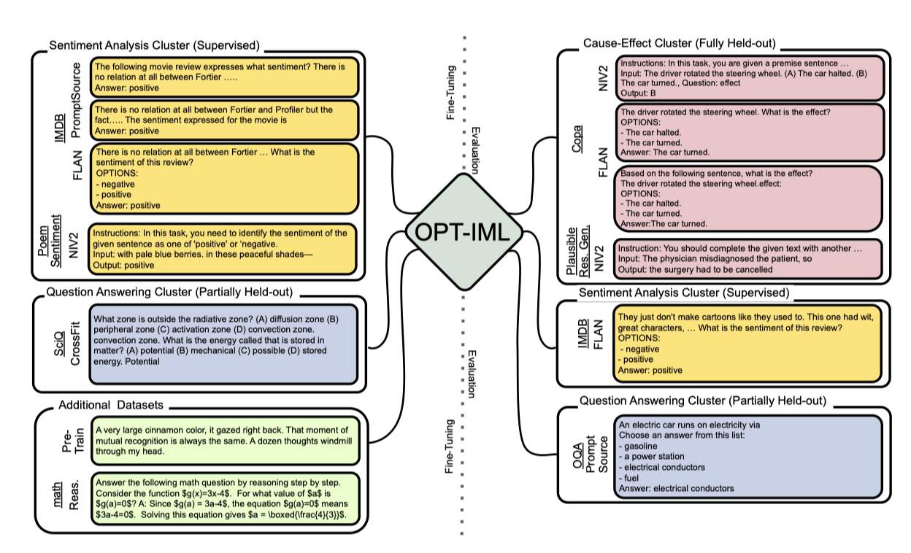
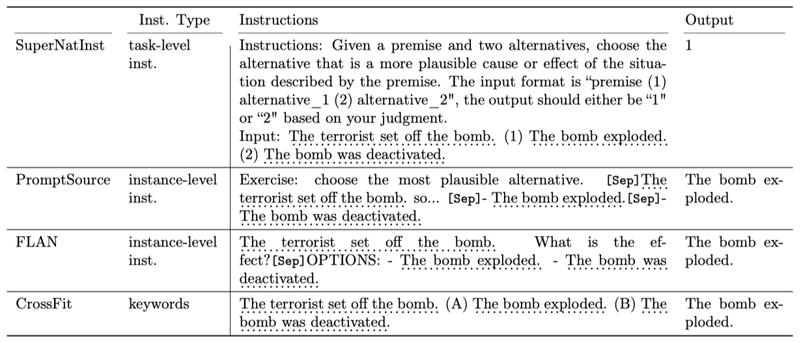
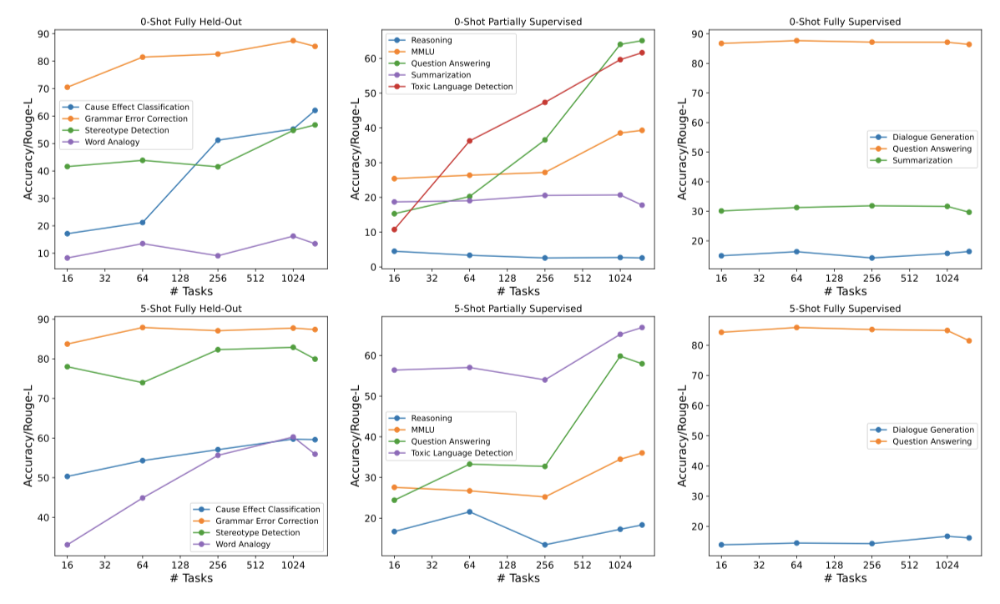
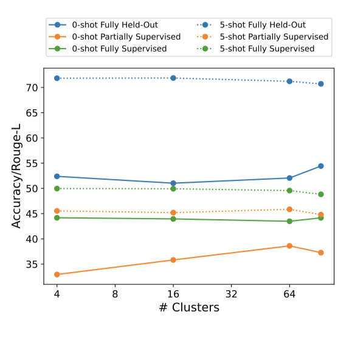
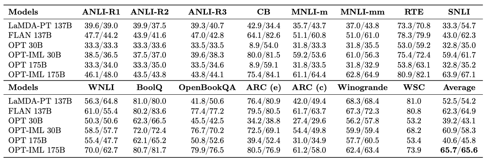
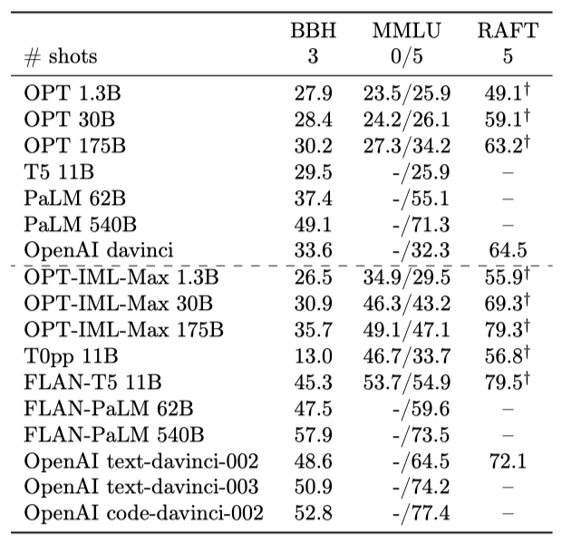

+++
author = "Kurt"
title = "OPT-IML"
date = "2024-03-05"
description = "Scaling Language Model Instruction Meta Learning through the Lens of Generalization"
categories = [
    "Paper Review"
]
tags = [
    "LLM",
    "Milestone",
]
+++

## Abstract

최근의 연구에서는 대규모 사전 학습된 언어 모델을 instruction-tuning하면 보이지 않는 작업에 대한 일반화 성능이 향상된다는 것이 확인되었다. 하지만, instruction-tuning 과정에서의 다양한 결정들이 성능에 어떤 트레이드오프를 가져오는지에 대한 이해는 아직 제한적이다. 이 논문에서는 각종 결정들이 언어 모델의 성능에 어떤 영향을 미치는지를 분석하고, 이를 바탕으로 OPT-IML 30B와 175B를 학습시켰다. 이 모델들은 다양한 작업과 입력 형식을 가진 네 가지 벤치마크에서 모두 뛰어난 일반화 성능을 보였다. 이 결과는 모든 벤치마크에서 OPT를 크게 능가하며, 특정 벤치마크에서 미세 조정된 기존 모델과도 경쟁력을 가진다. 이 연구의 결과와 평가 프레임워크는 공개되었다.

---

## Introduction

이전 연구에 따르면, instruction-tuning은 큰 사전학습 언어모델의 성능을 크게 향상시킬 수 있다. 이 논문에서는 2000개의 NLP 작업을 대상으로 한 대규모 미세조정 및 평가 프레임워크를 개발하였고, 이를 통해 지시사항 메타학습에 관한 다양한 결정의 장단점을 분석하였다. 그 결과, 지시사항에 따라 미세조정된 OPT-IML 30B와 175B 모델을 학습시킬 수 있었다.

NLP 작업의 대규모 메타 데이터셋이 점점 늘어나고 있으며, 이를 이용한 미세조정 연구가 성공적으로 진행되고 있다. 이러한 연구는 작업 수를 늘리는 것이 유익하다는 일반적인 권장사항을 제시하고 있다.

본 연구에서는 8개의 메타 데이터셋을 통합하여 1,991개의 NLP 작업으로 구성된 대규모 컬렉션을 만들었다. 이 컬렉션은 다양한 프롬프트와 지시사항을 포함하며, 100개 이상의 작업 카테고리로 분류되어 있다. 이 컬렉션은 instruction-tuning 모델을 종합적으로 평가하는 프레임워크로 변환되었으며, 이는 세 가지 일반화 수준에서의 성능을 평가한다. 이 프레임워크는 OPT-IML Bench라고 부르며, 각 카테고리는 다양한 벤치마크와 프롬프트에 연결될 수 있는 데이터셋으로 구성되어 있다.

LLMs의 instruction-tuning 효과는 작업의 다양성, 프롬프트 형식, 미세조정 목표 등에 따라 달라진다. 본 연구에서는 8개의 다른 벤치마크로 확장한 instruction-tuning에 관한 다양한 요소와 관련된 트레이드오프를 종합적으로 분석하였다. 이를 통해, 데이터셋과 벤치마크 샘플링 전략, 작업과 카테고리에 대한 스케일링 법칙, 작업 시연 통합 방법, 특수 데이터셋 사용의 효과 등을 설명하였다. 이 연구 결과는 LLMs의 대규모 instruction-tuning에 대한 모범 사례를 제시하는 데 도움이 될 것이다.

OPT-IML 벤치에서 얻은 통찰을 바탕으로 OPT-IML을 학습시켜, 다양한 instruction-tuning 벤치마크에서 기존 모델을 크게 개선하였다. OPT-IML은 zero-shot과 few-shot 성능에서 경쟁력을 보였으나, 도전적인 벤치마크에서는 여전히 성능이 떨어졌다. 이에 대해 추가 논의가 예정되어 있다. OPT에 이어 OPT-IML 버전을 책임있게 공유하고, OPT-IML Bench 평가 프레임워크를 공개하여 미래 연구를 촉진할 계획이다.

---

## Scaling up Multi-task Benchmarks

극단적인 작업 스케일링이 instruction-tuning에 미치는 영향을 파악하기 위해, Super-NaturalInstructions와 PromptSource 같은 최근의 작업 모음을 기반으로 8개의 컬렉션을 모아 OPT-IML 벤치마크를 만들었다. 이 벤치마크는 다양한 작업 카테고리, 지시사항 유형, 프롬프트 설정에 대한 대규모 instruction-tuning 및 평가를 수행한다.

이 논문에서는 "task"와 "dataset"을 동일한 의미로 사용하며, 각 작업은 여러 프롬프트 템플릿으로 구현될 수 있다. 작업이 생성된 원본 데이터를 "data source"라고 부르며, 이로부터 여러 작업을 생성할 수 있다. 벤치마크는 여러 작업으로 이루어져 있으며, 각 작업은 한 가지 작업 카테고리에 속한다.

### Task Curation

Super-NaturalInstructions 벤치마크를 확장하여 1600개 이상의 작업을 포함하였다. 이는 FLAN, T0, PromptSource, ExMix, T5, CrossFit 등의 기존 작업 모음과 영역별 작업 통합 방법을 통해 이루어졌다.

이 벤치마크들의 데이터셋들은 상당히 중복되어 있다. 예를 들어, SQuAD v1/v2와 같은 인기 데이터셋은 대부분의 벤치마크에 포함되어 있다. 일부 벤치마크는 장문의 인간이 작성한 지시사항이나 추론 체인을 포함하고 있지만, 다른 일부는 다중 작업 학습을 위해 설계되어 짧은 필드나 작업 접두사로만 구성되어 있다. 이 중복을 최소화하기 위해, 다른 벤치마크에 포함되지 않은 CrossFit, ExMix, T5의 작업만 유지하였다. 큰 규모의 작업을 탐색하고 있기 때문에, FLAN을 제외한 모든 벤치마크에서 작업 당 최대 100k 예제를 무작위로 선택하였고, FLAN에서는 작업 당 최대 30k 예제를 선택하였다.

### Benchmark Consolidation

**Instruction schema.** 각 벤치마크는 다른 지시사항과 언어 스타일을 채택한다. 이들 지시사항은 데이터셋 수준과 인스턴스 수준으로 분류된다. 데이터셋 수준 지시사항은 전체 작업을 정의하고, 모델은 이를 통해 작업을 이해하고 적용한다. 인스턴스 수준 지시사항은 각 예제에 대해 개별적으로 적용되는 템플릿이다. 벤치마크의 모든 작업은 "지시사항"과 "출력"으로 구성된 양분 프롬프트 형식으로 변환된다. 일부 벤치마크에서는 원래 자연어 지시사항이 없어, 포함된 각 작업에 대해 간단한 지시문을 수동으로 작성하였다.

**Task categorization.** 작업을 전통적인 NLP 카테고리로 분류하며, 이는 모델의 일반화를 연구하는 데 도움이 된다. Super-NaturalInstructions가 정의한 76개의 카테고리를 주로 따르며, 다른 벤치마크들의 작업 클러스터를 수동으로 통합한다. 일부 벤치마크는 더 세분화된 작업 분류를 사용하지만, Super-NaturalInstructions의 대략적인 분류를 채택한다. 결과적으로 100개 이상의 작업 카테고리를 가진 단일 수준의 분류가 생성된다.

### Creating Benchmark Splits

**Train, validation and test splits.** 모든 작업 집합을 분할하여 대규모 instruction-tuning을 수행하고, 세 가지 일반화 수준에 대한 모델을 평가한다. 새로운 작업 카테고리로의 일반화를 평가하기 위해 몇몇 작업 카테고리를 보류하고, 일부 카테고리를 부분적으로 보류하여 보이는 작업 카테고리에서 새 데이터셋으로의 일반화를 테스트한다. 일부 학습 작업에서 검증 및 테스트 세트를 보류하여, 보이는 작업에서 새로운 예제로의 일반화를 테스트한다. 9개의 작업 카테고리에 걸친 35개의 평가 작업을 검증 세트로 보류하고, 이를 사용하여 다른 instruction-tuning 전략의 트레이드오프를 분석한다.

**Task de-duplication.** 학습과 평가 작업이 데이터 소스에서 겹치지 않도록 하여 정보 유출을 방지한다. 학습과 평가 작업 간에 겹치는 부분이 있으면 수동으로 검토하고 필요한 경우 제거한다. 출력 레이블은 서로 관련이 없지만 넓은 컨텍스트 리소스를 공유하는 작업 쌍은 유지한다.

### Task Prompt Construction

zero-shot 설정에서 각 예제는 지시사항과 출력 사이에 구분자를 삽입하여 형식화된다. 과적합을 방지하기 위해, 각 예제에서 구분자를 무작위로 선택한다. few-shot 프롬프트의 경우, 작업 설명과 대상 예제 사이, 또는 작업 예제 앞에 데모 예제를 배치한다.

FLAN과 PromptSource 벤치마크는 작업 당 여러 개의 수동으로 작성된 템플릿을 포함하고 있다. 이 벤치마크의 일부 템플릿은 원래 작업 의미를 변경했으며, 이러한 템플릿은 수동으로 검토하고 제거하여 작업 카테고리를 정제하였다.

---

## Instruction Fine-tuning

OPT-IML 벤치를 사용하여, 125M에서 175B parameter 규모의 오픈 소스 decoder-only transformer 언어 모델인 OPT를 미세 조정한다. OPT는 표준 NLP 작업에서 GPT-3와 유사한 성능을 보이며, RoBERTa, Pile, 그리고 PushShift.io Reddit의 데이터셋 조합에서 180B의 고유 토큰에 대해 다음 단어 예측 목표를 사용하여 학습된다. 이 섹션에서는 30B와 175B 규모에서 OPT의 instructiontuning 과정을 설명한다.

### Fine-tuning Objective

모든 이전 토큰을 컨텍스트로 사용하는 다음 단어 예측 목표를 통해 OPT를 미세 조정한다. 학습 시퀀스를 소스와 타겟 시퀀스로 분리하며, 타겟 시퀀스의 토큰에서만 손실 항을 계산한다. 작업 지시와 입력을 소스 토큰, 라벨을 타겟 토큰으로 취급한다. 기본적으로, parameter $\theta$인 사전 학습된 모델은 소스 토큰과 이전 타겟 토큰에 따라 조건화된 타겟 토큰의 손실을 최소화하는 방향으로 미세 조정된다.

$$ \mathbf{L} (\mathbf{D}; \theta) = - \sum_i \sum_j log \ p_{\theta}(t_{ij}| s_{i}, t_{i<j}) $$

OPT-IML 벤치의 모든 데이터셋에서 손실을 최소화하기 위해, 각 데이터셋의 크기와 해당 벤치마크에 할당된 비율에 따라 다른 데이터셋의 예제들을 섞는다.

### Packing and Document Attention

계산 효율성을 위해, 여러 예제를 $<$eos$>$ 토큰으로 구분된 2048 토큰의 시퀀스로 패킹한다. 패킹의 결과로, 한 예제의 토큰이 같은 시퀀스의 이전 예제의 토큰에 영향을 받을 수 있다. 이를 완화하기 위해, 같은 예제의 토큰에만 주의를 기울이도록 토큰 attention mask를 수정한다. 이로 인해 attention mask가 triangular에서 block triangular mask 바뀌며, 이는 실험에서 안정성과 성능을 둘 다 개선시킨다.

### Fine-tuning Hyperparameters

64개의 40GB A100에서 30B 모델을, 128개의 40GB A100에서 175B 모델을 미세 조정한다. 완전히 샤딩된 데이터 병렬과 Megatron-LM 텐서 병렬성을 사용하며, 대부분의 모델 hyper-parameter를 OPT에 따라 상속한다. 학습 예제는 길이 2048의 시퀀스로 패킹되며, Adam optimizer를 사용한다. 또한, dropout 0.1과 clip gradient norm 1.0을 적용하며, dynamic loss scaling을 사용하여 underflow를 방지한다. 미세 조정 동안, 이 모델은 약 2B 개의 토큰을 보았는데, 이는 OPT의 사전 학습 예산의 0.6%에 불과하다.

---

## What Matters for Instruction Fine-tuning?

최근 연구들은 특정 하위 작업에서의 모델 성능 최적화와 명령어 스타일, 프롬프트 설정의 변화에 대한 robustness 향상을 위해 다양한 instruction-tuning 기법을 탐구하였다. OPT 30B 모델을 사용하여, 데이터셋 비율, 작업 수 및 다양성, 사전 학습, 대화, 추론 데이터셋의 영향을 테스트하였고, 완전히 보류된, 부분적으로 보류된, 완전히 감독된 세 가지 모델 일반화 수준에 대한 instruction-tuning의 영향을 실험하였다. 이를 통해 클러스터, 벤치마크 등 여러 차원에서의 성능을 집계하여 최적의 설정을 결정하였다.

### Experimental Setup

실험 설정은 미세 조정 과정과 관련된 여러 요소들의 instruction-tuning 성능에 대한 영향을 특성화하고, 이를 바탕으로 OPT 모델을 효과적으로 instruction-tuning하는 것을 목표로 한다. 실험 요소로는 미세 조정 데이터셋의 구성, 사용되는 작업의 수와 다양성, 추가적인 사전 학습 및 대화 데이터셋의 사용, 그리고 데모를 통한 다양한 미세 조정 방법 등이 있다.

**Prompt construction details.** 학습 데이터를 만들기 위해, 각 작업의 모든 프롬프트 데이터를 병합하고, 작업의 분포를 일정하게 유지하기 위해 무작위로 프롬프트를 선택하였다. 검증 세트에서는 비슷한 방식으로 각 작업의 프롬프트를 병합하고, 작업당 최대 250개의 프롬프트를 무작위로 선택하여 검증 결과를 보고한다. 테스트 작업에서는 모든 프롬프트 변형과 예제를 유지한다.

**Generalization levels.** 기본 instruction-tuning 모델을 시작으로, 각 요소의 효과를 독립적으로 평가하였다. 이는 해당 요소의 변형으로 모델을 튜닝하고, 특정 일반화 수준에 대한 작업을 평가함으로써 이루어진다. instruction-tuning 설정은 완전히 보류된 작업과 부분적으로 감독된 작업에서의 성능 향상을 위해 사용되며, 완전히 감독된 작업에서의 성능을 희생하지 않는다. 각 요소에 대한 최적의 설정은 세 가지 일반화 수준에서의 평균 성능을 바탕으로 결정된다.

**Decoding.** 평가 데이터는 정답 후보가 있는 작업과 여러 참조 시퀀스가 있는 작업을 포함한다. 정답 후보가 있는 작업에서는 각 후보의 가능성에 따라 순위를 매기고 가장 높은 점수를 받은 후보를 답으로 출력한다. 이는 작업의 정확도를 계산하는 데 사용된다. 반면, 후보가 없는 작업에서는 $<$eos$>$ 토큰이 예측되거나 최대 256 토큰이 생성될 때까지 디코딩을 수행하고, 생성된 시퀀스와 참조를 기반으로 정확한 일치 또는 Rouge-L F1 점수를 계산한다.

**Model selection.** 모든 실험에서, 먼저 작업 하위 유형별로 zero-shot과 5-shot 결과를 개별적으로 집계한다. 동일한 작업이 여러 벤치마크에 존재하는 경우에는 벤치마크 간의 성능을 평균화한다. 그 후, 범주(또는 실험에 따라 벤치마크) 내의 모든 작업에 대한 zero-shot과 5-shot의 평균을 계산하고, 마지막으로 각 범주(또는 벤치마크)의 모든 zero-shot과 5-shot 점수의 결합 평균을 계산하여 모델 선택에 사용한다.

각 모델을 4000 step 동안 튜닝하고, 각 작업에서 250개의 예제를 사용하여 zero-shot과 5-shot 설정에서 검증 분할을 평가한다. 검증 분할은 FLAN과 PromptSource에 대한 다양한 프롬프트를 포함하며, 대부분의 검증 작업은 생성 스타일의 작업이다. 나머지 작업에 대한 정확도를 계산하고, 이를 Rouge-L과 함께 집계하여 제시한다. 

### Effects of varying task mixing-rate maximum

이전 연구는 예제 비례 샘플링을 사용하여 배치를 구성하였고, 큰 데이터셋이 배치를 압도하는 것을 방지하기 위해 maximum size parameter(EPS)를 적용하였다. 이 maximum mixing rate(EPS)이 성능에 미치는 영향을 파악하기 위해, 다양한 EPS 값을 대상으로 실험을 진행하였다. EPS가 512일 때 97%의 데이터셋이 최대치에 도달하고, EPS가 8192일 때는 16%의 데이터셋이 최대치에 도달하였다. 또한, EPS 없이 실험을 진행한 결과도 포함하였다.

EPS는 instruction-tuning에 중요하며, EPS를 사용하는 모든 모델이 EPS를 사용하지 않는 모델보다 성능이 좋다. 그러나 특정 임계값(이 연구의 경우 4096 미만) 이후에는 모든 일반화 수준에서 성능 변동이 거의 없다. 가장 높은 평균 성능을 기준으로, 4096을 선택했지만 4096 이하의 모든 값도 잘 수행된다. EPS 변경은 각 벤치마크로부터의 미세 조정 데이터 비율을 암시적으로 변경하는데, 이는 다음 섹션에서 명시적으로 조정한다.

### Effects of varying benchmark proportions

instruction-tuning에 사용되는 작업 수를 대폭 확장하기 위해 다양한 작업과 프롬프트 저장소를 통합하였다. 그러나 여러 벤치마크를 학습에 사용하면서 예제 비례 샘플링만 사용하면, 작업이 많은 벤치마크가 배치 구성을 지배하게 된다. 이로 인해 모델이 특정 입력-출력 형식에 편향될 수 있다. 따라서 다양한 벤치마크의 비율을 조절하여 그들이 downstream 작업 성능에 미치는 영향을 평가하였다. 이 실험는 가장 많은 벤치마크에서 잘 수행하는 parameter를 선택려고 벤치마크별 종합 성능에 기반한 모델 비를 수행하였다.

비율이 변경된 동일한 벤치마크에서 성능 향상을 관찰하였다. FLAN의 비율을 5%에서 25%로 늘리면 일부 일반화 수준에서 성능이 크게 향상되지만, 완전히 감독된 작업에서는 개선이 없었다. SuperNatInst는 부분적으로 감독된 작업에서 유사한 추세를 보였지만, 완전히 보류된 작업에서는 그렇지 않았다. 반면에, PromptSource는 비율이 18%일 때 성능 포화에 도달했지만, 완전히 보류된 클러스터에서는 비율이 더 높을 때 이익을 얻었다.

벤치마크들이 서로를 보완하는 것을 관찰하였다. 예를 들어, FLAN의 비율을 늘리면 특정 일반화 수준에서 성능이 향상되지만, PromptSource와 Crossfit의 비율을 향상시키는 것이 더 효과적이었다. 또한, 벤치마크 간의 일부 상충 관계를 관찰하였으며, 다양한 벤치마크를 사용하는 것이 instruction-tuning에 이점을 제공하였다. 벤치마크 간의 평균 성능에 기반하여, "4/2/20/25/45/2/2" 비율을 최종 OPT-IML 모델의 비율로 선택하였다. 추론 데이터셋의 성능을 향상시키는 방법에 대해서도 탐구하였다.

### Effects of Scaling Tasks or Categories

이전 연구에 따르면, 학습 작업 수나 클러스터를 늘리면 모델의 전체 성능이 향상된다. 이러한 방향으로 완전히 보류된, 부분적으로 감독된, 완전히 감독된 작업 등에서 일반화 효과를 연구하였다. 작업 확장 연구를 위한 임의의 샘플링은 작은 세트가 큰 세트의 부분집합이 되도록 설계되었으며, 완전히 감독된 작업은 항상 선택되었다. 

학습 작업의 수가 증가함에 따라 완전히 보류된 작업과 부분적으로 감독된 작업이 가장 크게 개선되었다. 그러나 완전히 감독된 작업의 성능은 추가적인 학습 작업이 추가되더라도 변하지 않았다. 완전히 보류된 설정에서는 원인 효과 분류와 단어추 작업이 가장 크게 개선되었으며, 부분적으로 감독된 설정에서는 질문 답변과 독성 언어 감지 작업이 가장 크게 개선되었다.

클러스터 스케일링 연구에서는 작업 수가 많은 순서대로 클러스터를 정렬하고 선택하였다. 완전히 감독된 검증 작업이 속한 클러스터는 항상 포함되었다. 학습 클러스터를 늘릴수록 완전히 감독된 작업의 성능은 유지되거나 약간 감소하는 경향을 보였다. 반면, 완전히 보류된 수준과 부분적으로 감독된 수준에서는 클러스터 수가 증가함에 따라 zero-shot 설정에서의 성능이 개선되었다. 이런 결과를 바탕으로, 모든 작업과 클러스터를 사용하여 최종 OPT-IML 모델을 학습시키게 되었다.

### Effects of Pre-training during Instruction-Tuning

사전 학습 스타일의 업데이트를 세밀한 튜닝 동안 사용하면 학습이 더 안정적이 될 수 있음을 발견했다. 따라서, 세 가지 일반화 수준에서 이러한 방식의 사전 학습 데이터 사용이 성능에 미치는 영향을 탐색하였다. OPT 학습에 사용된 말뭉치의 마지막 부분을 세밀한 학습 데이터로 사용하였고, 사전 학습 데이터를 1%, 5%, 10%, 그리고 50%의 비율로 추가하는 방식을 실험하였다.

완전히 보류된 일반화 수준과 부분적으로 감독된 수준에서 모델은 사전 학습 데이터를 10%까지 추가하면 성능이 향상되지만, 그 이후로는 성능이 저하하는 것을 확인하였다. 더 많은 사전 학습 데이터를 사용하면 Rouge-L F1 점수는 향상되지만 정확도는 감소한다. 이 결과를 바탕으로, OPT-IML 모델 튜닝에 5%의 사전 학습 데이터를 포함시키기로 결정하였다.

### Effects of Adding Reasoning Datasets

최근의 연구는 LLMs가 추론 작업에서 답변을 생성하기 전에 추론 체인을 생성하도록 요청하면 성능이 향상된다는 것을 보여주었다. 이에 따라, 출력이 답변 이전에 근거를 포함하도록 하고, 이 데이터셋을 instruction-tuning에 포함시키는 방식으로 LLMs를 추론 수행에 특화되도록 튜닝하였다. 이를 위해 14개의 추론 데이터셋을 컴파일하고, 1%, 2%, 그리고 4%의 비율로 추론 데이터를 추가하는 실험을 진행하였다.

추론 데이터셋을 사용하여 instruction-tuning 하면 보류된 검증 추론 작업에서 성능이 크게 향상되는 것을 확인하였다. 또한, 다른 보류된 작업 카테고리에서도 성능 향상을 보았다. 1%의 추론 데이터를 추가하면 전체적으로 가장 큰 이득을 보였으며, 이 이상 추가하면 일부 작업에서는 이득이 줄어들었다. 하지만 요약 작업은 추론 데이터의 높은 비율에서도 계속 이익을 얻었다. 이를 바탕으로, 최종 OPT-IML 모델에 1%의 추론 데이터를 사용하기로 결정하였다.

### Effects of Adding Dialogue Datasets

대화 데이터를 보조 미세 조정 데이터로 추가하는 실험을 통해, 언어 모델이 방향성 있는 입력에 대해 더 잘 응답하고 참조 표현을 이해할 수 있게 개선되는지, 그리고 챗봇 행동을 유도하여 모델이 더 대화형으로 변화하는지 검증하였다. BlenderBot 3 학습에 사용된 대화 데이터셋의 일부를 활용하였고, 포함된 대화 데이터의 비율을 0.5%로 설정하였다.

대화 데이터를 0.5%만 추가하면 zero-shot 성능이 떨어지고, 5-shot 성능은 변하지 않는 것을 확인하였다. 특히, 스테레오타입 감지와 단어 유추 작업에서 zero-shot 성능이 저하되었다. 이는 대화 데이터로 학습하면 모델이 필요한 형식에 맞추는 능력이 약화되기 때문이다. 또한, 특정 결정 단어 집합을 생성해야 하는 독성 감지 작업에서 5-shot 성능이 크게 저하되었다. 이런 문제로 인해, OPT-IML을 튜닝할 때 대화 데이터는 추가하지 않기로 결정하였다.

### Effects of Meta-Training for In-Context Learning

최근 연구들은 언어 모델을 미세 조정할 때 지시사항에 예시를 포함시키면 모델이 문맥 속에서 예시를 더 잘 학습한다는 사실을 보여주었다. 일부 연구에서는 각 학습 예시에 일정 수의 예시를 추가하는 방식을 실험했고, 추론 시에도 동일한 수의 예시를 사용하여 모델을 평가하였다. 또 다른 연구에서는 예시가 있는 데이터와 없는 데이터를 혼합하여 사용했으나, 각 데이터 유형의 비율과 포함된 예시의 수는 명확하지 않았다.

문맥에서 더 잘 학습하는 few-shot 모델을 학습시키려고 하며, 이는 추론 시에 사용되는 시연 예의 수에도 강건하다. 학습 예시를 생성하는 간단한법을 실험하였는데, 이 방법은 시연 예시의 다양한 수를 포함한다. 각 예시마다 무작위로 선택된 다른 예시들을 시연 예시로 추가하며, 이들은 특별한 토큰으로 구분된다. 작업 수준 지시사항이 있는 벤치마크의 경우, 시연 예시는 지시사항 필드 이후에 위치하고, 인스턴스 수준 지시사항이 있는 벤치마크의 경우, 시연 예시는 인스턴스 이전에 위치한다.

시연 예시는 프롬프트의 길이를 크게 늘리므로, 너무 많은 few-shot 학습 예시를 포함하면 성능 저하와 학습 안정성 감소를 초래한다. 이를 해결하기 위해, Zipf 분포를 사용하여 대부분의 예시가 zero-shot 예시가 되도록 조정한다. 특정 parameter 설정에서는 예시의 92.5%에서 67.1%가 zero-shot 예시가 된다. K를 5로 설정하고, 세 개의 연속된 개행 토큰을 [SEP]로 사용한다.

**MetaICL with suffix loss.** 손실 희소성 문제를 더욱 해결하기 위해, 원래의 MetaICL 손실의 변형을 실험하였다. 이 방법은 모델이 대상 레이블을 생성하는 대신 첫 번째 예시의 대상 레이블을 생성하고 나머지 예시의 시퀀스를 따르도록 학습시킨다. 이는 시연 예시를 학습 예시로 변환하여 손실 희소성 문제를 경감시킨다.

**Performance degradation on generation tasks.** MetaICL을 다양한 설정으로 튜닝한 결과, 대부분의 경우 zero-shot 및 5-shot 설정에서 성능이 저하되는 것을 확인하였다. 그러나 접미사 손실을 가진 MetaICL은 특히 zero-shot 설정에서 일반 MetaICL을 우세했다. 그러나 일부 카테고리에서는 5-shot 평가에서 개선이 보였지만, 특정 작업에서는 성능이 크게 저하되었다. 이는 모델이 문맥 내 예시가 존재할 때 출력 패턴을 엄격히 따르는 능력을 잃는 경향이 있기 때문이다. 또한, 모델이 시연 구분자에 과적합되는 경향이 있음을 확인하였다. 이러한 문제는 추론 시간에 구분자를 수정하여 크게 완화할 수 있었다. 그러나 일반 설정에서 심각한 출력 퇴화로 인해, OPT-IML 모델 학습에 MetaICL을 사용하지 않기로 결정하였다.

---

## OPT-IML Models

4장의 실험 결과를 바탕으로, OPT 30B와 175B를 조정하여 OPT-IML 30B와 175B 모델을 생성하였다. EPS와 벤치마크 비율의 최적 값을 선택하고, 전체 작업, 추론 체인 데이터셋, OPT 사전 학습 말뭉치 일부를 학습에 포함시키되, MetaICL과 대화 데이터셋은 제외하였다. OPT-IML 30B는 4000단계, OPT-IML 175B는 배치 크기를 줄여 두 배의 단계로 조정하였다. 마지막 체크포인트를 최종 모델로 선택하였다.

OPT-IML 모델은 OPT 평가 작업과 이전 연구의 다중 작업 벤치마크에서 zero-shot과 5-shot 설정에서 평가되었다. 이 모델은 이전 연구에서 출시된 각 벤치마크의 instruction-tuned 모델과 직접 비교하였다. 결과적으로, OPT-IML은 모든 벤치마크에서 OPT를 능가하며, zero-shot과 few-shot 성능에서 개별 벤치마크 별 instruction-tuned 모델과 경쟁력을 가지고 있음을 확인하였다.

### OPT Evaluations

OPT-IML은 30B와 175B 규모에서 zero-shot과 few-shot 설정에서, OPT에서 보고한 14개의 표준 NLP 작업에서 평가되었다. OPT에서 발표한 동일한 프롬프트를 사용하였고, 가장 높은 가능성을 가진 후보를 모델 예측으로 채택하여 정확도를 보고하였다. 이 작업들은 모두 학습 중에 보류되었으며, few-shot 설정에서는 OPT가 사용한 동일한 예제와 shot 수를 사용하되, 모델의 최대 시퀀스 길이에 맞게 잘랐다.

OPT-IML은 zero-shot 정확도에서 OPT에 비해 약 6-7% 향상되며, 32-shot 정확도에서는 30B 모델에서 큰 향상을 보였다. 일부 작업에서는 큰 향상을 보였지만, StoryCloze, PIQA, Winograd, Winogrande와 같은 다른 작업에서는 성능 향상을 보이지 못하였다. OPT 프롬프트가 원래 GPT-3에서 채택되어 최적화 과정을 거쳤으나, 다양한 프롬프트를 사용하여 평가하는 FLAN과 PromptSource와 비교했을 때, instruction-tuning은 모델의 견고성을 향상시키고 프롬프트 엔지니어링의 필요성을 줄이는 장점이 있다.

### Evaluations on PromptSource

Sanh et al. (2022)은 T5 11B의 수정 버전을 PromptSource의 50개 데이터셋에서 미세 조정하고, 4개의 완전히 보류된 카테고리의 일부인 11개 작업에서 평가하였다. 이 작업들은 각각 여러 프롬프트 템플릿과 연관되어 있다. OPT-IML에서도 이 작업들이 보류된 카테고리에 속하므로, 추가 작업을 포함하여 유사한 평가 설정을 사용하였다. 대부분의 작업은 분류 작업이며, 가능성에 따라 후보를 평가하고 정확도를 보고하였다. 

PromptSource에는 작업의 반전 버전을 위한 프롬프트도 포함되어 있다. 예를 들어, QA의 반전 버전은 질문 생성이 될 수 있다. 하지만 이러한 프롬프트는 작업이 카테고리에 할당될 때 문제를 일으키므로, 이를 사용한 학습이나 평가는 진행하지 않는다. 보류된 설정에 해당하는 T0-original-task 모델과 OPT-IML을 비교하였으며, 이 모델은 원래 작업을 준수하는 프롬프트만을 사용하여 학습되었다.

OPT-IML 175B는 zero-shot 성능에서 T0-original-task과 동일하며, 5-shot 성능에서는 크게 우월하다. 인과적인 LM인 OPT는 few-shot 설정에 더 강한 일반화 능력을 보여준다. 반면, T0와 같은 encoder-decoder 모델은 MetaICL 학습을 통해 few-shot 성능을 향상시킬 수 있다. 두 규모에서 모두, OPT-IML은 거의 모든 작업에서 기본 OPT 모델을 능가하며, 이는 작업당 여러 프롬프트를 사용한 평가와 견고한 모델에 대한 보상 덕분이다. 또한, instruction-tuning은 더 작은 규모의 모델을 경쟁력 있게 만드는 방법이 될 수 있다.

Sanh et al. (2022)의 방법을 따라 LLM의 성별 편향을 측정하는 WinoGender Schemas를 텍스트 추론 작업으로 평가하였다. 결과적으로, instruction-tuning이 이 작업의 정확도를 크게 향상시켰다. 또한, 문장이 스테레오타입을 보여주는지 여부에 대한 Crows Pairs 작업을 수행했으며, 이 때 OPT-IML 175B의 성능이 OPT에 비해 저하되었지만, 30B 모델에서는 그렇지 않았다. 이 두 작업은 보류된 클러스터에서 나오지 않았으므로, 다른 학습 데이터셋이 유익할 수 있다.

### Evaluations on FLAN

62개 데이터셋으로 구성된 FLAN instruction-tuning 벤치마크를 OPT-IML Bench에 포함시켰다. 이를 통해 Wei et al. (2022a)은 Lamda-PT를 평가하고, 단일 instruction-tuning 모델로 1500개 작업을 확장하여 instruction-tuning 벤치마크의 개선 가능성을 평가하였다.

FLAN-137B가 사용한 작업의 일부에 대해 OPT-IML 모델을 평가하였다. 일부 작업은 완전히 보류된 카테고리에서, 나머지는 부분적으로 보류된 카테고리에서 왔다. 이 작업들은 대답 후보가 있는 분류 스타일을 사용하며, 가능성에 기반한 점수를 평가하였다. 각 작업은 7-10개의 템플릿과 연관되어 있으며, 모든 템플릿에 대한 평균 정확도를 보고하였다. 일부 템플릿은 작업을 반전시키지만, 이러한 템플릿에 대해 평가하지 않았다. 모든 작업에 대해 5-shot 결과를 보고하였다.

instruction-tuning을 통해 30B와 175B 규모의 OPT 모델이 개별 15개 작업에서 기본 OPT 모델보다 성능을 크게 향상시킨 것을 확인하였다. 30B와 175B OPT-IML 모델은 zero-shot과 few-shot 설정에서 각각 평균 20% 이상의 성능 향상을 보였다. 또한, 30B OPT-IML 모델은 175B 기본 OPT 모델을 zero-shot에서 20%, 5샷에서 12% 능가하였다. 이는 작은 규모의 instruction-tuning 모델이 큰 규모의 조정되지 않은 모델에 대한 효율적인 대안이 될 수 있다는 것을 보여준다. 그러나, 실험 설정의 다양한 차이점으로 인해, 이러한 향상을 instruction-tuning 벤치마크의 규모 확장에 명확히 이유를 제시하기는 어렵다.

### Evaluations on Super-NaturalInstructions

Super-NaturalInstructions는 엄격한 지시 형식을 사용하여 모델의 다양한 지시 형식에 대한 일반화 능력을 평가하는데 도움이 된다. Wang et al. (2022)은 이를 통해 T5 모델의 instruction-tuning 버전인 TkInstruct 3B와 11B를 학습하고, 완전히 보류중인 일반화를 위해 154개의 작업을 대표하는 12개의 카테고리에서 Tk-Instruct를 평가한다. 이 중 Textual Entailment, Coreference Resolution, Dialogue Act Recognition 카테고리에서 zero-shot, 2-shot, 5-shot 설정에서 OPT-IML을 평가하고 있다. 이 세 카테고리는 44개의 작업을 포함하며, 각 테스트 예제에 대해 최대 256개의 토큰을 생성한다. 비교를 위해, 동일한 평가 프레임워크 하에서 Tk-Instruct 11B를 재평가한다.

2-shot 설정에서 학습받고 평가된 Tk-Instruct와 비교했을 때, OPT-IML 모델은 zero-shot 및 few-shot 설정에서 기본 OPT 모델을 능가한다. instruction-tuning된 30B 모델이 튜닝되지 않은 175B 모델을 능가하며, 큰 모델일수록 instruction-tuning의 이점이 더 크다. OPT-IML 175B는 zero-shot 형식에서는 Tk-Instruct 11B를 능가하지만, 2-shot 및 5-shot 설정에서는 Tk-Instruct가 더 뛰어나다. Tk-Instruct는 학습받은 2-shot 설정에 편향되어 있어, 2-shot에서 5-shot으로 넘어갈 때 성능이 65.3에서 58.4로 떨어진다.

### Evaluations on UnifiedSKG

UnifiedSKG는 데이터베이스, 대화 상태, SQL 쿼리 등 다양한 입력을 가진 21개의 작업을 모아 구조화된 지식을 처리하는 능력을 평가한다. 이를 위해, OPT-IML 모델과 기본 OPT 모델을 세 가지 UnifiedSKG 작업, 즉 데이터를 텍스트로 변환하는 DART, 데이터베이스와 입력 쿼리를 기반으로 SQL 쿼리를 생성하는 Spider, 그리고 대화 상태 추적 작업인 MultiWoZ에서 비교한다. 이 세 작업은 모두 생성 작업이며, zero-shot과 5-shot 설정에서 Rouge-L F1 점수를 보고한다.

Spider에서, OPT-IML 모델은 다른 작업들이 섞여 있음에도 불구하고 높은 성능을 유지한다. DART에서는 OPT-IML이 zero-shot 설정에서 OPT 모델을 크게 앞서며, 특히 OPT-IML 30B는 OPT 175B를 능가한다. 하지만 MultiWoZ에서는 instruction-tuning이 성능을 크게 저하시킨다.

---

## Discussion and Limitations

이전 섹션에서는 instruction-tuned된 모델이 untuned 모델보다 zero-shot 및 few-shot 설정에서 크게 향상될 수 있음을 보여주었다. 이를 위해 NLP 작업의 큰 컬렉션 8개를 포함한 instruction-tuning 데이터셋을 확장하였고, 이를 downstream 작업에 대한 모델 일반화 수준을 테스트하는 프레임워크로 변환하였다. 이를 통해, 입력 작업의 다양성, 작업과 instruction 스타일의 분포, 특수 데이터셋의 포함, 그리고 demonstration으로의 fine-tuning 등 instruction tuning에 영향을 미치는 여러 요소를 분석하였다. 이러한 탐색을 통해 OPT-IML 모델을 instruction-tuning하는 가장 좋은 설정을 선택하였고, 이러한 설정은 다양한 벤치마크에서 경쟁력을 보여주었다.

이 섹션에서는 전체 작업 컬렉션을 사용한 instruction fine-tuning에 대한 추가 결과를 보고하고, 현재 접근법의 한계점에 대해 논의한다.

### Evaluations on MMLU, BBH and RAFT

대규모 instruction-tuning 벤치마크를 변환하여 instruction-tuning 기법을 연구하고 있다. 최근에는 Chung et al. 이 4개의 벤치마크에서 1,836개의 작업에 대해 instruction fine-tuning을 확장한 연구를 발표하였다. 이 연구에서는 PaLM 모델과 T5 모델을 사용하였고, 이러한 모델들은 다양한 언어 모델 벤치마크에서 평가되었다. 이와 유사한 환경에서 OPT-IML의 성능을 확인하기 위해, 전체 벤치마크인 1,991개의 작업에서 OPT 30B와 175B를 instruction-tuning하였고, 이를 OPT-IML-Max라고 부른다.

MMLU, RAFT, BBH 등의 벤치마크에서 옵션 스코어링과 생성 방식을 사용했다. 또한, OPT-IML-Max 1.3B 규모에서의 학습 결과도 제시되었다. 이 세 데이터셋에서 OPT-IML-Max는 모든 규모에서 untuned 버전을 능가하였다. 그러나 FLAN-T5, FLAN-PaLM 및 instruction-tuned GPT-3 모델 등 다른 모델들과 비교했을 때, MMLU와 BBH에서 성능이 뒤처진다는 점이 확인되었다. 이는 각 모델의 학습 규모, 데이터 구성, 아키텍처, fine-tuning 알고리즘 등의 차이 때문으로 판단된다. 이러한 모든 요소들로 인해 성능 차이를 정확히 설명하는 것은 어렵지만, 이런 평가를 통해 OPT 모델에 대한 instruction tuning 결정의 효과를 확인할 수 있었다.

### Limitations

평가 프레임워크를 통해 OPT 30B에서 instruction-tuning 변수들의 trade-off를 독립적으로 분석한다. 이러한 변수들은 서로 상호 작용하여 최적의 튜닝 설정을 변경할 수 있다. 또한, 대규모에서의 trade-off 추세는 30B instruction tuning에서와 동일하지 않을 수 있다. 다양한 카테고리 분할을 사용하여 instruction tuning trade-off를 연구하지만, 다른 카테고리 세트를 선택하면 다른 결정을 우선시할 수 있다. 또한, 작업을 카테고리에 할당하는 것은 주관적일 수 있으며, 다른 카테고리 할당은 instruction-tuning에 대한 최적의 요인을 변경할 수 있다. 이를테면, 다른 기술을 요구하는 독성 감지 작업도 텍스트 추론 작업으로 변환될 수 있다.

### Responsible AI

OPT-IML 모델은 다양한 평가에서 기본 OPT를 능가하지만, 사실적 정확성, 유해한 언어 생성, 스테레오타입 강화 등 대규모 언어 모델 사용의 위험에 취약하다. instruction-tuning 연구 확대와 큰 instruction-tuned 인과적 언어 모델의 가용성 향상을 위해 OPT-IML 모델을 공개한다. 그러나 이 모델들의 사용은 책임있는 모범 사례를 따라야 한다.

---

## Related Work

이 연구는 큰 언어 모델을 명령에 따라 미세 조정하는 것으로, 다중 작업 학습, 프롬프팅, 인-컨텍스트 학습의 메타 학습 등 여러 분야를 포괄한다. 이러한 분야들은 이 연구와 밀접하게 관련되어 있다.

**Instruction Tuning.** 언어 모델은 self-supervise 학습을 통해 학습되며, 프롬프트 엔지니어링과 인-컨텍스트 학습은 이 모델들을 활용하는 주요 접근법이다. 최근의 연구들은 이러한 모델을 자연스러운 명령에 맞추기 위해 instruction fine-tuning을 제안하였다. 이 중 일부는 인간 주석 프롬프트를 사용하고, 다른 일부는 학문적 벤치마크를 사용한다. 이 연구는 두 번째 접근법에 초점을 맞추고, 공개적으로 사용 가능한 대규모 데이터셋을 활용하여 OPT를 미세 조정한다. downstream 성능에 영향을 줄 수 있는 다양한 instruction-tuning 결정의 trade-off를 특징화하는 데 초점을 맞춘다.

**Prompting and Meta-Training** zero-shot과 few-shot 학습은 언어 모델을 활용하여 NLP 작업을 해결하는 주요 패러다임이다. 프롬프팅은 언어 모델의 지식을 활용하여 작업을 해결하는 방법을 포함하며, 다양한 접근법이 일반화 성능을 향상시키는 프롬프팅 방법을 제안하였다. 최근의 연구는 언어 모델을 메타 튜닝하여 인-컨텍스트 학습에 더 잘 적응하도록 개선하는 방법을 보여주었다. 이 연구는 다양한 벤치마크의 프롬프트 변형과 대규모 작업 풀의 메타 학습을 활용하여, 강인한 instruction-based fine-tuning 설정을 연구한다.

**Learning to Reason.** 인-컨텍스트 학습이 발전하고 있지만, 최첨단 언어 모델들은 상식 추론이나 산수 추론을 필요로 하는 작업에서 여전히 어려움을 겪고 있다. 이러한 문제를 해결하기 위해 최근의 연구에서는 다양한 프롬프팅 방법을 사용하였다. 또한, 몇몇 연구에서는 설명을 instruction tuning 단계에 통합하였다. 이러한 방법을 따라 추론 데이터셋을 확장하고, 다양한 작업 군집에서 추론 데이터의 비율이 미치는 영향을 연구하였다.

**Multi-task Learning.** Instruction-based fine-tuning은 다중 작업 학습의 한 형태로, 공통 parameter나 표현을 공유하여 관련 작업과 결합할 때 작업의 일반화 성능을 향상시킨다. 이 방법은 최근 NLP 분야에서 많이 사용되고 있다. 하지만 instruction-based fine-tuning은 학습 중에 보지 못한 새로운 작업에 대한 일반화 성능을 향상시키는 데 초점을 맞춘다. 이는 모든 작업을 공통 형식으로 통일하고, 모든 작업에 대해 모델의 가중치를 공유함으로써 이루어진다.

**Continuous Learning.** 기존의 연구들은 새로운 작업으로 미세 조정할 때 이전에 학습한 작업을 재검토함으로써 언어 모델의 지속적인 적응을 다루고 있다. 이를 통해 언어 모델이 이전에 배운 작업을 잊지 않고 새로운 작업에 효과적으로 적응할 수 있음이 확인되었다. 일부 연구에서는 언어 모델이 새로운 작업을 수행하도록 하는 다양한 방법을 제안하였다. 한 번에 2000개의 작업으로 언어 모델을 미세 조정함으로써 대규모 다중 작업 적응에 초점을 맞추고 있다. 이 모델을 새로운 데이터, 작업, 도메인에 지속적으로 적응시키는 것이 중요한 미래의 연구 방향이다.

---

## Conclusions

이 논문에서는 언어 모델의 instruction-tuning에 대해 세 가지 주요 기여를 한다. 첫째, 2000개의 NLP 작업을 포함하는 대규모 벤치마크를 제작하였고, 이를 통해 모델의 다양한 일반화 능력을 평가한다. 둘째, 다양한 샘플링 방법과 미세 조정 방법에 대한 타협점과 모범 사례를 제시한다. 마지막으로, OPT를 기반으로 한 instruction-tuned 모델을 학습시키고 공개하였는데, 이 모델들은 다른 평가 벤치마크에서 OPT를 크게 능가하며, 다른 instruction-tuned 모델과 경쟁력이 있다.

---

## Reference

* [Paper](https://arxiv.org/pdf/2212.12017.pdf)
