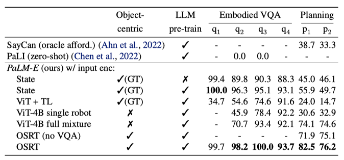
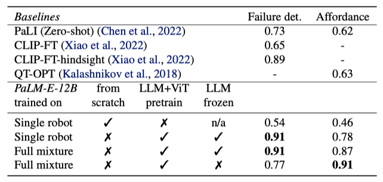
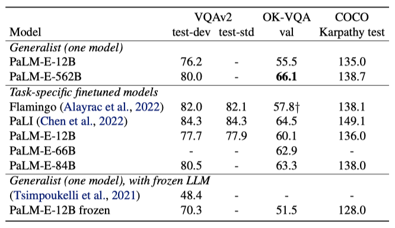
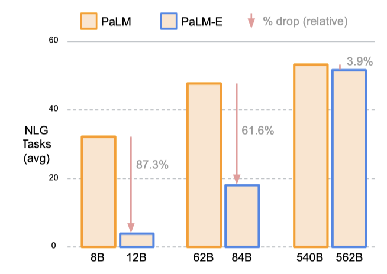
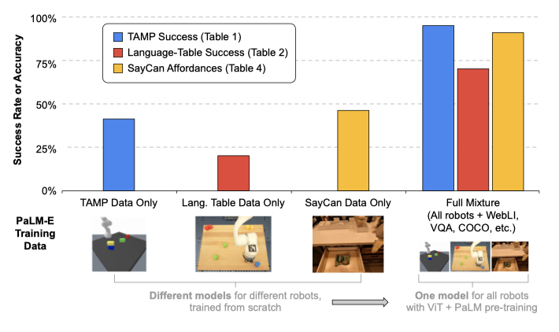
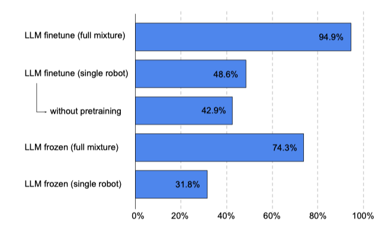

+++
author = "Kurt"
title = "PaLM-E"
date = "2024-03-14"
description = "Aligning Perception with Language Models"
categories = [
    "Paper Review"
]
tags = [
    "LLM",
    "Milestone",
]
+++

## Abstract

대규모 언어 모델의 한계를 극복하기 위해, 실제 센서 데이터를 직접 통합하는 실체화된 언어 모델을 제안한다. 이 모델은 시각적, 상태 추정, 텍스트 입력을 결합한 다중 모달 문장을 처리하여 로봇 조작, 시각적 질문 응답, 캡션 생성 등 다양한 작업을 수행한다. PaLM-E라는 단일 대규모 모델은 다양한 환경에서의 여러 작업에 대해 탁월한 성능을 보이며, 다양한 도메인에서의 공동 학습으로 인해 긍정적인 전이 효과를 경험한다. 특히, 562B parameter를 가진 PaLM-E-562B 모델은 로보틱스 및 시각-언어 작업에서 state-of-the-art를 달성하면서도 규모가 커질수록 언어 처리 능력을 유지한다.

---

## Introduction

거대 언어 모델(LLMs)은 다양한 분야에서 강력한 추론 능력을 보이지만, 실제 세계에서의 추론에는 한계가 있다. 이는 텍스트 데이터만으로 학습된 LLM이 실제 세계의 시각적 및 물리적 정보를 포함하는 문제를 해결하는 데에는 부족하기 때문이다. 이전 연구에서는 LLM의 출력을 로봇 정책과 연결하여 일부 문제를 해결했지만, 장면의 기하학적 구성을 이해하는 데는 한계가 있었다. 또한, 현재 최신 시각-언어 모델도 로봇 추론 작업을 직접 해결하는 데에는 부적합함을 확인하였다.

이 논문은 실체화된 언어 모델을 제안한다. 이 모델은 실제 세계에서 순차적 의사 결정을 위해 에이전트의 센서 입력을 직접 통합하고, 이를 텍스트와 유사하게 처리하여 더 구체적인 추론을 가능하게 한다. 연속적 입력을 처리하기 위해 사전 학습된 언어 모델에 encoder를 주입하는 방식을 사용하며, 이를 통해 실체화된 에이전트가 순차적 결정을 내리거나 질문에 답할 수 있도록 한다. 논문에서는 다양한 설정 하에서 이 접근법의 효과를 평가하고, 다양한 입력 표현과 학습 방식이 모델의 성능에 미치는 영향을 조사한다.

이 연구는 로봇 조작, 시각-언어 작업, 언어 작업 등 다양한 분야에서 다중 작업 학습이 개별 작업 학습보다 성능을 향상시키고, 로보틱스 작업에서 높은 데이터 효율성을 달성하며, 적은 학습 예제로도 새로운 상황에 대한 빠른 적응을 가능하게 한다는 것을 보여준다.

PaLM-E를 562B parameter로 확장하여, 현재 알려진 가장 큰 비전-언어 모델을 만들었다. 이 모델은 OK-VQA 벤치마크에서 state-of-the-art를 달성했으며, 특별한 작업 맞춤 조정 없이도 zero-shot multimodal chain-of-thought (CoT), few-shot 프롬프팅, OCR 없는 수학 추론, 다중 이미지 추론과 같은 다양한 능력을 보여주었다. zero-shot CoT는 이전에 multimodal 데이터에서 시도된 적은 있지만, end-to-end 모델로는 이번이 처음이다.

다음과 같은 기여를 했다: (1) 다중모달 대규모 언어 모델 학습에 실체 데이터를 혼합해 일반적인 전이 학습된 다중 실체 결정 에이전트를 학습시킬 수 있음을 보여주었다. (2) 현재의 시각-언어 모델이 실체 추론 문제에 취약함에도, 효율적인 실체 추론과 일반 목적의 시각-언어 모델을 훈련 가능함을 입증하였다. (3) 신경 장면 표현 및 엔티티-레이블링 다중모달 토큰 같은 새로운 구조적 아이디어를 도입하였다. 그리고 (4) PaLM-E가 시각 및 언어에 있어 유능한 일반주의자이며, (5) 언어 모델 크기를 확장하면 다중모달 미세조정이 더 적은 망각으로 이루어질 수 있음을 보여주었다.

---

## Related Work

**General vision-language modeling.** 최근 몇 년 동안 대규모 언어 모델과 비전 모델의 성공에 이어, 이미지와 텍스트를 동시에 처리할 수 있는 대규모 비전-언어 모델(VLMs)에 대한 관심이 커지고 있다. VLMs는 시각적 질문 응답, 캡셔닝, 광학 문자 인식, 객체 탐지 등 다양한 작업에 활용된다. 이 분야에서는 이미지를 다루는 여러 접근 방식이 제시되었으며, 특히 이미지와 텍스트를 잠재 벡터로 통합하는 PaLM-E와 비전 encoder parameter를 고정하여 최적화하는 Frozen이 주목받고 있다. 이 연구는 Frozen에서 영감을 받아 뉴럴 장면 표현 같은 새로운 입력 모달리티를 탐구하며, 이 접근법이 VQAv2 벤치마크에서 Frozen보다 45% 이상 높은 성능을 보임을 경험적으로 입증한다. 또한, PaLM-E가 인지적 작업뿐만 아니라 신체적 작업에도 유용할 수 있음을 보여준다.

**Actions-output models.** 이전 연구들은 시각과 언어 입력을 결합하여 행동 예측에 초점을 맞추었고, 그 중 VIMA는 PaLM-E와 유사한 다중 모달 프롬프트를 사용하였다. 주로 언어는 작업 지정 역할을 했다. 그러나 PaLM-E는 고수준 지시문을 생성하여 자신의 예측과 내재된 세계 지식을 활용, 실체화된 추론과 질문 응답 능력을 보여준다. Gato와 비교하여, 우리는 다양한 도메인에서의 공동 학습을 통해 작업 간 긍정적인 전이를 시연하였다.

**LLMs in embodied task planning.** 거대 언어 모델(LLM)을 활용하는 연구는 주로 자연어 이해에 초점을 맞추었지만, 자연어를 계획 수립의 도구로 사용하는 연구는 상대적으로 적다. LLM은 방대한 지식을 가지고 있지만, 이를 구체적인 계획으로 전환하는 것은 어려울 수 있다. 연구자들은 프롬프팅, affordance 기능 통합, 시각적 피드백, 세계 모델 생성, 그래프 및 지도를 이용한 계획 수립, 시각적 설명, 프로그램 생성, 정보 주입 등 다양한 방법을 통해 LLM에서 직접 지시사항을 유도하려고 시도하고 있다. PaLM-E와 같은 모델은 보조 모델 없이도 직접 계획을 생성할 수 있도록 학습되어, LLM이 저장한 의미론적 지식을 계획 과정에 바로 적용할 수 있게 한다.

대부분의 경우 LLM parameter는 추가 학습 없이 사용되지만, LID에서는 고차원 지시사항을 위해, (SL) 3에서는 계획과 행동 선택을 위해 LLM을 미세조정한다. PaLM-E는 이와는 다른 접근으로, 다양한 모달리티에서 사용될 수 있는 일반적이고 다중 실체 모델을 탐구한다.

---

## PaLM-E: An Embodied Multimodal Language Model

PaLM-E는 이미지나 센서 데이터 같은 연속적 관찰을 언어 모델의 임베딩 공간에 주입하여, 주어진 프롬프트에 따라 텍스트를 자동 생성하는 모델이다. 이는 연속적 정보를 언어 토큰처럼 처리하여, 사전 학습된 언어 모델 PaLM을 활용하고 구현화한다.

PaLM-E는 텍스트와 연속적 관찰을 입력으로 받아, 이를 통합한 다중 모달 문장을 형성한다. 예를 들어, 이미지 임베딩이 포함된 질문에 대한 답변이나 로봇이 실행할 텍스트 형태의 결정 또는 계획을 자동 생성한다. 이 과정에서, PaLM-E가 생성한 결정을 실제 동작으로 변환하기 위해, 기존 연구에서 논의된 저수준 정책이나 계획자를 활용한다.

**Decoder-only LLMs.** decoder-only 거대 언어 모델(LLM)은 텍스트 시퀀스의 확률을 예측하기 위해 토큰 시퀀스로 분해하여 처리하는 생성 모델이다.

$$ p(w_{1:L}) = \Pi_{l=1}^L p_{LM} (w_l | w_{1:l-1}) $$

여기서 $p_{LM}$은 large transformer 네트워크이다.

**Prefix-decoder-only LLMs.** LLM은 autoregressive 모델이기 때문에, 구조 변경 없이 사전 학습된 모델을 접두사에 맞춰 조정할 수 있다.

$$ p(w_{n+1:L} | w_{1:n}) = \Pi_{l=1}^L p_{LM} (w_l | w_{1:l-1}) $$

접두사 또는 프롬프트는 LLM이 다음 토큰을 예측하는 맥락을 제공하며, 이는 모델의 예측을 유도하는 데 자주 사용된다. 예를 들어, 프롬프트는 LLM이 수행할 작업 설명이나 비슷한 작업을 위한 텍스트 완성 예를 포함할 수 있다.

**Token embedding space.** 토큰 $w_i$는 고정 어휘 $W$의 단어로, LLM은 이를 함수 $\gamma$를 통해 $\mathbb{R}^k$의 임베딩 공간 $X$로 매핑한다. 이 매핑은 $k \times |W|$ 크기의 임베딩 행렬로 표현되어 end-to-end로 학습된다. $|W| = 256000$ 이다.

**Multi-modal sentences: injection of continuous observations.** 이미지와 같은 다중 모달 정보는 특별한 인코더 $\varphi$를 사용하여 직접 언어 임베딩 공간 $X$에 매핑되어 LLM에 통합된다. 이 인코더는 관찰 공간 $O$를 $X$의 벡터 시퀀스로 변환하며, 이 벡터들은 텍스트 토큰과 함께 LLM의 접두사를 구성한다. 결국, 접두사의 각 벡터는 단어 임베더 $\gamma$ 또는 인코더 $\varphi_i$를 통해 생성된다.

$$ x_i = \begin{cases} \gamma (w_i) \ \text{if} \ i \ \text{a is text token, or} \\\ \varphi_j (O_j)_i \ \text{if} \ i \ \text{corresponds to observation} \ O_j \end{cases} $$

단일 관찰이 여러 임베딩 벡터로 인코딩될 수 있으며, 다양한 encoder를 접두사의 다른 위치에 교차 배치하여 서로 다른 관찰 공간의 정보를 결합할 수 있다. 이 방법으로 LLM에 연속 정보를 주입하면, 기존 위치 인코딩을 재활용하게 되며, 다른 VLM 방식과는 달리 관찰 임베딩을 동적으로 텍스트 내에 배치한다.

**Embodying the output: PaLM-E in a robot control loop.** PaLM-E는 다양한 문장을 입력으로 받아 텍스트를 생성하는 모델이다. 작업이 텍스트 출력만으로 해결 가능할 경우, 예를 들어 질문 응답이나 장면 설명과 같이, 모델의 출력이 바로 작업의 해답으로 여겨진다.

PaLM-E는 저수준 명령을 기반으로 하는 텍스트를 생성하여 구현된 계획이나 제어 작업에 사용된다. 이 모델은 주어진 어휘 내의 저수준 기술을 연속적으로 사용하여 성공적인 계획을 만들어내며, 어떤 기술이 사용 가능한지는 학습 데이터와 프롬프트에 의해 자동으로 결정된다. 복잡한 지시나 긴 작업은 해결할 수 없지만, 로봇을 통해 실행되는 저수준 정책을 제어하는 고수준 정책으로 기능하여, 필요에 따라 재계획을 할 수 있다.

---

## Input & Scene Representations for Different Sensor Modalities

이 섹션에서는 PaLM-E에 통합된 다양한 모달리티와 이를 언어 임베딩 공간으로 매핑하는 encoder 설정에 대해 설명한다. state estimation vector, 2D 이미지를 위한 Vision Transformer(ViTs), 그리고 3D Object Scene Representation Transformer(OSRT) 등 다양한 아키텍처를 탐구한다. 또한, 장면의 전반적인 표현과 함께, 장면 내 개별 객체를 나타내는 토큰으로 분해하는 객체 중심 표현도 고려한다.

**State estimation vectors.** 로봇이나 객체 상태 추정치 같은 상태 벡터는 PaLM-E에 간단히 입력될 수 있다. 이 벡터는 객체의 위치, 크기, 색상 등을 설명하며, MLP $\varphi_{state}$ 통해 언어 임베딩 공간으로 매핑된다.

**Vision Transformer (ViT).** ViT는 이미지를 토큰 임베딩으로 매핑하는 Transformer 아키텍처이다. 이 아키텍처는 이미지 분류를 위해 사전 학습된 여러 버전을 포함하는데, 4억 parameter의 ViT-4B와 22B parameter의 ViT22B가 대표적이다. 또한, 처음부터 end-to-end로 학습된 ViT 토큰 학습 아키텍처(ViT + TL)도 있다. ViT 임베딩의 차원은 언어 모델의 차원과 다를 수 있으므로, affine transformation을 통해 매핑한다.

**Object-centric representations.** 언어와는 다르게, 시각적 입력은 미리 정의된 의미 있는 개체와 관계가 없어서, ViT 같은 모델이 의미를 포착하기는 하지만 그 표현은 정적 그리드와 비슷하다. 이러한 차이는 심볼 기반의 대규모 언어 모델과의 연결과 물리적 객체와 상호작용하는 문제 해결에 어려움을 준다. 이를 극복하기 위해, 시각적 입력을 LLM에 주입하기 전에 독립된 객체로 분리하는 구조화된 encoder를 탐구한다. 객체 인스턴스 마스크가 있을 때, ViT의 표현을 객체별로 분해할 수 있다.

**Object Scene Representation Transformer (OSRT).** OSRT는 외부의 객체 정보 없이도 아키텍처의 유도적 편향을 통해 비지도 방식으로 객체를 발견하는 대안이다. 이 방법은 도메인 내 데이터에서 3D 중심의 장면 표현을 학습하며, 객체는 여러 임베딩으로 표현되는 슬롯을 통해 나타낸다. OSRT는 이러한 슬롯을 MLP를 사용해 임베딩으로 매핑한다.

**Entity referrals.** 실체화된 계획 작업에서 PaLM-E는 생성된 계획 안에서 특별한 토큰을 사용해 객체를 참조할 수 있어야 한다. 장면 속 객체들은 고유한 속성으로 자연어로 식별되기도 하지만, 언어로 쉽게 구별하기 어려운 경우도 있다. 이럴 때, OSRT와 같은 객체 중심 표현을 사용하여, 입력 프롬프트에 있는 객체를 다중 모드 토큰으로 라벨링하고, 이 토큰들을 통해 객체를 참조한다. 이 과정에서 저수준 정책들도 동일한 토큰을 활용한다고 가정한다.

---

## Training Recipes

PaLM-E는 다양한 크기의 사전 학습된 PaLM 모델을 기반으로 한 decoder-only 언어 모델이다. 이 모델은 연속적 관찰, 텍스트, 그리고 인덱스를 포함하는 데이터셋에서 학습되며, 텍스트 내 특수 토큰을 통해 다중 모드 문장을 형성한다. 이 특수 토큰들은 encoder의 임베딩 벡터로 대체되어, 연속적 관찰을 모델에 주입한다. PaLM-E는 8B, 62B, 540B paramater의 LLM과 결합된 다양한 크기의 ViT(Visual Transformer)를 사용하여, 각각 PaLM-E12B, PaLM-E-84B, PaLM-E-562B로 명명된다. 손실 함수는 non-prefix 토큰에 대한 crossentropy loss로 계산된다.

**Variation with Model freezing.** 이 연구의 구조체들은 encoder, projector, 그리고 LLM으로 구성되어 있다. PaLM-E 학습 시, 전체 구성 요소를 업데이트하는 대신, 적절한 프롬프트를 사용하여 LLM을 고정시키고 입력 encoder만 학습하는 방법을 탐구한다. 이 방식에서 encoder는 관찰을 바탕으로 LLM을 지원하며, 실체의 능력 정보를 LLM에 전달한다. 이는 입력 조건에 따른 소프트 프롬프팅의 한 형태로, 이를 통해 다양한 모달리티의 encoder 비교도 가능하다고 주장한다. 실험에서는 특히 OSRT와 LLM 사이의 인터페이스 역할을 하는 프로젝터만 업데이트하며, 나머지는 고정시킨다.

**Co-training across tasks.** 이 실험은 다양한 데이터를 이용한 모델 공동 학습의 효과를 탐구한다. "full mixture"는 여러 작업의 인터넷 규모 비전-랭귀지 데이터로, 전체의 8.9%가 실체 데이터이며 각 실체별로 여러 작업이 존재한다.

---

## Experiments

이 실험은 시뮬레이션과 실제 로봇 2종을 통한 다양한 로봇 조작 작업을 다룬다. PaLM-E의 능력은 https://palm-e.github.io에서 비디오로 볼 수 있다. 주요 초점은 아니지만, PaLM-E는 시각-질문 응답, 이미지 캡셔닝, 언어 모델링 등 비전-언어 작업에서도 평가된다.

이 실험을 두 부분으로 나누어 진행한다. 첫 번째 부분에서는 다양한 입력 표현의 성능, 일반화, 데이터 효율성을 비교한다. 두 번째 부분에서는 사전 학습된 ViT와 PaLM 언어 모델을 포함한 주요 PaLM-E 버전에 초점을 맞추고, 이 모델이 다양한 데이터셋과 작업, 로봇 실체에 걸쳐 높은 성능을 달성할 수 있음을 보여준다. 또한, 다양한 작업의 혼합에 대한 학습이 개별 작업의 성능을 어떻게 향상시키는지, 공동 학습 전략과 모델 크기가 성능에 미치는 영향을 조사한다. 마지막으로, LLM을 고정시키고 ViT만 학습하는 방법의 가능성을 고려한다.

로봇 데이터로 학습되지 않은 PaLI 모델과 오라클 능력치가 있는 SayCan 알고리즘을 기준으로 삼는다.

### Robot Environments / Tasks

PaLM-E는 로봇이 물체를 조작하는 세 가지 환경에서 학습된다: 1) 물체를 잡고 쌓는 TAMP 분야, 2) 테이블 위 물체를 밀기, 3) 이동 조작 분야. 이 로봇은 복잡한 계획 생성, 물체 위치 추론, 장면의 세부 사항 이해가 필요하며, 특히 TAMP와 테이블 밀기 환경에서는 제한된 데이터로 학습된다. 또한, 이동 조작과 테이블 밀기 환경에서는 실제 세계에서의 계획 실행을 위해 외부 방해나 제어 정책 실패에 대응하여 계획을 조정할 수 있어야 한다.

### TAMP Environment

TAMP 환경에서의 계획 성공률과 VQA 성능을 에서, 96,000개의 학습 장면만을 포함하는 데이터셋에서 사전 학습된 LLM을 사용한 결과를 보면, 3-5개 객체에 대해서는 대부분의 입력 표현이 비슷한 성능을 보이지만, 객체 수가 증가할 때 사전 학습된 LLM을 사용하면 특히 엔티티 참조를 통해 성능이 크게 향상된다. 62B LLM은 8B 버전보다 분포 외 일반화에서 50% 더 우수하지만, 사전 학습되지 않은 LLM은 분포 외 일반화가 거의 없다. SayCan 기준선은 오라클 허용 기능을 사용하지만, 이는 TAMP 환경에서 장기 계획을 구성하는 데 충분한 정보를 제공하지 못하여 어려움을 겪는다.

낮은 데이터 환경에서 LLM의 사전 학습이 유리하며, ViT 변형 모델들은 적은 데이터로는 계획 작업을 잘 해결하지 못하지만, 다양한 로봇 환경과 시각-언어 데이터셋에 대한 공동 학습을 통해 ViT-4B의 성능이 크게 향상된다. OSRT 입력 표현이 가장 우수한 성능을 보여주며, 특히 3D 인식 객체 표현의 강점을 드러낸다. TAMP VQA 데이터를 제외하고 학습할 경우 성능이 소폭 감소하며, 로봇 데이터에 학습되지 않은 최신 시각-언어 모델 PaLI는 테이블 위 객체 위치와 수직 객체 관계를 파악하는 데 실패한다. 이러한 결과는 전형적인 VQA 작업과 유사한 상황에서 얻어졌다.

### Language-Table Environment

Language-Table 환경에서, PaLM-E 모델은 장기 계획 작업 수행에 효과적이며, 특히 제한된 데이터에서도 좋은 성능을 보여준다. 12B에서 84B 모델로 확장 시 일부 작업에서 성능이 향상되었으나, SayCan과 zero-shot PaLI는 가장 기본적인 작업도 해결하지 못했다.

**Real Robot Results and All Few-Shot robots + WebLI, Generalization.** PaLM-E는 다단계 탁상 조작 작업을 위해 이미지와 장기 목표를 바탕으로 언어 하위 목표와 로봇 동작을 생성한다. 이전 연구와 달리 인간의 상호 작용 없이도 작업을 수행할 수 있으며, 일회성 및 zero-shot 학습을 통해 새로운 작업과 본 적 없는 객체에 대해서도 대응할 수 있는 능력을 보여준다.

### Mobile Manipulation Environment

PaLM-E는 다양한 모바일 조작 작업에서의 성능을 시험한다. Ahn et al. (2022)의 연구를 바탕으로, 로봇은 인간의 지시에 따라 탐색과 조작 작업을 계획한다. 예를 들어 "I spilled my drink, can you bring me something to clean it up?"는 요청에 대해 로봇은 스펀지를 찾고, 집고, 사용자에게 가져다주고, 놓는 순서를 계획해야 한다. 이를 바탕으로, PaLM-E의 추론 능력을 검증하기 위해 3가지 사용 사례(affordance 예측, 실패 탐지, 장기 계획)를 개발하였다. 이 과정에서 사용된 저수준 정책은 RGB 이미지와 자연어 지시를 받아 작동기 제어 명령을 출력하는 RT-1 Transformer 모델에서 나왔다.

**Affordance prediction.** PaLM-E는 현재 환경에서 저수준 정책의 기술 실행 가능성을 평가하는 affordance 예측에서, VQA 문제 형식을 통해, PaLI(zero-shot)와 QT-OPT로 학습된 가치 함수의 임계값 적용보다 뛰어난 성능을 보여주었다.

**Failure detection.** 로봇의 폐쇄 루프 계획에서 실패 감지의 중요성을 강조한 Huang et al. (2022)에 따르면, PaLM-E는 다중 모달 프롬프트 실험에서 PaLI(zero-shot) 및 이 데이터셋에 미세조정된 CLIP 버전을 넘어서는 성능을 보여주었다. 또한, 회고적 데이터로 학습된 두 CLIP 모델을 사용한 Xiao et al. (2022)의 방법보다도 우수하며, 이 방법은 더 많은 정보를 활용해 특별히 실패 감지 문제를 해결하기 위해 설계되었음에도 불구하고 PaLM-E에 뒤처졌다.

**Real robot results: Long-horizon planning.** 모바일 조작 작업을 위해 PaLM-E를 사용해 종단간 계획을 수행하였다. 이 과정에서, PaLM-E는 이전 단계와 현재 장면 이미지를 기반으로 다음 단계를 생성하며, 이를 Ahn et al. (2022)에서 정의된 저수준 정책에 매핑한다. 이 autoregressive한 절차는 "terminate" 신호가 나올 때까지 계속된다. 2912개 시퀀스로 학습된 모델은 실제 주방에서의 평가에서도 적대적 상황 하에서 장기간 작업을 성공적으로 수행할 수 있는 능력을 보여주었다.

### Performance on General Visual-Language Tasks

이 연구에서는 주요 초점이 아니지만, 일반 시각-언어 작업에서 PaLM-E-562B 모델이 OKVQA, VQA v2, COCO 캡셔닝 등에서 뛰어난 성능을 보여주었다. 특히, OK-VQA에서는 이전 모델들을 넘어서는 최고 성적을 달성했으며, VQA v2에서도 최고의 성능을 기록하였다. 이 결과는 PaLM-E가 로봇 작업을 위한 추론 모델을 넘어서, 시각-언어 분야에서도 경쟁력 있는 범용 모델임을 보여준다.

### Performance on General Language Tasks

PaLM-E 모델은 NLU 및 NLG 작업에서 모델 규모가 클수록 언어 능력의 손실이 크게 줄어든다. 가장 작은 모델은 다중 모드 학습 중 NLG 성능의 87.3%가 저하된 반면, 가장 큰 모델은 오직 3.9%의 성능 저하를 보여주었다.

---

## Summary of Experiments & Discussion

**Generalist vs specialist models – transfer.** 이 연구에서는 다양한 작업과 데이터셋에서 동시에 학습된 PaLM-E가 별도로 학습된 모델보다 뛰어난 성능을 보였습니다. "full mixture"에 대한 공동 학습은 성능을 두 배 이상 향상시키며, LLM/ViT 사전 학습과 전체 혼합 훈련을 추가하면 성능이 크게 개선된다. 언어-테이블 실험에서도 비슷한 결과를 관찰하였다.

**Data efficiency.** 언어나 시각-언어 데이터셋에 비해 로봇 공학 데이터가 부족함에도 불구하고, 이 모델은 소수의 학습 예제로 로봇 과제를 해결하는 전이 능력을 보여준다. 예를 들어, 언어 테이블은 10~80, TAMP는 320 예제가 사용된다. 기하학적 입력을 활용한 OSRT 결과는 데이터 효율성을 높이는 또 다른 방법을 제시한다. 대규모 시각 데이터를 활용하는 방법과의 결합은 향후 연구의 유망한 방향이다.

**Retaining language capabilities.** 다중 모드 학습 중 모델의 언어 능력을 보존하는 두 가지 방식을 소개하였다. 첫 번째는 LLM을 고정하고 입력 encoder만 학습하는 것으로, 이 방법은 로봇 과제에서 한계를 보여주었다. 반면, 모델을 전체적으로 end-to-end로 학습할 때는 모델이 커질수록 원래의 언어 성능을 더 잘 유지하였다.

---

## Conclusion

이미지와 같은 다중 모달 정보를 포함하여 언어 모델을 실체화시키는 새로운 방법, PaLM-E를 제안하였다. 이 모델은 로봇 제어와 같은 실체화된 작업뿐만 아니라 일반 VQA와 캡셔닝 작업에서도 뛰어난 성능을 보이며, 대규모 데이터 없이도 효과적인 신경 장면 표현을 통합한다. PaLM-E는 다양한 시각-언어 작업에 대해 학습되어, 로봇 계획 작업을 데이터 효율적으로 달성하는 것이 가능함을 보여준다. 또한, 언어 모델의 크기를 확장함으로써 실체화된 에이전트가 재앙적 잊어버림을 적게 경험하며, 큰 모델 PaLM-E-562B는 다중 이미지 추론과 다중 모달 사고 과정 추론 등의 능력을 보여준다.

---

## Reference

* [Paper](https://arxiv.org/pdf/2303.03378.pdf)
* [Github](https://github.com/kyegomez/PALM-E)