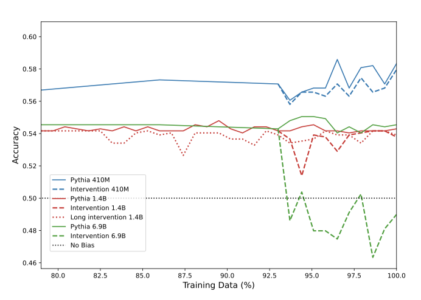
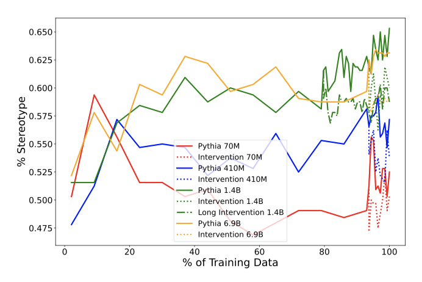
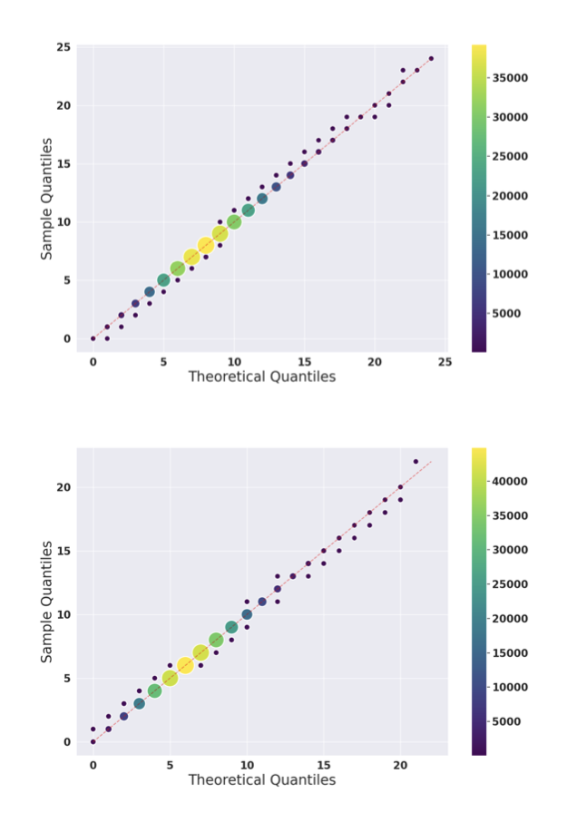
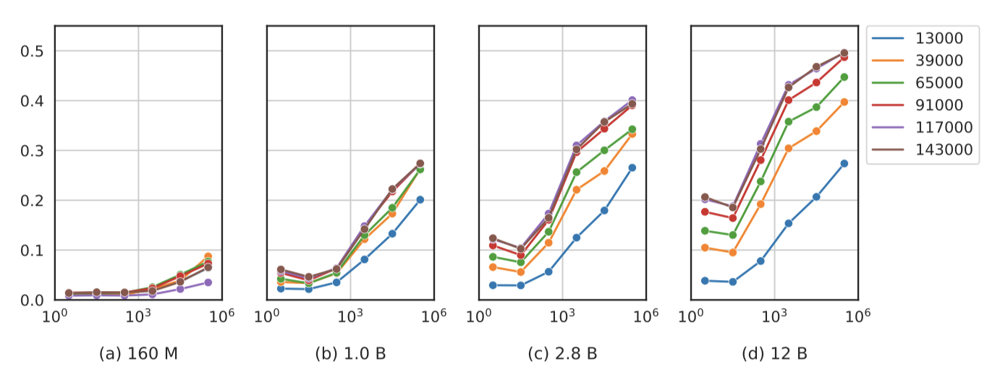

+++
author = "Kurt"
title = "Pythia"
date = "2024-03-20"
description = "A Suite for Analyzing Large Language Models Across Training and Scaling"
categories = [
    "Paper Review"
]
tags = [
    "LLM",
    "Milestone",
]
+++

## Abstract

Pythia는 70M에서 12B parameter까지 다양한 크기의 16개 거대 언어 모델(LLM)을 포함한 도구 모음으로, 이 모델들은 모두 동일한 순서로 공개 데이터에 대해 학습되었다. 이 모델들의 학습 과정과 진화를 탐구하고자 하며, 각 모델에 대해 154개 체크포인트와 정확한 학습 데이터 로더를 공개적으로 제공한다. Pythia는 기억력, 단어 빈도의 few-shot 성능 영향, 성별 편향 감소 등 여러 연구 분야에서 새로운 발견을 가능하게 하기 위해 설계되었다. 이는 LLM의 학습 역학에 대한 새로운 통찰을 얻기 위한 엄격하게 통제된 설정을 제공한다.

---

## Introduction

최근 몇 년 간, 대규모 transformer 모델들이 자연어 처리를 비롯한 다양한 분야에서 생성적 과제의 선두주자로 자리매김하였다. 텍스트-이미지 합성, 단백질 모델링, 컴퓨터 프로그래밍 등에서 큰 성공을 거두었음에도, 이 모델들의 성공 원인과 방법에 대해서는 아직 명확히 알려진 바가 적다.

transformer 모델이 학습과 스케일링에 따라 어떻게 변화하는지 이해하는 것은 중요하다. 이 모델들이 커질 때 나타나는 규칙적인 패턴은 잘 알려져 있지만, 이러한 스케일링 법칙과 모델의 학습 과정을 연결 짓는 연구는 많지 않다. 이 연구 부족은 적절한 모델을 테스트할 수 있는 자원의 부족 때문인데, 많은 대규모 언어 모델들이 공개되어 있음에도 불구하고 연구자들의 필요를 충족시키지 못하였다. 이런 연구는 대부분 비공개 모델에서 이루어져, 과학 연구를 위한 공개 모델 스위트의 필요성을 강조한다.

이 논문에서는 과학 연구를 위해 특별히 설계된 70M부터 12B parameter의 decoder-only autoregressive 언어 모델인 Pythia를 소개한다. Pythia는 세 가지 핵심 특성을 갖춘 유일한 공개 대규모 언어 모델이다.

1. 모델은 여러 크기의 스케일을 아우른다.
2. 모든 모델은 동일한 데이터에 대해 같은 순서로 학습되었다.
3. 데이터와 중간 체크포인트는 공부를 위해 공개적으로 이용 가능하다.

중복 제거 전후의 Pile에 대해 8가지 크기의 모델을 학습시켜, 비교를 위한 2가지 버전을 제공한다.

Pythia의 특성을 활용해 성별 편향, 암기, few-shot 학습에 대한 학습 데이터와 모델 크기의 영향을 분석한다. 이 실험들은 Pythia의 실험 방식을 사례로 보여주며, 향후 연구 방향을 제안한다.

**Mitigating Gender Bias** 언어 모델의 편향에 대한 연구는 많지만, 대규모 모델에서 편향의 학습 동역학을 연구할 수 있는 도구는 부족했다. Pythia를 사용하여, 사전 학습 데이터에서 성별 용어의 빈도를 수정함으로써 언어 모델의 편향에 미치는 영향을 분석하였다. 모델을 반사실적으로 재학습하여, 특정 벤치마크에서의 편향을 줄이는 데 성공적이었으며, 이는 학습 데이터가 모델 행동에 미치는 영향을 연구하기 위한 중요한 도구로 제안된다.

**Memorization is a Poisson Point Process** 대규모 언어 모델에서 학습 데이터셋 내 특정 시퀀스의 위치가 그 시퀀스가 암기될 가능성에 영향을 미치지 않는다는 것을 발견하였다. 또한, 학습 과정에서 암기된 시퀀스의 발생을 푸아송 점 과정으로 매우 잘 예측할 수 있음을 확인했다.

**Emergence of the Impact of Pretraining Frequencies** 최근 연구에 따르면, 코퍼스 내 특정 사실의 빈도는 모델이 자연어 질문에 해당 사실을 적용할 가능성에 중요한 역할을 한다. 그러나 기존 연구는 공개 데이터에 의존한 소수의 모델 분석에 국한되어, 학습 과정의 세밀한 변화를 파악하기 어려웠다. 이를 해결하기 위해 학습 과정에서 용어 빈도의 역할 변화를 조사했고, 학습의 45% 지점인 65,000단계 후에 2.8억 개 이상의 parameter를 가진 모델들에서 작업 정확성과 작업 관련 용어의 발생 사이에 상관관계가 나타나기 시작하는 중요한 변화를 발견했다. 이러한 변화는 이전에는 보이지 않았으며, 작은 모델들에서는 대체로 나타나지 않는다.

---

## The Pythia Suite

Birhane et al. (2021)의 조언을 따라, Pythia의 설계와 구현에서 선택과 근거, 가치를 분명히 밝힌다. 대규모 언어 모델 연구 촉진이 목표이므로, 최고 성능 추구보다는 모델 설계의 일관성과 변이 요인 통제를 우선한다. 예상과 달리, 작은 규모 모델에서 성능 저하를 예상했던 선택에도 불구하고, 이 모델이 모든 규모에서 OPT 모델과 동등한 성능을 보여주었다.

### Requirements for a Scientific Suite of LLMs

Pythia는 대규모 언어 모델 연구를 지원하는 스위트로, 조사 결과 이러한 조건을 모두 만족하는 기존 모델은 없었다.

**Public Access** 모델은 공개적으로 배포되며 공개적으로 이용 가능한 데이터로 학습된다.

**Training Provenance** 중간 체크포인트가 분석용으로 제공되고, 모든 모델이 같은 데이터 순서로 학습된다. 이 체크포인트는 해당 시점까지의 데이터와 연결되며, 학습 절차와 hyperparameter는 상세히 문서화된다.

**Consistency Across Scale** 모델 스케일링은 최신 학습 관행을 따르며, 모델 크기는 다양한 규모로 설정되어야 한다.

체크포인트 수는 가장 적은 수를 기준으로 하며, 대부분의 모델은 연구 목적에 충분한 체크포인트를 제공하지 않는다. 특히, 더 큰 모델보다 작은 모델에 더 많은 체크포인트가 있는 경우가 일반적이지만, GPT-Neo는 큰 모델에서도 많은 체크포인트를 제공하는 예외이다.

### Training Data

Pile은 대규모 언어 모델 학습을 위한 영어 데이터셋으로, 자유롭게 이용 가능하며 C4와 OSCAR보다 더 우수한 성능을 보여준다. 이는 GPT-J-6B, GPT-NeoX-20B, Jurassic-1, Megatron-Turing NLG 530B, OPT, WuDao와 같은 최신 모델 학습에 널리 사용되었다. 데이터셋에는 Black et al. (2022)에 의해 개발된 BPE 토크나이저가 특별히 사용된다.

다국어 코퍼스 학습을 고려했지만, 다음과 같은 이유로 단일 언어 코퍼스를 선택하였다.

1. Pile에 대해 확신하지만, 다국어 데이터셋의 품질에 대해서는 확신할 수 없습니다. 기존 다국어 데이터셋의 품질이 의심스럽고, 우리는 이를 충분히 검증할 자격이 없다고 느낍니다. BLOOM이 훈련된 ROOTS는 좋은 후보지만, 모델 훈련을 시작할 때 공개되지 않았습니다.
2. 이 프레임워크는 미래 연구의 기초로 삼기 위해 널리 인정받는 관행에 부합하려 한다. Pile은 영어 모델 학습에 널리 쓰이지만, 다국어 데이터셋 중에는 그만큼 인기 있는 것이 없다. 특히 ROOTS는 BLOOM 이외에는 사용되지 않았다.
3. Gao et al. (2021)만큼 포괄적인 다국어 평가 프레임워크에 접근할 수 없다.

Pythia 스위트 2개를 동일 구조로 학습시키는데, 하나는 원본 Pile, 다른 하나는 중복 제거된 Pile(약 207B 토큰)에 적용된다. 이는 중복 제거 데이터에서 학습된 모델이 더 효율적이고 데이터를 적게 암기한다고 한 조언에 따른 것이다.

### Architecture

모델 구조와 hyperparameter는 주로 Brown et al. (2020)을 기반으로 하되, 대규모 언어 모델링의 최신 우수 사례에 따른 몇 가지 변화가 있다.

1. Brown et al. (2020)은 sparse와 dense attention layer를 번갈아 사용하는 것을 설명하지만, 이 연구에서는 후속 작업을 따라 fully dense layer를 사용한다.
2. 학습 중에는 개선된 장치 처리량을 위해 Flash Attention (Dao et al., 2022)을 사용한다.
3. positional embedding 유형으로 널리 사용되고 있는 Su et al. (2021)에 의해 소개된 rotary embedding을 사용한다.
4. parallelized attention 및 feedforward technique과 모델 초기화 방법을 사용한다. 이는 학습 효율성을 향상시키고 성능에 해를 끼치지 않기 때문이다.
5. 이전 연구에서 해석 연구를 용이하게 만든다고 제안한 대로, untied embedding / unembedding 행렬을 사용한다.

### Training

EleutherAI가 개발한 GPTNeoX를 사용해 모델을 학습하고, Adam과 ZeRO를 통해 다중 기계 설정에서 효율적으로 확장한다. 또한 데이터 및 텐서 병렬성을 활용해 성능을 최적화하고, 향상된 하드웨어 처리량을 위해 Flash Attention을 사용한다.

표준 절차와 달리, 소규모 언어 모델 학습에 일반적인 것보다 훨씬 큰 배치 크기를 사용한다. 기존 연구는 큰 배치 크기가 바람직하지만 작은 LLMs에는 수렴 문제를 피하기 위해 작은 배치 크기가 필요하다고 제시하였다. 하지만, 1B 개 미만의 parameter를 가진 모델에 대해 표준의 4배에서 8배 크기의 배치를 사용해도 문제가 없음을 발견하였다. 따라서, 모든 Pythia 모델 학습에 1024개 샘플, 시퀀스 길이 2048 (2,097,152 토큰)의 일관된 배치 크기를 사용한다.

큰 배치 크기는 모델 학습 속도를 높이는 데 중요하다. GPU 접근성이나 연결성 제한 없이 배치 크기를 증가시키면 학습 시간을 크게 단축할 수 있다. 이를 통해, 기존 표준 대비 최대 10배 빠른 훈련 속도 향상을 달성했으며, 이 모델은 GPT-Neo나 OPT와 같은 유사 크기의 모델들과 동등한 성능을 유지한다.

초기화 시와 2,097,152,000 토큰마다 모델 체크포인트를 저장하여 학습 도중 144개의 체크포인트를 생성한다. 학습 초기에는 로그 간격으로 추가 체크포인트를 저장하여 모델 당 총 154개의 체크포인트를 제공한다. 이는 공개된 다른 언어 모델보다 훨씬 많다.

모든 모델을 약 300B 토큰으로 학습시켜 GPT-3 및 OPT와 동일하게 맞춘다. 표준 Pile은 334B 토큰이지만 중복 제거된 Pile은 207B 토큰이므로, 중복 제거된 데이터에서 대략 1.5 에폭 동안 모델을 실행한다. 이를 통해 사용자는 중복 제거의 영향을 더 자세히 연구할 수 있다. 또한, 두 번째 에폭이 평가 점수에 부정적인 영향을 미치지 않는다는 것을 확인하였다.

원본 Pile에서 학습된 모델은 "Pythia-xxx"로, 중복 제거된 Pile에서 학습된 모델은 "Pythia-xxx-deduped"로 명명한다. 여기서 'xxx'는 모델 parameter 수를 반올림한 값이다.

### Evaluation

이 연구는 대규모 언어 모델의 행동 연구를 목표로 하며, state-of-the-art는 주요 요건이 아님에도 불구하고, NLP 벤치마크에서 Pythia와 Pythia (중복 제거)가 OPT 및 BLOOM 모델과 유사한 성능을 보인다는 것을 확인하였다.

### Novel Observations in Evaluation

이 연구는 기존 문헌과 상반되는 세 가지 발견을 내놓았다. 첫째, 학습 데이터의 중복 제거가 언어 모델 성능 향상에 필수적이지 않다는 것이다. 둘째, 모든 모델 크기에서 병렬 주의와 MLP 부계층을 사용함에도 불구하고 OPT와 유사한 성능을 달성했다는 점이다. 셋째, 다양한 평가에서 다중 언어성의 저주가 일관되지 않게 나타나며, 이는 다중 언어 모델 평가 방법에 대한 재검토 필요성을 시사한다.

### Public Release and Reproducibility

공개 자원을 사용해 재현 가능하도록 하며, GPT-NeoX와 DeepSpeed로 학습하고 Language Model Evaluation Harness로 모든 평가를 직접 수행한다.

모델과 체크포인트를 Apache 2.0 라이선스로 HuggingFace Hub와 GitHub에 공개하며, 평가용 코드와 벤치마크 점수도 함께 제공한다.

Pile 데이터셋 학습과 함께, GPT-NeoX에서 사용된 사전 토큰화 데이터 파일 다운로드 도구와 학습 시 사용된 데이터로더를 재현할 스크립트를 제공한다. 이를 통해 연구자들이 각 학습 단계의 배치 내용을 확인하거나 저장할 수 있다.

---

## Case Studies

기존 모델로는 불가능했던 언어 모델링 연구에 대해 세 가지 사례 연구를 진행한다. 이들은 다양한 주제를 다루며 각 분야의 중요한 질문에 초점을 맞추고, 공개 학습 데이터를 통해 모델에 대한 새로운 통찰을 얻고자 한다.

### How Does Data Bias Influence Learned Behaviors?

대규모 언어 모델은 주로 최소한으로 큐레이션된 인간 작성 데이터로 학습되며, 이 과정에서 데이터의 편향을 학습한다. 하지만, 학습 중 편향이 어떻게 발달하는지에 대한 구체적인 이해는 부족하다. 깊은 학습 모델에서 사회적 편향이 학습 데이터보다 더 극단적으로 나타나는 편향 증폭 현상이 우려되고 있다. 이를 완화하기 위해 일부 연구들은 균형 잡힌 데이터셋에서의 파인튜닝을 통해 언어 모델의 성별 편향을 줄이는 데 성공했지만, 사전학습 중 편향 발생에 대한 특정 코퍼스 통계의 역할에 대해서는 여전히 많은 것이 알려지지 않았다.

다른 특성의 코퍼스로 학습된 언어 모델이 성별 편향에 어떤 영향을 받는지 조사하기 위해, 특정 Pythia 모델들의 사전학습 데이터를 남성 대명사에서 여성 대명사로 변경하여 실험한다. 이 변경을 통해 학습된 모델들의 성능을 WinoBias와 CrowS-Pairs 벤치마크를 사용해 측정함으로써, 코퍼스의 성질 변화가 모델의 성별 편향에 미치는 영향을 분석한다. 평가 방법은 이 벤치마크들이 원래 의도된 목적과 다르기 때문에 조정이 필요하다.

Pythia의 통제된 설정은 학습 데이터에 대한 정밀한 접근을 통해, 사전학습에서 대명사 빈도의 영향을 분리해 분석할 수 있게 한다. 다른 학습 데이터셋을 비교할 경우, 통제할 수 없는 여러 요소들이 변경되며, hyperparameter의 선택이 결과적인 편향에 영향을 줄 수도 있다. 따라서, 같은 데이터와 순서로 사전학습을 재개하지 않으면, 실험이 특정 성별 용어 빈도의 영향만 측정하고 있는지 확신하기 어렵다.

WinoBias 연구에서, 모든 모델 규모에 걸쳐 개입을 통해 고정 관념적 정확도가 감소하는 것을 확인하였다. 특히, 가장 큰 모델(6.9B)에서는 개입으로 인해 모델이 고정 관념적 편향에서 벗어나 더 중립적인 편향으로 변화하였다. 이는 큰 모델이 더 복잡한 관계를 학습할 수 있기 때문에 발생하며, 따라서 모델 규모가 클수록 개입의 효과가 커진다고 가정한다.

모든 모델 크기에 대해, 학습의 마지막 부분에서 성별 대명사를 바꿈으로써 성별 편향이 줄어드는 것을 볼 수 있다. 이 현상은 특히 큰 모델에서 더욱 두드러지는데, 이는 큰 모델이 상관관계와 분포를 더 잘 모델링하기 때문에 편향을 더 강하게 학습하기 때문이다. 개입이 LAMBADA 모델의 혼란도를 약간만 감소시키며, 이는 편향 완화가 언어 모델링 성능에 크게 영향을 주지 않는다는 것을 보여준다. 언어 모델의 편향 변화가 실제인지, 아니면 CrowS-Pairs의 신뢰성 문제인지는 추후 연구 주제이다.

언어 모델 학습 데이터의 일부를 수정하고 재학습하여 기준 모델과 비교하는 개입 방법은 편향 증폭 조사 및 완화 전략 개발 등의 분야에서 더 연구될 필요가 있다고 제안한다. 이러한 개입은 특정 학습 샘플이 모델의 편향에 미치는 영향을 평가하는 데 도움이 될 수 있으며, 모델의 체크포인트와 재훈련 가능성은 기존 편향 측정의 신뢰도를 확인하는 데 유용할 수 있다.

### Does Training Order Influence Memorization?

신경 언어 모델의 암기 동태에 대한 연구는 여전히 많은 미해결 질문을 남기고 있다. 이전 연구는 소수의 모델을 대상으로 하거나 비공개 모델을 사용한 경우가 많았다. Carlini et al. (2022)은 모델 스케일링의 영향에 대해 연구하면서 적합한 모델 집합의 부족을 지적했고, 결국 다소 차이가 있는 데이터 세트와 방법으로 학습된 GPT-Neo 모델에 주목하였다.

이 실험은 학습 순서가 모델의 암기 능력에 영향을 미치는지 검증한다. transformer 모델이 정보를 반복적으로 잠재 공간에 추가하고 처리한다는 이론에 근거해, 나중에 학습된 데이터가 더 많이 암기될 것이라 예상한다. 만약 이 가설이 맞다면, 학습 데이터의 순서를 조정함으로써 원치 않는 암기를 줄일 수 있을 것이다.

학습 데이터의 초기 부분이 얼마나 잘 암기되는지 측정하여 가설을 테스트한다. Carlini et al. (2021)의 암기 정의를 따라, 학습 데이터의 일부를 프롬프트로 제공했을 때 모델이 이어지는 내용을 정확히 생성할 수 있는지를 기준으로 한다. 여기서, k와 ℓ는 각각 32로 설정되었으며, 계산 비용을 고려해 이 설정을 선택하였다. 공변량 효과를 제어하기 위해 학습 데이터의 첫 64 토큰만 사용한다.

포아송 모델 분석 결과, 학습 순서가 암기에 미치는 영향이 적으며, 학습 과정 전반에 걸쳐 암기된 시퀀스의 분포가 균일함을 발견하였다.

포아송 과정은 학습 데이터 내 암기된 시퀀스 발생을 나타낸다. 학습 코퍼스의 시퀀스를 시간 단위로 보고, 배치 내 암기된 시퀀스 수를 샘플 분포로, 이를 가장 잘 설명하는 포아송 분포를 이론적 분포로 사용한다. 512 시퀀스 배치 크기로 분석했으나, 다양한 크기에서도 유사한 결과를 확인하였다.

이 연구는 모델이 특정 시퀀스를 암기하는 것을 조절하려는 실무자에게 중요하다. 원치 않는 시퀀스의 암기를 줄이기 위해 학습 시작이나 끝에 배치하는 것만으로는 충분하지 않다. 대신, 암기를 우려하는 시퀀스를 학습 초반에 배치하여, 학습이 끝나기 전에 원치 않는 암기가 일어나는지 더 잘 관찰할 수 있도록 권장한다.

### Do Pretraining Term Frequencies Influence Task Performance Throughout Training?

최근 연구들은 언어 모델의 프리트레이닝 코퍼스가 Few-shot 성능에 중요한 영향을 미친다는 것을 보여준다. 특히, 코퍼스 내에서 자주 발견되는 용어들이 드물게 나타나는 용어들보다 더 높은 정확도를 보이는 경향이 있음을 발견하였다. 이러한 영향은 수치적 추론과 같은 특정 작업에서 더욱 명확하게 관찰된다. 또한, 이 연구들은 프리트레이닝 코퍼스의 중요한 엔티티 빈도와 사실적 질문에 대한 답변 능력 사이의 상관 관계 및 인과 관계를 조사한다. 하지만, 모델의 크기가 이러한 영향에 어떻게 작용하는지는 아직 명확하게 밝혀지지 않았다. 이 현상은 모델 체크포인트와 모델 크기에 걸쳐 추가적으로 조사되었으며, 평가는 자연어 프롬프트를 사용한 k-shot 설정에서 이루어졌다. 모델 평가는 프리트레이닝 데이터를 기반으로 한 용어 빈도 계산과 함께 진행되었다.

Razeghi et al. (2022) 연구는 [0, 99] 범위의 x1과 [1, 50] 범위의 x2를 사용하는 산술 과제를 탐구한다. 프롬프트 형식은 "Q:What is $x_1$ # $x_2$? A:"이며, '#'는 덧셈에는 "plus", 곱셈에는 "times"로 대체된다. 이 연구는 모델 예측의 정확도와 특정 $x_1$ 값의 용어 빈도 사이의 상관관계를 분석한다. 또한, few-shot 설정에서는 다른 숫자를 포함한 예시를 사용하여 분석한다.

TriviaQA를 이용한 QA 작업에서는 “Q: $x_1$ \n A: y” 형식의 템플릿을 사용한다. $x_1$은 질문, y는 답변으로, few-shot 샘플에는 답변이 포함되고 평가 샘플에는 답변이 비워진다. 모델의 예측은 가능한 답변들과의 정확한 일치로 평가되며, 질문-답변 쌍의 용어 빈도는 사전 학습 데이터에서의 등장 횟수로 계산된다. 4-shot을 사용하여 데이터셋의 학습 및 검증 분할을 평가하고, 성능은 로그 간격의 그룹 별로 평균화된다.

산술 및 QA 실험에서 모델의 크기가 평균 성능과 용어 빈도 사이의 상관관계에 영향을 준다는 것이 확인되었다. 큰 모델에서 이러한 상관관계가 더 두드러지며, 작은 모델은 여러 few-shot 예시를 받았음에도 불구하고 효과적으로 학습하지 못한다. 특히, 1B 미만 크기의 모델은 학습 후반부에서도 성능이 좋지 않다. 또한, 학습이 진행됨에 따라 큰 모델에서 성능이 향상되는 경향이 있으며, 곱셈 작업에서는 입력 연산자의 빈도에 따른 성능 격차가 학습 과정에서 확대됨을 확인하였다.

Pythia는 모델 구조, 사전 학습 데이터셋, 학습 hyperparameter와 같은 혼동 요소를 제거하여 용어 빈도가 모델 성능에 미치는 영향을 더 명확하게 분석할 수 있게 한다. 이를 통해 모델 크기와 중간 체크포인트를 고려하여 향후 학습 전략을 개선할 수 있다. 특히, 특정 정보가 학습 데이터에 얼마나 자주 등장하는지를 분석함으로써, 해당 정보를 모델이 얼마나 잘 유지하고 회상할 수 있는지 예측할 수 있다.

---

## Conclusion

Pythia는 일관된 데이터 순서와 모델 구조를 바탕으로 다양한 규모로 학습된 언어 모델 모음이다. 이를 통해 성별 편향 해소, 암기, 용어 빈도 효과 등에 대한 상세한 실험과 분석이 가능해졌다. 이러한 분석은 사전 학습 데이터가 복잡한 작업에서 능력 획득에 미치는 영향을 이해하는 데 도움을 주며, 다양한 실무자들에게 유용한 도구를 제공한다. Pythia는 대규모 언어 모델에 대한 새로운 실험적 접근을 위한 프레임워크로 사용될 것을 권장한다.

---

## Reference

* [Paper](https://arxiv.org/pdf/2304.01373.pdf)
* [GitHub](https://github.com/EleutherAI/pythia)