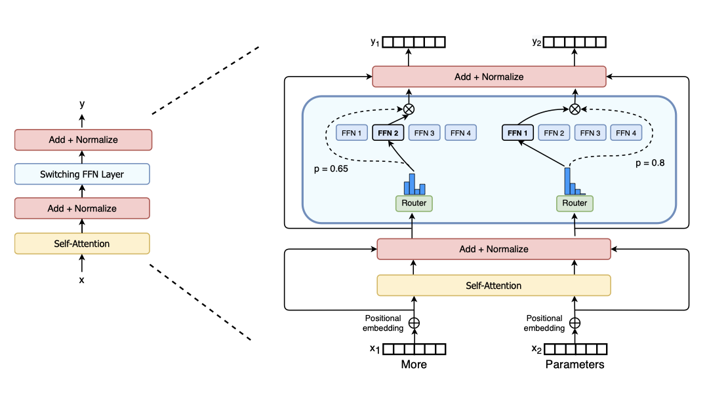
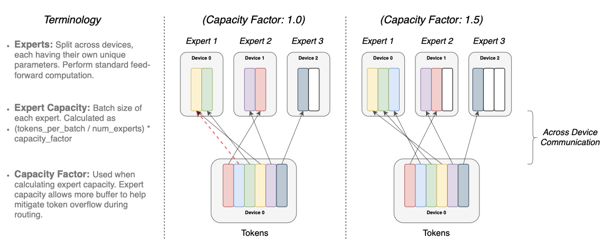
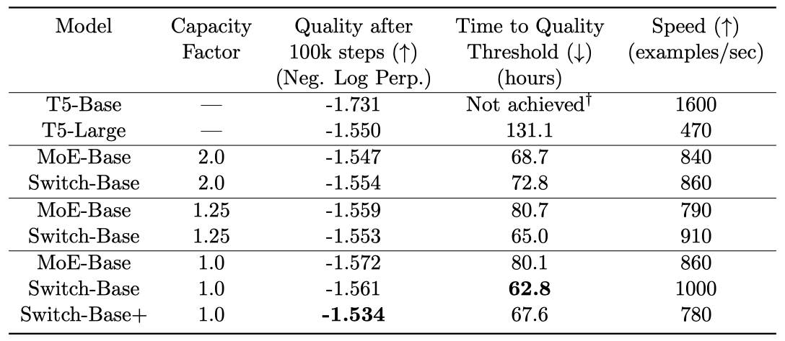
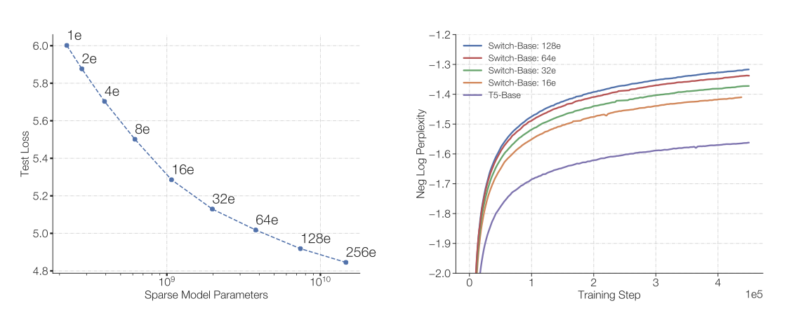
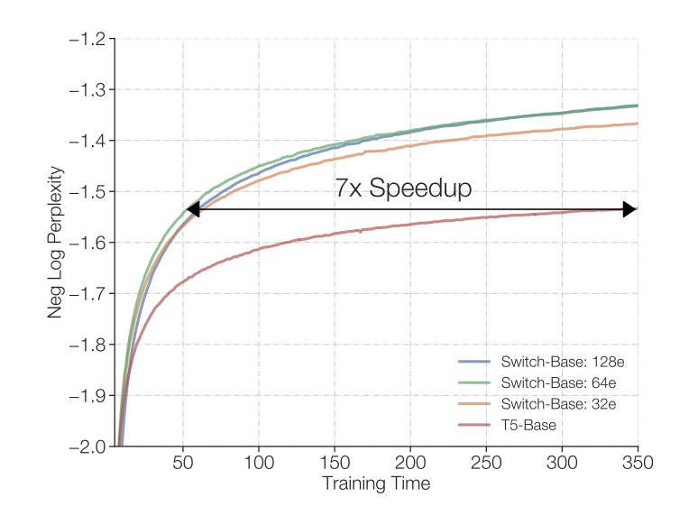
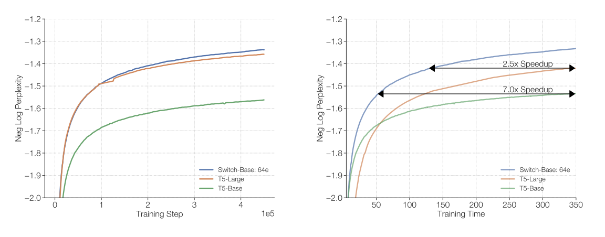
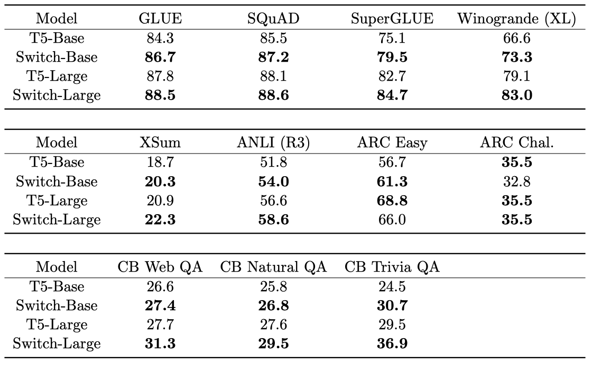
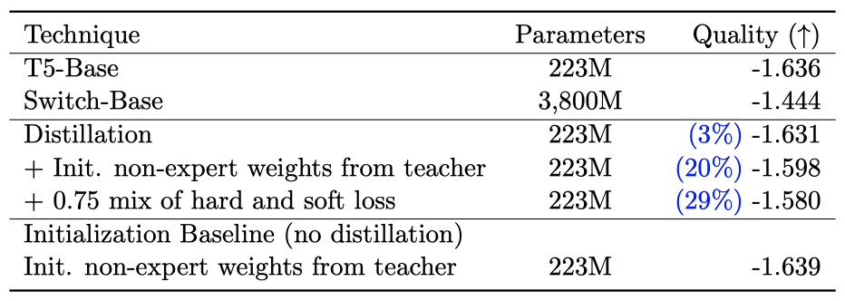
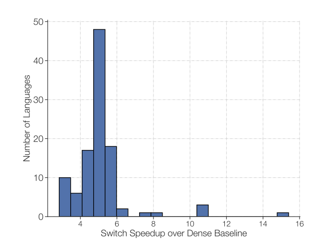
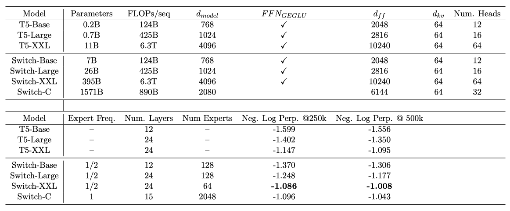

+++
author = "Kurt"
title = "Switch Transformers"
date = "2023-12-28"
description = "Scaling to Trillion Parameter Models with Simple and Efficient Sparsity"
categories = [
    "Paper Review"
]
tags = [
    "LLM",
    "Milestone",
]
+++

## Abstract

딥러닝에서 대부분의 모델은 동일한 parameter를 재사용하지만, Mixture of Experts (MoE) 모델은 각 입력에 대해 다른 parameter를 선택한다. 이로 인해 많은 parameter를 가진 sparsely-activated 모델이 만들어지지만, 계산 비용은 일정하다. 그러나 복잡성과 통신 비용, 학습의 불안정성 때문에 MoE는 널리 적용되지 못하였다.

이 문제를 해결하기 위해 Switch Transformer를 도입했고, MoE 라우팅 알고리즘을 단순화하고 통신 및 계산 비용을 줄인 개선된 모델을 설계하였다. 이를 통해 처음으로 lower precision(bfloat16)로 large sparse 모델을 학습시킬 수 있었다.

이러한 개선을 통해, 동일한 계산 자원을 사용하면서 사전 학습 속도를 최대 7배 향상시켰고, 모든 101개 언어에서 mT5-Base 버전보다 성능을 향상시켰다. 또한, 최대 1조 개의 parameter 모델을 사전 학습하여 언어 모델의 규모를 확장하였고, T5-XXL 모델보다 4배 빠른 속도를 달성하였다.

---

## Introduction

대규모 학습은 신경 언어 모델을 향상시키는 효과적인 방법으로 증명되었다. 그러나, 이는 계산적으로 매우 집약적이다. 따라서, 이와 같은 모델 규모의 성공에 영감을 받아, 더 큰 계산 효율성을 추구하며 sparsely-activated expert 모델인 Switch Transformer를 제안한다. 이는 각 들어오는 예제에 대해 신경망 가중치의 부분집합만을 활성화함으로써 이루어진다.

sparse 학습은 연구와 엔지니어링 분야에서 활발하게 진행되고 있지만, 현재 기계 학습 라이브러리와 hardware accelerator는 주로 dense matrix 곱셈에 초점을 맞추고 있다. 이에 대해, "Mixture-of-Expert (MoE)" 패러다임을 단순화하여 학습 안정성과 계산적 이점을 추구하였다. MoE 모델은 기계 번역 분야에서 성공을 거두었지만, 복잡성, 통신 비용, 학습 불안정성 등의 문제로 널리 채택되지는 못하고 있다.

이 연구에서는 알고리즘 문제를 해결하고 번역을 넘어서 자연어 분야에서의 광범위한 활용 가능성을 발견하였다. 사전 학습, 미세조정, 다중 작업 학습 등 NLP의 다양한 체제에서 우수한 확장성을 측정하였다. 또한 Switch Transformer 아키텍처는 슈퍼컴퓨터 뿐만 아니라 몇 개의 계산 코어에서도 효과적이며, 큰 희소 모델은 품질 향상의 30%를 유지하면서 밀집 버전으로 축소할 수 있음을 보여주었다.

이 논문의 기여는 다음과 같다:

* Mixture of Experts를 간소화하고 개선한 Switch Transformer 아키텍처.
* T5 모델에 대해 동일한 FLOPS 당 토큰을 사용하면서도 사전 학습 속도를 7배 이상 향상시킨 것을 확인하였다. 또한, expert가 두 명만 있는 계산 자원이 제한된 상황에서도 성능 개선이 가능하다는 것을 보여주었다.
* sparse 사전 학습 및 전문화된 미세조정 모델을 small dense 모델로 성공적으로 축소(distillation)하면서, 모델 크기를 최대 99%까지 줄이고, 동시에 sparse 모델의 품질 향상의 30%를 유지하였다.
* 사전 학습 및 미세조정 기법을 개선하였다: (1) bfloat16 precision으로 학습 가능한 selective precision 학습 (2) 더 많은 expert로 확장 가능한 초기화 방식 (3) sparse 모델의 미세조정 및 다중 작업 학습을 향상시키는 expert regularization 증가.
* 다국어 데이터에 대한 사전 학습의 이점을 측정했고, 이를 통해 모든 101개 언어에서 개선을 확인하였다. 또한, 91%의 언어에서 mT5 기준선에 비해 4배 이상의 속도 향상을 확인하였다.
* 데이터, 모델, expert-parallelism을 효율적으로 결합하여 최대 1 trillion 개의 parameter를 가진 모델을 만들어, 신경 언어 모델의 규모를 확장하였다. 이 모델들은 T5-XXL 기준선의 사전 학습 속도를 4배로 향상시켰다.

---

## Switch Transformer

Switch Transformers의 핵심 설계 원칙은 Transformer 모델의 parameter 수를 간단하고 효율적으로 최대화하는 것이다. 이는 모델 크기, 데이터 크기, 계산 비용과의 지수적 확장을 통해 규모의 이점을 극대화하는 방향으로 연구되었다. 특히, 상대적으로 적은 데이터에 대해 큰 모델을 학습시키는 것이 계산적으로 가장 이상적인 방법이라고 강조하고 있다.

the floating point operations (FLOPs) per example을 일정하게 유지하면서 parameter 수를 늘리는 방법을 연구하였다. 이는 parameter 수가 별도로 중요한 확장 축이라는 가설에 기반한다. GPU와 TPU와 같은 dense matrix 곱셈에 최적화된 하드웨어를 효율적으로 활용하는 sparsely activated 모델을 설계하였고, 이를 통해 모델의 가중치는 장치 수와 함께 증가하면서 각 장치에서 관리 가능한 메모리와 계산 비용을 유지할 수 있었다.

### Simplifying Sparse Routing

**Mixture of Expert Routing.** Shazeer et al. (2017)은 토큰 표현 $x$를 입력으로 받아 가장 적합한 상위 $k$개의 expert를 선택하는 자연어 Mixtureof-Experts (MoE) layer를 제안하였다. 이를 위해 라우터 변수 $W_r$은 logit $h(x) = W_r \cdot x$를 생성하고, 이는 해당 layer에서 가능한 $N$개의 expert에 대한 softmax 분포를 통해 normalize된다. 각 expert $i$에 대한 게이트 값은 특정 방식으로 주어진다.

$$ p_i(x) = {{e^{h(x)_i}}\over{\sum_j^N e^{h(x)_j}}} $$

토큰 $x$를 라우팅하기 위해 상위 $k$개의 게이트 값이 선택된다. 만약 $T$가 선택된 상위 $k$개의 인덱스 집합이라면, layer의 출력 계산은 게이트 값에 의해 토큰에 대한 각 expert의 계산의 선형 가중 조합이 된다.

$$ y = \sum_{i \in T} p_i(x) E_i(x) $$

**Switch Routing: Rethinking Mixture-of-Experts.** Shazeer et al. (2017)은 $k > 1$의 expert들로 라우팅하는 것이 중요하다고 주장했지만, 단 한 명의 expert로만 라우팅하는 단순화된 전략을 사용하였다. 이는 모델의 품질을 보존하고, 라우팅 계산을 줄이며, 더 나은 성능을 보여주었다. 이 $k = 1$ 라우팅 전략은 "Switch layer"라고 불리며, MoE와 스위치 라우팅 모두에서 라우터의 차별화를 가능하게 한다.

Switch layer의 이점은 세 가지이다: (1) 토큰을 단일 expert에게만 라우팅하기 때문에 라우터 계산이 줄어든다. (2) 각 토큰이 단일 expert에게만 라우팅되기 때문에 각 전문가의 batch size (expert capacity)는 적어도 절반으로 줄어들 수 있다. (3) 라우팅 구현이 단순화되고 통신 비용이 줄어든다. 

### Efficient Sparse Routing

분산 데이터 및 모델 병렬 아키텍처를 지원하는 Mesh-Tensorflow (MTF) 라이브러리를 사용한다. 이 라이브러리는 물리적인 코어 세트를 논리적인 프로세서 메시로 추상화하여 텐서와 연산을 차원별로 쉽게 파티셔닝할 수 있게 한다. 이 모델은 정적 크기를 필요로 하는 TPU를 염두에 두고 설계되었으며, 아래에서는 distributed Switch Transformer의 구현에 대해 설명한다.

**Distributed Switch Implementation.** 모든 텐서 형태는 컴파일 시간에 정적으로 결정되지만, 라우팅 결정 때문에 계산은 동적이다. 이로 인해, expert 용량 설정은 중요한 고려사항이다. expert 용량은 각 전문가가 계산하는 토큰의 수로, 배치의 토큰 수를 expert 수로 나누고, 용량 요인으로 더 확장하여 설정된다.

$$ \text{expert capacity} = \big( {\text{tokens per batch}\over{\text{number of experts}}} \big) \times \text{capacity factor} $$

용량 요인이 1.0보다 크면 토큰이 expert간에 완벽하게 균형되지 않을 때 추가 버퍼를 생성한다. 너무 많은 토큰이 한 expert로 라우팅되면 계산이 생략되고 토큰은 다음 레이어로 직접 전달된다. 그러나 expert 용량을 늘리는 것은 계산과 메모리 낭비를 초래할 수 있다. 드롭된 토큰의 비율을 줄이는 것이 sparse expert 모델의 확장에 중요하다는 것을 알아냈다. 보조 로드 밸런싱 손실을 사용하면 좋은 로드 밸런싱이 보장되며, 이러한 설계 결정이 모델의 품질과 속도에 미치는 영향을 연구하고 있다.

**A Differentiable Load Balancing Loss.** expert들 사이에 균형된 부하를 유도하기 위해 보조적인 손실을 추가한다. Switch Transformer는 별도의 로드 밸런싱과 importance-weighting 손실을 가진 원래의 설계를 단순화하였다. 각 스위치 layer에 대해, 이 보조적인 손실은 학습 동안 총 모델 손실에 추가되며, 이는 $N$개의 expert와 $T$개의 토큰이 있는 배치에 대해 벡터 $f$와 $P$ 사이의 스케일링된 dot-product으로 계산된다.

$$ loss = \alpha \cdot N \cdot \sum_{i=1}^N f_i \cdot P_i $$

여기서 $f_i$는 expert $i$에게 전달된 토큰의 비율이다.

$$ f_i = {{1}\over{T}} \sum_{x \in B} \mathbb{1} \lbrace \text{argmax} p(x) = i \rbrace $$

그리고 $P_i$는 expert $i$에 할당된 라우터 확률의 비율이다.

$$ P_i = {{1}\over{T}} \sum_{x \in B} p_i (x) $$

토큰 배치를 expert들 사이에 균등하게 라우팅하려고 하므로, 두 벡터는 $1/N$ 값을 가지게 된다. 보조 손실은 균일한 분포에서 최소화되므로 균일한 라우팅을 유도한다. 최종 손실은 expert 수에 비례하여 균일하게 유지되며, hyper-parameter $α$는 이 보조 손실에 대한 계수이다. $α = 10^{−2}$는 로드 밸런싱을 보장하면서도 주요 목표를 압도하지 않는 수준이었다. $α$의 범위를 다양하게 실험한 결과, $10^{−2}$가 학습 손실에 방해를 주지 않으면서도 빠르게 로드를 균형잡는 것을 확인하였다.

### Putting It All Together: The Switch Transformer

Switch Transformer의 첫 테스트는 "Colossal Clean Crawled Corpus" (C4)에 대한 사전 학습에서 시작한다. 모델은 누락된 토큰을 예측하도록 학습받는 masked language modeling 작업을 사용하며, 15%의 토큰을 드롭아웃하고 마스킹된 시퀀스를 단일 센티널 토큰으로 교체한다. 모델 비교를 위해, negative log perplexity를 기록한다.

Switch Transformer는 T5-Base와 계산량이 같으며, MoE Transformer는 각 토큰에 대해 별도의 FFN을 적용하는 두 개의 expert를 가지므로 FLOPS가 더 크다. 모든 모델은 동일한 하드웨어에서 동일한 스텝으로 학습되었다. 예상치 못하게, 용량 요인이 2.0에서 1.25로 변경된 MoE 모델은 속도가 느려졌다(840에서 790으로).

결과를 요약하면 다음과 같다: (1) Switch Transformer는 속도와 품질 면에서 조정된 밀집 모델과 MoE Transformer를 능가한다. (2) Switch Transformer는 MoE Transformer보다 작은 계산 부하를 가지며, 이 크기를 늘려 MoE Transformer의 학습 속도에 맞추면, 모든 MoE와 dense 모델을 능가한다. (3) Switch Transformer는 lower capacity factor(1.0, 1.25)에서 더 좋은 성능을 보이며, 이는 모델 메모리가 부족한 대형 모델 체제에서 유리하다.

### Improved Training and Fine-Tuning Techniques

Sparse expert 모델은 각 계층에서의 hard-switching(라우팅) 결정으로 인해 vanilla Transformer보다 학습이 어려울 수 있다. 또한, 저정밀 형식인 bfloat16은 라우터의 softmax 계산에서 문제를 악화시킬 수 있다. 이러한 학습 어려움을 극복하고 안정적이며 확장 가능한 학습을 달성하기 위한 방법들을 사용하고 있다.

**Selective precision with large sparse models.** 모델의 불안정성 때문에 효율적인 bfloat16 precision을 사용한 학습이 어렵다. 그러나 모델의 일부를 float32 precision으로 변환하면, 높은 통신 비용 없이 안정성을 달성할 수 있다. 이 방법은 더 높은 precision으로 일부 모델과 기울기 업데이트를 수행하는 혼합 정밀도 학습 전략과 일치한다. 이 접근법은 bfloat16 학습의 속도와 float32의 학습 안정성을 동시에 제공한다.

라우터 입력을 float32 precision으로 변환하여 안정성을 높인다. 라우터 함수는 토큰을 받아 expert 계산의 선택과 재결합에 사용되는 텐서를 생성한다. float32는 라우터 함수 내에서만 사용되며, 함수의 끝에서 텐서는 bfloat16으로 다시 변환된다. 이로 인해 비싼 float32 텐서의 전체 통신 비용은 피하면서, float32의 안정성을 활용할 수 있다.

**Smaller parameter initialization for stability.** 딥러닝에서 적절한 초기화는 성공적인 학습에 중요하며, 이는 특히 Switch Transformer에게 매우 중요하다. 가중치 행렬은 평균이 0이고 표준 편차가 $\sqrt{s}/n$인 잘린 정규 분포에서 요소를 추출하여 초기화된다. 여기서 $s$는 스케일 hyper-parameter이고, $n$은 가중치 텐서의 입력 단위 수이다.

불안정성을 줄이기 위해, default Transformer 초기화 스케일을 10분의 1로 줄이는 것이 품질 향상과 학습 불안정성 감소에 도움이 된다. 이 방법은 학습 초기에 모델 품질을 크게 향상시키고, 실행 간 분산을 크게 줄인다. 이 초기화 방식은 다양한 크기의 모델에 널리 적용될 수 있으며, 이 방법을 사용해 223M parameter의 작은 모델부터 1 trillion 개 이상의 parameter를 가진 거대한 모델까지 안정적으로 학습하였다.

**Regularizing large sparse models.** 이 논문은 큰 말뭉치에 대한 사전 학습 후 작은 downstream task에 대해 미세 조정하는 NLP 접근법을 다룬다. 미세 조정 작업이 적은 예제를 가지므로 과적합 문제가 발생할 수 있다. standard Transformer의 미세 조정에서는 각 layer에서 드롭아웃을 사용하여 과적합을 방지한다. 그러나 Switch Transformer는 더 많은 parameter를 가지므로, 작은 downstream task에서 더 심한 과적합이 발생할 수 있다.

"expert dropout" 이라는 방법을 제안하여 미세 조정 과정에서의 과적합 문제를 완화한다. 이 방법은 각 expert layer에서의 중간 계산에서 드롭아웃 비율을 크게 늘리는 것이다. 모든 layer에서 드롭아웃을 증가시키는 것은 성능을 악화시키지만, non-expert layer에서는 작은 드롭아웃 비율(0.1), expert layer에서는 큰 드롭아웃 비율(0.4)을 설정하면 성능이 향상된다.

---

## Scaling Properties

Switch Transformer 아키텍처의 스케일링 특성에 대한 연구를 수행하였다. 계산력이나 데이터 양에 제한받지 않는 상황에서, 180B 개의 타겟 토큰을 가진 C4 코퍼스를 사용해 효과가 줄어들 때까지 학습시켰다.

가장 효율적으로 스케일링하는 차원은 "expert의 수"이다. expert의 수를 늘려도 토큰당 한 명의 expert만 선택하기 때문에 계산 비용은 대체로 고정된다. 라우터는 더 많은 expert들에 대한 확률 분포를 계산해야 하지만, 이는 상대적으로 가벼운 계산 작업이다.

### Scaling Results on a Step-Basis

많은 expert(parameter)를 가질수록 학습이 가속화되는 트렌드를 보여준다. sparse 모델 parameter를 확장하면 스케일링 이점이 있으며, expert 수를 늘릴수록 모델은 더 효율적으로 샘플을 처리한다. 특히, Switch-Base 64 expert 모델은 T5-Base 모델보다 학습 단계 시간이 7.5배 빠르며, 더 큰 모델이 고정된 토큰 수를 더 빠르게 학습한다는 것을 확인하였다.

### Scaling Results on a Time-Basis

expert 수를 늘릴수록 성능이 계속 향상된다는 것을 보여준다. 그러나 Switch Transformer 모델은 추가적인 통신 비용과 라우팅 계산이 필요하므로, 단계별 샘플 효율성의 향상이 실제 시간에 따른 모델 품질 개선으로 이어지지는 않는다. 따라서, 제한된 학습 시간과 계산 비용 내에서 dense 모델을 학습할 것인지 아니면 sparse 모델을 학습할 것인지에 대한 질문이 제기된다.

고정된 학습 기간과 계산 예산에 대해, Switch Transformer는 상당한 가속화를 제공한다. 이 설정에서, Switch-Base 64 expert 모델은 T5-Base가 유사한 perplexity를 얻는 데 걸리는 시간의 일곱 분의 일 동안 학습한다.

### Scaling Versus a Larger Dense Model

계산적으로 매칭된 dense 모델은 Switch Transformer에 비해 느리다. 만약 리소스를 더 큰 dense 모델에 할당했다면, T5-Large 모델이 토큰 당 3.5배 더 많은 FLOPs를 적용하더라도, Switch-Base는 더 효율적이며 2.5배의 가속화를 제공한다. 더 큰 sparse희소 버전인 Switch-Large를 디자인하면 더 많은 이익을 얻을 수 있으며, 이는 스케일링과 미세 조정에서 우수한 성능을 보여준다.

---

## Downstream Results

Switch Transformer는 사전 학습 동안 우수한 스케일링 특성을 보여주었다. 이제 이런 이점이 다양한 NLP 작업에서 언어 학습 능력을 개선하는 데 활용될 수 있는지 검증한다. 또한, sparse 모델의 메모리 사용량을 90% 이상 줄이는 방법을 연구하였고, 마지막으로, Switch Transformer가 101개 언어에서 다국어 T5-Base 모델을 개선하는 강력한 다중 작업 학습자임을 입증하였다.

### Fine-Tuning

**Baseline and Switch models used for fine-tuning.** 223M parameter T5-Base와 739M parameter T5-Large 모델을 기준으로, 많은 parameter를 가진 Switch Transformer를 설계하였다. 이 모델은 텍스트 복제가 제거된 개선된 C4 코퍼스에서 사전 학습되었다. 학습 프로토콜은 batch 당 약 1,048,576 토큰으로 550k step을 진행하며, 총 576B 토큰을 사용한다. 다양한 작업 세트에서 미세 조정을 진행하며, 드롭아웃 비율은 대부분의 layer에서 0.1, Switch layer에서는 0.4로 설정되었다. 미세 조정은 1M의 배치 크기로 16k 단계를 진행하였고, 모든 작업에 대해 200 step마다 최고 성능을 평가하여 보고하였다.

**Fine-tuning tasks and data sets.** 질문 응답, 요약, 세계에 대한 지식 등의 언어 능력을 평가하는 다양한 작업을 선택하였다. GLUE와 SuperGLUE 벤치마크를 활용하며, 이들은 감정 분석, 단어 의미 판별, 문장 유사도, 자연 언어 추론 등을 포함하는 다양한 작업으로 구성되어 있다. 기사 요약 능력은 CNNDM과 BBC XSum 데이터 세트로 측정하며, 질문 응답 능력은 SQuAD 데이터 세트와 ARC Reasoning Challenge로 조사한다. 또한, Natural Questions, Web Questions, Trivia QA 등의 데이터 세트를 통해 모델의 지식을 평가한다. 상식적 추론 능력은 Winogrande Schema Challenge로 평가하며, 자연 언어 추론 능력은 Adversarial NLI Benchmark로 테스트한다.

**Fine-tuning metrics.** 이 논문에서는 평가 지표로 GLUE와 SuperGLUE의 모든 하위 작업에 대한 평균 점수, CNNDM과 XSum에 대한 Rouge-2 지표, SQuAD와 closed book 작업에서 대상과 정확히 일치하는 답변의 비율, 그리고 ARC Easy, ARC Challenge, ANLI, Winogrande에서 생성된 응답의 정확성을 사용한다.

**Fine-tuning results.** 다양한 자연 언어 작업에서 중요한 향상을 보았다. 특히, SuperGLUE, Winogrande, closed book Trivia QA, XSum에서 눈에 띄는 향상이 있었다. 반면, AI2 Reasoning Challenge (ARC) 데이터 세트에서는 T5-Base와 T5-Large가 각각 Switch-Base와 Switch-Large를 능가하는 결과를 보여주었다. 전반적으로, Switch Transformer 아키텍처는 추론과 지식 중심의 작업 모두에서 향상을 가져오며, 이는 잘 사전 학습되고 미세 조정을 통해 downstream task의 품질을 향상시킬 수 있다는 것을 입증한다.

### Distillation

수십억 또는 수조의 parameter를 가진 대규모 신경망 배포는 복잡하다. 이 문제를 해결하기 위해, large sparse 모델을 small dense 모델로 압축하는 연구를 진행하고 있다. 미래에는 대규모 모델을 smaller sparse 모델로 압축(distilling)하는 연구도 가능할 것이다.

**Distillation techniques.** 다양한 모델 압축 기법을 연구하였다. 이 기법들은 BERT 모델에 대한 압축 방법을 연구한 Sanh et al. (2019)의 연구를 기반으로 한다. non-expert weight로 dense 모델을 초기화하면 소폭의 향상이 있었고, teacher의 확률 0.25와 실제 라벨 0.75의 혼합을 사용하여 압축 향상을 관찰하였다. 이 두 기법을 결합하여 parameter의 약 1/20만 사용하여 large sparse 모델로부터 얻는 품질 향상의 약 30%를 유지하였다. 이는 student 모델이 teacher 모델의 성능에 근접함을 의미한다.

**Achievable compression rates.** 최적의 압축 기법을 사용해 다양한 sparse 모델을 dense 모델로 압축하였다. 1.1B부터 14.7B까지의 parameter를 가진 SwitchBase 버전을 압축하며, 이 과정에서 1.1B parameter 모델의 품질 향상의 37%를 유지하면서 82%를 압축하였다. 모델을 99% 압축한 극단적인 경우에도, teacher 모델의 품질 향상의 28%를 유지할 수 있었다.

**Distilling a fine-tuned model.** 미세 조정된 sparse 모델을 dense 모델로 압축하는 연구를 통해, 7.4B parameter의 Switch-Base 모델을 SuperGLUE 작업에 미세 조정하고 223M의 T5-Base로 압축한 결과를 제시하였다. 이 결과는 FLOP 매치된 dense variant로 압축할 때 sparse 모델의 향상 중 30%를 보존할 수 있음을 보여준다. 미래의 연구 방향 중 하나는 미세 조정 작업에 사용되는 specific expert를 검토하고 추출하여 더 나은 모델 압축을 달성하는 것일 수 있다.

### Multilingual Learning

101개의 다른 언어를 혼합하여 사전 학습하면서 모델 품질과 속도의 상충 관계를 측정하는 마지막 downstream 실험을 수행하였다. 이는 mT5의 최신 연구를 기반으로 하며, 101개 언어를 포함하는 Common Crawl 데이터 세트의 다중 언어 버전에서 사전 학습이 진행되었다. 그러나 특정 언어의 스크립트 변형으로 인해, 혼합 작업은 총 107개가 되었다.

Switch 모델과 T5 base variant 간의 모든 언어의 품질 향상을 보여주며, 이는 모든 101개 언어에서 Switch Transformer가 기준선을 넘는다는 것을 보여준다.

 mT5-Base에 비해 Switch Transformer를 사용할 때 단계별 속도 향상을 보여주며, 평균 속도 향상이 5배이고 91%의 언어에서 적어도 4배의 속도 향상을 보인다는 것을 보여준다. 이는 Switch Transformers가 효과적인 다중 작업 및 다중 언어 학습 도구임을 입증한다.

---

## Designing Models with Data, Model, and Expert-Parallelism

expert의 수를 무작정 늘리는 것은 수익 감소의 법칙에 따라 효과가 줄어든다. 이를 보완하기 위해 Transformer는 차원을 함께 증가시키는 방식으로 스케일링하는데, 이는 parameter와 연산량을 증가시키지만 가속기의 메모리에 제한된다. 메모리 한계를 초과하면, 단일 프로그램 다중 데이터(Single Program Multiple Data, SPMD) 모델 병렬화를 사용할 수 있으며, 이 방법은 데이터, 모델, expert-parallelism의 트레이드오프를 고려해야 한다.

**Reviewing the Feed-Forward Network (FFN) Layer.** Mesh TensorFlow에서 데이터, 모델, expert-parallelism을 이해하기 위해 FFN layer을 예로 들어 설명한다. batch의 각 토큰은 $d_{model}$의 차원을 가지며, FFN의 입력과 출력은 $[B, d_{model}]$ 크기, 중간값은 $[B, d_{ff}]$ 크기이다. $N$에서 중간값은 $h = xW_{in}$을 계산하고, 이를 ReLU 함수에 적용해 $y = ReLU(h)W_{out}$를 얻는다. $W_{in}$과 $W_{out}$은 각 토큰에 독립적으로 적용되며, 크기는 각각 $[d_{model}, d_{ff}]$와 $[d_{ff}, d_{model}]$이다.

Mesh TensorFlow는 사용 가능한 모든 코어를 프로세서의 논리적 다차원 메시로 재매핑한다. 데이터 병렬 샤딩과 모델 병렬 샤딩을 통해 코어를 나눈다. 각 코어는 $B/n$ 토큰을 포함하며, $d_{ff}$를 가진 텐서와 변수들이 모델 병렬 코어에 샤드된다. variants with experts-layers 의 경우, 최대 $C$ 토큰을 처리할 수 있는 $E$개의 expert를 고려한다.

### Data Parallelism

데이터 병렬 모델 학습은 분산 학습의 표준이며, 모든 코어가 데이터 병렬 차원에 할당된다$(n = N, m = 1)$. 이 방식의 장점은 gradient를 모든 코어에 집계해야 할 때까지 전체 forward 및 backward pass가 완료될 때까지 통신이 필요하지 않다는 것이다.

### Model Parallelism

모든 코어가 모델 병렬 차원에 할당되는 시나리오를 고려하면, 모든 코어는 전체 $B$ 토큰을 유지하고, 가중치의 고유한 부분을 포함한다. 각 forward 및 backward pass마다 통신 비용이 발생하며, $d_ff$$ 차원이 분할되어 합산해야 하기 때문에 각 코어는 $[B, d_{model}]$ 텐서를 전송한다. 코어 간에 분할된 차원이 합산되어야 하면, forward 및 backward pass 모두에 all-reduce 연산이 추가된다. 이는 순수 데이터 병렬화와의 대조로, 데이터 병렬화에서는 all-reduce가 전체 forward 및 backward pass가 끝난 후에만 발생한다.

### Model and Data Parallelism

대규모 모델에서는 모델 병렬화와 데이터 병렬화를 혼합하여 사용하는 것이 일반적이다(T5, GPT-3). 총 $N = n \times m$ 코어를 사용할 때, 각 코어는 $B/n$ 토큰과 가중치 및 중간 활성화의 $d_{ff} /m$를 처리하게 된다. forward 및 backward pass에서 각 코어는 크기가 $[B/n, d_{model}]$인 텐서를 all-reduce 연산에서 통신한다.

### Expert and Data Parallelism

Switch Transformer는 모든 코어를 데이터 분할 차원에 할당하며, 이는 모델의 expert 수와 일치한다. 각 코어는 토큰마다 expert에 대한 할당을 계산하고, 결과는 $[n, B/n, E, C]$ 크기의 이진 행렬이다. 이 행렬은 첫 번째 차원에서 분할되어 expert 할당을 결정하며, $[n, B/n, d_{model}]$ 크기의 입력 텐서와 행렬 곱셈을 통해 수집에 사용된다.

$$ einsum([n, B/n, d_{model}], [n, B/n, E, C], dimension = [B/n]) $$

최종 텐서는 $[n, E, C, d_{model}]$ 형태를 가지며 첫 번째 차원에서 샤드된다. 각 코어는 자체 전문가를 가지고 있어, $n$ 차원 대신 $E$ 차원을 샤드하기 위해 $[E, C, d_{model}]$ 크기의 all-to-all 통신을 진행한다. forward pass에서는 다른 코어에 위치한 각 전문가로부터 토큰을 받기 위해 $E × C × d_{model}$ 크기의 추가 통신 비용이 발생한다.

### Expert, Model and Data Parallelism

이 논문의 최적 모델 설계는 토큰 당 FLOPS와 parameter 수를 균형있게 유지하려 한다. expert 수를 늘리면 parameter 수는 증가하지만 토큰 당 FLOPs는 변하지 않는다. FLOPs를 늘리려면 $d_{ff}$ 차원도 증가해야 하는데, 이는 코어 당 메모리 부족으로 이어질 수 있다. 이 때문에 $m$을 증가시키고, 고정된 코어 수 $N = n × m$에 따라 $n$을 줄이게 되며, 이는 더 작은 배치 크기를 사용하게 된다.

model-parallelism과 expert-parallelism를 결합하면 토큰 라우팅과 model-parallelism로 인한 내부 통신에 따른 all-to-all 통신 비용이 발생한다. FLOPS, 통신 비용, 코어 당 메모리의 균형을 맞추는 것은 이 세 가지 방법을 모두 결합할 때 복잡해진다. 최적의 매핑은 경험적으로 결정된다.

### Towards Trillion Parameter Models

expert, 모델, 데이터 병렬화를 결합하여, 395B 개와 1.6 trillion 개의 parameter를 갖는 두 개의 large Switch Transformer 모델을 설계하였다. 이 모델들은 언어 모델로서의 사전 학습과 미세 조정 성능에서 어떻게 수행하는지를 연구하였다.

Switch-C 모델은 expert-parallelism만을 사용하여 설계되었고, 이로 인해 hyper-parameter의 크기는 T5-XXL 모델보다 훨씬 작다. 반면, Switch-XXL은 T5-XXL 모델과 FLOP이 일치하도록 설계되었는데, 이로 인해 hyper-parameter의 차원은 더 크지만 model-parallelism로 인한 추가 통신 비용이 발생한다.

**Sample efficiency versus T5-XXL.** 250k step 후에는 두 Switch Transformer 모델 모두가 T5-XXL의 negative log perplexity를 0.061 이상 개선하였다. 이 차이는 추가 학습으로 계속 증가하며, 500k step에서 Switch-XXL 모델이 T5-XXL을 0.087로 앞서게 된다.

**Training instability.** large sparse 모델은 때때로 불안정하며, 이 문제는 규모를 증가시킬수록 발생한다. 1.6T의 parameter와 2048개의 expert를 가진 큰 Switch-C 모델은 학습에서 불안정성이 없지만, 시퀀스당 FLOPs가 10배 더 큰 Switch XXL 버전은 때때로 불안정하다. 따라서 이는 더 나은 모델이지만, T5의 결과에 따라, 전체 1M 단계를 사전 학습하지 않는다.

**Reasoning fine-tuning performance.** 503B 토큰에 대해 부분적으로 사전 학습된 Switch-XXL 모델을 사용하여 모델 품질의 예비 평가를 실시하였다. 이 모델을 사용하여 모든 작업을 공동으로 학습하는 멀티 태스크 학습을 실시하면 SQuAD의 검증 세트에서 정확도가 89.7로 증가하였다. 그리고 평균 SuperGLUE 테스트 점수는 87.5로, ANLI에서는 이전 state-of-the-art에 비해 65.7의 정확도를 얻었다. 하지만 SwitchXXL의 이득이 아직 완전히 state-of-the-art downstream 성능으로 전환되지 않았다는 점을 알 수 있다. 

**Knowledge-based fine-tuning performance.** Salient Span Masking을 사용하여 추가 사전 학습 없이 세 가지 closed-book 지식 기반 작업(Natural Questions, WebQuestions, TriviaQA)을 통해 모델의 지식을 초기에 검토하였다. 이 모든 경우에서 이전 state-of-the-art T5-XXL 모델보다 개선된 결과를 관찰하였다. Natural Questions는 32.8에서 34.4로, Web Questions는 37.2에서 41.0으로, TriviaQA는 42.9에서 47.5로 정확도가 상승하였다.

다른 모델의 절반 이하의 데이터로 학습에도 불구하고, 이미 비교가 가능하거나 state-of-the-art의 모델 품질을 발견하였다. 현재 Switch Transformer는 추론 작업보다 지식 기반 작업에 더 큰 이득을 가져다 준다. large expert 모델에서 더 강력한 미세 조정 성능을 추출하는 것은 현재 활발히 연구 중이며, 사전 학습의 perplexity는 미래에 개선이 가능함을 보여준다.

---

## Related Work

신경망 규모의 중요성은 잘 알려져 있으며, 이를 확장하는 다양한 방법이 제안되었다. 최근 연구에서는 모델 병렬화를 통해 수십억 개의 parameter로 모델을 확장하였다. 다른 방법으로는 파이프라인 기반 모델 병렬화가 있는데, 이는 다른 layer를 장치에 분할하고 micro-batch를 다른 layer로 파이프라인하는 방식이다. 마지막으로, Product Key 네트워크는 신경망의 용량을 확장하기 위해 들어오는 토큰 표현에 기반한 학습 가능한 임베딩을 조회하는 방식을 제안하였다.

이 연구는 입력에 따라 계산을 동적으로 결정하는 조건부 계산 방법을 사용하는 특정 모델을 연구한다. Cho and Bengio(2014)는 모델의 은닉 상태에서 발생하는 특정 비트 패턴에 따라 가중치를 선택하였고, Eigen et al. (2013)은 dense matrix 곱셈과 ReLU 활성화를 이용한 expert layer를 구축하여 MNIST와 음성 데이터에서 좋은 결과를 보여주었다. 또한, Puigcerver et al. (2020)은 upstream 사전 학습에서 의미론적 클래스에 따라 토큰을 수동으로 라우팅하고, downstream task에 따라 관련 expert를 선택하였다.

Mixture of Experts (MoE)은 딥러닝 아키텍처에서 효과적이라는 것이 Shazeer et al. (2017)의 연구를 통해 증명되었다. 그들은 LSTM layer 사이에 MoE layer를 추가하고, 토큰을 expert의 조합에 따라 분리하여 언어 모델링과 기계 번역에서 state-of-the-art를 달성하였다. Mesh Tensorflow 라이브러리는 이 MoE layer를 Transformer 아키텍처로 도입했고, GShard는 이를 확장하여 100개 언어의 기계 번역을 크게 개선하였다. 마지막으로 Fan et al. (2021)은 결정론적 MoE 전략을 통해 모델 parameter를 언어 그룹으로 분할하였다.

Transformer의 attention 패턴에서 시퀀스 길이 차원의 sparsity는 attention complexity를 줄이는 데 성공적이었다. 이는 이전보다 더 긴 시퀀스를 학습하는 것을 가능하게 하였다. 현재 버전의 Switch Transformer는 attention sparsity를 사용하지 않지만, 이 기법들은 서로 보완적이며, 이를 결합하면 긴 컨텍스트를 필요로 하는 작업에서 학습 향상이 가능할 것이다.

---

## Discussion

Switch Transformer와 일반적으로 sparse expert 모델에 대한 질문을 제기하고 논의한다. 여기서 sparsity는 attention 패턴이 아닌 가중치를 참조한다.

**Isn’t Switch Transformer better due to sheer parameter count?** 총 FLOPs와 무관하게 parameter는 신경 언어 모델을 확장하는데 유용하며, 큰 모델이 더 나은 성능을 내는 것이 입증되었다. 하지만 이 경우, Switch Transformer 모델은 같은 계산 자원을 사용하면서 더 효율적이고 빠르게 작동한다.

**I don’t have access to a supercomputer—is this still useful for me?** 이 연구는 매우 큰 모델에 중점을 두었지만, expert가 단 두 명인 모델도 성능을 향상시키며 일반적으로 이용 가능한 GPU나 TPU의 메모리 제약 내에서 적용할 수 있음을 확인하였다. 따라서 이 기법은 소규모 환경에서도 유용하다고 생각한다.

**Do sparse models outperform dense models on the speed-accuracy Pareto curve?** 다양한 모델 크기에 걸쳐, sparse 모델은 dense 모델보다 단계별로, 그리고 실제 시간에 대해 더 우수한 성능을 보여준다. 통제된 실험에서는 일정한 계산량과 시간에 대해 sparse 모델이 조밀 모델을 능가한다.

**I can’t deploy a trillion parameter model—can we shrink these models?** 모델의 품질을 완전히 유지할 수는 없지만, sparse 모델을 dense 모델로 압축하면서 10배에서 100배의 압축률을 달성할 수 있으며, 이는 expert 모델의 품질 향상의 약 30%를 달성한다.

**Why use Switch Transformer instead of a model-parallel dense model?** 시간적으로 보면, Switch Transformer는 parameter가 샤딩된 조밀한 모델보다 훨씬 효율적이다. 이는 상호 배타적인 결정이 아니며, Switch Transformer에서는 model-parallelism을 사용하여 토큰당 FLOPs를 늘리지만, 전통적인 model-parallelism의 느림을 겪는다.

**Why aren’t sparse models widely used already?** sparse 모델을 시도하는 동기는 dense 모델의 확장의 큰 성공 때문에 방해받았다. sparse 모델은 모델의 복잡성, 학습의 어려움, 통신 비용 등 여러 문제를 겪어왔다. 하지만 Switch Transformer는 이런 문제들을 완화하는 방향으로 발전하고 있다.

---

## Future Work

이 논문은 간소화된 아키텍처, 개선된 학습 절차, 그리고 sparse 모델이 어떻게 확장되는지에 대한 연구를 제시한다. 그러나 여기에서 간단하게 설명하는 것처럼, 여전히 많은 미래의 방향성이 열려 있다:

1. 가장 큰 모델들의 학습 안정성 향상이 중요한 도전 과제입니다. 우리의 안정성 기법은 Switch-Base, Switch-Large, Switch-C 모델에는 효과적이었지만, Switch-XXL에는 부족했습니다. 이러한 모델을 안정화하기 위한 초기 단계를 밟았으나, 아직 해결되지 않은 문제가 남아 있습니다.

2. 일반적으로 향상된 사전 학습 품질이 downstream 결과를 개선시킨다는 것을 발견하였다. 그러나 때로는 예상치 못한 이상현상을 발견하기도 한다. 예를 들어, 비슷한 perplexity에도 불구하고 1.6T parameter의 Switch-C는 SQuAD에서 87.7의 정확도를 달성했는데, 이는 더 작은 Switch-XXL 모델의 89.6에 비해 불리하다. 이는 미세 조정 품질, 토큰당 FLOPS, 그리고 parameter 수 사이의 잘 이해되지 않은 의존성을 시사한다.

3. 데이터, 모델, expert-parallelism을 결합한 아키텍처 설계를 위한 확장 관계에 대한 종합적인 연구가 필요하다. 이상적으로 하드웨어 구성의 스펙에 따라 최적의 모델을 빠르게 설계할 수 있어야 하며, 이는 미래의 하드웨어 설계에도 도움이 될 것이다.

4. 이 연구는 적응형 계산 알고리즘에 속하며, 항상 동일한 expert를 사용하였다. 그러나 더 유연한 인프라를 통해 미래의 설계는 다양한 expert를 지원할 수 있으며, 이것은 더 많은 계산이 필요한 경우 더 큰 expert로 라우팅하여 더 유연하게 적응할 수 있게 한다.

5. Transformer의 FFN layer 외부의 expert layer을 조사하였고, 이것이 모델 품질을 향상시킬 수 있다는 초기적인 증거를 발견하였다. 하지만 bfloat16 형식으로 학습 시 불안정성 때문에 이 부분에 대한 추가 연구는 미래의 작업으로 남겨두었다.

6. 언어 외에도 새로운 모달리티와 다양한 모달리티에서 Switch Transformer를 검토하고 있다. 모델의 sparsity가 새로운 모달리티와 다중 모달 네트워크에서도 비슷한 이점을 가져다 줄 것이라고 믿는다.

이 목록은 쉽게 확장될 수 있지만, 고민하고 있는 문제 유형과 앞으로 유망한 방향성에 대한 감을 제공하기를 바란다.

---

## Conclusion

Switch Transformer는 확장 가능하고 효과적인 자연어 학습 모델로, expert들의 혼합을 간소화하여 효율적인 아키텍처를 만들었다. 이 모델은 다양한 자연어 작업과 학습 체제에서 우수한 성과를 보이며, dense T5와 비교해 상당한 속도 향상을 이루었다. 이 연구가 sparse 모델이라는 효과적인 아키텍처에 대한 관심을 증가시키고, 더 넓은 범위에서 이러한 유연한 모델을 고려하도록 하기를 바란다.

---

## Reference

* [Paper](https://arxiv.org/pdf/2101.03961.pdf)
* [Github](https://github.com/kyegomez/SwitchTransformers)