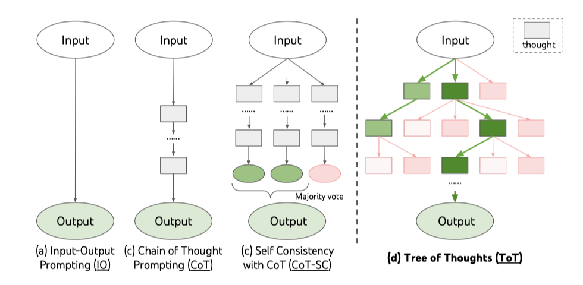
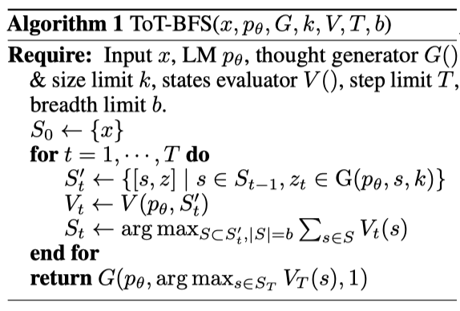
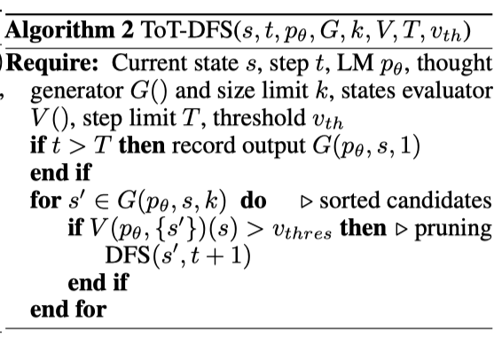
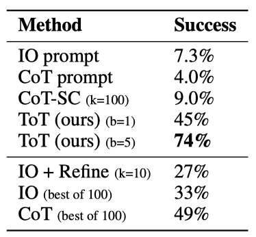
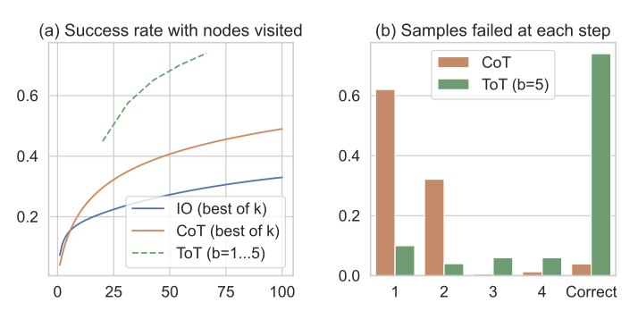
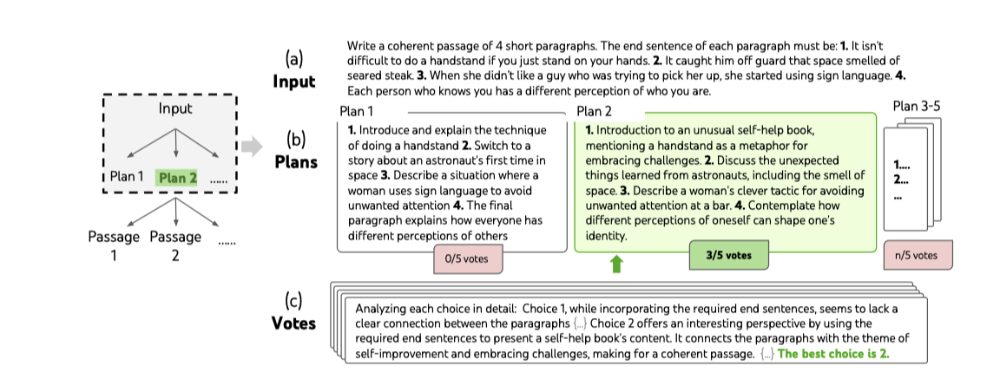
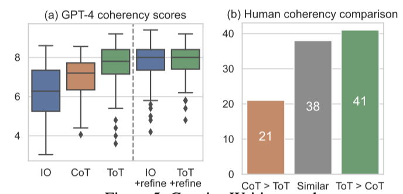
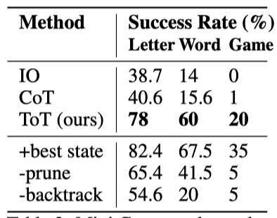

+++
author = "Kurt"
title = "Tree of Thoughts"
date = "2024-04-04"
description = "Deliberate Problem Solving with Large Language Models"
categories = [
    "Paper Review"
]
tags = [
    "LLM",
    "Milestone",
]
+++

## Abstract

언어 모델의 추론 과정에서 발생하는 한계를 극복하기 위해 "Tree of Thoughts(ToT)" 프레임워크를 소개한다. 이는 문제 해결 과정에서 다양한 이유 경로를 탐색하고 선택을 자가 평가하는 방식을 가능하게 하여, 복잡한 계획이나 탐색이 필요한 작업에서 언어 모델의 성능을 크게 향상시킨다. 예를 들어, 24 게임에서 GPT-4의 성공률이 4%에서 ToT를 사용함으로써 74%로 대폭 상승했습니다.

---

## Introduction

GPT와 PaLM 같은 확장된 언어 모델들은 다양한 추론 과제를 수행하는 능력을 보여주고 있음에도, 이 모델들이 기반하는 원리는 단순한 autoregressive generating text 메커니즘이다. 이러한 단순한 메커니즘이 모든 종류의 문제 해결에 충분한지, 그리고 현재의 접근 방식에 도전할 만한 문제와 대안적 메커니즘이 무엇일지에 대한 질문이 제기된다.

"dual process" 모델 연구는 결정 과정에 빠르고 무의식적인 "시스템 1"과 느리고 신중한 "시스템 2"의 두 가지 모드가 있다고 제안한다. 이 이론은 언어 모델의 단순한 토큰 선택 방식을 "시스템 1"과 연관시키며, 더 신중한 "시스템 2" 계획 과정으로 보완하는 것이 유익할 수 있음을 시사한다. 이는 현재 선택에 대한 다양한 대안을 탐색하고, 더 글로벌한 결정을 위해 현재 상태를 평가하는 방식을 포함한다.

1950년대 뉴얼, 쇼, 사이먼의 연구에서 영감을 받아, 언어 모델을 활용한 Tree of Thoughts (ToT) 프레임워크를 제안한다. 이 프레임워크는 문제 해결 과정에서 중간 단계로서의 생각들을 나무 구조로 관리하며, 언어를 통한 자가 평가를 통해 문제 해결에 대한 진전을 신중하게 추론한다. 이는 새로운 탐색 휴리스틱의 접근 방식이며, 너비 우선 탐색(BFS) 또는 깊이 우선 탐색(DFS)과 같은 알고리즘을 통해 생각의 나무를 체계적으로 탐색한다.

GPT-4조차 해결하기 어려운 24 게임, 창의적 글쓰기, 크로스워드 등 새로운 세 가지 문제를 제안한다. 이 작업들은 다양한 추론 능력과 체계적 계획 및 탐색을 필요로 한다. Tree of Thoughts (ToT) 방식을 통해, 이러한 문제들에 대하여 다양한 수준의 생각과 탐색 알고리즘을 적용함으로써 우수한 성능을 보여주었다. 또한, 선택적 접근법이 모델 성능에 미치는 영향을 분석하고, 향후 LMs의 학습과 사용을 개선하기 위한 방향을 논의한다.

---

## Background

대규모 언어 모델(LM)을 사용한 문제 해결 방법을 정식화하고, 이를 바탕으로 접근법을 개발하고 비교한다. 여기서 사전 학습된 LM($p_{\theta}$)과 언어 시퀀스(x, y, z)를 정의하고, 이를 통해 언어 시퀀스의 확률을 계산한다. 또한, 언어 시퀀스의 집합을 대문자(S)로 표현한다.

**Input-output (IO) prompting**은 LM을 사용해 입력 x를 출력 y로 변환하는 방법이다. 이 과정에서, 입력 x는 작업 지시와 few-shot 예제로 구성된 프롬프트로 둘러싸이며, 이를 통해 변환된 출력 y는 $p_{\theta}^{IO} (y|x)$로 표현된다.

**Chain-of-thought (CoT) prompting**은 복잡한 문제(예: 수학 문제)의 입력 x에서 출력 y로의 매핑을 위해 제안된 방법이다. 이 방법은 x와 y를 연결하는 중간 생각들 $z_i$를 도입하여 문제 해결 과정을 단계별로 설명한다. 각 $z_i$는 순차적으로 샘플링되며, 최종적으로 출력 y가 생성된다. 이 과정은 연속적인 언어 시퀀스로 처리되며, 생각들의 구체적인 형태(구, 문장, 단락 등)는 명확히 정의되지 않는다.

**Self-consistency with CoT (CoT-SC)**은 여러 개의 독립적인 생각의 연쇄를 샘플링하여 가장 자주 나타나는 출력을 선택하는 방식이다. 이는 같은 문제에 대해 여러 가지 생각 과정이 가능함을 고려하여 CoT 방법을 개선한 것으로, 더 다양한 생각을 탐색함으로써 더 신뢰할 수 있는 결정을 내릴 수 있다. 그러나, 각 연쇄 내에서는 다양한 생각 단계의 탐색이 이루어지지 않으며, 이 방법은 출력 옵션이 제한적인 경우(예: 다중 선택형 질문)에 효과적이다.

---

## Tree of Thoughts: Deliberate Problem Solving with LM

> A genuine problem-solving process involves the repeated use of available information to initiate exploration, which discloses, in turn, more information until a way to attain the solution is finally discovered. (Newell et al.)

인간 문제 해결 연구에 따르면, 사람들은 부분 해결책을 나타내는 노드와 이를 수정하는 연산자로 구성된 조합 문제 공간을 탐색한다. 이 과정에서 어떤 방향으로 나아갈지는 문제 공간을 안내하는 휴리스틱에 의해 결정된다. 이는 언어 모델을 사용한 일반 문제 해결 방식이 가지는 두 가지 주요 단점을 드러낸다: 1) 지역적으로 다양한 생각의 연속을 탐색하지 못하고, 2) 전역적으로 계획, 선견지명, 되돌아가기 등 인간 문제 해결에서 보이는 휴리스틱 가이드 검색을 포함하지 않는다.

언어 모델이 다양한 추론 경로를 탐색할 수 있게 하는 Tree of Thoughts(ToT) 패러다임은 문제를 입력과 현재까지의 사고 연속을 포함하는 부분 해결책이 있는 트리 탐색으로 구성한다. ToT를 구현하기 위해, 중간 과정을 사고 단계로 분해하는 방법, 각 상태에서 잠재적 사고를 생성하는 방법, 상태를 휴리스틱하게 평가하는 방법, 사용할 탐색 알고리즘을 결정하는 네 가지 핵심 질문에 답해야 한다.

**1. Thought decomposition.** CoT는 분해 없이 일관된 생각을 샘플링하는 반면, ToT는 문제의 특성을 이용해 중간 사고 단계를 설계하고 분해한다. 문제 유형에 따라 사고의 형태는 단어 몇 개에서 전체 문단까지 다양할 수 있다. 적절한 사고의 크기는 언어 모델이 유망하고 다양한 샘플을 생성할 수 있을 만큼 작고, 동시에 문제 해결 가능성을 평가할 수 있을 만큼 커야 한다.

**2. Thought generator** $G(p_{\theta}, s, k)$. 주어진 트리 상태 $s = [x, z1, ..., i]$에 대해, 다음 사고 단계의 $k$개 후보를 생성하는 두 전략을 고려한다.

* **Sample** CoT 프롬프트에서 i.i.d. 사고는 사고 공간이 풍부할 때(예: 사고가 문단일 때) 잘 작동하며, 다양성을 제공한다.
* **Propose** "propose 프롬프트"를 통해 순차적으로 사고를 생성하는 방식은 사고 공간이 제약적일 때(예: 사고가 단어나 한 줄일 때) 효과적이며, 같은 맥락에서 다양한 사고를 제안해 중복을 방지한다.

**3. State evaluator** $V(p_{\theta}, S)$. 상태 평가기는 다양한 상태의 진전을 평가하여 문제 해결 방향을 제시한다. 기존의 프로그래밍된 휴리스틱(예: DeepBlue)이나 학습된 휴리스틱(예: AlphaGo) 대신, 언어 모델을 사용한 의도적 추론을 통해 더 유연하고 샘플 효율적인 세 번째 방식을 제안한다. 상태 평가에는 독립적 또는 함께 평가하는 두 가지 전략이 고려된다.

* **Value** 각 상태를 독립적으로 평가하며, 값 프롬프트는 상태에 대해 추론하여 스칼라 값이나 분류를 생성한다. 이는 문제와 사고 단계에 따라 달라질 수 있으며, lookahead 시뮬레이션과 상식을 통한 평가를 포함한다. 이 방법은 좋은 상태를 촉진하고 나쁜 상태를 제거하는 데 도움이 될 수 있으며, 결정을 내리는 데 대략적으로 도움이 되는 정도면 충분하다.
* **Vote** 상태 간 비교를 통해, 좋은 상태는 S 내의 다른 상태들과의 비교와 투표를 통해 선택된다. 복잡한 문제에서는 다양한 해결책을 비교하고 가장 유망한 해결책에 표를 던지는 방식이 적용된다. 이 과정은 다중 선택형 질문으로 탐색할 상태를 결정하고, 언어 모델(LM) 샘플을 사용하여 투표하는 전략과 비슷하다.

두 전략에서 언어 모델(LM)에 여러 번 프롬프트를 제공함으로써, 더 신뢰성 있고 견고한 결과를 얻기 위해 시간/자원/비용을 투자할 수 있다.

**4. Search algorithm.** ToT 프레임워크에서는 트리 구조에 맞춰 다양한 탐색 알고리즘을 사용할 수 있으며, 간단한 두 알고리즘을 탐구하고 더 복잡한 알고리즘은 앞으로의 연구로 남긴다.

* **Breadth-first search (BFS)** 각 단계에서 가장 유망한 b개 상태를 유지하는 방법으로, 트리 깊이가 제한된 '24 게임'과 '창의적 글쓰기'에 적용되어, 초기 단계를 평가해 소수 집합으로 축소한다.

* **Depth-first search (DFS)** 최종 결과에 도달하거나 현재 상태에서 문제 해결이 불가능하다고 판단될 때까지 가장 유망한 상태를 우선 탐색한다. 문제 해결이 불가능할 경우, 해당 하위 트리를 가지치기 하고, 모든 경우에 DFS를 사용해 부모 상태로 돌아가 탐색을 계속한다.

개념적으로 ToT는 LM을 활용한 문제 해결에 다음과 같은 이점을 제공한다: (1) 범용성으로 다양한 경우를 포괄, (2) 각 절차의 독립적 다양화 가능한 모듈성, (3) 문제와 자원의 다양성에 맞춘 적응성, 그리고 (4) 사전 학습된 LM만으로 충분한 편리성이다. 이러한 이점들이 실제 문제 해결에서 어떻게 효과를 발휘하는지 다음 섹션에서 설명될 예정이다.

---

## Experiments

GPT-4를 사용하여 표준 IO 프롬프팅이나 chain-of-thought(CoT) 프롬프팅으로도 해결하기 어려운 세 가지 작업을 제안한다. trees of thoughts(ToT)에서의 의도적 탐색이 더 나은 결과를 제공하며, 이는 언어 모델을 이용한 새롭고 유망한 문제 해결 방법을 보여준다. 실험은 샘플링 temperature 0.7인 GPT-4의 채팅 완성 모드에서 수행된다.

### Game of 24

24 게임은 4개의 숫자와 기본 연산을 활용해 24를 만드는 수학 도전이다. 예시로, "4 9 10 13" 입력에 대한 해답은 "(10 - 4) * (13 - 9) = 24" 이다.

**Task Setup.** 4nums.com에서 1,362개의 난이도별 게임 데이터를 수집한다. 테스트를 위해, 상대적으로 어려운 901-1,000번째 게임을 선택한다. 입력된 숫자 각각을 한 번씩만 사용해 24를 만드는 유효한 방정식을 성공으로 평가하며, 100개 게임의 성공률을 지표로 한다.

**Baselines.** 표준 IO 프롬프트와 추가적인 중간 과정을 포함한 chain-ofthought(CoT) 프롬프팅을 사용하여 100번의 샘플링으로 각 게임의 평균 성능을 평가한다. 예로 "4 9 10 13"에 대한 CoT 과정은 "13 - 9 = 4; 10 - 4 = 6; 4 * 6 = 24"이다. 또한, 100 CoT 샘플의 다수결을 기준으로 하는 자체 일관성과 최대 10회 반복하여 정제하는 접근법을 사용한다. 각 반복에서, LM은 이전 시도를 바탕으로 오류를 수정하여 새로운 답변을 생성하며, 이 과정에서 방정식의 정확성에 대한 실제 피드백을 활용한다.

**ToT Setup.** 24게임을 trees of thoughts(ToT) 구조로 변환하는 과정에서, 각 단계는 3개의 중간 방정식으로 분해된다. 이 과정에서, 각 트리 노드에서 남은 숫자들을 추출하고, 가능한 다음 단계들을 제안하도록 LM에게 요청한다. 너비 우선 탐색(BFS)을 통해 각 단계에서 최상의 5개 후보를 선정하며, LM은 각 생각 후보를 "확신함/아마도/불가능함"으로 평가하여 올바른 부분 해답을 촉진하고, 불가능한 해답을 제거한다. 목표는 효과적으로 24에 도달할 가능성이 있는 해답을 찾는 것이며, 각 생각에 대해 3번의 샘플링을 진행한다.

**Results.** IO, CoT, CoT-SC 방법은 작업에서 낮은 성공률(각각 7.3%, 4.0%, 9.0%)을 보여준다. 반면, ToT 방법은 b=1에서 45%, b=5에서는 74%의 훨씬 높은 성공률을 달성한다. 최적의 k 샘플(1 ≤ k ≤ 100)을 사용하여 IO/CoT의 성공률을 계산하는 오라클 설정을 고려할 때, CoT는 IO보다 나은 확장성을 보이지만, 100개의 최적 샘플로 49% 성공률을 달성함에도 ToT에서 더 많은 노드를 탐색하는 것에 비해 여전히 부족하다.

**Error analysis.** CoT와 ToT 샘플이 작업에서 실패하는 단계를 분석한 결과, 특히 CoT 샘플의 약 60%가 첫 번째 단계(또는 첫 세 단어, 예: "4 + 9") 이후에 이미 실패한다. 이는 왼쪽에서 오른쪽으로의 직접적인 디코딩 방식의 문제를 드러낸다.

### Creative writing

다음으로, 4개의 무작위 문장을 입력으로 하고, 이를 각각 끝맺는 4개의 문단으로 구성된 일관된 본문을 출력하는 창의적인 글쓰기 작업을 제안한다. 이 작업은 창의성과 고차원 계획을 도전적으로 요구하는 개방적이고 탐색적인 과제이다.

**Task setup.** randomwordgenerator.com에서 추출한 무작위 문장으로 100개의 입력을 생성했으며, 각 입력에 대한 정해진 기준 본문은 없다. GPT-4가 대부분의 경우 입력 제약을 충족시키는 것으로 나타났고, 본문의 일관성을 평가하기 위해 두 가지 방법을 사용한다: GPT-4 zero-shot 프롬프트로 1-10 점수를 제공하거나, 다른 방법들로 생성된 본문 쌍을 인간의 판단으로 비교한다. 점수는 일반적으로 일관되며 평균 표준 편차는 약 0.56이다. 또한, CoT 대 ToT 생성 본문의 일관성을 비교하기 위해 저자 중 일부를 맹검 연구에 사용하며, 100개의 입력에 대한 본문 순서는 무작위로 설정된다.

**Baselines.** 이 창의적 작업을 위해, IO와 CoT 프롬프트는 모두 zero-shot 방식이다. IO는 입력 제약을 바탕으로 바로 일관된 본문을 생성하게 하고, CoT는 먼저 계획을 세우고 그에 따라 본문을 작성하도록 한다. 각 작업마다 IO와 CoT 방식으로 10개의 샘플을 생성한다. 또한, 무작위 IO 샘플을 기반으로 최대 5회 반복하여 미세 조정하는 방법을 사용하여, 본문이 이미 완벽하게 일관되었는지 판단하고 아닐 경우 수정된 본문을 생성한다.

**ToT setup.** 중간 생각 단계가 하나인 깊이 2의 ToT를 만들었다. LM은 처음에 5개의 계획을 만들어 최고의 계획을 선택하고, 이를 기반으로 5개의 본문을 생성하여 최고의 본문을 선택한다. 각 단계에서 하나의 선택만 유지하는 폭 제한 b = 1을 적용하였다. "analyze choices below, then conclude which is most promising for the instruction"라는 간단한 zero-shot 투표 프롬프트를 사용해 두 단계에서 각각 5표를 샘플링하였다.

**Results.** (a)에 따르면, 100개 작업에서 ToT(7.56)가 IO(6.19)와 CoT(6.93)보다 평균적으로 더 일관된 본문을 생성한다. (b)는 사람들이 100개 본문 쌍 중 ToT를 CoT보다 41개에서 선호하며, CoT를 ToT보다 선호하는 경우는 21개라는 것을 보여준다(38쌍은 비슷하게 일관됨). 반복적인 세밀 조정은 자연어 작업에서 IO의 일관성 점수를 6.19에서 7.67로, ToT의 점수를 7.56에서 7.91로 향상시키며 효과적이다. 이는 ToT 프레임워크에서 새로운 생각을 생성하는 세 번째 방식으로, 오래된 생각을 다듬어 새로운 생각을 만들어낼 수 있음을 의미한다.

### Mini crosswords

24 게임과 창의적 글쓰기에서 ToT는 최대 3단계의 생각만 필요한 반면, 이 섹션에서는 자연어가 포함된 더 복잡한 5×5 미니 크로스워드 문제를 탐구한다. 목표는 단순히 문제를 해결하는 것이 아니라, 대규모 검색을 이용한 전문 NLP 파이프라인으로 쉽게 해결할 수 있는 일반 크로스워드와 달리, LM이 자신의 생각을 탐색하고 의도적인 추론으로 자신의 탐색을 안내하는 능력을 통해 그 한계를 탐구하는 것이다.

**Task setup.** GooBix에서 5 × 5 미니 크로스워드 156개의 데이터를 수집하였다. 비슷한 단서를 공유하는 인접 게임을 관찰하여, 20개 게임을 테스트용(인덱스 1, 6, ..., 91, 96)과 5개 게임을 프롬프팅용(136, 141, 146, 151, 156)으로 사용한다. 각 과제는 5개의 가로와 세로 단서를 바탕으로 25글자의 크로스워드 보드를 완성해야 한다. 평가는 올바른 글자(게임 당 25), 단어(게임 당 10), 그리고 게임의 성공 수준을 기준으로 한다.

**Baselines.** IO 프롬프트에는 5개의 예제 입력-출력 쌍을, CoT 프롬프트에는 추가로 중간 단어를 포함하여 제공한다. 이후 10개 샘플에서 실행한 결과를 평균한다.

**ToT setup.** 유망하지 않을 때까지 가장 유망한 다음 단어 단서를 깊이 우선 탐색(DFS)으로 탐색하고, 그 후 대안적인 생각을 찾기 위해 부모 상태로 되돌아간다. 탐색 가능하도록, 후속 생각들은 이미 채워진 단어나 글자를 변경하지 않으며, 최대 10개의 중간 단계를 가진다. 각 상태에서 기존 생각들을 글자 제약조건으로 변환해 다음 단어 후보를 도출하고, LM에게 다른 생각들의 신뢰도를 평가받아 정렬된 리스트를 얻는다. 상태 평가는 남은 단서의 글자 제약조건을 기반으로 하며, "불가능"으로 판단된 단서가 있을 경우 해당 상태의 탐색을 중단하고 부모 상태로 되돌아간다. DFS 탐색은 100단계로 제한되며, 가장 깊게 탐색된 상태를 최종 출력으로 한다.

**Results.** IO와 CoT 방법은 단어 수준 성공률이 16% 미만으로 낮지만, ToT는 성공률을 60%로 크게 향상시켜 20개 게임 중 4개를 해결한다. 이는 IO와 CoT가 다양한 단서 시도, 결정 변경, 되돌아가기 등의 기능이 부족하기 때문이다.

**Oracle and ablation studies.** 오라클에서 최적의 DFS 상태를 사용할 때 ToT는 20개 게임 중 7개를 해결해 성능이 향상된다("+best state"). 간단한 출력 휴리스틱의 개선 가능성을 보여준다. 그러나 가지치기 없이는 성능이 대체로 나빠지지만("-prune"), 20개 중 4개 게임에서 정답을 찾아낸다. 이중 3개는 ToT+가지치기로는 100단계 내 해결 불가능한 게임이다. 따라서, 더 나은 DFS 가지치기 휴리스틱이 중요하다. 또한, 가장 유망한 단서만을 최대 20단계까지 채우는 실험("-backtrack")은 되돌아가기의 중요성을 강조하며, 이 방법은 단어 수준 성공률이 20%에 불과하다.

---

## Related Work

**Planning and decision making.** 미리 정의된 목표를 달성하기 위해 언어 모델을 기반으로 한 현명한 계획 수립과 의사결정이 중요하다. ToT 접근 방식은 문제 해결마다 여러 계획을 고려하고, 가장 유망한 계획으로 진행하여 효과적인 탐색을 가능하게 한다. 이는 전통적인 강화 학습 방식과 달리 언어 모델 자체로 가치 추정치를 제공한다. RAP은 비슷한 MCTS 기반 방법을 제안하지만, 이 연구의 작업보다 단순하고 다양한 탐색 알고리즘을 통합하는 데에는 모듈성이 부족하다.

**Self-reflection.** LLM을 활용한 자신의 예측 가능성 평가는 문제 해결에서 중요해지고 있다. 이를 위해 "self-reflection" 메커니즘, 코드 생성 정확도 향상을 위한 자체 피드백 주입, "critic" 단계 도입 등의 연구가 이루어졌다. "self-eval guided decoding" 연구는 확률적 빔 서치 디코딩과 자가 평가 프롬프트를 사용한 트리 탐색 방법을 제시했으나, 창의적 글쓰기 같은 도전적인 태스크에는 한계가 있다. Tree-of-Thought 방식은 이러한 도전적인 태스크를 더 효과적으로 처리할 수 있는 다양성을 제공한다.

**Program-guided LLM generation.** 이 연구의 제안은 LLM의 행동을 체계적 절차나 상징적 지침으로 구성하는 최신 연구와 관련이 있다. Schlag 등은 LLM을 알고리즘 탐색 절차에 통합하여 문제를 단계별로 해결하도록 했지만, 이 방법은 LLM의 생각이 아닌 외부 문단으로 트리를 확장하며 반성이나 투표 단계가 없는 점에서 다르다. LLM+P는 계획 과정을 클래식 플래너에 위임함으로써 한 단계 더 나아가는 접근법이다.

**Classical search methods.** 이 연구의 접근법은 문제 해결을 위한 고전적 탐색 방법의 현대 해석으로 볼 수 있다. 이는 A* 같은 휴리스틱 탐색 알고리즘에 비유되며, LLM의 자가 평가가 탐색 노드의 휴리스틱을 제공한다. A에서 영감을 받은 NeuroLogic Aesque 디코딩과 유사하지만, 문장 생성에 국한되지 않고 복잡한 다단계 문제 해결을 위해 설계된 것이 특징이다.

---

## Discussion

**Limitations and future directions.** ToT와 같은 심도 있는 탐색은 GPT-4가 이미 잘 수행하는 많은 작업에 필요하지 않지만, 본 연구는 GPT-4에 도전하는 몇 가지 간단한 작업을 탐구하면서, LMs와 결합된 더 나은 탐색 및 계획 능력을 요구한다. 실제 세계 응용 프로그램에 LMs를 더 많이 사용함에 따라, 더 복잡한 작업이 등장하고 연구 기회를 제공할 것이다. ToT와 같은 탐색 방법은 샘플링 방법보다 더 많은 자원을 필요로 하지만, 사용자가 성능-비용 상충 관계를 조정할 수 있으며, 오픈 소스 노력은 비용을 줄일 것이다. 마지막으로, 이 연구는 기성 LMs 사용에 초점을 맞추고 있으며, ToT 스타일 미세 조정은 LMs의 문제 해결 능력을 강화할 수 있다.

**Conclusion.** LM의 연관적 "System 1"은 문제 해결 경로를 탐색하는 "System 2"로 확장될 수 있다. Tree of Thoughts 프레임워크는 문제 해결의 고전적 통찰을 LMs에 적용하는 방법을 제공한다. 이는 LMs가 창의적 글쓰기와 같은 복잡한 문제를 해결할 수 있게 함으로써, 고전적 방법의 한계를 극복한다. LMs와 고전적 AI 접근의 결합은 흥미로운 방향을 제시한다.

**Broader Impact**

ToT는 LMs의 독립적이고 지능적인 결정 및 문제 해결을 가능하게 하는 프레임워크이다. 비록 현재는 추론 및 검색 문제에 초점을 맞추고 있지만, 미래에는 외부 환경이나 인간과의 상호작용을 포함하는 응용 프로그램이 잠재적 위험을 수반할 수 있다. 그러나 ToT는 모델의 결정을 해석하기 쉽고 인간과의 정렬을 개선하는 데 도움을 준다. 이는 저수준 토큰 값이 아닌 고수준 언어 추론으로 결과를 제공한다.

---

## Reference

* [Paper](https://arxiv.org/pdf/2305.10601.pdf)
* [GitHub](https://github.com/princeton-nlp/tree-of-thought-llm)