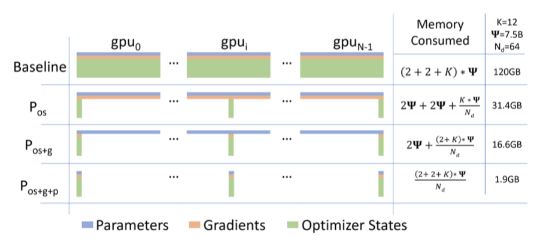
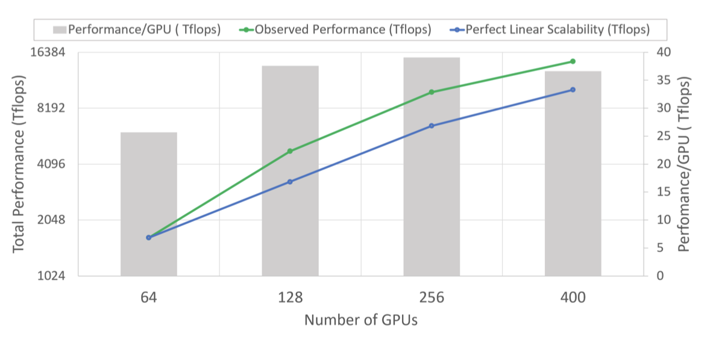
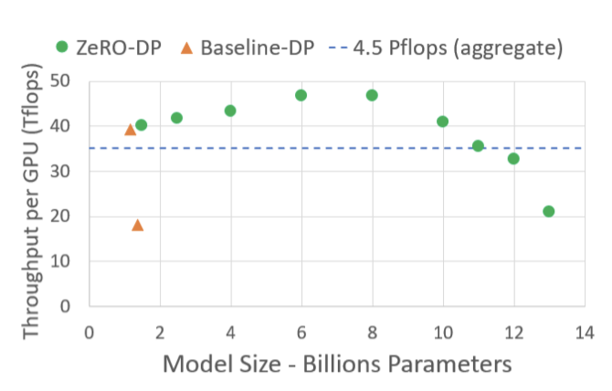
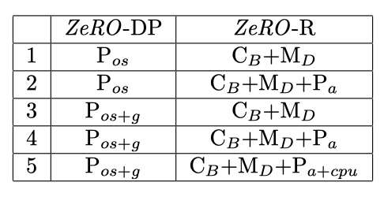
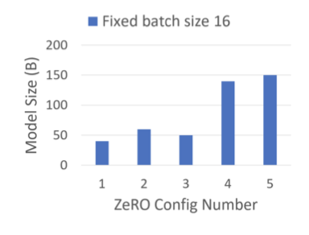
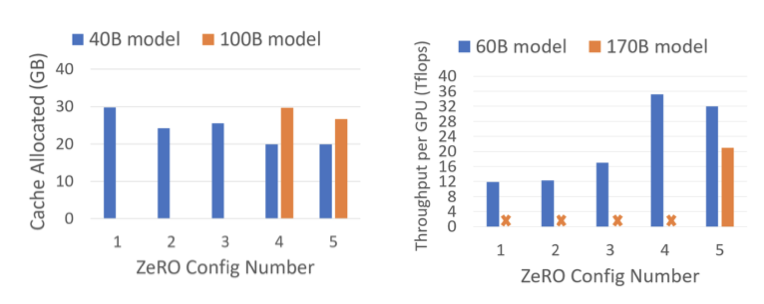
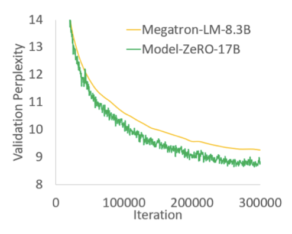

+++
author = "Kurt"
title = "ZeRO"
date = "2023-12-20"
description = "Memory Optimizations Toward Training Trillion Parameter Models"
categories = [
    "Paper Review"
]
tags = [
    "LLM",
    "Milestone",
]
+++

## Abstract

large deep learning 모델은 높은 정확도를 제공하지만, 기존의 데이터 및 모델 병렬화 솔루션은 메모리 적합성에 한계를 보인다. 따라서 Zero Redundancy Optimizer(ZeRO)를 개발하여 메모리를 최적화하고, 학습 속도를 향상시키며, 효율적으로 학습할 수 있는 모델 크기를 증가시켰다. ZeRO는 메모리 중복을 제거하고, 낮은 통신량과 높은 계산 세밀도를 유지하면서 모델 크기를 확장할 수 있는 가능성을 보여준다.

ZeRO를 구현하고 평가했는데, 이는 400개의 GPU에서 super-linear 속도 향상을 통해 100B 이상의 parameter를 가진 대형 모델을 학습시키며, 15 Petaflops의 처리량을 달성하였다. 이는 기존 기술에 비해 8배의 모델 크기 증가와 10배의 성능 향상을 보여준다. 또한, ZeRO는 모델 병렬화 없이 최대 13B parameter의 대형 모델을 학습시킬 수 있다. 마지막으로, 연구자들은 ZeRO를 사용하여 기록적인 정확도를 가진 세계 최대의 언어 모델을 만들었다.

---

## Extended Introduction

딥러닝 모델이 점점 커지면서 정확도가 크게 향상되고 있다. transformer는 자연어 처리 분야에서 대형 모델의 발전을 이끌었지만, 이런 모델들은 단일 장치의 메모리에 들어갈 수 없어 학습시키는 데 어려움이 있다. 더 많은 장치를 추가하는 것만으로는 이 문제를 해결할 수 없다.

기본 데이터 병렬화는 장치당 메모리를 줄이지 않아, 큰 모델에 대해 메모리 부족 문제가 발생한다. 파이프라인 병렬화, 모델 병렬화, CPU 오프로딩 등의 기존 해결책들은 각종 효율성과 기능성, 사용성 사이에서 타협을 이루어야 하지만, 이들 모두가 학습의 속도와 규모를 위해 중요하다.

거대 모델 학습에 가장 유망한 방법인 모델 병렬화(Model Parallelism, MP)는 모델을 수직으로 분할하여 여러 장치에 분배한다. 이 방법은 단일 노드에서 잘 작동하지만, 노드를 넘어서면 효율성이 빠르게 저하된다. 이 논문의 실험에서는, 두 개의 DGX-2 노드에서 40B parameter 모델을 테스트했을 때, V100 GPU당 약 5 Tflops(하드웨어 피크의 5% 미만)의 성능을 보여주었다.

거대 모델을 더 효율적으로 학습하기 위해, 기존 시스템의 메모리 소비를 분석하고, 모델 상태와 잔여 상태 두 부분으로 분류한다. 모델 상태는 메모리의 대부분을 차지하며, 잔여 상태는 나머지 메모리를 차지한다. 이 두 부분 모두에서 메모리 효율성을 최적화하면서 높은 계산 및 통신 효율성을 얻기 위해 ZeRO를 개발하였다. 이 두 부분은 각각 다른 도전과제에 직면하므로, 각각에 대한 해결책을 개발하고 논의하였다.

**Optimizing Model State Memory** 모델 학습 중 메모리의 대부분을 차지하는 모델 상태를 효율적으로 관리하기 위해, ZeRO-DP를 개발하였다. 기존의 DP와 MP 방식의 한계를 극복하고자, ZeRO-DP는 모델 상태를 복제하는 대신 분할하여 메모리 상태 중복을 제거하고, 동시에 계산/통신 효율성을 유지하기 위해 동적 통신 일정을 사용한다. 이를 통해 DP의 계산/통신 효율성과 MP의 메모리 효율성을 모두 달성하려 한다.

ZeRO-DP는 옵티마이저 상태, 그래디언트, 파라미터를 분할하는 세 가지 주요 최적화 단계를 순차적으로 활성화한다.

1. Optimizer State Partitioning ($P_os$): 메모리 감소량 4배, DP와 동일한 통신 볼륨
2. Add Gradient Partitioning ($P_{os+g}$): 메모리 감소량 8배, DP와 동일한 통신 볼륨
3. Add Parameter Partitioning ($P_{os+g+p}$): 메모리 감소량이 DP 정도 $N_d$와 선형적이다.

예를 들어, 64개의 GPU($N_d = 64$)에 걸쳐 분할하면 메모리 감소량이 64배가 된다. 통신 볼륨은 50% 증가한다.

ZeRO-DP는 메모리 중복을 제거하여 클러스터의 전체 메모리를 활용하게 한다. 세 단계 모두 활성화하면 ZeRO는 1024개의 NVIDIA GPU만으로 1조 개의 파라미터 모델을 학습할 수 있다. 이는 각 GPU가 대략 16GB의 메모리를 사용하게 되며, 이는 대부분의 GPU(예: 32GB 메모리를 가진 GPU)가 감당할 수 있는 범위이다.

**Optimizing Residual State Memory** ZeRO-DP가 모델 메모리 효율성을 향상시킨 후에도, 활성화, 임시 버퍼, 사용 불가능한 메모리 조각 등으로 인해 두 번째 메모리 병목 현상이 발생할 수 있다. 이를 해결하기 위해, 각 요소에 의한 잔여 메모리를 최적화하는 ZeRO-R을 개발하였다.

1. activation에 대해, 체크포인팅이 도움이 되지만 큰 모델에는 충분하지 않다는 것을 발견했다. 그래서 ZeRO-R은 activation partitioning을 통해 기존 MP 방법에서 activation 복제를 식별하고 제거함으로써 activation 메모리를 최적화한다. 또한 적절할 때 CPU로 활성화를 오프로드한다.
2. ZeRO-R은 메모리와 계산 효율성 사이의 균형을 위해 임시 버퍼의 적절한 크기를 정의한다.
3. 학습 중에 다른 텐서의 수명 차이로 인해 메모리가 파편화되는 것을 관찰하였다. 파편화로 인한 연속적인 메모리 부족은 충분한 여유 메모리가 있음에도 불구하고 메모리 할당 실패를 일으킬 수 있다. ZeRO-R은 텐서의 다른 수명에 기반하여 메모리를 적극적으로 관리함으로써 메모리 파편화를 방지한다.

ZeRO-DP와 ZeRO-R을 결합하여 ZeRO라는 딥러닝 학습용 메모리 최적화 시스템을 구성한다.

**ZeRO and MP:** ZeRO는 데이터 병렬처리의 메모리 비효율성을 제거하므로, 모델 병렬처리(MP)의 필요성이 줄어든다. ZeRO-DP는 MP와 비교해서 장치당 메모리 사용량을 적어도 같게 줄이거나, 때로는 더 효과적으로 줄일 수 있다. 또한, 스케일링 효율성도 비슷하거나 더 좋다. 데이터 병렬처리는 쉽게 사용할 수 있어 다양한 작업에 적용할 수 있지만, MP는 모델과 시스템 개발자의 추가 작업이 필요하며, 제한된 연산자와 모델만 지원한다.

ZeRO-R과 함께 사용하면, MP는 매우 큰 모델의 활성화 메모리 사용량을 줄일 수 있으며, 활성화 메모리가 문제가 아닌 작은 모델에서는 DP만을 이용한 배치 크기가 너무 클 경우 MP가 이점을 가질 수 있다. 이런 경우, ZeRO를 MP와 결합하여 적절한 배치 크기로 모델을 적용할 수 있다.

ZeRO는 MP와 결합될 수 있으며, 이는 각 장치에서 최대 이론적 메모리 감소를 $N_d \times N_m$배 달성하는 결과를 가져온다. 이를 통해, 1024개의 GPU 1 trillion 개의 parameter 모델을 효율적으로 운영할 수 있게 된다. 이는 16-방향 모델 병렬처리와 64-방향 데이터 병렬처리를 이용하며, 적당한 배치 크기를 사용한다.

**Implementation & Evaluation** ZeRO의 최적화 세트는 1 trillion 개의 parameter를 가진 모델을 고급 하드웨어 클러스터에서 실행할 수 있지만, 계산 능력의 한계와 긴 학습 시간 때문에 실제 적용이 어렵다. 그래서 현재 하드웨어의 계산 능력 범위 내에서 최첨단보다 10배 많은 parameter(약 100B 개의 parameter)를 효율적으로 지원하는 것에 초점을 맞추었다. 이를 위해 ZeRO-DP의 $P_{os+g}$와 ZeRO-R을 결합한 ZeRO의 최적화 하위 집합인 ZeRO-100B를 구현하고 평가하였다.

Model Size: MP와 결합된 ZeRO-100B는 170B 개의 parameter 모델을 효율적으로 실행할 수 있다. 반면, Megatron만을 사용하는 기존 시스템은 40B 개의 parameter 이상으로 효율적으로 확장할 수 없다. 이는 state-of-the-art 대비 모델 크기가 8배 이상 증가한 것이다.

Speed: 향상된 메모리 효율성은 처리량을 높이고 학습 속도를 빠르게 한다. ZeRO는 400개의 Nvidia V100 GPU 클러스터에서 100B 개의 parameter 모델을 GPU당 38TFlops, 총 15Petaflops의 성능으로 실행한다. 이는 동일한 모델 크기에 대해 state-of-the-art 대비 학습 속도를 10배 이상 향상시킨다.

Scalability: 64-400개의 GPU 영역에서 GPU의 수를 두 배로 늘릴 때 성능이 두 배 이상 향상되는 슈퍼 선형 속도 향상을 관찰하였다. 이는 ZeRO-DP의 특성으로, DP 차수를 늘릴수록 모델의 메모리 사용량이 줄어들고 GPU 당 더 큰 배치 크기를 적용할 수 있게 되어 성능을 향상시킨다. 400개를 넘는 GPU 수를 더 늘릴 경우 이런 행동이 계속될 것으로 예상한다.

Democratization of Large Model Training: ZeRO-100B는 데이터 과학자들이 모델 리팩토링을 필요로 하는 MP나 PP 없이 최대 13B 개의 parameter로 모델을 학습할 수 있게 한다. 이를 통해 데이터 과학자들은 병렬 처리에 대해 걱정하지 않고 큰 모델로 자유롭게 실험할 수 있다. 반면, 기존 시스템들은 1.4B 개의 parameter 모델에서 메모리가 부족해진다.

New SOTA Model: ZeRO는 17B 개의 parameter를 가진 가장 큰 언어 모델인 Turing-NLG를 지원하며, 이는 기록적인 정확도를 보여준다.

---

## Related Work

### Data, Model and Pipeline Parallelism

병렬화는 대규모 모델 학습에 필수적인 전략이다. data parallelism(DP)를 통해 모델은 여러 장치로 확장되며, 모델의 parameter는 각 장치에 복제된다. 각 단계에서 미니 배치는 프로세스 간에 나누어지고, 각 프로세스는 다른 데이터 샘플에서 forward 및 backward propagation를 수행한다. 프로세스 간의 averaged gradient를 사용해 로컬에서 모델이 업데이트된다.

장치 메모리에 맞지 않는 모델의 경우, model parallelism(MP)과 pipeline parallelism(PP)이 모델을 프로세스 간에 수직 및 수평으로 분할한다.

pipeline parallelism(PP)은 모델을 층간에 수평적으로 분할하고, 마이크로 배치를 이용해 파이프라인 버블을 숨긴다. 하지만 이 방식은 모델 기능의 구현을 어렵게 만들고, 큰 배치 크기와 상당한 메모리를 필요로 한다. 또한, 표준 딥러닝 학습과는 다르며, 학습 수렴에 영향을 미치는 단점이 있습니다. 반면에, ZeRO는 이러한 PP의 제한 없이 같거나 더 나은 메모리 효율성을 제공한다.

### Non-parallelism based approach to reduce memory

model parallelism(MP)과 pipeline parallelism(PP) 외에도, 딥러닝 학습의 메모리 오버헤드를 줄이는데 목표를 두고 있는 여러 연구가 있다.

#### Reducing Activation Memory

활성화의 메모리 사용량을 줄이기 위한 여러 방법들이 있으며, 이에는 압축, 활성화 체크포인팅, 라이브 분석 등이 포함된다. 이러한 방법들은 ZeRO와 서로 보완적으로 작동하며, 특히 ZeRO-R의 활성화 메모리 감소는 활성화 체크포인팅과 병렬로 진행된다.

#### CPU Offload

컴퓨팅 노드의 heterogeneous를 활용해 모델 상태를 CPU 메모리로 오프로드하는 방식이 있다. 학습 시간의 절반 가량이 GPU-CPU-GPU 전송에 소요되지만, ZeRO는 이와 달리 PCI-E로 인한 제한 때문에 CPU 메모리에 모델 상태를 저장하지 않고도 메모리 사용을 크게 줄인다. 드물게, 성능 향상을 위해 ZeRO-R는 매우 큰 모델의 활성화 체크포인트만 오프로드할 수 있다.

#### Memory Efficient Optimizer

모델 parameter와 gradient의 대략적인 통계를 유지하면서 adaptive optimization 방법의 메모리 사용량을 줄이는 방법들이 있다. 이는 모델 수렴에 영향을 미칠 수 있다. 그러나 ZeRO는 이와 별개로, 모델 최적화 방법이나 모델 수렴에 영향을 주지 않으면서, 최적화 상태와 장치별 gradient의 메모리 사용량을 효과적으로 줄인다.

### Training Optimizers

adaptive optimization 방법들은 큰 모델의 효과적인 학습을 위해 성능과 정확도를 최적화하는데 중요하다. 각 모델 parameter와 gradient에 대한 세밀한 통계를 유지하면서 메모리 사용량이 상당히 증가하는데, ZeRO는 이러한 최적화 도구의 메모리 사용량을 크게 줄여 소형 장치 메모리를 가진 하드웨어에서도 큰 모델 학습이 가능하게 한다. 이는 더 복잡하고 메모리를 많이 사용하는 최적화 도구의 개발 및 사용을 가능하게 한다.

---

## Where Did All the Memory Go?

예를 들어, 1.5B 매개변수의 GPT-2 모델은 16비트 정밀도에서 가중치에 3GB의 메모리를 필요로 한다. 그러나 이는 32GB 메모리를 가진 단일 GPU에서 Tensorflow나 PyTorch를 사용하여 학습할 수 없다. 모델 학습 중에는 대부분의 메모리가 pptimizer states, gradient, parameter로 구성된 모델 상태에 의해 소비되며, 나머지 메모리는 activations, temporary buffer, fragmented memory에 의해 소비된다.

### Model States: Optimizer States, Gradients and Parameters

학습 중에는 대부분의 메모리가 모델 상태에 소비되며, 그 중에서도 Adam과 같은 최적화 도구가 가장 많은 메모리를 차지한다. Adam은 업데이트를 계산하기 위해 gradient의 시간 평균 모멘텀과 분산을 저장해야 하기 때문이다. 따라서, 모델을 훈련시키려면 이 두 가지, 그리고 gradient와 가중치 자체를 저장할 충분한 메모리가 필요하다. 이 세 가지 요소 중에서도, 최적화 상태가 특히 많은 메모리를 차지하다.

**Mixed-Precision Training** 현재 NVIDIA GPU에서 큰 모델을 학습시키는 state-of-the-art 방법은 mixed-precision(fp16/32) 학습을 사용하는 것이다. 이 방법은 parameter와 activation을 fp16으로 저장하고, GPU의 고처리량 텐서 코어 유닛을 활용합니다. forward 및 backward propagation는 fp16 가중치와 활성화를 사용하여 수행되지만, backward propagation 끝단에서의 업데이트 계산과 적용을 위해, mixed-precision 최적화 도구는 parameter와 다른 최적화 상태들의 fp32 복사본을 유지한다.

$\Psi$ parameter를 가진 모델의 mixed-precision 학습에서는, parameter와 gradient의 fp16 복사본, 그리고 최적화 상태인 parameter, 모멘텀, 분산의 fp32 복사본을 저장할 충분한 메모리가 필요하다. 이를 총합하면, $16 \Psi$ 바이트의 메모리 요구사항이 발생한다. 예를 들어, 1.5 B parameter를 가진 GPT-2 모델의 경우, 최소 24GB의 메모리가 요구되며, 이는 단독으로 fp16 parameter를 저장하는 데 필요한 3GB의 메모리보다 훨씬 많다.

### Residual Memory Consumption

**Activations** 학습 중에 활성화는 상당한 메모리를 차지할 수 있다. 예를 들어, 1.5B parameter GPT-2 모델은 약 60GB의 메모리를 필요로 한ㄴ다. 그러나 활성화 체크포인팅을 사용하면 활성화 메모리를 전체 활성화의 제곱근 정도로 줄일 수 있다. 이 방법을 사용하면 이 모델의 활성화 메모리 소비는 대략 8GB로 줄어들게 된다.

활성화 체크포인팅을 사용하더라도, 큰 모델들은 활성화 메모리가 매우 커질 수 있다. 예를 들어, 100B 개의 parameter를 가진 GPT와 같은 모델은 배치 크기 32일 때 약 60GB의 메모리가 필요하다.

**Temporary buffers** 큰 모델에서는 중간 결과를 저장하기 위한 메모리가 상당한 양을 차지한다. gradient all-reduce나 gradient norm 계산과 같은 연산은 처리량 향상을 위해 모든 gradient를 하나의 플랫 버퍼로 병합한다. 그러나 이 병합된 버퍼는 연산에 따라 fp32 텐서가 될 수 있어, 큰 모델에서는 이 임시 버퍼 크기가 중요하다. 예를 들어, 1.5B parameter를 가진 모델에서는 플랫한 fp32 버퍼가 6GB의 메모리를 필요로 한다.

**Memory Fragmentation:** 학습 중 실제 메모리 사용량 외에도, 메모리 단편화로 인해 충분한 메모리가 있음에도 불구하고 메모리 부족 상황이 발생할 수 있다. 연속적인 메모리가 부족하면, 요청된 메모리보다 전체 사용 가능 메모리가 더 크더라도 메모리 요청이 실패할 수 있다. 큰 모델을 학습할 때는 이러한 메모리 단편화가 상당히 발생하며, 극단적인 경우에는 30% 이상의 메모리가 남아있음에도 메모리 부족 문제가 발생할 수 있다.

---

## ZeRO: Insights and Overview

ZeRO는 모델 상태의 메모리 사용량을 줄이는 ZeRO-DP와 잔여 메모리 소비를 줄이는 ZeRO-R, 두 가지 최적화 세트를 가지고 있다. 이는 ZeRO가 효율성을 유지하면서 메모리 사용량을 줄이는 데 도움이 된다. 효율성이 핵심인 만큼, 이 제약 없이는 모든 parameter 상태를 CPU 메모리로 이동하거나, MP 정도를 임의로 늘리는 등의 간단한 방법으로 메모리 사용량을 줄일 수 있다.

### Insights and Overview: ZeRO-DP

ZeRO에서 구동되는 DP는 세 가지 key insight에 기반을 두고 있다:

a) MP는 계산의 세분성을 줄이고 통신 오버헤드를 증가시키므로, DP는 MP보다 확장 효율성이 더 높다. 특정 지점을 넘어서면 GPU의 효율성이 줄어들고, 통신 오버헤드가 증가하여 GPU 간의 확장성이 제한된다. 반면에, DP는 더 높은 계산 세분성과 더 낮은 통신 볼륨을 가지므로 훨씬 높은 효율성을 제공한다.

b) DP는 모델 상태가 모든 데이터 병렬 처리에서 중복으로 저장되므로 메모리 효율성이 떨어진다. 반면에, MP는 모델 상태를 분할하여 메모리 효율성을 얻는다.

c) DP와 MP 모두 전체 학습 과정 동안 필요한 모든 모델 상태를 유지하지만, 항상 모든 것이 필요한 것은 아니다. 예를 들어, 각 레이어에 해당하는 매개변수는 레이어의 전파와 역전파 동안에만 필요하다.

ZeRO-DP는 DP의 학습 효율성을 유지하면서 MP의 메모리 효율성을 달성한다. 모델 상태를 복제하는 대신 분할하고, 통신 볼륨을 최소화하면서 모델 상태의 시간적인 특성을 활용하는 동적 통신 일정을 사용한다. 이를 통해 ZeRO-DP는 모델의 기기당 메모리 사용량을 선형적으로 줄이면서도 통신 볼륨을 기본 DP 수준에 유지하며 효율성을 유지한다.

### Insights and Overview: ZeRO-R

#### Reducing Activation Memory

a) MP는 모델 상태를 분할하지만 활성화 메모리의 복제가 종종 필요하다. 예를 들어, 선형 레이어의 parameter를 분할하여 병렬 계산을 할 경우, 각 GPU는 전체 활성화를 필요로 한다.

b) GPT-2 또는 그보다 큰 모델들은 산술 강도가 매우 크며(≥ 10K), 이는 숨겨진 차원과 선형적으로 증가한다. 이로 인해 대역폭이 낮아도 활성화 체크포인트의 데이터 이동 비용을 숨길 수 있다.

ZeRO는 GPU 간에 활성화 체크포인트를 분할하여 MP의 메모리 중복을 제거하고, 필요에 따라 그것들을 allgather를 이용해 재구성한다. 이로 인해 활성화 메모리 사용량은 MP 정도에 비례하여 감소하며, 매우 큰 모델에서는 산술 강도가 큰 덕분에 활성화 파티션을 CPU 메모리로 이동시키면서도 좋은 효율성을 유지할 수 있다.

#### Managing Temporary buffers

ZeRO-R은 모델 크기가 증가함에 따라 임시 버퍼가 급증하는 것을 피하기 위해 일정한 크기의 버퍼를 사용하면서도 충분히 크게 만들어 효율성을 유지한다.

#### Managing fragmented Memory

memory fragmentation는 단기와 장기 메모리 사이의 교차 때문에 발생한다. ZeRO는 이 통찰을 바탕으로, 활성화 체크포인트와 gradient를 미리 할당된 연속 메모리 버퍼로 이동시키는 실시간 메모리 defragmentation을 수행한다. 이로 인해 메모리 사용 가능성이 증가하고, 메모리 할당자가 연속적인 무료 메모리를 찾는 시간이 줄어들어 효율성이 향상된다.

---

## Deep Dive into ZeRO-DP

기존 DP 방식은 각 장치에서 모델 상태를 복제하여 메모리 오버헤드를 발생시키지만, ZeRO-DP는 이런 메모리 중복을 제거하기 위해 데이터 병렬 프로세스간에 optimizer state, gradient, parameter를 분할한다. 이들은 ZeRO-DP의 세 가지 최적화 단계인 $P_{os}$, $P_g$, $P_p$로 참조된다.

### $P_{os}$: Optimizer State Partitioning

DP 정도가 $N_d$인 경우, 최적화 상태를 $N_d$개의 동일한 파티션으로 나누어, $i$번째 데이터 병렬 프로세스가 $i$번째 파티션에 해당하는 최적화 상태만 업데이트하도록 한다. 결과적으로, 각 데이터 병렬 프로세스는 전체 최적화 상태의 $N_d$만을 저장하고 업데이트하며 parameter의 $N_d$만 업데이트한다. 각 학습 단계의 끝에서는 모든 데이터 병렬 프로세스에서 완전히 업데이트된 parameter를 얻기 위해 all-gather를 수행한다.

**Memory Savings:** 최적화 상태 파티션 후의 메모리 소비는 $4 \Psi + K \Psi$에서 $4 \Psi + {{K \Psi}\over{N_d}}$ 로 줄어든다. 예를 들어, 7.5B parameter 모델은 64-방향 DP를 사용할 때 31.4GB의 메모리를 사용하지만, 표준 DP를 사용하면 120 GB를 사용한다. 또한, $N_d$가 큰 경우, 모델 상태에 대한 메모리 요구량은 약 4배 감소한다.

### $P_g$: Gradient Partitioning

각 데이터 병렬 프로세스는 자신에 해당하는 parameter 파티션만 업데이트하므로, 해당 parameter에 대한 감소된 gradient만 필요하다. 역전파 동안 각 계층의 각 gradient가 사용 가능해지면, 해당 parameter를 업데이트하기 위한 데이터 병렬 프로세스에서만 그것들을 줄이고, gradient를 더 이상 필요하지 않으면 메모리를 해제한다. 이로 인해 gradient를 저장하는 데 필요한 메모리 사용량이 $2\Psi$ 바이트에서 $N_d$로 줄어든다.

Reduce-Scatter 연산을 통해 다른 parameter에 대응하는 gradient들이 다른 프로세스로 줄어든다. 효율성을 높이기 위해 특정 파티션에 대응하는 모든 gradient를 버킷화하여 한 번에 처리하는 버킷화 전략을 사용한다. 이는 NVIDIA의 AMP 최적화기가 통신과 계산을 겹치게 하기 위해 gradient 계산을 버킷화하는 방식과 유사하다. 메모리 사용량을 줄이고 계산과 통신을 겹치게 하기 위해, 파티션 경계에서 all-reduce 대신 감소를 수행한다.

**Memory Savings:** gradient와 optimizer state 중복을 제거하여 메모리 사용량을 $2 \Psi + {{14 \Psi}\over{N_d}} \approx 2 \Psi$로 줄일 수 있다. 예를 들어, 7.5 B parameter 모델은 64-방향 DP를 사용하면 P_{os+g}로만 16.6 GB의 메모리를 사용하지만, 표준 DP를 사용하면 120 GB를 사용한다. N_d가 큰 경우, 모델 상태에 대한 메모리 요구량은 약 8배 감소한다.

### $P_p$: Parameter Partitioning

각 프로세스는 자신의 파티션에 해당하는 parameter만 저장하며, 필요한 경우 다른 parameter는 데이터 병렬 프로세스로부터 브로드캐스트를 통해 받아온다. 이 방법은 통신량을 1.5배로 증가시키지만, $N_d$에 비례해 메모리 사용량을 줄일 수 있다.

**Memory Savings:** parameter 분할을 통해, $Psi$ parameter 모델의 메모리 사용량은 $16 \Psi$에서 ${{16 \Psi}\over{N_d}}$로 줄어든다. 예를 들어, 7.5 B parameter 모델은 64-방향 DP를 사용하면 모델 상태 메모리 1.9 GB를 사용하지만, 표준 DP를 사용하면 120 GB를 사용한다. 이는 ZeRO가 모델 상태를 공유할 충분한 장치가 있다면 어떠한 크기의 모델에도 DP를 적용할 수 있다는 것을 의미한다.

### Implication on Model Size

데이터 병렬 프로세스의 모델 상태에 대한 메모리 사용량을 줄이기 위한 파티셔닝의 세 단계 $P_{os}$, $P_{os+g}$, $P_{os+g+p}$는 각각 메모리 사용량을 최대 4배, 8배, 그리고 $N_d$로 줄인다. ZeRO 최적화를 사용하면, $N_d = 64$일 때는 최대 128B parameter의 모델을, $N_d = 1024$일 때는 최대 1 trillion parameter의 모델을 학습시킬 수 있다. ZeRO를 사용하지 않으면, 최대 1.5B parameter의 모델만 학습시킬 수 있다.

---

## Deep Dive into ZeRO-R

### $P_a$: Partitioned Activation Checkpointing

model parallel(MP)은 설계상 활성화의 복제를 요구하며, 이로 인해 GPU 전체에 활성화의 중복 복사본이 생긴다. ZeRO는 이 중복성을 제거하기 위해 활성화를 분할하고, 계산에 사용되기 직전에만 복제 형태로 재구성한다. 이를 $P_a$라고 하며, 활성화 체크포인팅과 함께 작동하여, 복제 복사본 대신 분할된 활성화 체크포인트를 저장한다. 매우 큰 모델과 제한된 디바이스 메모리의 경우, 이 분할된 체크포인트는 CPU로 오프로드될 수 있어, 활성화 메모리 오버헤드를 거의 없앨 수 있다. 이를 $P_{a+cpu}$라고 한다.

**Memory Saving** ZeRO는 파티셔닝된 활성화 체크포인팅을 사용하여 활성화 메모리 사용량을 model parallel(MP) 차수에 비례하여 줄인다. 예를 들어, 100B 개의 parameter를 가진 모델을 학습시키는 경우, 각 transformer layer마다 활성화를 체크포인트하면 GPU 당 약 33GB의 메모리가 필요하다. 하지만 ZeRO의 $P_a$를 사용하면, 이 메모리 요구량을 GPU 당 약 2GB로 줄일 수 있고, 이 2GB는 CPU로 오프로드되어 활성화에 대한 메모리 사용량을 거의 제로로 만든다.

### $C_B$: Constant Size Buffers

ZeRO는 메모리와 계산 효율성 사이의 균형을 위해 임시 데이터 버퍼의 크기를 조정한다. 학습 중에는 입력 크기가 커질수록 연산의 효율성이 향상되는 경우가 많다. 그러나, 모든 parameter수를 결합한 버퍼의 메모리 오버헤드는 모델 크기에 비례하기 때문에 문제가 될 수 있다. 이 문제를 해결하기 위해, 모델 크기가 큰 경우에는 성능 효율적인 고정 크기의 결합 버퍼를 사용한다. 이렇게 하면 버퍼 크기가 모델 크기에 의존하지 않게 되어, 메모리 사용량을 줄이면서도 계산 효율성을 유지할 수 있다.

### $M_D$: Memory Defragmentation

모델 학습 중에는 활성화 체크포인팅과 gradient 계산으로 인해 메모리 단편화가 발생한다. forward propagation 동안에는 선택적으로 저장되는 활성화와 대부분 버려지는 활성화 사이에 메모리가 교차되어 단편화가 발생하며, back propagation 동안에도 장기 메모리인 parameter gradient와 단기 메모리인 activation gradient 및 gradient 계산에 필요한 다른 버퍼들 사이에 메모리가 교차되어 단편화가 발생한다.

메모리가 충분할 때는 메모리 단편화가 크게 문제가 되지 않지만, 메모리가 제한된 상태에서 큰 모델을 학습할 때는 두 가지 문제가 발생한다. 첫째, 충분한 메모리가 있음에도 연속적인 메모리 부족으로 인해 메모리 부족 오류(Out of Memory, OOM)가 발생하고, 둘째, 메모리 할당기가 연속적인 메모리 조각을 찾는데 많은 시간을 소비하여 효율성이 저하된다.

ZeRO는 활성화 체크포인트와 gradient를 위해 미리 연속적인 메모리 덩어리를 할당하고, 이들이 생성될 때 미리 할당된 메모리로 복사하여 메모리 단편화를 실시간으로 제거한다. $M_D$(Memory Defragmentation)는 ZeRO가 더 큰 모델을 더 큰 배치 크기로 학습할 수 있게 만들 뿐만 아니라, 제한된 메모리로 학습할 때 효율성을 향상시킨다.

---

## Communication Analysis of ZeRO-DP

ZeRO는 메모리 중복성을 제거하여 모델 크기를 증가시키는데, 이로 인해 메모리 효율성을 위해 통신 볼륨을 교환하고 있는지 의문이 생긴다. 즉, 기본 데이터 병렬화 방법에 비해 ZeRO가 향상된 데이터 병렬화 방법의 통신 볼륨은 어느 정도일까? 이에 대한 답은 두 부분이다. 첫째, ZeRO-DP는 메모리를 최대 8배 줄이면서 추가 통신을 발생시키지 않는다. 둘째, ZeRO-DP는 메모리 사용량을 추가로 줄이면서 최대 1.5배의 통신을 발생시킨다. 이 분석은 표준 데이터 병렬화의 통신 볼륨에 대한 간단한 개요로 시작한다.

### Data Parallel Communication Volume

데이터 병렬 학습에서는 모든 데이터 병렬 프로세스의 gradient가 backward propagation이 끝날 때 평균화된다. 이 평균화는 all-reduce 통신을 통해 이루어지며, 모델 크기가 큰 경우, 이 통신은 통신 대역폭에 의해 제한된다. 따라서 분석은 각 데이터 병렬 프로세스로부터 보내고 받는 총 통신 볼륨에 초점을 맞춘다.

state-of-art의 all-reduce 구현은 두 단계로 이루어진다. 첫번째 단계는 reduce-scatter 연산으로, 다른 프로세스에서 데이터의 다른 부분을 축소하고, 다음 단계는 all-gather 연산으로, 각 프로세스가 모든 프로세스에서 축소된 데이터를 수집한다. 이 두 단계의 결과는 all-reduce이다. 각 단계는 파이프라인 방식으로 구현되며, 이로 인해 데이터 이동이 발생한다. 따라서 표준 데이터 병렬화는 각 학습 단계마다 $2 \Psi$의 데이터 이동을 발생시킨다.

### ZeRO-DP Communication Volume

#### Communication Volume with $P_{os+g}$

gradient 분할을 사용하는 ZeRO는 각 프로세스가 해당하는 parameter 분할을 업데이트하기 위해 필요한 gradient 부분만을 저장한다. gradient에 대해 scatter-reduce 연산을 수행하고, 모든 데이터 병렬 프로세스에서 업데이트된 parameter를 수집하기 위해 all-gather를 수행한다. 이 두 과정은 각각 통신 볼륨 $\Psi$를 발생시키므로, 학습 단계당 총 통신 볼륨은 $\Psi + \Psi = 2 \Psi$로, 기본 데이터 병렬화와 동일하다.

#### Communication Volume with $P_{os+g+p}$

parameter 분할 후에 각 데이터 병렬 프로세스는 자신이 업데이트하는 parameter만을 저장한다. 이로 인해 forward propagation 동안 다른 모든 분할의 parameter를 받아야 하지만, 파이프라인 방식을 통해 메모리 오버헤드를 피할 수 있다. 특정 분할에 대한 forward propagation를 계산하기 전에, 해당 분할의 가중치를 모든 데이터 병렬 프로세스에게 브로드캐스트하고, forward propagation가 완료되면 parameter를 버린다. 이로 인해 총 통신 볼륨은 $\Psi$이다. 그러나, 이 all-gather 작업은 backward propagation 동안 역순으로 다시 수행되어야 한다는 점에 주의해야 한다.

총 통신 볼륨은 all-gather와 gradient의 reduce-scatter에 의해 발생하는 통신 볼륨의 합으로, 이는 기본값에 비해 1.5배인 $3 \Psi$이다. gradient와 parameter의 분할은 모든 상태가 항상 필요하지 않다는 점을 이용하여, 상태를 신중하게 통신함으로써 메모리를 최적화한다.

---

## Communication Analysis of ZeRO-R

ZeRO-R의 분할된 활성화 체크포인팅($P_a$)의 통신 볼륨은 기본 MP의 10분의 1 미만 증가하며, 이는 $P_a$의 통신 오버헤드를 분석하여 더 큰 배치 크기를 가능하게 하고 DP 통신을 줄여 효율성을 향상시키는 시나리오를 식별하는 데 사용된다. 이러한 분석은 $P_a$와 $P_{a+cpu}$를 언제 적용할지 결정하는 데 활용된다.

활성화 체크포인트 분할의 통신 볼륨 트레이드오프는 모델 크기, 체크포인트 전략, 그리고 MP 전략에 따라 다르다. 이에 대한 구체적인 이해를 위해, 우리는 최신 MP 방식으로 구현된 transformer 기반 모델인 Megatron-LM을 사용하여 분석을 수행하였다.

활성화 체크포인팅이 있는 Megatron-LM에서, 각 transformer 블록은 forward propagation, forward re-computation, backward propagation 각각에서 두 번씩 all-reduce 연산을 수행한다. 이는 $\text{batch} \times \text{seq length} \times \text{hidden dim}$ 차원의 크기를 가지다. 따라서 블록 당 총 통신 볼륨은 $12 \times \text{seq length} \times \text{hidden dim}$이 된다.

ZeRO-R이 활성화 체크포인트를 분할할 때, back-propagation의 forward recomputation 전에 추가적인 all-gather 연산이 필요하다. 각 transformer 블록의 입력 활성화를 체크포인트로 설정하므로, transformer 블록 당 하나의 all-gather가 필요하다. 이로 인한 통신 오버헤드 $P_a$는 $\text{seq length} \times \text{hidden dim}$이고, 따라서 $P_a$의 총 통신 오버헤드는 모델 병렬화의 원래 통신 볼륨의 10% 미만이다.

MP와 DP를 함께 사용할 때, $P_a$는 모델 병렬 통신 볼륨을 10% 증가시키는 대신 데이터 병렬 통신 볼륨을 크게 줄일 수 있다. 이는 데이터 병렬 통신이 성능의 병목이 될 때 효율성을 크게 향상시키는데 도움이 된다. 또한, $P_a$는 활성화 메모리 사용량을 줄이고 배치 크기를 비례적으로 증가시키므로, 큰 모델의 경우 배치 크기를 최대 16배까지 증가시킬 수 있다. 이로 인해, 데이터 병렬 통신 볼륨이 크게 감소할 수 있다.

$P_{a+cpu}$가 적용되면, CPU로 오프로드된 분할된 활성화 체크포인트는 활성화 메모리 요구량을 거의 0으로 줄이면서, CPU 메모리로의 데이터 이동이 2배 증가한다. 배치 크기가 작아서 DP 통신 볼륨이 병목이 되는 경우에는, CPU 데이터 전송 오버헤드가 DP 통신 볼륨 오버헤드보다 작다면 $P_{a+cpu}$가 배치 크기를 늘려 효율성을 향상시킬 수 있다.

모델과 하드웨어 특성을 고려하여, 위의 분석을 활용하여 $P_a$와 $P_{a+cpu}$를 언제 적용할지 결정한다.

---

## Step Towards 1 Trillion Parameters

현재 가장 큰 모델들은 이미 학습시키는 데 도전적인 100B 개의 parameter를 가지고 있다. 1 trillion 개의 parameter에 이르는 것은 불가피하지만, 그 과정은 많은 도전과 혁신을 필요로 할 것이다. ZeRO는 이러한 도전 중 하나인, 현재 하드웨어에서 대규모 모델을 효과적으로 학습시키는 능력을 개선하는 데 중점을 두고 있다.

**A Leap from State-of-Art** state-of-art 프레임워크인 Megatron은 DGX-2 시스템에서 160 - 20B 개의 parameter 모델을 효율적으로 학습시킬 수 있다. 하지만, 여러 DGX 노드 간의 모델 병렬화를 시도할 경우, 노드 간 대역폭 제한으로 효율성이 크게 감소한다.

ZeRO는 효율적으로 실행 가능한 모델 크기를 크게 늘린다. 노드 경계를 넘어 세분화된 모델 병렬화가 필요하지 않은 현재 하드웨어에서 더 큰 모델을 실행할 수 있게 한다. 모든 최적화가 적용된 ZeRO는, DP만을 이용해 1024개의 GPU에서 1 trillion 개 이상의 parameter를 처리할 수 있다. 또한, 모델 병렬화와 결합하면, 16-방향 모델 병렬화와 노드 간 64-방향 데이터 병렬화를 이용하여 1 trillion 개 이상의 parameter를 처리할 수 있다.

**Compute Power Gap** 허용 가능한 시간 범위 내에서 1 trillion 개의 parameter 모델을 처음부터 끝까지 학습시키는 것은 여전히 상당한 양의 컴퓨팅 파워를 필요로 할 수 있으며, 이는 현재의 AI 클러스터에서는 부족하다.

Bert-Large 모델은 1024 GPU DGX-2H 클러스터에서 67분 만에 학습될 수 있지만, 1 trillion 개의 parameter를 가진 모델은 데이터 샘플당 Bert-Large보다 3000배 더 많은 계산을 필요로 한다. 동일한 하드웨어와 계산 효율성을 가정하면, 이런 크기의 모델 학습은 140일이 걸리며, 실제로는 데이터 샘플과 시퀀스 길이 증가로 인해 1년 이상이 소요될 것이다. 이를 합리적인 시간에 학습시키려면 exa-flop 시스템이 필요하며, 이런 계산 능력이 가능해질 때, ZeRO는 1T 모델을 효율적으로 실행하는 시스템 기술을 제공할 것이다.

---

## Implementation and Evaluation

∼100B 개의 parameter를 가진 모델들의 효율적인 학습에 초점을 맞추고 있다. 이런 모델들은 현재 가장 큰 모델보다 크지만, 현재의 하드웨어에서 합리적인 시간 안에 학습될 수 있다. 이 목표를 달성하기 위해 ZeRO의 일부 최적화를 구현하고 평가하였다. 이를 ZeRO-100B라 부르며, 이를 통해 최대 170B 개의 parameter를 가진 모델을 효율적으로 학습할 수 있음을 확인하였다. 이는 기존 state-of-art의 기술보다 8배 크고, 최대 10배 빠르며, 사용성이 향상되었다. ZeRO-100B는 세계에서 가장 큰 모델인 Turing-NLG를 지원한다.

### Implementation and Methodology

**Implementation** PyTorch에서 ZeRO-100B를 구현하였고, 이는 모든 최적화 세트를 포함하며, 어떤 모델과도 호환되는 인터페이스를 제공한다. 사용자는 이 인터페이스를 이용해신의 모델을 감싸서 ZeRO의 DP를 활용할 수 있고, 모델 수정은 필요하지 않다. 또한, ZeRO의 DP는 Megatron-LM을 포함한 어떤 형태의 MP와도 결합할 수 있다.

**Hardware** 800 Gbps의 노드 간 통신 대역폭을 가진 400개의 V100 GPU (25개의 DGX-2 노드) 클러스터에서 실험을 수행하였다.

**Baseline** MP 없는 실험에는 torch의 distributed data parallel(DDP)을, MP가 있는 실험에는 최첨단 기술인 Megatron-LM을 사용하였다. 이는 NVIDIA의 오픈소스 버전으로, 최근 결과는 32개의 DGX-2 노드 (총 512개의 32GB V100 GPU)를 사용하여 160B 개의 parameter 모델까지 확장 가능함을 보여준다.

**ZeRO** MP가 없는 실험에서는 ZeRO-100B의 ZeRO-powered DP 구현을 사용한다. MP가 있는 실험에서는 ZeRO-powered DP를 Megatron-LM의 MP와 결합한다.

**Model Configurations** 모델들은 GPT-2와 같은 transformer 기반 모델이며, parameter 수를 다르게 하기 위해 은닉 차원과 층의 수를 조절하였다.

### Speed and Model Size

ZeRO-100B는 400개의 GPU에서 최대 170B 개의 parameter를 가진 모델을 효율적으로 실행하며, 이는 Megatron-LM보다 8배 이상 크다. ZeRO-100B는 8B에서 100B 개의 parameter를 가진 모델에 대해 평균적으로 15 PetaFlops의 처리량을 달성하였다. 반면, 기본 MP 성능은 모델 크기 증가에 따라 빠르게 저하되지만, ZeRO-100B는 기준선에 비해 최대 10배의 속도 향상을 보여준다.

ZeRO-100B의 경우, 100B을 넘어서는 성능의 약간의 감소는 더 큰 배치 크기를 실행하기 위한 충분한 메모리 부족 때문이다. GPU의 수를 늘림에 따라 ZeRO-100B의 초선형 속도 향상으로 인해 성능이 향상될 것으로 예상한다.

### Super-Linear Scalability

ZeRO-100B는 매우 큰 모델 크기에 대해 초선형 확장성을 보여주며, 64개에서 400개의 GPU로 확장될 때 이 트렌드가 계속될 것으로 예상한다. $P_{os+g}$는 DP 정도의 증가에 따라 ZeRO-100B의 GPU당 메모리 사용량을 줄여, 처리량을 향상시킨다.

### Democratizing Large Model Training

많은 데이터 과학자들에게 큰 모델 학습의 장벽인 MP와 PP 사용 없이, ZeRO는 모델에 변경 없이 간단한 DP처럼 사용하면서 모델 크기와 속도를 크게 향상시킨다. ZeRO-100B는 128개의 GPU에서 MP 없이 최대 13B 개의 parameter를 가진 모델을 학습시킬 수 있으며, 이는 평균적으로 GPU 당 40 TFlops 이상의 처리량을 달성한다. 반면, ZeRO 없이는 DP만으로 학습 가능한 가장 큰 모델은 1.4B 개의 parameter를 가지며, 처리량은 20 TFlops 미만이다. 게다가, MP의 통신 오버헤드 없이 이런 모델들은 NVLINK이나 NVSwitch가 필요하지 않은 하위 계산 노드에서도 학습될 수 있다.

### Memory and Performance Analysis

최대 모델 크기, 메모리 사용량, 성능에 대한 다양한 최적화의 이점과 영향을 살펴본다.

**Maximum Model Size** C1 대비 C2로 학습시 모델 크기는 40B에서 60B으로 증가하며, 이는 활성화 메모리를 16배 줄이는 $P_a$ 사용 때문이다. C4를 사용하여 140B로 늘리는 것은 $P_{os+g}$를 활성화함으로써 모델 상태의 메모리 요구량을 절반으로 줄이기 때문이고, C5를 사용하여 150B로 증가하는 것은 활성화 체크포인트를 CPU 메모리로 오프로딩하여 메모리를 더욱 줄이기 때문이다.

**Max Cached Memory** C1에서 C2로 넘어갈 때 캐시 메모리 크기의 감소는 예상된 결과이다. C2와 C3 사이의 메모리 사용량 차이는 활성화 메모리와 모델 상태의 크기에 따라 달라질 수 있다. 특히, 100B 개 모델에서는 활성화 메모리가 훨씬 크므로 C4에서 C5로 넘어갈 때 캐시 메모리 감소가 눈에 띈다. 이러한 특성으로 인해 $P
_{a+cpu}$는 매우 큰 모델에서 더 큰 배치 크기를 적용하는 데 중요한 도구가 된다. 또한, 170B 개 모델이 메모리 부족 없이 실행되기 위해 $P_{a+cpu}$가 필요하다는 것을 보여준다.

**Max Achievable Performance** 메모리 사용량 감소가 성능 향상과 연결되어 있으며, 메모리 사용량이 줄어들면 배치 크기를 늘려 성능을 향상시킬 수 있다. 그러나 60B 개 parameter 모델에서 C4와 C5 사이에서는 성능이 떨어진다. 이는 C5가 CPU와의 데이터 이동을 초래하여 성능을 저하시키기 때문이다. 하지만 모델이 너무 크거나, C5 없이는 작동이 불가능한 경우등 예외적인 상황에서는 C5가 필요하다. 학습 중에는 이러한 이점이 있는 경우에만 $P_{a+cpu}$가 활성화된다.

### Turing-NLG, the SOTA language model with 17B parameters

2020년 5월 12일 기준으로, Turing-NLG는 17B 개의 parameter를 가진 세계 최대의 모델로, Webtext-103의 perplexity 10.21로 언어 모델의 state-of-art를 달성하였다. TuringNLG는 ZeRO-100B를 사용하여 학습되었고, 이 모델은 GPU당 41.4 TFlops의 처리량을 달성하였다.

---

## Concluding Remarks

고성능 컴퓨팅과 시스템 관점에서 보면, ZeRO는 대형 모델 학습 분야에서 혁명적 변화를 일으킬 것으로 보인다. ZeRO-100B 구현은 모델 크기를 8배, 처리량은 10배 이상 향상시키며, 현대 GPU 클러스터에서 초선형 속도 향상을 달성하고 세계에서 가장 큰 모델을 학습시킬 수 있다. 하지만 이는 ZeRO의 전체 잠재력을 보여주는 것이 아니다. ZeRO는 미래의 trillion parameter 모델 학습을 가능하게 하는 더 큰 모델 크기 증가를 제공할 수 있다.

ZeRO에 대한 가장 큰 낙관적인 점은 데이터 과학자에게 어떠한 장애물도 없다는 것이다. 기존의 MP와 PP 접근법과 달리, 모델 리팩토링이 필요 없고 표준 DP만큼 쉽게 사용할 수 있어, 대규모 모델 학습에 대한 미래의 연구에서 중요한 역할을 할 것으로 보인다.

---

## Reference

* [Paper](https://arxiv.org/pdf/1910.02054.pdf)
* [Github](https://github.com/microsoft/DeepSpeed)