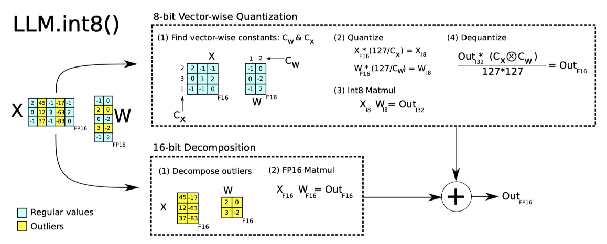
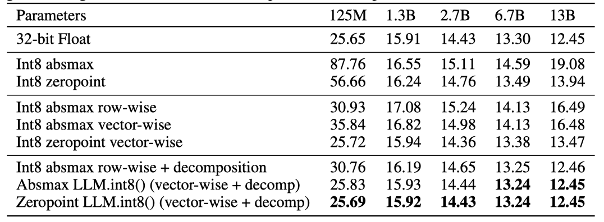
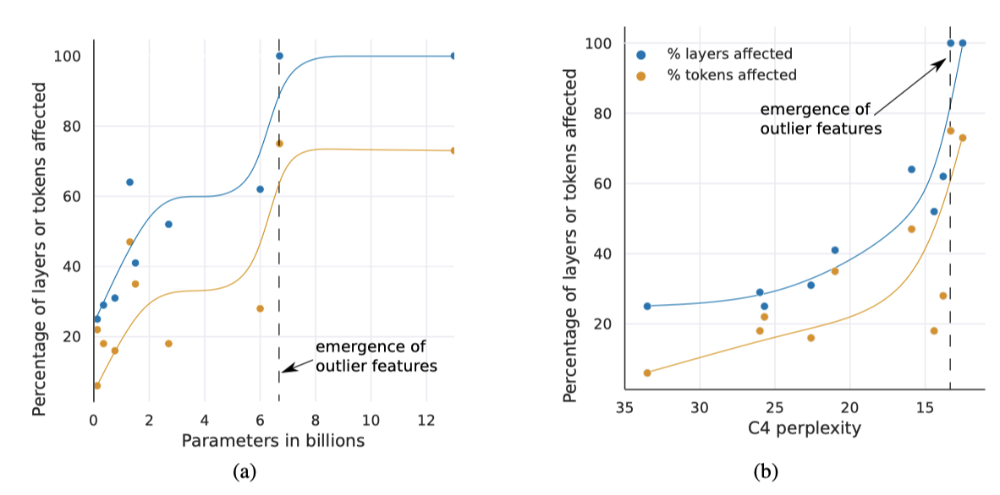
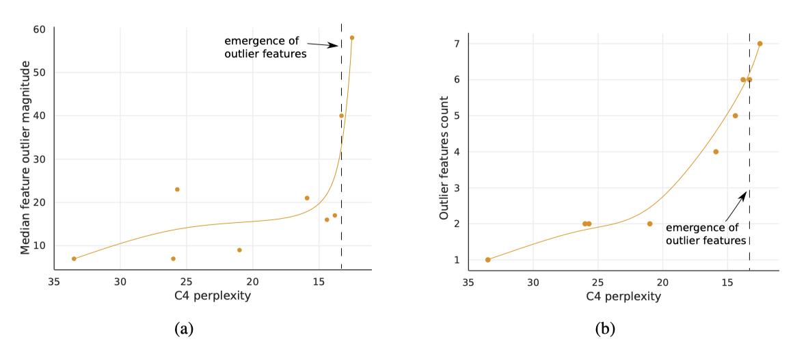

+++
author = "Kurt"
title = "LLM.int8()"
date = "2024-04-17"
description = "8-bit Matrix Multiplication for Transformers at Scale"
categories = [
    "Paper Review"
]
tags = [
    "LLM",
    "Quantization",
]
+++

## Abstract

대규모 언어 모델의 GPU 메모리 요구를 줄이기 위해, transformer의 feed-forward 및 attention projection layer에 대한 Int8 행렬 곱셈 절차를 개발하였다. 이 방법은 추론에 필요한 메모리를 절반으로 줄이면서 전체 정밀도 성능을 유지한다. 175B parameter 모델을 Int8로 변환하여 성능 저하 없이 사용할 수 있음을 보여주며, 이를 위해 벡터별 양자화와 mixed-precision decomposition 방식을 포함하는 LLM.int8() 양자화 절차를 개발했하였다. 이 결과로 OPT-175B/BLOOM 같은 모델을 소비자 GPU를 갖춘 단일 서버에서 사용할 수 있게 되었다.

## Introduction

NLP에서 큰 사전 학습된 언어 모델들이 널리 쓰이고 있지만, 이들은 많은 메모리를 필요로 한다. 대규모 transformer 언어 모델은 주로 parameter의 95%와 계산의 65-85%를 차지하는 feed-forward 및 attention projection layer 때문에 이러한 메모리 요구사항이 높다. parameter 크기를 줄이기 위해, 8비트 양자화 방법이 개발되었으나, 이는 메모리 사용은 줄이지만 성능 저하 문제를 야기하고, 주로 350M parameter 미만의 모델에 적용되었다. 350M 이상 parameter 모델의 성능 저하 없는 양자화는 여전히 해결되지 않은 도전 과제이다.

이 논문에서는 수십억 규모의 transformer 모델을 대상으로 한 성능 저하 없는 Int8 양자화 절차를 처음으로 소개한다. 175B parameter 모델의 특정 layer을 8비트로 변환하여 즉시 추론에 사용할 수 있게 하였다. 이를 위해 1B 이상 parameter에서 요구되는 높은 양자화 정밀도와 대규모 이상치 특성을 명시적으로 표현하는 문제를 해결하였다. 이 과정에서 발생하는 정밀도 손실은 혼란도 및 zero-shot 정확도 저하로 나타나며, 이는 연구 결과에서도 확인된다.

벡터 단위 양자화 방법을 통해 최대 2.7B parameter까지 성능을 유지할 수 있다. 이 방법에서 행렬 곱셈은 독립적인 행과 열 벡터의 내적으로 처리되며, 각 내적에 대해 별도의 양자화 정규화 상수를 사용하여 정밀도를 높인다. 마지막으로, 열과 행의 정규화 상수의 외적으로 역정규화하여 행렬 곱셈의 결과를 복원한다.

6.7B parameter를 초과하여 성능 저하 없이 확장하려면, 숨겨진 상태의 특징 차원에서 나타나는 극단적 이상치의 출현을 이해해야 한다. 새로운 분석에 따르면, 처음에는 transformer layer의 25%에서 나타나던 대형 특징이 점차 확장되어 6.7B parameter에서는 거의 모든 계층과 시퀀스 차원의 75%가 영향을 받는다. 이 이상치들은 체계적으로 나타나며, 6.7B 규모에서는 시퀀스 당 150,000개의 이상치가 발생하지만 전체 특징 차원 중 단 6개에만 집중된다. 이 이상치들을 0으로 설정하면 top-1 attention softmax 확률 질량이 20% 이상 감소하고 검증 혼란도가 크게 악화되나, 이들은 전체 입력 특징 중 0.1%만을 차지한다. 반면, 무작위 특징을 같은 양으로 제거하면 확률과 혼란도의 감소가 훨씬 미미하다.

극단적 이상치를 효율적으로 처리하기 위해 혼합 정밀도 분해 기법을 개발했하였다. 이 방법은 이상치에 대해 16비트, 나머지에는 8비트 행렬 곱셈을 사용한다. 이를 LLM.int8()이라고 명명하며, 이를 통해 최대 175B parameter의 LLM에서 성능 저하 없이 추론이 가능하다. 이 기법은 큰 모델의 성능 영향을 새롭게 이해하고, 소비자 GPU를 사용한 단일 서버에서의 운용을 가능하게 한다. 또한, 큰 모델의 추론 시간 성능을 유지하고 GPT-3 모델에 대한 행렬 곱셈 속도를 약간 향상시킨다고 보고한다. 이 소프트웨어를 오픈 소스로 제공하며, Hugging Face Transformers와의 통합을 통해 모든 사용자가 접근할 수 있도록 한다.

---

## Background

이 연구에서는 transformer 모델을 확장하여 양자화 기술의 한계를 탐구한다. 주요 질문은 양자화 기술이 실패하는 규모와 이유, 그리고 이것이 양자화 정밀도와 어떻게 관련 있는지이다. high-precision asymmetric quantization(zeropoint quantization)와 일반적으로 사용되는 symmetric quantization(absolute maximum quantization) 두 가지를 분석한다. zeropoint quantization는 높은 정밀도를 제공하지만 실제적 제약으로 인해 드물게 사용되고, absolute maximum quantization이 더 널리 채택된다.

### 8-bit Data Types and Quantization

**Absmax quantization** 입력값을 8비트 범위 [−127, 127]로 조정하기 위해, 전체 텐서의 절대 최대값으로 127을 나눈 값을 곱한다. 이 과정은 infinity norm으로 나누고 127을 곱하는 것과 같다. 따라서, FP16 입력 행렬에 대한 Int8 absmax 양자화가 수행된다.

$$ X_{i8} = \big\lfloor {{127 \cdot X_{f16}\over{\underset{ij}{max}(|X_{f16_{ij}}|)}}} \big\rceil = \big\lfloor {{127}\over{\Vert X_{f16} \Vert_{\infty}}} X_{f16} \big\rceil = \lfloor s_{x_{f16}} X_{f16} \rceil $$

여기서 $\lfloor \rceil$는 가장 가까운 정수로 반올림을 나타낸다.

**Zeropoint quantization** 정규화된 동적 범위 $nd_x$로 스케일링하고 제로포인트 $zp_x$로 이동하여 입력 분포를 [−127, 127] 범위로 조정한다. 이는 모든 입력 텐서가 데이터 타입의 모든 비트를 사용하도록 하여 비대칭 분포의 양자화 오류를 줄이는 affine transformation 이다. 예를 들어, ReLU 출력의 경우 absmax 양자화는 [−127, 0) 범위를 사용하지 않지만, 제로포인트 양자화는 전 범위를 사용한다.

$$ nd_{x_{f16}} = {{2 \cdot 127}\over{\underset{ij}{max}(X_{f16}^{ij}) - \underset{ij}{min}(X_{f16}^{ij})}} $$

$$ zp_{x_{i16}} = \lfloor X_{f16} \cdot \underset{ij}{min}(X_{f16}^{ij}) \rceil $$

$$ X_{f8} = \lfloor nd_{x_{f16}} \cdot X_{f16} \rceil $$

제로포인트 양자화된 연산을 수행하기 위해, 텐서 $X_{i8}$과 제로포인트 $zpx_{i16}$을 특별한 명령어에 입력하고, 이 명령어는 각 요소에 제로포인트를 더한 후 16비트 정수 연산을 진행한다. 예로, 제로포인트 양자화된 두 수 $A_{i8}$과 $B_{i8}$의 곱셈은 그들의 제로포인트 $zp_{a_{i16}}$과 $zp_{b_{i16}}$와 함께 계산된다.

$$ C_{i32} = \text{multiply}_{i16} (A\_{zp\_{a\_{i16}}}, B\_{zp\_{b\_{i16}}}) = (A\_{i8} + zp\_{a\_{i16}})(B\_{i8} + zp\_{b\_{i16}}) $$

$\text{multiply}_{i16}$ 명령어가 GPU나 TPU 같은 곳에서 사용할 수 없을 때는 언롤링이 필요하다.

$$ C_{i32} = A_{i8} B_{i8} + A_{i8} zp_{b_{i16}} + B_{i8} zp_{a_{i16}} + zp_{a_{i16}} zp_{b_{i16}}, $$

$A_{i8}$과 $B_{i8}$의 곱은 Int8 정밀도로, 나머지 연산은 Int16/32 정밀도로 계산된다.  $\text{multiply}\_{i16}$명령어가 없으면 제로포인트 양자화 속도가 느려질 수 있다. 결과는 32비트 정수 $C_{i32}$로 누적되며, $C_{i32}$를 디양자화하려면 스케일링 상수 $nd_{a_{f16}}$과 $nd_{b_{f16}}$으로 나눈다.

**Int8 Matrix Multiplication with 16-bit Float Inputs and Outputs.** 숨겨진 상태 $X_{f16}$과 가중치 $W_{f16}$을 사용하여, 시퀀스 차원 $s$, 특성 차원 $h$, 출력 차원 $o$에서 16비트 입력과 출력으로 8비트 행렬 곱셈을 수행한다.

$$ \begin{align} X_{f16} W_{f16} = C_{f16} &\approx {{1}\over{c_{x_{f16}} c_{w_{f16}}}} C_{i32} = S_{f16} \cdot C_{i32} \\\ &\approx S_{f16} \cdot A_{i8} B_{i8} = S_{f16} \cdot Q(A_{f16}) Q(B_{f16}) , \end{align} $$

$Q(\cdot)$은 absmax 또는 제로포인트 양자화를 의미하며, $c_{x_{f16}}$과 $c_{w_{f16}}$은 각각 absmax의 $s_x$, $s_w$ 또는 제로포인트의 $nd_x$, $nd_w$ 같은 텐서별 스케일링 상수이다.

---

## Int8 Matrix Multiplication at Scale

텐서당 단일 스케일링 상수를 사용하는 양자화는 이상치 때문에 전체 정밀도가 떨어질 수 있다. 이를 해결하기 위해, 각 블록별로 다중 스케일링 상수를 적용하는 것이 좋다. 이 방법 중 하나인 행별 양자화를 벡터별 양자화로 개선하여, 이상치의 영향을 더 효과적으로 제한한다.

6.7B 규모 이상의 transformer layer에서 발생하는 큰 이상치를 처리하기 위해, 혼합 정밀도 분해 방법을 개발하였다. 이 방법에서는 소수의 큰 특성은 16비트로, 나머지 99.9%는 8비트로 처리하여, 16비트 대비 약 50% 메모리를 절약한다. 결과적으로, BLOOM-176B 모델의 메모리 사용량을 거의 2배 줄였다.

LLM.int8() 메소드는 absmax 벡터별 양자화와 혼합 정밀도 분해의 결합이다.

### Vector-wise Quantization

행렬 곱셈의 스케일링 상수를 늘리는 방법 중 하나는 행렬 곱셈을 독립적인 내적의 연속으로 보는 것이다. 은닉 상태와 가중치 행렬에 대해 각각의 행과 열에 다른 스케일링 상수를 할당하고, 이를 통해 각 내적 결과를 정규화 해제한다. 이 과정은 전체 행렬 곱셈에 대한 외적에 의한 정규화 해제와 같다. 따라서, 이 방법으로 행렬 곱셈을 수행하는 전체 방정식이 제시된다.

$$ C_{f16} \approx {{1}\over{c_{x_{f16}} ⊗ c_{w_{f16}}}} C_{i32} = S \cdot C_{i32} = S \cdot A_{i8} B_{i8} = S \cdot Q(A_{f16}) Q(B_{f16}) $$

### The Core of LLM.int8(): Mixed-precision Decomposition

분석을 통해, 1B 규모의 8비트 transformer는 중요한 성능을 위해 높은 정밀도 양자화가 필요한 큰 크기의 특성을 가지고 있음을 밝혀냈다. 그러나 벡터별 양자화 방식은 이상치 특성에 비효율적이다. 이 이상치 특성은 전체 특성 차원의 약 0.1%에 불과하며, 이를 기반으로 고정밀도 곱셈에 초점을 맞춘 새로운 분해 기법을 개발할 수 있었다.

입력 행렬 $X_{f16}$에 대해, 이상치는 대부분의 시퀀스 차원에서 체계적으로 발생하지만 특정 특성 은닉 차원에 국한된다. 이에, 이상치 차원을 분리하는 혼합 정밀도 분해 방식을 제안하며, 이는 임계값 $\alpha$보다 큰 이상치를 가진 $h$ 차원을 포함하는 집합 $O$를 사용한다. 연구에서 $\alpha = 6.0$이 성능 저하를 거의 없애는 데 충분함을 확인하였다. 이 혼합 정밀도 분해는 가중치 행렬 $W_{f16}$에 대해 정의된다.

$$ C_{f16} \approx \sum_{h \in O} X_{f16}^h W_{f16}^h + S_{f16} \sum_{h \notin O} X_{f8}^h W_{f8}^h $$

$S_{f16}$은 Int8 입력 및 가중치 행렬 $X_{i8}$와 $W_{i8}$에 대한 비정규화 항이다.

8비트와 16비트 분리를 통해, 99.9%의 값에 대한 메모리 효율적인 연산과 이상치에 대한 고정밀 연산을 동시에 수행할 수 있다. 13B parameter transformer에서 이상치 차원 수가 7개 이하이므로, 이 과정은 추가 메모리 소모가 약 0.1%에 불과하다.

### Experimental Setup

175B parameter까지 확장된 다양한 공개 사전 학습된 언어 모델들의 양자화 방법의 견고성을 평가한다. 중점은 특정 모델의 성능이 아니라, 모델 규모 확장 시 양자화 방법의 성능 추세이다.

실험을 위해 언어 모델링 혼란도 기반 설정과 다양한 최종 작업에 대한 OPT 모델의 zero-shot 정확도 평가 등 두 가지 방법을 사용한다. 이를 통해 다양한 양자화 방법을 16비트 기준과 비교한다.

언어 모델링을 위해, 125M에서 13B parameter 범위의 fairseq에서 사전 학습된 autoregressive transformer를 사용하며, 이들은 다양한 데이터 소스에서 사전 학습된다. 학습 방법에 대한 자세한 정보는 Artetxe et al. (2021)에 있다.

Int8 양자화 이후 언어 모델링 저하를 측정하기 위해, C4 코퍼스 검증 데이터로 8비트 transformer의 혼란도를 평가하며, 이 과정에는 NVIDIA A40 GPU를 사용한다.

zero-shot 성능의 저하를 측정하기 위해, OPT 모델을 사용하고, 이 모델들을 EleutherAI 언어 모델 평가 하네스에서 평가한다.

### Main Results

C4 코퍼스에서 평가된 125M에서 13B까지의 Int8 모델의 언어 모델링 혼란도 결과는 모델 크기가 커질수록 absmax, 행별, 제로포인트 양자화 방법이 실패함을 보여준다. 특히, 2.7B parameter를 초과하는 모델들이 성능이 떨어지며, 제로포인트 양자화는 6.7B parameter를 넘어서는 경우 실패한다. LLM.int8() 방법만이 혼란도를 유지하며, 유일하게 긍정적인 규모 확장 추세를 보인다.

EleutherAI 언어 모델 평가에서 OPT 모델의 zero-shot 성능을 분석한 결과, LLM.int8()은 125M에서 175B parameter로 확장 시 16비트 성능을 지속적으로 유지한다. 반면, 8비트 absmax 벡터 양자화는 성능이 저하되어 결국 무작위 성능으로 떨어진다.

메모리 절약이 주요 목표이지만, LLM.int8()의 실행 시간 역시 평가되었다. 6.7B parameter 미만의 모델은 FP16 대비 양자화로 인해 추론 속도가 다소 느려질 수 있으나, 대부분의 GPU에서 실행 가능하므로 큰 문제가 되지 않는다. 175B 모델과 같은 대규모 연산에서 LLM.int8()은 약 2배 빠른 속도를 보여준다.

---

## Emergent Large Magnitude Features in Transformers at Scale

transformer 확장 시 큰 크기의 이상치 특성이 출현해 모든 층과 양자화에 중대한 영향을 끼친다. 숨겨진 상태 $X \in \mathbb{R}^{s×h}$에서, 특정 차원 $h_i$를 특성으로 정의하며, 이 분석은 주어진 transformer 모든 층의 $h_i$ 차원을 조사한다.

이상치 특성은 transformer의 attention과 예측 성능에 중대한 영향을 미친다. 13B 모델에서는 2048 토큰 시퀀스당 최대 150k의 이상치가 발견되지만, 이들은 체계적이며 최대 7개의 고유 차원 $h_i$로 표현된다. 이러한 분석을 통해 얻은 인사이트는 혼합 정밀도 분해 기술 개발에 중요했다. 이 분석은 제로포인트 양자화의 이점과 혼합 정밀도 분해 사용시 소형 및 대형 모델의 양자화 성능 차이가 왜 발생하는지를 설명한다.

### Finding Outlier Features

등장하는 현상의 정량적 분석은 이해하기 쉽고 복잡하지 않으며 중요한 패턴을 포착할 수 있는 소수의 특성 선택에 어려움이 있다. 이를 위해 경험적 방법을 사용하며, 이상치는 특성 크기가 6.0 이상, 적어도 25%의 층과 6%의 시퀀스 차원에 영향을 주는 조건으로 정의된다.

L개 층과 숨겨진 상태를 가진 transformer에서, 특정 특성 차원 $h_i$는 크기 $\alpha ≥ 6$의 값을 가진 경우 추적된다. 이러한 이상치가 transformer의 25% 이상의 층과 모든 숨겨진 상태의 6% 이상의 시퀀스 차원에서 발견될 때만 통계를 수집한다. 특성 이상치가 주로 주의력 투영과 feedforward network expansion layer에서 발생하기 때문에, 이 분석에서는 주의력 함수와 FFN 축소 층은 제외된다.

혼합 정밀도 분해를 사용할 때 크기가 6 이상인 특성을 이상치로 처리하면 혼란도 저하가 멈추는 것을 발견하였다. 대형 모델에서는 이상치 특성이 대부분의 층에서 체계적으로 발생하거나 전혀 발생하지 않는 반면, 소형 모델에서는 확률적으로 일부 층에서 간헐적으로 발생한다. 이를 바탕으로, 가장 작은 125M parameter 모델에서 단일 이상치를 탐지하기 위한 임계값을 설정하였다: transformer 층의 최소 25%가 같은 특성 차원에서 영향을 받고, 시퀀스 차원의 최소 6%에서 이상치가 발생해야 한다. 이는 두 번째로 흔한 이상치가 단 하나의 층에서만 발생한다는 사실과 일치하여 합리적인 임계값이다.

최대 13B parameter 규모의 모델을 테스트하며, 관찰된 현상이 소프트웨어 버그 때문인지 확인하기 위해 세 가지 소프트웨어 프레임워크에서 학습된 transformer 모델들을 평가한다. 이에는 OpenAI 소프트웨어의 GPT-2 모델 4개, Fairseq의 Meta AI 모델 5개, Tensorflow-Mesh의 EleutherAI GPT-J 모델 1개가 포함된다. 추가적인 정보는 부록 C에 있으며, Fairseq과 Hugging Face Transformers 프레임워크에서 추가 분석을 수행한다.

### Measuring the Effect of Outlier Features

이상치 특성이 주의력과 예측 성능에 중요함을 보이기 위해, 은닉 상태에 있는 이상치 특성을 0으로 설정한 뒤, 이상치를 포함한 상태와 제거한 상태의 소프트맥스 확률을 비교한다. 이 과정은 모든 층에서 독립적으로 진행되어, 이상치 특성의 영향을 분리하여 살펴본다. 이상치 특성을 제거할 때의 혼란도 저하도 평가한ㄴ다. 또한, 비이상치 특성에 대해서도 같은 실험을 수행하여 주의력 및 혼란도 저하를 비교한다.

주요 정량적 결과는 네 가지 주요 포인트로 요약할 수 있다.

(1) parameter 수로 측정할 때, 6B에서 6.7B parameter 사이에서 transformer의 모든 layer에 대규모 특성이 갑자기 나타나며, 영향받는 layer과 시퀀스 차원의 비율이 급격히 증가한다. 이 현상은 양자화가 실패하기 시작하는 지점에서 발생한다.

(2) 혼란도를 기준으로 할 때, transformer의 모든 layer에서 대규모 특성은 혼란도 감소의 지수적 함수에 따라 부드럽게 출현한다. 이는 특성 출현이 갑작스럽지 않고, 작은 모델의 지수적 추세 분석을 통해 예측 가능함을 나타낸다. 또한, 이는 출현이 모델 크기뿐만 아니라 혼란도와 연관되어 있으며, 혼란도는 훈련 데이터의 양과 품질 등 여러 요소에 의해 영향을 받는다는 것을 시사한다.

(3) transformer의 모든 층에서 이상치 특징이 발생할 때, 중앙값 이상치의 크기가 급격히 증가하며, 이는 Int8 양자화의 정밀도를 저해한다. 이로 인해 6.7B 규모부터 양자화 방법이 실패하게 되며, 이는 양자화 분포 범위가 너무 커서 정보 소실을 초래한다. 또한, 이상치로 인해 16비트 부동 소수점 학습도 불안정해질 수 있다.

(4) C4 혼란도 감소에 따라 이상치 특징의 수가 단조롭게 증가하지만, 모델 크기와의 관계는 비단조적이다. 이는 모델 크기보다 혼란도가 단계 전환을 더 결정한다는 것을 의미하며, 모델 크기는 출현에 도달하기 위한 여러 중요한 요소 중 하나라고 볼 수 있다.

단계 전환 후, 6.7B transformer에서는 시퀀스당 약 15만 개의 이상치 특징이 나타나지만, 이들은 단 6개의 은닉 차원에 주로 집중되어 있다.

이상치 제거는 transformer 성능에 큰 영향을 미쳐, top-1 확률이 40%에서 20%로 줄고, 검증 혼란도는 600-1000% 증가한다. 그러나 임의의 특징 차원 7개를 제거할 경우 영향은 미미하다. 이는 이상치 특징 차원이 매우 중요하며, 양자화 정밀도가 모델 성능에 결정적인 역할을 함을 보여준다.

### Interpretation of Quantization Performance

대규모 transformer에서 특정 특징 차원의 이상치는 흔하며, 이는 성능에 중요하다. 행별과 벡터별 양자화가 이상치를 효과적으로 처리하지 못해, absmax 양자화 방법은 출현 후 빠르게 실패한다.

이상치들은 대부분 엄격한 비대칭 분포를 보이며, 제로포인트 양자화가 이를 [-127, 127] 범위로 효과적으로 스케일링한다. 이는 양자화 스케일링 벤치마크에서 뛰어난 성능을 보이는 이유이다. 그러나 13B 규모에서는 누적된 양자화 오류와 이상치 크기의 급증으로 인해 제로포인트 양자화도 실패한다.

혼합 정밀도 분해를 사용하는 LLM.int8() 방법을 적용하면 제로포인트 양자화의 장점이 사라지고 특징들이 대칭적으로 남는다. 그럼에도 벡터별 양자화가 행별 양자화보다 우수하며, 이는 모델 가중치의 정밀도를 향상시켜 전체 예측 성능을 유지하는 것이 중요함을 의미한다.

---

## Related work

**8-bit Data Types.** 이 연구는 GPU에서 지원하는 유일한 8비트 데이터 유형인 Int8에 초점을 맞추고 있으며, 고정 소수점 또는 부동 소수점 8비트 데이터 유형(FP8)도 다룬다. 이 데이터 유형들은 다양한 지수 및 분수 비트 조합을 가지며, 특히 지수에 5비트, 분수에 2비트를 사용하는 변형이 일반적이다. 이들은 큰 수치에 대해서는 큰 오류를, 작은 수치에 대해서는 높은 정확도를 제공한다. FP8 데이터 유형이 Int8보다 우수한 성능을 제공할 것으로 보이나, 현재 GPU나 TPU에서는 지원되지 않는다.

**Outlier Features in Language Models.** 언어 모델에서 이상치 특성에 대한 연구는 transformer의 이상치 출현, 레이어 정규화, 토큰 빈도 분포와의 관계를 탐구하였다. BERT 모델에서 이상치의 출현이 LayerNorm과 연관되고, 학습 분포의 토큰 빈도와 이상치 출현이 관련이 있다는 것이 경험적으로 밝혀졌다. 이 연구는 autoregressive 모델의 스케일과 이상치 특성의 관계, 그리고 이상치를 적절히 모델링하는 것의 중요성을 추가로 탐구한다.

**Multi-billion Scale Transformer Quantization.** 이 연구와 동시에 개발된 nuQmm과 ZeroQuant는 세밀한 그룹별 양자화 방식을 사용해 높은 양자화 정밀도를 달성하였다. 이 방법들은 추론 속도와 메모리 절약을 목표로 하는 반면, 이 연구는 8비트 메모리 환경에서 예측 성능을 유지하는 데 초점을 맞춘다. 최대 176B parameter 모델까지 zero-degradation 양자화가 가능함을 보여주었다. 더 세밀한 양자화는 대형 모델 양자화에 효과적이며, 이는 LLM.int8()과 보완적이다. 병렬 작업인 GLM-130B는 8비트 가중치로 전체 16비트 정밀도 계산을 수행하며, 이 연구의 통찰을 바탕으로 zero-degradation 양자화를 달성하였다.

---

## Discussion and Limitations

이 연구는 처음으로 수십억 개의 parameter를 가진 transformer 모델을 Int8로 양자화하여 성능 저하 없이 바로 추론에 사용할 수 있음을 입증하였다. 이는 대규모 특징 분석과 혼합 정밀도 분해를 통해 이상치 특성을 별도로 분리하는 방법으로, 이 연구의 방법 LLM.int8()을 통해 최대 175B parameter 모델의 전체 추론 성능을 회복할 수 있음을 경험적으로 보여준다.

이 연구의 주요 한계는 분석이 오직 Int8 데이터 타입에만 초점을 맞추었고, 8비트 부동 소수점(FP8) 데이터 타입은 연구하지 않았다는 점이다. 현재 GPU와 TPU에서 이 데이터 타입을 지원하지 않아, 이 부분은 향후 연구의 주제로 남겨두었다. 그럼에도 불구하고, Int8 데이터 타입으로 얻은 통찰이 FP8에도 적용될 것으로 기대한다. 또한, 175B parameter까지의 모델만 연구했으며, 더 큰 규모에서는 기존 방법에 영향을 줄 수 있는 추가적인 특성이 발생할 가능성이 있다.

이 연구의 세 번째 제한점은 주의 기능에서 Int8 곱셈을 사용하지 않았다는 점이다. 이는 메모리 사용량 감소에 초점을 맞추었고 주의 기능이 parameter를 필요로 하지 않아서이다. 초기 탐색에서는 이 연구의 개발을 넘어서는 추가 양자화 방법이 필요함을 발견했으며, 이 문제는 향후 연구 과제로 남겨져 있다.

이 연구의 마지막 제한점은 추론에 초점을 맞추었지만, 학습이나 미세 조정에 대해서는 연구하지 않았다는 것이다. 대규모 Int8 학습은 양자화 정밀도, 학습 속도, 그리고 엔지니어링 복잡성 사이의 복잡한 절충을 요구하며, 매우 어려운 문제를 대표한다. 이 문제 또한 미래의 연구 과제로 남겨둔다.

---

## Broader Impacts

이 연구는 이전에 GPU 메모리에 맞지 않았던 대형 모델을 다룰 수 있게 함으로써, 제한된 GPU 메모리로 인해 불가능했던 연구와 응용의 문을 열었다. 이는 특히 자원이 적은 연구자들에게 혜택을 준다. 그러나 이는 또한 많은 GPU를 보유한 자원이 풍부한 조직이 더 많은 모델을 처리할 수 있게 하여, 자원 격차를 더욱 확대할 위험도 내포하고 있다.

최근의 Open Pretrained Transformers (OPT)와 같은 대규모 사전 학습된 모델의 공개와 새로운 Int8 추론을 통해, 자원 제약으로 인해 이전에는 불가능했던 학술 기관의 연구를 가능하게 할 것이라고 본다. 이러한 모델의 넓은 접근성은 사회에 예측하기 어려운 긍정적 및 부정적 영향을 줄 수 있다.

---

## Reference

* [Paper](https://arxiv.org/pdf/2208.07339.pdf)
* [GitHub](https://github.com/TimDettmers/bitsandbytes)