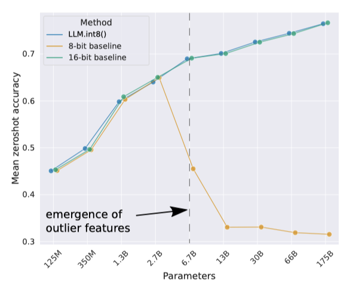

+++
author = "Kurt"
title = "LLM.int8()"
date = "2024-04-17"
description = "8-bit Matrix Multiplication for Transformers at Scale"
categories = [
    "Paper Review"
]
tags = [
    "LLM",
    "Quantization",
]
draft = true
+++

## Abstract

대규모 언어 모델의 GPU 메모리 요구를 줄이기 위해, transformer의 feed-forward 및 attention projection layer에 대한 Int8 행렬 곱셈 절차를 개발하였다. 이 방법은 추론에 필요한 메모리를 절반으로 줄이면서 전체 정밀도 성능을 유지한다. 175B parameter 모델을 Int8로 변환하여 성능 저하 없이 사용할 수 있음을 보여주며, 이를 위해 벡터별 양자화와 mixed-precision decomposition 방식을 포함하는 LLM.int8() 양자화 절차를 개발했하였다. 이 결과로 OPT-175B/BLOOM 같은 모델을 소비자 GPU를 갖춘 단일 서버에서 사용할 수 있게 되었다.

## Introduction

NLP에서 큰 사전 학습된 언어 모델들이 널리 쓰이고 있지만, 이들은 많은 메모리를 필요로 한다. 대규모 transformer 언어 모델은 주로 parameter의 95%와 계산의 65-85%를 차지하는 feed-forward 및 attention projection layer 때문에 이러한 메모리 요구사항이 높다. parameter 크기를 줄이기 위해, 8비트 양자화 방법이 개발되었으나, 이는 메모리 사용은 줄이지만 성능 저하 문제를 야기하고, 주로 350M parameter 미만의 모델에 적용되었다. 350M 이상 parameter 모델의 성능 저하 없는 양자화는 여전히 해결되지 않은 도전 과제이다.

이 논문에서는 수십억 규모의 transformer 모델을 대상으로 한 성능 저하 없는 Int8 양자화 절차를 처음으로 소개한다. 175B parameter 모델의 특정 layer을 8비트로 변환하여 즉시 추론에 사용할 수 있게 하였다. 이를 위해 1B 이상 parameter에서 요구되는 높은 양자화 정밀도와 대규모 이상치 특성을 명시적으로 표현하는 문제를 해결하였다. 이 과정에서 발생하는 정밀도 손실은 혼란도 및 zero-shot 정확도 저하로 나타나며, 이는 연구 결과에서도 확인된다.

벡터 단위 양자화 방법을 통해 최대 2.7B parameter까지 성능을 유지할 수 있다. 이 방법에서 행렬 곱셈은 독립적인 행과 열 벡터의 내적으로 처리되며, 각 내적에 대해 별도의 양자화 정규화 상수를 사용하여 정밀도를 높인다. 마지막으로, 열과 행의 정규화 상수의 외적으로 역정규화하여 행렬 곱셈의 결과를 복원한다.

6.7B parameter를 초과하여 성능 저하 없이 확장하려면, 숨겨진 상태의 특징 차원에서 나타나는 극단적 이상치의 출현을 이해해야 한다. 새로운 분석에 따르면, 처음에는 transformer layer의 25%에서 나타나던 대형 특징이 점차 확장되어 6.7B parameter에서는 거의 모든 계층과 시퀀스 차원의 75%가 영향을 받는다. 이 이상치들은 체계적으로 나타나며, 6.7B 규모에서는 시퀀스 당 150,000개의 이상치가 발생하지만 전체 특징 차원 중 단 6개에만 집중된다. 이 이상치들을 0으로 설정하면 top-1 attention softmax 확률 질량이 20% 이상 감소하고 검증 혼란도가 크게 악화되나, 이들은 전체 입력 특징 중 0.1%만을 차지한다. 반면, 무작위 특징을 같은 양으로 제거하면 확률과 혼란도의 감소가 훨씬 미미하다.

극단적 이상치를 효율적으로 처리하기 위해 혼합 정밀도 분해 기법을 개발했하였다. 이 방법은 이상치에 대해 16비트, 나머지에는 8비트 행렬 곱셈을 사용한다. 이를 LLM.int8()이라고 명명하며, 이를 통해 최대 175B parameter의 LLM에서 성능 저하 없이 추론이 가능하다. 이 기법은 큰 모델의 성능 영향을 새롭게 이해하고, 소비자 GPU를 사용한 단일 서버에서의 운용을 가능하게 한다. 또한, 큰 모델의 추론 시간 성능을 유지하고 GPT-3 모델에 대한 행렬 곱셈 속도를 약간 향상시킨다고 보고한다. 이 소프트웨어를 오픈 소스로 제공하며, Hugging Face Transformers와의 통합을 통해 모든 사용자가 접근할 수 있도록 한다.

---

## Background

이 연구에서는 transformer 모델을 확장하여 양자화 기술의 한계를 탐구한다. 주요 질문은 양자화 기술이 실패하는 규모와 이유, 그리고 이것이 양자화 정밀도와 어떻게 관련 있는지이다. high-precision asymmetric quantization(zeropoint quantization)와 일반적으로 사용되는 symmetric quantization(absolute maximum quantization) 두 가지를 분석한다. zeropoint quantization는 높은 정밀도를 제공하지만 실제적 제약으로 인해 드물게 사용되고, absolute maximum quantization이 더 널리 채택된다.

### 8-bit Data Types and Quantization

**Absmax quantization** 입력값을 8비트 범위 [−127, 127]로 조정하기 위해, 전체 텐서의 절대 최대값으로 127을 나눈 값을 곱한다. 이 과정은 infinity norm으로 나누고 127을 곱하는 것과 같다. 따라서, FP16 입력 행렬에 대한 Int8 absmax 양자화가 수행된다.

$$ X_{i8} = \big\lfloor {{127 \cdot X_{f16}\over{\underset{ij}{max}(|X_{f16_{ij}}|)}}} \big\rceil = \big\lfloor {{127}\over{\Vert X_{f16} \Vert_{\infty}}} X_{f16} \big\rceil = \lfloor s_{x_{f16}} X_{f16} \rceil $$

여기서 $\lfloor \rceil$는 가장 가까운 정수로 반올림을 나타낸다.

**Zeropoint quantization** 정규화된 동적 범위 $nd_x$로 스케일링하고 제로포인트 $zp_x$로 이동하여 입력 분포를 [−127, 127] 범위로 조정한다. 이는 모든 입력 텐서가 데이터 타입의 모든 비트를 사용하도록 하여 비대칭 분포의 양자화 오류를 줄이는 affine transformation 이다. 예를 들어, ReLU 출력의 경우 absmax 양자화는 [−127, 0) 범위를 사용하지 않지만, 제로포인트 양자화는 전 범위를 사용한다.

$$ nd_{x_{f16}} = {{2 \cdot 127}\over{\underset{ij}{max}(X_{f16}^{ij}) - \underset{ij}{min}(X_{f16}^{ij})}} $$

$$ zp_{x_{i16}} = \lfloor X_{f16} \cdot \underset{ij}{min}(X_{f16}^{ij}) \rceil $$

$$ X_{f8} = \lfloor nd_{x_{f16}} \cdot X_{f16} \rceil $$

제로포인트 양자화된 연산을 수행하기 위해, 텐서 $X_{i8}$과 제로포인트 $zpx_{i16}$을 특별한 명령어에 입력하고, 이 명령어는 각 요소에 제로포인트를 더한 후 16비트 정수 연산을 진행한다. 예로, 제로포인트 양자화된 두 수 $A_{i8}$과 $B_{i8}$의 곱셈은 그들의 제로포인트 $zp_{a_{i16}}$과 $zp_{b_{i16}}$와 함께 계산된다.

$$ C_{i32} = \text{multiply}_{i16} (A\_{zp\_{a\_{i16}}}, B\_{zp\_{b\_{i16}}}) = (A\_{i8} + zp\_{a\_{i16}})(B\_{i8} + zp\_{b\_{i16}}) $$

$\text{multiply}_{i16}$ 명령어가 GPU나 TPU 같은 곳에서 사용할 수 없을 때는 언롤링이 필요하다.

$$ C_{i32} = A_{i8} B_{i8} + A_{i8} zp_{b_{i16}} + B_{i8} zp_{a_{i16}} + zp_{a_{i16}} zp_{b_{i16}}, $$

$A_{i8}$과 $B_{i8}$의 곱은 Int8 정밀도로, 나머지 연산은 Int16/32 정밀도로 계산된다.  $\text{multiply}\_{i16}$명령어가 없으면 제로포인트 양자화 속도가 느려질 수 있다. 결과는 32비트 정수 $C_{i32}$로 누적되며, $C_{i32}$를 디양자화하려면 스케일링 상수 $nd_{a_{f16}}$과 $nd_{b_{f16}}$으로 나눈다.

**Int8 Matrix Multiplication with 16-bit Float Inputs and Outputs.** 숨겨진 상태 $X_{f16}$과 가중치 $W_{f16}$을 사용하여, 시퀀스 차원 $s$, 특성 차원 $h$, 출력 차원 $o$에서 16비트 입력과 출력으로 8비트 행렬 곱셈을 수행한다.

$$ \begin{align} X_{f16} W_{f16} = C_{f16} &\approx {{1}\over{c_{x_{f16}} c_{w_{f16}}}} C_{i32} = S_{f16} \cdot C_{i32} \\\ &\approx S_{f16} \cdot A_{i8} B_{i8} = S_{f16} \cdot Q(A_{f16}) Q(B_{f16}) , \end{align} $$

$Q(\cdot)$은 absmax 또는 제로포인트 양자화를 의미하며, $c_{x_{f16}}$과 $c_{w_{f16}}$은 각각 absmax의 $s_x$, $s_w$ 또는 제로포인트의 $nd_x$, $nd_w$ 같은 텐서별 스케일링 상수이다.

---

## Int8 Matrix Multiplication at Scale

---

## Reference

* [Paper](https://arxiv.org/pdf/2208.07339.pdf)
* [GitHub](https://github.com/TimDettmers/bitsandbytes)