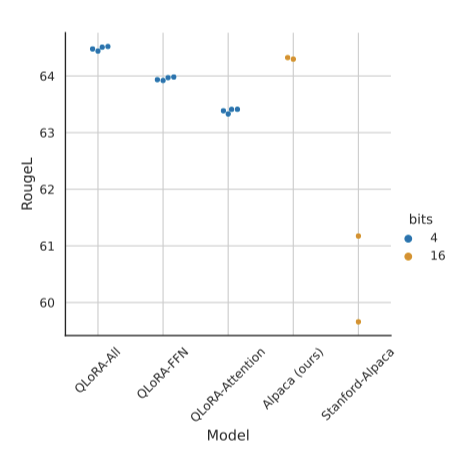
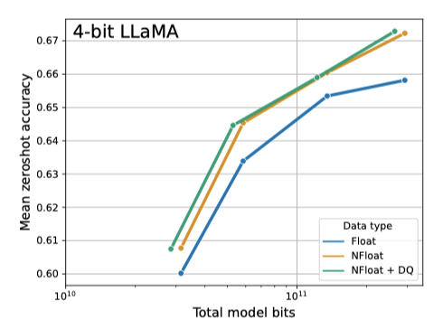
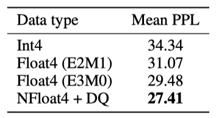
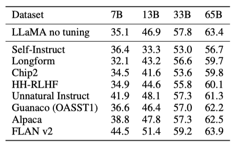
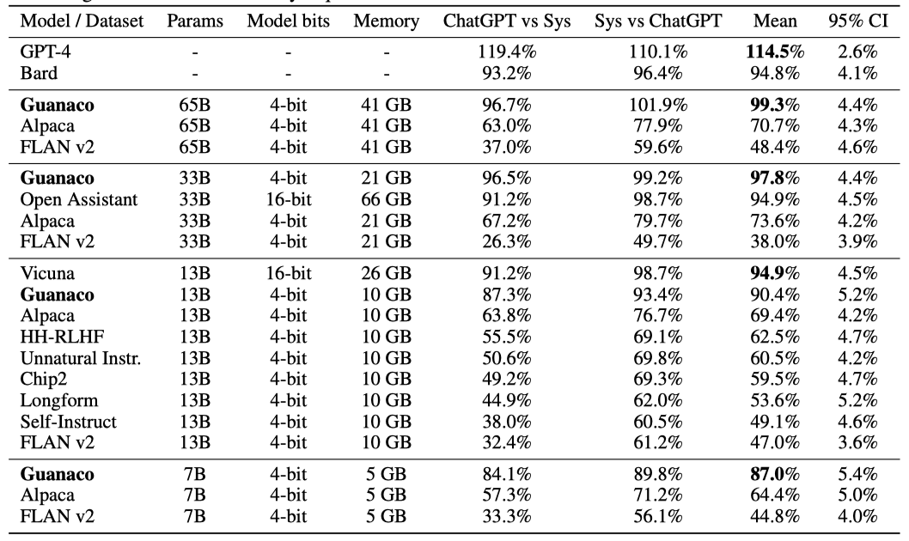
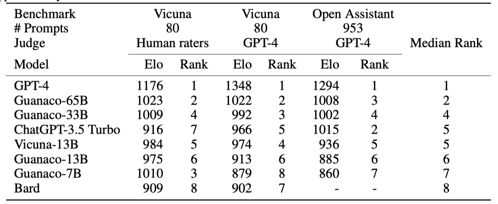

+++
author = "Kurt"
title = "QLoRA"
date = "2024-04-30"
description = "Efficient Finetuning of Quantized LLMs"
categories = [
    "Paper Review"
]
tags = [
    "LLM",
    "Quantization",
]
+++

## Abstract

QLoRA는 단일 48GB GPU에서 65B parameter 모델을 효율적으로 미세 조정 할 수 있는 방법으로, 메모리 사용량을 줄이면서도 전체 16비트 미세 조정 성능을 유지한다. 이 방법은 동결된 4비트 양자화 사전 학습 모델을 통해 gradient를 LoRA로 backpropagate 한다. Guanaco 모델은 Vicuna 벤치마크에서 기존 모델들을 능가하며, 단일 GPU를 사용해 24시간만에 ChatGPT의 99.3% 성능에 도달한다. QLoRA는 성능 저하 없이 메모리를 절약하는 여러 혁신을 도입했으며, 1,000개 이상의 모델을 미세 조정 해 다양한 데이터셋과 모델 규모에서 상세한 분석을 제공한다. 이 연구는 작은 고품질 데이터셋에서 최신 기술 결과를 달성할 수 있음을 보여주며, GPT-4 평가가 인간 평가의 합리적 대안임을 보여준다. 또한, 현재 챗봇 벤치마크의 신뢰성 문제를 지적하고, 모든 모델과 코드를 공개한다.

---

## Introduction

대규모 언어 모델(LLMs)을 미세 조정하는 것은 성능 향상과 바람직한 행동 조정에 효과적이지만, 매우 비용이 많이 든다. 예를 들어, 65B parameter 모델을 16비트로 미세 조정하려면 780GB 이상의 GPU 메모리가 필요하다. 양자화 기술로 메모리 사용량을 줄일 수 있으나, 이는 추론 시에만 유효하고 학습 시에는 적용되지 않는다.

QLoRA 방법을 통해, 처음으로 4비트 양자화 모델을 성능 저하 없이 미세 조정할 수 있음을 입증하였다. 이는 새로운 고정밀 기술로 모델을 4비트로 양자화하고, 양자화된 가중치를 통한 backpropagating gradient로 조정 가능한 Low-rank Adapter 가중치를 추가하는 방식이다.

QLoRA는 65B parameter 모델의 GPU 메모리 요구량을 780GB에서 48GB 미만으로 대폭 줄였다. 이를 통해 최대 규모의 공개 모델을 단일 GPU에서 세부 조정할 수 있게 되었으며, 실행 시간과 예측 성능은 기존 16비트 기준선과 동일하다. QLoRA를 사용해 Guanaco 모델을 훈련시켜 ChatGPT와의 성능 격차를 거의 해소했으며, 가장 작은 Guanaco 모델은 5GB 메모리로 Vicuna 벤치마크에서 Alpaca 모델을 크게 앞섰다.

QLoRA는 성능 손실 없이 메모리 사용을 줄이기 위해 여러 혁신을 적용한다: (1) 정규 분포 데이터에 최적화된 4비트 NormalFloat는 기존의 4비트 정수 및 부동 소수점보다 우수한 결과를 제공한다. (2) 이중 양자화는 양자화 상수를 추가로 양자화하여 parameter 당 평균 0.37비트를 절약한다. (3) 페이지 옵티마이저는 긴 시퀀스를 처리할 때 메모리 스파이크를 방지한다. 이러한 기법들을 통합해, QLoRA는 네트워크의 모든 layer에 adapter를 적용하며 이전 방법들에서의 정확도 타협을 대부분 해결한다.

QLoRA의 효율성 덕분에 기존 세부 조정 방식으로는 불가능한 크기의 모델들에 대한 지시사항 세부 조정과 챗봇 성능 연구를 수행할 수 있다. 이를 통해 80M에서 65B 파라미터 범위의 다양한 데이터셋과 모델 구조에서 1,000개 이상의 모델을 학습시켰다. 주요 발견으로, 데이터 품질이 크기보다 중요하며, 예를 들어 작은 데이터셋이 큰 데이터셋을 성능 면에서 능가하였다. 또한, 언어 이해 벤치마크에서의 성능이 챗봇 벤치마크에서의 성능을 보장하지 않음을 확인하였다. 이는 작업에 적합한 데이터셋의 중요성을 강조한다.

인간 평가자와 GPT-4를 사용한 챗봇 성능 분석에서, 토너먼트 방식을 통해 모델 간 경쟁이 이루어졌다. 이 경쟁에서는 Elo 점수로 순위가 결정되며, 대체로 GPT-4와 인간 평가의 순위가 일치하지만 강한 불일치 사례도 발견되었다. 이는 모델 기반 평가가 비용 효율적이긴 하지만, 일정한 불확실성을 가지고 있음을 시사한다.

Guanaco 모델에 대한 질적 분석을 통해 챗봇 벤치마크 결과를 보완하며, 이를 통해 정량적 평가에서 놓친 성공 및 실패 사례를 드러낸다.

인간 평가자와 GPT-4 주석이 달린 모든 모델 생성물을 공개하고, 코드베이스와 CUDA 커널을 오픈 소스로 제공한다. 또한, Hugging Face 트랜스포머 스택에 이 연구의 방법을 통합하여 접근성을 높였다. 7/13/33/65B 크기의 모델용 adapter와 8개 지시사항 데이터셋에서 학습된 32개의 미세 조정 모델을 공개한다.

---

## Background

**Block-wise k-bit Quantization** 양자화는 더 많은 비트를 가진 데이터 타입을 더 적은 비트의 데이터 타입으로 변환하는 과정이다. 이 과정에서 입력 데이터는 입력 요소들의 절대 최대값을 기준으로 정규화하여 저비트 데이터 타입의 전체 범위를 활용하도록 재조정된다. 예를 들어, 32비트 부동 소수점(FP32) 텐서를 [-127, 127] 범위의 8비트 정수(Int8) 텐서로 변환하는 경우가 있다.

$$ X^{Int8} = round \big( {{127}\over{absmax(X^{FP32}}} X^{FP32} \big) = round(c^{FP32} · X^{FP32}) $$

여기서 $c$는 양자화 상수 또는 양자화 스케일이다. 역양자화는 반대 과정이다:

$$ dequant(c^{FP32}, X^{Int8}) = {{X^{Int8}}\over{c^{FP32}}} = X^{FP32} $$

이 접근법의 문제는 입력 텐서 내의 큰 값(이상치)으로 인해 양자화 빈이 제대로 활용되지 않는다는 것이다. 이를 해결하기 위해, 입력 텐서를 각자의 양자화 상수 $c$를 가진 독립적으로 양자화되는 블록으로 나누는 방법이 일반적이다. 이 과정은 입력 텐서 $X$를 $n$개의 크기 $B$ 블록으로 나누고, 각 블록을 독립적으로 양자화하여 양자화된 텐서와 양자화 상수 ci를 생성하는 것으로 공식화할 수 있다.

**Low-rank Adapters** Low-rank Adapter (LoRA) 미세조정은 전체 모델 parameter를 고정하고 작은 학습 가능한 parameter 세트(adapter)를 사용해 메모리 요구사항을 줄이는 방법이다. 이 방법은 추가 요인화된 투영을 통해 선형 투영을 확장하며, stochastic gradient descent를 통해 adapter를 업데이트하여 손실 함수를 최적화한다.

$$ Y = XW + sXL_1 L_2 $$

여기서 $L1 \in \mathbb{R}^{h×r}$과 $L2 \in \mathbb{R}^{r×o}$이며, $s$는 스칼라이다.

**Memory Requirement of Parameter-Efficient Finetuning** LoRA 학습 중 메모리 요구사항은 adapter의 수와 크기에 관한 중요한 논의 사항이다. LoRA의 낮은 메모리 사용량 덕분에, 더 많은 adapter를 사용해도 전체 메모리 사용량을 크게 증가시키지 않고 성능을 향상시킬 수 있다. 대부분의 메모리 사용량은 LoRA parameter가 아닌 활성화 gradient에서 발생하며, 예를 들어 7B LLaMA 모델을 학습할 때 LoRA 입력 gradient는 567MB, LoRA parameter는 26MB를 차지합니다. gradient 체크포인팅을 통해 입력 gradient는 시퀀스 당 평균 18MB로 줄어들며, 이는 전체 학습 메모리 사용량을 크게 증가시키지 않고 더 많은 adapter를 사용할 수 있음을 의미한다. 이 점은 전체 16비트 정밀도 성능을 회복하는 데 중요하다.

---

## QLoRA Finetuning

QLoRA는 4비트 NormalFloat (NF4) 양자화와 이중 양자화 기술로 고품질 4비트 미세조정을 실현하며, 대규모 모델의 단일 기계 미세조정시 발생할 수 있는 메모리 부족 문제를 해결하기 위해 페이지 옵티마이저를 도입한다.

QLoRA는 4비트 저정밀도 저장과 BFloat16 계산 데이터 유형을 사용하여, 가중치 텐서를 BFloat16으로 역양자화한 뒤 16비트에서 행렬 곱셈을 진행한다.

**4-bit NormalFloat Quantization** NormalFloat (NF) 데이터 유형은 입력 텐서의 값들을 동등하게 분배하는 분위수 양자화에 기반한다. 이는 경험적 누적 분포 함수를 사용해 텐서의 분위수를 추정하는 방식으로 동작한다.

분위수 양자화는 분위수 추정이 비용이 많이 드는 것이 주요 제한점이다. 이를 해결하기 위해 SRAM 분위수 같은 빠른 근사 알고리즘이 사용되며, 이 알고리즘의 근사적 특성으로 인해 중요한 이상치 값에 대한 큰 양자화 오류가 발생한다.

양자화 상수에 따라 고정된 분포에서 온 입력 텐서는 비싼 분위수 추정과 근사 오류를 피할 수 있으며, 이 경우 동일한 분위수를 가지기 때문에 정확한 분위수 추정이 가능하다.

사전 학습된 신경망 가중치를 우리 데이터 유형의 [-1, 1] 범위에 맞게 전체 가중치를 단일 분포로 스케일링하여 정규화할 수 있다. 이 과정은 데이터 유형과 가중치의 분위수 모두 해당 범위 내로 정규화되어야 함을 의미한다.

제로 평균 정규 분포에 대한 정보 이론적으로 최적의 데이터 유형은, N(0, 1) 분포의 분위수를 이용해 k비트 데이터 유형을 얻고, 이를 [-1, 1] 범위로 정규화한 뒤, 입력 가중치 텐서를 같은 범위로 정규화하여 양자화하는 과정으로 계산된다.

가중치 범위와 데이터 유형 범위가 일치하면 정상적으로 양자화할 수 있으며, 이는 가중치 텐서의 표준 편차를 k비트 데이터 유형의 표준 편차와 일치시키는 과정이다. 데이터 유형의 $2^k$값 $q_i$는 다음과 같이 추정된다.

$$ q_i = {{1}\over{2}} \big( Q_X \big( {{i}\over{2^k+ 1}} + Q_X \big( {{i + 1}\over{2^k+ 1}} \big) \big) \big) $$

대칭적인 k비트 양자화는 0을 정확히 표현하지 못하는 문제가 있어, 이를 해결하기 위해 음수와 양수 부분에 대해 비대칭적인 분위수를 추정하여 모든 $2^k$비트를 활용하는 비대칭 데이터 유형을 만든다. 이 방법으로 양자화된 각 구간에 동일한 기대값을 가지는 제로 중심의 k비트 NormalFloat(NFk) 데이터 유형을 생성하며, 이는 정규 분포 데이터에 정보 이론적으로 최적이다.

**Double Quantization** Double Quantization(DQ)는 양자화 상수의 추가적인 메모리 절감을 위해 도입된 과정이다. 작은 블록 크기를 사용하는 정밀한 4비트 양자화는 높은 메모리 오버헤드를 발생시키지만, DQ는 양자화 상수의 메모리 사용량을 줄이는 데 유용하다. 예를 들어, W에 대해 32비트 상수와 64의 블록 크기를 사용하면 parameter 당 평균 0.5비트가 추가된다.

Double Quantization는 첫 번째 양자화의 양자화 상수를 FP32로 받아 FP8과 FP32로 두 단계에 걸쳐 재양자화한다. 8비트 부동소수점과 256 블록 크기를 사용해 성능 저하 없이 수행되며, 값들을 0 주변으로 중심화해 대칭 양자화를 적용한다. 이 과정은 평균적으로 parameter 당 메모리 사용량을 0.5비트에서 0.127비트로 줄여, 0.373비트를 절약한다.

**Paged Optimizers** NVIDIA 통합 메모리 기능을 통해, GPU 메모리 부족 시 CPU와 GPU 간 자동 데이터 이동을 통해 GPU의 원활한 처리를 지원한다. 이는 CPU RAM과 디스크 간의 메모리 페이징과 비슷하게 작동하며, 최적화 상태를 위한 메모리를 할당하고 필요 시 자동으로 CPU RAM과 GPU 메모리 간 이동한다.

**QLoRA.** 위에서 설명한 구성요소들을 사용하여, 양자화된 기본 모델에서 single LoRA adapter가 있는 single linear layer에 대한 QLoRA를 다음과 같이 정의한다:

$$ Y^{BF16} = X^{BF16} \text{doubleDequant} ( c_1^{FP32}, c_2^{k-bit}, W^{NF4} ) + X^{BF16} L_1^{BF16} L_2^{BF16} $$

doubleDequant(·)는 위에서 설명한 대로 정의된다.

$$ \text{doubleDequant} ( c_1^{FP32}, c_2^{k-bit}, W^{k-bit} ) = \text{dequant} ( \text{dequant} (c_1^{FP32}, c_2^{k-bit}), W^{4bit} ) = W^{BF16} $$

W에는 NF4, c2에는 FP8 사용, W는 정밀도를 위해 64 블록, c2는 메모리 절약을 위해 256 블록 사용한다.

parameter 업데이트 시 adapter 가중치의 오류 기울기 ${{∂E}\over{∂L_i}}$만 필요하며, 4비트 가중치 ${{∂E}\over{∂W}}$는 필요 없다. ${{∂E}\over{∂L_i}}$ 계산은 $W^{NF4}$에서 $W^{BF16}$으로 역양자화하며, BFloat16 정밀도로 ${{∂X}\over{∂W}}$ 미분을 계산한다.

QLoRA는 4비트 NormalFloat 저장 데이터 타입과 16비트 BrainFloat 계산 데이터 타입을 사용한다. 저장 데이터를 계산 데이터로 역양자화해 처리하지만, 16비트 BrainFloat를 사용하는 LoRA parameter의 가중치 gradient만 계산한다.

---

## QLoRA vs. Standard Finetuning

QLoRA의 효율성과 메모리 절감 방법을 논의한 후, 이제 QLoRA가 전체 모델 미세조정과 동등한 성능을 낼 수 있는지, 그리고 NormalFloat4의 효과에 대해 알아보려 한다.

**Experimental setup.** 이 연구에서는 세 가지 아키텍처(encoder, encoder-decoder, decoder only)를 사용하여 QLoRA를 16비트 adapter 미세조정 및 전체 미세조정과 비교 평가하며, 최대 3B 크기의 모델을 대상으로 한다. 평가는 GLUE에 대한 RoBERTa-large, Super-NaturalInstructions에 대한 T5, 그리고 Flan v2와 Alpaca에서 LLaMA를 미세조정한 후의 5-shot MMLU를 포함한다. 또한, NF4의 다른 4비트 데이터 타입 대비 장점을 조사하기 위해, 다양한 모델 크기(125m~13B)에 대한 후-양자화 zero-shot 정확도와 혼란도를 측정한다. 

33B/65B 크기의 QLoRA 튜닝을 위해 필수적인 페이지드 옵티마이저는 긴 시퀀스를 가진 미니 배치 처리 시에만 페이징이 발생하기 때문에 구체적인 측정값을 제공하지 않는다. 하지만 48GB GPU에서 배치 사이즈 16으로 실행 시 페이지드 옵티마이저가 일반 옵티마이저와 같은 학습 속도를 제공한다는 것을 확인하였다. 향후 페이징으로 인한 속도 저하 상황을 측정하고 분석할 필요가 있다.

**Default LoRA hyperparameters do not match 16bit performance** LoRA를 표준 방식으로 적용했을 때 대형 베이스 모델의 전체 미세조정 성능을 재현할 수 없는 것으로 나타났다. 특히, Alpaca에서 LLaMA 7B 미세조정 결과, LoRA에서 총 adapter 수가 가장 중요한 hyperparameter로, 전체 미세조정 성능을 달성하기 위해선 모든 linear transformer block layer에 LoRA 적용이 필요함을 확인하였다. 다른 hyperparameter들은 성능에 큰 영향을 미치지 않는다.

전체 미세조정된 기준 모델의 기본 hyperparameter가 부적절했음을 확인하고, learning rate 1e-6에서 5e-5, batch size 8에서 128까지 탐색을 통해 견고한 기준을 설정하였다.

**4-bit NormalFloat yields better performance than 4-bit Floating Point** 4비트 NormalFloat (NF4) 데이터 타입은 이론적으로 최적이나, 실제 이점이 있는지는 아직 불확실하다. 다양한 크기(125M에서 65B)의 양자화된 LLMs를 다양한 데이터 타입으로 언어 모델링 및 zero-shot 작업에 평가한 결과, NF4가 FP4와 Int4보다 성능을 크게 향상시키며, 이중 양자화로 메모리 사용량을 줄이면서도 성능 저하를 방지한다는 것을 확인하였다.

**k-bit QL O RA matches 16-bit full finetuning and 16-bit LoRA performance** 최근 연구에 따르면, 4비트 양자화로 추론이 가능하나 16비트 대비 성능이 떨어진다. 이에, 4비트 adapter 미세조정을 통해 성능 손실을 회복할 수 있는지 검토한다. 이를 위해 두 가지 방식으로 테스트를 진행한다.

GLUE와 Super-NaturalInstructions 데이터셋에서 125M에서 3B parameter의 RoBERTA와 T5 모델을 대상으로 한 16비트, 8비트, 4비트 adapter 방법이 16비트 완전 미세조정 기준선의 성능을 재현하였다. 이는 양자화로 인한 성능 손실이 adapter 미세조정을 통해 회복될 수 있음을 보여준다.

두 번째 실험에서는 11B 이상 parameter 모델을 전체 미세조정하는 데 한계가 있어, 7B에서 65B parameter 규모에서 4비트 QLoRA가 16비트 LoRA와 동일한 성능을 달성할 수 있는지 검증한다. LLaMA 7B에서 65B 모델을 Alpaca와 FLAN v2 데이터셋에서 미세조정하고 MMLU 벤치마크에서 5-shot 정확도로 평가한 결과, NF4가 이중 양자화로 16비트 LoRA의 성능을 완전히 회복하며, QLoRA는 16비트 기준에 비해 약 1% 포인트 낮은 성능을 보여주었다. 이는 NF4가 16비트 미세조정 및 LoRA 미세조정 성능을 재현하며 양자화 정밀도에서 FP4보다 우수함을 입증한다.

**Summary** 연구 결과는 4비트 QLoRA가 NF4 데이터 타입으로 16비트 미세조정 성능과 일치하며, NF4가 FP4보다 우월하고 이중 양자화가 성능 저하를 일으키지 않는다는 것을 보여준다. 이는 4비트 QLoRA 튜닝이 16비트 방법과 동등한 결과를 신뢰성 있게 제공한다는 강력한 증거이다.

MMLU 및 Elo 결과는 주어진 자원 예산 내에서 기본 모델의 parameter 수를 늘리고 정밀도를 줄이는 것이 유리함을 보여주며, QLoRA의 효율성 혜택을 강조한다. 4비트 미세조정에서 전체 미세조정에 비해 성능 저하가 없었기 때문에, QLoRA 튜닝의 성능-정밀도 트레이드오프 위치에 대한 질문이 제기되며, 이는 미래 연구의 과제로 남는다.

학술 연구 하드웨어에서 16비트 미세조정으로 탐색 불가능한 규모의 instruction tuning을 조사하고 있다.

---

## Pushing the Chatbot State-of-the-art with QLoRA

4비트 QLoRA가 다양한 규모와 작업, 데이터셋에서 16비트 성능에 맞춤을 확인한 후, 연구용으로 제공되는 가장 큰 오픈소스 언어 모델에 대한 instruction finetuning을 심층 연구한다. 이 과정에서 어려운 Natural Language Understanding benchmark(MMLU)를 통한 평가와 새로운 실세계 챗봇 성능 평가 방법을 개발한다.

### Experimental setup

**Data** 최근 지시사항을 따르는 데이터셋에 대한 종합적인 연구 부족으로, 크라우드 소싱, 모델 증류, 코퍼스 집합, 하이브리드를 포함한 8가지 최신 데이터셋을 선정하였다. 이 데이터셋들은 다양한 언어와 데이터 크기, 라이센스를 포함한다.

**Training Setup** 다양한 응답을 평가하는 데이터셋에서도 cross-entropy loss를 이용한 지도 학습 방식으로 QLoRA를 미세조정하며, 지시사항과 응답이 명확히 구분된 경우 응답 부분만을 대상으로 한다. 다수 응답이 가능한 OASST1과 HH-RLHF에서는 최상위 응답을 선택해 전체 대화를 포함하여 미세조정한다. 모든 실험에는 메모리 스파이크를 방지하기 위해 이중 양자화와 페이지화된 옵티마이저를 사용하는 NF4 QLoRA가 사용되며, 13B와 33B LLaMA 모델에 대한 하이퍼파라미터 탐색을 통해 학습률과 배치 크기를 제외한 모든 설정이 7B 모델에도 일반화됨을 확인한다. 33B와 65B 모델의 학습률은 반으로 줄이고 배치 크기는 두 배로 늘린다.

**Baselines** Vicuna와 Open Assistant같은 연구용 모델과 GPT-4, GPT-3.5-turbo, Bard 같은 상업용 챗봇 시스템을 비교한다. Open Assistant는 OASST1 데이터셋에서 RLHF로 미세조정된 LLaMA 33B 모델이고, Vicuna는 ShareGPT 사용자 대화로 미세조정된 LLaMA 13B 모델로, OpenAI GPT 모델의 증류 결과이다.

### Evaluation

MMLU 벤치마크를 사용해 초등 수학, 미국 역사 등 57개 언어 이해 작업의 성능을 측정한다. 5-shot 테스트 정확도 결과를 보고한다.

자동화된 평가와 인간 평가를 통해 생성 언어 능력을 검증한다. 이 두 번째 평가는 인간이 선별한 질문에 기반해 모델 응답의 질을 측정한다. 이 방법은 챗봇 모델 성능을 현실적으로 평가하는 점점 인기 있는 방법이지만, 표준화된 프로토콜은 없다. 모든 경우에 p=0.9, 온도 0.7을 적용하는 핵심 샘플링 방식을 사용하는 설정을 설명한다.

**Benchmark Data** Vicuna 프롬프트와 OASST1 검증 데이터셋을 사용하여 평가한다. Vicuna는 다양한 카테고리에서 80개의 수정되지 않은 프롬프트로, OASST1은 다국어 사용자와 조수 사이의 멀티턴 대화를 포함한다. 검증 데이터셋의 모든 사용자 메시지를 질문으로 사용하며, 총 953개의 고유 질문을 생성한다. 이들을 Vicuna 및 OA 벤치마크로 명명한다.

**Automated Evaluation** Chiang et al. 이 소개한 평가 프로토콜에 따라, Vicuna 벤치마크에서 ChatGPT (GPT-3.5 Turbo)와 다른 시스템의 성능을 GPT-4로 비교 평가한다. GPT-4는 질문에 대한 ChatGPT와 모델의 응답에 10점 만점으로 점수를 주고, 이를 바탕으로 모델의 성능을 ChatGPT의 성과 백분율로 나타낸다. 모델이 ChatGPT보다 높은 점수를 얻을 경우 상대 점수는 100%를 넘길 수 있다. 응답의 순서에 따라 점수에 영향을 미치는 것을 확인했으며, 이를 조정하기 위해 두 순서의 평균 점수를 사용하는 것을 권장한다.

시스템 출력을 직접 비교하여 성능을 측정한다. 평가 방식을 무승부를 포함한 세 가지 등급으로 단순화하고, GPT-4에게 최고 응답 선택 또는 무승부 선언 및 설명을 요청한다. Vicuna와 OA 벤치마크에서 모든 시스템 쌍의 비교를 진행한다.

**Human Evaluation** 최근 연구에 따르면 생성 모델을 시스템 평가에 효과적으로 사용할 수 있으나, GPT-4 평가가 인간의 판단과 일치하는지는 아직 증명되지 않았다. 이에, Vicuna 벤치마크에 대해 두 가지 자동 평가 방식에 따른 인간 평가를 병행하여 진행할 예정이다. 이를 위해 Amazon Mechanical Turk를 통해 ChatGPT와의 비교를 위한 두 명, 쌍 비교를 위한 세 명의 어노테이터를 확보할 계획이다.

**Elo Rating** 인간과 자동화된 비교를 통해 모델 간 토너먼트 경쟁을 진행한다. 주어진 프롬프트에 대한 최고의 응답을 뽑기 위해 모델 쌍이 경쟁하며, 이는 Bai et al.과 Chiang et al.의 연구 방식과 유사하지만 GPT-4 평가를 추가로 사용한다. 무작위 샘플링으로 Elo 등급을 계산하여 각 경기 후 예상 승률을 측정하고, 예상치 못한 결과는 Elo 등급에 큰 변화를, 예상된 결과는 작은 변화를 준다. 이 과정을 다양한 무작위 시드로 10,000번 반복하여 순서 효과를 통제한다. Elo 등급은 시간이 지남에 따라 플레이어의 기술 수준과 일치하도록 조정된다.

### Guanaco: QLoRA trained on OASST1 is a State-of-the-art Chatbot

자동화된 평가와 인간의 평가를 통해, OASST1 변형에서 미세 조정한 Guanaco 65B가 현재 공개된 최고 성능의 오픈소스 챗봇 모델로, ChatGPT와 경쟁적인 성능을 보인다는 것을 확인하였다. 인간 주석자의 Elo 등급에 따라, Guanaco 65B와 33B는 GPT-4와 비교해 30%의 예상 승률을 가진다. 이는 현재까지 가장 높은 수치이다.

Vicuna 벤치마크 결과에 따르면, Guanaco 65B는 GPT-4에 이어 두 번째로 성능이 우수한 모델로, ChatGPT 대비 99.3%의 성능을 달성하였다. Guanaco 33B는 메모리 효율성이 높아 Vicuna 13B 대비 용량을 줄였고, Guanaco 7B는 단 5GB로 현대 휴대전화에 적합하며 Alpaca 13B보다 20% 포인트 높은 성능을 보인다.

모델들이 성능에서 크게 겹치는 데, 이는 규모 명세의 불분명함 때문인 것으로 추측된다. 절대 척도 문제를 피하기 위해, 인간 평가자와 GPT-4의 쌍대 판단을 기반으로 하는 Elo 순위 방법을 추천한다. Vicuna 벤치마크에서 인간과 GPT-4의 모델 순위가 부분적으로 일치하지 않음에도, 대부분의 모델에서는 일관성이 있으며, 시스템 수준에서 Kendall Tau와 Spearman 순위 상관계수가 각각 $τ = 0.43$, $r = 0.55$이다. 예시 수준에서의 일치는 더 약하며 Fleiss $κ = 0.25$로 측정된다. 전반적으로, 이는 시스템 수준에서 GPT-4와 인간 평가자 사이에 중간 수준의 일치를 보여주며, 모델 기반 평가가 인간 평가의 신뢰할 수 있는 대안이 될 수 있음을 나타낸다. 추가 고려사항은 6.2절에서 논의된다.

Guanaco 33B와 65B 모델은 Vicuna와 OA 벤치마크에서 GPT-4를 제외한 다른 모든 모델을 능가하고, ChatGPT와 유사한 성능을 보인다. Vicuna는 오픈소스 모델을, OA는 ChatGPT를 선호한다. 미세조정 데이터셋의 적합성은 성능에 중요한 요소로, FLAN v2에서 미세조정된 Llama 모델은 MMLU에서는 잘 수행되지만 Vicuna에서는 성능이 가장 낮다. 이는 평가 벤치마크 사이의 부분적 직교성을 보여주며, MMLU 성능이 챗봇 성능을 보장하지 않음을 나타낸다.

평가에서 Guanaco는 독점 데이터가 아닌 OASST1 지침에 따라 학습된 유일한 최상위 모델이며, 오픈소스 데이터에만 기반한 다음으로 좋은 모델은 Anthropic HH-RLHF로, Vicuna 벤치마크에서 Guanaco보다 30% 포인트 낮게 평가되었다. 이 결과는 4-bit QL O RA 기술이 효과적이며, ChatGPT와 경쟁할 수 있는 최신 챗봇을 만들 수 있음을 보여주며, 33B Guanaco는 24 GB 소비자 GPU에서 12시간 이내에 학습될 수 있다. 이는 특수 오픈소스 데이터에 대한 QLoRA 튜닝을 통해 최고의 상업 모델과 경쟁할 수 있는 모델을 개발할 수 있는 새로운 가능성을 제시한다.

---

## Qualitative Analysis

양적 분석이 평가의 핵심이지만, 요약 통계만 본다면 여러 문제가 발생한다. 가장 큰 문제 중 하나는 벤치마크의 타당성이며, 기계 학습 모델이 때때로 벤치마크를 해결하기 위한 지름길을 찾아내는 것이다. 이 문제를 부분적으로 해결하기 위해, 두 부분으로 구성된 질적 분석을 수행하였다. 첫 번째 부분에서는 65b Guanaco 모델이 생성한 텍스트의 패턴을 대표하는 예시를 보여주고, 두 번째 부분에서는 이에 대한 결과와 해석에 대한 고려사항을 설명한다.

### Qualitative Analysis of Example Generations

예시를 찾기 위해, 우리는 Vicuna와 OpenAssistant 벤치마크에서 생성된 데이터를 살펴보고 Guanaco의 답변 패턴을 찾는다. 패턴이 발견되면, 해당 패턴을 유도할 수 있는 질문이나 프롬프트를 설정한다. 예를 들어, 모델이 장황한 답변을 하는 경향이 있다면 설명 없이 예 또는 아니오로만 답하라고 요청합니다. 이 방법으로 모델을 깨뜨린 레몬과 실패한 체리 사례를 찾아 제시한다. 이 섹션의 모든 결과는 Nucleus Sampling을 사용하여 $p = 0.9$로 생성되었다.

물론, 이 연구는 모든 변수를 통제하기에는 범위가 제한적이므로 완전하진 않다. 특히, 모델이 생성할 수 있는 응답의 범위가 넓기 때문에 대표적인 샘플에 의존한다. 하지만, 이 예시들이 논문의 양적 증거에 맥락을 제공한다고 생각한다. 모든 모델과 코드를 공개함으로써, 이 섹션이 미래의 연구에 영감을 줄 것을 희망한다.

### Considerations

**Evaluation** 인간 주석자들 사이에서는 보통 수준의 합의(Fleiss $κ = 0.42$)가 있었으나, 두 강력한 시스템을 비교하면서 추가적인 문제가 발생하였다. 이는 챗봇 성능 평가를 위한 현재 벤치마크와 인간 평가 방식의 한계를 나타낸다. Vicuna 벤치마크에서 ChatGPT와 Guanaco 65B의 비교는 주관적 선호가 중요한 역할을 하며, 저자들 사이에 선호도에 대한 의견 차이가 컸다. 향후 연구는 주관적 선호를 다루는 인간-컴퓨터 상호작용 및 심리학 분야의 메커니즘을 활용하여 이 문제를 완화할 방법을 모색해야 한다.

분석을 통해 자동 평가 시스템에 편향이 있음을 확인하였다. GPT-4는 프롬프트에서 먼저 나타나는 시스템에 높은 점수를 주는 순서 효과를 보였고, GPT-4와 인간 주석자 사이에는 약한 합의(Fleiss $κ = 0.25$)가 있어 선호도가 일치하지 않을 수 있음을 보여준다. 특히, GPT-4는 자신의 출력에 인간 평가보다 높은 점수를 부여했으며, 이는 승리 확률을 20% 더 높여준다. 미래 연구는 자동 평가 시스템의 잠재적 편향과 그 완화 방안을 탐구해야 한다.

**Data & Training** Guanaco 모델이 다국어 데이터셋 OASST1에 기반하여 학습되었고, OA 벤치마크에도 다양한 언어의 프롬프트가 포함되어 있다는 점을 언급한다. 다국어 학습이 영어 외 언어의 지시사항 성능 향상에 미치는 영향과 이것이 영어만 학습된 Vicuna13B와 Guanaco 33B 및 65B 사이의 성능 차이를 설명할 수 있는지는 앞으로의 연구 과제이다.

Guanaco 모델의 성능을 분석하기 위해, OASST1 데이터와 Vicuna 벤치마크 프롬프트간 데이터 유출 여부를 조사했으나, 퍼지 문자열 매칭 후 중복 프롬프트는 발견되지 않았다.

이 모델은 reinforcement learning from human feedback(RLHF) 대신 cross-entropy loss로만 학습되었다. 이로 인해 cross-entropy와 RLHF 학습 사이의 트레이드오프에 대한 추가 조사가 필요하다. QLoRA를 통해 대규모 분석이 가능하며, 이는 과도한 계산 자원 없이도 수행될 수 있다.

---

## Related Work

**Quantization of Large Language Models** LLM 양자화는 추론 시간 동안의 성능 향상에 초점을 맞추고 있으며, 16비트 품질을 유지하기 위해 이상치 관리(예: SmoothQuant, LLM.int8())와 복잡한 그룹화 방법을 사용한다. 손실 양자화는 반올림 트레이드오프와 정밀도 개선을 위한 최적화를 연구한다. SwitchBack 레이어는 10억 parameter 이상에서 양자화된 가중치를 통한 역전파를 다룬 유일한 연구이다.

**Finetuning with Adapters** Low-rank Adapters (LoRA)를 사용했지만, 프롬프트 튜닝, 임베딩 레이어 입력 조정, 숨겨진 상태 조정, 전체 레이어 추가, 바이어스 조정, Fisher 정보 기반 가중치 마스크 학습 등 다양한 Parameter Efficient FineTuning (PEFT) 방법들이 제안되었다. 이 연구는 LoRA adapter가 16비트 미세조정 성능을 달성할 수 있음을 보여준다. 다른 PEFT 방법들의 트레이드오프는 향후 연구에서 다룰 예정이다.

**Instruction Finetuning** 사전 학습된 대규모 언어 모델(LLM)을 지시사항에 따라 출력을 생성하도록 미세조정하는 instruction finetuning은 다양한 데이터 소스의 입력-출력 쌍을 활용한다. 이를 위한 접근 방법과 데이터셋으로는 MetaICL, MetaTuning, InstructGPT, FLAN 등이 있으며, 여러 프로젝트들이 이 분야의 발전에 기여하고 있다.

**Chatbots** 대화 기반 챗봇 모델은 주로 Reinforcement Learning from Human Feedback(RLHF)이나 AI model feedback(RLAIF)을 통해 학습합니다. AnthropicHH, Open Assistant, LaMDA, Sparrow 등의 접근 방법과 데이터셋이 있다. 이 모델 Guanaco는 강화 학습 대신 RLHF용 Open Assistant 데이터셋을 사용하여 다단계 채팅 상호작용에 미세조정되었다. 또한, 비용이 많이 드는 인간 주석 대신 GPT-4를 활용한 챗봇 평가 방식을 개선하여 더 신뢰할 수 있는 평가 설정에 집중하였다.

---

## Limitations and Discussion

이 연구의 방법인 QLoRA가 4비트 베이스 모델과 LoRA를 사용해 16비트 미세조정 성능을 복제할 수 있음을 보였지만, 33B와 65B 규모에서의 전체 성능 매칭은 아직 확립되지 않았다. 리소스 비용 문제로 인해 이 부분은 향후 연구로 남겨져 있다.

MMLU, Vicuna, OA 벤치마크 등에서 instruction finetuning 모델을 평가했으나, BigBench, RAFT, HELM 같은 다른 벤치마크에서는 평가하지 않아 이 연구의 평가가 일반화될지 불확실하다. 그럼에도 불구하고, MMLU에서 광범위한 연구를 진행하고 챗봇 평가를 위한 새로운 방법을 개발하였다.

제시된 증거에 따르면, 벤치마크의 성능은 미세조정 데이터와 벤치마크 데이터셋의 유사성에 따라 달라질 수 있다. 예를 들어, FLAN v2는 MMLU와 유사하지만 챗봇 벤치마크와는 다르며, 이러한 차이는 벤치마크 점수에도 영향을 미친다. 이는 더 나은 벤치마크와 정밀한 평가의 필요성을 강조하며, 무엇을 평가하려는지에 대한 명확한 결정이 필요함을 시사한다. 또한, 기존 벤치마크에 의존하는 것보다 새로운 벤치마크를 개발하는 것이 어렵지만, 중요한 것을 측정하는 벤치마크를 확보하는 것이 커뮤니티의 목표가 되어야 한다.

일반 챗봇 성능에 대한 상세 평가와 함께, Guanaco에 대한 제한적인 책임 있는 AI 평가를 진행한다. Guanaco-65B가 사회적 편향을 가진 토큰 시퀀스를 생성할 가능성이 다른 모델들에 비해 낮다는 것을 확인하였다. 이는 OASST1 데이터셋을 이용한 미세조정이 LLaMA 베이스 모델의 편향을 줄이는데 기여한다는 것을 시사한다. 하지만, 다른 유형의 편향 평가에서도 Guanaco의 성능이 좋은지는 불분명하다. Guanaco를 포함한 챗봇의 편향 분석에 대한 추가적인 평가는 향후 연구로 남긴다.

다양한 비트 정밀도나 다른 adapter 방법들을 평가하지 않았다. LoRA 외에도 여러 PEFT 방법들이 잘 작동하지만, 이들이 대규모 모델에 적용 가능한지는 미지수이다. LoRA를 선택한 것은 그의 견고함 때문이지만, 다른 adapter가 더 나은 성능을 낼 수도 있다. 양자화 후 미세조정이 정보 손실을 대부분 회복할 수 있어, 더 공격적인 양자화가 가능해질 수 있으며, LoRA를 사용한 3비트 양자화는 미세조정 후 16비트 미세조정 성능에 버금갈 수 있다.

---

## Broader Impacts

QLoRA 미세조정 방법은 단일 GPU에서 각각 33B와 65B parameter 모델을 미세조정할 수 있는 첫 번째 방법으로, 성능 저하 없이 실행된다. 이 방법은 Open Assistant 데이터셋에서 학습된 33B 모델이 Vicuna 벤치마크에서 ChatGPT와 경쟁할 수 있음을 보여준다. instruction finetuning의 필요성을 고려할 때, 이 방법은 특히 자원이 적은 연구자들에게 미세조정을 보편화하고 접근성을 높이는 데 기여할 것이다. QLoRA는 대기업과 소규모 팀 간의 자원 격차를 줄이는 평등화 요소로 작용한다.

QLoRA 방법은 모바일 폰과 같은 저자원 환경에서 LLM의 미세조정을 가능하게 하는 첫 번째 방법으로, 아이폰 12 플러스를 사용해 밤새 300만 토큰을 미세조정할 수 있다. 비록 미세조정된 7B 모델이 ChatGPT의 품질에는 미치지 못하지만, 개인정보 보호와 LLM 품질 문제로 인해 이전에는 불가능했던 새로운 애플리케이션을 가능하게 할 충분한 품질을 제공한다. QLoRA는 사용자가 자신의 데이터와 모델을 소유하고 관리하며, 동시에 LLM의 배포를 용이하게 하는 개인 정보 보호를 보장하는 사용을 가능하게 한다.

미세조정은 잘못 사용될 경우 위험한 이중 사용 기술이다. LLM의 널리 퍼진 사용은 위험을 안고 있지만, 기술에 대한 평등한 접근을 제공함으로써 모델이나 소스 코드를 공개하지 않는 대기업보다 독립적인 분석을 촉진할 수 있다고 믿는다.

결론적으로, QLoRA는 고품질 LLM의 미세조정을 보다 쉽고 널리 접근 가능하게 하여 긍정적인 영향을 줄 것으로 예상된다.

---

## Reference

* [Paper](https://arxiv.org/pdf/2305.14314.pdf)
* [GitHub](https://github.com/artidoro/qlora)