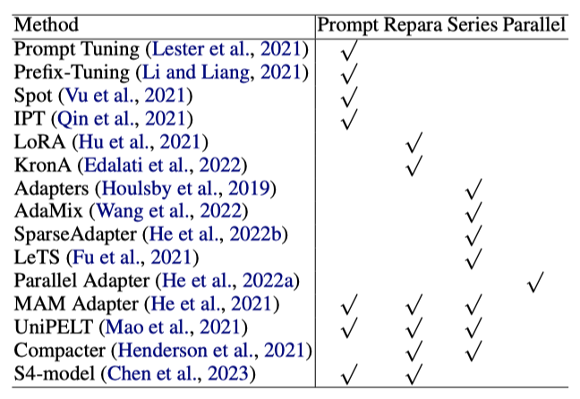
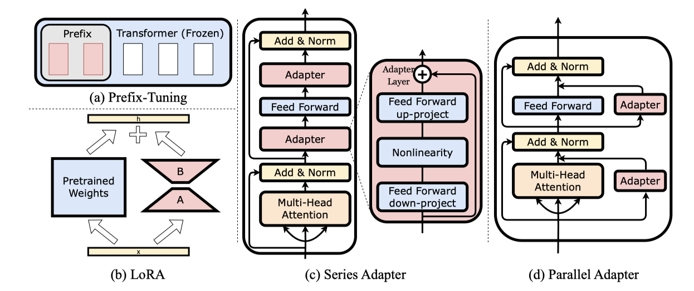
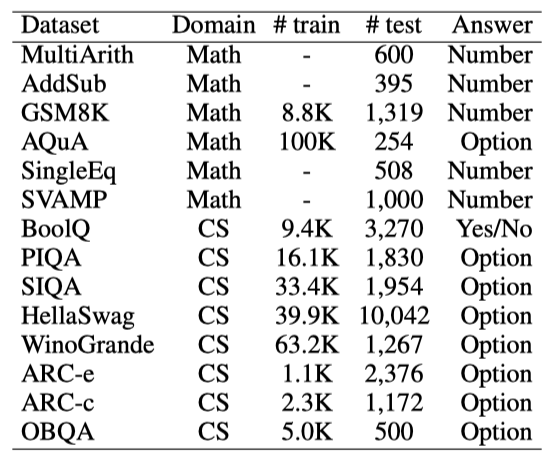
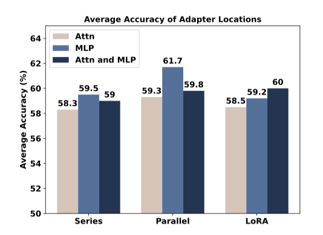
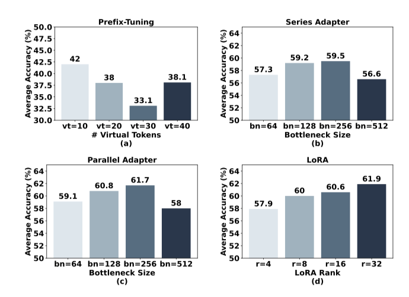
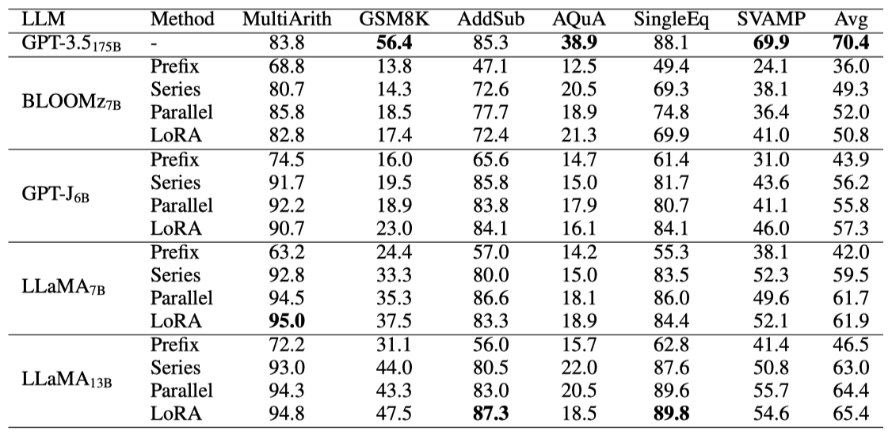
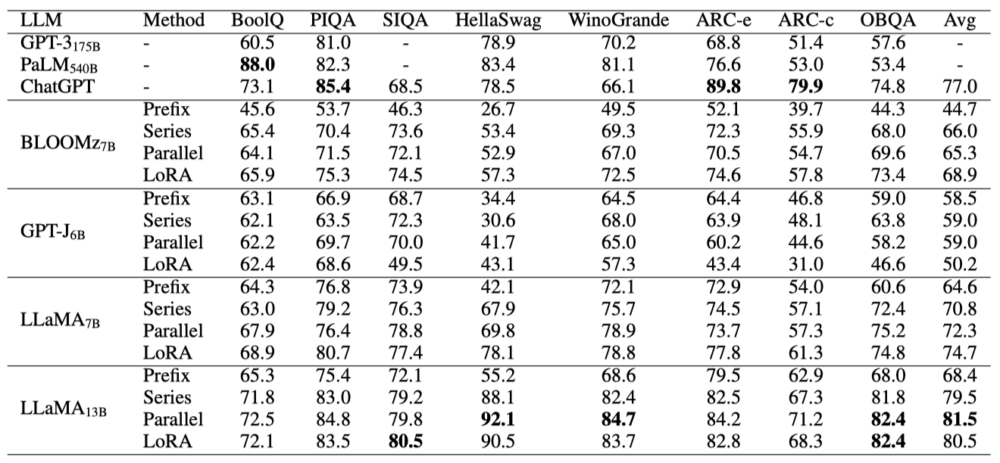
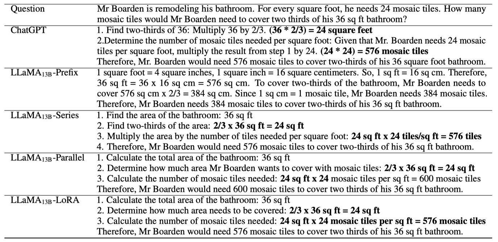

+++
author = "Kurt"
title = "LLM-Adapters"
date = "2024-04-09"
description = "An Adapter Family for Parameter-Efficient Fine-Tuning of Large Language Models"
categories = [
    "Paper Review"
]
tags = [
    "NLP",
    "PEFT",
]
+++

## Abstract

GPT-4 및 ChatGPT와 같은 대규모 언어 모델(LLMs)의 성공에 힘입어, 특정 과제 데이터나 지시 데이터로 LLMs를 미세 조정하여 비용 효율적이고 접근성 높은 대안들이 개발되었다. adapter 기반의 parameter-efficient fine-tuning(PEFT)은 이 중에서도 전체 모델 대신 몇몇 parameter만 조정하여 우수한 성능을 내는 매력적인 방법이다. 본 논문은 LLM에 다양한 adapter를 통합하고, 이를 이용해 다른 과제에 적용할 수 있는 LLMAdapters 프레임워크를 제시한다. 이를 통해 adapter의 유형, 배치, hyper-parameter의 최적 설계를 연구하고, 산술 추론과 상식 추론 과제에서 뛰어난 성능을 입증하였다. 결과적으로, 소규모 LLMs에서도 adapter 기반 PEFT를 사용하여 몇 가지 추가 parameter만으로도 강력한 LLMs와 동등하거나 우수한 성능을 보여주었다.

---

## Introduction

대규모 언어 모델(LLMs)인 ChatGPT와 GPT-4는 다양한 NLP와 멀티 모달 작업에서 뛰어난 성능을 보였으나, 수백 억 개의 parameter를 가진 클로즈 소스 모델이기에, LLaMA와 같은 접근 가능하고 비용 효율적인 오픈 소스 대안이 개발되었다. 이 대안들은 특정 작업이나 지시적 데이터로 미세 조정되지만, full-model fine-tuning(FFT)은 계산 및 저장 공간이 많이 필요해 실제 적용에 있어 도전적이다.

LLMs의 전체 FFT 등장 전, NLP 분야에서는 사전 학습된 모델(예: BERT)을 위한 parameterefficient fine-tuning(PEFT)이 제안되었다. PEFT는 소수의 외부 parameter만을 미세 조정하여 전체 모델에 비교해도 우수한 성능을 달성하고 재앙적 망각을 완화할 수 있는 장점이 있다. 이러한 장점으로 인해 다양한 PEFT 모듈이 개발되었으며, 이에는 series adapter 및 parallel adapter, reparameterization 기법, 프롬프트 기반 학습 방법 등이 포함된다.

PEFT 모듈을 LLMs에 통합함으로써, 적은 계산 자원으로도 백본 모델의 강력한 능력을 활용할 수 있게 된다. 이는 고성능 컴퓨팅 접근성이 제한된 이들도 LLM을 이용할 수 있게 해준다. 그러나 어떤 PEFT 모듈이 특정 작업이나 데이터셋에 가장 적합한지는 아직 불분명하여, 다양한 상황에서 최고의 성능을 내기 위한 최적의 PEFT 구성을 찾기 위한 추가 연구가 필요하다.

본 논문에서는 BLOOM, GPT-J, 그리고 LLaMA와 같은 세 가지 주요 오픈 소스 LLM을 대상으로 PEFT에 관한 심층적 실증 연구를 진행한다. 이 연구는 다음 세 가지 주요 질문에 초점을 맞춘다: (i) PEFT 방법의 최적 배치 및 구성, (ii) downstream 작업에서의 adapter 성능 비교, 그리고 (iii) 분포 내(ID) 대 분포 외(OOD) 시나리오에서의 PEFT 성능 차이이다. 연구 결과는 다음 질문들에 대한 답을 제공한다:

1. series adapter, parallel adapter, 그리고 LoRA의 최적 배치는 각각 MLP layer 이후, MLP layer와 병렬로, 그리고 Attention layer와 MLP layer 모두 이후에 위치하는 것이다.
2. PEFT 접근 방식을 적용한 작은 언어 모델은 특정 작업에서 더 큰 언어 모델에 비해 경쟁력 있는 또는 우수한 성능을 달성할 수 있다. 예를 들어, LoRA를 적용한 LLaMA-13B는 MultiArith, AddSub, SingleEq에서 GPT-3.5(>175B)를 능가할 수 있다.
3. adapter를 사용하여 ID로 미세 조정된 LLaMA-13B는 상식 추론 작업에서 ChatGPT를 능가함으로써, 작은 언어 모델이 특정 작업에서 ID 미세 조정 데이터를 사용하여 더 큰 언어 모델을 능가할 수 있는 잠재력이 있음을 나타냈다.

이 연구의 기여는 다음과 같이 요약될 수 있다:

* 다양한 오픈 소스 LLM에 적용된 여러 PEFT 방법에 대한 포괄적인 실증 연구를 수행한다.
* 실증 연구를 용이하게 하기 위해, 수학 추론 및 상식 추론 작업에서 PEFT 성능을 향상시키기 위해 두 개의 고품질 학습 데이터셋을 구축한다.
* 사용자 친화적인 프레임워크인 LLM-Adapter를 개발하여, 다양한 어댑터를 LLM에 원활하게 통합함으로써 연구자들이 다양한 작업에 대해 어댑터 기반 PEFT 방법을 구현할 수 있도록 지원한다.
* 미래 연구에 대한 영감을 주기 위해 세 가지 연구 질문에 답하기 위한 광범위한 실험을 수행한다.

---

## PEFT Overview

이 섹션은 parameter-efficient fine-tuning (PEFT) 방법 4가지를 소개한다.

**Prompt-based learning.** 프롬프트 기반 학습은 하드 프롬프트 최적화 문제를 연속적인 소프트 프롬프트로 변환한다. 이를 위해 Lester et al. (2021)은 프롬프트 튜닝으로 입력에 학습 가능한 텐서를 추가했고, Li and Liang (2021)은 모든 레이어에 소프트 프롬프트를 추가하는 Prefix Tuning을, Qin et al. (2021)은 소프트 프롬프트를 압축/해제하는 Intrinsic Prompt Tuning을 각각 제안하였다. 이러한 방법들은 attention layer에 통합된 학습 가능한 벡터를 통해 구현된다.

$$ H_o = Attn(H_i W_Q, [P_K; H_i W_K], [P_V; H_i W_V]), $$

$H_i$와 $H_o$는 attention layer의 입력과 출력이며, $T$는 최대 입력 길이, $d$는 벡터 차원이다. $P_K$와 $P_V$는 PEFT의 학습 가능한 벡터이고, $L$은 실험 섹션에서 논의된 학습 가능한 토큰 수이다. $Q$, $K$, $V$는 주의 모듈의 쿼리, 키, 값 벡터를 의미한다.

**Reparametrization-based method.** 이 방법들은 low-rank 기술을 이용해 네트워크 가중치를 변환하여 high-dimensional 행렬 처리 능력을 유지하면서 학습 가능한 parameter 수를 줄인다. Intrinsic SAID는 low-rank 부공간에서 미세조정의 내재적 차원을 탐구하고, LoRA는 가중치 행렬을 저랭크 행렬의 곱으로 업데이트하는 방법을 제안한다. KronA는 LoRA의 개선을 위해 Kronecker 곱을 사용한다. reparametrization 학습의 예로 LoRA를 들 수 있다.

$$ H_o = H_i W_0 + H_i ∆W = H_i W_0 + H_i BA $$

$W_o$은 사전 학습된 가중치 행렬이며, $B$와 $A$는 $∆W$를 위한 low-rank 행렬이다. $r ≪ d$는 LoRA의 중요한 hyper-parameter이다.

**Series Adapter.** series adapter는 특정 sublayer 내에 추가적인 학습 가능한 모듈을 순차적으로 통합하는 방법이다. Houlsby et al. (2019)은 Transformer 모델의 attention 및 FFN layer 이후에 fully-connected network를 통합하는 것을 제안했고, Pfeiffer et al. (2020)은 self-attention layer 이후에만 adapter를 삽입하여 비교 가능한 성능을 달성할 수 있다고 밝혔다. AdaMix는 multiple series adapter를 MoE 방식으로 활용하고, Compacter는 adapter의 계산 복잡성을 줄이기 위해 Kronecker 곱, low-rank 행렬, parameter 공유를 사용한다.

$$ H_o ← H_o + f(H_o W_{down})W_{up} $$

특정 layer, 예를 들어 MLP layer의 출력 $H_o$가 먼저 $W_{down} ∈ R^{d×r}$에 의해 하향 투영되어 낮은 차원 $r$로 변환된 후, $W_{up} ∈ R^{r×d}에 의해 다시 원래 차원 $d$로 상향 투영된다. $f$는 비선형 함수이다. $r$의 선택에 대해서는 experiment 섹션에서 논의한다.

**Parallel Adapter.** parallel adapter는 백본 모델 내 sublayer와 병렬로 추가 학습 모듈을 통합하는 기법이다.

$$ H_o ← H_o + f(H_i W_{down})W_{up} $$

Multi-head Parallel Adapter는 parallel adapter로 head attention의 출력을 수정한다. Scaled Parallel Adapter는 LoRA의 형식을 adapter에 적용한 변형이며, Ladder Side-Tuning은 lightweight ladder side network를 통해 백본 네트워크의 intermediate activation을 처리한다.

---

## Experiment Setup

### Benchmarks

산술 추론과 상식 추론 두 가지 범주에서 총 14개의 벤치마크 데이터셋에 대한 광범위한 경험적 연구를 수행하였다. 산술 추론 분야에는 GSM8K, SVAMP, MultiArith, AddSub, AQuA, SingleEq 데이터셋이 포함되며, 이들은 초등학교 수준의 수학 문제와 대수 문제를 다룬다. 상식 추론 분야에는 BoolQ, PIQA, SIQA, HellaSwag, WinoGrande, ARC-c, ARC-e, OBQA 데이터셋이 포함되어 있으며, 이들은 예/아니오 질문 응답, 물리적 상식, 사회적 함의 추론, 과학 질문 등을 포함한다.

### Fine-tuning Data Collection

수학 추론과 상식 추론을 위해 특별히 설계된 두 개의 고품질 학습 데이터셋(GSM8K, AQuA, MAWPS, MAWPS-single)을 사용하여 adapter를 미세조정한다. 데이터의 다양성을 높이기 위해 선정된 데이터셋에서 방정식과 답만 제공되므로, 모델의 추론 능력을 향상시키기 위해 ChatGPT를 teacher 모델로 사용하여 추론 단계를 생성한다. 잘못된 답변을 제거한 후, 최종적으로 10K의 수학 추론 샘플 세트인 Math10K를 얻어 추가 분석과 미세조정에 사용한다.

상식 추론 분야의 미세조정을 위해 BoolQ, PIQA, SIQA, HellaSwag, WinoGrande, ARC-e, ARC-c, OBQA 등의 학습 세트를 사전 정의된 템플릿으로 포맷하여 미세조정 데이터를 만든다. 각 데이터셋의 고유한 작업 설명을 포함하는 구조화된 템플릿을 사용한다. 이 과정을 통해 170K 상식 추론 샘플인 Commonsense170K를 생성하며, 이 데이터셋은 추가 연구를 위해 공개될 예정이다.

### Implementations

연구 및 실제 응용을 위해 PEFT 방법을 쉽게 활용할 수 있도록 LLMAdapter 프레임워크를 개발하였다. 이는 LLaMA, BLOOMz, GPT-J와 같은 기본 모델에 다양한 adapter를 통합한다. Prefix-Tuning, Series Adapter, LoRA, Parallel adapter 등 PEFT 방법의 네 가지 주요 카테고리를 실험하여 효과를 검증한다. 모든 실험은 batch size 16과 특정 학습률 설정 하에 3 epoch 동안 진행된다. 중요한 것은, 수학 또는 상식 추론 작업을 위해 단일 모델을 미세조정하고 모든 관련 데이터셋에서 성능을 평가한다는 것이다.

---

## Experiment Results

### Placement and Configuration

다양한 adapter 유형의 최적 배치와 설정을 찾기 위해 LLaMA-7B 모델을 사용한 연구에서, Series Adapter는 MLP layer 뒤에, Parallel Adapter는 MLP layer 내에, LoRA는 multi-head attention layer와 MLP layer 둘 다에 삽입할 때 각각 최고의 성능을 보여주었다. 그 결과, Series Adapter는 59.5%, Parallel Adapter는 61.7%, LoRA는 60%의 평균 정확도를 수학 추론 데이터셋에서 달성하였다.

다양한 PEFT 방법의 최적 구성을 결정하기 위해, 수학 추론 데이터셋에서 가장 중요한 변수의 영향을 분석하였다. Prefix-tuning은 가상 토큰을 10개 설정했을 때 42.0%의 평균 정확도를 보였고,series 및 parallel adapter는 병목 크기를 256으로 설정했을 때 가장 높은 성능을 나타났다. 반면, 병목 크기가 512로 증가하면 정확도가 감소하였다. LoRA는 순위를 8에서 32로 증가시킬 때 평균 정확도가 60.0%에서 61.9%로 향상되었다고 한다.

각 adapter의 최적 설정을 결정했고, 이는 다음 실험에서 일관되게 사용한다.

* Prefix-Tuning의 경우, 가상 토큰의 수를 10으로 설정한다.
* series 및 parallel adapter의 경우, MLP layer에 원활하게 통합하며 병목 크기를 256으로 구성한다.
* LoRA와 관련하여, multi-head attention layer와 MLP layer 모두에 순위 32로 원활하게 통합한다.

### Arithmetic Reasoning

수리 추론 작업에서 adapter를 평가하기 위해 Math10K에서 미세 조정 후 여러 데이터셋을 사용해 연구를 진행하였다. 기준선인 GPT-3.5 모델에 비해, 간단한 수학 데이터셋에서는 LoRA를 사용한 LLaMA-13B와 같은 adapter 기반 방법이 더 우수한 성능을 보였으며, 평균적으로 GPT-3.5의 성능의 약 92.8%를 달성하였다. 이는 적은 양의 학습 가능한 parameter로도 adapter 기반 PEFT가 특정 과제에서 높은 성능을 낼 수 있음을 보여준다. 하지만 더 복잡한 작업에서는 여전히 성능 격차가 있다.

### Commonsense Reasoning

상식 추론 과제에서 다양한 PEFT 방법의 효과를 평가한 결과, Commonsense170K 데이터셋으로 미세 조정된 LLaMA-13B가 Series Adapter, Parallel Adapter, 그리고 LoRA를 사용하여 GPT-3, PaLM, 그리고 ChatGPT를 포함한 모든 기준 모델보다 더 우수한 성능을 보여주었다. 특히, LLaMA-13B와 Parallel Adapter는 평균 정확도 81.5%로, ChatGPT보다 4.5% 향상된 결과를 달성하였다. 이는 PEFT 방법의 성능이 기본 모델의 능력에 의해 영향을 받으며, LLaMA-7B와 LLaMA-13B가 BLOOMz와 GPT-J보다 상식 추론에서 더 우수함을 보여준다.

### ID and OOD Analysis

상식 추론과 수학 추론 과제에서 PEFT 방법의 성능을 비교한 결과, 상식 추론 분야에서 더 뛰어난 성과를 보여주었다. Commonsense170K 데이터셋을 사용한 상식 추론에서는 LLaMA-13B와 같은 작은 언어 모델이 큰 언어 모델인 ChatGPT와 PaLM을 능가할 수 있음이 확인되었다. 반면, Math10K 데이터셋을 사용한 수학 추론에서는 LLaMA-13B가 GPT-3.5보다 우수하긴 하지만, ID 데이터셋에서는 여전히 성능 격차가 존재한다. 이는 작은 LLM의 추론 능력이 제한적일 수 있음을 시사하며, 복잡한 수학 추론 과제에서 PEFT 방법의 성능을 향상시키는 방안을 모색하는 것이 미래 연구의 중요한 방향이 될 수 있다.

---

## Qualitative Study

이전 섹션에서 정량적 분석을 소개한 후, 이 섹션에서는 다양한 모델의 출력물 질을 보여주는 예시를 제공한다. GSM8K에서 선택된 질문과 ChatGPT 및 LLaMA-13B 모델의 PEFT 방법을 사용한 출력결과에서, ChatGPT는 문제를 효과적으로 해결하는 반면, LLaMA-13B-Prefix는 잘못된 방향으로 나아가지만, Series Adapter를 사용한 LLaMA-13B는 정확한 계산으로 고품질의 답변을 생성한다. LLaMA-13B-Parallel과 LLaMA-13B-LoRA는 비슷한 논리를 제시하지만, Parallel은 계산 오류로 잘못된 답변을 제공한다. 결론적으로, 작은 언어 모델들은 특정 미세 조정 데이터를 활용하여 ChatGPT와 비교할 수 있는 고품질의 답변을 생성할 수 있다.

---

## Conclusion

이 논문에서는 LLM-Adapter라는 사용자 친화적 프레임워크를 개발하여 LLM에 다양한 adapter를 통합하고, 연구자들이 여러 과제에 어댑터 기반 PEFT 방법을 적용할 수 있도록 한다. 수학 추론과 상식 추론 과제의 PEFT 성능 향상을 위해 두 고품질 미세 조정 데이터셋을 구축하고, 이를 활용해 PEFT 방법의 최적 구성, 어댑터 아키텍처의 영향, 그리고 ID 및 OOD 시나리오의 영향을 분석하는 연구를 진행한다.

---

## Limitations

이 연구는 두 가지 주요 제한점을 가진다. 첫째, 컴퓨팅 자원의 제약으로 인해 LLaMA-33B와 LLaMA-65B 같은 큰 언어 모델의 성능 평가를 수행하지 못하였다. 이러한 모델들은 뛰어난 언어 이해 능력으로 인해 더 높은 성능을 보일 것으로 기대된다. 둘째, 다양한 어댑터의 결합에 대한 탐구는 이 논문의 범위를 벗어났다. 이는 향후 연구에서 다룰 예정인 영역이다.

---

## Reference

* [Paper](https://arxiv.org/pdf/2304.01933.pdf)
* [GitHub](https://github.com/AGI-Edgerunners/LLM-Adapters)