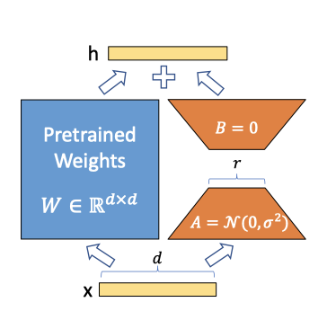
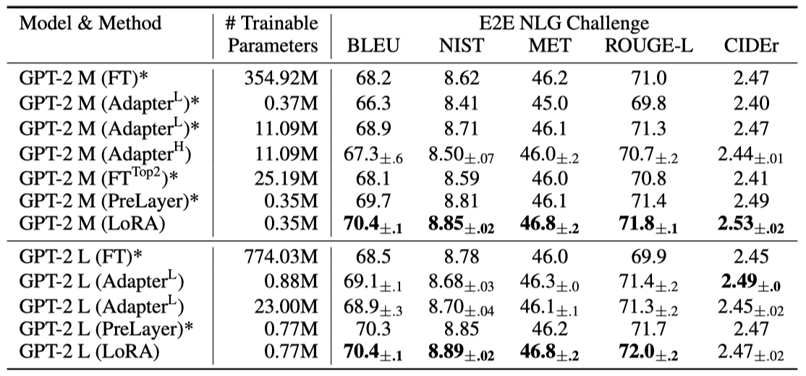
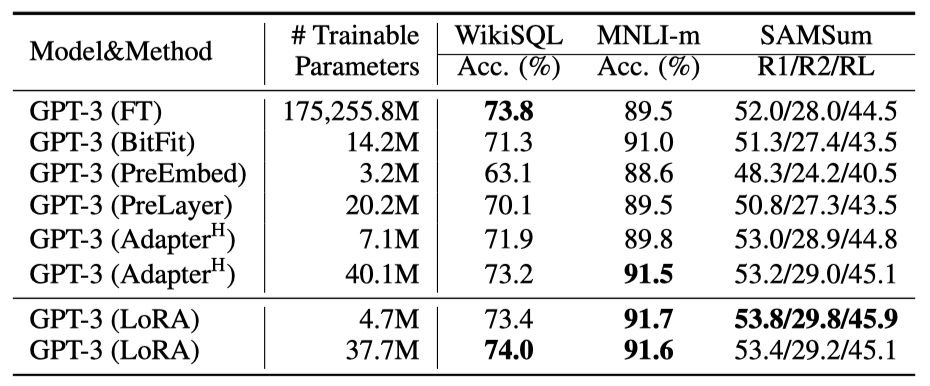
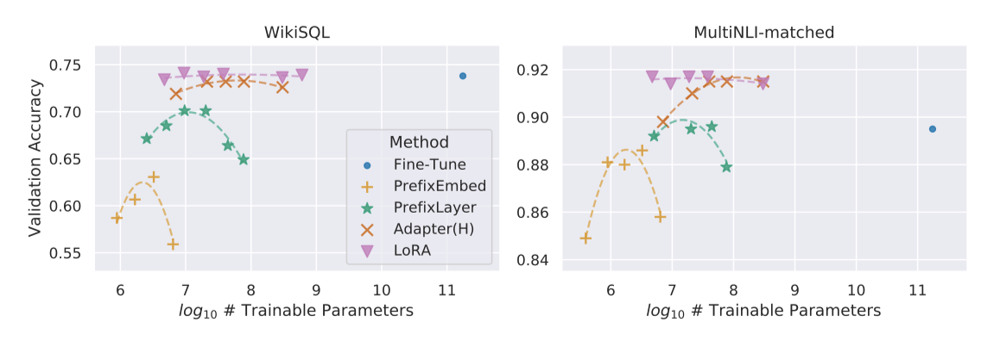
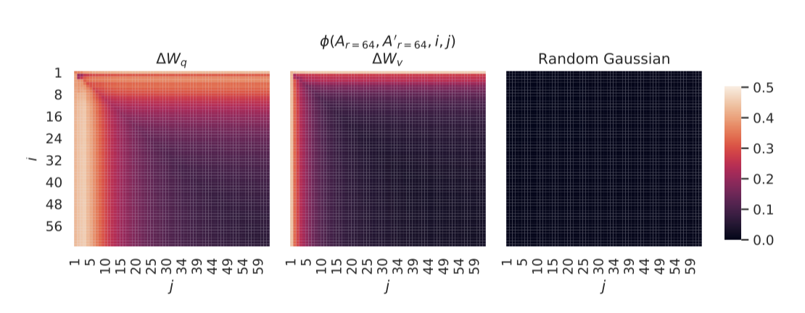

+++
author = "Kurt"
title = "LoRA"
date = "2024-03-20"
description = "Low-Rank Adaptation of Large Language Models"
categories = [
    "Paper Review"
]
tags = [
    "NLP",
    "PEFT",
]
+++

## Abstract

자연어 처리에서는 대규모 사전 학습과 특정 작업이나 도메인에 대한 적응이 핵심 패러다임이다. 하지만, 큰 모델의 전체 미세 조정은 비용이 많이 든다. 이에 대한 해결책으로, Low-Rank Adaptation (LoRA)이 제안되었다. LoRA는 사전 학습된 모델의 가중치를 고정하고, Transformer 아키텍처에 학습 가능한 rank decomposition 행렬을 주입함으로써, downstream 작업의 학습 가능한 parameter 수를 대폭 줄인다. 이 방법은 학습 가능한 parameter 수를 10,000배, GPU 메모리 요구를 3배 줄이면서도, RoBERTa, DeBERTa, GPT-2, GPT-3 등에서 전체 미세 조정과 동등하거나 더 나은 성능을 보여준다. 이는 추가적인 추론 지연 없이 더 높은 학습 처리량을 가능하게 한다. 

---

## Introduction

자연어 처리 응용 프로그램들은 대규모 사전 학습된 언어 모델을 다양한 응용 프로그램에 맞게 미세 조정하여 적용하는데, 이 과정에서 모델의 parameter가 업데이트된다. 하지만, 미세 조정의 단점은 새 모델이 원본 모델과 같은 많은 수의 parameter를 유지한다는 것이며, 특히 175B 개의 parameter를 가진 GPT-3 같은 더 큰 모델에서는 이것이 중대한 배포 문제로 부각되고 있다.

일부 parameter만 조정하거나 새 작업을 위한 외부 모듈을 학습하는 방식으로 효율성을 높이려는 시도가 있었다. 이 방법은 사전 학습된 모델에 작업별 parameter를 추가로 저장하고 불러와 운영 효율성을 개선하지만, 모델의 깊이를 늘리거나 시퀀스 길이를 줄여 추론 지연을 일으키는 문제가 있다. 또한, 이러한 접근법은 종종 미세 조정닝의 기준치에 미치지 못해, 효율성과 모델 품질 사이의 트레이드오프를 만든다.

Li et al. (2018a) 및 Aghajanyan et al. (2020)의 연구에 기반하여, over-parametrized 된 모델이 실제로는 낮은 본질적 차원에 위치한다는 것을 발견하였다. 이를 바탕으로, 모델 적응 시 가중치 변화의 본질적 순위가 낮다는 가설하에 Low-Rank Adaptation (LoRA) 방법을 제안하였다. LoRA는 적응 과정에서 dense layer의 변화를 최적화하여 신경망의 특정 층을 간접적으로 학습시키며, 사전 학습된 가중치는 그대로 유지된다. GPT-3 175B 예시를 통해, 전체 순위가 매우 높음에도 불구하고 매우 낮은 순위로도 충분함을 보여주어, LoRA가 저장 공간과 계산 효율성을 크게 향상시킨다는 것을 입증하였다.

LoRA 방법은 다음과 같은 몇 가지 주요 장점을 가지고 있다:

* 사전 학습된 모델을 여러 LoRA 모듈에 공유하여 다양한 작업에 사용할 수 있다. 모델을 고정하고 행렬 A와 B를 교체함으로써 작업 전환을 효율적으로 수행할 수 있어, 저장 공간과 전환 비용을 크게 절감한다.
* LoRA는 대부분의 parameter에 대한 기울기 계산이나 optimizer 상태 유지가 필요 없어 학습을 효율적으로 하고 하드웨어 진입 장벽을 3배까지 낮춘다. 이는 작은 low-rank 행렬만 최적화함으로써 달성된다.
* linear 설계는 배포 시 학습 가능한 행렬을 고정 가중치와 합쳐, 완전히 미세 조정된 모델 대비 추론 지연 없게 한다.
* LoRA는 이전 방법들과 호환되며, prefix-tuning 같은 다양한 방법과 결합 가능하다.

**Terminologies and Conventions** transformer 구조에 대해 전통적인 용어를 사용하며, transformer layer의 차원은 $d_{model}$로 표현된다. self-attention 모듈의 투영 행렬은 $W_q$, $W_k$, $W_v$, $W_o$로, 사전 학습된 가중치와 그 업데이트는 각각 $W$, $∆W$로 나타낸다. LoRA 모듈의 순위는 $r$로 표시하며, 모델 최적화에는 Adam을 사용하고, MLP 순방향 차원은 $d_{ffn} = 4 × d_{model}$이다.

---

## Problem Statement

이 연구의 제안은 학습 목표와 관계없이, 주로 언어 모델링에 집중한다. 이는 특정 작업 프롬프트에 기반한 조건부 확률 최대화 문제를 다룬다.

Φ로 parametrize된 사전 학습된 autoregressive 언어 모델 $P_Φ(y|x)$, 예를 들어 GPT와 같은 모델을, 요약, 기계 독해(MRC), 자연어를 SQL로(NL2SQL) 등의 다양한 텍스트 생성 작업에 맞게 적용하는 상황에서, 이 작업들은 컨텍스트와 타겟의 토큰 시퀀스 쌍으로 이루어진 데이터 세트로 구성된다. 예를 들어, NL2SQL에서는 자연어 질의와 SQL 명령, 요약에서는 기사 내용과 그 요약이 각각 $x_i$와 $y_i$로 표현된다.

전체 미세 조정 과정에서, 모델은 사전 학습된 가중치 $Φ_0$에서 출발해 조건부 언어 모델링 목표를 최대화하며 $Φ_0 + ∆Φ$로 반복 업데이트된다.

$$  \underset{Φ}{max} \sum_{(x, y) \in z} \sum_{t=1}^{|y|} log \ (P_Φ(y_t | x, y_{<t})) $$

전체 미세 조정 시, 각 작업마다 사전 학습된 모델 크기와 동일한 새 parameter 집합을 학습한다. 이는 GPT-3 같은 대형 모델에서 많은 미세 조정 모델을 저장 및 배포하기 어렵게 만든다.

이 논문은 작업 특화 parameter 증가량 $∆Φ$를 훨씬 작은 paramaeter 집합 $Θ$로 효율적으로 인코딩하는 방식을 제안한다. 이를 통해 $∆Φ$ 찾기는 $Θ$ 최적화 문제로 변환된다.

$$ \underset{\theta}{max} \sum_{(x, y) \in z} \sum_{t=1}^{|y|} log \ (P_{Φ_0 + ∆Φ(\theta)}(y_t | x, y_{<t})) $$

이어지는 부분에서는, 계산 및 메모리 효율적인 저랭크 표현으로 $∆Φ$를 인코딩하는 방안을 제시한다. GPT-3 175B 모델 기준, 학습 가능한 parameter $|Θ|$는 $|Φ_0|$의 0.01%로 매우 작게 설정될 수 있다.

---

## Aren't Existing Solutions Good Enough?

이 연구에서 다루려는 문제는 전이 학습 분야에서 오래 전부터 연구되어 온 것으로, 모델 적응을 더 효율적으로 만들기 위한 다양한 시도가 있었다. 주로 adapter layer를 추가하거나 input layer activation를 최적화하는 두 가지 전략이 사용되었지만, 이 방법들은 대규모 및 지연 시간이 중요한 상황에서는 제한적이다.

**Adapter Layers Introduce Inference Latency** adapter에는 여러 변형이 있다. Houlsby et al. (2019)이 제안한 원래 디자인은 Transformer block 당 두 개의 adapter layer를, Lin et al. (2020)이 제안한 더 최근 디자인은 block 당 하나의 adapter layer와 추가적인 LayerNorm을 포함한다. adapter layer는 매우 적은 parameter를 가지지만, 대규모 신경망에서는 하드웨어 병렬성을 통해 낮은 지연 시간을 유지해야 하므로, 이러한 레이어는 순차적으로 처리되어야 한다. 이는 특히 배치 크기가 작은 온라인 추론 설정에서 지연 시간이 눈에 띄게 증가하는 원인이 된다. 예를 들어, 단일 GPU에서 GPT-2 중간 모델을 실행할 때 작은 병목 차원을 사용하는 adapter를 적용하더라도 지연 시간이 증가한다.

모델을 분할할 때, 추가 깊이로 인해 AllReduce와 Broadcast 같은 동기 GPU 연산이 더 많이 필요해지며, adapter parameter를 여러 번 중복 저장하지 않으면 문제가 악화된다.

**Directly Optimizing the Prompt is Hard** prefix tuning은 최적화가 어렵고 성능이 비단조적으로 변하는 문제를 가진다. 시퀀스 길이의 일부를 적응용으로 할당함으로써, 하위 작업 처리에 사용할 수 있는 길이가 줄어들어, 이 방법이 다른 방식에 비해 덜 효과적일 수 있다고 의심된다. 

---

## Our Method

LoRA의 설계와 이점을 논한다. 이 원칙은 딥러닝의 모든 dense layer에 적용되나, Transformer 언어 모델의 특정 가중치에 초점을 맞춘 실험을 진행하였다.

### Low-Rank-Parameterized Update Matrices

신경망의 가중치 업데이트는 낮은 본질적 순위를 가진다는 가설에 기반해, 사전 학습된 가중치 행렬 $W_0$의 업데이트를 low-rank decomposition $W_0 + \Delta W = W_0 + BA$로 제한한다. 여기서 $B$와 $A$는 학습 가능한 parameter를 포함하며, 학습 중 $W_0$은 고정된다. 이 접근법은 입력에 대해 같은 가중치를 적용하고 출력을 좌표별로 합산하는 방식으로 작동한다.

$$ h = W_0 x + \Delta W x = W_0 x + BAx $$

$A$를 random Gaussian으로, $B$를 0으로 초기화하여 학습 시작 시 $\Delta W = BA$가 0이 되도록 하는 reparametrization 방법을 설명한다. $\Delta Wx$는 $\alpha r$로 스케일되며, $\alpha$는 고정된 상수이다. Adam optimizing 시, 적절한 초기 스케일링을 통해 $\alpha$ 조정이 learning rate 조정과 유사해진다. 따라서, $\alpha$는 조정 없이 초기 $r$ 값으로 설정된다. 이 방식은 $r$의 변화에 따른 hyperparameter 재조정 필요성을 줄여준다.

**A Generalization of Full Fine-tuning.** LoRA는 사전 학습된 parameter의 일부만을 학습하는 미세 조정을 발전시켜, 적응 과정에서 가중치 행렬의 누적된 기울기 업데이트가 전체 순위를 가질 필요가 없다. 모든 가중치 행렬과 편향에 LoRA를 적용하면, 사전 학습된 가중치의 순위에 맞춘 LoRA 순위 설정을 통해 전체 미세 조정의 표현력을 대략적으로 되찾을 수 있다. 학습 가능한 parameter를 늘림으로써, LoRA 학습은 원래 모델 학습에 접근하고, 다른 방법들은 제한된 모델로 수렴한다.

**No Additional Inference Latency.** 제품 배포 시, $W = W_0 + BA$를 계산해 저장하고 정상적으로 추론을 진행한다. 다른 작업으로 바꿀 때는 $BA$를 제거하고 $B'A'$를 추가함으로써 빠르고 메모리 부담 없이 $W_0$을 복구할 수 있다. 이 방법은 미세 조정된 모델 대비 추론 시 추가적인 지연을 발생시키지 않는다.

### Applying LoRA to Transformer

신경망에서 학습 가능한 parameter를 줄이기 위해, LoRA를 가중치 행렬의 일부에 적용할 수 있다. transformer 구조에서는 자기 주의 모듈과 MLP 모듈 내의 가중치 행렬을 대상으로 한다. attention weight($W_q$, $W_k$, $W_v$, $W_o$)만을 조정하고 MLP 모듈은 변경하지 않음으로써 단순성과 효율성을 추구한다. 이 연구는 attention weight 조정의 효과에 초점을 맞추며, MLP layer, LayerNorm layer, 편향 조정에 대한 연구는 추후에 진행할 예정이다.

**Practical Benefits and Limitations.** Adam으로 학습된 large Transformer 모델에서는 고정된 parameter에 대한 최적화 상태를 저장할 필요가 없어 VRAM 사용량을 크게 줄일 수 있다. 특히, GPT-3 175B 모델의 경우 학습 중 VRAM 소비를 1.2TB에서 350GB로, 체크포인트 크기를 350GB에서 35MB로 약 10,000배 줄임으로써 GPU 사용량을 대폭 줄이고 I/O 병목 현상을 방지할 수 있다. 또한, LoRA 가중치만 교체함으로써 다양한 작업 간 빠르고 비용 효율적인 전환이 가능해지며, GPT-3 175B의 학습 속도는 전체 미세 조정 대비 25% 향상된다. 이러한 방식으로 맞춤형 모델을 즉시 교체할 수 있게 되어 효율성이 크게 개선된다.

LoRA는 추가적인 추론 지연을 없애려 할 때, 다른 작업들을 한번에 배치 처리하는 것이 어려운 한계를 가진다. 하지만, 지연이 큰 문제가 아닌 경우, 다양한 작업에 맞게 LoRA 모듈을 동적으로 선택하여 사용할 수 있다.

---

## Empirical Experiments

LoRA의 성능을 평가하기 위해, RoBERTa, DeBERTa, GPT-2를 시작으로 GPT-3까지 확장해 실험하였다. 실험 범위는 자연어 이해부터 생성까지 다양하며, RoBERTa와 DeBERTa는 GLUE 벤치마크로, GPT-2와 GPT-3는 추가로 WikiSQL과 SAMSum 데이터셋을 사용하여 평가하였다.

### Baselines

다른 기준과의 비교를 위해, 이전 연구의 설정을 따르고 그들의 결과를 재사용한다. 그러나 이는 일부 기준이 특정 실험에만 등장할 수 있음을 의미한다.

**Fine-Tuning (FT)** 미세 조정은 모델을 사전 학습된 상태에서 추가로 조정하는 방식이다. 여기에는 모든 parameter를 업데이트하거나 일부 layer만 업데이트하는 방법이 있다. 특히, GPT-2에 대해 마지막 두 layer만 조정하는 방식(FT Top2)이 이전 연구에서 소개되었다.

**Bias-only or BitFit** Bias-only 또는 BitFit은 다른 부분은 고정하고 편향 벡터만 학습하는 방식으로, 최근 Zaken et al. (2021)에서도 연구되었다.

**Prefix-embedding tuning (PreEmbed)** PreEmbed는 특별한 토큰을 입력 사이에 삽입해 이 토큰들의 임베딩을 학습하는 방식이다. 이 토큰들은 모델 어휘에 없으며, 프롬프트 앞(prefixing)이나 뒤(infixing)에 배치된다. 이 방법은 학습 가능한 parameter 수에 영향을 주며, Li & Liang (2021)에서 논의되었다.

**Prefix-layer tuning (PreLayer)** PreEmbed의 확장으로, 모든 Transformer layer 후의 활성화를 학습하는 방식이다. 이 방법은 이전 layer의 활성화를 학습 가능한 것으로 대체하며, 학습 가능한 parameter의 수는 $|Θ| = L × d_{model} \times (l_p + l_i)$로, 여기서 $L$은 layer 수이다.

**Adapter tuning** adapter tuning은 selfattention 및 MLP 모듈 사이에 adapter layer를 추가하는 방식이다. Houlsby et al. (2019)이 제안한 원래 설계($adapter^H$)는 두 개의 fully connected layer와 nonlinearity을 포함한다. Lin et al. (2020)은 MLP 모듈과 LayerNorm 이후에만 adapter layer를 적용하는 효율적인 디자인($adapter^L$)을, Pfeiffer et al. (2021)은 유사한 디자인($adapter^P$)을 제안하였다. Rücklé et al. (2020)은 효율성을 높이기 위해 일부 어댑터 레이어를 제거하는 AdapterDrop($adapter^D$)을 포함한다. 모든 설계는 adapter layer 수(LAdpt)와 학습 가능한 LayerNorms 수(LLN)에 기반한 parameter 수로 표현된다.

**LoRA** LoRA는 기존 가중치 행렬에 학습 가능한 rank decomposition 행렬을 추가하는 기법이다. 주로 간단함을 위해 $W_q$와 $W_v$에 적용되며, 학습 가능한 parameter 수는 순위 $r$과 가중치 형태에 따라 결정되어, $|Θ| = 2 \times \hat{L}_{LoRA} \times d_{model} \times r$로 표현된다. 여기서 $\hat{L}_{LoRA}$는 LoRA가 적용된 가중치 행렬 수이다.

### RoBERTa BASE/LARGE

RoBERTa는 BERT의 사전 학습 방식을 개선하여 성능을 향상시켰으며, 최근 큰 모델들에 비해 여전히 경쟁력 있는 사전 학습 모델로 인정받고 있다. 이 연구에서는 HuggingFace Transformers 라이브러리의 RoBERTa base와 large 모델을 사용하여 GLUE 벤치마크 태스크에서 다양한 효율적인 적응 방법의 성능을 평가하고, Houlsby et al. (2019) 및 Pfeiffer et al. (2021)의 연구를 복제하였다. LoRA와 어댑터의 공정한 비교를 위해 배치 크기와 시퀀스 길이를 표준화하고, 특정 태스크에 대해 사전 학습된 모델을 초기화하는 방식을 조정하였다.

### DeBERTa XXL

DeBERTa는 더 큰 규모로 학습되어 GLUE 및 SuperGLUE 벤치마크에서 높은 성능을 보이는 BERT의 새로운 변형이다. 이 연구에서는 GLUE에서 완전히 미세 조정된 DeBERTa XXL의 성능을 LoRA와 비교 평가한다.

### GPT-2 MEDIUM / LARGE

NLU에서 전체 미세 조정의 대안으로 LoRA의 경쟁력을 확인한 후, 이제 LoRA가 GPT-2 중형 및 대형 모델에서도 NLG 분야에서 우수한 성능을 보이는지 검토한다. Li & Liang (2021)의 설정을 따라 E2E NLG Challenge 결과만 이 섹션에 소개하며, WebNLG 및 DART 결과는 다른 섹션에서 확인할 수 있다. 

### Scaling Up to 175B

LoRA의 최종 테스트로 GPT-3(175B parameter)를 사용한다. 높은 비용 때문에 특정 작업의 무작위 시드별 표준 편차만을 보고한다.

LoRA는 세 데이터셋 모두에서 미세 조정 기준치를 충족하거나 초과한다. 그러나 모든 방법이 더 많은 parameter로 항상 이득을 보는 것은 아니며, 특수 토큰이 너무 많을 경우 성능이 하락함을 관찰하였다. 이는 입력 분포가 사전 학습 분포와 더 멀어지는 것과 관련이 있을 수 있다. 또한, 저데이터 환경에서의 적응 방식 성능도 조사하였다.

---

## Related Works

**Transformer Language Models.** Transformer는 self-attention를 기반으로 한 구조로, autoregressive 언어 모델링에 적용되어 NLP 분야에서 큰 성공을 거두었다. BERT와 GPT-2와 같은 대규모 Transformer 언어 모델은 사전 학습 후 특정 작업 데이터에 대한 미세 조정을 통해 뛰어난 성능을 보여주었다. 이러한 모델들은 더 크게 학습될수록 성능이 향상되는 경향이 있으며, 현재까지 가장 큰 모델인 GPT-3는 175B 개의 parameter를 가진다.

**Prompt Engineering and Fine-Tuning.** GPT-3 175B는 추가 학습 예제를 통해 행동 조정이 가능하지만, 결과는 입력 프롬프트에 크게 의존한다. 이로 인해 프롬프트 엔지니어링이 중요해지며, 미세 조정을 통해 특정 작업에 모델을 재학습한다. 그러나 GPT-3의 크기 때문에, 높은 하드웨어 요구사항으로 인해 일반적인 미세 조정 방식을 적용하기 어렵다.

**Parameter-Efficient Adaptation.** 많은 연구자들이 신경망의 layer 사이에 adapter layer를 삽입하는 방법을 제안했으며, 이 연구의 방법은 이와 유사하게 병목 구조를 사용하지만, 학습된 가중치를 추론 시 주 가중치와 합칠 수 있어 지연 시간을 줄인다. adapter layer의 현대적 확장인 COMPACTER는 Kronecker 곱을 사용해 parametrize 한다. 또한, 입력 단어 임베딩을 최적화하는 새로운 접근법이 제안되었으며, 이는 프롬프트 엔지니어링의 일반화로 볼 수 있으나 위치 임베딩 학습 시 시퀀스 길이 제한이 있다.

**Low-Rank Structures in Deep Learning.** 기계 학습과 딥러닝에서 low-rank 구조의 중요성이 널리 인식되고 있다. 많은 학습 문제들은 본질적으로 low-rank 구조를 가지며, over-parametrize된 신경망도 학습 후 low-rank 속성을 나타낸다. 이전 연구들은 신경망 학습 시 low-rank 제약을 명시적으로 적용했지만, 고정된 모델을 downstream 과제에 적응시키기 위한 low-rank 업데이트는 고려되지 않았다. 이론적 연구는 특정 low-rank 구조를 가진 경우 신경망이 다른 학습 방법을 능가하며, low-rank 적응이 적대적 학습에도 유용할 수 있다고 제안한다. 따라서, low-rank 적응 업데이트 제안은 기존 문헌에 기반한 탄탄한 동기 부여를 가지고 있다.

---

## Understanding The Low-Rank Updates

LoRA의 장점을 바탕으로, downstream 과제에서 학습된 low-rank 적응의 세부적인 속성을 분석하려 한다. low-rank 구조는 하드웨어 요구사항을 낮추고, 가중치 업데이트의 해석성을 향상시킨다. 특히, GPT-3 175B 연구에서, 작업 성능을 해치지 않으면서 학습 가능한 parameter를 최대 10,000배 줄인 결과를 얻었다.

몇 가지 주요 질문에 답하기 위해 연구를 진행한다: 1) parameter 예산 제한 하에, 사전 학습된 transformer에서 어떤 가중치 행렬을 조정해야 downstream 성능이 최대화되는가? 2) 최적의 적응 행렬 $∆W$는 실제로 순위가 낮은가? 그렇다면 적절한 순위는? 3) $∆W$와 $W$ 사이의 관계는 무엇이며, $∆W$는 $W$와 얼마나 밀접하게 연관되어 있는가? $∆W$의 크기는 $W$와 비교하여 어느 정도인가?

질문 (2)와 (3)에 대한 답이 사전 학습된 언어 모델 활용의 기본 원리 이해에 도움이 되며, 이것이 NLP의 중요한 이슈임을 강조한다고 생각한다.

### Which Weight Matrices In Transformer Should We Apply LoRA to?

제한된 parameter 예산 하에서 LoRA를 활용해 downstream 작업의 성능을 최적화하려면, GPT-3 175B 모델의 self-attention 모듈 내 가중치를 고려합니다. 18M의 parameter 예산(약 35MB, FP16)을 기준으로, 하나의 가중치 유형을 적응시킬 때는 $r=8$, 두 가지를 적응시킬 때는 $r=4$로 설정하여 모든 96개 layer에 적용한다.

$∆W_q$나 $∆W_k$에 모든 parameter를 적용하는 것은 성능 저하를 초래하지만, $W_q$와 $W_v$를 함께 조정할 때 가장 좋은 결과를 얻는다. 이는 랭크 4에서도 $∆W$가 충분한 정보를 담고 있어, 한 종류의 가중치보다 다수의 가중치 행렬을 조정하는 것이 더욱 효과적임을 나타낸다.

### What Is The Optimal Rank $r$ For LoRA?

랭크 $r$의 모델 성능 영향을 분석한다. 비교를 위해 $ \lbrace W_q, W_k, W_v, W_c \rbrace$와 $W_q$만 고려한다.

LoRA는 작은 $r$에서도 우수한 성능을 보이며(특히 $ \lbrace W_q, W_v \rbrace$에서 더욱 그렇다), $∆W$가 매우 작은 "intrinsic rank"를 가질 가능성이 있음을 시사한다. 추가 분석으로, 다양한 $r$과 랜덤 시드로 학습된 부공간을 비교하며, $r$ 증가가 의미 있는 부공간 확장에 기여하지 않음을 발견하였다. 이는 low-rank 적응 행렬이 충분함을 나타낸다.

**Subspace similarity between different $r$.** 사전 학습된 모델로 학습된 랭크 $r=8$과 $r=64$의 적응 행렬 $A_{r=8}$과 $A_{r=64}$에서, 특이값 분해를 통해 얻은 $U_{A_{r=8}}$과 $U_{A_{r=64}}$의 상위 특이 벡터들이 얼마나 겹치는지 분석한다. 이 겹침을 Grassmann distance 기반의 정규화된 부공간 유사도로 측정한다.

$$ \phi (A_{r=8}, A_{r=64}, i, j) = {{\Vert U_{A_{r=8}}^{iT} U_{A_{r=64}}^j \Vert_F^2}\over{min(i, j)}} \in [0, 1] $$

$U_{A_{r=8}}^i$은 $U_{A_{r=8}}$의 상위 $i$개 특이 벡터의 열을 의미한다.

$\phi(\cdot)$의 범위는 $[0, 1]$이며, 1은 부공간이 완전히 겹치고, 0은 완전히 분리됨을 의미한다. 공간 제한으로 48번째 레이어만 조사했지만, 다른 레이어들에 대해서도 같은 결론이 유효하다.

$A_{r=8}$과 $A_{r=64}$에서 상위 특이 벡터의 방향이 크게 겹치며, 이들은 0.5 이상의 정규화된 유사도를 가진 1차원 부공간을 공유한다. 이는 GPT-3의 downstream 작업에서 $r = 1$ 성능이 좋은 이유를 설명한다.

$A_{r=8}$과 $A_{r=64}$는 같은 사전 학습 모델로 학습되었고, 그 결과 상위 특이 벡터 방향이 가장 유용하다고 나타났다. 다른 방향은 학습 중 축적된 잡음이 대부분이므로, 적응 행렬은 매우 낮은 순위를 가질 수 있다.

**Subspace similarity between different random seeds.** $r = 64$에서 무작위 시드를 사용한 두 실행 사이의 부공간 유사도 분석을 통해, $∆W_q$가 $∆W_v$보다 더 높은 내재적 순위를 가짐을 확인하였다. 이는 두 실행 모두에서 $∆W_q$에 대한 공통의 특이값 방향이 더 많이 학습되었기 때문이며, 경험적 관찰과 일치한다. 또한, 서로 공통의 특이값 방향을 공유하지 않는 두 개의 무작위 가우시안 행렬을 비교 대상으로 나타냈다.

### How Does The Adaptation Matrix $∆W$ Compare To $W$?

$∆W$와 $W$ 사이의 상관관계, 특히 $∆W$가 $W$의 상위 특이 방향에 얼마나 포함되는지, 그리고 $∆W$의 크기가 $W$의 해당 방향에 비해 얼마나 되는지를 조사함으로써, 사전 학습된 언어 모델을 적응시키는 기본 메커니즘을 이해하고자 한다.

$W$를 $∆W$의 $r$차원 부공간으로 투영하고, 이를 통해 $∆W$와 $W$ 사이의 Frobenius norm을 비교하여 관계를 분석한다. 또한, $W$의 상위 $r$ 특이 벡터나 무작위 행렬을 사용한 결과와도 비교한다.

결론은 다음과 같다. 첫째, $∆W$는 무작위 행렬보다 $W$와 더 강한 상관관계를 보이며, $W$에 이미 존재하는 특징을 증폭한다는 점이다. 둘째, $∆W$는 $W$에서 강조되지 않은 새로운 방향을 증폭한다. 셋째, 증폭 인자가 매우 크며, 이는 저차원 적응 행렬이 특정 하위 작업에 중요한 특징을 증폭할 수 있음을 나타낸다.

---

## Conclusion And Future Work

대규모 언어 모델의 미세 조정은 비용이 많이 든다. 이 연구는 LoRA, 추론 지연 없이 모델 품질을 유지하며 빠른 작업 전환을 가능하게 하는 효율적인 적응 전략을 제안한다. 이 전략은 Transformer 언어 모델에 초점을 맞추었지만, dense layer를 가진 모든 신경망에 적용 가능하다.

미래 연구 방향에는 여러 가지가 있다. 1) LoRA는 다른 적응 방법과 결합하여 추가적인 개선을 제공할 수 있다. 2) 미세 조정과 LoRA의 작동 원리는 아직 명확하지 않으며, LoRA가 이해를 돕는 데 더 유리할 수 있다. 3) LoRA 적용 대상 가중치 행렬 선택은 주로 휴리스틱에 의존하지만, 더 체계적인 방법이 필요하다. 4) $∆W$의 랭크 부족 현상은 $W$의 랭크 부족 가능성을 시사하며, 이는 미래 연구의 새로운 영감을 줄 수 있다.

---

## Reference

* [Paper](https://arxiv.org/pdf/2106.09685.pdf)
* [GitHub](https://github.com/microsoft/LoRA)