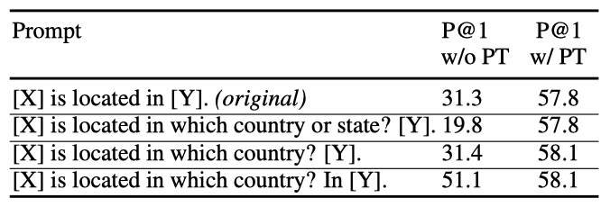
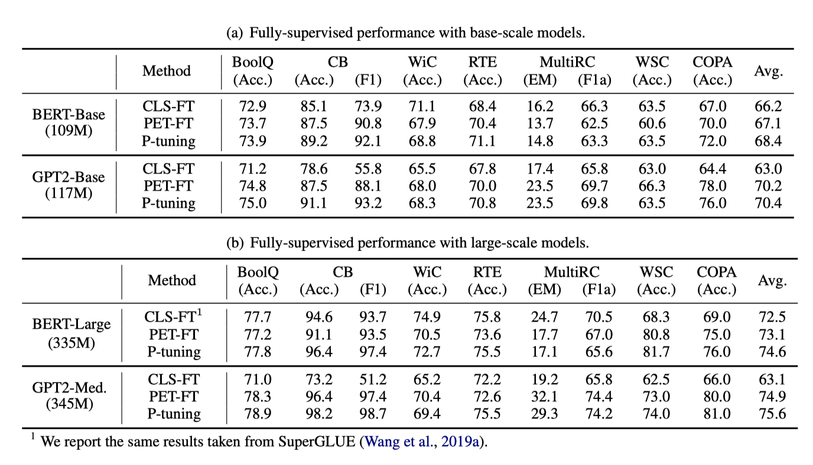

+++
author = "Kurt"
title = "P-Tuning"
date = "2024-03-20"
description = "GPT Understands, Too"
categories = [
    "Paper Review"
]
tags = [
    "NLP",
    "PEFT",
]
draft = true
+++

## Abstract

사전 학습된 언어 모델에 자연어 패턴을 사용하는 것은 효과적이지만, manual discrete 프롬프트는 성능이 불안정할 수 있다. 이에 대한 해결책으로, 학습 가능한 연속 프롬프트 임베딩을 사용하는 P-Tuning 방법을 제안한다. P-Tuning은 다양한 discrete 프롬프트 사이의 격차를 줄이고, LAMA와 SuperGLUE 등 여러 NLU 작업에서 성능을 크게 향상시킨다. 이 방법은 fully-supervised 및 few-shot 설정에서, frozen 및 tuned 모델 모두에 효과적이다.

---

## Introduction

사전 학습된 언어 모델(PLMs)은 다양한 학습 목표와 프롬프팅 기법을 활용하여 자연어 이해(NLU)의 성능을 크게 개선했하였다. 이러한 모델들은 마스킹, autoregressive, seq2seq, 순열 언어 모델링과 같은 방법으로 학습되며, 수동으로 작성된 프롬프트를 추가 입력으로 사용하여 더욱 향상된다. 프롬프팅은 특히 작은 데이터 세트에 미세 조정하거나 직접 추론을 하는 데 있어서 NLU 작업의 성능을 크게 향상시켰다.

manual discrete 프롬프트는 큰 불안정성을 보이며, 언어 모델의 단어 하나만 바꿔도 성능이 크게 떨어질 수 있다. 언어 모델을 조정하면 이 문제가 다소 완화되지만, 다른 프롬프트 간 성능 차이는 여전히 크게 나타나며, 특히 few-shot 설정에서 두드러진다. 이는 실제로 큰 도전 과제이며, 최근 자동 프롬프팅 방식도 이런 불안정성의 근본적인 문제를 해결하지 못하고 있다.

discrete 프롬프트의 불안정성을 해결하기 위해, P-Tuning 방법이 제안되었다. 이 방법은 학습 가능한 연속 프롬프트 임베딩을 discrete 프롬프트와 결합하여 언어 모델에 입력한다. 연속 프롬프트는 학습 과정에서 업데이트되어 학습 안정성을 개선하고, 작은 변화에도 견딜 수 있게 한다. 또한, 연속 프롬프트 임베딩 간 의존성을 모델링하기 위해 LSTM이나 MLP를 포함하는 프롬프트 encoder를 사용하여 성능을 더 향상시킨다.

LAMA와 SuperGLUE라는 두 NLU 벤치마크 실험에서, P-Tuning은 언어 모델을 고정하거나 미세 조정함으로써, manual discrete 프롬프트와 검색된 프롬프트, 그리고 PET 방법보다 우수한 성능을 보여주었다. 특히, P-Tuning은 다양한 작업과 설정에서 discrete 프롬프트 간 성능 차이를 줄여 언어 모델의 안정성을 크게 향상시켰다.

---

## Method

### Issues with Discrete Prompts

프롬프팅은 사전 학습된 언어 모델을 하위 작업에 맞게 조정하기 위해 자연어 패턴을 사용하는 기법이며, 다양한 NLP 작업에서 큰 개선을 보여주었다. 그러나 효과적인 프롬프트를 작성하는 것은 여전히 어려운 문제이다.

LAMA 지식 탐색 실험에서 다양한 수동 프롬프트 사용 결과, 프롬프트의 작은 변화가 성능에 큰 영향을 미쳐 불안정한 결과를 초래하였다. 예를 들어, 프롬프트에서 단어 하나만 바꿔도 성능이 20점이나 급락하였다.

최근 연구들은 학습 코퍼스 탐사, 그라디언트 기반 검색, 사전 학습된 생성 모델을 이용해 이산 프롬프트 검색 절차를 자동화하려 시도하였다. 그러나 이 방법들은 프롬프트의 불안정성 문제와 이산 공간 검색의 한계를 해결하지 못한다. 이에 대응해, 언어 모델 적응 성능을 안정화 및 개선하기 위해 연속 프롬프트 학습의 가능성을 탐구한다.

### P-Tuning

사전 학습된 언어 모델 $M$을 사용해, 이산 토큰 시퀀스 $x$와 레이블 $y$를 포함한 NLU 작업 데이터셋에서, $M$의 parameter를 미세 조정하거나 고정하여 조건부 확률 $f_M(x) = p̂(y | x)$을 추정하는 것이 목표이다.

Schick and Schütze (2020)에 의해 제안된 이산 토큰 형태의 프롬프트는 레이블이 있는 데이터를 텍스트 토큰 시퀀스로 재구성하여, 작업을 텍스트의 빈칸 채우기로 변환한다. 예를 들어, "The capital of [INPUT] is [LABEL]."과 같은 프롬프트를 사용해 "The capital of Britain is [MASK]."처럼 데이터를 재구성하고, "[MASK]"를 통해 "London"과 같은 레이블을 예측한다. 이 프로세스는 이산 프롬프트와 데이터를 입력 임베딩으로 매핑한다.

$$ \lbrace e(D_0)...e(D_i), e(x_0), ..., e(x_n), ..., e(D_k) \rbrace $$

사전 학습된 임베딩 층을 통해, 여기서 $e \in \mathbb{R}^{|V|×d} 이다.

이산 프롬프트의 불안정성과 역전파 최적화 문제를 해결하기 위해, 연속적인 프롬프트 임베딩을 사용하는 P-Tuning 방식을 제안한다.

$$ T = \lbrace [P_{0:i}], x, [P_{(i+1):j}], y, [P_{(j+1):k}] \rbrace $$

P-Tuning은 함수 $f$를 이용해 템플릿을 $h_i$로 매핑한다.

$$ \lbrace h_0 , ..., h_i , e(x), h_{i+1}, ..., h_j, e(y), h_{j+1}, ..., h_k \rbrace $$

마지막으로, 작업 손실 함수 최적화를 위해 $\lbrace P_i \rbrace_{i=1}^k$ 임베딩을 업데이트한다.

이산 및 연속 프롬프트의 결합은 성능 향상을 가져오며, P-Tuning은 언어 모델의 동결 및 미세조정에 모두 사용된다.

### Prompt Encoder

해당 프레임워크에서는 임베딩 $\lbrace P_i \rbrace$를 입력 $\lbrace h_i \rbrace$로 매핑하는 함수 f를 활용한다. 이는 독립적 학습 가능 임베딩보다 프롬프트 임베딩 간 의존성 모델링에 유리하다. 구현에는 경량 신경망을 사용하며, LSTM, MLPs, 항등 매핑 함수를 실험적으로 탐구한다.

---

## Experiments

LAMA와 SuperGLUE 두 NLU 벤치마크를 사용해 지식 탐색과 자연어 이해를 평가한다. SuperGLUE에서는 fully-supervised 학습과 few-shot 학습을 모두 다룬다.

LAMA에서는 언어 모델을 고정하고 프롬프트만 조정하며, SuperGLUE에서는 언어 모델을 조정한다. 언어 모델 parameter와 연속적 프롬프트를 동시에 최적화하며, 이는 이전 연구의 표준 설정을 따르고, 조정된 및 고정된 언어 모델 모두에서 P-Tuning을 평가할 수 있게 한다.

### Knowledge Probing

#### Setup

지식 탐색은 언어 모델이 사전 학습을 통해 얻은 실세계 지식의 양을 평가한다. LAMA 데이터셋은 지식 베이스의 트리플을 이용한 cloze 테스트로 이를 측정한다.

**Datasets and vocabulary.** LAMA는 답변을 단일 토큰 형식으로만 허용한다. 원래 LAMA-TREx 데이터셋(41개 위키데이터 관계, 총 34,039개 트리플, LAMA-34k)을 사용하며, GPT와 BERT 어휘 교집합을 커버하는 LAMA-29k 부분집합을 채택한다. Shin et al. (2020)의 방법을 따라 공정한 비교를 위한 학습, 개발, 테스트 데이터를 구성한다.

**Setup.** LAMA는 각 관계마다 수작업 프롬프트를 제공하나, 이는 최적화될 여지가 있다. bidirectional masked 언어 모델은 "[X]"를 주체로, "[Y]"를 [MASK]로 대체하며, unidirectional 언어 모델(GPT 등)은 Transformer-XL 설정을 따라 목표 직전 출력을 사용한다.

개발 세트에 기반해 프롬프트 토큰 수와 위치를 결정하고, bidirectional 모델에는 (3, sub, org_prompt, 3, obj, 3), unidirectional 모델에는 (3, sub, org_prompt, 3, obj) 템플릿을 사용한다. 이 설정은 대부분의 관계에서 효과적이다. 연속적 프롬프트는 기존의 이산적 프롬프트와 결합되며, 프롬프트 학습 시 1e-5의 learning rate와 Adam optimizer를 적용한다.

#### Main results

결과에 따르면, P-tuning은 지식 탐색에서 LAMA-34k는 43.3%에서 50.6%로, LAMA-29k는 45.2%에서 64.2%로 성능을 크게 향상시켰다. 또한, P-tuning은 AutoPrompt와 LPAQA 같은 이전 이산적 프롬프트 접근법보다 더 우수한 결과를 보였으며, 이는 이산적 프롬프트가 최적이 아닐 수 있다는 초기 가설을 확인시켜 준다.

### Fully-supervised Learning

#### Setup

**Dataset.** P-tuning은 8개 NLU 과제로 구성된 SuperGLUE 벤치마크를 통해 fully-supervised 학습 과제에서 평가되었다. 이 중 ReCoRD 과제는 이산적 프롬프트를 사용하지 않아 P-tuning이 적용되지 않으므로, 나머지 7개 과제(질문 응답, 텍스트 함축, 공동 참조 해결, 인과 추론, 단어 의미 구별)에 집중하였다.

**Comparison methods.** GPT와 BERT 같은 unidirectional 및 bidirectional 사전 학습된 모델에서 P-tuning을 실험하고, BERT-Base, BERT-Large, GPT2-Base, GPT-medium 변형을 포함해 표준 분류 미세조정, PET(수동 이산 프롬프트 기반 미세조정), 그리고 P-tuning을 비교하였다.

**Configuration.** 전적으로 감독된 학습을 위해 큰 학습 세트로 사전 학습된 모델을 미세조정하고 개발 세트로 hyper-parameter 및 모델을 선택한다. 선형적으로 감소하는 learning rate을 적용한 AdamW optimizer와 learning rate {1e-5, 2e-5, 3e-5}, batch size {16, 32}, warm-up ratio {0.0, 0.05, 0.1}을 사용한다. 작은 데이터 세트는 20 epoch, 큰 데이터 세트는 10 epoch 동안 미세조정하며, over-fitting 방지를 위해 early stopping 기법을 적용한다.

#### Main Results

---

## Reference

* [Paper](https://arxiv.org/pdf/2103.10385.pdf)
