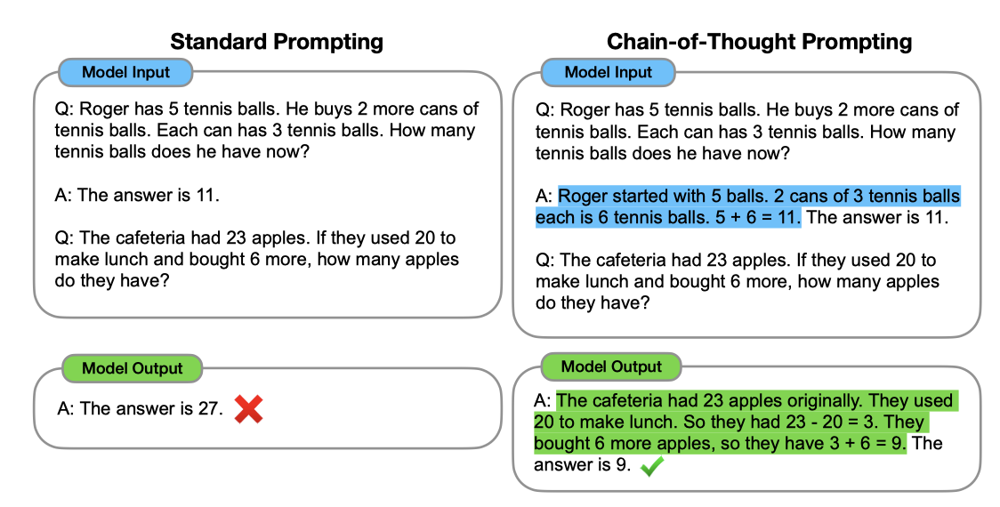
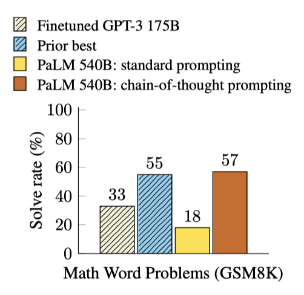
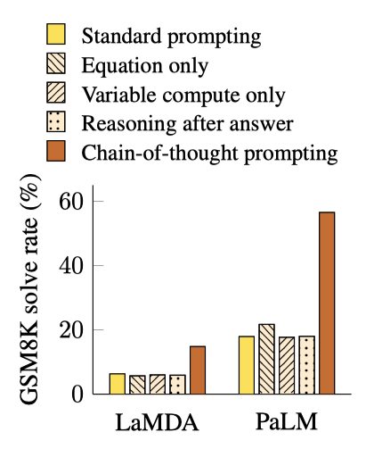
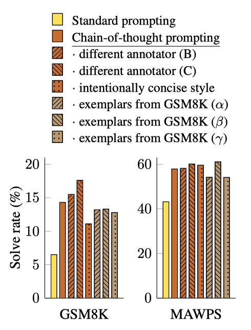
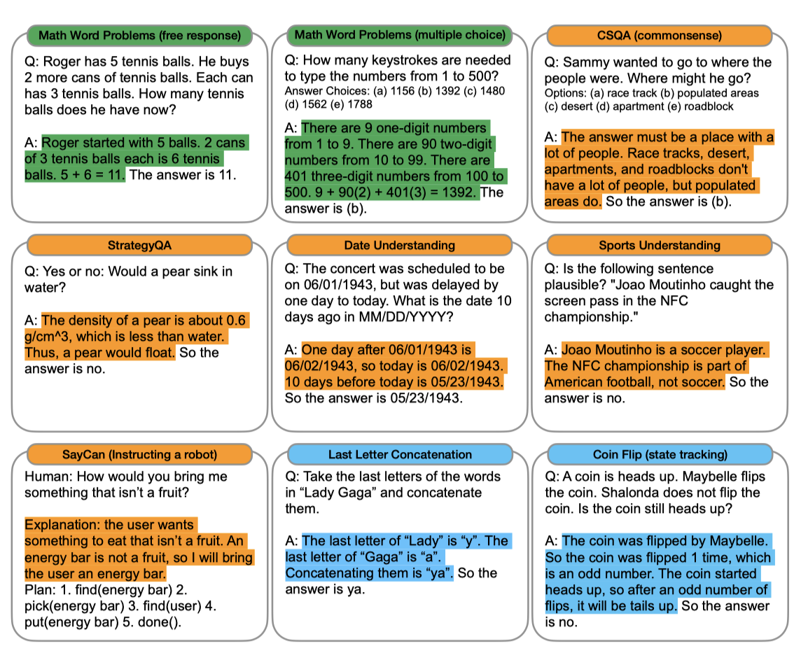

+++
author = "Kurt"
title = "COT"
date = "2024-01-15"
description = "Chain-of-Thought Prompting Elicits Reasoning in Large Language Models"
categories = [
    "Paper Review"
]
tags = [
    "NLP",
    "LLM",
]
+++

## Abstract

대형 언어 모델의 복잡한 추론 능력은 chain of thought, 즉 중간 추론 단계의 일련의 과정을 생성함으로써 크게 향상될 수 있다. 특히, 충분히 큰 언어 모델에서는 "chain of thought" 라는 간단한 방법을 통해 이러한 추론 능력이 자연스럽게 나타난다. 이 방법은 몇 가지 chain of thought를 프롬프팅의 예시로 제공하는 것이다.

세 가지 대형 언어 모델에 대한 실험은 사고의 연결 고리 프롬프팅이 산술, 상식, 심볼릭 추론 과제에서 성능을 향상시키는 것을 보여준다. 예를 들어, 여덟 가지 사고의 연결 고리 예시만을 사용해 PaLM 540B를 프롬프트하면, 수학 단어 문제 벤치마크인 GSM8K에서 최고의 정확도를 달성하며, 심지어 튜닝된 GPT-3를 뛰어넘는다.

---

## Introduction

언어 모델의 크기를 확장하는 것은 성능 향상과 샘플 효율성 등에 도움이 되지만, 산술이나 상식, 기호적 추론과 같은 복잡한 과제에서 높은 성능을 달성하는데는 한계가 있다.

이 연구는 큰 언어 모델의 추론 능력을 향상시키기 위한 두 가지 접근법을 제시한다. 첫째, 산술적 추론을 위해 자연어로 이유를 제시하게 함으로써, 둘째, 새로운 작업을 위해 모델을 미세 조정하는 대신 몇 가지 입력-출력 예시를 통해 모델을 유도함으로써 맥락 내 few-shot 학습의 가능성을 열어놓는다. 이러한 방법은 간단한 질문-답변 작업에서 성공적으로 적용되었다.

이유 제시를 활용한 학습 방법은 고품질의 이유 제시를 대량으로 생성하는 데 비용이 많이 들며, 전통적인 few-shot 유도 방법은 추론 능력이 필요한 작업에서 잘 작동하지 않는다. 이 논문에서는 이 두 가지 방법의 장점을 결합하여, 〈 input, chain of thought, output 〉을 포함하는 프롬프트를 활용한 추론 작업에 대한 few-shot 유도를 탐구한다. 이 방법은 "chain-of-thought prompting" 라고 불리며, 최종 결과에 이르는 중간 추론 단계를 포함한다.

이 연구는 산술, 상식, 기호적 추론 벤치마크에 대한 실증적 평가를 통해, "chain-of-thought" 방법이 표준 유도 방법을 능가하는 것을 보여준다. 특히, 수학 단어 문제 벤치마크에서는 이 방법이 표준 유도를 크게 능가하여 최고 성능을 달성하였다. 이 방법은 큰 학습 데이터셋이 필요 없으며, 하나의 모델로 여러 작업을 수행할 수 있기 때문에 중요하다. 이는 언어 모델이 작업에 대한 소수의 자연어 예시를 통해 학습할 수 있음을 보여준다.

---

## Chain-of-Thought Prompting

이 논문의 목표는 언어 모델이 복잡한 문제를 해결할 때 중간 단계를 생성하고, 이를 통해 최종 답변에 이를 수 있는 "chain-of-thought"를 생성하는 능력을 부여하는 것이다. 충분히 큰 언어 모델은 사고의 연쇄 추론의 예시가 제공되면 이러한 사고의 연쇄를 생성할 수 있다는 것을 보여줄 것이다.

이 사고의 연쇄는 해결책과 유사하게 보일 수 있지만, 답변에 이르는 단계별 사고 과정을 더 잘 반영하기 위해 "chain-of-thought"라고 부른다. 일반적으로 해결책이나 설명은 최종 답변 이후에 제공된다.

chain-of-thought는 언어 모델에서 추론을 촉진하는 방법으로서 몇 가지 매력적인 특성을 가지고 있다.

1. chain-of-thought는 모델이 다단계 문제를 중간 단계로 분해하고, 이를 통해 더 복잡한 추론이 필요한 문제에 추가적인 계산을 할당할 수 있게 해준다.
2. chain-of-thought는 모델의 행동을 이해하는데 도움이 되며, 어떻게 특정 답변에 도달했는지 설명하고, 추론 경로에서 문제가 발생한 곳을 디버깅하는 기회를 제공한다. 하지만, 모델의 계산을 완전히 이해하는 것은 여전히 미해결된 문제이다.
3. chain-of-thought 추론은 수학 문제, 상식 추론, 기호 조작 등 다양한 작업에 사용될 수 있으며, 이론적으로는 언어를 통해 해결 가능한 모든 작업에 적용할 수 있다.
4. chain-of-thought 추론은 큰 언어 모델에서 few-shot 유도의 예시에 chain-of-thought 시퀀스를 포함함으로써 쉽게 구현될 수 있다.

---

## Arithmetic Reasoning

언어 모델의 산술 추론 능력을 측정하는 수학 단어 문제를 고려하였다. 이는 언어 모델에게는 어려운 작업이지만, 540B parameter 언어 모델과 함께 사용된 chainof-thought prompting은 여러 작업에서 작업 특정 튜닝 모델과 비슷한 성능을 보여주었으며, GSM8K 벤치마크에서는 최고 성능을 달성하였다.

### Experimental Setup

여러 벤치마크에 대해 다양한 언어 모델에 대한 chain-of-thought를 탐구한다.

**Benchmarks.** 다섯 가지 주요 수학 문제 벤치마크를 살펴보면 다음과 같다: (1) GSM8K 벤치마크 (2) 다양한 구조의 SVAMP 데이터셋 (3) 다양한 문제의 ASDiv 데이터셋 (4) 대수 문제의 AQuA 데이터셋 (5) MAWPS 벤치마크. 

**Standard prompting.** 기본적으로, Brown et al. (2020)이 대중화한 표준 few-shot 프롬프팅을 사용한다. 이 방식에서 언어 모델은 테스트 예제의 예측을 출력하기 전에 입력-출력 쌍의 예시를 받는다. 이 예시들은 질문과 답변 형태로 제공되며, 모델은 답변을 직접 제공한다.

**Chain-of-thought prompting.** 이 연구의 제안은, 각 few-shot 프롬프트 예시를 관련 답변의 사고 흐름으로 보강하는 것이다. 대부분의 데이터셋이 평가 분할만 가지고 있어, 수동으로 8개의 사고 흐름을 가진 few-shot 예시를 만들었다. 이 방법이 다양한 수학 문제에서 성공적인 추론을 유도할 수 있는지 알아보기 위해, 이 8개의 예시를 대부분의 벤치마크에 사용하였다.

**Language models.** GPT-3, LaMDA, PaLM, UL2 20B, 그리고 Codex와 같은 다섯 가지 큰 언어 모델을 평가한다. 이들 모델로부터 greedy decoding 방식으로 샘플링하며, LaMDA의 경우 다섯 가지 랜덤 시드에 대한 평균 결과를 보고한다. 각 시드는 예시의 무작위 순서를 가진다. LaMDA 실험에서는 다른 시드 간에 큰 차이가 없었기 때문에, 계산을 절약하기 위해 다른 모델에 대해 한 가지 예시 순서의 결과만 보고한다.

### Results

여기서 얻을 수 있는 세 가지 주요 결론 중 하나는, chain-of-thought prompting이 모델 크기의 신생 능력임을 보여주는 것이다. 즉, 작은 모델의 성능에는 큰 영향을 미치지 않지만, 약 100B parameter의 모델에서는 성능 향상을 가져온다. 작은 모델이 유창하지만 비논리적인 chain-of-thought를 생성하므로, 표준 프롬프팅보다 성능이 낮다는 것을 확인하였다.

chain-of-thought prompting은 복잡한 문제에서 더 큰 성능 향상을 보인다. 예를 들어, 가장 큰 GPT와 PaLM 모델의 성능은 기준 성능이 가장 낮은 데이터셋인 GSM8K에서 두 배 이상 증가하였다. 반면, 단 한 단계만 필요한 가장 쉬운 문제인 SingleOp에서는 성능 향상이 부정적이거나 매우 작았다.

GPT-3 175B와 PaLM 540B를 통한 chain-of-thought prompting은 기존 최고 수준과 비교해 우수한 성능을 보인다. PaLM 540B는 chain-of-thought prompting을 통해 GSM8K, SVAMP, MAWPS에서 새로운 최고 수준을 달성하였다. AQuA와 ASDiv 데이터셋에서는 chain-of-thought prompting을 사용한 PaLM이 최고 수준의 2% 이내에 도달하였다.

chain-of-thought prompting이 어떻게 작동하는지 이해하기 위해, LaMDA 137B 모델이 생성한 chain-of-thought를 조사하였다. 올바른 답변을 반환한 50개의 랜덤 예시 중 모든 chain-of-thought가 논리적이고 수학적으로 정확하였다. 잘못된 답변을 제공한 50개의 샘플을 조사한 결과, chain-of-thought의 46%는 소소한 실수를 제외하고 거의 정확했고, 나머지 54%는 의미 이해나 일관성에서 주요 오류가 있었다. PaLM 모델을 더 큰 540B로 스케일링하면 62B 모델에서의 한 단계 빠진 오류와 의미 이해 오류의 대부분을 수정할 수 있었다.

### Ablation Study

chain-of-thought prompting의 이점을 본 후, 동일한 성능 향상이 다른 유형의 프롬프팅으로도 가능한지 탐구한다.

**Equation only.** chain-of-thought prompting이 평가할 수학적 방정식을 생성하기 때문에 도움이 될 수 있다는 가정 하에, 모델이 답변을 제공하기 전에 수학적 방정식만 출력하도록 하는 방법을 테스트하였다. 그러나 이 방법은 GSM8K에선 크게 도움이 되지 않았다. 왜냐하면, GSM8K의 질문들은 chain-of-thought의 자연어 추론 단계 없이는 직접 방정식으로 번역하기 어렵기 때문이다. 반면, 한 단계 또는 두 단계 문제의 데이터셋에서는, 방정식만의 프롬프팅이 성능을 향상시키는 것을 확인하였다. 질문에서 방정식을 쉽게 유도할 수 있기 때문이다.

**Variable compute only.** chain-of-thought이 모델에게 더 어려운 문제에 더 많은 계산(즉, 중간 토큰)을 사용하게 한다는 직관이 있다. chain-of-thought 추론에서 가변 계산의 효과를 분리하기 위해, 문제를 해결하는 데 필요한 방정식의 문자 수와 같은 점(. . .)의 시퀀스만 출력하도록 모델을 유도하는 설정을 테스트한다. 이 변형은 기준선과 거의 같은 성능을 보여주는데, 이는 가변 계산 자체가 chain-of-thought prompting의 성공의 이유가 아니며, 중간 단계를 자연어를 통해 표현하는 것에서 유용성이 있다는 것을 시사한다.

**Chain of thought after answer.** chain-of-thought prompting의 잠재적 이점 중 하나는 모델이 사전 학습 동안 획득한 관련 지식에 더 잘 접근하게 해주는 것일 수 있다. 이를 검증하기 위해, 답변 이후에만 chain-of-thought prompting를 제공하는 설정을 테스트하였다. 이 변형은 기준선과 거의 같은 성능을 보여주는데, 이는 chain-of-thought에 포함된 순차적 추론이 단순히 지식을 활성화하는 것 이상으로 유용하다는 것을 시사한다.

### Robustness of Chain of Thought

프롬프팅 방법에서 예시에 대한 민감도는 중요한 고려사항이다. 예를 들어, 소수의 예시 순열을 바꾸면 GPT-3의 SST-2 정확도가 크게 변동한다. 이 부분에서는 다른 주석 작성자들이 작성한 chain-of-thought에 대한 안정성을 평가한다. 이 논문의 두 명의 공동저자들이 동일한 소수의 예시에 대해 독립적으로 chain-of-thought을 작성했으며, Annotator A는 더 간결한 chain-of-thought도 작성하였다.

예시 기반 프롬프팅을 사용하면 각 chain-of-thought 주석 간에 차이가 있을 수 있지만, 모든 chain-of-thought prompting가 기준보다 월등히 높은 성능을 보인다. 이는 chain-of-thought 사용의 성공이 특정 언어 스타일에 의존하지 않음을 의미한다.

성공적인 chain-of-thought prompting이 다른 예시 집합에도 적용되는지 확인하기 위해, 우리는 또한 GSM8K 학습 세트에서 무작위로 샘플링된 세 가지 예시 집합에 대한 실험을 수행한다. 이는 독립된 출처에서 얻은 것이며(이 데이터셋의 예시들은 이미 chain-of-thought과 같은 추론 단계를 포함하고 있다).

주석 작성자, 독립적으로 작성된 chain-of-thought, 다른 예시, 다양한 언어 모델에 대한 안정성 외에도, 산술 추론을 위한 chain-of-thought 프롬프팅은 다른 예시 순서와 다양한 수의 예시에도 강건함을 확인하였다.

---

## Commonsense Reasoning

chain-of-thought는 수학 문제에 특히 적합하지만, 그 언어 기반 특성 때문에 일반적인 배경 지식을 가정한 물리적, 인간적 상호작용에 대한 추론을 포함하는 상식 추론 문제에도 적용 가능하다. 상식 추론은 세상과의 상호작용에 필수적이지만, 현재의 자연어 이해 시스템은 아직 이를 완전히 이해하는 데 한계가 있다.

**Benchmarks.** 다양한 상식 추론 유형을 다루는 5가지 데이터셋을 사용하였다. CSQA는 복잡한 의미를 가진 상식 질문을, StrategyQA는 다중 홉 전략을 추론하는 질문을 다룬다. BIG-bench 프로젝트에서는 맥락에서 날짜를 추론하는 "Date Understanding"과 스포츠 관련 문장의 타당성을 판단하는 "Sports Understanding"을 선택하였다. 마지막으로, 자연어 지시문을 로봇 동작으로 매핑하는 SayCan 데이터셋을 사용하였다. 이 모든 데이터셋의 chain-of-thought 주석 예시는 그림 3에서 확인할 수 있다.

**Prompts.** 이전 섹션과 같은 실험 방식을 따랐다. CSQA와 StrategyQA에서는 학습 세트에서 무작위로 예시를 선택하고, 이에 대한 chain-of-thought를 직접 작성하였다. 두 BIG-bench 작업은 학습 세트가 없어, 평가 세트의 첫 10개 예시를 사용하였다. SayCan에서는 Ahn et al. (2022)의 학습 세트에서 6개 예시를 선택하고, 이에 대한 사고의 흐름을 직접 작성하였다.

**Results.** 모든 작업에서 모델 크기를 확장하면 표준 프롬프팅의 성능이 향상되며, chain-of-thought prompting은 더욱 성능을 향상시킨다. PaLM 540B는 chain-of-thought prompting을 이용해 기준선에 비해 높은 성능을 보여, StrategyQA에서는 이전 state-of-the-art를 능가하고 스포츠 이해에서는 도움을 받지 않은 스포츠 애호가를 능가하였다. 이 결과는 다양한 상식 추론 능력을 요구하는 작업에서도 chain-of-thought prompting이 성능을 향상시킬 수 있음을 보여준다.

---

## Symbolic Reasoning

최종 실험 평가에서는 사람에게는 간단하지만 언어 모델에게는 도전적인 기호적 추론을 다룬다. chain-of-thought prompting은 언어 모델이 복잡한 기호 추론 작업을 수행하게 하고, 본 적 없는 긴 입력에 대해 일반화하는 능력을 향상시킨다는 것을 보여준다.

**Tasks.** 다음 두 가지 toy task를 사용한다.

* **Last letter concatenation.** 이 작업은 모델이 이름의 각 단어의 마지막 글자를 연결하도록 요구한다(예: "Amy Brown" → "yn"). 이는 언어 모델이 이미 수행할 수 있는 첫 글자 연결 작업의 더 어려운 버전이다. 전체 이름은 성적인 이름 데이터의 상위 천 개의 이름을 무작위로 연결하여 생성하였다.
* **Coin flip.** 이 작업은 사람들이 동전을 뒤집거나 뒤집지 않은 후 동전이 여전히 앞면을 보이는지 모델에게 답하도록 요청한다(예: "A coin is heads up. Phoebe flips the coin. Osvaldo does not flip the coin. Is the coin still heads up?" → "no").

기호적 추론 작업의 구성은 잘 정의되어 있어, 각 작업에 대해 학습/소수의 사례와 동일한 단계 수의 인 도메인 테스트 세트와, 사례보다 더 많은 단계를 가진 영역 외 테스트 세트를 고려하였다. 마지막 글자 연결에서는 모델이 두 단어를 가진 이름의 사례만 보고, 3개와 4개의 단어를 가진 이름에서 마지막 글자 연결을 수행하였다. 동전 뒤집기 작업에서는 가능한 뒤집기의 수에 대해 동일하게 처리하였다. 실험 설정은 이전 섹션과 동일하게 진행하였고, 각 작업의 소수의 사례에 대해 chain-of-thought를 수동으로 구성하였다.

**Results.** PaLM 540B를 사용하면, chain-of-thought prompting은 거의 100%의 문제 해결률을 보인다. 이 평가들은 "toy tasks"으로, 모델은 테스트 예시에서 새로운 기호로 주어진 단계를 반복하기만 하면 된다. 그러나 작은 모델들은 여전히 실패하며, 이 세 가지 작업에 대한 추상적인 조작 능력은 100B 모델 parameter의 규모에서만 나타난다.

영역 외 평가에서 표준 프롬프팅은 두 작업 모두에서 실패하였다. 하지만 chain-of-thought prompting을 사용하면, 언어 모델은 성능이 상승하는 경향을 보여준다. 따라서, 충분한 규모의 언어 모델에서는 chain-of-thought prompting이 보이지 않는 chain-of-thought를 넘어서는 길이 일반화를 촉진한다.

---

## Discussion

큰 언어 모델에서 다단계 추론을 이끌어내는 간단한 메커니즘인 chain-of-thought prompting을 탐구하였다. 이 방법은 산술 추론의 성능을 크게 향상시키며, 상식 추론에 대한 실험은 이 방법이 일반적으로 적용 가능함을 보여준다. 또한, chain-of-thought prompting은 기호적 추론에서 더 긴 시퀀스 길이에 대한 일반화를 가능하게 한다. 이 모든 실험은 언어 모델을 프롬프팅하여 진행되었으며, 별도의 모델 조정은 이루어지지 않았다.

모델 규모와 chain-of-thought 추론의 연관성이 주요한 주제였다. 표준 프롬프팅이 한계를 보이는 많은 추론 작업에서, chain-of-thought prompting은 성능을 크게 향상시켰다. 이 방법은 큰 언어 모델이 성공적으로 수행할 수 있는 작업 범위를 확장하는 것으로 보인다. 이러한 결과는 더 많은 질문을 제기한다 - 예를 들어, 모델 규모를 더욱 증가시키면 추론 능력이 얼마나 더 향상될지, 어떤 다른 프롬프팅 방법들이 언어 모델의 작업 범위를 확장할 수 있을지 등이다.

chain-of-thought가 인간의 추론 과정을 모방하긴 하지만 신경망이 실제로 '추론'하고 있는지는 미해결 질문이다. 사례를 chain-of-thought으로 수동으로 보강하는 비용은 소수의 사례 설정에서는 최소화될 수 있지만, 모델을 미세조정하는데는 비용이 많이 들 수 있다. 추가로, 올바른 추론 경로가 보장되지 않아 올바른 답과 잘못된 답을 모두 생성할 수 있다. 마지막으로, chain-of-thought 추론이 큰 모델에서만 나타나므로 실세계 응용에서의 비용이 많이 들 수 있다. 이러한 한계를 극복하기 위한 추가 연구가 필요하다.

---

## Related Work

이 연구는 다양한 연구 분야에서 영감을 얻었고, 그 중 가장 관련성이 높은 두 가지 방향과 관련된 논문을 간단히 설명한다.

중간 단계를 사용하여 추론 문제를 해결하는 방법이 연구의 첫 번째 관련 방향이다. Ling et al. (2017)은 자연어 이유를 사용하여 수학 단어 문제를 해결하는 아이디어를 제시했고, 이는 형식 언어를 사용한 기존의 추론 연구와 대조되는 접근법이다. Cobbe et al. (2021)은 더 큰 데이터셋을 만들고 사전 학습된 언어 모델을 미세조정하여 이 아이디어를 확장하였다. 또한, Nye et al. (2021)은 언어 모델을 활용하여 Python 프로그램의 최종 출력을 예측하는 것이 최종 출력을 직접 예측하는 것보다 더 뛰어난 성능을 보여주었다.

이 논문은 최근 프롬프팅에 대한 많은 연구와 밀접한 관련성을 가지고 있다. 소수의 사례 프롬프팅이 널리 퍼진 이후, 여러 방법이 모델의 프롬프팅 능력을 개선하였다. 이들 방법 중 일부는 자동으로 프롬프트를 학습하거나 모델에 작업 설명을 제공하는 방식이다. 이런 접근법들은 프롬프트의 입력 부분을 개선하는 반면, 이 연구는 언어 모델의 출력을 사고의 흐름으로 보강하는 새로운 방향을 제시한다.

---

## Conclusions

chain-of-thought prompting이라는 간단하고 광범위하게 적용 가능한 방법을 통해 언어 모델의 추론 능력을 향상시켰다. 이 방법은 충분히 큰 모델에서만 나타나며, 이를 통해 평평한 스케일링 곡선을 가진 추론 작업도 수행할 수 있게 되었다. 이러한 접근법은 언어 모델이 수행할 수 있는 추론 작업의 범위를 넓혀, 언어 기반 추론에 대한 추가 연구를 촉진할 것으로 보인다.

---

## Reference

* [Paper](https://arxiv.org/pdf/2201.11903.pdf)