+++
author = "Kurt"
title = "Flan-T5/PaLM"
date = "2024-02-15"
description = "Scaling Instruction-Finetuned Language Models"
categories = [
    "Paper Review"
]
tags = [
    "NLP",
    "LLM",
]
+++

## Abstract

명령문 형태의 데이터셋을 사용한 언어 모델 미세 조정은 모델 성능 향상과 새로운 작업에 대한 일반화 능력을 향상시킨다. 이 논문에서는 작업 수, 모델 크기 확장, 생각의 흐름 데이터에 대한 미세 조정에 초점을 맞춘다. 이러한 방법은 다양한 모델 클래스, 프롬프팅 설정, 평가 벤치마크에서 성능을 크게 향상시킨다. 예를 들어, 1.8K 작업에 대해 미세 조정된 Flan-PaLM 540B는 평균적으로 9.4% 향상된 성능을 보인다. 또한, Flan-T5 체크포인트를 공개하여 대형 모델에 비해 강력한 성능을 보여준다. 결론적으로, instruction finetuning은 사전 학습된 언어 모델의 성능과 사용성을 향상시키는 일반적인 방법이다.

---

## Introduction

인공지능의 중요한 목표는 보이지 않는 작업에 대해 일반화하는 모델을 만드는 것이다. 자연어 처리(NLP)에서, 사전 학습된 언어 모델은 자연어 설명을 통해 작업을 수행하는 능력을 향상시킴으로써 이 목표를 향해 크게 발전하였다. 더 나아가, 지시사항을 포함하는 작업들에 대해 모델을 미세조정함으로써, 모델은 지시사항에 더 잘 반응하게 되고, 소수의 예시를 필요로 하는 경우를 줄일 수 있었다.

이 논문에서는 instruction-finetune을 발전시키기 위해 두 가지 주요 연구를 수행하였다. 첫 번째로, task의 수와 모델의 크기에 따른 instruction-finetune의 확장성을 연구하였다. 실험 결과, task 수와 모델 크기를 더욱 확장하는 것이 향후 연구의 방향성을 제시하였다. 두 번째로, 미세조정이 모델의 추론 작업 수행 능력에 어떤 영향을 미치는지를 연구하였다. chain-of-thought(CoT)을 포함하지 않는 이전의 instruction-finetune 방법은 CoT 평가에서 성능을 크게 저하시켰지만, 9개의 CoT 데이터셋을 미세조정 mixture에 추가함으로써 모든 평가에서 성능 향상을 이루었다.

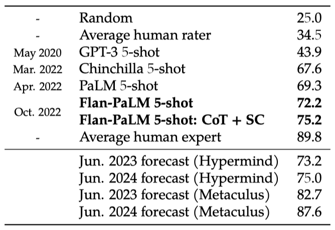

이 논문에서는 540B-parameter 모델을 사용하고, 미세조정 작업 수를 1.8K로 늘리며, CoT 데이터를 포함하여 학습된 Flan-PaLM은 여러 벤치마크에서 최고의 성능을 보여주었다. Flan-PaLM은 향상된 추론 능력과 다국어 능력을 통해 다양한 작업에서 PaLM을 능가하였다. 이는 Massive Multi-task Language Understanding에서 75.2%의 성능, one-shot TyDiQA에서 14.9%의 개선, 그리고 소수 언어에서의 산술 추론에서 8.1%의 향상 등을 포함한다. 또한, 사람 평가자들에 의한 평가에서도 Flan-PaLM은 PaLM보다 더 나은 성능을 보였으며, 이는 향상된 사용성을 시사한다.

또한 Flan-T5 모델(80M에서 11B)을 instruction-finetune하였고, 이 모델들은 강력한 zero-shot, few-shot, 그리고 CoT 능력을 보였다. 이들은 이전의 T5 모델을 능가하는 성능을 보였으며, Flan-T5 11B는 T5 11B를 크게 능가하고, 일부 BIG-Bench 작업에서는 PaLM 62B까지 능가하는 결과를 보였다. 이 결과는 instruction-finetune이 다양한 모델과 평가 작업에서 성능 향상을 가져올 수 있음을 보여준다.

---

## Flan Finetuning

다양한 데이터 소스와 instruction template type을 활용하여 언어 모델 미세조정 절차인 Flan을 수행하였다. 이렇게 미세조정된 모델은 "Flan"이라는 접두사가 붙게 되며(예: Flan-PaLM), 이 절차는 여러 모델 크기와 아키텍처에서 효과적임을 확인하였다.

### Finetuning Data

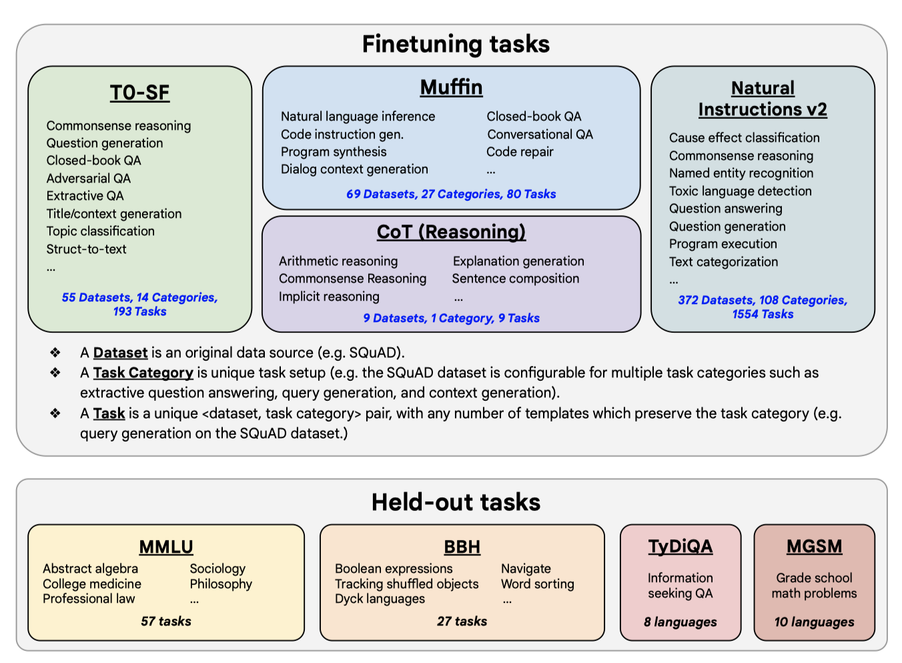

**Task mixtures.** 이전 연구에서는 미세조정 작업의 수를 늘릴수록 일반화 성능이 향상된다는 것이 입증되었다. 이 논문에서는 이전 연구의 네 가지 데이터 mixture를 결합하여 총 1,836개의 미세조정 작업을 수행하였다. 이 작업들은 다양한 소스에서 추출된 데이터를 포함하며, 대화 데이터와 프로그램 합성 데이터 등 새로운 작업도 추가되었다. 이러한 접근법은 다양한 미세조정 작업에서 효과적임을 보여준다.

**Chain-of-thought finetuning mixture.** 이 논문에서는 CoT 주석을 포함한 네 번째 미세조정 데이터 mixture을 사용하여 CoT 주석에 대한 미세조정이 본 적 없는 추론 작업에서 성능을 향상시키는지를 탐색하였다. 이 mixture는 사람 평가자가 학습 코퍼스에 대해 CoT 주석을 수동으로 작성한 이전 작업의 9 가지 데이터셋으로 구성되었다. 이 데이터셋들은 arithmetic reasoning, multi-hop reasoning, natural language inference 등의 작업을 포함하며, 각 작업에 대해 열 가지 instruction template을 수동으로 구성하였다.

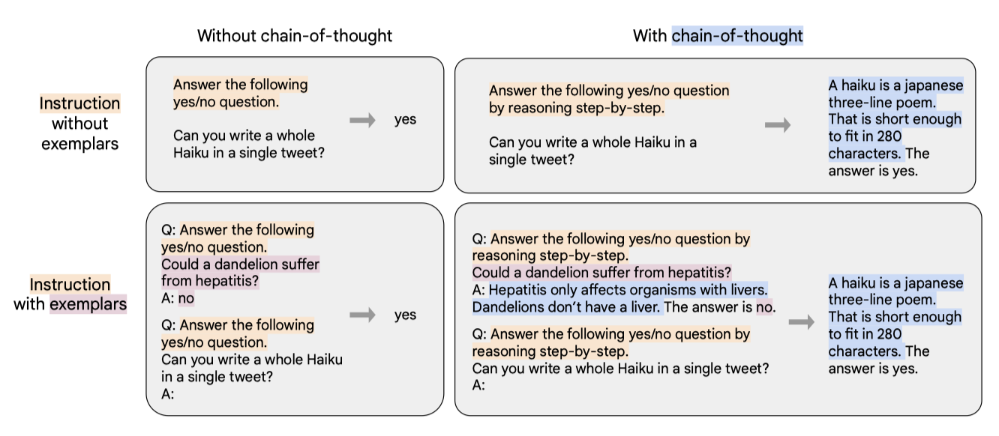

**Templates and formatting.** Muffin, T0-SF, 그리고 NIV2 모델에 대해, 각 작업에 대한 mixture 창작자들이 제공한 instruction template을 사용하였다. CoT에 대해서는 9 가지 데이터셋 각각에 대해 대략 10 가지의 instruction template을 수동으로 작성하였다. few-shot 템플릿을 만들기 위해 다양한 예시 구분자를 작성하고 예시 수준에서 무작위로 적용하였다.

### Finetuning procedure

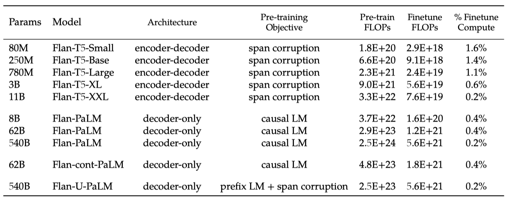

이 논문에서는 T5, PaLM, 그리고 U-PaLM과 같은 다양한 모델 계열에 instruction finetuning을 적용하였다. 이 모델들은 Flan-T5-small에서 PaLM과 U-PaLM까지의 다양한 크기를 포함하며, 각각에 대해 learning rate, batch size, dropout, 그리고 미세조정 step을 제외한 동일한 학습 절차를 적용하였다. 또한, 여러 학습 예시를 단일 시퀀스로 결합하는 패킹 기법을 사용하였으며, 이 과정에서 마스킹이 적용되었다. 모든 평가에 대해 단일 체크포인트를 사용하며, 미세조정에 사용된 계산량은 학습 계산량에 비해 매우 작다. 이 작업은 JAX 기반의 T5X 프레임워크를 사용하였다.

### Evaluation protocol

**Evaluation benchmarks.** 본 연구에서는 미세조정 데이터에 포함되지 않은 보류된 작업에 대한 성능을 중점적으로 살펴보았다. Flan-PaLM 모델의 세계지식과 추론능력을 평가하기 위해 다언어 벤치마크를 포함한 다양한 벤치마크를 사용하였다. 현재 언어 모델들이 전문가 인간 평가자보다 성능이 낮은 MMLU, BBH, TyDiQA, MGSM 등의 어려운 벤치마크를 사용하였다. 이 벤치마크들은 PaLM 논문에서도 사용되었으며, 이전 연구와 일관성 있게 사전 학습 데이터와의 중요한 데이터 오염을 발견하지 못했다. 

**Evaluation methods and metrics.** 본 연구에서는 MMLU와 BBH 벤치마크에 대해 직접 프롬프팅과 CoT 프롬프팅 두 가지 방법을 이용하여 모델의 능력을 평가하였다. TyDiQA는 직접 프롬프팅만 사용하였고, MGSM은 CoT 프롬프팅만 사용하였다. 모든 벤치마크에 대해 주어진 few-shot 예시를 사용하였으며, 또한, 각 모델에 대해 정규화된 평균 측정치를 보고하였다.

---

## Scaling to 540B parameters and 1.8K tasks

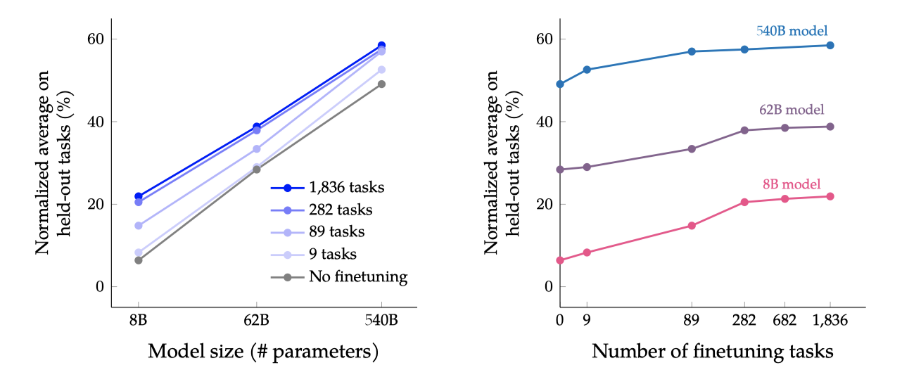

모델 크기(8B, 62B, 540B)와 미세 조정 작업 수를 조절하여 그 스케일링 효과가 성능에 미치는 영향을 검토한다. 작업 수는 CoT, Muffin, T0-SF, NIV2 순으로 추가하며 조절한다.

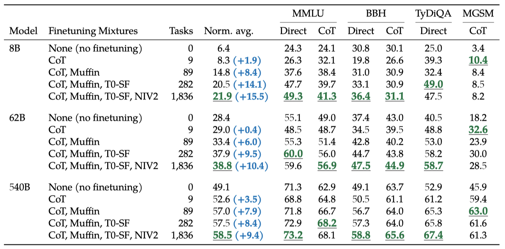

모든 모델 크기에서 multi-task instruction finetuning이 성능을 9.4%에서 15.5% 향상시킨다는 것을 확인하였다.

미세조정 작업을 늘리면 성능이 향상되지만, 주로 282개 작업까지의 사용에서 발생한다. 282개 이후의 작업에서는 성능 향상이 미미한데, 추가 작업이 다양하지 않아 새로운 지식을 제공하지 않거나, 이미 알고 있는 지식을 더 잘 표현하는 학습에서 이득이 주로 발생하기 때문일 수 있다. 사전 학습 데이터는 780B 토큰이고, 미세조정은 1.4B 토큰만 사용하기 때문에 이 설명이 타당하다.

모델 규모를 한 단위 증가시키는 것이 미세조정 된 모델과 미세조정되지 않은 모델 모두에 대해 성능을 크게 향상시킨다. 하지만 미세조정이 작은 모델이나 큰 모델을 더 향상시키는지는 복잡한 문제이다. 예를 들어, 8B 모델의 absolute gain은 540B 모델보다 크지만, 상대적인 오류율 감소는 540B 모델이 더 크다.

스케일링 곡선을 그리면 모델 크기와 작업 수를 더 확장하면 성능이 어떻게 개선될지 통찰력을 얻을 수 있다. 모델 크기를 더 크게 확장하면 상당한 성능 향상이 예상되며, 미세조정 작업 수를 늘려도 성능이 점진적으로 향상될 것이다. 이러한 스케일링 곡선은 향후에도 지시 미세조정의 스케일링을 계속해야 함을 시사한다.

---

## Finetuning with chain-of-thought annotations

Flan 미세조정의 목표는 다단계 추론 능력을 포함한 다양한 평가에서 개선된 모델을 만드는 것이다. 이를 위해 Chain-of-Thought(CoT) 데이터를 포함시키는 효과를 탐구하였다. 결과적으로, CoT 없이 미세조정을 하면 추론 능력이 저하되지만, 9개의 CoT 데이터셋을 포함시키면 모든 평가에서 성능이 향상된다. 또한, CoT 미세조정은 도전적인 BIG-Bench 작업에서 단계별 추론을 가능하게 한다.

### Finetuning on chain-of-thought improves reasoning on held-out tasks

chain-of-thought(CoT) 주석이 포함된 아홉 개의 데이터셋을 미세조정 mixture에 포함시키면 추론 능력이 향상된다. Flan-PaLM의 CoT 프롬프팅 능력은 보류된 평가 벤치마크 네 개에서 PaLM을 능가한다. BBH 작업은 NLP 작업과 알고리즘 작업으로 분류한다.

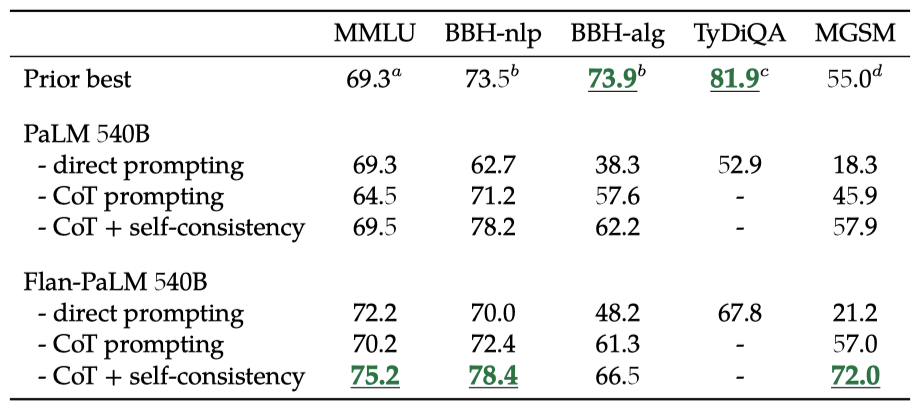

CoT 프롬프팅과 self-consistency(SC)를 결합하여 사용하면 여러 벤치마크에서 state-of-the-art를 달성할 수 있다. MMLU 벤치마크에서 Flan-PaLM 540B는 75.2%를 달성하여 이전 모델을 크게 능가하였다. 다국어 수학 문제의 MGSM 벤치마크에서도 대표성이 낮은 벵골어에서 69.6%의 높은 성능을 보여주었다. 마지막으로 GSM8K에서는 새로운 최고 기록인 83.9%를 달성했지만, 이 데이터셋이 instruction finetuning mixture에 포함되어 있다는 점을 주의해야 한다.

certain specialized 모델에 비해 Flan-PaLM이 state-of-the-art를 달성하지 못하는 경우도 있다. 예를 들어, 기호만 조작하는 BBH-algo 과제에서는 Flan-PaLM이 code-davinci-002를 능가하지 못하며, one-shot TyDiQA에서는 PaLM을 14.9% 능가하지만 여전히 TyDiQA 학습 세트에서 미세조정된 ByT5와 동등한 수준이 아니다.

### Some chain-of-thought data is needed to maintain reasoning ability

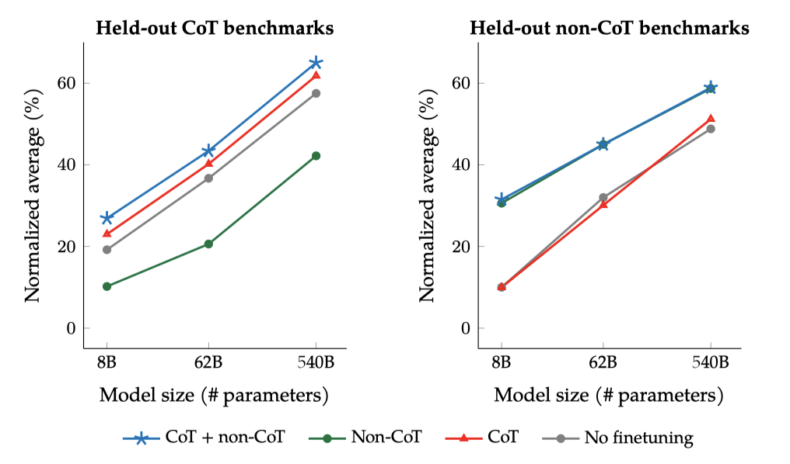

instruction finetuning에서 아홉 개의 CoT 데이터셋만 포함시키는 효과를 확인하였다. 평가 결과, CoT와 non-CoT을 결합하여 미세조정한 경우 CoT만 미세조정한 것보다 성능이 더 좋았다. 또한, CoT와 non-CoT을 결합하여 미세조정하는 것이 non-CoT 작업에 대한 성능을 손상시키지 않는 것으로 확인되었다.

일부 CoT 예제에서 미세조정하는 것이 추론 능력을 유지하는데 중요하다는 것을 보여주고 있다. non-CoT만을 사용한 미세조정은 CoT에서의 성능을 크게 저하시킨ㄴ다. 이전 연구들이 instruction finetuning이 보이지 않는 작업의 성능을 향상시키는 것을 보여주고 있지만, 이는 특정 작업에 한정된 결과이다. 따라서 모든 평가에서 모델 능력을 향상시키려면 non-CoT과 CoT 데이터가 모두 필요하다는 결론을 얻을 수 있다.

### Unlocking zero-shot reasoning

CoT 데이터에 대한 instruction finetuning의 주요 이점 중 하나는, 결과 모델이 zero-shot 상황에서 CoT 추론을 수행할 수 있다는 것이다. 이는 모델이 표본이 적은 CoT 예시 없이도 자체 추론 능력을 발휘할 수 있는지를 테스트하는 중요한 환경이다.

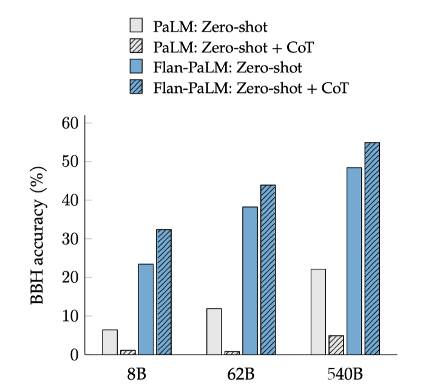

Flan-PaLM 모델은 "let’s think step-by-step"라는 문구를 활용한 CoT 추론을 통해 보이지 않는 도전적인 BIG-Bench 작업의 성능을 향상시킬 수 있음을 보여줍니다. 반면, 미세조정을 하지 않은 PaLM은 이러한 문제를 해결할 CoT를 생성하지 못한다.

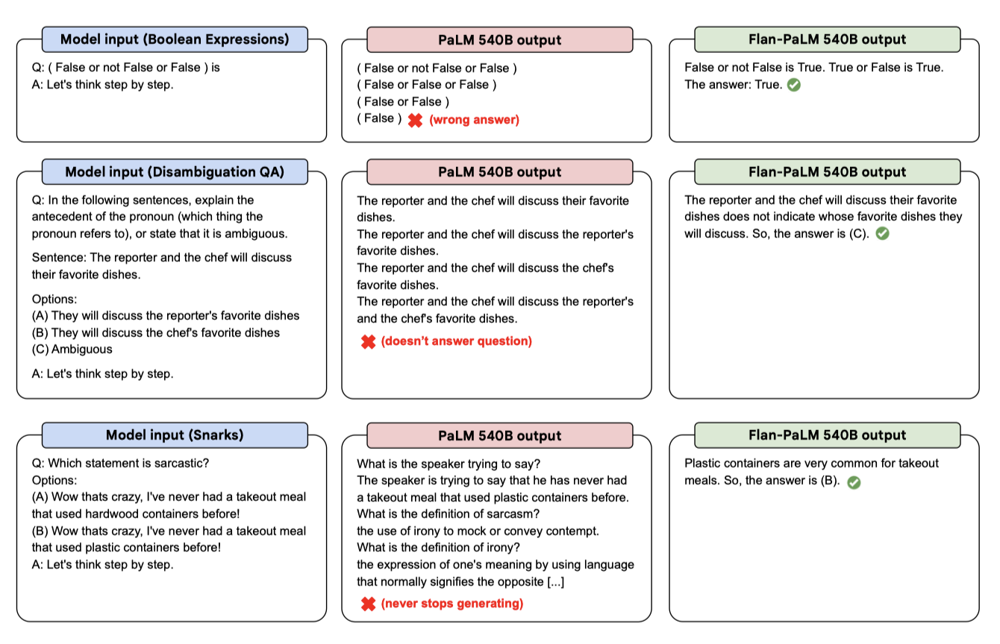

PaLM에서의 부정적인 zero-shot CoT 결과는 처음에는 Kojima et al. (2022)의 연구 결과와 상충하는 것처럼 보이지만, 실제로는 일관성이 있다. 그들의 연구에서 zero-shot CoT 실험의 대부분은 instruction finetuning이 된 InstructGPT를 활용하였고, 미세조정 없이 PaLM에서 zero-shot CoT에 성공한 경우는 주로 수학 문제였는데, 이는 BBH의 문제 유형과 크게 다르다.

---

## Putting it all together

다양한 크기, 구조, 학습 목표를 가진 여러 모델에 instruction finetuning을 적용하여 그 일반성을 시험하였다. PaLM 모델 외에도 encoder-decoder 구조의 T5 모델, 추가 토큰에 대해 사전 학습된 cont-PaLM, 그리고 추가 단계에 대해 UL2 목표로 사전 학습된 U-PaLM 모델 등에 instruction finetuning을 적용하였다.

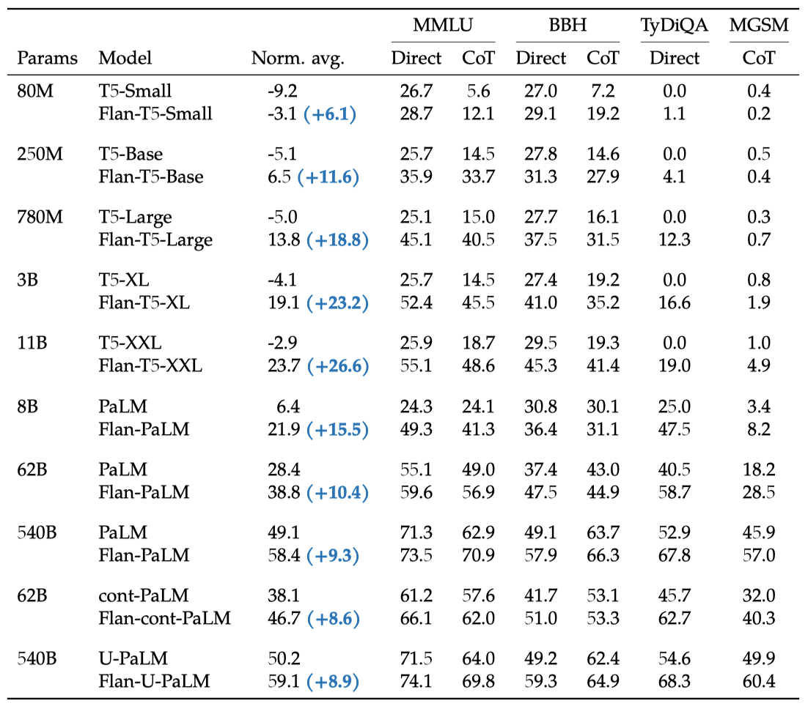

모든 모델 유형에서 instruction finetuning이 정규화된 평균 성능을 크게 향상시킨다. 표준 언어 모델링 목표로 추가 토큰에 대해 학습된 T5 모델은 instruction finetuning으로 가장 큰 이익을 얻었다. 특히, Flan-T5-XL 모델은 3B의 parameter로 MMLU 점수가 52.4%로, GPT-3 175B의 점수를 능가하였다. 가장 성능이 좋은 모델은 instruction finetuning과 U-PaLM 모델의 UL2 continued 학습을 결합한 것이며, 이는 모델 규모를 증가시키지 않고 성능을 향상시키는 효율적인 방법임을 보여준다.

---

## Usability evaluation of open-ended generation

언어 모델이 개방형 응답을 생성하는 능력에 대한 instruction finetuning의 효과를 조사하기 위해 190개의 예시로 이루어진 평가 세트를 만들어 수동 평가를 실시하였다. 이 세트는 다양한 카테고리의 질문을 포함하며, 일부는 "let’s think step-by-step"와 같은 chain-of-thought 트리거 구를 가지고 있다. 또한, instruction finetuning 없이도 언어 모델이 잘 수행되는 능력을 테스트하기 위한 추가 입력도 포함되어 있다.

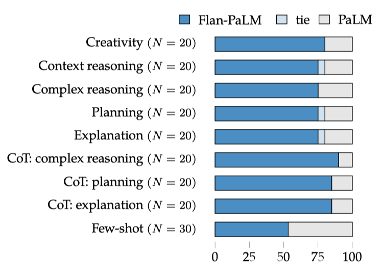

PaLM 540B 모델과 Flan-PaLM 540B 모델을 비교하는 평가를 진행하였다. 두 모델 모두, 무작위로 다섯 개의 응답을 생성하고, log probability 점수에 따라 순위를 매겼다. 중간 점수의 절반보다 좋은 점수를 가진 응답은 필터링하여 제거하였다. 이후, 최고 점수를 가진 응답을 선택하고, 이를 인간 평가자에게 제시하여 원하는 응답을 선택하도록 하였다.

인간 평가 결과, 190개 예시 중 79%에서 Flan-PaLM 생성물이 선호되었다. zero-shot 설정에서 Flan-PaLM은 큰 차이로 선호되었고, CoT 트리거 구를 사용한 경우 선호도가 약 10% 더 상승하였다. few-shot에 대해서는 PaLM에 비해 성능 저하가 없었다.

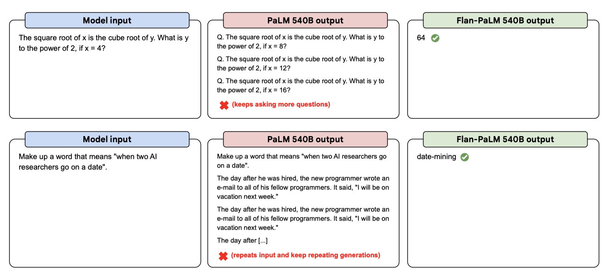

instruction finetuning된 모델은 개방형 zero-shot 입력에 대해 더 잘 응답하며, 이는 라벨러 시연과 인간의 피드백을 통한 미세조정과 강화학습이 인간의 평가를 향상시키는 것과 일치한다. 그러나 NLP 벤치마크에서는 좋은 성능을 보이지만, PaLM 모델이 다음 토큰 예측에 대한 사전 학습만으로는 zero-shot 사용성이 부족한 것으로 나타났다. 특히, 관련 텍스트를 계속 생성하거나, 질문을 반복하거나, 텍스트 생성을 언제 멈춰야 할지 모르는 등의 문제가 발견되었다. 이는 사전 학습에서 시퀀스 종료 토큰을 사용하지 않은 결과로 추정된다.

**CoT finetuning is critical for reasoning abilities.** 이전 연구에서는 non-CoT 작업에 대한 미세조정이 non-CoT 작업의 성능을 향상시키지만, 실제로는 CoT 작업의 성능을 저하시킨다는 것을 발견하였다. 이 문제를 해결하기 위해, non-CoT 데이터와 CoT 데이터 모두에 대해 공동으로 미세조정하였고, 이로 인해 CoT 작업의 성능은 크게 향상되면서 non-CoT 작업의 성능도 유지할 수 있었다. 이는 단일 모델이 모든 평가에서 잘 수행될 수 있게 만들었다. 또한 CoT 미세조정이 큰 모델에서 보류된 작업의 성능을 향상시키면서 non-CoT 작업의 성능 향상을 유지할 수 있다는 것을 보여주었다.

**Instruction finetuning generalizes across models.** 다양한 아키텍처, 크기, 사전 학습 목표를 가진 모델에 instruction finetuning을 적용하여 그 일반성을 확인하였다. 이는 이전에 T5 모델이나 decoder-only 언어 모델에 instruction finetuning의 효과성을 보여준 연구와 일치한다. 또한, instruction finetuning이 다른 모델 적응 기법과 잘 결합되어 가장 강력한 모델(Flan-U-PaLM)을 생성하였다.

**Instruction finetuning improves usability and mitigates some potential harms.** 사전 학습된 모델을 직접 사용하는 것은 비전문가에게는 어려울 수 있다. 왜냐하면 이 모델들은 생성을 언제 멈춰야 할지 알지 못하고, 사용자의 입력에 제대로 반응하는 데 실패할 수 있기 때문이다. 그러나 Flan-PaLM은 개방형 평가 세트에서 인간의 평가, 특히 복잡한 추론, 계획, 설명과 같은 작업에서 훨씬 더 우수한 성능을 보여주었다. 또한, 책임감 있는 AI 벤치마크, 특히 독성 언어를 피하는 벤치마크에서 PaLM을 능가하였다. 이러한 결과는 파인튜닝된 모델이 인간의 선호도와 더 잘 일치한다는 것을 입증한다. 이러한 모델의 zero-shot 사용성은 프롬프트 엔지니어링이 필요 없거나 소수의 예시가 필요한 언어 모델의 보다 넓은 적용에 중요하다.

**Instruction finetuning is relatively compute-efficient.** 언어 모델 크기를 확장하는 것은 성능 향상에 도움이 되지만 많은 계산 능력을 필요로 한다. 그래서 계산 효율적인 기술 개발이 중요하며, 그 중 하나로 instruction finetuning이 있다. 이는 작은 계산량으로 모델 성능을 크게 향상시키는 방법이다. 예를 들어, PaLM 540B 모델은 전체 사전 학습 계산의 0.2%만을 이용해 성능을 9.4% 향상시켰다. 더 작은 모델에서도 이 방법을 사용하면 때때로 더 큰 모델보다 더 좋은 성과를 낼 수 있다.

instruction finetuning은 few-shot, zero-shot, CoT, 개방형 생성 평가 등에서 성능을 향상시키며, 다른 모델과 기술들과도 잘 결합된다. 이 모든 이점은 사전 학습에 비해 작은 계산 비용으로 얻을 수 있다. 그래서 거의 모든 사전 학습된 언어 모델에 대해 instruction finetuning을 권장한다.

---

## Related Work

이 연구는 다중 작업 학습, 지시사항, 프롬프트, 다단계 추론, 대규모 언어 모델 등 다양한 연구 영역과 연결되어 있다. 이 논문에서는 instruction-based finetuning과 rationale-based prompting 및 미세조정을 결합한 모델을 탐구하였다. 이는 가장 관련성이 높은 다른 연구와 어떻게 연관되어 있는지 논의하고 있다.

**Instruction finetuning.** 이 논문은 성능과 사용성 향상을 위해 사전 학습된 모델에 지시사항을 미세조정하는 초기 연구 중 하나이다. 이전 연구를 확장하여 다양한 데이터셋에 미세조정하고, 더 큰 언어 모델로 확장하며, zero-shot과 few-shot 모두에 미세조정하는 방식을 탐구하였다.

**Reasoning via finetuning.** 이 논문은 CoT 주석이 포함된 여러 데이터셋에 대규모 언어 모델을 미세조정함으로써 보이지 않는 추론 작업의 성능이 향상된다는 것을 보여준다. 이전 연구와 차별화되는 점은, CoT와 non-CoT 데이터에 동시에 미세조정하고, 하나의 체크포인트가 두 가지 설정에 모두 사용될 수 있다는 것을 보여준다는 점이다.

**Compute-efficient methods for better language models.** 언어 모델 확장은 성능을 향상시키지만 많은 계산 자원이 필요하다. 이 연구는 계산량을 대폭 늘리지 않고도 언어 모델을 개선하는 연구 중 하나이다. 이는 UL2R과 같은 기존 연구와 유사하며, 추가 학습을 통해 성능을 향상시킨다. 특히, Flan-U-PaLM은 이 논문에서 학습한 모든 모델 중 가장 높은 성능을 보여주었다. 계산량을 확장하지 않고 언어 모델을 개선하는 다른 방법에는 아키텍처 개선, 학습 목표 개선, 데이터 향상 등이 있다.

---

## Conclusions

이 연구에서는 Flan-PaLM 언어 모델을 학습시키는데, 540B parameter 확장, 1.8K 미세조정 작업 확장, 그리고 chain-of-thought(CoT) 데이터를 미세조정에 포함하는 방법을 사용하였다. 이 방법은 모델의 성능을 크게 향상시켰으며, 특히 CoT 데이터와 함께 미세조정할 때 모든 평가에서 더 나은 성능을 보여주었다.

Flan-PaLM은 여러 벤치마크에서 state-of-the-art를 보여주며, 특히 5-shot MMLU에서 75.2%의 성능을 달성하였다. 프롬프트 엔지니어링이나 소량의 예시 없이 zero-shot 추론을 할 수 있어 사용성이 개선되었다. 또한, 다양한 모델 크기, 아키텍처, 사전 학습 목표와 호환되는 instruction finetuning을 통해, 기본 T5 모델보다 뛰어난 성능의 Flan-T5 모델을 공개적으로 배포하였다.

---

## Reference

* [Paper](https://arxiv.org/pdf/2210.11416.pdf)