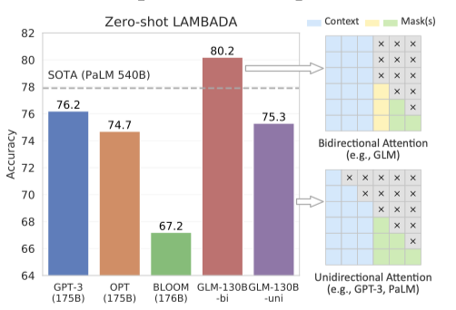
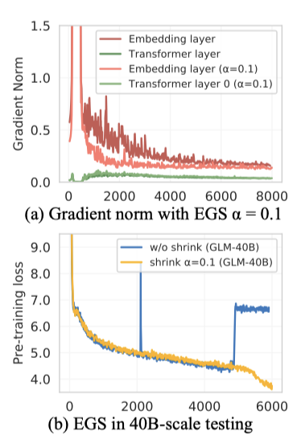
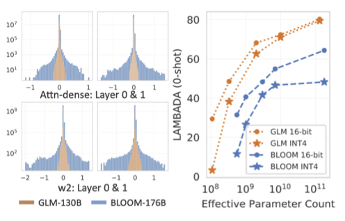
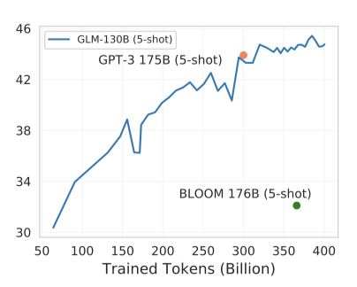
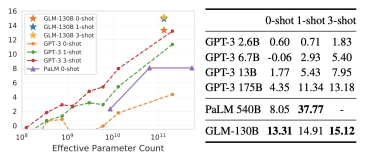

+++
author = "Kurt"
title = "GLM-130B"
date = "2024-02-17"
description = "An Open Bilingual Pre-trained Model"
categories = [
    "Paper Review"
]
tags = [
    "NLP",
    "LLM",
]
+++

## Abstract

130B parameter를 가진 bilingual(영어, 중국어) 사전 학습 언어 모델인 GLM-130B를 소개한다. 이 모델은 기술적, 엔지니어링적 도전을 극복하면서, GPT-3와 같은 수준의 성능을 달성하였다. GLM-130B는 다양한 영어 벤치마크에서 GPT-3를, 중국어 벤치마크에서는 ERNIE TITAN 3.0 260B를 뛰어넘었다. 또한, 추가 학습 없이 INT4 quantization에 성공하였고, 저렴한 GPU에서도 효과적으로 작동한다.

---

## Introduction

거대 언어 모델은 parameter가 100B 이상일 때 zero-shot 및 few-shot 능력이 갑자기 나타나는데, 이는 매우 매력적인 scaling law을 보여준다. 특히 175B 개의 parameter를 가진 GPT-3는 소수의 라벨이 붙은 예시만으로도 BERT-Large 모델보다 더 뛰어난 성능을 보여주었다. 그러나 GPT-3와 같은 거대 모델 및 그 학습 방법은 아직 대중에게 알려져 있지 않았다. 이런 거대 모델을 학습시키는 것은 모델과 학습 과정을 모두 공유하는 것이 중요하다.

윤리를 고려하여 고도로 정확한 100B 규모의 모델을 사전 학습하는 것을 목표로 한다. 이 과정에서 10B 규모 모델 학습에 비해 100B 규모 모델의 학습이 더 많은 기술적, 엔지니어링 문제를 일으킨다는 것을 알게 되었다. 이런 어려움은 OPT-175B와 BLOOM176B 학습 과정에서도 확인되어, GPT-3의 선구적인 연구의 중요성을 재확인하게 되었다.

이 연구에서는 100B 규모 모델인 GLM-130B의 사전 학습을 소개한다. 이 과정에서 효율과 안정성을 위한 다양한 학습 전략과 실패한 시도들, 그리고 얻은 교훈들을 공유한다. 특히, 이 규모의 모델에서 학습 안정성은 성공에 결정적인 요소로 작용하며, embedding gradient shrink 전략이 GLM-130B의 학습을 크게 안정화시키는 것을 확인하였다.

GLM-130B는 130B 개의 parameter를 가진 영어와 중국어의 이중 언어 모델로, NVIDIA DGX-A100 GPU 노드 클러스터에서 400B 토큰에 대해 사전 학습되었다. GPT 아키텍처 대신 bidirectional attention과 autoregressive blank infilling 목표를 활용하는 GLM 알고리즘을 사용하였다. GLM-130B는 GPT-3, OPT-175B, BLOOM-176B, 그리고 4배 더 큰 모델인 PaLM 540B와 비교되어진다.

GLM-130B는 그 유일성과 엔지니어링 노력으로 다양한 벤치마크에서 GPT-3보다 더 좋은 성능을 보이며, 많은 경우에서 PaLM 540B를 능가한다. 또한 zero-shot과 5-shot 성능에서도 다른 모델들을 능가하며, 중국어에 대한 이중 언어 LLM으로서 중국어 LLM 중 가장 큰 ERNIE TITAN 3.0보다 더 뛰어난 결과를 제공한다. 또한, GLM-130B는 편향과 생성 독성이 상당히 적은 열린 모델로서, 100B 규모의 다른 모델들과 비교된다.

GLM-130B는 100B 규모의 LLM 연구를 수행하기 위해 많은 사람들에게 도움이 되도록 설계되었다. 단일 A100 서버에서 추론을 지원하는 1300억 크기로 결정되었고, GPU 요구 사항을 줄이기 위해 GLM-130B를 추가 학습 없이 INT4 정밀도로 양자화하였다. 이는 압축되지 않은 GPT-3보다도 더 좋은 성능을 보여주며, 4×RTX 3090 또는 8×RTX 2080 Ti 서버에서 빠른 추론을 가능하게 한다. 이는 지금까지 100B 규모의 LLM을 사용하는 데 필요한 가장 저렴한 GPU를 제공한다.

---

## The Design Choicess Of GLM-130B

머신러닝 모델의 구조는 그 모델의 귀납적 편향을 결정한다. 하지만, LLM들에 대한 다양한 구조적 디자인을 탐색하는 것은 계산상 매우 부담스럽다. 이 연구에서는 GLM-130B의 독특한 디자인 선택사항들을 소개한다.

### GLM-130B's Architecture

**GLM as Backbone.** 최근의 100B 규모 LLM들은 대부분 GPT-3, PaLM, OPT, BLOOM 등과 같이 GPT 스타일의 아키텍처를 따르고 있다. 그러나 GLM-130B는 이와는 다르게 bidirectional General Language Model의 가능성을 탐색하고 있다.

GLM은 autoregressive blank infilling을 학습 목표로 하는 transformer-based 언어 모델이다. 텍스트 시퀀스에서 샘플링된 텍스트 범위는 single 마스크 토큰으로 대체되어 손상된 텍스트를 형성하며, 이 모델은 이를 자동으로 복구하도록 요청된다. 손상된 범위 간의 상호 작용을 가능하게 하기 위해, 이들은 무작위 샘플링 순열을 통해 서로 보이게 된다.

GLM-130B는 마스크 되지 않은 맥락에 대한 bidirectional attention을 사용함으로써, unidirectional attention을 사용하는 GPT 스타일의 LLMs와 구별된다. 이해와 생성을 지원하기 위해, GLM-130B는 두 가지른 마스크 토큰으로 표시된 손상 목표를 혼합한다.

* **[MASK]:** 입력의 일정 부분을 차지하는 문장 내의 짧은 빈칸들이다.
* **[gMASK]:** 제공된 접두사 맥락을 가진 문장의 끝에 임의의 길이의 긴 빈칸들이 있다.

bidirectional attention을 활용한 blank infilling 목표는 GPT 스타일 모델보다 더욱 효과적인 맥락 이해를 가능하게 한다. GLM-130B는 [MASK]를 사용하면 BERT와 T5처럼, [gMASK]를 사용하면 PrefixLM처럼 작동한다.

GLM-130B는 GPT-3와 PaLM 540B를 능가하여 zero-shot LAMBADA에서 최고 기록인 80.2%의 정확도를 달성하였다. attention mask를 설정하면, GLM-130B의 unidirectional 변형은 GPT-3와 OPT-175B와 비슷한 성능을 보여준다. 이 결과는 기존 연구 결과와 일치한다.

**Layer Normalization** LLM 학습의 불안정성은 주요한 도전 과제이다. 적절한 LN 선택은 LLM 학습의 안정화에 도움이 될 수 있지만, Pre-LN, Post-LN, Sandwich-LN 등의 기존 방법들은 GLM-130B 테스트를 안정화시키는데 불편함을 겪었다.

이 연구는 Post-LN에 초점을 맞추게 되었는데, 이는 GLM-130B를 안정화시키지 못했으나 예비 실험에서 좋은 결과를 보였기 때문이다. 최근 제안된 DeepNorm으로 초기화된 Post-LN 시도 중 하나가 학습 안정성에 유망한 결과를 보여주었다. GLM-130B의 layer 수 $N$에 따라 특정 공식을 적용하고, 모든 편향 요소를 0으로 초기화하여 GLM-130B의 학습 안정성을 크게 향상시켰다.

**Positional Encoding and FFNs.** 학습 안정성과 성능을 위해, 다양한 positional encoding 및 FFN 개선 옵션을 실증적으로 테스트하였다. GLM-130B에서는 ALiBi 대신 Rotary Positional Encoding을 채택했고, Transformer의 FFN 개선을 위해 GeLU 활성화와 함께 GLU를 선택하였다.

### GLM-130B's Pre-Training Setup

최근 연구에 따라, GLM-130B의 사전 학습 목표는 autoregressive blank infilling와 함께 토큰의 일부에 대한 multi-task 학습도 포함하고 있다. 이는 downstream zero-shot 성능 향상에 도움이 될 것으로 예상된다.

**Self-Supervised Blank Infilling (95% tokens).** GLM-130B는 학습 시퀀스에서 [MASK]와 [gMASK]를 독립적으로 사용한다. [MASK]는 학습 시퀀스의 30%에서 연속적인 범위를 마스크하는 데 사용되며, 이 범위의 길이는 poisson 분포를 따른다. 나머지 70%의 시퀀스에서는 접두사를 맥락으로 유지하고 나머지 부분은 [gMASK]로 마스크하며, 마스크된 길이는 균일 분포에서 샘플링된다.

사전 학습 데이터는 Pile 영어, WudaoCorpora 중국어, 그리고 웹에서 크롤링한 다양한 중국어 코퍼스를 포함하며, 이는 영어와 중국어 컨텐츠의 균형을 이룬다.

**Multi-Task Instruction Pre-Training (MIP, 5% tokens).** T5와 ExT5는 사전 학습에서의 multi-task 학습이 미세 조정보다 유용하다고 제안했다. 따라서, 언어 이해, 생성, 정보 추출 등 다양한 지시문이 포함된 데이터셋을 GLM-130B의 사전 학습에 포함하는 것을 제안한다.

최근 연구들이 다중 과제 프롬프트 세부 조정을 활용해 zero-shot 작업 전송을 개선하는 것과 비교하여, MIP는 토큰의 5%만 차지하고 LLM의 다른 능력을 보호하기 위해 사전 학습 단계에서 설정된다. 74개의 프롬프트 데이터셋을 포함하며, GLM-130B 사용자들은 이 데이터셋에서 zero-shot과 few-shot 능력을 평가하는 것을 피하도록 권장된다.

### Platform-Aware Parallel Strategies And Model Configurations

GLM-130B는 96개의 DGX-A100 GPU 서버 클러스터에서 60일 동안 학습되었다. 목표는 최근 연구에 따라 대부분의 LLM들이 충분히 학습되지 않았다는 것을 고려하여 가능한 많은 토큰을 처리하는 것이다.

**The 3D Parallel Strategy.** 데이터 병렬처리와 텐서 모델 병렬처리는 대규모 모델 학습의 표준 방법이다. 하지만 GLM-130B의 학습에는 40G A100s가 사용되므로, 거대한 GPU 메모리 요구와 GPU 사용률 감소를 처리하기 위해 파이프라인 모델 병렬처리를 결합하여 3D 병렬 전략을 적용하였다.

파이프라인 병렬처리를 통해 모델을 순차적인 단계로 나누고, PipeDream-Flush 구현을 활용하여 큰 글로벌 배치 크기로 GLM-130B를 학습시켜 시간과 GPU 메모리 낭비를 줄였다. 수치적 및 경험적 검토를 통해 4-way 텐서 병렬처리와 8-way 파이프라인 병렬처리를 채택했으며, 이로 인해 하드웨어 FLOPs 사용률은 43.3%, 모델 FLOPs 사용률은 32.5%이다.

**GLM-130B Configurations.** 목표는 100B 규모의 LLM을 단일 DGX-A100 노드에서 FP16 정밀도로 실행하는 것이다. GPT-3의 hidden state dimension을 기반으로, 결과적인 모델 크기는 130B parameter로, 이를 GLM-130B라고 한다. GPU 사용률을 최대화하기 위해 모델을 플랫폼과 병렬 전략에 맞게 구성하였다. 메모리 부족을 방지하기 위해, 파이프라인 분할을 균형잡게 하여 GLM-130B에는 70개의 transformer layer가 있다.

60일 동안, 샘플당 시퀀스 길이 2,048로 중국어와 영어 각각 약 2000억 개의 토큰을 사용하여 GLM-130B를 학습시켰다. [gMASK] 학습 목표를 위해 2,048 토큰의 맥락 윈도우를, [MASK]와 multi-task 목표를 위해 512 맥락 윈도우를 사용하였다. 첫 2.5%의 샘플 동안 배치 크기를 192에서 4224까지 늘렸고, AdamW를 optimizer 도구로 사용하였다. learning rate를 첫 0.5%의 샘플 동안 점차 늘렸다가 cosine schedule로 감소시켰고, dropout rate는 0.1, gradient clipping 값은 1.0을 사용하였다.

---

## The Training Stability Of GLM-130B

GLM-130B의 품질은 학습 안정성과 토큰 처리량에 크게 의존한다. 컴퓨팅 제약사항을 고려하면, low-precision floating-point(FP16)은 계산 효율성을 높이지만 오버플로우와 언더플로우 오류로 인해 학습이 무너질 수 있어, 효율성과 안정성 사이에는 타협이 필요하다.

**Mixed-Precision.** mixedprecision 전략을 사용하여 GPU 메모리 사용량을 줄이고 학습 효율성을 향상시켰다. 그러나 이 선택으로 인해 GLM-130B는 학습 중에 자주 손실 급증을 경험하며, 이는 학습이 진행됨에 따라 더욱 빈번해진다. 이러한 문제를 해결하기 위해 OPT-175B와 BLOOM-176B는 각각 데이터를 건너뛰고 hyper-parameter를 조정하거나 embedding norm 기법을 사용하였다. 이러한 급증을 몇 개월 동안 조사한 결과, transformer가 확장될 때 몇 가지 문제가 발생함을 확인하였다.

Pre-LN을 사용할 경우 transformer의 deeper layer에서 값 범위가 매우 커질 수 있다. 이는 GLM-130B에서 DeepNorm 기반의 Post-LN을 사용하여 값 범위를 항상 제한함으로써 해결되었다.

모델이 확장됨에 따라 attention score가 FP16의 범위를 초과하는 문제가 발생한다. 이를 해결하기 위한 여러 방법이 있지만, GLM-130B에서는 효과적이지 않았다. BLOOM-176B에서는 넓은 값 범위를 가진 BF16 형식을 사용했지만, 이는 GPU 메모리 사용량을 증가시키고, 일부 GPU 플랫폼에서 지원되지 않아 제한적이다. 또한, BF16과 함께 embedding norm을 적용하면 모델 성능이 손상될 수 있다.

**Embedding Layer Gradient Shrink (EGS).** gradient norm은 학습 붕괴의 유익한 지표로 작용할 수 있다. 학습 붕괴는 보통 gradient norm의 "spike" 뒤에 몇 단계 지연되며, 이 spike는 주로 embedding layer의 이상한 gradient 때문에 발생한다. 이 문제는 시각 모델에서 패치 프로젝션 계층을 고정함으로써 해결되지만, 언어 모델에서는 embedding layer의 학습을 고정할 수 없다.

embedding layer의 gradient shrink가 loss spike를 극복하고 GLM-130B의 학습을 안정화시킬 수 있다는 것을 발견하였다. 이 전략은 multi-modal transformer인 CogView에서 처음 사용되었으며, 축소 요인 $\alpha$를 사용하여 쉽게 구현될 수 있다. $\alpha = 0.1$로 설정하면 대부분의 spike를 제거하고 지연시간을 거의 발생시키지 않음을 경험적으로 확인하였다.

GLM-130B의 최종 학습은 하드웨어 실패로 여러 번 실패했지만, 후반기에는 세 번의 loss divergence 사례만 발생하였다. 이런 상황에서도 embedding gradient를 더 축소하면 GLM-130B 학습의 안정성을 유지하는 데 도움이 되었다.

---

## GLM-130B Inference On RTX 2080 TI

GLM-130B의 주요 목표 중 하나는 효율성과 효과성을 손상시키지 않으면서 100B 규모의 LLM에 접근하기 위한 하드웨어 요구사항을 낮추는 것이다.

130B 모델 사이즈는 high-end A100 (80G×8) 보다는 single A100 (40G×8) 서버에서 GLM-130B를 실행하기 위해 설정되었다. FasterTransformer를 사용하여 C++로 GLM-130B를 구현하였고, 이로 인해 동일한 A100 서버에서의 디코딩 추론 속도가 7-8.4배 빠르게 되었다.

**INT4 Quantization for RTX 3090s/2080s.** 성능을 유지하면서 GLM-130B를 최대한 압축하려는 노력 중, 양자화를 통해 생성 언어 모델의 성능 하락을 최소화하고, 이를 통해 보다 대중적인 GPU 지원을 목표로 하고 있다.

모델 가중치와 활성화를 INT8로 양자화하는 것이 일반적이지만, GLM-130B 활성화의 약 30% 이상치 때문에 이 방법이 비효율적이다. 따라서 모델 가중치의 양자화에 집중하고 활성화에 대해서는 FP16 precision을 유지하기로 하였다. 이렇게 하면 작은 계산 오버헤드가 동적으로 발생하지만, 모델 가중치를 크게 줄일 수 있다.

기존에는 INT8까지만 가능했던 가중치 양자화를 GLM-130B에서는 INT4까지 성공적으로 달성하였다. 이로 인해 필요한 GPU 메모리를 절반으로 줄여 70GB를 필요로 하고, RTX 3090 Ti 4개 또는 RTX 2080 Ti 8개에서 GLM-130B 추론이 가능하게 되었다. 또한, 추가 훈련 없이도 INT4 버전 GLM-130B는 성능 저하가 거의 없어, 일반 벤치마크에서 GPT-3에 대한 성능 우위를 유지하고 있다.

**GLM’s INT4 Weight Quantization Scaling Law.** INT4 가중치 양자화의 독특한 스케일링 법칙을 조사하였다. 가중치 값 분포는 양자화 품질에 직접적으로 영향을 미치며, wider-distributed linear layer는 더 큰 구간으로 양자화해야 하므로 precision 손실이 발생한다. 이는 GPT 스타일 BLOOM에 대한 INT4 양자화 실패를 설명한다. 반면, GLM들은 유사 크기의 GPT보다 분포가 좁고, 모델 크기가 증가함에 따라 INT4와 FP16 버전 사이의 차이는 계속해서 줄어든다.

---

## The Results

GPT-3 및 PaLM과 같은 LLM의 일반적인 설정을 따라 GLM-130B를 영어로 평가한다. 중국어를 포함하는 이중 언어 LLM인 GLM-130B는 중국어 벤치마크에서도 평가된다.

**Discussion on the Scope of Zero-Shot Learning in GLM-130B.** "zero-shot" 평가의 범위를 명확히 하기 위해, GLM-130B는 "테스트 시간에, zero-shot 학습 설정에서, 목표는 테스트 이미지를 보지 못한 클래스 레이블에 할당하는 것"이라는 관점을 따른다. 이는 보지 못한 클래스 레이블을 포함하는 것이 핵심 요소이다. 이 기준에 따라 GLM-130B의 zero-shot 및 few-shot 데이터셋을 선택한다.

* **English:** 고정 레이블이 있는 작업(예: 자연어 추론)에 대해서는 어떤 데이터셋도 평가에 사용하지 않으며, 고정 레이블이 없는 작업(예: QA, 주제 분류)에서는 MIP의 도메인 전환과 명확하게 연결된 데이터셋만을 고려한다.
* **Chinese:** zero-shot 언어 간 전송이 가능하기 때문에 모든 데이터셋을 평가할 수 있다.

**Filtering Test Datasets.** 이전 연구와 이 연구의 기준을 따라, 잠재적으로 오염된 데이터셋의 평가 결과는 보고하지 않았다. LAMBADA와 CLUE는 13-gram 설정에서 최소한의 중복을 보였고, Pile, MMLU, BIG-bench는 보류되었거나 데이터 수집 이후에 출시되었다.

### Language Modeling

**LAMBADA.** LAMBADA는 마지막 단어 언어 모델링 능력을 테스트하며, GLM-130B는 bidirectional attention을 통해 zero-shot 정확도 80.2를 달성하여 LAMBADA에서 새로운 최고 기록을 세웠다.

**Pile.** Pile 테스트 세트는 언어 모델링 벤치마크를 제공하며, 평균적으로 GLM-130B는 가중 BPB 기준으로 GPT-3와 Jurassic-1에 비해 18개의 공유 테스트 세트에서 가장 뛰어난 성능을 보여준다. 이는 GLM-130B의 강력한 언어 능력을 입증한다.

### Massive Multitask Language Understanding (MMLU)

MMLU는 다양한 수준의 인간 지식에 관한 57개의 다중 선택형 질문 답변 작업을 포함하는 벤치마크이다. 이는 Pile 크롤링 후 출시되어 LLM의 few-shot 학습을 위한 이상적인 테스트 베드로 사용된다. GPT-3의 결과는 MMLU에서 가져오고, BLOOM-176B는 GLM-130B와 동일한 프롬프트를 사용하여 테스트한다.

약 300B 토큰을 본 후, GLM-130B의 few-shot 성능은 MMLU에서 GPT-3에 근접하며, 학습이 진행됨에 따라 성능은 계속 상승하여 총 400B 토큰을 볼 때 정확도 44.8을 달성한다. 이는 대부분의 기존 LLM들이 충분히 학습되지 않았다는 관찰과 일치한다.

### Beyond The Imitation Game Benchmark (BIG- BENCH)

BIG-bench는 모델의 추론, 지식, 상식에 대한 능력을 테스트하는 벤치마크이다. 시간 소모를 줄이기 위해, 24개 작업의 BIG-bench-lite를 보고한다. GLM-130B는 GPT-3 175B와 PaLM 540B를 zero-shot 설정에서 능가하며, 이는 GLM-130B의 bidirectional context attention과 MIP 덕분일 것이다. shot의 수가 증가함에 따라 GLM-130B의 성능은 계속 상승하여 GPT-3를 능가한다.

**Limitations and Discussions.** few-shot 샘플의 증가에 따른 GLM-130B의 성능 향상이 GPT-3만큼 크지 않음을 실험에서 관찰하였다. 이 현상을 이해하기 위한 우리의 직관적인 분석을 제시한다.

GLM-130B의 bidirectional 특성은 강력한 zero-shot 성능을 이끌어낸다, 따라서 유사한 규모의 모델에 대한 few-shot "upper-bound"에 더 가까워진다. 그러나, 기존 MIP 패러다임은 학습에서 zero-shot 예측만을 포함하므로, 이는 GLM-130B가 zero-shot 학습에 강하게 편향되고 문맥 내 few-shot 성능이 상대적으로 약하게 될 수 있다. 이러한 편향을 바로잡기 위해, 다양한 shot의 문맥 내 샘플을 사용하여 MIP를 적용하는 것을 제안하게 되었다.

GPT-3와 거의 동일한 아키텍처를 가진 PaLM 540B는 few-shot 문맥 학습을 통한 성장이 GPT-3보다 훨씬 뚜렷하다. 이는 PaLM의 고품질이고 다양한 학습 코퍼스의 결과라고 추측되며, 이를 통해 더 나은 아키텍처, 데이터, 그리고 더 많은 학습 FLOPS에 투자가 필요함을 깨달았다.

### Chinese Language Understanding Evaluation (CLUE)

중국어 NLP 벤치마크인 CLUE와 FewCLUE에서 GLM-130B의 zero-shot 성능을 평가하였다. 가장 큰 중국어 단일 언어 모델인 ERNIE Titan 3.0과 비교해봤을 때, GLM-130B는 12개의 작업에서 일관되게 더 뛰어난 성능을 보여주었다. 특히, 두 추상적 MRC 데이터셋에서는 ERNIE보다 적어도 260% 더 나은 성능을 보여주었다. 이는 GLM-130B의 사전 학습 목표가 추상적 MRC 형태와 잘 맞아 떨어지기 때문일 것이다.

---

## Related Work

GLM-130B와 관련된 사전 학습, 전이, 사전 학습된 LLM의 추론에 대한 연구를 검토한다.

**Pre-Training.** 바닐라 언어 모델링은 decoder-only autoregressive 모델을 의미하며, 최근 transformer-based 언어 모델은 모델이 확장됨에 따라 새로운 능력이 발생하는 것을 보여준다. 하지만, 많은 100B 규모의 LLM들이 공개되지 않았거나 제한적으로만 접근 가능하며, 이는 그들의 발전을 저해한다. GLM-130B의 노력과 최근의 ElutherAI, OPT-175B, BLOOM-176B는 커뮤니티에 고품질의 오픈소스 LLM을 제공하려는 목표를 가지고 있다.

**Transferring.** 미세 조정은 전이 학습의 기본적인 방법이었지만, LLM의 평가는 그들의 큰 크기 때문에 프롬프팅과 문맥 학습에 집중하고 있다. 그러나 최근에는 언어 모델에서의 효율적인 학습과 프롬프트 튜닝에 대한 시도들이 있었다. 현재로서는 이들에 집중하지 않고, GLM-130B에서 이들에 대한 포괄적인 테스트를 미래의 연구로 남겨두려고 한다.

**Inference.** 현재 대부분의 공개 LLM들은 제한된 API를 통해 제공되고 있다. 이 연구에서는 LLM의 효율적이고 빠른 추론에 집중하였다. 관련 연구에는 distillation, quantization, pruning 등이 있다. 최근 연구에서는 OPT-175B와 BLOOM-176B 같은 LLM들이 8비트로 양자화될 수 있다는 것을 보여주었다. 이 연구는 GLM의 스케일링 법칙을 보여주고, 이를 통해 GLM-130B가 적은 수의 GPU에서도 추론할 수 있음을 보여준다.

---

## Conclusions

개방적이고 포괄적인 LLM 연구를 목표로 하는 이중 언어 사전 학습 언어 모델, GLM-130B를 소개한다. 이 모델은 LLM의 아키텍처, 학습 목표, 안정성, 효율성, 그리고 저렴한 추론에 대한 통찰을 제공한다. GLM-130B는 112개의 작업에서의 언어 성능과 편향, 독성 벤치마크에서의 윤리적 결과 면에서 높은 품질을 보여준다.

---

## Reference

* [Paper](https://arxiv.org/pdf/2210.02414.pdf)
* [GitHub](https://github.com/THUDM/GLM-130B)