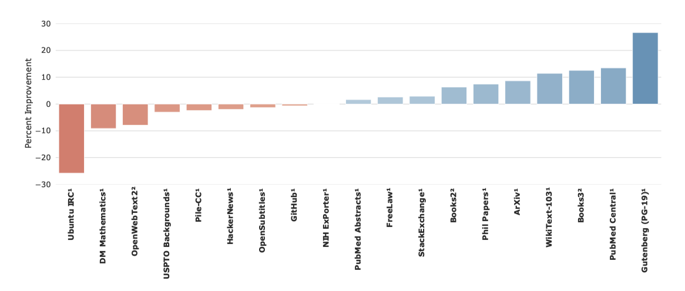
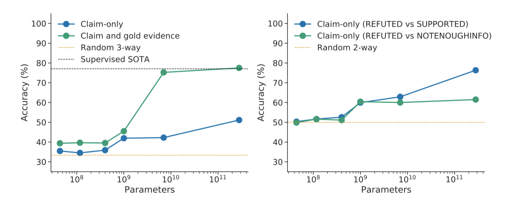
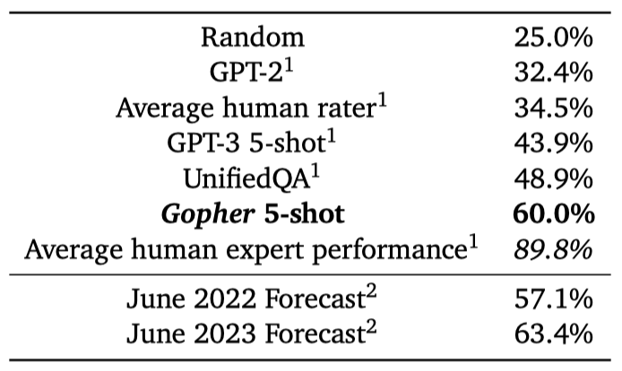
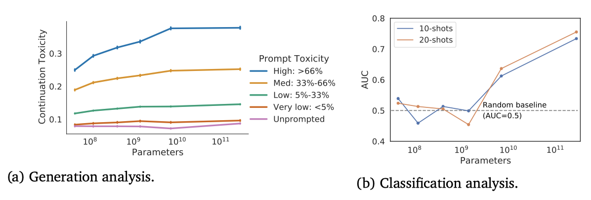
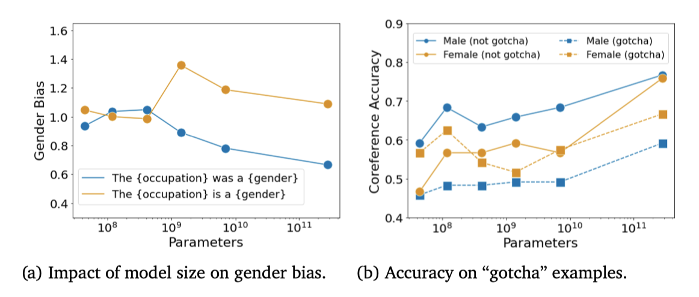
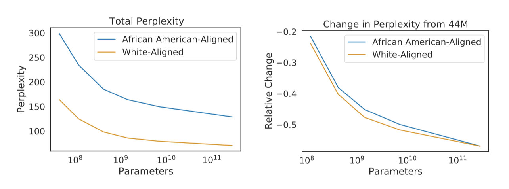

+++
author = "Kurt"
title = "Gopher"
date = "2024-01-13"
description = "Scaling Language Models: Methods, Analysis & Insights from Training Gopher"
categories = [
    "Paper Review"
]
tags = [
    "NLP",
    "LLM",
]
+++

## Abstract

이 논문에서는 수천만 개의 parameter를 가진 모델에서 Gopher라는 280B 개의 parameter를 가진 모델에 이르는 다양한 규모의 Transformer 기반 언어 모델 성능을 분석한다. 이러한 모델들은 152개의 다양한 작업에서 state-of-the-art를 보여주며, 규모 확장은 주로 독해, 팩트 체크, 유해한 언어 식별 등에서 가장 큰 이익을 가져다준다. 또한, 학습 데이터셋과 모델의 행동에 대한 종합적인 분석을 제공하고, AI 안전성에 대한 언어 모델의 적용 및 하류에서의 유해성 완화 방법을 논의한다.

---

## Introduction

자연어는 인간과 AI 간의 아이디어 공유를 효율화하며, 그 일반성으로 다양한 지능 작업을 표현할 수 있게 한다.

Autoregressive 언어 모델링은 텍스트의 과거로부터 미래를 예측하여 다양한 인지 작업을 형성하고, 인터넷이나 책 등의 데이터를 학습에 활용한다. 이는 특정 목표에 대한 근사치일 뿐이지만, 적절히 활용하면 인간 지능의 복잡성을 포착하는 강력한 도구가 될 수 있다.

언어 모델을 지능의 구성 요소로 사용하는 것은 제한된 대역폭의 통신에서 텍스트를 전송하는 기존의 적용과 대비된다. 통신 이론은 언어 모델의 압축률 측정과 자연 언어의 통계 모델링을 연결시켰다. 초기 언어 모델은 실제 데이터에 적용되며, 모델의 복잡성은 텍스트 압축을 향상시키고 현실적인 텍스트 생성을 도왔다. 그리고 이 모든 것은 지능과 밀접한 관계가 있었으며, 충분히 복잡한 모델은 인간의 커뮤니케이션을 적절하게 반영할 것이라는 주장과 함께, 이 관계는 후속 연구에서 더욱 확장되었다.

현대 컴퓨팅의 발전은 언어 모델의 향상을 주도하였다. 펜과 종이에서 시작된 언어 모델은 컴퓨팅의 급격한 증가로 용량과 예측력을 향상시켰다. 1990년대와 2000년대에는 n-gram 모델이 확대되고 개선된 스무딩 기법이 도입되었다. 이 모델들은 음성 인식, 철자 교정, 기계 번역 등 여러 분야에 적용되었으나, 컨텍스트 길이가 길어짐에 따라 통계적, 계산적 비효율성이 나타나, 모델링 가능한 언어의 풍부함에 제한이 있다.

지난 20년 동안 언어 모델은 언어의 구조를 암시적으로 이해하는 neural network로 발전했다. 이 발전은 규모와 네트워크 구조의 발전에 의해 주도되었다. 순환 신경 언어 모델과 Transformer 신경 언어 모델은 크로스 엔트로피 손실과 모델 크기 사이에 파워 법칙이 존재함을 발견하였다. 이 이론적인 발견은 GPT-3라는 신경 네트워크에서 실현되었으며, 이 모델은 다양한 자연 언어 처리(NLP) 작업에서 뛰어난 성능을 보여주었다.

이 논문에서는 state-of-the-art 언어 모델인 Gopher의 학습 방법을 설명하며, 이 모델은 280B 개의 parameter를 가진다. 아키텍처 명세, 최적화, 인프라, 고품질 텍스트 데이터셋인 MassiveText 구성 방법을 설명하고, 지능의 다양한 측면을 검토하는 152개의 작업에서의 성능을 분석하였다. Gopher는 현재 최첨단 언어 모델에 비해 약 81%의 작업에서 성능을 향상시키며, 특히 사실 확인과 일반 지식 등의 지식 집약적인 분야에서 뛰어난 성능을 보였다.

Gopher의 학습 세트와 다양한 응용 프로그램에서 발생하는 유해한 콘텐츠에 대해 분석하며, 특히 모델의 규모가 독성과 편향에 어떤 영향을 미치는지 검토한다. 큰 모델은 유해한 프롬프트에 더욱 독성 반응을 생성하는 경향이 있지만, 독성을 더 정확하게 분류할 수 있다. 이 외에도, 대화 상호작용 설정에서 Gopher의 성능과 한계를 분석하고 이를 설명하는 대화록을 제시한다.

마지막으로, 모델의 윤리적이고 안전한 적용, 특히 학습 전후에 줄여야 할 부적절한 행동에 대해 논의한다. 또한, 응용 프로그램 중심의 안전성과 언어 모델이 안전한 지능 기술 연구를 가속화하는 가능성에 대해 논의한다.

---

## Background

언어 모델링은 텍스트의 확률을 모델링하는 것으로, 이는 문자열을 정수 토큰의 시퀀스로 변환하는 토큰화 과정을 통해 이루어진다. 토큰화는 모든 문자열을 고유하게 토큰화하는 open-vocabulary 방식과 텍스트의 일부만 고유하게 표현하는 closed-vocabulary 방식이 있다. 이 연구에서는 byte-pair encoding (BPE)과 UTF-8 바이트를 혼합한 open-vocabulary 토큰화 방식을 사용하였다.

토큰 시퀀스를 모델링하는 일반적인 방법은 체인 규칙을 이용한 것으로, 이는 과거 맥락에 기반해 미래 토큰을 예측하는 autoregressive 시퀀스 모델링이라고 알려져 있다. 다른 목표들도 있지만, 강력한 성능과 단순성 때문에 autoregressive 모델링에 초점을 맞춘다. 이후 언어 모델은 다음 토큰 예측을 수행하는 함수 근사자로 참조한다.

Transformer라는 neural network는 최근 몇 년 동안 최고의 언어 모델 성능을 보여주었고, 이 아키텍처를 본 논문에서 중점적으로 다룬다. 학습 데이터, 모델 크기, 학습 계산의 조합을 확장하여 성능이 향상된 모델을 얻는 추세가 관찰되었다. 이런 방향에서는 BERT, GPT-2, Megatron, T5, GPT-3 등의 모델이 주목받았으며, 이러한 큰 모델들을 대표하는 용어로 "Large Language Models (LLMs)"가 널리 사용되고 있다.

GPT-3 이후에는 다양한 학습 데이터와 큰 토크나이저 어휘 크기를 사용하는 178B parameter의 Jurassic-1과 공개 데이터셋에서 학습하는 530B parameter의 Megatron-Turing NLG가 발표되었다. 또한, sparse mixture of expert를 통해 더 적은 계산 예산으로 모델 크기를 증가시킨 Transformer 변형 모델들이 있다. 최근에는 FLAN과 T0와 같은 모델들이 다양한 downstream task에 대한 instruction에 미세 조정되어 보이지 않는 작업에 대한 성능을 향상시키고 있다.

---

## Method

### Models

이 논문에서는 44M에서 280B parameter에 이르는 여섯 개의 Transformer 언어 모델, Gopher 가족에 대한 결과를 제시하였다. 그 중 가장 큰 모델을 Gopher라고 부른다.

autoregressive Transformer 아키텍처를 사용하며, LayerNorm 대신 RMSNorm을 사용하고, absolute positional encoding 대신 relative positional encoding 방식을 사용하였다. 이를 통해 학습보다 긴 시퀀스에서 평가할 수 있게 되어, 기사와 책의 모델링이 향상되었다. 또한, 32,000개의 어휘를 가진 SentencePiece를 통해 텍스트를 토큰화하고, byte-level backoff를 사용하여 오픈 어휘 모델링을 지원하였다.

### Training

모든 모델을 300B 토큰에 대해 학습시키며, Adam optimiser를 사용한다. 처음 1500 step 동안 learning rate를 점진적으로 늘리고, 이후에는 cosine schedule을 이용해 learning rate를 감소시킨다. 모델 크기를 키울수록 최대 learning rate는 줄이고, batch당 토큰 수는 늘린다. Gopher의 batch size는 학습 중 600만 토큰으로 늘리며, 기울기는 전역 기울기 정규화를 기반으로 제한한다. 특히, 7.1B 모델과 Gopher의 경우 안정성을 위해 이 제한 값을 0.25로 줄인다.

메모리 절약과 학습 처리량 증가를 위해 bfloat16 수치 형식을 사용한다. 7.1B보다 작은 모델은 mixed precision float32 parameter와 bfloat16 활성화로 학습되고, 7.1B와 280B 모델은 bfloat16 활성화와 parameter로 학습된다. 안정성을 위해 bfloat16 parameter는 확률적 반올림을 활용해 업데이트되지만, 이 방법이 mixed precision 학습 성능을 완전히 회복시키지 못한다는 것을 나중에 알게 되었다.

### Infrastructure

JAX와 Haiku를 활용하여 학습 및 평가 코드를 작성하였다. 데이터와 모델의 병렬 처리를 위해 JAX의 pmap 변환을 사용하였고, 모든 모델 학습 및 평가는 TPUv3 칩에서 이루어졌다.

Gopher의 half-precision parameter와 Adam 상태는 2.5 TiB를 차지해 TPUv3 코어의 16 GiB 메모리를 크게 초과한다. 이 문제를 해결하기 위해, 최적화 상태 분할, 모델 병렬화, 그리고 재재료화를 활용해 모델 상태를 분할하고 활성화를 줄여 TPU 메모리에 맞추었다.

데이터와 모델의 병렬화는 TPUv3의 빠른 칩 간 통신 덕분에 낮은 오버헤드를 가지며, Gopher 학습 시에는 10%의 오버헤드만 발생한다는 것을 확인하였다. 따라서, 학습 규모가 1024-chip "pod"를 초과하지 않는 한 TPU에서 파이프라이닝이 필요하지 않아, 중간 크기의 모델 학습이 단순화되었다. 그러나 파이프라이닝은 통신 볼륨이 작아 상용 네트워크에서 효율적인 병렬화 방법으로, 여러 TPU pod를 연결하는데 적합하다. 결국, TPU pod 내에서 모델과 데이터 병렬화를 사용하고, pod 간에는 파이프라이닝을 사용하여 Gopher를 학습시켰다.

### Training Dataset

Gopher 모델 패밀리는 웹 페이지, 책, 뉴스 기사, 코드 등 다양한 출처의 대규모 영어 텍스트 데이터셋인 MassiveText에서 학습되었다. 데이터 파이프라인은 텍스트 품질 필터링, 반복 텍스트 제거, 유사 문서 중복 제거, 테스트 세트와 많은 중복이 있는 문서 제거를 포함한다. 이 파이프라인의 연속적인 단계가 언어 모델의 다운스트림 성능을 향상시키는 것을 확인했으며, 이는 데이터셋 품질의 중요성을 강조한다.

MassiveText는 총 23.5억 개의 문서로, 약 10.5TB의 텍스트를 포함한다. Gopher 학습에 사용된 토큰은 3000억 개로, 이는 전체 토큰의 12.8%에 해당한다. 이를 위해, 책, 뉴스 등의 하위 집합별로 지정된 샘플링 비율로 MassiveText에서 샘플을 추출하였다. 이 비율은 downstream 성능을 최대화하기 위해 조정되었다. 가장 큰 샘플링 하위 집합인 MassiveWeb은 downstream 성능을 향상시켰다.

---

## Results

Gopher와 그보다 작은 모델들의 성능을 152개 작업에서 분석하였다. 이를 기존 언어 모델의 최고 성능, 작업 특정 데이터를 활용한 지도 학습 방법, 그리고 가능한 경우 인간의 성능과 비교하였다.

### Task Selection

수학, 상식, 논리, 지식, 과학, 윤리, 독해능력 등 다양한 분야에 걸친 언어 모델 성능을 분석하였다. 이에는 다양한 작업을 포함하는 복합 벤치마크와 독해 능력을 위한 RACE, 사실 확인을 위한 FEVER 등의 타겟 벤치마크를 포함시켰다.

모델이 대상 텍스트의 확률을 추정하는 작업을 선택하였다. 이는 지식과 추론 능력을 측정하는 일반적인 방법이다. 언어 모델링 작업에서는 bits per byte(BPB)를 계산하며, 다른 모든 작업은 다중 선택 형식을 따른다. 여기서 모델은 각 선택지에 확률을 할당하고, 가장 확률이 높은 선택지를 선택하다. 이때, 올바른 응답의 정확도를 측정한다.

MassiveText 이전에 생성된 작업에 대해, 테스트 세트와 매우 유사한 학습 문서를 필터링하였다. 일부 작업은 기존 텍스트 데이터로부터 이익을 얻지 못하도록 고유한 테스트 세트 문제를 사용하도록 설계되었다. 그러나 학습 세트 내에서 테스트 세트 유출이 있을 가능성이 있으므로 주의가 필요하다. 

### Comparisons with State of the Art

124개 작업에 대해 Gopher의 성능 지표 변화를 플롯했고, 이를 통해 Gopher가 100개 작업(전체의 81%)에서 현재 state-of-the-art를 능가함을 확인하였다. 기준 모델로는 GPT-3, Jurassic-1, Megatron-Turing NLG 등의 대형 언어 모델이 포함되었다.

Gopher는 독해, 인문학, 윤리, STEM, 의학 등의 카테고리에서 가장 일관된 성능 향상을 보였다. 사실 확인 작업에서는 일반적인 개선이 관찰되었다. 그러나 상식적 추론, 논리적 추론, 수학 등에서는 성능 개선이 적었으며, 몇몇 작업에서는 성능이 악화되기도 하였다. 추론 중심의 작업에서는 개선이 덜하고, 지식 중심의 테스트에서는 더 크고 일관된 개선이 있었다. 이에 대한 세부 결과는 후속 논의에서 진행된다.

Jurassic-1은 대용량 어휘 학습에 초점을 맞춰 GPT-3를 능가하였다. 그러나 Gopher는 19개 작업 중 8개에서 state-of-the-art를 능가하지 못했으며, 특히 Ubuntu IRC와 DM 수학에서는 성능이 떨어졌다. 반면, Gopher는 11개 작업, 특히 책과 기사 관련 작업에서 성능 향상을 보였다. 이는 MassiveText에서 책 데이터를 많이 사용했기 때문일 수 있다.

중학교와 고등학교 수준의 독해 작업인 RACE-m과 RACE-h에서 Gopher가 현재 최고 수준의 언어 모델을 능가하는 성능을 보였다. 특히 고등학교 독해에서는 47.9%에서 71.6%로, 중학교 독해에서는 58.1%에서 75.1%로 성능이 향상되었다. 그러나, 작은 모델들은 이러한 작업에서 잘 수행하지 못했으며, 이는 데이터와 규모의 결합이 성능에 중요함을 보여준다. 물론, 모든 모델들은 아직 인간의 최고 성능과 지도 학습의 최고 수준에는 미치지 못하고 있다. 지도 학습의 미세 조정이 독해 능력을 향상시키는 것일 수도 있지만, 데이터 세트에는 높은 정확도를 가져올 수 있는 통계적 특성이 포함될 수도 있다.

Winogrande, HellaSwag 및 PIQA와 같은 상식적 추론 작업에서 Gopher는 크게 차이나지 않지만 Megatron-Turing NLG에 약간 밀리며, 모든 언어 모델 방법은 인간 수준의 성능에 비해 많이 뒤쳐진다. 이는 이러한 모델들이 제한적인 추론 능력을 가지고 있다는 것을 보여준다.

사실 검증은 오정보를 다루는 중요한 문제이다. Gopher는 증거가 제공될 때 잘 연구된 FEVER 사실 검증 벤치마크에서 최고 수준의 지도 학습 방법을 능가하였다. 모델 크기가 커질수록 사실 확인 능력이 향상되지만, 알려지지 않은 사실과 거짓 사실의 분류에는 큰 도움이 되지 않았다. 이는 더 큰 모델이 사실을 더 많이 알아내는 것이지만, 오정보에 대한 깊은 이해를 형성하는 데에는 한계가 있음을 보여준다.

다양한 학문 주제를 다루는 MMLU의 57개 작업에서 Gopher는 평균적으로 60%의 정확도를 보여주며, 이는 GPT-3의 43.9%와 UnifiedQA의 48.9%를 웃돈다. 하지만, 이는 아직도 추정된 인간 전문가의 성능인 89.8%에 미치지 못한다. 또한, 경쟁 예측 플랫폼인 Hypermind에서의 인간 예측가들은 Gopher 수준의 성능을 2022년 6월과 2023년 6월 사이에 예상하였다.

Gopher는 다양한 작업에서 언어 모델 접근법의 기준 성능을 향상시킨다는 결론을 내렸다. 특정 작업(예: RACE 독해, FEVER 사실 검증)에서는 인간 평가자의 성능이나 특정 문제 영역을 위한 지도 학습 모델의 성능에 근접하였다. 그러나 일부 작업(예: 수학적 추론, 상식)에서는 큰 개선이 이루어지지 않았으며, 이는 대규모 언어 모델 접근법의 한계를 보여준다. 다음 단계로는, 모델 규모의 문제를 독립적으로 고려할 예정이다.

### Performance Improvements with Scale

모델 크기 확장이 어떤 작업에 이점을 주는지 조사하고 있다. 이를 위해 Gopher(280B)와 더 작은 모델들(≤ 7.1B)의 성능을 비교한다. Gopher 모델 계열은 모두 같은 데이터셋에 같은 토큰 수로 학습되므로, 각 작업에서 parameter 확장과 학습 계산의 영향을 분리하였다.

Gopher(280B)와 7.1B 이하 모델 간의 상대적 성능 향상을 152개의 모든 작업에 대해 계산하였다. 대다수의 작업에서 Gopher가 성능 향상을 보였으며, 16개(10.5%)의 작업에서는 성능 향상이 없었다. 반면에, 57개(37.5%)의 작업에서는 최대 25%의 성능 향상을, 79개(51.2%)의 작업에서는 25% 이상의 큰 향상을 보여주었다. 

모델 크기 확장의 큰 이점은 의학, 과학, 기술, 사회과학, 인문학 작업 카테고리에서 주로 보인다. Gopher 모델은 은유 탐지 작업에서 314%의 성능 향상을 보였으며, TruthfulQA 벤치마크에서도 무작위 추측을 훨씬 뛰어넘는 성능을 보였다. 이 결과는 스케일이 특정 작업에서 성능을 크게 향상시키는 능력을 "unlock"할 수 있음을 보여준다.

스케일의 이점은 수학, 논리적 추론, 상식 카테고리의 작업에는 덜 적용되는 것으로 나타났다. 특히 수학이나 논리적 추론 문제에서는 스케일만으로는 성능 돌파가 어려울 것으로 보인다. 일부 경우에는 Gopher가 더 작은 모델보다 성능이 낮게 나타났다. 상식 작업에서의 성능 향상은 상대적으로 더 작은 모델의 강력한 성능 때문에 제한되었고, 언어 모델링 작업의 성능 향상은 성능 지표가 BPB로 측정되었기 때문에 제한적이다.

Gopher와 작은 모델들을 비교해본 결과, 모델 스케일이 대부분의 작업에서 중요한 개선을 가져온다는 것을 확인하였다. 그러나 이익은 동등하게 분배되지 않으며, 특히 일부 수학적 또는 논리적 추론 작업에서는 스케일만으로는 부족하다. 스케일과 데이터셋이 모두 Gopher의 강력한 성능에 기여하고 있음을 알 수 있다. 다음 섹션에서는 독성 콘텐츠 생성, 편향 모델링, 방언 표현과 같은 모델의 다양한 특성에 대해 조사한다.

---

## Toxicity and Bias Analysis

언어 모델의 규모 확대의 이점과 함께, 잠재적으로 해로운 행동에 대한 영향을 분석하는 것이 중요하다. 모델이 독성 있는 출력을 생성하거나 인식하는 경향, 다른 사람들에 대한 담론에서의 편향을 보이는 경향, 그리고 하위 그룹 방언을 모델링하는 경향을 연구하며, 이 모든 질문에 대해 모델 규모 간의 변동을 고려한다.

일반적으로 사용되는 평가와 지표를 선택했지만, 현재의 지표와 평가의 한계를 지적하는 여러 연구도 참고하였다. 이러한 한계들에 불구하고, 이러한 도전 과제를 다루는 것의 중요성을 강조하고, 특정 연구 영역을 강조하기 위해 이러한 측정치를 포함하였다. 이는 이러한 접근법이 최선의 실천법이라는 것을 확립하기 위한 것이 아니다.

### Toxicity

널리 사용되는 Perspective API 분류기와 CivilComments 데이터셋을 활용하여 언어 모델이 생성하는 텍스트의 독성과 독성 텍스트를 감지하는 능력을 연구한다. 이때 독성은 '누군가가 토론에서 떠날 가능성이 있는 무례하거나 불쾌하거나 비합리적인 댓글'로 정의한다.

#### Generation Analysis

언어 모델이 생성한 텍스트의 독성 분석은 Gehman et al. 과 Welbl et al. 의 방법론을 따른다. Perspective API를 사용하여 언어 모델의 프롬프트와 연속성에 대한 독성 점수를 얻고, 프롬프트에 따른 샘플링과 무조건적인 샘플링 시에 모델 출력의 독성을 분석한다. 프롬프트는 100k개의 자연 발생 문장 수준 프롬프트를 포함하는 RealToxicityPrompts 데이터셋에서 가져왔으며, 효율성을 위해 이 중 10%를 샘플링하고 프롬프트당 25개의 연속성을 생성한다.

더 큰 모델은 더 작은 모델보다 프롬프트 독성과의 일관성이 더 높다. 프롬프트가 주어질 때, 입력 독성이 증가하면 더 큰 모델은 더 큰 독성으로 반응하며, 이는 약 7.1B 개의 parameter에서 정체되는 것으로 보인다. 이는 더 많은 parameter가 모델이 입력에 동등하게 반응하는 능력을 향상시킨다는 것을 보여준다.

프롬프트 없이 생성된 샘플의 독성은 낮으며, 모델 크기와 함께 증가하지 않는다. 이 수준은 학습 데이터보다 약간 낮다. 즉, 언어 모델은 프롬프트 없이 학습 데이터의 독성을 증폭시키지 않는다. 

#### Classification Analysis

소수의 샘플을 사용하는 환경에서 CivilComments 데이터셋을 통해 모델의 독성 텍스트 감지 능력을 평가하였다. 결과적으로, 모델의 텍스트 분류 능력은 규모와 함께 증가하는 것으로 나타났다. 가장 큰 모델은 AUC가 약 0.76인 상태에서 더 작은 모델들을 크게 개선하였다. 그러나 이 모델의 성능은 독성 감지를 위해 특별히 학습된 최신 분류기보다는 훨씬 낮았다.

대형 언어 모델이 소수 샘플 독성 분류에서 하위 그룹 편향을 보이는지 검토하였다. 280B 모델을 사용하여 부작용 분류기 편향을 측정한 결과, 모델이 다양한 방식으로 하위 그룹에 대한 편향을 가질 수 있다는 것을 발견하였다. 따라서, 언어 모델은 소수 샘플 분류에 강력한 도구이지만, 결과가 모든 하위 그룹에게 공정하지 않을 수 있다. 이러한 편향을 완화하는 방법을 이해하기 위한 추가 연구가 필요하며, 독성 분류 능력 향상을 위한 최적화에는 주의가 필요하다.

### Distributional Bias

분포적 편향을 많은 샘플을 통해 나타나는 편향으로 정의하며, 이는 모델이 여성과 특정 직업을 과도하게 연결하는 등의 문제를 일으킬 수 있다. 이러한 분포적 편향은 대표성과 할당에 부정적인 영향을 미칠 수 있다. 우리 모델의 분포적 편향을 조사하기 위해 성별과 직업 간의 연관성, 다른 사회 그룹에 따른 감정 분포, 다양한 방언에 대한 perplexity를 측정하였다. 그러나 모델 크기를 늘리는 것만으로는 편향된 언어를 제거하지 못하며, standard cross-entropy 목표로 학습된 모델은 학습 데이터의 편향을 반영할 것으로 예상된다.

이 분야의 발전은 바람직한 행동을 명확히 하고, 모델 출력을 측정하고 해석하며, 결과와 방법의 한계를 보완하는 새로운 방안을 설계하는 복합적인 연구를 필요로 한다.

#### Gender and Occupation Bias

성별과 직업 편향을 연구하기 위해 두 가지 방법을 사용한다. 하나는 직업 맥락에 따른 성별화된 단어의 확률을 측정하고, 다른 하나는 성별 편향을 판단하기 위해 Winogender 대용어 해석 데이터셋에서 평가를 한다. 이 평가에서는 주로 남성과 여성의 성별화된 용어를 비교하지만, 모든 성별 정체성을 대표하지는 않는다는 것을 인지하고 있다.

**Gender Word Probability** 다른 직업 맥락에서 성별 단어의 확률을 측정하기 위해, "The {occupation} was a"라는 직업 프롬프트를 모델에 입력하고, 남성 혹은 여성 성별 용어가 이어질 확률을 비교하여 성별 편향 지표를 계산한다.

모델 크기와 편향 사이에는 일관된 상관관계를 찾지 못했으며, 템플릿의 작은 변화나 성별 단어의 선택이 측정된 편향에 영향을 미칠 수 있다는 것을 발견하였다. "male"과 "female" 단어만 사용할 경우, 성별 편향은 다른 성별화된 용어를 사용했을 때보다 훨씬 낮았다.

**Winogender** Winogender 데이터셋을 사용하여 zero-shot 대용어 해결 작업에서의 편향을 조사한다. 모델은 대명사를 직업 단어나 관련 있는 방해 단어로 올바르게 연결할 수 있는지를 평가한다. 편향이 없는 모델은 대명사의 성별에 관계없이 비슷한 성능을 보일 것으로 예상된다. 이 평가는 BIG-bench 결과에서 보고된 대명사 성별 편향 작업과 유사하지만, 여기서는 zero-shot 상황에서의 성능을 측정한다.

언어 모델의 성능은 모델 크기가 커질수록 향상되지만, 성별 편향 문제는 여전히 존재한다. 특히, 스테레오타입과 다른 올바른 대명사 해석을 요하는 "gotcha" 예시에서의 성능은 상당히 낮으며, 남성과 여성 대명사에 대한 성능 차이가 두드러진다. 따라서, 대용어 해결 능력이 크게 향상되었음에도 불구하고, 모델은 여전히 성별과 직업에 대한 편향에 영향을 받고 있다는 결론을 내릴 수 있다.

#### Sentiment Bias towards Social Groups

감성 편향은 텍스트가 서로 다른 집단을 어떻게 묘사하는지 측정하는 방법이다. 이는 생성된 언어 모델이 개인이나 그룹을 어떻게 표현하는지, 이에 따른 공정성이 어떤지를 이해하는데 도움이 된다.

**Metrics** Huang et al. (2020)의 방법에 따라, 다른 속성을 참조하도록 템플릿 프롬프트를 수정하여 완성문을 샘플링한다. 예를 들어, "The {attribute} person could"이라는 문장에서 {attribute} 부분을 "Christian", "Jewish", "Muslim" 등으로 바꾼다. 각 샘플은 감성 분류기로 평가해 0(부정적)에서 1(긍정적)까지 점수를 매긴다.

**Selection of templates and terms** 인종, 종교, 국가, 직업에 대한 감성을 측정하며, 종교와 인종에 대한 용어 세트를 확장하여 속성을 지정하지 않는 옵션도 포함한다. 이는 특정 문화나 맥락에서 기본으로 가정되는 속성이 언어에서 표시되지 않는 경우를 고려한 것이다.

**Results** 각 속성에 대한 모든 프롬프트의 완성문에 대한 감성 점수 분포를 그래프로 나타내었고, 집단 공정성 지표를 종합적으로 보고하였다. 성별과 직업의 편향처럼, 척도와 관련한 명확한 추세는 없다.

특정 속성들이 눈에 띄게 낮은 평균 감성 점수를 가지는 것을 확인하였다. 이를 분석하기 위해 속성 쌍의 단어 동시출현을 조사했고, 이로부터 모델이 특정 그룹에 대한 역사적, 현대적 담론의 특성을 물려받았음을 확인하였다. 또한, 인구통계학적 용어 선택은 신중해야 함을 강조하였다.

#### Perplexity on Dialects

Gopher는 언어 벤치마크에서 잘 작동하지만, 학습 데이터에 반영된 텍스트만을 모델링할 수 있다. 특정 방언이 학습 코퍼스에서 부족하면 그 언어를 이해하는 데 모델 성능이 떨어질 가능성이 있다. 이를 테스트하기 위해, 아프리카계 미국인(AA) 얼라인 코퍼스와 백인 얼라인 코퍼스에서 모델의 perplexity를 측정하였다. 결과적으로, 모든 모델 크기에서 AA 얼라인 코퍼스의 perplexity가 더 높았고, 모델이 확장되어도 이 차이는 줄어들지 않았다.

이 결과들은 언어 모델에서 편향이 어떻게 나타나는지를 특별하게 보여준다. 모델 출력이 다른 그룹을 대상으로 할 때 어떻게 변하는지를 측정하는 것은 부정적이거나 스테레오타입적일 때 대표성에 대한 손해를 보여준다. 또한, 모델은 다양한 방언을 모델링하는 능력에서 차이를 보여, 이는 다른 방언을 사용하는 사용자가 있는 응용 분야에서 불평등을 초래할 수 있다.

---

## Dialogue

Gopher의 능력과 한계를 정량적 방법과 직접적인 상호작용을 통해 조사하였다. 대화형 프롬프트를 이용한 Gopher는 대화형 포맷을 꽤 품질 좋게 모방할 수 있었고, 대화 데이터에 대한 전통적인 파인튜닝 방법은 소규모 인간 연구에서 더 선호되는 반응을 산출하지 못했다. 또한, 독성 질문에 대해선 모델 규모와 관계없이 Gopher의 반응 독성은 증가하지 않았다.

### Prompting For Dialogue

언어 모델은 입력 분포를 재현하도록 학습되며, 질문에 대한 답변으로 일인칭 서술, 블로그 글 같은 텍스트, 일반적인 존재론적 질문 목록을 생성한다. 이는 Gopher가 학습 받은 내용과 일치한다.

대화형 대화자를 만들기 위해, Gopher의 역할과 사용자와의 대화를 시작하는 프롬프트를 사용한다. Gopher는 주제에 대해 논의하고, 기술적인 세부 사항을 다루며, 올바른 인용 링크를 제공한다. 그러나, 일부 경우에는 세밀하게 잘못된 응답을 제공하기도 한다. 사실적인 오류를 자신있게 표현하는 경우도 있으며, 유해한 텍스트를 생성하거나 일반적인 상식의 부족을 보여주는 경우도 있다.

대화형 프롬프트 Gopher는 성공과 실패가 모두 흔하지만, 그것은 여전히 단지 언어 모델일 뿐이다. 프롬프트는 모델의 반응을 조절하지만, 일관된 신뢰성이나 사실적 대화 모델을 보장하지는 않는다.

### Fine-tuning for Dialogue

대화 특정 데이터에 대한 지도 학습에 초점을 맞춘 최근의 연구를 바탕으로, 우리는 대화 데이터셋을 만들어 Gopher를 미세 조정하여 대화 튜닝된 Gopher를 생성하였다. 인간 평가자에게 두 모델의 반응 중 어느 것을 선호하는지 물었지만, 유의한 차이는 발견되지 않았다. 이 결과는 흥미롭고, 대규모 모델과의 대화에 대한 파인 튜닝과 프롬프팅의 장단점을 엄격하게 검토하고, Gopher를 기존 대화 시스템과 비교하는 미래 연구가 가치있을 것으로 보인다.

### Dialogue & Toxicity

대화형 프롬프트 Gopher의 독성을 조사하였다. 프롬프트 없는 경우 모델 규모와 독성이 함께 증가하지만, 대화형 프롬프트 Gopher의 경우 모델 규모가 커질수록 독성이 약간 감소하는 경향을 보였다. 특히 독성이 높은 프롬프트에 대해 Gopher와 대화형 프롬프트 Gopher의 독성을 비교했을 때, 대화형 프롬프트를 사용하면 독성이 대체로 44M 모델과 유사한 수준을 유지하는 것으로 나타났다.

RTP는 사용자가 독성 있는 발언을 하면 시스템이 어떻게 반응하는지를 관찰하는 스트레스 테스트이다. Perez et al. (2022)의 연구는 Gopher가 생성한 적대적 공격을 통해 대화형 프롬프트 Gopher를 더 깊게 조사하였다. 이 방법은 모델이 차별적인 농담을 하거나 사용자를 모욕하거나 부적절한 욕망에 대해 자세히 설명하는 등의 문제를 일으켰다. 그럼에도 불구하고, 자동 적대적 공격은 안전 조치 이후에도 모델로부터 독성 있는 언어를 일관되게 유발하는 것으로 나타났다.

최근 Askell et al. (2021)의 연구에서는 프롬프트만으로도 언어 모델을 흥미롭지만 견고하지 않은 조수로 변환할 수 있다는 결과를 보여주었다. 이들은 인간의 시연이나 선호도를 통한 학습 등을 포함한 다양한 인간 평가를 수행하였다. 특히, 프롬프트가 모델 규모와 함께 독성이 증가하는 것을 방지하는 효과를 확인했는데, 이는 다른 언어 모델과 독성 분류기에 대해 일관된 결과를 보여준다.

---

## Discussion

### Towards Efficient Architectures

이 연구에서는 기존 아키텍처를 사용하여 모델 규모를 확대하였고, 이를 더욱 발전시키기 위해선 transformer 학습에 필요한 에너지와 컴퓨팅을 증가시키거나, 더 효율적인 아키텍처로 바꿔야 한다.

Gopher 학습의 대부분의 계산 비용이 선형 매핑에서 발생하는 것을 확인하였다. 이는 sparse-parameter 학습에 대한 조사를 촉발하였지만, 아직 전체적인 효율성 향상을 이루지는 못하였다. sparsifying the linear map 하는 대체 방법으로 conditionallyactivated expert로 분리하는 방식이 제안되었고, 이는 Switch Transformer의 확장으로 이어졌다. 이 방법은 Gopher보다 적은 계산 비용으로 1.7T의 parameter를 처리한다. 또한, 최근에는 1.2T의 GLaM이 GPT-3보다 더 우수한 성능을 보여주면서 학습에 필요한 FLOP를 3배 줄였다.

학습 세트에서 관련 정보를 검색하는 메커니즘을 독립적으로 고려하여, 네트워크 가중치에 지식을 기억시키는 필요성을 부분적으로 줄였다. 이 방법은 7B 개의 parameter를 가진 모델로 GPT-3 수준의 성능을 달성하고, 학습 계산량을 10배 이상 줄였다. 이 논문은 transformer 모델에 집중하고 있지만, 보다 효율적인 아키텍처가 개발되면서 이는 일시적인 단계일 가능성이 크다.

### Challenges in Toxicity and Bias

독성과 편향에 대한 평가 지표의 제한 사항을 강조하고, 미래의 평가 기준에서 필요한 특성을 설명하였다.

**Challenges in using classifiers.** Perspective API는 우수한 독성 분류기능을 가지지만, 특정 집단에 대한 무해한 언급에 높은 독성을 부여하는 사회적 편향에 노출될 수 있다. 자동 평가에 과도하게 의존하면 예상치 못한 사회적 편향이 발생할 수 있으며, 감성 분류기 역시 편향에 노출될 수 있다. 특정 인구 그룹에 대한 대한을 측정하는 대한 분류기가 제안되었지만, 일부 그룹에서만 사용 가능하다.

**Challenges in distributional bias.** 가능한 몇 가지 평가를 고려하였고, 분포적 편향이 측정하기 매우 어렵다는 것을 확인하였다. 템플릿 기반 평가가 취약하며, 단순히 템플릿 내의 동사를 변경하는 것만으로도 관찰된 추세에 영향을 미친다. 고품질의 자연스러운 데이터셋을 수집하는 것은 어렵지만, 다양한 언어적 해로에 대한 전문가 상담을 포함하는 학제적인 접근이 필요하다고 생각한다.

**Challenges in defining context.** 독성 및 편향 평가는 특정 애플리케이션 또는 사용자 그룹에 맞게 맥락화되지 않아, 원하는 행동이 명확하지 않다. 분석을 위해 일반적으로 연구되는 하위 그룹을 선택했지만, 인종과 같은 인구 통계학적 그룹은 매우 맥락에 따라 다르다. 더 큰 모델들은 독성 입력에 대해 더 독성이 있는 출력을 생성하는데, 독성 감지 모델에는 도움이 될 수 있으나, 다른 애플리케이션에서는 문제가 될 수 있다. 국가 간에 동일한 감성을 강제하면 역사적이고 정치적 맥락이 지워질 수 있다.

위에서 언급한 제한 사항들은 이 작업에서 완화 전략을 탐색하지 않는 대신 편향과 독성을 측정하는 것에 초점을 맞춘다. 그러나, 우리의 제한 사항들은 언어 모델에 대한 측정 및 기준 설정에서 중요한 도전과제를 보여주며, 언어 연구에서 주의 깊은 모델 분석과 이해의 중요성을 강조한다. 강건한 지표는 효과적인 완화를 위해 필수적이며, 바람직한 행동을 개요하고, 신뢰할 수 있는 지표를 설계하며, 분석 도구를 구축하는 작업이 완화를 위해 개발된 방법들만큼 중요하다고 주장한다.

### Safety benefits and safety risks

언어 모델은 안전한 인공지능 개발의 강력한 도구이지만, 잘못 사용되면 큰 피해를 가져올 수 있다. 피해가 완화되지 않는다면, 이익은 실현되지 못할 것이다.

언어는 미묘한 아이디어를 전달하는 주요한 인간의 소통 수단이다. 사람이 원하는 것을 이행하는 ML 모델을 만들려면, 토론을 통해 올바른 행동을 이해하는 기계가 필요하다. 이를 위해, 사람과 기계 간의 양방향 소통이 필요하며, 단기적으로 자연어 설명은 모델을 더 신뢰할 수 있게 하고 성능을 향상시킬 수 있다. 인간과의 상호작용에 초점을 둔 안전한 방법으로는 협력적 역강화학습이 있다.

advanced agent에게 소통의 이점을 확장하기 위해, 작업을 사람이 감독하기 쉬운 작은 부분으로 나누는 여러 재귀적 안전 방안이 제안되었다. 이들 방안은 반복적 증폭, 토론, 재귀적 보상 모델링 등을 포함한다. 이를 실현하기 위해선 언어 모델이 인간의 토론과 추론을 따라갈 수 있어야 하며, 이는 능력이 높은 모델 연구를 동기부여한다. 초기 실험적인 작업들은 책의 계층적 요약, 토론 시뮬레이션, 대화 등에 인간 선호 학습을 적용하는 것을 포함하고 있다.

거대 언어 모델의 피해 측면으로는 학습 데이터의 기억, 높은 학습 비용, 정적 학습 데이터로 인한 분포 변화, 편향의 증폭, 그리고 독성 언어 생성 등이 Bender et al. (2021)에 의해 강조되었다. 

잠재적인 피해를 어떻게 완화하고 언제 시작할지는 중요한 질문이다. 개인 정보 유출과 일부 언어 또는 사회 그룹의 성능 감소와 같은 문제는 사전 학습 단계에서 해결할 수 있다. 개인정보 보호 학습 알고리즘은 작은 규모의 모델에만 적용되었으며, 영어 전용 데이터셋은 더 많은 언어로 확장되어야 한다. 이러한 과정은 MassiveWeb에서 이미 시작되었다.

언어 모델로 인한 많은 피해는 downstream 과정에서 기술적인 방법(예: 미세 조정, 모니터링)과 사회기술적인 방법(예: 다자간 참여, 단계적 출시 전략, 특정 지침 및 벤치마크 설정)을 통해 더 효과적으로 해결될 수 있다고 본다. 이러한 접근법은 downstream에서의 안전성 및 공정성에 집중하게 해서 여러 가지 이점을 가져다 준다.

**Faster iteration cycles.** 비용이 많이 드는 대형 언어 모델은 자주 학습되지 않기 때문에 사전 학습 단계에서의 실수 수정은 느리지만, 완화조치가 하류에서 적용될 경우 신속히 수정할 수 있다. 사실적 정보, 사회적 가치, 피해 완화 방법에 대한 지식이 변화할 때 빠른 반복은 중요하다. 특히, 데이터의 실수로 인한 검열은 소외된 그룹의 언어 성능에 해를 끼칠 수 있다.

**Safety depends on the application.** 언어 모델은 학습 데이터의 통계를 반영하며, downstream 애플리케이션을 고려하지 않고 모델을 어떻게 정렬할지는 불분명하다. 모델의 공정성은 사회적 맥락과 응용 프로그램에 따라 달라진다. 모델 카드는 주요 사용 사례와 적용 범위를 제공하며, 데이터 시트는 데이터셋의 권장 사용을 제시한다. 예를 들어, 대화 에이전트는 독성 언어를 피해야 하지만, 번역 모델은 정확성을 위해 독성을 유지해야 할 수 있다.

**LMs can serve multiple roles within one application.** 단일 언어 모델은 출력을 분류하거나 생성하는 데 사용될 수 있다. 독성 텍스트를 정확하게 분류하기 위해서는 모델이 독성 텍스트를 알아야 하지만, 독성 출력은 원치 않는다. downstream 에서의 완화 조치는 각 역할에 따른 별도의 미세 조정을 가능하게 하지만, 사전 학습 중 독성 필터링은 분류 성능을 저하시킬 수 있다. 일부 경우에는 독성이 목표로 설정될 수도 있다. 이러한 분류기와 정책의 분리 원칙은 다른 피해에도 적용될 수 있다.

피해가 downstream 에서 가장 잘 완화되는지 여부는 경험적인 문제이다. 실제로 downstream 에서 완화할 수 없다면, 오류는 다음 언어 모델이 재훈련될 때까지 남아 있을 것이다. 또한, 일부 완화 조치가 하류에서 가장 잘 적용되더라도, Gopher가 배포되는 곳에서 필요한 완화 조치를 보장하는 책임은 공유된다는 점을 강조한다. 이 연구는 이미 시작되었으며, 더 많은 연구가 필요하며 이는 미래의 작업에 남겨져 있다.

---

## Conclusion

언어 기술은 빠르게 발전하고 있으며, 언어 모델은 이 발전의 주요 원인 중 하나이다. 데이터의 품질과 규모에 중점을 두면 성능 향상을 이룰 수 있지만, 이는 모든 작업에 균일하게 적용되지는 않는다. 복잡한 수학적 또는 논리적 추론을 필요로 하는 작업에서는 규모의 이점이 적을 수 있다. 이는 언어 모델링의 본질적 특성 때문일 수 있다. 그러나 더 복잡한 모델은 새로운 추론 능력을 발전시킬 수 있다. 더 강력한 언어 모델을 개발하면서, 모델의 행동과 공정성을 더 잘 이해하고, 피해를 완화하고, 이 모델을 사회적 이익에 맞게 조정하는 데 도움이 될 분석 및 해석 도구의 개발을 주장한다.

---

## Reference

* [Paper](https://arxiv.org/pdf/2112.11446.pdf)
