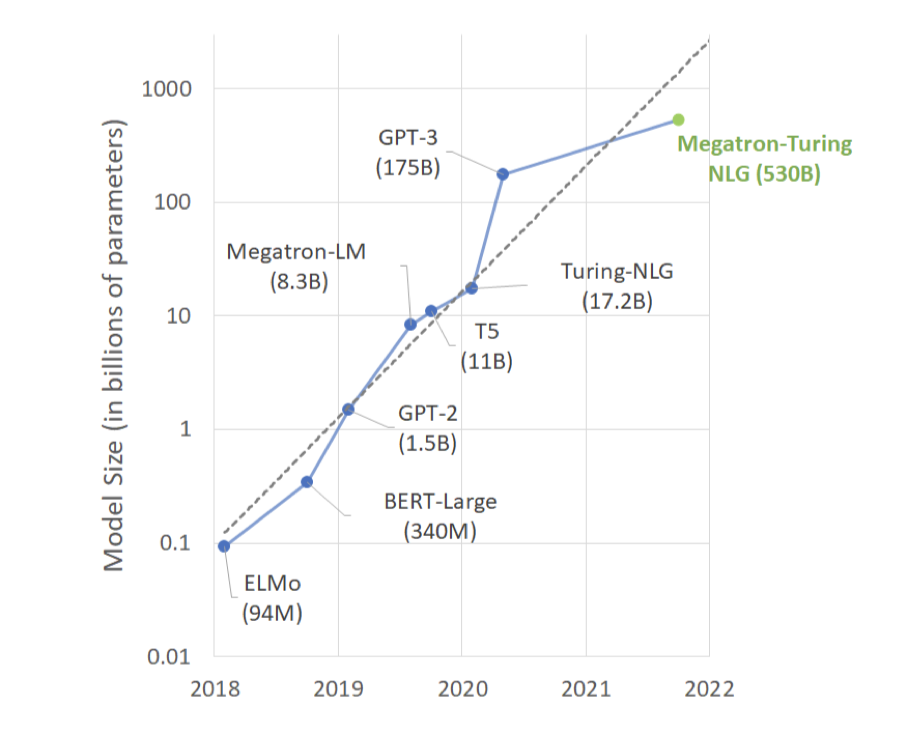

+++
author = "Kurt"
title = "Megatron-Turing NLG"
date = "2024-01-21"
description = "Using Deep and Megatron to Train Megatron-Turing NLG 530B, A Large-Scale Generative Language Model"
categories = [
    "Paper Review"
]
tags = [
    "NLP",
    "LLM",
]
draft = true
+++

## Abstract

사전 학습된 언어 모델은 zero-shot, few-shot, 미세 조정 기법을 통해 다양한 자연어 처리 분야에서 state-of-the-art의 정확도를 달성할 수 있다. 이러한 성공으로 인해 이 모델들의 크기는 빠르게 증가하였고, 이에 따라 고성능 하드웨어와 소프트웨어, 그리고 알고리즘 기법이 필요해졌다. 이 논문에서는 Microsoft와 NVIDIA의 협력을 통해 개발된 530B 개의 parameter를 가진 가장 큰 언어 모델인 Megatron-Turing NLG 530B (MT-NLG)의 학습에 대해 설명하고 있다. 이 모델은 DeepSpeed와 Megatron을 활용한 3D 병렬화 방법론을 통해 학습되었다. 또한, 이 모델은 여러 NLP 벤치마크에서 우수한 성능을 보여주며, 대규모 학습 인프라와 언어 모델, 그리고 자연어 생성의 발전을 도모할 것이라고 기대하고 있다.

---

## Introduction

최근에 출시된 BERT, GPT-2, RoBERTa와 같은 기초 모델들은 AI 시스템을 대규모로 사전 학습시키고, 전이 학습을 통해 다양한 작업에 적용하는 새로운 패러다임을 제시하였다. 이 모델들은 transformer 아키텍처, self-supervised learning, few-shot conditioning, 미세 조정 등을 결합하여 최첨단 자연어 처리 시스템에서 널리 사용되고 있다.

모델을 확장하는 것이 성능을 크게 향상시킨다는 것이 최근 연구들에서 입증되었다. 특히 zero-shot과 few-shot 설정에서 두드러진 성능 향상이 있었다. 예를 들어, GPT-3와 같은 대형 언어 모델은 미세 조정이나 gradient 업데이트 없이도 언어 작업에서 경쟁력 있는 성능을 발휘한다. 이러한 모델은 간단한 지시사항과 몇 가지 예제만으로 새로운 언어 작업을 수행할 수 있게 하며, 일관성 있는 장문의 텍스트 생성, 실세계 지식을 이용한 응답 생성, 기본적인 수학 연산 수행 등의 능력을 보여준다.

거대 언어 모델의 빠른 발전은 계산 자원의 증가, 대규모 데이터셋의 사용 가능성, 그리고 소프트웨어 스택의 발전에 의해 촉진되었다. 이러한 모델 학습을 위해 최첨단 슈퍼컴퓨팅 클러스터가 사용되며, 고품질이고 다양한 대량 데이터셋의 처리는 모델의 성능과 수렴에 기여한다. 그러나 모델 parameter 크기의 지수적인 성장을 지속하기 위해서는 새로운 방법, 인프라, 학습 기능 개발에 상당한 진전이 필요하다.

대형 모델을 학습시키는 것은 어렵다. 이는 가장 큰 GPU의 메모리에도 모델의 parameter를 담을 수 없을 뿐만 아니라, 대량의 계산 작업이 필요하여 알고리즘, 소프트웨어, 하드웨어 스택을 동시에 최적화하지 않으면 학습 시간이 너무 길어질 수 있기 때문이다. 이를 해결하려면 메모리와 계산 모두에서 확장 가능한 효율적인 병렬화 기법이 필요하다.

모델 크기 증가에 따른 성능 향상을 추구하여, 우리는 530B 개의 parameter를 가진 transformer 기반 언어 모델인 Megatron-Turing NLG 530B (MT-NLG)를 구축하였다. 이는 현재까지 알려진 가장 큰 단일 언어 모델로, GPT-3보다 parameter가 3배 더 많다. 하지만, 더 많은 총 parameter를 가진 sparse 모델 구조가 학습된 것에 대해 언급하며, 이러한 접근법을 따르면 비교 가능한 parameter 효율성과 일반화 능력을 가질 수 있을지는 아직 불확실하다.

MT-NLG 학습은 NVIDIA의 Megatron-LM과 Microsoft의 DeepSpeed 간의 협력, 그리고 여러 AI 혁신을 통해 가능해졌다. 데이터, 파이프라인, 텐서 슬라이싱 기반 병렬성을 결합하여 효율적이고 확장 가능한 3D 병렬 시스템을 구축하였다. 또한, 수백 조의 토큰을 가진 고품질 자연어 학습 말뭉치를 구축하고, 최적화 효율성과 안정성을 향상시키는 학습 레시피를 공동 개발하였다.

---

## Large Model Training Infrastructure

최첨단 클러스터들(예: NVIDIA Selene, Microsoft Azure NDv4)은 수조 개의 parameter를 학습할 수 있는 충분한 컴퓨팅 파워를 가지고 있다. 하지만 이러한 슈퍼컴퓨터의 전체 잠재력을 발휘하려면 수천 개의 GPU를 통해 병렬화하는 메모리 및 컴퓨팅 효율 전략이 필요하다. 기존의 병렬화 전략들은 이런 규모의 모델을 학습하는 데 한계가 있다. 이에 대한 도전과제를 해결하기 위해, 우리는 통합적이고 강력한 학습 인프라를 설계하고 성능을 평가하였다.

### Challenges

대규모 언어 모델을 학습하는데 있는 도전 과제인 메모리와 컴퓨팅 효율성, 그리고 다양한 병렬화 전략의 타협점에 대해 논의하고 있다.

#### Memory and Compute Efficiency

**Memory Efficiency** 530B 개의 parameter를 가진 모델을 학습하는 데 필요한 메모리 요구량은 단일 GPU 장치에서 제공할 수 있는 것을 훨씬 초과한다.

mixed precision 학습은 forward와 backward propagation 과정에서 가중치와 기울기를 half precision 형식으로 저장하며, optimizer에서의 수치 안정성을 위해 전체 정밀도 복사본을 유지한다. Adam optimizer를 사용하여 학습할 때, 학습은 parameter 당 20 바이트의 메모리를 사용한다.

따라서 530B 개의 parameter를 가진 모델을 학습하는 데는 모델 가중치, 기울기, 그리고 최적화 상태를 위한 총 10테라바이트 이상의 메모리가 필요하다.

활성화는 학습 배치 크기, 시퀀스 길이, 모델 차원에 따라 크게 메모리를 소비한다. 거대 언어 모델을 학습할 때는 체크포인팅과 각 변환기 블록의 활성화를 다시 계산하여 활성화에 필요한 메모리를 줄이는 것이 일반적이다. 그러나 레이어 간 경계에서의 활성화는 여전히 저장되어야 한다.

$$ \text{batch-size} × \text{number-of-layers} × \text{sequence-length} × \text{hidden-dimension} × 2 \text{bytes} $$

활성화 메모리 요구 사항은 기울기 누적 전략을 통해 완화될 수 있다. 이 전략은 학습 배치를 여러 마이크로 배치로 나누고 이들을 순차적으로 처리한 후 그 결과 기울기를 누적하는 방식이다. 이 방법을 통해 학습 배치 크기를 늘려도 활성화 메모리가 증가하지 않는다. 예를 들어, 1920개의 마이크로 배치로 학습하면 최대 활성화 메모리를 16.9테라바이트에서 8.8기가바이트로 줄일 수 있다.

**Compute Efficiency**

---

## Reference

* [Paper](https://arxiv.org/pdf/2201.11990.pdf)
* [GitHub](https://github.com/NVIDIA/Megatron-LM)