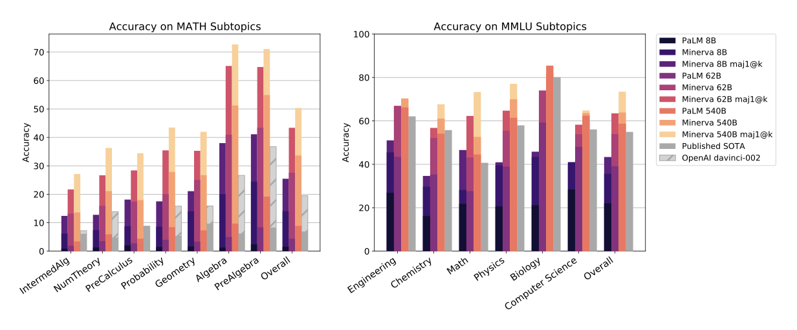
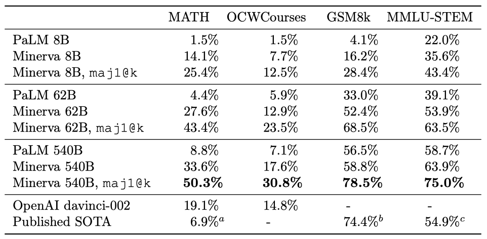
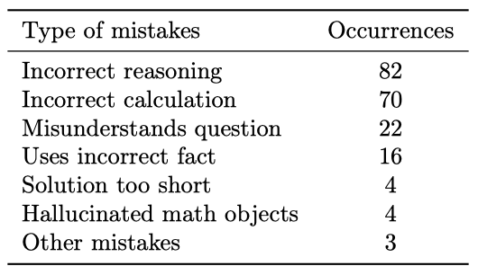

+++
author = "Kurt"
title = "Minerva"
date = "2024-01-19"
description = "Solving Quantitative Reasoning Problems with Language Models"
categories = [
    "Paper Review"
]
tags = [
    "NLP",
    "LLM",
]
+++

## Abstract

언어 모델은 자연어 이해를 필요로 하는 작업에서 탁월한 성과를 보였지만, 수량적 추론을 필요로 하는 작업에서는 어려움을 겪었다. 이를 해결하기 위해, 일반 자연어 데이터에 대해 사전 학습된 후 기술적인 내용에 대해 추가 학습된 Minerva라는 큰 언어 모델을 제안한다. 이 모델은 외부 도구 없이도 기술 벤치마크에서 state-of-the-art를 보여주며, 물리학, 생물학, 화학, 경제학 등 대학 수준의 문제 200개 이상을 풀어보았을 때, 그 중 거의 1/3을 정확하게 해결할 수 있었다.

---

## Introduction

인공 신경망은 다양한 분야에서 큰 성과를 내었습니다. 특히, 거대 언어 모델은 다양한 자연어 작업에서 우수한 성능을 보였지만, 수학이나 과학 등 정량적 추론을 필요로 하는 문제 해결에서는 어려움을 겪었다.

정량적 추론 문제는 언어 모델의 다양한 능력을 평가하는 중요한 분야이다. 이는 자연어 이해, 세계 지식 회상, 계산 알고리즘 적용, 수학 토큰 조작 등의 능력을 요구하며, 과학과 기술 분야에서 사람들의 작업을 지원하는 견고한 정량적 추론 해결사로서의 연구를 검증하는 기회를 제공한다.

이전 연구에서는 대규모 언어 모델이 특정 도메인 데이터셋에서 학습 후 수학과 프로그래밍 문제에서 뛰어난 성능을 보여주었다. 이 연구에서는 이런 접근법을 외부 도구 없이 독립적인 해결책을 제공해야 하는 정량적 추론 문제에 적용하였고, 이는 수학, 과학, 공학 문제 등을 포함한다.

### Our Contribution

Minerva라는 언어 모델을 제안한다. 이 모델은 자연어로 표현된 과학 및 수학 문제를 처리하고, 올바른 LATEX 표기법으로 단계별 해답을 생성하는 능력을 보여주며, 여러 정량적 추론 작업에서 뛰어난 성능을 보여주었다.

Minerva는 과학과 수학 데이터를 포함하는 고품질 데이터셋으로 추가 학습된 PaLM 언어 모델을 기반으로 한다. 우리는 사전 학습된 모델을 사용하여 기술 데이터셋에서 학습을 계속하였고, MATH, GSM8k, MMLU 데이터셋 등에서 최고 수준의 성능을 보였다. 이 모델은 이러한 평가 데이터셋에서 명시적인 학습 없이도 강인한 성능을 보여주었다.

이 논문의 핵심 novelty는 자연어와 형식적 수학 언어를 병행하는 대규모 학습 데이터셋이다. 이 데이터는 arXiv와 신중하게 처리된 웹 페이지에서 수집되었다. 이 연구는 데이터 품질과 모델 크기를 향상시킴으로써 정량적 추론 벤치마크에서 달성 가능한 성능에 대한 새로운 기준을 설정하였다.

정량적 추론 벤치마크의 범위를 확장하기 위해, MIT의 OpenCourseWare에서 과학과 수학의 대학 수준 문제 200개 이상으로 데이터셋을 구축하였다. 이를 통해 순수 수학적 환경을 넘어 우리 모델의 사고 과정에서의 정량적 추론 능력을 측정하였다.

### Related Works

자연어로 표현된 정량적 추론 문제를 해결하는 것은 활발히 연구되는 분야이다. 스크래치패드나 사고의 연결 고리를 사용한 프롬프트 언어 모델은 보이지 않는 문제의 단계별 해결책을 출력할 수 있다. GSM8k 작업은 모델 출력을 재정렬하기 위해 학습된 검증자를 사용하면 성능이 향상될 수 있음을 보여주었다. 이 연구에서는 외부 도구에 의존하지 않는 독립적인 모델에 초점을 맞추었다.

언어 모델을 평가하는 표준 방법은 문제 당 한 가지 해결책을 탐욕적으로 샘플링하는 것이다. 하지만 최근 연구에서는 문제 당 여러 해결책을 샘플링하고 필터링하는 것이 더 유리하다는 것을 보여주었다. 특히, 다수결 투표 방식이 탐욕적 디코딩보다 성능을 크게 향상시킨다는 것을 확인하였다.

Drori et al. (2021)은 OpenAI의 davinci-002 모델을 MATH 데이터셋의 일부로 평가하였다. 하지만 문제의 하위 집합에 초점을 맞추고 문제 형식의 변경으로 인해, 이 연구와 논문의 결과를 직접 비교하는 것은 어렵다.

**Code generation.** 코드 생성 모델을 수학 문제에 적용하는 것은 활발한 연구 분야이다. PaLM은 학습 데이터셋에 코드가 포함된 거대 언어 모델이 좋은 성능을 보일 수 있음을 보여주었고, Codex 모델은 MATH 문제에 대한 코드 해결책을 생성할 수 있다. 이러한 해결책들은 외부 라이브러리에 의존하지만, 이 논문의 접근법은 모델이 자체 추론 능력만으로 답을 도출하는 능력을 직접 연구한다.

**Formal mathematics.** 수학은 자연어를 기반으로 발전했지만, 공리적인 기초를 통해 수학적 사고를 시뮬레이션할 수 있다. 이는 Coq, Isabelle, HOL4, Lean, Metamath, Mizar 같은 특수 프로그래밍 언어를 통해 가능하며, 이들은 컴퓨터를 이용한 논리적, 수학적 사고의 시뮬레이션을 지원한다. 또한, 증명 보조 도구와 자동 정리 증명기의 자동화에 대한 연구는 기계 학습 방법과의 통합으로 큰 이익을 얻었다.

**Language models applied to formal and synthetic mathematical problems.** 이전 연구에서는 언어 모델을 학습시켜 수학적 표현을 예측하는 방법을 사용하였다. 이러한 예측 모델은 증명 검색을 안내하는 데 사용할 수 있다. 거대 언어 모델은 자연어 모델링에 뛰어나지만, 형식 언어의 경우, 수학 공식의 그래프 구조 정보를 유지하는 모델, 예를 들어 GNNs,이 여전히 경쟁력이 있다.

**Modelling mathematics as a discipline of natural language.** 새로운 벤치마크 데이터셋은 고급 수학 주제를 포함하며, 이 분야에서 언어 모델은 다른 유형의 모델로부터 제한적인 경쟁을 받고 있다.

---

## Training and Evaluation

### Mathematical Training Dataset

Minerva 모델은 수학적 내용으로 필터링된 웹페이지와 arXiv 사전 인쇄 서버의 논문에서 추출한 데이터셋에서 학습되었다. 이 데이터셋은 일반적인 자연어 데이터도 포함하고 있다. 수학 웹페이지 데이터셋은 MathJax 형식의 수학 표현이 있는 페이지를 수집하여 만들었고, 대부분의 HTML 태그를 제거하지만 수학 표기법을 유지하는 과정을 거쳤다. 이로 인해 모델은 학습 중에 전체 수학 공식을 볼 수 있으며, 계산과 기호 조작을 요구하는 작업에서 잘 수행하게 된다.

### Models and Training Procedure

이 논문의 방법은 PaLM 사전 학습된 decoder-only transformer 언어 모델로 시작하여, 이를 autoregressive 목표를 사용하여 수학 데이터셋에서 더욱 학습(미세 조정)하는 것이다. 가장 큰 모델은 540B parameter를 가지며, 26B 토큰에서 미세 조정되었다. 이 모델은 학습이 부족하지만, 우수한 성능을 보여주었다.

### Evaluation Datasets

주로 few-shot 평가에 초점을 맞추며, 평가를 위해 입력을 1024 토큰으로 자르고 모델을 사용하여 최대 512 토큰을 생성한다. 문제당 한 번 샘플링할 때에는 탐욕적으로, 여러 번 샘플링할 때에는 핵심 샘플링을 사용한다. 생성 작업에서, 모델은 사고의 연결 고리를 답변으로 생성하고 최종 답변을 표시하며, 최종 답변이 실제 답변과 일치하면 해결책을 올바르다고 평가한다. 정확성 평가는 SymPy 라이브러리를 사용하여 수학적으로 동등한 답변을 올바르게 식별한다.

기존 데이터셋들은 다음과 같다:

* MATH: 주로 사용하는 데이터셋은 Hendrycks et al. (2021)이 제시한 중고등학교 수학 문제 12K 데이터셋이다. 문제 설명은 LATEX로 작성되어 있으며, 네 개의 무작위 예제를 포함하는 고정 4-shot 프롬프트로 모델을 프롬프트한다.
* GSM8k: 중학교 수학 단어 문제 데이터셋은 Cobbe et al. (2021)이 제시했으며, 모델은 Wei et al. (2022)의 사고의 연결 고리 프롬프트를 사용하여 평가된다.
* MMLU-STEM: 과학, 기술, 공학, 수학 (STEM)에 초점을 맞춘 MMLU 데이터셋의 일부를 사용한다. 각 작업에 대해 5-shot 프롬프트를 사용하고, 단계별 해결책이 포함된 예제로 모델을 프롬프트한다. 수학적 추론을 포함하는 주제에 대해 객관식 MATH 프롬프트를 사용하고, 나머지 주제에 대해 단계별 해결책을 추가한 5-shot 프롬프트를 사용한다.

### Undergraduate-Level STEM Problems

Minerva의 과학적 추론 능력을 평가하기 위해, 대학 수준의 STEM 문제 세트를 수집하였다. 이 문제들은 대부분 다단계 추론을 포함하고 있다. MIT의 공개 강좌 자료를 사용하여 자동으로 검증 가능한 해결책을 가진 문제들을 수집하였다. 총 272개의 문제를 수집했으며, 이 중 191개는 numeric solution을 가지고 81개는 symbolic solution을 가진다.

### Inference-Time Techniques

여러 해결책을 샘플링하고 다수결로 하나를 선택함으로써 탐욕적 디코딩을 상당히 능가할 수 있다는 것을 발견하였다. 이는 가장 흔한 답변을 선택하는 방법으로, maj1@k라고 표시한다. 이 알고리즘의 변형은 가장 흔한 답변 $n$개를 선택하는 것을 포함한다. 이 방법이 성능을 향상시키는 이유는 일반적으로 올바른 답변 방법이 매우 적기 때문이다.

다수결과 pass@k를 비교하면, pass@k는 $k$개의 샘플 중 하나가 문제를 해결하면 작업이 해결된 것으로 간주된다. 반면, 다수결 성능은 빠르게 포화되며, MATH의 경우 $k = 64$, GSM8k의 경우 $k = 16$에서 이미 대부분의 정확도를 달성하였다. 이는 다수결이 모델링된 분포에서 가장 흔한 답변을 선택하기 때문이며, pass@k의 성능 향상은 분포의 꼬리에서 발생하므로 $k$가 증가함에 따라 계속 개선될 수 있다.

Log-likelihood는 샘플을 재정렬하는 데 사용할 수 있는 또 다른 지표이다. 우리는 다수결이 Log-likelihood 재정렬보다 훨씬 더 잘 수행된다는 것을 발견하였다.

---

## Results

MMLU 평가는 주제별로 표준 5-shot 프롬프트를 사용하고 가장 높은 점수의 답변을 선택하며, 다수결로 평가할 때는 사고의 연결 고리 프롬프트를 사용하여 16개의 모델 답변을 샘플링한다.

Minerva 62B를 폴란드의 국가 수학 시험에 적용해 보았는데, 이는 2021년 국가 평균인 57%의 점수를 달성하였고, 540B 모델은 65%의 점수를 달성하였다.

최신 OpenAI 언어 모델인 davinci-002의 결과를 포함시켰고, 이는 모든 기술적 작업에서 state-of-the-art를 보였다. 대부분의 작업들에서 이전 결과에 비해 상당한 향상이 있었다.

이 논문은 few-shot 평가에 집중했고, Minerva를 MATH에서 미세 조정해 보았지만 개선 사항을 발견하지 못하였다. 그러나, MATH에서 PaLM을 미세 조정할 때는 상당한 개선이 있었다. 이는 비지도 학습 데이터셋의 품질과 다양성이 향상됨에 따라 표준 미세 조정의 효용성이 감소한다는 것을 보여준다.

### Basic arithmetic

Minerva 540B가 10자리 수 덧셈에서 80% 이상, 18자리 수 덧셈에서 20% 이상의 정확도를 보였다.

---

## Performance Analysis

### Model Mistakes

Minerva 8B와 Minerva 62B의 성능을 비교하여 모델이 만드는 오류 유형을 파악하려고 했다. 두 모델 모두가 높은 확신을 가진 216개의 문제를 선정하였고, 이 중에서 상위 답변이 15% 이상의 표를 받았으며, Minerva 8B는 정확하고 Minerva 62B는 부정확했던 경우와 그 반대 경우를 분석하였다.

8B 모델의 주요 오류는 부정확한 추론이나 계산에 관련되어 있었으며, 대부분은 산술적 실수였다. 너무 짧은 해결책은 드물었고, 일부 경우에는 실제로 존재하지 않는 수학적 사실을 만들어내기도 했다.

62B 모델이 틀린 경우, 주로 추론과 계산에서의 오류가 발생하였다. 결론적으로, 62B Minerva 모델은 8B 모델의 기술을 대부분 유지하면서 추론과 계산의 견고성을 향상시킨다는 것을 확인하였다.

### False Positives

이 논문의 접근법은 문제의 최종 답변의 정확성을 자동으로 확인할 수 있지만, 모델의 추론 과정을 자동으로 검증할 수는 없다. 이로 인해, 추론이 부정확하거나 불완전하더라도 최종 답변이 맞는 "false positives"의 가능성이 있다.

MATH에서 무작위로 선택한 100개의 질문과 62B 모델에서 샘플링한 답변을 수동으로 검토하여 거짓 긍정 비율을 결정하였다. 전반적으로 거짓 긍정 비율은 낮았지만, 난이도가 높아질수록 증가하는 경향을 보였다.

평가 지표로 pass@1과 다수결 투표를 중점적으로 사용한다. 이는 그들이 거짓 긍정에 덜 취약하기 때문이다. 62B 모델의 pass@256 정확도는 84.5%이지만, 이 중 거짓 긍정의 비율이 30%로 추정된다. 거짓 긍정을 제외하면, pass@256 정확도는 약 68%로 추정된다.

---

## Memorization

머신러닝 모델의 성능이 진짜 분석 능력을 보여주는지, 아니면 단순히 학습 데이터를 암기한 결과인지를 판단하는 것이 중요하다. 이는 모델이 중간 사실들을 암기하는 것이 성능에 큰 영향을 미치기 때문이다. 모델이 문제와 답변을 암기하는 강력한 암기와, 동일한 질문에 대한 다양한 답변을 암기하는 약한 암기를 모두 검토하려고 한다.

모델이 학습 데이터에서 암기한 정보를 얼마나 잘 활용하는지 평가하기 위해, 우리는 세 가지 분석을 수행한다: 학습 코퍼스에서 문제와 solution 검색, 문제 변형에 대한 모델의 강인성 평가, 그리고 실제 solution과 모델이 생성한 solution 사이의 유사도 측정. 그 결과, 모델의 성능이 암기에 크게 의존하고 있다는 증거는 찾을 수 없었다.

### Training and Evaluation Dataset Overlap

올바른 답변을 생성한 문제들 중 다수결 점수가 가장 높은 100개의 문제를 선택하여 암기 가능성을 평가하였다. 이들 각각에 대해 BLEU 점수를 계산하고, 점수가 가장 높은 250개 문서를 수동으로 검토했다. 많은 문서가 수학 문제와 해답이 있는 숙제 도움 사이트에서 나왔지만, 고려 중인 문제와는 일치하지 않았다. 이 분석은 이러한 문제들이 데이터 수집 과정을 통과하지 못했다는 결론을 도출하였다.

### Performance on Modified MATH Problems

암기를 더 깊게 조사하기 위해, 다수결 투표로 올바르게 답변한 문제 20개를 임의로 선택해 수정하였다. 문제의 표현을 바꾸거나 문제에 나타난 숫자를 변경하고 solution을 수정했다. 수정 전후의 solution 정확도를 비교한 결과, 두 경우 모두 수정 전후의 정확도가 상관관계를 보이며, 암기가 최소한임을 나타내었다.

### BLEU Score Between Ground Truth and Generated Solutions

실제 답변과 모델이 생성한 답변 사이의 BLEU 점수를 계산하여 solution의 암기를 검사하였다. 5,000개의 테스트 질문 중 160개가 BLEU 점수가 80 이상인 샘플을 가지고 있었으며, 일반적으로 이들은 짧은 solution 이었다. 답변의 유사성이 성능에 어떤 영향을 미치는지 이해하기 위해, 특정 BLEU 점수 이상의 샘플을 제거하고 다수결 투표 정확도를 다시 계산하였다. 결과적으로, 성능이 실제 답변과 매우 유사한 모델 출력에 의해 결정되지 않음을 확인했다.

---

## Conclusions and Discussion

이 연구에서는 자연어로 표현된 수학적 추론을 활용하여 문제를 해결하는 양적 추론 방법을 채택하였다. 거대 언어 모델을 고품질의 수학 데이터셋에 학습시켜 논리적 추론, 수치 계산, 심볼 조작 작업에 강력한 성능을 보임을 입증하였다. 코드 생성 모델과 형식적 방법 등 다른 접근법들과 결합해 양적 문제를 해결하는 에이전트를 제작하는 것이 최종 목표이다.

### Limitations of Our Approach

양적 추론 접근법은 몇 가지 한계를 가지고 있다. 첫째, 모델의 답변의 정확성을 자동으로 검증할 수 없다. 둘째, 모델은 외부 도구를 사용할 수 없어 복잡한 수치 계산을 수행하는 능력이 제한적이다. 셋째, 대량의 데이터를 통해 학습된 모델이므로, 획득한 특정 능력에 대해 직접 통제할 수 있는 부분이 거의 없다.

### Societal Impact

일반적인 상황에서 양적 추론 문제를 해결할 수 있는 인공 신경망은 큰 사회적 영향력을 가질 수 있다. 하지만 현재로서는 Minerva 모델이 이 목표에 도달하기엔 먼 상태로, 성능이 인간에 비해 떨어지며 출력의 정확성을 자동으로 검증할 수 없다. 이러한 문제가 해결되면, 모델은 광범위한 긍정적 영향을 미칠 것으로 예상되며, 접근성이 좋고 저렴한 수학 튜터로서 교육 불평등을 개선하는 데에 활용될 수 있을 것이다.

---

## Reference

* [Paper](https://arxiv.org/pdf/2206.14858.pdf)
* [Github](https://github.com/gair-nlp/abel)