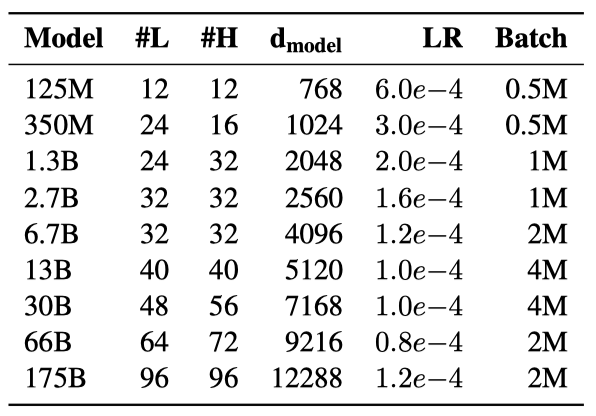
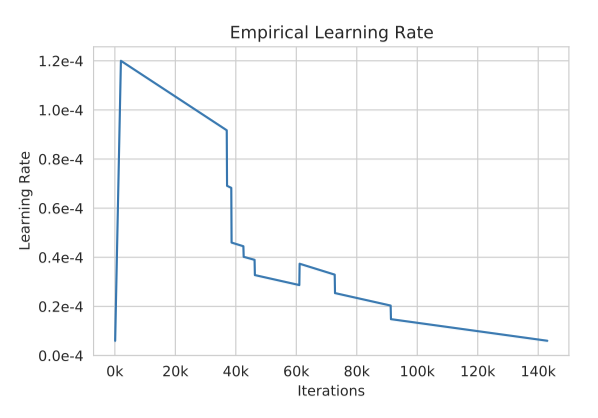
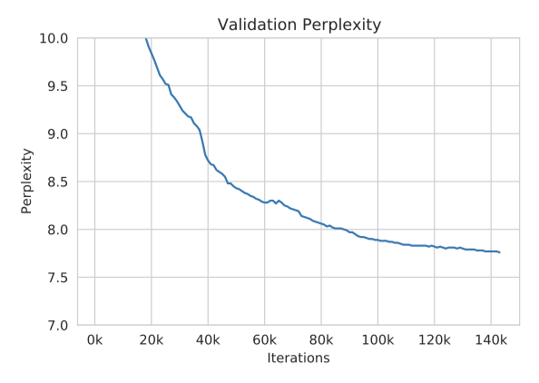
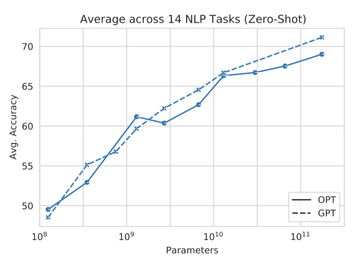
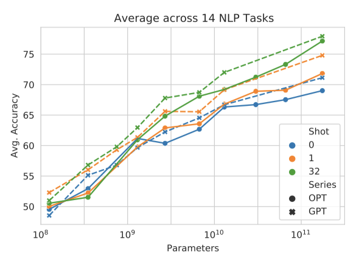
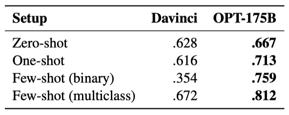
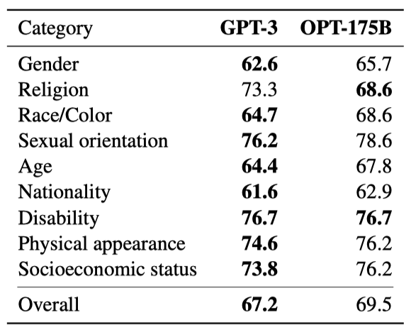
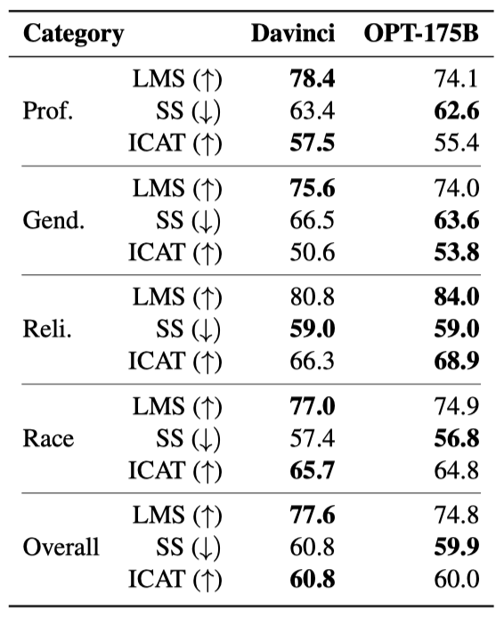
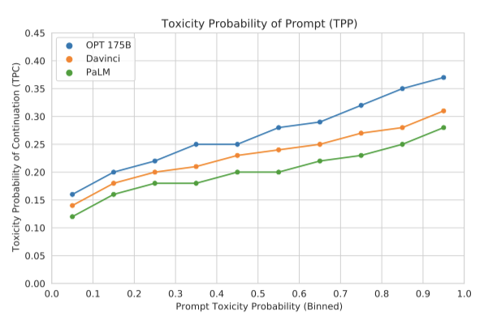
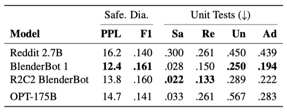

+++
author = "Kurt"
title = "OPT"
date = "2024-01-29"
description = "Open Pre-trained Transformer Language Models"
categories = [
    "Paper Review"
]
tags = [
    "NLP",
    "LLM",
]
+++

## Abstract

대규모 언어 모델들은 높은 계산 비용 때문에 복제하기 어렵다. 이를 해결하기 위해, Open Pre-trained Transformers (OPT)를 제시한다. 이는 125M에서 175B의 parameter 범위를 가진 사전 학습된 transformer 모델들을 포함하며, 이들은 완전하게 그리고 책임감 있게 관심 있는 연구자들과 공유될 것이다. OPT-175B는 GPT-3와 비교할 수 있으나, 개발하는 데 필요한 탄소 발자국은 1/7밖에 되지 않는다.

--- 

## Introduction

대규모 텍스트 컬렉션에 학습된 거대 언어 모델은 텍스트 생성 및 zero-shot, few-shot 학습 등 놀라운 기능을 보여준다. 그러나 현재로서는 완전한 모델 접근이 풍부한 자원을 가진 몇몇 연구소에만 제한되어 있다. 이 제한된 접근은 대형 언어 모델이 어떻게 그리고 왜 작동하는지 연구하는 능력을 제한하고, 견고성, 편향, 독성 등의 문제를 개선하는 데 있어 진전을 방해하고 있다.

125M에서 175B parameter 범위의 decoder 기반 사전 학습된 transformer인 Open Pretrained Transformers (OPT)를 소개하고 있다. OPT 모델은 GPT-3 계열 모델의 성능과 크기를 대략 맞추도록 학습되었으며, 최신 데이터 수집 및 효율적 학습 방법을 적용하였다. 이 모델은 대규모 연구를 가능하게 하고, 거대 언어 모델의 영향력을 연구하는 다양한 의견을 수렴하기 위해 개발되었다. risk, harm, bias, toxicity 등의 정의는 연구 커뮤니티 전체가 공동으로 명시해야 하며, 이는 모델들이 연구에 사용 가능할 때만 가능하다.

125M부터 66B parameter 사이의 모든 모델을 공개하며, 요청에 따라 OPT-175B에 대한 연구 접근 권한을 제공한다. 학계 연구자, 정부 및 학계의 조직, 산업 연구소에 접근 권한이 부여된다. 모델 생성 로그북과 OPT-175B를 992개의 80GB A100 GPU에서 학습시키는 데 사용된 코드베이스인 metaseq도 공개된다. 이를 통해, 우리는 GPT-3의 탄소 발자국의 1/7만큼의 에너지를 사용해 OPT-175B를 개발할 수 있었다. 이는 큰 성과이지만, 이렇게 큰 모델을 만드는 에너지 비용은 중요하며, 이를 계속 복제하면 LLM들의 컴퓨팅 발자국이 계속 증가할 것이다.

전체 AI 커뮤니티가 책임있는 AI와 LLM 사용에 대한 명확한 지침을 개발하기 위해 협력해야한다고 생각한다. 더 넓은 AI 커뮤니티가 이 모델에 접근하고 재현 가능한 연구를 수행하여 전체 필드를 발전시키는 것이 필요하다. OPT-175B와 작은 규모의 기준선 출시를 통해, 이러한 기술의 윤리적 고려사항에 대한 다양한 의견을 더욱 들을 수 있을 것을 기대한다.

---

## Method

### Models

125M 개에서 175B 개의 parameter를 가진 8개의 transformer 언어 모델 결과를 제시한다. 모델과 hyperparameter는 학습의 안정성을 위해 대부분 Brown et al. (2020)의 연구를 따르며, 배치 크기 조정은 주로 계산 효율성 향상을 위한 것이다.

### Training Setup

가중치 초기화는 평균 0, 표준 편차 0.006의 정규 분포를 사용하며, Megatron-LM 코드베이스의 설정을 따른다. 출력 layer의 표준 편차는 총 layer 수에 따라 조정되고, 모든 편향 항은 0으로 초기화된다. 모든 모델은 ReLU 활성화 함수를 사용하며, 시퀀스 길이는 2048로 설정하여 학습된다.

AdamW optimizer를 사용하며, 이때 ($\beta_1$, $\beta_2$)는 (0.9, 0.95)로 설정하고, weight decay는 0.1이다. linear learning rate schedule을 따라, OPT-175B에서 첫 2000단계 동안 0에서 maximum learning rate까지 상승하고, 작은 기준선에서는 375M 토큰 동안 상승 후, 300B 토큰 동안 maximum learning rate의 10%로 감소시킨다. 학습 과정 중에 learning rate을 몇 번 변경하였으며, 배치 크기는 모델 크기에 따라 0.5M에서 4M까지 설정하고 학습 과정 동안 일정하게 유지한다.

전반적으로 0.1의 드롭아웃을 사용하며, 임베딩에는 드롭아웃을 적용하지 않는다. gradient norm은 일반적으로 1.0에서 제한하나, 중간에 몇 번 1.0에서 0.3으로 줄여야 하는 경우가 있었다. 또한, gradient를 계산할 때 오버플로우/언더플로우 위험을 줄이기 위해 gradient across all rank를 사용하였다.

### Pre-training Corpus

사전 학습 코퍼스는 RoBERTa, Pile, 그리고 PushShift.io Reddit에서 사용된 데이터셋을 결합한 것을 포함한다. 이 코퍼스는 대부분 영어 텍스트이지만, CommonCrawl을 통해 비영어 데이터도 일부 포함되어 있다.

모든 데이터셋에서 중복된 문서를 제거하기 위해, Jaccard 유사도가 .95 이상인 문서를 MinhashLSH를 통해 필터링하였다. 특히 Pile 데이터셋에서는 중복 문서가 많이 발견되어, 이를 사용하는 연구자들에게 추가적인 중복 제거 처리를 권장한다.

모든 코퍼스를 GPT-2 byte level BPE 토크나이저를 사용하여 토큰화한다. 최종 코퍼스는 대략 180B 토큰을 포함하고 있다.

**RoBERTa** RoBERTa 코퍼스의 BookCorpus와 Stories 하위 집합을 포함시키고, 2021년 9월 28일까지 크롤링된 뉴스 기사를 포함한 업데이트된 CCNews를 사용하였다. 이 코퍼스는 원래 RoBERTa CCNews와 같은 방식으로 전처리 되었다.

**The Pile** Pile의 일부 하위 집합인 CommonCrawl, DM Mathematics, Project Gutenberg, HackerNews, OpenSubtitles, OpenWebText2, USPTO, 그리고 Wikipedia를 포함시켰다. 그러나 gradient norm의 급증을 초래하는 경향이 있어 불안정성을 높이는 Pile의 다른 하위 집합은 제외하였다. 모든 하위 집합은 추가적인 ad-hoc 공백 정규화를 거쳤다.

**PushShift.io Reddit** Baumgartner et al. (2020)이 생성하고 Roller et al. (2021)이 이전에 사용한 Pushshift.io 코퍼스의 일부를 포함시켰다. 대화 트리를 언어 모델이 접근 가능한 문서로 변환하기 위해, 우리는 각 스레드에서 가장 긴 댓글 체인을 추출하고 트리의 모든 다른 경로를 제거하였다. 이로 인해 코퍼스는 약 66% 감소했다.

### Training Efficiency

완전히 분할된 데이터 병렬과 Megatron-LM Tensor 병렬성을 활용하여 992개의 80GB A100 GPU에서 OPT-175B를 학습시켰다. 이로써 GPU 당 최대 147 TFLOP/s의 이용률을 달성하였다. 모든 호스트에서 Adam 상태를 분할하여 FP32로 유지하고, 모델 가중치는 FP16으로 유지하였다. 언더플로우를 방지하기 위해 동적 손실 스케일링을 사용하였다.

### Training Processes

**Hardware Failures** OPT-175B 학습 도중에는 컴퓨팅 클러스터에서 상당한 수의 하드웨어 실패가 발생하였다. 총 2달 동안 하드웨어 실패로 인해 최소 35번의 수동 재시작이 이루어졌으며, 100개 이상의 호스트가 교체되었다. 수동 재시작 시에는 학습이 일시 중단되고, 문제가 있는 노드를 탐지하기 위해 일련의 진단 테스트가 수행되었다. 이후 문제가 있는 노드는 격리되고, 마지막으로 저장된 체크포인트에서 학습이 재개되었다. 교체된 호스트 수와 수동 재시작 횟수의 차이를 고려할 때, 하드웨어 실패로 인한 자동 재시작이 70번 이상 이루어진 것으로 추정된다.

**Loss Divergences** 학습 과정에서 loss divergence 문제가 있었다. 손실이 발산할 때, learning rate를 낮추고 이전 체크포인트에서 재시작하면 학습이 계속될 수 있었다. loss divergence, dynamic loss 스칼라가 0으로 떨어지는 현상, 그리고 마지막 layer의 activation $l^2$-norm이 급증하는 것 사이에 상관관계가 있다는 것을 확인하였다. 이를 바탕으로 dynamic loss 스칼라가 "healthy" 상태에서, 그리고 activation norm이 무제한으로 증가하지 않는 지점에서 재시작하였다. 학습 초기에는 gradient clipping을 1.0에서 0.3으로 낮추는 것이 안정성에 도움이 되었다.

**Other Mid-flight Changes** loss divergence을 처리하기 위해 몇 가지 실험적 변경을 시행하였다. 이에는 바닐라 SGD로의 전환, dynamic loss 스칼라의 재설정, 그리고 Megatron의 새 버전으로의 전환 등이 포함되었다. 이러한 변화들은 최적화의 빠른 정체, 일부 발산의 회복, 그리고 activation norm의 압력 감소와 처리량 향상에 도움이 되었다.

---

## Evaluations

### Prompting & Few-Shot

HellaSwag, StoryCloze, PIQA, ARC Easy와 Challenge, OpenBookQA, WinoGrad, WinoGrande, 그리고 SuperGLUE 등 문헌에서 사용하는 16개의 표준 NLP 작업에서 모델을 평가하였다. GPT-3의 프롬프트와 실험 설정을 따라서 주로 GPT-3와 비교하였고, 가능한 경우에는 다른 LLM의 성능도 포함시켰다.

성능을 정확도로 보고하며, 평가 지표의 일관성을 위해 MultiRC와 ReCoRD의 F1은 생략하였다. SuperGLUE의 Winograd Schema Challenge 작업에서는 객관식 질문으로 작업을 구성하였고, 이는 성능에 영향을 미친다.

**Zero-shot** 전반적으로, 평균 성능은 GPT-3의 추세를 따르는 것으로 보인다. 그러나 작업에 따라 성능은 크게 달라질 수 있다. MultiRC와 WIC를 평균에서 의도적으로 제외하였다. 이 데이터셋들은 GPT-3 또는 OPT를 체계적으로 우대하는 것으로 보인다.

모델의 성능은 10개 작업에서 GPT-3와 비슷했고, 3개 작업에서는 성능이 떨어졌다. 일부 작업에서는 검증 세트 크기가 작아서 모델의 행동이 예측 불가능했다. WIC에서는 OPT 모델이 GPT-3 모델을 능가했으며, MultiRC에서는 GPT-3 결과를 복제하지 못하였다. BoolQ와 WSC에서는 OPT와 GPT 모델이 대부분 클래스 정확도 주변에서 변동했음을 알 수 있다.

Chinchilla와 Gopher는 parameter 크기에 따라 일관된 성능을 보였지만, PaLM은 모든 설정에서 더 우수한 성능을 보였다. 이는 parameter 수를 제어하더라도 마찬가지였다. PaLM의 높은 성능은 주로 사전 학습 데이터의 품질과 다양성 때문이라고 추정된다.

**One-shot and Few-shot** 평균 multi-shot in-context 성능은 OPT 모델이 GPT-3 모델과 비슷하게 수행함을 보여준다. 그러나 작업별로 결과를 분석하면, zero-shot과 같은 10개의 데이터셋에서 두 모델이 비슷한 성능을 보이는 반면, 일부 다른 데이터셋에서는 모델 크기에 따라 성능이 일관되지 않음을 보여준다. 특히, MultiRC에서는 OPT 모델이 GPT3 모델에 비해 성능이 떨어진다. 이러한 결과는 우리의 평가 설정이 Brown et al. (2020)과 다를 수 있음을 시사한다.

### Dialogue

대화 모델의 핵심 요소인 LLM에 초점을 맞춰, OPT-175B를 여러 오픈 소스 대화 데이터셋에서 평가하였다. 이는 ConvAI2, Wizard of Wikipedia, Empathetic Dialogues, Blended Skill Talk, 그리고 최근의 Wizard of Internet 데이터셋을 포함한다. 주로 미세 조정된 BlenderBot 1과 Reddit 2.7B 같은 기존 오픈 소스 대화 모델과 비교하였으며, 또한 미세 조정된 R2C2 BlenderBot과도 비교하였다.

Perplexity와 Unigram F1 (UF1) 겹침을 보고하며, 모든 Perplexities는 GPT-2 토큰화기의 공간에서 정규화된다. 대화 작업에 대해 감독되고 미감독된 모델들을 구분한다. OPT-175B는 최대 32토큰까지의 탐욕적 디코딩을 사용하며, "Person 1:"과 "Person 2:"의 대화 라인만을 번갈아 가며 사용한다. 나머지 모델들은 BlenderBot 1의 생성 parameter를 사용한다.

OPT-175B는 모든 작업에서 unsupervised Reddit 2.7B 모델을 크게 능가하며, ConvAI2 데이터셋에서는 supervised BlenderBot 1 모델과 비슷한 성능을 보인다. 하지만, 모든 모델이 unsupervised Wizard-of-Internet 데이터셋에서는 OPT-175B가 가장 낮은 Perplexity를 보이지만, UF1은 Wizard-ofWikipedia supervised 모델들보다 낮다.

unsupervised OPT-175B 모델의 평가가 ConvAI2 데이터셋에서 BlenderBot 1과 경쟁력이 있었다. 이는 데이터셋의 유출을 의심케 하지만, 사전 학습 말뭉치에서는 어떤 겹침도 찾지 못했다. OPT-175B는 공개되지 않은 ConvAI2 테스트 세트와 MSC 데이터셋에서도 좋은 성능을 보여주었으며, 이는 모델이 여러 PersonaChat과 유사한 데이터셋에 잘 일반화되고 있음을 보여준다. OPT-175B가 대화를 거치면서 일관된 페르소나를 유지하는 강력한 능력을 가지고 있음이 확인되었다.

---

## Bias & Toxicity Evaluations

OPT-175B의 잠재적인 문제를 파악하기 위해, 혐오 발언 탐지, stereotype 인식, toxic 콘텐츠 생성 등과 관련된 벤치마크를 평가하였다. 이 벤치마크들은 단점이 있을 수 있지만, OPT-175B의 한계를 이해하는데 도움을 준다. 주로 GPT-3 Davinci와 비교하였는데, 이 벤치마크들은 Brown et al. (2020)에 포함될 수 있을 때까지 사용되지 않았다.

### Hate Speech Detection

Mollas et al. (2020)의 ETHOS 데이터셋을 사용해, OPT-175B가 특정 영어 문장이 인종차별적인지, 성차별적인지 판별하는 능력을 측정하였다. zero-shot, one-shot, few-shot 이진 케이스에서는 모델에게 텍스트가 인종차별적이거나 성차별적인지 판단하고 yes/no로 응답하도록 했고, few-shot 다중 클래스 설정에서는 yes/no/neither로 응답하도록 하였다.

OPT175B는 one-shot에서 few-shot 설정에서 모두 Davinci보다 훨씬 더 좋은 성능을 보였다. 이는 Davinci API를 통한 평가가 추가적인 안전 제어 메커니즘을 도입하고 있거나, 사전 학습 데이터셋에 포함된 통제되지 않은 소셜 미디어 토론이 이러한 분류 작업에 도움을 주는 귀납적 bias를 제공했기 때문으로 추측된다.

### CrowS-Pairs

CrowSPairs는 마스크 언어 모델을 위해 개발된 벤치마크로, 9가지 카테고리(gender, religion, race/color, sexual orientation, age, nationality, disability, physical appearance, socioeconomic status)의 문장 내 bias를 측정한다. 각 예시는 한 그룹에 대한 stereotype 또는 anti-stereotype을 나타내는 문장 쌍으로, 모델이 stereotype 표현을 선호하는 정도를 측정한다. 높은 점수는 모델이 더 큰 bias를 보이는 것을 의미한다.

OPT175B는 종교를 제외한 대부분 카테고리에서 더 많은 stereotypical bias을 보였다. 이는 학습 데이터의 차이 때문으로, Reddit 말뭉치가 stereotype과 차별적인 텍스트의 발생률이 더 높다고 나타났다. 이런 데이터가 OPT-175B의 주요 학습 원천이기 때문에, 모델은 더 많은 차별적 연관성을 배웠을 수 있고, 이는 CrowS-Pairs에서의 성능에 직접적인 영향을 미친다.

### StereoSet

직업, 성별, 종교, 인종의 4가지 카테고리에서 stereotypical bias을 측정하기 위해, 우리는 StereoSet을 사용한다. 이 도구는 문장 내 bias 측정뿐만 아니라, 추가적인 맥락을 포함하는 모델의 능력을 테스트하기 위한 문장 간 bias 측정도 포함한다. bias 탐지와 언어 모델링 능력 사이의 잠재적인 교환 관계를 고려하기 위해, StereoSet은 두 가지 지표를 포함한다.

Language Modeling Score(LMS)와 Stereotype Score(SS)를 결합해 Idealized Context Association Test score(ICAT)를 만든다. 문자 수가 아닌 토큰 수로 점수를 정규화하는데, 이 방법이 여러 모델의 측정치를 개선한다고 보고되었다.

Davinci와 OPT-175B는 전체적으로 비슷한 점수를 보여주었다. Davinci는 직업과 인종 분야에서, OPT-175B는 성별과 종교 분야에서 더 뛰어난 성능을 보였다. OPT175B는 SS 지표에서 전반적으로 더 좋은 성능을 보였고, Davinci는 LMS 지표에서 일반적으로 더 뛰어난 성능을 보였다.

### RealToxicityPrompts

RealToxicityPrompts 데이터셋을 이용해 OPT-175B가 toxic 언어로 응답하는 경향을 평가하였다. RTP에서 무작위로 샘플링한 10,000개의 프롬프트 각각에 대해, nucleus 샘플링을 사용하여 생성된 연속성의 평균 toxicity rate을 보고했습니다. 또한, 비교를 위해 Davinci와 PaLM에서의 toxicity rate을 보고하였다.

OPT-175B는 PaLM이나 Davinci보다 높은 toxicity rate을 보였다. 프롬프트의 toxic이 증가할수록 모든 모델이 toxic을 가진 연속성을 생성할 가능성이 증가하는 것을 확인하였다. 사전 학습 말뭉치에 통제되지 않은 소셜 미디어 텍스트가 포함되어 있다는 점이 toxic 텍스트 생성과 탐지 경향을 높일 수 있다. 이는 downstream 응용 프로그램의 요구에 따라 바람직하지 않을 수도 있으므로, OPT-175B의 미래 응용은 이를 고려해야 한다.

### Dialogue Safety Evaluations

대화 안전성 평가 두 가지를 통해 OPT-175B를 비교하였다. SaferDialogues는 명백한 안전 실패에서 회복하는 능력을, Safety Bench Unit Tests는 모델의 응답의 안전성을 측정한다. 이는 주제의 민감성에 따라 4단계로 분류됩니다. 이 결과는 기존 오픈 소스 대화 모델과 비교하였다.

두 실험 결과에 따르면, OPT-175B는 SaferDialogues와 Unit Tests에서 Reddit 2.7B 모델과 유사한 성능을 보여주었다. 안전하고 적대적인 설정에서 OPT-175B는 약간 더 높은 성능을 보여주었다. 정제된 대화 데이터셋에서 미세 조정된 모델들은 전반적으로 더 낮은 toxic을 가진 것으로 확인되었다. 따라서, OPT-175B를 대화용으로 활용하는 미래의 실험은 안전 프로파일을 향상시키기 위해 정제된 데이터셋에서 미세 조정을 포함해야 한다는 결론을 내렸다.

---

## Limitations

다양한 규모의 모든 출시된 모델에 대해 폭넓게 평가하였다. GPT-3 모델에서 사용된 표준 평가 데이터셋에 대한 성능은 비슷했으며, 안전성, 편향, 포괄성 등의 평가에서도 대체적으로 비슷한 성능을 보여주었다. 그러나 이러한 평가는 모델의 전체적인 한계를 완전히 반영하지는 못할 수 있다. 특히 OPT-175B는 다른 LLMs에서 지적된 동일한 한계를 보여주었다.

OPT-175B는 명령형 지시문이나 간결한 질문에 잘 작동하지 않는다는 것을 발견하였다. 지시문의 실행보다는 대화의 시뮬레이션을 생성하는 경향이 있다. 이러한 한계는 InstructGPT와 같은 지시문 학습에 대한 미래의 연구를 통해 완화될 수 있을 것이다.

OPT-175B는 반복적인 경향이 있고 쉽게 루프에 빠질 수 있다는 것을 발견하였다. 한 번의 생성만 샘플링할 때 샘플링이 반복을 완전히 제거하지 못했다. 미래의 연구에서는 반복을 줄이고 다양성을 향상시키는 전략, 예를 들어 unlikelihood training이나 best-first decoding을 통합할 필요가 있다.

OPT-175B는 다른 LLM과 마찬가지로 사실적으로 부정확한 문장을 생성할 수 있다. 이는 정보의 정확성이 중요한 분야에서 특히 문제가 될 수 있다. 그러나 최근의 연구들은 검색 기반 모델이 LLM의 사실적 정확성을 향상시킬 수 있음을 보여주었다. 따라서, OPT-175B도 미래에 검색 기반 확장의 이점을 누릴 것으로 예상한다.

OPT-175B는 무해한 프롬프트를 제공받았을 때도 toxic한 언어를 생성하고 해로운 stereotype을 강화하는 경향이 높다고 확인되었다. 또한 적대적인 프롬프트는 쉽게 찾을 수 있었다. toxic과 bias에 대한 대응책에 대한 많은 연구가 있으며, OPT-175B의 미래 사용은 이러한 접근법을 적용해야 할 수 있다. 그러나 이번 첫 릴리즈에서는 GPT-3의 복제를 주요 목표로 두었기 때문에, 이러한 완화책을 적용하지 않았다.

이 기술이 상업적 배포에는 아직 준비되지 않았다고 생각한다. 더 많은 신중함이 필요하며, 이상적으로는 재현성과 복제성을 보장하기 위해 더 간결하고 일관된 평가 설정을 가지고 있어야 한다. 프롬프트 스타일과 문맥 학습에 대한 차이점은 다른 결과를 이끌어낼 수 있다. OPT 모델의 공개 릴리즈는 이러한 중요한 문제에 대한 연구를 촉진할 것으로 기대한다.

---

## Considerations for Release

AI 파트너십과 NIST의 지침에 따라, OPT-175B 학습 과정의 모든 세부사항을 공개하고, 연구자들이 모델 가중치에 접근하고 작은 기준선 세트를 사용할 수 있게 한다. OPT-175B의 개발 생명주기에 대한 완전한 책임을 지며, LLM 개발에 대한 투명성을 높여 LLM의 한계와 위험을 이해하는 데 중점을 두고 있다.

일상적인 학습 과정의 세부사항을 공유함으로써 OPT-175B 학습에 사용된 컴퓨팅 리소스와 대규모에서의 불안정성을 관리하는 데 필요한 인력을 공개한다. 이런 세부사항은 대게 이전 연구에서 생략되었지만, ad-hoc 디자인 결정 과정을 공개함으로써 미래의 모델 개발에서 이러한 방식을 개선하고 실험적 강인성을 높이는 데 기여하길 희망한다.

개발 코드베이스를 공개함으로써, 논문에서 명시적으로 언급되지 않은 구현 세부 사항에 대한 명확성을 제공하려고 한다. 현재의 코드베이스는 파이프라인 병렬성을 사용하지 않고 175B 이상의 parameter를 가진 decoderonly transformer를 NVIDIA GPU에서 학습시키는 유일한 오픈 소스 구현이다.

175B 규모의 실험을 가능하게 하기 위해, 연구자들에게 OPT-175B의 parameter에 직접 접근할 수 있게 했다. 이는 LLM에 대한 책임 있는 AI 연구를 촉진하고, 이 규모의 연구가 환경에 미치는 영향을 줄이기 위한 것이다. 대규모 언어 모델 배포의 윤리적, 사회적 위험을 다루는 연구가 증가하고 있다. 비상업적 라이센스를 가진 연구 커뮤니티만 OPT-175B에 접근하게 하여, 상업적 배포 전에 먼저 LLM의 한계를 파악하는 데 초점을 맞추고자 한다.

이 규모의 모델을 재현하는데는 상당한 컴퓨팅 및 탄소 비용이 발생한다. OPT-175B는 추정 75톤의 탄소 배출량으로 개발되었으며, 다른 모델들은 더 많은 양을 사용하였다. 이러한 추정치는 표준화되지 않았고, AI 시스템의 전체 탄소 발자국은 모델 학습뿐만 아니라 실험과 추론 비용도 포함한다. 로그북을 공개하여 이론적 탄소 비용 추정치와 전체 개발 수명주기를 고려한 추정치 사이의 차이를 강조하고자 한다. 또한, 점점 복잡해지는 이 시스템들의 제조 탄소를 이해하고, 환경에 대한 규모의 영향을 측정할 때 고려해야 할 추가 요인을 정의하는 데 이 논문이 도움이 될 수 있기를 희망한다.

다양한 스케일에서 기준선을 설정함으로써, 연구 커뮤니티가 이 모델들의 영향력과 한계를 스케일만으로 연구할 수 있도록 돕고자 한다. 일부 LLM은 사용된 학습 데이터 양에 비해 학습이 부족했을 수 있으며, 이는 더 많은 데이터를 추가하고 계속 학습하면 성능이 향상될 수 있음을 의미한다. 또한, 175B보다 훨씬 작은 규모에서 기능 변화가 발생할 수 있다는 증거가 있으므로, 다양한 연구 활용을 위해 더 넓은 스케일 범위를 검토해야 한다.

---

## Related Work

transformer 아키텍처와 BERT의 출시 이후, NLP 분야는 self-supervised 학습을 통한 LLM 사용으로 크게 변화하였다. T5와 MegatronLM 같은 여러 가면 언어 모델들은 규모를 통해 지속적으로 성능을 향상시켰다. 이는 모델의 parameter 수 증가뿐만 아니라 사전 학습 데이터의 양과 품질 향상으로 이루어졌다.

auto-regressive 언어 모델은 모델 크기가 크게 증가하였고, 이로 인해 생성 유창성과 품질이 대폭 향상되었다. 많은 큰 모델들이 학습되었지만, 이들은 대부분 비공개 소스로, 내부적으로 또는 유료 API를 통해만 접근 가능하다. 그러나 비영리 연구 조직에서는 LLM을 오픈 소스화하는 노력이 있으며, 이러한 모델들은 OPT 모델과 다르기 때문에, 커뮤니티가 다양한 사전 학습 전략을 비교할 수 있다.

LLM의 주요 평가 기준은 프롬프트 기반이며 이는 특정 작업에 대한 미세 조정 없이도 많은 작업을 평가하는 편리함 때문이다. 프롬프트는 오래된 역사를 가지고 있고, 최근에는 모델에 대한 지식 탐색 또는 다양한 NLP 작업 수행에 사용되었다. 또한, 작은 모델에서 프롬프트 동작을 유도하거나, 프롬프트의 유연성을 개선하고, 프롬프트가 어떻게 작동하는지 이해하는 연구도 있다.

모델을 지시 스타일의 프롬프트에 대응하게 미세조정하는 것이 이익을 보였지만, 효과적인 프롬프트 엔지니어링은 여전히 해결되지 않은 연구 과제이다. 프롬프트 선택에 따라 결과는 크게 달라지며, 모델은 프롬프트를 우리가 기대하는 만큼 완전히 이해하지 못하는 것으로 보인다. 또한, 개발 세트 없이 프롬프트를 작성하는 것은 어려움이 있다. 이러한 문제를 해결하려 하지 않고, 단지 OPT-175B의 평가만을 목표로 하며, OPT-175B의 전체 릴리스가 미래의 연구를 돕길 바란다.

---

## Conclusion

125M에서 175B parameter까지 다양한 크기의 auto-regressive 언어 모델 모음인 OPT를 소개하다. 이 연구의 목표는 GPT-3 클래스의 모델을 복제하고 최신 데이터 큐레이션 및 학습 효율성 모범 사례를 적용하는 것이다. 모델의 여러 제한 사항과 책임감 있는 공개에 대한 고려 사항을 논의하였다. 우리는 AI 커뮤니티가 책임감 있는 LLM 가이드라인 개발에 협력하고, 이러한 유형의 모델에 대한 넓은 접근이 기술의 윤리적 고려 사항을 정의하는 다양한 목소리를 늘리길 희망한다.

---

## Reference

* [Paper](https://arxiv.org/pdf/2205.01068.pdf)
* [Github](https://github.com/facebookresearch/metaseq)