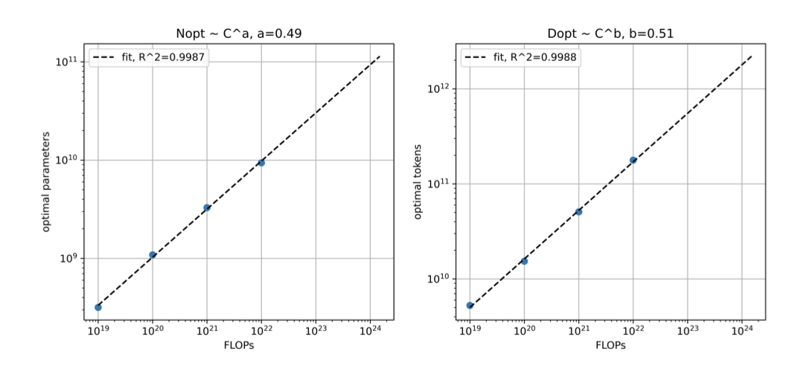
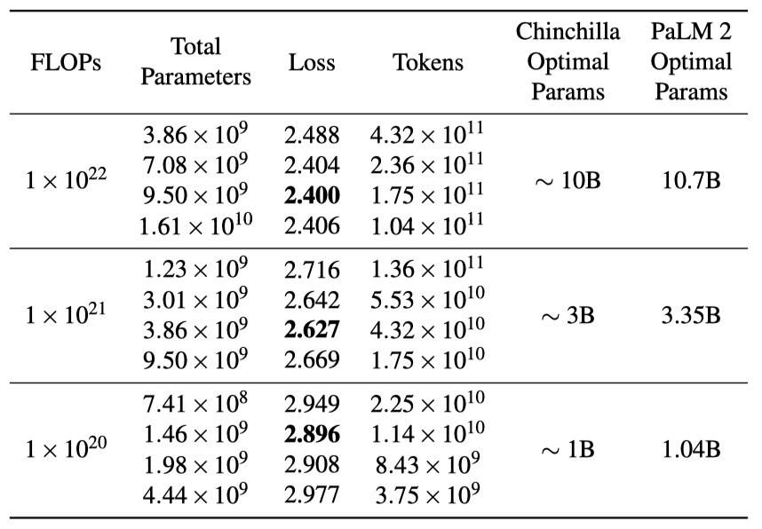
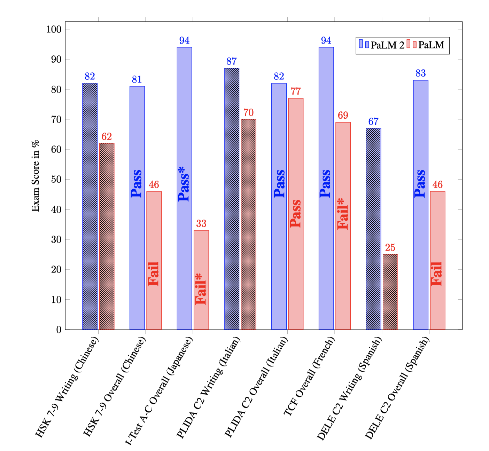
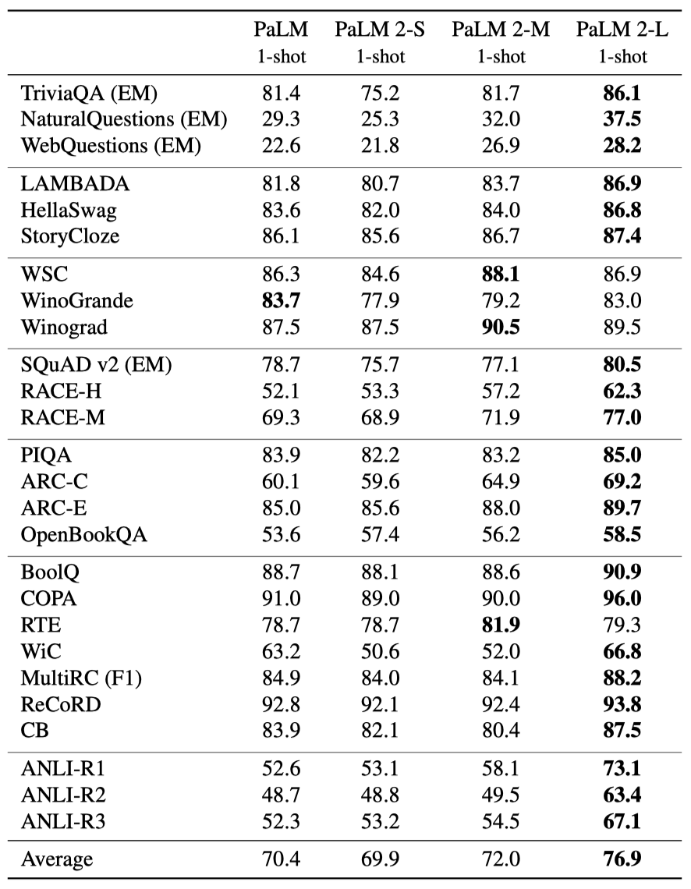
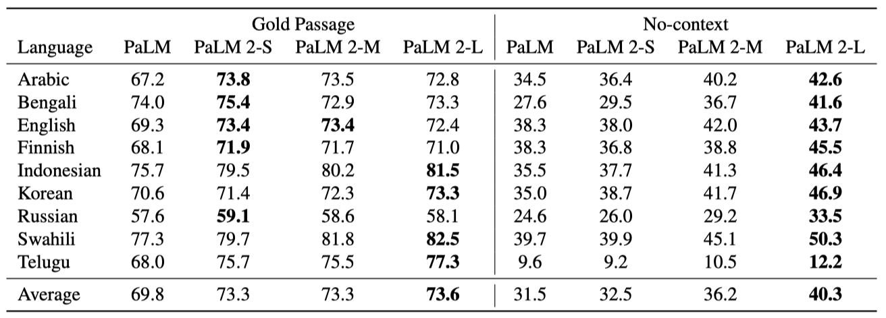
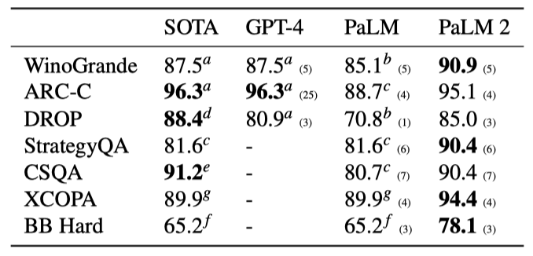
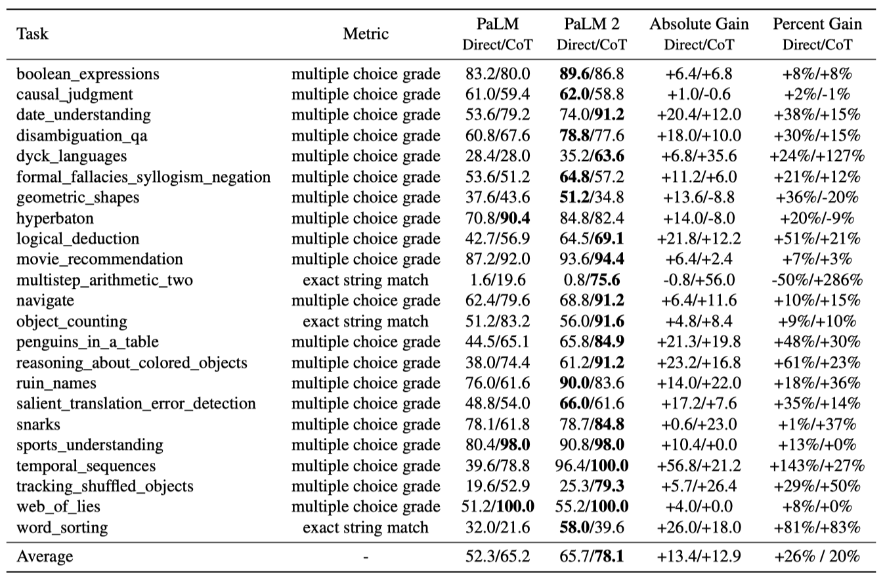
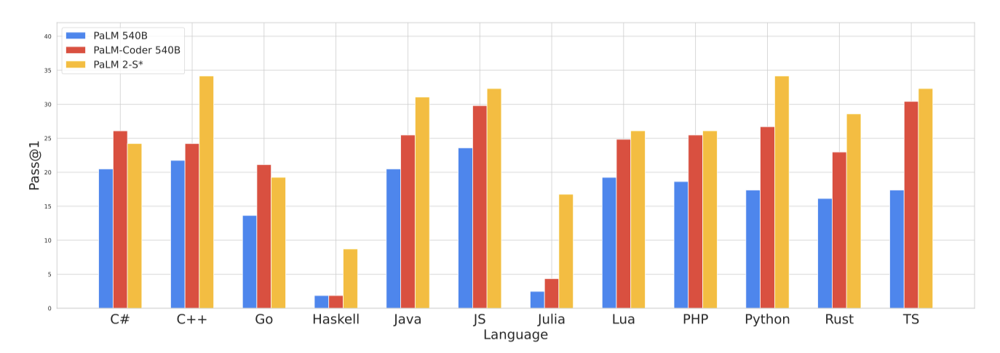
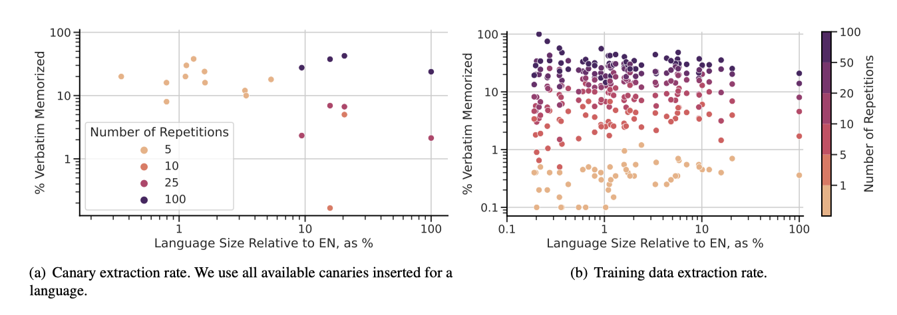

+++
author = "Kurt"
title = "PaLM 2"
date = "2024-03-23"
description = "PaLM 2 Technical Report"
categories = [
    "Paper Review"
]
tags = [
    "NLP",
    "LLM",
]
+++

## Abstract

PaLM 2는 PaLM보다 더 나은 다국어 및 추론 능력을 갖춘, 효율적인 계산 성능을 제공하는 최신 언어 모델이다. 이 모델은 다양한 언어와 추론 작업에서 향상된 성능을 보이며, 기존 모델 대비 더 빠르고 효율적인 추론이 가능하다. PaLM 2는 추론 작업에서 큰 개선을 보이고, 책임 있는 AI 평가에서 안정적인 성능을 유지하며, 독성 제어도 효과적으로 수행한다. 전반적으로, PaLM 2는 다양한 작업에서 최고의 성능을 제공한다.

PaLM 2 계열을 이해할 때는 사전 학습된 모델, 미세 조정된 모델, 그리고 사용자 대면 제품을 구별하는 것이 중요하다. 사용자 대면 제품은 추가적인 처리 단계를 포함하며, 모델은 시간에 따라 변화할 수 있다. 그러므로, 사용자 대면 제품의 성능이 보고서의 결과와 정확히 일치하지 않을 수 있다.

---

## Introduction

언어 모델링은 Shannon(1951)의 next word prediction 연구부터 시작되어, n-gram, LSTMs을 거치며 발전하였다. 이후, Transformer 구조 도입과 함께 대규모 언어 모델(LLMs)이 등장하여 언어 이해 및 생성에서 획기적인 성능을 보여주었다. 이러한 발전은 모델 크기와 데이터 양의 확대가 주요 요인이었으며, 대부분은 단일 언어 코퍼스를 기반으로 한다.

PaLM 2는 PaLM의 후속 모델로, 모델링 발전, 데이터 개선, 스케일링 통찰을 통합한 언어 모델이며, 다양한 연구 진보를 포함한다.

* **Compute-optimal scaling:** 최근 연구에 따르면, 데이터 크기가 모델 크기만큼 중요하며, 최적의 성능을 위해 데이터와 모델 크기를 대략 1:1 비율로 스케일링해야 한다는 것을 확인하였다. 이는 과거 데이터셋보다 모델을 더 빠르게 확장했던 추세와는 다르다.
* **Improved dataset mixtures:** 기존의 대규모 사전 학습 언어 모델들이 영어 중심의 데이터셋을 사용했던 것과 달리, 수백 가지 언어와 도메인을 포함하는 다양하고 다국어적인 사전 학습 믹스를 개발하였다. 이를 통해, 더 큰 모델이 비영어 데이터셋을 효과적으로 처리하면서도 영어 이해 성능을 유지할 수 있음을 확인했으며, 기억력 감소를 방지하기 위해 중복 제거 기법을 적용하였다.
* **Architectural and objective improvements:** 이 모델은 Transformer 기반으로, 기존의 단일 목표 대신 UL2의 결과에 영감을 받아 언어의 다양한 측면을 학습하기 위해 여러 사전 학습 목표를 혼합하여 사용한다.

PaLM 2-L은 기존 PaLM보다 작고 학습 계산이 더 많이 필요하지만, 자연어 생성, 번역, 추론 등에서 뛰어난 성능을 보여준다. 이는 모델 크기 증가 외에도 데이터 선택과 구조 최적화를 통해 성능을 향상시킬 수 있음을 나타낸다. 더 작고 고품질의 모델은 추론 효율을 높이고 비용을 절감하며, 더 많은 사용자와 애플리케이션에 적용될 수 있다.

PaLM 2는 다국어, 코드 생성, 추론 능력에서 뛰어난 성과를 보여주며, 이는 실제 고급 언어 숙련도 시험에서 PaLM을 크게 앞서며 모든 평가 언어에서 합격하는 성적을 달성하였다. 이는 일부 경우에는 언어를 가르칠 수 있는 수준의 숙련도를 의미한다. 생성된 샘플과 메트릭은 모델 자체에서 나온 것으로, 외부 도구의 도움 없이 이루어진 결과이다.

PaLM 2는 이전 연구에 비해 사전 학습의 일부만 수정하여 독성을 제어할 수 있는 제어 토큰을 포함한다. 다양한 언어에서 기억력을 개선하기 위해 카나리아 토큰 시퀀스가 사전 학습 데이터에 주입되었다. PaLM 2는 PaLM에 비해 낮은 직접 기억률을 보이며, 특히 비주류 언어에서 데이터가 반복될 때 기억률이 영어보다 증가한다. 또한, PaLM 2는 다국어 독성 분류 능력이 개선되었으며, 잠재적인 해로움과 편향을 평가하고 사전 학습 데이터에서 사람들의 표현을 분석한다. 이 정보는 downstream 개발자들이 애플리케이션의 잠재적 해로움을 평가하고 초기 개발 단계에서 안전조치를 우선시하도록 돕는다. 보고서는 PaLM 2의 설계 고려사항과 능력 평가에 집중한다.

---

## Scaling law experiments

Transformer 언어 모델의 확장 연구에서, Kaplan et al. (2020)은 모델 크기($N$)가 학습 데이터($D$)보다 빠르게 성장해야 한다고 결론지었다. 그러나, Hoffmann et al. (2022)의 연구는 $N$과 $D$가 동등한 비율로 성장해야 한다는 다른 결론을 내려, 최적의 비율에 대한 새로운 시각을 제시하였다.

이 섹션에서는 큰 모델의 스케일링 법칙을 독립적으로 분석하여, $D$와 $N$이 동등한 비율로 성장해야 한다는 Hoffmann et al. (2022)의 결론과 유사한 결론에 도달하였다. 또한, 스케일링 법칙이 성능 지표에 미치는 영향을 조사하였다. 여기서 언급된 모델 크기와 FLOPs는 오직 연구 목적으로, PaLM 2 모델의 실제 크기나 FLOPs를 나타내지 않는다.

### Scaling laws

Hoffmann et al. (2022)의 방법을 따라 4가지 컴퓨트 예산($1×10^{19}, 1×10^{20}, 1×10^{21}, 1×10^{22}$ FLOPs)으로 다양한 크기의 모델을 학습시켰다. Kaplan et al. (2020)의 휴리스틱 FLOPs ≈ 6ND를 사용해 각 모델이 학습할 토큰 수를 결정했으며, 모든 모델의 learning rate가 마지막 학습 토큰에서 완전히 감소하도록 cosine learning rate 감소를 적용하였다.

각 isoFLOPS 대역에 대해 2차 적합을 통해 최종 검증 손실을 분석한 결과, FLOPs 예산 증가에 따라 $D$와 $N$이 동등한 비율로 성장해야 함을 확인하였다. 이는 Hoffmann et al. (2022)의 결론과 유사하나, 본 연구는 다른학습 혼합과 더 작은 규모에서 이루어졌다.

스케일링 법칙을 바탕으로 $1 × 10^{22}, 1 × 10^{21}, 1 × 10^{20}$ FLOPs에 대한 최적 모델 parameter($D$)와 학습 토큰($N$)을 계산한 후, 400M에서 15B까지 다양한 모델을 최대 $1×10^{22}$ FLOPs까지 학습시켰다. 이후 각 모델의 세 FLOP 지점에서 손실을 측정했고, FLOPs에 기반한 최적 parameter를 대략적으로 따른 모델들이 가장 낮은 손실을 보여주었다. 이 결과는 스케일링 법칙 연구용이며, PaLM 2 모델의 사양을 반영하지 않는다.

### Downstream metric evaluations

고정된 컴퓨트 예산 하에서 최적화와 크게 다른 parameter와 토큰 수의 선택이 downstream 작업에 끼치는 영향을 분석하기 위해, $1×10^{22}$ FLOPs 모델들을 대상으로 downstream 평가를 실행한다.

downstream 메트릭은 $1×10^{22}$ FLOPs 모델의 최적 parameter 수가 약 9.5B임을 제안한다. 이는 학습 손실과 스케일링 예측과 밀접하게 일치하지만, 학습 손실이 downstream 성능의 완벽한 지표는 아니다. 예를 들어, 최적에 가까운 9.5B 모델이 downstream 작업에서 16.1B 모델보다 약간 못 미치는 성능을 보여, 스케일링 법칙으로 최적의 학습 손실을 달성할 수 있으나, 이것이 반드시 특정 작업에 대한 최적의 성능을 보장하지는 않음을 나타낸다. 최적 모델 크기 결정에는 학습 손실 외에도 학습 처리량과 서빙 지연 시간 등 다양한 고려 사항이 있다.

---

## Training dataset

PaLM 2는 웹 문서, 책, 코드 등 다양한 소스로 구성된 큰 사전 훈련 코퍼스에서 학습되었다. 이전 모델들보다 더 많은 비영어 데이터를 포함하여, 다양한 언어와 문화에 대한 노출을 통해 다국어 작업에 유리하게 만든다. 이로 인해 모델은 각 언어의 세밀한 부분까지 학습할 수 있다.

PaLM 2는 비영어 단일언어 데이터와 함께, 한 쪽이 영어인 수백 개 언어의 병렬 데이터로도 학습되어 다국어 이해 및 생성 능력을 강화한다. 이는 모델에 번역 능력을 내재화시키며, 다양한 언어에 대한 필터링 없이 상위 50개 언어의 비율을 포함한 다국어 웹 문서를 사용한다.

데이터 정제와 품질 필터링, 중복 제거 및 민감한 정보 제거 등의 방법을 사용하였다. PaLM 2는 영어 데이터 비율이 PaLM보다 낮음에도 불구하고, 영어 평가 데이터셋에서의 성능 개선을 보였는데, 이는 PaLM 2 데이터의 높은 품질 때문이다.

사전 학습 데이터의 일부에는 Perspective API를 통해 텍스트 독성을 나타내는 특수 제어 토큰을 추가하였다. 이 제어 토큰을 사용한 추론 시간 제어의 효과를 평가하며, 제어 토큰이 다른 작업의 성능에 해를 끼치지 않는 것으로 나타났다. 

PaLM 2는 PaLM에 비해 모델의 문맥 길이를 크게 늘려 긴 대화, 추론, 요약 등의 작업을 지원한다. 이러한 문맥 확장은 일반 벤치마크 성능에 영향을 주지 않으면서, 모델이 더 많은 문맥을 고려할 수 있게 한다.

---

## Evaluation

PaLM 2의 성능은 인간용 시험과 학술 기계 학습 벤치마크 모두에서 평가된다. 이는 여러 언어 능력, 분류, 질문 응답, 추론, 코딩, 번역, 자연어 생성 등 대규모 언어 모델의 핵심 능력을 중점적으로 다룬다. 모든 평가에서 다국어성과 책임 있는 AI를 중요하게 고려하며, PaLM 2의 다국어 능력과 잠재적 해악 및 편향을 전용 데이터셋을 통해 분석한다. 또한, 사생활 보호 측면에서의 기억력 평가도 포함된다.

PaLM 2는 소형(S), 중형(M), 대형(L) 세 가지 버전으로 평가되며, 일반적으로 대형 버전을 중심으로 한다. 대형 모델의 성능 비교를 위해 마지막 다섯 개 체크포인트의 결과를 평균화한다. 모델은 짧은 프롬프트와 선택적 작업 예시를 통해 few-shot, 맥락 내 학습 설정에서 평가되며, 대부분 개발 세트에서 계산된 소스와 대상 길이의 상위 99%를 기준으로 해석한다. 모든 영역에서 품질 향상을 보이며, 잠재적 해악과 편향 평가는 주로 대형 버전에 초점을 맞추고, 다양한 프롬프팅 방법과 top-k 디코딩을 통한 시스템 출력을 측정한다.

### Language proficiency exams

인간 언어 능력 시험을 위해, 우리는 CEFR에서 최고 등급인 C2에 해당하는 시험 세트를 사용하였다. 이는 ACTFL의 S/D 레벨과 ILR의 4/4+ 레벨과 비슷하다. 특별한 학습 없이 일반적인 지침으로 미세조정을 진행했으며, 최신 공개 시험을 기반으로 모델을 시험 환경에 투입해 예상 점수를 제시하였다. 시험은 객관식과 작문 문제로 구성되었고, 작문은 제3자 평가자에 의해 5점 만점으로 평가되었다. 말하기 부분은 제외되었고, 듣기는 가능한 경우 대본을 사용하였다. 독해와 작문은 동등하게 가중치를 두어 점수를 매겼으며, 공식 가이드라인에 따라 합격 여부를 결정했다. 이 결과는 공식 등급이 아니다. 

PaLM 2는 모든 시험과 언어에서 PaLM보다 우수한 성능을 보이며 언어 숙련도를 입증한다.

### Classification and question answering

분류와 질문 응답(QA)은 대규모 언어 모델 평가의 기준이 되었다. 기존 LLM 연구에서 사용된 데이터셋들을 통해 PaLM 2의 성능과 다국어 능력을 평가한다.

**English QA and classification tasks** PaLM 2 변형을 기존 연구에서 사용된 영어 질문 응답 및 분류 작업 세트로 처음 평가한다.

1. **Open-domain closed-book question answering tasks:** TriviaQA, Natural Questions, WebQuestions
2. **Cloze and completion tasks:** LAMBADA, HellaSwag, StoryCloze
3. **Winograd-style tasks:** Winograd, WinoGrande
4. **Reading comprehension:** SQuAD v2, RACE
5. **Common sense reasoning:** PIQA, ARC, OpenBookQA
6. **SuperGLUE**
7. **Natural language inference:** Adversarial NLI

PaLM 2 변형들은 한 번의 시도로 PaLM 540B와 비교되었으며, 가장 작은 변형도 큰 PaLM 540B와 경쟁할 수 있는 성능을 보였고, PaLM 2-M은 PaLM을 일관되게 능가하였다. PaLM 2-L의 성과를 특히 강조한다.

* 거의 모든 작업에서 PaLM에 비해 큰 개선을 보여준다.
* Winograd schemas를 사용하는 WSC와 WinoGrande에서 비슷한 성능을 보여준다.
* 견고함이 중요한 Adversarial NLI (ANLI) 데이터셋, 상식 추론 데이터셋인 ReCoRD, 그리고 독해력을 평가하는 RACE 데이터셋에서 특히 큰 개선을 보여준다.

PaLM 2는 사회적 신원에 대한 질문에서 좋은 성능을 보이며 체계적인 편향이 없음을 확인하였다.

**Multilingual QA** PaLM 2의 다국어 능력을 평가하기 위해, TyDi QA 데이터셋에서 한 번의 시도로 평가하고, 지식만을 사용하는 no-context 설정을 추가로 제안한다.

모든 PaLM 2 변형이 PaLM을 두 설정에서 모두 능가하였다. Gold Passage 설정에서는 변형 간 차이가 적지만, no-context 설정에서는 모델 크기에 따른 성능 차이가 크다. 특히, 가장 큰 PaLM 2가 모든 모델 중 가장 우수하다. 데이터가 제한된 언어와 비라틴 문자 언어에서 PaLM 대비 개선이 특히 눈에 띈다.

**Multilingual toxicity classification** PaLM 2는 책임 있는 AI 실천의 일환으로 독성 분류에서 평가되었으며, 영어와 Jigsaw 다국어 데이터셋을 사용한 비영어 예시에서 PaLM보다 개선된 성능을 보였지만, 스페인어에서는 성능이 약간 저하되었다.

**Multilingual capabilities** PaLM 2는 다양한 언어로 농담 설명, 창의적 텍스트 생성 등 이전에 영어로만 가능했던 기능들을 수행할 수 있으며, 다양한 언어의 등록어, 방언, 문자 체계 간 변환도 원활히 할 수 있다.

### Reasoning

WinoGrande, ARC-C, DROP, StrategyQA, CommonsenseQA, XCOPA, 그리고 BIG-Bench Hard 등 대표적인 추론 데이터셋에서 PaLM 2의 추론 능력을 평가하고, PaLM, GPT-4, 그리고 각 데이터셋의 state of the art(SOTA)와 비교하였다. 대부분의 평가에는 instruction-tuned된 PaLM 2 버전이 사용되었습니다(다국어 XCOPA 제외).

PaLM 2는 모든 데이터셋에서 PaLM을 초과하는 성능을 보이고 GPT-4와 비교해도 경쟁력 있는 결과를 보여준다. 다국어 XCOPA 데이터셋에서는 특히 스와힐리어, 케추아어, 아이티어 같은 소수 언어에서 큰 개선을 보여 state of the art를 달성하였다. BIG-Bench Hard에서도 모든 과제에서 PaLM을 크게 앞서는 성과를 달성하였다.

**BIG-Bench Hard** Beyond the Imitation Game Benchmark(BIG-bench)는 200개 이상의 다양한 과제로 구성된 대규모 협업 스위트이다. BIG-Bench Hard는 최고의 대규모 언어 모델이 평균 인간보다 낮은 성능을 보인 23개 과제의 집합이다. PaLM 2는 이 도전적인 과제들에서 PaLM에 비해 크게 개선되었으며, 다단계 산수 문제 해결, 시간 순서 추론, 특정 사건 발생 시기에 대한 질문 답하기, Dyck 언어를 이용한 계층적 추론 등 여러 과제에서 100% 이상의 성능 향상을 보여 새로운 능력을 드러냈다.

**Mathematical reasoning** 대규모 언어 모델(LLM)은 수학, 과학, 공학 등 정량적 추론을 요구하는 고등학교 및 대학 수준의 과제에서 어려움을 겪었다. 그러나, Minerva는 웹의 과학 및 수학 콘텐츠를 이용해 PaLM을 미세 조정함으로써 정량적 추론 과제에서 상당한 개선을 이루었다.

PaLM 2를 고등학교 대회 문제를 포함한 MATH, 초등학교 수학 단어 문제가 있는 GSM8K, 그리고 GSM8K의 다국어 버전인 MGSM에서 평가하였다. 이 과정에서 PaLM, Minerva, GPT-4 및 각 데이터셋의 state-of-the-art와 비교하였다.

MATH 평가에는 같은 4-shot chain-of-thought 프롬프트와 64개 샘플 경로를 이용한 자기 일관성 방법을, GSM8K에는 8-shot 프롬프트와 40개 샘플 경로로 자기 일관성을 적용하였다. SymPy 라이브러리를 통해 답변의 형태가 다른 동등한 답변을 구별했으며, MGSM 평가에는 Shi et al. (2023)에서 제공한 8-shot 프롬프트와 해당 언어의 예시를 사용하였다.

PaLM 2는 모든 데이터셋에서 PaLM을 월등히 뛰어넘고, MATH에서는 Minerva와 경쟁적이며, GSM8K에서는 Minerva와 GPT-4를, MGSM에서는 자기 일관성 없이도 state-of-the-art를 넘어선다.

### Coding

코드 언어 모델, 특히 코딩에 특화된 PaLM 2-S* 모델은 개발자 도구와 프로그래밍 어시스턴트 등에 널리 적용된다. 이 모델은 다양한 코딩 데이터에 지속적인 학습으로 코드 작업에서의 성능 개선과 자연어 처리 능력 유지를 달성하였다. PaLM 2-S*는 few-shot 코딩 작업과 다양한 언어로 번역된 HumanEval을 통해 코딩 및 다국어 능력을 입증하였다.

**Code Generation** PaLM 2 모델은 HumanEval, MBPP, ARCADE 등 3개의 코딩 데이터셋에서 벤치마크되었다. HumanEval과 MBPP는 자연어로부터 파이썬 프로그램을 생성하는 능력을, ARCADE는 주피터 노트북의 다음 셀을 완성하는 작업을 통해 모델의 성능을 평가한다. 모델은 pass@1과 pass@k 설정에서 평가되며, 각각 greedy 샘플링과 temperature 0.8에 nucleus 샘플링 p=0.95를 사용한다. 모든 샘플은 관련 모듈에 접근 가능한 코드 샌드박스에서 실행되며, ARCADE는 평가 데이터 유출을 방지하기 위해 새롭게 큐레이션된 노트북 문제를 사용한다.

결과에 따르면, PaLM 2-S는 모든 벤치마크에서 PaLM-540B-Coder보다 우수한 성능을 보여주며, 특히 ARCADE에서 큰 차이를 보인다. 이는 PaLM 2-S가 더 작고 저렴하며 빠른 서비스 제공이 가능함에도 불구하고 이루어진 결과이다.

**Multilingual Evaluation** PaLM 2-S의 다국어 코딩 능력은 BabelCode를 사용하여 평가되었다. 이는 HumanEval을 C++, Java, Go 같은 고자원 언어와 Haskell, Julia 같은 저자원 언어로 번역한다. PaLM 2의 학습 데이터는 원래 PaLM보다 더 다양한 언어를 포함하며, 이는 코딩 평가에서 상당한 개선을 기대하게 한다. 

PaLM 2-S는 대부분의 언어에서 PaLM을 초과하는 성능을 보이며, 저자원 언어인 Julia와 Haskell에서도 거의 성능 저하 없이 우수한 결과를 달성하였다. 특히 Haskell과 Julia에서는 PaLM-Coder-540B보다 각각 6.3배, 4.7배 향상되었다. 또한, Java, JavaScript, TypeScript의 성능이 원래 언어인 Python보다 더 높다.

### Translation

PaLM 2는 번역 능력 개선을 목표로 설계되었다. 이 부분에서는 Vilar et al. (2022)의 권장 사례를 따라 문장 수준 번역 품질을 평가하고, 번역 오류로 인한 성별 오인 피해 가능성을 측정한다.

**WMT21 Experimental Setup** WMT 2021 데이터 세트를 사용하여 최신 기술과 비교하고 데이터 유출을 방지한다. PaLM 2, PaLM, 그리고 Google Translate를 비교하며, PaLM 시리즈는 5-shot 예시로, Google Translate는 소스 텍스트 직접 입력으로 테스트한다.

평가를 위해 두 가지 지표를 사용한다:

1. **BLEURT:** 인간의 품질 판단과 낮은 상관성 때문에, BLEU 대신 SOTA 자동 측정 지표인 BLEURT 9를 사용한다.
2. **MQM:** MQM 계산을 위해 전문 번역가들을 고용하고, Freitag et al. (2021)에서 제안된 방식을 따라 MQM의 문서 컨텍스트 버전으로 번역 품질을 평가하였다. 이는 오류 카테고리, 심각도, 가중치 체계를 포함한다. 주요 오류는 5점, 소소한 오류는 1점, 구두점 오류는 0.1점으로 가중치를 부여하며, 최종 점수는 주석별 평균으로 산출된다.

중국어-영어 및 영어-독일어 번역에서 PaLM 2가 PaLM과 Google Translate에 비해 평균 오류 수를 줄이며 번역 품질을 향상시킴을 확인하였다.

**Regional translation experimental setup** FRMT 벤치마크 결과에 따르면, 지역 특정 방언을 대상으로 하는 PaLM 2는 모든 지역에서 PaLM과 Google 번역보다 우수한 번역 성능을 보여주었다.

**Potential misgendering harms** zero-shot 번역 실험에서 PaLM 2는 영어로 번역할 때 PaLM에 비해 안정적인 성능과 소폭의 개선을 보였으며, 영어에서 다른 13개 언어로 번역할 때는 스페인어, 폴란드어, 포르투갈어에서 성별 일치에서 PaLM과 Google 번역을 능가하였다. 하지만, 텔루구어, 힌디어, 아랍어로 번역 시 PaLM 2는 성별 일치 점수가 낮았다.

### Natural language generation

생성적 사전 학습으로 인해, 자연어 생성(NLG)이 분류나 회귀보다는 대규모 언어 모델의 주요 인터페이스가 되었다. 그럼에도 불구하고, 모델의 생성 품질은 드물게 평가되며, NLG 평가는 일반적으로 영어 뉴스 요약에 초점을 맞춘다. 자연어 생성에서 잠재적인 해악이나 편향을 평가하는 것은 대화 사용과 적대적 프롬프팅을 포함하여 더 넓은 접근 방식을 요구한다. 10개의 언어학적으로 다양한 언어 세트를 포괄하는 대표 데이터셋에서 PaLM 2의 자연어 생성 능력을 평가한다.

* **XLSum** 모델이 다양한 언어로 된 뉴스 기사를 해당 언어로 한 문장으로 요약하도록 요구한다.
* **WikiLingua** 위키하우의 지침 섹션 제목을 여러 언어로 생성하는 데 초점을 맞춘다.
* **XSum** 영어 뉴스 기사 첫 문장 생성을 모델에게 요구한다.

PaLM 2와 PaLM을 비교 분석하기 위해, 공통 설정 아래 PaLM 결과를 재계산하고, 각 데이터셋에 맞춤형 1-shot 프롬프트를 사용한다. 평가 지표로는 영어에는 ROUGE-2를, 비라틴 문자 언어에는 SentencePiece-ROUGE-2를 적용하며, 후자는 mT5 토크나이저를 사용한다.

긴 입력을 고려해 1-shot 학습에 초점을 맞추고, 매우 긴 입력은 최대 길이의 절반으로 줄인다. 이렇게 하여 지시사항과 목표가 모델 입력에 항상 맞도록 한다. 단일 출력을 탐욕적으로 디코딩하며, 예시 구분자에서 멈추거나 최대 디코딩 길이(99번째 백분위 목표 길이)까지 계속한다.

PaLM 2는 작은 버전임에도 PaLM보다 우수하며, 다국어 생성 능력이 향상됨을 보여준다. PaLM 2-L은 XSum에서 59.4%, WikiLingua에서 100.8%까지 NLG 능력에서 큰 개선을 이루었다.

**Evaluation on filtered datasets** 이전 연구들은 학습 데이터와 벤치마크 데이터셋의 높은 중복률을 밝혔다. 15-gram 중복 기준으로 데이터셋을 필터링하고, 생성 작업에 초점을 맞추었다. 중복이 평가에서 모델에게 불공정 이점을 줄 수 있기 때문이다. 긍정적 델타는 데이터셋 오염을 반박하며, 부정적 델타는 오염에 의한 성능 부풀림을 나타낸다. 낮은 긍정적 델타가 우세하여, 모델 성능이 목표 암기에 의해 부풀려지지 않았음을 시사한다.

**Potential harms and bias** PaLM 2에 대해 대화, 생성형 질문 응답, 개방형 언어 모델링을 위한 잠재적 해악과 편향성을 평가한다. 유해한 언어와 배타적 규범을 강화하는 편향에 집중하며, 접근법, 한계, 그리고 결과에 대해 논의한다.

* **ParlAI Dialogue Safety** 표준 및 적대적 데이터셋을 포함한 영어로 진행된다.
* **Multilingual Representational Bias** 대화에서 정체성 용어와 관련된 유해 언어 및 편향을 측정한다. 이는 아랍어, 중국어(간체), 체코어, 네덜란드어, 프랑스어, 독일어, 힌디어, 이탈리아어, 일본어, 한국어, 포르투갈어, 러시아어, 스페인어, 스웨덴어로 진행되며 Chung et al. (2022), Chowdhery et al.(2022)의 연구를 확장한다.
* **BBQ Bias Benchmark for QA** 영어로 진행되는 생성형 QA 맥락에 맞게 적용된다.
* **RealToxicityPrompts** 언어 모델링에서 유해한 언어 피해를 측정, 영어로 진행된다.

언어 모델링과 개방형 생성에서, PaLM 2는 RealToxicityPrompts에서 유해한 언어 피해 감소로 PaLM 대비 개선을 보였으나, ParlAI 대화 안전성에서는 대화형 언어 모델링에서 약간의 성능 저하를 경험하였다.

대화 사용에서 PaLM 2는 기존 언어 모델링 대비 유해한 언어 피해를 현저히 줄이며, 이는 ParlAI 대화 안전성 및 다국어 표현적 편향 평가에서 확인된다. 언어와 정체성 용어별 분석에서, 유해한 반응 비율은 언어와 주제에 따라 다르며, 특히 영어, 독일어, 포르투갈어에서 "흑인", "백인", "유대교", "이슬람" 관련 질의가 높은 독성 비율을 보인다. 다른 언어에서는 대화 프롬프트가 유해 언어 피해를 보다 효과적으로 제어한다.

생성적 질문 답변 상황에서, PaLM 2는 사회적 정체성에 대한 질문에서 91.4%의 높은 정확도를 보였으나, 명확화된 질문의 3%가 사회적 편견을 강화하는 대표적 피해를 일으켰다. 체계적인 편향 패턴은 관찰되지 않았으나, 추가 분석을 통해 환각이 새로운 형태의 대표적 피해를 생성할 수 있음을 보여주었다.

### Memorization

개인 정보가 노출될 때 발생하는 프라이버시 유출은, 특히 정보가 민감할 경우 사회기술적 피해로 이어질 수 있다. 최신 대규모 언어 모델은 훈련 데이터의 긴 텍스트를 기억하는 경향이 있으며, 이는 데이터 중복 제거나 출력 필터링 같은 완화 조치를 사용해도 마찬가지이다. PaLM 2가 훈련 데이터를 얼마나 기억하는지를 통해 프라이버시 피해의 잠재성을 평가한다.

Carlini et al. (2022)과 Chowdhery et al. (2022)의 방식을 따라, 학습 데이터의 기억력을 테스트하기 위해 프롬프트 기반 데이터 추출을 진행한다. 이 과정에서, 학습 시퀀스를 접두사와 접미사로 나누고, 접두사를 사용해 언어 모델을 쿼리하여 접미사 생성 여부를 평가합니다. 이때, 접미사 생성에는 탐욕적 디코딩 방식을 사용한다.

**Verbatim memorization** PaLM 2와 PaLM의 영어 사전 학습 데이터 추출률을 비교하기 위해, 10,000개의 고유 문서를 샘플링하고 각 문서의 처음 50 토큰을 프롬프트로 사용하여 다음 50 토큰을 예측하였다. "small", "medium", "large" 세 가지 크기의 모델을 사용한 분석에서, PaLM 2가 평균적으로 더 적은 데이터를 기억하는 것으로 나타났으며, 특히 중간 크기 모델에서 가장 높은 기억률을 보였지만 PaLM 시리즈의 가장 낮은 기억 모델보다도 적은 데이터를 기억했다.

모델이 시퀀스를 본 횟수에 따른 기억 가능성에 대한 세부 분석을 하였다. 문서 수준에서의 중복 제거에도 불구하고 작은 n-gram은 자주 반복되었다. 학습 데이터에서 각 100-토큰 시퀀스의 반복 횟수를 계산하고, [1, 100] 범위의 반복 횟수에 대해 최대 10,000개의 시퀀스를 샘플링하였다. 결과는 문서가 소수만 반복될 때 PaLM 2가 PaLM보다 훨씬 적게 기억하지만, n-gram이 여러 번 반복될 때는 PaLM 2가 훨씬 더 높은 기억률을 보인다는 것을 보여준다. 이는 중복 제거의 부작용으로, 반복되는 n-gram이 더 드문 경우와 독특한 맥락에서 나타날 때 더 높은 기억 가능성을 초래할 수 있다.

**Improving memorization analysis with canaries** 학습 데이터 추출은 평균 샘플의 기억을 특성화하는 반면, 카나리아는 학습 분포에서 벗어난 희귀하거나 이상한 데이터 포인트를 대표하여 기억에 대한 다른 관점을 제공한다. PaLM 2가 다국어 데이터에 기반하여 학습되므로, 원본 언어에서 희귀한 카나리아를 신중하게 설계한다.

카나리아를 이상치로 보이게 하면서도 학습 데이터의 특성을 일부 유지하는 균형을 모색하였다. 이상치와 유사하게 하되, 너무 드물게 주입되지 않도록 자연 데이터와 어느 정도 유사성을 갖게 했다. 두 종류의 카나리아를 제안한다: 하나는 사전 학습 데이터의 문서 두 개를 교차 배치하는 인터리브 카나리아, 다른 하나는 단일 문서의 토큰을 섞는 셔플 카나리아이다. 이 방식으로 언어적 속성 일부를 보존하면서도 시퀀스 수준 정보는 제거한다. 문서는 각 언어에서 최소 500 토큰 이상일 경우 샘플링하고, 언어는 "큰"과 "작은"으로 분류된다. 카나리아의 총수는 하류 성능에 미치는 영향을 최소화하기 위해 적게 유지한다. 반복 사용은 기억 추출에 중요한 영향을 미친다.

**Memorization of the tail** PaLM 2에게 다국어성은 이점을 제공하지만, 데이터가 부족하고 품질이 낮아 기억화 위험을 증가시킨다. 특히, 전체 데이터 분포의 꼬리 부분에 위치한 언어들이 이러한 위험에 더 노출된다. 언어별로 반복 bin당 최대 2,000개의 시퀀스를 샘플링하는 방식으로 이 꼬리 언어들의 기억화 위험을 분석한다. 또한, $P = 60$과 $S = 30$을 설정하여 인터리브 카나리아를 통해 기억화를 독특하게 식별한다.

연구 결과는 데이터 분포의 꼬리에 위치한 언어들에서 기억화가 더 악화될 수 있음을 보여준다. 특히, 문서가 적은 데이터에서는 이상치 카나리아의 추출이 더 쉬워지지만, 실제 학습 데이터에서는 언어 크기와 기억화 사이에 강한 상관관계가 없음을 발견하였다. 그러나 꼬리 언어의 시퀀스가 많이 반복될 때는 기억화 비율이 현저히 높아질 수 있다.

**Discussion** 기억화 분석은 downstream 사용에서 프라이버시 위험을 평가하는 중요한 연구이다. PaLM에 비해 사전 학습 데이터에서 세 번 미만 반복된 데이터에 대해 평균적으로 기억화가 크게 감소한 것을 발견하였다. 이러한 기억화 비율은 추정치일 뿐이며, downstream 개발자들은 추출 공격에 대응하기 위한 추가적인 안전조치를 적용할 수 있다. 또한, 특정 공격 시나리오에서는 적대자들이 추가적인 정보를 이용할 가능성이 있다. 앞으로의 연구는 대화나 요약 같은 사용 사례에서 프라이버시 피해와 공격의 잠재성을 측정하기 위해 기억화 평가를 확장할 필요가 있다.

---

## Responsible usage

언어 모델의 위험 평가는 그들의 광범위한 기능과 다양한 하류 사용으로 인해 어렵다. 이 논문에서 평가된 것은 다양한 크기의 사전 학습된 모델들이며, 이 모델들을 기반으로 한 사용자 지향 제품들은 추가적인 처리 단계를 포함하고 시간에 따라 발전할 수 있다. 따라서, 사용자 지향 제품의 성능이 이 보고서의 결과와 정확히 일치하지 않을 수 있다.

2018년 발표된 구글의 AI 원칙은 목표와 추구하지 않을 응용 프로그램들을 설명하고, 추가적인 생성 모델 특정 정책들도 개발되었다. 이 목록은 경험과 기술 발전에 따라 변화될 것으로 예상된다.

1. 기술이 해를 끼칠 위험이 있을 때, 혜택이 위험보다 훨씬 크다고 판단될 경우에만, 안전 조치를 취한다.
2. 사람에게 해를 주는 것을 주 목적으로 하는 무기나 기술
3. 국제 규범을 어기며 정보를 수집, 사용하는 감시 기술
4. 국제법 및 인권 원칙에 위배되는 기술

PaLM 2 기반 Google 애플리케이션은 윤리 전문가에 의해 원칙 준수와 사회적 이익을 위해 검토된다. 취약점에 대한 완화 조치와 엄격한 테스트 및 모니터링이 수행된다. Google의 사용 약관 정책은 모델과 API의 책임 있는 사용을 규정한다. 언어 모델은 불공정한 편견과 스테레오타입을 반영할 수 있으며, 때로는 부정확하거나 오도하는 정보를 제공할 수 있다. 이러한 위험과 개인 정보 침해는 사전 학습된 언어 모델의 알려진 위험 요소이며, 이 모델의 위험과 안전성을 지속적으로 평가하고 개선할 것이다.

### Inference-time control

사전 학습 데이터 일부에 독성 수준을 나타내는 제어 토큰을 추가하여, 언어 모델링에서 이 토큰이 독성 언어 평가에 미치는 영향과 프롬프팅 방법과의 비교를 분석하였다.

**Language modeling.** 이 평가는 Gehman et al. (2020)의 실험을 변형하여 독성 발생에 대한 제어를 중점적으로 측정한다. 50k 프롬프트 중 독성 확률이 0.5 미만인 것만 선택하여, greedy 디코딩을 통해 38k 프롬프트 각각에 대한 단일 응답을 샘플링한다. 이 방식은 모델 학습 중 연속적인 평가와 다양한 크기의 샘플 간 비교를 가능하게 한다. 모든 PaLM 2 평가는 시간에 따라 개선되는 신호를 고려하여 Perspective API의 버전을 사용한다.

추론 시 제어 토큰 추가는 독성 연속 생성 확률에 큰 영향을 미치며, 비독성 프롬프트에 대해 생성 제어에 효과적으로 작용해 독성 확률을 조절할 수 있다.

비독성 프롬프트에 대한 효과가 지속되며, 이는 조건부 학습이 다양한 실험에서 효과적인 제어 생성 방법임을 보여준다. 단, 이 방법은 PaLM 2의 사전 학습 토큰 일부에만 적용된다.

**Conversational language modeling and in dialog uses** 대화형 언어 모델링 및 대화 사용에서 제어 토큰의 조건부 영향을 측정한다. Dinan et al. (2019)의 표준 및 적대적 데이터셋을 사용해 단일 샘플 분석을 진행한다.

대화형 언어 모델링에서 PaLM 2는 추론 시 제어를 통해 독성 응답 비율을 표준 데이터셋에서 30%에서 12%로, 적대적 데이터셋에서는 18%에서 7%로 감소시켰다.

대화 사용에서 대화 프롬프팅만이 독성 생성 감소에 제어 토큰보다 더 효과적이라는 것을 발견하였다. 이는 Perspective API 신호를 기반으로 한 표준 데이터셋에서도 동일하며, 제어 토큰을 추가함으로써 표준 데이터셋에서는 소규모 개선을 보였지만, 적대적 데이터셋에서는 사전 학습 때와 다른 구조를 측정하기 때문에 효과가 제한적이다.

마지막으로, 전문화된 대화 시스템 LaMDA와의 비교를 통해, 전문화된 하위 완화 방법이 일반적인 추론 시간 완화보다 더 효과적임을 강조한다. 이는 독성 이상의 여러 구조를 대상으로 한 애플리케이션 특화 완화 방법의 중요성을 부각시킨다. 여기에는 추가 미세 조정, 원하지 않는 응답을 필터링하는 전용 메커니즘, 분류기 점수를 활용한 샘플링 및 순위 결정 방법, 분류기 반복 제어 디코딩 등이 포함된다.

사전 학습 데이터의 대규모 제거는 어렵지만, 태깅된 데이터가 소수여서 다른 평가 결과에 뚜렷한 감소나 패널티가 없다.

미래 연구에서는 일반용도의 downstream 적응에서 조종 가능성을 증폭할 사전 학습 방법과, downstream 에서 해결하기 어려운 문제(예: 개인 정보 공개, 적대적 질의에 대한 견고성)에 초점을 맞출 것이다.

이 방법들은 더 강력한 제어와 함께 제어 가능한 생성의 혜택을 제공하고, 제어 차원의 발전에 더 큰 유연성을 줄 수 있다.

### Recommendations for developers

책임 있는 개발을 위한 가이드와 도구 검토가 권장된다. PaLM 2 평가는 downstream 시스템 성능의 초기 지표를 제공하지만, 애플리케이션별 해로움 분석과 평가가 필수적이다.

downstream 개발자들은 애플리케이션 특유의 해로움과 편향을 고려해야 하며, 디코딩 전략과 프롬프트 변화가 응답에 크게 영향을 미칠 수 있다. 대화형 프롬프팅이 독성 감소에 효과적이지만, 이 결과가 다른 해로움이나 프롬프팅 방법, 사용 상황에는 적용되지 않을 수 있다.

---

## Conclusion

PaLM 2는 추론 시 더 적은 계산력을 사용하면서 PaLM보다 훨씬 우수한 성능을 보이는 최신 모델이다. 영어 및 다국어 이해, 추론 등 다양한 작업에서 성과를 나타냈으며, Hoffmann et al. (2022)의 스케일링 법칙을 대규모에서 검증하고 모델 parameter 수와 트레이닝 토큰의 성장률이 비슷해야 함을 입증하였다.

아키텍처 개선과 모델 다양성이 중요하고, 데이터 혼합은 성능의 핵심이다. 번역 쌍의 작은 비율도 모델을 상업 번역 수준까지 향상시켰다. 추론 효율보다는 작은 모델을 더 많이 학습시키는 것이 유리하며, 이는 고정된 예산에서 더 효율적이다.

모델 parameter와 데이터셋의 확장, 아키텍처 및 목표 개선은 언어 이해와 생성의 성과를 지속적으로 향상시킬 것이다.

---

## Reference

* [Paper](https://arxiv.org/pdf/2106.09685.pdf)