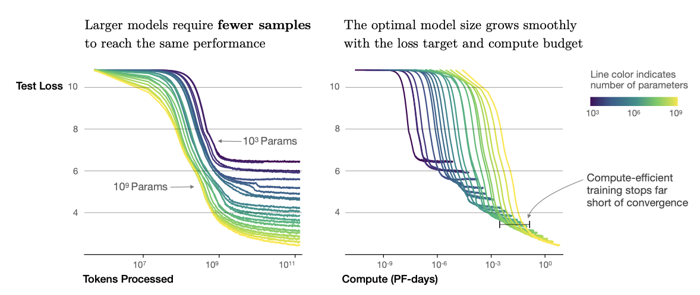
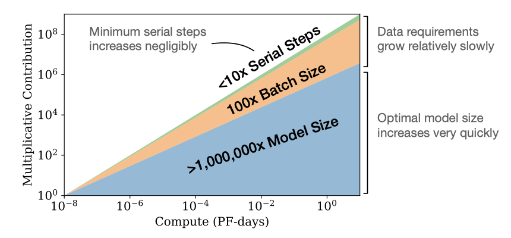
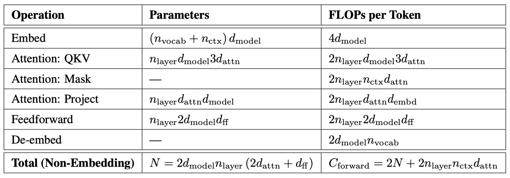
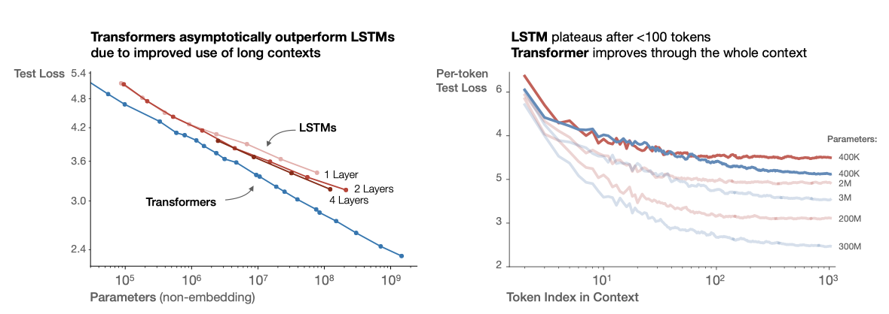
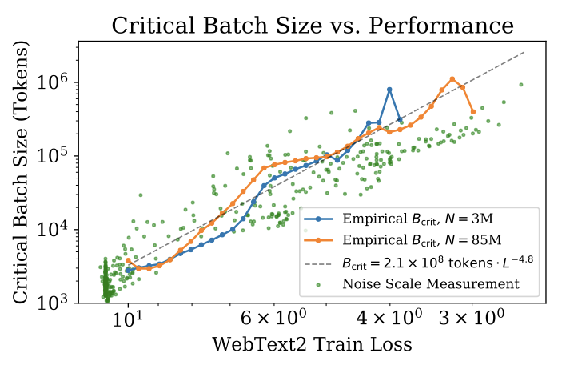
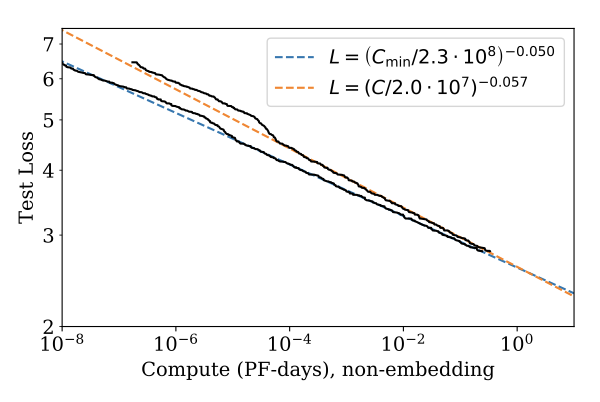
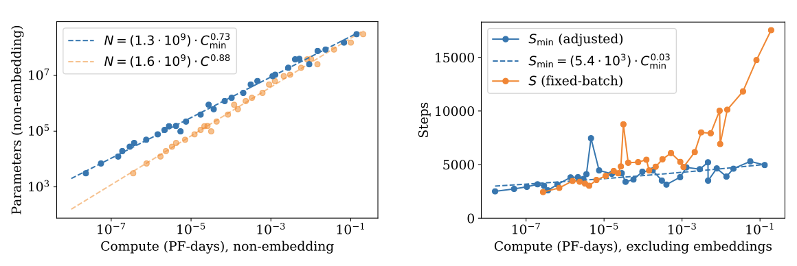
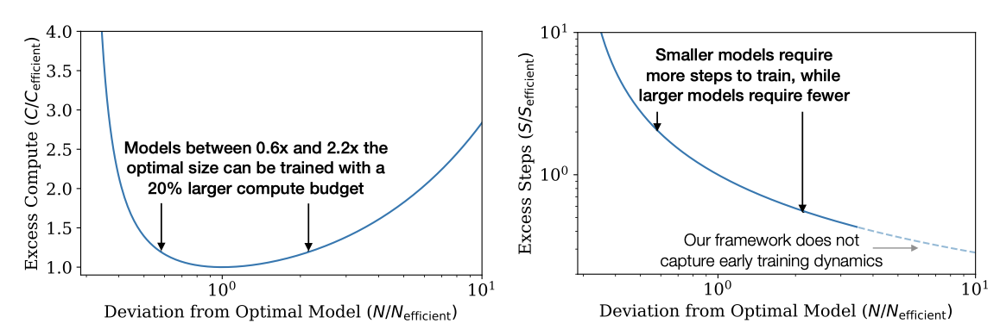
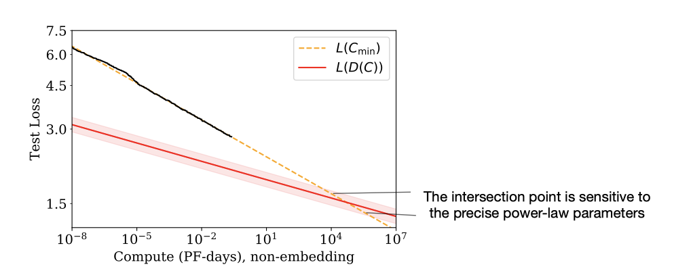

+++
author = "Kurt"
title = "Scaling Law"
date = "2023-12-22"
description = "Scaling Laws for Neural Language Models"
categories = [
    "Paper Review"
]
tags = [
    "NLP",
    "LLM",
]
+++

## Abstract

언어 모델 성능에 대한 연구에서, 모델 크기, 데이터셋 크기, 학습에 사용된 컴퓨팅 양이 교차 엔트로피 손실을 멱법칙으로 스케일링한다는 것을 발견하였다. 네트워크의 폭이나 깊이 같은 다른 세부 사항은 큰 영향을 미치지 않는다. 큰 모델은 표본 효율이 뛰어나며, 최적의 컴퓨팅 효율은 상대적으로 적은 데이터에 큰 모델을 학습시키는 것을 포함한다. 이 모든 관계를 통해, 고정된 컴퓨팅 예산의 최적 할당을 결정할 수 있다.

---

## Introduction

언어는 인공지능 연구에 중요한 분야로, 대부분의 추론 작업을 효과적으로 수행할 수 있다. 세계의 텍스트는 비지도 학습을 위한 풍부한 데이터를 제공하며, 최근 딥러닝은 언어 모델링에 있어 빠른 발전을 보이고 있다. state-of-the-art 모델들은 많은 특정 작업에서 인간 수준의 성능에 근접하고 있으며, 이는 일관된 멀티패러그래프 작성에도 해당된다.

언어 모델링 성능은 모델 구조, 모델 크기, 학습에 사용된 컴퓨팅 파워, 학습 데이터의 양 등 여러 요소에 의존하며, 이 연구에서는 이러한 요소들이 언어 모델링 손실에 어떻게 영향을 미치는지를 transformer 구조를 중심으로 실증적으로 조사한다. 언어 작업의 성능 범위가 넓어서, 규모에 따른 추세를 좀 더 광범위하게 연구할 수 있다.

교육 시간, 문맥 길이, 데이터셋 크기, 모델 크기 등의 여러 요인에 따른 성능 변화를 관찰할 예정이다.

### Summary

Transformer 언어 모델에 대한 주요 발견은 다음과 같다:

**Performance depends strongly on scale, weakly on model shape:** 모델의 성능은 주로 모델 매개변수의 수, 데이터셋 크기, 그리고 사용된 컴퓨팅의 양에 의존하며, 다른 구조적 요소들은 성능에 상대적으로 적은 영향을 미친다.

**Smooth power laws:** $N$, $D$, $C$ 세 가지 스케일 요인이 파워와 관련이 있고, 이는 6배 이상의 크기 차이를 보인다. 상위 범위에서는 성능 향상의 감소를 보지 못했지만, 최종적으로는 성능이 안정화되어 손실이 0에 다다를 것이다.

**Universality of overfitting:** $N$과 $D$를 동시에 확장하면 성능이 예상대로 개선되지만, 둘 중 하나만 증가시키면 손실이 줄어든다. 성능 손실은 $N$과 $D$의 비율에 따라 예측 가능하며, 모델 크기를 8배 증가할 때마다 데이터를 약 5배 증가시키면 손실을 피할 수 있다.

**Universality of training:** 학습 곡선은 모델 크기에 거의 영향을 받지 않는 power-law를 따르며, 이를 통해 학습 초기부의 곡선을 확장해 더 오래 학습했을 때의 손실을 대략적으로 예측할 수 있다.

**Transfer improves with test performance:** 다른 분포의 텍스트에서 모델을 평가하면, 학습 검증 세트의 결과와 강하게 상관되며 일정한 손실이 발생한다. 이는 다른 분포로 전이할 때 일정한 패널티가 있지만, 그 외의 성능 향상은 학습 세트에서와 비슷하게 이루어진다.

**Sample efficiency:** 큰 모델은 작은 모델에 비해 최적화 단계와 데이터 포인트를 더 적게 사용하면서도 동일한 성능을 달성하는 샘플 효율성이 더 높다.

**Convergence is inefficient:** 고정된 컴퓨팅 예산 내에서, 모델 크기나 사용 가능한 데이터에 제한이 없다면, 매우 큰 모델을 학습시키고 조기에 중단함으로써 최적의 성능을 얻는다. 이런 방식은 작은 모델을 완전히 수렴시키는 것보다 샘플 효율성이 훨씬 높으며, 데이터 요구사항은 학습 컴퓨팅에 따라 매우 천천히 증가한다.

**Optimal batch size:** 이 모델들을 학습시키는 이상적인 batch size는 손실의 거듭제곱 정도이며, 가장 큰 모델의 경우 수렴 시점에서 약 1M-2M 토큰이다.

모델 크기, 데이터, 컴퓨팅을 적절히 확장할수록 언어 모델링 성능이 부드럽게 향상되며, 더 큰 언어 모델이 현재의 모델보다 성능과 샘플 효율성이 더 높을 것으로 예상한다.

### Summary of Scaling Laws

Transformer가 언어를 자동 autoregressively하게 모델링하도록 학습된 경우, 테스트 손실은 parameter의 수 $N$, 데이터셋 크기 $D$, 또는 컴퓨팅 예산으 $C_{min}$로만 제한될 때 거듭제곱 법칙을 사용하여 예측할 수 있다.

1. parameter의 수가 제한된 모델들이 충분히 큰 데이터셋에서 수렴할 때까지 학습된 경우:

$$ L(N) = (N)c / N)^{\alpha_N}; \ \alpha_N \sim 0.076, \ N_c \sim 8.8 \times 10^{13} (\text{non-embedding parameters}) $$

2. parameter 수가 제한된 모델들은 충분히 큰 데이터셋에서 수렴할 때까지 학습된다.

$$ L(D) = (D_c / D)^{\alpha_D}; \ \alpha_D \sim 0.095, \ D_c \sim 5.4 \times 10^{13}(\text{tokens}) $$

3. 컴퓨팅 양이 제한된 상황에서 충분히 큰 데이터셋, 최적 크기의 모델, 그리고 충분히 작은 batch size를 사용하여 학습할 때:

$$ L(C_{min} = (C_c^{min} / C_{min})^{\alpha_C^{min}}; \ \alpha_C^{min} \sim 0.050, \alpha_C^{min} \sim 3.1 \times 10^8 (\text{PF-days})$$

이 관계는 $C_{min}$, $N$, $D$의 크기 순서에 대해 유지되며, 이는 모델 형태와 transformer의 다른 hyperparameter에 매우 약하게 의존한다. 거듭제곱 법칙은 $N$, $D$, $C_{min}$의 확장에 따른 성능 향상의 정도를 지정하며, parameter의 수를 두 배로 늘리면 손실이 약간 줄어드다. $N_c$, $C_c^{min}$, $D_c$의 정확한 수치 값은 어휘 크기와 토큰화에 따라 달라진다.

데이터 병렬성의 속도와 효율성을 결정하는 중요한 batch size는 $L$에 대해 거듭제곱 법칙을 따른다:

$$ B_{crit}(L) = {{B_{\ast}}\over{L^{1/\alpha_B}}}, \ B_{\ast} \sim 2 \cdot 10^8 \text{tokens}, \ \alpha_B \sim 0.21 $$

모델 크기를 증가시킬 때, 데이터셋 크기도 $D \propto N^{{\alpha N}\over{\alpha D}} \sim N^{0.74}$에 따라 선형적으로 증가해야 한다는 것을 알 수 있다. 이는 $N$과 $D$에 대한 동시적인 의존성과 과적합 정도를 결정하는 식으로 결합된다.

$$ L(N, D) = \big[ \big( {{N_c}\over{N}} \big)^{{\alpha N}\over{\alpha D}} + {{D_c}\over{D}} \big] $$

다른 생성 모델링 작업에 대한 학습된 log-likelihood를 parameter화 할 수도 있다고 추측한다.

무한한 데이터 한도에서 모델을 일정한 업데이트 단계동안 학습시키면, 초기 변동기간 후에 학습 곡선은 정확하게 맞출 수 있다.

$$ L(N, S) = \big( {{N_c}\over{N}} \big)^{{\alpha N}\over{\alpha D}} + \big( {{S_c}\over{S_{min}(S)}} \big)^{\alpha S}$$

$S_c \approx 2.1 \times 10^3$, $\alpha_S \approx 0.76$이고, $S_{min} (S)$는 최적화 단계(parameter 업데이트)의 최소 가능 수를 나타낸다.

고정된 컴퓨팅 예산 내에서, 다른 제약 없이 학습시킬 때, 최적의 모델 크기, 배치 크기, 스텝 수, 데이터셋 크기가 성장해야 한다는 예측이 나온다.

$$ N \propto C^{\alpha_C^{min} / \alpha N}, B \propto C^{\alpha_C^{min} / \alpha B}, S \propto C^{\alpha_C^{min} / \alpha S}, D = B \cdot S $$

$$ \alpha_C^{min} = 1/ (1/\alpha S + 1 / \alpha B + 1 / \alpha N) $$

계산 예산 $C$가 증가함에 따라, 주로 큰 모델에 투자가 증가하고, 이로 인해 학습 시간이나 데이터셋 크기는 크게 증가하지 않는다. 이는 큰 모델이 표본 효율성이 더 높아진다는 것을 의미한다. 하드웨어 제약으로 인해 연구자들은 일반적으로 작은 모델을 더 오래 학습시킨다. 최적 성능은 총 컴퓨팅 파워에 의존적이다.

토큰 당 결과를 분석하며, LSTM과 recurrent Transformer에 대해 간단히 비교한다.

### Notation

* **$L$** cross entropy 손실은 보통 내츄럴 로그로 표현된다. 대체로 이는 컨텍스트 내의 토큰들에 대해 평균된 값으로 보고되지만, 경우에 따라 컨텍스트 내의 특정 토큰에 대한 손실을 보고하는 경우도 있다.
* **$N$** vocabulary와 positional embedding을 제외한 모델 parameter 수를 의미한다.
* **$C \approx 6NBS$** $B$는 batch size, $S$는 training step 수를 나타내며, non-embedding 학습 계산의 총량을 추정하는데 사용된다. 이 계산량은 PF-day 단위로 표현되며, 1PF-day는 약 $8.64 \times 10^{19}$의 부동소수점 연산에 해당한다.
* **$D$** 토큰 단위의 데이터셋 크기
* **$B_{crit}$** 중요 배치 크기에서의 학습은 시간과 계산 효율성 사이에서 대략적으로 최적의 균형을 제공한다.
* **$C_{min}$** 주어진 손실 값을 달성하기 위해 필요한 최소한의 non-embedding 계산량을 추정한 것으로, 이런 계산량은 모델이 중요 배치 크기보다 작은 배치 크기에서 학습될 때 사용된다.
* **$S_{min}$** 주어진 손실 값을 달성하기 위해 필요한 최소 학습 step 수를 추정한 것으로, 이는 모델이 중요 배치 크기보다 큰 배치 크기에서 학습될 때의 학습 step 수 이다.
* **$\alpha_X$** 손실 $L(X)$는 $1/X^{\alpha X}$의 형태로 $X$의 거듭제곱에 반비례하며, 여기서 $X$는 $N$, $D$, $C$, $S$, $B$, $C_{min}$ 중 하나이다. 즉, $X$가 커지면 손실은 줄어든다.

---

## Background and Methods

WebText2라는 확장된 데이터셋을 사용해 언어 모델을 학습한다. 이 모델은 $n_{vocab} = 50257$ 크기의 어휘로 토큰화되며, 1024 토큰 컨텍스트에 대한 cross-entropy 손실을 최적화한다. 주로 decoder-only transformer 모델을 학습시키지만, 비교를 위해 LSTM 모델과 Universal Transformers도 학습시킨다.

### Parameter and Compute Scaling of Transformers

Transformer 아키텍처는 $n_{layer}$(number of layers), $d_{model}$(dimension of the residual stream), $d_ff$(dimension of the intermediate feed-forward layer), $d_{attn}$(dimension of the attention output), 그리고 $n_{heads}$(number of attention heads per layer) 등의 hyperparameter를 사용해 정의된다. 입력 컨텍스트는 대체로 $n_{ctx} = 1024$개의 토큰을 포함한다.

$$ N \approx 2 d_{model} \ n_{layer} (2 d_{attn} + d_{ff} ) = 12 n_{layer} \ d_{model} $$
$$ \text{with the standard} \ \ d_{attn} = d_{ff} / 4 = d_{model} $$

embedding matrix $n_{vocab} \ d_{model}$과 positional embedding $n_{ctx} \ d_{model}$에 대한 parameter를 가지고 있지만, "모델 크기"를 논의할 때는 이들을 포함하지 않는다. 이 방식은 더욱 깔끔한 스케일링 법칙을 제공한다.

transformer의 forward pass를 평가하는 것은 다음과 같은 과정을 포함한다.

$$ C_{forward} \approx 2N + 2 n_{layer} \ n_{ctx} \ d_{model} $$

add-multiply 연산을 포함하며, 이 중 2배에 해당하는 부분은 행렬 곱셈에 사용되는 multiply-accumulate 연산에서 나온다. 

$d_{model}$이 $n_{ctx} / 12$보다 훨씬 큰 모델에서, 토큰 당 컨텍스트 종속적인 계산 비용은 전체 계산의 작은 부분이다. 따라서 학습 계산 추정에는 컨텍스트 종속적인 부분은 포함되지 않는다. backwards pass 고려 시, 학습 토큰 당 비임베딩 계산은 대략 $C \approx 6N$ non-embedding 연산자로 추정된다.

### Training Procedures

1024개의 토큰으로 이루어진 512개의 시퀀스 배치를 사용하여 $2.5 \times 10^5$ 단계 동안 모델을 Adam optimizer 도구로 학습시켰다. 메모리 제약으로 인해, 1B 개 이상의 parameter를 가진 가장 큰 모델들은 Adafactor로 훈련되었다. 다양한 learning rate와 스케줄을 실험했으며, 결과는 learning rate 스케줄에 크게 의존하지 않았다. 대부분의 학습은 3000 step의 linear warmup 후 0까지의 cosine decay를 따르는 learning rate 스케줄을 사용하였다.

### Datasets

Reddit의 공유 링크를 웹 스크랩한 WebText 데이터셋의 확장 버전에서 모델을 학습시켰다. 이 데이터셋은 2017년 12월까지의 링크와 2018년 1월부터 10월까지의 링크를 포함하며, 각 링크는 최소 3 카르마를 받았다. 이 데이터셋은 총 20.3M의 문서와 96GB의 텍스트, $1.62 \times 10^{10}$ 단어를 포함하며, 가역적 토크나이저를 적용하여 $2.29 \times 10^{10}$ 토큰을 얻었다. 이 중 일부 토큰은 테스트 셋으로 사용되었고, 추가적으로 다양한 소스의 샘플에 대해서도 테스트를 진행하였다.

---

## Empirical Results and Basic Power Laws

언어 모델 스케일링을 특성화하기 위해 다음과 같은 요소를 포함한 다양한 모델을 학습시킨다:

* Model size (ranging in size from 768 to 1.5 billion non-embedding parameters)
* Dataset size (ranging from 22 million to 23 billion tokens)
* Shape (including depth, width, attention heads, and feed-forward dimension)
* Context length (1024 for most runs, though we also experiment with shorter contexts)
* Batch size (2 19 for most runs, but we also vary it to measure the critical batch size)

### Approximate Transformer Shape and Hyperparameter Independence

Transformer의 성능은 전체 non-embedding parameter 수 $N$이 고정되어 있을 때, $n_{layer}$, $n_{heads}$, $d_{ff}$와 같은 shape parameter에 대해 매우 약하게 의존한다. 이를 확인하기 위해, 단일 hyperparameter를 변경하면서 동일한 크기의 모델을 학습시켰다. 깊은 Transformer가 얕은 모델의 앙상블처럼 효과적으로 작동한다면, $n_{layers}$의 독립성이 이어질 것이다.

### Performance with Non-Embedding Parameter Count $N$

모델은 전체 WebText2 데이터셋에서 거의 수렴할 때까지 학습되었으며, 과적합은 가장 큰 모델들을 제외하고는 발견되지 않았다.

non-embedding parameter 수 $N$과의 안정적인 추세를 찾을 수 있으며, 다음과 같이 표현할 수 있다:

$$ L(N) \approx \big( {{N_c}\over{N}} \big)^{\alpha_N} $$

$N$의 함수로서의 성능을 연구하는 것이 중요한데, 이를 통해 non-embedding parameter 수와 성능 사이의 추세를 관찰할 수 있다. 반면 총 매개변수 수를 사용하면 추세가 흐릿해진다. 이는 임베딩 행렬의 크기를 줄여도 성능에 영향을 미치지 않는다는 최근의 연구 결과를 지지한다.

WebText2 데이터셋에서 학습된 이 모델들의 테스트 손실은 다양한 다른 데이터셋에서도 $N$의 거듭제곱 법칙을 따르며, 지수는 거의 동일하다. 

### Comparing to LSTMs and Universal Transformers

LSTM은 문맥 초기에 나타나는 토큰에 대해 Transformer만큼 잘 수행하지만, 나중에 나타나는 토큰에서는 Transformer의 성능을 따라잡지 못하였다. 이는 더 큰 모델들이 패턴을 더 빠르게 인식하는 능력을 개선했다는 것을 나타낸다.

recurrent Transformer는 parameter를 재사용하여 $N$의 함수로서 약간 더 나은 성능을 보이지만, 이는 parameter 당 추가 계산 비용이 발생한다.

### Generalization Among Data Distributions

추가 텍스트 데이터 분포에 대한 모델을 테스트하였다. 모든 모델은 WebText2 데이터셋에서만 학습되었으며, 이러한 다른 데이터 분포에서의 손실은 모델 크기에 따라 부드럽게 개선되었다. 일반화는 거의 전적으로 in-distribution 검증 손실에 의존하며, 학습 기간이나 수렴에 가까움, 모델 깊이에는 의존하지 않았다.

### Performance with Dataset Size and Compute

데이터셋 크기 $D$와 학습 계산 $C$의 함수로서의 테스트 손실에 대한 경험적 추세를 보여준다.

WebText2 데이터셋의 일부에서 모델을 학습시키고 테스트 손실이 더 이상 감소하지 않을 때 학습을 중단하였다. 이 결과, 테스트 손실은 단순한 거듭제곱 법칙으로 표현될 수 있었다.

$$ L(D) \approx \big( {{D_c}\over{D}} \big)^{\alpha_D} $$

학습 중 non-embedding 계산의 총량은 $C = 6NBS$로 추정된다. 주어진 $C$ 값에 대해, 다양한 $N$을 가진 모든 모델을 검토하여 최상의 성능을 내는 모을 찾을 수 있다. 하지만, 모든 모델에 대해 batch size $B$가 고정되어 있기 때문에, 이 결과는 실제로 최적이 아니다.

결과는 다음과 같이 표현될 수 있다:

$$ L(C) \approx \big( {{C_c}\over{C}} \big)^{\alpha_C} $$

데이터 분석 결과, 모델 크기가 커질수록 샘플 효율성이 향상되는 것을 확인할 수 있다. 

---

## Charting the Infinite Data Limit and Overfitting

언어 모델링 성능의 기본적인 스케일링 법칙을 발견하였다. 여기서는 $N$과 $D$를 동시에 변화시키며, $D$ 토큰의 데이터셋에서 학습된 크기 $N$의 모델 성능을 연구한다. 최적으로 학습된 테스트 손실이 스케일링 법칙을 따르며, 이는 모델 크기 증가와 과적합 통제를 위한 데이터 요구량을 안내한다.

### Proposed $L(N, D)$ Equation

$$ L(N, D) = \big[ \big( {{N_c}\over{N}} \big)^{{{\alpha N}\over{\alpha D}}} + {{D_c}\over{D}} \big]^{\alpha D} $$

다음 세가지 원칙을 사용한다: 

1. 어휘 크기나 토큰화의 변화는 전반적인 요소에 의해 손실을 재조정할 것으로 예상된ㄴ다. $L(N, D)$의 parameterization(및 손실의 모든 모델)는 이러한 재조정을 자연스럽게 허용해야 한다.
2. $D$를 고정하고 $N$을 무한대로 보내면, 전체 손실은 $L(D)$에 접근해야 한다. 반대로, $N$을 고정하고 $D$를 무한대로 보내면 손실은 $L(N)$에 접근해야 한다.
3. $L(N, D)$는 $D = \infty$에서 해석적이어야 하므로, 정수 제곱을 가진 $1/D$의 시리즈 확장을 가질 수 있다. 이 원칙에 대한 이론적 지지는 첫 두 원칙에 비해 상당히 약하다.

$L(N, D)$는 어휘의 변화에 따라 $N_c$, $D_c$를 재조정할 수 있기 때문에 첫 번째 요구사항을 만족하다. 이는 또한 $N_c$, $D_c$의 값이 본질적인 의미를 가지지 않음을 의미한다.

테스트 손실이 개선되지 않을 때 학습을 조기에 중단하고, 모든 모델을 동일하게 최적화하기 때문에 큰 모델이 작은 모델보다 성능이 좋을 것으로 예상한다. 그러나 고정된 $D$에서는 어떤 모델도 최선의 손실에 접근할 수 없으며, 고정된 크기의 모델은 용량에 제한된다. 이러한 고려사항은 두 번째 원칙을 동기부여하며, 무한한 $D$와 $N$에서의 $L$ 값은 $L(N, D)$의 모든 parameter를 결정한다.

세 번째 원칙은 추측적으로, 매우 큰 $D$에서 과적합이 $1/D$로 스케일링될 것으로 예상한ㄴ다. 이는 데이터셋의 분산 또는 신호 대 잡음 비율과 관련이 있다. 이 기대는 모든 부드러운 손실 함수에서 성립해야 하지만, 이는 $1/D$ 보정이 다른 분산 원처보다 우세하다고 가정한다. 이 가정은 경험적으로 확인되지 않아 그 적용 가능성에 대한 확신이 떨어진다.

세 번째 원칙은 $N$과 $D$의 역할의 비대칭성을 설명한다. 유사한 대칭 표현식이 가능하지만, 이들은 정수 제곱의 $1/D$ 확장을 가지지 않고 추가 parameter가 필요하다.

$L(N, D)$에 대한 방정식이 데이터를 잘 맞추는 것을 볼 수 있을 것이며, 이것이 $L(N, D)$ 가정에 대한 가장 중요한 정당화이다.

### Results

모든 모델을 10%의 dropout으로 정규화하고, 테스트 손실을 추적하여 더 이상 감소하지 않을 때 중단한다. 

데이터셋이 1024배로 크게 줄어든 경우를 제외하고는 우수한 적합성을 보였다. 작은 데이터셋에서는 한 epoch가 40번의 parameter 업데이트로 이루어지며, 이는 언어 모델링의 다른 체제를 나타낼 수 있다. 학습 초기에 과적합이 발생하고, 전체 $L(N, D)$를 적합시키므로 parameter가 Section 4에서 얻은 것과 약간 다르다.

무한 데이터 한계를 탐색하기 위해, 과적합의 범위를 직접 조사할 수 있다. 가장 큰 모델을 제외하고는 22B 토큰의 전체 WebText2 데이터셋으로 학습시 과적합의 증거가 없으므로, 이를 $D = \infty$의 대표로 볼 수 있다. 이를 바탕으로 유한 $D$를 무한 데이터 한계와 비교할 수 있다.

$$ δL(N, D) ≡ {{L(N, D)}\over{L(N, \infty)}} -1 $$

$N$과 $D$의 함수로서 $δL$을 연구한다. 실제로 $δL$이 $N$과 $D$의 특정 조합에만 의존하는 것을 경험적으로 확인할 수 있으며, 이는 스케일링 법칙에서 파생된다.

$$ δL \approx \big( 1 + \big( {{N}\over{N_c}} \big)^{{\alpha N}\over{\alpha D}} {{D_c}\over{D}} \big)^{\alpha D} -1 $$

large $D$에서 이 공식이 $1/D$의 제곱의 시리즈 확장을 가지고 있다.

다른 랜덤 시드로 손실의 변동성이 대략 0.02라는 것을 추정하며, 이는 수렴 임계값 내에서 학습 시 과적합을 피하기 위해 다음을 필요로 한다.

$$ D \geqslant (5 × 10^3) N^{0.74} $$

이 관계를 통해, $10^9$개 미만의 parameter를 가진 모델은 22B 토큰의 WebText2 데이터셋에서 최소한의 과적합으로 학습 가능하며, 가장 큰 모델은 약간의 과적합을 겪게 된다. 이 관계는 과적합을 피하면서 데이터셋 크기가 모델 크기에 비례하여 아래선형적으로 증가할 수 있음을 보여준다. 그러나 이것이 항상 최대 계산 효율적인 학습을 의미하는 것은 아니며, 데이터셋과 모델 크기 변화에 따른 정규화 최적화는 아직 이루어지지 않았다.

--- 

## Scaling Laws with Model Size and Training Time

모델 크기와 학습 시간에 따른 손실 함수의 스케일링 법칙을 이해하는데 초점을 맞춥니다. 이를 위해 대부분의 모델에 적용할 수 있는 학습 단계를 정의하고, 이를 통해 손실의 모델 크기와 학습 시간 의존성을 적합시키는 방법을 설명합니다. 그리고 이 결과를 바탕으로 학습 시간과 모델 크기를 최적으로 분배하는 방법을 예측하고 검증한다.

### Adjustment for Training at $B_{crit}(L)$

학습에는 critical batch size $B_{crit}$이 존재하며, 이 크기 이하에서는 batch size를 늘려도 컴퓨팅 효율성이 크게 저하되지 않는다. 그러나 $B_{crit}$보다 큰 경우에는 batch size 증가의 효과가 점차 감소한다. 이 결과는 batch size에 따른 학습 시간과 컴퓨팅 변화를 예측하는데 활용할 수 있다. 최적의 효율을 위해선 batch size가 $B_{crit}$에 가깝게 설정되어야 하며, 너무 크거나 작은 batch size는 각각 학습 step과 컴퓨팅 사용을 최소화한다.

더 구체적으로, 다양한 신경망 작업에 대해 학습 step 수 $S$와 처리된 데이터 예제의 수 $E = BS$는 간단한 관계를 만족시키는 것이 입증되었다.

$$ \big( {{S}\over{S_{min}}} - 1 \big) \big( {{E}\over{E_{min}}} - 1 \big) = 1 $$

이는 손실 $L$의 고정된 값에 도달하기 위한 학습을 진행할 때의 상황이다. 여기서 $S_{min}$은 $L$에 도달하기 위해 필요한 최소 단계 수이며, $E_{min}$은 처리해야 할 데이터 예제의 최소 수 이다.

다음 식은 critical batch size를 정의한다.

$$ B_{crit}(L) ≡ {{E_{min}}\over{S_{min}}} $$

이는 손실의 목표 값에 따라 변하는 함수이다. critical batch size에서 학습하면 시간/컴퓨팅의 트레이드오프가 대략적으로 최적화되며, 이는 $2S_{min}$의 학습 step을 필요로 하고 $E = 2E_{min}$의 데이터 예제를 처리한다.

학습 손실에 따른 critical batch size와 gradient noise scale을 보여준다. 이는 모델 크기와 무관하며 손실 $L$에만 의존합니다. 이로 인해 예측이 transformer 언어 모델에도 계속 적용된다. critical batch size는 손실의 power-law으로 적합될 수 있다.

$$ B_{crit}(L) \approx {{B_{*}}\over{L^{1/\alpha_B}}} $$

여기서 $B_{*}$는 약 $2 \times 10^8$이고, $\alpha_B$는 약 0.21이다.

손실이 최소값에 접근할 때 gradient noise scale이 발산할 것으로 예상되어, 이를 추적하도록 $B_{crit}$의 parameterization를 선택하였다. 자연 언어의 엔트로피가 0이 아니므로 $L_{min} > 0$이며, 이는 이 연구에서 달성한 $L$의 값보다 훨씬 작다. 그래서 $B_{crit}$이 $L$이 0으로 접근함에 따라 발산하는 parameterization를 사용하였다.

$B_{crit}(L)$을 사용하여 batch size $B = 2^19$ 토큰으로 학습하는 동안의 학습 step 수 $S$와 $B ≫ B_{crit}$에서 학습하는 동안의 학습 step 수 사이의 관계를 추정할 것이다. 이는 단순히 다음과 같다.

$$ S_{min}(S) ≡ {{S}\over{1 + B_{crit}(L) / B}}, (\text{minimum steps, at} B ≫ B_{crit} ) $$

이는 손실의 목표 값 $L$에 대한 것이다. 이것은 또한 $B ≪ B_{crit}(L)$에서 학습하면서 크기 $N$의 모델로 $L$까지 학습하는데 필요한 컴퓨팅의 critical value를 정의한다. 이는 다음과 같다.

$$ C_{min}(C) ≡ {{C}\over{1 + B / B_{crit}(L)}}, (\text{minimum compute, at} B ≪ B_{crit} ) $$

여기서 $C = 6NBS$는 batch size $B$에서 사용되는 (non-embedding) 컴퓨팅을 추정한다.

### Results for $L(N, S min)$ and Performance with Model Size and Compute

$S_{min}$을 활용하여, 무한 데이터 한계에서 모델 크기와 학습 시간에 따른 손실의 관계를 간단하게 적합시킨다. 이는 Adam-optimized 학습을 통해 이루어진다.

$$ L(N, S_{min}) = \big( {{N_c}\over{N}} \big)^{\alpha_N} + \big( {{S_c}\over{S_{min}}} \big)^{\alpha_S} $$

손실에 대해, learning rate schedule의 warmup period 이후의 모든 학습 단계를 포함하고, parameter를 사용하여 데이터에 적합성을 찾는다:

이러한 parameter들을 사용하면, 학습 곡선 적합성을 얻을 수 있다. 이 적합성들이 완벽하지는 않지만, 상당히 설득력 있는 것으로 생각된다.

다른 방식으로 데이터와 적합성을 시각화할 수 있는데, 이는 학습에 사용된 전체 non-embedding 계산 또는 단계 수를 고정하고 모델 크기에 따른 테스트 손실을 연구한다.

손실에 대한 S_{min}의 법칙적 종속성은 최적화 동력학과 손실 풍경 사이의 상호작용을 보여준다. 학습 후반부에 가장 적합성이 좋기 때문에, 법칙이 손실의 hessian 행렬 스펙트럼에 대한 정보를 제공한다. 그 보편성은 hessian 행렬의 고유값 밀도가 모델 크기와 거의 관련이 없음을 나타낸다.

### Lower Bound on Early Stopping Step

$L(N, S_{min})$ 결과는 데이터 제한 학습에서 일찍 멈춰야 하는 단계의 최소 한계를 도출하는데 사용된다. 이는 주어진 모델의 유한 $D$와 무한 $D$ 학습 곡선이 $S_{min} \approx S_{stop}$에 이를 때까지 유사하기 때문이다. 따라서 과적합은 $S_{stop}$에서 학습을 중단하는 수정에 비례할 것이다. 이는 유한 $D$에서 테스트 손실이 더 느리게 감소하므로 $S_{stop}$을 과소평가하게 된다. 이러한 추론은 특정 부등식을 이끈다.

$$ S_{stop} (N, D) \geqslant {{S_c}\over{[L(N, D) - L(N, \infty)]^{1/\alpha_S}}} $$

$L(N, \infty)$은 무한한 데이터로 평가된 수렴된 손실이다. 이 부등식은 경험적 데이터와 비교되며, $S_{stop}$과 $L(N, D)$는 경험적이다. $L(N, \infty)$은 $D = \infty$에서 평가된 $L(N, D)$에 대한 적합으로 계산된다.

---

## Optimal Allocation of the Compute Budget

훈련 중 계산에 따른 성능의 경험적 추세를 보면, fixed batch size $B$에서 학습하는 것을 포함하지만, 실제로는 batch size $B_{crit}$에서 더 효율적으로 학습할 수 있다. 손실의 큰 값과 작은 값은 각각 더 적은 샘플이나 단계로 달성될 수 있었으며, 이를 중요한 batch size로 표준화하면 더 깔끔하고 예측 가능한 추세가 나타난다.

이 섹션에서는 이전의 실수를 조정하고, 모델 크기 $N$과 학습 중 처리된 데이터 양($2B_{crit} S_{min}$) 사이의 최적 컴퓨트 할당을 결정한다. 이는 $L(N, S_{min})$의 방정식을 활용하여 경험적으로 그리고 이론적으로 수행되며, 두 방법이 일치함을 보여줄 예정이다.

### Optimal Performance and Allocations

최적으로 할당된 계산에 따른 손실을 연구한다. $C_{min}$을 이용한 새로운 적합이 약간 개선되었다.

$L(C_{min})$이 주어졌을 때, 주어진 학습 계산량으로 최소 손실을 제공하는 최적 모델 크기 $N(C_{min})$을 찾는 것이 중요하. 이 최적 모델 크기는 법칙적으로 매우 잘 적합함을 확인할 수 있다.

$$ N(C_{min}) \propto (C_{min})^{0.73} $$

최적이 아닌 크기의 모델을 훈련시키는 효과를 보여준다.

정의에 따르면, $C_{min} ≡ 6NB_{crit} S$이므로, $N(C_{min})$를 사용하여 추가 결과를 도출할 수 있다. 이전 적합 결과 $B \propto L^{−4.8}$ 및 $L \propto C_{min}^{−0.05}$를 바탕으로, $B_{crit} \propto C_{min}^{0.24}라는 결론을 내린다. 이로 인해 최적의 단계 수는 계산량에 따라 매우 느리게 증가할 것으로 예상된다.

$$ S_{min} \propto (C_{min})^{0.03} $$

실제로 측정된 지수는 충분히 작아서, 결과는 지수가 0인 경우와도 일관성이 있을 수 있다.

언어 모델링을 최적의 계산 할당으로 확장하면서, 주로 모델 크기 $N$을 늘리고, $B \propto B_{crit}$를 통해 배치 크기를 증가시키되, 연속적인 단계 수의 증가는 무시해야 한다. 계산 효율적인 학습은 적은 수의 최적화 단계를 사용하므로, 초기 학습 동력학을 가속화하는 추가 작업이 필요할 수 있다.

### Predictions from $L(N, S_{min})$

$L(C_{min})$과 할당 결과는 $L(N, S_{min})$ 방정식을 통해 예측할 수 있다. $L(N, S_{min})$ 방정식을 이용하면, $S_{min} = C_{min}$을 대입하고 학습 계산을 고정한 상태에서 $N$에 따른 손실의 최소값 $6NB$를 찾을 수 있다. 

학습 계산의 함수로서의 손실에 대해서, 우리는 다음을 예측한다.

$$ L(C_{min}) = \big( {{C_c^{min}}\over{C_{min}}} \big)^{\alpha_C^{min}} $$

$$ \alpha_C ≡ {{1}\over{1/\alpha_S + 1/\alpha_B + 1/\alpha_N}} \approx 0.054 $$

또한 다음을 예측한다.

$$ N(C_{min}) \propto (C_{min})^{\alpha_C^{min} / \alpha_N} \approx (C_{min})^{0.71} $$

이것 또한 스케일링과 몇 퍼센트 이내로 일치한다. scaling law는 언어 모델링의 성능에 대한 예측적인 프레임워크를 제공한다.

### Contradictions and a Conjecture

계산, 데이터, 모델 크기의 큰 값에서 직선적인 법칙적 추세로부터의 이탈을 관찰하지 않는다. 그러나, 자연어가 0이 아닌 엔트로피를 가지고 있기 때문에, 추세는 결국 안정화되어야 한다.

이 섹션에서 서술된 계산 효율적인 학습의 추세는 명백한 모순을 포함하고 있다. 훨씬 큰 규모에서 $L(C_{min})$ scaling law에 의해 예측된 성능은 계산과 함께 학습 데이터 증가가 느리다는 점을 고려하면 가능한 것보다 낮다. 이는 scaling law가 이 지점 이전에 붕괴해야 함을 의미하며, 이 교차점은 transformer 언어 모델이 최대 성능에 도달하는 지점의 추정치를 제공한다는 더 깊은 의미를 가지고 있을 것으로 추측한다.

계산 효율적인 학습에 사용되는 데이터의 양이 계산 예산과 느리게 증가하기 때문에, $L(C_{min})$에 의해 예측된 성능은 결국 $L(D)$ 법칙에 의해 설정된 하한선에 도달한다.

과적합을 제어하기 위해, 데이터셋 크기를 다음과 같이 조정해야 함을 의미한다.

$$ D \propto N^{0.74} \propto C_{min}^{0.54} $$

critical batch size에서 학습하고 학습 중 데이터를 재사용하지 않는 경우, 데이터 사용량이 계산량과 같이 증가한다는 것을 알 수 있다. 이는 계산 효율적인 학습의 데이터 요구사항과 비교된다.

$$ D(C_{min}) = {{2 C_{min}}\over{6 N (C_{min})}} \approx ( 4 \times 10^{10} \text{tokens} ) (C_{min}/\text{PF-Day})^{0.26} $$

계산량과 함께 데이터셋 크기가 생산적으로 증가할 수 있는 최대 속도는 단 한 번의 epoch만을 위해 학습하는 것이다. 그러나 이는 데이터셋을 더 느리게 증가시키며, 학습 과정에서 데이터를 재사용하지 않더라도, 계산 효율적인 학습은 결국 과적합 문제에 직면하게 될 것이라는 것을 암시한다.

데이터셋 크기에 의해 제한될 때, 즉 과적합 발생시 손실은 $L(D) \propto D^{−0.095}$로 스케일링될 것으로 예상된다. 이는 데이터 제한시 손실이 계산량에 따라 $L(D(C_{min})) \propto C_{min}^−{0.03}$으로 스케일링될 것을 의미한다. 그러나 $L(C_{min}) \propto C_{min}^{−0.050}$ 예측과 교차하게 되어 모순이 발생한다.

$L(D(C_{min}))$와 $L(C_{min})$의 교차점은 다음에서 발생한다.

$$ C^∗ \sim 10^4 \text{PF-Days} N^∗ \sim 10^{12} \text{parameters}, D^∗ \sim 10^{12} \text{tokens}, L^∗ \sim 1.7 \text{nats/token} $$

수치값은 매우 불확실하며, 법칙적인 적합에서의 지수의 정확한 값에 따라 크게 변할 수 있다. 가장 명확한 해석은, 계산과 모델 크기에서 많은 자릿수만큼 떨어진 이 지점에 도달하거나 그 이전에 scaling law가 붕괴한다는 것이다.

교차점이 더 깊은 의미를 가진다는 추측이 있다. 특별한 데이터 요구사항 없이 모델 크기를 $N^∗$ 이상으로 늘릴 수 없다면, $C_{min}^∗ 와 $N^∗$에 도달하면 자연어 데이터에서 신뢰할 수 있는 정보를 모두 추출했다는 것을 의미할 수 있다. 이 경우, $L^∗$은 자연어의 토큰당 엔트로피의 대략적인 추정치를 제공하며, 손실 추세는 $L^∗$ 에서 또는 그 이전에 안정화될 것으로 예상된다.

학습 데이터셋에 추가된 잡음을 고려하면 $L(C_{min})$의 함수 형태가 안정화되는 것을 추측할 수 있다. 예를 들어, 랜덤 토큰 문자열을 각 컨텍스트에 추가하여 손실을 상수만큼 증가시킬 수 있다. 잡음 바닥에서의 거리 $L - L_{noise}$는 더 의미있는 성능 지표가 될 수 있으며, 이 거리에서의 작은 감소는 큰 성능 향상을 나타낼 수 있다. 인공적인 잡음은 모든 추세에 동일한 영향을 미치므로, 안정화 이후에도 임계점 6.8은 변하지 않고 의미가 있을 수 있다.

---

## Related Work

Power law는 다양한 출처에서 나올 수 있다. 밀도 추정과 랜덤 포레스트 모델에서의 모델과 데이터셋 크기에 대한 Power-law scaling은 결과와 관련이 있을 수 있다. 이 모델들은 power-law exponent가 데이터의 관련 특징 수의 역수로 대략적으로 해석될 수 있다고 제안한다.

일부 초기 연구에서는 성능과 데이터셋 크기 간의 power-law scaling을 발견했고, 최근 연구는 모델 크기와 데이터 크기 사이의 스케일링도 조사하였다. 그러나 일부 연구에서는 모델 크기와 함께 데이터셋 크기의 super-linear scaling을 발견했지만, 이 논문은 sub-linear scaling을 발견하였다. 또한, power-law learning curve과 최적의 계산 할당에 대한 이 논문의 연구 결과와 일부 유사점이 있다. 최근의 연구에서는 다양한 데이터셋에 대한 데이터셋 크기와 모델 크기 모두를 확장하고 있다.

EfficientNet은 이미지 모델의 최적 성능을 위해 깊이와 너비를 지수적으로 확장하도록 주장하며, 이는 깊이에 따른 너비의 power-law scaling을 초래한다. 언어 모델에 대해 이 지수가 확장 시 대략 1이어야 한다는 것을 발견했으며, 언어 모델의 전체적인 규모에 비해 구조적인 hyperparameter의 정확성은 크게 중요하지 않다는 것을 발견하였다. 또한, 일부 연구에서는 데이터 예제당 계산을 고정하는 반면, 이 논문의 모델 크기와 학습 계산량 모두를 확장하는 것을 조사하였다.

overparameterized 모델에서의 일반화를 조사한 여러 연구들에서는 모델 크기가 데이터셋 크기에 도달하면 "jamming transition"가 발생한다는 것을 발견하였다. 하지만 이러한 전환이 일어나지 않는 것을 발견하였고, 필요한 학습 데이터가 모델 크기에 대해 부분적으로 확장된다는 것을 확인하였다. 모델 크기의 확장, 특히 큰 너비는 스케일링 관계에 대해 생각하는 데 유용한 프레임워크를 제공할 수 있다. 또한, 노이즈가 있는 이차 모델을 사용하여 학습 곡선의 형태 등 최적화 결과를 설명할 수 있다.

---

## Discussion

언어 모델의 log-likelihood loss는 non-embedding parameter 수, 데이터셋 크기, 최적화된 학습 계산과 일관되게 스케일링되며, 이는 특정 수식에 요약되어 있다. 반면, 다수의 구조적 및 optimization hyperparameter에 대한 의존성은 매우 약하다. 이러한 스케일링은 power-law scaling이므로, 규모가 증가할수록 효과는 점점 감소한다.

parameter가 동시에 변할 때 손실이 특정 변수에 어떻게 의존하는지 정확하게 모델링할 수 있었다. 이를 통해 대형 언어 모델 학습시 계산 스케일링, 과적합의 크기, 조기 중단 단계, 데이터 요구 사항을 도출하였다. 이러한 스케일링 관계는 단순한 관찰을 넘어 예측 프레임워크를 제공하며, 이는 이상기체법칙과 유사하게 해석될 수 있다.

스케일링 관계는 maximum likelihood loss를 가진 다른 생성 모델링 작업, 예를 들어 이미지, 오디오, 비디오 모델 등에도 적용될 것으로 예상된다. 현재로서는 어떤 결과가 자연 언어 데이터의 구조에 의존하고 어떤 것이 보편적인지 확실하지 않다. "thermodynamics"을 기반으로 하는 "statistical mechanics" 같은 이론적 프레임워크를 발견하는 것은 더욱 정확한 예측을 도출하고 scaling law의 한계를 체계적으로 이해하는 데 도움이 될 것이다.

자연어 분야에서는 손실의 지속적인 개선이 실제 언어 작업에 대한 개선으로 이어지는지 확인하는 것이 중요하다. "more is different"라는 말처럼, 부드러운 양적 변화는 실질적인 질적 개선을 가릴 수 있다. 경제 성장이나 언어 모델 손실의 부드러운 개선 뒤에는 특정 기술 개발이나 능력의 질적 변화가 숨겨져 있을 수 있다.

이 논문의 연구 결과는 더 큰 모델이 계속해서 성능을 개선하며, 이전에 알려진 것보다 샘플 사용 효율이 높을 것이라는 강력한 추정을 제공한다. 이에 따라 모델 병렬화에 대한 추가 연구가 필요하며, 깊은 모델은 파이프라이닝을 활용한 학습, 넓은 네트워크는 병렬화를 통한 학습이 가능하다는 것을 확인하였다. 뿐만 아니라, 희소성 또는 분기를 활용하면 큰 네트워크의 빠른 학습이 가능하며, 네트워크를 학습하면서 확장하는 방법을 사용하면 전체 학습 과정에서 계산 효율성을 유지할 수 있다.

---

## Reference

* [Paper](https://arxiv.org/pdf/2001.08361.pdf)