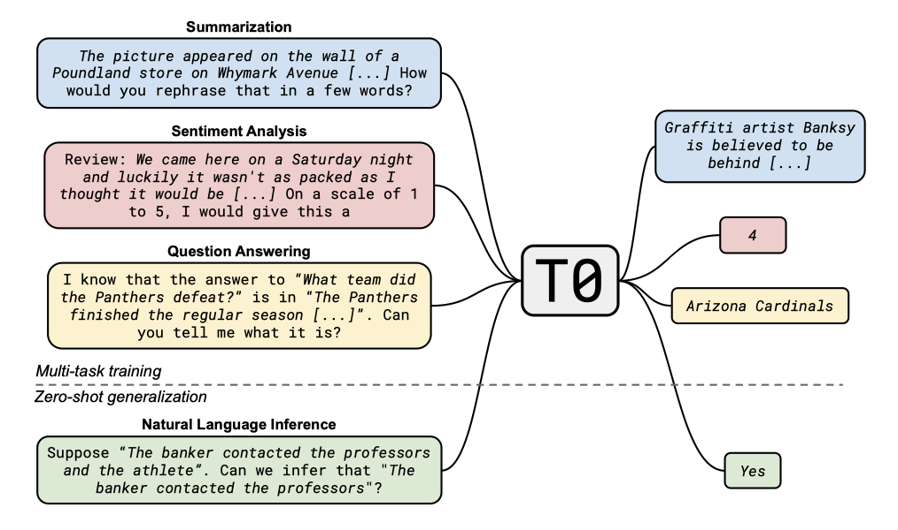
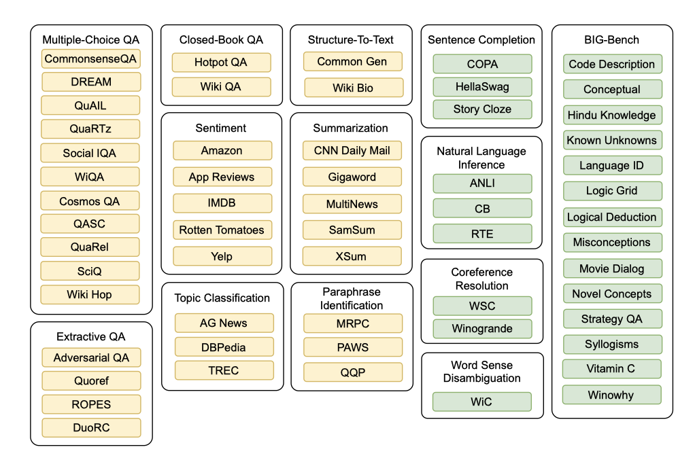
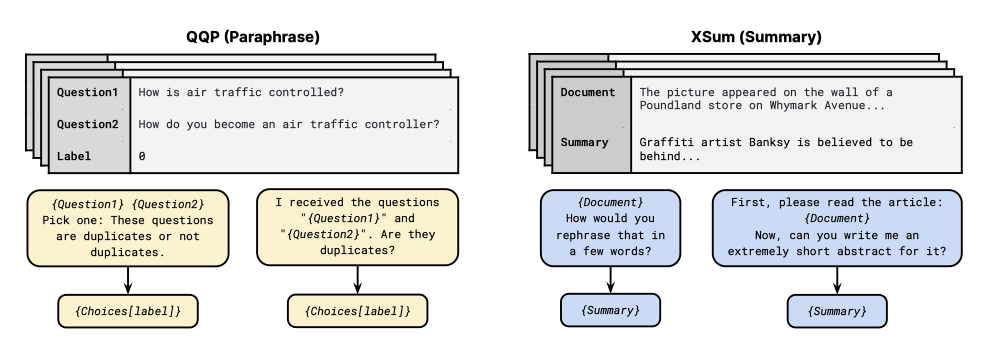
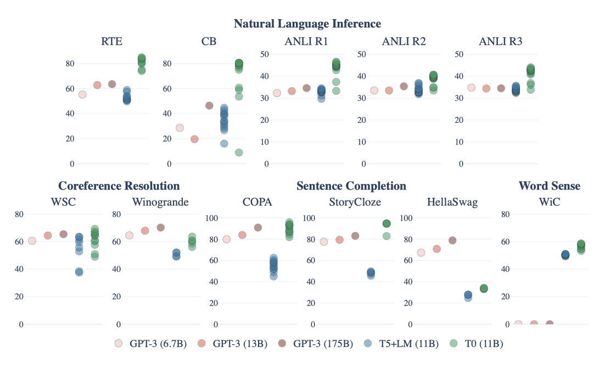
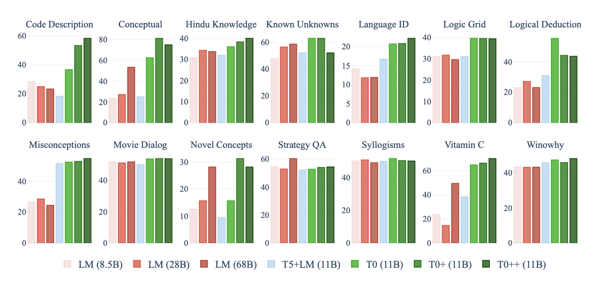
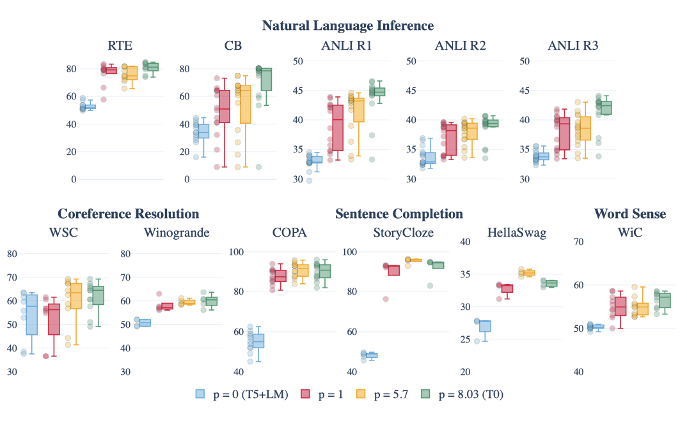
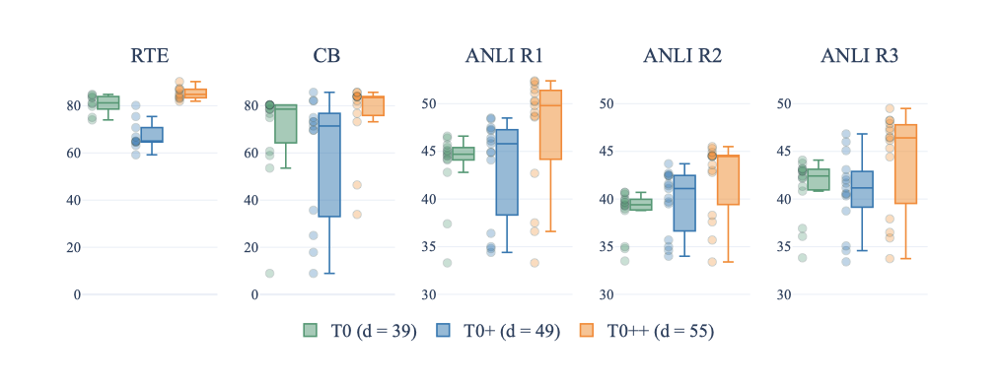

+++
author = "Kurt"
title = "T0"
date = "2024-01-05"
description = "Multitask Prompted Training Enables Zero-Shot Task Generalization"
categories = [
    "Paper Review"
]
tags = [
    "NLP",
    "LLM",
]
+++

## Abstract

최근의 연구에서 거대 언어 모델들이 다양한 작업에 대해 zero-shot 일반화를 잘 보여주고 있다. 이는 언어 모델의 사전학습 과정에서 암시적으로 multitask 학습이 이루어지기 때문이라는 가설이 있다. 이에 반해, 연구진은 zero-shot 일반화를 명시적인 multitask 학습으로 직접 유도할 수 있는지를 테스트하였다. 이를 위해 자연어 작업을 사람이 읽을 수 있는 프롬프트 형태로 변환하는 시스템을 개발하였고, 이를 사용해 다양한 supervised 데이터셋을 변환하였다. 결과적으로, 이 모델은 여러 표준 데이터셋에서 강력한 zero-shot 성능을 보여주었으며, 특히 그 크기가 16배인 모델을 능가하는 결과를 보였다. 또한 BIG-bench 벤치마크의 일부 작업에서도 우수한 성능을 보였다.

---

## Introduction

최근의 연구에서는 거대 언어 모델이 새로운 작업에 대해 합리적인 zero-shot 일반화를 보여주는 것으로 나타났다. 이 모델들은 언어 모델링 목표에 대해서만 학습되었음에도 불구하고, 명시적으로 학습되지 않은 새로운 작업에 대해 상대적으로 잘 수행할 수 있다. 이는 거대 언어 모델이 암시적인 multitask 학습 과정을 통해 새로운 작업에 일반화한다는 가설을 뒷받침한다. 하지만 이 능력은 모델의 크기가 충분히 커야 하며, 프롬프트의 표현에 민감하다는 것을 고려해야 한다.

multitask 학습이 얼마나 암시적인지는 아직 뚜렷이 알려지지 않았다. 최근 언어 모델의 사전학습 말뭉치 규모를 고려하면, 일부 자연어 처리(NLP) 작업들이 해당 말뭉치에서 명시적으로 나타나 모델이 직접 학습하는 것이 합리적으로 보인다. 예를 들어, 퀴즈 질문과 답변을 담은 웹사이트는 바로 closed-book 질문 대답 작업에 대한 지도 학습 데이터로 사용될 수 있다. 이러한 multitask supervision이 zero-shot 일반화에서 큰 역할을 한다는 가설을 세웠다.

이 논문에서는 언어 모델을 supervised이며 massively multitask 방식으로 명시적으로 학습하는 방법에 대해 연구한다. 자연어 프롬프트로 표현된 다양한 작업들을 사용하여 모델이 보류된 작업에 더 잘 일반화하고 프롬프트의 단어 선택에 강건하게 만드는 것을 목표로 한다. 이를 위해, 구조화된 데이터셋에 대한 간단한 템플릿 언어를 사용하여 자연어 작업을 프롬프트 형식으로 변환하고, 공공 기여자들로부터 프롬프트를 수집하는 인터페이스를 개발하였다. 그 후, T5 encoder-decoder 모델의 변형을 일부 작업에 대해 학습하고, 학습되지 않은 작업과 프롬프트를 평가하였다.

이 논문의 실험은 multitask 프롬프트 학습이 보류된 작업에 대한 일반화를 향상시키고, 더 넓은 범위의 프롬프트 학습이 프롬프트 단어 선택에 대한 robustness를 향상시키는지를 연구한다. 실험 결과, multitask 학습은 zero-shot 작업 일반화를 가능하게 하며, 모델은 GPT-3의 성능을 대부분의 보류된 데이터셋에서 매치하거나 초과한다. 또한, 데이터셋당 더 많은 프롬프트에 대한 학습이 보류된 작업에 대한 성능의 중간값을 향상시키고 변동성을 감소시키는 것을 확인하였다. 하지만, 더 넓은 범위의 데이터셋에서의 프롬프트 학습은 변동성을 일관되게 감소시키지는 않는다.

---

## Related Work

이 연구에서는 언어 모델 사전 학습에서의 implicit multitask 학습과 explicit multitask 학습을 구분한다. multitask 학습으로 학습된 모델은 자연어 처리에서 우수한 성능을 보였다. 각 과제는 다른 출력을 가지므로, 공유된 형식이 필요하며, 여러 가지가 사용되었다. 일부 연구에서는 대규모 사전 학습 모델을 사용하여 새로운 데이터셋에 대한 few-shot 및 zero-shot 일반화를 탐색하였다.

자연어 프롬프팅은 NLP 작업을 자연어 응답 형식으로 변환하는 방법이다. text-to-text 사전 학습 모델, 예를 들면 T5의 발전으로, 프롬프트는 multitask 학습에 특히 유용하게 사용되고 있다. 이 방법은 여러 데이터셋을 하나의 프롬프트로 재구성하지만, 그 형식이 고정되어 있어 새로운 프롬프트나 작업에는 일반적으로 적용할 수 없다.

Schick and Sch¨utze (2021), 그리고 Brown et al. (2020)은 모든 NLP 작업에 프롬프트 사용을 확대하였다. Mishra et al. (2021)은 이를 61개의 구체적 작업에 적용했고, 전통적인 NLP에서의 62개의 데이터셋과 12개의 작업에 적용해 일반화를 학습하고 측정하였다. 또한, zero-shot 일반화에 초점을 맞추었다. Wei et al. (2021)의 연구와는 프롬프트 다양성, 모델 규모, 보류된 작업 체계 등에서 차이가 있다.

프롬프트의 성공은 모델이 이를 작업 지시문으로 이해하고 새로운 작업에 일반화한다는 가설로 설명된다. 그러나 프롬프트의 의미적 중요성이 얼마나 큰 역할을 하는지에 대한 의문이 제기되었다. 이 연구에서는 프롬프트가 어떻게 일반화를 지원하는지에 대해 명확한 결론을 내리지 않고, 프롬프트가 multitask 학습의 자연스러운 형식을 제공하고 새로운 작업에 대한 일반화를 실증적으로 지원한다고 주장한다.

---

## Measuring Generalization To Held-Out Tasks

NLP 데이터셋이 작업별로 나뉘어 있다고 가정하고 시작한다. "task"는 특정 데이터셋 그룹으로 테스트되는 일반적인 NLP 능력을 의미한다. 새 작업에 대한 zero-shot 일반화를 평가하기 위해, 일부 작업에서 학습하고 나머지 작업에서 평가한다.

NLP 작업 분류는 특히 독특한 기술을 분리하려 할 때 애매하다. 많은 데이터셋이 상식 지식을 평가하며, 일부는 상식을 독립적인 작업으로 정의한다. 그러나 상식 데이터셋은 타고난 지식에서부터 DIY 지시사항, 문화적 규범, 대학원 수준의 이론까지 다양하다.

작업별 그룹화는 완벽하지 않지만, 작업 형식에 따라 작업 분류를 구성하였다. 영어가 아닌 데이터셋이나 특별한 도메인 지식이 필요한 데이터셋은 제외했다. 결과적으로, 12개의 작업과 62개의 데이터셋이 학습 및 평가 mixture을 형성하게 되었다. 모든 실험은 Hugging Face 데이터셋 라이브러리에서 데이터셋을 사용하였다.

zero-shot 일반화를 검증하기 위해, natural language inference(NLI), coreference resolution, sentence completion, word sense disambiguation이라는 4가지 작업의 데이터셋을 사용하지 않았다. 대부분의 사람들이 NLI 작업을 직관적으로 수행할 수 있으므로, NLI를 보류된 작업으로 선택하였다. 비슷한 이유로 coreference resolution와 단어 의미 해석도 보류되었고, sentence completion은 NLI와 너무 비슷하므로 보류되었다. 더불어, T0 모델은 Brown et al. 이 평가에 사용한 어떤 데이터셋에도 학습시키지 않았으며, 이를 통해 공정한 zero-shot 비교가 가능해진다. 또한, 이러한 작업들에 대한 데이터가 사전 학습된 코퍼스를 통해 유출되지 않았음을 확인하였다.

마지막으로, 거대 언어 모델의 능력을 테스트하기 위한 다양한 작업들을 모은 BIG-bench의 데이터셋 일부를 추가로 평가하였다. 이 데이터셋은 T5 토크나이저의 어휘에 속하는 텍스트를 포함하는 언어 중심의 작업들로 구성되어 있다. BIG-bench의 모든 작업들은 이 논문의 학습에서 제외된 새로운 작업들이다.

---

## A Unified Prompt Format

모든 데이터셋이 자연어 형식의 프롬프트로 제공되어 zero-shot 실험을 가능하게 한다. 다양한 데이터셋을 프롬프트로 쉽게 변환할 수 있도록, 템플릿 언어와 애플리케이을 개발하였다. 템플릿은 데이터 예제를 자연어 입력과 목표 시퀀스로 매핑하는 기능을 가지며, 사용자는 임의의 텍스트를 데이터 필드나 메타데이터 등과 섞을 수 있다. 예를 들어, NLI 데이터셋은 전제, 가설, 라벨이라는 필드를 포함하며, 입력 템플릿은 "If { Premise } is true, is it also true that { Hypothesis } ?"와 같이 될 수 있다. 각 데이터 예제는 다양한 프롬프트 템플릿으로 구현된다.

프롬프트를 개발하기 위해, 데이터셋에 대한 상호작용적 프롬프트 작성 인터페이스를 만들었고, 연구 커뮤니티에 프롬프트 기여를 요청하였다. 이에 8개 국가의 24개 기관의 36명이 참여하였다. 이 논문의 목표는 프롬프트 형식에 강인한 모델을 학습시키는 것이었고, 효과적인 프롬프트를 만드는 방법에 대한 문제가 아직 미해결 상태이므로, 기여자들에게 다양한 스타일의 프롬프트 작성을 장려하였다. 프롬프트는 문법적이고 이해 가능해야 했으며, 특정 계산이나 숫자 인덱싱을 요구하는 프롬프트는 자연어 버전을 선호하여 제거되었다.

대부분의 프롬프트는 원래 제안된 작업에 직접 연결되지만, 작업 순서를 변경하는 프롬프트도 허용된다. 이러한 변경된 프롬프트는 다양성을 높이기 위해 학습에 포함되지만, 원래 데이터셋의 측정 기준과 기준선에서 벗어나므로 평가 결과에는 포함되지 않는다.

비자연어나 잠재적으로 유해한 내용을 포함한 데이터셋을 제외하고 영어 데이터셋에 대한 프롬프트를 수집하였다. 이 컬렉션을 Public Pool of Prompts(P3)라고 하며, 현재 P3는 평균적으로 데이터셋당 11.7개의 프롬프트로, 총 2073개의 프롬프트를 177개 데이터셋에 대해 가지고 있다. 실험에 사용된 모든 프롬프트는 P3에서 출처가 있으며, BIG-bench의 프롬프트는 그 관리자들이 제공하였다.

---

## Experimental Setup

**Model** 사전 학습된 모델을 자연어 프롬프트 데이터셋의 multi-task 학습 mixture에서 미세 조정한다. 이 모델은 encoder-decoder 구조를 사용하며, encoder에 입력 텍스트를 제공하고 decoder에서 목표 텍스트를 생성한다. standard maximum likelihood 학습을 통해 목표를 자동으로 생성하도록 학습되지만, GPT-3와 같은 decoder 전용 언어 모델과는 달리 입력을 생성하도록 학습되지 않는다.

학습한 모든 모델은 T5를 기반으로 하며, 이는 1T 개의 토큰에 대해 masked language modeling 목표로 사전 학습된 모델이다. 그러나 T5의 사전 학습 목표는 프롬프트 데이터셋의 자연 텍스트 생성 형식과는 다르기 때문에, 표준 언어 모델링 목표에 따라 C4에서 추가로 100B 개의 토큰에 대해 학습된 Lester et al. (2021)의 LM-adapted T5 모델을 사용하였다.

**Training** 주요 모델 T0는 multitask mixture애서 학습되었고, T0+는 동일한 모델이지만 GPT-3의 평가 데이터셋이 추가된 mixture에서 학습되었다. 마지막으로, T0++는 SuperGLUE를 추가로 학습 mixture에 포함시켜, NLI와 BIG-bench 작업만이 보류된 작업으로 남게 되었다.

T0 변형 모델들은 모두 T5+LM의 11B 개의 parameter 버전에서 초기화되었다. 그러나 스케일링 효과를 연구하고 자원이 적은 연구자들을 위해, T5+LM의 3B 개의 parameter 버전에서 초기화된 동일한 학습 mixture를 가진 T0(3B)도 학습시켰다.

학습 데이터셋의 검증 부분에서 가장 높은 점수를 내는 체크포인트를 선택한다. 이는 보류된 작업에서 어떠한 예시도 사용하지 않아, 진정한 zero-shot 설정을 만족시키는 방법이다.

모든 학습 데이터셋의 모든 예시를 결합하고 섞어 multitask 학습 mixture를 만든다. 그러나 각 학습 데이터셋의 예시 수는 크게 차이나므로, 500,000개 이상의 예시를 가진 데이터셋은 샘플링을 위해 500,000 / num templates 예시로 취급한다. 여기서 num templates는 데이터셋에 대해 만들어진 템플릿의 수이다.

입력 시퀀스를 1024개, 목표 시퀀스를 256개의 토큰으로 잘라내며, 최대 시퀀스 길이에 도달하기 위해 여러 학습 예시를 하나의 시퀀스로 결합한다. 1024개의 시퀀스 batch size와 Adafactor optimizer를 사용하고, 1e-3의 learning rate와 0.1의 dropout rate를 적용한다.

**Evaluation** natural language inference, coreference, word sense disambiguation, sentence completion 등 4가지 보류된 전통적 NLP 작업과 BIG-bench에서의 14가지 새로운 작업에 대해 11개의 데이터셋에서 zero-shot 일반화를 평가한다. 특별히 명시되지 않는 한, validation split에서의 성능을 보고하며, 모든 데이터셋은 정확도를 측정 기준으로 사용한다.

여러 옵션 중 올바른 완성을 선택하는 작업에 대해, 랭크 분류를 사용하여 모델을 평가한다: 미세 조정된 모델에서 각 타겟 옵션의 log-likelihood를 계산하고 가장 높은 것을 예측으로 선택한다. 간편함을 위해, 타겟 옵션의 log-likelihood에 length normalization는 적용하지 않는다.

validation split에서 프롬프트 성능을 비교하여 프롬프트를 선택하지 않는다. 이는 "true" zero-shot 평가를 방해할 수 있다. 대신, 주어진 데이터셋에 대해 모든 프롬프트의 median 성능과 interquartile range(Q3 - Q1)를 보고하여 모델의 프롬프트 표현에 대한 robustness를 측정한다.

---

## Results

### Generalization To Held-Oput Tasks

multitask 프롬프트 학습은 보류된 작업에 대한 일반화를 향상시키는 것으로 나타났다. 이 논문의 방법론은, 동일한 모델과 프롬프트를 사용했음에도 불구하고, 단순 언어 모델링 학습에 비해 모든 데이터셋에서 상당한 성능 향상을 보여주었다.

T0는 가장 큰 GPT-3 모델들의 zero-shot 성능과 비교할 때, 11개의 보류된 데이터셋 중 9개에서 그 성능을 매치하거나 초과한다. 특히, T0와 GPT-3 모두 자연어 추론에 대해 학습하지 않았음에도 T0는 모든 NLI 데이터셋에서 GPT-3를 능가한다.

BIG-bench의 일부 작업에서 T0, T0+, T0++의 zero-shot 성능을 평가하였다. 이는 학습 작업에 포함되지 않은 다양한 새로운 기술을 평가하는데 사용되었다. 결과적으로, 학습 데이터셋의 수가 증가함에 따라 모델의 성능이 향상되었으며, StrategyQA를 제외한 모든 작업에서 적어도 한 가지 T0 변형이 모든 기준 모델을 능가히였다.

### Prompt Robustness

프롬프트 범위를 넓히는 학습이 프롬프트 표현에 대한 견고성을 향상시키는지를 검증하기 위해, 데이터셋 당 평균 프롬프트 수와 학습 중 사용된 데이터셋의 수에 대한 두 가지 실험을 실시하였다.

**Effect of More Prompts per Dataset** 데이터셋 당 프롬프트 수를 변화시키며 모델을 비교한 결과, 단 하나의 프롬프트로도 보류된 작업 성능이 크게 향상될 수 있음을 확인하였다. 프롬프트 수를 평균 5.7로 늘리면 성능이 추가로 향상되었고, 이는 데이터셋 당 더 많은 프롬프트에 대한 학습이 더 나은 일반화를 가져온다는 가설을 강화한다. 또한, 원래 작업과 관련이 없는 프롬프트를 포함한 T0 모델에서는 성능이 더욱 개선되었음을 발견하였다.

**Effect of Prompts from More Datasets** 이 실험에서는 사용 가능한 모든 프롬프트를 고정하고 학습 데이터셋 수를 증가시켰다. 결과적으로, 데이터셋 수가 증가함에 따라 대부분의 보류된 작업에서 성능이 향상되었다. 그러나, 프롬프트의 표현에 대한 모델의 견고성이 일관되게 향상되지는 않았다. 이는 일부 프롬프트의 성능이 항상 낮아, 다른 프롬프트가 향상되더라도 전체 범위가 더 넓어지기 때문이다. 따라서, 추가적인 조사가 필요하다.

**Comparing T0 and GPT-3’s robustness** 프롬프트의 다른 표현에 대한 GPT-3의 견고성을 평가하기 위해 동일한 10개의 프롬프트를 사용하여 GPT-3를 테스트하였다. 이 중 하나는 Brown et al. (2020)이 보고한 프롬프트와 동일했고, 이 프롬프트의 정확도는 58.8%로 보고된 63.5%보다 낮았다. 그러나 다른 9개의 프롬프트는 대체로 무작위 추측 수준의 성능을 보였다. 이 결과는 T0 모델이 GPT-3보다 프롬프트 구성에 대해 더 견고할 수 있음을 나타낸다.

---

## Discussion

이 연구와 동시에 진행된 Wei et al. (2021)의 연구에서는 FLAN을 제안하였다. 이 방법은 다중 작업 프롬프트 학습을 통해 zero-shot 일반화를 가능하게 하는 점에서 우리의 방법과 유사하다. FLAN과 비교해 볼 때, T0는 일부 작업에서 더 좋은 성능을 보였고, 일부에서는 비슷하거나 약간 떨어지는 성능을 보였다. 그러나 눈에 띄는 점은, T0와 T0++는 FLAN보다 10배 이상 작은 parameter를 가지고 있음에도 불구하고 이런 성능을 달성했다는 것이다.

T0와 FLAN은 Winogrande와 HellaSwag에서 GPT-3보다 성능이 떨어지지만, 일부 작업에 대해 지시사항 없이 프롬프트를 사용하면 성능이 향상될 수 있다는 것을 확인하였다. 특히, HellaSwag에서는 지시사항 없이 테스트했을 때 성능이 중앙값 33.65%에서 57.93%로 크게 향상되었다. 그러나 Winogrande에서는 지시사항 없이 테스트했을 때 큰 차이가 없었다.

Wei et al. (2021)의 연구에서는 T0와 비슷한 크기의 모델로 다중작업 프롬프트 학습 후 성능이 감소했지만, 이 연구에서는 이와 반대로 모델의 성능이 향상되었다. 이 차이를 설명할 수 있는 두 가지 주요 요인은 다른 목표로 사전 학습된 encoder-decoder 모델을 사용했고, masked language modeling이 효과적인 사전 학습 전략임을 다시 한번 확인했다는 점이다.

이 논문의 프롬프트는 길이와 창의성 면에서 더 다양하며, 이 다양성이 성능에 영향을 미칠 수 있다고 가설을 세웠다. 예를 들어, 프롬프트의 수를 늘려도 성능에 큰 변화가 없었던 Wei et al. (2021)의 연구와 달리, 이 연구에서는 프롬프트를 더 추가할 때 성능이 향상되는 것을 관찰하였다. 이 차이들의 영향에 대한 자세한 조사는 향후 연구 주제로 남겨두었다.

---

## Cnnclusion

multitask 프롬프트 학습이 언어 모델의 zero-shot 일반화 능력을 강화하는데 효과적임을 보여주었다. 이 방법은 unsupervised 언어 모델 사전 학습에 대한 유효한 대안이며, T0 모델이 그보다 훨씬 큰 모델들을 능가하는 경우가 많았습니다. 또한, 다양한 프롬프트의 중요성과 작업별 데이터셋 수 증가의 영향을 실험을 통해 입증히얐다. 

---

## Reference

* [Paper](https://arxiv.org/pdf/2110.08207.pdf)
* [Github](https://github.com/bigscience-workshop/t-zero)