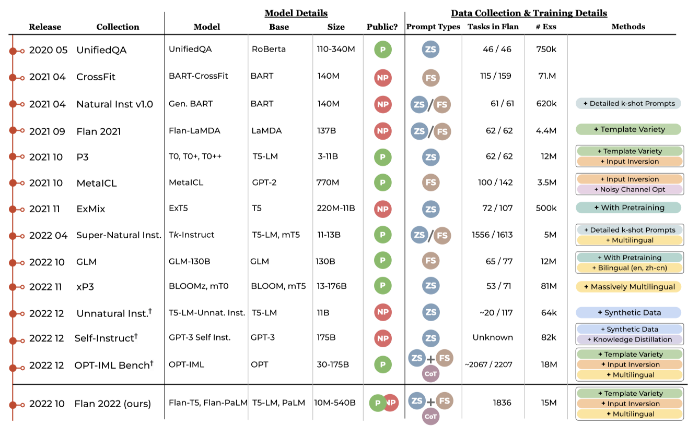
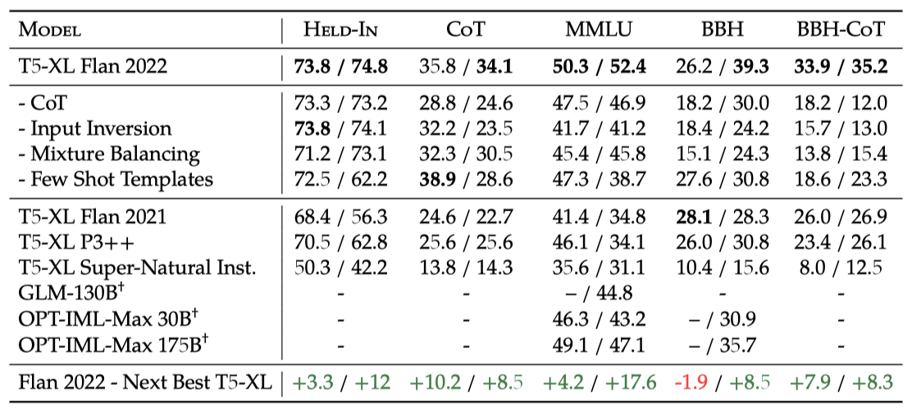
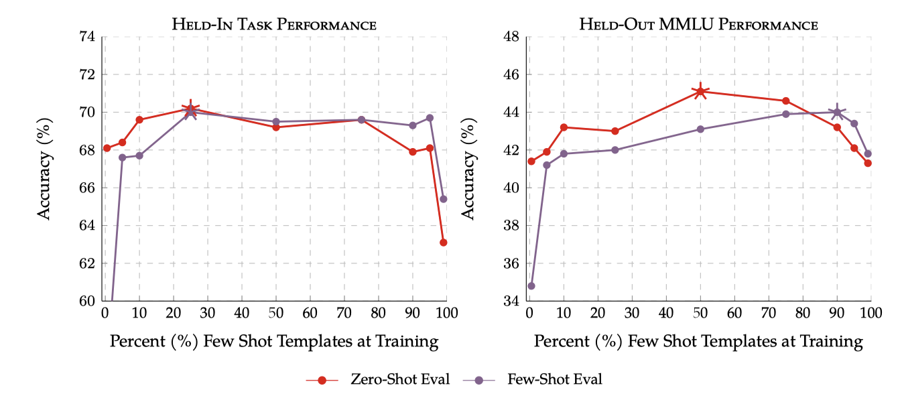
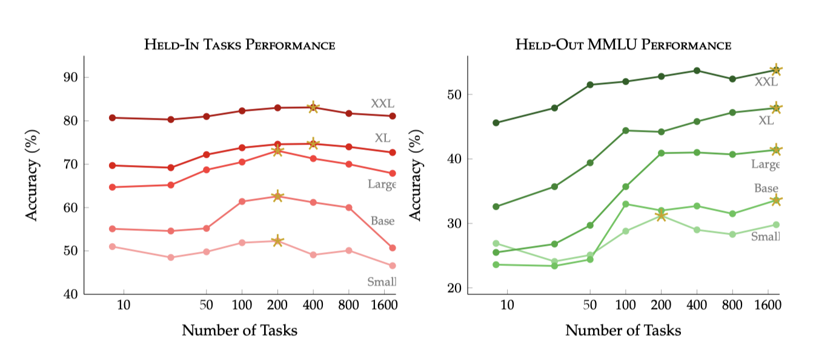
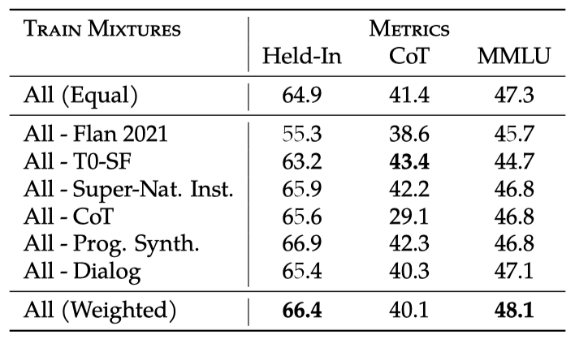
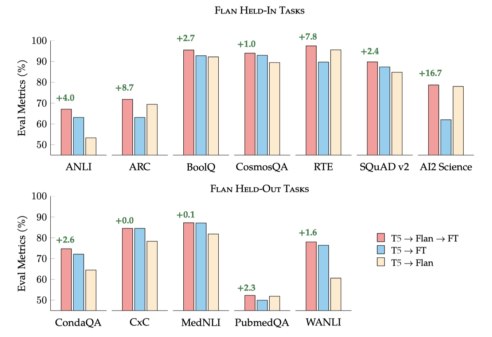

+++
author = "Kurt"
title = "Flan 2022 Collection"
date = "2024-03-07"
description = "Designing Data and Methods for Effective Instruction Tuning"
categories = [
    "Paper Review"
]
tags = [
    "NLP",
    "LLM",
]
+++

## Abstract

이 논문에서는 공개된 instruction tuning 방법의 설계를 연구하고, Flan 2022 모델의 개발을 분석한다. 특히, 작업 균형 및 풍부화 기법이 instruction tuning에 중요하며, 다양한 프롬프트 설정으로 학습하면 모든 설정에서 성능이 향상된다는 것을 발견하였다. 추가 실험에서는 Flan-T5 모델이 T5 모델보다 빠르게 수렴하며, 새로운 작업에 대한 더 효율적인 시작점이 될 수 있음을 보여준다. 마지막으로, instruction tuning 연구를 가속화하기 위해 Flan 2022 데이터셋, 템플릿, 방법들을 공개하였다.

---

## Introduction

PaLM, Chinchilla, ChatGPT 등의 대형 언어 모델은 지시문을 읽는 자연어 처리(NLP) 작업에 새로운 능력을 보여주었다. 이전의 연구에서는 instruction tuning 이라는 방법으로 언어 모델을 미세 조정함으로써, 지시문에 따라 보이지 않는 작업을 수행하는 능력이 강화될 수 있음을 입증하였다.

이 연구에서는 오픈 소스의 지시문 일반화 방법과 결과를 평가하고, 미세 조정 기법과 방법을 비교한다. 특히, "Flan 2022 Collection"에서의 방법론적 개선사항을 식별하고 평가하며, 이는 데이터 수집 및 증강, 지시문 튜닝을 위한 첫 번째 구현이다. 이 연구는 instruction tuning 방법의 세부사항에 초점을 맞추고, 개별 요소를 제거하며, 사전 학습된 모델 크기와 체크포인트를 유지하여 이전 연구와 직접 비교한다.

Flan 2022 Collection은 instruction tuning을 위한 가장 포괄적인 공개 작업 세트와 방법을 제공하며, 추가로 고품질 템플릿, 다양한 형식 패턴, 데이터 증강을 포함한다. 이 컬렉션에서 학습된 모델은 모든 테스트 평가 벤치마크에서 다른 공개 컬렉션을 능가한다. 이는 동일 크기의 모델에 대해 MMLU와 BIG-Bench Hard 평가 벤치마크에서 각각 4.2%, 8.5%의 성능 개선을 보여준다.

Flan 2022 방법의 성능은 더 크고 다양한 작업 세트와 간단한 미세 조정 및 데이터 증강 기법 덕분이다. zero-shot, few-shot, chain-of-thought 프롬프트로 템플릿화된 예시 혼합 학습은 모든 설정에서 성능을 향상시킨다. 10%의 few-shot 프롬프트 추가만으로도 zero-shot 결과가 2% 이상 개선되며, 작업 다양성을 풍부하게 하는 것과 작업 소스 균형이 성능에 결정적이다. 결과적으로, Flan-T5 모델은 더 빠르게 수렴하고 높은 성능을 보여, downstream 응용 프로그램에 더 효율적인 시작점을 제공한다.

이 연구의 결과와 자원을 공개함으로써, instruction tuning 관련 자원을 통합하고, 더 다목적인 언어 모델 연구를 촉진할 것으로 기대하고 있다. 이 연구의 주요 기여를 다음과 같이 요약할 수 있다:

* Methodological: zero-shot과 few-shot 프롬프트를 혼합하여 학습시키는 것이 두 설정에서 모두 훨씬 더 좋은 성능을 내는 것을 보여준다.
* Methodological: 효과적인 instruction tuning에 필요한 중요한 기을 측정하고 보여준다: 확장, 입력 반전을 통한 작업 다양성 풍부화, chain-of-thought 학습 데이터 추가, 그리고 다른 데이터 소스의 균형 조정.
* Results: 이러한 기술 선택이 기존의 오픈 소스 지시문 튜닝 컬렉션에 비해 3-17%의 Held-Out 작업 개선을 가져오는 것을 보여준다.
* Results: Flan-T5가 단일 작업 미세 조정에 대한 더 강력하고 계산 효율적인 시작 체크포인트 역할을 하는 것을 보여준다.
* 새로운 Flan 2022 작업 컬렉션, 템플릿, 그리고 공개 연구를 위한 방법을 오픈 소스화한다.

---

## Public Instruction Tuning Collections

**Large Language Models** instruction tuning은 대형 언어 모델을 대화와 기능적 작업에 더 유용하게 만드는 도구로 부상했다. 이전 연구들은 대규모 다작업 미세조정을 실험했지만 지시문 프롬프트는 사용하지 않았다. 반면에, UnifiedQA와 다른 연구들은 다양한 NLP 작업을 하나의 생성적 질문 응답 형식으로 통합하고, 이를 위해 다작업 미세조정과 평가에 프롬프트 지시문을 사용하였다.

**The First Wave** 2020년 이후 다양한 instruction tuning 작업 컬렉션이 출시되었다. 이들은 대규모 NLP 작업 컬렉션을 모아 지시문으로 템플릿화하여 모델이 보이지 않는 지시문에 일반화하도록 미세조정하는데 사용하였다. 또한, 다른 작업 컬렉션을 통합하여 모델이 작업을 컨텍스트 안에서 배우도록 학습시키는 연구도 있었다. 이들 모두 작업과 템플릿 다양성의 확장 이점을 확인하였고, 일부는 입력과 출력을 뒤집어 새 작업 생성에서 큰 이점을 보고하였다.

**The Second Wave** instruction tuning 컬렉션의 두 번째 단계에서는 Super-Natural Instructions, OPT-IML 등과 같이 더 많은 데이터셋과 작업을 통합하였고, xP3에서는 다국어 instruction tuning을, Flan 2022에서는 chain-of-thought 학습 프롬프트를 추가하였다. Flan 컬렉션과 OPT-IML은 이전 컬렉션의 대부분 작업을 포함하고 있다. 이 연구의 작업은 이러한 컬렉션들을 통합하며, 이것이 미래 오픈 소스 작업의 강력한 시작점으로 작용하게 된다.

**New Directions** 동시 및 미래의 연구는 작업 다양성을 더욱 적극적으로 확장하고, 특히 창의적이고 개방된 대화를 위한 합성 데이터 생성을 탐구하고 있다. 또한, 모델 응답에 대한 인간의 피드백 신호 제공도 탐구하고 있다. 이러한 새로운 방향들은 대부분 instruction tuning 방법의 기반에 추가될 것으로 보인다.

**Tuning with Human Feedback** 인간의 피드백에 대한 instruction tuning은 개방형 작업에서 강력한 결과를 보여주지만, 이는 전통적인 NLP 작업의 성능을 희생하는 대가였다. 이 연구는 인간의 피드백 없이 지시문 일반화에 집중하며, 이는 인간이 선호하는 개방형 작업 응답을 향상시키고 전통적인 NLP 지표를 개선하는 데 큰 가능성을 보인다. 비싼 인간 응답 데모나 평가 없이도 얼마나 많은 진전을 이룰 수 있는지는 여전히 미결된 문제이며, 이는 공개 연구와 비공개 연구 간의 격차를 줄이는 중요한 과제이다.

**The Importance of Open Source** GPT-3 등과 같은 고프로파일 연구가 점점 비공개 데이터에 의해 주도되고 있다. 이러한 자원의 접근 불가능성은 연구 커뮤니티가 이러한 방법을 공개 도메인에서 분석하고 개선하는 능력을 저해한다. 이 연구의 접근성을 민주화하는 목표에 의해 동기를 부여받아, 오픈 소스 및 접근 가능한 데이터 컬렉션에 대한 관찰 범위를 좁혔다.

---

## Flan 2022 Instruction Tuning Experiments

최근의 연구는 다양한 작업, 모델 크기, 대상 입력 형식을 다루면서도 통합된 기술 세트로 결집하지 못하고 있다. Flan 2022라는 새로운 컬렉션을 오픈 소스로 제공하며, 이는 Flan 2021, P3++ 3, Super-Natural Instructions 등과 몇 가지 추가 데이터셋을 통합한 것이다. 이 작업에서는 방법론적 개선 사항을 깊게 살펴보고, 동일한 모델 크기의 기존 컬렉션과 비교한다.

이 섹션에서는 Flan의 설계 결정 사항을 평가하고, instruction tuning에 큰 개선을 가져다주는 네 가지 주요 사항을 논의한다. 이들은 학습 시 혼합 zero-shot, few-shot, chain-of-thought 템플릿 사용, T5 크기의 모델을 1800+ 작업으로 확장, 작업을 풍부하게 만드는 입력 반전, 그리고 작업 조합의 균형을 맞추는 것이다. 이러한 각 요소의 가치를 측정하고, 최종 모델을 다른 instruction tuning 컬렉션과 비교한다.

**Experimental Setup** 일관성을 위해 모든 모델에 대해 T5-LM을 미세 조정하며, 이는 큰 규모의 체계적 애블레이션을 실행하면서도 일반적인 결론을 내리는 데 충분히 크다고 판단된 XL 크기를 사용한다. 학습 작업 컬렉션 내의 8개 작업, chain-of-thought 작업, 그리고 MMLU와 BBH 벤치마크를 평가한다. 이들은 Flan 2022의 미세 조정 부분에 포함되지 않는다. BBH는 PaLM이 인간 평가자보다 성능이 떨어지는 BIG-Bench의 23개 도전적인 작업을 포함한다. 

### Ablation Studies

각각의 방법을 제외함으로써 보유된 작업, 보유되지 않은 작업, chain-of-thought 작업에 대한 평균 기여도를 요약한다. 이 방법들은 mixture weight balancing, chain-of-thought 작업, 혼합 프롬프트 설정, 그리고 입력 반전을 포함한다. Flan-T5 XL은 이들을 모두 활용하며, 비교를 위해 다른 컬렉션에도 T5-XL-LM을 미세 조정한다.

Flan의 각 구성 요소는 다른 측정 항목에 개선을 가져온다: chain-of-thought 학습은 chain-of-thought 평가에, 입력 반전은 보유되지 않은 평가에, few-shot 프롬프트 학습은 few-shot 평가에, 그리고 mixture balancing은 모든 측정 항목에 기여한다.

alternative instruction tuning 컬렉션에 학습된 다른 모델들과 비교해보면, Flan은 거의 모든 설정에서 더 우수한 성능을 보인다. Flan-T5 XL은 zero-shot 또는 few-shot 프롬프트에 대해 튜닝되었으며, 이로 인해 zero-shot 설정에서 +3-10%, few-shot 설정에서 8-17%의 성능 향상을 보였다. 가장 인상적으로, Flan 2022는 OPT-IML-Max의 훨씬 큰 모델들을 능가하였다. 다음 단계에서는 Flan 2022의 각 개별 방법을 분리하여 그 이점을 검토할 예정이다.

### Training with Mixed Prompt Settings

이전 연구들은 각 작업에 따른 다양한 입력 템플릿 사용이 성능 향상에 도움이 된다는 것을 보여주었다. 하지만 대부분의 이전 언어 모델들은 템플릿의 표현방식과는 별개로, 특정 프롬프트 설정에 맞춘 템플릿 세트를 튜닝하는데 초점을 두었다. 이는 주로 zero-shot 프롬프팅이나 few-shot 프롬프팅에 대한 연구였다.

InstructGPT의 설계에서 간과된 부분은 각 프롬프트 설정에 대한 학습 템플릿을 혼합하는 것이었다. 그러나 이 선택의 효과를 검토하지 않아, zero-shot이나 few-shot 프롬프팅 성능의 미세조정에서 성능 저하를 예상하였다. 그런데 zero-shot과 few-shot 프롬프트를 혼합하여 학습하면 두 설정에서 모두 성능이 크게 향상되는 것을 발견하였다. 놀랍게도 이는 단 3B 개의 parameter를 가진 모델에서도 마찬가지였다.

few-shot 학습 템플릿을 5%만 추가하면 zero-shot 성능이 크게 향상되고, zero-sshot 데이터를 10% 이상 추가하면 few-shot 성능도 향상된다는 것을 보여준다. few-shot 데이터의 10-90% 범위에서 모든 작업이 최고 성능을 보이며, 이는 한 가지 프롬프트 설정만을 이용한 학습보다 일관되게 높다.

### Scaling Small Models to 1.8k+ Tasks

최근의 instruction tuning 작업들, 예를 들어 Flan 2022는 수천 개의 작업에서 학습하지만 다른 작업 구성과 학습 방법을 사용한다. Flan 2022 컬렉션의 모델 크기와 작업 확장의 영향을 평가하기 위해, 무작위로 선택된 작업 하위 집합에서 T5-LM 적응 모델을 미세조정 하였다. 모든 미세조정은 이미 본 작업에 대한 성능을 유지하는 모델의 능력에 작업 확장이 어떻게 영향을 미치는지 추정하기 위해 Held-In 작업을 포함한다.

수백 개의 미세조정 작업을 추가하면 Held-In 및 Held-Out 작업 모두에서 성능 향상이 이루어진다는 것을 보여준다. Held-In 작업의 성능은 총 200개 작업에서 정점을 찍고, 추가 작업이 늘어남에 따라 성능이 감소하지만, 큰 모델은 나중에 정점을 찍고 덜 감소한다. 반면, Held-Out 작업 성능은 작업 수가 증가함에 따라 log-linearly 하게 증가하며, 모든 작업을 사용했을 때 가장 높은 성능을 보인다.

놀랍게도 T5-Small만이 1836개 작업 전에 Held-Out 작업 성능을 초과하며, 큰 모델들은 계속해서 성능을 개선한다. 이는 T5-Base조차도 수천 개의 작업으로 용량을 다 사용하지 않았을 수 있으며, 큰 언어 모델들은 수천 개의 추가 작업을 통해 성능 향상을 볼 수 있음을 시사한다.

이 분석은 모든 작업이 동등하게 취급된다는 가정하에 이루어졌다. 하지만 모든 작업 출처가 학습에 동등하게 도움이 되지 않으며, 한 출처에서 너무 많은 작업이 주어지면 모델 성능이 포화 상태에 이를 수 있다는 것을 보여준다. 따라서 작업의 다양성과 품질에도 주의를 기울여야 1800개 이상의 작업 확장이 성능 향상으로 이어질 것이라는 결론을 내릴 수 있다.

### Task Enrichment with Input Inversion

이전의 instruction tuning 작업은 지도 학습 작업에서 입력-출력 쌍을 반전시키는 방법을 사용해 작업의 다양성을 높였다. 이 방법은 주어진 질문 x에 대한 답변 y를 생성하는 대신, 답변 y를 가지고 질문 x를 생성하도록 모델을 학습시키는 것이다. 이는 제한된 데이터 소스를 가진 상황에서 작업의 다양성을 늘리는 쉬운 방법이지만, 이미 수백 개의 데이터 소스와 수천 개의 작업이 가능한 상황에서 이 방법이 여전히 유용한지는 명확하지 않다.

입력을 반전시킨 작업을 추가하여 혼합물을 풍부하게 만들고 그 효과를 측정하였다. 결과적으로, 이 방법은 Held-In 성능에는 도움이 되지 않지만 Held-Out 성능에는 큰 이점을 가져다주었다. 이 결과는 모델이 사전 학습된 시간이 길어질수록 효과가 줄어드는 데이터 증강 기법에 대한 새로운 가능성을 제시한다.

### Balancing Data Sources

아키텍처 크기와 작업 수를 확장하는 것이 효과적이지만, 혼합물의 가중치 조정도 결과 최적화에 중요하다는 것을 이 연구가 제안하고 있다. 균형 잡힌 가중치를 찾기 위해, 여러 작업 소스 집합을 하나씩 제외하고 그들의 기여도를 MMLU 벤치마크에서 평가하였다.

Flan 2021과 T0-SF는 가장 유익한 혼합물로, 뒤이어 Super-Natural Instructions와 Chain-of-Thought가 있으며, Dialog와 Program Synthesis는 마지막에 위치한다. Iyer et al. (2022)의 연구에서 이러한 결과가 확인되었으며, 특히 Flan 2021, T0-SF, T5 혼합물이 가장 유익하다고 결정하였다. 그들은 또한 Super-Natural Instructions의 유익성이 제한적이며, Chain-of-thought 미세조정이 모든 평가 설정에서 유익하게 작용하는 것으로 나타났다.

이러한 연구 결과를 바탕으로 mixture weights search space 범위를 크게 줄였고, practitioner’s intuition을 활용하였다.

### Discussion

OPT-IML은 이 연구와 가장 비슷한 작업을 제시했지만, 그들의 작업 컬렉션은 공개되지 않아 비교가 어렵다. Iyer et al. (2022)은 Flan-T5-XL과 XXL이 OPT-IML-Max 175B를 능가한다고 보고하였다. 이런 차이는 사전 학습, 모델 아키텍처, instruction tuning 등의 조합에서 나올 수 있다. Flan 2022와 OPT-IML 사이에서 instruction tuning의 세부 사항들이 다를 수 있으며, 가능한 차이점으로는 예제 템플릿화, 학습 시 혼합된 입력 프롬프팅 절차 사용 방식, 작업 구성 등이 있다.

OPT-IML이 Flan 2022보다 더 많은 작업을 갖고 있지만, 약 94%의 작업이 Flan 2022에서도 사용되고 있다. 또한, 작업의 다양성에서 큰 차이는 없다고 볼 수 있다. 작업 혼합 비율은 Flan 2021, PromptSource/P3, Super-Natural Instructions 등의 비슷한 출처를 공유하며, OPT-IML의 다른 컬렉션들은 크게 가중치가 주어지지 않았다.

예제 템플릿화와 혼합된 프롬프트 형식이 OPTIML의 instruction tuning과 가장 큰 차이를 만들 것으로 생각한다. Flan 2021에서 업데이트된 템플릿 저장소는 명령어 및 다른 차원에서 다양성을 더했다. 템플릿화 절차는 명령어 배치, 프롬프트 사이의 간격, 다중 선택 예제의 답안 옵션 서식 등을 다르게 한다. 이 절차는 입력 다양성을 크게 늘리고 성능 향상을 반복적으로 보여주었다. 이 예제 템플릿화 절차는 검토와 미래 연구를 위해 공개되어 있다.

---

## Instruction Tuning Enhances Single-Task Finetuning

응용 분야에서는 특정 목표 작업에 대해 미세 조정된 NLP 모델이 배포되는데, 이전 연구에서는 중간 단계 미세 조정이나 다중 작업 미세 조정의 이점이 보여졌지만, 명령어 instruction tuning에 대한 연구는 아직 충분하지 않다.

Flan 2022의 instruction tuning을 단일 목표 미세 조정 전의 중간 단계로서 평가하였다. 이는 Flan-T5가 응용 전문가들에게 더 나은 시작점으로 적합한지를 알아보기 위한 것이다. 목표 작업에 대해 T5를 직접 미세 조정 하는 것, 추가 미세 조정 없이 Flan-T5를 사용하는 것, 그리고 Flan-T5를 목표 작업에 더 미세 조정하는 것, 이 세 가지 설정을 평가하였다.

**Pareto Improvements to Single Task Finetuning** 검토된 모든 작업에서, Flan-T5를 미세 조정하는 것은 T5를 직접 미세 조정하는 것보다 더 나은 결과를 제공한다. 특히, 미세 조정 데이터가 제한적인 작업에서는, 추가 미세 조정 없이 Flan-T5를 사용하는 것이 T5의 성능을 능가한다.

**Faster Convergence & Computational Benefits** Flan-T5를 시작점으로 사용하면 학습 효율성이 향상된다. Flan-T5는 단일 목표 미세 조정 중에 T5보다 빠르게 수렴하며 높은 정확도를 보여준다. 이는 FlanT5 같은 명령어 instruction tuning이 단일 작업 미세 조정의 새로운 표준 시작점으로 채택되면, 다양한 작업에서 미세 조정 단계를 크게 줄일 수 있는 유망한 방법이라는 것을 보여준다. instruction tuning은 단일 작업 미세 조정 보다 비용이 많이 들지만, 이는 일회성 비용이다.

---

## Related Work

**Large Language Models** instruction tuning의 기초는 여러 하위 작업에 유용한 일반적인 언어 표현을 사전 학습하는 것으로, 이는 오래된 전통을 가지고 있다. 2018년에는 대규모 비지도 학습 코퍼스에서 대규모 모델을 사전 학습하는 방식이 확립되었고, 이로 인해 NLP 분야는 이러한 모델을 사용하여 모든 작업에서 사전 학습되지 않은 작업 특화 모델의 성능을 크게 능가하는 방향으로 발전하였다. 하지만, 사전 학습된 모델에 인코딩된 고품질의 지식에 접근하는 주된 방법은 추가적인 작업 특화 계층을 학습하는 것이었다. 그 후, Radford et al. 과 Raffel et al. 은 하위 작업들을 사전 학습된 LM head를 사용하여 자연어로 답변을 생성하는 방식으로 공동으로 학습할 수 있다는 개념을 널리 알렸고, 이는 다중 작업 전이 학습 연구의 선구자가 되어 instruction tuning의 첫 번째 파도를 이끌었다.

언어 모델의 사전 학습 코퍼스, 아키텍처, 그리고 학습 목표에 대한 연구의 지속적인 발전은 instruction tuning에 큰 영향을 미친다. 2022년 현재, decoder-only left-to-right causal Transformer가 대형 모델 시장을 지배하고 있다. 이들 모델은 더 나은 하드웨어와 소프트웨어 지원 덕분에 decoder만 사용하는 것으로 결정되었다. 그러나, 일관되게 left-to-right causal 언어 모델링은 최적의 목표가 아니며, 비순차적 목표의 혼합이 zero-shot과 few-shot 프롬팅을 가진 하위 작업에 훨씬 우수하다는 것이 발견되었다. 또한, 사전 학습 코퍼스, instruction tuning, 그리고 하위 능력 간의 관계는 아직 충분히 탐구되지 않은 상태이다. 일반적으로, 공개 모델들은 C4, The Pile, ROOTs 등의 공개 코퍼스에서 학습받는다.

**Instruction Tuning** instruction tuning의 주요 발전 중 하나는 few-shot 인컨텍스트 학습을 보완하거나 대체할 수 있는 parameter-efficient tuning이다. 이는 대형 모델의 표준 미세 조정에 필요한 많은 가속기와 비싼 비용을 줄일 수 있다. parameter-efficient tuning은 모델 parameter의 일부만 업데이트해도 모든 parameter를 튜닝하는 것과 비슷한 성능을 얻을 수 있음을 보여준다. 특히, few-shot ICL의 긴 시퀀스 길이와 반복적인 추론 때문에, parameter-efficient tuning은 인컨텍스트 학습보다 계산적으로 더 저렴하고 성능이 더 높을 수 있다. 또한, 단일 작업 및 다중 작업 parameter-efficient tuning은 instruction tuning과 결합될 수 있으며, 이는 연구자들이 일반 도메인의 instruction tuning 모델을 기반으로 사용자 지정 instruction tuning 혼합을 수집하는 것을 쉽게 만든다.

**Problems Addressed by Instruction Tuning & Alignment Techniques** instruction tuning은 언어 모델을 더 유용한 목표와 인간의 선호도에 맞추는 작업의 일부이다. 이 없이는 언어 모델이 악성 행동을 보이거나 비사실적인 정보를 생성하는 등의 문제가 있다. 이러한 문제를 분석하고 완화하는 것은 미래 연구의 유망한 방향이다. instruction tuning은 이미 NLP 편향 지표를 줄이는 데 효과적인 해결책으로 입증되었으므로, 더 많은 조사가 필요하다.

---

## Conclusions

새로운 Flan 2022 instruction tuning 컬렉션은 이전 공개 컬렉션과 방법을 통합하고, 새로운 템플릿과 혼합된 프롬프트 설정을 도입하여 향상된 성능을 보인다. 이 컬렉션은 다양한 작업에서 이전 모델들을 큰 차이로 능가하며, 새로운 지시사항에 일반화하거나, 새로운 작업에 미세 조정하는 연구자와 실무자들에게 더 경쟁력 있는 출발점을 제공한다.

---

## Reference

* [Paper](https://arxiv.org/pdf/2301.13688.pdf)
