+++
author = "Kurt"
title = "UL2"
date = "2024-02-02"
description = "Unifying Language Learning Paradigms"
categories = [
    "Paper Review"
]
tags = [
    "NLP",
    "LLM",
]
+++

## Abstract

이 논문에서는 데이터셋과 설정에 걸쳐 보편적으로 효과적인 사전 학습 모델에 대한 통합 프레임워크를 제시한다. 아키텍처 원형과 사전 학습 목표를 분리하고, 다양한 사전 학습 목표가 어떻게 변환될 수 있는지를 보여준다. 또한, 다양한 사전 학습 패러다임을 함께 결합하는 Mixture-of-Denoisers (MoD)를 제안하고, downstream 미세 조정이 특정 사전 학습 체계와 연관되는 모드 전환 개념을 도입한다. 이 방법으로, 이 모델은 다양한 NLP 작업에서 최고의 성능을 달성하였으며, 특히 in-context 학습에서 강력한 결과를 보였다.

---

## Introduction

NLP 연구자나 실무자들은 다양한 사전 학습된 모델 중에서 선택할 수 있습니다. 그러나 어떤 모델을 사용할지는 "상황"과 "작업 종류"에 따라 결정된다.

이에 대한 답변은 "encoder-only or encoder-decoder?", "span corruption or language model?" 등의 디테일한 후속 질문을 수반하며, 결과적으로는 목표로 하는 downstream task에 따라 항상 달라진다. 이 논문은 왜 사전 학습된 언어 모델의 선택이 downstream task에 따라 달라져야 하는지, 그리고 어떻게 다양한 작업에서 보편적으로 잘 작동하는 모델을 사전 학습할 수 있는지에 대해 질문하고 재고한다.

이 논문은 언어 모델을 보편적으로 적용 가능하게 하는 방안을 제시한다. 다양한 작업과 설정에서 효과적인 "Unifying Language Learning Paradigms" 즉, UL2라는 프레임워크를 소개하며, 이는 다른 모델들이 종종 타협해야 하는 반면, UL2는 일관되게 잘 수행될 수 있음을 보여준다.

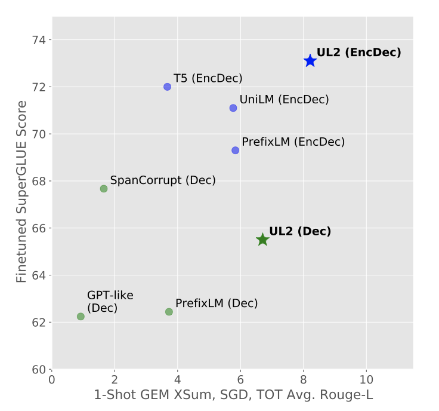

보편적 모델의 장점은 자원을 여러 모델에 분산시키는 대신, 단일 모델의 개선과 확장에 집중할 수 있다는 것이다. 특히, 자원이 제한된 환경에서는 다양한 작업에 잘 적응할 수 있는 하나의 사전 학습된 모델을 가지는 것이 더 바람직하다.

UL2의 핵심은 새롭게 제안된 Mixture-of-Denoisers (MoD)라는 사전 학습 목표로, 이를 통해 여러 작업에서 강력한 성능을 보인다. MoD는 기존의 denoising 목표와 새롭게 도입된 X-denoising, S-denoising, R-denoising를 혼합한 것으로, 이는 개념적으로 단순하지만 다양한 작업에 매우 효과적이다.

이 논문의 방법은 모델이 조건화된 컨텍스트의 유형이 다른 사전 학습 목표들을 활용한다. 예로, span corruption 목표는 prefix 언어 모델링의 여러 영역을 활성화하는데, 여기서 prefix는 손상되지 않은 토큰의 연속된 구간을 의미하며, 목표는 모든 prefix에 접근이 가능하다. 스팬이 전체 시퀀스 길이에 근접하는 설정은 장거리 컨텍스트에 기반한 언어 모델링과 유사하다. 따라서, 이러한 다른 패러다임들을 부드럽게 연결하는 사전 학습 목표를 설계할 수 있다.

각 denoiser가 다른 방식으로 어렵다는 것은 명확하며, extrapolation 또는 interpolation의 성격에서도 차이가 있다. 예를 들어, span corruption을 통해 모델을 양방향 컨텍스트로 제한하면 작업이 쉬워지고 완성에 가깝게 된다. 반면, PrefixLM/LM 목표는 더 "open ended"이다. 이러한 행동은 다양한 denoising 목표의 cross entropy loss를 모니터링하여 쉽게 관찰할 수 있다.

MoD 공식을 통해, 모델이 사전 학습 중 다른 denoiser를 구별하고, downstream task를 학습할 때 적응적으로 모드를 전환하는 것이 유익하다는 추측을 제시하였다. 이를 위해 "mode switching" 라는 새로운 개념을 도입해, 사전 학습 작업에 특정 센티널 토큰을 연결하고 dynamic mode switching을 가능하게 하였다. 이를 통해 모델은 사전 훈련 후 필요에 따라 R, S, X denoiser 사이의 모드를 전환할 수 있다.

아키텍처를 self-supervision scheme에서 분리하였으며, 사전 학습된 모델이 그 기반 아키텍처에 의해 크게 특징지어진다는 일반적인 오해와 달리, denoiser의 선택이 더 큰 영향을 미친다는 것을 발견하였다. MoD는 어떤 기반체도 지원하며, UL2는 아키텍처에 중립적이다. 기본적으로, 기반 아키텍처의 선택은 다른 효율성 지표 간의 타협이라고 볼 수 있다.

9가지 다양한 작업에 대한 실험을 수행했고, 결과로서 UL2는 모든 설정에서 T5와 GPT와 같은 기준을 능가하는 것을 확인하였다. 평균적으로 UL2는 T5를 43.6%, 언어 모델을 76.1% 능가하였으며, 모든 작업에서 UL2만이 T5와 GPT와 같은 모델을 능가하였다.

UL2를 대략 20B 개의 parameter로 확장하여 50개가 넘는 다양한 NLP 작업에 대한 실험을 수행하였다. 이 작업들은 언어 생성, 언어 이해, 텍스트 분류, 질문 응답, 상식 추론, 긴 텍스트 추론, 구조화된 지식 구축 및 정보 검색 등을 포함한다. 이러한 실험 결과, UL2는 대부분의 작업과 설정에서 state-of-the-art를 달성하였다.

UL2로 수행한 zero/few-shot 실험에서 UL2가 zero-shot SuperGLUE에서 GPT-3 175B를 능가하였다. 최신의 state-of-the-art의 모델과 비교했을 때, UL2는 C4 코퍼스에서만 학습되었음에도 compute-matched 설정에서 경쟁력을 유지하였다. 또한, zero-shot과 미세조정 성능 사이의 타협을 탐색한 결과, UL2가 두 학습 패러다임에 대해 pareto-efficient를 확인하였다. one-shot 요약에서, UL2는 LM 맞춤형 T5 XXL 모델의 성능을 세 배로 늘렸고, 같은 계산 비용에서 PaLM과 LaMDA와 경쟁하거나 능가하였다. 이에 따라, 학습된 UL2 모델의 T5X 기반 Flax 체크포인트를 공개하였다.

---

## Background: Pre-trained Language Models

사전 학습된 언어 모델, 사전 학습 목표, 그리고 다른 통합 사전 학습 제안에 대한 배경에 대해 논의한다.

### Pre-trained Language Models

언어에 대한 사전 학습된 표현을 학습하는 것은 현대 NLP 연구의 핵심 부분이다. 첫 Transformer인 GPT는 causal 언어 모델로 학습되었고, BERT는 많은 downstream task에 대한 bidirectional 모델링의 중요성을 보여주었다. BERT는 masked language modeling(MLM)을 소개했고, XLNet은 학습 중에 마스크된 토큰 간의 종속성을 고려하기 위한 permutation 언어 모델링을 도입하였다. 그 후에도 여러 논문들이 사전 학습 과정에 대한 추가적인 개선을 제안하였다.

T5와 같은 two-stack encoder-decoder 구조는 분류와 sequence-to-sequence 작업에서의 성능 향상으로 인기를 얻었다. 그러나 이러한 모델들은 오픈 텍스트 생성과 프롬프트 기반 추론에서 제한된 성능을 보여, 다른 목표로 학습된 decoder-only 모델이 필요하게 되었다. 이 작업에서는 두 구조 모두에게 적합한 일반적인 학습 패러다임을 통해 이들 사이의 성능 격차를 줄이려고 한다.

**Decoder-only vs Encoder-only** decoder-only와 encoder-only 아키텍처는 모두 다음 토큰을 예측하는 autoregressive 모델이다. 하지만 이들은 BERT 스타일의 encoder-only 모델이 인기를 얻은 position-wise masked LM denoising(autoencoding)과는 다르며, 이러한 autoencoding 모델은 생성 능력이 제한적이라는 단점이 있다. downstream task를 위해 task specific classification head를 사용하는 것이 번거롭기 때문에, 이러한 모델의 사용은 권장하지 않는다. 그러나 예외적으로 regression이나 효율성 향상을 위해 task specific head를 사용할 수 있다. 이를 고려하면, encoder-decoder에서 시작하여 필요에 따라 decoder를 제거하는 것이 바람직하며, 결국 decoder-only과 encoder-decoder 아키텍처 사이에서 선택해야 한다.

**Decoder-only vs Encoder-Decoder** decoder-only 모델과 encoder-decoder 모델의 차이는 미미하며, PrefixLM 모델은 사실상 공유 parameter를 가진 encoder-decoder 모델이다. encoder-decoder 모델은 입력과 대상을 독립적으로 처리하며, decoder-only 모델은 이들을 연결해 처리한다. 이 둘의 inductive bias는 상당히 유사하지만, encoder-decoder 모델은 일반적으로 decoder-only 모델의 약 2배의 parameter를 가진다. 이는 encoder-decoder 모델이 입력 토큰과 대상 토큰을 연결하는 교차 주의 구성 요소를 가지고 있기 때문이다.

**Sparse Models** 최근에는 Switch Transformer, GLaM, GShard 등의 sparse 전문가 혼합 모델과 같은 sparse 사전학습 모델이 state-of-the-art를 달성하는 추세이다. 이러한 sparse 모델은 사전학습 목표 주제와는 별개로 밀집 모델과 비교해 flop-per-parameter가 매우 다르며, 이는 encoder-decoder 모델 대 decoder-only 모델 논의에서 주요한 이슈이다.

### Pre-training Objectives for Large Language Models

최근의 연구는 대규모 감독 멀티태스크 사전학습의 가능성을 보여주지만, 대부분의 사전학습 목표는 비지도 데이터에 의존하고 있다. decoder-only 모델은 주로 causal 언어 모델 목표로 학습되며, encoder-decoder 모델에는 범위 손상이 효과적인 목표로 탐색되었다. 다양한 아키텍처와 사전학습 목표의 조합이 zero-shot 일반화에 어떤 영향을 미치는지에 대한 체계적인 연구가 이루어졌다. 또한, 특정 denoising 방법의 이점은 여전히 불명확하며, 사전학습은 일반적으로 subword 수준에서 적용되지만, 문자나 바이트 수준에서도 적용된 사례가 있다. 이 경우, 손상된 범위는 subword 기반 denoising보다 훨씬 크다.

### Unified Pre-training Proposals

UniLM은 single transformer 모델을 사용하여 여러 언어 모델링 목표에 대해 학습하는 방식을 제안하였다. 이는 BERT와 prefix-LM 모델을 결합하는 방식과 유사하며, explicit mask token을 추가하는 클로즈 타입의 공식을 사용한다. 최근에는 주제 통합 추세가 있어, 상식 추론, 질문 응답, 문제 해결, 구조화된 지식 그라운딩 등의 공통 작업을 하나의 모델로 통합하는 연구가 진행되고 있다.

---

## Unifying Language Learning Paradigms (UL2)

UL2 프레임워크와 제안된 사전 학습 목표에 대해 설명한다.

### Pre-training

제안된 사전 학습 목표에 대해 논의한다.

#### Unified Perspective for Pre-training Tasks

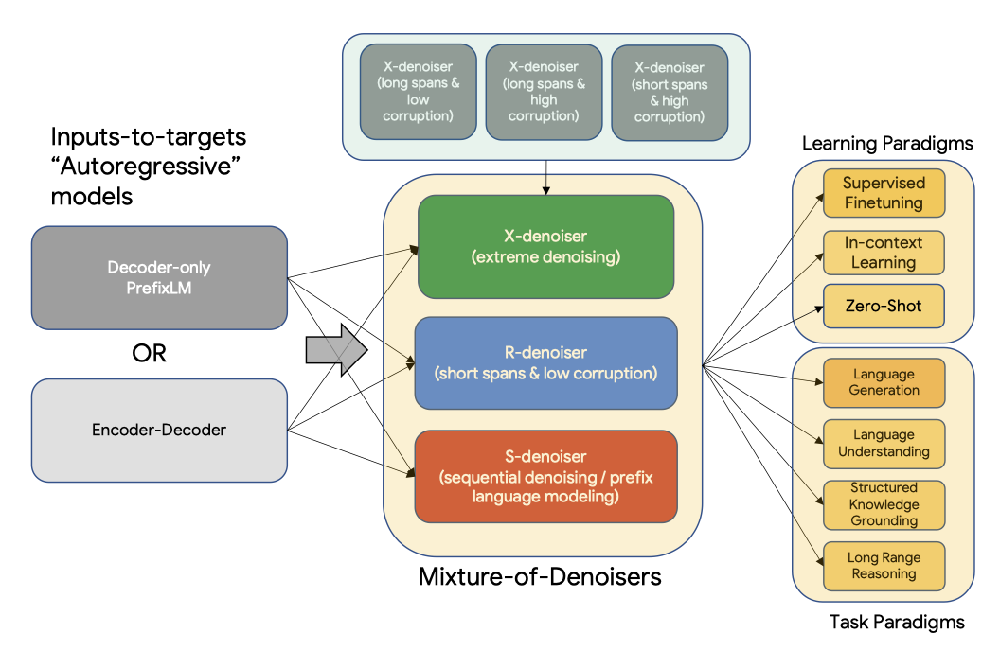

많은 사전 학습 작업은 "input-to-target" 형태로 구성되며, 모델은 주어진 맥락(입력)을 바탕으로 예상 출력(대상)을 생성하다. 언어 모델은 이전 시점의 모든 토큰을 입력으로 사용해 다음 토큰을 예측하며, span corruption에서는 손상되지 않은 토큰을 사용해 손상된 범위를 예측한다. Prefix-LM은 양방향 입력 처리를 통해 더 많은 모델링 능력을 제공한다.

사전 학습 목표는 서로 간소화될 수 있다. 예를 들어, span corruption 목표에서 전체 시퀀스가 손상된 범위(대상)인 경우, 문제는 실질적으로 언어 모델링 문제가 된다. 큰 범위를 설정하여 span corruption을 사용하면, 지역적 영역에서 언어 모델링 목표를 효과적으로 모방할 수 있다.

이 논문에서는 denoising 작업의 모든 종류를 포함하는 표기법을 정의한다. denoising 작업의 입력과 목표는 평균 범위 길이($µ$), 손상률($r$), 손상 범위 수($n$) 세 가지 값으로 parameterized "span corruption" 함수를 통해 생성된다. 입력 텍스트가 주어지면, 이 함수는 µ의 평균을 가진 분포에서 추출된 범위에 손상을 가하고, 이 손상된 범위는 복구 대상으로 사용된다.

이 공식을 사용하여 causal 언어 모델링과 유사한 목표를 설정하려면, 시퀀스 길이와 동일한 범위 길이를 가진 단일 범위$(µ = L, r = 1.0, n = 1)$를 설정하면 된다. Prefix LM 목표와 유사하게 설정하려면, prefix의 길이인 P를 사용하여 $(µ = L − P, r = 1.0 − P/L, n = 1)$을 설정하고, 단일 손상 범위가 항상 시퀀스의 끝에 도달하도록 제약을 둔다.

inputs-to-targets 공식은 encoder-decoder 모델과 single-stack transformer 모델에 모두 적용 가능하다. 이 논문에서는 다음 대상 토큰을 예측하는 모델을 선택하는데, 이는 더 일반적이며 더 많은 작업을 수용할 수 있기 때문이다. 이 방법은 특수한 "CLS" 토큰과 task-specific projection head 사용을 배제한다.

#### Mixture of Denoisers

강력한 보편적 모델은 사전 학습 과정에서 다양한 문제 해결에 노출되어야 하며, 이러한 다양성은 모델의 목표에 반영되어야 한다고 주장한다. 그렇지 않으면 모델은 장문의 일관된 텍스트 생성 등의 능력이 부족해질 수 있다.

현재의 목표 함수 클래스와 함께, 사전 학습 동안 사용되는 세 가지 주요 패러다임을 정의한다:

* **R-Denoiser** regular denoising은 2에서 5 토큰 범위의 standard span corruption을 사용하며, 이는 약 15%의 입력 토큰을 마스킹한다. 이 짧은 범위는 유창한 텍스트 생성보다는 지식 획득에 유용할 수 있다.
* **S-Denoiser** inputs-to-target 작업을 구성할 때 엄격한 순차적 순서를 따르는 prefix 언어 모델링은 denoising의 특정 케이스이다. 입력 시퀀스를 두 개의 서브 시퀀스, 즉 문맥과 대상으로 분할하며, 대상은 미래 정보에 의존하지 않는다. 이 방식은 문맥 토큰보다 이전 위치에 대상 토큰이 있을 수 있는 표준 span corruption과는 다르다. 또한, 매우 짧은 메모리나 없는 S-Denoising은 standard causal 언어 모델링과 유사하다.
* **X-Denoiser** X-denoising은 입력의 작은 부분을 통해 큰 부분을 복구해야 하는 극단적인 denoising이다. 이 방법은 제한된 정보를 가진 메모리에서 긴 대상을 생성하는 상황을 모방한다. 이를 위해, 입력 시퀀스의 약 50%가 마스킹되는 공격적인 denoising 예제를 포함한다. 이것은 범위 길이나 손상률을 늘림으로써 달성된다. X-denoising은 일반 span corruption과 언어 모델 목표 사이의 중간점을 찾는 것에 동기를 두고 있다.

이 denoiser 집합은 이전에 사용된 목표 함수와 밀접한 연관이 있다. R-Denoising은 T5 span corruption 목표와, S-Denoising은 GPT와 유사한 인과적 언어 모델과 연결되어 있으며, X-Denoising은 T5와 causal LMs의 목표 조합에 모델을 노출한다. X-denoisers는 더 많은 토큰을 예측학습하므로 샘플 효율성을 향상시킨다. 이 모든 작업을 균일하게 혼합하여 hybrid self-supervised 목표를 제안하며, 최종적으로 7개의 denoiser가 혼합된다.

X- 및 R-Denoisers는 평균이 $µ$인 normal distribution에서 범위 길이를 샘플링한다. S-Denoisers는 uniform distribution을 사용하고, 손상된 범위의 수를 1로 고정하며, 손상된 부분 다음에는 잘린 토큰이 없어야 한다. 이는 대략적으로 seq2seq denoising 또는 Prefix LM 사전 학습 목표와 같다.

LM은 Prefix-LM의 특별한 경우로, mixture에 causal LM 작업을 포함할 필요가 없다고 판단하였다. 모든 작업은 mixture에서 대략적으로 동일하게 참여하며, S-denoisers의 비율을 mixture 내 denoiser 중 최대 50%까지 늘리는 대안을 탐색하였다.

Mixture-of-Denoisers의 강력함은 그것의 혼합에서 비롯된다. 단독으로는 일부 denoiser 유형이 잘 작동하지 않는데, 예를 들어, 원래의 T5 논문에서는 50%의 손상률(X-denoising)을 가진 옵션이 잘 작동하지 않았다.

#### Mode Switching

모델이 주어진 작업에 더 적합하게 작동하도록 모드를 전환하는 패러다임 토큰을 사용하는 모드 스위칭 개념을 도입하였다. 미세 조정과 downstream task을 위해, 모델이 더 나은 해결책을 학습하도록 유도하기 위해 패러다임 토큰을 추가합니다. 이 모드 스위칭은 실제로 downstream task의 행동을 upstream 학습 동안 사용한 특정 모드에 연결시킨다.

## Model Architecture

UL2는 아키텍처에 중립적인 접근 방식을 취하며, encoder-decoder와 decoder-only의 선택은 효율성의 타협이라고 주장한다. 따라서 UL2는 decoder와와 encoder-decoder 모두를 포함하고 있다. UL2는 표준 T5 transformer를 강화하여 GLU 레이어와 T5 스타일의 상대적 주의를 적용하였고, 아키텍처 변경과 사전 학습 기여를 혼동하지 않기 위해 모델의 기본 구조는 T5와 유사하게 유지하였다.

---

## Ablative Experiments

ablative experimental 설정(예: 기준선, 데이터셋, 구현 세부 사항)과 결과에 대해 설명한다. 전반적인 연구 결과는 UL2가 9개의 작업 중 9개에서 T5-유형 및 GPT-유형 모델을 능가한다는 것을 보여준다.

### Baselines

다음의 사전 학습 기준선과 비교한다:

* **Causal Language Model (CLM)** 이것은 GPT와 같은 대다수의 표준 사전 학습 모델에서 사용되는 표준 left-to-right auto-regressive 언어 모델 사전 학습이다. 이 모델을 GPT-유형이라고 부른다.
* **Prefix LM (PLM)** 이것은 M이 bidirectional receptive field를 가진 causal LM의 약간의 변형으로, 이 논문에서는 M의 길이를 균일하게 샘플링하고 auto-regressive 목표에서만 손실을 계산한다.
* **Span Corruption (SC)** 이것은 T5에서 제안된 standard denoising 목표로, 특정 텍스트 부분을 지우고 센티넬 토큰으로 대체한 후, 이를 목표로 복사하고 모델에 의해 자동으로 생성하는 아이디어이다. 이 논문에서는 평균 범위 3과 denoising 비율 15%를 사용한다.
* **Span Corruption + LM (SCLM)** CLM과 Span Corruption을 동일한 비율로 혼합하여 학습한다. 이 목표의 SC 구성 요소에 대해 SC에 대한 동일한 hyper-parameter를 사용한다.
* **UniLM (ULM)** 이것은 causal 언어 모델링, Prefix LM, bidirectional i.i.d denoising을 혼합한 Dong et al. (2019)의 목표이다. UniLM을 cloze 스타일 또는 BERT 스타일로 학습하는 대신, 마스크된 토큰을 생성하여 decoder-only 아키텍처와 encoder-decoder 아키텍처 모두에 적용할 수 있고, 미세 조정을 위한 task-specific linear head의 필요성을 제거한다.

모든 목표를 위해 단일 스택과 encoder-decoder 아키텍처를 모두 고려하며, 모든 아키텍처는 encoder-decoder 또는 decoder-only 모델로 구현된다. BERT 스타일의 사전 학습은 효과적으로 이 스타일의 학습에 통합되었다고 보여진다. Taskspecific classification head는 유니버설 모델 원칙에 위배되며 번거로우므로 권장되지 않는다.

### Experimental Setup

다양한 지도 학습과 프롬프트 기반 few-shot 학습 작업에 대해 실험을 진행한다.

#### Datasets and Tasks

8개의 NLU 부작업을 포함한 SuperGLUE와 언어 생성에 초점을 맞춘 GEM 벤치마크의 일부 데이터셋을 사용해 실험을 진행한다. 이러한 모든 작업은 지도 미세 조정과 프롬프트 기반 one-shot 학습에서 평가되며, 모델들의 일반적인 텍스트 생성 능력도 C4 검증 세트에 대한 perplexity 점수로 비교한다. 이러한 접근법은 다양한 연구 설정에 대한 충분한 커버리지를 제공한다고 믿는다.

#### Metrics and Holistic Evaluation

SuperGLUE와 GEM 벤치마크에 대한 실험 결과를 각각의 적절한 지표로 보고하며, 언어 모델링의 경우 negative log perplexity를 보고한다. 모델의 범용성, 즉 다양한 작업에서의 성능은 주요 평가 기준이다. 이를 위해 기준에 대한 정규화된 상대적 이득을 종합 지표로 사용하며, 이를 통해 새 모델이 표준 모델(GPT나 T5 같은)보다 얼마나 더 나은지 쉽게 이해할 수 있다. 이 지표는 정규화되어 벤치마크 lottery effect에 취약해지는 것을 방지한다.

#### Implementation Details

실험은 JAX/Flax와 T5X4 프레임워크, Flaxformer를 통해 진행되며, C4 코퍼스를 사용해 모든 모델을 500K step 동안 사전 학습한다. 이 과정은 64~128개의 TPUv4 칩을 사용하며, Adafactor optimizer를 통해 모델을 최적화한다. 다양한 아키텍처의 트레이드오프를 이해하기 위해, decoder-only 아키텍처와 encoder-decoder 아키텍처를 모두 사용하며, 이들 모델의 주요 실험 결과를 보고한다. 모든 모델은 standard transformer를 사용하며, decoder-only 모델은 입력에서 bidirectional receptive field를, 타겟에서는 autoregressive decoding을 사용한다. 이것은 본질적으로 PrefixLM 유형 아키텍처로, full causal decoder 모델보다 더 나은 것으로 확인되었다.

### Overview of Ablative Experimental Results

모든 벤치마크 작업과 데이터셋에 대한 원래 결과, T5와 GPT 모델과 같은 잘 정립된 기준선에 대한 상대적인 비교를 보고한다.

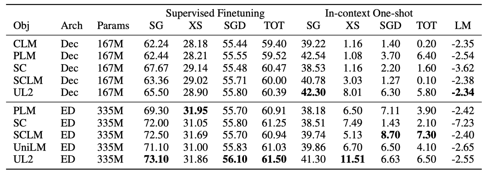

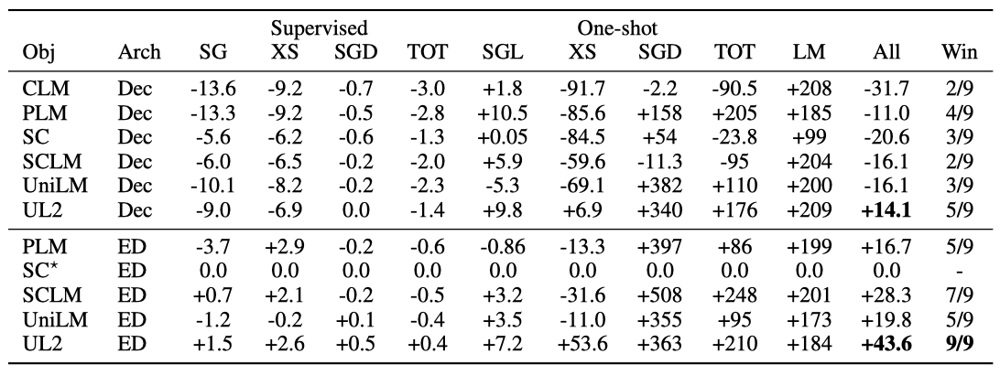

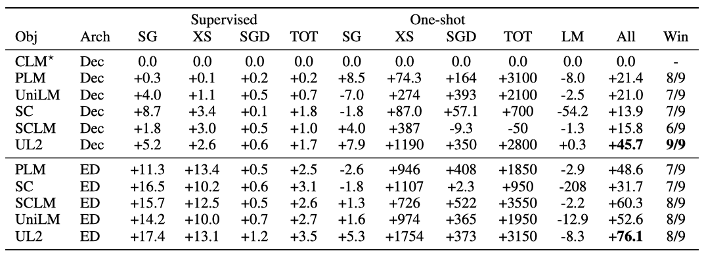

#### Decoder Vs Encoder-Decoder

decoder-only 모델과 encoder-decoder 모델은 계산력이나 parameter의 측면에서 비교될 수 있다. 결과적으로, encoder-decoder 모델은 decoder-only에 비해 약 2배의 parameter를 가지지만 처리 속도는 비슷하다.

모델의 희소성을 고려하면 encoder-decoder가 약간 우대될 수 있다. 결과를 보면, T5를 기준으로 할 때, UL2 decoder를 제외하고는 사전 학습된 decoder 모델이 T5를 능가하지 못하며, 전체 성능은 10%~30% 저하된다. 가장 좋은 decoder 모델은 Prefix-LM로, T5보다 약 10% 낮습니다. 이 결과로 보아, 저장 공간 문제가 없다면 encoder-decoder 모델이 decoder-only 모델보다 우선적으로 고려되어야 한다.

parameter 제약이 있는 경우, Prefix-LM decoder가 적합한 대체품이 될 수 있다. 또한, UL2 decoder가 T5 encoder-decoder 설정을 +14.6% 능가하는 것은 흥미로운 점이지만, 이는 UL2 encoder-decoder를 능가하지는 못한다. 이로서 self-supervision 목표가 기본 구조보다 본질적으로 중요하며, 구조적 선택은 주로 효율성의 타협을 독립적으로 연구하는 것이라는 점을 강조한다.

#### Is GPT and/or T5 the optimal setup?

GPT와 같은 설정과 T5와 같은 설정을 비교하는 결과에 따르면, causal LM 설정(GPT와 유사)이 가장 성능이 떨어지며, 가능한 경우 항상 Prefix-LM 또는 UniLM으로 학습하는 것이 좋다. Prefix-LM 사전 학습은 T5 범위 손상 설정을 +16.7% 능가하며, Prefix-LM encoder-decoder 모델은 특정 작업에서는 약간의 성능 저하를 보이지만 다른 작업에서는 크게 향상된다. 따라서 Prefix-LM과 T5 중 어느 것이 보편적으로 우수한 모델인지는 분명하지 않는다.

#### On the Performance of UniLM and SCLM

encoder-decoder 설정에서 UniLM과 SCLM 목표는 표준 범위 손상 목표보다 전반적으로 더 좋은 성능을 보여, 사전 학습 목표를 혼합하는 것이 유용함을 보여준다. decoder 설정에서는 UniLM이 +9.4%, SCLM이 +16.1%의 성능 향상을 보여주었다. UniLM과 SCLM은 9개 작업 중 6개에서 T5를 능가하였으며, SCLM이 one-shot 생성에서 가장 뛰어난 성능을 보여주었다.

#### On the Performance of the Proposed UL2

UL2는 GPT와 같은 모델과 T5와 같은 모델에 비해 가장 뛰어난 성능을 보이며, T5에 비해 +43.4%, GPT와 같은 모델에 비해 +76.2%의 성능 향상을 보인다. 9개의 고려된 모든 작업에서 UL2는 T5를 능가한다. UL2는 항상 모든 작업에서 가장 높은 성능을 보이지는 않지만, 일관성이 있으며, 특정 작업에서 다른 방법에게 손실을 보여도 이는 상대적으로 미미하다. 반대로, UL2가 T5를 능가할 때, 이익은 매우 크며, 이런 일관된 개선으로 인해 UL2는 T5와 GPT와 같은 모델의 대체품으로 사용될 수 있다.

### Mode Switching Ablations

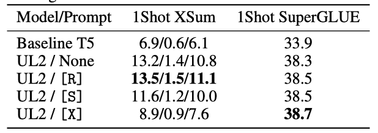

모드 전환 기능이 성능에 미치는 영향을 확인하기 위해 실험을 진행하였다. 실험 결과, 프롬프트의 사용이 모델 성능에 큰 영향을 미치며, 특히 XSum에서는 올바른 프롬프트 사용이 성능 차이를 48%까지 만들어내었다. 반면 SuperGLUE는 프롬프트에 덜 민감했지만, one-shot 평가에서는 프롬프트를 사용하는 것이 대체로 더 좋은 결과를 보여주었다.

### Mixture-of-Denoisers Ablations

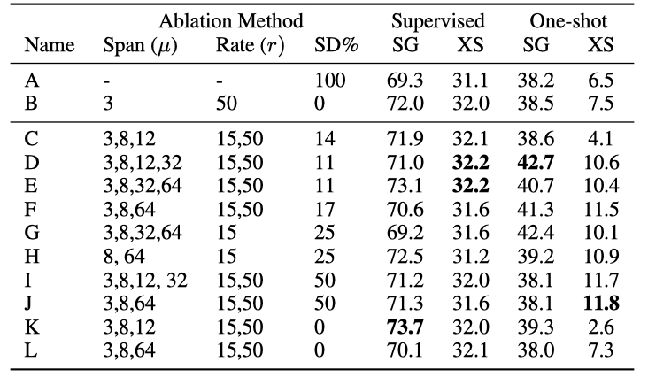

개별 목표의 효과성을 검증하기 위한 광범위한 실험을 실시하였다. 평균 범위와 손상률의 변화, 그리고 사용된 S-denoising의 비율(% SD)을 변화시켜 결과를 확인하였다. mixture 내의 denoiser의 총 수는 $∥ Span ∥ \times ∥ Corrupt Rate ∥ + 1$로 계산되며, 이러한 설정들은 Var-A부터 Var-J까지의 레이블로 표시되어 있다.

**X-Denoising is Complementarily Effective but Does Not Suffice as a Standalone** mixing Extreme Denoising이 효과적이며, 대부분의 최고 결과는 긴 범위를 가진 mixture에서 나왔다. 긴 범위를 사용하지 않는 경우와 비교했을 때, 긴 범위를 사용하는 것이 더 좋은 성능을 보였다. 그러나 긴 범위만을 사용하는 경우는 일반적으로 성능이 좋지 않았으며, 이는 Extreme Denoising이 단독으로는 충분하지 않음을 나타낸다. 이 결과는 이전 연구에서 50%의 손상률이 잘 작동하지 않음을 보여주는 점과 일치한다. 그러나 이 결과는 BERT 스타일의 masked language modeling 대신 inputs-to-targets 형태의 사전 학습을 사용하는 아키텍처와 약간 충돌한다.

**Small Amounts of S-Denoisers is Preferred** S-denoisers를 전체 MoD mixture의 50%로 확대하는 설정은 일반적으로 성능을 저하시킨다는 결론을 내렸다. 따라서 S-denoisers는 필요하지만, 작은 양(약 20%)이 선호된다. S-denoising이 전혀 없는 경우를 탐색해보았지만, 일부 작업에서는 성능이 향상되지만, 다른 작업에서는 크게 저하되는 것을 확인하였다. 이 결과로부터 S-denoising이 중요하다는 결론을 도출하였다.

### Modestly Scaling Model Size and Pretraining Data

모델 크기와 사전 학습 데이터셋 크기를 확대하여 추가 실험을 진행하였다. 이 실험에서는 UL2 encoder-decoder 모델을 약 1B 개의 parameter로 확대하고, 사전 학습 토큰의 수를 0.5조 개로 늘렸다. 이렇게 크게 확대된 설정에서도 UL2 모델은 여전히 경쟁력이 있었다. 주요 변화 중 하나는 UL2가 SuperGLUE 스위트를 포기하고, 대신 8개 작업 중 7개에서 성능을 능가하고, one-shot 평가에서 성능을 2-4배 향상시키는 결과를 보여주었다. 지도 미세 조정에서의 이익은 작지만 XSUM, SGD, TOT에서 눈에 띄게 나타났다.

---

## Scaling to 20B Parameters

확대된 설정에서 UL2를 평가하고자 한다. 이전 실험 결과를 바탕으로 encoder-decoder 아키텍처를 사용한다. UL2는 아키텍처에 중립적이지만, 본질적인 희소성 때문에 encoder-decoder 아키텍처 사용을 권장한다.

UL2를 약 200억 개의 parameter 규모에서 학습시켰다. 이 크기는 중간 규모의 모델로, UL2가 더 큰 규모에서도 작동할 수 있다는 것을 보여준다. 이 모델은 특정 제어나 완화 전략 없이 학습되었으며, 때때로 loss spike를 보였다. 그러나 이 모델을 사용한 많은 실험에서 state-of-the-art를 달성 하였으므로, 현재 결과가 모델의 진정한 잠재력을 과소평가한 것으로 보인다.

### Pretraining and Model Configuration

이전 실험과 동일한 프로토콜을 따라, C4 코퍼스에서 UL2를 사전 학습하였다. 이 때, 모델이 사전 학습 중에 보는 토큰의 수를 확대하였다. batch size는 1024, TPUv4 칩 512개를 사용하였고, 총 1 trillion 개의 토큰에 대해 약 한 달 이상 학습하였다. 이 모델은 32개의 encoder layer와 32개의 decoder layer를 가지며, 각 head는 총 16개이고 각각의 차원이 256이다. UL20B는 T5와 유사하지만, 목표와 스케일링 노브가 약간 다르며, 이 20B 모델의 체크포인트를 공개하고 오픈 소스화하였다.

### Experiments at 20B scale

UL20B 실험에 대한 실험 설정을 설명한다.

#### Setup and Implementation Details

미세 조정과 컨텍스트 내 학습에 대한 실험을 진행하였다. 지도 미세 조정은 일반적으로 5만에서 10만 사이의 사전 학습 단계 후에 이루어졌고, 각각의 downstream task에 대해 수동적으로 미세 조정하였다. 일부 작업은 모델이 아직 사전 학습 중일 때 미세 조정되었으며, 많은 작업은 공개한 수렴에 가까운 체크포인트에서 미세 조정되었다. 작업이 최고의 성능에 도달하면 컴퓨팅을 절약하기 위해 미세 조정을 중단하였다. 또한, 대규모 다중 작업 학습과 UL2의 결합은 미래의 작업으로 남겨두었다.

지도 미세 조정을 위해, Adafactor optimizer를 사용하고 학습률은 {$5 \times 10^−5, 1 \times 10^−4$}의 범위에서 설정하였다. optimizer의 상태를 재설정하고 실제 목표 토큰의 수에 기반한 손실 정규화를 적용하였다. batch size는 일반적으로 32에서 128의 범위였고, 미세 조정 성능에는 큰 영향을 미치지 않았다. 평가된 많은 작업들은 크게 조정되지 않고, 리더보드 제출 전에 한 두 번만 실행하였다.

#### Datasets for Supervised Finetuning

총 50개 이상의 자연어 처리(NLP) 작업을 고려한다. 작업의 분류는 일반적으로 유연하며, 일부 작업은 다른 분류 경계로 넘어갈 수 있다.

* **Language Generation** summarization과 data-to-text generation 작업에 대해 평가하며, 이를 위해 CNN/Dailymail, XSUM, MultiNews, SAMSum, WebNLG, E2E, 그리고 CommonGen 데이터셋을 사용한다. WebNLG, E2E, CommonGen의 경우, GEM 벤치마크 버전을 사용하였다.
* **Language Generation with Human Evaluation** GENIE 리더보드를 통한 인간 평가를 사용하여 aNLG, ARC-DA, WMT19, XSUM 등의 작업을 평가하였다.
* **Language Understanding, Classification and Question Answering** RACE, QASC, OpenBookQA, TweetQA, QuAIL, IMDB, Agnews, DocNLI, Adversarial NLI, VitaminC, Civil Comments, Wikipedia Toxicity detection 등의 데이터셋을 사용하여 독해, 질문 응답, 텍스트 분류, 자연어 추론 등의 작업을 수행한다. 또한, SuperGLUE와 GLUE 데이터셋도 활용하였다.
* **Commonsense Reasoning** HellaSwag, SocialIQA/SIQA, PhysicalIQA/PIQA, CosmosQA, AbductiveNLI, CommonsenseQA, 그리고 CommonsenseQA2 등의 데이터셋을 활용한다.
* **Long Range Reasoning** GovReport, SumScr, QMSUm, QASPER, NarrativeQA, QuaLITY, 그리고 ContractNLI 등 일곱 개의 구성 작업이 포함된 Scrolls 벤치마크를 사용한다.
* **Structured Knowledge Grounding** UnifiedSKG에서 WikiTQ, CompWQ, FetaQA, HybridQA, WikiSQL, TabFat, Feverous, SQA, MTOP, 그리고 DART 등의 작업을 사용한다. 평가 수행이 상대적으로 편리하고, 정확도나 완전 일치 같은 주요 메트릭을 사용하는 데이터셋을 선택하였다.
* **Information Retrieval** 차별화 가능한 검색 인덱스 설정을 사용하여 주어진 쿼리에 대해 관련 문서를 검색하는 IR 작업을 수행하며, 이는 최신의 차세대 IR 패러다임이다. 실험에서는 DSI 논문의 NQ 분할을 사용하였다.

각 데이터셋의 state-of-the-art를 보고하며, 생성 작업에 대해서는 ROUGE-2를, 나머지 데이터셋에 대해서는 이전 작업에서 사용된 주요 메트릭을 보고한다. BLEU 점수에 대해서는 sacrebleu를 사용하며, 외부 지식 기반을 사용하는 상식 추론 작업과는 비교하지 않는다. GLUE는 일반적으로 포화 상태로, 많은 미발표 결과가 있으므로, 우리는 T5 모델 이후 실제로 큰 진전이 없었다고 판단하여 state-of-the-art로 간주한다.

가능한 한 모든 리더보드에 점수를 제출하려 노력하지만, 노동 비용이 과도하게 높은 경우나, 기존 state-of-the-art 접근법이 개발 점수를 제공하거나, 특정 데이터셋에 대한 보고가 완전성을 위한 것인 경우에는 제출하지 않는다. 리더보드에서 보고할 때에는 가장 높은 성능을 보인 출판된 작업을 state-of-the-art로 간주하며, 익명의 제출이 더 높은 점수를 받았을 수도 있다는 것을 표시한다. 최종 시퀀스 길이를 늘리는 것이 점수를 상당히 향상시킬 것으로 예상되지만, 물류와 시간표 상의 이유로 이는 미래의 작업에 맡긴다.

#### Summary of Supervised Finetuning Results

실험 결과에 대한 개요를 설명한다.

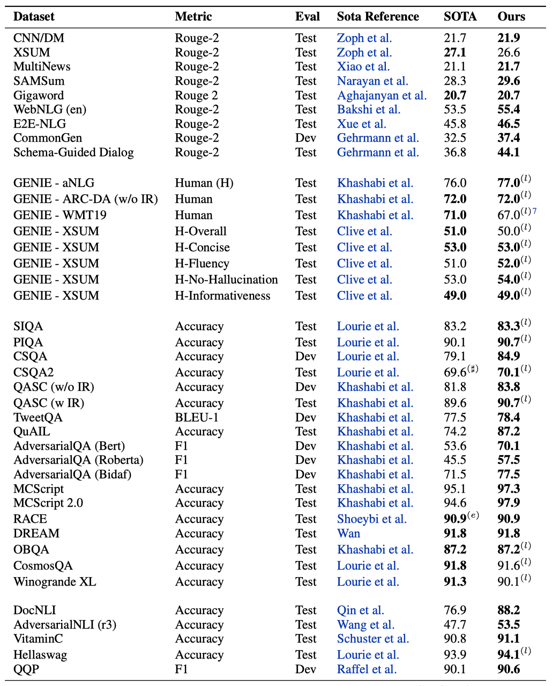

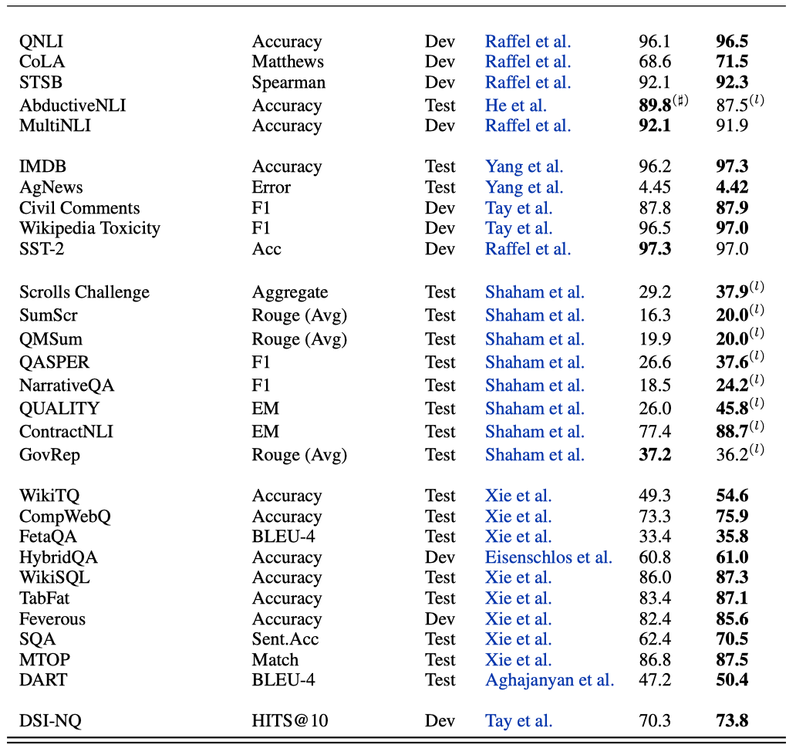

#### Results on Supervised Finetuning

실험 결과, UL2는 50개 이상의 NLP 작업에서 state-of-the-art를 달성하였다. 성능 차이는 크게 나타났으며, UL2가 state-of-the-art를 달성하지 못한 경우에도 경쟁력이 있었다. 각 벤치마크에서 state-of-the-art를 얻는 난이도는 크게 다르며, 일부 벤치마크에서는 이미 큰 모델이 state-of-the-art를 보이고 있어 능가하는 것이 쉽지 않았다. UL2 20B는 GENIE 작업에서 인간 평가에서도 우수한 성과를 보였으며, 이는 UL2의 생성 품질이 탄탄하다는 것을 입증한다.

#### Tradeoffs between Finetuning and Prompt-based Zero-shot Learning (SuperGLUE)

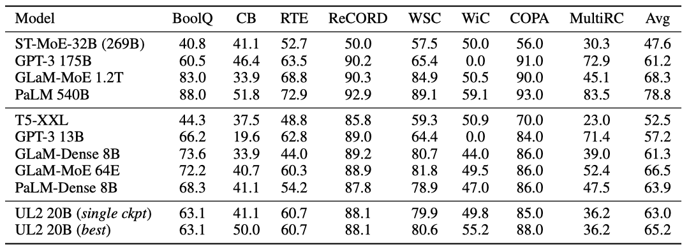

SuperGLUE 벤치마크에서 미세조정과 in-context 학습의 상충 관계를 연구한다. UL20B를 사용한 실험 결과, state-of-the-art를 달성하지 못했지만, T5-11B를 능가하는 경쟁력을 유지하였다. 하지만, 매개변수가 200B+ 이상인 ST-MoE-32B 모델에 비해 아직 뒤쳐진다. 이는 ST-MoE-32B가 특정 아키텍처를 사용하여 학습되고 있으며, 이 아키텍처가 NLU 미세조정에 매우 유리하기 때문이다.

#### Generative Few-shot: XSUM Summarization

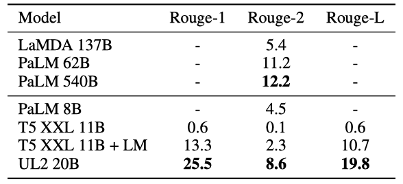

XSum 데이터셋을 사용해 few-shot in-context one-shot 학습을 추가로 실시하였다. 기존 모델들과 비교했을 때, UL2 20B의 성능은 LM Adaptation을 적용한 T5 XXL 모델의 성능의 약 3배였으며, LaMDA 137B를 능가하고 PaLM 8B의 성능의 거의 두 배에 가까웠다. 그러나 가장 좋은 결과는 여전히 큰 PaLM 모델들에서 나왔다.

---

## Conclusion

보편적으로 효과적인 모델을 학습시키는 새로운 패러다임, UL2를 제안하였다. 이는 여러 사전 학습 작업을 다양화하고 섞는 Mixture of Denoisers (MoD) 사전학습과 downstream 작업 동작을 upstream 사전학습과 연결하는 mode switching 방법을 특징으로 한다. UL2는 다양한 지도 학습 및 few-shot 작업에서 GPT와 T5 모델을 일관되게 능가하였고, 50개 이상의 NLP 작업에서 state-of-the-art를 달성하였다.

---

## Reference

* [Paper](https://arxiv.org/pdf/2205.05131v1.pdf)
* [Github](https://github.com/google-research/google-research/tree/master/ul2)