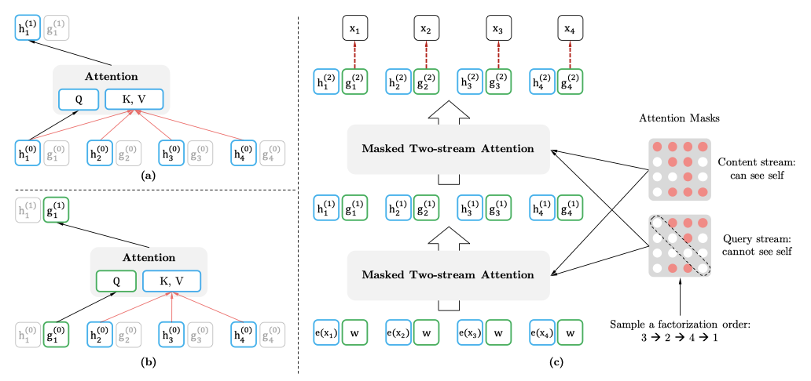
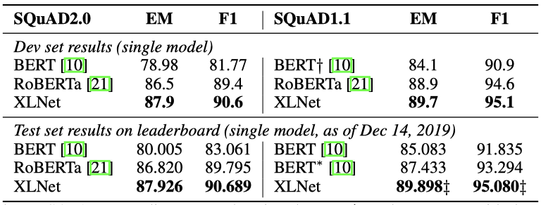
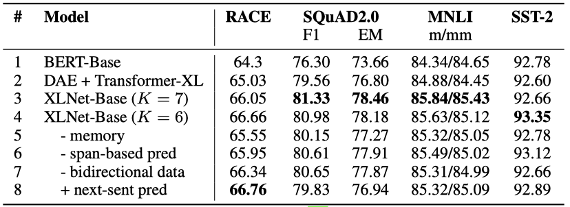

+++
author = "Kurt"
title = "XLNet"
date = "2023-12-10"
description = "Generalized Autoregressive Pretraining for Language Understanding"
categories = [
    "Paper Review"
]
tags = [
    "NLP",
]
+++

## Abstract

BERT와 같은 denoising autoencoding 기반 사전 학습은 양방향 컨텍스트를 학습할 수 있지만, 마스크를 사용하여 입력을 변조함으로써 의존성을 무시하고 사전 학습과 미세 조정 사이의 괴리를 겪는다. 이를 해결하기 위해, XLNet이라는 새로운 사전 학습 방법을 제안한다. 이 방법은 모든 순열에 대한 기대 가능도를 최대화하여 양방향 컨텍스트를 학습하고, autoregressive 형식을 통해 BERT의 제한을 극복한다. 실험결과 XLNet은 여러 작업에서 BERT를 능가하는 결과를 보여주었다.

---

## Introduction

자연어 처리 분야에서 Unsupervised representation learning은 큰 성공을 거두었다. 이 방법은 대규모의 레이블이 없는 텍스트 코퍼스에서 신경망을 사전 학습하고, 이를 특정 작업에 맞게 미세 조정하는 방식이다. 이에 대한 연구 중, autoregressive(AR)와 autoencoding(AE)이 가장 좋은 결과를 보여주었다.

AR 언어 모델링은 텍스트 시퀀스의 확률 분포를 추정하기 위해 autoregressive 모델을 사용한다. 텍스트 시퀀스 $x = (x_1, ..., x_T)$가 주어지면, AR 언어 모델링은 가능성을 순방향 곱인 $p(x) = \prod_{t=1}^T p(x_t | X_{<t})$ 또는 역방향 곱인 $p(x) = \prod_{t=T}^1 p(x_t | X_{>t})$로 분해하며, 각 조건부 분포를 모델링하기 위해 신경망 같은 매개변수 모델을 훈련한다. 그러나 AR 언어 모델은 단방향 컨텍스트만 인코딩하므로 깊은 양방향 컨텍스트를 모델링하는데는 비효율적이다. 이는 언어 이해 작업에서 필요한 양방향 컨텍스트 정보와의 간극을 만든다.

AE 기반 사전 학습, 예를 들면 BERT는 손상된 입력에서 원본 데이터를 재구성하는 것을 목표로 한다. 입력 토큰의 일부가 [MASK] 같은 특수 기호로 대체되고, 이를 원래 토큰으로 복구하도록 모델이 학습된다. BERT는 양방향 컨텍스트를 사용해 재구성할 수 있으므로, AR 언어 모델링의 양방향 정보 간극을 해결하고 성능을 향상시킬 수 있다. 하지만, BERT가 사전 훈련 중에 사용하는 인위적인 기호들은 미세 조정 시 실제 데이터에는 존재하지 않아, 사전 학습과 미세 조정 사이의 불일치를 초래하며, 예측된 토큰 간의 상호 의존성을 과도하게 단순화한다.

XLNet은 AR 언어 모델링과 AE의 장점을 모두 활용하면서 단점은 피하는 generalized autoregressive 방법이다.

* XLNet은 고정된 순방향이나 역방향 분해 순서를 사용하는 대신, 모든 가능한 분해 순서의 순열에 대한 시퀀스의 기대 log-likelihood를 최대화한다. 이로 인해 각 위치의 컨텍스트는 왼쪽과 오른쪽의 토큰들로 구성될 수 있으며, 모든 위치의 컨텍스트 정보를 활용하며 양방향 컨텍스트를 포착한다.
* XLNet은 generalized AR 언어 모델로서, 데이터 손상에 의존하지 않아 BERT의 사전 학습과 미세 조정 간의 불일치 문제를 겪지 않는다. 또한, autoregressive 목표는 예측된 토큰의 joint probability를 분해하는데 곱셈 규칙을 사용하므로, BERT의 독립 가정을 제거한다.

추가적으로, XLNet은 사전 학습을 위한 architecture design을 개선하였다.

* XLNet은 Transformer-XL의 segment recurrence mechanism과 relative encoding scheme를 사전 학습에 통합하여, 긴 텍스트 시퀀스를 다루는 작업의 성능을 향상시켰다.
* Transformer-XL architecture를 naive하게 적용하는 것은 어렵기 때문에, Transformer-XL network를 reparameterize해서 사용하였다.

같은 실험 환경에서, XLNet은 언어 이해, 읽기 이해, 텍스트 분류, 문서 랭킹 등 다양한 작업에서 BERT를 능가하는 성능을 보여주었다.

### Related Work

순열 기반 AR 모델링은 이전에도 연구되었지만, XLNet은 언어 모델이 양방향 컨텍스트를 학습하는 것을 목표로 하고, 이를 위해 two-stream attention을 통해 목표 위치를 hidden state에 통합한다. 이전 모델들과는 다르게, "순서 없음"은 입력 시퀀스가 무작위로 순열될 수 있다는 의미가 아니라, 모델이 분포의 다양한 분해 순서를 허용한다는 것을 의미한다.

다른 관련 아이디어로는 텍스트 생성에서 autoregressive denoising을 수행하는 것이 있다. 이 방법은 고정된 순서만을 고려하고 있다.

---

## Proposed Method

### Background

전통적인 AR 언어 모델링과 BERT를 비교하며, 텍스트 시퀀스가 주어지면 AR 언어 모델링은  forward autoregressive factorization을 통해 likelihood를 최대화하여 사전 학습을 수행한다:

$$ \underset{\theta}{max} \quad log \ p_{\theta}(x) = \sum_{t=1}^{T} log \ p{\theta}(x_t | x < t) = \sum_{t=1}^{T} log \ {{exp(h_{\theta}(x_{1:t-1})^\intercal e(x_t))}\over{\sum_{x'} exp(h_{\theta}(x_{1:t-1})^\intercal e(x'))}} $$

$h_θ(x_{1:t−1})$는 RNN이나 Transformer와 같은 신경 모델로 생성된 컨텍스트 표현이며, $e(x)$는 $x$의 임베딩이다. 반면에, BERT는 노이즈 제거 자동 인코딩에 기반하며, 텍스트 시퀀스 $x$의 일부 토큰을 특수 심볼 [MASK]로 바꿔 손상된 버전 $x$를 만든다. 이후의 훈련 목표는 $x$로부터 마스크된 토큰을 재구성하는 것이다.

$$ \underset{\theta}{max} \quad log \ p_{\theta}(\bar{x}|\hat{x}) \approx \sum_{t=1}^{T} m_t \ log \ p{\theta}(x_t | \hat{x}) = \sum_{t=1}^{T} m_t \ log \ {{exp(H_{\theta}(\hat{x})^\intercal_t e(x_t))}\over{\sum_{x'} exp(H_{\theta}(\hat{x})^\intercal_t e(x'))}} $$

$m_t = 1$은 $x_t$가 마스크되었음을 나타내며, $H_{\theta}$는 텍스트 시퀀스 $x$를 숨겨진 벡터의 시퀀스로 변환하는 Transformer이다. 두 사전 학습 목표의 장단점은 다음에서 비교된다:

* **Independence Assumption**: BERT는 모든 마스크된 토큰이 독립적으로 재구성된다는 가정 하에 결합 조건 확률 $p(\bar{x}|\hat{x})$을 분해한다. 반면, AR 언어 모델링은 독립 가정 없이 곱셈 법칙을 사용하여 확률 $p_{\theta}(x)$을 분해한다.
* **Input noise**: BERT의 입력에는 [MASK]와 같은 인공적인 심볼이 포함되어 있어 사전 학습과 미세 조정간의 불일치가 발생한다. [MASK]를 원래 토큰으로 대체해도 문제가 해결되지 않는다. 반면, AR 언어 모델링은 입력 손상에 의존하지 않아 이 문제가 없다.
* **Context dependency**: AR 표현 $h_θ(x_{1:t−1})$은 위치 $t$까지의 토큰에만 의존하는 반면, BERT 표현은 양쪽의 문맥 정보에 접근할 수 있다. 따라서, BERT는 양방향 문맥을 더 잘 포착하도록 사전 학습된다.

### Objective: Permutation Language Modeling

orderless NADE에서 아이디어를 차용하여, AR 모델의 장점을 유지하면서 양방향 문맥을 포착하는 순열 언어 모델링을 제안한다. 모델 파라미터가 모든 분해 순서에 공유되면, 모델은 양쪽 모든 위치에서 정보를 수집하도록 학습할 수 있다.

길이가 $T$인 인덱스 시퀀스의 모든 가능한 순열 집합을 $Z_T$라고 할때, $z_t$와 $z < t$는 순열 $z$의 $t$번째 요소와 첫 $t−1$개 요소를 나타낸다. 그러면, 순열 언어 모델링 목표는 다음과 같이 표현될 수 있다:

$$ \underset{\theta}{max} \quad \mathbb{E_{\mathbf{z} \sim \mathbf{Z_T}}} \big[ \sum_{t=1}^{T} \ log \ p{\theta}(x_{z_t} | x_{z_{<t}}) \big]  $$

텍스트 시퀀스 $x$에 대해, 인수분해 순서 $z$를 샘플링하고, 이 순서에 따라 가능성 $p_{\theta}(x)$을 분해한다. 모델 파라미터가 모든 인수분해 순서에 공유되므로, $x_t$는 시퀀스 내의 모든 가능한 요소를 볼 수 있어 양방향 문맥을 포착할 수 있다. 또한, AR 프레임워크에 적합하여 독립 가정과 사전 학습-미세조정 차이를 피할 수 있다.

### Remark on Permutation

인수분해 순서만을 바꾸며, 시퀀스 순서는 그대로 유지한다. 원래 시퀀스에 대응하는 positional encoding을 사용하고, Transformer의 적절한 attention mask를 활용한다. 이 방법은 모델이 미세 조정 동안 자연스러운 순서의 텍스트 시퀀스를 만나기 때문에 필요하다.

---

## Architecture: Two-Stream Self-Attnetion for Target-Aware Representations

순열 언어 모델링 목표는 원하는 속성을 가지지만, 표준 Transformer 파라미터화를 사용한 단순한 구현은 문제가 있다. Softmax를 사용하여 다음 토큰 분포를 파라미터화하면:

$$ p_{\theta}(X_{z_t} = x | x_{z_{< t}}) = {{exp(e(x)^\intercal h_{\theta}(x_{z_t}))}\over{\sum_{x'} exp(e(x')^\intercal h_{\theta}(x_{z_t})}} $$

예측할 위치에 따라 표현이 달라지지 않는다. 이로 인해 대상 위치에 상관없이 동일한 분포가 예측되어 유용한 표현을 학습할 수 없다. 이 문제를 해결하기 위해, 다음 토큰 분포를 대상 위치를 인식하도록 re-parameterize 하는 것을 제안한다:

$$ p_{\theta}(X_{z_t} = x | x_{z_{< t}}) = {{exp(e(x)^\intercal g_{\theta}(x_{z_t}, z_t))}\over{\sum_{x'} exp(e(x')^\intercal g_{\theta}(x_{z_t}, z_t)}} $$

$g_{\theta}(x_{z_t}, z_t)$는 대상 위치 $z_t$를 입력으로 추가로 받는 새로운 유형의 표현을 나타낸다.

### Two-Stream Self-Attention

target-aware representation의 개념은 대상 예측의 불명확성을 제거하지만, $g_{\theta}(x_{z_t}, z_t)$를 어떻게 형성할 것인지는 복잡한 문제이다. 대상 위치에서 정보를 수집하는 것을 제안하며, 이를 위해 두 가지 요구사항이 필요하다: 

* 토큰 $x_{z_t}$를 예측하기 위해, $g_{\theta}(x_{z_{<t}}, z_t)$는 위치 $z_t$만 사용하고 내용 $x_{z_t}$는 사용하지 않아야 한다.
* 다른 토큰 $x_{z_j}$를 예측하기 위해 $(j > t)$, $g_{\theta}(x_{z_{<t}}, z_t)$는 전체 컨텍스트 정보를 제공하기 위해 내용 $x_{z_t}$도 인코딩해야 한다.

이 모순을 해결하기 위해, 하나 대신 두 세트의 숨겨진 표현을 사용한다.

* content representation $h_{\theta}(x_{z_{<t}})$는 컨텍스트와 $x_{z_t}$ 자체를 인코딩하는 Transformer의 standard hidden states와 유사한 역할을 한다.
* query representation $g_{\theta}(x_{z_t}, z_t)$는 컨텍스트 정보와 위치에만 접근할 수 있으며, 내용 $x_{z_t}$에는 접근할 수 없다.

첫번째 layer query stream은 학습 가능한 벡터로 초기화된다. (i.e $\ g^{(0)}_i = w$)
반면에 content stream은 해당 단어 임베딩으로 설정된다. (i.e $\ h^{(0)}_i = e(x_i)$) 
self-attention layer $m = 1, ..., M$에 대해, two-streams의 표현은 공유된 파라미터 세트로 다음과 같이 업데이트된다.

$$ g_{z_t}^{(m)} \leftarrow Attention(Q = g_{z_t}^{(m-1)}, KV = h_{z_{<t}}^{(m-1)}; \theta) $$
$$ h_{z_t}^{(m)} \leftarrow Attention(Q = h_{z_t}^{(m-1)}, KV = h_{z_{\leq t}}^{(m-1)}; \theta) $$

여기서 Q, K, V는 attention 연산에서의 query, key, value를 나타낸다. content representation의 업데이트 규칙은 standard self-attention과 같으므로, 미세 조정 중에 query stream을 중단하고 content stream을 일반 Transformer-XL로 사용할 수 있다. last-layer query representation $g_{z_t}^{(m)}$를 사용하여 $p_{\theta}(X_{z_t} = x | x_{z_{< t}})$를 계산할 수 있다.

### Partial Prediction

순열 언어 모델링은 여러 이점이 있지만, 순열로 인해 최적화가 어려워 수렴이 느리다. 이를 해결하기 위해, 분해 순서에서 마지막 토큰만 예측하도록 선택하였다. 즉, 전체를 목표가 아닌 부분과 목표 부분으로 나누고, 목표가 아닌 부분에 따른 목표 부분의 log-likelihood를 최대화한다.

$$ \underset{\theta}{max} \quad \mathbb{E_{\mathbf{z} \sim \mathbf{Z_T}}} \big[ log \ p{\theta}(x_{z_{>c}} | x_{z_{\geq t}}) \big] = \mathbb{E_{\mathbf{z} \sim \mathbf{Z_T}}} \big[ \sum_{t=c+1}^{|z|} \ log \ p{\theta}(x_{z_t} | x_{z_{< t}}) $$

분해 순서에 따라 가장 긴 컨텍스트를 가진 부분이 목표로 선택되며, hyperparameter $K$는 약 $1/K$ 토큰이 예측에 선택되도록 사용된다. (i.e $|z| / (|z| - c) \approx K$) 선택되지 않은 토큰들의 query representation을 계산할 필요가 없어, 메모리를 아끼고 속도를 향상시킬 수 있다.

### Incorporating Ideas from Transformer-XL

Transformer-XL의 relative positional encoding scheme과 segment recurrence mechasnism을 통합하였으며, 이를 통해 모델이 이전 세그먼트의 hidden state를 재사용하게 할 수 있다. 긴 시퀀스에서 두 세그먼트를 가지고, 첫 번째 세그먼트를 처리한 후 얻은 내용을 캐시하고, 다음 세그먼트에 대해 attention을 업데이트한다.

$$ h_{z_t}^{(m)} \leftarrow Attention(Q = h_{z_t}^{(m-1)}, KV = \big[ \tilde{h}^{(m-1)}, h_{z_{\leq t}}^{(m-1)} \big]; \theta) $$

positional encoding은 원래 시퀀스의 실제 위치에만 의존하므로, 얻어진 표현이 있으면 attention 업데이트는 순열에 독립적이다. 이를 통해 이전 세그먼트의 분해 순서를 알지 못해도 메모리를 캐시하고 재사용할 수 있다. 모델은 마지막 세그먼트의 모든 분해 순서에 대해 메모리를 활용하는 방법을 학습하며, query stream도 같은 방식으로 계산된다.

### Modeling Multiple Segments

다양한 작업에서 여러 입력 세그먼트가 필요하다. XLNet의 사전 학습 과정에서는 이를 고려하여 두 세그먼트를 무작위로 샘플링하고, 이를 하나의 시퀀스로 연결하여 순열 언어 모델링을 수행한다. 동일한 문맥에서만 메모리를 재사용하며, 이 과정은 BERT의 입력 형식 [CLS, A, SEP, B, SEP]을 따른다. 그러나 XLNet-Large는 일관된 성능 향상을 보이지 않아 다음 next sentence prediction를 사용하지 않습니다.

### Relative Segment Encodings

구조적으로, BERT와 달리 XLNet은 Transformer-XL의 relative encoding 개념을 확장하여 세그먼트를 인코딩한다. 두 위치가 같은 세그먼트에 있는지 여부만 고려하여, 세그먼트 인코딩을 이용해 attention 가중치를 계산한다. relative segment encoding을 사용하면 일반화를 개선하고 두 개 이상의 입력 세그먼트를 가진 작업에서 미세 조정할 수 있는 가능성이 있다.

### Discussion

BERT와 XLNet 모두 일부 토큰만 예측하는 부분적 예측을 수행한다. 이는 의미 있는 예측을 위해 필요하며, 충분한 문맥을 가진 토큰만 예측함으로써 최적화의 어려움을 줄인다. 그러나 BERT는 대상 간의 종속성을 모델링할 수 없다.

BERT와 XLNet의 차이점을 이해하기 위해 예시 [New, York, is, a, city]에 대해 비교 해 보면, 예시에서 [New, York] 두 개의 token을 예측하고 $log \ p(\text{New York} | \text{is a city})$를 maximize한다고 가정한다. 또한, XLNet의 인수분해 순서는 [is, a, city, New, York]이라고 가정한다. BERT와 XLNet의 object는 다음과 같다. 

$$ \mathbf{J}_{BERT} = log \ p(\text{New} | \text{is a city}) + log \ p(\text{York} | \text{is a city}) $$ 

$$ \mathbf{J}_{XLNet} = log \ p(\text{New} | \text{is a city}) + log \ p(\text{York} | \text{New, is a city}) $$

XLNet은 BERT가 생략하는 'New'와 'York' 사이의 종속성을 포착할 수 있다. 동일한 대상이 주어진 상황에서 XLNet은 더 많은 종속성 쌍을 학습하며, 더 밀도 높은 훈련 신호를 포함하고 있다.

---

## Experiments

### Pretraining and Implementation

BooksCorpus와 영어 Wikipedia를 사전 학습 데이터로 사용하고, 추가로 Giga5, ClueWeb 2012-B, 그리고 Common Crawl을 포함시켰다. 이 데이터들은 공격적인 필터링을 통해 짧거나 저품질의 기사를 제거한 후, 총 32.89B의 subword pieces로 토큰화하였다.

XLNet-Large 모델은 BERT-Large와 같은 아키텍처를 가지고 있다. 사전 학습 동안 시퀀스 길이 512를 사용하였고, BERT와 비교하기 위해 BooksCorpus와 위키백과만을 이용해 훈련을 진행하였다. 그 후, 앞서 설명한 모든 데이터셋을 사용해 훈련을 확장하였고, 마지막으로, XLNet-Base-wikibooks를 기반으로 ablation study를 수행하였다.

recurrence mechanism이 도입된 XLNet-Large 학습에서는 양방향 데이터 입력 파이프라인을 사용하고, 전방향과 후방향이 각각 배치 크기의 절반을 차지한다. prediction constant $K$는 6으로 설정되었으며, 미세 조정 절차는 BERT를 따른다. 추가로, 특정 길이의 토큰을 예측 대상으로 선택하는 span-based 예측 방법을 사용하였다.

### Fair Comparison with BERT

같은 데이터와 하이퍼파라미터로 훈련된 XLNet은 모든 고려된 데이터셋에서 BERT를 크게 앞서는 것으로 나타났다.

### Comparison with RoBERTa: Scaling Up

ALBERT는 계산량을 크게 증가시키므로 과학적 결론을 도출하기 어려워, 다음 결과에서 제외되었다. 반면, RoBERTa는 전체 데이터를 기반으로 하고, RoBERTa의 하이퍼파라미터를 재사용하는 실험을 진행하였다.

XLNet은 일반적으로 BERT와 RoBERTa를 능가하는 성능을 보여주었다.

* SQuAD와 RACE와 같이 더 긴 컨텍스트를 다루는 명확한 추론 작업에 대해, XLNet의 성능 향상이 더 크다. 이러한 더 긴 컨텍스트를 다루는 능력은 XLNet의 Transformer-XL 기반 구조에서 나올 수 있다.
* MNLI(>390K), Yelp(>560K), Amazon(>3M)과 같이 이미 충분한 예제가 있는 분류 작업에 대해서도, XLNet은 큰 성능 향상을 보여주었다.

---

## Ablation Study

다양한 특성을 가진 네 가지 데이터셋을 기반으로 각 설계 선택의 중요성을 이해하기 위한 ablation study를 수행한다. 구체적으로, 연구하고자 하는 세 가지 주요 측면으로는 다음과 같다:

* 순열 언어 모델링 목표의 효과, 특히 BERT에서 사용하는 denoising auto-encoding 목표와 비교
* Transformer-XL을 백본 아키텍처로 사용하는 것의 중요성
* 범위 기반 예측, 양방향 입력 파이프라인, 그리고 다음 문장 예측을 포함한 일부 구현 세부사항의 필요성

다양한 구현 세부 사항을 가진 6개의 XLNet-Base 변형, 원래의 BERT-Base 모델, 그리고 BERT에서 사용된 denoising auto-encoding 목표로 훈련된 Transformer-XL 기준선을 비교한다. 모든 모델은 공평한 비교를 위해 BERT-Base와 동일한 모델 hyperparameter를 가진 12-layer 아키텍처를 기반으로 하며, Wikipedia와 BooksCorpus에서만 학습하였다.

Transformer-XL과 순열 언어 모델링이 XLNet의 성능 향상에 크게 기여한다는 것을 알 수 있다. 메모리 캐싱 메커니즘을 제거하면 성능이 특히 떨어지며, 범위 기반 예측과 양방향 입력 파이프라인이 중요한 역할을 한다. 또한, BERT에서 제안된 다음 문장 예측 목표가 반드시 성능 향상을 가져오지 않으므로, 이를 XLNet에서 제외하였다.

---

## Conclusions

XLNet은 AR과 AE 방법의 이점을 결합하는 순열 언어 모델링을 사용하는 사전 학습 방법이다. Transformer-XL을 통합하고 two-stream attention mechanism을 설계하여 AR 목표와 원활하게 작동하도록 하였다. XLNet은 다양한 작업에서 이전 사전 학습 방법들 보다 큰 성능 개선을 보여주었다.

---

## Reference

* [Paper](https://arxiv.org/abs/1906.08237)
* [Github](https://github.com/zihangdai/xlnet)